# 人工智能

## 一、人工智能概述
### 1.1 人工智能的定义、目标与流派
### 1.2 发展简史：推理期、知识期、学习期、大模型时代

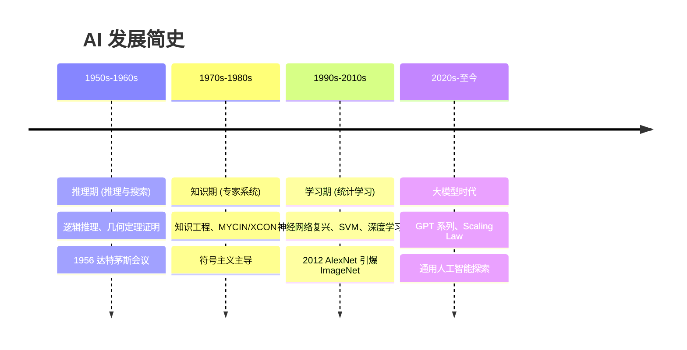
### 1.3 三大学派：符号主义、连接主义、行为主义

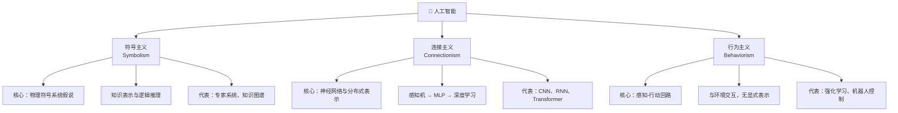
### 1.4 智能体模型：PEAS 描述、理性智能体、环境特性分类

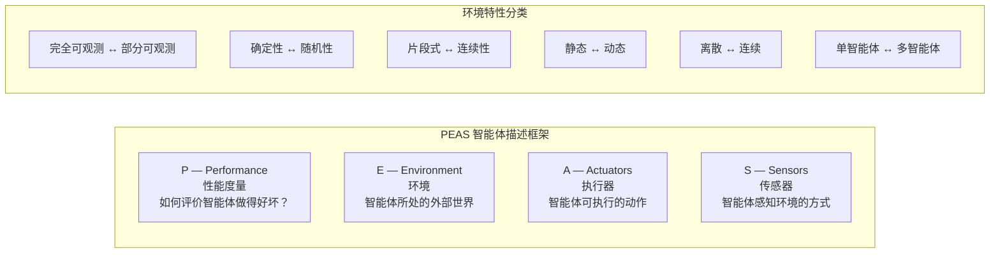
### 1.5 图灵测试、中文屋与智能度量
### 1.6 主要应用领域与产业现状

## 二、问题求解与搜索策略
### 2.1 问题形式化：状态空间图、问题的形式化表示
- **问题形式化的五要素**：一个问题可以用五个要素形式化定义——
    - ① **初始状态 (Initial State)**：智能体出发时所在的状态；
    - ② **动作 (Actions)**：在每个状态 `s` 下可执行的动作集合 `ACTIONS(s)`；
    - ③ **转移模型 (Transition Model)**：执行动作 `a` 后从状态 `s` 转移到后继状态 `s'` 的描述，即 `RESULT(s, a) = s'`，也称为**后继函数**；
    - ④ **目标测试 (Goal Test)**：判断当前状态是否为目标状态（可以是显式状态集合或隐式条件判断）；
    - ⑤ **路径代价函数 (Path Cost Function)**：为每条路径分配一个数值代价，通常为各步代价之和 `g(path) = Σ cost(s_i, a_i, s_{i+1})`，求解目标是找到总代价最小的解。

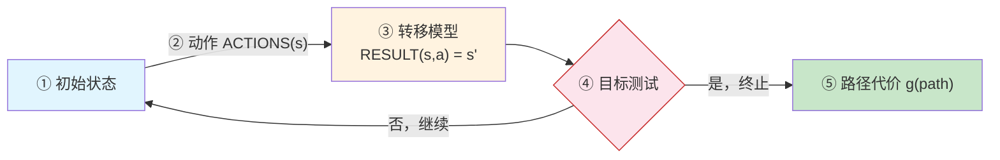
- **状态空间图 (State Space Graph)**：将问题空间中所有可能状态及其转移关系抽象为图结构——节点表示状态，有向边表示动作——该图在搜索前即已隐含存在，实际的搜索过程是在图上探寻路径。
- **搜索树 (Search Tree)**：从初始状态出发，依据动作展开后继节点所形成的树结构。搜索树在探索过程中逐步构建，其节点可能对应相同的状态（状态重复），状态空间图是唯一的，而搜索树依赖于搜索策略。

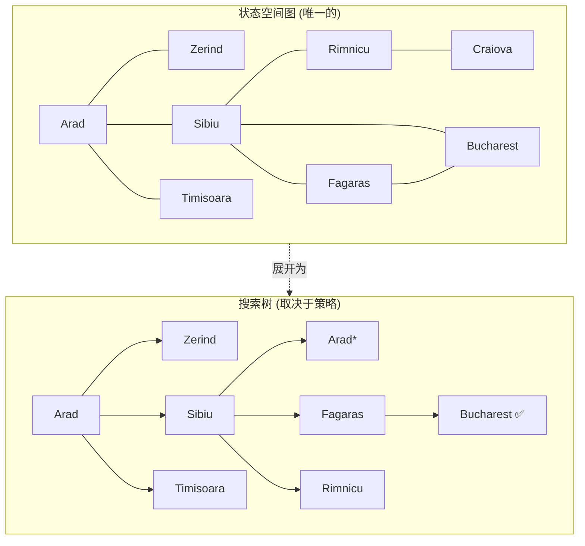

> 状态空间图是问题固有的结构，搜索树则是算法在探索过程中逐步构建的——同一状态可能在树中出现多次（如 Arad*）。
- **良好定义的问题**：当一个问题的初始状态、动作集合、转移模型、目标测试和路径代价函数均被明确指定时，称为**良定义问题 (Well-Defined Problem)**。解决方案是从初始状态到目标状态的一组动作序列。
- **抽象 (Abstraction)**：问题形式化的关键在于去除与现实无关的细节，保留对求解有影响的核心要素——这是简化复杂现实、使搜索可行的关键步骤。一个好的抽象层次应满足：被移除的细节不影响解的合法性，且抽象后得到的动作应易于执行。
- **经典示例**：
    - *八数码问题*：状态为 3×3 棋盘上 8 个数字方块与一个空格的排列，动作为空格上下左右移动，目标为棋子的特定排列；
    - *真空吸尘器世界*：两个房间、吸尘器位置与房间清洁状态的组合构成状态空间；
    - *路径规划问题*：状态为地图上的位置，动作为移动到相邻城市，路径代价为距离。

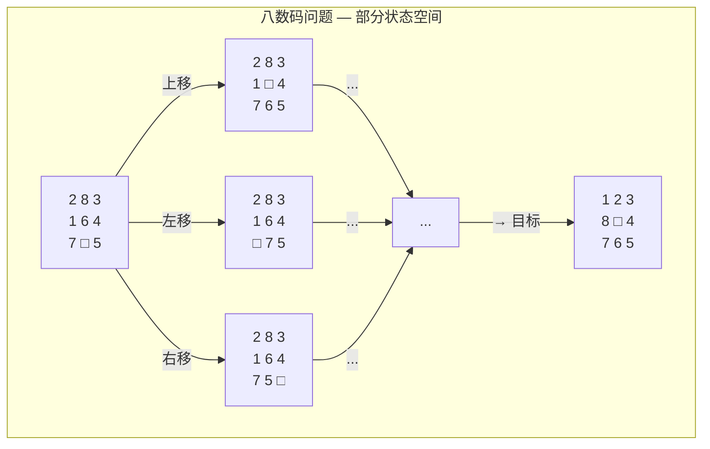
- **问题求解性能的度量**：
    - **完备性 (Completeness)**：如果有解，算法是否保证找到解？
    - **最优性 (Optimality)**：找到的解是否代价最小？
    - **时间复杂度 (Time Complexity)**：搜索所需时间（通常以搜索过程中产生的节点数衡量）；
    - **空间复杂度 (Space Complexity)**：算法运行所需的最大内存。
- **搜索策略分类**：
    - **无信息搜索 (Uninformed/Blind Search)**：仅使用问题定义本身的信息，不借助额外领域知识；
    - **有信息搜索 (Informed/Heuristic Search)**：利用启发式函数评估节点到目标的距离，选择更有希望的路径。
### 2.2 无信息搜索：广度优先、深度优先、一致代价搜索
- **无信息搜索 (Uninformed Search)** 又称为**盲目搜索 (Blind Search)**，只使用问题定义中可用的信息，不借助任何外部领域知识。搜索策略仅依赖于已扩展节点的顺序，而无信息搜索的核心区别在于使用何种数据结构（队列 vs 栈 vs 优先队列）来维护**边缘节点 (Frontier / Fringe)**。
- **广度优先搜索 (Breadth-First Search, BFS)**：
    - **核心思想**：先扩展根节点，再扩展根节点的所有后继，依此类推，逐层推进。使用 **FIFO 队列** 作为边缘；
    - **节点生成顺序**：从浅到深，从深度的第 `d` 层依次展开至第 `d+1` 层；
    - **算法复杂度**：时间 `O(b^d)`，空间 `O(b^d)`——对浅层问题可行，对大深度问题内存爆炸；
    - **性质**：完备（若 `b` 有限且路径深度有限），**等代价下最优**（step cost 相同时），不等代价时不一定最优。
- **深度优先搜索 (Depth-First Search, DFS)**：
    - **核心思想**：每步优先扩展当前搜索树中最深的节点，一路到底再回溯。使用 **LIFO 栈**（或递归调用）；
    - **算法复杂度**：时间 `O(b^m)`（`m` 为最大深度），空间 `O(bm)`——内存优势显著，仅需存储一条路径；
    - **性质**：**不完备**——无限深分支会导致陷入死循环（可通过深度限制避免）；**非最优**；
    - **深度限制搜索 (DLS)**：为 DFS 设置最大深度 `ℓ`，解决了无限深路径问题；
    - **迭代加深搜索 (IDS)**：将 DLS 与 BFS 结合——逐步增大深度限制，每次从初始状态重新搜索。兼具 BFS 的完备性与 DFS 的空间效率，时间 `O(b^d)`，空间 `O(bd)`。
- **一致代价搜索 (Uniform-Cost Search, UCS)**：
    - **核心思想**：优先扩展**路径代价 `g(n)` 最小**的节点，使用**优先队列**（如最小堆）管理边缘；
    - **本质**：UCS 是 BFS 在不等代价下的推广——当每步代价相等时，UCS 退化为 BFS；
    - **性质**：完备且最优（只要每步代价 > 0），时间和空间均为 `O(b^{1+⌊C*/ε⌋})`，其中 `C*` 为最优解的代价，`ε` 为最小步代价。
- **无信息搜索总结（设分支因子 `b`，最浅目标深度 `d`，最大深度 `m`）**：

| 算法 | 完备性 | 最优性 | 时间复杂度 | 空间复杂度 |
|:---|:---:|:---:|:---|:---|
| BFS | ✅ | 等代价下 ✅ | `O(b^d)` | `O(b^d)` |
| DFS | ❌ | ❌ | `O(b^m)` | `O(bm)` |
| DLS | ❌ | ❌ | `O(b^ℓ)` | `O(bℓ)` |
| IDS | ✅ | 等代价下 ✅ | `O(b^d)` | `O(bd)` |
| UCS | ✅ | ✅ | `O(b^{1+⌊C*/ε⌋})` | 同时间 |

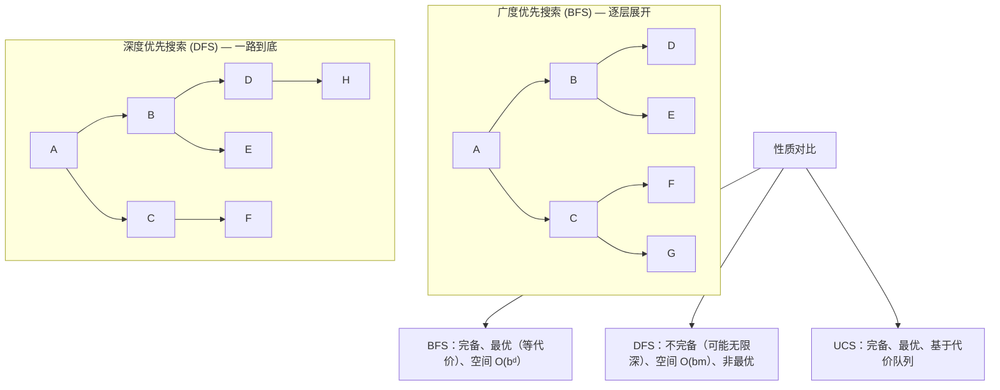

### 2.3 有信息（启发式）搜索：贪心最优搜索、A* 算法、IDA*、启发式函数设计
- **有信息搜索 (Informed Search)** 使用**领域知识**指导搜索方向，该知识通过**启发式函数 (Heuristic Function)** `h(n)` 编码——`h(n)` 估计从节点 `n` 到目标状态的最小代价。
- **贪心最优搜索 (Greedy Best-First Search)**：
    - **策略**：始终扩展 `h(n)` 最小的节点——即"看起来离目标最近的节点"；
    - **类比**：类似 DFS 以"离目标远近"为向导，总是朝着最有希望的方向前进；
    - **性质**：不完备（可能陷入死循环），不最优，但通常搜索速度极快；
    - **复杂度**：最坏情况 `O(b^m)`，但好的启发式函数可使其接近线性。
- **A* 搜索 (A-Star Search)**：
    - **评价函数**：`f(n) = g(n) + h(n)`，其中：
        - `g(n)`：从初始状态到节点 `n` 的实际路径代价（已知）；
        - `h(n)`：从节点 `n` 到目标的估计代价（启发式）；
        - `f(n)`：经过节点 `n` 的完整路径的估计总代价。
    - **核心机制**：A* 在 UCS（只考虑已付出的代价 `g(n)`）与贪心搜索（只看剩余估计 `h(n)`）之间取得平衡——`g(n)` 可看作"回望过去"，`h(n)` 可看作"展望未来"；
    - **可纳性 (Admissibility)**：`h(n)` 永不高估从 `n` 到目标的实际代价，即对所有节点 `n` 有 `h(n) ≤ h*(n)`（`h*` 为真实最优代价）。当 `h` 可纳时，A* 在图搜索（需配合**闭环检测**）下是**最优的**；
    - **一致性 / 单调性 (Consistency / Monotonicity)**：对每条边 `(n, a, n')`，满足 `h(n) ≤ c(n, a, n') + h(n')`。一致性是可纳性的更强条件，同时也是三角形不等式的体现。一致启发式保证 A* 在图搜索下以最优顺序扩展节点，且每个节点最多扩展一次；
    - **性质总结**：A* 是完备的，在 `h` 可纳时最优，在 `h` 一致时最优效率最高（在同等信息条件下，所有最优搜索中 A* 扩展的节点最少）。
- **迭代加深 A* (IDA\*)**：
    - **动机**：A* 在大状态空间中内存开销极大（需存储所有已生成节点），IDA* 用迭代加深的方式规避内存问题；
    - **做法**：每一轮设一个 `f` 值的阈值 `cutoff`，DFS 过程中若当前节点的 `f(n) > cutoff` 则剪枝并记录所有被剪节点的 `f` 值中的最小者作为下一轮的 cutoff；
    - **性质**：保留 A* 的完备性与最优性，空间复杂度降为 `O(bd)`，在实际求解八数码等问题中广泛使用。
- **启发式函数设计方法**：
    - **松弛问题 (Relaxed Problem)**：放宽原问题的某些约束后获得的问题。松弛问题的最优解代价是原问题的一个可纳启发式。例如八数码问题中，若允许方块直接"跳"到目标位置（忽略其他方块），即为曼哈顿距离启发式；
    - **模式数据库 (Pattern Database)**：将子问题的解代价预先计算并存储，综合多个子问题得到可纳启发式；
    - **支配关系 (Dominance)**：若对所有节点 `n` 均有 `h₁(n) ≥ h₂(n)`，则称 `h₁` **支配** `h₂`。被支配的启发式会被优先使用——因为它更"紧"（信息量更大），搜索效率更高；
    - **从经验中学习**：通过求解大量训练实例，学习启发式函数的加权组合参数。

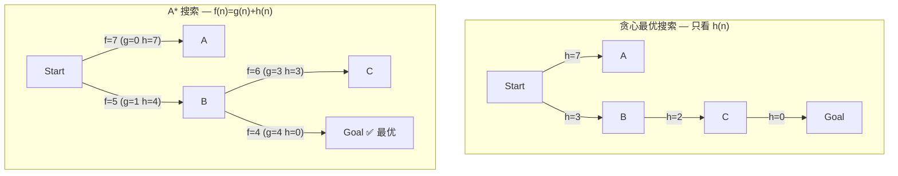

### 2.4 局部搜索与最优化：爬山法、模拟退火、束搜索、遗传算法
- **局部搜索 (Local Search)** 与经典搜索的根本区别在于**不关心路径**，只关注最终状态（解的质量）——适用于最优化问题，其中状态本身即解，不记录从起点到达解的路径。
- **状态空间地形图 (State Space Landscape)**：将状态空间视为地形——每个状态有一个**目标函数值**（高度），我们的目标是找到全局最高峰（最大化）或最低谷（最小化）。地形图由三要素组成：位置（状态）、高度（目标函数值）、移动（邻域操作）。
- **爬山法 (Hill Climbing)**：
    - **基本思路**：从当前解出发，在邻域中选择使目标函数改进最大的状态，不断向上攀登，直到无法改进为止——即**贪心局部搜索**；
    - **致命缺陷**：
        - **局部最优 (Local Maximum)**：四周均更低，但并非全局最高；
        - **高原 (Plateau)**：邻域中所有状态目标值相同，算法失去方向；
        - **山脊 (Ridge)**：单步邻域看似无法提升，但连续多步可达更高峰；
    - **改进变体**：
        - **随机爬山法 (Stochastic HC)**：随机选择邻域中任一优于当前的状态，而非最优；
        - **随机重启爬山法 (Random-Restart HC)**：多次从随机初始状态运行，取最优结果——在 NP 难问题中，执行足够多次后以概率 1 找到全局最优；
        - **首选爬山法 (First-Choice HC)**：依次生成邻居，一旦找到更优状态即移动。
- **模拟退火 (Simulated Annealing, SA)**：
    - **灵感来源**：冶金学中金属退火——高温时原子剧烈随机运动（探索），缓慢降温后趋于低能量态（利用）；
    - **核心机制**：允许以一定概率接受更差的状态，概率由 Boltzmann 分布给出：
        - `P(accept worse) = exp(-ΔE / T)`，其中 `ΔE` 为目标值变差的程度，`T` 为当前温度；
        - 温度 `T` 随调度表 `schedule(t)` 逐步下降；
    - **效果**：高温时接近随机行走（全域探索），低温时近似爬山（局部精化）。理论上，若降温足够慢，SA 以概率 1 找到全局最优。
- **束搜索 (Beam Search)**：
    - **思路**：在 BFS 的每一层中，只保留 `k` 个最有希望的节点继续扩展（`k` 称为**束宽**）；
    - **本质**：在内存受限下的并行搜索——介于贪心（只保留最优 1 个）与穷举（保留全部）之间；
    - **应用**：机器翻译、语音识别等序列生成任务中广泛使用，通常用对数概率作为评分指标。
- **遗传算法 (Genetic Algorithm, GA)**：
    - **灵感来源**：自然选择与遗传学——群体的进化过程；
    - **基本流程**：初始化种群（一组候选解）→ 评估适应度 → 选择父代 → 交叉产生子代 → 变异引入多样性 → 形成新一代 → 重复至收敛；
    - **核心操作**：
        - **选择 (Selection)**：适应度越高的个体越有可能被选为父代（轮盘赌选择、锦标赛选择等）；
        - **交叉 (Crossover)**：交换两个父代的部分基因，产生子代（单点交叉、两点交叉、均匀交叉）；
        - **变异 (Mutation)**：以较小概率随机改变个体的某一基因位，维持种群多样性；
    - **模式定理 (Schema Theorem)**：简言之，适应度高、定义长度短、阶数低的模式（Schema）在进化中会以指数速率增长——为 GA 的有效性提供了理论依据。

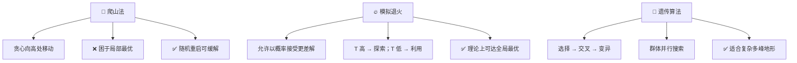

### 2.5 对抗搜索：极小极大算法、Alpha-Beta 剪枝、蒙特卡洛树搜索
- **对抗搜索 (Adversarial Search)** 适用于多智能体环境中**竞争性**的博弈场景——对手的目标与己方相反（零和博弈），搜索时需考虑对手的最优应对。
- **博弈问题形式化**：
    - **初始状态** `S₀`：棋盘初始布局；
    - **玩家函数** `Player(s)`：返回当前轮到谁走；
    - **动作集合** `Actions(s)`：当前状态下合法走法；
    - **转移模型** `Result(s, a)`：走一步后的结果状态；
    - **终局测试** `Terminal-test(s)`：游戏是否结束；
    - **效用函数** `Utility(s, p)`：对局结束时的收益（如国际象棋：赢 +1、输 -1、平 0）。
- **极小极大算法 (Minimax)**：
    - **核心思想**：MAX 方（我方）试图最大化最终收益，MIN 方（对手）试图最小化——双方交替决策，形成博弈树；
    - **递归定义**：设 `v(s)` 为状态 `s` 下 MAX 的最佳收益：
        - 若 `s` 为终局：`v(s) = Utility(s)`；
        - 若 MAX 走：`v(s) = max_{a ∈ Actions(s)} v(Result(s, a))`；
        - 若 MIN 走：`v(s) = min_{a ∈ Actions(s)} v(Result(s, a))`；
    - **复杂度**：若博弈树深度为 `d`，分支因子为 `b`，时间 `O(b^d)`，空间 `O(bd)`（深度优先实现）。国际象棋中 `b ≈ 35，d ≈ 100`，穷举完全不可行。
- **Alpha-Beta 剪枝 (Alpha-Beta Pruning)**：
    - **核心思想**：在 minimax 搜索过程中，动态维护两个边界：`α`（MAX 的当前最佳选择下界）和 `β`（MIN 的当前最佳选择上界）。当某条路径确定不可能改进当前已找到的最优值时，即可**剪枝**——不再探索该子树；
    - **剪枝条件**：若 `v ≥ β`，对 MAX 节点剪枝（β 剪枝），因为 MIN 不会让这种情况发生；若 `v ≤ α`，对 MIN 节点剪枝（α 剪枝），因为 MAX 不会选择这条路；
    - **效率提升**：理想情况下（对子节点按最优优先排序），Alpha-Beta 剪枝可将复杂度从 `O(b^d)` 降至 `O(b^(d/2))`——即约等于 Minimax 搜索深度的**两倍**。这意味着在相同时间内可以"多前瞻两步"；
    - **节点排序至关重要**：启发式排序（如国际象棋中的吃子优先、杀王优先）可使剪枝效率接近理论最优。
- **蒙特卡洛树搜索 (Monte Carlo Tree Search, MCTS)**：
    - **背景**：传统 Minimax（含 Alpha-Beta）依赖评估函数与深度限制，在围棋等大分支因子的游戏中力不从心（`b ≈ 250`）。MCTS 另辟蹊径，不做穷举搜索，而通过**随机模拟（Playout/Rollout）**估计胜率；
    - **四步循环**：
        - **选择 (Selection)**：从根节点出发，依据树策略（如 UCB1 公式）选择最有价值的子节点，直至到达**未完全展开的节点**；
        - **扩展 (Expansion)**：若叶节点不是终局，为其添加一个（或多个）子节点；
        - **模拟 (Simulation)**：从新节点出发，执行随机走子（或轻量级策略）直至终局，得到胜负结果；
        - **反向传播 (Backpropagation)**：将模拟结果沿路径向上更新各节点的访问次数与胜率统计；
    - **UCB1 公式**：平衡**利用**（高胜率节点）与**探索**（被访问少的节点）：
        `UCT(j) = wⱼ / nⱼ + C · √(ln N / nⱼ)`
        其中 `wⱼ` 为节点 `j` 的获胜次数，`nⱼ` 为访问次数，`N` 为父节点访问次数，`C` 为探索常数；
    - **AlphaGo / AlphaZero**：在 MCTS 框架中嵌入深度神经网络——策略网络指导选择与扩展（替代随机走子），价值网络评估局面（替代随机模拟），实现了超越人类世界冠军的水平。AlphaZero 进一步移除人类棋谱依赖，完全通过自对弈学习。

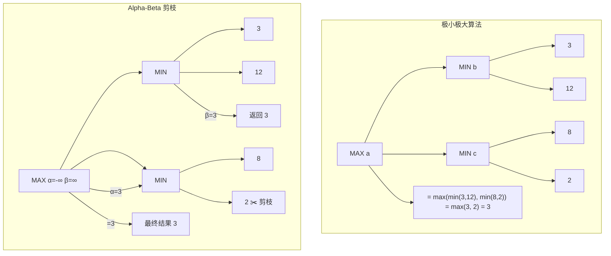

### 2.6 约束满足问题（CSP）：回溯搜索、前向检验、弧相容、AC-3 算法
- **约束满足问题 (Constraint Satisfaction Problem, CSP)** 将状态表示为一组**变量**及其**值域**之间的**约束**——搜索目标不再是找到到达目标状态的路径，而是找到一组满足所有约束的变量赋值。CSP 的表示力强，可自然地建模调度、配置、排课、地图着色等大量实际问题。
- **CSP 的三要素**：
    - **变量集合** `X = {X₁, X₂, …, Xₙ}`：待赋值的实体；
    - **值域集合** `D = {D₁, D₂, …, Dₙ}`：每个 `Xᵢ` 的可取值集合（可为离散或连续，但 CSP 通常处理有限离散值域）；
    - **约束集合** `C = {C₁, C₂, …, Cₘ}`：规定变量赋值之间的合法组合——可以是**一元约束**（限制单个变量）、**二元约束**（涉及两个变量，如 `Xᵢ ≠ Xⱼ`）、**全局约束**（涉及多个变量，如 `AllDiff`）。
- **CSP 搜索的特点**：
    - **赋值是交换的**：先给 A 赋值再给 B 赋值，与相反顺序的结果相同，因此 CSP 不必考虑路径——只需按变量顺序赋值即可，搜索空间缩小为 `O(dⁿ)` 而非 `O(n! · dⁿ)`；
    - **回溯搜索 (Backtracking Search)**：基本 CSP 求解算法，每次选择一个未赋值的变量，尝试其值域中的每个可能值，若当前赋值与约束冲突则回溯。本质是**带剪枝的深度优先搜索**；
    - **与经典搜索的区别**：CSP 的"状态"是部分赋值（而非世界状态的快照），"目标测试"是对所有变量赋值完毕且所有约束成立。
- **约束传播 (Constraint Propagation)**：
    - **核心思想**：在搜索过程中（甚至在搜索前），利用约束缩小变量的值域，提前排除不可能的值，减少无效搜索；
    - **前向检验 (Forward Checking, FC)**：为某一变量赋值后，立即检查所有尚未赋值的邻居变量，移除与其冲突的值——若某变量的值域因此变空，立即回溯。FC 是回溯搜索最常见的第一道防线；
    - **弧相容 (Arc Consistency, AC)**：对于二元约束 `C(X, Y)`，称边 `X → Y` 为**弧相容**的，当且仅当对 `X` 值域中每个值，在 `Y` 的值域中都存在至少一个值使得 `C` 被满足。AC 比前向检验传播得更远（考虑非直接邻居）；
    - **AC-3 算法**：最广泛使用的弧相容算法，将所有弧放入队列，依次检查每条弧是否相容——若某条弧不相容则删除对应值并重新将受影响的弧入列，直到队列为空。复杂度 `O(cd³)`（`c` 为约束数，`d` 为最大值域大小）；
    - **k-相容性 (k-Consistency)**：将相容性推广——1-相容（节点相容，每个值满足一元约束）、2-相容（弧相容）、强 k-相容（对所有 `i ≤ k` 均为 i-相容的）——更强的传播可进一步缩窄搜索空间，但计算代价相应增大。
- **变量与值的选择启发式**：
    - **最小剩余值 MRV (Minimum Remaining Values)**：选择当前值域最小的变量——即最可能受限的变量优先（"最易失败的先处理"）；
    - **度启发式 (Degree Heuristic)**：当 MRV 平局时，选择与其他未赋值变量约束最多的变量——最具影响力的先处理；
    - **最少约束值 (Least Constraining Value)**：选择给邻居变量留下最大选择余地的值——"留有余地"的值优先。
- **回溯搜索的改进**：
    - **回跳 (Backjumping)**：当在某变量值域全部尝试后均失败时，不是简单回溯到上一层，而是智能地跳回导致冲突的根源变量（冲突集分析）；
    - **学习 (Learning)**：将导致失败的赋值组合记录为新的约束（**诺戈德 NoGood**），避免将来重复尝试同样组合。

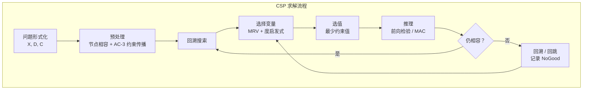

## 三、知识与推理
### 3.1 确定性推理 — 命题逻辑：语法与语义、推理规则、归结原理
### 3.2 一阶谓词逻辑：量词、合一、前向/反向链接
### 3.3 归结反演与逻辑程序设计（Prolog 简介）
### 3.4 产生式系统与专家系统

### 3.5 知识表示 — 语义网络与框架表示法
### 3.6 本体论与描述逻辑（OWL、RDF）
### 3.7 知识图谱：实体识别、关系抽取、知识融合、知识推理
### 3.8 图数据库与知识存储（Neo4j 等）

### 3.9 不确定性推理 — 概率基础回顾：先验/后验概率、条件独立性
### 3.10 贝叶斯网络：表示、推理、参数学习
### 3.11 动态贝叶斯网络与隐马尔可夫模型（HMM）
### 3.12 卡尔曼滤波与粒子滤波
### 3.13 马尔可夫随机场与条件随机场（CRF）
### 3.14 模糊逻辑与粗糙集
### 3.15 证据理论（Dempster-Shafer 理论）

## 四、进化计算与群体智能
### 4.1 遗传算法：编码、选择、交叉、变异、适应度函数
### 4.2 遗传编程与进化策略
### 4.3 粒子群优化（PSO）
### 4.4 蚁群算法（ACO）
### 4.5 人工蜂群算法与差分进化
### 4.6 多目标进化优化（NSGA-II 等）

## 五、机器学习
### 5.1 基本概念：监督/无监督/半监督/强化学习、泛化、过拟合与欠拟合
### 5.2 模型评估与选择：偏差-方差权衡、交叉验证、ROC/AUC、正则化
### 5.3 线性模型：线性回归、逻辑回归、softmax 回归、LDA
### 5.4 决策树：ID3、C4.5、CART
### 5.5 集成学习：Bagging、随机森林、Boosting、GBDT、XGBoost、LightGBM
### 5.6 支持向量机（SVM）：最大间隔、核方法、SMO 算法
### 5.7 聚类分析：K-Means、DBSCAN、层次聚类、高斯混合模型
### 5.8 降维与特征工程：PCA、SVD、t-SNE、特征选择
### 5.9 贝叶斯学习：朴素贝叶斯、贝叶斯网络学习、高斯过程
### 5.10 半监督学习与弱监督学习

## 六、深度学习
### 6.1 神经网络基础：感知机、多层感知机、激活函数（ReLU/Sigmoid/GELU 等）
### 6.2 反向传播算法与自动微分
### 6.3 优化算法：SGD、Momentum、Adam、AdamW、学习率调度
### 6.4 深度网络训练技巧：批归一化、层归一化、Dropout、残差连接
### 6.5 卷积神经网络（CNN）：卷积层、池化层、LeNet、AlexNet、VGG、ResNet、DenseNet、EfficientNet
### 6.6 序列模型：RNN、LSTM、GRU、双向 RNN、深层 RNN
### 6.7 Seq2Seq 与注意力机制：编解码架构、Bahdanau/Luong 注意力
### 6.8 Transformer 架构：自注意力、多头注意力、位置编码、层归一化

### 6.9 生成模型 — 自编码器（AE）与变分自编码器（VAE）
### 6.10 生成对抗网络（GAN）：DCGAN、WGAN、StyleGAN、条件 GAN
### 6.11 扩散模型（Diffusion Model）：DDPM、Stable Diffusion 原理
### 6.12 自回归生成与流模型简介

### 6.13 预训练与迁移 — 预训练范式：预训练-微调、Prompt Tuning
### 6.14 BERT 系列：MLM + NSP 预训练、RoBERTa、ALBERT
### 6.15 GPT 系列：GPT-1/2/3/4、语言建模预训练、缩放定律
### 6.16 视觉预训练模型：ViT、MAE、DINO

### 6.17 模型效率与部署 — 模型压缩：量化、剪枝、知识蒸馏
### 6.18 推理优化：图优化、算子融合、低精度推理
### 6.19 分布式训练：数据并行、模型并行、流水线并行、ZeRO

## 七、强化学习
### 7.1 马尔可夫决策过程（MDP）：状态、动作、奖励、值函数
### 7.2 动态规划：策略迭代、值迭代
### 7.3 蒙特卡洛方法与时序差分学习（TD）
### 7.4 Q-Learning 与 SARSA
### 7.5 深度强化学习：DQN 及其变体（Double DQN、Dueling DQN、Rainbow）
### 7.6 策略梯度：REINFORCE、Actor-Critic、A2C/A3C
### 7.7 前沿方法：PPO、SAC、TRPO、Dreamer
### 7.8 博弈与强化学习：AlphaGo / AlphaZero / MuZero
### 7.9 强化学习中的探索-利用权衡
### 7.10 离线强化学习与从人类反馈中强化学习（RLHF）

## 八、自动规划
### 8.1 经典规划：STRIPS 表示、状态空间规划
### 8.2 规划算法：前向搜索、后向搜索、部分有序规划
### 8.3 图规划（GraphPlan）
### 8.4 层次任务网络规划（HTN）
### 8.5 非确定性规划与概率规划
### 8.6 规划与强化学习的联系：基于模型的 RL

## 九、自然语言处理
### 9.1 基础技术 — 文本预处理：分词、词干提取、停用词
### 9.2 语言模型：n-gram、困惑度、神经语言模型
### 9.3 词向量：Word2Vec（CBOW/Skip-gram）、GloVe、FastText
### 9.4 上下文词表示：ELMo、CoVe

### 9.5 序列标注与结构分析 — 序列标注：词性标注、命名实体识别（NER）、双向 LSTM-CRF
### 9.6 句法分析：依存句法分析、成分句法分析
### 9.7 语义角色标注与语义解析

### 9.8 任务与应用 — 文本分类与情感分析
### 9.9 信息抽取：关系抽取、事件抽取
### 9.10 机器翻译：统计机器翻译、神经机器翻译（Transformer）、多语言翻译
### 9.11 文本摘要：抽取式与生成式摘要
### 9.12 问答系统与信息检索
### 9.13 对话系统：任务型与闲聊型

### 9.14 大语言模型（LLM） — 预训练架构：Encoder-Only（BERT）、Decoder-Only（GPT）、Encoder-Decoder（T5）
### 9.15 提示工程（Prompt Engineering）：Chain-of-Thought、Few-shot、Self-Consistency
### 9.16 检索增强生成（RAG）
### 9.17 参数高效微调：LoRA、Adapter、Prefix-Tuning
### 9.18 对齐技术：RLHF、DPO、Constitutional AI
### 9.19 LLM 评测与应用

## 十、计算机视觉
### 10.1 传统视觉基础：图像滤波、边缘检测、SIFT、HOG
### 10.2 图像分类：LeNet、AlexNet、ResNet、ViT
### 10.3 目标检测：两阶段（R-CNN、Fast R-CNN、Faster R-CNN）、单阶段（YOLO 系列、SSD、RetinaNet）
### 10.4 语义分割：FCN、U-Net、DeepLab 系列
### 10.5 实例分割与全景分割：Mask R-CNN、YOLACT
### 10.6 目标跟踪与视频理解
### 10.7 人体姿态估计与关键点检测
### 10.8 图像生成：GAN、VAE、扩散模型在视觉中的应用
### 10.9 视觉-语言多模态：CLIP、DALL·E、BLIP、Flamingo

## 十一、语音处理
### 11.1 语音信号基础：采样、量化、MFCC、梅尔频谱
### 11.2 语音识别（ASR）：HMM-GMM、CTC、LAS、Transformer ASR
### 11.3 语音合成（TTS）：Tacotron、WaveNet、FastSpeech、VITS
### 11.4 声纹识别与说话人验证
### 11.5 多模态语音模型：Whisper、AudioGPT

## 十二、推荐系统
### 12.1 基础方法：协同过滤（UserCF/ItemCF）、矩阵分解
### 12.2 深度学习推荐：Neural CF、Wide & Deep、DeepFM、DIN
### 12.3 图神经网络在推荐中的应用
### 12.4 序列推荐与强化学习推荐
### 12.5 冷启动问题与评价指标
### 12.6 信息流推荐与在线学习

## 十三、多智能体系统
### 13.1 多智能体系统基本概念：Agent 架构、通信与协调
### 13.2 博弈论基础：纳什均衡、占优策略、机制设计
### 13.3 多智能体强化学习（MARL）
### 13.4 分布式问题求解
### 13.5 拍卖与协商协议

## 十四、因果推断
### 14.1 相关 vs 因果：辛普森悖论、混杂变量
### 14.2 因果图模型：贝叶斯网络 structural vs causal
### 14.3 do-算子与干预
### 14.4 因果效应估计：后门准则、前门准则
### 14.5 反事实推理
### 14.6 因果发现算法

## 十五、人工智能伦理与安全
### 15.1 公平性：算法偏见来源、公平性度量、公平性约束
### 15.2 可解释性（XAI）：特征归因（SHAP、LIME）、注意力可视化、概念解释
### 15.3 隐私保护：差分隐私、联邦学习、同态加密
### 15.4 AI 安全与鲁棒性：对抗攻击、防御、安全对齐
### 15.5 人工智能治理：法律法规（GDPR、AI Act）、伦理准则
### 15.6 社会影响：就业、信息茧房、AI 武器化

## 十六、前沿与专题
### 16.1 图神经网络（GNN）：GCN、GAT、GraphSAGE、消息传递范式
### 16.2 元学习（Meta-Learning）：MAML、Reptile、度量学习
### 16.3 自监督学习：对比学习（SimCLR、MoCo）、掩码建模
### 16.4 具身智能与机器人：感知-规划-控制闭环、Sim-to-Real
### 16.5 世界模型：Sora、视频生成与世界理解
### 16.6 神经符号系统：Neuro-Symbolic Integration
### 16.7 AI for Science：蛋白质结构预测、分子生成、数学定理证明
### 16.8 Agent 与大模型协作：Tool Use、Code Interpreter、多 Agent 编排
### 16.9 通用人工智能（AGI）：定义、路线图与展望
