# 人工智能

## 一、人工智能概述
### 1.1 人工智能的定义、目标与流派
### 1.2 发展简史：推理期、知识期、学习期、大模型时代

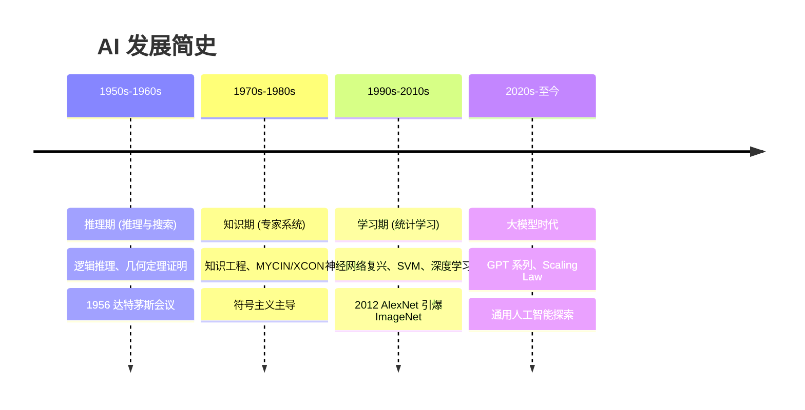
### 1.3 三大学派：符号主义、连接主义、行为主义

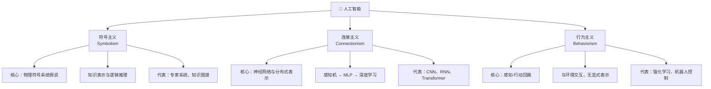
### 1.4 智能体模型：PEAS 描述、理性智能体、环境特性分类

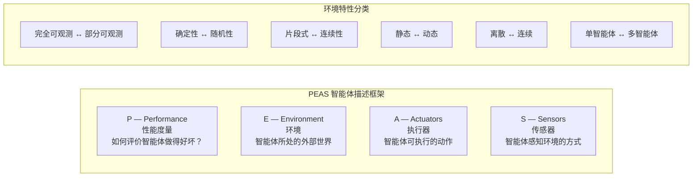
### 1.5 图灵测试、中文屋与智能度量
### 1.6 主要应用领域与产业现状

## 二、问题求解与搜索策略
### 2.1 问题形式化：状态空间图、问题的形式化表示
- **问题形式化的五要素**：一个问题可以用五个要素形式化定义——
    - ① **初始状态 (Initial State)**：智能体出发时所在的状态；
    - ② **动作 (Actions)**：在每个状态 `s` 下可执行的动作集合 `ACTIONS(s)`；
    - ③ **转移模型 (Transition Model)**：执行动作 `a` 后从状态 `s` 转移到后继状态 `s'` 的描述，即 `RESULT(s, a) = s'`，也称为**后继函数**；
    - ④ **目标测试 (Goal Test)**：判断当前状态是否为目标状态（可以是显式状态集合或隐式条件判断）；
    - ⑤ **路径代价函数 (Path Cost Function)**：为每条路径分配一个数值代价，通常为各步代价之和 `g(path) = Σ cost(s_i, a_i, s_{i+1})`，求解目标是找到总代价最小的解。

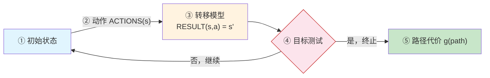
- **状态空间图 (State Space Graph)**：将问题空间中所有可能状态及其转移关系抽象为图结构——节点表示状态，有向边表示动作——该图在搜索前即已隐含存在，实际的搜索过程是在图上探寻路径。
- **搜索树 (Search Tree)**：从初始状态出发，依据动作展开后继节点所形成的树结构。搜索树在探索过程中逐步构建，其节点可能对应相同的状态（状态重复），状态空间图是唯一的，而搜索树依赖于搜索策略。

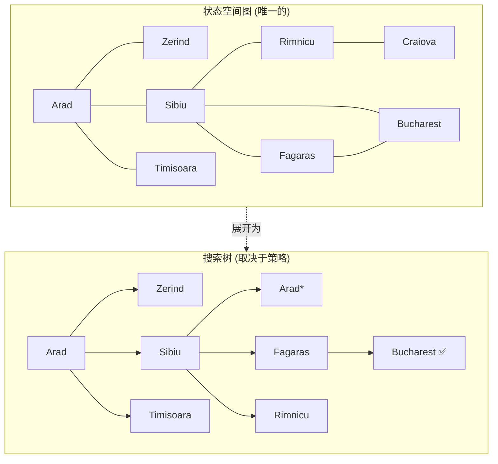

> 状态空间图是问题固有的结构，搜索树则是算法在探索过程中逐步构建的——同一状态可能在树中出现多次（如 Arad*）。
- **良好定义的问题**：当一个问题的初始状态、动作集合、转移模型、目标测试和路径代价函数均被明确指定时，称为**良定义问题 (Well-Defined Problem)**。解决方案是从初始状态到目标状态的一组动作序列。
- **抽象 (Abstraction)**：问题形式化的关键在于去除与现实无关的细节，保留对求解有影响的核心要素——这是简化复杂现实、使搜索可行的关键步骤。一个好的抽象层次应满足：被移除的细节不影响解的合法性，且抽象后得到的动作应易于执行。
- **经典示例**：
    - *八数码问题*：状态为 3×3 棋盘上 8 个数字方块与一个空格的排列，动作为空格上下左右移动，目标为棋子的特定排列；
    - *真空吸尘器世界*：两个房间、吸尘器位置与房间清洁状态的组合构成状态空间；
    - *路径规划问题*：状态为地图上的位置，动作为移动到相邻城市，路径代价为距离。

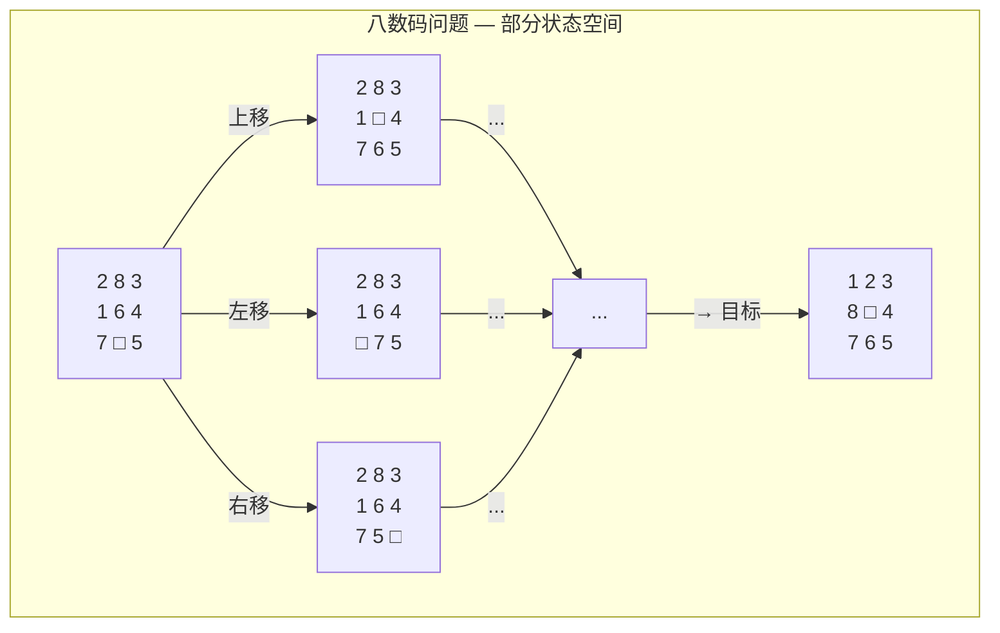
- **问题求解性能的度量**：
    - **完备性 (Completeness)**：如果有解，算法是否保证找到解？
    - **最优性 (Optimality)**：找到的解是否代价最小？
    - **时间复杂度 (Time Complexity)**：搜索所需时间（通常以搜索过程中产生的节点数衡量）；
    - **空间复杂度 (Space Complexity)**：算法运行所需的最大内存。
- **搜索策略分类**：
    - **无信息搜索 (Uninformed/Blind Search)**：仅使用问题定义本身的信息，不借助额外领域知识；
    - **有信息搜索 (Informed/Heuristic Search)**：利用启发式函数评估节点到目标的距离，选择更有希望的路径。
### 2.2 无信息搜索：广度优先、深度优先、一致代价搜索
- **无信息搜索 (Uninformed Search)** 又称为**盲目搜索 (Blind Search)**，只使用问题定义中可用的信息，不借助任何外部领域知识。搜索策略仅依赖于已扩展节点的顺序，而无信息搜索的核心区别在于使用何种数据结构（队列 vs 栈 vs 优先队列）来维护**边缘节点 (Frontier / Fringe)**。
- **广度优先搜索 (Breadth-First Search, BFS)**：
    - **核心思想**：先扩展根节点，再扩展根节点的所有后继，依此类推，逐层推进。使用 **FIFO 队列** 作为边缘；
    - **节点生成顺序**：从浅到深，从深度的第 `d` 层依次展开至第 `d+1` 层；
    - **算法复杂度**：时间 `O(b^d)`，空间 `O(b^d)`——对浅层问题可行，对大深度问题内存爆炸；
    - **性质**：完备（若 `b` 有限且路径深度有限），**等代价下最优**（step cost 相同时），不等代价时不一定最优。
- **深度优先搜索 (Depth-First Search, DFS)**：
    - **核心思想**：每步优先扩展当前搜索树中最深的节点，一路到底再回溯。使用 **LIFO 栈**（或递归调用）；
    - **算法复杂度**：时间 `O(b^m)`（`m` 为最大深度），空间 `O(bm)`——内存优势显著，仅需存储一条路径；
    - **性质**：**不完备**——无限深分支会导致陷入死循环（可通过深度限制避免）；**非最优**；
    - **深度限制搜索 (DLS)**：为 DFS 设置最大深度 `ℓ`，解决了无限深路径问题；
    - **迭代加深搜索 (IDS)**：将 DLS 与 BFS 结合——逐步增大深度限制，每次从初始状态重新搜索。兼具 BFS 的完备性与 DFS 的空间效率，时间 `O(b^d)`，空间 `O(bd)`。
- **一致代价搜索 (Uniform-Cost Search, UCS)**：
    - **核心思想**：优先扩展**路径代价 `g(n)` 最小**的节点，使用**优先队列**（如最小堆）管理边缘；
    - **本质**：UCS 是 BFS 在不等代价下的推广——当每步代价相等时，UCS 退化为 BFS；
    - **性质**：完备且最优（只要每步代价 > 0），时间和空间均为 `O(b^{1+⌊C*/ε⌋})`，其中 `C*` 为最优解的代价，`ε` 为最小步代价。
- **无信息搜索总结（设分支因子 `b`，最浅目标深度 `d`，最大深度 `m`）**：

| 算法 | 完备性 | 最优性 | 时间复杂度 | 空间复杂度 |
|:---|:---:|:---:|:---|:---|
| BFS | ✅ | 等代价下 ✅ | `O(b^d)` | `O(b^d)` |
| DFS | ❌ | ❌ | `O(b^m)` | `O(bm)` |
| DLS | ❌ | ❌ | `O(b^ℓ)` | `O(bℓ)` |
| IDS | ✅ | 等代价下 ✅ | `O(b^d)` | `O(bd)` |
| UCS | ✅ | ✅ | `O(b^{1+⌊C*/ε⌋})` | 同时间 |

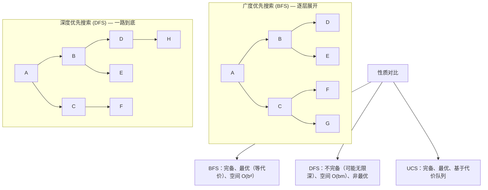

### 2.3 有信息（启发式）搜索：贪心最优搜索、A* 算法、IDA*、启发式函数设计
- **有信息搜索 (Informed Search)** 使用**领域知识**指导搜索方向，该知识通过**启发式函数 (Heuristic Function)** `h(n)` 编码——`h(n)` 估计从节点 `n` 到目标状态的最小代价。
- **贪心最优搜索 (Greedy Best-First Search)**：
    - **策略**：始终扩展 `h(n)` 最小的节点——即"看起来离目标最近的节点"；
    - **类比**：类似 DFS 以"离目标远近"为向导，总是朝着最有希望的方向前进；
    - **性质**：不完备（可能陷入死循环），不最优，但通常搜索速度极快；
    - **复杂度**：最坏情况 `O(b^m)`，但好的启发式函数可使其接近线性。
- **A* 搜索 (A-Star Search)**：
    - **评价函数**：`f(n) = g(n) + h(n)`，其中：
        - `g(n)`：从初始状态到节点 `n` 的实际路径代价（已知）；
        - `h(n)`：从节点 `n` 到目标的估计代价（启发式）；
        - `f(n)`：经过节点 `n` 的完整路径的估计总代价。
    - **核心机制**：A* 在 UCS（只考虑已付出的代价 `g(n)`）与贪心搜索（只看剩余估计 `h(n)`）之间取得平衡——`g(n)` 可看作"回望过去"，`h(n)` 可看作"展望未来"；
    - **可纳性 (Admissibility)**：`h(n)` 永不高估从 `n` 到目标的实际代价，即对所有节点 `n` 有 `h(n) ≤ h*(n)`（`h*` 为真实最优代价）。当 `h` 可纳时，A* 在图搜索（需配合**闭环检测**）下是**最优的**；
    - **一致性 / 单调性 (Consistency / Monotonicity)**：对每条边 `(n, a, n')`，满足 `h(n) ≤ c(n, a, n') + h(n')`。一致性是可纳性的更强条件，同时也是三角形不等式的体现。一致启发式保证 A* 在图搜索下以最优顺序扩展节点，且每个节点最多扩展一次；
    - **性质总结**：A* 是完备的，在 `h` 可纳时最优，在 `h` 一致时最优效率最高（在同等信息条件下，所有最优搜索中 A* 扩展的节点最少）。
- **迭代加深 A* (IDA\*)**：
    - **动机**：A* 在大状态空间中内存开销极大（需存储所有已生成节点），IDA* 用迭代加深的方式规避内存问题；
    - **做法**：每一轮设一个 `f` 值的阈值 `cutoff`，DFS 过程中若当前节点的 `f(n) > cutoff` 则剪枝并记录所有被剪节点的 `f` 值中的最小者作为下一轮的 cutoff；
    - **性质**：保留 A* 的完备性与最优性，空间复杂度降为 `O(bd)`，在实际求解八数码等问题中广泛使用。
- **启发式函数设计方法**：
    - **松弛问题 (Relaxed Problem)**：放宽原问题的某些约束后获得的问题。松弛问题的最优解代价是原问题的一个可纳启发式。例如八数码问题中，若允许方块直接"跳"到目标位置（忽略其他方块），即为曼哈顿距离启发式；
    - **模式数据库 (Pattern Database)**：将子问题的解代价预先计算并存储，综合多个子问题得到可纳启发式；
    - **支配关系 (Dominance)**：若对所有节点 `n` 均有 `h₁(n) ≥ h₂(n)`，则称 `h₁` **支配** `h₂`。被支配的启发式会被优先使用——因为它更"紧"（信息量更大），搜索效率更高；
    - **从经验中学习**：通过求解大量训练实例，学习启发式函数的加权组合参数。

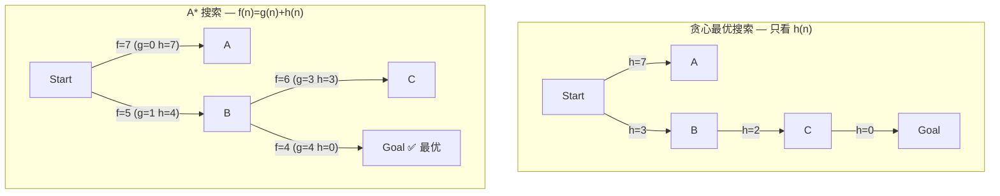

### 2.4 局部搜索与最优化：爬山法、模拟退火、束搜索、遗传算法
- **局部搜索 (Local Search)** 与经典搜索的根本区别在于**不关心路径**，只关注最终状态（解的质量）——适用于最优化问题，其中状态本身即解，不记录从起点到达解的路径。
- **状态空间地形图 (State Space Landscape)**：将状态空间视为地形——每个状态有一个**目标函数值**（高度），我们的目标是找到全局最高峰（最大化）或最低谷（最小化）。地形图由三要素组成：位置（状态）、高度（目标函数值）、移动（邻域操作）。
- **爬山法 (Hill Climbing)**：
    - **基本思路**：从当前解出发，在邻域中选择使目标函数改进最大的状态，不断向上攀登，直到无法改进为止——即**贪心局部搜索**；
    - **致命缺陷**：
        - **局部最优 (Local Maximum)**：四周均更低，但并非全局最高；
        - **高原 (Plateau)**：邻域中所有状态目标值相同，算法失去方向；
        - **山脊 (Ridge)**：单步邻域看似无法提升，但连续多步可达更高峰；
    - **改进变体**：
        - **随机爬山法 (Stochastic HC)**：随机选择邻域中任一优于当前的状态，而非最优；
        - **随机重启爬山法 (Random-Restart HC)**：多次从随机初始状态运行，取最优结果——在 NP 难问题中，执行足够多次后以概率 1 找到全局最优；
        - **首选爬山法 (First-Choice HC)**：依次生成邻居，一旦找到更优状态即移动。
- **模拟退火 (Simulated Annealing, SA)**：
    - **灵感来源**：冶金学中金属退火——高温时原子剧烈随机运动（探索），缓慢降温后趋于低能量态（利用）；
    - **核心机制**：允许以一定概率接受更差的状态，概率由 Boltzmann 分布给出：
        - `P(accept worse) = exp(-ΔE / T)`，其中 `ΔE` 为目标值变差的程度，`T` 为当前温度；
        - 温度 `T` 随调度表 `schedule(t)` 逐步下降；
    - **效果**：高温时接近随机行走（全域探索），低温时近似爬山（局部精化）。理论上，若降温足够慢，SA 以概率 1 找到全局最优。
- **束搜索 (Beam Search)**：
    - **思路**：在 BFS 的每一层中，只保留 `k` 个最有希望的节点继续扩展（`k` 称为**束宽**）；
    - **本质**：在内存受限下的并行搜索——介于贪心（只保留最优 1 个）与穷举（保留全部）之间；
    - **应用**：机器翻译、语音识别等序列生成任务中广泛使用，通常用对数概率作为评分指标。
- **遗传算法 (Genetic Algorithm, GA)**：
    - **灵感来源**：自然选择与遗传学——群体的进化过程；
    - **基本流程**：初始化种群（一组候选解）→ 评估适应度 → 选择父代 → 交叉产生子代 → 变异引入多样性 → 形成新一代 → 重复至收敛；
    - **核心操作**：
        - **选择 (Selection)**：适应度越高的个体越有可能被选为父代（轮盘赌选择、锦标赛选择等）；
        - **交叉 (Crossover)**：交换两个父代的部分基因，产生子代（单点交叉、两点交叉、均匀交叉）；
        - **变异 (Mutation)**：以较小概率随机改变个体的某一基因位，维持种群多样性；
    - **模式定理 (Schema Theorem)**：简言之，适应度高、定义长度短、阶数低的模式（Schema）在进化中会以指数速率增长——为 GA 的有效性提供了理论依据。

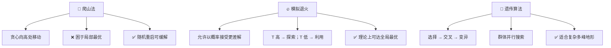

### 2.5 对抗搜索：极小极大算法、Alpha-Beta 剪枝、蒙特卡洛树搜索
- **对抗搜索 (Adversarial Search)** 适用于多智能体环境中**竞争性**的博弈场景——对手的目标与己方相反（零和博弈），搜索时需考虑对手的最优应对。
- **博弈问题形式化**：
    - **初始状态** `S₀`：棋盘初始布局；
    - **玩家函数** `Player(s)`：返回当前轮到谁走；
    - **动作集合** `Actions(s)`：当前状态下合法走法；
    - **转移模型** `Result(s, a)`：走一步后的结果状态；
    - **终局测试** `Terminal-test(s)`：游戏是否结束；
    - **效用函数** `Utility(s, p)`：对局结束时的收益（如国际象棋：赢 +1、输 -1、平 0）。
- **极小极大算法 (Minimax)**：
    - **核心思想**：MAX 方（我方）试图最大化最终收益，MIN 方（对手）试图最小化——双方交替决策，形成博弈树；
    - **递归定义**：设 `v(s)` 为状态 `s` 下 MAX 的最佳收益：
        - 若 `s` 为终局：`v(s) = Utility(s)`；
        - 若 MAX 走：`v(s) = max_{a ∈ Actions(s)} v(Result(s, a))`；
        - 若 MIN 走：`v(s) = min_{a ∈ Actions(s)} v(Result(s, a))`；
    - **复杂度**：若博弈树深度为 `d`，分支因子为 `b`，时间 `O(b^d)`，空间 `O(bd)`（深度优先实现）。国际象棋中 `b ≈ 35，d ≈ 100`，穷举完全不可行。
- **Alpha-Beta 剪枝 (Alpha-Beta Pruning)**：
    - **核心思想**：在 minimax 搜索过程中，动态维护两个边界：`α`（MAX 的当前最佳选择下界）和 `β`（MIN 的当前最佳选择上界）。当某条路径确定不可能改进当前已找到的最优值时，即可**剪枝**——不再探索该子树；
    - **剪枝条件**：若 `v ≥ β`，对 MAX 节点剪枝（β 剪枝），因为 MIN 不会让这种情况发生；若 `v ≤ α`，对 MIN 节点剪枝（α 剪枝），因为 MAX 不会选择这条路；
    - **效率提升**：理想情况下（对子节点按最优优先排序），Alpha-Beta 剪枝可将复杂度从 `O(b^d)` 降至 `O(b^(d/2))`——即约等于 Minimax 搜索深度的**两倍**。这意味着在相同时间内可以"多前瞻两步"；
    - **节点排序至关重要**：启发式排序（如国际象棋中的吃子优先、杀王优先）可使剪枝效率接近理论最优。
- **蒙特卡洛树搜索 (Monte Carlo Tree Search, MCTS)**：
    - **背景**：传统 Minimax（含 Alpha-Beta）依赖评估函数与深度限制，在围棋等大分支因子的游戏中力不从心（`b ≈ 250`）。MCTS 另辟蹊径，不做穷举搜索，而通过**随机模拟（Playout/Rollout）**估计胜率；
    - **四步循环**：
        - **选择 (Selection)**：从根节点出发，依据树策略（如 UCB1 公式）选择最有价值的子节点，直至到达**未完全展开的节点**；
        - **扩展 (Expansion)**：若叶节点不是终局，为其添加一个（或多个）子节点；
        - **模拟 (Simulation)**：从新节点出发，执行随机走子（或轻量级策略）直至终局，得到胜负结果；
        - **反向传播 (Backpropagation)**：将模拟结果沿路径向上更新各节点的访问次数与胜率统计；
    - **UCB1 公式**：平衡**利用**（高胜率节点）与**探索**（被访问少的节点）：
        `UCT(j) = wⱼ / nⱼ + C · √(ln N / nⱼ)`
        其中 `wⱼ` 为节点 `j` 的获胜次数，`nⱼ` 为访问次数，`N` 为父节点访问次数，`C` 为探索常数；
    - **AlphaGo / AlphaZero**：在 MCTS 框架中嵌入深度神经网络——策略网络指导选择与扩展（替代随机走子），价值网络评估局面（替代随机模拟），实现了超越人类世界冠军的水平。AlphaZero 进一步移除人类棋谱依赖，完全通过自对弈学习。

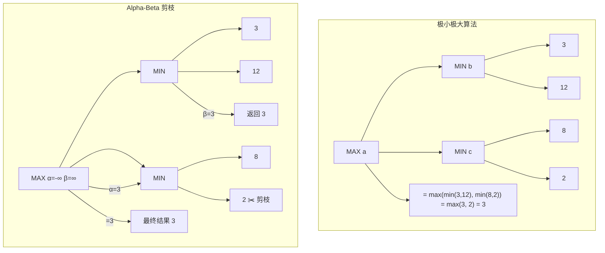

### 2.6 约束满足问题（CSP）：回溯搜索、前向检验、弧相容、AC-3 算法
- **约束满足问题 (Constraint Satisfaction Problem, CSP)** 将状态表示为一组**变量**及其**值域**之间的**约束**——搜索目标不再是找到到达目标状态的路径，而是找到一组满足所有约束的变量赋值。CSP 的表示力强，可自然地建模调度、配置、排课、地图着色等大量实际问题。
- **CSP 的三要素**：
    - **变量集合** `X = {X₁, X₂, …, Xₙ}`：待赋值的实体；
    - **值域集合** `D = {D₁, D₂, …, Dₙ}`：每个 `Xᵢ` 的可取值集合（可为离散或连续，但 CSP 通常处理有限离散值域）；
    - **约束集合** `C = {C₁, C₂, …, Cₘ}`：规定变量赋值之间的合法组合——可以是**一元约束**（限制单个变量）、**二元约束**（涉及两个变量，如 `Xᵢ ≠ Xⱼ`）、**全局约束**（涉及多个变量，如 `AllDiff`）。
- **CSP 搜索的特点**：
    - **赋值是交换的**：先给 A 赋值再给 B 赋值，与相反顺序的结果相同，因此 CSP 不必考虑路径——只需按变量顺序赋值即可，搜索空间缩小为 `O(dⁿ)` 而非 `O(n! · dⁿ)`；
    - **回溯搜索 (Backtracking Search)**：基本 CSP 求解算法，每次选择一个未赋值的变量，尝试其值域中的每个可能值，若当前赋值与约束冲突则回溯。本质是**带剪枝的深度优先搜索**；
    - **与经典搜索的区别**：CSP 的"状态"是部分赋值（而非世界状态的快照），"目标测试"是对所有变量赋值完毕且所有约束成立。
- **约束传播 (Constraint Propagation)**：
    - **核心思想**：在搜索过程中（甚至在搜索前），利用约束缩小变量的值域，提前排除不可能的值，减少无效搜索；
    - **前向检验 (Forward Checking, FC)**：为某一变量赋值后，立即检查所有尚未赋值的邻居变量，移除与其冲突的值——若某变量的值域因此变空，立即回溯。FC 是回溯搜索最常见的第一道防线；
    - **弧相容 (Arc Consistency, AC)**：对于二元约束 `C(X, Y)`，称边 `X → Y` 为**弧相容**的，当且仅当对 `X` 值域中每个值，在 `Y` 的值域中都存在至少一个值使得 `C` 被满足。AC 比前向检验传播得更远（考虑非直接邻居）；
    - **AC-3 算法**：最广泛使用的弧相容算法，将所有弧放入队列，依次检查每条弧是否相容——若某条弧不相容则删除对应值并重新将受影响的弧入列，直到队列为空。复杂度 `O(cd³)`（`c` 为约束数，`d` 为最大值域大小）；
    - **k-相容性 (k-Consistency)**：将相容性推广——1-相容（节点相容，每个值满足一元约束）、2-相容（弧相容）、强 k-相容（对所有 `i ≤ k` 均为 i-相容的）——更强的传播可进一步缩窄搜索空间，但计算代价相应增大。
- **变量与值的选择启发式**：
    - **最小剩余值 MRV (Minimum Remaining Values)**：选择当前值域最小的变量——即最可能受限的变量优先（"最易失败的先处理"）；
    - **度启发式 (Degree Heuristic)**：当 MRV 平局时，选择与其他未赋值变量约束最多的变量——最具影响力的先处理；
    - **最少约束值 (Least Constraining Value)**：选择给邻居变量留下最大选择余地的值——"留有余地"的值优先。
- **回溯搜索的改进**：
    - **回跳 (Backjumping)**：当在某变量值域全部尝试后均失败时，不是简单回溯到上一层，而是智能地跳回导致冲突的根源变量（冲突集分析）；
    - **学习 (Learning)**：将导致失败的赋值组合记录为新的约束（**诺戈德 NoGood**），避免将来重复尝试同样组合。

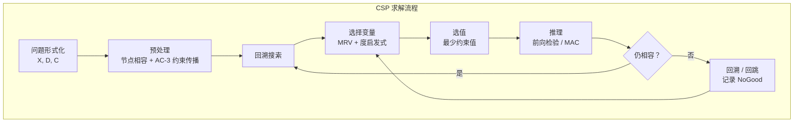

## 三、知识与推理
### 3.1 确定性推理 — 命题逻辑：语法与语义、推理规则、归结原理
- **命题逻辑 (Propositional Logic)** 是最简单的逻辑系统，其基本单位是**命题符号 (Proposition Symbol)**——每个命题符号代表一个或真或假的陈述（如 `P` = "下雨"，`Q` = "带伞"）。命题逻辑研究的是命题之间的真值关系，是确定性推理的基石。
- **语法 (Syntax)**——规定合法句子的构成规则：
    - **原子语句 (Atomic Sentence)**：单个命题符号（如 `P`、`Q`、`R`）及逻辑常量 `True`、`False`；
    - **复合语句 (Complex Sentence)**：由原子语句通过**逻辑连接词 (Logical Connectives)** 组合而成：
        - `¬` **否定 (Negation)**："非"；
        - `∧` **合取 (Conjunction)**："且"；
        - `∨` **析取 (Disjunction)**："或"；
        - `⇒` **蕴含 (Implication)**："如果…则…"（前提 ⇒ 结论）；
        - `⇔` **双向蕴含 (Biconditional)**："当且仅当"。
    - 语法是**递归定义**的：原子语句是语句；若 `α` 和 `β` 是语句，则 `¬α`、`α ∧ β`、`α ∨ β`、`α ⇒ β`、`α ⇔ β` 也是语句。
- **语义 (Semantics)**——规定语句在给定**模型 (Model)** 下的真值：
    - **模型**：对每个命题符号赋予真值 `True` 或 `False` 的一种指派。若问题中有 `n` 个命题符号，则共有 `2ⁿ` 个可能模型；
    - 复合语句的真值由各连接词的**真值表 (Truth Table)** 确定：

| `P` | `Q` | `¬P` | `P ∧ Q` | `P ∨ Q` | `P ⇒ Q` | `P ⇔ Q` |
|:---:|:---:|:---:|:---:|:---:|:---:|:---:|
| F | F | T | F | F | T | T |
| F | T | T | F | T | T | F |
| T | F | F | F | T | F | F |
| T | T | F | T | T | T | T |

> **注意**：`P ⇒ Q` 仅在 `P=True` 且 `Q=False` 时为假（"真前提推出假结论"），其余情况为真。这与自然语言中"如果…则…"的用法略有不同，但这是逻辑推理的标准约定。

- **逻辑核心概念**：
    - **有效 (Valid) / 重言式 (Tautology)**：在所有模型下均为真的语句（如 `P ∨ ¬P`）；
    - **可满足 (Satisfiable)**：至少存在一个模型使其为真；
    - **不可满足 (Unsatisfiable)**：在所有模型下均为假（与重言式相反）；
    - **逻辑蕴含 (Entailment)**：`KB ⊨ α` 表示"在所有使知识库 `KB` 为真的模型中，`α` 也为真"——即 `KB` 蕴含 `α`。这是推理的语义基础；
    - **逻辑等价 (Logical Equivalence)**：`α ≡ β` 当且仅当 `α ⊨ β` 且 `β ⊨ α`。

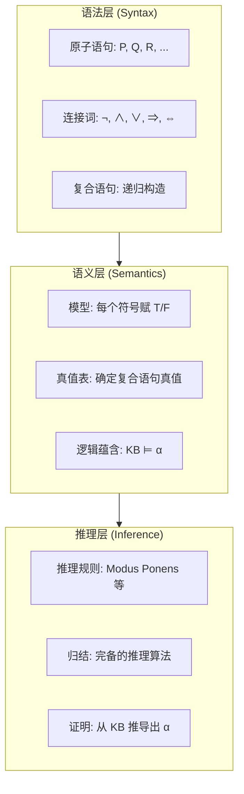

- **推理规则 (Inference Rules)**——在不枚举所有模型的情况下推导出新语句：
    - **假言推理 (Modus Ponens)**：已知 `α ⇒ β` 和 `α`，可推出 `β`；
    - **消去合取 (And-Elimination)**：已知 `α ∧ β`，可推出 `α`（或 `β`）；
    - **消去双重否定 (Double-Negation Elimination)**：已知 `¬¬α`，可推出 `α`；
    - **归结规则 (Resolution Rule)**：已知 `α ∨ β` 和 `¬β ∨ γ`，可推出 `α ∨ γ`。等价形式：已知 `¬α ⇒ β` 和 `β ⇒ γ`，可推出 `¬α ⇒ γ`（即**假言链推理**）；
    - **单元归结 (Unit Resolution)**：归结规则的特例——当 `γ` 为空（即 `α ∨ β` 与 `¬β`），推出 `α`。

- **推理的完备性**：
    - 上述推理规则是**可靠的 (Sound)**：推导出的语句必为逻辑蕴含（不会推出假结论）；
    - 但仅靠 Modus Ponens 等规则是**不完备的**：某些被蕴含的语句无法仅靠它们推导出来。我们需要归结原理。

- **归结原理 (Resolution Principle)**：
    - **核心思想**：归结是一条约简化的**单一推理规则**，它与**归结反演 (Resolution Refutation)** 策略结合后，构成**完备的**命题逻辑推理算法（即若 `KB ⊨ α`，则归结一定能证明它）；
    - **合取范式 (Conjunctive Normal Form, CNF)**：归结要求知识库中的语句表示为**子句的合取 (Conjunction of Clauses)**，其中每个子句是**文字的析取 (Disjunction of Literals)**，文字是命题符号或其否定。例如 `(P ∨ ¬Q) ∧ (¬P ∨ R) ∧ (Q ∨ ¬R)`；
    - **CNF 转换步骤**：
        ① 消去 `⇔`：`α ⇔ β` → `(α ⇒ β) ∧ (β ⇒ α)`；
        ② 消去 `⇒`：`α ⇒ β` → `¬α ∨ β`；
        ③ 将 `¬` 内移（德摩根律）：`¬(α ∧ β)` → `¬α ∨ ¬β`，`¬(α ∨ β)` → `¬α ∧ ¬β`；
        ④ 分配律：将 `∨` 分配到 `∧` 内部，如 `(α ∧ β) ∨ γ` → `(α ∨ γ) ∧ (β ∨ γ)`。
    - **归结算法**：对知识库 `KB` 取 `KB ∧ ¬α`（即假设 `α` 为假），转换为 CNF，反复对每对包含互补文字的子句应用归结规则，若最终推导出**空子句 (Empty Clause, □)**——表示矛盾，则原命题 `α` 得证。空子句的出现意味着 `KB ∧ ¬α` 不可满足，故 `KB ⊨ α`。

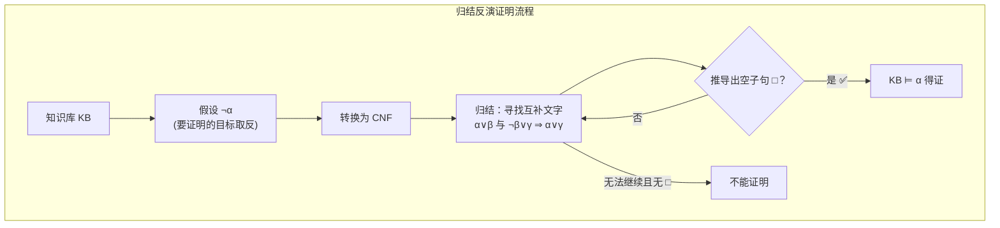

> **示例**：设 `KB = {P ⇒ Q, Q ⇒ R}`，要证明 `P ⇒ R`。取 `¬(P ⇒ R) = P ∧ ¬R`，CNF 化后得到子句集 `{¬P ∨ Q, ¬Q ∨ R, P, ¬R}`。归结 `¬P ∨ Q` 与 `P` → `Q`；归结 `Q` 与 `¬Q ∨ R` → `R`；归结 `R` 与 `¬R` → `□`。得证。

### 3.2 一阶谓词逻辑：量词、合一、前向/反向链接
- **一阶谓词逻辑 (First-Order Logic, FOL)** 扩展了命题逻辑的表达能力，使其能够描述**对象、对象之间的关系以及关于对象集合的概括性陈述**。命题逻辑只能讨论"整句"的真假，而 FOL 可以深入到句子内部，表达"所有"和"存在"这样的量化关系。
- **语法扩展（相对于命题逻辑）**：
    - **常量 (Constants)**：表示具体对象，如 `John`、`Book1`、`3`；
    - **谓词 (Predicates)**：表示对象之间的关系或属性，如 `Brother(John, Richard)`（John 是 Richard 的兄弟）、`Red(Ball)`（球是红色的）；
    - **函数 (Functions)**：从对象到对象的映射，如 `FatherOf(John)`、`LeftLegOf(Person)`。注意函数返回值仍是对象（项），而非真值；
    - **项 (Term)**：引用对象的逻辑表达式——常量是项，变量是项，`函数(项₁, 项₂, ...)` 也是项；
    - **原子语句 (Atomic Sentence)**：由谓词后接若干项构成，如 `Loves(John, Mary)`——当谓词所表示的关系在对象间成立时为真；
    - **连接词**：`¬, ∧, ∨, ⇒, ⇔`——与命题逻辑相同，用于组合复杂语句。
- **量词 (Quantifiers)**——FOL 的核心表达能力来源：
    - **全称量词 ∀ (Universal Quantifier)**：`∀x P(x)` 表示"对所有对象 `x`，`P(x)` 为真"。通常情况下，`∀` 与 `⇒` 搭配使用：`∀x King(x) ⇒ Person(x)`（"所有国王都是人"）；
    - **存在量词 ∃ (Existential Quantifier)**：`∃x P(x)` 表示"至少存在一个对象 `x`，使得 `P(x)` 为真"。通常情况下，`∃` 与 `∧` 搭配使用：`∃x Crown(x) ∧ OnHead(x, John)`（"某物是皇冠且在 John 头上"）；
    - **量词的辖域 (Scope)**：量词的作用范围是紧随其后的子公式（可用括号界定）。变量在量词辖域内的出现称为**约束出现 (Bound)**，否则为**自由出现 (Free)**；
    - **量词嵌套**：`∀x ∃y Loves(x, y)`（"每个人爱某人"）与 `∃y ∀x Loves(x, y)`（"存在某人被所有人爱"）含义完全不同，顺序至关重要。

- **语义**：
    - **解释 (Interpretation)**：FOL 语句的真值依赖于对常量、谓词、函数的解释——即指定一个**论域 (Domain)**（对象集合）以及每个常量符号指称哪个对象、每个谓词符号对应论域上的哪个关系、每个函数符号对应论域上的哪个映射；
    - **模型**：使语句为真的解释称为该语句的模型。`KB ⊨ α` 仍表示"在所有使 KB 为真的解释下，α 也为真"。

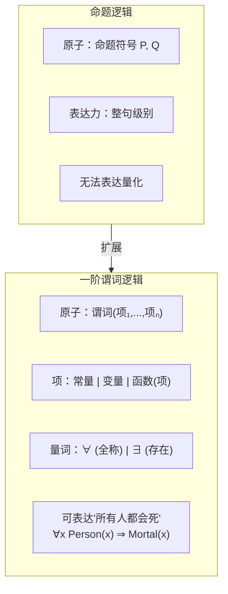

- **全称实例化与存在实例化**——将带量词的语句转换为命题化语句：
    - **全称实例化 (Universal Instantiation, UI)**：从 `∀v α` 可推导出以任意**基项 (Ground Term)** 替代 `v` 后的 `α`。例如从 `∀x King(x) ⇒ Person(x)` 可得 `King(John) ⇒ Person(John)`。UI 可以反复应用，以产生多条新语句；
    - **存在实例化 (Existential Instantiation, EI)**：从 `∃v α` 可引入一个新的 **Skolem 常量** 替代 `v`。例如从 `∃x Crown(x) ∧ OnHead(x, John)` 可得 `Crown(C₁) ∧ OnHead(C₁, John)`，其中 `C₁` 是此前未出现的新常量（代表"那个存在的对象"，但不知具体是谁）。

- **合一 (Unification)**——使两个逻辑表达式变得相同的变量替换：
    - **动机**：在推理过程中，我们需要判断两个原子语句是否能够匹配。例如要使用 Modus Ponens：已知 `∀x King(x) ⇒ Person(x)`，想知道是否能推出 `Person(John)`——这要求将 `x` 替换为 `John`，使得 `King(x)` 与 `King(John)` 匹配；
    - **定义**：**合一 (Unification)** 是找到一组变量替换 `θ = {v₁/t₁, v₂/t₂, ...}`（读作"将变量 `vᵢ` 替换为项 `tᵢ`"），使得两个或多个表达式在应用替换后变得完全相同。`θ` 称为**合一替换 (Unifier)**；
    - **最一般合一 (Most General Unifier, MGU)**：两个表达式可能存在多个合一替换，其中**约束最少**的那个（即所有其他合一替换都是其特例的）称为 MGU。例如对 `Knows(John, x)` 与 `Knows(y, MotherOf(y))`，MGU 为 `{y/John, x/MotherOf(John)}`——将 `y` 替换为 `John` 比替换为 `John` 后再指定 `x` 的具体值更一般；
    - **发生检查 (Occurs Check)**：合一算法必须检查变量是否出现在替换项中，如 `S(x)` 与 `x` 不能合一——否则会产生无限递归结构。Prolog 出于效率考虑省略了此检查，但在标准合一算法中不可缺少。

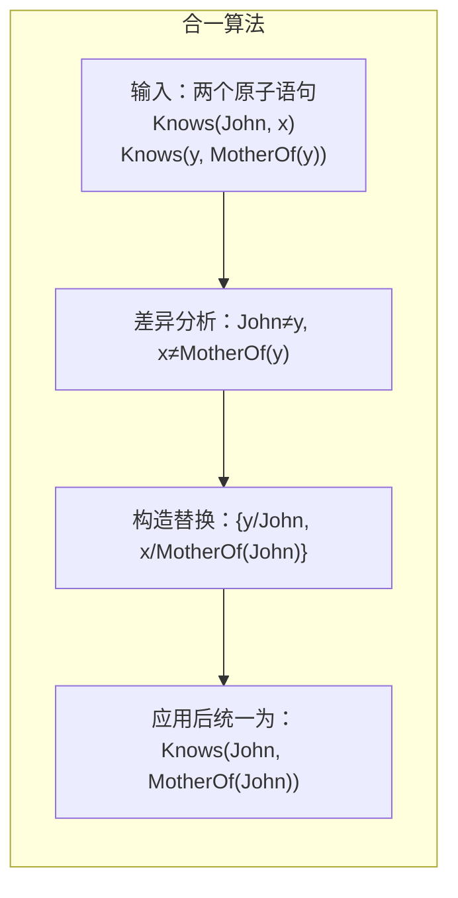

- **前向链接 (Forward Chaining)**：
    - **适用场景**：从已知事实出发，反复应用蕴含式 `Premise ⇒ Conclusion` 推导新事实，直至目标得证或无新事实可推。适用于**数据驱动 (Data-Driven)** 的推理场景——"从已知事实能推出什么？"；
    - **前提形式要求**：知识库中的句子必须是**确定子句 (Definite Clause)**——恰好包含一个正文字的析取式（等价于"合取前提 ⇒ 单个结论"的蕴含式），如 `P₁ ∧ P₂ ∧ ... ∧ Pₙ ⇒ Q`；
    - **算法流程**：
        ① 将所有已知事实加入事实集合；
        ② 扫描所有蕴含式，若某蕴含式的前提全部已知但结论尚未在事实集合中，触发该规则，将结论加入事实集；
        ③ 重复步骤②直至目标事实出现（成功）或无新事实可推（失败）。
    - **Rete 算法**：前向链接在生产系统中非常高效——Rete 算法通过构建规则网络、增量匹配事实变化，避免重复扫描所有规则，是实现高效前向链接的经典算法；
    - **性质**：对确定子句是**可靠的**和**完备的**，时间复杂度与数据量及规则数成正比。在专家系统、事件处理中广泛使用。

- **反向链接 (Backward Chaining)**：
    - **适用场景**：从目标出发，反向寻找支持目标的前提。适用于**目标驱动 (Goal-Driven)** 的推理场景——"如何证明这个目标？"；
    - **算法流程**：
        ① 从待证目标 `Q` 出发；
        ② 检查 `Q` 是否已在已知事实中，若是则成功；
        ③ 否则，找到所有以 `Q` 为结论的蕴含式 `P₁ ∧ ... ∧ Pₙ ⇒ Q`，将 `P₁, ..., Pₙ` 作为新的子目标递归证明；
        ④ 若所有子目标均被满足，则目标得证（通常采用深度优先搜索）；
    - **与 Prolog 的联系**：Prolog 的执行策略本质上是**带合一的反向链接 + 深度优先搜索**，并内置了**回溯机制**（当一条规则失败时自动尝试下一条）。
    - **性质**：对确定子句可靠且完备，搜索空间通常远小于前向链接（仅展开与目标相关的部分）。在定理证明、逻辑编程中广泛使用。


### 3.3 归结反演与逻辑程序设计（Prolog 简介）
- **归结反演 (Resolution Refutation)** 是将命题逻辑的归结原理推广到一阶谓词逻辑的完备推理方法——通过**反证法 (Proof by Contradiction)** 来证明逻辑蕴含关系。
- **一阶逻辑归结的额外挑战**：
    - 命题逻辑归结只需处理**互补文字**（`P` 与 `¬P`），而一阶逻辑中的原子语句包含变量，需要通过**合一**来判断两个文字是否互补。例如 `¬Knows(John, x) ∨ Hates(John, x)` 与 `Knows(John, Jane)` 通过合一 `{x/Jane}` 后可归结出 `Hates(John, Jane)`；
    - 归结时需对两个子句应用**合一替换**，使互补文字变得相同：若子句 `C₁` 包含文字 `L₁`，子句 `C₂` 包含文字 `¬L₂`，且 `L₁` 与 `L₂` 存在 MGU `θ`，则归结结果为 `(C₁ - {L₁})θ ∪ (C₂ - {¬L₂})θ`。
- **一阶逻辑 CNF 转换——Skolem 化 (Skolemization)**：
    - 一阶逻辑语句转换为 CNF 的步骤与命题逻辑类似，但需额外处理量词：
        ① **消去蕴含词** `⇒` 和 `⇔`；
        ② **将 `¬` 内移**至原子语句前（利用量词与 `¬` 的关系：`¬∀x P` → `∃x ¬P`，`¬∃x P` → `∀x ¬P`）；
        ③ **变量标准化 (Standardize Variables)**：使不同量词约束的变量使用不同名称，避免命名冲突；
        ④ **Skolem 化 (Skolemization)**：消除存在量词。将 `∃x P(x)` 替换为 `P(C)`（引入新的 Skolem 常量），将 `∀x ∃y Loves(x, y)` 替换为 `∀x Loves(x, F(x))`（引入 **Skolem 函数** `F`，其参数为外围全称量词约束的变量——表示 `y` 的值依赖于 `x`）；
        ⑤ **前束化 (Drop Universal Quantifiers)**：将所有全称量词移至最外层后直接省略（剩余变量被隐式全称量化）；
        ⑥ **分配 ∨ 对 ∧**：得到合取范式 CNF（子句的合取）。
    - Skolem 化的关键直觉：`∀x ∃y Loves(x, y)`（"每人爱某人"）中，被爱的人 `y` 依赖于 `x`，因此用函数 `F(x)` 替代——而不能用常量（常量意味着所有人爱的是同一个人，语义会改变）。
- **因子化 (Factoring)**：归结前的一个辅助步骤——若某子句内部包含可以合一的多个文字，可将它们合并（减少冗余文字），这有助于提高归结效率。

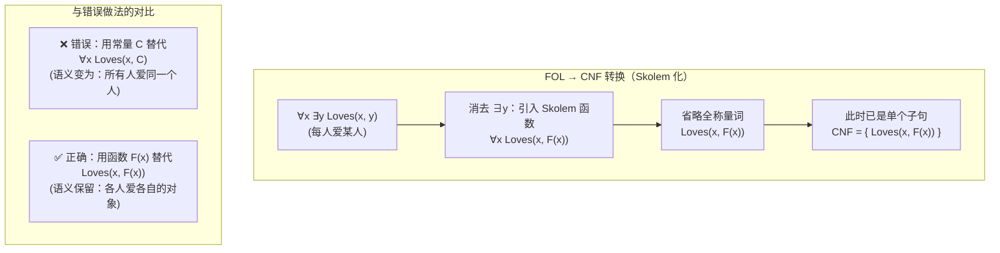

- **归结反演策略**——控制归结搜索的实用方法：
    - 盲目地对所有子句两两归结会导致组合爆炸，因此需要策略来限制搜索：
    - **单元优先策略 (Unit Preference)**：优先使用至少包含一个单文字子句的归结（单文字子句信息量集中）；
    - **支持集策略 (Set of Support)**：每次归结至少涉及一个来自目标取反（`¬α`）或其派生子句的子句——将搜索聚焦于与待证目标相关的部分；
    - **输入归结 (Input Resolution)**：每次归结至少使用一个原始（输入）子句——Prolog 的 SLD 归结即属此类，虽不完备但高效；
    - **线性归结 (Linear Resolution)**：每次归结的父辈之一必须是上一步的归结结果——形成线性链，是 SLD 归结的泛化形式，且**完备**。

- **逻辑程序设计 (Logic Programming)**：
    - **核心理念**：用逻辑语句直接"编程"——程序员声明关于问题领域的逻辑公理（知识），系统通过自动推理来"执行"程序。即"算法 = 逻辑 + 控制"中的"逻辑"部分由程序员提供，"控制"由推理引擎负责；
    - **Horn 子句 (Horn Clause)**：至多包含一个正文字的子句——逻辑程序设计的基础。Horn 子句可分为：
        - **事实 (Fact)**：恰好一个正文字、无负文字，如 `Parent(John, Mary)`；
        - **规则 (Rule)**：恰好一个正文字 + 至少一个负文字，等价于 `结论 :- 前提₁, 前提₂, ...`，如 `Grandparent(x, z) :- Parent(x, y), Parent(y, z)`；
        - **查询 (Query / Goal)**：无正文字、至少一个负文字，即将待证目标的取反作为子句。
    - **SLD 归结 (SLD Resolution)**：Prolog 的核心推理机制——**S**election rule driven **L**inear resolution for **D**efinite clauses（对确定子句的、基于选择规则的线性归结）。每次都选择查询中的第一个文字与某条规则/事实的头进行合一与归结，深度优先搜索，发生失败时**回溯**尝试其他规则。

- **Prolog 简介**：
    - **程序结构**：Prolog 程序由一系列 Horn 子句（事实和规则）组成，执行时用户提交一个查询，Prolog 试图通过反向链接证明该查询；
    - **基本语法示例**：
        ```prolog
        % 事实：John 是 Mary 的父亲
        parent(john, mary).
        % 事实：Mary 是 Ann 的父亲
        parent(mary, ann).
        % 规则：若 X 是 Y 的父辈且 Y 是 Z 的父辈，则 X 是 Z 的祖父
        grandparent(X, Z) :- parent(X, Y), parent(Y, Z).
        % 查询：John 是 Ann 的祖父吗？
        ?- grandparent(john, ann).   % → true
        % 查询：谁是谁的祖父？
        ?- grandparent(X, Y).        % → X=john, Y=ann
        ```
    - **执行模型**：Prolog 将查询中的每个目标按从左到右顺序证明，对每个目标从上到下尝试匹配规则头——**深度优先搜索 + 回溯**。当所有目标均满足时，返回当前变量绑定作为答案；如需更多答案，键入 `;` 触发回溯继续搜索；
    - **Prolog 的特色机制**：
        - **合一**：Prolog 的模式匹配能力非常强大——`=` 操作符执行合一，如 `[H|T] = [1, 2, 3]` 成功并绑定 `H=1, T=[2,3]`；
        - **列表**：Prolog 列表采用 `[Head|Tail]` 表示法（类似 Lisp 的 cons 结构），是递归定义和处理的理想数据结构；
        - **回溯与 Cut（`!`）**：Cut 操作符 `!` 是一个始终成功的原子，但副作用是**冻结此前所做的选择**（不允许回溯到 cut 之前尝试其他匹配）。它用于修剪搜索空间、提高效率，但过度使用会破坏程序的逻辑纯洁性；
        - **失败即否定 (Negation as Failure)**：Prolog 的 `\+`（not）操作符不表示逻辑否定，而是"无法证明"——`\+ P` 当且仅当 Prolog 在有限步骤内无法证明 `P` 时为真。这要求被否定的目标必须是**完全实例化的（Ground）**，否则可能产生错误结果。
    - **Prolog 的优缺点**：
        - ✅ 极强的关系型问题表达能力，代码简洁（如数行代码即可实现简单的定理证明器、自然语言解析器）；
        - ✅ 内置合一、回溯和符号推理能力，非常适合原型开发与符号 AI 任务；
        - ❌ 深度优先搜索的固有缺点——可能陷入无限递归或重复搜索（需程序员手动调整规则顺序和 cut 优化）；
        - ❌ 执行效率不如命令式语言，且缺乏模块化特性，调试难度较大。


### 3.4 产生式系统与专家系统
- **产生式系统 (Production System)** 是一种基于**规则 (Rule)** 的计算模型，广泛用于模拟人类推理过程，是专家系统的核心推理架构。其核心思想是将知识表示为"**如果…则…** (IF-THEN)"形式的产生式规则，通过规则的解释与执行实现自动推理。
- **产生式系统的三大组件**：
    - **① 工作记忆 (Working Memory, WM)**：存放当前已知的事实集合（当前状态）。工作记忆是动态变化的——推理过程中新事实不断加入，代表系统当前"所知道的信息"。形式上，工作记忆中的每个事实是一个符号表达式（如 `(temperature patient-1 39.5)`）；
    - **② 产生式规则库 (Production Rule Base)**：存放领域知识的长期记忆，每条规则形如 `IF <条件> THEN <动作>`。条件部分是若干事实模式的合取，动作部分可以包括：向 WM 添加新事实、从 WM 删除事实、修改 WM 中的事实、执行外部操作；
    - **③ 推理引擎 (Inference Engine)**：控制规则的解释与执行——决定何时触发哪条规则、以何种顺序应用规则。它按**识别-动作循环 (Recognize-Act Cycle)** 工作，是产生式系统的"大脑"。
- **识别-动作循环 (Recognize-Act Cycle)**——产生式系统的核心执行机制：
    - **① 匹配 (Match)**：扫描规则库中所有规则的条件部分，找出条件与当前工作记忆内容**匹配**的规则——这些规则构成**冲突集 (Conflict Set)**。条件匹配的本质是模式匹配（通常涉及变量绑定），Rete 算法通过构建规则网络大幅加速这一步骤；
    - **② 冲突消解 (Conflict Resolution)**：从冲突集中选择**一条**规则来触发。常见策略包括：
        - **优先级 (Priority)**：每条规则预分配优先级，优先执行高优先级规则；
        - **特殊性 (Specificity)**：条件更具体（匹配更多事实模式）的规则优先——"更详细的规则更可靠"；
        - **最近性 (Recency)**：优先使用匹配了最近加入 WM 的事实的规则——保持推理的连贯性；
        - **随机选择 (Random)**：无偏好地随机选择，避免策略偏差；
    - **③ 执行 (Act)**：触发被选中的规则，执行其动作部分（增添/删除/修改 WM 中的事实，或执行外部 I/O 操作）。执行后 WM 内容发生变化，循环回到匹配阶段，直至冲突集为空（无可触发规则）或遇到终止指令。

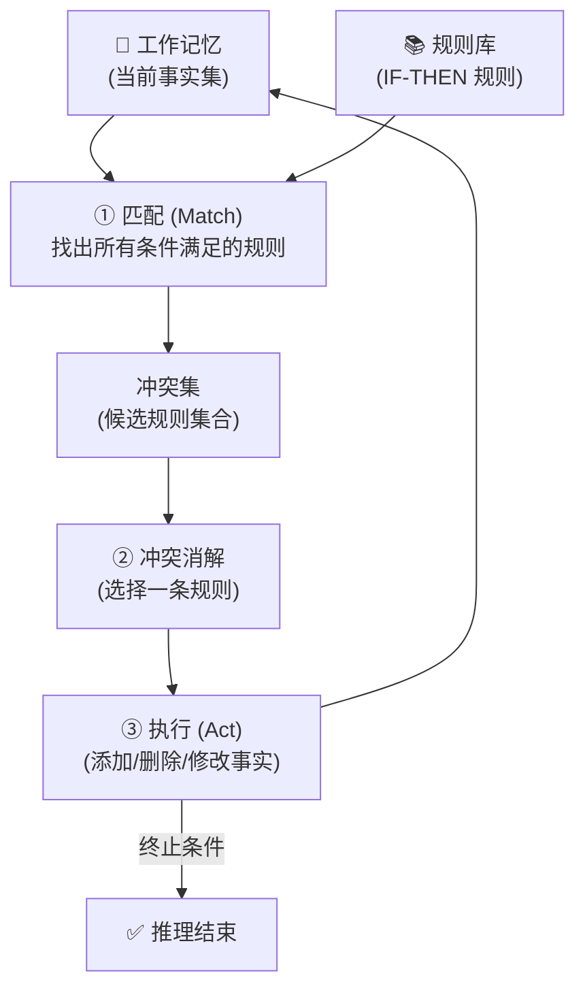

- **产生式系统的推理方向**：
    - **前向推理 (Forward Chaining)**：从已知事实出发，反复触发规则推导出新事实，直至目标事实出现。适用于"给定现状，能得出什么结论？"的监控、诊断场景；
    - **反向推理 (Backward Chaining)**：从待证目标出发，反向寻找满足条件的事实。适用于"这个假设是否成立？"的验证、问答场景；
    - **混合推理 (Bidirectional)**：同时从事实和目标两端推进，于中间会合——兼顾前向的广度与后向的聚焦。

- **专家系统 (Expert System)**——产生式系统最经典的应用载体：
    - **定义**：专家系统是一种在特定领域内，利用人类专家的知识和推理方法，模拟专家的决策过程以解决复杂问题的智能程序。它产生于 20 世纪 70–80 年代，是 AI "知识期"的巅峰产物；
    - **核心哲学**：将**领域知识**与**推理机制**分离——知识库（Know-What）由领域专家与知识工程师协作构建，推理引擎（Know-How）是独立于领域的通用组件。这一分离使系统具有**可解释性**和**可维护性**。
- **专家系统的经典架构**：

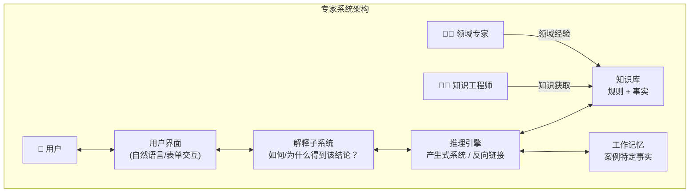

- **知识获取瓶颈 (Knowledge Acquisition Bottleneck)**：专家系统面临的核心工程挑战——将领域专家的隐性知识（直觉、经验法则、判断标准）显式编码为规则的过程异常困难且耗时。专家往往"知道怎么做但说不清为什么"，导致知识库难以完整、一致性难以保障。
- **里程碑系统**：
    - **MYCIN (1976, Stanford)**：用于诊断血液感染疾病并推荐抗生素方案的医学专家系统。它拥有约 450 条规则，采用**反向链接**推理，其诊断表现超过部分初级医生（在特定感染类型上）。MYCIN 最重要的遗产是提出了**不确定性推理的确定性因子 (Certainty Factor)** 模型——规则结论附带一个介于 -1 到 1 之间的确信度值，其组合运算独立于概率理论的严格要求；
    - **XCON / R1 (1980, CMU → DEC)**：为 Digital Equipment Corporation (DEC) 配置 VAX 计算机系统的商用专家系统。它包含约 10,000 条规则，采用**前向链接**推理，能从客户订单自动生成完整配置清单。R1 是首个大规模产业部署的专家系统，DEC 估计其为公司每年节省约 4000 万美元。
- **专家系统的优点与局限**：
    - ✅ **可解释性**：能追溯推理链路，解释"为什么"得到某个结论（展示触发的规则链）——这在医疗、法律等高风险领域至关重要；
    - ✅ **知识永久化**：专家知识被编码为显式规则，不会因人员流动而丢失；
    - ✅ **决策一致性**：相同输入始终产生相同输出，不受疲劳、情绪影响；
    - ❌ **知识获取瓶颈**：隐性知识难以提取，规则难以覆盖所有边界情况；
    - ❌ **脆弱性 (Brittleness)**：一旦输入超出知识库覆盖范围，系统表现急剧下降——缺乏常识与类比推理能力；
    - ❌ **维护困难**：随着规则数量增长（成千上万条），规则间的隐含交互导致不可预测的副作用，修改一条规则可能破坏之前正常工作的推理链。
- **产生式系统与专家系统的现代遗产**：
    - **业务规则引擎 (BRMS)**：Drools、IBM ODM 等在金融风控、保险核保领域广泛应用；
    - **复杂事件处理 (CEP)**：基于规则的实时事件流处理；
    - **知识图谱推理**：OWL/RDF 的规则推理引擎继承了产生式系统的设计思想；
    - **与机器学习的互补**：现代系统常结合规则（符号知识）与机器学习模型（统计模式），实现可解释性与鲁棒性的平衡。

### 3.5 知识表示 — 语义网络与框架表示法
- **知识表示 (Knowledge Representation)** 是符号 AI 的核心问题：如何将现实世界的知识编码为计算机可存储、操作与推理的形式化结构？不同的表示方式决定了知识的表达力、推理效率和可维护性。语义网络和框架是两种经典的**结构化知识表示**方法，其共同特征是利用**层次结构与继承机制**组织知识。
- **语义网络 (Semantic Network)**：
    - **基本概念**：语义网络由**节点 (Node)** 和**弧 (Arc / Edge)** 组成的**有向图 (Directed Graph)**。节点表示概念、实体、事件或属性；弧表示节点之间的二元关系。这种表示由 Quillian (1968) 首次提出，灵感来源于人类联想记忆中的扩散激活模型。
    - **核心关系类型**：
        - **IS-A（泛化-特化）**：表示子类与父类之间的层次关系，如 `Dog → IS-A → Mammal`。IS-A 链接隐含了**属性继承 (Property Inheritance)**——所有对 Mammal 成立的属性自动对 Dog 成立；
        - **AKO（A Kind Of）** 与 IS-A 同义，侧重类之间的从属；
        - **Instance-Of**：表示个体与类之间的实例关系，如 `Fido → Instance-Of → Dog`；
        - **Has-Property / Has-Part / Caused-By** 等自定义关系：表达了领域特定的语义联系。
    - **属性继承与推理**：语义网络的主要推理形式是**基于继承的查询**和**路径追踪**。例如："Fido 是温血动物吗？"→ 从 Fido 出发，沿 Instance-Of 到达 Dog，再沿 IS-A 到达 Mammal，再沿 Has-Property 到达 WarmBlooded → 答案"是"。这一过程在结构上等价于**图的路径搜索**；
    - **分区 (Partition)**：为处理全称量词和存在量词的推理，Hendrix (1975) 引入分区概念——将网络划分为嵌套的"空间"，每个空间代表一个断言范围或可能世界。

```mermaid
graph TD
    subgraph SN["语义网络示例"]
        ANIMAL["Animal"] -->|"Has-Property"| ALIVE["Alive"]
        ANIMAL -->|"Has-Property"| BREATHE["Breathes"]
        MAMMAL["Mammal"] -->|"IS-A"| ANIMAL
        MAMMAL -->|"Has-Property"| WARM["WarmBlooded"]
        DOG["Dog"] -->|"IS-A"| MAMMAL
        DOG -->|"Has-Part"| TAIL["Tail"]
        FIDO["Fido"] -->|"Instance-Of"| DOG
        FIDO -->|"Has-Property"| BROWN["Brown"]
        MAMMAL -->|"Has-Property"| HAIR["Has Hair"]
    end

    subgraph INHERIT["继承推理"]
        FIDO -.->|"继承自 Dog"| TAIL
        FIDO -.->|"继承自 Mammal"| WARM
        FIDO -.->|"继承自 Mammal"| HAIR
        FIDO -.->|"继承自 Animal"| ALIVE
    end

    FIDO ===|"多重继承链"| INHERIT
```

- **语义网络的优点与局限**：
    - ✅ 直观性：节点和弧的图结构与人类联想记忆模型一致，易于理解和可视化；
    - ✅ 继承效率：通过 IS-A 层次，避免为每个个体显式存储所有属性，知识存储紧凑；
    - ❌ **语义歧义性**：节点和弧的含义缺乏形式化的语义定义——同一弧标签在不同上下文中可能表示完全不同的逻辑关系（statements, definitions, defaults），导致推理结果不确定；
    - ❌ **表达力有限**：难以自然地表达否定、析取、存在量词等逻辑关系（虽可借助分区等扩展，但破坏了简单性）；
    - ❌ **缺乏标准**：不同语义网络系统使用各自的关系集和推理约定，互操作性差。

- **框架表示法 (Frame Representation)**：
    - **背景与动机**：Marvin Minsky 于 1975 年提出**框架理论 (Frame Theory)**。他观察到，人类在进入新场景时并非从零开始分析，而是激活一个**原型框架**——一种关于典型场景的数据结构。例如走进一个从未见过的教室，你能立刻推断出"有黑板""有桌椅""有讲台"，因为你具备"教室框架"。框架表示法正是将这种认知模型形式化。
    - **框架结构**：
        - 每个**框架 (Frame)** 代表一个概念、对象或场景类型，由一个框架名和一组**槽 (Slot)** 组成；
        - 每个槽描述该概念的一个属性，槽本身又包含多个**侧面 (Facet)**：
            - **值 (Value)**：属性的当前值；
            - **默认值 (Default / IF-NEEDED)**：当值未被明确指定时使用的典型值；
            - **类型约束 (Value Type / Range)**：该槽允许填充的值的类型范围；
            - **附加过程 (Procedural Attachment)**：在特定条件下自动触发的程序——IF-ADDED（槽被赋值时触发）、IF-NEEDED（槽被访问但值为空时触发）、IF-REMOVED（槽值被删除时触发）。
    - **框架系统示例**（用简化表示法）：

        ```
        Frame:  HOTEL_ROOM
          IS-A:  ROOM
          位置:  Hotel
          床位:  (Default: 1, Range: 1-4)
          价格:  (IF-NEEDED: 查询当前房价表)
          设施:  (Default: {TV, WiFi, 浴室})

        Frame:  ROOM
          用途:  住宿
          包含:  (Default: {床, 桌子, 椅子})
          面积:  (Range: 正整数)

        Frame:  HOTEL_ROOM-1203
          Instance-Of: HOTEL_ROOM
          床位:  2
          价格:  580
          设施:  {TV, WiFi, 浴室, MiniBar, 海景}
        ```

    - **框架层次与继承**：框架通过 IS-A / Instance-Of 槽形成层次结构。子框架自动**继承 (Inherit)** 所有祖先框架的槽及默认值，除非被子框架显式覆盖 (Override)。这与面向对象编程中的类继承完全同构——事实上，框架理论直接影响了 Smalltalk、CLOS 等早期 OOP 语言的设计，以及现代的本体论语言（OWL）；
    - **附加过程 (Demons / Procedural Attachment)**：框架最独特的特性是将**声明性知识**（槽和值）与**过程性知识**（附加过程）整合在同一结构中。例如：`IF-NEEDED` 槽值允许**按需计算（惰性求值）**，`IF-ADDED` 槽值允许在数据变更时自动触发一致性检查或推导——这提供了超越被动数据结构的主动推理能力。

```mermaid
graph TD
    subgraph FRAME["框架层次与继承"]
        ROOM["Frame: ROOM<br/>用途: 住宿<br/>包含: {床,桌,椅}<br/>面积: 正整数"]
        HOTEL["Frame: HOTEL_ROOM<br/>IS-A: ROOM<br/>床位: Default=1<br/>价格: IF-NEEDED 查询<br/>(继承 ROOM 全部槽)"]
        INST["Instance: HOTEL_ROOM-1203<br/>Instance-Of: HOTEL_ROOM<br/>床位: 2 (覆盖默认值)<br/>价格: 580 (覆盖 IF-NEEDED)<br/>(继承 包含: {床,桌,椅})"]
    end

    ROOM -->|"IS-A"| HOTEL -->|"Instance-Of"| INST
    ROOM -.->|"继承链"| INST
```

- **框架 vs 语义网络**：
    - 框架可以视为**结构化的语义网络**：语义网络的节点对应框架，弧对应槽；但框架额外提供了槽的复杂结构（侧面、默认值、附加过程），使表示更精确和可操作；
    - 框架更像"知识的结构模板"，语义网络更像"知识的关联图"——前者适合描述**原型性知识**（典型的 X 是什么样的），后者适合描述**关系性知识**（X 与 Y 之间有什么关系）。
- **框架表示法的优点与局限**：
    - ✅ **结构化强**：槽-侧面机制提供细粒度的知识组织，比语义网络更精确；
    - ✅ **默认推理**：默认值使系统能在信息不完整时做出合理假设（非单调推理）；
    - ✅ **模块化**：每个框架是自包含的知识单元，易于增删和复用；
    - ❌ **例外处理困难**：严格的继承链难以应对"通常成立但有例外"的情形（如"鸟会飞，但企鹅不会"）——这催生了后来的**缺省逻辑 (Default Logic)** 和**非单调推理**研究；
    - ❌ **动态变化知识表达力弱**：框架偏向静态原型，难以处理因果链条和时序变化。
- **对现代技术的奠基作用**：
    - 语义网络 → 知识图谱（RDF 三元组即节点-弧-节点的结构化版本）
    - 框架表示 → 面向对象编程（类、继承、方法）
    - 框架 + 描述逻辑 → OWL（Web 本体语言）
### 3.6 本体论与描述逻辑（OWL、RDF）
- **本体论 (Ontology)** 在 AI 领域中的定义源于哲学但有其特定含义。Tom Gruber (1993) 给出了最经典的定义：**"本体是概念化的形式化规约 (A formal specification of a conceptualization)"**。通俗来说，本体是对某一特定领域中的**概念、概念之间的关系以及约束**的显式、形式化、共享的描述——它告诉机器"这个词到底意味着什么"，从而使异构系统之间可以实现语义互操作。
- **本体的核心构成要素**：
    - **类 (Classes / Concepts)**：领域中的概念集合，组织为层次分类结构。如 `Person`、`Doctor`（Doctor 是 Person 的子类）；
    - **实例 (Instances / Individuals)**：类的具体个体。如 `张三` 是 `Doctor` 的一个实例；
    - **属性 (Properties / Roles)**：概念之间或概念与数据值之间的二元关系：
        - **对象属性 (Object Property)**：关联两个实例，如 `hasChild(Person, Person)`；
        - **数据属性 (Datatype Property)**：关联实例与字面值，如 `hasAge(Person, integer)`；
    - **公理 (Axioms)**：对类和属性的逻辑约束，如"Doctor 是 Person 的子类"、"hasChild 的逆属性是 hasParent"；
    - **推理规则 (Inference Rules)**：从已有知识推导新知识的逻辑规则。
- **描述逻辑 (Description Logic, DL)**——本体的形式化基石：
    - **动机**：语义网络和框架虽然直观，但缺乏精确的、可判定的逻辑语义。描述逻辑正是为解决这一问题而生——它是一族**一阶谓词逻辑的可判定片段 (Decidable Fragment of FOL)**，专门设计用于表示关于概念、角色和个体的结构化知识，并能高效执行自动推理；
    - **知识库的两部分**：
        - **TBox (Terminological Box)**：关于概念的**术语公理**——定义概念之间的层次关系与等价关系。如 `Doctor ⊑ Person`（Doctor 是 Person 的子类）、`Mother ≡ Woman ⊓ ∃hasChild.Person`（Mother 等价于"有孩子的人是女性"）；
        - **ABox (Assertional Box)**：关于个体的**断言公理**——陈述特定个体的属性与关系。如 `Doctor(zhangsan)`、`hasChild(zhangsan, xiaoming)`。
    - **概念构造器 (Concept Constructors)**——DL 从原子概念和角色出发构造复杂概念的运算符：

| 构造器 | 语法 | 含义 | 示例 |
|:---|:---|:---|:---|
| 原子概念 | `A` | 基础概念 | `Person` |
| 合取 (Intersection) | `C ⊓ D` | 同时属于 C 和 D | `Woman ⊓ Doctor` |
| 析取 (Union) | `C ⊔ D` | 属于 C 或 D | `Doctor ⊔ Nurse` |
| 否定 (Complement) | `¬C` | 不属于 C | `¬Smoker` |
| 存在量词 (Existential) | `∃R.C` | 存在某 R 关系指向的个体满足 C | `∃hasChild.Doctor` |
| 全称量词 (Universal) | `∀R.C` | 所有 R 关系指向的个体均满足 C | `∀hasChild.Happy` |
| 数量限制 (Number) | `≥n R.C`、`≤n R.C` | R 关系指向的、满足 C 的个体数下界/上界 | `≥2 hasChild` |

    - **核心推理任务**：
        - **可满足性 (Satisfiability)**：概念 C 是否有至少一个实例？（即 C 是否有内在矛盾？）
        - **包含性 / 归类 (Subsumption)**：概念 C 是否为概念 D 的子类？即 `C ⊑ D` 是否成立？
        - **实例检查 (Instance Checking)**：个体 a 是否属于概念 C？即 `C(a)` 是否被蕴含？
        - **一致性 (Consistency)**：知识库是否有模型（即是否不自相矛盾）？
    - **DL 的家族与命名规则**：不同 DL 在表达力和推理复杂度之间进行权衡。命名以 `AL`（Attribute Language）为基础，后缀字母表示支持的构造器：
        - `ALC`：基础 DL + 补（Complement）——命题逻辑闭包；
        - `S`：`ALC` + 传递角色（Transitive Roles）= `ALCᵣ₊`；
        - `SHIQ`：`S` + 角色层次（H）+ 逆角色（I）+ 数量限制（Q）；
        - `SHOIN(D)`：`SHIQ` + 枚举类（O）+ 数量限制增强（N）+ 具体域（D）——这是 OWL DL 的逻辑基础；
        - `SROIQ(D)`：`SHOIN(D)` + 复杂角色公理（R）——这是 **OWL 2 DL** 的逻辑基础。

```mermaid
graph TD
    subgraph DL_KB["描述逻辑知识库"]
        TBOX["📘 TBox (术语层)<br/>Mother ≡ Woman ⊓ ∃hasChild.Person<br/>HappyFather ≡ Man ⊓ ∀hasChild.Happy"]
        ABOX["📗 ABox (断言层)<br/>Woman(mary)<br/>hasChild(mary, john)<br/>Person(john)"]
    end
    subgraph REASON["推理引擎"]
        SAT["可满足性检查"]
        SUB["归类 (Subsumption)"]
        INST["实例检查"]
    end
    TBOX --> REASON
    ABOX --> REASON
    REASON --> INFER["推断结果<br/>Mother(mary) ← 玛丽被归类为 Mother<br/>Happy(john)? ← 无法推断（信息不足）"]
```

- **RDF (Resource Description Framework)**——语义网的基石数据模型：
    - **三元组 (Triple)**：RDF 将一切知识表示为 **⟨主语, 谓语, 宾语⟩** 三元组。主语是资源（URI）、谓语是属性（URI）、宾语可以是资源或字面值（字符串、数字等）。例如：`⟨ex:zhangsan, ex:hasAge, "35"^^xsd:integer⟩`；
    - **本质**：RDF 图是有向标记图——主语和宾语为节点，谓语为边。整个知识库构成一个巨大的分布式的互联图；
    - **RDFS (RDF Schema)**：RDF 本身的表达能力仅止于三元组。RDFS 在此基础上增加了关于类和属性的**模式层词汇**：
        - `rdfs:Class`、`rdfs:subClassOf`：声明类和类层次；
        - `rdfs:domain`、`rdfs:range`：声明属性的定义域（主语类型）和值域（宾语类型）；
        - `rdfs:subPropertyOf`：声明属性层次。
    - **RDF 序列化格式**：Turtle（`.ttl`，最简洁的人类可读格式）、RDF/XML、JSON-LD（适合 Web API）、N-Triples 等。
- **OWL (Web Ontology Language)**——面向 Web 的本体语言：
    - **三种子语言（OWL 1）**：
        - **OWL Lite**：表达能力最弱，支持简单的类层次和约束。推理复杂度最低；
        - **OWL DL**：以 `SHOIN(D)` 描述逻辑为基础，表达力与推理可判定性的最佳平衡。所有 OWL DL 本体都是描述逻辑知识库，保证推理算法能在有限时间内终止；
        - **OWL Full**：表达力最强（与 RDF 完全兼容），允许类的元类 (metaclass) 等用法，但推理**不可判定**——无法保证总能完成。
    - **OWL 2 (2009)**：在 OWL 1 基础上大幅增强表达力（基于 `SROIQ(D)` 描述逻辑），新增属性链、不对称属性、自反属性、更丰富的数据类型支持等。同时定义了三种**简化概要 (Profile)**——每种针对特定推理场景优化：
        - **OWL 2 EL**：专为大本体（如生物医学 SNOMED CT）的**多项式时间分类**设计；
        - **OWL 2 QL**：专为通过 SQL 重写进行**合取查询应答**设计（本体数据量大但查询简单）；
        - **OWL 2 RL**：规则语言（基于 Rule Interchange Format），适合传统规则引擎实现。
    - **OWL 核心词汇示例**：
        - `owl:equivalentClass`、`owl:disjointWith`：类等价、类互斥；
        - `owl:intersectionOf`、`owl:unionOf`：类交集、类并集；
        - `owl:Restriction`：对属性的存在/全称/数量约束；
        - `owl:inverseOf`：属性逆关系（`hasParent` 是 `hasChild` 的逆）。
- **SPARQL (SPARQL Protocol and RDF Query Language)**：查询 RDF 图的标准语言，类似于 SQL 之于关系数据库。支持图模式匹配、联合查询、可选匹配、聚合、路径表达式等。SPARQL 也是 W3C 标准，是语义网技术栈的"查询层"。
- **语义网技术栈总览**：

```mermaid
graph TD
    subgraph SEMWEB["语义网技术栈 (The Layer Cake)"]
        URI["URI / IRI<br/>资源标识符"] --> XML["XML / JSON<br/>序列化语法"]
        XML --> RDF["RDF<br/>三元组数据模型"]
        RDF --> RDFS["RDFS<br/>模式层: Class, subClassOf, domain, range"]
        RDFS --> OWL["OWL / OWL 2<br/>本体层: 描述逻辑, 复杂公理"]
        OWL --> RULES["RIF / SWRL<br/>规则层: 用户自定义推理规则"]
        RULES --> SPARQL["SPARQL<br/>查询层: 图模式匹配查询"]
        SPARQL --> LOGIC["逻辑 / 证明<br/>自动推理与验证"]
        LOGIC --> TRUST["信任层<br/>数字签名, 来源验证"]
    end
```

- **典型推理器 (Reasoners)**：实现 DL 推理的软件工具，用于检查本体一致性、自动计算分类层次、回答查询等。主流推理器包括：
    - **Pellet**：Java 实现的 OWL 2 DL 推理器，支持 SROIQ(D)；
    - **HermiT**：基于 Hypertableau 算法的 OWL 2 推理器，是 Protégé 的默认推理器；
    - **ELK**：专为 OWL 2 EL 大本体优化的多项式时间推理器（如分类 SNOMED CT 在数分钟内完成）。
- **应用场景**：
    - **生物医学本体**：SNOMED CT（临床术语，30 万+ 概念）、Gene Ontology（基因功能注释）；
    - **知识图谱**：DBpedia（从 Wikipedia 抽取的 RDF 知识库）、Wikidata（Wikipedia 的结构化数据对应物）；
    - **工业领域本体**：制造工程的 ISO 15926、智能家居的 SAREF；
    - **搜索引擎增强**：Google Knowledge Graph 基于 RDF 类数据模型构建，用于理解搜索意图并提供结构化的知识卡片。
### 3.7 知识图谱：实体识别、关系抽取、知识融合、知识推理
- **知识图谱 (Knowledge Graph, KG)** 是一种用**图结构**组织和存储知识的大规模语义网络——节点代表实体（人、地点、组织、事件等），边代表实体间的**关系**，每条边连同其两端节点构成一个 **(头实体, 关系, 尾实体)** 三元组。Google 于 2012 年正式提出"Knowledge Graph"概念，此后知识图谱迅速成为从搜索引擎到推荐系统、问答系统的核心知识基础设施。
- **知识图谱的分类**：
    - **通用知识图谱 (General KG)**：覆盖广泛领域，追求知识的广度。典型如 Wikidata（社区维护，1 亿+ 实体）、DBpedia（从 Wikipedia 半自动抽取）、YAGO（结合 WordNet 与 Wikipedia）、Google Knowledge Graph（内部闭源）；
    - **领域知识图谱 (Domain-Specific KG)**：聚焦特定垂直领域，追求知识的深度与精度。典型如医学领域的 UMLS、NCBI Gene、金融领域的反欺诈知识图谱、法律领域的案件知识图谱。
- **知识图谱的生命周期**——从原始数据到可推理的知识，通常经历以下核心环节：

```mermaid
flowchart LR
    RAW["📄 原始数据<br/>(文本/表格/数据库)"] --> NER["① 实体识别 (NER)<br/>从文本中提取人名/地名/组织名等"]
    NER --> RE["② 关系抽取 (RE)<br/>判断实体之间是否存在关系<br/>如 'X 任职于 Y'"]
    RE --> FUSION["③ 知识融合<br/>实体对齐: 指代消解<br/>将同一实体的不同名称合并"]
    FUSION --> REASON["④ 知识推理<br/>规则推理 + 嵌入推理<br/>补全缺失三元组，发现新知识"]
    REASON --> APP["📊 上层应用<br/>搜索 | 推荐 | 问答 | 风控"]
```

- **① 实体识别 (Named Entity Recognition, NER)**：
    - **任务定义**：从非结构化文本中检测**命名实体**的边界并分类其类型（人名 PER、地名 LOC、组织名 ORG、时间 DATE、数值 NUM 等）。例如"**乔布斯Steve Jobs** 在 **加州California** 创立了 **苹果Apple**"中需识别出三个实体；
    - **传统方法**：基于规则（如 Gazetteer 词典匹配）和 CRF / HMM 等序列标注模型。特征通常包含词形特征、词性标签、前后缀模式、上下文窗口词袋等；
    - **深度学习方法**：BiLSTM-CRF 曾是 NER 的标准架构——BiLSTM 捕获每个词的上下文表示，CRF 层在标签序列级别建模转移约束（如 I-ORG 不能直接出现在 B-PER 之后）；
    - **预训练模型方法**：BERT / RoBERTa 等预训练 Transformer 直接将 NER 建模为 token 级别的分类任务（BIO / BIOES 标注模式），在多个 NER 基准上取得 SOTA 结果；
    - **嵌套 NER 与细粒度 NER**：实际文本中实体经常嵌套（如"加州大学伯克利分校"包含地名"加州"和内嵌的组织名），需要 span-based 方法或阅读理解范式来解决超越扁平的序列标注。
- **② 关系抽取 (Relation Extraction, RE)**：
    - **任务定义**：在已识别实体的前提下，判断给定文本片段中两个实体之间是否存在预定义关系。例如从"**乔布斯**于 1976 年创立了**苹果公司**"中抽取出 `⟨乔布斯, 创始人, 苹果公司⟩`；
    - **有监督方法**：将关系抽取建模为分类问题。输入文本 + 两个标记的实体，通过 CNN / RNN / BERT 编码句子的语义表示（常结合实体位置嵌入），输出关系类别。SemEval 和 TACRED 是常用评估基准；
    - **远程监督 (Distant Supervision)**：利用已有知识图谱自动标注训练数据——假设若 KG 中存在 `⟨A, R, B⟩`，则所有同时提到 A 和 B 的句子都表达了关系 R。这一假设显然过于强烈（大量噪声），由此催生了**多实例学习 (Multi-Instance Learning)** 和**注意力机制**等去噪方法；
    - **少样本 / 零样本 RE**：当目标关系仅有少量标注样本（甚至无标注）时，利用关系的文本描述（如"创始人"的释义）进行语义匹配，成为近年来的研究热点；
    - **开放域关系抽取 (Open IE)**：不限于预定义关系集合，直接从文本中抽取任意可能的 `⟨主语, 谓语, 宾语⟩` 三元组。Stanford OpenIE、TextRunner 等系统通过句法分析 + 手工规则实现，ClausIE 则利用依存句法 + 子句切分提高召回率。
- **③ 知识融合 (Knowledge Fusion)**：
    - **实体对齐 / 实体链接 (Entity Linking / Entity Resolution)**：将文本中抽取的**提及 (Mention)** 链接到知识图谱中对应的唯一实体。例如文本中出现的"苹果"可能指水果、苹果公司（Apple Inc.）或电影《苹果》——需通过上下文消歧确定正确实体。常用方法包括：
        - 候选实体生成（基于名称词典 + 上下文相似度快速召回 Top-K 候选）；
        - 候选实体排序（利用 BERT 等模型编码 Mention 上下文与候选实体的描述文本，计算语义相似度）；
    - **跨知识图谱对齐**：不同知识图谱中存在大量描述同一现实世界对象的不同实体。如 Wikidata 中的 `Q312`（Apple Inc.）与 DBpedia 中的 `dbr:Apple_Inc.` 指向同一家公司——**实体匹配 (Entity Matching)** 技术通过属性相似度、结构相似度（邻居节点的重叠度）和字符串相似度等进行对齐；
    - **冲突消解**：不同来源可能对同一实体的同一属性提供不一致的值（如"某人的出生日期"在不同数据库中有差异）。需要根据来源可信度、数据时效性、多源投票等策略进行冲突检测与消解。
- **④ 知识推理 (Knowledge Reasoning)**——从已有知识推出新知识：
    - **基于规则的推理**：利用 OWL 描述逻辑推理器（HermiT、Pellet 等）或自定义推理规则（SWRL），从 TBox 公理推导分类层次，从 ABox 断言推导隐含关系。例如：已知 `⟨乔布斯, 出生于, 旧金山⟩` 和规则"出生地 → 国籍"，可推出 `⟨乔布斯, 国籍, 美国⟩`；
    - **基于嵌入的推理——知识图谱嵌入 (Knowledge Graph Embedding, KGE)**：
        - **核心思想**：将知识图谱中的每个实体和关系映射到低维连续向量空间，通过学习一个**评分函数 (Scoring Function)** `f(h, r, t)` 评估三元组的真值——真三元组得分高，假三元组得分低；
        - **经典模型**：
            - **TransE (2013)**：假设 `h + r ≈ t`，即头实体向量加上关系向量接近尾实体向量。`f(h, r, t) = -‖h + r - t‖`。简单高效但难以处理 1-N、N-1、N-N 等复杂关系；
            - **TransH / TransR**：通过在关系特定的超平面 / 映射空间中进行翻译，改善了 TransE 对复杂关系建模的不足；
            - **DistMult**：使用三线性乘积 `f = h^T · diag(r) · t`，简单且有效；
            - **ComplEx**：将 DistMult 推广到复数空间，可以建模非对称关系（`h^T · Re(diag(r) · t̄)`）；
            - **RotatE**：将关系建模为复平面上的**旋转**，`f(h, r, t) = -‖h ∘ r - t‖`，其中 `|r_i| = 1`，可以自然地建模对称、反对称、逆、合成等关系模式；
        - **应用**：KGE 模型可用于**链接预测 (Link Prediction)**——给定 `(h, r, ?)` 预测缺失的尾实体，以及**三元组分类**——判断未知三元组是否成立。这本质上是对知识图谱进行**自动补全**。
    - **基于路径的推理**：在知识图谱中寻找实体之间的多跳路径进行推理。PRA (Path Ranking Algorithm) 用随机游走采样路径特征训练逻辑回归分类器；Path-RNN 和 NeuralLP 使用神经网络递归合成路径语义。

```mermaid
graph TD
    subgraph KGE["知识图谱嵌入 (KGE) 原理"]
        KG["原始知识图谱<br/>⟨乔布斯, 创立, 苹果⟩ ✅<br/>⟨乔布斯, 创立, 微软⟩ ❌"] --> EMB["学习实体与关系的嵌入向量"]
        EMB --> SCORE["评分函数 f(h,r,t)<br/>TransE: h + r ≈ t<br/>RotatE: h ∘ r ≈ t"]
        SCORE --> PRED["链接预测<br/>? — 创立 → 苹果 ?<br/>→ 乔布斯 (Top-1)"]
    end
    subgraph RULE["规则推理"]
        KB2["已知: ⟨A, 父, B⟩, ⟨B, 父, C⟩"] --> RULE2["规则: 父 ∘ 父 ⇒ 祖父"]
        RULE2 --> INFER2["推断: ⟨A, 祖父, C⟩ ✅"]
    end
```

- **知识图谱的评估**：
    - **链接预测**：MR (Mean Rank)、MRR (Mean Reciprocal Rank)、Hits@K（正确答案排进前 K 的比例）——标准基准包括 FB15k-237、WN18RR 等；
    - **事实准确性**：对已构建的知识图谱进行人工采样验证，估算整体准确率；
    - **覆盖率与新鲜度**：知识图谱覆盖了多少实体？知识是否及时更新（时效性）？
- **知识图谱与 LLM 的协同**：大语言模型 (LLM) 在文本理解与生成方面能力强大，但容易产生幻觉。知识图谱提供结构化的、可溯源的事实基础——RAG (Retrieval-Augmented Generation) 中常用 KG 作为检索源，将 LLM 的生成锚定于经过验证的知识上，实现"符号知识 + 统计语言模型"的互补。
### 3.8 图数据库与知识存储（Neo4j 等）
- **图数据库 (Graph Database)** 是一种以**图结构**作为核心数据模型的 NoSQL 数据库——数据以**节点 (Node)** 和**边 (Edge / Relationship)** 的形式存储和查询，直接对应现实世界中的实体及其关联。与关系数据库不同（其核心抽象是"表与行"，通过 JOIN 在查询时临时建立关联），图数据库将**关系视为一等公民**，将关联指针存储在邻接列表中，实现了**免索引邻接 (Index-Free Adjacency)**——从一个节点遍历到其邻居节点无需索引查找，只需跟随物理存储中的直接指针，这使得**多跳关联查询**在实时性和可扩展性上远超关系数据库。

- **图数据库 vs 关系数据库 vs RDF 存储**：

| 维度 | 图数据库 (Neo4j) | 关系数据库 (MySQL/PostgreSQL) | RDF 三元组存储 (Virtuoso/Blazegraph) |
|------|-------------------|-------------------------------|--------------------------------------|
| **数据模型** | 属性图：节点 + 关系 + 属性 | 表（行 × 列）+ 外键 | RDF 三元组：⟨主语, 谓语, 宾语⟩ |
| **关系存储** | 物理邻接指针（免索引邻接） | 通过外键和 JOIN 运行时重建 | 三元组表索引（SPO / POS / OSP） |
| **查询语言** | Cypher（声明式图查询） | SQL（声明式表查询） | SPARQL（RDF 标准查询） |
| **Schema** | 可选（Schema-Less / Schema-Optional） | 强 Schema | 无 Schema（RDF 本质是无 Schema 的） |
| **多跳查询性能** | 🟢 优异：不随跳数增长显著退化 | 🔴 差：JOIN 数 = 跳数，呈指数退化 | 🟡 中等：多条三元组 Join 拼接 |
| **推理能力** | 原生不支持（需应用层实现） | 原生不支持 | 🟢 支持 OWL 推理 |
| **ACID 事务** | 🟢 支持 | 🟢 支持 | 🟡 部分支持 |
| **典型场景** | 实时推荐、欺诈检测、路径分析 | 事务处理 (OLTP)、报表 | 语义 Web、知识图谱、数据集成 |

- **属性图模型 (Property Graph Model)**：当前图数据库的主流数据模型，由以下组件构成：
    - **节点 (Nodes)**：表示实体，每个节点可以有零个或多个**标签 (Label)**，如 `:Person`、`:Company`、`:City`，用于分类或标识角色（一个节点可同时具有多个标签，如 `(:Person:Employee:Student)`）；
    - **关系 (Relationships)**：连接两个节点的有向边，每个关系有且仅有一个**类型 (Type)**（如 `:WORKS_AT`、`:LOCATED_IN`），关系也可以具有属性（如入职日期、职位等）；
    - **属性 (Properties)**：键值对 `{key: value}`，可以附加在节点和关系上——如 `Person` 节点有 `{name: "张三", age: 30}`，`WORKS_AT` 关系有 `{since: 2015, role: "工程师"}`；
    - 形式化定义：属性图 `G = (V, E, λ, μ, σ)`，其中 `V` 为节点集，`E ⊆ V × V` 为边集，`λ` 为标签函数，`μ` 为属性函数，`σ` 为边类型函数。

```mermaid
graph LR
    subgraph PG["属性图模型 (Property Graph)"]
        N1["(:Person {name:'张三', age:30})"]
        N2["(:Company {name:'Apple', founded:1976})"]
        N3["(:City {name:'Cupertino'})"]
        N1 -->|":WORKS_AT {since:2015, role:'工程师'}"| N2
        N2 -->|":LOCATED_IN"| N3
    end

    subgraph LEGEND["图例"]
        L1["节点 = 圆圈"]
        L2["标签 = :Label"]
        L3["属性 = {key:value}"]
        L4["关系 = → 箭头 + :Type"]
    end
```

- **Neo4j 概述**：
    - **原生图存储与处理 (Native Graph)**：Neo4j 从底层存储引擎到查询引擎都围绕图为第一原则设计。其存储层将节点的邻接关系以**固定大小记录**的链表形式物理存储，使遍历成为简单的指针跳转而非哈希/索引查找，从而实现 O(1) 的邻居访问。这与 Titan / JanusGraph 等需要在底层关系数据库（Cassandra / HBase）之上模拟图语义的"非原生 (Non-Native)"系统根本不同；
    - **Cypher 查询语言**：Neo4j 提供的**声明式图查询语言**，其设计目标与 SQL 对关系数据库的目标一致——"描述要查什么，而非怎么查"。Cypher 使用图形化的**ASCII 艺术模式 (Pattern Matching)** 描述查询意图，如 `(a:Person)-[:KNOWS]->(b:Person)` 即直观地表示"查找相互认识的人"；
    - **架构与部署**：Neo4j 支持单机部署（Neo4j Community / Enterprise）、高可用集群（Neo4j Causal Clustering）、以及云端全托管服务 (AuraDB)；
    - **应用广度**：Neo4j 被 eBay、Airbnb、NASA、沃尔沃、Adobe 等数千家企业用于实时推荐、欺诈检测、知识图谱、网络拓扑管理等关键业务场景。

- **Cypher 查询语言基础**：
    - **节点模式**：`(variable:Label {propertyKey: value})`——如 `(p:Person {name: '张三'})` 匹配具有特定标签和属性的节点；
    - **关系模式**：`-[variable:TYPE {propertyKey: value}]->`——如 `-[r:KNOWS {since: 2020}]->` 匹配有向关系。无向匹配使用 `--`；
    - **路径模式**：将节点和关系模式组合，如 `(a)-[:KNOWS]->(b)<-[:WORKS_AT]-(c)` 匹配三节点的"V"形路径。可变长度路径使用 `[:TYPE*n..m]` 表示，如 `[:KNOWS*1..3]` 匹配 1 到 3 跳路径。

    ```cypher
    // 1. 创建图数据
    CREATE (zhang:Person {name: '张三', age: 30})
    CREATE (li:Person {name: '李四', age: 28})
    CREATE (apple:Company {name: 'Apple', ticker: 'AAPL'})
    CREATE (zhang)-[:KNOWS {since: 2018}]->(li)
    CREATE (zhang)-[:WORKS_AT {role: '软件工程师', since: 2020}]->(apple)
    CREATE (li)-[:WORKS_AT {role: '设计师'}]->(apple)

    // 2. 基本匹配与过滤
    MATCH (p:Person)-[:WORKS_AT]->(c:Company)
    WHERE c.name = 'Apple'
    RETURN p.name, p.age, c.name

    // 3. 多跳路径查询：查找张三的 1~3 度朋友网络
    MATCH path = (a:Person {name: '张三'})-[:KNOWS*1..3]->(b:Person)
    RETURN path, length(path) AS hops

    // 4. 聚合与统计
    MATCH (p:Person)-[:WORKS_AT]->(c:Company)
    RETURN c.name AS company, count(p) AS employee_count,
           collect(p.name) AS employees

    // 5. OPTIONAL MATCH：类似 LEFT JOIN，即使没有匹配也保留行
    MATCH (p:Person)
    OPTIONAL MATCH (p)-[:WORKS_AT]->(c:Company)
    RETURN p.name, c.name AS company

    // 6. 最短路径
    MATCH (a:Person {name: '张三'}), (b:Person {name: '李四'}),
          path = shortestPath((a)-[*]-(b))
    RETURN path, length(path) AS distance

    // 7. 幂等创建（MERGE: 匹配或创建）
    MERGE (wang:Person {name: '王五'})
    ON CREATE SET wang.created = timestamp()
    ON MATCH SET wang.lastSeen = timestamp()
    RETURN wang
    ```

    - **更多 Cypher 核心子句**：
        - `MERGE`：若模式不存在则创建，若存在则匹配——实现**幂等写入**，是生产环境中最重要的写操作子句；
        - `WITH`：流水线操作，将中间结果传递给后续子句（类似 Unix 管道 `|`），可在此阶段进行聚合、排序、分页；
        - `UNWIND`：将列表展开为多行，常用于批量创建数据；
        - `CALL`：调用内置/自定义过程，如 `CALL db.schema.visualization()` 查看模式；
        - `SET / REMOVE`：修改节点/关系的属性或标签。

- **图算法 (Graph Algorithms)**：Neo4j 通过 **Graph Data Science (GDS)** 库提供 60+ 种生产级图算法，涵盖以下核心类别：
    - **路径与搜索 (Pathfinding & Search)**：
        - **最短路径 (Shortest Path)**：Dijkstra 算法、A* 算法——用于计算两点之间的加权最短路径。典型应用：物流路径规划、网络路由优化、社交网络中的"六度分隔"查询；
        - **随机游走 (Random Walk)**：从起始节点出发，按边的权重或均匀分布随机选择下一步——用于图采样和图表示学习（DeepWalk / Node2Vec 的基础原语）；
        - **BFS / DFS**：广度/深度优先搜索，是其他图算法的基础实现部件。
    - **中心性 (Centrality)**——衡量图中哪些节点最重要：
        - **PageRank**：计算节点在图中的全局重要性——一个节点被越多的"重要节点"链接，其自身越重要（迭代收敛算法）。Google 最初将其用于网页排序，图数据库中可用于识别社交网络中的关键意见领袖 (KOL)、金融网络中的核心账户、引文网络中的高影响力论文；
        - **Betweenness Centrality (中介中心性)**：计算通过某节点的最短路径比例——越高表示该节点充当网络的"桥梁"。在金融反洗钱 (AML) 场景中，中介中心性高的账户往往是"钱骡"（洗钱中转站）；
        - **Closeness Centrality (紧密中心性)**：节点到所有其他可达节点的平均最短距离的倒数——衡量节点的"信息传播效率"；
        - **Degree Centrality (度中心性)**：节点的度数（入度 + 出度），最简单的中心性度量。
    - **社区检测 (Community Detection)**——发现图中紧密连接的子结构：
        - **Louvain / Leiden**：基于模块度 (Modularity) 优化的层次社区检测算法——将图递归分割为社区，使社区内部连接稠密、社区之间连接稀疏。在社交网络中用于发现圈子，在金融网络中用于识别欺诈团伙；
        - **标签传播 (Label Propagation, LPA)**：每个节点将其标签更新为邻居中最频繁的标签，多轮传播后收敛为社区。速度极快（近乎线性时间），适合超大规模图；
        - **连通分量 (WCC / SCC)**：寻找弱/强连通分量——检测图中哪些节点集合是互相可达的（如识别网络中完全不互通的群体）。
    - **相似度 (Similarity)**：
        - **Jaccard Similarity**：基于邻接集合的交并比衡量两个节点的结构相似性；
        - **余弦相似度 (Cosine Similarity)**：基于节点属性向量或嵌入向量的余弦夹角；
        - **K-近邻 (KNN)**：找到每个节点的 Top-K 最相似邻居，常用于协同过滤推荐。

```mermaid
flowchart LR
    subgraph INPUT["输入图"]
        A(("A<br/>入度=3"))
        B(("B"))
        C(("C"))
        D(("D"))
        E(("E"))
        F(("F"))
        A --> B
        A --> C
        A --> D
        B --> C
        C -->|"桥"| E("E")
        D --> E
        D --> F("F")
        E --> F
        F --> A
    end

    subgraph PAGE["PageRank"]
        PR["A: 0.28 (最高)
C: 0.19
F: 0.16
D: 0.13
B: 0.09
E: 0.07"]
    end

    subgraph BC["Betweenness Centrality"]
        BC2["C→E: 关键桥接
C: 0.45
A: 0.30
其他 < 0.15"]
    end

    subgraph COM["社区检测 (Louvain)"]
        COM1["社区 ①: {A, B, C}
社区 ②: {D, E, F}"]
    end

    INPUT --> PAGE
    INPUT --> BC
    INPUT --> COM
```

- **Neo4j vs RDF 三元组存储 vs 其他图数据库**：

| 系统 | 数据模型 | 查询语言 | 核心特点 |
|------|---------|---------|---------|
| **Neo4j** | 属性图 | Cypher | 原生图存储，ACID 事务，生态最成熟，行业使用最广泛 |
| **Virtuoso** | RDF 三元组 | SPARQL | 支持 OWL 推理引擎，RDF 标准全兼容，长期占据 W3C LOD 基础设施 |
| **Blazegraph** | RDF 三元组 | SPARQL | 高性能 RDF 图数据库，GPU 加速可选（由 AWS Neptune 前身发展而来） |
| **JanusGraph** | 属性图 | Gremlin | 分布式、后端可插拔（Cassandra / HBase / Bigtable），万亿级边扩展 |
| **ArangoDB** | 多模型（文档 + 图 + 键值） | AQL | 统一查询语言跨模型，适合需要文档 + 图双模式的应用 |
| **Amazon Neptune** | 双模式（属性图 + RDF） | Gremlin + SPARQL | 全托管云服务，同时支持两种查询范式 |
| **TigerGraph** | 属性图 | GSQL | 极深链路分析（10+ 跳）性能突出，"深度链接分析 (Deep Link Analytics)"专用 |
| **NebulaGraph** | 属性图 | nGQL | 原生分布式，共享无存储 (Shared-Nothing) 架构，水平扩展强 |
| **Dgraph** | 属性图 | GraphQL± / DQL | GraphQL 原生支持，分布式设计，含 Raft 共识层 |

- **关键区别——属性图 vs RDF**：
    - **属性图 (Property Graph)** 以**存储效率与查询性能**为首要目标：内部属性/标签可内联存储，关系有类型和属性、节点有标签和无模式的属性，适合构建面向用户的应用服务（如推荐 API、实时风控引擎）；
    - **RDF 三元组 (RDF Triples)** 以**语义互操作性与推理**为首要目标：基于 W3C 标准栈 (RDF / RDFS / OWL / SPARQL)，三元组的 URI 全局唯一标识使跨知识库联邦查询成为可能，OWL 推理可直接推导隐含知识；数据合规性和数据发布/共享场景中优势显著（如开放政府数据、Linked Open Data）；
    - 在实践中两者并非互斥——Amazon Neptune 的双模式已证明可以兼容。Neo4j 生态也通过 **neosemantics (n10s)** 插件支持从三元组映射到属性图的 RDF 数据导入/导出和部分本体推理。

- **图数据库的典型应用场景**：
    - **推荐引擎 (Recommendation Engines)**：将用户、商品、行为建模为图，通过"购买了 A 的人也购买了 B"的协同过滤 + 图中多跳邻居聚合实现实时推荐。图的优势在于能跨多个关系维度（购买、浏览、收藏、评价、社交）进行多跳推理，远超基于矩阵分解的传统协同过滤的表现力。Amazon 的"Product Graph"即基于大规模图技术构建；
    - **欺诈检测 (Fraud Detection)**：
        - 传统基于规则的欺诈检测（如单笔交易金额超过阈值）容易被绕过——欺诈者将资金拆分、通过多个中间账户洗白便是典型的对抗策略；
        - 图数据库能发现**结构化欺骗模式**：如识别一群互相关联的低活跃账户同时在某一时间窗口内对同一商家进行批量交易（共谋欺诈），或发现资金循环流转返回起始账户的**环检测 (Cycle Detection)**。在关系数据库中检测长度为 `k` 的环路需 `k` 次 JOIN，在图中仅需一次遍历。PayPal、多家大型银行已将 Neo4j 用于实时反欺诈引擎；
    - **网络与 IT 运维 (Network & IT Operations)**：CMDB 本质上是一张大型多层级连接图——服务器 → 机架 → 交换机 → 供电 → 虚拟机 → 应用实例。传统 CMDB 无法直接回答"若交换机 X 宕机，会影响哪些服务？"这类多跳级联问题，在图中则是一次遍历即可解决的**影响分析 (Impact Analysis)**；
    - **社交网络分析 (Social Network Analysis)**：所有社交网络（Facebook、LinkedIn、微信、Twitter/X）的底层抽象都是图。LinkedIn 的 Economic Graph 基于大规模图基础设施，支撑"你可能认识的人"（2 度/3 度连接）、"个人可能感兴趣的内容"以及信息传播路径分析；
    - **供应链追溯 (Supply Chain Provenance)**：从原材料到消费者的完整物品流转链、食品溯源、药品防伪均可建模为有向有属性的供应链图——每一步（采购 → 运输 → 仓储 → 零售）是一条有类型的关系，可以在秒级完成全链路追溯。

- **图数据库与知识图谱的关系**：
    - 知识图谱 (KG) 是**数据模型层面**的概念——一个以图结构表达实体与关系的语义网络；图数据库是**存储与计算层面**的技术——为以图为中心的数据提供高效率的持久化、查询和算法支持。二者的关系类比为：知识图谱是"数据的逻辑组织方式"，图数据库是"数据存储的物理基础设施"。一个 KG 可以在不止一种数据库上实现；
    - 同一知识图谱的物理存储可以选择多种实现：
        - **图数据库**（如 Neo4j）：以属性图直接存储，查询效率最高，适合在线实时服务场景；
        - **RDF 三元组存储**（如 Virtuoso）：以 SPARQL 端点暴露，支持 OWL 推理与 Linked Data 联邦查询，适合数据集成与语义 Web 场景；
        - **关系数据库**：三元组表 `(subject, predicate, object)` 加索引——实现简单但多跳查询性能随深度急剧衰减；
        - **文档存储**（如 MongoDB）：每个实体存为一个 JSON 文档——缺乏跨文档的高效图遍历机制；
    - 选择何种基础设施取决于 KG 的使用场景：若 KG 用于**在线推理和实时查询**（推荐、风控、问答），图数据库是最佳选择；若 KG 用于**数据集成和跨机构语义互操作**（如政府开放数据、学术知识共享），RDF 存储 + SPARQL 端点是更标准化的方案。值得注意的是底层选择并非永久——Neo4j 的 RDF 导入工具、Amazon Neptune 的双模式、以及 ETL 管道均可实现不同存储后端之间的迁移。

### 3.9 不确定性推理 — 概率基础回顾：先验/后验概率、条件独立性
- **为什么 AI 需要处理不确定性 (Why Uncertainty Matters in AI)**：现实世界中的智能体几乎不可能获得完全可观测、无噪声的精确信息。不确定性来源主要包括：
    - **传感器噪声 (Sensor Noise)**：温度传感器读数 ±0.5°C 的误差、GPS 信号在城市峡谷中的多径偏移、摄像头在低光照下的像元噪声——感知层天然不精确；
    - **不完备知识 (Incomplete Knowledge)**：领域理论覆盖不全——医生无法精确获知患者体内全部生理参数，仅能基于有限检查结果进行推断；
    - **惰性与无知的区别 (Laziness vs. Ignorance)**：经典逻辑将"未知"等价于"假"（封闭世界假设），这对诊断场景非常危险。概率方法通过显式的不确定度量区分——"不知道"（概率分配分散）与"不可能"（概率为零）不再混为一谈；
    - **非确定性行为 (Nondeterministic Actions)**：执行器误差——机器人发出"前进 1 米"指令后，实际移动量因轮子打滑而服从某分布而非精确值。

    > 概率理论为 AI 提供了一套统一的数学语言，使智能体能够在信息不完备的条件下做出**最优决策**——"最优"意味着在给定可用证据的条件下，选择的行动期望效用最大化。这正是贝叶斯决策理论 (Bayesian Decision Theory) 的核心思想。

- **随机变量 (Random Variable)**：以大写字母（如 `A`、`B`、`X_i`）表示，取值以小写字母表示（如 `a_1`、`b`）。随机变量的**定义域 (Domain)** 可以是离散的（布尔值 `{true, false}`、枚举值 `{sunny, rainy, cloudy}`）或连续的（实数区间上的概率密度函数）。为简明起见，本节以离散域为主展开讨论。

| 符号 | 含义 | 示例 |
|------|------|------|
| `P(A)` | 事件 A 的先验概率 | `P(Cavity = true) = 0.2` |
| `P(¬A)` 或 `P(～A)` | 事件 A 不发生的概率 | `P(～Cavity) = 0.8` |
| `P(A, B)` | 联合概率 (Joint Probability) | `P(Cavity, Toothache)` |
| `P(A \| B)` | 条件概率：给定 B 下 A 的概率 | `P(Cavity \| Toothache)` |
| `P(X=x)` | 随机变量 X 取值 x 的概率 | `P(Weather = rainy) = 0.3` |

- **先验概率 (Prior Probability)** `P(A)`：在获得任何新证据之前，仅基于背景知识对事件 A 发生可能性的信念程度。例如：从整个人群统计来看，患龋齿的先验概率 `P(Cavity = true) = 0.2`（即人群中 20% 患有龋齿）。先验概率反映的是长期频率或主观信念基线，是贝叶斯更新前"最初始"的知识状态。

- **条件概率 / 后验概率 (Conditional / Posterior Probability)** `P(A|B)`：在**已知 B 已经发生**的条件下，事件 A 发生的概率。读作"给定 B 时 A 的概率"。例如：`P(Cavity | Toothache)` 表示已知某人牙痛后，其换龋齿的可能性——由于 Toothache 与 Cavity 相关，该值通常高于先验 `P(Cavity)`。条件概率的定义式为：

    $$P(A|B) = \frac{P(A, B)}{P(B)} , \quad P(B) > 0$$

    概率空间在条件化后发生了**重新归一化 (Renormalization)**——B 变为新的样本空间，原先所有 B 发生之外的样本点概率被重新缩放使总和为 1。

    ```mermaid
    graph TD
        subgraph PRIOR["先验概率空间 P(A)"]
            P1["样本空间 Ω<br/>Σ P(ω) = 1"]
        end

        subgraph EVIDENCE["观察到证据 B"]
            E1["B 发生"]
        end

        subgraph POSTERIOR["后验概率空间 P(A|B)"]
            PS1["仅保留 B 内的样本点"]
            PS2["概率重新归一化<br/>P(A|B) = P(A,B) / P(B)"]
        end

        PRIOR -->|"条件化 B"| EVIDENCE
        EVIDENCE -->|"归一化"| POSTERIOR
    ```

- **贝叶斯规则 (Bayes' Rule)**：概率推理中最核心的公式，它将条件概率 P(A|B) 分解为三个可独立估计的量：

    $$P(A|B) = \frac{P(B|A) \cdot P(A)}{P(B)}$$

    其中各术语含义如下：

    | 术语 | 符号 | 含义 | 在诊断场景中的直觉 |
    |------|------|------|-------------------|
    | **后验概率 (Posterior)** | `P(A\|B)` | 给定证据后对 A 的修正信念 | 已知症状后患某病的概率 |
    | **似然度 (Likelihood)** | `P(B\|A)` | 若 A 成立，观察到 B 的概率 | 患者若有病，表现出该症状的概率 |
    | **先验概率 (Prior)** | `P(A)` | 观察证据前对 A 的信念 | 人群中该病的发病率 |
    | **边际似然度 (Marginal Likelihood)** | `P(B)` | 证据 B 在所有可能原因下的总发生概率 | 人群中该症状的总体出现率 |

    > **直觉解释**：贝叶斯规则将"从症状推断病因"（P(病因|症状)，后验）转化为"已知病因时出现该症状的可能性"（P(症状|病因)，似然度）。这在诊断和预测中都极为关键——P(病因|症状) 难以直接统计（你需要先找到所有有症状的人再查他们是否患病），而 P(症状|病因) 容易通过病历统计获得（找到确诊患者后统计其症状分布）。

- **贝叶斯规则的分母展开——全概率公式 (Law of Total Probability)**：贝叶斯公式中的分母 P(B) 通常不是直接给出的，而是通过全概率公式展开为所有可能的互斥且完备的假设 Ai 对 B 的"贡献"之和：

    $$P(B) = \sum_{i=1}^{n} P(B|A_i) \cdot P(A_i)$$

    其中 \{A_1, A_2, ..., A_n\} 构成一个**完备事件组 (Partition)**——所有 A_i 互斥 (mutually exclusive) 且穷尽 (exhaustive) 样本空间。全概率公式的意义在于**将证据的总体出现概率分解为各个原因"贡献份额"的加权和**——权即先验 P(A_i)，贡献率即似然度 P(B|A_i)。

- **链式法则 (Chain Rule)**：联合概率可以递归地分解为一系列条件概率的乘积：

    $$P(A, B, C) = P(A) \cdot P(B|A) \cdot P(C|A, B)$$

    推广到 n 个变量的一般形式：

    $$P(X_1, X_2, \dots, X_n) = P(X_1) \cdot P(X_2|X_1) \cdot P(X_3|X_1, X_2) \cdots P(X_n|X_1, \dots, X_{n-1})$$

    链式法则本身不降低复杂性——它只是将联合概率重新表示为条件概率的乘积，最后一个因子 P(X_n|X_1,...,X_{n-1}) 的条件集仍然是指数级增长的。**但若变量间存在条件独立性结构，条件概率的条件集可以大幅简化**——这正是贝叶斯网络的表达力来源。

- **联合概率分布与维数灾难 (Joint Probability Distribution & Curse of Dimensionality)**：对于 n 个**布尔随机变量**，完全联合概率分布需要指定 `2^n - 1` 个独立参数（减 1 是因为所有条目之和必须为 1）：`n = 10` 时需 1023 个参数，`n = 30` 时超过 10 亿。若每个随机变量有 d 个取值，则参数数量为 `d^n - 1`——呈**指数爆炸 (Exponential Explosion)**，这是经典概率推理面临的根本计算瓶颈。

- **条件独立性 (Conditional Independence)**——打破维数灾难的核心工具：

    - **定义**：两个事件 A 和 B 在给定 C 的条件下是**条件独立**的，记作：

        $$A \perp\!\!\!\perp B \mid C$$

        当且仅当以下等价条件之一成立：

        - `P(A | B, C) = P(A | C)`——在已知 C 时，得知 B 不会改变 A 的概率；
        - `P(B | A, C) = P(B | C)`——对称形式；
        - `P(A, B | C) = P(A | C) · P(B | C)`——给定 C 下 A 和 B 的联合条件概率可以分解为边缘条件概率的乘积（类似无条件的独立事件定义，但在"C 的世界"里成立）。

    - **直觉解释**：假设 C = "患者是否患有一种特定疾病"。令 A = "患者体温"，B = "患者白细胞计数"。在医学上，体温和白细胞计数可能**不是**无条件独立的——两者都与疾病有关，因此通过疾病的共有关联，发热和白细胞升高在总体人群中有相关性。然而，**在已知是否患病的条件下**（固定 C 为真或为假），体温和白细胞计数可能变得独立——疾病的严重程度同时解释了这两项指标的波动，一旦疾病状态已知，两项检查结果之间就不再有额外的直接关联。

    - **图模型视角 (Graphical Models Perspective)**：在贝叶斯网络中，条件独立关系直接编码在图结构里——若节点 A 和 B 之间的所有无向路径在移除 C（或 C 及其后代）后全部被阻断（即 C **D-分离 (D-Separation)** A 与 B），则 `A ⟂ B | C`。这使得贝叶斯网络可以用**远少于 2^n** 的参数表示联合分布——参数量仅取决于每个节点的**局部马尔可夫毯 (Markov Blanket)** 大小而非全局变量数。

    ```mermaid
    graph TD
        subgraph CI["条件独立性 A ⟂ B | C"]
            C("C (已知疾病类型)")
            C -->|"解释"| A("A (体温)")
            C -->|"解释"| B("B (白细胞计数)")
            A -.-|"阻断"| B
        end

        subgraph MI["条件独立性 ≠ 边缘独立性"]
            D("D (雨天)")
            D --> E("E (地面湿)")
            F("F (洒水器开启)")
            F --> E
            E -.-|"给定 E 关联"| G["E 同时解释两因<br/>D 和 F 在给定 E 下可能**不独立**"]
        end

        style C fill:#fff3e0,stroke:#ef6c00
        style E fill:#fff3e0,stroke:#ef6c00
    ```

- **条件独立性与边缘独立性的区别**：
    - **边缘独立 (Marginal Independence)**：`A ⟂ B`（无条件下 A 与 B 独立），即 `P(A, B) = P(A) · P(B)`。这是更强的独立性——要求 A 和 B 在所有可能情况下都不存在关联；
    - **条件独立 (Conditional Independence)**：`A ⟂ B | C`。这是较弱的条件——A 和 B 仅在"已知 C"之后才独立，它们可能通过 C 存在间接的统计关联。条件独立是学习与推理中更常见且更实际的假设，因为现实世界变量往往通过少量共同原因而关联；
    - **条件独立并不蕴含边缘独立，反之亦然**：
        - 反例 ①——条件独立 ⇏ 边缘独立：A = "鞋子尺码"，B = "阅读能力"，C = "年龄"。在固定年龄的条件下，鞋子尺码与阅读能力基本独立（给定 8 岁儿童的条件下，穿 32 码和穿 34 码不影响阅读能力）。但无条件下，鞋子尺码较大的个体通常阅读能力也更强——这是因为两者都与年龄（C）正相关；
        - 反例 ②——边缘独立 ⇏ 条件独立：A = "抛硬币 1 正面"，B = "抛硬币 2 正面"，C = "两枚硬币抛掷结果相同"。A 和 B 无条件独立（独立抛掷），但给定 C = true 后，得知 A 的结果直接决定了 B 的结果——条件独立性被打破。

- **条件独立性如何降低复杂性**：假设 n 个布尔变量组成一条**马尔可夫链 (Markov Chain)** `X₁ → X₂ → ... → Xₙ`，其中 `Xᵢ ⟂ Xⱼ | Xₖ` 当 `j > k > i` 时成立（即"未来仅通过当前影响未来"）。利用链式法则和条件独立性：

    $$P(X_1, \dots, X_n) = P(X_1) \cdot P(X_2|X_1) \cdot P(X_3|X_2) \cdots P(X_n|X_{n-1})$$

    从 `2^n - 1` 个独立参数降至 `1 + 2(n-1)` = `2n - 1` 个——**指数级到线性**的降维。现实中，贝叶斯网络通过编码领域中的局部条件独立结构，使联合分布在大规模变量空间中依然可表示、可学习、可推理。

> **核心要点小结**：概率理论为不确定性推理提供了公理化基础。先验概率编码初始信念，贝叶斯规则根据新证据更新信念（先验 → 后验），链式法则将联合分布分解为条件概率之积，条件独立性假设则将这种分解的复杂度从指数级降至线性/多项式级——使得大规模不确定推理在计算上真正可行。

- **贝叶斯规则工作实例——医疗诊断 (Medical Diagnosis Worked Example)**：
    已知某疾病 D 的先验患病率为 `P(D = true) = 0.001`（千分之一）。诊断测试 T 的灵敏度 (Sensitivity) 为 `P(T = + | D = true) = 0.95`（真阳性率，95%），特异度 (Specificity) 为 `P(T = - | D = false) = 0.90`（真阴性率，90%），即假阳性率 `P(T = + | D = false) = 0.10`。

    **问题**：若患者测试结果为阳性 (T = +)，其实际患病的概率 `P(D = true | T = +)` 是多少？

    **解答**（应用贝叶斯规则）：

    第一步——通过全概率公式计算 P(T = +)：
    $$P(T = +) = P(T = +|D) \cdot P(D) + P(T = +|\neg D) \cdot P(\neg D)$$
    $$= 0.95 \times 0.001 + 0.10 \times 0.999 = 0.00095 + 0.0999 = 0.10085$$

    第二步——代入贝叶斯公式：
    $$P(D|T = +) = \frac{P(T = +|D) \cdot P(D)}{P(T = +)} = \frac{0.95 \times 0.001}{0.10085} = \frac{0.00095}{0.10085} \approx 0.0094$$

    **答案**：测试为阳性后，实际患病的概率仅约 **0.94%**——远低于直觉可能认为的"大概率有病"。

    > **直觉解释**：假阳性虽然单独看概率不高（10%），但人群中健康人占总人口的 99.9%——这庞大的基数使得真阳性人数 (0.095% 总人口) 被假阳性人数（约 9.99% 总人口）"淹没"了。贝叶斯公式准确地以数值的形式表达了"罕见病 + 高假阳性率 → 单次阳性不足以确诊"这一反直觉结论——这就是为什么在低发病率疾病的筛查中，阳性结果通常只是触发进一步检查的信号，而非确诊依据。

    ```mermaid
    flowchart LR
        subgraph POP["总人口 100,000 人"]
            SICK["患病者 100 人<br/>(0.1%)"]
            HEALTHY["健康者 99,900 人<br/>(99.9%)"]
        end

        SICK --> TP["T=+ 真阳性<br/>95 人 (95%)"]
        SICK --> FN["T=- 假阴性<br/>5 人 (5%)"]
        HEALTHY --> FP["T=+ 假阳性<br/>9,990 人 (10%)"]
        HEALTHY --> TN["T=- 真阴性<br/>89,910 人 (90%)"]

        TP -.->|"P(D\|T=+)"| RESULT["95 / (95 + 9,990)<br/>= 95 / 10,085<br/>≈ 0.94%"]
        FP -.-> RESULT
    ```

    此例直接演示了贝叶斯规则的价值：将先验信念 (0.1%) 与新证据 (阳性测试结果) 以数学上正确的方式融合为修正后的后验信念 (0.94%)。

- **逻辑推理 vs 概率推理的本质差异**：

| 维度 | 命题逻辑 (Propositional Logic) | 概率推理 (Probabilistic Reasoning) |
|------|-------------------------------|----------------------------------|
| **真值** | 真 / 假 二值 | [0, 1] 连续区间 |
| **未知** | 封闭世界假设：未知 ≡ 假 | 显式分配不确定度量 |
| **证据影响** | 单调：新事实仅增不减 | 非单调：新证据可增强或**减弱**信念 |
| **冲突处理** | 矛盾导致爆炸式结论 (Ex Contradictione Quodlibet) | 各信念权重共存 |
| **表示复杂度** | `2^n` 个可能世界（与联合分布相同） | 利用独立性→远少于 `2^n` |
| **推理** | 演绎保真 (Soundness + Completeness) | 贝叶斯更新保一致 (Coherence) |
### 3.10 贝叶斯网络：表示、推理、参数学习
- **贝叶斯网络定义 (Bayesian Network)**：贝叶斯网络 = 有向无环图 (DAG) + 条件概率表 (CPT)。每个节点代表一个随机变量，每条有向边 `X → Y` 编码了 `X` 对 `Y` 的**直接概率影响 (Direct Probabilistic Dependency)**。这种影响不一定是因果关系——贝叶斯网络刻画的是条件独立结构，而非因果结构。形式上，一个贝叶斯网络由两部分组成：(1) 结构 `G = (V, E)`，其中 `V` 为变量集合，`E` 为有向边集合，`G` 必须是有向无环图；(2) 参数 `Θ`，包含每个变量在其父节点各种取值组合下的条件概率分布，即条件概率表 (CPT)。

```mermaid
graph TD
    subgraph BN["贝叶斯网络 — Alarm 问题"]
        B["Burglary<br/>P(B)=0.001"] --> A["Alarm"]
        E["Earthquake<br/>P(E)=0.002"] --> A["Alarm"]
        A --> J["JohnCalls"]
        A --> M["MaryCalls"]
    end

    subgraph CPT["条件概率表 (CPT)"]
        CPT_A["P(A=1 | B,E):<br/>B=0,E=0 → 0.001<br/>B=0,E=1 → 0.29<br/>B=1,E=0 → 0.94<br/>B=1,E=1 → 0.95"]
        CPT_J["P(J=1 | A=0)=0.05<br/>P(J=1 | A=1)=0.90"]
        CPT_M["P(M=1 | A=0)=0.01<br/>P(M=1 | A=1)=0.70"]
    end
```

- **联合分布的因子分解 (Factorization)**：贝叶斯网络的核心价值在于利用**条件独立性 (Conditional Independence)** 将联合概率分布分解为局部因子的乘积。给定贝叶斯网络结构，每个变量 `X_i` 在给定其父节点 `Parents(X_i)` 的条件下，与其非后代节点条件独立（**马尔可夫条件, Markov Condition**）。由此，联合分布可分解为直观的链式乘积：

`P(X₁, X₂, ..., Xₙ) = ∏_{i=1}^{n} P(X_i | Parents(X_i))`

以 Alarm 网络为例：`P(B, E, A, J, M) = P(B) · P(E) · P(A|B,E) · P(J|A) · P(M|A)`。5 个二元变量的全联合分布原本需要 `2⁵ − 1 = 31` 个独立参数，利用因子分解后仅需 `1 + 1 + 4 + 2 + 2 = 10` 个参数。

- **紧凑表示与参数压缩 (Compact Representation)**：贝叶斯网络通过条件独立性假设大幅度压缩参数空间。假设 `n` 个二元变量，每个变量最多有 `k` 个父节点：
    - **全联合分布**：需要 `2ⁿ − 1` 个参数（指数级）；
    - **贝叶斯网络**：每个 CPT 需要 `2^k` 个参数（若 `k` 远小于 `n`），总计 `O(n · 2^k)` 个参数（关于 `n` 线性增长）。
    - **源起**：从穷举所有逻辑组合的"指数爆炸"变为依赖于局部因果/概率影响的"条件参数化"——无父节点的变量只需一个先验概率（1 个参数），有 `k` 个父节点的变量只需 `2^k` 个条件概率，由此使大规模概率建模成为可能。

```mermaid
graph LR
    subgraph FULL["全联合分布 — 2ⁿ − 1 参数"]
        F1["n=5: 31 参数"]
        F2["n=10: 1023 参数"]
        F3["n=20: 1,048,575 参数"]
        F4["n=100: ≈10³⁰ 参数 不可行"]
    end

    subgraph BN_PARAM["贝叶斯网络 — k 父 → 2ᵏ CPT"]
        B1["n=5, k≤2: 10 参数"]
        B2["n=10, k≤2: 35 参数"]
        B3["n=20, k≤2: 75 参数"]
        B4["n=100, k≤3: ≈800 参数 ✅"]
    end

    FULL -->|"条件独立性 → 因子分解"| BN_PARAM
```

- **d-分离与图结构的条件独立性读取 (d-Separation)**：d-分离 (d-Separation, 有向分离) 是判断贝叶斯网络中任意两个节点集合之间是否条件独立的**纯图论判据**。给定观察变量集合 `Z`（证据），`X` 和 `Y` 被 `Z` **d-分离** 当且仅当在 DAG 上 `X` 到 `Y` 的**所有无向路径**均被 `Z` 所阻断 (Blocked)。一条路径被阻断取决于路径上中间节点的**连接模式**：

| 连接类型 | 结构 | 路径是否默认连通？ | 观察中间节点后？ | 直观解释 |
|:---|:---:|:---:|:---|:---|
| **串行连接 (Serial)** | `X → Z → Y` | ✅ 连通 | ❌ 阻断 | 信息经中间节点传递，知道 `Z` 后 `X` 与 `Y` 不再相关 |
| **发散连接 (Diverging)** | `X ← Z → Y` | ✅ 连通 | ❌ 阻断 | 共同原因 `Z`，知道 `Z` 后结果之间独立（"解释消除"的逆） |
| **收敛连接 (Converging / v-structure)** | `X → Z ← Y` | ❌ 阻断 | ✅ 连通 | `X` 和 `Y` 无共同原因故默认独立；知道 `Z` 后产生**解释消除 (Explaining Away)**——两因互相提供证据 |

- **d-分离的三个经典模式详解**：
    - **串行连接 `X → Z → Y`**（顺次推理）：
        - 例：`下雨 → 草湿 → 鞋湿`。下雨与鞋湿在**不知道草是否湿时**是相关的（信息可沿路径流动）；一但知道 `Z=`草湿，`X=`下雨 与 `Y=`鞋湿 即为条件独立——因为所有关于鞋湿的信息已由草湿充分提供，额外的下雨信息不再提供新证据；
    - **发散连接 `X ← Z → Y`**（共同原因）：
        - 例：`地震 ← 地壳运动 → 海啸`。地震和海啸因为有共同原因 `Z=`地壳运动 而天生相关；但一旦我们知道了 `Z=`地壳运动的具体情况，地震（`X`）与海啸（`Y`）事件之间的关系被 `Z` 完全解释，二者条件独立；
    - **收敛连接 `X → Z ← Y`**（共同结果 / v-structure）：
        - 例：`Burglary → Alarm ← Earthquake`。入室盗窃与地震在没有任何关于 `Alarm` 的信息时是**独立的**（两条独立的因果链）；但一但知道报警响了（`Z=`Alarm=1），二者便产生了相关性——如果知道报警响了并且地震确实发生了，就降低了入室盗窃的嫌疑。这就是**解释消除 (Explaining Away)** 的心理模型：一个原因的存在削弱了对另一个原因的需求。
    - **d-分离的传递性**：若 `Z` 中包含了某个收敛节点的**任意后代 (Descendant)**，该收敛节点也被视为被观察——也就激活了该 v-structure 路径。因此 d-分离不仅仅考察观察变量本身，还包括其所有后代节点。

```mermaid
graph TD
    subgraph SERIAL["① 串行连接 — X → Z → Y"]
        SX_1["下雨"] --> SZ_1["草湿"] --> SY_1["鞋湿"]
    end
    subgraph DIV["② 发散连接 — X ← Z → Y"]
        DX_1["地震"] --> DZ_1["地壳运动"]
        DY_1["海啸"] --> DZ_1
    end
    subgraph CONV["③ 收敛连接 — X → Z ← Y"]
        CX_1["Burglary"] --> CZ_1["Alarm"]
        CY_1["Earthquake"] --> CZ_1
    end

    SERIAL -.->|"观察 Z：阻断 ❌"| SERIAL
    DIV -.->|"观察 Z：阻断 ❌"| DIV
    CONV -.->|"观察 Z：激活 ✅"| CONV
```

- **马尔可夫毯 (Markov Blanket)**：给定贝叶斯网络中任意节点 `X`，其**马尔可夫毯** `MB(X)` 是使 `X` 与网络中所有其他节点条件独立的**最小节点集合**。马尔可夫毯由三部分组成：
    - ① **`X` 的父节点** `Parents(X)`——直接影响 `X` 的变量；
    - ② **`X` 的子节点** `Children(X)`——`X` 直接影响的变量；
    - ③ **`X` 的配偶节点 (Co-parents)**——`X` 的每个子节点的**其他父节点**（即与 `X` 共同产生某个结果的其他原因）。

    给定 `MB(X)`，`X` 的条件概率 `P(X | MB(X))` 不再受网络中任何其他变量的影响。马尔可夫毯在特征选择中有自然应用：若目标是预测 `X`，理论上仅需保留其马尔可夫毯对应的变量即可构建完整的信息投影。

```mermaid
graph TD
    X(("X")) --> C1(("子节点 ①"))
    X --> C2(("子节点 ②"))
    P1(("父节点 ①")) --> X
    P2(("父节点 ②")) --> X
    CP(("配偶节点")) --> C1

    subgraph MB["马尔可夫毯 MB(X)"]
        P1
        P2
        X
        C1
        C2
        CP
    end

    MB -.->|"给定 MB(X)，X ⟂ 其余所有节点"| REST["网络中其余节点"]
```

- **精确推理 — 变量消元法 (Variable Elimination)**：精确推理 (Exact Inference) 的目标是计算任意查询的后验概率 `P(Q | E = e)`，其中 `Q` 为查询变量集合，`E = e` 为已观察到的证据。**变量消元法 (Variable Elimination, VE)** 是最基础的精确推理算法：
    - **核心思想**：不直接操作完整的联合分布，而利用因子分解形式，**交替进行 "因子乘积" 与 "消元（求和/边缘化）"** 两个局部操作，逐步消除不属于 `Q ∪ E` 的隐变量；
    - **操作流程**：(1) 将网络中所有 CPT 初始化为因子集合 `Φ`；(2) 将证据 `E = e` 代入各因子（固定观察值，缩减因子维度）；(3) 按某一消元顺序 `π`，依次对每个待消除变量执行 "将含该变量的所有因子相乘 → 对该变量求和 margin-out"；(4) 最后将剩余因子相乘并归一化，得到 `P(Q | E = e)`；
    - **消元顺序的影响**：不同的消元顺序导致中间因子规模（即**因子宽度**）差异巨大——中间因子的最大变量数称为**树宽 (Tree Width)**，决定了 VE 的时空复杂度。寻找最优消元顺序本身是 NP 难问题，在实际中常用贪心策略（如最少剩余变量、最小乘积因子规模）近似优化；
    - **联接树算法 (Junction Tree Algorithm)** 是 VE 的推广：先通过**道义化 (Moralization)** 将 DAG 转为无向图，再通过**三角剖分 (Triangulation)** 构造包含所有最大团的联接树，最后以团为单位进行消息传递 (Message Passing)。联接树是最常用的通用精确推理框架，复杂度为 `O(d^k)`，其中 `d` 为变量取值数，`k` 为最大团大小。

- **近似推理 — 蒙特卡洛方法 (Approximate Inference)**：当网络变量多、树宽大导致精确推理计算不可行时，转向**近似推理 (Approximate Inference)**——以统计抽样方法逼近后验概率，牺牲精度换取可行性：
    - **先验抽样 (Prior Sampling)**：按拓扑排序依次抽样——无父节点的按先验概率抽样，有父节点的按其父节点取值对应的条件概率抽样。对每个样本完整记录所有变量的值，统计符合查询条件的样本比例以估计概率。**问题**：当证据 `E = e` 的取值很罕见时（如 `Alarm=1` 只在入室盗窃或地震时发生），大多数样本对条件概率的计算无贡献，效率极低；
    - **拒绝抽样 (Rejection Sampling)**：在先验抽样的基础上，每生成一个样本即检查证据变量取值是否与 `E = e` 一致——不一致则丢弃该样本，一致则保留。最终在**被接受的样本集合**上计算查询的概率分布。**致命问题**：当证据的概率极小时（如 `P(Alarm=1) ≈ 0.003`），成千上万个样本中只有一个被接受，浪费巨大；
    - **似然加权 (Likelihood Weighting)**：拒绝抽样的改进——不再丢弃样本，而赋予每个样本一个**似然权重 (Likelihood Weight)** `w = P(E = e | 样本中非证据变量值)`。抽样过程仅对所有非证据变量按拓扑顺序抽样（证据变量固定为 `e`，不被抽样），每个样本依据其与证据的兼容程度携带权重。所有样本均被利用，大大提高了效率。但仍存在局限性：当证据变量出现在节点的高层父节点域中，抽样过程无法"向前反推"以调整原因变量的分布。

- **Gibbs 采样 — MCMC 在贝叶斯网络上的应用 (Gibbs Sampling)**：Gibbs 采样属于**马尔可夫链蒙特卡洛 (MCMC, Markov Chain Monte Carlo)** 范畴：
    - **核心思想**：从随机初始状态出发（证据变量固定为 `e`，非证据变量随机初始化），每次**重抽样一个非证据变量** `X_i`，条件为 `X_i` 的**马尔可夫毯**的当前取值，即从 `P(X_i | MB(X_i))` 中抽样新值。反复迭代该过程，经过一定步数的**燃烧期 (Burn-in Period)** 后，后续样本将近似服从目标后验分布 `P(Q | E = e)`；
    - **马尔可夫毯的简化**：对于贝叶斯网络，`P(X_i | MB(X_i)) ∝ P(X_i | Parents(X_i)) × ∏_{Y ∈ Children(X_i)} P(Y | Parents(Y))`——仅需 `X_i` 自己的 CPT 及其所有子节点的 CPT 即可完成条件采样，计算非常轻量；
    - **Gibbs 采样的优劣势**：
        - ✅ 不受证据值罕见程度的影响——所有样本都在证据 `E = e` 的条件下生成，无浪费；
        - ✅ 在高维网络中，当精确推理的树宽过大时，MCMC 成为唯一可行方案；
        - ❌ 收敛速度取决于变量间的依赖强度——强相关的变量使得马尔可夫链混合 (Mixing) 缓慢，可能需要极长的燃烧期；
        - ❌ 诊断收敛性是困难的问题——常用的方法包括多条并行链的方差对比 (Gelman-Rubin 诊断) 和轨迹图检查。

```mermaid
flowchart TD
    subgraph VE["精确推理 — 变量消元"]
        V1["① 输入 CPT 因子集合"]
        V2["② 固定证据 E=e"]
        V3["③ 按消元顺序 π: 乘 + 求和（margin-out）"]
        V4["④ 剩余因子相乘 → 归一化 → P(Q | E=e)"]
        V1 --> V2 --> V3 --> V4
    end

    subgraph LW["近似推理 — 似然加权"]
        L1["① 固定证据变量 E=e"]
        L2["② 拓扑顺序抽样非证据变量"]
        L3["③ 每个样本赋权重 w = P(E=e | sample)"]
        L4["④ 加权统计 → P(Q | E=e)"]
        L1 --> L2 --> L3 --> L4
    end

    subgraph GS["近似推理 — Gibbs 采样"]
        G1["① 证据固定, 非证据随机初始化"]
        G2["② 循环: 每次重抽样一个变量 Xᵢ ~ P(Xᵢ | MB(Xᵢ))"]
        G3["③ 燃烧期后收集样本"]
        G4["④ 样本计数 → P(Q | E=e)"]
        G1 --> G2 --> G3 --> G4
    end
```

- **参数学习 — 从数据中估计 CPT (Parameter Learning)**：当贝叶斯网络结构 `G` 已知，但 CPT 参数未知时，可以从数据中学习参数。假设有一个包含 `N` 个完整观测样本的数据集 `D`（无缺失值）：
    - **最大似然估计 (MLE, Maximum Likelihood Estimation)**：选择使数据似然最大化的参数值。对于二叉/多值离散变量，MLE 退化为频率计数 (Frequency Counting)——即：
    
    `P_{MLE}(X_i = x | Parents(X_i) = u) = count(X_i = x, Parents(X_i) = u) / count(Parents(X_i) = u)`
    
    这等价于直接从数据表中对各 CPT 条目做条件频率统计。MLE 简单直观，但在稀疏数据（某些父节点取值组合出现次数极少或为 0）时过拟合严重——CPT 中某些条目为 0 会导致概率推断退化；
    - **最大后验估计 (MAP, Maximum A Posteriori)**：引入 **Dirichlet 先验** 作为正则化。假设每个 CPT 行（给定父节点 `u` 时，`X_i` 取各个值的条件概率向量）服从 Dirichlet 分布 `Dir(α₁, α₂, ..., α_d)`。Dirichlet 分布是多项分布的共轭先验，因此后验也是 Dirichlet：
    
    `P(θ_{X_i|u} | D) ∝ Dir(α₁ + N₁, α₂ + N₂, ..., α_d + N_d)`
    
    其中 `N_k` 为在父节点取值 `u` 下 `X_i` 取第 `k` 个值的样本计数。MAP 估计量等于后验 Dirichlet 分布的**众数 (Mode)**，即：
    
    `P_{MAP}(X_i = k | u) = (N_k + α_k − 1) / (N_total + Σ_j α_j − d)`
    
    - **Dirichlet 先验的直观含义**：`α_k` 可视为对 `X_i = k` 出现次数的**伪计数 (Pseudo-count)**。`Σ_j α_j` 称为**先验强度 (Prior Strength)**——即相当于"先验样本中的总观察次数"。常见的**无信息先验**取 `α = (1, 1, ..., 1)`（Laplace 平滑），等效于在计数前为每个取值加 1——避免了零概率问题。

| 学习方法 | 目标函数 | 公式（以父节点 u 条件下取第 k 个值为例） | 适用场景 |
|:---|:---|:---|:---|
| **MLE** | 最大化似然 `P(D | θ)` | `N_k / N_total` | 数据量大，对过拟合不敏感 |
| **MAP (Dirichlet)** | 最大化后验 `P(θ | D)` | `(N_k + α_k − 1) / (N_total + Σα_j − d)` | 中等/小数据，先验知识正则化 |
| **贝叶斯后验均值** | 最小化期望平方误差 | `(N_k + α_k) / (N_total + Σα_j)` | 需要完整后验分布的预测 |

- **结构学习 — 从数据中学习 DAG (Structure Learning)**：当贝叶斯网络结构 `G` 也未知时，需要同时从数据中学习参数和结构。结构学习是 NP 难的——可能的 DAG 数量随变量数呈**超指数爆炸**增长（10 个变量的 DAG 数量 ≈ `4.2 × 10^{18}`）。主流方法分两类：
    - **基于评分的方法 (Score-Based)**：定义一个评分函数（打分 + 复杂度惩罚），搜索 DAG 空间以寻找评分最优的结构。
        - 常用评分函数：
            - **BIC (Bayesian Information Criterion)**：`BIC(G) = log P(D | Θ̂, G) − (d/2) log N`，其中 `d` 为自由参数数量，第一项为数据似然（拟合优度），第二项为模型复杂度惩罚；
            - **AIC (Akaike Information Criterion)**：`AIC(G) = log P(D | Θ̂, G) − d`，惩罚更轻，倾向于选择更复杂的模型；
            - **BD (Bayesian-Dirichlet) 评分**：对结构和参数均积分 (Marginal Likelihood)，含 Dirichlet 先验的 BDeu 评分是其中最常用的。
        - 搜索策略：因穷举不可行，常用启发式搜索——**爬山法 (HC) 加随机重启**、**禁忌搜索 (Tabu Search)**、**模拟退火**，以及基于贪婪等价类搜索的 GES (Greedy Equivalence Search) 算法。
    - **基于约束的方法 (Constraint-Based)**：通过一系列**条件独立性检验 (Conditional Independence Tests)** 从数据中推断 DAG 结构。最经典的算法是 **PC 算法 (Peter-Clark Algorithm)**：
        - 第一步：从完全连通图出发（假定所有变量两两相关）；
        - 第二步：递增多阶的条件集大小 `k = 0, 1, 2, ...`，对每对有边相连的变量 `(X, Y)`，检验是否存在大小为 `k` 的集合 `S` 使得 `X ⟂ Y | S`——若存在则删除边 `X−Y`，并记录 `S` 为 `SepSet(X, Y)`；
        - 第三步（方向推断）：利用 v-structure 规则推导箭头方向——若 `X − Z − Y`（`X` 与 `Y` 无边），且 `Z ∉ SepSet(X, Y)`（即 `Z` 在收敛处），则定向 `X → Z ← Y`；随后应用额外的方向传播规则（避免产生有向环）推导剩余边的方向；
        - PC 算法的输出通常不是唯一的 DAG，而是一个**马尔可夫等价类 (Markov Equivalence Class, MEC)**——即所有编码相同条件独立结构的 DAG 的集合，表示为 **CPDAG (Completed PDAG)**。

- **EM 算法与含缺失数据的学习 (Learning with Missing Data)**：现实数据常含缺失值。EM 算法 (Expectation-Maximization) 处理**隐变量**或**缺失值**下的参数学习：
    - **E 步 (Expectation)**：用当前参数估计 `Θ^{(t)}` 计算缺失数据的**期望充分统计量 (Expected Sufficient Statistics)**——即基于 `P(Hidden | Observed, Θ^{(t)})` 对每个可能取值组合做概率加权计数；
    - **M 步 (Maximization)**：基于 E 步填充后的统计量，用 MLE/MAP 更新 `Θ^{(t+1)}`；
    - 反复迭代至收敛。EM 保证每一步提升（不完全数据的）对数似然，但不保证收敛到全局最优——初始值至关重要。

- **贝叶斯网络的核心优势总结**：

| 优势维度 | 具体表现 |
|:---|:---|
| **可解释性 (Interpretability)** | DAG 结构直接可视化变量间的依赖关系，专家知识可自然融入（提供先验结构和参数），输出可追溯——"为什么预测 P(X|E) = 0.7？因为沿着因果链 ..." |
| **隐私与因果 (Privacy & Causality)** | 条件独立性结构支持**本地计算**——节点仅依赖其马尔可夫毯即可推断，适合分布式隐私保护场景；因果贝叶斯网络进一步支持 **do-calculus** 和干预分析 |
| **缺失数据处理 (Missing Data)** | 贝叶斯推断天然支持对缺失变量的边缘化和填补——无需删除缺失样本，隐藏变量的信息可经由剩余已观察变量"反向推算"得到 |
| **不确定性的原则性量化 (Principled Uncertainty)** | 所有推断结果均为**概率分布**而非点估计——不仅给出预测结果，同时量化了该预测的可信度（后验方差、置信区间），在医疗诊断、风险评估等高风险决策场景中至关重要 |
| **先验知识的自然融合 (Prior Injection)** | Dirichlet 先验允许在参数（CPT）学习中融入领域专家的经验判断；小数据下 MAP 估计明显优于 MLE，在数据极度稀疏的领域（罕见病诊断、早期故障检测）尤为关键 |
### 3.11 动态贝叶斯网络与隐马尔可夫模型（HMM）
- **动态贝叶斯网络 (Dynamic Bayesian Network, DBN)** 是静态贝叶斯网络（BN）在**时域上的扩展**，用于建模随时间演化的系统。其核心动机在于：现实世界中的许多问题——如语音信号、股票价格、机器人定位——其状态并非静止，而是随时间的推移动态变化；一个仅描述"快照"的静态 BN 无法捕捉这种**时序依赖性 (Temporal Dependence)**。
- **DBN 的结构**：DBN 将一个**两时间片贝叶斯网络 (2-Time-Slice Bayesian Network, 2TBN)** 沿时间轴不断复制展开（unrolling）：
    - **时间片 (Time Slice)**：每个时间步 `t` 对应一个静态 BN 的副本，包含该时刻的状态变量 `X_t` 和观测变量 `E_t`；
    - **片内边 (Intra-slice Edges)**：同一时间片内变量之间的因果关系（与静态 BN 一致）；
    - **片间边 (Inter-slice Edges) / 转移边 (Transition Edges)**：从 `t` 时刻的状态变量指向 `t+1` 时刻的状态变量，表达状态如何从前一刻演变到后一刻；
    - DBN 本质上定义了一个在**半无限时间序列**上的联合概率分布：
        `P(X_0, X_1, …, X_T, E_1, …, E_T) = P(X_0) ∏_{t=1}^T P(X_t | X_{t-1}) ∏_{t=1}^T P(E_t | X_t)`

```mermaid
graph TD
    subgraph "DBN 展开结构 (Unrolled DBN)"
        X0["X₀"] --> X1["X₁"] --> X2["X₂"] --> X3["X₃"] --> X4["…"]
        X1 --> E1["E₁"]
        X2 --> E2["E₂"]
        X3 --> E3["E₃"]
    end
```

- **简化假设 (Simplifying Assumptions)**：全联合分布 `P(X_{0:T}, E_{1:T})` 的复杂度随时间指数增长，为此 DBN 引入以下两个关键假设：
    - **一阶马尔可夫假设 (First-Order Markov Assumption)**：当前状态 `X_t` 只依赖于前一时刻的状态 `X_{t-1}`，而与更早的历史无关——即 `P(X_t | X_{0:t-1}) = P(X_t | X_{t-1})`。这是对现实世界的强近似，但使得推理变得可计算；
    - **平稳性假设 (Stationary Assumption)**：转移模型 `P(X_t | X_{t-1})` 和观测模型 `P(E_t | X_t)` 不随时间变化——即相同的因果关系在所有时间片中复用，参数在整个序列上共享。这一假设显著减少了模型参数量。
- **隐马尔可夫模型 (Hidden Markov Model, HMM)** 是 DBN 的一个最经典且应用最广泛的**特例**：每个时间片仅包含**一个离散隐藏状态变量** `X_t` 和**一个观测变量** `E_t`。HMM 将一个有噪声的观测序列与一个不可直接观察的状态序列关联起来。
- **HMM 的形式化组成**——一个 HMM 由五元组 `λ = (S, O, π, A, B)` 定义：

| 符号 | 名称 | 含义 |
|:---:|:---:|:---|
| `S = {s₁, s₂, …, s_N}` | 隐藏状态集合 | `N` 个不可直接观察的离散状态，`X_t ∈ S` |
| `O = {o₁, o₂, …, o_M}` | 观测值集合 | `M` 个可能的离散观测符号，`E_t ∈ O` |
| `π = (π₁, …, π_N)` | 初始状态分布 | `π_i = P(X₁ = i)`，初始时刻处于各状态的概率 |
| `A = [a_{ij}]_{N×N}` | 状态转移矩阵 | `a_{ij} = P(X_{t+1} = j \| X_t = i)` |
| `B = [b_j(k)]_{N×M}` | 发射矩阵 / 观测概率矩阵 | `b_j(k) = P(E_t = k \| X_t = j)` |

> 其中 `∑_i π_i = 1`，`∑_j a_{ij} = 1`（每行求和为 1），`∑_k b_j(k) = 1`（每行求和为 1）。

```mermaid
graph LR
    subgraph "HMM 结构 (每时间片一个隐藏变量 + 一个观测变量)"
        X1["X₁"] --> X2["X₂"] --> X3["X₃"] -->|"…"| XT["X_T"]
        X1 --> E1["E₁"]
        X2 --> E2["E₂"]
        X3 --> E3["E₃"]
        XT --> ET["E_T"]
    end
    subgraph "参数"
        PI["π = P(X₁)"] --> X1
        A["A = a_{ij}"] -.-> X1 & X2 & X3 & XT
        B["B = b_j(k)"] -.-> E1 & E2 & E3 & ET
    end
```

- **HMM 的三个基本问题**——给定观测序列 `E_{1:T} = (e₁, e₂, …, e_T)` 和模型 `λ`，HMM 面临以下三类核心推理任务：

| 问题类型 | 目标 | 核心算法 | 复杂度 | 典型应用 |
|:---|:---|:---|:---:|:---|
| ① **评估 (Evaluation)** | 计算观测序列的概率 `P(E_{1:T} \| λ)` | 前向算法 (Forward Algorithm) | `O(T · N²)` | 模式匹配、异常检测 |
| ② **解码 (Decoding)** | 找出最可能的隐藏状态序列 `argmax P(X_{1:T} \| E_{1:T}, λ)` | 维特比算法 (Viterbi Algorithm) | `O(T · N²)` | 语音识别、词性标注 |
| ③ **学习 (Learning)** | 从数据估计模型参数 `λ = (A, B, π)` | Baum-Welch 算法 (EM 算法) | 迭代至收敛 | 模型训练 |

- **评估问题 — 前向算法 (Forward Algorithm)**：直接计算 `P(E_{1:T})` 需要枚举所有 `N^T` 条状态路径，复杂度 `O(T · N^T)`，不可行。前向算法利用**动态规划 (Dynamic Programming)** 思想，定义前向变量 `α_t(i) = P(E_{1:t}, X_t = i | λ)`——即到时刻 `t` 观测到序列 `E_{1:t}` 且处于状态 `i` 的概率：
    - **初始化**：`α₁(i) = π_i · b_i(e₁)`
    - **递推**：`α_{t+1}(j) = [Σ_{i=1}^N α_t(i) · a_{ij}] · b_j(e_{t+1})`
    - **终止**：`P(E_{1:T} | λ) = Σ_{i=1}^N α_T(i)`
    - 递推中计算 `Σ α_t(i)·a_{ij}` 对于每个 `j` 的复杂度为 `O(N)`，共有 `N` 个 `j` 和 `T` 个时间步，因此总复杂度降为 `O(T · N²)`。
- **解码问题 — 维特比算法 (Viterbi Algorithm)**：目标是找到单个最可能的状态序列（全局最优路径），而非分别求每个时刻最可能的状态（后者可能相互矛盾）。定义 `δ_t(i) = max_{X_{1:t-1}} P(X_{1:t-1}, X_t = i, E_{1:t} | λ)`——到时刻 `t` 以状态 `i` 结束的最优路径的概率：
    - **初始化**：`δ₁(i) = π_i · b_i(e₁)`，`ψ₁(i) = 0`
    - **递推**：`δ_{t+1}(j) = max_i [δ_t(i) · a_{ij}] · b_j(e_{t+1})`，`ψ_{t+1}(j) = argmax_i [δ_t(i) · a_{ij}]`
    - **终止**：最优概率 `P* = max_i δ_T(i)`，回溯路径 `x_T* = argmax_i δ_T(i)`，然后从 `T-1` 到 `1` 利用 `ψ` 数组逐时刻回溯。
- **学习问题 — Baum-Welch 算法**：当只有观测序列而隐藏状态未知时（不完全数据），使用 **EM (Expectation-Maximization)** 框架进行参数估计：
    - **E 步**：用当前模型 `λ_old` 和前向-后向算法计算后验概率 `γ_t(i) = P(X_t = i | E_{1:T}, λ_old)` 和 `ξ_t(i, j) = P(X_t = i, X_{t+1} = j | E_{1:T}, λ_old)`；
    - **M 步**：用 E 步求得的期望充分统计量更新模型参数：
        - `π_i' = γ₁(i)`
        - `a_{ij}' = Σ_{t=1}^{T-1} ξ_t(i, j) / Σ_{t=1}^{T-1} γ_t(i)`
        - `b_j(k)' = Σ_{t: e_t = k} γ_t(j) / Σ_{t=1}^T γ_t(j)`
    - 反复迭代至收敛，Baum-Welch 保证似然函数单调不减，收敛到局部最优解。
- **前向-后向算法 (Forward-Backward Algorithm)**：用于计算任意时刻隐藏状态的**后验概率** `P(X_t = i | E_{1:T}, λ)`。除前向变量 `α_t(i)` 外，引入后向变量 `β_t(i) = P(E_{t+1:T} | X_t = i, λ)`——从时刻 `t` 处于状态 `i` 出发，生成后续观测 `E_{t+1:T}` 的概率。后向递推：
    - **初始化**：`β_T(i) = 1`
    - **递推**：`β_t(i) = Σ_{j=1}^N a_{ij} · b_j(e_{t+1}) · β_{t+1}(j)`
    - **后验概率**：`γ_t(i) = P(X_t = i | E_{1:T}, λ) = α_t(i) · β_t(i) / Σ_{j} α_t(j) · β_t(j)`

```mermaid
graph TD
    subgraph "前向-后向算法"
        direction LR
        A["α₁"] --> A2["α₂"] --> A3["α₃"] --> A4["…"] --> AT["α_T"]
        B["β₁"] --> B2["β₂"] --> B3["β₃"] --> B4["…"] --> BT["β_T = 1"]
    end
    subgraph "后验概率"
        G1["γ₁(i) ∝ α₁(i)·β₁(i)"]
        GT["γ_T(i) ∝ α_T(i)·β_T(i) = α_T(i)"]
    end
```

- **HMM 的典型应用**：
    - **语音识别 (Speech Recognition)**：隐藏状态为**音素 (Phoneme)**，观测为**声学特征向量**（如 MFCC）；HMM 对每个音素建模其内部的声学变化（转移）和发音变异（发射），维特比算法将语音信号解码为文本；
    - **词性标注 (Part-of-Speech Tagging, POS)**：隐藏状态为**词性标签**（名词、动词、形容词等），观测为**单词**；给定一个句子（观测序列），维特比解码得到最可能的词性序列——这是 NLP 中最经典的序列标注任务之一；
    - **生物信息学 (Bioinformatics)**：**基因发现 (Gene Finding)**——隐藏状态为基因区域与非基因区域，观测为 DNA 序列碱基，HMM 识别编码区/非编码区边界；**蛋白质二级结构预测**——隐藏状态为 α-螺旋、β-折叠、无规卷曲，观测为氨基酸序列；
    - **手势识别、手写识别**：隐藏状态为笔画/手势阶段，观测为笔迹/运动传感器数据。
- **HMM 的局限性与扩展**：
    - **离散状态限制**：标准 HMM 要求隐藏状态和观测均为离散值——连续高斯 HMM（使用高斯分布替代离散发射表）可处理连续观测，但对于更复杂的连续状态空间，卡尔曼滤波（Kalman Filter）更为合适；
    - **状态独立假设过强**：HMM 假设给定状态后各观测条件独立（`E_t` 仅依赖 `X_t`）——这在相邻观测强相关时是有问题的扩展。**自回归 HMM (Autoregressive HMM)** 允许 `E_t` 也依赖于前面的观测 `E_{t-1}`，更好地建模局部连续性；
    - **单一隐藏链的限制**：当系统需要多层级或多并行过程时，单一 HMM 链不足以表达：
        - **分层 HMM (Hierarchical HMM, HHMM)**：每个高层状态本身是一个子 HMM，适合多尺度时序结构（如语法层级：段落 → 句子 → 单词）；
        - **因子化 HMM (Factorial HMM)**：多个独立的隐藏变量链并行演化，各自产生不同的观测分量——适合多传感器融合或多种并发模式的建模。
    - **训练数据需求**：Baum-Welch 算法需要大量标注或未标注数据，且由于 EM 算法仅保证局部最优，初始化质量对最终模型有较大影响。
### 3.12 卡尔曼滤波与粒子滤波
- **滤波问题的动机与背景**：在许多现实应用中，需要从带有噪声的观测序列中实时估计连续状态变量——
    - 机器人导航 (Robot Navigation)：从带噪的 GPS、IMU（惯性测量单元）数据中估计位置、速度与姿态；
    - 雷达目标跟踪 (Radar Tracking)：从雷达回波中估计运动目标的位置与速度；
    - 金融时间序列 (Financial Time Series)：从有噪声的市场数据中提取隐含趋势与波动率。
    - 核心挑战：状态变量是**连续的**，观察值是**有噪声的**，而系统本身**随时间动态演化**——这就是**连续状态空间的动态系统状态估计 (State Estimation in Continuous-State Dynamic Systems)**。
- **卡尔曼滤波 (Kalman Filter, KF)**：
    - **本质**：卡尔曼滤波是**连续状态空间下的 HMM/DBN（动态贝叶斯网络）**。如果说 HMM 处理的是离散隐状态（用转移矩阵和观测矩阵描述），那么卡尔曼滤波处理的是连续隐状态——所有变量都满足**线性高斯 (Linear-Gaussian)** 假设。
    - **基本假设**：
        - 状态先验分布为高斯：`x₀ ~ N(μ₀, Σ₀)`；
        - 状态转移是线性的，加性噪声为高斯：`xₜ = F·xₜ₋₁ + B·uₜ + wₜ`，其中 `wₜ ~ N(0, Q)`；
        - 观测也是线性的，加性噪声为高斯：`zₜ = H·xₜ + vₜ`，其中 `vₜ ~ N(0, R)`。
    - **核心思想**：在每一步，卡尔曼滤波维护一个对当前状态 `xₜ` 的**高斯信念 (Gaussian Belief)**——均值 `μₜ`（最佳估计）和协方差 `Σₜ`（不确定性）。由于所有模型都是线性高斯的，信念始终保持为高斯的，只需传播这两个参数即可精确追踪整个分布。这本质上是一种**贝叶斯滤波 (Bayes Filter)** 的解析特例。
    - **滤波的两步递推**：
        - **预测步 (Predict Step)**——利用状态转移模型，从上一时刻的后验推到当前时刻的先验：
            - 预测均值：`μ̄ₜ = F·μₜ₋₁ + B·uₜ`
            - 预测协方差：`Σ̄ₜ = F·Σₜ₋₁·Fᵀ + Q`
        - **更新步 (Update Step)**——利用新观测 `zₜ`，通过贝叶斯公式将先验修正为后验：
            - **卡尔曼增益 (Kalman Gain)**：`K = Σ̄ₜ·Hᵀ·(H·Σ̄ₜ·Hᵀ + R)⁻¹`
            - 后验均值（最佳估计）：`μₜ = μ̄ₜ + K·(zₜ - H·μ̄ₜ)`
            - 后验协方差：`Σₜ = (I - K·H)·Σ̄ₜ`
    - **直观理解 (Intuition)**：
        - 卡尔曼增益 `K` 是滤波器的**核心调谐旋钮**——它决定了在预测与观测之间**更相信谁**；
        - 若观测噪声 `R` 很小（传感器很准），则 `K` 变大，滤波器更信任观测；
        - 若预测协方差 `Σ̄ₜ` 很小（模型很确信），则 `K` 变小，滤波器更信任预测；
        - `(zₜ - H·μ̄ₜ)` 称为**新息 (Innovation)** 或**残差 (Residual)**——即观测值与预测观测值之差，表示"预测错的那部分"，通过 `K` 加权后修正预测。

```mermaid
flowchart LR
    subgraph PREDICT["预测步 Predict"]
        direction TB
        P1["μ̄ₜ = F·μₜ₋₁ + B·uₜ"]
        P2["Σ̄ₜ = F·Σₜ₋₁·Fᵀ + Q"]
    end
    subgraph UPDATE["更新步 Update"]
        direction TB
        U1["K = Σ̄ₜHᵀ(HΣ̄ₜHᵀ + R)⁻¹"]
        U2["μₜ = μ̄ₜ + K(zₜ − Hμ̄ₜ)"]
        U3["Σₜ = (I − KH)Σ̄ₜ"]
    end

    PREDICT -->|"先验 (Prior)<br/>μ̄ₜ, Σ̄ₜ"| UPDATE
    UPDATE -->|"后验 (Posterior)<br/>μₜ, Σₜ"| NEXT["下一时刻 t+1"]
    NEXT -.->|"递推"| PREDICT

    OBS["观测 zₜ"] --> UPDATE
    CTRL["控制 uₜ"] --> PREDICT

    style PREDICT fill:#e3f2fd
    style UPDATE fill:#fff3e0
    style OBS fill:#fce4ec
```

| 变量 | 维度 | 含义 |
|:---|:---|:---|
| `xₜ` | `n × 1` | `t` 时刻的状态向量 |
| `zₜ` | `m × 1` | `t` 时刻的观测向量 |
| `uₜ` | `p × 1` | `t` 时刻的控制输入 (Control Input) |
| `F` | `n × n` | 状态转移矩阵 (State Transition Matrix) |
| `B` | `n × p` | 控制矩阵 (Control Matrix) |
| `H` | `m × n` | 观测矩阵 (Observation Matrix) |
| `wₜ` | `n × 1` | 过程噪声 (Process Noise), `wₜ ~ N(0, Q)` |
| `vₜ` | `m × 1` | 观测噪声 (Observation Noise), `vₜ ~ N(0, R)` |
| `Q` | `n × n` | 过程噪声协方差矩阵 |
| `R` | `m × m` | 观测噪声协方差矩阵 |
| `μₜ` | `n × 1` | 后验状态均值 estimate |
| `Σₜ` | `n × n` | 后验状态协方差矩阵 |
| `K` | `n × m` | 卡尔曼增益 (Kalman Gain) |

- **卡尔曼滤波与 HMM 的关系**：
    - HMM 是卡尔曼滤波在**离散状态空间**下的对应物：HMM 的转移概率矩阵 `T = P(xₜ | xₜ₋₁)` 对应卡尔曼的线性转移 `F`；HMM 的观测概率矩阵 `B = P(zₜ | xₜ)` 对应卡尔曼的线性观测 `H`；
    - HMM 的前向算法 (Forward Algorithm) 和卡尔曼滤波的预测-更新循环在结构上完全同构——都执行 "预测 → 用观测修正" 的贝叶斯递推。粒子滤波则是**最一般**的情形，适用于任意非线性和非高斯的连续状态空间。

- **扩展卡尔曼滤波 (Extended Kalman Filter, EKF)**：
    - **动机**：真实世界中绝大多数系统都是**非线性的**——机器人运动模型 (Radian measurement + 距离)、目标跟踪（雷达测距、测角）等都无法用线性高斯模型直接建模。EKF 是线性卡尔曼的自然推广。
    - **核心技巧——线性化 (Linearization)**：EKF 在每一步的当前估计点处对非线性函数进行**一阶泰勒展开 (First-Order Taylor Expansion)**，将问题局部地转化为线性高斯问题，然后套用标准卡尔曼公式：
        - 状态转移：`xₜ = f(xₜ₋₁, uₜ) + wₜ`  →  用雅可比矩阵 `Fₜ = ∂f/∂x|_{μₜ₋₁}` 近似；
        - 观测方程：`zₜ = h(xₜ) + vₜ`  →  用雅可比矩阵 `Hₜ = ∂h/∂x|_{μ̄ₜ}` 近似。
    - **预测步**：`μ̄ₜ = f(μₜ₋₁, uₜ)`，`Σ̄ₜ = Fₜ·Σₜ₋₁·Fₜᵀ + Q`
    - **更新步**：`K = Σ̄ₜ·Hₜᵀ·(Hₜ·Σ̄ₜ·Hₜᵀ + R)⁻¹`，`μₜ = μ̄ₜ + K·(zₜ - h(μ̄ₜ))`，`Σₜ = (I - K·Hₜ)·Σ̄ₜ`
    - **局限**：其一，线性化仅在估计点附近有效——强非线性下截断误差可观；其二，需要手动推导雅可比矩阵——对复杂模型而言繁琐且易出错。

- **无迹卡尔曼滤波 (Unscented Kalman Filter, UKF)**：
    - **动机**：EKF 的线性化本质上是用局部线性近似替代真实非线性函数，这在强非线性变换下会丢失分布的形状信息（尤其是变换后的偏度与峰度）。UKF 另辟蹊径——**不去近似非线性函数，而是近似概率分布**。
    - **核心技巧——Sigma 点采样 (Sigma-Point Sampling)**：从当前信念 `(μₜ₋₁, Σₜ₋₁)` 中按确定性规则选取一组 **sigma 点 (Sigma Points)**（通常 `2n+1` 个），将这些点分别通过非线性函数 `f(·)` 和 `h(·)` 变换，再从变换后的点重新估计均值和协方差——无需计算任何雅可比矩阵：
        - 选取 sigma 点：`χ⁽⁰⁾ = μ`，`χ⁽ⁱ⁾ = μ + (√((n+λ)Σ))ᵢ`，`χ⁽ⁱ⁺ⁿ⁾ = μ - (√((n+λ)Σ))ᵢ`，`i = 1…n`
        - 预测：每个 sigma 点经 `f(·)` 变换得 `χ̄`，再求加权平均得 `μ̄ₜ` 和 `Σ̄ₜ`；
        - 更新：类似地，将预测 sigma 点经 `h(·)` 变换得 `ζ̄`，计算观测预测均值与协方差，套用与卡尔曼相同的增益更新公式。
    - **优势**：
        - 精度比 EKF 高——UKF 至少精确到分布的二阶矩（协方差），而 EKF 只到一阶；
        - 无需求导——对 "黑箱" 或不可微模型同样适用；
        - 实现更简洁，不存在雅可比推导错误的风险。

- **粒子滤波 (Particle Filter)**——又称**序贯蒙特卡洛 (Sequential Monte Carlo, SMC)**：
    - **动机**：EKF 和 UKF 虽然处理了非线性，但仍然假设状态信念是**单峰高斯 (Unimodal Gaussian)**。但在许多问题中（如机器人绑架 (Kidnapped Robot)、多目标跟踪、全局定位），信念呈**多峰 (Multi-modal)** 或**严重非高斯 (Heavily Non-Gaussian)** 分布——此时用单个高斯描述信念就会完全丢失关键信息。粒子滤波是对这种最一般连续贝叶斯滤波的蒙特卡洛实现。
    - **核心思想**：不用参数化的高斯描述信念，而是用一组**加权粒子 (Weighted Particles)** `{xₜ⁽ⁱ⁾, wₜ⁽ⁱ⁾}ᵢ₌₁…N` 非参数地**采样表示**信念分布——粒子密集的区域概率密度高，稀疏的区域概率密度低。粒子越多，逼近精度越高。
    - **三步递推**：
        - **预测 (Prediction / Propagation)**：将每个粒子通过状态转移模型（带噪声采样）传播到下一时刻：`xₜ⁽ⁱ⁾ ~ p(xₜ | xₜ₋₁⁽ⁱ⁾, uₜ)`——即对每个粒子，从过程噪声分布 `w ~ N(0, Q)` 采样，计算 `xₜ⁽ⁱ⁾ = f(xₜ₋₁⁽ⁱ⁾, uₜ) + w`；
        - **更新 (Update / Weighting)**：根据新观测 `zₜ` 重新计算每个粒子的**重要性权重 (Importance Weight)**：`wₜ⁽ⁱ⁾ ∝ wₜ₋₁⁽ⁱ⁾ · p(zₜ | xₜ⁽ⁱ⁾)`——即粒子预测的观测值与实际观测越吻合，权重越高；
        - **重采样 (Resampling)**：经过多轮更新后，少数粒子权重变得极大，大部分趋近于零——这称为**权重退化 (Weight Degeneracy)**。重采样以权重为概率，从当前粒子集中**有放回地抽取** N 个新粒子，保留高权重粒子（可能重复多次），丢弃低权重粒子，然后重置所有权重为 `1/N`。
    - **重采样算法**：
        - **重要性重采样 (Sampling Importance Resampling, SIR)**：最基础的方案，在每一步都进行重采样；
        - **低方差重采样 (Low-Variance Resampling / Systematic Resampling)**：在 `[0, 1/N]` 中随机取一个起点，然后按固定步长 `1/N` 顺序抽取——比普通多项式重采样方差更低，粒子退化更均匀。
    - **粒子匮乏 (Particle Deprivation / Sample Impoverishment)**：重采样虽解决了权重退化，但会导致粒子多样性丧失——高权重粒子被大量复制，粒子集过于集中。缓解方案包括：仅当有效样本数 `N_eff ≈ 1 / Σ(w⁽ⁱ⁾)²` 低于阈值时才重采样，或在重采样后加入微小扰动。

```mermaid
flowchart TD
    INIT["初始化<br/>N 个粒子<br/>{x₀⁽ⁱ⁾, w₀⁽ⁱ⁾ = 1/N}"] --> PRED["① 预测<br/>每个粒子经<br/>转移模型传播<br/>xₜ⁽ⁱ⁾ ~ p(xₜ|xₜ₋₁⁽ⁱ⁾,uₜ)"]

    PRED --> UPDATE["② 更新<br/>按观测似然<br/>重新加权<br/>wₜ⁽ⁱ⁾ ∝ wₜ₋₁⁽ⁱ⁾ · p(zₜ|xₜ⁽ⁱ⁾)"]

    UPDATE --> NEFF{"③ N_eff < 阈值？"}
    NEFF -->|"是<br/>(权重退化)"| RESAMPLE["④ 重采样<br/>低方差重采样<br/>按权重抽取<br/>重置 w = 1/N"]
    NEFF -->|"否"| NEXT["t ← t+1"]

    RESAMPLE --> NEXT
    NEXT --> PRED

    style INIT fill:#e1f5fe
    style PRED fill:#fff3e0
    style UPDATE fill:#fce4ec
    style RESAMPLE fill:#c8e6c9
```

- **四种滤波器对比**：

| 特性 | 卡尔曼滤波 KF | 扩展卡尔曼 EKF | 无迹卡尔曼 UKF | 粒子滤波 PF |
|:---|:---|:---|:---|:---|
| **核心假设** | 线性高斯 | 局部线性化 | 高斯信念 | 无（任意分布） |
| **信念表示** | 高斯分布 (μ, Σ) | 高斯分布 (μ, Σ) | 高斯分布 (μ, Σ) | 加权粒子集 |
| **适用场景** | 线性系统 | 可微非线性系统 | 非线性系统 | 任意系统 |
| **非线性处理** | ❌ 不适用 | 一阶泰勒展开 | Sigma 点采样 | 蒙特卡洛采样 |
| **多峰分布** | ❌ | ❌ | ❌ | ✅ |
| **雅可比矩阵** | ❌ 不需要 | ✅ 需要 | ❌ 不需要 | ❌ 不需要 |
| **计算复杂度** | `O(n³)` (低) | `O(n³)` (低) | `O(n³)` (中) | `O(N·n²)` (高) |
| **实现难度** | 简单 | 中等（需推导雅可比） | 中等 | 较复杂 |
| **精度** (非线性高斯) | — | 中等（至一阶） | 较高（至二阶） | 高（颗粒度可调） |
| **代表应用** | GPS/INS 融合、匀速运动跟踪 | 雷达测角、机器人里程计 | 姿态估计、飞行器导航 | 全局定位、SLAM、多目标跟踪 |

- **实际应用举例**：
    - **GPS/INS 组合导航 (Integrated Navigation)**：GPS 提供低频但绝对的位置观测，IMU（加速度计 + 陀螺仪）提供高频但累积漂移的速度/姿态递推——卡尔曼滤波器将两者融合，用高频 IMU 做预测，用 GPS 做更新修正，得到平滑且不漂移的状态估计；
    - **SLAM (Simultaneous Localization and Mapping)**：机器人在未知环境中同时定位自身并构建地图——经典 EKF-SLAM 将机器人位姿与所有路标 (Landmark) 位置堆成一个高维状态向量，用卡尔曼递推联合估计；现代 SLAM 系统则广泛使用**粒子滤波（FastSLAM）**或**图优化 (Graph Optimization)** 方法；
    - **雷达目标跟踪 (Radar Target Tracking)**：雷达测量的是距离 `r` 与方位角 `θ`（极坐标），而目标运动规律在笛卡尔坐标中为线性——EKF/UKF 通过非线性观测变换做转换测量滤波 (Converted Measurement KF)，或者直接在混合坐标系中跟踪；
    - **金融时间序列**：将资产价格中的趋势、周期成分建模为隐状态，用卡尔曼滤波做"隐变量提取"——如随机波动率模型 (Stochastic Volatility Model) 中的波动率估计。
### 3.13 马尔可夫随机场与条件随机场（CRF）
- **马尔可夫随机场（Markov Random Field, MRF）**：又称**马尔可夫网络（Markov Network）**，是一种**无向图模型（Undirected Graphical Model）**。与贝叶斯网络（Bayesian Network）的有向无环图不同，MRF 的边没有方向，仅表示变量之间的相关性或亲和力，而非因果关系。这使得 MRF 天然适用于建模空间/关系型依赖，如**图像像素的邻域关系**、**社交网络中的朋友关联**等，在这些场景中"方向"并无实际意义。

```mermaid
graph TD
    subgraph BN["贝叶斯网络 (有向)"]
        B1["X₁"] --> B2["X₂"]
        B1 --> B3["X₃"]
        B2 --> B4["X₄"]
        B3 --> B4
    end
    subgraph MRF["马尔可夫随机场 (无向)"]
        M1["X₁"] --- M2["X₂"]
        M1 --- M3["X₃"]
        M2 --- M3
        M2 --- M4["X₄"]
        M3 --- M4
    end
    BN -.->|"有向边 → 因果/生成关系"| BN_DESC["条件概率表 CPT"]
    MRF -.->|"无向边 → 相关/亲和关系"| MRF_DESC["势函数 ψ (非归一化)"]
```

- **团与极大团（Cliques & Maximal Cliques）**：
    - **团（Clique）**：无向图中任意两两相连的节点子集。团中的变量之间两两存在直接的相关关系，允许联合建模；
    - **极大团（Maximal Clique）**：不能再加入图中任何其他节点而仍保持团性质的团——即不是任何更大团的子集；
    - 示例：在上图 MRF 中，`{X₁, X₂, X₃}` 和 `{X₂, X₃, X₄}` 均为极大团，而 `{X₁, X₂}` 是团但非极大团。

- **MRF 的因子分解（Factorization）**：
    - 根据 **Hammersley-Clifford 定理**，MRF 的联合概率分布可分解为所有极大团上的势函数乘积的归一化形式：
    
    `P(X) = (1/Z) · Π_{C ∈ C} ψ_C(X_C)`
    
    其中：
    - `C` 遍历图中的所有极大团；
    - `ψ_C(X_C)` 为团 `C` 上的**势函数（Potential Function）**——定义在团内变量取值组合上的非负函数，衡量该配置的"兼容性"高低，但**不要求是合法的概率值**（不归一化）；
    - `Z = Σ_X Π_{C ∈ C} ψ_C(X_C)` 为**配分函数（Partition Function）**，充当全局归一化常数，确保 `P(X)` 求和为 1。计算 `Z` 需对全局所有状态求和，是大规模 MRF 中推断难的核心原因。
    - **Gibbs 分布**：当势函数表示为指数形式 `ψ_C(X_C) = exp(-E_C(X_C))` 时，其中 `E_C` 为**能量函数（Energy Function）**，联合分布写作 `P(X) = (1/Z) · exp(-Σ_C E_C(X_C))`——称为 **Gibbs 分布（Gibbs Distribution）**。能量越低，配置概率越高。

- **马尔可夫性（Markov Properties）**：无向图模型通过图的分离性定义条件独立性，共有三个等价的马尔可夫性质：
    - **成对马尔可夫性（Pairwise Markov Property）**：若两节点之间无边直接相连，则给定图中所有其他节点后，二者条件独立。即若 `(i, j) ∉ E`，则 `X_i ⊥ X_j | X_{V\{i,j\}}`；
    - **局部马尔可夫性（Local Markov Property）**：给定某节点的所有邻居后，该节点与图中其余所有节点条件独立。即 `X_i ⊥ X_{V\{{i\}∪N(i)}} | X_{N(i)}`，其中 `N(i)` 为节点 `i` 的邻居集合（Markov blanket）；
    - **全局马尔可夫性（Global Markov Property）**：若节点集合 `A` 中的任意节点到 `B` 中任意节点的所有路径都经过集合 `S`，则给定 `S` 后 `A` 与 `B` 条件独立（即 `S` **分离**了 `A` 和 `B`）。这是图分离性的最一般形式。
    - 对正分布（所有配置概率 > 0），三个马尔可夫性等价；对非正分布，全局 ⇒ 局部 ⇒ 成对。

- **Hammersley-Clifford 定理**：该定理建立了马尔可夫性与 Gibbs 分布之间的**等价桥梁**——一个正概率分布满足无向图的（成对/局部/全局）马尔可夫性，当且仅当其联合分布可写成该图极大团上的 Gibbs 因子分解形式。这一定理是 MRF 建模的理论基石：它证明了基于图的局部依赖假设（马尔可夫性）与全局能量函数的因子分解是等价的。

- **贝叶斯网络（BN）vs 马尔可夫随机场（MRF）对比**：

| 维度 | 贝叶斯网络（BN） | 马尔可夫随机场（MRF） |
|:---|:---|:---|
| **图结构** | 有向无环图（DAG） | 无向图 |
| **语义** | 因果关系 / 生成过程 | 相关关系 / 相互约束 |
| **因子分解** | `P(X) = Π_i P(X_i \| Pa(X_i))` | `P(X) = (1/Z) · Π_C ψ_C(X_C)` |
| **局部参数** | 条件概率表（CPT），每行和为 1 | 势函数（非归一化，非负即可） |
| **归一化** | 局部归一化（每个 CPT 行即归一化） | 全局归一化（依赖配分函数 Z） |
| **参数独立性** | 各 CPT 独立可调 | 势函数通过 Z 相互耦合 |
| **可建模的依赖** | 可表示 v-structure（`X → Z ← Y`，`X` 与 `Y` 边缘独立但给定 `Z` 后相关） | 不可表示 v-structure（无向图的分离性无法编码此类"单独相关、联合独立"的模式） |
| **不可建模的依赖** | 不可表示环状依赖（如 `A—B—C—D—A` 循环） | 可自然表示对称/环状依赖 |
| **典型应用** | 因果推断、故障诊断、医疗决策 | 图像分割、空间统计、社交网络分析 |

```mermaid
graph LR
    subgraph BN_V["BN: v-structure"]
        bX["X"] --> bZ["Z"]
        bY["Y"] --> bZ
    end
    subgraph MRF_LOOP["MRF: 环状依赖"]
        m1["A"] --- m2["B"]
        m2 --- m3["C"]
        m3 --- m4["D"]
        m4 --- m1
    end
    BN_V -.->|"MRF 无法表达<br/>X⊥Y 但 X̸⊥Y|Z"| BN_NOTE["有向结构独有"]
    MRF_LOOP -.->|"BN 必须无环<br/>MRF 可自然表达"| MRF_NOTE["无向结构独有"]
```

- **条件随机场（Conditional Random Field, CRF）**：
    - **核心定位**：CRF 是一种**判别式（Discriminative）无向图模型**——直接对条件分布 `P(Y|X)` 建模，而非对联合分布 `P(X, Y)` 建模。这意味着 CRF 不关心输入 `X` 的分布形式，将所有建模能力集中于"从 `X` 到 `Y` 的映射"，避免了生成式模型（如 HMM）对 `P(X)` 建模带来的强独立性假设；
    - **与 MRF 的关系**：CRF 本质上是给定观测 `X` 条件下的 MRF——在给定 `X` 的所有取值后，标签变量 `Y` 构成一个以 `X` 为条件的 MRF（其团结构仅定义在 `Y` 上）。因此 CRF 继承了 MRF 的无向图柔性与全局归一化特性，同时聚焦于判别任务。

- **线性链 CRF（Linear-Chain CRF）**：
    - 最广泛使用的 CRF 结构，专为**序列标注（Sequence Labeling）**任务设计。给定观测序列 `X = (X₁, X₂, …, X_T)`，建模标签序列 `Y = (Y₁, Y₂, …, Y_T)` 的条件概率；
    - **图结构**：标签变量 `Y₁, Y₂, …, Y_T` 构成一条一阶线性链（每个 `Y_t` 仅与 `Y_{t-1}` 和 `Y_{t+1}` 相连），所有 `Y_t` 同时依赖于整个观测序列 `X`（而非仅 `X_t`）；
    - **条件分布形式**：
    
    `P(Y|X) = (1/Z(X)) · exp( Σ_{t=1}^T Σ_k λ_k · f_k(Y_t, Y_{t-1}, X, t) + Σ_{t=1}^T Σ_k μ_k · g_k(Y_t, X, t) )`
    
    其中：
    - `f_k(Y_t, Y_{t-1}, X, t)`：**转移特征（Transition Feature）**，刻画相邻标签之间的关系，可依赖整个观测序列 `X`（不仅限于当前位置 `X_t`）；
    - `g_k(Y_t, X, t)`：**状态特征（State Feature）**，刻画当前标签与观测序列之间的关联；
    - `λ_k`, `μ_k`：对应特征的权重参数，由训练过程中学习得到；
    - `Z(X) = Σ_Y exp(…)`：依赖于输入 `X` 的配分函数——对给定 `X` 的所有可能标签序列求和。

```mermaid
graph LR
    subgraph HMM["HMM (生成式)"]
        hY1["Y₁"] --> hY2["Y₂"] --> hY3["Y₃"] --> hDOTS["..."] --> hYT["Y_T"]
        hY1 --> hX1["X₁"]
        hY2 --> hX2["X₂"]
        hY3 --> hX3["X₃"]
        hYT --> hXT["X_T"]
    end
    subgraph CRF["线性链 CRF (判别式)"]
        cY1["Y₁"] --- cY2["Y₂"] --- cY3["Y₃"] --- cDOTS["..."] --- cYT["Y_T"]
        cX["X = (X₁, X₂, X₃, ..., X_T)"]
        cY1 -.- cX
        cY2 -.- cX
        cY3 -.- cX
        cYT -.- cX
    end
    HMM_NOTE["HMM: Y_t → X_t 单向生成<br/>局部归一化，强独立性假设"]
    CRF_NOTE["CRF: 每个 Y_t 依赖全局 X<br/>全局归一化，灵活特征设计"]
```

- **CRF 训练（参数学习）**：
    - 采用**极大似然估计（Maximum Likelihood Estimation, MLE）**：给定训练集 `{(X^(i), Y^(i))}`, 最大化对数条件似然 `L(θ) = Σ_i log P(Y^(i)|X^(i); θ)`, 其中 `θ = {λ_k, μ_k}` 为所有特征权重；
    - **梯度计算**：对数似然对参数 `λ_k` 的梯度为 `∂L/∂λ_k = Σ_i [ Σ_t f_k(y_t^(i), y_{t-1}^(i), x^(i), t) - E_{P(Y|X^(i))}[Σ_t f_k(Y_t, Y_{t-1}, X^(i), t)] ]`——即**观测特征值**减**模型期望特征值**。当此差为 0 时达到最优（moment matching）；
    - **前向-后向算法（Forward-Backward）**：每次梯度迭代中计算模型期望需要边缘概率 `P(Y_t|X)` 和 `P(Y_t, Y_{t-1}|X)`，这通过类似于 HMM 的前向-后向动态规划完成。由于每次迭代都需运行完整的前向-后向，CRF 的训练比 HMM 更昂贵；
    - **优化算法**：通常使用 L-BFGS（拟牛顿法）或 SGD 等梯度优化方法，收敛后得到特征权重 `θ`。

- **CRF 推断（Inference）**：
    - **Viterbi 算法**：寻找给定 `X` 下最可能的标签序列 `Y* = argmax_Y P(Y|X)`。由于线性链结构，可采用与 HMM 完全相同的动态规划——将 HMM 中的转移概率 `P(y_t|y_{t-1})` 与发射概率 `P(x_t|y_t)` 替换为 CRF 的转移特征得分与状态特征得分（对数域相加），计算效率为 `O(T · |Y|²)`；
    - **边缘概率推断**：通过前向-后向算法计算每个位置的标签边缘概率 `P(Y_t = y|X)`，用于标注置信度估计和部分标注场景。

- **CRF 相比 HMM 的优势**：
    - **任意特征工程（Arbitrary Feature Engineering）**：CRF 允许设计任意以 `(Y_t, Y_{t-1}, X, t)` 为输入的特征函数。典型特征包括：当前词是否大写、前后缀模式、`X_t` 和 `X_{t+1}` 的联合特征、词性标注与上下文的组合特征等——这些在 HMM 中因"每个 `Y_t` 仅生成 `X_t`"的严格约束而无法直接建模；
    - **放松独立性假设**：HMM 假设 `X_t ⊥ X_{t'≠t} | Y_t`（观测在各时间步条件独立）。CRF 的每个标签 `Y_t` 可以依赖**整个观测序列** `X`，彻底消除了 HMM 的强条件独立约束，使模型能够利用长距离上下文信息；
    - **全局归一化（Global Normalization）**：HMM 在每个时间步做局部归一化（转移概率、发射概率的和均为 1），导致"标签偏置（Label Bias）"问题——模型倾向于选择转移分支少的标签。CRF 的全局归一化避免了这一问题，对所有标签序列公平比较。

- **典型应用场景**：

| 应用领域 | 具体任务 | CRF 的角色与优势 |
|:---|:---|:---|
| **自然语言处理** | 命名实体识别（NER） | 序列标注，融入词形特征（大小写、前后缀）、词性特征、上下文窗口特征，判别式建模直接优化实体边界精度 |
| **自然语言处理** | 词性标注（POS Tagging） | 利用相邻标签的转移约束（如形容词后常跟名词），结合全局上下文做特征化判断 |
| **计算机视觉** | 图像分割 | 网格 CRF 建模像素级邻域标签一致性，势函数编码颜色相似性与空间邻近性，实现平滑分割 |
| **计算机视觉** | 立体匹配（Stereo Matching） | 视差图优化，通过网格 CRF 强制相邻像素视差的平滑性 |
| **生物信息学** | 基因序列标注 | 识别外显子/内含子边界，利用碱基序列的全局上下文特征 |

- **高阶与结构化扩展（Extensions）**：
    - **高阶 CRF（Higher-Order CRF）**：团大小 > 2 的 CRF——势函数定义在三个或更多标签变量上。例如图像分割中的 `P^n Potts Model` 为整个分割区域一致性建模，使同一物体的所有像素倾向于同一标签；
    - **跳链 CRF（Skip-Chain CRF）**：在线性链基础上加入跳跃连接边，如连接相隔较远但相似的词（如文档中同一实体的多次提及），建模长距离依赖；
    - **网格 CRF（Grid CRF）**：将标签变量排列成二维网格（如图像像素），每个标签节点与上下左右四个邻居相连，广泛应用于图像分割、去噪等像素级标注任务。推理通常需借助图割（Graph Cut）或平均场近似（如 Dense CRF 中的快速高维滤波）；
    - **BiLSTM-CRF / BERT-CRF**：在深度学习中，CRF 层常与神经网络编码器组合——编码器（BiLSTM / BERT / Transformer）负责提取每个位置的上下文表示，CRF 层负责建模标签序列级别的转移约束，构成端到端可训练的判别式序列标注架构。这结合了神经网络的特征学习能力与 CRF 的结构化预测能力。

```mermaid
flowchart TD
    subgraph INPUT["输入序列"]
        X1["X₁"]
        X2["X₂"]
        X3["X₃"]
        X4["X₄"]
    end
    subgraph ENCODER["特征编码器"]
        EMB["词嵌入<br/>Word Embedding"]
        LSTM["BiLSTM / BERT / Transformer"]
        FEAT["手工特征<br/>拼写/词形/词典"]
    end
    subgraph CRF_LAYER["CRF 层"]
        EMISSION["发射得分矩阵<br/>(每个位置 × 每个标签)"]
        TRANS["转移得分矩阵<br/>(标签 → 标签)"]
        VITERBI["Viterbi 解码<br/>最优标签序列"]
        SCORE["序列得分 = Σ 发射得分 + Σ 转移得分"]
    end
    subgraph OUTPUT["输出"]
        Y1["B-PER"]
        Y2["I-PER"]
        Y3["O"]
        Y4["B-LOC"]
    end
    X1 & X2 & X3 & X4 --> EMB --> LSTM
    LSTM --> EMISSION
    FEAT --> EMISSION
    EMISSION --> SCORE
    TRANS --> SCORE
    SCORE --> VITERBI --> Y1 & Y2 & Y3 & Y4
```
### 3.14 模糊逻辑与粗糙集
- **模糊逻辑 (Fuzzy Logic)** 由 Lotfi A. Zadeh 于 1965 年提出，其核心动机在于：经典集合论（Classical Set Theory）要求元素的隶属关系是**非此即彼**的——一个元素要么属于集合（隶属度 `∈ {0, 1}`），要么不属于——然而现实世界中的许多概念本质上是**模糊的 (Vague)**，如"高个子"、"热"、"年轻"、"快速"等，在边界处存在渐变过渡，无法用清晰的分界线一刀切。
- **模糊集合 (Fuzzy Set)**：给定论域 `X`，模糊集合 `A` 由其**隶属函数 (Membership Function, MF)** 定义：
    - `μ_A(x) ∈ [0, 1]`：表示元素 `x` 对模糊集合 `A` 的**隶属程度 (Degree of Belonging)**。当 `μ_A(x) = 0` 时 `x` 完全不属于 `A`；当 `μ_A(x) = 1` 时 `x` 完全属于 `A`；中间值表示部分隶属。
    - 经典集合（Crisp Set）是模糊集合的特例——隶属函数退化为指示函数 `μ_A(x) ∈ {0, 1}`。

```mermaid
graph LR
    subgraph CRISP["经典集合 (Crisp Set)"]
        C1["x 不属于 A<br/>μ(x) = 0"]
        C2["x 属于 A<br/>μ(x) = 1"]
    end
    subgraph FUZZY["模糊集合 (Fuzzy Set)"]
        F1["μ(x) = 0.0<br/>完全不属于"]
        F2["μ(x) = 0.3<br/>略微属于"]
        F3["μ(x) = 0.7<br/>相当属于"]
        F4["μ(x) = 1.0<br/>完全属于"]
    end
    CRISP -->|"推广"| FUZZY

    style C2 fill:#4caf50,color:#fff
    style F3 fill:#ff9800,color:#fff
    style F4 fill:#4caf50,color:#fff
```

- **常用隶属函数 (Common Membership Functions)**：
    - **三角隶属函数 (Triangular MF)**：`trimf(x; a, b, c) = max(min((x-a)/(b-a), (c-x)/(c-b)), 0)`，由三个参数 `a ≤ b ≤ c` 控制，形状为三角形，`b` 点隶属度为 1；
    - **梯形隶属函数 (Trapezoidal MF)**：`trapmf(x; a, b, c, d) = max(min((x-a)/(b-a), 1, (d-x)/(d-c)), 0)`，由四个参数 `a ≤ b ≤ c ≤ d` 控制，`[b, c]` 区间隶属度为 1（平台区）；
    - **高斯隶属函数 (Gaussian MF)**：`gaussmf(x; σ, c) = exp(-(x-c)² / (2σ²))`，由均值 `c` 和标准差 `σ` 控制，平滑且处处可微。
- **模糊集合基本运算 (Fuzzy Set Operations)**——Zadeh 定义的标准（max-min）算子：
    - **补集 (Complement)**：`μ_{¬A}(x) = 1 - μ_A(x)`；
    - **并集 (Union)**：`μ_{A∪B}(x) = max(μ_A(x), μ_B(x))`，取**最大隶属度**；
    - **交集 (Intersection)**：`μ_{A∩B}(x) = min(μ_A(x), μ_B(x))`，取**最小隶属度**。
    - 注：max-min 是最常用的标准算子族（Standard Operators），但并非唯一选择——也有代数积 (Algebraic Product) `μ_A(x)·μ_B(x)` 代替 min、代数和 `μ_A(x) + μ_B(x) - μ_A(x)·μ_B(x)` 代替 max 等变体。

```mermaid
graph TD
    subgraph OPS["模糊集合基本运算"]
        direction TB
        COMP["补集 μ<sub>¬A</sub>(x) = 1 − μ<sub>A</sub>(x)"]
        UNION["并集 μ<sub>A∪B</sub>(x) = max(μ<sub>A</sub>, μ<sub>B</sub>)"]
        INTER["交集 μ<sub>A∩B</sub>(x) = min(μ<sub>A</sub>, μ<sub>B</sub>)"]
    end
    subgraph EXAMPLES["运算示例"]
        A["μ<sub>A</sub>(x) = 0.3"]
        B["μ<sub>B</sub>(x) = 0.8"]
        A & B --> COMP1["μ<sub>¬A</sub> = 0.7"]
        A & B --> UNION1["μ<sub>A∪B</sub> = 0.8"]
        A & B --> INTER1["μ<sub>A∩B</sub> = 0.3"]
    end

    style COMP fill:#e3f2fd
    style UNION fill:#fff3e0
    style INTER fill:#fce4ec
```

- **模糊规则 (Fuzzy Rules)**：模糊逻辑系统的核心推理单元，通常以 IF-THEN 形式表达：
    - ① **Mamdani 模型**：`IF x is A AND y is B THEN z is C`——其中 `A, B, C` 均为模糊集合（语言标签），例如 *IF 温度 is 高 AND 湿度 is 低 THEN 风扇转速 is 快*。该模型更直观、与人类语言推理一致；
    - ② **Takagi-Sugeno-Kang (TSK) 模型**：`IF x is A AND y is B THEN z = f(x, y)`——前件 (Antecedent) 使用模糊集合，但后件 (Consequent) 是输入变量的**精确函数**（通常为线性函数 `z = p·x + q·y + r`），便于数学分析和优化。
- **模糊推理系统 (Fuzzy Inference System, FIS)**：从精确输入到精确输出的完整推理流水线，包含四个阶段：

| 阶段 | 名称 | 描述 |
|:---|:---|:---|
| 1 | 模糊化 (Fuzzification) | 将精确输入值 (Crisp Input) 映射为各模糊集合的隶属度，例如温度 28°C 对应"低 0.0 / 中 0.4 / 高 0.6" |
| 2 | 规则评估 (Rule Evaluation) | 对每条模糊规则，结合前件各条件隶属度（AND→min, OR→max），计算该规则的触发强度 (Firing Strength) |
| 3 | 聚合 (Aggregation) | 将所有激活规则的输出模糊集合合并为单一模糊输出集合（通常使用 max 算子） |
| 4 | 去模糊化 (Defuzzification) | 将聚合后的模糊输出转化为一个精确值 (Crisp Output)，最常用方法为**重心法 (Centroid / COG)**：`z* = Σ μ(z_i)·z_i / Σ μ(z_i)` |

```mermaid
flowchart LR
    CI["精确输入<br/>(Crisp Input)"] -->|"1. 模糊化"| FS["模糊输入集合<br/>(Fuzzy Sets)"]
    FS -->|"2. 规则评估<br/>AND=min / OR=max"| RF["触发强度<br/>(Firing Strengths)"]
    RF -->|"3. 聚合<br/>max 算子"| AO["聚合模糊输出<br/>(Aggregated Fuzzy Set)"]
    AO -->|"4. 去模糊化<br/>重心法 COG"| CO["精确输出<br/>(Crisp Output)"]

    style CI fill:#e8f5e9
    style CO fill:#e8f5e9
    style FS fill:#fff3e0
    style RF fill:#fce4ec
    style AO fill:#e3f2fd
```

- **经典应用 (Applications)**：模糊逻辑是**控制工程**领域最成功的软计算 (Soft Computing) 技术之一：
    - **洗衣机控制**：根据衣物重量、脏污程度等模糊变量，自动调节水量和洗涤时间——松下（Panasonic）等日本企业的经典模糊产品；
    - **ABS 防抱死制动系统**：根据车轮滑移率和路面状况的模糊判断，动态调节制动力；
    - **电饭煲 (Rice Cooker)**：根据温度变化曲线和水量的模糊推理，判断米饭的蒸煮阶段并调整加热功率——典型的日式模糊消费产品；
    - **地铁自动列车控制系统 (Sendai Subway)**：日本仙台地铁于 1987 年投入运营的模糊控制器，实现了平稳加减速、精确停靠和高乘坐舒适度，是模糊控制在实际工业系统中的标志性成功案例。
- **模糊逻辑 ≠ 概率论 (Fuzzy Logic vs Probability)**——这是一个常被误解的关系：

| 维度 | 模糊逻辑 (Fuzzy Logic) | 概率论 (Probability Theory) |
|:---|:---|:---|
| 核心概念 | 隶属度 (Degree of Truth) — "多真" | 可能性 (Likelihood of Truth) — "多可能" |
| 本质 | 对**内在模糊性 (Vagueness)** 的建模 | 对**随机不确定性 (Randomness)** 的建模 |
| 示例 | "张三 1.78m 属于'高个子'的程度为 0.6" | "随机抽取一个人为高个子的概率为 0.6" |
| 公理基础 | Zadeh 的 max-min 算子族 | Kolmogorov 概率公理 |
| 互补性 | `μ_A(x) + μ_{¬A}(x)` 未必为 1 | `P(A) + P(¬A) = 1` |

> 模糊逻辑描述的是**事物本身的模糊本质**（"高个子"这个概念本身就是不精确的），概率论描述的是**事件发生的随机不确定性**（"下一次掷硬币是正面"的不确定性）。两者是对**不同类型不确定性**的互补建模工具，而非相互替代的关系。

---

- **粗糙集 (Rough Set)** 由 Zdzisław I. Pawlak 于 1982 年提出，其核心动机在于：知识 (Knowledge) 可能因**信息粒度 (Granularity)** 而变得不精确——当我们在当前属性水平上，某些对象**无法被区分**（Indistinguishable）时，便产生了粗糙性。
- **不可分辨关系 (Indiscernibility Relation)**：
    - 给定信息系统 `S = (U, A)`，其中 `U` 为论域（对象集合），`A` 为属性集合，对于任意属性子集 `B ⊆ A`，定义：
    - `IND(B) = {(x, y) ∈ U × U | ∀a∈B, a(x) = a(y)}`
    - `IND(B)` 是一个**等价关系 (Equivalence Relation)**——满足自反性、对称性、传递性。它将论域 `U` 划分为若干**等价类 (Equivalence Classes)** `[x]_B = {y ∈ U | (x, y) ∈ IND(B)}`，即所有在属性 `B` 上取值相同的对象被归入同一颗粒 (Granule)。
- **粗糙集的核心构造——上近似与下近似 (Lower & Upper Approximation)**：
    - 设目标概念（集合）为 `X ⊆ U`，属性子集为 `B ⊆ A`：
    - **下近似 (Lower Approximation)**：`B̲(X) = {x ∈ U | [x]_B ⊆ X}`——所有**确定 (Certainly)** 属于 `X` 的对象所组成的集合；
    - **上近似 (Upper Approximation)**：`B̄(X) = {x ∈ U | [x]_B ∩ X ≠ ∅}`——所有**可能 (Possibly)** 属于 `X` 的对象所组成的集合；
    - **边界区域 (Boundary Region)**：`BN_B(X) = B̄(X) - B̲(X)`——所有**无法确定是否属于 `X`** 的对象（处于概念边界的对象）。
    - 更精确地刻画粗糙程度：
        - **正区域 (Positive Region)**：`POS_B(X) = B̲(X)`——确定属于 `X` 的对象；
        - **负区域 (Negative Region)**：`NEG_B(X) = U - B̄(X)`——确定不属于 `X` 的对象。

```mermaid
graph TD
    subgraph UNIVERSE["论域 U — 由等价类 [x]<sub>B</sub> 划分"]
        E1["[x₁]"] & E2["[x₂]"] & E3["[x₃]"] & E4["[x₄]"] & E5["[x₅]"] & E6["[x₆]"] & E7["[x₇]"]
    end

    subgraph X_SET["目标概念 X"]
        X["X ⊆ U"]
    end

    subgraph APPROX["粗糙近似"]
        LOW["📗 下近似 B̲(X)<br/>确定属于 X 的等价类"]
        UPP["📘 上近似 B̄(X)<br/>可能属于 X 的等价类"]
        BND["📙 边界区域 B̄(X) − B̲(X)<br/>无法确定属于 X 的等价类"]
    end

    E1 & E5 --> LOW
    E2 & E6 --> BND
    LOW & BND --> UPP

    style LOW fill:#c8e6c9
    style UPP fill:#bbdefb
    style BND fill:#ffecb3
    style X fill:#fce4ec,stroke:#c62828
```

- **粗糙集与模糊集的区别 (Rough Set vs Fuzzy Set)**：

| 维度 | 粗糙集 (Rough Sets) | 模糊集 (Fuzzy Sets) |
|:---|:---|:---|
| 建模的不确定性类型 | 由**信息粒度 (Granularity)** 导致的粗糙性 | 由**概念边界模糊 (Vagueness)** 导致的渐变隶属 |
| 数学基础 | 等价关系与集合近似 | 隶属函数 `μ(x) ∈ [0,1]` |
| 核心机制 | 上下近似 → 边界区域 | 隶属度 → 部分隶属 |
| 是否需要外部信息 | **不需要**——仅从数据本身出发（数据驱动） | 通常需要领域专家定义隶属函数（知识驱动） |
| 对应数学结构 | 一对近似集合 `(B̲, B̄)` | 一个函数 `μ_A: U → [0,1]` |

- **约简与核 (Reduct and Core)**——粗糙集的属性约简理论：
    - **约简 (Reduct)**：属性集的一个极小子集 `R ⊆ A`，使得 `R` 保持与全部属性 `A` 相同的分类能力，即对任意属性子集 `B`，若有 `POS_B = POS_A`，且去除 `B` 中任一属性后该性质不再成立，则 `B` 为一个约简。一个决策表通常存在多个约简；
    - **核 (Core)**：所有约简的交集 `CORE = ∩ Reducts`——即所有约简中**不可或缺**的属性集合，核中的每一个属性都是区分能力的关键支撑。
    - **决策规则抽取 (Decision Rule Induction)**：通过约简后的决策表，可以直接提取 IF-THEN 形式的**确定性规则**（基于下近似——"若条件满足，则结论确定成立"）和**可能性规则**（基于上近似——"若条件满足，则结论可能成立"）。
- **粗糙集的应用 (Applications)**：粗糙集是**数据驱动的知识发现**工具，主要用于：
    - **特征选择 (Feature Selection)**：Reduct 本质是寻找保持分类能力的最优特征子集，可直接用于降维；
    - **规则归纳 (Rule Induction)**：从决策表中自动提取可理解的 IF-THEN 决策规则（如 LERS 算法）；
    - **知识发现与数据挖掘 (KDD)**：在关系数据库中自动发现隐藏的模式和依赖关系；
    - **近似分类 (Approximate Classification)**：处理不完备数据和不精确信息下的分类问题。

```mermaid
flowchart TD
    DT["决策表<br/>(Decision Table)"] --> IND["不可分辨关系<br/>IND(B)"]
    IND --> APPROX["上下近似<br/>B̲(X) / B̄(X)"]
    APPROX --> REDUCT["属性约简<br/>(Reduct & Core)"]
    REDUCT --> RULES["决策规则抽取<br/>IF-THEN Rules"]
    RULES --> APPLY["应用"]
    APPLY --> FS["特征选择"]
    APPLY --> RI["规则归纳"]
    APPLY --> KDD["知识发现"]

    style DT fill:#e8f5e9
    style RULES fill:#fff3e0
    style APPLY fill:#bbdefb
```

---

- **三种不确定性建模方法的对比总结**：

| 维度 | 概率论 (Probability) | 模糊逻辑 (Fuzzy Logic) | 粗糙集 (Rough Sets) |
|:---|:---|:---|:---|
| 创始人 | Kolmogorov (1933) | Zadeh (1965) | Pawlak (1982) |
| 不确定性来源 | **随机性 (Randomness)**<br/>事件是否发生是随机的 | **模糊性 (Vagueness)**<br/>概念本身的边界不清晰 | **粗糙性 (Granularity)**<br/>知识的粒度限制 |
| 核心表示 | 概率分布 `P(X)` | 隶属函数 `μ_A(x) ∈ [0,1]` | 上下近似 `(B̲, B̄)` |
| 核心运算 | Bayes 定理、边缘化 | max/min, 重心法去模糊化 | 等价类划分、边界区域 |
| 是否满足互补律 | `P(A) + P(¬A) = 1` ✅ | `μ_A(x) + μ_{¬A}(x) ≠ 1` 通常 ❌ | `B̲(X) + B̲(¬X) ≠ U` 通常 ❌ |
| 信息需求 | 先验概率 / 条件概率 | 领域专家的隶属函数定义 | **仅数据本身**，不需外部参数 |
| 典型产物 | 概率预测、置信区间 | 模糊控制器、模糊决策 | 属性约简、IF-THEN 决策规则 |
| 经典应用 | 统计推断、机器学习 | 模糊控制（家电、工业） | 特征选择、知识发现 (KDD) |

```mermaid
graph TD
    UNC["不确定性<br/>(Uncertainty)"]
    UNC --> RAND["随机性<br/>(Randomness)"]
    UNC --> VAGUE["模糊性<br/>(Vagueness)"]
    UNC --> GRAN["粗糙性<br/>(Granularity)"]

    RAND --> PROB["概率论<br/>Probability Theory<br/>事件发生的可能性"]
    VAGUE --> FUZZY["模糊逻辑<br/>Fuzzy Logic<br/>概念边界的渐变性"]
    GRAN --> ROUGH["粗糙集<br/>Rough Sets<br/>知识粒度下的近似"]

    PROB -->|"互补"| FUZZY
    FUZZY -->|"互补"| ROUGH
    ROUGH -->|"互补"| PROB

    style UNC fill:#f3e5f5
    style PROB fill:#e3f2fd
    style FUZZY fill:#fff3e0
    style ROUGH fill:#e8f5e9
```

> 三类方法从不同角度刻画不确定性：概率论基于**事件随机性**，模糊逻辑聚焦**概念含混性**，粗糙集立足于**信息粒度**。在现实世界中，三者常需**组合使用**——如模糊粗糙集 (Fuzzy-Rough Sets) 融合了隶属度与近似空间的概念。
### 3.15 证据理论（Dempster-Shafer 理论）
- **动机 (Motivation)**：经典贝叶斯概率要求对每个事件（包括其补集）分配概率，即 `P(A) + P(¬A) = 1`——但在实际推理中，我们可能对某事件既无正面证据也无反面证据，此时"无知 (Ignorance)"并不等价于"等概率"。证据理论通过将概率质量 (mass) 分配给子集（而非仅分配给单个元素），显式建模了"不确定性"与"无知"之间的区别。
- **识别框架 (Frame of Discernment) Θ**：一组**互斥且完备**的假设集合，即问题的所有可能答案的穷举。例如，对一个疾病的诊断，`Θ = {良性, 恶性, 其他病变}`，识别框架的大小为 `|Θ| = n`。
- **基本概率分配 / 质量函数 (Basic Probability Assignment / Mass Function) `m`**：
    - `m: 2^Θ → [0, 1]`，将识别框架的幂集映射到 `[0, 1]` 区间；
    - 满足两条公理：① `m(∅) = 0`（空集质量为零）；② `Σ_{A ⊆ Θ} m(A) = 1`（所有子集的质量之和为 1）；
    - **关键区别**：在概率论中，概率只能分配给单个元素（singleton），而证据理论中 mass 可以分配给 `Θ` 的任意子集（包含多元素子集甚至全集 `Θ` 本身），这使得"无知"可以被显式表达——`m(Θ) = 1` 表示**完全无知**（所有 mass 都给了全集，不知该聚焦于哪个元素）。

```mermaid
flowchart TB
    subgraph PROB["经典概率 — mass 仅给单个元素"]
        PΘ["Θ = {A, B, C}"]
        PΘ --> PA["P(A) = 0.3"]
        PΘ --> PB["P(B) = 0.2"]
        PΘ --> PC["P(C) = 0.5"]
    end

    subgraph DST["证据理论 — mass 可分配给任意子集"]
        DΘ["Θ = {A, B, C}"]
        DΘ --> D1["m({A}) = 0.3"]
        DΘ --> D2["m({A, B}) = 0.2<br/>← '是A或B，但不确知是哪个'"]
        DΘ --> D3["m({C}) = 0.4"]
        DΘ --> D4["m({A, B, C}) = 0.1<br/>← 无知：'不确定，什么都有可能'"]
    end

    PROB -.->|"本质区别"| DST
```

- **信任函数 (Belief Function) `Bel(A)`**：
    - 定义：`Bel(A) = Σ_{B ⊆ A} m(B)`，即所有**完全蕴含于 A 之内**的子集的质量之和；
    - 直观含义：对命题 `A` 的**最低支持程度**——所有直接支持或间接支持 `A` 的证据总量；
    - 性质：`Bel(∅) = 0`，`Bel(Θ) = 1`，且 `Bel(A ∩ B) ≥ Bel(A) + Bel(B) - Bel(A ∪ B)`（超可加性，superadditivity）。
- **似然函数 (Plausibility Function) `Pl(A)`**：
    - 定义：`Pl(A) = Σ_{B ∩ A ≠ ∅} m(B)`，即所有**与 A 交集非空**的子集的质量之和；
    - 直观含义：对命题 `A` 的**最高可能支持程度**——所有不直接反驳 `A` 的证据总量（即所有不与 `A` 矛盾的 mass 之和）；
    - 等价关系：`Pl(A) = 1 - Bel(¬A)`——似然度就是"无法相信补集的程度"，与信任函数通过补集对偶。
- **信任区间 `[Bel(A), Pl(A)]`**：
    - 证据理论认为命题 `A` 的真实概率 `P(A)`（若存在）应介于信任度与似然度之间：`Bel(A) ≤ P(A) ≤ Pl(A)`；
    - 区间 `[Bel(A), Pl(A)]` 刻画了关于 `A` 的**认知不确定性的完整范围**——区间的宽度 `Pl(A) - Bel(A)` 衡量的是我们对 `A` 的"无知"程度（证据既不支持也不反对的部分）。

| 函数 | 定义 | 直观含义 | 性质 |
| :--- | :--- | :--- | :--- |
| `Bel(A)` | `Σ_{B ⊆ A} m(B)` | 完全支持 A 的证据总量 | 超可加性：`Bel(A) + Bel(B) ≤ Bel(A ∪ B) + Bel(A ∩ B)` |
| `Pl(A)` | `Σ_{B ∩ A ≠ ∅} m(B)` | 不反驳 A 的证据总量 | 与 Bel 对偶：`Pl(A) = 1 - Bel(¬A)` |
| `[Bel(A), Pl(A)]` | — | 关于 A 的不确定性区间 | `0 ≤ Bel(A) ≤ Pl(A) ≤ 1`，区间宽度 = 无知度 |

- **Dempster 组合规则 (Dempster's Rule of Combination)**：将来自两个独立证据源的质量函数 `m₁` 与 `m₂` 融合为联合质量函数 `m₁ ⊕ m₂`：
    - 联合质量：`m_{1⊕2}(C) = (1 / (1 - K)) · Σ_{A ∩ B = C} m₁(A) · m₂(B)`
    - 其中 **冲突因子 (Conflict Factor)** `K = Σ_{A ∩ B = ∅} m₁(A) · m₂(B)` 衡量两个证据源之间的冲突程度；
    - **归一化**：除以 `1 - K` 将冲突 mass 按比例重新分配给一致的部分——`K = 0` 时无冲突，`K = 1` 时完全冲突且无法组合；
    - 组合规则满足**交换律**与**结合律**（`m₁ ⊕ m₂ = m₂ ⊕ m₁`，`(m₁ ⊕ m₂) ⊕ m₃ = m₁ ⊕ (m₂ ⊕ m₃)`），因此多源证据可以任意顺序迭代组合。

```mermaid
flowchart LR
    M1["m₁<br/>来源一"] --> COMB["Dempster 组合 ⊕"]
    M2["m₂<br/>来源二"] --> COMB
    COMB --> RESULT["m₁⊕m₂<br/>联合质量函数"]
    K["冲突因子 K<br/>Σ_{A∩B=∅} m₁(A)·m₂(B)"] -.->|"分母 1-K<br/>归一化"| COMB

    subgraph EXAMPLE["组合示例"]
        E1["m₁: m₁({A}) = 0.7<br/>m₁(Θ) = 0.3"]
        E2["m₂: m₂({B}) = 0.6<br/>m₂(Θ) = 0.4"]
        E3["K = m₁({A})·m₂({B}) = 0.42"]
        E4["m₁⊕m₂({A}) = 0.7×0.4 / (1-0.42) ≈ 0.483"]
        E5["m₁⊕m₂({B}) = 0.3×0.6 / (1-0.42) ≈ 0.310"]
        E6["m₁⊕m₂(Θ) = 0.3×0.4 / (1-0.42) ≈ 0.207"]
    end
```

- **Zadeh 反例 (Zadeh's Counterexample)**：
    - **场景**：两名医生分别诊断同一患者——医生 1 认为 99% 可能是脑膜炎 (M)，1% 可能是脑震荡 (C)；医生 2 认为 99% 可能是脑肿瘤 (T)，1% 可能是脑震荡 (C)。即 `m₁({M}) = 0.99, m₁({C}) = 0.01`；`m₂({T}) = 0.99, m₂({C}) = 0.01`；
    - **冲突**：`K = 0.99 × 0.99 + 0.99 × 0.01 + 0.01 × 0.99 = 0.9999`；
    - **Dempster 组合结果**：`m₁⊕m₂({C}) = (0.01 × 0.01) / (1 - 0.9999) = 1`——脑震荡被赋予了 100% 的信念！尽管每位医生都不太相信这是脑震荡；
    - **教训**：当冲突极高时，Dempster 规则的归一化会放大残余的一致 mass，导致违反直觉的结果——这直接推动了**替代组合规则**的发展。
- **替代组合规则**（回应 Zadeh 反例）：
    - **Yager 规则**：不归一化，将冲突 mass `K` 全部分配给全集 `Θ`，即 `m_{Y}(C) = Σ_{A∩B=C} m₁(A)·m₂(B)`（`C ≠ Θ` 时），`m_{Y}(Θ) = Σ_{A∩B=Θ} m₁(A)·m₂(B) + K`——冲突被视为"无知"而非重新分配；
    - **Dubois-Prade 规则**：当交集为空时，将冲突 mass 分配给并集，即 `m_{DP}(C) = Σ_{A∩B=C} m₁(A)·m₂(B) + Σ_{A∩B=∅, A∪B=C} m₁(A)·m₂(B)`——冲突反映了两源中至少有一方正确的不确定性；
    - **其他规则**：Smets 的未归一化规则（在 TBM 框架下将冲突留给空集），以及基于证据折扣的加权组合方法等。
- **与贝叶斯概率的比较**：

| 维度 | 贝叶斯概率 | 证据理论 (DST) |
| :--- | :--- | :--- |
| **概率分配** | 仅分配给单个元素（singleton）：`P(A)` | 可分配给任意子集：`m(A)`，`A ⊆ Θ` |
| **无知建模** | 用均匀先验逼近：`P(A) = 1/|Θ|` | 显式：`m(Θ) = 1`（完全无知） |
| **不确定性与无知** | 不区分——所有不确定性均为概率 | 区分——[Bel, Pl] 区间区分证据不足与随机性 |
| **先验需求** | 必须指定完整先验分布（或使用无信息先验） | 无需完整先验——可从未知状态 (`m(Θ)=1`) 起步 |
| **证据组合** | 贝叶斯定理（似然 × 先验） | Dempster 组合规则（正交和） |
| **计算复杂度** | `O(n)`，其中 `n = |Θ|` | `O(2ⁿ)`——需遍历幂集 |
| **对高冲突的处理** | 不受影响——贝叶斯条件化是规范化的 | 经典 Dempster 规则在高冲突时不可靠（需替代规则） |
| **决策方式** | 最大后验概率 (MAP) | 需额外转换（如 pignistic 概率） |

- **优势**：
    - 能够显式表示**无知**——`m(Θ) = 1` 直接表达"一无所知"，无需像贝叶斯那样被迫分配等概率；
    - 无需指定完整的先验分布——可以从完全未知状态出发，逐步积累证据；
    - 天然支持**多源异构证据融合**——传感器、专家意见、历史数据等不同来源的 evidence 可通过组合规则融合；
    - 信任区间 `[Bel, Pl]` 提供了比单一概率点值更丰富的**不确定性刻画**。
- **不足**：
    - **计算复杂度爆炸**：幂集 `2^Θ` 的大小随 `|Θ|` 指数增长，使得直接计算在大规模识别框架下不可行——实际应用中需使用近似或启发式（如仅考虑 focal elements）；
    - **Dempster 规则的高冲突问题**：Zadeh 反例揭示了冲突归一化的潜在风险，虽然替代规则缓解了这一缺陷，但各规则之间的选择本身也有争议；
    - **解释争论**：证据理论的 mass 函数究竟应理解为"证据支持度"、"主观信念度"还是"随机集"，学界的哲学解释仍不完全统一；
    - **与频率主义的不兼容**：不像概率论那样有成熟的统计估计方法（如 MLE、MCMC），BPA 的获取常依赖于领域专家的主观判断。
- **主要应用领域**：
    - **传感器融合 (Sensor Fusion)**：将多个传感器的观测（各有误差特性）组合为统一的环境认知——如自动驾驶中的相机、雷达、激光雷达融合；
    - **专家系统不确定性推理**：多个专家规则或知识源提供的部分信念进行组合；
    - **故障诊断 (Fault Diagnosis)**：从多源检测信号（振动、温度、压力等）推断设备的故障类型及其不确定性；
    - **风险评估 (Risk Assessment)**：在信息不完整或证据冲突的情况下，评估系统的安全性置信区间；
    - **模式识别与分类**：对分类器的输出进行不确定性融合，提升鲁棒性。
- **可转移信念模型 (Transferable Belief Model, TBM)**（由 Smets 提出）：
    - TBM 是 DST 的一种**非概率化解释**和扩展——将信念函数视为纯粹的"被支持的信念量"，而非概率意义上的置信度；
    - **两层结构**：
        - **信度层 (Credal Level)**：在此层中，信念通过 Dempster 组合规则（无需归一化，冲突 mass 保留在空集上）进行融合与更新——不做决策，只维护信念状态；
        - **决策层 (Pignistic Level)**：当需要做出行动或决策时，将信度层的信念函数转换为**赌注概率 (Pignistic Probability)**：`BetP(A) = Σ_{B ⊆ Θ} m(B) · (|A ∩ B| / |B|)`——即将每个焦元 `B` 的质量均匀地分给其中的所有元素；
    - 核心思想："信念"不应强制满足概率论的可加性公理——只有到了"必须下注"（拉丁语 pignus，意为赌注）的那一刻，才需要概率化的决策。

## 四、进化计算与群体智能
### 4.1 遗传算法：编码、选择、交叉、变异、适应度函数
- **编码方式 (Encoding)** 是遗传算法设计的第一步——将候选解映射为可供遗传算子操作的**基因型 (Genotype)**。编码方式决定了搜索空间的结构，直接影响遗传算子的有效性与算法收敛能力。
- **二进制编码 (Binary Encoding)**：
    - **形式**：每个个体由固定长度的二进制串 `{0,1}ⁿ` 表示。例如单变量优化问题 `x ∈ [0, 15]` 可用 4 位编码——`0000` → `x=0`, `1111` → `x=15`，精度 `Δx = 15/(2⁴ − 1) = 1`。增加位数可提升精度；
    - **优点**：① 编码解码操作简单；② 交叉与变异算子天然适配（位级操作）；③ 符合 Schema Theorem 的理论分析框架；
    - **缺点 —— 汉明悬崖 (Hamming Cliff)**：相邻整数的二进制编码可能有很大的汉明距离 (Hamming Distance)，例如 `0111`（7）与 `1000`（8）相差 4 个位，需同时翻转全部 4 位才能从 7 变异到 8，形成搜索空间的"悬崖"——遗传算子难以跨越。**格雷码 (Gray Code)** 是常用补救：相邻整数的格雷码仅相差 1 位，消除了汉明悬崖。
- **实数编码 (Real-Valued / Floating-Point Encoding)**：
    - **形式**：个体表示为一个实数向量 `x = (x₁, x₂, …, xₙ)`，`xᵢ ∈ [lbᵢ, ubᵢ]`。无需编解码，直接操作连续值；
    - **优点**：① 精度仅受浮点运算限制，无二进制编码的离散化误差；② 搜索空间的局部拓扑结构得以保留（两个邻近解在编码上也邻近）；③ 交叉和变异算子可设计为在连续空间中平滑移动（如算术交叉、高斯变异）；
    - **适用场景**：以连续参数优化为主的问题，例如神经网络权重训练、工程设计参数调优。
- **排列编码 (Permutation Encoding)**：
    - **形式**：个体是一个排列（序列），用于组合优化中需要"顺序"或"路径"表达的场景。例如 TSP 的解可编码为城市访问顺序的排列 `(3, 1, 7, 4, 2, 6, 5)`；
    - **设计难点**：标准交叉算子可能产生非法后代（重复或缺失元素），因此需设计专门的**排列交叉算子**（PMX、OX、CX 等——详见交叉算子部分）；
    - **适用场景**：旅行商问题 (TSP)、作业调度、设施布局等。
- **树编码 (Tree Encoding)**：
    - **形式**：个体表达为一棵语法树，内部节点为函数/运算符（如 `+`, `−`, `×`, `sin`, `if`），叶节点为终端符（变量、常量）；
    - **适用场景**：**遗传编程 (Genetic Programming, GP)**——自动演化出计算机程序或数学表达式。交叉操作通过交换两个父代树的子树实现，变异通过随机替换子树实现；
    - **代表系统**：Koza 的 LISP 编码遗传编程，应用涵盖符号回归、电路设计、控制器合成。
- **适应度函数 (Fitness Function)** 是连接遗传算法与待求解问题的接口——它将个体的基因型映射为一个标量正值，用于衡量解的优劣。适应度函数的设计质量直接决定选择压力是否合理，以及算法能否收敛到全局最优。
    - **设计原则**：
        - ① **非负性**：适应度值 `f(i)` 必须为正数（或至少非负），因为轮盘赌等概率选择机制依赖正值。若原始目标函数 `g(x)` 可能为负，需通过线性变换 `f(x) = g(x) + C` 或指数变换 `f(x) = exp(g(x))` 转换为正值；
        - ② **单调映射**：对于最大化问题，`f(x)` 应与目标函数 `g(x)` 保持同向单调关系——`g(x₁) > g(x₂) ⇔ f(x₁) > f(x₂)`；对于最小化问题，需取反或倒数转换；
        - ③ **合理区分度**：适应度值不能过于平坦（所有个体适应度接近，选择变为随机游走）也不能过于陡峭（少数超级个体迅速统治种群，导致早熟收敛）。
    - **适应度缩放 (Fitness Scaling)**——调节选择压力的关键技术：
        - **线性缩放 (Linear Scaling)**：`f'(x) = a · f(x) + b`，其中参数 `a, b` 需满足：① 缩放后最小值为正或零；② 缩放后平均值与缩放前相同，以维持合理的选择压力。该方法简单有效，但无法处理负值适应度的极端情况；
        - **Sigma 截断 (Sigma Truncation)**：`f'(x) = f(x) − (f̄ − c · σ)`，其中 `f̄` 为种群平均适应度，`σ` 为标准差，`c` 为常数（通常取 1~3）。低于阈值的适应度被置零——利用种群统计量动态调整，避免了负值问题；
        - **排序缩放 (Rank-Based Scaling)**：按适应度值的相对顺序（而非绝对大小）分配选择概率——第 `i` 名的个体获得预定的概率 `p(i)`，如线性排位 `p(i) = (2 − SP)/N + 2i(SP − 1)/[N(N − 1)]`，其中 `SP` 为选择压力 (Selection Pressure)，取值范围 `[1.0, 2.0]`。排序法完全消除了"超级个体"对种群的早期统治，对适应度尺度不敏感；
        - **幂律缩放 (Power Law Scaling)**：`f'(x) = [f(x)]ᵏ`。当 `k > 1` 时拉大适应度差距，增强选择压力；当 `0 < k < 1` 时压缩差距，减弱选择压力——在演化不同阶段动态调整 `k` 可平衡探索与利用。
    - **约束处理 (Constraint Handling)**：
        - **罚函数法 (Penalty Function)**：将约束违反量作为惩罚项加入适应度函数：`F(x) = f(x) ± λ · Σ max(0, gⱼ(x))²`（对于不等式约束 `gⱼ(x) ≤ 0`）。惩罚系数 `λ` 的选择是关键——过小则不可行解可能胜出，过大则算法可能困在可行域边缘而难以穿越不可行区到达更优区域。常用策略：`λ` 从初始较小值逐步增大（动态惩罚），或引入自适应惩罚；
        - **修复法 (Repair Method)**：将不可行后代"修复"为可行解。例如对于 TSP 中重复城市的非法排列，移除重复并插入缺失城市。修复后的个体可替换原个体（Lamarckian 进化）或仅参与适应度评估而基因型保持不变（Baldwin 效应）；
        - **解码器法 (Decoder Method)**：将基因型经过一个解码函数映射到可行解空间中，确保所有产生的表型均为合法解。本质是将约束"编码"进搜索空间的拓扑结构中——设计精巧的解码器往往比罚函数更高效，但通用性较差。
- **选择算子 (Selection)** 决定哪些个体有权繁殖后代，是实现"适者生存"的核心环节。选择算子通过**选择压力 (Selection Pressure)** 控制探索 (Exploration) 与利用 (Exploitation) 的平衡。
- **轮盘赌选择 (Roulette Wheel Selection / Fitness Proportionate Selection)**：
    - **机制**：个体 `i` 被选中的概率与其适应度成正比：`pᵢ = fᵢ / Σ fⱼ`。想象一个轮盘，每个个体占据与其适应度成比例的扇区，随机转动轮盘定位选中的个体；
    - **优点**：直观，满足"适应度越高越可能被选中"的基本直觉；
    - **缺点**：① 当适应度值差异极大时——早期某个"超级个体"可能占据绝大部分轮盘面积，导致**早熟收敛 (Premature Convergence)**；② 当搜索后期适应度值趋于接近时——选择压力几乎消失，退化为随机搜索，**收敛停滞 (Stalling)**。
- **锦标赛选择 (Tournament Selection)**：
    - **机制**：从种群中随机抽取 `k` 个个体（锦标赛规模），选择其中适应度最高的一个作为父代。重复执行直到选足所需数量的父代；
    - **选择压力**：锦标赛规模 `k` 直接控制选择压力——`k` 越大，较差个体被选中的概率越低。`k = 2` 是常用默认值，`k = 3~5` 增强压力，`k = 1` 退化为随机选择；
    - **优点**：① 不依赖适应度的绝对大小，仅使用相对比较（排序尺度不敏感）；② 易于并行实现；③ 计算复杂度 `O(k)`，通常低于轮盘赌的 `O(N)`；
    - **选择概率**：在 `k` 元锦标赛中，排名第 `i` 的个体被选中的概率为 `p(i) = [iᵏ − (i − 1)ᵏ] / Nᵏ`（假设按适应度降序排列）。
- **排序选择 (Rank-Based Selection)**：按适应度排名而非绝对值分配选择概率——先将种群按适应度降序排列，第 `i` 名的选择概率由预定义分布给出（如前述线性排位公式）。本质上是对轮盘赌的改进，完全消除了适应度尺度敏感性。
- **精英保留 (Elitism)**：无条件地将当前种群中适应度最高的若干个个体（精英）直接复制到下一代，不经选择/交叉/变异。精英策略保证了迄今为止发现的最优解不会在进化过程中丢失——理论上，精英策略是保证遗传算法**全局收敛**的必要条件。通常精英数量取种群大小的 1%~5%。
- **玻尔兹曼选择 (Boltzmann Selection)**：
    - **机制**：模拟退火思想——在轮盘赌的适应度中引入温度 `T`：`pᵢ = exp(fᵢ / T) / Σ exp(fⱼ / T)`；
    - **温度调度**：初始高 `T` → 各适应度差距被压缩，接近均匀随机选择（强调探索）；`T` 逐步降低 → 适应度差距被放大，趋于确定性贪心选择（强调利用）；
    - **优势**：可通过温度调度表动态控制探索-利用权衡，理论优雅但在实践中参数调节较为困难。
- **稳态 vs 代际模型 (Steady-State vs Generational Model)**：
    - **代际模型 (Generational GA)**：每代产生与种群规模 `N` 等量的子代，完全替换父代。这是最经典的 GA 模型，代间边界清晰，但可能丢失优秀个体（需配合精英策略）；
    - **稳态模型 (Steady-State GA)**：每代仅产生 1~2 个新个体，插入种群并淘汰适应度最低的个体。种群的代间重叠度高，优秀基因不易丢失，选择压力更均匀。稳态 GA 通常收敛更平稳，但对新个体的评估频率远高于代际模型——相当于以更细粒度执行搜索。
- **选择压力分析**：选择压力 `SP` 是种群保持多样性与收敛速度之间的权衡杠杆——`SP` 过低（如过大 `T`、过小 `k`）导致随机漂移，进化停滞；`SP` 过高（如过小 `T`、过大 `k`、无缩放的大适应度方差）导致超级个体迅速统治，种群多样性崩溃，算法陷入局部最优。实际中通常通过**观察种群的适应度方差与平均适应度曲线**来监控选择压力是否恰当。

```mermaid
flowchart TD
    subgraph SELECTION["选择算子分类"]
        RW["轮盘赌选择<br/>pᵢ ∝ fᵢ"]
        TMT["锦标赛选择<br/>随机取 k 个, 选最佳"]
        RANK["排序选择<br/>pᵢ 仅取决于排名"]
        ELITE["精英保留<br/>最优个体直接存活"]
        BOLTZ["Boltzmann 选择<br/>pᵢ ∝ exp(fᵢ/T)"]
    end

    subgraph PRESSURE["选择压力"]
        LOW["低压力<br/>→ 探索为主<br/>→ 收敛慢, 但多样性高"]
        HIGH["高压力<br/>→ 利用为主<br/>→ 收敛快, 但易早熟"]
    end

    RW -->|"适应度方差大 → 高压力"| HIGH
    TMT -->|"k 大 → 高压力"| HIGH
    RANK -->|"SP 参数 → 可控压力"| PRESSURE
    BOLTZ -->|"T 高 → 低压力"| LOW
    BOLTZ -->|"T 低 → 高压力"| HIGH
```

- **交叉算子 (Crossover)** 是产生新个体的主要途径——它重组两个父代的遗传信息，期望组合各自优良的基因片段。交叉率 `Pc` 通常设为 0.6~0.9，是整个 GA 中最具创造力的操作。
- **离散交叉 (Discrete Crossover)**——适用于二进制及离散编码：
    - **单点交叉 (Single-Point Crossover)**：随机选择一个交叉点 `k`（1~L−1，L 为染色体长度），交换两个父代在 `k` 点之后的全部基因位。易实现，但**位置偏向 (Positional Bias)** 显著——靠近两端的基因倾向于被一同遗传，中部的基因则更容易被分离；
    - **两点交叉 (Two-Point Crossover)**：随机选择两个交叉点，交换中间片段。相比单点交叉，它将染色体视为环形，减少了端点偏向——基因连锁强度仅取决于它们之间的**距离**而非绝对位置；
    - **多点交叉 (Multi-Point Crossover)**：选择 `m` 个交叉点，交替交换片段。`m` 增大时破坏性增强，基因间的关联信息更易被打散。通常 `m ≤ 4` 为佳；
    - **均匀交叉 (Uniform Crossover)**：对每一位独立决定是否交换——每个基因位以概率 0.5 来自父代 1，否则来自父代 2（或通过掩码 (Mask) 控制）。均匀交叉**没有位置偏向**——任意一组基因位被共同遗传的概率均等，搜索能力最强但也最具破坏性。
- **实数编码的交叉 (Real-Valued Crossover)**：
    - **算术交叉 (Arithmetic Crossover)**：子代 = 父代的凸组合：`x_child = α · x_parent1 + (1 − α) · x_parent2`，其中 `α ∈ [0, 1]` 或扩展到 `α ∈ [-ε, 1+ε]`。本质是在父代连线上采样，保持了连续空间的几何结构；
    - **BLX-α (Blend Crossover)**：在两个父代值域的基础上，向两侧各扩展 `α` 倍的父代间距：令 `d = |x₁ − x₂|`，子代的取值范围为 `[min(x₁, x₂) − αd, max(x₁, x₂) + αd]`，并在其间均匀采样。`α = 0` 退化为两父代之间的均匀采样，`α = 0.5` 为常用值，可实现**向外的探索**；
    - **SBX (Simulated Binary Crossover)**——模拟二进制交叉：
        - **动机**：在实数编码中模拟二进制编码单点交叉的行为特性——即"父代的差异大致为子代所继承"；
        - **分布指数 `ηc`**：控制后代分布与父代的接近程度——`ηc` 越大，子代越集中在父代附近（等同于高概率"近亲繁殖"），`ηc` 越小则子代分布越分散。常用 `ηc = 10 ~ 20`；
        - **核心公式**：子代 `c₁ = 0.5[(1 + β) · p₁ + (1 − β) · p₂]`，`c₂ = 0.5[(1 − β) · p₁ + (1 + β) · p₂]`，其中 `β` 是一个服从特定概率分布的随机变量，由 `ηc` 和随机数 `u` 决定——`β = (2u)^{1/(ηc+1)}` (当 `u ≤ 0.5`) 或 `β = [1/(2 − 2u)]^{1/(ηc+1)}` (当 `u > 0.5`)。
- **排列编码的交叉 (Permutation Crossover)**——保证后代仍为合法排列：
    - **PMX (Partially Mapped Crossover / 部分匹配交叉)**：随机选择两个交叉点，交换中间片段，然后通过**映射关系修复**片段外的冲突基因——将从另一父代"搬来"的重复基因替换为该基因在原父代中的对应值。PMX 同时保留了**顺序信息**和**邻接信息**，是 TSP 问题中最常用的交叉算子之一；
    - **OX (Order Crossover / 顺序交叉)**：随机选择两个交叉点，将父代 1 的中间片段直接复制给子代，父代 2 中未出现在子代片段内的剩余基因**按其原顺序**依次填入空位。OX 着重**保留相对顺序**，邻接关系的保真度较弱于 PMX；
    - **CX (Cycle Crossover / 循环交叉)**：基于基因间的**循环**结构构建子代——从第一个基因位出发，在两个父代之间追踪"基因-位置"的循环，每个循环内使用一个父代的全部基因。CX 保证子代的每个基因及其**位置**信息均来自同一父代，最大程度保留位置的绝对信息（即"基因 X 在父代中位于哪个位置"）。
- **变异算子 (Mutation)** 以较小的概率 `Pm` 随机扰动个体的某些基因，为种群注入**新遗传信息**，防止因选择压力过度而导致的多样性丧失与早熟收敛。变异在搜索后期尤为重要——交叉的搜索空间逐渐枯竭时，变异是跳出局部最优的最后手段。
- **离散变异**：
    - **位翻转 (Bit-Flip Mutation)**：对二进制编码的每一位以概率 `Pm` 独立翻转（`0↔1`）。通常 `Pm ≈ 1/L`（每位约 1 次变异每代），实践中常用 `Pm = 0.001 ~ 0.01` 每一位；
    - **交换变异 (Swap Mutation)**：随机选择两个位置，交换其中基因的值——适用于排列编码，保证排列合法性；
    - **逆序变异 (Inversion Mutation)**：随机选择一段子序列并反转其顺序。在排列问题中，逆序可显著改变路径的局部拓扑，且保持排列的合法性；
    - **打乱变异 (Scramble Mutation)**：随机选择一段子序列，将其内部元素随机重新排列——相比逆序变异，打乱变异引入更多随机性。
- **实数编码的变异**：
    - **高斯变异 (Gaussian Mutation)**：`x'ᵢ = xᵢ + N(0, σ²)`，即向原值添加零均值正态分布噪声。标准差 `σ` 控制变异步长——`σ` 大可促进全局探索，`σ` 小则适合局部精化。常配合 1/5 成功规则或自适应策略动态调整 `σ`；
    - **多项式变异 (Polynomial Mutation)**：`x'ᵢ = xᵢ + δ · (ubᵢ − lbᵢ)`，其中 `δ` 由分布指数 `ηm` 控制的随机变量——类似 SBX 的单父代版本。`ηm` 越大变异越温和（局部搜索），`ηm` 越小变异越剧烈（全局探索）。常用 `ηm = 5 ~ 20`；
    - **自适应变异率 (Adaptive Mutation Rate)**：根据种群多样性或演化进程动态调节 `Pm`——早期或多样性高时 `Pm` 较大（促进探索），后期或多样性低时 `Pm` 适当减小以保护已获得的优良解。另一种自适应策略是允许每个个体拥有**独立的变异率**，变异率本身也参与进化（自适用 GA / Meta-GA）。
- **拥挤与小生境 (Niching & Crowding)** 解决的是标准 GA 的结构性缺陷——单一适应度函数驱使整个种群收敛到**单一最优解**，但在多峰 (Multimodal) 问题中我们往往需要同时找到**多个高质量解**。小生境技术通过惩罚相似个体间的竞争，诱导种群在多个"生态位"上分布进化。
    - **适应度共享 (Fitness Sharing)**：个体之间根据**距离/相似度** `d(i, j)` 共享适应度资源——每个个体的有效适应度被其"邻居"稀释：`f_shared(i) = f(i) / Σⱼ sh(d(i, j))`，其中共享函数 `sh(d)` 通常在 `d = 0` 时为 1，随 `d` 增大线性衰减，在 `d > σ_share`（小生境半径）时衰减至 0。效果：密集区域（相似个体聚集）的适应度被压制，稀疏区域的个体获得相对更高的有效适应度，种群自然分散到多个峰上；
    - **排挤 (Crowding / Deterministic Crowding)**：新产生的子代与父代中**最相似的个体**竞争并可能将其替换。具体做法：交叉后产生两个子代，分别与两个父代计算相似度，每个子代替换与之最相似的那个父代——类似于生态学中"后代替代亲代的生存竞争"。排挤方法计算量低，易于实现，但小生境维持能力弱于适应度共享；
    - **清除 (Clearing)**：与适应度共享相反——将种群划分为"优势个体"与"被清除个体"。在每个小生境内，仅保留适应度最高的几个个体（称为"赢家"），其余适应度较低的个体被"清除"（适应度置零）。清除的力度由**赢家容量 `κ`**（每个小生境内的赢家数量上限）控制，`κ = 1` 即每个峰只保留一个最优个体。
- **理论分析**——遗传算法为何能工作：
    - **模式定理 (Schema Theorem)**：
        - **模式 (Schema)** 是描述一组具有共性的位串的模板——在 `{0, 1, *}` 字母表上，`*` 为"不关心 (don't care)"字符。例如模式 `H = *1*0` 匹配所有第 2 位为 1、第 4 位为 0 的位串（共 `2² = 4` 个实例）；
        - **模式的阶 (Order)** `o(H)`：模式中确定位置（非 `*`）的个数。`o(*1*0) = 2`；
        - **模式的定义长度 (Defining Length)** `δ(H)`：模式中第一个确定位置与最后一个确定位置之间的距离。`δ(*1*0) = 4 − 2 = 2`，`δ(1***0) = 5 − 1 = 4`；
        - **核心结论**（Holland, 1975）：在比例选择、单点交叉和位变异下，世代 `t+1` 中模式 `H` 的期望实例数满足：
            `m(H, t+1) ≥ m(H, t) · [f(H)/f̄] · [1 − Pc · δ(H)/(L−1) − o(H) · Pm]`
            其中 `f(H)` 为模式 `H` 的平均适应度，`f̄` 为种群平均适应度，`L` 为染色体长度；
        - **解读**：适应度高于平均值 (`f(H)/f̄ > 1`)、定义长度短 (`δ(H)` 小)、阶低 (`o(H)` 小) 的模式在进化过程中以**指数速率**增殖。这类模式被称为**积木块 (Building Block)**；
        - **局限性**：Schema Theorem 仅给出**单步期望值的下界**，而非对多代累积的严格收敛保证——它对"为什么 GA 有效"提供的是解释性而非证明性理论。
    - **积木块假说 (Building Block Hypothesis)**：GA 的有效性源于它能并行隐式地评估和组合大量积木块——低阶、短定义长度、高适应度的模式通过交叉逐步组装成高阶、高适应度的完整解。这一假说成立的前提是积木块之间必须具有**低耦合性**——即问题的结构适合"分而治之"的逐片段优化。若积木块之间存在强非线性耦合，则经典的简单 GA 可能表现不佳。
    - **隐性并行性 (Implicit Parallelism)**：尽管每代只显式评估 `N` 个个体，但通过模式匹配，GA 实际隐式并行地评估了约 `O(N³)` 个模式——这一性质部分解释了 GA 的搜索效率为何能超越随机采样。
- **参数设置 (Parameter Configuration)**——GA 的性能对参数选择十分敏感：
    - **种群规模 (Population Size) `N`**：`N` 太小 → 遗传多样性不足，容易早熟收敛；`N` 太大 → 计算开销过大，收敛缓慢。典型取值范围 `N = 20 ~ 200`。复杂问题可能需要 `N = 500 ~ 1000` 甚至更大。De Jong 建议初始 `N = 50`；
    - **交叉概率 (Crossover Rate) `Pc`**：控制交叉使用的频率。`Pc` 过高 → 优秀个体的基因结构容易被破坏；`Pc` 过低 → 搜索创新性不足。典型取值 `Pc = 0.6 ~ 0.9`，De Jong 建议 `Pc = 0.6`；
    - **变异概率 (Mutation Rate) `Pm`**：控制变异强度。`Pm` 过高 → 搜索退化为随机游走，算法失去方向性；`Pm` 过低 → 种群多样性得不到补充。二进制编码每位 `Pm = 0.001 ~ 0.01`（或按基因位计 `Pm ≈ 1/L`），实数编码可略高。De Jong 建议 `Pm = 0.001`；
    - **终止条件 (Termination Criteria)**：常用方法包括：① 达到预设最大代数 `G_max`（最常见，通常 100~1000 代）；② 最优适应度在连续若干代内无显著改进（停滞检测）；③ 种群多样性降至阈值以下；④ 适应度达到预定目标值。实际中常组合使用——"最大代数 OR 停滞多代"；
    - **De Jong 参数指南**：Kenneth De Jong 在其 1975 年的博士论文中通过广泛的实验给出了经典的 GA 参数建议——`(N=50, Pc=0.6, Pm=0.001)`，这一设定至今仍被用作新问题的基线参考。后续的研究表明：参数的最优值高度依赖于问题特征，使用**元优化 (Meta-Optimization)** 或**自适应参数调节 (Self-Adaptation)** 通常优于静态固定参数。

```mermaid
flowchart TD
    subgraph GA_FLOW["遗传算法完整流程"]
        INIT["① 初始化种群<br/>随机生成 N 个个体"] --> EVAL["② 适应度评估<br/>计算 f(x) → 适应度缩放"]
        EVAL --> TERM{"③ 终止条件<br/>达到最大代数 / 停滞？"}
        TERM -->|"是 ✅"| OUT["输出最优解"]
        TERM -->|"否"| SEL["④ 选择 (Selection)<br/>锦标赛 / 轮盘赌 / 排序<br/>+ 精英保留"]
        SEL --> CROSS["⑤ 交叉 (Crossover)<br/>概率 Pc 重组父代基因"]
        CROSS --> MUT["⑥ 变异 (Mutation)<br/>概率 Pm 随机扰动"]
        MUT --> NICHE["⑦ 小生境策略<br/>适应度共享 / 排挤<br/>维持种群多样性"]
        NICHE --> NEWGEN["⑧ 新一代种群"]
        NEWGEN --> EVAL
    end

    subgraph KEY_PARAMS["关键参数"]
        K1["种群规模 N: 50~200"]
        K2["交叉概率 Pc: 0.6~0.9"]
        K3["变异概率 Pm: 0.001~0.01/位"]
        K4["精英数: 1%~5% N"]
        K5["锦标赛规模 k: 2~5"]
    end

    subgraph THEORY["理论基础"]
        T1["模式定理<br/>积木块指数增殖"]
        T2["积木块假说<br/>低阶→高阶组装"]
        T3["隐性并行性<br/>O(N³) 模式并行评估"]
    end

    GA_FLOW --- KEY_PARAMS
    GA_FLOW --- THEORY
```

| 算子类别 | 二进制编码 | 实数编码 | 排列编码 |
|:---|:---|:---|:---|
| 交叉 (Crossover) | 单点 / 两点 / 均匀 | 算术 / BLX-α / SBX | PMX / OX / CX |
| 变异 (Mutation) | 位翻转 (Bit-Flip) | 高斯 / 多项式 | Swap / 逆序 / Scramble |
| 典型 Pc | 0.6 ~ 0.9 | 0.6 ~ 0.9 | 0.6 ~ 0.9 |
| 典型 Pm | 0.001 ~ 0.01/位 | 0.01 ~ 0.2/基因 | 0.01 ~ 0.1/个体 |
### 4.2 遗传编程与进化策略

- **遗传编程 (Genetic Programming, GP)** 是遗传算法向程序空间的扩展——GA 进化定长编码串，而 GP 直接进化**可执行的计算机程序**（树结构或表达式），打破了固定长度表示的限制。GP 由 **John Koza** 在 1990 年代系统发展，核心动机是让机器自动**"编写程序"**——输入/输出行为由适应度驱动，结构自然涌现。
- **表示：语法树 (Syntax Tree)**——GP 中的个体是一棵**语法树**，叶节点为**终止符集 `T` (Terminal Set)**（变量、常量、零参数函数），内部节点为**函数集 `F` (Function Set)**（算术运算符 `+ − × ÷`、布尔运算符、条件分支 `if` 等）。树结构天然对应 Lisp 的 **S-表达式 (S-Expression)**，如 `(+ (* x 2) 3)` 可表示一棵根为 `+`、左子树为 `(* x 2)`、右子树为 `3` 的语法树。
- **闭包性质 (Closure)**：GP 要求 `F` 中每个函数必须能接受任意 `T ∪ F` 产生的输出作为输入——即所有函数对所有可能的数据类型组合均有定义。常用技巧：**类型约束**（强类型 GP）或**保护操作**（如保护除法 `/` 在除数为 0 时返回 1）。
- **初始化方法**：
    - **Full 方法**：每个分支强制展开至最大深度，所有叶节点深度相同——生成的树形状**规整但缺乏多样性**；
    - **Grow 方法**：随机选择节点类型（函数或终止符），以最大深度为界——生成的树**形状不规则**，深度变异大；
    - **倾斜对半法 (Ramped Half-and-Half)**：将种群均分为若干深度级别（2 到 max_depth），每个级别中一半个体用 Full 方法生成、一半用 Grow 方法生成——兼具**结构多样性**与**深度覆盖**，是 GP 的标准初始化策略。

```mermaid
graph TD
    subgraph FULL["Full 方法 — 规整树"]
        F1["+"] --> F2["*"] & F3["x"]
        F2 --> F4["y"] & F5["2"]
    end
    subgraph GROW["Grow 方法 — 不规则树"]
        G1["*"] --> G2["+"] & G3["y"]
        G2 --> G4["x"] & G5["if"]
        G5 --> G6["z>0"] & G7["z"] & G8["0"]
    end
    subgraph RHH["倾斜对半法 (Ramped Half-and-Half)"]
        RHH1["深度 2: 50% Full + 50% Grow"]
        RHH2["深度 3: 50% Full + 50% Grow"]
        RHH3["深度 4: 50% Full + 50% Grow"]
        RHH4["深度 5: 50% Full + 50% Grow"]
    end
```

- **树结构的遗传算子**：
    - **子树交叉 (Subtree Crossover)**：在两个父代树中各随机选取一个交叉点（节点），交换以该点为根的子树，生成两个子代——这是 GP 中**最主要的遗传操作**，类似于 GA 中的基因片段交换；
    - **子树变异 (Subtree Mutation)**：在个体树中随机选取一个变异点，删除以该点为根的子树，在原地随机生成一棵新的子树替换——引入全新遗传物质；
    - **收缩变异 (Shrink Mutation)**：随机选取一个子树，用其左子树或右子树中的一个分支替换整个子树——**对抗膨胀**的专项操作；
    - **点变异 (Point Mutation)**：随机选取叶节点（终止符）或函数节点，将其替换为同类型（同 arity）的另一个符号——如 `x` 换成 `y`，或 `+` 换成 `*`。
- **膨胀问题 (Bloat)**：
    - **现象**：进化过程中，个体树的大小（节点数/深度）持续增长，但适应度不再提升——大量无效代码块（**内含子 Intron**）积累，如同基因组中的"垃圾 DNA"；
    - **危害**：膨胀导致计算开销指数增长、泛化能力下降（过拟合训练数据）、解的可解释性丧失；
    - **解决方案**：
        - **简约压力 (Parsimony Pressure)**：在适应度函数中引入规模惩罚项 `f'(i) = f(i) - α · size(i)`，使大个体处于选择劣势；
        - **深度/节点数硬限制**：直接拒绝超过阈值的新个体（但可能丢失有效解的进化路径）；
        - **Tarpeian 方法**：以一定概率 `P(bloat)` 直接丢弃超过平均大小的个体，不给其产生子代的机会——简单有效，被广泛采用。

```mermaid
flowchart LR
    subgraph CROSS["子树交叉 (Subtree Crossover)"]
        P1["父1: (+ (* x 2) y)"] --> P1T["+"]
        P1T --> P1TL["*"] & P1TR["y"]
        P1TL --> P1TLL["x"] & P1TLR["2"]
        P2["父2: (- z (* 3 w))"] --> P2T["-"]
        P2T --> P2TL["z"] & P2TR["*"]
        P2TR --> P2TRL["3"] & P2TRR["w"]
        P1T --"交换子树"--> P2TR
        O1["子1: (+ (* 3 w) y)"]
        O2["子2: (- z (* x 2))"]
    end
```

- **Koza 的代表性贡献**：
    - **符号回归 (Symbolic Regression)**：给定输入/输出数据对，GP 自动发现拟合数据的数学表达式——不同于传统回归中预先固定模型形式（如 `y = ax² + bx + c`），GP 同时发现**模型结构与参数**。例如从实验数据中"重新发现"开普勒第三定律、理想气体定律等已知物理定律；
    - **电路设计**：进化出满足指定 I/O 特性的模拟电路、数字电路——1996 年 Koza 用 GP 自动合成了多项已获专利的电路设计，证明了 GP 的**创造性问题求解能力**（"invention machine"）；
    - **控制器进化**：进化机器人的行走控制器、倒立摆平衡控制器等——控制系统表现为一棵实时计算控制信号的程序树。
- **应用领域拓展**：
    - **特征构造 (Feature Construction)**：GP 对原始特征进行非线性组合，自动合成高阶特征，提升下游分类器/回归器的表现——常用于金融风控、生物信息学等高维稀疏场景；
    - **自动机器学习 (AutoML) 流水线设计**：GP 进化完整的 ML 流水线结构——从数据预处理、特征选择、模型选择到超参数组合——如 **TPOT** 工具，将 GP 用于自动化 sklearn 流水线搜索；
    - **图像分类与信号处理**：进化出图像滤波算子、边缘检测器等底层视觉程序。

| 组件 | 遗传算法 (GA) | 遗传编程 (GP) |
|:---|:---|:---|
| 个体表示 | 定长二进制/实数字符串 | 变长语法树 (S-表达式) |
| 编码内容 | 解的参数向量 | 可执行程序/表达式 |
| 交叉操作 | 单点/两点/均匀交叉（字符串级） | 子树交叉（交换子树） |
| 变异操作 | 位翻转 (bit-flip) | 子树变异 / 点变异 / 收缩变异 |
| 输出性质 | 固定维度向量 | 变长、可解释的表达式树 |
| 典型规模 | 解的结构已知，只调参数 | 解的**结构**与**参数**均未知 |
| 主要挑战 | 过早收敛、多样性丢失 | 膨胀 (bloat)、计算开销极大 |

---

- **进化策略 (Evolution Strategies, ES)** 是另一条进化计算分支，专注于**连续参数空间的最优化**。ES 由 **Rechenberg** 和 **Schwefel** 于 1960 年代在柏林工业大学开发，最初用于流体力学中的形状优化（风洞实验），与 GA 的离散/组合优化导向形成鲜明对比。
- **双成员 ES — `(1+1)-ES`**：
    - 种群只有**1 个父代**，通过高斯扰动产生 **1 个子代** `x' = x + σ · N(0, I)`，其中 `σ` 为**变异步长 (Mutation Step Size)**；
    - 父代与子代竞争，保留更优者——故称 "plus" 策略；
    - **Rechenberg 的 1/5 成功法则**：若过去 `n` 代中变异成功率 > 1/5，增大 `σ`（探索加速）；若成功率 < 1/5，减小 `σ`（精调收敛）。该启发式使算法在简单适应度地形上表现良好。
- **多成员 ES — `(μ/ρ +, λ)-ES` 通用框架**：
    - **`μ`**：父代种群大小；**`λ`**：每代产生的子代数量（通常 `λ ≫ μ`，如 `λ ≈ 7μ`）；**`ρ`**：每个子代融合的父代数量（在带重组的 ES 中）；
    - **`(μ+λ)-ES`（Plus 策略）**：下一代从父代与子代的**并集**中选出最优 `μ` 个——**父代精英永存**，适合确定性环境，但可能过早收敛于非全局最优；
    - **`(μ,λ)-ES`（Comma 策略）**：下一代**仅从 λ 个子代**中选出最优 `μ` 个（λ > μ）——父代强制"死亡"，**必须持续进步**才能维持适应度。Comma 策略更鲁棒、不易停滞，是 ES 中更受推荐的选择方式；
    - **重组 (Recombination)**：从 `ρ` 个父代混合信息产生子代——**离散重组**（每一位随机来自任一父代，类似均匀交叉）或**中值/算术重组**（取父代对应维度的平均值）。

```mermaid
flowchart TD
    subgraph ES["(μ/ρ +, λ)-ES 通用流程"]
        INIT["初始化 μ 个父代<br/>含策略参数 σ"] --> RECOM["重组<br/>ρ 个父代 → 1 个子代<br/>离散 / 中值 / 全局"]
        RECOM --> MUT["变异<br/>x' = x + σ·N(0,C)<br/>策略参数 σ 先变异"]
        MUT --> EVAL["评估 λ 个子代<br/>计算适应度 f(x')"]
        EVAL --> SEL{"选择策略"}
        SEL -->|"plus"| PLUS["(μ+λ): 从父+子并集选 μ 个"]
        SEL -->|"comma"| COMMA["(μ,λ): 仅从子代选 μ 个<br/>λ > μ，父代强制淘汰"]
        PLUS --> LOOP{"终止？"}
        COMMA --> LOOP
        LOOP -->|"否"| RECOM
        LOOP -->|"是"| DONE["返回最优个体"]
    end
```

- **策略参数的自适应 (Self-Adaptation)**：ES 的核心哲学——不仅进化解的参数 `x`，**变异步长 `σ` 也一起进化**：
    - 每个个体携带自己的**策略参数 (Strategy Parameters)**：`σ`（全局步长）或每个维度的独立步长 `σ₁, σ₂, …, σₙ`；
    - 变异时，先变异 `σ' = σ · exp(τ · N(0, 1))`（对数正态更新），再用新 `σ'` 变异 `x`——**好的步长使个体更容易生存，自然获得更多繁殖机会**；
    - 多维度下还可进化**协方差矩阵**（旋转/相关性），使变异分布与适应度地形的局部结构对齐。
- **协方差矩阵自适应进化策略 (CMA-ES)**：当前公认的**最先进黑箱优化器**：
    - **核心思想**：维护一个完整的多元高斯搜索分布 `N(m, σ²C)`，其中 `m` 为均值、`σ` 为全局步长、**`C` 为协方差矩阵**；
    - **C 的更新**：根据成功子代的分布方向，更新 `C` 以**增加沿成功搜索方向的变异概率**——相当于让搜索分布"学习"适应度地形的局部几何（山谷方向、山脊方向）；
    - **`σ` 的自适应**：使用**累积步长路径 (Evolution Path)** 的归一化长度判断：若连续步长相关（朝向一致），说明 `σ` 偏小应增大；若步长震荡，说明 `σ` 偏大应减小；
    - **关键优势**：CMA-ES 是**无梯度、不变性 (Invariance)** 的——对平移、旋转、缩放均有不变性，不依赖梯度信息，在高维、病态 (ill-conditioned)、非凸、噪声问题上表现卓越。默认参数下**几乎不需要调参**；
    - **与梯度方法的对比**：在严格凸且可微的函数上，SGD/Adam 更快；在非平滑、多峰、黑箱场景下，CMA-ES 更具鲁棒性。

```mermaid
graph TD
    subgraph CMAES["CMA-ES 核心机制"]
        D["多元高斯分布<br/>N(m, σ²C)"] --> S["采样 λ 个子代<br/>xᵢ = m + σ·B·D·zᵢ"]
        S --> E["评估适应度"]
        E --> U1["更新均值 m<br/>m ← Σ wᵢ · x_{i:λ}<br/>(weighted recombination)"]
        U1 --> U2["更新协方差 C<br/>C ← (1-c)·C + c·p_c·p_cᵀ<br/>(rank-1 + rank-μ update)"]
        U2 --> U3["更新步长 σ<br/>σ ← σ · exp( (‖p_σ‖ - E‖N‖) / d )"]
        U3 --> D
    end
    subgraph PROP["CMA-ES 关键性质"]
        P1["无梯度 — 仅需 f(x) 值"]
        P2["不变性 — 平移/旋转/缩放"]
        P3["自适应 — 几乎免调参"]
        P4["高维有效 — 可处理 n≥100"]
    end
```

- **自然进化策略 (Natural Evolution Strategies, NES)**：
    - **思想**：将 ES 重新表述为**在分布参数空间上的梯度搜索**——定义适应度期望 `J(θ) = E_{x ~ p_θ}[f(x)]`，对其求梯度并用随机采样估计 `∇_θ J`；
    - **自然梯度 (Natural Gradient)**：使用 Fisher 信息矩阵的逆作为梯度的预处理——让更新在**分布流形**上进行，而非参数空间，使得更新方向对参数化方式不变（更稳定）；
    - **与 CMA-ES 的联系**：NES 使用自然梯度更新高斯分布参数时，其动态行为与 CMA-ES 高度相似——但 NES 框架更通用，可应用于任意分布族。

---

- **三者对比总览**：

| 维度 | 遗传算法 (GA) | 遗传编程 (GP) | 进化策略 (ES) |
|:---|:---|:---|:---|
| 解空间 | 离散 / 连续（实数编码） | 程序表达式（树结构） | 连续向量 `ℝⁿ` |
| 个体表示 | 定长字符串 / 向量 | 变长语法树 | 定长实数向量 + 策略参数 |
| 核心算子 | 交叉为主，变异为辅 | 子树交叉 + 子树变异 | 高斯变异为主，重组可选 |
| 选择机制 | 适应度比例 + 精英保留 | 适应度比例 + 简约惩罚 | 确定截断 `(μ,λ)` 或 `(μ+λ)` |
| 本质思想 | "适者生存"的离散搜索 | "适者生存"的程序合成 | "适者生存"的概率分布优化 |
| 理论背景 | 模式定理 (Schema Theorem) | Schema 理论 + 膨胀分析 | 概率分布优化 + 信息几何 |
| 黑箱优化能力 | ⭐⭐ | ⭐⭐⭐ | ⭐⭐⭐⭐⭐ |
| 典型应用 | 组合优化、调度、特征选择 | 符号回归、自动特征工程 | 连续优化、机器人控制、RL 策略搜索 |

---

- **神经进化 (Neuroevolution) — 进化算法与神经网络的交叉**：进化计算的思想可直接应用于神经网络权值/拓扑的优化，形成**神经进化**领域，其核心在于将进化搜索的全局探索能力与神经网络的表示能力结合：
    - **NEAT (NeuroEvolution of Augmenting Topologies)**：从最小的网络拓扑开始，逐步通过**添加节点**和**添加连接**两类变异来**增长网络结构**——配合**历史标记 (Historical Marking)** 机制解决交叉时网络的"对齐"问题（同源基因交叉），配合**物种分化 (Speciation)** 保护创新结构不被过早淘汰。NEAT 在复杂控制、游戏 AI 等领域取得成功；
    - **HyperNEAT**：将 NEAT 的拓扑进化能力提升到**大规模网络**——使用一个小的"模式生成网络" CPPN (Compositional Pattern Producing Network) 间接编码大规模神经网络的连接权值，利用几何域中的**对称性**与**规律性**自动产生结构化连接模式（如视觉皮层中的视网膜拓扑映射）；
    - **现代趋势**：深度强化学习中，ES（尤其是 **OpenAI-ES**）被用作策略搜索的替代方案——在 Atari 游戏、MuJoCo 机器人控制等任务上，ES 的并行扩展性（无需 GPU 反向传播，只需前向评估）在超大规模分布式集群上展现出独特优势。
### 4.3 粒子群优化（PSO）

- **动机与灵感来源**：粒子群优化 (Particle Swarm Optimization, PSO) 由 Kennedy 和 Eberhart 于 1995 年提出，灵感源于对**鸟群觅食 (Bird Flocking)** 和**鱼群游动 (Fish Schooling)** 等群体社会行为的模拟——群体中每个个体通过自身经验与邻居信息的共享，在无需集中控制的情况下涌现出"智能"的全局搜索行为。核心假设：**社会行为 (Social Behavior)** 中蕴含的信息交换机制可被抽象为一种高效的优化范式。
- **基本 PSO 模型**：
    - **种群 (Swarm)**：由 `N` 个**粒子 (Particle)** 构成，每个粒子代表解空间中的一个候选解；
    - **状态表示**：每个粒子 `i` 在时刻 `t` 维护两个 `D` 维向量：
        - **位置** `x_i(t) = (x_{i1}, x_{i2}, ..., x_{iD})`：粒子在搜索空间中的当前位置（即候选解本身）；
        - **速度** `v_i(t) = (v_{i1}, v_{i2}, ..., v_{iD})`：粒子在每一维上的移动方向和步长；
    - **个体记忆**：每个粒子记忆自身历史最优位置 **pbest_i** (Personal Best)，即该粒子所经过的适应度最高的位置；
    - **全局记忆**：整个种群共享全局历史最优位置 **gbest** (Global Best)，即所有粒子中的适应度最高位置。

- **标准 PSO 更新方程 (Update Equations)**：
    - **速度更新**：
        `v_i(t+1) = w · v_i(t) + c₁ · r₁ · (pbest_i - x_i(t)) + c₂ · r₂ · (gbest - x_i(t))`
    - **位置更新**：
        `x_i(t+1) = x_i(t) + v_i(t+1)`
    - **参数解释**：
        - `w`：**惯性权重 (Inertia Weight)**，控制粒子保持先前运动方向的程度——大则利于全局探索，小则利于局部开发；
        - `c₁`：**认知加速系数 (Cognitive Acceleration Coefficient)**，控制粒子趋近自身历史最优的权重；
        - `c₂`：**社会加速系数 (Social Acceleration Coefficient)**，控制粒子趋近全局最优的权重；
        - `r₁, r₂`：从均匀分布 `U(0, 1)` 中独立采样的随机数，引入随机扰动以维持种群多样性。

- **速度更新方程的三项构成 (Three Components)**：
    - **惯性项 (Inertia Component)** `w · v_i(t)`：维持粒子原有的运动趋势，保证搜索的连续性——若无此项，粒子将失去动量，运动轨迹退化为围绕个体最优和全局最优加权的随机跳跃；
    - **认知项 (Cognitive Component)** `c₁ · r₁ · (pbest_i - x_i(t))`：驱使粒子返回自身曾发现的最优区域（"自我学习"），鼓励个体探索 (Exploration)；
    - **社会项 (Social Component)** `c₂ · r₂ · (gbest - x_i(t))`：驱使粒子向群体目前已知的整体最优区域靠拢（"向他人学习"），促进群体协作 (Exploitation)。

```mermaid
graph TD
    PARTICLE["🧩 粒子 i 的速度更新"]
    PARTICLE --> INERTIA["① 惯性项<br/>w · vᵢ(t)<br/>维持原有方向"]
    PARTICLE --> COGNITIVE["② 认知项<br/>c₁·r₁·(pbestᵢ - xᵢ)<br/>返回自身最优"]
    PARTICLE --> SOCIAL["③ 社会项<br/>c₂·r₂·(gbest - xᵢ)<br/>趋向群体最优"]

    INERTIA --> RESULT["新速度 vᵢ(t+1)"]
    COGNITIVE --> RESULT
    SOCIAL --> RESULT

    RESULT --> UPDATE["新位置 xᵢ(t+1) = xᵢ(t) + vᵢ(t+1)"]

    style INERTIA fill:#e3f2fd
    style COGNITIVE fill:#fff3e0
    style SOCIAL fill:#fce4ec
    style RESULT fill:#c8e6c9
    style UPDATE fill:#d1c4e9
```

> 三项协同作用：惯性项控制**动量保持**，认知项驱动**个体探索**，社会项促进**群体会聚**——三者平衡决定了 PSO 在探索 (Exploration) 与利用 (Exploitation) 之间的取舍。

- **PSO 变体 (Variants)**：
    - **惯性权重策略 (Inertia Weight Strategies)**：
        - **常数权重 (Constant Weight)**：`w` 取固定值（通常 0.7~0.8），实现简单但适应性差；
        - **线性递减权重 (Linear Decreasing Weight, Shi & Eberhart, 1998)**：`w(t) = w_max - (w_max - w_min) · t / T_max`，随迭代从大逐步减小——早期强调探索，晚期聚焦开发，是实践中使用最广泛的策略；
        - **随机权重 (Random Weight)**：每次迭代从某个区间随机采样 `w`，增加搜索的不可预测性；
        - **自适应权重 (Adaptive Weight)**：根据种群多样性或适应度变化动态调整 `w`（如粒子趋于聚集时增大 `w` 促探索）。
    - **收缩系数 (Constriction Coefficient, Clerc & Kennedy, 2002)**：
        - 动机：标准 PSO 在参数设置不当时可能发散（粒子速度无界增大），收缩系数通过数学推导从理论上保证收敛；
        - 速度更新修改为：`v_i(t+1) = χ · [v_i(t) + c₁·r₁·(pbest_i - x_i(t)) + c₂·r₂·(gbest - x_i(t))]`
        - 其中 `χ = 2κ / |2 - φ - √(φ² - 4φ)|`，`φ = c₁ + c₂ > 4`，典型取 `κ = 1`，`c₁ = c₂ = 2.05`，此时 `χ ≈ 0.7298`——等价于标准 PSO 中 `w = 0.7298`、`c₁ = c₂ = 1.4962` 的特殊情形。
    - **拓扑结构 (Topology) —— lbest vs gbest**：
        - **全局最优 gbest (Global Best)**：所有粒子共享一个全局最优 `gbest`——信息传播最快，收敛速度最快，但易早熟收敛 (Premature Convergence)；
        - **局部最优 lbest (Local Best)**：每个粒子仅从有限邻域中的历史最优学习——信息传播较慢，但能更好地维持种群多样性，适合多峰函数 (Multimodal Functions)；
        - **常见拓扑 (Neighborhood Topologies)**：

```mermaid
graph TD
    subgraph TOPO["PSO 邻域拓扑结构"]
        RING["环形拓扑 (Ring)<br/>每粒子有2个邻居<br/>信息传播最慢<br/>多样性最高"]
        STAR["星形拓扑 (Star)<br/>等价于 gbest<br/>信息传播最快<br/>多样性最低"]
        VONN["von Neumann<br/>二维网格拓扑<br/>传播速度居中<br/>综合性能较好"]
        RANDOM["随机拓扑<br/>动态重连边<br/>适应性最强"]
    end
```

- **完全信息 PSO (Fully Informed PSO, FIPS)**：
    - 动机：标准 PSO 中粒子仅关注自身最优与全局最优两个"榜样"，丢失了大量邻域信息；
    - 核心思想：速度更新中社会项用**邻域内所有粒子的 pbest 加权平均值**替代仅依赖单一的 `gbest` / `lbest`；
    - 速度更新公式修改为：`v_i(t+1) = χ · [v_i(t) + φ · (pm_i - x_i(t))]`，其中 `pm_i = (∑_{k∈N(i)} W(k)·pbest_k · r_k) / (∑_{k∈N(i)} W(k))`，`W(k)` 为基于适应度的权重（如适应度越好的邻居权重越大）；
    - FIPS 无需指定认知/社会系数，所有榜样信息以统一的加权平均形式融合。

- **综合学习 PSO (Comprehensive Learning PSO, CLPSO)**：
    - 动机：标准 PSO 所有维度同时受同一个 `pbest` 和同一个 `gbest` 的影响，在旋转不可分函数和高维多峰函数上表现不佳——每个维度可能应"跟随"不同的榜样；
    - 核心思想：**每个维度独立选择学习对象**——粒子 `i` 的第 `d` 维可以从任意粒子的 `pbest` 中按**锦标赛概率 `Pc_i`** 学习（不同维度学不同的邻居）；
    - 若所有维度均未从外部学习达到**刷新间隙 (Refreshing Gap)**，则随机重新选择学习示例，保证粒子不会停滞。

- **边界处理 (Boundary Handling)**：当粒子飞出搜索空间边界时需引入处理策略：
    - **吸收墙 (Absorbing Walls)**：位置截断至边界，速度置零——粒子"粘"在边界上；
    - **反射墙 (Reflecting Walls)**：位置折返（`x = 2L - x` 超出左边时），速度反向——粒子"弹回"，动能不减少；
    - **隐形墙 (Invisible Walls)**：位置截断，速度保持不变——允许粒子沿边界滑行但不评估非法位置上的适应度；
    - **阻尼墙 (Damping Walls)**：位置截断，速度反向并乘以衰减因子——逐步消耗动能。

- **速度钳位 (Velocity Clamping) —— Vmax**：
    - 动机：粒子速度若无上界，在一个大速度下可能直接"飞越"最优区域，导致振荡甚至发散；
    - 策略：对每一维 `d` 设定最大速度 `Vmax_d = k · (x_max_d - x_min_d)`，典型 `k ∈ [0.1, 0.5]`，当 `|v_{id}| > Vmax_d` 时钳位为 `±Vmax_d`；
    - 权衡：`Vmax` 过小 → 局部搜索充分但探索不足；`Vmax` 过大 → 探索强但可能跳过全局最优。

- **二进制 PSO (Binary PSO, BPSO)** ——用于离散/组合优化问题：
    - 核心改造：位置 `x_{id}` 不再是连续值，而是二进制位 `{0, 1}`，表示某个离散特征是否被选中；
    - 速度仍为连续值，但通过 **Sigmoid 函数**映射为位置翻转概率：
        - 速度更新与标准 PSO 相同；
        - 位置更新：`x_{id}(t+1) = 1` if `rand() < S(v_{id}(t+1))` else `0`，其中 `S(v) = 1 / (1 + e^{-v})`；
    - `Vmax` 通常设为 `±4`（Sigmoid 函数在此区间外已饱和）。

- **多群 / 协作 PSO (Multi-Swarm / Cooperative PSO)** ——用于大规模优化问题：
    - **合作协同进化 PSO (Cooperative Coevolutionary PSO, CPSO)**：将高维问题拆分为多个低维子问题，每个子种群单独优化一部分维度——减小子种群中的"维度诅咒"效应；
    - **多群策略 (Multi-Swarm Strategy)**：多个独立子群并行搜索，子群间周期性交换信息或重组——兼顾全局探索与局部开发，类似岛屿模型遗传算法。

- **参数设置与敏感度分析 (Parameter Settings & Sensitivity Analysis)**：
    - **种群规模 (Swarm Size)**：典型取值 `N ∈ [20, 50]`，小规模适合简单问题（计算开销低），大规模利于多峰问题但增加计算量——对大多数问题而言，`N` 超过一定阈值后收益递减；
    - **惯性权重与加速系数典型设置**：

| 参数 | 典型取值 | 作用 | 敏感度 |
|:---|:---|:---|:---:|
| `w` | 0.4 ~ 0.9（线性递减） | 探索/利用平衡 | **高** |
| `c₁` (认知) | 1.5 ~ 2.0 | 个体经验权重 | 中 |
| `c₂` (社会) | 1.5 ~ 2.0 | 群体经验权重 | 中 |
| `c₁ + c₂` | ≤ 4.0 | 收敛条件 | **高** |
| `Vmax` | `(0.1~0.5) × 搜索范围` | 爆发控制 | 中 |
| `N` | 20 ~ 50 | 种群多样性 | 低（超过阈值后） |

- **与遗传算法 (GA) 的对比**：

| 维度 | 粒子群优化 (PSO) | 遗传算法 (GA) |
|:---|:---|:---|
| **解表示 (Representation)** | 实数向量（位置），连续搜索空间为主 | 染色体编码，支持二进制 & 实数等多种编码 |
| **群体动力学** | 粒子通过速度驱动，有"动量"与记忆 | 通过选择、交叉、变异操作，无运动惯性 |
| **信息共享** | 仅 gbest/pbest 传递信息（单向） | 交叉操作：两父代直接交换基因（双向） |
| **算子 (Operators)** | 速度更新 + 位置更新（仅两种操作） | 选择、交叉、变异（三者协同） |
| **个体记忆** | 每个粒子保存自身历史最优 `pbest` | 无个体历史记忆（除精英保留策略外） |
| **收敛速度** | 通常较快（尤其在单峰连续函数上） | 较慢，可能需更多代数 |
| **早熟风险** | gbest 吸引过强时易早熟 | 选择压过高时也易早熟 |
| **理论基础** | 统计分析与收敛性分析 | 模式定理 (Schema Theorem) |
| **参数数量** | 较少（`w, c₁, c₂, N, Vmax` 等） | 较多（`p_c, p_m, N,` 编码方式、选择策略等） |
| **擅长的优化问题** | 连续优化、实参调优、神经网络训练 | 组合优化、离散搜索、多峰复杂地形 |
| **并行性** | 天然并行（粒子独立更新） | 天然并行（子种群可并行评估） |

```mermaid
flowchart TD
    subgraph PSO_FLOW["PSO 算法流程"]
        P_S1["初始化：随机位置 xᵢ 与速度 vᵢ"] --> P_S2["评估每个粒子的适应度 f(xᵢ)"]
        P_S2 --> P_S3["更新 pbestᵢ 和 gbest"]
        P_S3 --> P_S4["按方程更新速度与位置"]
        P_S4 --> P_S5["边界处理 + 速度钳位"]
        P_S5 --> P_S6{"终止条件满足？"}
        P_S6 -->|"否"| P_S2
        P_S6 -->|"是"| P_S7["输出 gbest 作为最优解"]
    end

    subgraph GA_FLOW["GA 算法流程 (对照)"]
        G_S1["初始化种群"] --> G_S2["评估适应度"]
        G_S2 --> G_S3["选择父代"]
        G_S3 --> G_S4["交叉 + 变异产生子代"]
        G_S4 --> G_S5{"终止？"}
        G_S5 -->|"否"| G_S2
        G_S5 -->|"是"| G_S6["输出最优个体"]
    end

    PSO_FLOW -.- GA_FLOW
```

- **典型应用 (Applications)**：
    - **神经网络训练 (Neural Network Training)**：用 PSO 替代反向传播优化网络权重——可避免梯度消失/爆炸问题，尤其适用于不可微激活函数或强化学习场景；
    - **特征选择 (Feature Selection)**：BPSO 将每个特征对应一个二进制位（1=选中，0=舍弃），以分类/回归性能为适应度，高效甄别最优特征子集；
    - **电力系统优化 (Power System Optimization)**：经济负荷分配 (Economic Dispatch)、无功优化、配电网重构等——属高维、非凸、多约束连续优化，与 PSO 特长高度匹配；
    - **路径规划 (Path Planning)**：机器人全局路径规划及无人机三维航迹规划中，粒子编码为路径点序列，综合约束避障与路径最短双重目标；
    - **此外广泛用于**：聚类分析 (Clustering)、天线阵列设计、PID 控制器自整定、供应链调度、蛋白质结构预测等工程与科学计算领域。
### 4.4 蚁群算法（ACO）
- **动机与灵感来源**：蚁群算法（Ant Colony Optimization, ACO）由 Marco Dorigo 于 1992 年在其博士论文中首次提出，灵感来源于**蚂蚁的觅食行为 (Ant Foraging Behavior)**——蚂蚁在觅食过程中会在经过的路径上分泌一种化学物质，称为**信息素 (Pheromone)**。路径越短，蚂蚁往返越快，单位时间内在该路径上沉积的信息素就越多；后续蚂蚁倾向于选择信息素浓度较高的路径，从而形成一种**正反馈 (Positive Feedback)** 循环——最终整个蚁群收敛到从蚁巢到食物源的最短路径。

```mermaid
graph TD
    subgraph PHASE1["阶段 1：初始探索 — 蚂蚁随机选择路径"]
        N1["蚁巢 🐜"] -->|"50% (随机)"| O1["障碍物"]
        O1 -->|"短路径 (d=1)"| F1["食物 🍎"]
        O1 -->|"长路径 (d=2)"| F1
    end
    subgraph PHASE2["阶段 2：正反馈 — 短路径信息素浓度更高"]
        N2["蚁巢 🐜"] -->|"75% (信息素引导)"| O2["障碍物"]
        O2 -->|"信息素浓 ↑↑"| F2["食物 🍎"]
        O2 -->|"信息素淡 ↓ (蒸发)"| F2
    end
    subgraph PHASE3["阶段 3：收敛 — 绝大多数蚂蚁走最短路径"]
        N3["蚁巢 🐜"] -->|"≈100%"| O3["障碍物"]
        O3 -->|"最优路径 ✅"| F3["食物 🍎"]
    end
    PHASE1 --> PHASE2 --> PHASE3

    style PHASE3 fill:#c8e6c9
```

- **核心机制 — 共识主动性 (Stigmergy)**：ACO 是一种基于**间接通信 (Indirect Communication)** 的群体智能算法。蚂蚁通过修改环境（沉积信息素）来间接传递信息，这种行为模式称为 **Stigmergy（共识主动性）**——个体无需直接交互，只需感知环境中的信息素痕迹即可实现群体协调。正是这种"环境媒介通信"使蚁群能够在无中心控制的情况下涌现出集体智能。

- **蚁群系统模型要素**：
    - **问题图 (Construction Graph)**：将组合优化问题映射为一个图 `G = (V, E)`，其中 `V` 为节点（components），`E` 为连接边，解对应图上的一条路径（如 TSP 中城市为节点、城市间距离为边，解为遍历所有城市的一条哈密顿回路）；
    - **信息素矩阵 (Pheromone Matrix)**：`τ_{ij}` 表示边 `(i, j)` 上的信息素浓度——是蚁群的**集体记忆 (Collective Memory)**，记录了历史优质解的公共特征；
    - **启发信息 (Heuristic Information)**：`η_{ij}` 表示边 `(i, j)` 的**先验偏好 (A Priori Desirability)**，由问题本身决定（如 TSP 中 `η_{ij} = 1/d_{ij}`，距离越短越偏好）。

- **蚂蚁系统 (Ant System, AS)**——Dorigo (1992) 提出的第一个 ACO 算法：
    - **核心思想**：在每个迭代中，每只人工蚂蚁独立地逐步构造一个完整解，然后根据所有解的质量全局更新信息素。
    - **状态转移规则 (Transition Rule)**——蚂蚁 `k` 从节点 `i` 移动到节点 `j` 的概率：
        - **转移概率公式 (Random-Proportional Rule)**：
          `p_{ij}^k = (τ_{ij}^α · η_{ij}^β) / Σ_{l ∈ N_i^k} (τ_{il}^α · η_{il}^β)`
          其中：
            - `τ_{ij}`：边 `(i, j)` 上的信息素浓度；
            - `η_{ij}`：边 `(i, j)` 的启发式信息（问题相关，如 TSP 中 `η_{ij} = 1/d_{ij}`）；
            - `α`：**信息素权重 (Pheromone Weight)**——控制信息素对决策的影响程度。`α = 0` 时蜕化为贪心算法（仅依赖 `η`），`α` 过大则过早收敛；
            - `β`：**启发信息权重 (Heuristic Weight)**——控制启发式信息的影响。`β = 0` 时仅依赖信息素（随机搜索），`β` 过大则退化为最近邻启发式；
            - `N_i^k`：蚂蚁 `k` 在节点 `i` 处的**可行邻域 (Feasible Neighborhood)**——即尚未访问的节点集合（TSP 中为所有未访问城市）。
        - 直观理解：`τ_{ij}^α` 代表"学习到的经验"（历史信息），`η_{ij}^β` 代表"贪婪的本能"（局部最优），两者通过指数 `α, β` 加权平衡——该规则本质上是**偏向优质边的概率选择 (Biased Probabilistic Selection)**。
    - **信息素更新 (Pheromone Update)**——全局更新，在每轮所有蚂蚁完成解构造后执行：
        - **蒸发 (Evaporation)**：`τ_{ij} ← (1 - ρ) · τ_{ij}`，其中 `ρ ∈ (0, 1]` 为**蒸发率 (Evaporation Rate)**；
        - **沉积 (Deposit)**：`τ_{ij} ← τ_{ij} + Σ_{k=1}^m Δτ_{ij}^k`，其中 `m` 为蚁群大小 (Colony Size)，`Δτ_{ij}^k` 是蚂蚁 `k` 在边 `(i, j)` 上沉积的信息素量：
            - 若边 `(i, j)` 在蚂蚁 `k` 的解中：`Δτ_{ij}^k = Q / L_k`（`Q` 为常数，`L_k` 为蚂蚁 `k` 路径的总长度——**解越好，沉积越多**）；
            - 若边 `(i, j)` 不在蚂蚁 `k` 的解中：`Δτ_{ij}^k = 0`。
        - **蒸发的作用**：① 防止信息素无限积累导致**停滞 (Stagnation)**；② 使算法具备"遗忘"能力——过去的不良解逐渐被遗忘，当前的好解占据主导。

```mermaid
flowchart TD
    INIT["初始化：信息素矩阵 τ_{ij} = τ₀<br/>设置参数 α, β, ρ, m"] --> LOOP{"终止条件满足？"}
    LOOP -->|"否"| CONSTRUCT["每只蚂蚁构造解<br/>(随机比例规则)"]
    CONSTRUCT --> EVAL["评估所有解<br/>计算路径长度 L_k"]
    EVAL --> EVAP["信息素蒸发<br/>τ_{ij} ← (1-ρ)·τ_{ij}"]
    EVAP --> DEPOSIT["信息素沉积<br/>τ_{ij} ← τ_{ij} + Σ Δτ_{ij}^k"]
    DEPOSIT --> UPDATE["记录最优解<br/>(精英保留)"]
    UPDATE --> LOOP
    LOOP -->|"是"| OUTPUT["输出全局最优解 ✅"]

    style INIT fill:#e3f2fd
    style OUTPUT fill:#c8e6c9
    style CONSTRUCT fill:#fff3e0
    style EVAP fill:#fce4ec
    style DEPOSIT fill:#e8f5e9
```

- **ACO 算法变体 (Variants)**——在 AS 基础上的改进，解决收敛速度与搜索多样性之间的平衡：

| 变体 | 简称 | 核心改进 | 特点 |
|:---|:---|:---|:---|
| **精英蚂蚁系统** | Elitist AS (EAS) | 对历史**最优解 (Best-so-far)** 额外加强信息素沉积：`τ_{ij} ← τ_{ij} + e · Q/L_{best}`，`e` 为精英蚂蚁数量 | 加速收敛，但过多精英加剧停滞风险 |
| **基于排名的蚂蚁系统** | AS_rank | 每轮只让**排名前 `w` 名的蚂蚁**沉积信息素，沉积量与排名成反比；最优解额外加强 | 减少劣质解的干扰，比 EAS 更缓和 |
| **最大-最小蚂蚁系统** | MMAS | ① 信息素限制在 `[τ_min, τ_max]` 区间内——防止某条边信息素过大或为零；② 仅**本轮最优或全局最优**的蚂蚁沉积信息素；③ 初始信息素设为 `τ_max`，当搜索停滞时**重新初始化**所有信息素 | 最有效防止停滞的变体，实际应用最广 |
| **蚁群系统** | ACS | ① **伪随机比例规则 (Pseudo-Random-Proportional Rule)**：以概率 `q₀` 直接选择 `[τ_{ij}]^α·[η_{ij}]^β` 最大的边（**开发 exploitation**），以概率 `1-q₀` 使用比例规则（**探索 exploration**）；② **局部信息素更新 (Local Update)**：`τ_{ij} ← (1-ξ)·τ_{ij} + ξ·τ₀`，蚂蚁每走一步立即蒸发该边信息素——鼓励后续蚂蚁探索不同路径；③ 仅全局最优蚂蚁执行全局信息素更新 | 收敛最快，特别适合大规模 TSP |

- **伪随机比例规则 (ACS 的核心创新)**：
    - 蚂蚁 `k` 在节点 `i` 选择下一个节点 `j`：
      `j = { argmax_{l ∈ N_i^k} [τ_{il}]^α·[η_{il}]^β,  if q ≤ q₀`
      `j = { 按概率 p_{ij}^k 随机选择,               otherwise`
    - 其中 `q` 为 `[0, 1]` 上的随机数，`q₀ ∈ [0, 1]` 是一个参数。`q₀` 越大，算法越偏重**开发 (Exploitation)**；`q₀` 越小，越偏重**探索 (Exploration)**。这种显式的探索-开发平衡是 ACS 收敛更快的核心原因。

- **信息素管理与停滞预防 (Pheromone Management & Stagnation Avoidance)**：
    - **蒸发率 `ρ` 的设置**：
        - `ρ` 过大：信息素消失太快——算法退化为独立搜索，失去历史信息的指导价值；
        - `ρ` 过小：信息素积累过慢——收敛速度极慢，算法在解空间中徘徊；
        - 典型取值：`ρ ∈ [0.1, 0.5]`，TSP 中常用 `ρ = 0.5`。
    - **MMAS 的信息素边界 `[τ_min, τ_max]`**：
        - `τ_max`：通常设为 `1/(ρ·L_best)`，即最优解质量的函数——保证任何边不会积累过多信息素而"垄断"；
        - `τ_min`：通常设为 `τ_max/(2n)` 或更小（`n` 为问题规模）——保证每条边至少有被选中的机会，维持一定的探索能力。
    - **信息素平滑 (Pheromone Trail Smoothing, PTS)**：当搜索陷入停滞时，将信息素值向 `τ_max` 靠近：`τ_{ij} ← τ_{ij} + δ·(τ_max - τ_{ij})`，其中 `δ ∈ (0, 1)` 为平滑因子——相当于"重启"搜索而保留部分历史信息。
    - **信息素重新初始化 (Trail Reinitialization)**：MMAS 在连续若干代最优解无改进时，将所有信息素重置为 `τ_max`——完全重启搜索，是防止过早收敛的最后手段。

- **参数调优 (Parameter Tuning)**：

| 参数 | 符号 | 作用 | 典型取值范围 | 影响 |
|:---|:---:|:---|:---:|:---|
| 信息素权重 | `α` | 控制历史经验的重要性 | `[0.5, 2]` | `α` 大→过度依赖历史、早熟收敛；`α = 0`→纯贪心 |
| 启发信息权重 | `β` | 控制局部贪心程度 | `[1, 5]` | `β` 大→短视贪心；`β = 0`→纯随机 |
| 蒸发率 | `ρ` | 控制信息素衰减速度 | `[0.02, 0.5]` | 需要与问题规模和迭代次数协调 |
| 蚁群大小 | `m` | 每轮蚂蚁数量 | 通常 `m ≈ n`（`n` 为问题规模） | `m` 大→探索充分但计算昂贵；`m` 小→计算快但易遗漏 |
| 精英因子 | `e` | EAS 中最优解额外加强倍数 | `[n/4, n]` | 过大导致停滞，过小无效 |
| 开发概率 | `q₀` | ACS 中确定选择 vs 随机选择的阈值 | `[0.7, 0.98]` | 越大越贪心，越小越多样 |

- **ACO 求解 TSP 的完整流程示例**——以 5 城市 TSP 问题为例：
    - **问题**：5 个城市 `{A, B, C, D, E}`，距离矩阵已知；
    - **初始化**：`τ_{ij} = τ₀ = m / L_{nn}`（`m` 为蚂蚁数，`L_{nn}` 为最近邻启发式得到的路径长度的一个上界估计），参数 `α = 1, β = 2, ρ = 0.5, m = 5`；
    - **启发式信息**：`η_{ij} = 1/d_{ij}`，距离越短启发值越大；
    - **迭代过程**：每只蚂蚁从随机城市出发，依据转移概率逐步构建回路，所有蚂蚁完成后更新信息素，进入下一轮迭代。

```mermaid
flowchart LR
    subgraph INIT_P["初始化"]
        INIT_PARAM["参数: α=1, β=2, ρ=0.5, m=5<br/>τ₀ = 5/L_nn"]
        INIT_MATRIX["信息素矩阵 τ_{ij} 全为 τ₀<br/>启发矩阵 η_{ij} = 1/d_{ij}"]
    end
    subgraph ITER["第 t 轮迭代"]
        ANT1["蚂蚁1: A→D→C→B→E→A<br/>L₁ = 142"]
        ANT2["蚂蚁2: B→E→D→A→C→B<br/>L₂ = 98 (本轮最优)"]
        ANT3["蚂蚁3: C→A→B→D→E→C<br/>L₃ = 135"]
        ANT4["蚂蚁4: D→B→C→A→E→D<br/>L₄ = 110"]
        ANT5["蚂蚁5: E→C→D→B→A→E<br/>L₅ = 120"]
    end
    subgraph UPDATE["信息素更新"]
        EVAP_STEP["蒸发: τ_{ij} ← 0.5·τ_{ij} (ρ=0.5)"]
        DEP_STEP["沉积: Δτ_{ij}^k = Q/L_k<br/>短路径 L₂=98 → 高沉积量<br/>长路径 L₁=142 → 低沉积量"]
    end
    INIT_P --> ITER --> UPDATE --> ITER

    style ANT2 fill:#c8e6c9
    style UPDATE fill:#fff3e0
```

> 上述流程循环迭代，直到终止条件满足（如达到最大迭代次数 `T_max`，或最优解在 `N` 代内无改进）。最终输出整个搜索过程中发现的最优解。

- **ACO 的其他应用领域 (Applications)**——ACO 本质上求解**组合优化问题 (Combinatorial Optimization Problems)**，只要能将解构造为在图上的路径/序列，均可应用：

| 应用领域 | 具体问题 | 解构造方式 | 启发信息 η 的定义 |
|:---|:---|:---|:---|
| **路径规划** | 车辆路径问题 (Vehicle Routing Problem, VRP) | 每条车辆路线为一条子路径，所有子路径拼接为完整解 | `η_{ij} = 1/d_{ij}` 或考虑时间窗约束的复合启发 |
| **调度问题** | 作业车间调度 (Job-Shop Scheduling, JSP) | 将作业操作序列映射为图的节点，构造操作排序 | 基于加工时间、剩余工期等调度规则 |
| **网络路由** | AntNet — 通信网络自适应路由 | 蚂蚁探测包从源到目的探索路径，实时更新路由表 | `η_{ij} = 1/(排队延迟 + 传输时间)` |
| **分配问题** | 二次分配问题 (Quadratic Assignment Problem, QAP) | 设施到位置的分配序列 | 基于流量与距离的乘积 |
| **生物信息学** | 蛋白质折叠 (Protein Folding) | 氨基酸残基的构象空间搜索 | 基于能量函数的启发式 |
| **数据挖掘** | 分类规则发现 (Ant-Miner) | 规则条件项的序列化构造 | 信息增益等规则质量度量 |

- **ACO 的优势 (Strengths)**：
    - **分布式并行计算 (Distributed Computation)**：每只蚂蚁独立构造解，天然适合并行化——多蚂蚁可同时在不同处理器上搜索，显著加速大规模问题的求解；
    - **正反馈机制 (Positive Feedback)**：信息素沉积实现了"好的子结构被强化 → 更频繁被使用 → 进一步强化"的良性循环，使优质解快速涌现，对初期搜索的引导非常高效；
    - **对动态变化的鲁棒性 (Robustness to Dynamic Changes)**：信息素蒸发使算法持续探索、不断适应——当问题结构发生变化（如动态 TSP 中新增城市、网络路由中链路中断），算法能自动通过新沉积的信息素"遗忘"过时路径并适应新环境，这是确定性算法不具备的能力；
    - **灵活可扩展 (Flexibility & Extensibility)**：通过修改启发信息 `η` 和解构造规则，ACO 可适配各类组合优化问题；可与局部搜索（如 2-opt、3-opt）结合——构成**混合蚁群算法 (Hybrid ACO)**，显著提升求解质量（如 MMAS + 2-opt 是 TSP 的经典强力组合）；
    - **无需梯度信息**：与进化算法一样，ACO 是零阶优化方法 (Zeroth-Order Optimization)，不要求目标函数连续/可导。

- **ACO 的局限性 (Limitations)**：
    - **参数敏感性 (Parameter Sensitivity)**：`α, β, ρ, m, q₀` 等参数对算法性能影响显著，且最优参数取值依赖于具体问题——通常需要通过实验调优，无普适的理论公式。其中蒸发率 `ρ` 和信息素权重 `α` 对收敛行为尤为关键，配置不当则极易陷入局部最优或无法收敛；
    - **理论收敛速度 (Convergence Speed)**：虽然 ACO 在实践中收敛迅速，但从理论上讲，其收敛速度比某些确定性算法（如动态规划、分支定界）慢——ACO 依赖随机搜索与迭代强化，在最坏情况下可能需要大量迭代才能保证找到最优解。Gutjahr (2002) 证明了 ACO 的**概率意义下的收敛性 (Convergence in Probability)**，但收敛速率的上界相对保守；
    - **停滞问题 (Stagnation)**：尽管信息素蒸发提供了遗忘机制，但在参数配置不当或问题规模大时，算法仍可能过早收敛到次优解——此时信息素分布高度集中，所有蚂蚁都生成相同解，探索完全停止。MMAS 通过上下限约束对此有明显改善，但无法根除；
    - **对大规模问题的可扩展性 (Scalability)**：对于超大规模问题（如 `n > 10⁴` 的 TSP），每轮所有蚂蚁都需要构造完整解 + 信息素更新，计算开销显著。常用缓解手段包括：候选列表 (Candidate List) 限制每步候选节点数、信息素平滑、分层 ACO 等。

- **与其他群体智能算法的对比**：

| 维度 | 蚁群算法 (ACO) | 粒子群优化 (PSO) | 遗传算法 (GA) |
|:---|:---|:---|:---|
| 核心隐喻 | 蚂蚁觅食的信息素正反馈 | 鸟群/鱼群的群体运动协同 | 自然选择与遗传进化 |
| 搜索机制 | 概率构造解 + 信息素强化 | 粒子在连续空间中的速度-位置更新 | 选择、交叉、变异作用于种群 |
| 解表示 | 图上路径/序列 | 连续向量 | 编码（二进制/实数/排列等） |
| 信息共享 | 间接（Stigmergy — 环境信息素） | 直接（粒子间共享 pbest/gbest） | 直接（种群通过交叉重组共享基因） |
| 历史利用 | 信息素矩阵（集体记忆） | 个体/全局最优位置 | 精英保留 (Elitism) |
| 探索方式 | 随机比例选择 | 速度随机扰动 | 变异 (Mutation) |
| 适用问题域 | 组合优化（离散） | 连续优化 | 两者均可（取决于编码） |
| 天然并行度 | 高（蚂蚁独立构造解） | 中（粒子独立移动） | 高（个体独立评估） |

```mermaid
graph TD
    subgraph COMPARE["三种群体智能算法的核心机制对比"]
        ACO["🐜 ACO<br/>蚁群算法"]
        PSO["🐦 PSO<br/>粒子群优化"]
        GA["🧬 GA<br/>遗传算法"]
    end

    ACO --> ACO1["通信：Stigmergy<br/>间接 · 环境媒介"]
    ACO --> ACO2["构造：概率图路径构造"]
    ACO --> ACO3["记忆：信息素矩阵 τ"]

    PSO --> PSO1["通信：全局最优 gbest<br/>直接 · 个体间"]
    PSO --> PSO2["运动：速度-位置更新"]
    PSO --> PSO3["记忆：个体最优 pbest"]

    GA --> GA1["通信：交叉重组<br/>直接 · 基因交换"]
    GA --> GA2["演化：选择·交叉·变异"]
    GA --> GA3["记忆：精英个体保留"]

    style ACO fill:#e8f5e9
    style PSO fill:#e3f2fd
    style GA fill:#fff3e0
```

- **ACO 的理论基础 (Theoretical Foundations)**：
    - **收敛性证明**：Gutjahr (2000, 2002) 首次严格证明了基于图的蚁群系统 (GBAS) 能以概率 1 收敛至全局最优解——通过将 ACO 建模为随机过程 (Stochastic Process)，证明当迭代次数趋于无穷时，信息素分布集中到最优解上的概率 → 1。后续 Stützle & Dorigo (2002) 证明了 MMAS 的收敛性，Blum & Dorigo (2004) 进一步分析了 ACS 等变体的收敛性质；
    - **ACO 与强化学习的联系**：ACO 的信息素更新机制可视为一种**分布式强化学习 (Distributed Reinforcement Learning)**——正反馈信号（Q/L_k）是对已选动作（边）的奖励，蒸发相当于折扣因子 (Discount Factor)。这与 Q-Learning 的核心思想（以试错方式学习动作-状态价值）高度一致，只是 ACO 学习的是"边的价值"而非 MDP 状态-动作对价值。

- **ACO 算法总结**：
    - ✅ 适合**离散组合优化问题**——路径构造天然契合问题图结构；
    - ✅ **正反馈机制**使优质解的发现非常高效；
    - ✅ **分布式架构**天然可并行化，信息素蒸发赋予动态适应性；
    - ❌ **参数敏感**——最优配置依赖于问题具体特征，需经验调优；
    - ❌ 在大规模问题上面临**计算效率挑战**；
    - 🔧 经典实用搭配：**MMAS + 局部搜索 (如 2-opt、3-opt)** 是目前解决 TSP 类问题最强大的 ACO 方案之一。
### 4.5 人工蜂群算法与差分进化

- **人工蜂群算法 (Artificial Bee Colony, ABC)**：由 Karaboga 于 2005 年提出，受蜜蜂觅食行为 (honeybee foraging behavior) 启发。蜂群通过三类蜂的分工协作——雇佣蜂、观察蜂和侦察蜂——在解空间中同时进行局部开发和全局探索，实现高效的分布式搜索。
- **三种蜂的角色**：
    - **雇佣蜂 (Employed Bees)**：与特定食物源（解）绑定，在邻域内开采优质解，回巢后通过**摆尾舞 (Waggle Dance)** 传递食物源信息（位置、蜜量）；
    - **观察蜂 (Onlooker Bees)**：在舞蹈区接收雇佣蜂的信息，依据食物源的**适应度**以概率选择开采对象（轮盘赌选择），发挥"择优开采"的作用；
    - **侦察蜂 (Scout Bees)**：当一个食物源经过连续 `limit` 次开采仍无改进，对应的雇佣蜂转为侦察蜂，放弃旧源并随机生成新食物源——以此跳出局部最优、维持种群多样性。
- **算法流程**：
    - **初始化 (Initialization)**：随机生成 `SN` 个食物源（候选解）`x_i (i = 1, ..., SN)`，每个解 `x_i` 为 `D` 维向量，设置最大循环次数及放弃阈值 `limit`；
    - **雇佣蜂阶段 (Employed Phase)**：每只雇佣蜂在当前解 `x_i` 的邻域内生成新解 `v_i`，若 `v_i` 的适应度优于 `x_i`，则以 `v_i` 替换 `x_i`（贪心选择）；
    - **观察蜂阶段 (Onlooker Phase)**：观察蜂依据食物源的适应度占比执行**轮盘赌 (Roulette Wheel Selection)** 选择目标源，选中后在对应邻域内搜索新解，同样做贪心替换；
    - **侦察蜂阶段 (Scout Phase)**：检查所有食物源的**停滞计数 (trial counter)**，若某源连续 `limit` 次未改进，则将该源抛弃，由侦察蜂在解空间中随机生成新解替代；
    - **终止判断**：达到最大循环次数或找到满足精度的解后输出全局最优。
- **邻域搜索公式 (Neighbor Generation)**：

  `v_{ij} = x_{ij} + φ_{ij} · (x_{ij} - x_{kj})`

  其中 `k ∈ {1, ..., SN}, k ≠ i` 为随机选择的不同食物源，`φ_{ij} ~ U(-1, 1)` 为均匀随机数。该更新仅在随机选择的单个维度 `j` 上进行，使得新解在 `x_{ij}` 与 `x_{kj}` 的连线上远离或靠近 `x_{kj}`。
- **参数说明**：
    - `SN`：食物源数量（即种群大小，等于雇佣蜂数 = 观察蜂数）；
    - `limit`：放弃阈值——值越大越倾向于保留旧解，值越小越激进地探索新区域；
    - `MCN`：最大循环次数。
- **ABC 的优势与局限**：
    - **优点**：参数少（仅 `SN` 和 `limit` 两个核心参数）、探索与开发平衡良好、实现简单、对多峰函数寻优能力突出；
    - **局限**：收敛速度偏慢（一维一维地更新）、在高维问题上效率下降；
    - **应用领域**：数值优化 (numerical optimization)、神经网络训练、图像处理 (image processing)、流水线调度、数据聚类等。

```mermaid
flowchart TD
    INIT["① 初始化<br/>随机生成 SN 个食物源"] --> EMP["② 雇佣蜂阶段 (Employed Phase)<br/>每只蜂在当前源邻域搜索<br/>贪婪保留更好解"]
    EMP --> ONL["③ 观察蜂阶段 (Onlooker Phase)<br/>按适应度概率选择食物源<br/>邻域搜索 + 贪婪保留"]
    ONL --> SCOUT{"④ 侦察蜂检查<br/>trial > limit ?"}
    SCOUT -->|"是"| ABANDON["放弃该食物源<br/>随机生成新食物源"]
    SCOUT -->|"否"| CHK{"终止条件?"}
    ABANDON --> CHK
    CHK -->|"否"| EMP
    CHK -->|"是"| OUT["输出全局最优解"]

    style INIT fill:#e3f2fd
    style EMP fill:#fff3e0
    style ONL fill:#fff3e0
    style SCOUT fill:#fce4ec,stroke:#c62828
    style ABANDON fill:#ffccbc
    style OUT fill:#c8e6c9
```

- **差分进化 (Differential Evolution, DE)**：由 Storn & Price 于 1995 年提出，是一种结构简单但性能卓越的连续优化算法。其核心思想是：用种群中个体之间的**向量差 (Vector Difference)** 来自适应地驱动变异步长，无需单独设置步长参数。
- **DE 的核心步骤**：
    - **初始化**：在搜索空间内随机生成 `NP` 个 `D` 维实向量作为初始种群 `x_i(0)`；
    - **变异 (Mutation)**：对每个目标向量 `x_i`，按所选策略生成变异向量 `v_i` ——这是 DE 的核心算子，由差分向量的缩放和组合实现；
    - **交叉 (Crossover)**：将目标向量 `x_i` 与变异向量 `v_i` 按规则混合，生成**试验向量 (Trial Vector)** `u_i`；
    - **选择 (Selection)**：对目标向量与试验向量进行**一对一贪心比较**，适应度更优者进入下一代。
- **DE 命名规则 (DE/x/y/z)**：
    - `x`：变异基向量的选取方式（rand / best / current / rand-to-best 等）；
    - `y`：差分向量的个数（1 或 2）；
    - `z`：交叉类型（bin: binomial / exp: experimental）。

- **常用变异策略**：

  | 策略 | 公式 | 特点 |
  |:---|:---|:---|
  | DE/rand/1 | `v = x_{r1} + F · (x_{r2} - x_{r3})` | 纯随机，探索能力强，收敛慢 |
  | DE/best/1 | `v = x_{best} + F · (x_{r1} - x_{r2})` | 朝向全局最优，收敛快，易早熟 |
  | DE/current-to-best/1 | `v = x_i + F · (x_{best} - x_i) + F · (x_{r1} - x_{r2})` | 兼顾当前与最优，平衡性好 |
  | DE/rand/2 | `v = x_{r1} + F · (x_{r2} - x_{r3}) + F · (x_{r4} - x_{r5})` | 两对差分，扰动更强 |
  | DE/best/2 | `v = x_{best} + F · (x_{r1} - x_{r2}) + F · (x_{r3} - x_{r4})` | 以最优为基的强扰动 |

  其中 `r1 ≠ r2 ≠ r3 ≠ r4 ≠ r5 ≠ i` 为随机互异索引，`x_{best}` 为当前最优个体，`F ∈ [0.4, 1.0]` 为缩放因子 (Scale Factor)。

- **交叉操作**：
    - **二项式交叉 (Binomial Crossover)**：对每个维度 `j = 1, ..., D`，

      `u_{i,j} = { v_{i,j},  if rand_j ≤ Cr }` 或 `j = j_rand`，否则 `x_{i,j}`

      其中 `Cr ∈ [0, 1]` 为交叉速率，`j_rand ∈ {1, ..., D}` 为随机选定的确保至少一维被替换的索引。
    - **指数交叉 (Exponential Crossover)**：从随机起点开始，连续从 `v_i` 复制若干维，遇到 `rand > Cr` 即停止，剩余维度保留 `x_i` 的值。
- **参数说明**：
    - `F`（变异缩放因子，通常 `0.4 ~ 1.0`）：控制差分向量的放大幅度——`F` 大则搜索步长大（探索性强），`F` 小则步长小（局部开发强）；
    - `Cr`（交叉速率，`0 ~ 1`）：决定各维取自变异向量的概率——`Cr` 接近 1 时试验向量更接近变异向量，`Cr` 接近 0 时更接近父代；
    - `NP`（种群大小）：推荐 `5D ~ 10D`（`D` 为问题维度）。

```mermaid
flowchart TD
    subgraph DE["差分进化主循环"]
        direction TB
        INIT["① 初始化种群<br/>xi ∈ R^D, i=1,...,NP"] --> MUT["② 变异 (Mutation)<br/>生成变异向量 vi<br/>v = xr1 + F·(xr2 - xr3)"]
        MUT --> CROSS["③ 交叉 (Crossover)<br/>生成试验向量 ui<br/>uj = vj (if rand≤Cr) else xj"]
        CROSS --> SELECT["④ 选择 (Selection)<br/>一对一贪婪比较<br/>f(ui)更好 → xi=ui"]
        SELECT -->|"下一代"| CHK{"终止条件?"}
        CHK -->|"否"| MUT
    end

    MUT -.- M1["DE/rand/1：+ F·(xr2 - xr3)"]
    MUT -.- M2["DE/best/1：+ F·(xr1 - xr2)"]
    MUT -.- M3["DE/current-to-best/1"]

    style INIT fill:#e3f2fd
    style MUT fill:#fff9c4
    style CROSS fill:#ffccbc
    style SELECT fill:#c8e6c9
```

- **自适应 DE 变体**：
    - **jDE**：将 `F` 和 `Cr` 也编码进个体并随进化自适应调整——成功的 `F`、`Cr` 值被保留至下一代，失败的则随机重置；
    - **SaDE**：在进化过程中以成功概率自适应选择不同的变异策略和 `F`、`Cr` 分布；
    - **JADE**：引入**可选外部存档 (Optional Archive)** 存储近期被淘汰的父代个体，用于在变异中增加多样性；同时以成功变异向量的统计自适应调整 `F` 和 `Cr` 的均值；
    - **SHADE (Success-History based Adaptive DE)**：在 JADE 基础上进一步引入**成功历史记忆**——用大小为 `H` 的循环数组记录历代成功的 `Cr` 与 `F` 参数分布，指导当前代的参数采样，获 CEC 竞赛冠军。
- **ABC vs DE vs PSO 对比**：

  | 维度 | ABC（人工蜂群） | DE（差分进化） | PSO（粒子群） |
  |:---|:---|:---|:---|
  | 灵感来源 | 蜜蜂觅食行为 | 差分向量驱动的进化 | 鸟群 / 鱼群社会行为 |
  | 核心机制 | 雇佣蜂→观察蜂→侦察蜂三轮分工 | 变异（差分）→交叉→选择 | 速度 → 位置更新 |
  | 关键参数 | SN、limit | F、Cr、NP | w（惯性）、c₁/c₂（学习因子） |
  | 探索能力 | 强（侦察蜂随机重启） | 中（取决于变异策略和 F） | 中（速度惯性 + 个体/社会引导） |
  | 开发能力 | 中（邻域一维搜索） | 强（差分方向自适应） | 强（群体最优引力） |
  | 收敛速度 | 较慢 | 快（de/best 策略最快） | 快 |
  | 参数敏感度 | 低（仅两个参数） | 中低（F、Cr 自适应后更低） | 中（w、c₁、c₂ 需调优） |
  | 实现复杂度 | 中等 | 简单 | 简单 |
  | 连续优化表现 | 良好 | **优异**（基准测试常居前列） | 良好 |
### 4.6 多目标进化优化（NSGA-II 等）

- **多目标优化的动机 (Motivation)**：现实世界中的优化问题通常涉及多个相互冲突的目标——例如，工程设计中的**成本 vs 质量**、机器学习中的**速度 vs 精度**、投资决策中的**风险 vs 收益**。这些目标之间存在**权衡 (Trade-off)** 关系——改善一个目标往往以牺牲另一个目标为代价，不存在单一最优解，而是一组互有优劣的**折衷解 (Compromise Solutions)**。

- **多目标优化问题 (Multi-Objective Optimization Problem, MOP)** 的形式化定义：
  - **决策变量 (Decision Variables)**：向量 `x = [x₁, x₂, …, xₙ] ∈ Ω`，其中 `Ω` 为决策空间（或称为搜索空间）；
  - **目标函数**：`F(x) = [f₁(x), f₂(x), …, fₘ(x)]ᵀ`，`m` 个目标将决策空间映射到目标空间 `ℝᵐ`；
  - **约束条件**：`gⱼ(x) ≤ 0`（`j = 1, 2, …, J`）和 `hₖ(x) = 0`（`k = 1, 2, …, K`）；
  - **一般形式**（以最小化为例）：
    ```
    minimize  F(x) = [f₁(x), f₂(x), …, fₘ(x)]ᵀ
    subject to  gⱼ(x) ≤ 0,  hₖ(x) = 0
    ```
  - 与单目标优化的根本区别：不存在同时最小化所有目标的单一解，解集呈现**部分有序 (Partially Ordered)** 关系而非全序。

- **Pareto 最优性 (Pareto Optimality)**——多目标优化的核心理论框架，由意大利经济学家 Vilfredo Pareto 提出：
  - **Pareto 支配 (Pareto Dominance)**：设 `x₁, x₂` 为两个解，称 `x₁` Pareto-支配 `x₂`（记为 `x₁ ≺ x₂`）当且仅当：
    - `x₁` 在所有目标上都不比 `x₂` 差：`fᵢ(x₁) ≤ fᵢ(x₂)` 对所有 `i = 1, …, m` 成立；
    - `x₁` 至少在某一目标上严格优于 `x₂`：存在 `j` 使得 `fⱼ(x₁) < fⱼ(x₂)`。
  - **Pareto 最优解 (Pareto Optimal Solution)**：若不存在任何其他解 `x' ∈ Ω` 使得 `x' ≺ x`，则 `x` 为 Pareto 最优解——即 `x` 不被任何其他解支配；
  - **Pareto 最优解集 (Pareto Optimal Set, PS)**：所有 Pareto 最优解组成的集合：`PS = {x ∈ Ω | ¬∃ x' ∈ Ω, x' ≺ x}`；
  - **Pareto 前沿 (Pareto Front, PF)**：Pareto 最优解集在目标空间中的像：`PF = {F(x) | x ∈ PS}`；
  - **理想点 (Ideal Point)** `z*`：对每个目标取理论最小值——`zᵢ* = min_{x ∈ PS} fᵢ(x)`，代表每维目标的最优可能值（通常不可达）；
  - **天底点 (Nadir Point)** `zⁿᵃᵈ`：对每个目标取 Pareto 前沿上的最大值——`zᵢⁿᵃᵈ = max_{x ∈ PS} fᵢ(x)`，代表前沿的最差边界；
  - **Utopia Point (乌托邦点)**：比理想点更优（在实际理想值上再减去一微小量），代表完全不可达的理想参考。

```mermaid
graph TD
    subgraph DEC["决策空间 Ω"]
        D1(("x₁")) & D2(("x₂")) & D3(("x₃"))
        D4(("x₄")) & D5(("x₅"))
    end
    subgraph OBJ["目标空间 (以 2-目标最小化为例)"]
        O1["F(x₁)=[2,8]"]
        O2["F(x₂)=[4,4]"]
        O3["F(x₃)=[6,2]"]
        O4["F(x₄)=[5,7]"]
        O5["F(x₅)=[8,6]"]
    end
    DEC -->|"F(·) 映射"| OBJ

    subgraph LEGEND["说明"]
        P["Pareto 前沿 (非支配前沿): {x₁, x₂, x₃}"]
        D["被支配解: x₄ (被 x₂ 支配), x₅ (被 x₃ 支配)"]
        I["★ Ideal Point: [2, 2]"]
        N["▲ Nadir Point: [6, 8]"]
    end
```

- **传统多目标处理方法**——将多目标问题转化为单目标问题来求解，各有局限：
  - **加权和方法 (Weighted Sum Method)**：`min Σᵢ wᵢ · fᵢ(x)`，其中 `wᵢ ≥ 0` 且 `Σ wᵢ = 1`。通过改变权重向量获得不同 Pareto 前沿点；
    - **局限**：当 Pareto 前沿为**非凸 (Non-Convex)** 时，无论权重如何调整，均无法获得凹部的解。
  - **ε-约束法 (ε-Constraint Method)**：选一个目标为主目标进行优化，将其他目标转化为 `≤ εᵢ` 的约束：`min fⱼ(x),  s.t. fᵢ(x) ≤ εᵢ,  i ≠ j`；
    - **局限**：ε 向量的选择需要先验知识，且同样需要多次运行才能获得完整前沿。
  - **目标规划 (Goal Programming)**：为每个目标设定一个期望达到的**目标值 (Goal)**，最小化实际值偏离目标值的加权偏差；
    - **局限**：需要预先设定目标值，对无先验知识的问题实用性有限。
  - **共同局限**：传统方法每次运行只产生一个 Pareto 解，需要通过**多次独立运行**（每次使用不同参数）来逼近整个 Pareto 前沿，效率低下。

- **多目标进化算法 (Multi-Objective Evolutionary Algorithm, MOEA)** 的核心优势：进化算法基于种群 (Population) 的并行搜索特性天然适合多目标优化——一次运行即可产生一组近似 Pareto 解集。两个关键挑战：
  - **收敛性 (Convergence)**：使种群向真实 Pareto 前沿逼近，即 MOEA 的"推动力"；
  - **多样性 (Diversity)**：使解在前沿上均匀分布，覆盖广阔区域，即 MOEA 的"覆盖力"。

> 一个好的 MOEA 必须在**收敛性**与**多样性**之间取得平衡——只追求收敛会导致所有个体挤在一个点上，只追求多样性则前沿位置不准确。

| 对比维度 | 传统方法（加权和/ε-约束等） | MOEA |
|:---:|:---|:---|
| 每次运行产生解数 | 1 个 | 一组（种群大小 N） |
| 是否需要多次运行 | 是 | 否（一次运行即可） |
| 对非凸前沿 | 加权和法失效 | 可处理任意形状前沿 |
| 参数依赖 | 权重 / ε 值 | 种群大小、交叉变异率 |
| 收敛性保证 | 数学规划保证（若问题属性匹配） | 概率性逼近，理论上可收敛到 PF |

#### NSGA-II（Non-dominated Sorting Genetic Algorithm II）

- **背景**：由 Deb 等人于 2002 年提出，是 NSGA 的改进版，至今仍是多目标进化计算领域引用最多、应用最广的算法之一。相比 NSGA，引入了**快速非支配排序**和**拥挤距离**，消除了 NSGA 中需用户设定的共享参数。

- **核心机制一：非支配排序 (Non-dominated Sorting)**：
  - 将种群中的个体按 Pareto 支配关系分层（设层索引为 rank）：
    - **第 1 层 (Front F₁)**：种群的 Pareto 前沿——种群中所有不被任何其他个体支配的解；
    - **第 2 层 (Front F₂)**：从种群中移除 F₁ 后，剩余个体的 Pareto 前沿；
    - **第 k 层 (Front Fₖ)**：以此类推，直至所有个体被分层；
  - 每一层内的解互不支配——rank 值越小，解的质量越高（越靠近真实前沿）；
  - 时间复杂度为 `O(M·N²)`，其中 `M` 为目标数，`N` 为种群大小（NSGA 原版为 `O(M·N³)`）。

```mermaid
flowchart TD
    subgraph SORT["非支配排序过程"]
        POP["种群 P (大小 N)"] --> F1["F₁ (Pareto 前沿)"]
        POP -.- F1D["移除 F₁ 后"] --> F2["F₂"]
        POP -.- F2D["移除 F₂ 后"] --> F3["F₃"]
        F3 --> Fdots["..."] --> FK["Fₖ (最后一层)"]
    end
    subgraph RESULT["排序结果"]
        direction LR
        R1["rank=1 (最优)"] --> R2["rank=2"] --> R3["rank=3"]
    end
```

- **核心机制二：拥挤距离 (Crowding Distance)**：
  - **目的**：在同一前沿层 (同一 rank) 中，评估每个解所处位置的**密集程度**——作为多样性维护的密度估计器，取代 NSGA 中需用户设定的共享参数；
  - **计算过程**（对 Fᵢ 层中的所有解）：
    - 对每个目标 `m`，将该层解按目标值排序；
    - 边界解（每维目标上最小和最大值）赋予 `∞` 拥挤距离（确保极端解总是被保留）；
    - 对中间解，拥挤距离为相邻两个解在各目标上归一化距离之和：
      ```
      CD(i) = Σₘ (fₘ(x_{i+1}) - fₘ(x_{i-1})) / (fₘ^max - fₘ^min)
      ```
    - `CD(i)` 值越大，表示解 `i` 周围越不拥挤——该解对维持多样性的贡献越大。

```mermaid
graph TD
    subgraph CROWDING["拥挤距离示意 (2-目标)"]
        direction LR
        A["边界解 A (CD=∞)"] --- B["B (CD = d₁+d₂)"]
        B --- C["C (CD = d₃+d₄)"]
        C --- D["D (CD = d₅+d₆)"]
        D --- E["边界解 E (CD=∞)"]
    end
    subgraph LEGEND2["拥挤比较"]
        PREF["偏好：rank 小 > rank 大；rank 相同时，CD 大 > CD 小"]
    end
```

- **核心机制三：拥挤比较算子 (Crowded Comparison Operator)** `≺ₙ`：
  - 定义偏序关系：个体 `i` 优于个体 `j`（`i ≺ₙ j`）当且仅当：
    - `rank_i < rank_j`；或
    - `rank_i = rank_j` 且 `CD(i) > CD(j)`
  - 该算子同时编码了**收敛性优先（rank 小）**与**多样性偏好（同 rank 时 CD 大）**，是 NSGA-II 选择操作的核心依据。

- **NSGA-II 完整算法流程**（第 `t` 代）：

```mermaid
flowchart TD
    P["父代种群 Pₜ (大小 N)"] --> CREATE["选择、交叉、变异"]
    Q["子代种群 Qₜ (大小 N)"] --> MERGE
    CREATE --> Q
    P --> MERGE["合并 Rₜ = Pₜ ∪ Qₜ (大小 2N)"]
    MERGE --> SORT["非支配排序<br/>(F₁, F₂, F₃, …)"]
    SORT --> FILL
    subgraph FILL["构建下一代 Pₜ₊₁"]
        direction TB
        ADD["依次加入 F₁, F₂, …"]
        ADD --> CHECK{"|Pₜ₊₁| + |Fᵢ| < N ?"}
        CHECK -->|"是"| ADD
        CHECK -->|"否"| CD["对 Fᵢ 层按拥挤距离降序排序<br/>取前 (N-|Pₜ₊₁|) 个填充"]
    end
    CD --> NEXT["Pₜ₊₁ → 下一代"]
    NEXT -->|"t = t+1"| P
```

  - **步骤详解**：
    1. **合并 (Merge)**：将大小为 `N` 的父代 `Pₜ` 和大小为 `N` 的子代 `Qₜ` 合并为大小为 `2N` 的 `Rₜ`——保证**精英保留 (Elitism)**，即优秀个体不会因交叉变异而丢失；
    2. **非支配排序**：对 `Rₜ` 进行快速非支配排序，得到各前沿层 `F₁, F₂, …`；
    3. **选择下一世代**：从 `F₁` 开始逐层加入 `Pₜ₊₁`，直到再加一整层会超出 `N`——对此临界层按拥挤距离降序取前若干个体填满 `N`；
    4. **繁殖**：对 `Pₜ₊₁` 执行锦标赛选择（基于 `≺ₙ` 算子）、交叉、变异，产生下一代子代 `Qₜ₊₁`。

  - **复杂度**：整体复杂度为 `O(M·N²)`，由非支配排序主导（`O(M·N²)`），拥挤距离计算为 `O(M·N·log N)`。
  - **NSGA-II 的优势总结**：
    - **精英主义 (Elitism)**：合并父子代确保最优解不丢失；
    - **无参数多样性维护**：拥挤距离替代了早期算法中需要用户调整的共享参数（fitness sharing）；
    - **快速高效**：`O(M·N²)` 的时间复杂度使其在中等规模问题上实用可行；
    - **通用性与标准地位**：已成为工业界和学术界多目标优化的**事实标准 (De Facto Standard)**，被集成到大多数优化框架中（如 jMetal、PlatEMO、pymoo 等）。

#### SPEA2（Strength Pareto Evolutionary Algorithm 2）

- **背景**：由 Zitzler 等人提出的精英多目标进化算法，其核心理念是通过**强度值 (Strength)** 和**密度估计**进行更细粒度的适应度分配。
- **核心机制**：
  - **强度适应度 (Strength Fitness Assignment)**：每个解的原始适应度等于它支配的解的数目——更少的支配数意味着更接近前沿；
  - **密度估计 (Density Estimation)**：基于**第 k 近邻距离 (k-th Nearest Neighbor)** 的倒数，避免拥挤区域被过度偏好——`D(i) = 1 / (σᵏᵢ + 2)`，其中 `σᵏᵢ` 为第 `k` 近邻的欧氏距离（通常 `k = √(N+N̅)`）；
  - **最终适应度**：`F(i) = R(i) + D(i)`（强度 + 密度，均越小越好）；
  - **外部存档 (Archive)**：维护一个固定大小的外部存档 `N̅` 来存储当前找到的最优解——当存档溢出时，密度最大的解被剔除；当存档不足时，加入支配性最优的解。
- **与 NSGA-II 的对比**：
  - SPEA2 的适应度分配更精细（考虑支配与被支配双重关系），但计算开销略高；
  - 两者均为精英保留的第二代 MOEA 典范，在标准测试问题（如 ZDT、DTLZ 系列）上性能相当。

#### MOEA/D（Multi-Objective Evolutionary Algorithm based on Decomposition）

- **核心思想**：不走 Pareto 支配排序的范式，而是将 MOP **分解 (Decompose)** 为 `N` 个标量化的单目标子问题，每个子问题由一个**权重向量 (Weight Vector)** λᵢ 参数化，各子问题之间通过**邻域 (Neighborhood)** 共享信息。一次优化同时求解所有子问题，对应的最优解集合即构成对 Pareto 前沿的逼近。
- **分解方法**：
  - **加权和法 (Weighted Sum)**：`min gʷˢ(x | λ) = Σᵢ λᵢ · fᵢ(x)`——简单但仅适用于凸前沿；
  - **切比雪夫法 (Tchebycheff)**：`min gᵗᶜʰ(x | λ, z*) = maxᵢ { λᵢ · |fᵢ(x) - zᵢ*| }`——可处理任意形状前沿（非凸亦有效），是 MOEA/D 最常用的标量化方法；
  - **基于惩罚的边界交叉 (PBI, Penalty-based Boundary Intersection)**：沿权重向量的方向投影后再加惩罚项，对均匀分布的权重向量可获得更均匀的 Pareto 前沿。
- **邻域协作 (Neighborhood-based Collaboration)**：每个子问题定义 `T` 个邻居（权重向量最接近的其他子问题），交叉变异和选择均限制在邻域内进行——若邻域太小则收敛慢，太大则多样性下降。
- **优势**：计算效率高——尤其在目标数 `m` 较多时，非支配排序不再成为瓶颈；解分布的均匀性天然由权重向量的均匀分布保证。

#### 基于指标的多目标进化算法 (Indicator-based MOEA)

- **核心理念**：直接用**质量指标 (Quality Indicator)** 作为选择准则，引导种群进化——将多目标优化转化为对指标值的单目标优化。
- **主要代表**：
  - **SMS-EMOA (S-Metric Selection EMOA)**：使用**超体积 (Hypervolume, HV)** 作为选择指标——在每代淘汰对超体积贡献最小的个体。HV 是唯一与 Pareto 支配关系严格单调的指标，理论上保证了 SMS-EMOA 可收敛到 Pareto 前沿；
  - **HypE (Hypervolume Estimation Algorithm)**：针对高维目标空间下精确超体积计算的高昂开销（复杂度随目标数指数增长），使用**蒙特卡洛抽样**估计超体积，使 HV 指标在 3+ 目标下也可行。
- **局限性**：超体积计算复杂度随目标数 `m` 指数增长（`O(N^(m/2+1))`），限制了其在超多目标问题 (`m ≥ 4`) 中的实用范围。

#### 基于参考点的算法：NSGA-III

- **背景**：当目标数 `m ≥ 4` 时（称为**超多目标优化 MaOP**），NSGA-II 的拥挤距离机制失效——在高维空间中几乎所有解都处于"不拥挤"状态，收敛压力压倒多样性压力，导致种群退化为随机解。
- **NSGA-III 的核心改进**：用**预设参考点 (Reference Points)** 替代拥挤距离进行多样性维护：
  - 采用 Das and Dennis 系统方法在 `(m-1)` 维单纯形上生成一组均匀分布的参考点——参考点数量 `H = C_{m+H-1}^{m-1}`（`H` 为每维划分数）；
  - 选择操作中，将个体与最近的参考点关联（通过垂直距离），优先选择**与参考点关联个体少**或**关联距离更近**的个体，确保前沿覆盖的均匀性；
  - 保留了 NSGA-II 的非支配排序框架，仅替换了拥挤距离部分。
- **效果**：在 DTLZ 等标准 MaOP 测试问题（`m = 3~15`）上展现了优异性能，是当前超多目标优化的主流参考算法。

#### 性能评价指标 (Performance Metrics)

| 类别 | 指标 | 公式 / 说明 | 含义 |
|:---|:---|:---|:---|
| **收敛性** | **GD (Generational Distance)** | `GD = (1/N · Σᵢ dᵢᵖ)^(1/p)`，其中 `dᵢ` 为第 `i` 个解到 PF 最近点的欧氏距离 | 近似解集与真实 PF 的平均距离，越小越收敛 |
| | **IGD (Inverted GD)** | `IGD = (1/|P*| · Σᵧ d(ᵧ, A))`，其中 `P*` 为 PF 上均匀采样点集，`A` 为近似解集 | 衡量 PF 各点到近似解集的平均距离，同时反映收敛与多样性 |
| | **IGD+** | 使用 Pareto 相容的弱支配距离替代欧氏距离 | 修正了 IGD 在部分情形下与 Pareto 支配关系非单调的问题 |
| **多样性** | **Spread (Δ)** | 度量解集覆盖范围的宽广度和分布的均匀度 | 值越接近 0 表示分布越均匀 |
| | **Spacing** | 解间距方差：`Spacing = √(Σᵢ (d̄ - dᵢ)² / (N-1))` | 度量解集中相邻解间距离的均匀程度 |
| **综合** | **Hypervolume (HV)** | `HV(A, r) = Volume(⋃ₐ∈A [f₁(a), r₁] × … × [fₘ(a), rₘ])`，`r` 为参考点 | 唯一严格单调于 Pareto 支配的单值指标——HV 越大，解集质量越高 |
| **可视化** | **Attainment Surfaces** | 在目标空间中绘制算法多次运行所"达到"的区域边界 | 通过多次独立运行统计不同区域的达成功率，可视化算法性能的统计分布 |

> **HV (Hypervolume) 的重要性**：HV 是唯一满足"严格 Pareto 单调性 (Strict Pareto Monotonicity)"的综合指标——如果解集 A 完全 Pareto 支配解集 B，则 HV(A) > HV(B) 必然成立。这使得 HV 成为多目标优化器比较的**金标准 (Gold Standard)**，但计算代价高昂。

```mermaid
graph TD
    subgraph METRICS["性能指标关系"]
        direction TB
        CONV["收敛性指标<br/>GD / IGD / IGD+"] --> COMBO["综合指标<br/>Hypervolume (HV)"]
        DIV["多样性指标<br/>Spread / Spacing"] --> COMBO
    end
    subgraph OUTPUT["多目标算法输出"]
        ALG["MOEA 运行"] --> PS["近似解集"]
        PS --> CONV
        PS --> DIV
        PS --> HV["直接计算 HV"]
    end
```

#### 超多目标优化 (Many-Objective Optimization, MaOP)

- **定义**：当目标数 `m ≥ 4` 时，标准 MOEA 面临根本性挑战——称为**超多目标优化问题 (MaOP)**：
  - **支配失效 (Dominance Resistance)**：随着目标数增加，随机生成的两个解中，解 A 支配解 B 的概率急剧下降——大多数解变得互不支配，基于 Pareto 支配的选择压力几乎消失；
  - **拥挤距离失效**：在高维空间中，几乎所有解都处于边界或稀疏区域，拥挤距离无法有效区分个体的密集程度；
  - **超体积计算爆炸**：精确 HV 计算复杂度随 `m` 指数增长，`m ≥ 4` 后实际不可行；
  - **可视化困难**：无法用 2D/3D 图直观展示 Pareto 前沿。
- **应对策略**：
  - **基于参考点的分解 (NSGA-III)**：用预定义参考点替代拥挤距离；
  - **基于偏好的方法**：引入决策者的偏好信息（如理想点、偏好方向），将搜索聚焦在 ROI (Region of Interest)；
  - **降维策略**：识别冗余目标（线性或非线性相关），通过 PCA 或互信息分析减少目标维数；
  - **新型支配关系**：引入放松的支配概念，如 `ε`-支配、`θ`-支配、`RP`-支配，增强高维空间中的选择压力。

#### 典型应用场景

- **工程设计 (Engineering Design)**：
  - **气动外形优化**：同时最小化阻力系数 `C_D`（目标 1）与最大化升力系数 `C_L`（目标 2），受制于几何约束；
  - **结构优化**：最小化结构重量 vs 最大化刚度——两个天然冲突的矛盾目标。
- **金融与投资**：
  - **投资组合优化 (Portfolio Optimization)**：Markowitz 均值-方差模型——最大化期望收益 vs 最小化风险（方差），前沿即为经典的有效前沿 (Efficient Frontier)；
  - **风险管理**：同时优化多个风险指标（VaR、CVaR、最大回撤等）。
- **机器学习与 AI**：
  - **神经网络架构搜索 (Neural Architecture Search, NAS)**：同时优化精度与推理延迟（或参数量、FLOPs）；
  - **公平性感知学习 (Fairness-aware Learning)**：最大化预测精度 vs 最小化群体间公平性差异。
- **工业与运筹**：
  - **供应链优化 (Supply Chain Optimization)**：同时优化总成本、服务水平和碳排放量；
  - **车间调度 (Job Shop Scheduling)**：同时优化完工时间 `makespan` 与总拖期 `tardiness`。

## 五、机器学习
### 5.1 基本概念：监督/无监督/半监督/强化学习、泛化、过拟合与欠拟合
### 5.2 模型评估与选择：偏差-方差权衡、交叉验证、ROC/AUC、正则化
### 5.3 线性模型：线性回归、逻辑回归、softmax 回归、LDA
### 5.4 决策树：ID3、C4.5、CART
### 5.5 集成学习：Bagging、随机森林、Boosting、GBDT、XGBoost、LightGBM
### 5.6 支持向量机（SVM）：最大间隔、核方法、SMO 算法
### 5.7 聚类分析：K-Means、DBSCAN、层次聚类、高斯混合模型
### 5.8 降维与特征工程：PCA、SVD、t-SNE、特征选择
### 5.9 贝叶斯学习：朴素贝叶斯、贝叶斯网络学习、高斯过程
### 5.10 半监督学习与弱监督学习

## 六、深度学习
### 6.1 神经网络基础：感知机、多层感知机、激活函数（ReLU/Sigmoid/GELU 等）
### 6.2 反向传播算法与自动微分
### 6.3 优化算法：SGD、Momentum、Adam、AdamW、学习率调度
### 6.4 深度网络训练技巧：批归一化、层归一化、Dropout、残差连接
### 6.5 卷积神经网络（CNN）：卷积层、池化层、LeNet、AlexNet、VGG、ResNet、DenseNet、EfficientNet
### 6.6 序列模型：RNN、LSTM、GRU、双向 RNN、深层 RNN
### 6.7 Seq2Seq 与注意力机制：编解码架构、Bahdanau/Luong 注意力
### 6.8 Transformer 架构：自注意力、多头注意力、位置编码、层归一化

### 6.9 生成模型 — 自编码器（AE）与变分自编码器（VAE）
### 6.10 生成对抗网络（GAN）：DCGAN、WGAN、StyleGAN、条件 GAN
### 6.11 扩散模型（Diffusion Model）：DDPM、Stable Diffusion 原理
### 6.12 自回归生成与流模型简介

### 6.13 预训练与迁移 — 预训练范式：预训练-微调、Prompt Tuning
### 6.14 BERT 系列：MLM + NSP 预训练、RoBERTa、ALBERT
### 6.15 GPT 系列：GPT-1/2/3/4、语言建模预训练、缩放定律
### 6.16 视觉预训练模型：ViT、MAE、DINO

### 6.17 模型效率与部署 — 模型压缩：量化、剪枝、知识蒸馏
### 6.18 推理优化：图优化、算子融合、低精度推理
### 6.19 分布式训练：数据并行、模型并行、流水线并行、ZeRO

## 七、强化学习
### 7.1 马尔可夫决策过程（MDP）：状态、动作、奖励、值函数
### 7.2 动态规划：策略迭代、值迭代
### 7.3 蒙特卡洛方法与时序差分学习（TD）
### 7.4 Q-Learning 与 SARSA
### 7.5 深度强化学习：DQN 及其变体（Double DQN、Dueling DQN、Rainbow）
### 7.6 策略梯度：REINFORCE、Actor-Critic、A2C/A3C
### 7.7 前沿方法：PPO、SAC、TRPO、Dreamer
### 7.8 博弈与强化学习：AlphaGo / AlphaZero / MuZero
### 7.9 强化学习中的探索-利用权衡
### 7.10 离线强化学习与从人类反馈中强化学习（RLHF）

## 八、自动规划
### 8.1 经典规划：STRIPS 表示、状态空间规划
### 8.2 规划算法：前向搜索、后向搜索、部分有序规划
### 8.3 图规划（GraphPlan）
### 8.4 层次任务网络规划（HTN）
### 8.5 非确定性规划与概率规划
### 8.6 规划与强化学习的联系：基于模型的 RL

## 九、自然语言处理
### 9.1 基础技术 — 文本预处理：分词、词干提取、停用词
### 9.2 语言模型：n-gram、困惑度、神经语言模型
### 9.3 词向量：Word2Vec（CBOW/Skip-gram）、GloVe、FastText
### 9.4 上下文词表示：ELMo、CoVe

### 9.5 序列标注与结构分析 — 序列标注：词性标注、命名实体识别（NER）、双向 LSTM-CRF
### 9.6 句法分析：依存句法分析、成分句法分析
### 9.7 语义角色标注与语义解析

### 9.8 任务与应用 — 文本分类与情感分析
### 9.9 信息抽取：关系抽取、事件抽取
### 9.10 机器翻译：统计机器翻译、神经机器翻译（Transformer）、多语言翻译
### 9.11 文本摘要：抽取式与生成式摘要
### 9.12 问答系统与信息检索
### 9.13 对话系统：任务型与闲聊型

### 9.14 大语言模型（LLM） — 预训练架构：Encoder-Only（BERT）、Decoder-Only（GPT）、Encoder-Decoder（T5）
### 9.15 提示工程（Prompt Engineering）：Chain-of-Thought、Few-shot、Self-Consistency
### 9.16 检索增强生成（RAG）
### 9.17 参数高效微调：LoRA、Adapter、Prefix-Tuning
### 9.18 对齐技术：RLHF、DPO、Constitutional AI
### 9.19 LLM 评测与应用

## 十、计算机视觉
### 10.1 传统视觉基础：图像滤波、边缘检测、SIFT、HOG
### 10.2 图像分类：LeNet、AlexNet、ResNet、ViT
### 10.3 目标检测：两阶段（R-CNN、Fast R-CNN、Faster R-CNN）、单阶段（YOLO 系列、SSD、RetinaNet）
### 10.4 语义分割：FCN、U-Net、DeepLab 系列
### 10.5 实例分割与全景分割：Mask R-CNN、YOLACT
### 10.6 目标跟踪与视频理解
### 10.7 人体姿态估计与关键点检测
### 10.8 图像生成：GAN、VAE、扩散模型在视觉中的应用
### 10.9 视觉-语言多模态：CLIP、DALL·E、BLIP、Flamingo

## 十一、语音处理
### 11.1 语音信号基础：采样、量化、MFCC、梅尔频谱
### 11.2 语音识别（ASR）：HMM-GMM、CTC、LAS、Transformer ASR
### 11.3 语音合成（TTS）：Tacotron、WaveNet、FastSpeech、VITS
### 11.4 声纹识别与说话人验证
### 11.5 多模态语音模型：Whisper、AudioGPT

## 十二、推荐系统
### 12.1 基础方法：协同过滤（UserCF/ItemCF）、矩阵分解
### 12.2 深度学习推荐：Neural CF、Wide & Deep、DeepFM、DIN
### 12.3 图神经网络在推荐中的应用
### 12.4 序列推荐与强化学习推荐
### 12.5 冷启动问题与评价指标
### 12.6 信息流推荐与在线学习

## 十三、多智能体系统
### 13.1 多智能体系统基本概念：Agent 架构、通信与协调
### 13.2 博弈论基础：纳什均衡、占优策略、机制设计
### 13.3 多智能体强化学习（MARL）
### 13.4 分布式问题求解
### 13.5 拍卖与协商协议

## 十四、因果推断
### 14.1 相关 vs 因果：辛普森悖论、混杂变量
### 14.2 因果图模型：贝叶斯网络 structural vs causal
### 14.3 do-算子与干预
### 14.4 因果效应估计：后门准则、前门准则
### 14.5 反事实推理
### 14.6 因果发现算法

## 十五、人工智能伦理与安全
### 15.1 公平性：算法偏见来源、公平性度量、公平性约束
### 15.2 可解释性（XAI）：特征归因（SHAP、LIME）、注意力可视化、概念解释
### 15.3 隐私保护：差分隐私、联邦学习、同态加密
### 15.4 AI 安全与鲁棒性：对抗攻击、防御、安全对齐
### 15.5 人工智能治理：法律法规（GDPR、AI Act）、伦理准则
### 15.6 社会影响：就业、信息茧房、AI 武器化

## 十六、前沿与专题
### 16.1 图神经网络（GNN）：GCN、GAT、GraphSAGE、消息传递范式
### 16.2 元学习（Meta-Learning）：MAML、Reptile、度量学习
### 16.3 自监督学习：对比学习（SimCLR、MoCo）、掩码建模
### 16.4 具身智能与机器人：感知-规划-控制闭环、Sim-to-Real
### 16.5 世界模型：Sora、视频生成与世界理解
### 16.6 神经符号系统：Neuro-Symbolic Integration
### 16.7 AI for Science：蛋白质结构预测、分子生成、数学定理证明
### 16.8 Agent 与大模型协作：Tool Use、Code Interpreter、多 Agent 编排
### 16.9 通用人工智能（AGI）：定义、路线图与展望
