# 人工智能

## 1. 人工智能概述
### 1.1 人工智能的定义、目标与流派
### 1.2 发展简史：推理期、知识期、学习期、大模型时代

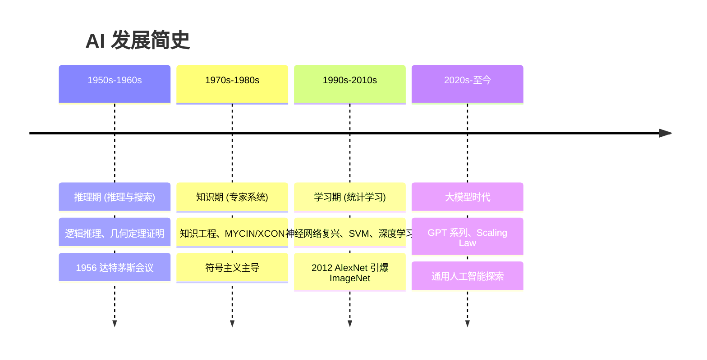
### 1.3 三大学派：符号主义、连接主义、行为主义

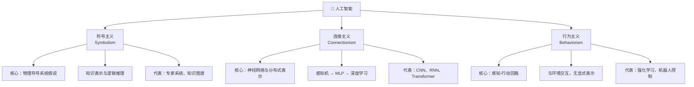
### 1.4 智能体模型：PEAS 描述、理性智能体、环境特性分类

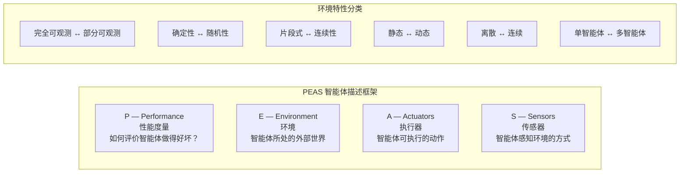
### 1.5 图灵测试、中文屋与智能度量
### 1.6 主要应用领域与产业现状

## 2. 问题求解与搜索策略
### 2.1 问题形式化：状态空间图、问题的形式化表示
- **问题形式化的五要素**：一个问题可以用五个要素形式化定义——
    - ① **初始状态 (Initial State)**：智能体出发时所在的状态；
    - ② **动作 (Actions)**：在每个状态 `s` 下可执行的动作集合 `ACTIONS(s)`；
    - ③ **转移模型 (Transition Model)**：执行动作 `a` 后从状态 `s` 转移到后继状态 `s'` 的描述，即 `RESULT(s, a) = s'`，也称为**后继函数**；
    - ④ **目标测试 (Goal Test)**：判断当前状态是否为目标状态（可以是显式状态集合或隐式条件判断）；
    - ⑤ **路径代价函数 (Path Cost Function)**：为每条路径分配一个数值代价，通常为各步代价之和 `g(path) = Σ cost(s_i, a_i, s_{i+1})`，求解目标是找到总代价最小的解。

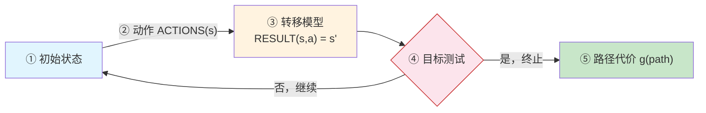
- **状态空间图 (State Space Graph)**：将问题空间中所有可能状态及其转移关系抽象为图结构——节点表示状态，有向边表示动作——该图在搜索前即已隐含存在，实际的搜索过程是在图上探寻路径。
- **搜索树 (Search Tree)**：从初始状态出发，依据动作展开后继节点所形成的树结构。搜索树在探索过程中逐步构建，其节点可能对应相同的状态（状态重复），状态空间图是唯一的，而搜索树依赖于搜索策略。

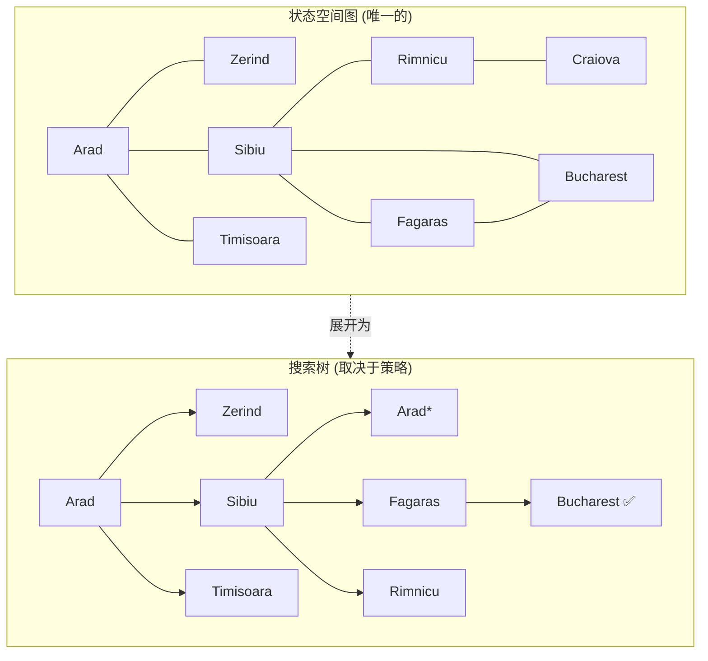

> 状态空间图是问题固有的结构，搜索树则是算法在探索过程中逐步构建的——同一状态可能在树中出现多次（如 Arad*）。
- **良好定义的问题**：当一个问题的初始状态、动作集合、转移模型、目标测试和路径代价函数均被明确指定时，称为**良定义问题 (Well-Defined Problem)**。解决方案是从初始状态到目标状态的一组动作序列。
- **抽象 (Abstraction)**：问题形式化的关键在于去除与现实无关的细节，保留对求解有影响的核心要素——这是简化复杂现实、使搜索可行的关键步骤。一个好的抽象层次应满足：被移除的细节不影响解的合法性，且抽象后得到的动作应易于执行。
- **经典示例**：
    - *八数码问题*：状态为 3×3 棋盘上 8 个数字方块与一个空格的排列，动作为空格上下左右移动，目标为棋子的特定排列；
    - *真空吸尘器世界*：两个房间、吸尘器位置与房间清洁状态的组合构成状态空间；
    - *路径规划问题*：状态为地图上的位置，动作为移动到相邻城市，路径代价为距离。

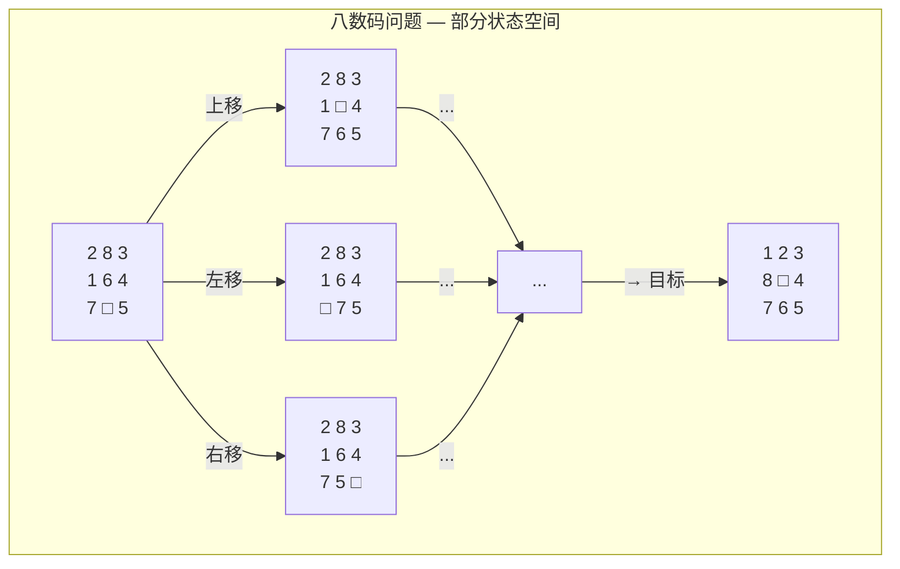
- **问题求解性能的度量**：
    - **完备性 (Completeness)**：如果有解，算法是否保证找到解？
    - **最优性 (Optimality)**：找到的解是否代价最小？
    - **时间复杂度 (Time Complexity)**：搜索所需时间（通常以搜索过程中产生的节点数衡量）；
    - **空间复杂度 (Space Complexity)**：算法运行所需的最大内存。
- **搜索策略分类**：
    - **无信息搜索 (Uninformed/Blind Search)**：仅使用问题定义本身的信息，不借助额外领域知识；
    - **有信息搜索 (Informed/Heuristic Search)**：利用启发式函数评估节点到目标的距离，选择更有希望的路径。
### 2.2 无信息搜索：广度优先、深度优先、一致代价搜索
- **无信息搜索 (Uninformed Search)** 又称为**盲目搜索 (Blind Search)**，只使用问题定义中可用的信息，不借助任何外部领域知识。搜索策略仅依赖于已扩展节点的顺序，而无信息搜索的核心区别在于使用何种数据结构（队列 vs 栈 vs 优先队列）来维护**边缘节点 (Frontier / Fringe)**。
- **广度优先搜索 (Breadth-First Search, BFS)**：
    - **核心思想**：先扩展根节点，再扩展根节点的所有后继，依此类推，逐层推进。使用 **FIFO 队列** 作为边缘；
    - **节点生成顺序**：从浅到深，从深度的第 `d` 层依次展开至第 `d+1` 层；
    - **算法复杂度**：时间 `O(b^d)`，空间 `O(b^d)`——对浅层问题可行，对大深度问题内存爆炸；
    - **性质**：完备（若 `b` 有限且路径深度有限），**等代价下最优**（step cost 相同时），不等代价时不一定最优。
- **深度优先搜索 (Depth-First Search, DFS)**：
    - **核心思想**：每步优先扩展当前搜索树中最深的节点，一路到底再回溯。使用 **LIFO 栈**（或递归调用）；
    - **算法复杂度**：时间 `O(b^m)`（`m` 为最大深度），空间 `O(bm)`——内存优势显著，仅需存储一条路径；
    - **性质**：**不完备**——无限深分支会导致陷入死循环（可通过深度限制避免）；**非最优**；
    - **深度限制搜索 (DLS)**：为 DFS 设置最大深度 `ℓ`，解决了无限深路径问题；
    - **迭代加深搜索 (IDS)**：将 DLS 与 BFS 结合——逐步增大深度限制，每次从初始状态重新搜索。兼具 BFS 的完备性与 DFS 的空间效率，时间 `O(b^d)`，空间 `O(bd)`。
- **一致代价搜索 (Uniform-Cost Search, UCS)**：
    - **核心思想**：优先扩展**路径代价 `g(n)` 最小**的节点，使用**优先队列**（如最小堆）管理边缘；
    - **本质**：UCS 是 BFS 在不等代价下的推广——当每步代价相等时，UCS 退化为 BFS；
    - **性质**：完备且最优（只要每步代价 > 0），时间和空间均为 `O(b^{1+⌊C*/ε⌋})`，其中 `C*` 为最优解的代价，`ε` 为最小步代价。
- **无信息搜索总结（设分支因子 `b`，最浅目标深度 `d`，最大深度 `m`）**：

| 算法 | 完备性 | 最优性 | 时间复杂度 | 空间复杂度 |
|:---|:---:|:---:|:---|:---|
| BFS | ✅ | 等代价下 ✅ | `O(b^d)` | `O(b^d)` |
| DFS | ❌ | ❌ | `O(b^m)` | `O(bm)` |
| DLS | ❌ | ❌ | `O(b^ℓ)` | `O(bℓ)` |
| IDS | ✅ | 等代价下 ✅ | `O(b^d)` | `O(bd)` |
| UCS | ✅ | ✅ | `O(b^{1+⌊C*/ε⌋})` | 同时间 |

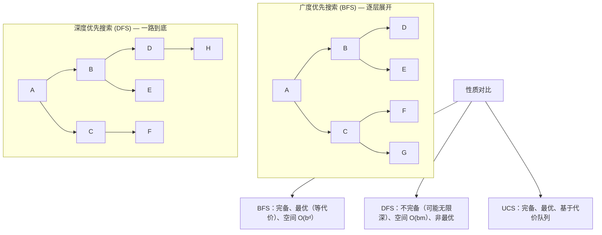

### 2.3 有信息（启发式）搜索：贪心最优搜索、A* 算法、IDA*、启发式函数设计
- **有信息搜索 (Informed Search)** 使用**领域知识**指导搜索方向，该知识通过**启发式函数 (Heuristic Function)** `h(n)` 编码——`h(n)` 估计从节点 `n` 到目标状态的最小代价。
- **贪心最优搜索 (Greedy Best-First Search)**：
    - **策略**：始终扩展 `h(n)` 最小的节点——即"看起来离目标最近的节点"；
    - **类比**：类似 DFS 以"离目标远近"为向导，总是朝着最有希望的方向前进；
    - **性质**：不完备（可能陷入死循环），不最优，但通常搜索速度极快；
    - **复杂度**：最坏情况 `O(b^m)`，但好的启发式函数可使其接近线性。
- **A* 搜索 (A-Star Search)**：
    - **评价函数**：`f(n) = g(n) + h(n)`，其中：
        - `g(n)`：从初始状态到节点 `n` 的实际路径代价（已知）；
        - `h(n)`：从节点 `n` 到目标的估计代价（启发式）；
        - `f(n)`：经过节点 `n` 的完整路径的估计总代价。
    - **核心机制**：A* 在 UCS（只考虑已付出的代价 `g(n)`）与贪心搜索（只看剩余估计 `h(n)`）之间取得平衡——`g(n)` 可看作"回望过去"，`h(n)` 可看作"展望未来"；
    - **可纳性 (Admissibility)**：`h(n)` 永不高估从 `n` 到目标的实际代价，即对所有节点 `n` 有 `h(n) ≤ h*(n)`（`h*` 为真实最优代价）。当 `h` 可纳时，A* 在图搜索（需配合**闭环检测**）下是**最优的**；
    - **一致性 / 单调性 (Consistency / Monotonicity)**：对每条边 `(n, a, n')`，满足 `h(n) ≤ c(n, a, n') + h(n')`。一致性是可纳性的更强条件，同时也是三角形不等式的体现。一致启发式保证 A* 在图搜索下以最优顺序扩展节点，且每个节点最多扩展一次；
    - **性质总结**：A* 是完备的，在 `h` 可纳时最优，在 `h` 一致时最优效率最高（在同等信息条件下，所有最优搜索中 A* 扩展的节点最少）。
- **迭代加深 A* (IDA\*)**：
    - **动机**：A* 在大状态空间中内存开销极大（需存储所有已生成节点），IDA* 用迭代加深的方式规避内存问题；
    - **做法**：每一轮设一个 `f` 值的阈值 `cutoff`，DFS 过程中若当前节点的 `f(n) > cutoff` 则剪枝并记录所有被剪节点的 `f` 值中的最小者作为下一轮的 cutoff；
    - **性质**：保留 A* 的完备性与最优性，空间复杂度降为 `O(bd)`，在实际求解八数码等问题中广泛使用。
- **启发式函数设计方法**：
    - **松弛问题 (Relaxed Problem)**：放宽原问题的某些约束后获得的问题。松弛问题的最优解代价是原问题的一个可纳启发式。例如八数码问题中，若允许方块直接"跳"到目标位置（忽略其他方块），即为曼哈顿距离启发式；
    - **模式数据库 (Pattern Database)**：将子问题的解代价预先计算并存储，综合多个子问题得到可纳启发式；
    - **支配关系 (Dominance)**：若对所有节点 `n` 均有 `h₁(n) ≥ h₂(n)`，则称 `h₁` **支配** `h₂`。被支配的启发式会被优先使用——因为它更"紧"（信息量更大），搜索效率更高；
    - **从经验中学习**：通过求解大量训练实例，学习启发式函数的加权组合参数。

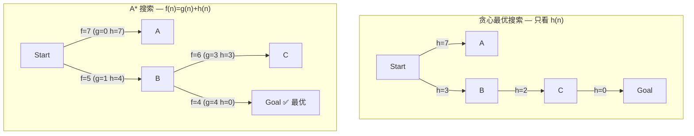

### 2.4 局部搜索与最优化：爬山法、模拟退火、束搜索、遗传算法
- **局部搜索 (Local Search)** 与经典搜索的根本区别在于**不关心路径**，只关注最终状态（解的质量）——适用于最优化问题，其中状态本身即解，不记录从起点到达解的路径。
- **状态空间地形图 (State Space Landscape)**：将状态空间视为地形——每个状态有一个**目标函数值**（高度），我们的目标是找到全局最高峰（最大化）或最低谷（最小化）。地形图由三要素组成：位置（状态）、高度（目标函数值）、移动（邻域操作）。
- **爬山法 (Hill Climbing)**：
    - **基本思路**：从当前解出发，在邻域中选择使目标函数改进最大的状态，不断向上攀登，直到无法改进为止——即**贪心局部搜索**；
    - **致命缺陷**：
        - **局部最优 (Local Maximum)**：四周均更低，但并非全局最高；
        - **高原 (Plateau)**：邻域中所有状态目标值相同，算法失去方向；
        - **山脊 (Ridge)**：单步邻域看似无法提升，但连续多步可达更高峰；
    - **改进变体**：
        - **随机爬山法 (Stochastic HC)**：随机选择邻域中任一优于当前的状态，而非最优；
        - **随机重启爬山法 (Random-Restart HC)**：多次从随机初始状态运行，取最优结果——在 NP 难问题中，执行足够多次后以概率 1 找到全局最优；
        - **首选爬山法 (First-Choice HC)**：依次生成邻居，一旦找到更优状态即移动。
- **模拟退火 (Simulated Annealing, SA)**：
    - **灵感来源**：冶金学中金属退火——高温时原子剧烈随机运动（探索），缓慢降温后趋于低能量态（利用）；
    - **核心机制**：允许以一定概率接受更差的状态，概率由 Boltzmann 分布给出：
        - `P(accept worse) = exp(-ΔE / T)`，其中 `ΔE` 为目标值变差的程度，`T` 为当前温度；
        - 温度 `T` 随调度表 `schedule(t)` 逐步下降；
    - **效果**：高温时接近随机行走（全域探索），低温时近似爬山（局部精化）。理论上，若降温足够慢，SA 以概率 1 找到全局最优。
- **束搜索 (Beam Search)**：
    - **思路**：在 BFS 的每一层中，只保留 `k` 个最有希望的节点继续扩展（`k` 称为**束宽**）；
    - **本质**：在内存受限下的并行搜索——介于贪心（只保留最优 1 个）与穷举（保留全部）之间；
    - **应用**：机器翻译、语音识别等序列生成任务中广泛使用，通常用对数概率作为评分指标。
- **遗传算法 (Genetic Algorithm, GA)**：
    - **灵感来源**：自然选择与遗传学——群体的进化过程；
    - **基本流程**：初始化种群（一组候选解）→ 评估适应度 → 选择父代 → 交叉产生子代 → 变异引入多样性 → 形成新一代 → 重复至收敛；
    - **核心操作**：
        - **选择 (Selection)**：适应度越高的个体越有可能被选为父代（轮盘赌选择、锦标赛选择等）；
        - **交叉 (Crossover)**：交换两个父代的部分基因，产生子代（单点交叉、两点交叉、均匀交叉）；
        - **变异 (Mutation)**：以较小概率随机改变个体的某一基因位，维持种群多样性；
    - **模式定理 (Schema Theorem)**：简言之，适应度高、定义长度短、阶数低的模式（Schema）在进化中会以指数速率增长——为 GA 的有效性提供了理论依据。

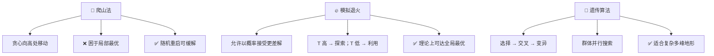

### 2.5 对抗搜索：极小极大算法、Alpha-Beta 剪枝、蒙特卡洛树搜索
- **对抗搜索 (Adversarial Search)** 适用于多智能体环境中**竞争性**的博弈场景——对手的目标与己方相反（零和博弈），搜索时需考虑对手的最优应对。
- **博弈问题形式化**：
    - **初始状态** `S₀`：棋盘初始布局；
    - **玩家函数** `Player(s)`：返回当前轮到谁走；
    - **动作集合** `Actions(s)`：当前状态下合法走法；
    - **转移模型** `Result(s, a)`：走一步后的结果状态；
    - **终局测试** `Terminal-test(s)`：游戏是否结束；
    - **效用函数** `Utility(s, p)`：对局结束时的收益（如国际象棋：赢 +1、输 -1、平 0）。
- **极小极大算法 (Minimax)**：
    - **核心思想**：MAX 方（我方）试图最大化最终收益，MIN 方（对手）试图最小化——双方交替决策，形成博弈树；
    - **递归定义**：设 `v(s)` 为状态 `s` 下 MAX 的最佳收益：
        - 若 `s` 为终局：`v(s) = Utility(s)`；
        - 若 MAX 走：`v(s) = max_{a ∈ Actions(s)} v(Result(s, a))`；
        - 若 MIN 走：`v(s) = min_{a ∈ Actions(s)} v(Result(s, a))`；
    - **复杂度**：若博弈树深度为 `d`，分支因子为 `b`，时间 `O(b^d)`，空间 `O(bd)`（深度优先实现）。国际象棋中 `b ≈ 35，d ≈ 100`，穷举完全不可行。
- **Alpha-Beta 剪枝 (Alpha-Beta Pruning)**：
    - **核心思想**：在 minimax 搜索过程中，动态维护两个边界：`α`（MAX 的当前最佳选择下界）和 `β`（MIN 的当前最佳选择上界）。当某条路径确定不可能改进当前已找到的最优值时，即可**剪枝**——不再探索该子树；
    - **剪枝条件**：若 `v ≥ β`，对 MAX 节点剪枝（β 剪枝），因为 MIN 不会让这种情况发生；若 `v ≤ α`，对 MIN 节点剪枝（α 剪枝），因为 MAX 不会选择这条路；
    - **效率提升**：理想情况下（对子节点按最优优先排序），Alpha-Beta 剪枝可将复杂度从 `O(b^d)` 降至 `O(b^(d/2))`——即约等于 Minimax 搜索深度的**两倍**。这意味着在相同时间内可以"多前瞻两步"；
    - **节点排序至关重要**：启发式排序（如国际象棋中的吃子优先、杀王优先）可使剪枝效率接近理论最优。
- **蒙特卡洛树搜索 (Monte Carlo Tree Search, MCTS)**：
    - **背景**：传统 Minimax（含 Alpha-Beta）依赖评估函数与深度限制，在围棋等大分支因子的游戏中力不从心（`b ≈ 250`）。MCTS 另辟蹊径，不做穷举搜索，而通过**随机模拟（Playout/Rollout）**估计胜率；
    - **四步循环**：
        - **选择 (Selection)**：从根节点出发，依据树策略（如 UCB1 公式）选择最有价值的子节点，直至到达**未完全展开的节点**；
        - **扩展 (Expansion)**：若叶节点不是终局，为其添加一个（或多个）子节点；
        - **模拟 (Simulation)**：从新节点出发，执行随机走子（或轻量级策略）直至终局，得到胜负结果；
        - **反向传播 (Backpropagation)**：将模拟结果沿路径向上更新各节点的访问次数与胜率统计；
    - **UCB1 公式**：平衡**利用**（高胜率节点）与**探索**（被访问少的节点）：
        `UCT(j) = wⱼ / nⱼ + C · √(ln N / nⱼ)`
        其中 `wⱼ` 为节点 `j` 的获胜次数，`nⱼ` 为访问次数，`N` 为父节点访问次数，`C` 为探索常数；
    - **AlphaGo / AlphaZero**：在 MCTS 框架中嵌入深度神经网络——策略网络指导选择与扩展（替代随机走子），价值网络评估局面（替代随机模拟），实现了超越人类世界冠军的水平。AlphaZero 进一步移除人类棋谱依赖，完全通过自对弈学习。

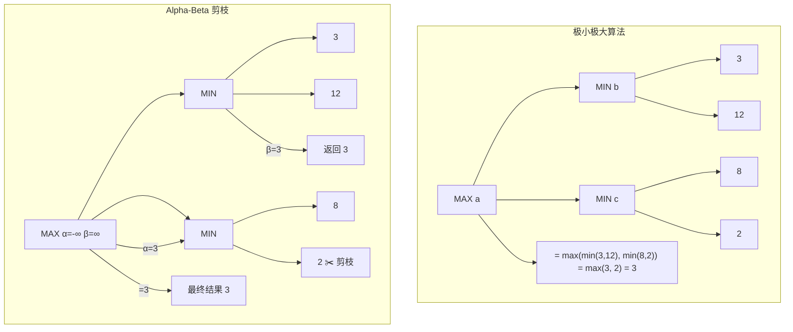

### 2.6 约束满足问题（CSP）：回溯搜索、前向检验、弧相容、AC-3 算法
- **约束满足问题 (Constraint Satisfaction Problem, CSP)** 将状态表示为一组**变量**及其**值域**之间的**约束**——搜索目标不再是找到到达目标状态的路径，而是找到一组满足所有约束的变量赋值。CSP 的表示力强，可自然地建模调度、配置、排课、地图着色等大量实际问题。
- **CSP 的三要素**：
    - **变量集合** `X = {X₁, X₂, …, Xₙ}`：待赋值的实体；
    - **值域集合** `D = {D₁, D₂, …, Dₙ}`：每个 `Xᵢ` 的可取值集合（可为离散或连续，但 CSP 通常处理有限离散值域）；
    - **约束集合** `C = {C₁, C₂, …, Cₘ}`：规定变量赋值之间的合法组合——可以是**一元约束**（限制单个变量）、**二元约束**（涉及两个变量，如 `Xᵢ ≠ Xⱼ`）、**全局约束**（涉及多个变量，如 `AllDiff`）。
- **CSP 搜索的特点**：
    - **赋值是交换的**：先给 A 赋值再给 B 赋值，与相反顺序的结果相同，因此 CSP 不必考虑路径——只需按变量顺序赋值即可，搜索空间缩小为 `O(dⁿ)` 而非 `O(n! · dⁿ)`；
    - **回溯搜索 (Backtracking Search)**：基本 CSP 求解算法，每次选择一个未赋值的变量，尝试其值域中的每个可能值，若当前赋值与约束冲突则回溯。本质是**带剪枝的深度优先搜索**；
    - **与经典搜索的区别**：CSP 的"状态"是部分赋值（而非世界状态的快照），"目标测试"是对所有变量赋值完毕且所有约束成立。
- **约束传播 (Constraint Propagation)**：
    - **核心思想**：在搜索过程中（甚至在搜索前），利用约束缩小变量的值域，提前排除不可能的值，减少无效搜索；
    - **前向检验 (Forward Checking, FC)**：为某一变量赋值后，立即检查所有尚未赋值的邻居变量，移除与其冲突的值——若某变量的值域因此变空，立即回溯。FC 是回溯搜索最常见的第一道防线；
    - **弧相容 (Arc Consistency, AC)**：对于二元约束 `C(X, Y)`，称边 `X → Y` 为**弧相容**的，当且仅当对 `X` 值域中每个值，在 `Y` 的值域中都存在至少一个值使得 `C` 被满足。AC 比前向检验传播得更远（考虑非直接邻居）；
    - **AC-3 算法**：最广泛使用的弧相容算法，将所有弧放入队列，依次检查每条弧是否相容——若某条弧不相容则删除对应值并重新将受影响的弧入列，直到队列为空。复杂度 `O(cd³)`（`c` 为约束数，`d` 为最大值域大小）；
    - **k-相容性 (k-Consistency)**：将相容性推广——1-相容（节点相容，每个值满足一元约束）、2-相容（弧相容）、强 k-相容（对所有 `i ≤ k` 均为 i-相容的）——更强的传播可进一步缩窄搜索空间，但计算代价相应增大。
- **变量与值的选择启发式**：
    - **最小剩余值 MRV (Minimum Remaining Values)**：选择当前值域最小的变量——即最可能受限的变量优先（"最易失败的先处理"）；
    - **度启发式 (Degree Heuristic)**：当 MRV 平局时，选择与其他未赋值变量约束最多的变量——最具影响力的先处理；
    - **最少约束值 (Least Constraining Value)**：选择给邻居变量留下最大选择余地的值——"留有余地"的值优先。
- **回溯搜索的改进**：
    - **回跳 (Backjumping)**：当在某变量值域全部尝试后均失败时，不是简单回溯到上一层，而是智能地跳回导致冲突的根源变量（冲突集分析）；
    - **学习 (Learning)**：将导致失败的赋值组合记录为新的约束（**诺戈德 NoGood**），避免将来重复尝试同样组合。

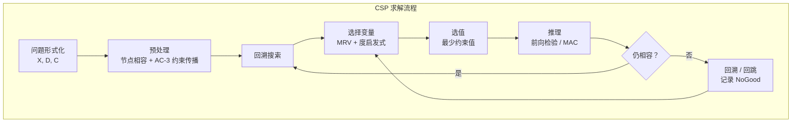

## 3. 知识与推理
### 3.1 确定性推理 — 命题逻辑：语法与语义、推理规则、归结原理
- **命题逻辑 (Propositional Logic)** 是最简单的逻辑系统，其基本单位是**命题符号 (Proposition Symbol)**——每个命题符号代表一个或真或假的陈述（如 `P` = "下雨"，`Q` = "带伞"）。命题逻辑研究的是命题之间的真值关系，是确定性推理的基石。
- **语法 (Syntax)**——规定合法句子的构成规则：
    - **原子语句 (Atomic Sentence)**：单个命题符号（如 `P`、`Q`、`R`）及逻辑常量 `True`、`False`；
    - **复合语句 (Complex Sentence)**：由原子语句通过**逻辑连接词 (Logical Connectives)** 组合而成：
        - `¬` **否定 (Negation)**："非"；
        - `∧` **合取 (Conjunction)**："且"；
        - `∨` **析取 (Disjunction)**："或"；
        - `⇒` **蕴含 (Implication)**："如果…则…"（前提 ⇒ 结论）；
        - `⇔` **双向蕴含 (Biconditional)**："当且仅当"。
    - 语法是**递归定义**的：原子语句是语句；若 `α` 和 `β` 是语句，则 `¬α`、`α ∧ β`、`α ∨ β`、`α ⇒ β`、`α ⇔ β` 也是语句。
- **语义 (Semantics)**——规定语句在给定**模型 (Model)** 下的真值：
    - **模型**：对每个命题符号赋予真值 `True` 或 `False` 的一种指派。若问题中有 `n` 个命题符号，则共有 `2ⁿ` 个可能模型；
    - 复合语句的真值由各连接词的**真值表 (Truth Table)** 确定：

| `P` | `Q` | `¬P` | `P ∧ Q` | `P ∨ Q` | `P ⇒ Q` | `P ⇔ Q` |
|:---:|:---:|:---:|:---:|:---:|:---:|:---:|
| F | F | T | F | F | T | T |
| F | T | T | F | T | T | F |
| T | F | F | F | T | F | F |
| T | T | F | T | T | T | T |

> **注意**：`P ⇒ Q` 仅在 `P=True` 且 `Q=False` 时为假（"真前提推出假结论"），其余情况为真。这与自然语言中"如果…则…"的用法略有不同，但这是逻辑推理的标准约定。

- **逻辑核心概念**：
    - **有效 (Valid) / 重言式 (Tautology)**：在所有模型下均为真的语句（如 `P ∨ ¬P`）；
    - **可满足 (Satisfiable)**：至少存在一个模型使其为真；
    - **不可满足 (Unsatisfiable)**：在所有模型下均为假（与重言式相反）；
    - **逻辑蕴含 (Entailment)**：`KB ⊨ α` 表示"在所有使知识库 `KB` 为真的模型中，`α` 也为真"——即 `KB` 蕴含 `α`。这是推理的语义基础；
    - **逻辑等价 (Logical Equivalence)**：`α ≡ β` 当且仅当 `α ⊨ β` 且 `β ⊨ α`。

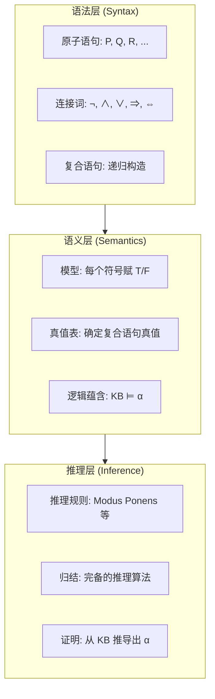

- **推理规则 (Inference Rules)**——在不枚举所有模型的情况下推导出新语句：
    - **假言推理 (Modus Ponens)**：已知 `α ⇒ β` 和 `α`，可推出 `β`；
    - **消去合取 (And-Elimination)**：已知 `α ∧ β`，可推出 `α`（或 `β`）；
    - **消去双重否定 (Double-Negation Elimination)**：已知 `¬¬α`，可推出 `α`；
    - **归结规则 (Resolution Rule)**：已知 `α ∨ β` 和 `¬β ∨ γ`，可推出 `α ∨ γ`。等价形式：已知 `¬α ⇒ β` 和 `β ⇒ γ`，可推出 `¬α ⇒ γ`（即**假言链推理**）；
    - **单元归结 (Unit Resolution)**：归结规则的特例——当 `γ` 为空（即 `α ∨ β` 与 `¬β`），推出 `α`。

- **推理的完备性**：
    - 上述推理规则是**可靠的 (Sound)**：推导出的语句必为逻辑蕴含（不会推出假结论）；
    - 但仅靠 Modus Ponens 等规则是**不完备的**：某些被蕴含的语句无法仅靠它们推导出来。我们需要归结原理。

- **归结原理 (Resolution Principle)**：
    - **核心思想**：归结是一条约简化的**单一推理规则**，它与**归结反演 (Resolution Refutation)** 策略结合后，构成**完备的**命题逻辑推理算法（即若 `KB ⊨ α`，则归结一定能证明它）；
    - **合取范式 (Conjunctive Normal Form, CNF)**：归结要求知识库中的语句表示为**子句的合取 (Conjunction of Clauses)**，其中每个子句是**文字的析取 (Disjunction of Literals)**，文字是命题符号或其否定。例如 `(P ∨ ¬Q) ∧ (¬P ∨ R) ∧ (Q ∨ ¬R)`；
    - **CNF 转换步骤**：
        ① 消去 `⇔`：`α ⇔ β` → `(α ⇒ β) ∧ (β ⇒ α)`；
        ② 消去 `⇒`：`α ⇒ β` → `¬α ∨ β`；
        ③ 将 `¬` 内移（德摩根律）：`¬(α ∧ β)` → `¬α ∨ ¬β`，`¬(α ∨ β)` → `¬α ∧ ¬β`；
        ④ 分配律：将 `∨` 分配到 `∧` 内部，如 `(α ∧ β) ∨ γ` → `(α ∨ γ) ∧ (β ∨ γ)`。
    - **归结算法**：对知识库 `KB` 取 `KB ∧ ¬α`（即假设 `α` 为假），转换为 CNF，反复对每对包含互补文字的子句应用归结规则，若最终推导出**空子句 (Empty Clause, □)**——表示矛盾，则原命题 `α` 得证。空子句的出现意味着 `KB ∧ ¬α` 不可满足，故 `KB ⊨ α`。

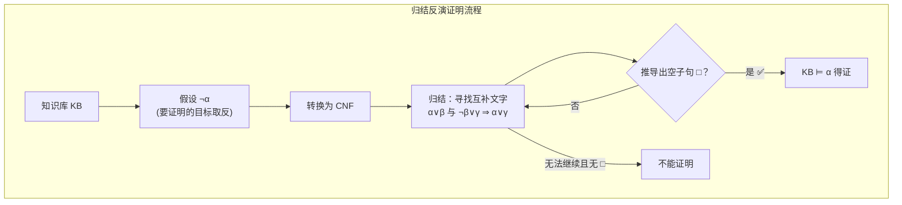

> **示例**：设 `KB = {P ⇒ Q, Q ⇒ R}`，要证明 `P ⇒ R`。取 `¬(P ⇒ R) = P ∧ ¬R`，CNF 化后得到子句集 `{¬P ∨ Q, ¬Q ∨ R, P, ¬R}`。归结 `¬P ∨ Q` 与 `P` → `Q`；归结 `Q` 与 `¬Q ∨ R` → `R`；归结 `R` 与 `¬R` → `□`。得证。

### 3.2 一阶谓词逻辑：量词、合一、前向/反向链接
- **一阶谓词逻辑 (First-Order Logic, FOL)** 扩展了命题逻辑的表达能力，使其能够描述**对象、对象之间的关系以及关于对象集合的概括性陈述**。命题逻辑只能讨论"整句"的真假，而 FOL 可以深入到句子内部，表达"所有"和"存在"这样的量化关系。
- **语法扩展（相对于命题逻辑）**：
    - **常量 (Constants)**：表示具体对象，如 `John`、`Book1`、`3`；
    - **谓词 (Predicates)**：表示对象之间的关系或属性，如 `Brother(John, Richard)`（John 是 Richard 的兄弟）、`Red(Ball)`（球是红色的）；
    - **函数 (Functions)**：从对象到对象的映射，如 `FatherOf(John)`、`LeftLegOf(Person)`。注意函数返回值仍是对象（项），而非真值；
    - **项 (Term)**：引用对象的逻辑表达式——常量是项，变量是项，`函数(项₁, 项₂, ...)` 也是项；
    - **原子语句 (Atomic Sentence)**：由谓词后接若干项构成，如 `Loves(John, Mary)`——当谓词所表示的关系在对象间成立时为真；
    - **连接词**：`¬, ∧, ∨, ⇒, ⇔`——与命题逻辑相同，用于组合复杂语句。
- **量词 (Quantifiers)**——FOL 的核心表达能力来源：
    - **全称量词 ∀ (Universal Quantifier)**：`∀x P(x)` 表示"对所有对象 `x`，`P(x)` 为真"。通常情况下，`∀` 与 `⇒` 搭配使用：`∀x King(x) ⇒ Person(x)`（"所有国王都是人"）；
    - **存在量词 ∃ (Existential Quantifier)**：`∃x P(x)` 表示"至少存在一个对象 `x`，使得 `P(x)` 为真"。通常情况下，`∃` 与 `∧` 搭配使用：`∃x Crown(x) ∧ OnHead(x, John)`（"某物是皇冠且在 John 头上"）；
    - **量词的辖域 (Scope)**：量词的作用范围是紧随其后的子公式（可用括号界定）。变量在量词辖域内的出现称为**约束出现 (Bound)**，否则为**自由出现 (Free)**；
    - **量词嵌套**：`∀x ∃y Loves(x, y)`（"每个人爱某人"）与 `∃y ∀x Loves(x, y)`（"存在某人被所有人爱"）含义完全不同，顺序至关重要。

- **语义**：
    - **解释 (Interpretation)**：FOL 语句的真值依赖于对常量、谓词、函数的解释——即指定一个**论域 (Domain)**（对象集合）以及每个常量符号指称哪个对象、每个谓词符号对应论域上的哪个关系、每个函数符号对应论域上的哪个映射；
    - **模型**：使语句为真的解释称为该语句的模型。`KB ⊨ α` 仍表示"在所有使 KB 为真的解释下，α 也为真"。

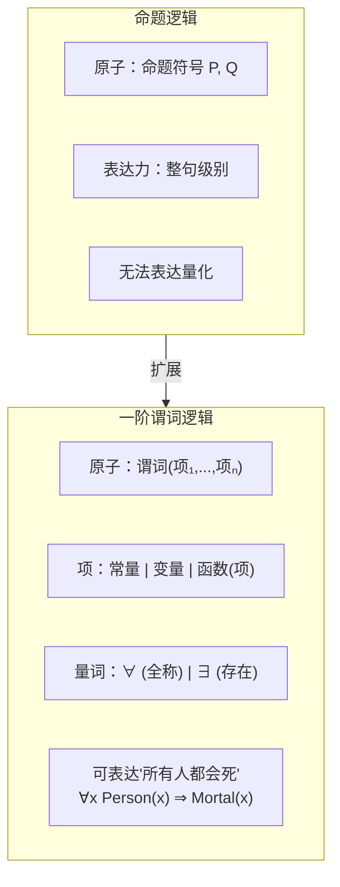

- **全称实例化与存在实例化**——将带量词的语句转换为命题化语句：
    - **全称实例化 (Universal Instantiation, UI)**：从 `∀v α` 可推导出以任意**基项 (Ground Term)** 替代 `v` 后的 `α`。例如从 `∀x King(x) ⇒ Person(x)` 可得 `King(John) ⇒ Person(John)`。UI 可以反复应用，以产生多条新语句；
    - **存在实例化 (Existential Instantiation, EI)**：从 `∃v α` 可引入一个新的 **Skolem 常量** 替代 `v`。例如从 `∃x Crown(x) ∧ OnHead(x, John)` 可得 `Crown(C₁) ∧ OnHead(C₁, John)`，其中 `C₁` 是此前未出现的新常量（代表"那个存在的对象"，但不知具体是谁）。

- **合一 (Unification)**——使两个逻辑表达式变得相同的变量替换：
    - **动机**：在推理过程中，我们需要判断两个原子语句是否能够匹配。例如要使用 Modus Ponens：已知 `∀x King(x) ⇒ Person(x)`，想知道是否能推出 `Person(John)`——这要求将 `x` 替换为 `John`，使得 `King(x)` 与 `King(John)` 匹配；
    - **定义**：**合一 (Unification)** 是找到一组变量替换 `θ = {v₁/t₁, v₂/t₂, ...}`（读作"将变量 `vᵢ` 替换为项 `tᵢ`"），使得两个或多个表达式在应用替换后变得完全相同。`θ` 称为**合一替换 (Unifier)**；
    - **最一般合一 (Most General Unifier, MGU)**：两个表达式可能存在多个合一替换，其中**约束最少**的那个（即所有其他合一替换都是其特例的）称为 MGU。例如对 `Knows(John, x)` 与 `Knows(y, MotherOf(y))`，MGU 为 `{y/John, x/MotherOf(John)}`——将 `y` 替换为 `John` 比替换为 `John` 后再指定 `x` 的具体值更一般；
    - **发生检查 (Occurs Check)**：合一算法必须检查变量是否出现在替换项中，如 `S(x)` 与 `x` 不能合一——否则会产生无限递归结构。Prolog 出于效率考虑省略了此检查，但在标准合一算法中不可缺少。

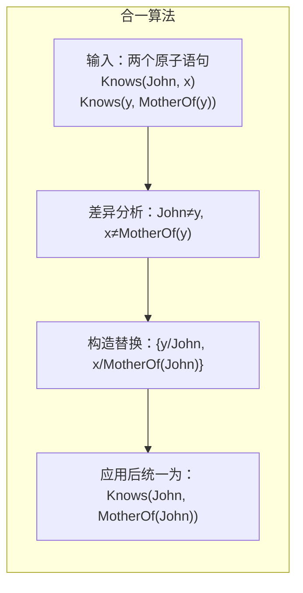

- **前向链接 (Forward Chaining)**：
    - **适用场景**：从已知事实出发，反复应用蕴含式 `Premise ⇒ Conclusion` 推导新事实，直至目标得证或无新事实可推。适用于**数据驱动 (Data-Driven)** 的推理场景——"从已知事实能推出什么？"；
    - **前提形式要求**：知识库中的句子必须是**确定子句 (Definite Clause)**——恰好包含一个正文字的析取式（等价于"合取前提 ⇒ 单个结论"的蕴含式），如 `P₁ ∧ P₂ ∧ ... ∧ Pₙ ⇒ Q`；
    - **算法流程**：
        ① 将所有已知事实加入事实集合；
        ② 扫描所有蕴含式，若某蕴含式的前提全部已知但结论尚未在事实集合中，触发该规则，将结论加入事实集；
        ③ 重复步骤②直至目标事实出现（成功）或无新事实可推（失败）。
    - **Rete 算法**：前向链接在生产系统中非常高效——Rete 算法通过构建规则网络、增量匹配事实变化，避免重复扫描所有规则，是实现高效前向链接的经典算法；
    - **性质**：对确定子句是**可靠的**和**完备的**，时间复杂度与数据量及规则数成正比。在专家系统、事件处理中广泛使用。

- **反向链接 (Backward Chaining)**：
    - **适用场景**：从目标出发，反向寻找支持目标的前提。适用于**目标驱动 (Goal-Driven)** 的推理场景——"如何证明这个目标？"；
    - **算法流程**：
        ① 从待证目标 `Q` 出发；
        ② 检查 `Q` 是否已在已知事实中，若是则成功；
        ③ 否则，找到所有以 `Q` 为结论的蕴含式 `P₁ ∧ ... ∧ Pₙ ⇒ Q`，将 `P₁, ..., Pₙ` 作为新的子目标递归证明；
        ④ 若所有子目标均被满足，则目标得证（通常采用深度优先搜索）；
    - **与 Prolog 的联系**：Prolog 的执行策略本质上是**带合一的反向链接 + 深度优先搜索**，并内置了**回溯机制**（当一条规则失败时自动尝试下一条）。
    - **性质**：对确定子句可靠且完备，搜索空间通常远小于前向链接（仅展开与目标相关的部分）。在定理证明、逻辑编程中广泛使用。


### 3.3 归结反演与逻辑程序设计（Prolog 简介）
- **归结反演 (Resolution Refutation)** 是将命题逻辑的归结原理推广到一阶谓词逻辑的完备推理方法——通过**反证法 (Proof by Contradiction)** 来证明逻辑蕴含关系。
- **一阶逻辑归结的额外挑战**：
    - 命题逻辑归结只需处理**互补文字**（`P` 与 `¬P`），而一阶逻辑中的原子语句包含变量，需要通过**合一**来判断两个文字是否互补。例如 `¬Knows(John, x) ∨ Hates(John, x)` 与 `Knows(John, Jane)` 通过合一 `{x/Jane}` 后可归结出 `Hates(John, Jane)`；
    - 归结时需对两个子句应用**合一替换**，使互补文字变得相同：若子句 `C₁` 包含文字 `L₁`，子句 `C₂` 包含文字 `¬L₂`，且 `L₁` 与 `L₂` 存在 MGU `θ`，则归结结果为 `(C₁ - {L₁})θ ∪ (C₂ - {¬L₂})θ`。
- **一阶逻辑 CNF 转换——Skolem 化 (Skolemization)**：
    - 一阶逻辑语句转换为 CNF 的步骤与命题逻辑类似，但需额外处理量词：
        ① **消去蕴含词** `⇒` 和 `⇔`；
        ② **将 `¬` 内移**至原子语句前（利用量词与 `¬` 的关系：`¬∀x P` → `∃x ¬P`，`¬∃x P` → `∀x ¬P`）；
        ③ **变量标准化 (Standardize Variables)**：使不同量词约束的变量使用不同名称，避免命名冲突；
        ④ **Skolem 化 (Skolemization)**：消除存在量词。将 `∃x P(x)` 替换为 `P(C)`（引入新的 Skolem 常量），将 `∀x ∃y Loves(x, y)` 替换为 `∀x Loves(x, F(x))`（引入 **Skolem 函数** `F`，其参数为外围全称量词约束的变量——表示 `y` 的值依赖于 `x`）；
        ⑤ **前束化 (Drop Universal Quantifiers)**：将所有全称量词移至最外层后直接省略（剩余变量被隐式全称量化）；
        ⑥ **分配 ∨ 对 ∧**：得到合取范式 CNF（子句的合取）。
    - Skolem 化的关键直觉：`∀x ∃y Loves(x, y)`（"每人爱某人"）中，被爱的人 `y` 依赖于 `x`，因此用函数 `F(x)` 替代——而不能用常量（常量意味着所有人爱的是同一个人，语义会改变）。
- **因子化 (Factoring)**：归结前的一个辅助步骤——若某子句内部包含可以合一的多个文字，可将它们合并（减少冗余文字），这有助于提高归结效率。

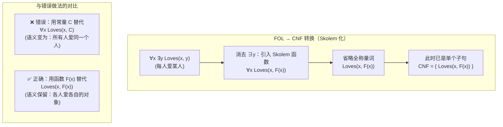

- **归结反演策略**——控制归结搜索的实用方法：
    - 盲目地对所有子句两两归结会导致组合爆炸，因此需要策略来限制搜索：
    - **单元优先策略 (Unit Preference)**：优先使用至少包含一个单文字子句的归结（单文字子句信息量集中）；
    - **支持集策略 (Set of Support)**：每次归结至少涉及一个来自目标取反（`¬α`）或其派生子句的子句——将搜索聚焦于与待证目标相关的部分；
    - **输入归结 (Input Resolution)**：每次归结至少使用一个原始（输入）子句——Prolog 的 SLD 归结即属此类，虽不完备但高效；
    - **线性归结 (Linear Resolution)**：每次归结的父辈之一必须是上一步的归结结果——形成线性链，是 SLD 归结的泛化形式，且**完备**。

- **逻辑程序设计 (Logic Programming)**：
    - **核心理念**：用逻辑语句直接"编程"——程序员声明关于问题领域的逻辑公理（知识），系统通过自动推理来"执行"程序。即"算法 = 逻辑 + 控制"中的"逻辑"部分由程序员提供，"控制"由推理引擎负责；
    - **Horn 子句 (Horn Clause)**：至多包含一个正文字的子句——逻辑程序设计的基础。Horn 子句可分为：
        - **事实 (Fact)**：恰好一个正文字、无负文字，如 `Parent(John, Mary)`；
        - **规则 (Rule)**：恰好一个正文字 + 至少一个负文字，等价于 `结论 :- 前提₁, 前提₂, ...`，如 `Grandparent(x, z) :- Parent(x, y), Parent(y, z)`；
        - **查询 (Query / Goal)**：无正文字、至少一个负文字，即将待证目标的取反作为子句。
    - **SLD 归结 (SLD Resolution)**：Prolog 的核心推理机制——**S**election rule driven **L**inear resolution for **D**efinite clauses（对确定子句的、基于选择规则的线性归结）。每次都选择查询中的第一个文字与某条规则/事实的头进行合一与归结，深度优先搜索，发生失败时**回溯**尝试其他规则。

- **Prolog 简介**：
    - **程序结构**：Prolog 程序由一系列 Horn 子句（事实和规则）组成，执行时用户提交一个查询，Prolog 试图通过反向链接证明该查询；
    - **基本语法示例**：
        ```prolog
        % 事实：John 是 Mary 的父亲
        parent(john, mary).
        % 事实：Mary 是 Ann 的父亲
        parent(mary, ann).
        % 规则：若 X 是 Y 的父辈且 Y 是 Z 的父辈，则 X 是 Z 的祖父
        grandparent(X, Z) :- parent(X, Y), parent(Y, Z).
        % 查询：John 是 Ann 的祖父吗？
        ?- grandparent(john, ann).   % → true
        % 查询：谁是谁的祖父？
        ?- grandparent(X, Y).        % → X=john, Y=ann
        ```
    - **执行模型**：Prolog 将查询中的每个目标按从左到右顺序证明，对每个目标从上到下尝试匹配规则头——**深度优先搜索 + 回溯**。当所有目标均满足时，返回当前变量绑定作为答案；如需更多答案，键入 `;` 触发回溯继续搜索；
    - **Prolog 的特色机制**：
        - **合一**：Prolog 的模式匹配能力非常强大——`=` 操作符执行合一，如 `[H|T] = [1, 2, 3]` 成功并绑定 `H=1, T=[2,3]`；
        - **列表**：Prolog 列表采用 `[Head|Tail]` 表示法（类似 Lisp 的 cons 结构），是递归定义和处理的理想数据结构；
        - **回溯与 Cut（`!`）**：Cut 操作符 `!` 是一个始终成功的原子，但副作用是**冻结此前所做的选择**（不允许回溯到 cut 之前尝试其他匹配）。它用于修剪搜索空间、提高效率，但过度使用会破坏程序的逻辑纯洁性；
        - **失败即否定 (Negation as Failure)**：Prolog 的 `\+`（not）操作符不表示逻辑否定，而是"无法证明"——`\+ P` 当且仅当 Prolog 在有限步骤内无法证明 `P` 时为真。这要求被否定的目标必须是**完全实例化的（Ground）**，否则可能产生错误结果。
    - **Prolog 的优缺点**：
        - ✅ 极强的关系型问题表达能力，代码简洁（如数行代码即可实现简单的定理证明器、自然语言解析器）；
        - ✅ 内置合一、回溯和符号推理能力，非常适合原型开发与符号 AI 任务；
        - ❌ 深度优先搜索的固有缺点——可能陷入无限递归或重复搜索（需程序员手动调整规则顺序和 cut 优化）；
        - ❌ 执行效率不如命令式语言，且缺乏模块化特性，调试难度较大。


### 3.4 产生式系统与专家系统
- **产生式系统 (Production System)** 是一种基于**规则 (Rule)** 的计算模型，广泛用于模拟人类推理过程，是专家系统的核心推理架构。其核心思想是将知识表示为"**如果…则…** (IF-THEN)"形式的产生式规则，通过规则的解释与执行实现自动推理。
- **产生式系统的三大组件**：
    - **① 工作记忆 (Working Memory, WM)**：存放当前已知的事实集合（当前状态）。工作记忆是动态变化的——推理过程中新事实不断加入，代表系统当前"所知道的信息"。形式上，工作记忆中的每个事实是一个符号表达式（如 `(temperature patient-1 39.5)`）；
    - **② 产生式规则库 (Production Rule Base)**：存放领域知识的长期记忆，每条规则形如 `IF <条件> THEN <动作>`。条件部分是若干事实模式的合取，动作部分可以包括：向 WM 添加新事实、从 WM 删除事实、修改 WM 中的事实、执行外部操作；
    - **③ 推理引擎 (Inference Engine)**：控制规则的解释与执行——决定何时触发哪条规则、以何种顺序应用规则。它按**识别-动作循环 (Recognize-Act Cycle)** 工作，是产生式系统的"大脑"。
- **识别-动作循环 (Recognize-Act Cycle)**——产生式系统的核心执行机制：
    - **① 匹配 (Match)**：扫描规则库中所有规则的条件部分，找出条件与当前工作记忆内容**匹配**的规则——这些规则构成**冲突集 (Conflict Set)**。条件匹配的本质是模式匹配（通常涉及变量绑定），Rete 算法通过构建规则网络大幅加速这一步骤；
    - **② 冲突消解 (Conflict Resolution)**：从冲突集中选择**一条**规则来触发。常见策略包括：
        - **优先级 (Priority)**：每条规则预分配优先级，优先执行高优先级规则；
        - **特殊性 (Specificity)**：条件更具体（匹配更多事实模式）的规则优先——"更详细的规则更可靠"；
        - **最近性 (Recency)**：优先使用匹配了最近加入 WM 的事实的规则——保持推理的连贯性；
        - **随机选择 (Random)**：无偏好地随机选择，避免策略偏差；
    - **③ 执行 (Act)**：触发被选中的规则，执行其动作部分（增添/删除/修改 WM 中的事实，或执行外部 I/O 操作）。执行后 WM 内容发生变化，循环回到匹配阶段，直至冲突集为空（无可触发规则）或遇到终止指令。

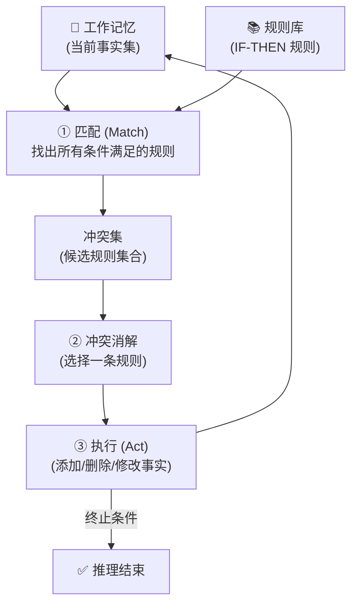

- **产生式系统的推理方向**：
    - **前向推理 (Forward Chaining)**：从已知事实出发，反复触发规则推导出新事实，直至目标事实出现。适用于"给定现状，能得出什么结论？"的监控、诊断场景；
    - **反向推理 (Backward Chaining)**：从待证目标出发，反向寻找满足条件的事实。适用于"这个假设是否成立？"的验证、问答场景；
    - **混合推理 (Bidirectional)**：同时从事实和目标两端推进，于中间会合——兼顾前向的广度与后向的聚焦。

- **专家系统 (Expert System)**——产生式系统最经典的应用载体：
    - **定义**：专家系统是一种在特定领域内，利用人类专家的知识和推理方法，模拟专家的决策过程以解决复杂问题的智能程序。它产生于 20 世纪 70–80 年代，是 AI "知识期"的巅峰产物；
    - **核心哲学**：将**领域知识**与**推理机制**分离——知识库（Know-What）由领域专家与知识工程师协作构建，推理引擎（Know-How）是独立于领域的通用组件。这一分离使系统具有**可解释性**和**可维护性**。
- **专家系统的经典架构**：

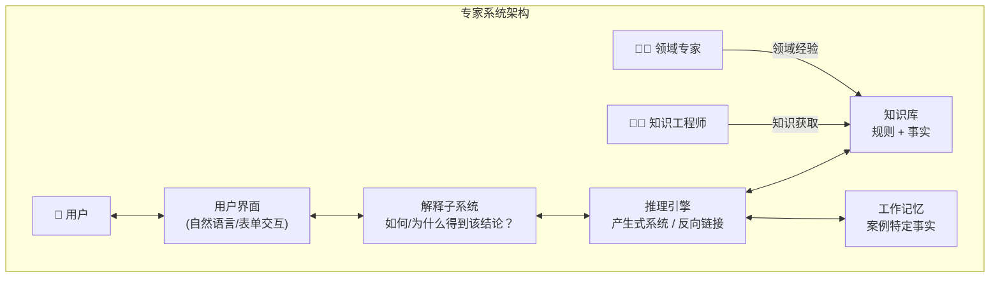

- **知识获取瓶颈 (Knowledge Acquisition Bottleneck)**：专家系统面临的核心工程挑战——将领域专家的隐性知识（直觉、经验法则、判断标准）显式编码为规则的过程异常困难且耗时。专家往往"知道怎么做但说不清为什么"，导致知识库难以完整、一致性难以保障。
- **里程碑系统**：
    - **MYCIN (1976, Stanford)**：用于诊断血液感染疾病并推荐抗生素方案的医学专家系统。它拥有约 450 条规则，采用**反向链接**推理，其诊断表现超过部分初级医生（在特定感染类型上）。MYCIN 最重要的遗产是提出了**不确定性推理的确定性因子 (Certainty Factor)** 模型——规则结论附带一个介于 -1 到 1 之间的确信度值，其组合运算独立于概率理论的严格要求；
    - **XCON / R1 (1980, CMU → DEC)**：为 Digital Equipment Corporation (DEC) 配置 VAX 计算机系统的商用专家系统。它包含约 10,000 条规则，采用**前向链接**推理，能从客户订单自动生成完整配置清单。R1 是首个大规模产业部署的专家系统，DEC 估计其为公司每年节省约 4000 万美元。
- **专家系统的优点与局限**：
    - ✅ **可解释性**：能追溯推理链路，解释"为什么"得到某个结论（展示触发的规则链）——这在医疗、法律等高风险领域至关重要；
    - ✅ **知识永久化**：专家知识被编码为显式规则，不会因人员流动而丢失；
    - ✅ **决策一致性**：相同输入始终产生相同输出，不受疲劳、情绪影响；
    - ❌ **知识获取瓶颈**：隐性知识难以提取，规则难以覆盖所有边界情况；
    - ❌ **脆弱性 (Brittleness)**：一旦输入超出知识库覆盖范围，系统表现急剧下降——缺乏常识与类比推理能力；
    - ❌ **维护困难**：随着规则数量增长（成千上万条），规则间的隐含交互导致不可预测的副作用，修改一条规则可能破坏之前正常工作的推理链。
- **产生式系统与专家系统的现代遗产**：
    - **业务规则引擎 (BRMS)**：Drools、IBM ODM 等在金融风控、保险核保领域广泛应用；
    - **复杂事件处理 (CEP)**：基于规则的实时事件流处理；
    - **知识图谱推理**：OWL/RDF 的规则推理引擎继承了产生式系统的设计思想；
    - **与机器学习的互补**：现代系统常结合规则（符号知识）与机器学习模型（统计模式），实现可解释性与鲁棒性的平衡。

### 3.5 知识表示 — 语义网络与框架表示法
- **知识表示 (Knowledge Representation)** 是符号 AI 的核心问题：如何将现实世界的知识编码为计算机可存储、操作与推理的形式化结构？不同的表示方式决定了知识的表达力、推理效率和可维护性。语义网络和框架是两种经典的**结构化知识表示**方法，其共同特征是利用**层次结构与继承机制**组织知识。
- **语义网络 (Semantic Network)**：
    - **基本概念**：语义网络由**节点 (Node)** 和**弧 (Arc / Edge)** 组成的**有向图 (Directed Graph)**。节点表示概念、实体、事件或属性；弧表示节点之间的二元关系。这种表示由 Quillian (1968) 首次提出，灵感来源于人类联想记忆中的扩散激活模型。
    - **核心关系类型**：
        - **IS-A（泛化-特化）**：表示子类与父类之间的层次关系，如 `Dog → IS-A → Mammal`。IS-A 链接隐含了**属性继承 (Property Inheritance)**——所有对 Mammal 成立的属性自动对 Dog 成立；
        - **AKO（A Kind Of）** 与 IS-A 同义，侧重类之间的从属；
        - **Instance-Of**：表示个体与类之间的实例关系，如 `Fido → Instance-Of → Dog`；
        - **Has-Property / Has-Part / Caused-By** 等自定义关系：表达了领域特定的语义联系。
    - **属性继承与推理**：语义网络的主要推理形式是**基于继承的查询**和**路径追踪**。例如："Fido 是温血动物吗？"→ 从 Fido 出发，沿 Instance-Of 到达 Dog，再沿 IS-A 到达 Mammal，再沿 Has-Property 到达 WarmBlooded → 答案"是"。这一过程在结构上等价于**图的路径搜索**；
    - **分区 (Partition)**：为处理全称量词和存在量词的推理，Hendrix (1975) 引入分区概念——将网络划分为嵌套的"空间"，每个空间代表一个断言范围或可能世界。

```mermaid
graph TD
    subgraph SN["语义网络示例"]
        ANIMAL["Animal"] -->|"Has-Property"| ALIVE["Alive"]
        ANIMAL -->|"Has-Property"| BREATHE["Breathes"]
        MAMMAL["Mammal"] -->|"IS-A"| ANIMAL
        MAMMAL -->|"Has-Property"| WARM["WarmBlooded"]
        DOG["Dog"] -->|"IS-A"| MAMMAL
        DOG -->|"Has-Part"| TAIL["Tail"]
        FIDO["Fido"] -->|"Instance-Of"| DOG
        FIDO -->|"Has-Property"| BROWN["Brown"]
        MAMMAL -->|"Has-Property"| HAIR["Has Hair"]
    end

    subgraph INHERIT["继承推理"]
        FIDO -.->|"继承自 Dog"| TAIL
        FIDO -.->|"继承自 Mammal"| WARM
        FIDO -.->|"继承自 Mammal"| HAIR
        FIDO -.->|"继承自 Animal"| ALIVE
    end

    FIDO ===|"多重继承链"| INHERIT
```

- **语义网络的优点与局限**：
    - ✅ 直观性：节点和弧的图结构与人类联想记忆模型一致，易于理解和可视化；
    - ✅ 继承效率：通过 IS-A 层次，避免为每个个体显式存储所有属性，知识存储紧凑；
    - ❌ **语义歧义性**：节点和弧的含义缺乏形式化的语义定义——同一弧标签在不同上下文中可能表示完全不同的逻辑关系（statements, definitions, defaults），导致推理结果不确定；
    - ❌ **表达力有限**：难以自然地表达否定、析取、存在量词等逻辑关系（虽可借助分区等扩展，但破坏了简单性）；
    - ❌ **缺乏标准**：不同语义网络系统使用各自的关系集和推理约定，互操作性差。

- **框架表示法 (Frame Representation)**：
    - **背景与动机**：Marvin Minsky 于 1975 年提出**框架理论 (Frame Theory)**。他观察到，人类在进入新场景时并非从零开始分析，而是激活一个**原型框架**——一种关于典型场景的数据结构。例如走进一个从未见过的教室，你能立刻推断出"有黑板""有桌椅""有讲台"，因为你具备"教室框架"。框架表示法正是将这种认知模型形式化。
    - **框架结构**：
        - 每个**框架 (Frame)** 代表一个概念、对象或场景类型，由一个框架名和一组**槽 (Slot)** 组成；
        - 每个槽描述该概念的一个属性，槽本身又包含多个**侧面 (Facet)**：
            - **值 (Value)**：属性的当前值；
            - **默认值 (Default / IF-NEEDED)**：当值未被明确指定时使用的典型值；
            - **类型约束 (Value Type / Range)**：该槽允许填充的值的类型范围；
            - **附加过程 (Procedural Attachment)**：在特定条件下自动触发的程序——IF-ADDED（槽被赋值时触发）、IF-NEEDED（槽被访问但值为空时触发）、IF-REMOVED（槽值被删除时触发）。
    - **框架系统示例**（用简化表示法）：

        ```
        Frame:  HOTEL_ROOM
          IS-A:  ROOM
          位置:  Hotel
          床位:  (Default: 1, Range: 1-4)
          价格:  (IF-NEEDED: 查询当前房价表)
          设施:  (Default: {TV, WiFi, 浴室})

        Frame:  ROOM
          用途:  住宿
          包含:  (Default: {床, 桌子, 椅子})
          面积:  (Range: 正整数)

        Frame:  HOTEL_ROOM-1203
          Instance-Of: HOTEL_ROOM
          床位:  2
          价格:  580
          设施:  {TV, WiFi, 浴室, MiniBar, 海景}
        ```

    - **框架层次与继承**：框架通过 IS-A / Instance-Of 槽形成层次结构。子框架自动**继承 (Inherit)** 所有祖先框架的槽及默认值，除非被子框架显式覆盖 (Override)。这与面向对象编程中的类继承完全同构——事实上，框架理论直接影响了 Smalltalk、CLOS 等早期 OOP 语言的设计，以及现代的本体论语言（OWL）；
    - **附加过程 (Demons / Procedural Attachment)**：框架最独特的特性是将**声明性知识**（槽和值）与**过程性知识**（附加过程）整合在同一结构中。例如：`IF-NEEDED` 槽值允许**按需计算（惰性求值）**，`IF-ADDED` 槽值允许在数据变更时自动触发一致性检查或推导——这提供了超越被动数据结构的主动推理能力。

```mermaid
graph TD
    subgraph FRAME["框架层次与继承"]
        ROOM["Frame: ROOM<br/>用途: 住宿<br/>包含: {床,桌,椅}<br/>面积: 正整数"]
        HOTEL["Frame: HOTEL_ROOM<br/>IS-A: ROOM<br/>床位: Default=1<br/>价格: IF-NEEDED 查询<br/>(继承 ROOM 全部槽)"]
        INST["Instance: HOTEL_ROOM-1203<br/>Instance-Of: HOTEL_ROOM<br/>床位: 2 (覆盖默认值)<br/>价格: 580 (覆盖 IF-NEEDED)<br/>(继承 包含: {床,桌,椅})"]
    end

    ROOM -->|"IS-A"| HOTEL -->|"Instance-Of"| INST
    ROOM -.->|"继承链"| INST
```

- **框架 vs 语义网络**：
    - 框架可以视为**结构化的语义网络**：语义网络的节点对应框架，弧对应槽；但框架额外提供了槽的复杂结构（侧面、默认值、附加过程），使表示更精确和可操作；
    - 框架更像"知识的结构模板"，语义网络更像"知识的关联图"——前者适合描述**原型性知识**（典型的 X 是什么样的），后者适合描述**关系性知识**（X 与 Y 之间有什么关系）。
- **框架表示法的优点与局限**：
    - ✅ **结构化强**：槽-侧面机制提供细粒度的知识组织，比语义网络更精确；
    - ✅ **默认推理**：默认值使系统能在信息不完整时做出合理假设（非单调推理）；
    - ✅ **模块化**：每个框架是自包含的知识单元，易于增删和复用；
    - ❌ **例外处理困难**：严格的继承链难以应对"通常成立但有例外"的情形（如"鸟会飞，但企鹅不会"）——这催生了后来的**缺省逻辑 (Default Logic)** 和**非单调推理**研究；
    - ❌ **动态变化知识表达力弱**：框架偏向静态原型，难以处理因果链条和时序变化。
- **对现代技术的奠基作用**：
    - 语义网络 → 知识图谱（RDF 三元组即节点-弧-节点的结构化版本）
    - 框架表示 → 面向对象编程（类、继承、方法）
    - 框架 + 描述逻辑 → OWL（Web 本体语言）
### 3.6 本体论与描述逻辑（OWL、RDF）
- **本体论 (Ontology)** 在 AI 领域中的定义源于哲学但有其特定含义。Tom Gruber (1993) 给出了最经典的定义：**"本体是概念化的形式化规约 (A formal specification of a conceptualization)"**。通俗来说，本体是对某一特定领域中的**概念、概念之间的关系以及约束**的显式、形式化、共享的描述——它告诉机器"这个词到底意味着什么"，从而使异构系统之间可以实现语义互操作。
- **本体的核心构成要素**：
    - **类 (Classes / Concepts)**：领域中的概念集合，组织为层次分类结构。如 `Person`、`Doctor`（Doctor 是 Person 的子类）；
    - **实例 (Instances / Individuals)**：类的具体个体。如 `张三` 是 `Doctor` 的一个实例；
    - **属性 (Properties / Roles)**：概念之间或概念与数据值之间的二元关系：
        - **对象属性 (Object Property)**：关联两个实例，如 `hasChild(Person, Person)`；
        - **数据属性 (Datatype Property)**：关联实例与字面值，如 `hasAge(Person, integer)`；
    - **公理 (Axioms)**：对类和属性的逻辑约束，如"Doctor 是 Person 的子类"、"hasChild 的逆属性是 hasParent"；
    - **推理规则 (Inference Rules)**：从已有知识推导新知识的逻辑规则。
- **描述逻辑 (Description Logic, DL)**——本体的形式化基石：
    - **动机**：语义网络和框架虽然直观，但缺乏精确的、可判定的逻辑语义。描述逻辑正是为解决这一问题而生——它是一族**一阶谓词逻辑的可判定片段 (Decidable Fragment of FOL)**，专门设计用于表示关于概念、角色和个体的结构化知识，并能高效执行自动推理；
    - **知识库的两部分**：
        - **TBox (Terminological Box)**：关于概念的**术语公理**——定义概念之间的层次关系与等价关系。如 `Doctor ⊑ Person`（Doctor 是 Person 的子类）、`Mother ≡ Woman ⊓ ∃hasChild.Person`（Mother 等价于"有孩子的人是女性"）；
        - **ABox (Assertional Box)**：关于个体的**断言公理**——陈述特定个体的属性与关系。如 `Doctor(zhangsan)`、`hasChild(zhangsan, xiaoming)`。
    - **概念构造器 (Concept Constructors)**——DL 从原子概念和角色出发构造复杂概念的运算符：

| 构造器 | 语法 | 含义 | 示例 |
|:---|:---|:---|:---|
| 原子概念 | `A` | 基础概念 | `Person` |
| 合取 (Intersection) | `C ⊓ D` | 同时属于 C 和 D | `Woman ⊓ Doctor` |
| 析取 (Union) | `C ⊔ D` | 属于 C 或 D | `Doctor ⊔ Nurse` |
| 否定 (Complement) | `¬C` | 不属于 C | `¬Smoker` |
| 存在量词 (Existential) | `∃R.C` | 存在某 R 关系指向的个体满足 C | `∃hasChild.Doctor` |
| 全称量词 (Universal) | `∀R.C` | 所有 R 关系指向的个体均满足 C | `∀hasChild.Happy` |
| 数量限制 (Number) | `≥n R.C`、`≤n R.C` | R 关系指向的、满足 C 的个体数下界/上界 | `≥2 hasChild` |

    - **核心推理任务**：
        - **可满足性 (Satisfiability)**：概念 C 是否有至少一个实例？（即 C 是否有内在矛盾？）
        - **包含性 / 归类 (Subsumption)**：概念 C 是否为概念 D 的子类？即 `C ⊑ D` 是否成立？
        - **实例检查 (Instance Checking)**：个体 a 是否属于概念 C？即 `C(a)` 是否被蕴含？
        - **一致性 (Consistency)**：知识库是否有模型（即是否不自相矛盾）？
    - **DL 的家族与命名规则**：不同 DL 在表达力和推理复杂度之间进行权衡。命名以 `AL`（Attribute Language）为基础，后缀字母表示支持的构造器：
        - `ALC`：基础 DL + 补（Complement）——命题逻辑闭包；
        - `S`：`ALC` + 传递角色（Transitive Roles）= `ALCᵣ₊`；
        - `SHIQ`：`S` + 角色层次（H）+ 逆角色（I）+ 数量限制（Q）；
        - `SHOIN(D)`：`SHIQ` + 枚举类（O）+ 数量限制增强（N）+ 具体域（D）——这是 OWL DL 的逻辑基础；
        - `SROIQ(D)`：`SHOIN(D)` + 复杂角色公理（R）——这是 **OWL 2 DL** 的逻辑基础。

```mermaid
graph TD
    subgraph DL_KB["描述逻辑知识库"]
        TBOX["📘 TBox (术语层)<br/>Mother ≡ Woman ⊓ ∃hasChild.Person<br/>HappyFather ≡ Man ⊓ ∀hasChild.Happy"]
        ABOX["📗 ABox (断言层)<br/>Woman(mary)<br/>hasChild(mary, john)<br/>Person(john)"]
    end
    subgraph REASON["推理引擎"]
        SAT["可满足性检查"]
        SUB["归类 (Subsumption)"]
        INST["实例检查"]
    end
    TBOX --> REASON
    ABOX --> REASON
    REASON --> INFER["推断结果<br/>Mother(mary) ← 玛丽被归类为 Mother<br/>Happy(john)? ← 无法推断（信息不足）"]
```

- **RDF (Resource Description Framework)**——语义网的基石数据模型：
    - **三元组 (Triple)**：RDF 将一切知识表示为 **⟨主语, 谓语, 宾语⟩** 三元组。主语是资源（URI）、谓语是属性（URI）、宾语可以是资源或字面值（字符串、数字等）。例如：`⟨ex:zhangsan, ex:hasAge, "35"^^xsd:integer⟩`；
    - **本质**：RDF 图是有向标记图——主语和宾语为节点，谓语为边。整个知识库构成一个巨大的分布式的互联图；
    - **RDFS (RDF Schema)**：RDF 本身的表达能力仅止于三元组。RDFS 在此基础上增加了关于类和属性的**模式层词汇**：
        - `rdfs:Class`、`rdfs:subClassOf`：声明类和类层次；
        - `rdfs:domain`、`rdfs:range`：声明属性的定义域（主语类型）和值域（宾语类型）；
        - `rdfs:subPropertyOf`：声明属性层次。
    - **RDF 序列化格式**：Turtle（`.ttl`，最简洁的人类可读格式）、RDF/XML、JSON-LD（适合 Web API）、N-Triples 等。
- **OWL (Web Ontology Language)**——面向 Web 的本体语言：
    - **三种子语言（OWL 1）**：
        - **OWL Lite**：表达能力最弱，支持简单的类层次和约束。推理复杂度最低；
        - **OWL DL**：以 `SHOIN(D)` 描述逻辑为基础，表达力与推理可判定性的最佳平衡。所有 OWL DL 本体都是描述逻辑知识库，保证推理算法能在有限时间内终止；
        - **OWL Full**：表达力最强（与 RDF 完全兼容），允许类的元类 (metaclass) 等用法，但推理**不可判定**——无法保证总能完成。
    - **OWL 2 (2009)**：在 OWL 1 基础上大幅增强表达力（基于 `SROIQ(D)` 描述逻辑），新增属性链、不对称属性、自反属性、更丰富的数据类型支持等。同时定义了三种**简化概要 (Profile)**——每种针对特定推理场景优化：
        - **OWL 2 EL**：专为大本体（如生物医学 SNOMED CT）的**多项式时间分类**设计；
        - **OWL 2 QL**：专为通过 SQL 重写进行**合取查询应答**设计（本体数据量大但查询简单）；
        - **OWL 2 RL**：规则语言（基于 Rule Interchange Format），适合传统规则引擎实现。
    - **OWL 核心词汇示例**：
        - `owl:equivalentClass`、`owl:disjointWith`：类等价、类互斥；
        - `owl:intersectionOf`、`owl:unionOf`：类交集、类并集；
        - `owl:Restriction`：对属性的存在/全称/数量约束；
        - `owl:inverseOf`：属性逆关系（`hasParent` 是 `hasChild` 的逆）。
- **SPARQL (SPARQL Protocol and RDF Query Language)**：查询 RDF 图的标准语言，类似于 SQL 之于关系数据库。支持图模式匹配、联合查询、可选匹配、聚合、路径表达式等。SPARQL 也是 W3C 标准，是语义网技术栈的"查询层"。
- **语义网技术栈总览**：

```mermaid
graph TD
    subgraph SEMWEB["语义网技术栈 (The Layer Cake)"]
        URI["URI / IRI<br/>资源标识符"] --> XML["XML / JSON<br/>序列化语法"]
        XML --> RDF["RDF<br/>三元组数据模型"]
        RDF --> RDFS["RDFS<br/>模式层: Class, subClassOf, domain, range"]
        RDFS --> OWL["OWL / OWL 2<br/>本体层: 描述逻辑, 复杂公理"]
        OWL --> RULES["RIF / SWRL<br/>规则层: 用户自定义推理规则"]
        RULES --> SPARQL["SPARQL<br/>查询层: 图模式匹配查询"]
        SPARQL --> LOGIC["逻辑 / 证明<br/>自动推理与验证"]
        LOGIC --> TRUST["信任层<br/>数字签名, 来源验证"]
    end
```

- **典型推理器 (Reasoners)**：实现 DL 推理的软件工具，用于检查本体一致性、自动计算分类层次、回答查询等。主流推理器包括：
    - **Pellet**：Java 实现的 OWL 2 DL 推理器，支持 SROIQ(D)；
    - **HermiT**：基于 Hypertableau 算法的 OWL 2 推理器，是 Protégé 的默认推理器；
    - **ELK**：专为 OWL 2 EL 大本体优化的多项式时间推理器（如分类 SNOMED CT 在数分钟内完成）。
- **应用场景**：
    - **生物医学本体**：SNOMED CT（临床术语，30 万+ 概念）、Gene Ontology（基因功能注释）；
    - **知识图谱**：DBpedia（从 Wikipedia 抽取的 RDF 知识库）、Wikidata（Wikipedia 的结构化数据对应物）；
    - **工业领域本体**：制造工程的 ISO 15926、智能家居的 SAREF；
    - **搜索引擎增强**：Google Knowledge Graph 基于 RDF 类数据模型构建，用于理解搜索意图并提供结构化的知识卡片。
### 3.7 知识图谱：实体识别、关系抽取、知识融合、知识推理
- **知识图谱 (Knowledge Graph, KG)** 是一种用**图结构**组织和存储知识的大规模语义网络——节点代表实体（人、地点、组织、事件等），边代表实体间的**关系**，每条边连同其两端节点构成一个 **(头实体, 关系, 尾实体)** 三元组。Google 于 2012 年正式提出"Knowledge Graph"概念，此后知识图谱迅速成为从搜索引擎到推荐系统、问答系统的核心知识基础设施。
- **知识图谱的分类**：
    - **通用知识图谱 (General KG)**：覆盖广泛领域，追求知识的广度。典型如 Wikidata（社区维护，1 亿+ 实体）、DBpedia（从 Wikipedia 半自动抽取）、YAGO（结合 WordNet 与 Wikipedia）、Google Knowledge Graph（内部闭源）；
    - **领域知识图谱 (Domain-Specific KG)**：聚焦特定垂直领域，追求知识的深度与精度。典型如医学领域的 UMLS、NCBI Gene、金融领域的反欺诈知识图谱、法律领域的案件知识图谱。
- **知识图谱的生命周期**——从原始数据到可推理的知识，通常经历以下核心环节：

```mermaid
flowchart LR
    RAW["📄 原始数据<br/>(文本/表格/数据库)"] --> NER["① 实体识别 (NER)<br/>从文本中提取人名/地名/组织名等"]
    NER --> RE["② 关系抽取 (RE)<br/>判断实体之间是否存在关系<br/>如 'X 任职于 Y'"]
    RE --> FUSION["③ 知识融合<br/>实体对齐: 指代消解<br/>将同一实体的不同名称合并"]
    FUSION --> REASON["④ 知识推理<br/>规则推理 + 嵌入推理<br/>补全缺失三元组，发现新知识"]
    REASON --> APP["📊 上层应用<br/>搜索 | 推荐 | 问答 | 风控"]
```

- **① 实体识别 (Named Entity Recognition, NER)**：
    - **任务定义**：从非结构化文本中检测**命名实体**的边界并分类其类型（人名 PER、地名 LOC、组织名 ORG、时间 DATE、数值 NUM 等）。例如"**乔布斯Steve Jobs** 在 **加州California** 创立了 **苹果Apple**"中需识别出三个实体；
    - **传统方法**：基于规则（如 Gazetteer 词典匹配）和 CRF / HMM 等序列标注模型。特征通常包含词形特征、词性标签、前后缀模式、上下文窗口词袋等；
    - **深度学习方法**：BiLSTM-CRF 曾是 NER 的标准架构——BiLSTM 捕获每个词的上下文表示，CRF 层在标签序列级别建模转移约束（如 I-ORG 不能直接出现在 B-PER 之后）；
    - **预训练模型方法**：BERT / RoBERTa 等预训练 Transformer 直接将 NER 建模为 token 级别的分类任务（BIO / BIOES 标注模式），在多个 NER 基准上取得 SOTA 结果；
    - **嵌套 NER 与细粒度 NER**：实际文本中实体经常嵌套（如"加州大学伯克利分校"包含地名"加州"和内嵌的组织名），需要 span-based 方法或阅读理解范式来解决超越扁平的序列标注。
- **② 关系抽取 (Relation Extraction, RE)**：
    - **任务定义**：在已识别实体的前提下，判断给定文本片段中两个实体之间是否存在预定义关系。例如从"**乔布斯**于 1976 年创立了**苹果公司**"中抽取出 `⟨乔布斯, 创始人, 苹果公司⟩`；
    - **有监督方法**：将关系抽取建模为分类问题。输入文本 + 两个标记的实体，通过 CNN / RNN / BERT 编码句子的语义表示（常结合实体位置嵌入），输出关系类别。SemEval 和 TACRED 是常用评估基准；
    - **远程监督 (Distant Supervision)**：利用已有知识图谱自动标注训练数据——假设若 KG 中存在 `⟨A, R, B⟩`，则所有同时提到 A 和 B 的句子都表达了关系 R。这一假设显然过于强烈（大量噪声），由此催生了**多实例学习 (Multi-Instance Learning)** 和**注意力机制**等去噪方法；
    - **少样本 / 零样本 RE**：当目标关系仅有少量标注样本（甚至无标注）时，利用关系的文本描述（如"创始人"的释义）进行语义匹配，成为近年来的研究热点；
    - **开放域关系抽取 (Open IE)**：不限于预定义关系集合，直接从文本中抽取任意可能的 `⟨主语, 谓语, 宾语⟩` 三元组。Stanford OpenIE、TextRunner 等系统通过句法分析 + 手工规则实现，ClausIE 则利用依存句法 + 子句切分提高召回率。
- **③ 知识融合 (Knowledge Fusion)**：
    - **实体对齐 / 实体链接 (Entity Linking / Entity Resolution)**：将文本中抽取的**提及 (Mention)** 链接到知识图谱中对应的唯一实体。例如文本中出现的"苹果"可能指水果、苹果公司（Apple Inc.）或电影《苹果》——需通过上下文消歧确定正确实体。常用方法包括：
        - 候选实体生成（基于名称词典 + 上下文相似度快速召回 Top-K 候选）；
        - 候选实体排序（利用 BERT 等模型编码 Mention 上下文与候选实体的描述文本，计算语义相似度）；
    - **跨知识图谱对齐**：不同知识图谱中存在大量描述同一现实世界对象的不同实体。如 Wikidata 中的 `Q312`（Apple Inc.）与 DBpedia 中的 `dbr:Apple_Inc.` 指向同一家公司——**实体匹配 (Entity Matching)** 技术通过属性相似度、结构相似度（邻居节点的重叠度）和字符串相似度等进行对齐；
    - **冲突消解**：不同来源可能对同一实体的同一属性提供不一致的值（如"某人的出生日期"在不同数据库中有差异）。需要根据来源可信度、数据时效性、多源投票等策略进行冲突检测与消解。
- **④ 知识推理 (Knowledge Reasoning)**——从已有知识推出新知识：
    - **基于规则的推理**：利用 OWL 描述逻辑推理器（HermiT、Pellet 等）或自定义推理规则（SWRL），从 TBox 公理推导分类层次，从 ABox 断言推导隐含关系。例如：已知 `⟨乔布斯, 出生于, 旧金山⟩` 和规则"出生地 → 国籍"，可推出 `⟨乔布斯, 国籍, 美国⟩`；
    - **基于嵌入的推理——知识图谱嵌入 (Knowledge Graph Embedding, KGE)**：
        - **核心思想**：将知识图谱中的每个实体和关系映射到低维连续向量空间，通过学习一个**评分函数 (Scoring Function)** `f(h, r, t)` 评估三元组的真值——真三元组得分高，假三元组得分低；
        - **经典模型**：
            - **TransE (2013)**：假设 `h + r ≈ t`，即头实体向量加上关系向量接近尾实体向量。`f(h, r, t) = -‖h + r - t‖`。简单高效但难以处理 1-N、N-1、N-N 等复杂关系；
            - **TransH / TransR**：通过在关系特定的超平面 / 映射空间中进行翻译，改善了 TransE 对复杂关系建模的不足；
            - **DistMult**：使用三线性乘积 `f = h^T · diag(r) · t`，简单且有效；
            - **ComplEx**：将 DistMult 推广到复数空间，可以建模非对称关系（`h^T · Re(diag(r) · t̄)`）；
            - **RotatE**：将关系建模为复平面上的**旋转**，`f(h, r, t) = -‖h ∘ r - t‖`，其中 `|r_i| = 1`，可以自然地建模对称、反对称、逆、合成等关系模式；
        - **应用**：KGE 模型可用于**链接预测 (Link Prediction)**——给定 `(h, r, ?)` 预测缺失的尾实体，以及**三元组分类**——判断未知三元组是否成立。这本质上是对知识图谱进行**自动补全**。
    - **基于路径的推理**：在知识图谱中寻找实体之间的多跳路径进行推理。PRA (Path Ranking Algorithm) 用随机游走采样路径特征训练逻辑回归分类器；Path-RNN 和 NeuralLP 使用神经网络递归合成路径语义。

```mermaid
graph TD
    subgraph KGE["知识图谱嵌入 (KGE) 原理"]
        KG["原始知识图谱<br/>⟨乔布斯, 创立, 苹果⟩ ✅<br/>⟨乔布斯, 创立, 微软⟩ ❌"] --> EMB["学习实体与关系的嵌入向量"]
        EMB --> SCORE["评分函数 f(h,r,t)<br/>TransE: h + r ≈ t<br/>RotatE: h ∘ r ≈ t"]
        SCORE --> PRED["链接预测<br/>? — 创立 → 苹果 ?<br/>→ 乔布斯 (Top-1)"]
    end
    subgraph RULE["规则推理"]
        KB2["已知: ⟨A, 父, B⟩, ⟨B, 父, C⟩"] --> RULE2["规则: 父 ∘ 父 ⇒ 祖父"]
        RULE2 --> INFER2["推断: ⟨A, 祖父, C⟩ ✅"]
    end
```

- **知识图谱的评估**：
    - **链接预测**：MR (Mean Rank)、MRR (Mean Reciprocal Rank)、Hits@K（正确答案排进前 K 的比例）——标准基准包括 FB15k-237、WN18RR 等；
    - **事实准确性**：对已构建的知识图谱进行人工采样验证，估算整体准确率；
    - **覆盖率与新鲜度**：知识图谱覆盖了多少实体？知识是否及时更新（时效性）？
- **知识图谱与 LLM 的协同**：大语言模型 (LLM) 在文本理解与生成方面能力强大，但容易产生幻觉。知识图谱提供结构化的、可溯源的事实基础——RAG (Retrieval-Augmented Generation) 中常用 KG 作为检索源，将 LLM 的生成锚定于经过验证的知识上，实现"符号知识 + 统计语言模型"的互补。
### 3.8 图数据库与知识存储（Neo4j 等）
- **图数据库 (Graph Database)** 是一种以**图结构**作为核心数据模型的 NoSQL 数据库——数据以**节点 (Node)** 和**边 (Edge / Relationship)** 的形式存储和查询，直接对应现实世界中的实体及其关联。与关系数据库不同（其核心抽象是"表与行"，通过 JOIN 在查询时临时建立关联），图数据库将**关系视为一等公民**，将关联指针存储在邻接列表中，实现了**免索引邻接 (Index-Free Adjacency)**——从一个节点遍历到其邻居节点无需索引查找，只需跟随物理存储中的直接指针，这使得**多跳关联查询**在实时性和可扩展性上远超关系数据库。

- **图数据库 vs 关系数据库 vs RDF 存储**：

| 维度 | 图数据库 (Neo4j) | 关系数据库 (MySQL/PostgreSQL) | RDF 三元组存储 (Virtuoso/Blazegraph) |
|------|-------------------|-------------------------------|--------------------------------------|
| **数据模型** | 属性图：节点 + 关系 + 属性 | 表（行 × 列）+ 外键 | RDF 三元组：⟨主语, 谓语, 宾语⟩ |
| **关系存储** | 物理邻接指针（免索引邻接） | 通过外键和 JOIN 运行时重建 | 三元组表索引（SPO / POS / OSP） |
| **查询语言** | Cypher（声明式图查询） | SQL（声明式表查询） | SPARQL（RDF 标准查询） |
| **Schema** | 可选（Schema-Less / Schema-Optional） | 强 Schema | 无 Schema（RDF 本质是无 Schema 的） |
| **多跳查询性能** | 🟢 优异：不随跳数增长显著退化 | 🔴 差：JOIN 数 = 跳数，呈指数退化 | 🟡 中等：多条三元组 Join 拼接 |
| **推理能力** | 原生不支持（需应用层实现） | 原生不支持 | 🟢 支持 OWL 推理 |
| **ACID 事务** | 🟢 支持 | 🟢 支持 | 🟡 部分支持 |
| **典型场景** | 实时推荐、欺诈检测、路径分析 | 事务处理 (OLTP)、报表 | 语义 Web、知识图谱、数据集成 |

- **属性图模型 (Property Graph Model)**：当前图数据库的主流数据模型，由以下组件构成：
    - **节点 (Nodes)**：表示实体，每个节点可以有零个或多个**标签 (Label)**，如 `:Person`、`:Company`、`:City`，用于分类或标识角色（一个节点可同时具有多个标签，如 `(:Person:Employee:Student)`）；
    - **关系 (Relationships)**：连接两个节点的有向边，每个关系有且仅有一个**类型 (Type)**（如 `:WORKS_AT`、`:LOCATED_IN`），关系也可以具有属性（如入职日期、职位等）；
    - **属性 (Properties)**：键值对 `{key: value}`，可以附加在节点和关系上——如 `Person` 节点有 `{name: "张三", age: 30}`，`WORKS_AT` 关系有 `{since: 2015, role: "工程师"}`；
    - 形式化定义：属性图 `G = (V, E, λ, μ, σ)`，其中 `V` 为节点集，`E ⊆ V × V` 为边集，`λ` 为标签函数，`μ` 为属性函数，`σ` 为边类型函数。

```mermaid
graph LR
    subgraph PG["属性图模型 (Property Graph)"]
        N1["(:Person {name:'张三', age:30})"]
        N2["(:Company {name:'Apple', founded:1976})"]
        N3["(:City {name:'Cupertino'})"]
        N1 -->|":WORKS_AT {since:2015, role:'工程师'}"| N2
        N2 -->|":LOCATED_IN"| N3
    end

    subgraph LEGEND["图例"]
        L1["节点 = 圆圈"]
        L2["标签 = :Label"]
        L3["属性 = {key:value}"]
        L4["关系 = → 箭头 + :Type"]
    end
```

- **Neo4j 概述**：
    - **原生图存储与处理 (Native Graph)**：Neo4j 从底层存储引擎到查询引擎都围绕图为第一原则设计。其存储层将节点的邻接关系以**固定大小记录**的链表形式物理存储，使遍历成为简单的指针跳转而非哈希/索引查找，从而实现 O(1) 的邻居访问。这与 Titan / JanusGraph 等需要在底层关系数据库（Cassandra / HBase）之上模拟图语义的"非原生 (Non-Native)"系统根本不同；
    - **Cypher 查询语言**：Neo4j 提供的**声明式图查询语言**，其设计目标与 SQL 对关系数据库的目标一致——"描述要查什么，而非怎么查"。Cypher 使用图形化的**ASCII 艺术模式 (Pattern Matching)** 描述查询意图，如 `(a:Person)-[:KNOWS]->(b:Person)` 即直观地表示"查找相互认识的人"；
    - **架构与部署**：Neo4j 支持单机部署（Neo4j Community / Enterprise）、高可用集群（Neo4j Causal Clustering）、以及云端全托管服务 (AuraDB)；
    - **应用广度**：Neo4j 被 eBay、Airbnb、NASA、沃尔沃、Adobe 等数千家企业用于实时推荐、欺诈检测、知识图谱、网络拓扑管理等关键业务场景。

- **Cypher 查询语言基础**：
    - **节点模式**：`(variable:Label {propertyKey: value})`——如 `(p:Person {name: '张三'})` 匹配具有特定标签和属性的节点；
    - **关系模式**：`-[variable:TYPE {propertyKey: value}]->`——如 `-[r:KNOWS {since: 2020}]->` 匹配有向关系。无向匹配使用 `--`；
    - **路径模式**：将节点和关系模式组合，如 `(a)-[:KNOWS]->(b)<-[:WORKS_AT]-(c)` 匹配三节点的"V"形路径。可变长度路径使用 `[:TYPE*n..m]` 表示，如 `[:KNOWS*1..3]` 匹配 1 到 3 跳路径。

    ```cypher
    // 1. 创建图数据
    CREATE (zhang:Person {name: '张三', age: 30})
    CREATE (li:Person {name: '李四', age: 28})
    CREATE (apple:Company {name: 'Apple', ticker: 'AAPL'})
    CREATE (zhang)-[:KNOWS {since: 2018}]->(li)
    CREATE (zhang)-[:WORKS_AT {role: '软件工程师', since: 2020}]->(apple)
    CREATE (li)-[:WORKS_AT {role: '设计师'}]->(apple)

    // 2. 基本匹配与过滤
    MATCH (p:Person)-[:WORKS_AT]->(c:Company)
    WHERE c.name = 'Apple'
    RETURN p.name, p.age, c.name

    // 3. 多跳路径查询：查找张三的 1~3 度朋友网络
    MATCH path = (a:Person {name: '张三'})-[:KNOWS*1..3]->(b:Person)
    RETURN path, length(path) AS hops

    // 4. 聚合与统计
    MATCH (p:Person)-[:WORKS_AT]->(c:Company)
    RETURN c.name AS company, count(p) AS employee_count,
           collect(p.name) AS employees

    // 5. OPTIONAL MATCH：类似 LEFT JOIN，即使没有匹配也保留行
    MATCH (p:Person)
    OPTIONAL MATCH (p)-[:WORKS_AT]->(c:Company)
    RETURN p.name, c.name AS company

    // 6. 最短路径
    MATCH (a:Person {name: '张三'}), (b:Person {name: '李四'}),
          path = shortestPath((a)-[*]-(b))
    RETURN path, length(path) AS distance

    // 7. 幂等创建（MERGE: 匹配或创建）
    MERGE (wang:Person {name: '王五'})
    ON CREATE SET wang.created = timestamp()
    ON MATCH SET wang.lastSeen = timestamp()
    RETURN wang
    ```

    - **更多 Cypher 核心子句**：
        - `MERGE`：若模式不存在则创建，若存在则匹配——实现**幂等写入**，是生产环境中最重要的写操作子句；
        - `WITH`：流水线操作，将中间结果传递给后续子句（类似 Unix 管道 `|`），可在此阶段进行聚合、排序、分页；
        - `UNWIND`：将列表展开为多行，常用于批量创建数据；
        - `CALL`：调用内置/自定义过程，如 `CALL db.schema.visualization()` 查看模式；
        - `SET / REMOVE`：修改节点/关系的属性或标签。

- **图算法 (Graph Algorithms)**：Neo4j 通过 **Graph Data Science (GDS)** 库提供 60+ 种生产级图算法，涵盖以下核心类别：
    - **路径与搜索 (Pathfinding & Search)**：
        - **最短路径 (Shortest Path)**：Dijkstra 算法、A* 算法——用于计算两点之间的加权最短路径。典型应用：物流路径规划、网络路由优化、社交网络中的"六度分隔"查询；
        - **随机游走 (Random Walk)**：从起始节点出发，按边的权重或均匀分布随机选择下一步——用于图采样和图表示学习（DeepWalk / Node2Vec 的基础原语）；
        - **BFS / DFS**：广度/深度优先搜索，是其他图算法的基础实现部件。
    - **中心性 (Centrality)**——衡量图中哪些节点最重要：
        - **PageRank**：计算节点在图中的全局重要性——一个节点被越多的"重要节点"链接，其自身越重要（迭代收敛算法）。Google 最初将其用于网页排序，图数据库中可用于识别社交网络中的关键意见领袖 (KOL)、金融网络中的核心账户、引文网络中的高影响力论文；
        - **Betweenness Centrality (中介中心性)**：计算通过某节点的最短路径比例——越高表示该节点充当网络的"桥梁"。在金融反洗钱 (AML) 场景中，中介中心性高的账户往往是"钱骡"（洗钱中转站）；
        - **Closeness Centrality (紧密中心性)**：节点到所有其他可达节点的平均最短距离的倒数——衡量节点的"信息传播效率"；
        - **Degree Centrality (度中心性)**：节点的度数（入度 + 出度），最简单的中心性度量。
    - **社区检测 (Community Detection)**——发现图中紧密连接的子结构：
        - **Louvain / Leiden**：基于模块度 (Modularity) 优化的层次社区检测算法——将图递归分割为社区，使社区内部连接稠密、社区之间连接稀疏。在社交网络中用于发现圈子，在金融网络中用于识别欺诈团伙；
        - **标签传播 (Label Propagation, LPA)**：每个节点将其标签更新为邻居中最频繁的标签，多轮传播后收敛为社区。速度极快（近乎线性时间），适合超大规模图；
        - **连通分量 (WCC / SCC)**：寻找弱/强连通分量——检测图中哪些节点集合是互相可达的（如识别网络中完全不互通的群体）。
    - **相似度 (Similarity)**：
        - **Jaccard Similarity**：基于邻接集合的交并比衡量两个节点的结构相似性；
        - **余弦相似度 (Cosine Similarity)**：基于节点属性向量或嵌入向量的余弦夹角；
        - **K-近邻 (KNN)**：找到每个节点的 Top-K 最相似邻居，常用于协同过滤推荐。

```mermaid
flowchart LR
    subgraph INPUT["输入图"]
        A(("A<br/>入度=3"))
        B(("B"))
        C(("C"))
        D(("D"))
        E(("E"))
        F(("F"))
        A --> B
        A --> C
        A --> D
        B --> C
        C -->|"桥"| E("E")
        D --> E
        D --> F("F")
        E --> F
        F --> A
    end

    subgraph PAGE["PageRank"]
        PR["A: 0.28 (最高)
C: 0.19
F: 0.16
D: 0.13
B: 0.09
E: 0.07"]
    end

    subgraph BC["Betweenness Centrality"]
        BC2["C→E: 关键桥接
C: 0.45
A: 0.30
其他 < 0.15"]
    end

    subgraph COM["社区检测 (Louvain)"]
        COM1["社区 ①: {A, B, C}
社区 ②: {D, E, F}"]
    end

    INPUT --> PAGE
    INPUT --> BC
    INPUT --> COM
```

- **Neo4j vs RDF 三元组存储 vs 其他图数据库**：

| 系统 | 数据模型 | 查询语言 | 核心特点 |
|------|---------|---------|---------|
| **Neo4j** | 属性图 | Cypher | 原生图存储，ACID 事务，生态最成熟，行业使用最广泛 |
| **Virtuoso** | RDF 三元组 | SPARQL | 支持 OWL 推理引擎，RDF 标准全兼容，长期占据 W3C LOD 基础设施 |
| **Blazegraph** | RDF 三元组 | SPARQL | 高性能 RDF 图数据库，GPU 加速可选（由 AWS Neptune 前身发展而来） |
| **JanusGraph** | 属性图 | Gremlin | 分布式、后端可插拔（Cassandra / HBase / Bigtable），万亿级边扩展 |
| **ArangoDB** | 多模型（文档 + 图 + 键值） | AQL | 统一查询语言跨模型，适合需要文档 + 图双模式的应用 |
| **Amazon Neptune** | 双模式（属性图 + RDF） | Gremlin + SPARQL | 全托管云服务，同时支持两种查询范式 |
| **TigerGraph** | 属性图 | GSQL | 极深链路分析（10+ 跳）性能突出，"深度链接分析 (Deep Link Analytics)"专用 |
| **NebulaGraph** | 属性图 | nGQL | 原生分布式，共享无存储 (Shared-Nothing) 架构，水平扩展强 |
| **Dgraph** | 属性图 | GraphQL± / DQL | GraphQL 原生支持，分布式设计，含 Raft 共识层 |

- **关键区别——属性图 vs RDF**：
    - **属性图 (Property Graph)** 以**存储效率与查询性能**为首要目标：内部属性/标签可内联存储，关系有类型和属性、节点有标签和无模式的属性，适合构建面向用户的应用服务（如推荐 API、实时风控引擎）；
    - **RDF 三元组 (RDF Triples)** 以**语义互操作性与推理**为首要目标：基于 W3C 标准栈 (RDF / RDFS / OWL / SPARQL)，三元组的 URI 全局唯一标识使跨知识库联邦查询成为可能，OWL 推理可直接推导隐含知识；数据合规性和数据发布/共享场景中优势显著（如开放政府数据、Linked Open Data）；
    - 在实践中两者并非互斥——Amazon Neptune 的双模式已证明可以兼容。Neo4j 生态也通过 **neosemantics (n10s)** 插件支持从三元组映射到属性图的 RDF 数据导入/导出和部分本体推理。

- **图数据库的典型应用场景**：
    - **推荐引擎 (Recommendation Engines)**：将用户、商品、行为建模为图，通过"购买了 A 的人也购买了 B"的协同过滤 + 图中多跳邻居聚合实现实时推荐。图的优势在于能跨多个关系维度（购买、浏览、收藏、评价、社交）进行多跳推理，远超基于矩阵分解的传统协同过滤的表现力。Amazon 的"Product Graph"即基于大规模图技术构建；
    - **欺诈检测 (Fraud Detection)**：
        - 传统基于规则的欺诈检测（如单笔交易金额超过阈值）容易被绕过——欺诈者将资金拆分、通过多个中间账户洗白便是典型的对抗策略；
        - 图数据库能发现**结构化欺骗模式**：如识别一群互相关联的低活跃账户同时在某一时间窗口内对同一商家进行批量交易（共谋欺诈），或发现资金循环流转返回起始账户的**环检测 (Cycle Detection)**。在关系数据库中检测长度为 `k` 的环路需 `k` 次 JOIN，在图中仅需一次遍历。PayPal、多家大型银行已将 Neo4j 用于实时反欺诈引擎；
    - **网络与 IT 运维 (Network & IT Operations)**：CMDB 本质上是一张大型多层级连接图——服务器 → 机架 → 交换机 → 供电 → 虚拟机 → 应用实例。传统 CMDB 无法直接回答"若交换机 X 宕机，会影响哪些服务？"这类多跳级联问题，在图中则是一次遍历即可解决的**影响分析 (Impact Analysis)**；
    - **社交网络分析 (Social Network Analysis)**：所有社交网络（Facebook、LinkedIn、微信、Twitter/X）的底层抽象都是图。LinkedIn 的 Economic Graph 基于大规模图基础设施，支撑"你可能认识的人"（2 度/3 度连接）、"个人可能感兴趣的内容"以及信息传播路径分析；
    - **供应链追溯 (Supply Chain Provenance)**：从原材料到消费者的完整物品流转链、食品溯源、药品防伪均可建模为有向有属性的供应链图——每一步（采购 → 运输 → 仓储 → 零售）是一条有类型的关系，可以在秒级完成全链路追溯。

- **图数据库与知识图谱的关系**：
    - 知识图谱 (KG) 是**数据模型层面**的概念——一个以图结构表达实体与关系的语义网络；图数据库是**存储与计算层面**的技术——为以图为中心的数据提供高效率的持久化、查询和算法支持。二者的关系类比为：知识图谱是"数据的逻辑组织方式"，图数据库是"数据存储的物理基础设施"。一个 KG 可以在不止一种数据库上实现；
    - 同一知识图谱的物理存储可以选择多种实现：
        - **图数据库**（如 Neo4j）：以属性图直接存储，查询效率最高，适合在线实时服务场景；
        - **RDF 三元组存储**（如 Virtuoso）：以 SPARQL 端点暴露，支持 OWL 推理与 Linked Data 联邦查询，适合数据集成与语义 Web 场景；
        - **关系数据库**：三元组表 `(subject, predicate, object)` 加索引——实现简单但多跳查询性能随深度急剧衰减；
        - **文档存储**（如 MongoDB）：每个实体存为一个 JSON 文档——缺乏跨文档的高效图遍历机制；
    - 选择何种基础设施取决于 KG 的使用场景：若 KG 用于**在线推理和实时查询**（推荐、风控、问答），图数据库是最佳选择；若 KG 用于**数据集成和跨机构语义互操作**（如政府开放数据、学术知识共享），RDF 存储 + SPARQL 端点是更标准化的方案。值得注意的是底层选择并非永久——Neo4j 的 RDF 导入工具、Amazon Neptune 的双模式、以及 ETL 管道均可实现不同存储后端之间的迁移。

### 3.9 不确定性推理 — 概率基础回顾：先验/后验概率、条件独立性
- **为什么 AI 需要处理不确定性 (Why Uncertainty Matters in AI)**：现实世界中的智能体几乎不可能获得完全可观测、无噪声的精确信息。不确定性来源主要包括：
    - **传感器噪声 (Sensor Noise)**：温度传感器读数 ±0.5°C 的误差、GPS 信号在城市峡谷中的多径偏移、摄像头在低光照下的像元噪声——感知层天然不精确；
    - **不完备知识 (Incomplete Knowledge)**：领域理论覆盖不全——医生无法精确获知患者体内全部生理参数，仅能基于有限检查结果进行推断；
    - **惰性与无知的区别 (Laziness vs. Ignorance)**：经典逻辑将"未知"等价于"假"（封闭世界假设），这对诊断场景非常危险。概率方法通过显式的不确定度量区分——"不知道"（概率分配分散）与"不可能"（概率为零）不再混为一谈；
    - **非确定性行为 (Nondeterministic Actions)**：执行器误差——机器人发出"前进 1 米"指令后，实际移动量因轮子打滑而服从某分布而非精确值。

    > 概率理论为 AI 提供了一套统一的数学语言，使智能体能够在信息不完备的条件下做出**最优决策**——"最优"意味着在给定可用证据的条件下，选择的行动期望效用最大化。这正是贝叶斯决策理论 (Bayesian Decision Theory) 的核心思想。

- **随机变量 (Random Variable)**：以大写字母（如 `A`、`B`、`X_i`）表示，取值以小写字母表示（如 `a_1`、`b`）。随机变量的**定义域 (Domain)** 可以是离散的（布尔值 `{true, false}`、枚举值 `{sunny, rainy, cloudy}`）或连续的（实数区间上的概率密度函数）。为简明起见，本节以离散域为主展开讨论。

| 符号 | 含义 | 示例 |
|------|------|------|
| `P(A)` | 事件 A 的先验概率 | `P(Cavity = true) = 0.2` |
| `P(¬A)` 或 `P(～A)` | 事件 A 不发生的概率 | `P(～Cavity) = 0.8` |
| `P(A, B)` | 联合概率 (Joint Probability) | `P(Cavity, Toothache)` |
| `P(A \| B)` | 条件概率：给定 B 下 A 的概率 | `P(Cavity \| Toothache)` |
| `P(X=x)` | 随机变量 X 取值 x 的概率 | `P(Weather = rainy) = 0.3` |

- **先验概率 (Prior Probability)** `P(A)`：在获得任何新证据之前，仅基于背景知识对事件 A 发生可能性的信念程度。例如：从整个人群统计来看，患龋齿的先验概率 `P(Cavity = true) = 0.2`（即人群中 20% 患有龋齿）。先验概率反映的是长期频率或主观信念基线，是贝叶斯更新前"最初始"的知识状态。

- **条件概率 / 后验概率 (Conditional / Posterior Probability)** `P(A|B)`：在**已知 B 已经发生**的条件下，事件 A 发生的概率。读作"给定 B 时 A 的概率"。例如：`P(Cavity | Toothache)` 表示已知某人牙痛后，其换龋齿的可能性——由于 Toothache 与 Cavity 相关，该值通常高于先验 `P(Cavity)`。条件概率的定义式为：

    $$P(A|B) = \frac{P(A, B)}{P(B)} , \quad P(B) > 0$$

    概率空间在条件化后发生了**重新归一化 (Renormalization)**——B 变为新的样本空间，原先所有 B 发生之外的样本点概率被重新缩放使总和为 1。

    ```mermaid
    graph TD
        subgraph PRIOR["先验概率空间 P(A)"]
            P1["样本空间 Ω<br/>Σ P(ω) = 1"]
        end

        subgraph EVIDENCE["观察到证据 B"]
            E1["B 发生"]
        end

        subgraph POSTERIOR["后验概率空间 P(A|B)"]
            PS1["仅保留 B 内的样本点"]
            PS2["概率重新归一化<br/>P(A|B) = P(A,B) / P(B)"]
        end

        PRIOR -->|"条件化 B"| EVIDENCE
        EVIDENCE -->|"归一化"| POSTERIOR
    ```

- **贝叶斯规则 (Bayes' Rule)**：概率推理中最核心的公式，它将条件概率 P(A|B) 分解为三个可独立估计的量：

    $$P(A|B) = \frac{P(B|A) \cdot P(A)}{P(B)}$$

    其中各术语含义如下：

    | 术语 | 符号 | 含义 | 在诊断场景中的直觉 |
    |------|------|------|-------------------|
    | **后验概率 (Posterior)** | `P(A\|B)` | 给定证据后对 A 的修正信念 | 已知症状后患某病的概率 |
    | **似然度 (Likelihood)** | `P(B\|A)` | 若 A 成立，观察到 B 的概率 | 患者若有病，表现出该症状的概率 |
    | **先验概率 (Prior)** | `P(A)` | 观察证据前对 A 的信念 | 人群中该病的发病率 |
    | **边际似然度 (Marginal Likelihood)** | `P(B)` | 证据 B 在所有可能原因下的总发生概率 | 人群中该症状的总体出现率 |

    > **直觉解释**：贝叶斯规则将"从症状推断病因"（P(病因|症状)，后验）转化为"已知病因时出现该症状的可能性"（P(症状|病因)，似然度）。这在诊断和预测中都极为关键——P(病因|症状) 难以直接统计（你需要先找到所有有症状的人再查他们是否患病），而 P(症状|病因) 容易通过病历统计获得（找到确诊患者后统计其症状分布）。

- **贝叶斯规则的分母展开——全概率公式 (Law of Total Probability)**：贝叶斯公式中的分母 P(B) 通常不是直接给出的，而是通过全概率公式展开为所有可能的互斥且完备的假设 Ai 对 B 的"贡献"之和：

    $$P(B) = \sum_{i=1}^{n} P(B|A_i) \cdot P(A_i)$$

    其中 \{A_1, A_2, ..., A_n\} 构成一个**完备事件组 (Partition)**——所有 A_i 互斥 (mutually exclusive) 且穷尽 (exhaustive) 样本空间。全概率公式的意义在于**将证据的总体出现概率分解为各个原因"贡献份额"的加权和**——权即先验 P(A_i)，贡献率即似然度 P(B|A_i)。

- **链式法则 (Chain Rule)**：联合概率可以递归地分解为一系列条件概率的乘积：

    $$P(A, B, C) = P(A) \cdot P(B|A) \cdot P(C|A, B)$$

    推广到 n 个变量的一般形式：

    $$P(X_1, X_2, \dots, X_n) = P(X_1) \cdot P(X_2|X_1) \cdot P(X_3|X_1, X_2) \cdots P(X_n|X_1, \dots, X_{n-1})$$

    链式法则本身不降低复杂性——它只是将联合概率重新表示为条件概率的乘积，最后一个因子 P(X_n|X_1,...,X_{n-1}) 的条件集仍然是指数级增长的。**但若变量间存在条件独立性结构，条件概率的条件集可以大幅简化**——这正是贝叶斯网络的表达力来源。

- **联合概率分布与维数灾难 (Joint Probability Distribution & Curse of Dimensionality)**：对于 n 个**布尔随机变量**，完全联合概率分布需要指定 `2^n - 1` 个独立参数（减 1 是因为所有条目之和必须为 1）：`n = 10` 时需 1023 个参数，`n = 30` 时超过 10 亿。若每个随机变量有 d 个取值，则参数数量为 `d^n - 1`——呈**指数爆炸 (Exponential Explosion)**，这是经典概率推理面临的根本计算瓶颈。

- **条件独立性 (Conditional Independence)**——打破维数灾难的核心工具：

    - **定义**：两个事件 A 和 B 在给定 C 的条件下是**条件独立**的，记作：

        $$A \perp\!\!\!\perp B \mid C$$

        当且仅当以下等价条件之一成立：

        - `P(A | B, C) = P(A | C)`——在已知 C 时，得知 B 不会改变 A 的概率；
        - `P(B | A, C) = P(B | C)`——对称形式；
        - `P(A, B | C) = P(A | C) · P(B | C)`——给定 C 下 A 和 B 的联合条件概率可以分解为边缘条件概率的乘积（类似无条件的独立事件定义，但在"C 的世界"里成立）。

    - **直觉解释**：假设 C = "患者是否患有一种特定疾病"。令 A = "患者体温"，B = "患者白细胞计数"。在医学上，体温和白细胞计数可能**不是**无条件独立的——两者都与疾病有关，因此通过疾病的共有关联，发热和白细胞升高在总体人群中有相关性。然而，**在已知是否患病的条件下**（固定 C 为真或为假），体温和白细胞计数可能变得独立——疾病的严重程度同时解释了这两项指标的波动，一旦疾病状态已知，两项检查结果之间就不再有额外的直接关联。

    - **图模型视角 (Graphical Models Perspective)**：在贝叶斯网络中，条件独立关系直接编码在图结构里——若节点 A 和 B 之间的所有无向路径在移除 C（或 C 及其后代）后全部被阻断（即 C **D-分离 (D-Separation)** A 与 B），则 `A ⟂ B | C`。这使得贝叶斯网络可以用**远少于 2^n** 的参数表示联合分布——参数量仅取决于每个节点的**局部马尔可夫毯 (Markov Blanket)** 大小而非全局变量数。

    ```mermaid
    graph TD
        subgraph CI["条件独立性 A ⟂ B | C"]
            C("C (已知疾病类型)")
            C -->|"解释"| A("A (体温)")
            C -->|"解释"| B("B (白细胞计数)")
            A -.-|"阻断"| B
        end

        subgraph MI["条件独立性 ≠ 边缘独立性"]
            D("D (雨天)")
            D --> E("E (地面湿)")
            F("F (洒水器开启)")
            F --> E
            E -.-|"给定 E 关联"| G["E 同时解释两因<br/>D 和 F 在给定 E 下可能**不独立**"]
        end

        style C fill:#fff3e0,stroke:#ef6c00
        style E fill:#fff3e0,stroke:#ef6c00
    ```

- **条件独立性与边缘独立性的区别**：
    - **边缘独立 (Marginal Independence)**：`A ⟂ B`（无条件下 A 与 B 独立），即 `P(A, B) = P(A) · P(B)`。这是更强的独立性——要求 A 和 B 在所有可能情况下都不存在关联；
    - **条件独立 (Conditional Independence)**：`A ⟂ B | C`。这是较弱的条件——A 和 B 仅在"已知 C"之后才独立，它们可能通过 C 存在间接的统计关联。条件独立是学习与推理中更常见且更实际的假设，因为现实世界变量往往通过少量共同原因而关联；
    - **条件独立并不蕴含边缘独立，反之亦然**：
        - 反例 ①——条件独立 ⇏ 边缘独立：A = "鞋子尺码"，B = "阅读能力"，C = "年龄"。在固定年龄的条件下，鞋子尺码与阅读能力基本独立（给定 8 岁儿童的条件下，穿 32 码和穿 34 码不影响阅读能力）。但无条件下，鞋子尺码较大的个体通常阅读能力也更强——这是因为两者都与年龄（C）正相关；
        - 反例 ②——边缘独立 ⇏ 条件独立：A = "抛硬币 1 正面"，B = "抛硬币 2 正面"，C = "两枚硬币抛掷结果相同"。A 和 B 无条件独立（独立抛掷），但给定 C = true 后，得知 A 的结果直接决定了 B 的结果——条件独立性被打破。

- **条件独立性如何降低复杂性**：假设 n 个布尔变量组成一条**马尔可夫链 (Markov Chain)** `X₁ → X₂ → ... → Xₙ`，其中 `Xᵢ ⟂ Xⱼ | Xₖ` 当 `j > k > i` 时成立（即"未来仅通过当前影响未来"）。利用链式法则和条件独立性：

    $$P(X_1, \dots, X_n) = P(X_1) \cdot P(X_2|X_1) \cdot P(X_3|X_2) \cdots P(X_n|X_{n-1})$$

    从 `2^n - 1` 个独立参数降至 `1 + 2(n-1)` = `2n - 1` 个——**指数级到线性**的降维。现实中，贝叶斯网络通过编码领域中的局部条件独立结构，使联合分布在大规模变量空间中依然可表示、可学习、可推理。

> **核心要点小结**：概率理论为不确定性推理提供了公理化基础。先验概率编码初始信念，贝叶斯规则根据新证据更新信念（先验 → 后验），链式法则将联合分布分解为条件概率之积，条件独立性假设则将这种分解的复杂度从指数级降至线性/多项式级——使得大规模不确定推理在计算上真正可行。

- **贝叶斯规则工作实例——医疗诊断 (Medical Diagnosis Worked Example)**：
    已知某疾病 D 的先验患病率为 `P(D = true) = 0.001`（千分之一）。诊断测试 T 的灵敏度 (Sensitivity) 为 `P(T = + | D = true) = 0.95`（真阳性率，95%），特异度 (Specificity) 为 `P(T = - | D = false) = 0.90`（真阴性率，90%），即假阳性率 `P(T = + | D = false) = 0.10`。

    **问题**：若患者测试结果为阳性 (T = +)，其实际患病的概率 `P(D = true | T = +)` 是多少？

    **解答**（应用贝叶斯规则）：

    第一步——通过全概率公式计算 P(T = +)：
    $$P(T = +) = P(T = +|D) \cdot P(D) + P(T = +|\neg D) \cdot P(\neg D)$$
    $$= 0.95 \times 0.001 + 0.10 \times 0.999 = 0.00095 + 0.0999 = 0.10085$$

    第二步——代入贝叶斯公式：
    $$P(D|T = +) = \frac{P(T = +|D) \cdot P(D)}{P(T = +)} = \frac{0.95 \times 0.001}{0.10085} = \frac{0.00095}{0.10085} \approx 0.0094$$

    **答案**：测试为阳性后，实际患病的概率仅约 **0.94%**——远低于直觉可能认为的"大概率有病"。

    > **直觉解释**：假阳性虽然单独看概率不高（10%），但人群中健康人占总人口的 99.9%——这庞大的基数使得真阳性人数 (0.095% 总人口) 被假阳性人数（约 9.99% 总人口）"淹没"了。贝叶斯公式准确地以数值的形式表达了"罕见病 + 高假阳性率 → 单次阳性不足以确诊"这一反直觉结论——这就是为什么在低发病率疾病的筛查中，阳性结果通常只是触发进一步检查的信号，而非确诊依据。

    ```mermaid
    flowchart LR
        subgraph POP["总人口 100,000 人"]
            SICK["患病者 100 人<br/>(0.1%)"]
            HEALTHY["健康者 99,900 人<br/>(99.9%)"]
        end

        SICK --> TP["T=+ 真阳性<br/>95 人 (95%)"]
        SICK --> FN["T=- 假阴性<br/>5 人 (5%)"]
        HEALTHY --> FP["T=+ 假阳性<br/>9,990 人 (10%)"]
        HEALTHY --> TN["T=- 真阴性<br/>89,910 人 (90%)"]

        TP -.->|"P(D\|T=+)"| RESULT["95 / (95 + 9,990)<br/>= 95 / 10,085<br/>≈ 0.94%"]
        FP -.-> RESULT
    ```

    此例直接演示了贝叶斯规则的价值：将先验信念 (0.1%) 与新证据 (阳性测试结果) 以数学上正确的方式融合为修正后的后验信念 (0.94%)。

- **逻辑推理 vs 概率推理的本质差异**：

| 维度 | 命题逻辑 (Propositional Logic) | 概率推理 (Probabilistic Reasoning) |
|------|-------------------------------|----------------------------------|
| **真值** | 真 / 假 二值 | [0, 1] 连续区间 |
| **未知** | 封闭世界假设：未知 ≡ 假 | 显式分配不确定度量 |
| **证据影响** | 单调：新事实仅增不减 | 非单调：新证据可增强或**减弱**信念 |
| **冲突处理** | 矛盾导致爆炸式结论 (Ex Contradictione Quodlibet) | 各信念权重共存 |
| **表示复杂度** | `2^n` 个可能世界（与联合分布相同） | 利用独立性→远少于 `2^n` |
| **推理** | 演绎保真 (Soundness + Completeness) | 贝叶斯更新保一致 (Coherence) |
### 3.10 贝叶斯网络：表示、推理、参数学习
- **贝叶斯网络定义 (Bayesian Network)**：贝叶斯网络 = 有向无环图 (DAG) + 条件概率表 (CPT)。每个节点代表一个随机变量，每条有向边 `X → Y` 编码了 `X` 对 `Y` 的**直接概率影响 (Direct Probabilistic Dependency)**。这种影响不一定是因果关系——贝叶斯网络刻画的是条件独立结构，而非因果结构。形式上，一个贝叶斯网络由两部分组成：(1) 结构 `G = (V, E)`，其中 `V` 为变量集合，`E` 为有向边集合，`G` 必须是有向无环图；(2) 参数 `Θ`，包含每个变量在其父节点各种取值组合下的条件概率分布，即条件概率表 (CPT)。

```mermaid
graph TD
    subgraph BN["贝叶斯网络 — Alarm 问题"]
        B["Burglary<br/>P(B)=0.001"] --> A["Alarm"]
        E["Earthquake<br/>P(E)=0.002"] --> A["Alarm"]
        A --> J["JohnCalls"]
        A --> M["MaryCalls"]
    end

    subgraph CPT["条件概率表 (CPT)"]
        CPT_A["P(A=1 | B,E):<br/>B=0,E=0 → 0.001<br/>B=0,E=1 → 0.29<br/>B=1,E=0 → 0.94<br/>B=1,E=1 → 0.95"]
        CPT_J["P(J=1 | A=0)=0.05<br/>P(J=1 | A=1)=0.90"]
        CPT_M["P(M=1 | A=0)=0.01<br/>P(M=1 | A=1)=0.70"]
    end
```

- **联合分布的因子分解 (Factorization)**：贝叶斯网络的核心价值在于利用**条件独立性 (Conditional Independence)** 将联合概率分布分解为局部因子的乘积。给定贝叶斯网络结构，每个变量 `X_i` 在给定其父节点 `Parents(X_i)` 的条件下，与其非后代节点条件独立（**马尔可夫条件, Markov Condition**）。由此，联合分布可分解为直观的链式乘积：

`P(X₁, X₂, ..., Xₙ) = ∏_{i=1}^{n} P(X_i | Parents(X_i))`

以 Alarm 网络为例：`P(B, E, A, J, M) = P(B) · P(E) · P(A|B,E) · P(J|A) · P(M|A)`。5 个二元变量的全联合分布原本需要 `2⁵ − 1 = 31` 个独立参数，利用因子分解后仅需 `1 + 1 + 4 + 2 + 2 = 10` 个参数。

- **紧凑表示与参数压缩 (Compact Representation)**：贝叶斯网络通过条件独立性假设大幅度压缩参数空间。假设 `n` 个二元变量，每个变量最多有 `k` 个父节点：
    - **全联合分布**：需要 `2ⁿ − 1` 个参数（指数级）；
    - **贝叶斯网络**：每个 CPT 需要 `2^k` 个参数（若 `k` 远小于 `n`），总计 `O(n · 2^k)` 个参数（关于 `n` 线性增长）。
    - **源起**：从穷举所有逻辑组合的"指数爆炸"变为依赖于局部因果/概率影响的"条件参数化"——无父节点的变量只需一个先验概率（1 个参数），有 `k` 个父节点的变量只需 `2^k` 个条件概率，由此使大规模概率建模成为可能。

```mermaid
graph LR
    subgraph FULL["全联合分布 — 2ⁿ − 1 参数"]
        F1["n=5: 31 参数"]
        F2["n=10: 1023 参数"]
        F3["n=20: 1,048,575 参数"]
        F4["n=100: ≈10³⁰ 参数 不可行"]
    end

    subgraph BN_PARAM["贝叶斯网络 — k 父 → 2ᵏ CPT"]
        B1["n=5, k≤2: 10 参数"]
        B2["n=10, k≤2: 35 参数"]
        B3["n=20, k≤2: 75 参数"]
        B4["n=100, k≤3: ≈800 参数 ✅"]
    end

    FULL -->|"条件独立性 → 因子分解"| BN_PARAM
```

- **d-分离与图结构的条件独立性读取 (d-Separation)**：d-分离 (d-Separation, 有向分离) 是判断贝叶斯网络中任意两个节点集合之间是否条件独立的**纯图论判据**。给定观察变量集合 `Z`（证据），`X` 和 `Y` 被 `Z` **d-分离** 当且仅当在 DAG 上 `X` 到 `Y` 的**所有无向路径**均被 `Z` 所阻断 (Blocked)。一条路径被阻断取决于路径上中间节点的**连接模式**：

| 连接类型 | 结构 | 路径是否默认连通？ | 观察中间节点后？ | 直观解释 |
|:---|:---:|:---:|:---|:---|
| **串行连接 (Serial)** | `X → Z → Y` | ✅ 连通 | ❌ 阻断 | 信息经中间节点传递，知道 `Z` 后 `X` 与 `Y` 不再相关 |
| **发散连接 (Diverging)** | `X ← Z → Y` | ✅ 连通 | ❌ 阻断 | 共同原因 `Z`，知道 `Z` 后结果之间独立（"解释消除"的逆） |
| **收敛连接 (Converging / v-structure)** | `X → Z ← Y` | ❌ 阻断 | ✅ 连通 | `X` 和 `Y` 无共同原因故默认独立；知道 `Z` 后产生**解释消除 (Explaining Away)**——两因互相提供证据 |

- **d-分离的三个经典模式详解**：
    - **串行连接 `X → Z → Y`**（顺次推理）：
        - 例：`下雨 → 草湿 → 鞋湿`。下雨与鞋湿在**不知道草是否湿时**是相关的（信息可沿路径流动）；一但知道 `Z=`草湿，`X=`下雨 与 `Y=`鞋湿 即为条件独立——因为所有关于鞋湿的信息已由草湿充分提供，额外的下雨信息不再提供新证据；
    - **发散连接 `X ← Z → Y`**（共同原因）：
        - 例：`地震 ← 地壳运动 → 海啸`。地震和海啸因为有共同原因 `Z=`地壳运动 而天生相关；但一旦我们知道了 `Z=`地壳运动的具体情况，地震（`X`）与海啸（`Y`）事件之间的关系被 `Z` 完全解释，二者条件独立；
    - **收敛连接 `X → Z ← Y`**（共同结果 / v-structure）：
        - 例：`Burglary → Alarm ← Earthquake`。入室盗窃与地震在没有任何关于 `Alarm` 的信息时是**独立的**（两条独立的因果链）；但一但知道报警响了（`Z=`Alarm=1），二者便产生了相关性——如果知道报警响了并且地震确实发生了，就降低了入室盗窃的嫌疑。这就是**解释消除 (Explaining Away)** 的心理模型：一个原因的存在削弱了对另一个原因的需求。
    - **d-分离的传递性**：若 `Z` 中包含了某个收敛节点的**任意后代 (Descendant)**，该收敛节点也被视为被观察——也就激活了该 v-structure 路径。因此 d-分离不仅仅考察观察变量本身，还包括其所有后代节点。

```mermaid
graph TD
    subgraph SERIAL["① 串行连接 — X → Z → Y"]
        SX_1["下雨"] --> SZ_1["草湿"] --> SY_1["鞋湿"]
    end
    subgraph DIV["② 发散连接 — X ← Z → Y"]
        DX_1["地震"] --> DZ_1["地壳运动"]
        DY_1["海啸"] --> DZ_1
    end
    subgraph CONV["③ 收敛连接 — X → Z ← Y"]
        CX_1["Burglary"] --> CZ_1["Alarm"]
        CY_1["Earthquake"] --> CZ_1
    end

    SERIAL -.->|"观察 Z：阻断 ❌"| SERIAL
    DIV -.->|"观察 Z：阻断 ❌"| DIV
    CONV -.->|"观察 Z：激活 ✅"| CONV
```

- **马尔可夫毯 (Markov Blanket)**：给定贝叶斯网络中任意节点 `X`，其**马尔可夫毯** `MB(X)` 是使 `X` 与网络中所有其他节点条件独立的**最小节点集合**。马尔可夫毯由三部分组成：
    - ① **`X` 的父节点** `Parents(X)`——直接影响 `X` 的变量；
    - ② **`X` 的子节点** `Children(X)`——`X` 直接影响的变量；
    - ③ **`X` 的配偶节点 (Co-parents)**——`X` 的每个子节点的**其他父节点**（即与 `X` 共同产生某个结果的其他原因）。

    给定 `MB(X)`，`X` 的条件概率 `P(X | MB(X))` 不再受网络中任何其他变量的影响。马尔可夫毯在特征选择中有自然应用：若目标是预测 `X`，理论上仅需保留其马尔可夫毯对应的变量即可构建完整的信息投影。

```mermaid
graph TD
    X(("X")) --> C1(("子节点 ①"))
    X --> C2(("子节点 ②"))
    P1(("父节点 ①")) --> X
    P2(("父节点 ②")) --> X
    CP(("配偶节点")) --> C1

    subgraph MB["马尔可夫毯 MB(X)"]
        P1
        P2
        X
        C1
        C2
        CP
    end

    MB -.->|"给定 MB(X)，X ⟂ 其余所有节点"| REST["网络中其余节点"]
```

- **精确推理 — 变量消元法 (Variable Elimination)**：精确推理 (Exact Inference) 的目标是计算任意查询的后验概率 `P(Q | E = e)`，其中 `Q` 为查询变量集合，`E = e` 为已观察到的证据。**变量消元法 (Variable Elimination, VE)** 是最基础的精确推理算法：
    - **核心思想**：不直接操作完整的联合分布，而利用因子分解形式，**交替进行 "因子乘积" 与 "消元（求和/边缘化）"** 两个局部操作，逐步消除不属于 `Q ∪ E` 的隐变量；
    - **操作流程**：(1) 将网络中所有 CPT 初始化为因子集合 `Φ`；(2) 将证据 `E = e` 代入各因子（固定观察值，缩减因子维度）；(3) 按某一消元顺序 `π`，依次对每个待消除变量执行 "将含该变量的所有因子相乘 → 对该变量求和 margin-out"；(4) 最后将剩余因子相乘并归一化，得到 `P(Q | E = e)`；
    - **消元顺序的影响**：不同的消元顺序导致中间因子规模（即**因子宽度**）差异巨大——中间因子的最大变量数称为**树宽 (Tree Width)**，决定了 VE 的时空复杂度。寻找最优消元顺序本身是 NP 难问题，在实际中常用贪心策略（如最少剩余变量、最小乘积因子规模）近似优化；
    - **联接树算法 (Junction Tree Algorithm)** 是 VE 的推广：先通过**道义化 (Moralization)** 将 DAG 转为无向图，再通过**三角剖分 (Triangulation)** 构造包含所有最大团的联接树，最后以团为单位进行消息传递 (Message Passing)。联接树是最常用的通用精确推理框架，复杂度为 `O(d^k)`，其中 `d` 为变量取值数，`k` 为最大团大小。

- **近似推理 — 蒙特卡洛方法 (Approximate Inference)**：当网络变量多、树宽大导致精确推理计算不可行时，转向**近似推理 (Approximate Inference)**——以统计抽样方法逼近后验概率，牺牲精度换取可行性：
    - **先验抽样 (Prior Sampling)**：按拓扑排序依次抽样——无父节点的按先验概率抽样，有父节点的按其父节点取值对应的条件概率抽样。对每个样本完整记录所有变量的值，统计符合查询条件的样本比例以估计概率。**问题**：当证据 `E = e` 的取值很罕见时（如 `Alarm=1` 只在入室盗窃或地震时发生），大多数样本对条件概率的计算无贡献，效率极低；
    - **拒绝抽样 (Rejection Sampling)**：在先验抽样的基础上，每生成一个样本即检查证据变量取值是否与 `E = e` 一致——不一致则丢弃该样本，一致则保留。最终在**被接受的样本集合**上计算查询的概率分布。**致命问题**：当证据的概率极小时（如 `P(Alarm=1) ≈ 0.003`），成千上万个样本中只有一个被接受，浪费巨大；
    - **似然加权 (Likelihood Weighting)**：拒绝抽样的改进——不再丢弃样本，而赋予每个样本一个**似然权重 (Likelihood Weight)** `w = P(E = e | 样本中非证据变量值)`。抽样过程仅对所有非证据变量按拓扑顺序抽样（证据变量固定为 `e`，不被抽样），每个样本依据其与证据的兼容程度携带权重。所有样本均被利用，大大提高了效率。但仍存在局限性：当证据变量出现在节点的高层父节点域中，抽样过程无法"向前反推"以调整原因变量的分布。

- **Gibbs 采样 — MCMC 在贝叶斯网络上的应用 (Gibbs Sampling)**：Gibbs 采样属于**马尔可夫链蒙特卡洛 (MCMC, Markov Chain Monte Carlo)** 范畴：
    - **核心思想**：从随机初始状态出发（证据变量固定为 `e`，非证据变量随机初始化），每次**重抽样一个非证据变量** `X_i`，条件为 `X_i` 的**马尔可夫毯**的当前取值，即从 `P(X_i | MB(X_i))` 中抽样新值。反复迭代该过程，经过一定步数的**燃烧期 (Burn-in Period)** 后，后续样本将近似服从目标后验分布 `P(Q | E = e)`；
    - **马尔可夫毯的简化**：对于贝叶斯网络，`P(X_i | MB(X_i)) ∝ P(X_i | Parents(X_i)) × ∏_{Y ∈ Children(X_i)} P(Y | Parents(Y))`——仅需 `X_i` 自己的 CPT 及其所有子节点的 CPT 即可完成条件采样，计算非常轻量；
    - **Gibbs 采样的优劣势**：
        - ✅ 不受证据值罕见程度的影响——所有样本都在证据 `E = e` 的条件下生成，无浪费；
        - ✅ 在高维网络中，当精确推理的树宽过大时，MCMC 成为唯一可行方案；
        - ❌ 收敛速度取决于变量间的依赖强度——强相关的变量使得马尔可夫链混合 (Mixing) 缓慢，可能需要极长的燃烧期；
        - ❌ 诊断收敛性是困难的问题——常用的方法包括多条并行链的方差对比 (Gelman-Rubin 诊断) 和轨迹图检查。

```mermaid
flowchart TD
    subgraph VE["精确推理 — 变量消元"]
        V1["① 输入 CPT 因子集合"]
        V2["② 固定证据 E=e"]
        V3["③ 按消元顺序 π: 乘 + 求和（margin-out）"]
        V4["④ 剩余因子相乘 → 归一化 → P(Q | E=e)"]
        V1 --> V2 --> V3 --> V4
    end

    subgraph LW["近似推理 — 似然加权"]
        L1["① 固定证据变量 E=e"]
        L2["② 拓扑顺序抽样非证据变量"]
        L3["③ 每个样本赋权重 w = P(E=e | sample)"]
        L4["④ 加权统计 → P(Q | E=e)"]
        L1 --> L2 --> L3 --> L4
    end

    subgraph GS["近似推理 — Gibbs 采样"]
        G1["① 证据固定, 非证据随机初始化"]
        G2["② 循环: 每次重抽样一个变量 Xᵢ ~ P(Xᵢ | MB(Xᵢ))"]
        G3["③ 燃烧期后收集样本"]
        G4["④ 样本计数 → P(Q | E=e)"]
        G1 --> G2 --> G3 --> G4
    end
```

- **参数学习 — 从数据中估计 CPT (Parameter Learning)**：当贝叶斯网络结构 `G` 已知，但 CPT 参数未知时，可以从数据中学习参数。假设有一个包含 `N` 个完整观测样本的数据集 `D`（无缺失值）：
    - **最大似然估计 (MLE, Maximum Likelihood Estimation)**：选择使数据似然最大化的参数值。对于二叉/多值离散变量，MLE 退化为频率计数 (Frequency Counting)——即：
    
    `P_{MLE}(X_i = x | Parents(X_i) = u) = count(X_i = x, Parents(X_i) = u) / count(Parents(X_i) = u)`
    
    这等价于直接从数据表中对各 CPT 条目做条件频率统计。MLE 简单直观，但在稀疏数据（某些父节点取值组合出现次数极少或为 0）时过拟合严重——CPT 中某些条目为 0 会导致概率推断退化；
    - **最大后验估计 (MAP, Maximum A Posteriori)**：引入 **Dirichlet 先验** 作为正则化。假设每个 CPT 行（给定父节点 `u` 时，`X_i` 取各个值的条件概率向量）服从 Dirichlet 分布 `Dir(α₁, α₂, ..., α_d)`。Dirichlet 分布是多项分布的共轭先验，因此后验也是 Dirichlet：
    
    `P(θ_{X_i|u} | D) ∝ Dir(α₁ + N₁, α₂ + N₂, ..., α_d + N_d)`
    
    其中 `N_k` 为在父节点取值 `u` 下 `X_i` 取第 `k` 个值的样本计数。MAP 估计量等于后验 Dirichlet 分布的**众数 (Mode)**，即：
    
    `P_{MAP}(X_i = k | u) = (N_k + α_k − 1) / (N_total + Σ_j α_j − d)`
    
    - **Dirichlet 先验的直观含义**：`α_k` 可视为对 `X_i = k` 出现次数的**伪计数 (Pseudo-count)**。`Σ_j α_j` 称为**先验强度 (Prior Strength)**——即相当于"先验样本中的总观察次数"。常见的**无信息先验**取 `α = (1, 1, ..., 1)`（Laplace 平滑），等效于在计数前为每个取值加 1——避免了零概率问题。

| 学习方法 | 目标函数 | 公式（以父节点 u 条件下取第 k 个值为例） | 适用场景 |
|:---|:---|:---|:---|
| **MLE** | 最大化似然 `P(D | θ)` | `N_k / N_total` | 数据量大，对过拟合不敏感 |
| **MAP (Dirichlet)** | 最大化后验 `P(θ | D)` | `(N_k + α_k − 1) / (N_total + Σα_j − d)` | 中等/小数据，先验知识正则化 |
| **贝叶斯后验均值** | 最小化期望平方误差 | `(N_k + α_k) / (N_total + Σα_j)` | 需要完整后验分布的预测 |

- **结构学习 — 从数据中学习 DAG (Structure Learning)**：当贝叶斯网络结构 `G` 也未知时，需要同时从数据中学习参数和结构。结构学习是 NP 难的——可能的 DAG 数量随变量数呈**超指数爆炸**增长（10 个变量的 DAG 数量 ≈ `4.2 × 10^{18}`）。主流方法分两类：
    - **基于评分的方法 (Score-Based)**：定义一个评分函数（打分 + 复杂度惩罚），搜索 DAG 空间以寻找评分最优的结构。
        - 常用评分函数：
            - **BIC (Bayesian Information Criterion)**：`BIC(G) = log P(D | Θ̂, G) − (d/2) log N`，其中 `d` 为自由参数数量，第一项为数据似然（拟合优度），第二项为模型复杂度惩罚；
            - **AIC (Akaike Information Criterion)**：`AIC(G) = log P(D | Θ̂, G) − d`，惩罚更轻，倾向于选择更复杂的模型；
            - **BD (Bayesian-Dirichlet) 评分**：对结构和参数均积分 (Marginal Likelihood)，含 Dirichlet 先验的 BDeu 评分是其中最常用的。
        - 搜索策略：因穷举不可行，常用启发式搜索——**爬山法 (HC) 加随机重启**、**禁忌搜索 (Tabu Search)**、**模拟退火**，以及基于贪婪等价类搜索的 GES (Greedy Equivalence Search) 算法。
    - **基于约束的方法 (Constraint-Based)**：通过一系列**条件独立性检验 (Conditional Independence Tests)** 从数据中推断 DAG 结构。最经典的算法是 **PC 算法 (Peter-Clark Algorithm)**：
        - 第一步：从完全连通图出发（假定所有变量两两相关）；
        - 第二步：递增多阶的条件集大小 `k = 0, 1, 2, ...`，对每对有边相连的变量 `(X, Y)`，检验是否存在大小为 `k` 的集合 `S` 使得 `X ⟂ Y | S`——若存在则删除边 `X−Y`，并记录 `S` 为 `SepSet(X, Y)`；
        - 第三步（方向推断）：利用 v-structure 规则推导箭头方向——若 `X − Z − Y`（`X` 与 `Y` 无边），且 `Z ∉ SepSet(X, Y)`（即 `Z` 在收敛处），则定向 `X → Z ← Y`；随后应用额外的方向传播规则（避免产生有向环）推导剩余边的方向；
        - PC 算法的输出通常不是唯一的 DAG，而是一个**马尔可夫等价类 (Markov Equivalence Class, MEC)**——即所有编码相同条件独立结构的 DAG 的集合，表示为 **CPDAG (Completed PDAG)**。

- **EM 算法与含缺失数据的学习 (Learning with Missing Data)**：现实数据常含缺失值。EM 算法 (Expectation-Maximization) 处理**隐变量**或**缺失值**下的参数学习：
    - **E 步 (Expectation)**：用当前参数估计 `Θ^{(t)}` 计算缺失数据的**期望充分统计量 (Expected Sufficient Statistics)**——即基于 `P(Hidden | Observed, Θ^{(t)})` 对每个可能取值组合做概率加权计数；
    - **M 步 (Maximization)**：基于 E 步填充后的统计量，用 MLE/MAP 更新 `Θ^{(t+1)}`；
    - 反复迭代至收敛。EM 保证每一步提升（不完全数据的）对数似然，但不保证收敛到全局最优——初始值至关重要。

- **贝叶斯网络的核心优势总结**：

| 优势维度 | 具体表现 |
|:---|:---|
| **可解释性 (Interpretability)** | DAG 结构直接可视化变量间的依赖关系，专家知识可自然融入（提供先验结构和参数），输出可追溯——"为什么预测 P(X|E) = 0.7？因为沿着因果链 ..." |
| **隐私与因果 (Privacy & Causality)** | 条件独立性结构支持**本地计算**——节点仅依赖其马尔可夫毯即可推断，适合分布式隐私保护场景；因果贝叶斯网络进一步支持 **do-calculus** 和干预分析 |
| **缺失数据处理 (Missing Data)** | 贝叶斯推断天然支持对缺失变量的边缘化和填补——无需删除缺失样本，隐藏变量的信息可经由剩余已观察变量"反向推算"得到 |
| **不确定性的原则性量化 (Principled Uncertainty)** | 所有推断结果均为**概率分布**而非点估计——不仅给出预测结果，同时量化了该预测的可信度（后验方差、置信区间），在医疗诊断、风险评估等高风险决策场景中至关重要 |
| **先验知识的自然融合 (Prior Injection)** | Dirichlet 先验允许在参数（CPT）学习中融入领域专家的经验判断；小数据下 MAP 估计明显优于 MLE，在数据极度稀疏的领域（罕见病诊断、早期故障检测）尤为关键 |
### 3.11 动态贝叶斯网络与隐马尔可夫模型（HMM）
- **动态贝叶斯网络 (Dynamic Bayesian Network, DBN)** 是静态贝叶斯网络（BN）在**时域上的扩展**，用于建模随时间演化的系统。其核心动机在于：现实世界中的许多问题——如语音信号、股票价格、机器人定位——其状态并非静止，而是随时间的推移动态变化；一个仅描述"快照"的静态 BN 无法捕捉这种**时序依赖性 (Temporal Dependence)**。
- **DBN 的结构**：DBN 将一个**两时间片贝叶斯网络 (2-Time-Slice Bayesian Network, 2TBN)** 沿时间轴不断复制展开（unrolling）：
    - **时间片 (Time Slice)**：每个时间步 `t` 对应一个静态 BN 的副本，包含该时刻的状态变量 `X_t` 和观测变量 `E_t`；
    - **片内边 (Intra-slice Edges)**：同一时间片内变量之间的因果关系（与静态 BN 一致）；
    - **片间边 (Inter-slice Edges) / 转移边 (Transition Edges)**：从 `t` 时刻的状态变量指向 `t+1` 时刻的状态变量，表达状态如何从前一刻演变到后一刻；
    - DBN 本质上定义了一个在**半无限时间序列**上的联合概率分布：
        `P(X_0, X_1, …, X_T, E_1, …, E_T) = P(X_0) ∏_{t=1}^T P(X_t | X_{t-1}) ∏_{t=1}^T P(E_t | X_t)`

```mermaid
graph TD
    subgraph "DBN 展开结构 (Unrolled DBN)"
        X0["X₀"] --> X1["X₁"] --> X2["X₂"] --> X3["X₃"] --> X4["…"]
        X1 --> E1["E₁"]
        X2 --> E2["E₂"]
        X3 --> E3["E₃"]
    end
```

- **简化假设 (Simplifying Assumptions)**：全联合分布 `P(X_{0:T}, E_{1:T})` 的复杂度随时间指数增长，为此 DBN 引入以下两个关键假设：
    - **一阶马尔可夫假设 (First-Order Markov Assumption)**：当前状态 `X_t` 只依赖于前一时刻的状态 `X_{t-1}`，而与更早的历史无关——即 `P(X_t | X_{0:t-1}) = P(X_t | X_{t-1})`。这是对现实世界的强近似，但使得推理变得可计算；
    - **平稳性假设 (Stationary Assumption)**：转移模型 `P(X_t | X_{t-1})` 和观测模型 `P(E_t | X_t)` 不随时间变化——即相同的因果关系在所有时间片中复用，参数在整个序列上共享。这一假设显著减少了模型参数量。
- **隐马尔可夫模型 (Hidden Markov Model, HMM)** 是 DBN 的一个最经典且应用最广泛的**特例**：每个时间片仅包含**一个离散隐藏状态变量** `X_t` 和**一个观测变量** `E_t`。HMM 将一个有噪声的观测序列与一个不可直接观察的状态序列关联起来。
- **HMM 的形式化组成**——一个 HMM 由五元组 `λ = (S, O, π, A, B)` 定义：

| 符号 | 名称 | 含义 |
|:---:|:---:|:---|
| `S = {s₁, s₂, …, s_N}` | 隐藏状态集合 | `N` 个不可直接观察的离散状态，`X_t ∈ S` |
| `O = {o₁, o₂, …, o_M}` | 观测值集合 | `M` 个可能的离散观测符号，`E_t ∈ O` |
| `π = (π₁, …, π_N)` | 初始状态分布 | `π_i = P(X₁ = i)`，初始时刻处于各状态的概率 |
| `A = [a_{ij}]_{N×N}` | 状态转移矩阵 | `a_{ij} = P(X_{t+1} = j \| X_t = i)` |
| `B = [b_j(k)]_{N×M}` | 发射矩阵 / 观测概率矩阵 | `b_j(k) = P(E_t = k \| X_t = j)` |

> 其中 `∑_i π_i = 1`，`∑_j a_{ij} = 1`（每行求和为 1），`∑_k b_j(k) = 1`（每行求和为 1）。

```mermaid
graph LR
    subgraph "HMM 结构 (每时间片一个隐藏变量 + 一个观测变量)"
        X1["X₁"] --> X2["X₂"] --> X3["X₃"] -->|"…"| XT["X_T"]
        X1 --> E1["E₁"]
        X2 --> E2["E₂"]
        X3 --> E3["E₃"]
        XT --> ET["E_T"]
    end
    subgraph "参数"
        PI["π = P(X₁)"] --> X1
        A["A = a_{ij}"] -.-> X1 & X2 & X3 & XT
        B["B = b_j(k)"] -.-> E1 & E2 & E3 & ET
    end
```

- **HMM 的三个基本问题**——给定观测序列 `E_{1:T} = (e₁, e₂, …, e_T)` 和模型 `λ`，HMM 面临以下三类核心推理任务：

| 问题类型 | 目标 | 核心算法 | 复杂度 | 典型应用 |
|:---|:---|:---|:---:|:---|
| ① **评估 (Evaluation)** | 计算观测序列的概率 `P(E_{1:T} \| λ)` | 前向算法 (Forward Algorithm) | `O(T · N²)` | 模式匹配、异常检测 |
| ② **解码 (Decoding)** | 找出最可能的隐藏状态序列 `argmax P(X_{1:T} \| E_{1:T}, λ)` | 维特比算法 (Viterbi Algorithm) | `O(T · N²)` | 语音识别、词性标注 |
| ③ **学习 (Learning)** | 从数据估计模型参数 `λ = (A, B, π)` | Baum-Welch 算法 (EM 算法) | 迭代至收敛 | 模型训练 |

- **评估问题 — 前向算法 (Forward Algorithm)**：直接计算 `P(E_{1:T})` 需要枚举所有 `N^T` 条状态路径，复杂度 `O(T · N^T)`，不可行。前向算法利用**动态规划 (Dynamic Programming)** 思想，定义前向变量 `α_t(i) = P(E_{1:t}, X_t = i | λ)`——即到时刻 `t` 观测到序列 `E_{1:t}` 且处于状态 `i` 的概率：
    - **初始化**：`α₁(i) = π_i · b_i(e₁)`
    - **递推**：`α_{t+1}(j) = [Σ_{i=1}^N α_t(i) · a_{ij}] · b_j(e_{t+1})`
    - **终止**：`P(E_{1:T} | λ) = Σ_{i=1}^N α_T(i)`
    - 递推中计算 `Σ α_t(i)·a_{ij}` 对于每个 `j` 的复杂度为 `O(N)`，共有 `N` 个 `j` 和 `T` 个时间步，因此总复杂度降为 `O(T · N²)`。
- **解码问题 — 维特比算法 (Viterbi Algorithm)**：目标是找到单个最可能的状态序列（全局最优路径），而非分别求每个时刻最可能的状态（后者可能相互矛盾）。定义 `δ_t(i) = max_{X_{1:t-1}} P(X_{1:t-1}, X_t = i, E_{1:t} | λ)`——到时刻 `t` 以状态 `i` 结束的最优路径的概率：
    - **初始化**：`δ₁(i) = π_i · b_i(e₁)`，`ψ₁(i) = 0`
    - **递推**：`δ_{t+1}(j) = max_i [δ_t(i) · a_{ij}] · b_j(e_{t+1})`，`ψ_{t+1}(j) = argmax_i [δ_t(i) · a_{ij}]`
    - **终止**：最优概率 `P* = max_i δ_T(i)`，回溯路径 `x_T* = argmax_i δ_T(i)`，然后从 `T-1` 到 `1` 利用 `ψ` 数组逐时刻回溯。
- **学习问题 — Baum-Welch 算法**：当只有观测序列而隐藏状态未知时（不完全数据），使用 **EM (Expectation-Maximization)** 框架进行参数估计：
    - **E 步**：用当前模型 `λ_old` 和前向-后向算法计算后验概率 `γ_t(i) = P(X_t = i | E_{1:T}, λ_old)` 和 `ξ_t(i, j) = P(X_t = i, X_{t+1} = j | E_{1:T}, λ_old)`；
    - **M 步**：用 E 步求得的期望充分统计量更新模型参数：
        - `π_i' = γ₁(i)`
        - `a_{ij}' = Σ_{t=1}^{T-1} ξ_t(i, j) / Σ_{t=1}^{T-1} γ_t(i)`
        - `b_j(k)' = Σ_{t: e_t = k} γ_t(j) / Σ_{t=1}^T γ_t(j)`
    - 反复迭代至收敛，Baum-Welch 保证似然函数单调不减，收敛到局部最优解。
- **前向-后向算法 (Forward-Backward Algorithm)**：用于计算任意时刻隐藏状态的**后验概率** `P(X_t = i | E_{1:T}, λ)`。除前向变量 `α_t(i)` 外，引入后向变量 `β_t(i) = P(E_{t+1:T} | X_t = i, λ)`——从时刻 `t` 处于状态 `i` 出发，生成后续观测 `E_{t+1:T}` 的概率。后向递推：
    - **初始化**：`β_T(i) = 1`
    - **递推**：`β_t(i) = Σ_{j=1}^N a_{ij} · b_j(e_{t+1}) · β_{t+1}(j)`
    - **后验概率**：`γ_t(i) = P(X_t = i | E_{1:T}, λ) = α_t(i) · β_t(i) / Σ_{j} α_t(j) · β_t(j)`

```mermaid
graph TD
    subgraph "前向-后向算法"
        direction LR
        A["α₁"] --> A2["α₂"] --> A3["α₃"] --> A4["…"] --> AT["α_T"]
        B["β₁"] --> B2["β₂"] --> B3["β₃"] --> B4["…"] --> BT["β_T = 1"]
    end
    subgraph "后验概率"
        G1["γ₁(i) ∝ α₁(i)·β₁(i)"]
        GT["γ_T(i) ∝ α_T(i)·β_T(i) = α_T(i)"]
    end
```

- **HMM 的典型应用**：
    - **语音识别 (Speech Recognition)**：隐藏状态为**音素 (Phoneme)**，观测为**声学特征向量**（如 MFCC）；HMM 对每个音素建模其内部的声学变化（转移）和发音变异（发射），维特比算法将语音信号解码为文本；
    - **词性标注 (Part-of-Speech Tagging, POS)**：隐藏状态为**词性标签**（名词、动词、形容词等），观测为**单词**；给定一个句子（观测序列），维特比解码得到最可能的词性序列——这是 NLP 中最经典的序列标注任务之一；
    - **生物信息学 (Bioinformatics)**：**基因发现 (Gene Finding)**——隐藏状态为基因区域与非基因区域，观测为 DNA 序列碱基，HMM 识别编码区/非编码区边界；**蛋白质二级结构预测**——隐藏状态为 α-螺旋、β-折叠、无规卷曲，观测为氨基酸序列；
    - **手势识别、手写识别**：隐藏状态为笔画/手势阶段，观测为笔迹/运动传感器数据。
- **HMM 的局限性与扩展**：
    - **离散状态限制**：标准 HMM 要求隐藏状态和观测均为离散值——连续高斯 HMM（使用高斯分布替代离散发射表）可处理连续观测，但对于更复杂的连续状态空间，卡尔曼滤波（Kalman Filter）更为合适；
    - **状态独立假设过强**：HMM 假设给定状态后各观测条件独立（`E_t` 仅依赖 `X_t`）——这在相邻观测强相关时是有问题的扩展。**自回归 HMM (Autoregressive HMM)** 允许 `E_t` 也依赖于前面的观测 `E_{t-1}`，更好地建模局部连续性；
    - **单一隐藏链的限制**：当系统需要多层级或多并行过程时，单一 HMM 链不足以表达：
        - **分层 HMM (Hierarchical HMM, HHMM)**：每个高层状态本身是一个子 HMM，适合多尺度时序结构（如语法层级：段落 → 句子 → 单词）；
        - **因子化 HMM (Factorial HMM)**：多个独立的隐藏变量链并行演化，各自产生不同的观测分量——适合多传感器融合或多种并发模式的建模。
    - **训练数据需求**：Baum-Welch 算法需要大量标注或未标注数据，且由于 EM 算法仅保证局部最优，初始化质量对最终模型有较大影响。
### 3.12 卡尔曼滤波与粒子滤波
- **滤波问题的动机与背景**：在许多现实应用中，需要从带有噪声的观测序列中实时估计连续状态变量——
    - 机器人导航 (Robot Navigation)：从带噪的 GPS、IMU（惯性测量单元）数据中估计位置、速度与姿态；
    - 雷达目标跟踪 (Radar Tracking)：从雷达回波中估计运动目标的位置与速度；
    - 金融时间序列 (Financial Time Series)：从有噪声的市场数据中提取隐含趋势与波动率。
    - 核心挑战：状态变量是**连续的**，观察值是**有噪声的**，而系统本身**随时间动态演化**——这就是**连续状态空间的动态系统状态估计 (State Estimation in Continuous-State Dynamic Systems)**。
- **卡尔曼滤波 (Kalman Filter, KF)**：
    - **本质**：卡尔曼滤波是**连续状态空间下的 HMM/DBN（动态贝叶斯网络）**。如果说 HMM 处理的是离散隐状态（用转移矩阵和观测矩阵描述），那么卡尔曼滤波处理的是连续隐状态——所有变量都满足**线性高斯 (Linear-Gaussian)** 假设。
    - **基本假设**：
        - 状态先验分布为高斯：`x₀ ~ N(μ₀, Σ₀)`；
        - 状态转移是线性的，加性噪声为高斯：`xₜ = F·xₜ₋₁ + B·uₜ + wₜ`，其中 `wₜ ~ N(0, Q)`；
        - 观测也是线性的，加性噪声为高斯：`zₜ = H·xₜ + vₜ`，其中 `vₜ ~ N(0, R)`。
    - **核心思想**：在每一步，卡尔曼滤波维护一个对当前状态 `xₜ` 的**高斯信念 (Gaussian Belief)**——均值 `μₜ`（最佳估计）和协方差 `Σₜ`（不确定性）。由于所有模型都是线性高斯的，信念始终保持为高斯的，只需传播这两个参数即可精确追踪整个分布。这本质上是一种**贝叶斯滤波 (Bayes Filter)** 的解析特例。
    - **滤波的两步递推**：
        - **预测步 (Predict Step)**——利用状态转移模型，从上一时刻的后验推到当前时刻的先验：
            - 预测均值：`μ̄ₜ = F·μₜ₋₁ + B·uₜ`
            - 预测协方差：`Σ̄ₜ = F·Σₜ₋₁·Fᵀ + Q`
        - **更新步 (Update Step)**——利用新观测 `zₜ`，通过贝叶斯公式将先验修正为后验：
            - **卡尔曼增益 (Kalman Gain)**：`K = Σ̄ₜ·Hᵀ·(H·Σ̄ₜ·Hᵀ + R)⁻¹`
            - 后验均值（最佳估计）：`μₜ = μ̄ₜ + K·(zₜ - H·μ̄ₜ)`
            - 后验协方差：`Σₜ = (I - K·H)·Σ̄ₜ`
    - **直观理解 (Intuition)**：
        - 卡尔曼增益 `K` 是滤波器的**核心调谐旋钮**——它决定了在预测与观测之间**更相信谁**；
        - 若观测噪声 `R` 很小（传感器很准），则 `K` 变大，滤波器更信任观测；
        - 若预测协方差 `Σ̄ₜ` 很小（模型很确信），则 `K` 变小，滤波器更信任预测；
        - `(zₜ - H·μ̄ₜ)` 称为**新息 (Innovation)** 或**残差 (Residual)**——即观测值与预测观测值之差，表示"预测错的那部分"，通过 `K` 加权后修正预测。

```mermaid
flowchart LR
    subgraph PREDICT["预测步 Predict"]
        direction TB
        P1["μ̄ₜ = F·μₜ₋₁ + B·uₜ"]
        P2["Σ̄ₜ = F·Σₜ₋₁·Fᵀ + Q"]
    end
    subgraph UPDATE["更新步 Update"]
        direction TB
        U1["K = Σ̄ₜHᵀ(HΣ̄ₜHᵀ + R)⁻¹"]
        U2["μₜ = μ̄ₜ + K(zₜ − Hμ̄ₜ)"]
        U3["Σₜ = (I − KH)Σ̄ₜ"]
    end

    PREDICT -->|"先验 (Prior)<br/>μ̄ₜ, Σ̄ₜ"| UPDATE
    UPDATE -->|"后验 (Posterior)<br/>μₜ, Σₜ"| NEXT["下一时刻 t+1"]
    NEXT -.->|"递推"| PREDICT

    OBS["观测 zₜ"] --> UPDATE
    CTRL["控制 uₜ"] --> PREDICT

    style PREDICT fill:#e3f2fd
    style UPDATE fill:#fff3e0
    style OBS fill:#fce4ec
```

| 变量 | 维度 | 含义 |
|:---|:---|:---|
| `xₜ` | `n × 1` | `t` 时刻的状态向量 |
| `zₜ` | `m × 1` | `t` 时刻的观测向量 |
| `uₜ` | `p × 1` | `t` 时刻的控制输入 (Control Input) |
| `F` | `n × n` | 状态转移矩阵 (State Transition Matrix) |
| `B` | `n × p` | 控制矩阵 (Control Matrix) |
| `H` | `m × n` | 观测矩阵 (Observation Matrix) |
| `wₜ` | `n × 1` | 过程噪声 (Process Noise), `wₜ ~ N(0, Q)` |
| `vₜ` | `m × 1` | 观测噪声 (Observation Noise), `vₜ ~ N(0, R)` |
| `Q` | `n × n` | 过程噪声协方差矩阵 |
| `R` | `m × m` | 观测噪声协方差矩阵 |
| `μₜ` | `n × 1` | 后验状态均值 estimate |
| `Σₜ` | `n × n` | 后验状态协方差矩阵 |
| `K` | `n × m` | 卡尔曼增益 (Kalman Gain) |

- **卡尔曼滤波与 HMM 的关系**：
    - HMM 是卡尔曼滤波在**离散状态空间**下的对应物：HMM 的转移概率矩阵 `T = P(xₜ | xₜ₋₁)` 对应卡尔曼的线性转移 `F`；HMM 的观测概率矩阵 `B = P(zₜ | xₜ)` 对应卡尔曼的线性观测 `H`；
    - HMM 的前向算法 (Forward Algorithm) 和卡尔曼滤波的预测-更新循环在结构上完全同构——都执行 "预测 → 用观测修正" 的贝叶斯递推。粒子滤波则是**最一般**的情形，适用于任意非线性和非高斯的连续状态空间。

- **扩展卡尔曼滤波 (Extended Kalman Filter, EKF)**：
    - **动机**：真实世界中绝大多数系统都是**非线性的**——机器人运动模型 (Radian measurement + 距离)、目标跟踪（雷达测距、测角）等都无法用线性高斯模型直接建模。EKF 是线性卡尔曼的自然推广。
    - **核心技巧——线性化 (Linearization)**：EKF 在每一步的当前估计点处对非线性函数进行**一阶泰勒展开 (First-Order Taylor Expansion)**，将问题局部地转化为线性高斯问题，然后套用标准卡尔曼公式：
        - 状态转移：`xₜ = f(xₜ₋₁, uₜ) + wₜ`  →  用雅可比矩阵 `Fₜ = ∂f/∂x|_{μₜ₋₁}` 近似；
        - 观测方程：`zₜ = h(xₜ) + vₜ`  →  用雅可比矩阵 `Hₜ = ∂h/∂x|_{μ̄ₜ}` 近似。
    - **预测步**：`μ̄ₜ = f(μₜ₋₁, uₜ)`，`Σ̄ₜ = Fₜ·Σₜ₋₁·Fₜᵀ + Q`
    - **更新步**：`K = Σ̄ₜ·Hₜᵀ·(Hₜ·Σ̄ₜ·Hₜᵀ + R)⁻¹`，`μₜ = μ̄ₜ + K·(zₜ - h(μ̄ₜ))`，`Σₜ = (I - K·Hₜ)·Σ̄ₜ`
    - **局限**：其一，线性化仅在估计点附近有效——强非线性下截断误差可观；其二，需要手动推导雅可比矩阵——对复杂模型而言繁琐且易出错。

- **无迹卡尔曼滤波 (Unscented Kalman Filter, UKF)**：
    - **动机**：EKF 的线性化本质上是用局部线性近似替代真实非线性函数，这在强非线性变换下会丢失分布的形状信息（尤其是变换后的偏度与峰度）。UKF 另辟蹊径——**不去近似非线性函数，而是近似概率分布**。
    - **核心技巧——Sigma 点采样 (Sigma-Point Sampling)**：从当前信念 `(μₜ₋₁, Σₜ₋₁)` 中按确定性规则选取一组 **sigma 点 (Sigma Points)**（通常 `2n+1` 个），将这些点分别通过非线性函数 `f(·)` 和 `h(·)` 变换，再从变换后的点重新估计均值和协方差——无需计算任何雅可比矩阵：
        - 选取 sigma 点：`χ⁽⁰⁾ = μ`，`χ⁽ⁱ⁾ = μ + (√((n+λ)Σ))ᵢ`，`χ⁽ⁱ⁺ⁿ⁾ = μ - (√((n+λ)Σ))ᵢ`，`i = 1…n`
        - 预测：每个 sigma 点经 `f(·)` 变换得 `χ̄`，再求加权平均得 `μ̄ₜ` 和 `Σ̄ₜ`；
        - 更新：类似地，将预测 sigma 点经 `h(·)` 变换得 `ζ̄`，计算观测预测均值与协方差，套用与卡尔曼相同的增益更新公式。
    - **优势**：
        - 精度比 EKF 高——UKF 至少精确到分布的二阶矩（协方差），而 EKF 只到一阶；
        - 无需求导——对 "黑箱" 或不可微模型同样适用；
        - 实现更简洁，不存在雅可比推导错误的风险。

- **粒子滤波 (Particle Filter)**——又称**序贯蒙特卡洛 (Sequential Monte Carlo, SMC)**：
    - **动机**：EKF 和 UKF 虽然处理了非线性，但仍然假设状态信念是**单峰高斯 (Unimodal Gaussian)**。但在许多问题中（如机器人绑架 (Kidnapped Robot)、多目标跟踪、全局定位），信念呈**多峰 (Multi-modal)** 或**严重非高斯 (Heavily Non-Gaussian)** 分布——此时用单个高斯描述信念就会完全丢失关键信息。粒子滤波是对这种最一般连续贝叶斯滤波的蒙特卡洛实现。
    - **核心思想**：不用参数化的高斯描述信念，而是用一组**加权粒子 (Weighted Particles)** `{xₜ⁽ⁱ⁾, wₜ⁽ⁱ⁾}ᵢ₌₁…N` 非参数地**采样表示**信念分布——粒子密集的区域概率密度高，稀疏的区域概率密度低。粒子越多，逼近精度越高。
    - **三步递推**：
        - **预测 (Prediction / Propagation)**：将每个粒子通过状态转移模型（带噪声采样）传播到下一时刻：`xₜ⁽ⁱ⁾ ~ p(xₜ | xₜ₋₁⁽ⁱ⁾, uₜ)`——即对每个粒子，从过程噪声分布 `w ~ N(0, Q)` 采样，计算 `xₜ⁽ⁱ⁾ = f(xₜ₋₁⁽ⁱ⁾, uₜ) + w`；
        - **更新 (Update / Weighting)**：根据新观测 `zₜ` 重新计算每个粒子的**重要性权重 (Importance Weight)**：`wₜ⁽ⁱ⁾ ∝ wₜ₋₁⁽ⁱ⁾ · p(zₜ | xₜ⁽ⁱ⁾)`——即粒子预测的观测值与实际观测越吻合，权重越高；
        - **重采样 (Resampling)**：经过多轮更新后，少数粒子权重变得极大，大部分趋近于零——这称为**权重退化 (Weight Degeneracy)**。重采样以权重为概率，从当前粒子集中**有放回地抽取** N 个新粒子，保留高权重粒子（可能重复多次），丢弃低权重粒子，然后重置所有权重为 `1/N`。
    - **重采样算法**：
        - **重要性重采样 (Sampling Importance Resampling, SIR)**：最基础的方案，在每一步都进行重采样；
        - **低方差重采样 (Low-Variance Resampling / Systematic Resampling)**：在 `[0, 1/N]` 中随机取一个起点，然后按固定步长 `1/N` 顺序抽取——比普通多项式重采样方差更低，粒子退化更均匀。
    - **粒子匮乏 (Particle Deprivation / Sample Impoverishment)**：重采样虽解决了权重退化，但会导致粒子多样性丧失——高权重粒子被大量复制，粒子集过于集中。缓解方案包括：仅当有效样本数 `N_eff ≈ 1 / Σ(w⁽ⁱ⁾)²` 低于阈值时才重采样，或在重采样后加入微小扰动。

```mermaid
flowchart TD
    INIT["初始化<br/>N 个粒子<br/>{x₀⁽ⁱ⁾, w₀⁽ⁱ⁾ = 1/N}"] --> PRED["① 预测<br/>每个粒子经<br/>转移模型传播<br/>xₜ⁽ⁱ⁾ ~ p(xₜ|xₜ₋₁⁽ⁱ⁾,uₜ)"]

    PRED --> UPDATE["② 更新<br/>按观测似然<br/>重新加权<br/>wₜ⁽ⁱ⁾ ∝ wₜ₋₁⁽ⁱ⁾ · p(zₜ|xₜ⁽ⁱ⁾)"]

    UPDATE --> NEFF{"③ N_eff < 阈值？"}
    NEFF -->|"是<br/>(权重退化)"| RESAMPLE["④ 重采样<br/>低方差重采样<br/>按权重抽取<br/>重置 w = 1/N"]
    NEFF -->|"否"| NEXT["t ← t+1"]

    RESAMPLE --> NEXT
    NEXT --> PRED

    style INIT fill:#e1f5fe
    style PRED fill:#fff3e0
    style UPDATE fill:#fce4ec
    style RESAMPLE fill:#c8e6c9
```

- **四种滤波器对比**：

| 特性 | 卡尔曼滤波 KF | 扩展卡尔曼 EKF | 无迹卡尔曼 UKF | 粒子滤波 PF |
|:---|:---|:---|:---|:---|
| **核心假设** | 线性高斯 | 局部线性化 | 高斯信念 | 无（任意分布） |
| **信念表示** | 高斯分布 (μ, Σ) | 高斯分布 (μ, Σ) | 高斯分布 (μ, Σ) | 加权粒子集 |
| **适用场景** | 线性系统 | 可微非线性系统 | 非线性系统 | 任意系统 |
| **非线性处理** | ❌ 不适用 | 一阶泰勒展开 | Sigma 点采样 | 蒙特卡洛采样 |
| **多峰分布** | ❌ | ❌ | ❌ | ✅ |
| **雅可比矩阵** | ❌ 不需要 | ✅ 需要 | ❌ 不需要 | ❌ 不需要 |
| **计算复杂度** | `O(n³)` (低) | `O(n³)` (低) | `O(n³)` (中) | `O(N·n²)` (高) |
| **实现难度** | 简单 | 中等（需推导雅可比） | 中等 | 较复杂 |
| **精度** (非线性高斯) | — | 中等（至一阶） | 较高（至二阶） | 高（颗粒度可调） |
| **代表应用** | GPS/INS 融合、匀速运动跟踪 | 雷达测角、机器人里程计 | 姿态估计、飞行器导航 | 全局定位、SLAM、多目标跟踪 |

- **实际应用举例**：
    - **GPS/INS 组合导航 (Integrated Navigation)**：GPS 提供低频但绝对的位置观测，IMU（加速度计 + 陀螺仪）提供高频但累积漂移的速度/姿态递推——卡尔曼滤波器将两者融合，用高频 IMU 做预测，用 GPS 做更新修正，得到平滑且不漂移的状态估计；
    - **SLAM (Simultaneous Localization and Mapping)**：机器人在未知环境中同时定位自身并构建地图——经典 EKF-SLAM 将机器人位姿与所有路标 (Landmark) 位置堆成一个高维状态向量，用卡尔曼递推联合估计；现代 SLAM 系统则广泛使用**粒子滤波（FastSLAM）**或**图优化 (Graph Optimization)** 方法；
    - **雷达目标跟踪 (Radar Target Tracking)**：雷达测量的是距离 `r` 与方位角 `θ`（极坐标），而目标运动规律在笛卡尔坐标中为线性——EKF/UKF 通过非线性观测变换做转换测量滤波 (Converted Measurement KF)，或者直接在混合坐标系中跟踪；
    - **金融时间序列**：将资产价格中的趋势、周期成分建模为隐状态，用卡尔曼滤波做"隐变量提取"——如随机波动率模型 (Stochastic Volatility Model) 中的波动率估计。
### 3.13 马尔可夫随机场与条件随机场（CRF）
- **马尔可夫随机场（Markov Random Field, MRF）**：又称**马尔可夫网络（Markov Network）**，是一种**无向图模型（Undirected Graphical Model）**。与贝叶斯网络（Bayesian Network）的有向无环图不同，MRF 的边没有方向，仅表示变量之间的相关性或亲和力，而非因果关系。这使得 MRF 天然适用于建模空间/关系型依赖，如**图像像素的邻域关系**、**社交网络中的朋友关联**等，在这些场景中"方向"并无实际意义。

```mermaid
graph TD
    subgraph BN["贝叶斯网络 (有向)"]
        B1["X₁"] --> B2["X₂"]
        B1 --> B3["X₃"]
        B2 --> B4["X₄"]
        B3 --> B4
    end
    subgraph MRF["马尔可夫随机场 (无向)"]
        M1["X₁"] --- M2["X₂"]
        M1 --- M3["X₃"]
        M2 --- M3
        M2 --- M4["X₄"]
        M3 --- M4
    end
    BN -.->|"有向边 → 因果/生成关系"| BN_DESC["条件概率表 CPT"]
    MRF -.->|"无向边 → 相关/亲和关系"| MRF_DESC["势函数 ψ (非归一化)"]
```

- **团与极大团（Cliques & Maximal Cliques）**：
    - **团（Clique）**：无向图中任意两两相连的节点子集。团中的变量之间两两存在直接的相关关系，允许联合建模；
    - **极大团（Maximal Clique）**：不能再加入图中任何其他节点而仍保持团性质的团——即不是任何更大团的子集；
    - 示例：在上图 MRF 中，`{X₁, X₂, X₃}` 和 `{X₂, X₃, X₄}` 均为极大团，而 `{X₁, X₂}` 是团但非极大团。

- **MRF 的因子分解（Factorization）**：
    - 根据 **Hammersley-Clifford 定理**，MRF 的联合概率分布可分解为所有极大团上的势函数乘积的归一化形式：
    
    `P(X) = (1/Z) · Π_{C ∈ C} ψ_C(X_C)`
    
    其中：
    - `C` 遍历图中的所有极大团；
    - `ψ_C(X_C)` 为团 `C` 上的**势函数（Potential Function）**——定义在团内变量取值组合上的非负函数，衡量该配置的"兼容性"高低，但**不要求是合法的概率值**（不归一化）；
    - `Z = Σ_X Π_{C ∈ C} ψ_C(X_C)` 为**配分函数（Partition Function）**，充当全局归一化常数，确保 `P(X)` 求和为 1。计算 `Z` 需对全局所有状态求和，是大规模 MRF 中推断难的核心原因。
    - **Gibbs 分布**：当势函数表示为指数形式 `ψ_C(X_C) = exp(-E_C(X_C))` 时，其中 `E_C` 为**能量函数（Energy Function）**，联合分布写作 `P(X) = (1/Z) · exp(-Σ_C E_C(X_C))`——称为 **Gibbs 分布（Gibbs Distribution）**。能量越低，配置概率越高。

- **马尔可夫性（Markov Properties）**：无向图模型通过图的分离性定义条件独立性，共有三个等价的马尔可夫性质：
    - **成对马尔可夫性（Pairwise Markov Property）**：若两节点之间无边直接相连，则给定图中所有其他节点后，二者条件独立。即若 `(i, j) ∉ E`，则 `X_i ⊥ X_j | X_{V\{i,j\}}`；
    - **局部马尔可夫性（Local Markov Property）**：给定某节点的所有邻居后，该节点与图中其余所有节点条件独立。即 `X_i ⊥ X_{V\{{i\}∪N(i)}} | X_{N(i)}`，其中 `N(i)` 为节点 `i` 的邻居集合（Markov blanket）；
    - **全局马尔可夫性（Global Markov Property）**：若节点集合 `A` 中的任意节点到 `B` 中任意节点的所有路径都经过集合 `S`，则给定 `S` 后 `A` 与 `B` 条件独立（即 `S` **分离**了 `A` 和 `B`）。这是图分离性的最一般形式。
    - 对正分布（所有配置概率 > 0），三个马尔可夫性等价；对非正分布，全局 ⇒ 局部 ⇒ 成对。

- **Hammersley-Clifford 定理**：该定理建立了马尔可夫性与 Gibbs 分布之间的**等价桥梁**——一个正概率分布满足无向图的（成对/局部/全局）马尔可夫性，当且仅当其联合分布可写成该图极大团上的 Gibbs 因子分解形式。这一定理是 MRF 建模的理论基石：它证明了基于图的局部依赖假设（马尔可夫性）与全局能量函数的因子分解是等价的。

- **贝叶斯网络（BN）vs 马尔可夫随机场（MRF）对比**：

| 维度 | 贝叶斯网络（BN） | 马尔可夫随机场（MRF） |
|:---|:---|:---|
| **图结构** | 有向无环图（DAG） | 无向图 |
| **语义** | 因果关系 / 生成过程 | 相关关系 / 相互约束 |
| **因子分解** | `P(X) = Π_i P(X_i \| Pa(X_i))` | `P(X) = (1/Z) · Π_C ψ_C(X_C)` |
| **局部参数** | 条件概率表（CPT），每行和为 1 | 势函数（非归一化，非负即可） |
| **归一化** | 局部归一化（每个 CPT 行即归一化） | 全局归一化（依赖配分函数 Z） |
| **参数独立性** | 各 CPT 独立可调 | 势函数通过 Z 相互耦合 |
| **可建模的依赖** | 可表示 v-structure（`X → Z ← Y`，`X` 与 `Y` 边缘独立但给定 `Z` 后相关） | 不可表示 v-structure（无向图的分离性无法编码此类"单独相关、联合独立"的模式） |
| **不可建模的依赖** | 不可表示环状依赖（如 `A—B—C—D—A` 循环） | 可自然表示对称/环状依赖 |
| **典型应用** | 因果推断、故障诊断、医疗决策 | 图像分割、空间统计、社交网络分析 |

```mermaid
graph LR
    subgraph BN_V["BN: v-structure"]
        bX["X"] --> bZ["Z"]
        bY["Y"] --> bZ
    end
    subgraph MRF_LOOP["MRF: 环状依赖"]
        m1["A"] --- m2["B"]
        m2 --- m3["C"]
        m3 --- m4["D"]
        m4 --- m1
    end
    BN_V -.->|"MRF 无法表达<br/>X⊥Y 但 X̸⊥Y|Z"| BN_NOTE["有向结构独有"]
    MRF_LOOP -.->|"BN 必须无环<br/>MRF 可自然表达"| MRF_NOTE["无向结构独有"]
```

- **条件随机场（Conditional Random Field, CRF）**：
    - **核心定位**：CRF 是一种**判别式（Discriminative）无向图模型**——直接对条件分布 `P(Y|X)` 建模，而非对联合分布 `P(X, Y)` 建模。这意味着 CRF 不关心输入 `X` 的分布形式，将所有建模能力集中于"从 `X` 到 `Y` 的映射"，避免了生成式模型（如 HMM）对 `P(X)` 建模带来的强独立性假设；
    - **与 MRF 的关系**：CRF 本质上是给定观测 `X` 条件下的 MRF——在给定 `X` 的所有取值后，标签变量 `Y` 构成一个以 `X` 为条件的 MRF（其团结构仅定义在 `Y` 上）。因此 CRF 继承了 MRF 的无向图柔性与全局归一化特性，同时聚焦于判别任务。

- **线性链 CRF（Linear-Chain CRF）**：
    - 最广泛使用的 CRF 结构，专为**序列标注（Sequence Labeling）**任务设计。给定观测序列 `X = (X₁, X₂, …, X_T)`，建模标签序列 `Y = (Y₁, Y₂, …, Y_T)` 的条件概率；
    - **图结构**：标签变量 `Y₁, Y₂, …, Y_T` 构成一条一阶线性链（每个 `Y_t` 仅与 `Y_{t-1}` 和 `Y_{t+1}` 相连），所有 `Y_t` 同时依赖于整个观测序列 `X`（而非仅 `X_t`）；
    - **条件分布形式**：
    
    `P(Y|X) = (1/Z(X)) · exp( Σ_{t=1}^T Σ_k λ_k · f_k(Y_t, Y_{t-1}, X, t) + Σ_{t=1}^T Σ_k μ_k · g_k(Y_t, X, t) )`
    
    其中：
    - `f_k(Y_t, Y_{t-1}, X, t)`：**转移特征（Transition Feature）**，刻画相邻标签之间的关系，可依赖整个观测序列 `X`（不仅限于当前位置 `X_t`）；
    - `g_k(Y_t, X, t)`：**状态特征（State Feature）**，刻画当前标签与观测序列之间的关联；
    - `λ_k`, `μ_k`：对应特征的权重参数，由训练过程中学习得到；
    - `Z(X) = Σ_Y exp(…)`：依赖于输入 `X` 的配分函数——对给定 `X` 的所有可能标签序列求和。

```mermaid
graph LR
    subgraph HMM["HMM (生成式)"]
        hY1["Y₁"] --> hY2["Y₂"] --> hY3["Y₃"] --> hDOTS["..."] --> hYT["Y_T"]
        hY1 --> hX1["X₁"]
        hY2 --> hX2["X₂"]
        hY3 --> hX3["X₃"]
        hYT --> hXT["X_T"]
    end
    subgraph CRF["线性链 CRF (判别式)"]
        cY1["Y₁"] --- cY2["Y₂"] --- cY3["Y₃"] --- cDOTS["..."] --- cYT["Y_T"]
        cX["X = (X₁, X₂, X₃, ..., X_T)"]
        cY1 -.- cX
        cY2 -.- cX
        cY3 -.- cX
        cYT -.- cX
    end
    HMM_NOTE["HMM: Y_t → X_t 单向生成<br/>局部归一化，强独立性假设"]
    CRF_NOTE["CRF: 每个 Y_t 依赖全局 X<br/>全局归一化，灵活特征设计"]
```

- **CRF 训练（参数学习）**：
    - 采用**极大似然估计（Maximum Likelihood Estimation, MLE）**：给定训练集 `{(X^(i), Y^(i))}`, 最大化对数条件似然 `L(θ) = Σ_i log P(Y^(i)|X^(i); θ)`, 其中 `θ = {λ_k, μ_k}` 为所有特征权重；
    - **梯度计算**：对数似然对参数 `λ_k` 的梯度为 `∂L/∂λ_k = Σ_i [ Σ_t f_k(y_t^(i), y_{t-1}^(i), x^(i), t) - E_{P(Y|X^(i))}[Σ_t f_k(Y_t, Y_{t-1}, X^(i), t)] ]`——即**观测特征值**减**模型期望特征值**。当此差为 0 时达到最优（moment matching）；
    - **前向-后向算法（Forward-Backward）**：每次梯度迭代中计算模型期望需要边缘概率 `P(Y_t|X)` 和 `P(Y_t, Y_{t-1}|X)`，这通过类似于 HMM 的前向-后向动态规划完成。由于每次迭代都需运行完整的前向-后向，CRF 的训练比 HMM 更昂贵；
    - **优化算法**：通常使用 L-BFGS（拟牛顿法）或 SGD 等梯度优化方法，收敛后得到特征权重 `θ`。

- **CRF 推断（Inference）**：
    - **Viterbi 算法**：寻找给定 `X` 下最可能的标签序列 `Y* = argmax_Y P(Y|X)`。由于线性链结构，可采用与 HMM 完全相同的动态规划——将 HMM 中的转移概率 `P(y_t|y_{t-1})` 与发射概率 `P(x_t|y_t)` 替换为 CRF 的转移特征得分与状态特征得分（对数域相加），计算效率为 `O(T · |Y|²)`；
    - **边缘概率推断**：通过前向-后向算法计算每个位置的标签边缘概率 `P(Y_t = y|X)`，用于标注置信度估计和部分标注场景。

- **CRF 相比 HMM 的优势**：
    - **任意特征工程（Arbitrary Feature Engineering）**：CRF 允许设计任意以 `(Y_t, Y_{t-1}, X, t)` 为输入的特征函数。典型特征包括：当前词是否大写、前后缀模式、`X_t` 和 `X_{t+1}` 的联合特征、词性标注与上下文的组合特征等——这些在 HMM 中因"每个 `Y_t` 仅生成 `X_t`"的严格约束而无法直接建模；
    - **放松独立性假设**：HMM 假设 `X_t ⊥ X_{t'≠t} | Y_t`（观测在各时间步条件独立）。CRF 的每个标签 `Y_t` 可以依赖**整个观测序列** `X`，彻底消除了 HMM 的强条件独立约束，使模型能够利用长距离上下文信息；
    - **全局归一化（Global Normalization）**：HMM 在每个时间步做局部归一化（转移概率、发射概率的和均为 1），导致"标签偏置（Label Bias）"问题——模型倾向于选择转移分支少的标签。CRF 的全局归一化避免了这一问题，对所有标签序列公平比较。

- **典型应用场景**：

| 应用领域 | 具体任务 | CRF 的角色与优势 |
|:---|:---|:---|
| **自然语言处理** | 命名实体识别（NER） | 序列标注，融入词形特征（大小写、前后缀）、词性特征、上下文窗口特征，判别式建模直接优化实体边界精度 |
| **自然语言处理** | 词性标注（POS Tagging） | 利用相邻标签的转移约束（如形容词后常跟名词），结合全局上下文做特征化判断 |
| **计算机视觉** | 图像分割 | 网格 CRF 建模像素级邻域标签一致性，势函数编码颜色相似性与空间邻近性，实现平滑分割 |
| **计算机视觉** | 立体匹配（Stereo Matching） | 视差图优化，通过网格 CRF 强制相邻像素视差的平滑性 |
| **生物信息学** | 基因序列标注 | 识别外显子/内含子边界，利用碱基序列的全局上下文特征 |

- **高阶与结构化扩展（Extensions）**：
    - **高阶 CRF（Higher-Order CRF）**：团大小 > 2 的 CRF——势函数定义在三个或更多标签变量上。例如图像分割中的 `P^n Potts Model` 为整个分割区域一致性建模，使同一物体的所有像素倾向于同一标签；
    - **跳链 CRF（Skip-Chain CRF）**：在线性链基础上加入跳跃连接边，如连接相隔较远但相似的词（如文档中同一实体的多次提及），建模长距离依赖；
    - **网格 CRF（Grid CRF）**：将标签变量排列成二维网格（如图像像素），每个标签节点与上下左右四个邻居相连，广泛应用于图像分割、去噪等像素级标注任务。推理通常需借助图割（Graph Cut）或平均场近似（如 Dense CRF 中的快速高维滤波）；
    - **BiLSTM-CRF / BERT-CRF**：在深度学习中，CRF 层常与神经网络编码器组合——编码器（BiLSTM / BERT / Transformer）负责提取每个位置的上下文表示，CRF 层负责建模标签序列级别的转移约束，构成端到端可训练的判别式序列标注架构。这结合了神经网络的特征学习能力与 CRF 的结构化预测能力。

```mermaid
flowchart TD
    subgraph INPUT["输入序列"]
        X1["X₁"]
        X2["X₂"]
        X3["X₃"]
        X4["X₄"]
    end
    subgraph ENCODER["特征编码器"]
        EMB["词嵌入<br/>Word Embedding"]
        LSTM["BiLSTM / BERT / Transformer"]
        FEAT["手工特征<br/>拼写/词形/词典"]
    end
    subgraph CRF_LAYER["CRF 层"]
        EMISSION["发射得分矩阵<br/>(每个位置 × 每个标签)"]
        TRANS["转移得分矩阵<br/>(标签 → 标签)"]
        VITERBI["Viterbi 解码<br/>最优标签序列"]
        SCORE["序列得分 = Σ 发射得分 + Σ 转移得分"]
    end
    subgraph OUTPUT["输出"]
        Y1["B-PER"]
        Y2["I-PER"]
        Y3["O"]
        Y4["B-LOC"]
    end
    X1 & X2 & X3 & X4 --> EMB --> LSTM
    LSTM --> EMISSION
    FEAT --> EMISSION
    EMISSION --> SCORE
    TRANS --> SCORE
    SCORE --> VITERBI --> Y1 & Y2 & Y3 & Y4
```
### 3.14 模糊逻辑与粗糙集
- **模糊逻辑 (Fuzzy Logic)** 由 Lotfi A. Zadeh 于 1965 年提出，其核心动机在于：经典集合论（Classical Set Theory）要求元素的隶属关系是**非此即彼**的——一个元素要么属于集合（隶属度 `∈ {0, 1}`），要么不属于——然而现实世界中的许多概念本质上是**模糊的 (Vague)**，如"高个子"、"热"、"年轻"、"快速"等，在边界处存在渐变过渡，无法用清晰的分界线一刀切。
- **模糊集合 (Fuzzy Set)**：给定论域 `X`，模糊集合 `A` 由其**隶属函数 (Membership Function, MF)** 定义：
    - `μ_A(x) ∈ [0, 1]`：表示元素 `x` 对模糊集合 `A` 的**隶属程度 (Degree of Belonging)**。当 `μ_A(x) = 0` 时 `x` 完全不属于 `A`；当 `μ_A(x) = 1` 时 `x` 完全属于 `A`；中间值表示部分隶属。
    - 经典集合（Crisp Set）是模糊集合的特例——隶属函数退化为指示函数 `μ_A(x) ∈ {0, 1}`。

```mermaid
graph LR
    subgraph CRISP["经典集合 (Crisp Set)"]
        C1["x 不属于 A<br/>μ(x) = 0"]
        C2["x 属于 A<br/>μ(x) = 1"]
    end
    subgraph FUZZY["模糊集合 (Fuzzy Set)"]
        F1["μ(x) = 0.0<br/>完全不属于"]
        F2["μ(x) = 0.3<br/>略微属于"]
        F3["μ(x) = 0.7<br/>相当属于"]
        F4["μ(x) = 1.0<br/>完全属于"]
    end
    CRISP -->|"推广"| FUZZY

    style C2 fill:#4caf50,color:#fff
    style F3 fill:#ff9800,color:#fff
    style F4 fill:#4caf50,color:#fff
```

- **常用隶属函数 (Common Membership Functions)**：
    - **三角隶属函数 (Triangular MF)**：`trimf(x; a, b, c) = max(min((x-a)/(b-a), (c-x)/(c-b)), 0)`，由三个参数 `a ≤ b ≤ c` 控制，形状为三角形，`b` 点隶属度为 1；
    - **梯形隶属函数 (Trapezoidal MF)**：`trapmf(x; a, b, c, d) = max(min((x-a)/(b-a), 1, (d-x)/(d-c)), 0)`，由四个参数 `a ≤ b ≤ c ≤ d` 控制，`[b, c]` 区间隶属度为 1（平台区）；
    - **高斯隶属函数 (Gaussian MF)**：`gaussmf(x; σ, c) = exp(-(x-c)² / (2σ²))`，由均值 `c` 和标准差 `σ` 控制，平滑且处处可微。
- **模糊集合基本运算 (Fuzzy Set Operations)**——Zadeh 定义的标准（max-min）算子：
    - **补集 (Complement)**：`μ_{¬A}(x) = 1 - μ_A(x)`；
    - **并集 (Union)**：`μ_{A∪B}(x) = max(μ_A(x), μ_B(x))`，取**最大隶属度**；
    - **交集 (Intersection)**：`μ_{A∩B}(x) = min(μ_A(x), μ_B(x))`，取**最小隶属度**。
    - 注：max-min 是最常用的标准算子族（Standard Operators），但并非唯一选择——也有代数积 (Algebraic Product) `μ_A(x)·μ_B(x)` 代替 min、代数和 `μ_A(x) + μ_B(x) - μ_A(x)·μ_B(x)` 代替 max 等变体。

```mermaid
graph TD
    subgraph OPS["模糊集合基本运算"]
        direction TB
        COMP["补集 μ<sub>¬A</sub>(x) = 1 − μ<sub>A</sub>(x)"]
        UNION["并集 μ<sub>A∪B</sub>(x) = max(μ<sub>A</sub>, μ<sub>B</sub>)"]
        INTER["交集 μ<sub>A∩B</sub>(x) = min(μ<sub>A</sub>, μ<sub>B</sub>)"]
    end
    subgraph EXAMPLES["运算示例"]
        A["μ<sub>A</sub>(x) = 0.3"]
        B["μ<sub>B</sub>(x) = 0.8"]
        A & B --> COMP1["μ<sub>¬A</sub> = 0.7"]
        A & B --> UNION1["μ<sub>A∪B</sub> = 0.8"]
        A & B --> INTER1["μ<sub>A∩B</sub> = 0.3"]
    end

    style COMP fill:#e3f2fd
    style UNION fill:#fff3e0
    style INTER fill:#fce4ec
```

- **模糊规则 (Fuzzy Rules)**：模糊逻辑系统的核心推理单元，通常以 IF-THEN 形式表达：
    - ① **Mamdani 模型**：`IF x is A AND y is B THEN z is C`——其中 `A, B, C` 均为模糊集合（语言标签），例如 *IF 温度 is 高 AND 湿度 is 低 THEN 风扇转速 is 快*。该模型更直观、与人类语言推理一致；
    - ② **Takagi-Sugeno-Kang (TSK) 模型**：`IF x is A AND y is B THEN z = f(x, y)`——前件 (Antecedent) 使用模糊集合，但后件 (Consequent) 是输入变量的**精确函数**（通常为线性函数 `z = p·x + q·y + r`），便于数学分析和优化。
- **模糊推理系统 (Fuzzy Inference System, FIS)**：从精确输入到精确输出的完整推理流水线，包含四个阶段：

| 阶段 | 名称 | 描述 |
|:---|:---|:---|
| 1 | 模糊化 (Fuzzification) | 将精确输入值 (Crisp Input) 映射为各模糊集合的隶属度，例如温度 28°C 对应"低 0.0 / 中 0.4 / 高 0.6" |
| 2 | 规则评估 (Rule Evaluation) | 对每条模糊规则，结合前件各条件隶属度（AND→min, OR→max），计算该规则的触发强度 (Firing Strength) |
| 3 | 聚合 (Aggregation) | 将所有激活规则的输出模糊集合合并为单一模糊输出集合（通常使用 max 算子） |
| 4 | 去模糊化 (Defuzzification) | 将聚合后的模糊输出转化为一个精确值 (Crisp Output)，最常用方法为**重心法 (Centroid / COG)**：`z* = Σ μ(z_i)·z_i / Σ μ(z_i)` |

```mermaid
flowchart LR
    CI["精确输入<br/>(Crisp Input)"] -->|"1. 模糊化"| FS["模糊输入集合<br/>(Fuzzy Sets)"]
    FS -->|"2. 规则评估<br/>AND=min / OR=max"| RF["触发强度<br/>(Firing Strengths)"]
    RF -->|"3. 聚合<br/>max 算子"| AO["聚合模糊输出<br/>(Aggregated Fuzzy Set)"]
    AO -->|"4. 去模糊化<br/>重心法 COG"| CO["精确输出<br/>(Crisp Output)"]

    style CI fill:#e8f5e9
    style CO fill:#e8f5e9
    style FS fill:#fff3e0
    style RF fill:#fce4ec
    style AO fill:#e3f2fd
```

- **经典应用 (Applications)**：模糊逻辑是**控制工程**领域最成功的软计算 (Soft Computing) 技术之一：
    - **洗衣机控制**：根据衣物重量、脏污程度等模糊变量，自动调节水量和洗涤时间——松下（Panasonic）等日本企业的经典模糊产品；
    - **ABS 防抱死制动系统**：根据车轮滑移率和路面状况的模糊判断，动态调节制动力；
    - **电饭煲 (Rice Cooker)**：根据温度变化曲线和水量的模糊推理，判断米饭的蒸煮阶段并调整加热功率——典型的日式模糊消费产品；
    - **地铁自动列车控制系统 (Sendai Subway)**：日本仙台地铁于 1987 年投入运营的模糊控制器，实现了平稳加减速、精确停靠和高乘坐舒适度，是模糊控制在实际工业系统中的标志性成功案例。
- **模糊逻辑 ≠ 概率论 (Fuzzy Logic vs Probability)**——这是一个常被误解的关系：

| 维度 | 模糊逻辑 (Fuzzy Logic) | 概率论 (Probability Theory) |
|:---|:---|:---|
| 核心概念 | 隶属度 (Degree of Truth) — "多真" | 可能性 (Likelihood of Truth) — "多可能" |
| 本质 | 对**内在模糊性 (Vagueness)** 的建模 | 对**随机不确定性 (Randomness)** 的建模 |
| 示例 | "张三 1.78m 属于'高个子'的程度为 0.6" | "随机抽取一个人为高个子的概率为 0.6" |
| 公理基础 | Zadeh 的 max-min 算子族 | Kolmogorov 概率公理 |
| 互补性 | `μ_A(x) + μ_{¬A}(x)` 未必为 1 | `P(A) + P(¬A) = 1` |

> 模糊逻辑描述的是**事物本身的模糊本质**（"高个子"这个概念本身就是不精确的），概率论描述的是**事件发生的随机不确定性**（"下一次掷硬币是正面"的不确定性）。两者是对**不同类型不确定性**的互补建模工具，而非相互替代的关系。

---

- **粗糙集 (Rough Set)** 由 Zdzisław I. Pawlak 于 1982 年提出，其核心动机在于：知识 (Knowledge) 可能因**信息粒度 (Granularity)** 而变得不精确——当我们在当前属性水平上，某些对象**无法被区分**（Indistinguishable）时，便产生了粗糙性。
- **不可分辨关系 (Indiscernibility Relation)**：
    - 给定信息系统 `S = (U, A)`，其中 `U` 为论域（对象集合），`A` 为属性集合，对于任意属性子集 `B ⊆ A`，定义：
    - `IND(B) = {(x, y) ∈ U × U | ∀a∈B, a(x) = a(y)}`
    - `IND(B)` 是一个**等价关系 (Equivalence Relation)**——满足自反性、对称性、传递性。它将论域 `U` 划分为若干**等价类 (Equivalence Classes)** `[x]_B = {y ∈ U | (x, y) ∈ IND(B)}`，即所有在属性 `B` 上取值相同的对象被归入同一颗粒 (Granule)。
- **粗糙集的核心构造——上近似与下近似 (Lower & Upper Approximation)**：
    - 设目标概念（集合）为 `X ⊆ U`，属性子集为 `B ⊆ A`：
    - **下近似 (Lower Approximation)**：`B̲(X) = {x ∈ U | [x]_B ⊆ X}`——所有**确定 (Certainly)** 属于 `X` 的对象所组成的集合；
    - **上近似 (Upper Approximation)**：`B̄(X) = {x ∈ U | [x]_B ∩ X ≠ ∅}`——所有**可能 (Possibly)** 属于 `X` 的对象所组成的集合；
    - **边界区域 (Boundary Region)**：`BN_B(X) = B̄(X) - B̲(X)`——所有**无法确定是否属于 `X`** 的对象（处于概念边界的对象）。
    - 更精确地刻画粗糙程度：
        - **正区域 (Positive Region)**：`POS_B(X) = B̲(X)`——确定属于 `X` 的对象；
        - **负区域 (Negative Region)**：`NEG_B(X) = U - B̄(X)`——确定不属于 `X` 的对象。

```mermaid
graph TD
    subgraph UNIVERSE["论域 U — 由等价类 [x]<sub>B</sub> 划分"]
        E1["[x₁]"] & E2["[x₂]"] & E3["[x₃]"] & E4["[x₄]"] & E5["[x₅]"] & E6["[x₆]"] & E7["[x₇]"]
    end

    subgraph X_SET["目标概念 X"]
        X["X ⊆ U"]
    end

    subgraph APPROX["粗糙近似"]
        LOW["📗 下近似 B̲(X)<br/>确定属于 X 的等价类"]
        UPP["📘 上近似 B̄(X)<br/>可能属于 X 的等价类"]
        BND["📙 边界区域 B̄(X) − B̲(X)<br/>无法确定属于 X 的等价类"]
    end

    E1 & E5 --> LOW
    E2 & E6 --> BND
    LOW & BND --> UPP

    style LOW fill:#c8e6c9
    style UPP fill:#bbdefb
    style BND fill:#ffecb3
    style X fill:#fce4ec,stroke:#c62828
```

- **粗糙集与模糊集的区别 (Rough Set vs Fuzzy Set)**：

| 维度 | 粗糙集 (Rough Sets) | 模糊集 (Fuzzy Sets) |
|:---|:---|:---|
| 建模的不确定性类型 | 由**信息粒度 (Granularity)** 导致的粗糙性 | 由**概念边界模糊 (Vagueness)** 导致的渐变隶属 |
| 数学基础 | 等价关系与集合近似 | 隶属函数 `μ(x) ∈ [0,1]` |
| 核心机制 | 上下近似 → 边界区域 | 隶属度 → 部分隶属 |
| 是否需要外部信息 | **不需要**——仅从数据本身出发（数据驱动） | 通常需要领域专家定义隶属函数（知识驱动） |
| 对应数学结构 | 一对近似集合 `(B̲, B̄)` | 一个函数 `μ_A: U → [0,1]` |

- **约简与核 (Reduct and Core)**——粗糙集的属性约简理论：
    - **约简 (Reduct)**：属性集的一个极小子集 `R ⊆ A`，使得 `R` 保持与全部属性 `A` 相同的分类能力，即对任意属性子集 `B`，若有 `POS_B = POS_A`，且去除 `B` 中任一属性后该性质不再成立，则 `B` 为一个约简。一个决策表通常存在多个约简；
    - **核 (Core)**：所有约简的交集 `CORE = ∩ Reducts`——即所有约简中**不可或缺**的属性集合，核中的每一个属性都是区分能力的关键支撑。
    - **决策规则抽取 (Decision Rule Induction)**：通过约简后的决策表，可以直接提取 IF-THEN 形式的**确定性规则**（基于下近似——"若条件满足，则结论确定成立"）和**可能性规则**（基于上近似——"若条件满足，则结论可能成立"）。
- **粗糙集的应用 (Applications)**：粗糙集是**数据驱动的知识发现**工具，主要用于：
    - **特征选择 (Feature Selection)**：Reduct 本质是寻找保持分类能力的最优特征子集，可直接用于降维；
    - **规则归纳 (Rule Induction)**：从决策表中自动提取可理解的 IF-THEN 决策规则（如 LERS 算法）；
    - **知识发现与数据挖掘 (KDD)**：在关系数据库中自动发现隐藏的模式和依赖关系；
    - **近似分类 (Approximate Classification)**：处理不完备数据和不精确信息下的分类问题。

```mermaid
flowchart TD
    DT["决策表<br/>(Decision Table)"] --> IND["不可分辨关系<br/>IND(B)"]
    IND --> APPROX["上下近似<br/>B̲(X) / B̄(X)"]
    APPROX --> REDUCT["属性约简<br/>(Reduct & Core)"]
    REDUCT --> RULES["决策规则抽取<br/>IF-THEN Rules"]
    RULES --> APPLY["应用"]
    APPLY --> FS["特征选择"]
    APPLY --> RI["规则归纳"]
    APPLY --> KDD["知识发现"]

    style DT fill:#e8f5e9
    style RULES fill:#fff3e0
    style APPLY fill:#bbdefb
```

---

- **三种不确定性建模方法的对比总结**：

| 维度 | 概率论 (Probability) | 模糊逻辑 (Fuzzy Logic) | 粗糙集 (Rough Sets) |
|:---|:---|:---|:---|
| 创始人 | Kolmogorov (1933) | Zadeh (1965) | Pawlak (1982) |
| 不确定性来源 | **随机性 (Randomness)**<br/>事件是否发生是随机的 | **模糊性 (Vagueness)**<br/>概念本身的边界不清晰 | **粗糙性 (Granularity)**<br/>知识的粒度限制 |
| 核心表示 | 概率分布 `P(X)` | 隶属函数 `μ_A(x) ∈ [0,1]` | 上下近似 `(B̲, B̄)` |
| 核心运算 | Bayes 定理、边缘化 | max/min, 重心法去模糊化 | 等价类划分、边界区域 |
| 是否满足互补律 | `P(A) + P(¬A) = 1` ✅ | `μ_A(x) + μ_{¬A}(x) ≠ 1` 通常 ❌ | `B̲(X) + B̲(¬X) ≠ U` 通常 ❌ |
| 信息需求 | 先验概率 / 条件概率 | 领域专家的隶属函数定义 | **仅数据本身**，不需外部参数 |
| 典型产物 | 概率预测、置信区间 | 模糊控制器、模糊决策 | 属性约简、IF-THEN 决策规则 |
| 经典应用 | 统计推断、机器学习 | 模糊控制（家电、工业） | 特征选择、知识发现 (KDD) |

```mermaid
graph TD
    UNC["不确定性<br/>(Uncertainty)"]
    UNC --> RAND["随机性<br/>(Randomness)"]
    UNC --> VAGUE["模糊性<br/>(Vagueness)"]
    UNC --> GRAN["粗糙性<br/>(Granularity)"]

    RAND --> PROB["概率论<br/>Probability Theory<br/>事件发生的可能性"]
    VAGUE --> FUZZY["模糊逻辑<br/>Fuzzy Logic<br/>概念边界的渐变性"]
    GRAN --> ROUGH["粗糙集<br/>Rough Sets<br/>知识粒度下的近似"]

    PROB -->|"互补"| FUZZY
    FUZZY -->|"互补"| ROUGH
    ROUGH -->|"互补"| PROB

    style UNC fill:#f3e5f5
    style PROB fill:#e3f2fd
    style FUZZY fill:#fff3e0
    style ROUGH fill:#e8f5e9
```

> 三类方法从不同角度刻画不确定性：概率论基于**事件随机性**，模糊逻辑聚焦**概念含混性**，粗糙集立足于**信息粒度**。在现实世界中，三者常需**组合使用**——如模糊粗糙集 (Fuzzy-Rough Sets) 融合了隶属度与近似空间的概念。
### 3.15 证据理论（Dempster-Shafer 理论）
- **动机 (Motivation)**：经典贝叶斯概率要求对每个事件（包括其补集）分配概率，即 `P(A) + P(¬A) = 1`——但在实际推理中，我们可能对某事件既无正面证据也无反面证据，此时"无知 (Ignorance)"并不等价于"等概率"。证据理论通过将概率质量 (mass) 分配给子集（而非仅分配给单个元素），显式建模了"不确定性"与"无知"之间的区别。
- **识别框架 (Frame of Discernment) Θ**：一组**互斥且完备**的假设集合，即问题的所有可能答案的穷举。例如，对一个疾病的诊断，`Θ = {良性, 恶性, 其他病变}`，识别框架的大小为 `|Θ| = n`。
- **基本概率分配 / 质量函数 (Basic Probability Assignment / Mass Function) `m`**：
    - `m: 2^Θ → [0, 1]`，将识别框架的幂集映射到 `[0, 1]` 区间；
    - 满足两条公理：① `m(∅) = 0`（空集质量为零）；② `Σ_{A ⊆ Θ} m(A) = 1`（所有子集的质量之和为 1）；
    - **关键区别**：在概率论中，概率只能分配给单个元素（singleton），而证据理论中 mass 可以分配给 `Θ` 的任意子集（包含多元素子集甚至全集 `Θ` 本身），这使得"无知"可以被显式表达——`m(Θ) = 1` 表示**完全无知**（所有 mass 都给了全集，不知该聚焦于哪个元素）。

```mermaid
flowchart TB
    subgraph PROB["经典概率 — mass 仅给单个元素"]
        PΘ["Θ = {A, B, C}"]
        PΘ --> PA["P(A) = 0.3"]
        PΘ --> PB["P(B) = 0.2"]
        PΘ --> PC["P(C) = 0.5"]
    end

    subgraph DST["证据理论 — mass 可分配给任意子集"]
        DΘ["Θ = {A, B, C}"]
        DΘ --> D1["m({A}) = 0.3"]
        DΘ --> D2["m({A, B}) = 0.2<br/>← '是A或B，但不确知是哪个'"]
        DΘ --> D3["m({C}) = 0.4"]
        DΘ --> D4["m({A, B, C}) = 0.1<br/>← 无知：'不确定，什么都有可能'"]
    end

    PROB -.->|"本质区别"| DST
```

- **信任函数 (Belief Function) `Bel(A)`**：
    - 定义：`Bel(A) = Σ_{B ⊆ A} m(B)`，即所有**完全蕴含于 A 之内**的子集的质量之和；
    - 直观含义：对命题 `A` 的**最低支持程度**——所有直接支持或间接支持 `A` 的证据总量；
    - 性质：`Bel(∅) = 0`，`Bel(Θ) = 1`，且 `Bel(A ∩ B) ≥ Bel(A) + Bel(B) - Bel(A ∪ B)`（超可加性，superadditivity）。
- **似然函数 (Plausibility Function) `Pl(A)`**：
    - 定义：`Pl(A) = Σ_{B ∩ A ≠ ∅} m(B)`，即所有**与 A 交集非空**的子集的质量之和；
    - 直观含义：对命题 `A` 的**最高可能支持程度**——所有不直接反驳 `A` 的证据总量（即所有不与 `A` 矛盾的 mass 之和）；
    - 等价关系：`Pl(A) = 1 - Bel(¬A)`——似然度就是"无法相信补集的程度"，与信任函数通过补集对偶。
- **信任区间 `[Bel(A), Pl(A)]`**：
    - 证据理论认为命题 `A` 的真实概率 `P(A)`（若存在）应介于信任度与似然度之间：`Bel(A) ≤ P(A) ≤ Pl(A)`；
    - 区间 `[Bel(A), Pl(A)]` 刻画了关于 `A` 的**认知不确定性的完整范围**——区间的宽度 `Pl(A) - Bel(A)` 衡量的是我们对 `A` 的"无知"程度（证据既不支持也不反对的部分）。

| 函数 | 定义 | 直观含义 | 性质 |
| :--- | :--- | :--- | :--- |
| `Bel(A)` | `Σ_{B ⊆ A} m(B)` | 完全支持 A 的证据总量 | 超可加性：`Bel(A) + Bel(B) ≤ Bel(A ∪ B) + Bel(A ∩ B)` |
| `Pl(A)` | `Σ_{B ∩ A ≠ ∅} m(B)` | 不反驳 A 的证据总量 | 与 Bel 对偶：`Pl(A) = 1 - Bel(¬A)` |
| `[Bel(A), Pl(A)]` | — | 关于 A 的不确定性区间 | `0 ≤ Bel(A) ≤ Pl(A) ≤ 1`，区间宽度 = 无知度 |

- **Dempster 组合规则 (Dempster's Rule of Combination)**：将来自两个独立证据源的质量函数 `m₁` 与 `m₂` 融合为联合质量函数 `m₁ ⊕ m₂`：
    - 联合质量：`m_{1⊕2}(C) = (1 / (1 - K)) · Σ_{A ∩ B = C} m₁(A) · m₂(B)`
    - 其中 **冲突因子 (Conflict Factor)** `K = Σ_{A ∩ B = ∅} m₁(A) · m₂(B)` 衡量两个证据源之间的冲突程度；
    - **归一化**：除以 `1 - K` 将冲突 mass 按比例重新分配给一致的部分——`K = 0` 时无冲突，`K = 1` 时完全冲突且无法组合；
    - 组合规则满足**交换律**与**结合律**（`m₁ ⊕ m₂ = m₂ ⊕ m₁`，`(m₁ ⊕ m₂) ⊕ m₃ = m₁ ⊕ (m₂ ⊕ m₃)`），因此多源证据可以任意顺序迭代组合。

```mermaid
flowchart LR
    M1["m₁<br/>来源一"] --> COMB["Dempster 组合 ⊕"]
    M2["m₂<br/>来源二"] --> COMB
    COMB --> RESULT["m₁⊕m₂<br/>联合质量函数"]
    K["冲突因子 K<br/>Σ_{A∩B=∅} m₁(A)·m₂(B)"] -.->|"分母 1-K<br/>归一化"| COMB

    subgraph EXAMPLE["组合示例"]
        E1["m₁: m₁({A}) = 0.7<br/>m₁(Θ) = 0.3"]
        E2["m₂: m₂({B}) = 0.6<br/>m₂(Θ) = 0.4"]
        E3["K = m₁({A})·m₂({B}) = 0.42"]
        E4["m₁⊕m₂({A}) = 0.7×0.4 / (1-0.42) ≈ 0.483"]
        E5["m₁⊕m₂({B}) = 0.3×0.6 / (1-0.42) ≈ 0.310"]
        E6["m₁⊕m₂(Θ) = 0.3×0.4 / (1-0.42) ≈ 0.207"]
    end
```

- **Zadeh 反例 (Zadeh's Counterexample)**：
    - **场景**：两名医生分别诊断同一患者——医生 1 认为 99% 可能是脑膜炎 (M)，1% 可能是脑震荡 (C)；医生 2 认为 99% 可能是脑肿瘤 (T)，1% 可能是脑震荡 (C)。即 `m₁({M}) = 0.99, m₁({C}) = 0.01`；`m₂({T}) = 0.99, m₂({C}) = 0.01`；
    - **冲突**：`K = 0.99 × 0.99 + 0.99 × 0.01 + 0.01 × 0.99 = 0.9999`；
    - **Dempster 组合结果**：`m₁⊕m₂({C}) = (0.01 × 0.01) / (1 - 0.9999) = 1`——脑震荡被赋予了 100% 的信念！尽管每位医生都不太相信这是脑震荡；
    - **教训**：当冲突极高时，Dempster 规则的归一化会放大残余的一致 mass，导致违反直觉的结果——这直接推动了**替代组合规则**的发展。
- **替代组合规则**（回应 Zadeh 反例）：
    - **Yager 规则**：不归一化，将冲突 mass `K` 全部分配给全集 `Θ`，即 `m_{Y}(C) = Σ_{A∩B=C} m₁(A)·m₂(B)`（`C ≠ Θ` 时），`m_{Y}(Θ) = Σ_{A∩B=Θ} m₁(A)·m₂(B) + K`——冲突被视为"无知"而非重新分配；
    - **Dubois-Prade 规则**：当交集为空时，将冲突 mass 分配给并集，即 `m_{DP}(C) = Σ_{A∩B=C} m₁(A)·m₂(B) + Σ_{A∩B=∅, A∪B=C} m₁(A)·m₂(B)`——冲突反映了两源中至少有一方正确的不确定性；
    - **其他规则**：Smets 的未归一化规则（在 TBM 框架下将冲突留给空集），以及基于证据折扣的加权组合方法等。
- **与贝叶斯概率的比较**：

| 维度 | 贝叶斯概率 | 证据理论 (DST) |
| :--- | :--- | :--- |
| **概率分配** | 仅分配给单个元素（singleton）：`P(A)` | 可分配给任意子集：`m(A)`，`A ⊆ Θ` |
| **无知建模** | 用均匀先验逼近：`P(A) = 1/|Θ|` | 显式：`m(Θ) = 1`（完全无知） |
| **不确定性与无知** | 不区分——所有不确定性均为概率 | 区分——[Bel, Pl] 区间区分证据不足与随机性 |
| **先验需求** | 必须指定完整先验分布（或使用无信息先验） | 无需完整先验——可从未知状态 (`m(Θ)=1`) 起步 |
| **证据组合** | 贝叶斯定理（似然 × 先验） | Dempster 组合规则（正交和） |
| **计算复杂度** | `O(n)`，其中 `n = |Θ|` | `O(2ⁿ)`——需遍历幂集 |
| **对高冲突的处理** | 不受影响——贝叶斯条件化是规范化的 | 经典 Dempster 规则在高冲突时不可靠（需替代规则） |
| **决策方式** | 最大后验概率 (MAP) | 需额外转换（如 pignistic 概率） |

- **优势**：
    - 能够显式表示**无知**——`m(Θ) = 1` 直接表达"一无所知"，无需像贝叶斯那样被迫分配等概率；
    - 无需指定完整的先验分布——可以从完全未知状态出发，逐步积累证据；
    - 天然支持**多源异构证据融合**——传感器、专家意见、历史数据等不同来源的 evidence 可通过组合规则融合；
    - 信任区间 `[Bel, Pl]` 提供了比单一概率点值更丰富的**不确定性刻画**。
- **不足**：
    - **计算复杂度爆炸**：幂集 `2^Θ` 的大小随 `|Θ|` 指数增长，使得直接计算在大规模识别框架下不可行——实际应用中需使用近似或启发式（如仅考虑 focal elements）；
    - **Dempster 规则的高冲突问题**：Zadeh 反例揭示了冲突归一化的潜在风险，虽然替代规则缓解了这一缺陷，但各规则之间的选择本身也有争议；
    - **解释争论**：证据理论的 mass 函数究竟应理解为"证据支持度"、"主观信念度"还是"随机集"，学界的哲学解释仍不完全统一；
    - **与频率主义的不兼容**：不像概率论那样有成熟的统计估计方法（如 MLE、MCMC），BPA 的获取常依赖于领域专家的主观判断。
- **主要应用领域**：
    - **传感器融合 (Sensor Fusion)**：将多个传感器的观测（各有误差特性）组合为统一的环境认知——如自动驾驶中的相机、雷达、激光雷达融合；
    - **专家系统不确定性推理**：多个专家规则或知识源提供的部分信念进行组合；
    - **故障诊断 (Fault Diagnosis)**：从多源检测信号（振动、温度、压力等）推断设备的故障类型及其不确定性；
    - **风险评估 (Risk Assessment)**：在信息不完整或证据冲突的情况下，评估系统的安全性置信区间；
    - **模式识别与分类**：对分类器的输出进行不确定性融合，提升鲁棒性。
- **可转移信念模型 (Transferable Belief Model, TBM)**（由 Smets 提出）：
    - TBM 是 DST 的一种**非概率化解释**和扩展——将信念函数视为纯粹的"被支持的信念量"，而非概率意义上的置信度；
    - **两层结构**：
        - **信度层 (Credal Level)**：在此层中，信念通过 Dempster 组合规则（无需归一化，冲突 mass 保留在空集上）进行融合与更新——不做决策，只维护信念状态；
        - **决策层 (Pignistic Level)**：当需要做出行动或决策时，将信度层的信念函数转换为**赌注概率 (Pignistic Probability)**：`BetP(A) = Σ_{B ⊆ Θ} m(B) · (|A ∩ B| / |B|)`——即将每个焦元 `B` 的质量均匀地分给其中的所有元素；
    - 核心思想："信念"不应强制满足概率论的可加性公理——只有到了"必须下注"（拉丁语 pignus，意为赌注）的那一刻，才需要概率化的决策。

## 4. 进化计算与群体智能
### 4.1 遗传算法：编码、选择、交叉、变异、适应度函数
- **编码方式 (Encoding)** 是遗传算法设计的第一步——将候选解映射为可供遗传算子操作的**基因型 (Genotype)**。编码方式决定了搜索空间的结构，直接影响遗传算子的有效性与算法收敛能力。
- **二进制编码 (Binary Encoding)**：
    - **形式**：每个个体由固定长度的二进制串 `{0,1}ⁿ` 表示。例如单变量优化问题 `x ∈ [0, 15]` 可用 4 位编码——`0000` → `x=0`, `1111` → `x=15`，精度 `Δx = 15/(2⁴ − 1) = 1`。增加位数可提升精度；
    - **优点**：① 编码解码操作简单；② 交叉与变异算子天然适配（位级操作）；③ 符合 Schema Theorem 的理论分析框架；
    - **缺点 —— 汉明悬崖 (Hamming Cliff)**：相邻整数的二进制编码可能有很大的汉明距离 (Hamming Distance)，例如 `0111`（7）与 `1000`（8）相差 4 个位，需同时翻转全部 4 位才能从 7 变异到 8，形成搜索空间的"悬崖"——遗传算子难以跨越。**格雷码 (Gray Code)** 是常用补救：相邻整数的格雷码仅相差 1 位，消除了汉明悬崖。
- **实数编码 (Real-Valued / Floating-Point Encoding)**：
    - **形式**：个体表示为一个实数向量 `x = (x₁, x₂, …, xₙ)`，`xᵢ ∈ [lbᵢ, ubᵢ]`。无需编解码，直接操作连续值；
    - **优点**：① 精度仅受浮点运算限制，无二进制编码的离散化误差；② 搜索空间的局部拓扑结构得以保留（两个邻近解在编码上也邻近）；③ 交叉和变异算子可设计为在连续空间中平滑移动（如算术交叉、高斯变异）；
    - **适用场景**：以连续参数优化为主的问题，例如神经网络权重训练、工程设计参数调优。
- **排列编码 (Permutation Encoding)**：
    - **形式**：个体是一个排列（序列），用于组合优化中需要"顺序"或"路径"表达的场景。例如 TSP 的解可编码为城市访问顺序的排列 `(3, 1, 7, 4, 2, 6, 5)`；
    - **设计难点**：标准交叉算子可能产生非法后代（重复或缺失元素），因此需设计专门的**排列交叉算子**（PMX、OX、CX 等——详见交叉算子部分）；
    - **适用场景**：旅行商问题 (TSP)、作业调度、设施布局等。
- **树编码 (Tree Encoding)**：
    - **形式**：个体表达为一棵语法树，内部节点为函数/运算符（如 `+`, `−`, `×`, `sin`, `if`），叶节点为终端符（变量、常量）；
    - **适用场景**：**遗传编程 (Genetic Programming, GP)**——自动演化出计算机程序或数学表达式。交叉操作通过交换两个父代树的子树实现，变异通过随机替换子树实现；
    - **代表系统**：Koza 的 LISP 编码遗传编程，应用涵盖符号回归、电路设计、控制器合成。
- **适应度函数 (Fitness Function)** 是连接遗传算法与待求解问题的接口——它将个体的基因型映射为一个标量正值，用于衡量解的优劣。适应度函数的设计质量直接决定选择压力是否合理，以及算法能否收敛到全局最优。
    - **设计原则**：
        - ① **非负性**：适应度值 `f(i)` 必须为正数（或至少非负），因为轮盘赌等概率选择机制依赖正值。若原始目标函数 `g(x)` 可能为负，需通过线性变换 `f(x) = g(x) + C` 或指数变换 `f(x) = exp(g(x))` 转换为正值；
        - ② **单调映射**：对于最大化问题，`f(x)` 应与目标函数 `g(x)` 保持同向单调关系——`g(x₁) > g(x₂) ⇔ f(x₁) > f(x₂)`；对于最小化问题，需取反或倒数转换；
        - ③ **合理区分度**：适应度值不能过于平坦（所有个体适应度接近，选择变为随机游走）也不能过于陡峭（少数超级个体迅速统治种群，导致早熟收敛）。
    - **适应度缩放 (Fitness Scaling)**——调节选择压力的关键技术：
        - **线性缩放 (Linear Scaling)**：`f'(x) = a · f(x) + b`，其中参数 `a, b` 需满足：① 缩放后最小值为正或零；② 缩放后平均值与缩放前相同，以维持合理的选择压力。该方法简单有效，但无法处理负值适应度的极端情况；
        - **Sigma 截断 (Sigma Truncation)**：`f'(x) = f(x) − (f̄ − c · σ)`，其中 `f̄` 为种群平均适应度，`σ` 为标准差，`c` 为常数（通常取 1~3）。低于阈值的适应度被置零——利用种群统计量动态调整，避免了负值问题；
        - **排序缩放 (Rank-Based Scaling)**：按适应度值的相对顺序（而非绝对大小）分配选择概率——第 `i` 名的个体获得预定的概率 `p(i)`，如线性排位 `p(i) = (2 − SP)/N + 2i(SP − 1)/[N(N − 1)]`，其中 `SP` 为选择压力 (Selection Pressure)，取值范围 `[1.0, 2.0]`。排序法完全消除了"超级个体"对种群的早期统治，对适应度尺度不敏感；
        - **幂律缩放 (Power Law Scaling)**：`f'(x) = [f(x)]ᵏ`。当 `k > 1` 时拉大适应度差距，增强选择压力；当 `0 < k < 1` 时压缩差距，减弱选择压力——在演化不同阶段动态调整 `k` 可平衡探索与利用。
    - **约束处理 (Constraint Handling)**：
        - **罚函数法 (Penalty Function)**：将约束违反量作为惩罚项加入适应度函数：`F(x) = f(x) ± λ · Σ max(0, gⱼ(x))²`（对于不等式约束 `gⱼ(x) ≤ 0`）。惩罚系数 `λ` 的选择是关键——过小则不可行解可能胜出，过大则算法可能困在可行域边缘而难以穿越不可行区到达更优区域。常用策略：`λ` 从初始较小值逐步增大（动态惩罚），或引入自适应惩罚；
        - **修复法 (Repair Method)**：将不可行后代"修复"为可行解。例如对于 TSP 中重复城市的非法排列，移除重复并插入缺失城市。修复后的个体可替换原个体（Lamarckian 进化）或仅参与适应度评估而基因型保持不变（Baldwin 效应）；
        - **解码器法 (Decoder Method)**：将基因型经过一个解码函数映射到可行解空间中，确保所有产生的表型均为合法解。本质是将约束"编码"进搜索空间的拓扑结构中——设计精巧的解码器往往比罚函数更高效，但通用性较差。
- **选择算子 (Selection)** 决定哪些个体有权繁殖后代，是实现"适者生存"的核心环节。选择算子通过**选择压力 (Selection Pressure)** 控制探索 (Exploration) 与利用 (Exploitation) 的平衡。
- **轮盘赌选择 (Roulette Wheel Selection / Fitness Proportionate Selection)**：
    - **机制**：个体 `i` 被选中的概率与其适应度成正比：`pᵢ = fᵢ / Σ fⱼ`。想象一个轮盘，每个个体占据与其适应度成比例的扇区，随机转动轮盘定位选中的个体；
    - **优点**：直观，满足"适应度越高越可能被选中"的基本直觉；
    - **缺点**：① 当适应度值差异极大时——早期某个"超级个体"可能占据绝大部分轮盘面积，导致**早熟收敛 (Premature Convergence)**；② 当搜索后期适应度值趋于接近时——选择压力几乎消失，退化为随机搜索，**收敛停滞 (Stalling)**。
- **锦标赛选择 (Tournament Selection)**：
    - **机制**：从种群中随机抽取 `k` 个个体（锦标赛规模），选择其中适应度最高的一个作为父代。重复执行直到选足所需数量的父代；
    - **选择压力**：锦标赛规模 `k` 直接控制选择压力——`k` 越大，较差个体被选中的概率越低。`k = 2` 是常用默认值，`k = 3~5` 增强压力，`k = 1` 退化为随机选择；
    - **优点**：① 不依赖适应度的绝对大小，仅使用相对比较（排序尺度不敏感）；② 易于并行实现；③ 计算复杂度 `O(k)`，通常低于轮盘赌的 `O(N)`；
    - **选择概率**：在 `k` 元锦标赛中，排名第 `i` 的个体被选中的概率为 `p(i) = [iᵏ − (i − 1)ᵏ] / Nᵏ`（假设按适应度降序排列）。
- **排序选择 (Rank-Based Selection)**：按适应度排名而非绝对值分配选择概率——先将种群按适应度降序排列，第 `i` 名的选择概率由预定义分布给出（如前述线性排位公式）。本质上是对轮盘赌的改进，完全消除了适应度尺度敏感性。
- **精英保留 (Elitism)**：无条件地将当前种群中适应度最高的若干个个体（精英）直接复制到下一代，不经选择/交叉/变异。精英策略保证了迄今为止发现的最优解不会在进化过程中丢失——理论上，精英策略是保证遗传算法**全局收敛**的必要条件。通常精英数量取种群大小的 1%~5%。
- **玻尔兹曼选择 (Boltzmann Selection)**：
    - **机制**：模拟退火思想——在轮盘赌的适应度中引入温度 `T`：`pᵢ = exp(fᵢ / T) / Σ exp(fⱼ / T)`；
    - **温度调度**：初始高 `T` → 各适应度差距被压缩，接近均匀随机选择（强调探索）；`T` 逐步降低 → 适应度差距被放大，趋于确定性贪心选择（强调利用）；
    - **优势**：可通过温度调度表动态控制探索-利用权衡，理论优雅但在实践中参数调节较为困难。
- **稳态 vs 代际模型 (Steady-State vs Generational Model)**：
    - **代际模型 (Generational GA)**：每代产生与种群规模 `N` 等量的子代，完全替换父代。这是最经典的 GA 模型，代间边界清晰，但可能丢失优秀个体（需配合精英策略）；
    - **稳态模型 (Steady-State GA)**：每代仅产生 1~2 个新个体，插入种群并淘汰适应度最低的个体。种群的代间重叠度高，优秀基因不易丢失，选择压力更均匀。稳态 GA 通常收敛更平稳，但对新个体的评估频率远高于代际模型——相当于以更细粒度执行搜索。
- **选择压力分析**：选择压力 `SP` 是种群保持多样性与收敛速度之间的权衡杠杆——`SP` 过低（如过大 `T`、过小 `k`）导致随机漂移，进化停滞；`SP` 过高（如过小 `T`、过大 `k`、无缩放的大适应度方差）导致超级个体迅速统治，种群多样性崩溃，算法陷入局部最优。实际中通常通过**观察种群的适应度方差与平均适应度曲线**来监控选择压力是否恰当。

```mermaid
flowchart TD
    subgraph SELECTION["选择算子分类"]
        RW["轮盘赌选择<br/>pᵢ ∝ fᵢ"]
        TMT["锦标赛选择<br/>随机取 k 个, 选最佳"]
        RANK["排序选择<br/>pᵢ 仅取决于排名"]
        ELITE["精英保留<br/>最优个体直接存活"]
        BOLTZ["Boltzmann 选择<br/>pᵢ ∝ exp(fᵢ/T)"]
    end

    subgraph PRESSURE["选择压力"]
        LOW["低压力<br/>→ 探索为主<br/>→ 收敛慢, 但多样性高"]
        HIGH["高压力<br/>→ 利用为主<br/>→ 收敛快, 但易早熟"]
    end

    RW -->|"适应度方差大 → 高压力"| HIGH
    TMT -->|"k 大 → 高压力"| HIGH
    RANK -->|"SP 参数 → 可控压力"| PRESSURE
    BOLTZ -->|"T 高 → 低压力"| LOW
    BOLTZ -->|"T 低 → 高压力"| HIGH
```

- **交叉算子 (Crossover)** 是产生新个体的主要途径——它重组两个父代的遗传信息，期望组合各自优良的基因片段。交叉率 `Pc` 通常设为 0.6~0.9，是整个 GA 中最具创造力的操作。
- **离散交叉 (Discrete Crossover)**——适用于二进制及离散编码：
    - **单点交叉 (Single-Point Crossover)**：随机选择一个交叉点 `k`（1~L−1，L 为染色体长度），交换两个父代在 `k` 点之后的全部基因位。易实现，但**位置偏向 (Positional Bias)** 显著——靠近两端的基因倾向于被一同遗传，中部的基因则更容易被分离；
    - **两点交叉 (Two-Point Crossover)**：随机选择两个交叉点，交换中间片段。相比单点交叉，它将染色体视为环形，减少了端点偏向——基因连锁强度仅取决于它们之间的**距离**而非绝对位置；
    - **多点交叉 (Multi-Point Crossover)**：选择 `m` 个交叉点，交替交换片段。`m` 增大时破坏性增强，基因间的关联信息更易被打散。通常 `m ≤ 4` 为佳；
    - **均匀交叉 (Uniform Crossover)**：对每一位独立决定是否交换——每个基因位以概率 0.5 来自父代 1，否则来自父代 2（或通过掩码 (Mask) 控制）。均匀交叉**没有位置偏向**——任意一组基因位被共同遗传的概率均等，搜索能力最强但也最具破坏性。
- **实数编码的交叉 (Real-Valued Crossover)**：
    - **算术交叉 (Arithmetic Crossover)**：子代 = 父代的凸组合：`x_child = α · x_parent1 + (1 − α) · x_parent2`，其中 `α ∈ [0, 1]` 或扩展到 `α ∈ [-ε, 1+ε]`。本质是在父代连线上采样，保持了连续空间的几何结构；
    - **BLX-α (Blend Crossover)**：在两个父代值域的基础上，向两侧各扩展 `α` 倍的父代间距：令 `d = |x₁ − x₂|`，子代的取值范围为 `[min(x₁, x₂) − αd, max(x₁, x₂) + αd]`，并在其间均匀采样。`α = 0` 退化为两父代之间的均匀采样，`α = 0.5` 为常用值，可实现**向外的探索**；
    - **SBX (Simulated Binary Crossover)**——模拟二进制交叉：
        - **动机**：在实数编码中模拟二进制编码单点交叉的行为特性——即"父代的差异大致为子代所继承"；
        - **分布指数 `ηc`**：控制后代分布与父代的接近程度——`ηc` 越大，子代越集中在父代附近（等同于高概率"近亲繁殖"），`ηc` 越小则子代分布越分散。常用 `ηc = 10 ~ 20`；
        - **核心公式**：子代 `c₁ = 0.5[(1 + β) · p₁ + (1 − β) · p₂]`，`c₂ = 0.5[(1 − β) · p₁ + (1 + β) · p₂]`，其中 `β` 是一个服从特定概率分布的随机变量，由 `ηc` 和随机数 `u` 决定——`β = (2u)^{1/(ηc+1)}` (当 `u ≤ 0.5`) 或 `β = [1/(2 − 2u)]^{1/(ηc+1)}` (当 `u > 0.5`)。
- **排列编码的交叉 (Permutation Crossover)**——保证后代仍为合法排列：
    - **PMX (Partially Mapped Crossover / 部分匹配交叉)**：随机选择两个交叉点，交换中间片段，然后通过**映射关系修复**片段外的冲突基因——将从另一父代"搬来"的重复基因替换为该基因在原父代中的对应值。PMX 同时保留了**顺序信息**和**邻接信息**，是 TSP 问题中最常用的交叉算子之一；
    - **OX (Order Crossover / 顺序交叉)**：随机选择两个交叉点，将父代 1 的中间片段直接复制给子代，父代 2 中未出现在子代片段内的剩余基因**按其原顺序**依次填入空位。OX 着重**保留相对顺序**，邻接关系的保真度较弱于 PMX；
    - **CX (Cycle Crossover / 循环交叉)**：基于基因间的**循环**结构构建子代——从第一个基因位出发，在两个父代之间追踪"基因-位置"的循环，每个循环内使用一个父代的全部基因。CX 保证子代的每个基因及其**位置**信息均来自同一父代，最大程度保留位置的绝对信息（即"基因 X 在父代中位于哪个位置"）。
- **变异算子 (Mutation)** 以较小的概率 `Pm` 随机扰动个体的某些基因，为种群注入**新遗传信息**，防止因选择压力过度而导致的多样性丧失与早熟收敛。变异在搜索后期尤为重要——交叉的搜索空间逐渐枯竭时，变异是跳出局部最优的最后手段。
- **离散变异**：
    - **位翻转 (Bit-Flip Mutation)**：对二进制编码的每一位以概率 `Pm` 独立翻转（`0↔1`）。通常 `Pm ≈ 1/L`（每位约 1 次变异每代），实践中常用 `Pm = 0.001 ~ 0.01` 每一位；
    - **交换变异 (Swap Mutation)**：随机选择两个位置，交换其中基因的值——适用于排列编码，保证排列合法性；
    - **逆序变异 (Inversion Mutation)**：随机选择一段子序列并反转其顺序。在排列问题中，逆序可显著改变路径的局部拓扑，且保持排列的合法性；
    - **打乱变异 (Scramble Mutation)**：随机选择一段子序列，将其内部元素随机重新排列——相比逆序变异，打乱变异引入更多随机性。
- **实数编码的变异**：
    - **高斯变异 (Gaussian Mutation)**：`x'ᵢ = xᵢ + N(0, σ²)`，即向原值添加零均值正态分布噪声。标准差 `σ` 控制变异步长——`σ` 大可促进全局探索，`σ` 小则适合局部精化。常配合 1/5 成功规则或自适应策略动态调整 `σ`；
    - **多项式变异 (Polynomial Mutation)**：`x'ᵢ = xᵢ + δ · (ubᵢ − lbᵢ)`，其中 `δ` 由分布指数 `ηm` 控制的随机变量——类似 SBX 的单父代版本。`ηm` 越大变异越温和（局部搜索），`ηm` 越小变异越剧烈（全局探索）。常用 `ηm = 5 ~ 20`；
    - **自适应变异率 (Adaptive Mutation Rate)**：根据种群多样性或演化进程动态调节 `Pm`——早期或多样性高时 `Pm` 较大（促进探索），后期或多样性低时 `Pm` 适当减小以保护已获得的优良解。另一种自适应策略是允许每个个体拥有**独立的变异率**，变异率本身也参与进化（自适用 GA / Meta-GA）。
- **拥挤与小生境 (Niching & Crowding)** 解决的是标准 GA 的结构性缺陷——单一适应度函数驱使整个种群收敛到**单一最优解**，但在多峰 (Multimodal) 问题中我们往往需要同时找到**多个高质量解**。小生境技术通过惩罚相似个体间的竞争，诱导种群在多个"生态位"上分布进化。
    - **适应度共享 (Fitness Sharing)**：个体之间根据**距离/相似度** `d(i, j)` 共享适应度资源——每个个体的有效适应度被其"邻居"稀释：`f_shared(i) = f(i) / Σⱼ sh(d(i, j))`，其中共享函数 `sh(d)` 通常在 `d = 0` 时为 1，随 `d` 增大线性衰减，在 `d > σ_share`（小生境半径）时衰减至 0。效果：密集区域（相似个体聚集）的适应度被压制，稀疏区域的个体获得相对更高的有效适应度，种群自然分散到多个峰上；
    - **排挤 (Crowding / Deterministic Crowding)**：新产生的子代与父代中**最相似的个体**竞争并可能将其替换。具体做法：交叉后产生两个子代，分别与两个父代计算相似度，每个子代替换与之最相似的那个父代——类似于生态学中"后代替代亲代的生存竞争"。排挤方法计算量低，易于实现，但小生境维持能力弱于适应度共享；
    - **清除 (Clearing)**：与适应度共享相反——将种群划分为"优势个体"与"被清除个体"。在每个小生境内，仅保留适应度最高的几个个体（称为"赢家"），其余适应度较低的个体被"清除"（适应度置零）。清除的力度由**赢家容量 `κ`**（每个小生境内的赢家数量上限）控制，`κ = 1` 即每个峰只保留一个最优个体。
- **理论分析**——遗传算法为何能工作：
    - **模式定理 (Schema Theorem)**：
        - **模式 (Schema)** 是描述一组具有共性的位串的模板——在 `{0, 1, *}` 字母表上，`*` 为"不关心 (don't care)"字符。例如模式 `H = *1*0` 匹配所有第 2 位为 1、第 4 位为 0 的位串（共 `2² = 4` 个实例）；
        - **模式的阶 (Order)** `o(H)`：模式中确定位置（非 `*`）的个数。`o(*1*0) = 2`；
        - **模式的定义长度 (Defining Length)** `δ(H)`：模式中第一个确定位置与最后一个确定位置之间的距离。`δ(*1*0) = 4 − 2 = 2`，`δ(1***0) = 5 − 1 = 4`；
        - **核心结论**（Holland, 1975）：在比例选择、单点交叉和位变异下，世代 `t+1` 中模式 `H` 的期望实例数满足：
            `m(H, t+1) ≥ m(H, t) · [f(H)/f̄] · [1 − Pc · δ(H)/(L−1) − o(H) · Pm]`
            其中 `f(H)` 为模式 `H` 的平均适应度，`f̄` 为种群平均适应度，`L` 为染色体长度；
        - **解读**：适应度高于平均值 (`f(H)/f̄ > 1`)、定义长度短 (`δ(H)` 小)、阶低 (`o(H)` 小) 的模式在进化过程中以**指数速率**增殖。这类模式被称为**积木块 (Building Block)**；
        - **局限性**：Schema Theorem 仅给出**单步期望值的下界**，而非对多代累积的严格收敛保证——它对"为什么 GA 有效"提供的是解释性而非证明性理论。
    - **积木块假说 (Building Block Hypothesis)**：GA 的有效性源于它能并行隐式地评估和组合大量积木块——低阶、短定义长度、高适应度的模式通过交叉逐步组装成高阶、高适应度的完整解。这一假说成立的前提是积木块之间必须具有**低耦合性**——即问题的结构适合"分而治之"的逐片段优化。若积木块之间存在强非线性耦合，则经典的简单 GA 可能表现不佳。
    - **隐性并行性 (Implicit Parallelism)**：尽管每代只显式评估 `N` 个个体，但通过模式匹配，GA 实际隐式并行地评估了约 `O(N³)` 个模式——这一性质部分解释了 GA 的搜索效率为何能超越随机采样。
- **参数设置 (Parameter Configuration)**——GA 的性能对参数选择十分敏感：
    - **种群规模 (Population Size) `N`**：`N` 太小 → 遗传多样性不足，容易早熟收敛；`N` 太大 → 计算开销过大，收敛缓慢。典型取值范围 `N = 20 ~ 200`。复杂问题可能需要 `N = 500 ~ 1000` 甚至更大。De Jong 建议初始 `N = 50`；
    - **交叉概率 (Crossover Rate) `Pc`**：控制交叉使用的频率。`Pc` 过高 → 优秀个体的基因结构容易被破坏；`Pc` 过低 → 搜索创新性不足。典型取值 `Pc = 0.6 ~ 0.9`，De Jong 建议 `Pc = 0.6`；
    - **变异概率 (Mutation Rate) `Pm`**：控制变异强度。`Pm` 过高 → 搜索退化为随机游走，算法失去方向性；`Pm` 过低 → 种群多样性得不到补充。二进制编码每位 `Pm = 0.001 ~ 0.01`（或按基因位计 `Pm ≈ 1/L`），实数编码可略高。De Jong 建议 `Pm = 0.001`；
    - **终止条件 (Termination Criteria)**：常用方法包括：① 达到预设最大代数 `G_max`（最常见，通常 100~1000 代）；② 最优适应度在连续若干代内无显著改进（停滞检测）；③ 种群多样性降至阈值以下；④ 适应度达到预定目标值。实际中常组合使用——"最大代数 OR 停滞多代"；
    - **De Jong 参数指南**：Kenneth De Jong 在其 1975 年的博士论文中通过广泛的实验给出了经典的 GA 参数建议——`(N=50, Pc=0.6, Pm=0.001)`，这一设定至今仍被用作新问题的基线参考。后续的研究表明：参数的最优值高度依赖于问题特征，使用**元优化 (Meta-Optimization)** 或**自适应参数调节 (Self-Adaptation)** 通常优于静态固定参数。

```mermaid
flowchart TD
    subgraph GA_FLOW["遗传算法完整流程"]
        INIT["① 初始化种群<br/>随机生成 N 个个体"] --> EVAL["② 适应度评估<br/>计算 f(x) → 适应度缩放"]
        EVAL --> TERM{"③ 终止条件<br/>达到最大代数 / 停滞？"}
        TERM -->|"是 ✅"| OUT["输出最优解"]
        TERM -->|"否"| SEL["④ 选择 (Selection)<br/>锦标赛 / 轮盘赌 / 排序<br/>+ 精英保留"]
        SEL --> CROSS["⑤ 交叉 (Crossover)<br/>概率 Pc 重组父代基因"]
        CROSS --> MUT["⑥ 变异 (Mutation)<br/>概率 Pm 随机扰动"]
        MUT --> NICHE["⑦ 小生境策略<br/>适应度共享 / 排挤<br/>维持种群多样性"]
        NICHE --> NEWGEN["⑧ 新一代种群"]
        NEWGEN --> EVAL
    end

    subgraph KEY_PARAMS["关键参数"]
        K1["种群规模 N: 50~200"]
        K2["交叉概率 Pc: 0.6~0.9"]
        K3["变异概率 Pm: 0.001~0.01/位"]
        K4["精英数: 1%~5% N"]
        K5["锦标赛规模 k: 2~5"]
    end

    subgraph THEORY["理论基础"]
        T1["模式定理<br/>积木块指数增殖"]
        T2["积木块假说<br/>低阶→高阶组装"]
        T3["隐性并行性<br/>O(N³) 模式并行评估"]
    end

    GA_FLOW --- KEY_PARAMS
    GA_FLOW --- THEORY
```

| 算子类别 | 二进制编码 | 实数编码 | 排列编码 |
|:---|:---|:---|:---|
| 交叉 (Crossover) | 单点 / 两点 / 均匀 | 算术 / BLX-α / SBX | PMX / OX / CX |
| 变异 (Mutation) | 位翻转 (Bit-Flip) | 高斯 / 多项式 | Swap / 逆序 / Scramble |
| 典型 Pc | 0.6 ~ 0.9 | 0.6 ~ 0.9 | 0.6 ~ 0.9 |
| 典型 Pm | 0.001 ~ 0.01/位 | 0.01 ~ 0.2/基因 | 0.01 ~ 0.1/个体 |
### 4.2 遗传编程与进化策略

- **遗传编程 (Genetic Programming, GP)** 是遗传算法向程序空间的扩展——GA 进化定长编码串，而 GP 直接进化**可执行的计算机程序**（树结构或表达式），打破了固定长度表示的限制。GP 由 **John Koza** 在 1990 年代系统发展，核心动机是让机器自动**"编写程序"**——输入/输出行为由适应度驱动，结构自然涌现。
- **表示：语法树 (Syntax Tree)**——GP 中的个体是一棵**语法树**，叶节点为**终止符集 `T` (Terminal Set)**（变量、常量、零参数函数），内部节点为**函数集 `F` (Function Set)**（算术运算符 `+ − × ÷`、布尔运算符、条件分支 `if` 等）。树结构天然对应 Lisp 的 **S-表达式 (S-Expression)**，如 `(+ (* x 2) 3)` 可表示一棵根为 `+`、左子树为 `(* x 2)`、右子树为 `3` 的语法树。
- **闭包性质 (Closure)**：GP 要求 `F` 中每个函数必须能接受任意 `T ∪ F` 产生的输出作为输入——即所有函数对所有可能的数据类型组合均有定义。常用技巧：**类型约束**（强类型 GP）或**保护操作**（如保护除法 `/` 在除数为 0 时返回 1）。
- **初始化方法**：
    - **Full 方法**：每个分支强制展开至最大深度，所有叶节点深度相同——生成的树形状**规整但缺乏多样性**；
    - **Grow 方法**：随机选择节点类型（函数或终止符），以最大深度为界——生成的树**形状不规则**，深度变异大；
    - **倾斜对半法 (Ramped Half-and-Half)**：将种群均分为若干深度级别（2 到 max_depth），每个级别中一半个体用 Full 方法生成、一半用 Grow 方法生成——兼具**结构多样性**与**深度覆盖**，是 GP 的标准初始化策略。

```mermaid
graph TD
    subgraph FULL["Full 方法 — 规整树"]
        F1["+"] --> F2["*"] & F3["x"]
        F2 --> F4["y"] & F5["2"]
    end
    subgraph GROW["Grow 方法 — 不规则树"]
        G1["*"] --> G2["+"] & G3["y"]
        G2 --> G4["x"] & G5["if"]
        G5 --> G6["z>0"] & G7["z"] & G8["0"]
    end
    subgraph RHH["倾斜对半法 (Ramped Half-and-Half)"]
        RHH1["深度 2: 50% Full + 50% Grow"]
        RHH2["深度 3: 50% Full + 50% Grow"]
        RHH3["深度 4: 50% Full + 50% Grow"]
        RHH4["深度 5: 50% Full + 50% Grow"]
    end
```

- **树结构的遗传算子**：
    - **子树交叉 (Subtree Crossover)**：在两个父代树中各随机选取一个交叉点（节点），交换以该点为根的子树，生成两个子代——这是 GP 中**最主要的遗传操作**，类似于 GA 中的基因片段交换；
    - **子树变异 (Subtree Mutation)**：在个体树中随机选取一个变异点，删除以该点为根的子树，在原地随机生成一棵新的子树替换——引入全新遗传物质；
    - **收缩变异 (Shrink Mutation)**：随机选取一个子树，用其左子树或右子树中的一个分支替换整个子树——**对抗膨胀**的专项操作；
    - **点变异 (Point Mutation)**：随机选取叶节点（终止符）或函数节点，将其替换为同类型（同 arity）的另一个符号——如 `x` 换成 `y`，或 `+` 换成 `*`。
- **膨胀问题 (Bloat)**：
    - **现象**：进化过程中，个体树的大小（节点数/深度）持续增长，但适应度不再提升——大量无效代码块（**内含子 Intron**）积累，如同基因组中的"垃圾 DNA"；
    - **危害**：膨胀导致计算开销指数增长、泛化能力下降（过拟合训练数据）、解的可解释性丧失；
    - **解决方案**：
        - **简约压力 (Parsimony Pressure)**：在适应度函数中引入规模惩罚项 `f'(i) = f(i) - α · size(i)`，使大个体处于选择劣势；
        - **深度/节点数硬限制**：直接拒绝超过阈值的新个体（但可能丢失有效解的进化路径）；
        - **Tarpeian 方法**：以一定概率 `P(bloat)` 直接丢弃超过平均大小的个体，不给其产生子代的机会——简单有效，被广泛采用。

```mermaid
flowchart LR
    subgraph CROSS["子树交叉 (Subtree Crossover)"]
        P1["父1: (+ (* x 2) y)"] --> P1T["+"]
        P1T --> P1TL["*"] & P1TR["y"]
        P1TL --> P1TLL["x"] & P1TLR["2"]
        P2["父2: (- z (* 3 w))"] --> P2T["-"]
        P2T --> P2TL["z"] & P2TR["*"]
        P2TR --> P2TRL["3"] & P2TRR["w"]
        P1T --"交换子树"--> P2TR
        O1["子1: (+ (* 3 w) y)"]
        O2["子2: (- z (* x 2))"]
    end
```

- **Koza 的代表性贡献**：
    - **符号回归 (Symbolic Regression)**：给定输入/输出数据对，GP 自动发现拟合数据的数学表达式——不同于传统回归中预先固定模型形式（如 `y = ax² + bx + c`），GP 同时发现**模型结构与参数**。例如从实验数据中"重新发现"开普勒第三定律、理想气体定律等已知物理定律；
    - **电路设计**：进化出满足指定 I/O 特性的模拟电路、数字电路——1996 年 Koza 用 GP 自动合成了多项已获专利的电路设计，证明了 GP 的**创造性问题求解能力**（"invention machine"）；
    - **控制器进化**：进化机器人的行走控制器、倒立摆平衡控制器等——控制系统表现为一棵实时计算控制信号的程序树。
- **应用领域拓展**：
    - **特征构造 (Feature Construction)**：GP 对原始特征进行非线性组合，自动合成高阶特征，提升下游分类器/回归器的表现——常用于金融风控、生物信息学等高维稀疏场景；
    - **自动机器学习 (AutoML) 流水线设计**：GP 进化完整的 ML 流水线结构——从数据预处理、特征选择、模型选择到超参数组合——如 **TPOT** 工具，将 GP 用于自动化 sklearn 流水线搜索；
    - **图像分类与信号处理**：进化出图像滤波算子、边缘检测器等底层视觉程序。

| 组件 | 遗传算法 (GA) | 遗传编程 (GP) |
|:---|:---|:---|
| 个体表示 | 定长二进制/实数字符串 | 变长语法树 (S-表达式) |
| 编码内容 | 解的参数向量 | 可执行程序/表达式 |
| 交叉操作 | 单点/两点/均匀交叉（字符串级） | 子树交叉（交换子树） |
| 变异操作 | 位翻转 (bit-flip) | 子树变异 / 点变异 / 收缩变异 |
| 输出性质 | 固定维度向量 | 变长、可解释的表达式树 |
| 典型规模 | 解的结构已知，只调参数 | 解的**结构**与**参数**均未知 |
| 主要挑战 | 过早收敛、多样性丢失 | 膨胀 (bloat)、计算开销极大 |

---

- **进化策略 (Evolution Strategies, ES)** 是另一条进化计算分支，专注于**连续参数空间的最优化**。ES 由 **Rechenberg** 和 **Schwefel** 于 1960 年代在柏林工业大学开发，最初用于流体力学中的形状优化（风洞实验），与 GA 的离散/组合优化导向形成鲜明对比。
- **双成员 ES — `(1+1)-ES`**：
    - 种群只有**1 个父代**，通过高斯扰动产生 **1 个子代** `x' = x + σ · N(0, I)`，其中 `σ` 为**变异步长 (Mutation Step Size)**；
    - 父代与子代竞争，保留更优者——故称 "plus" 策略；
    - **Rechenberg 的 1/5 成功法则**：若过去 `n` 代中变异成功率 > 1/5，增大 `σ`（探索加速）；若成功率 < 1/5，减小 `σ`（精调收敛）。该启发式使算法在简单适应度地形上表现良好。
- **多成员 ES — `(μ/ρ +, λ)-ES` 通用框架**：
    - **`μ`**：父代种群大小；**`λ`**：每代产生的子代数量（通常 `λ ≫ μ`，如 `λ ≈ 7μ`）；**`ρ`**：每个子代融合的父代数量（在带重组的 ES 中）；
    - **`(μ+λ)-ES`（Plus 策略）**：下一代从父代与子代的**并集**中选出最优 `μ` 个——**父代精英永存**，适合确定性环境，但可能过早收敛于非全局最优；
    - **`(μ,λ)-ES`（Comma 策略）**：下一代**仅从 λ 个子代**中选出最优 `μ` 个（λ > μ）——父代强制"死亡"，**必须持续进步**才能维持适应度。Comma 策略更鲁棒、不易停滞，是 ES 中更受推荐的选择方式；
    - **重组 (Recombination)**：从 `ρ` 个父代混合信息产生子代——**离散重组**（每一位随机来自任一父代，类似均匀交叉）或**中值/算术重组**（取父代对应维度的平均值）。

```mermaid
flowchart TD
    subgraph ES["(μ/ρ +, λ)-ES 通用流程"]
        INIT["初始化 μ 个父代<br/>含策略参数 σ"] --> RECOM["重组<br/>ρ 个父代 → 1 个子代<br/>离散 / 中值 / 全局"]
        RECOM --> MUT["变异<br/>x' = x + σ·N(0,C)<br/>策略参数 σ 先变异"]
        MUT --> EVAL["评估 λ 个子代<br/>计算适应度 f(x')"]
        EVAL --> SEL{"选择策略"}
        SEL -->|"plus"| PLUS["(μ+λ): 从父+子并集选 μ 个"]
        SEL -->|"comma"| COMMA["(μ,λ): 仅从子代选 μ 个<br/>λ > μ，父代强制淘汰"]
        PLUS --> LOOP{"终止？"}
        COMMA --> LOOP
        LOOP -->|"否"| RECOM
        LOOP -->|"是"| DONE["返回最优个体"]
    end
```

- **策略参数的自适应 (Self-Adaptation)**：ES 的核心哲学——不仅进化解的参数 `x`，**变异步长 `σ` 也一起进化**：
    - 每个个体携带自己的**策略参数 (Strategy Parameters)**：`σ`（全局步长）或每个维度的独立步长 `σ₁, σ₂, …, σₙ`；
    - 变异时，先变异 `σ' = σ · exp(τ · N(0, 1))`（对数正态更新），再用新 `σ'` 变异 `x`——**好的步长使个体更容易生存，自然获得更多繁殖机会**；
    - 多维度下还可进化**协方差矩阵**（旋转/相关性），使变异分布与适应度地形的局部结构对齐。
- **协方差矩阵自适应进化策略 (CMA-ES)**：当前公认的**最先进黑箱优化器**：
    - **核心思想**：维护一个完整的多元高斯搜索分布 `N(m, σ²C)`，其中 `m` 为均值、`σ` 为全局步长、**`C` 为协方差矩阵**；
    - **C 的更新**：根据成功子代的分布方向，更新 `C` 以**增加沿成功搜索方向的变异概率**——相当于让搜索分布"学习"适应度地形的局部几何（山谷方向、山脊方向）；
    - **`σ` 的自适应**：使用**累积步长路径 (Evolution Path)** 的归一化长度判断：若连续步长相关（朝向一致），说明 `σ` 偏小应增大；若步长震荡，说明 `σ` 偏大应减小；
    - **关键优势**：CMA-ES 是**无梯度、不变性 (Invariance)** 的——对平移、旋转、缩放均有不变性，不依赖梯度信息，在高维、病态 (ill-conditioned)、非凸、噪声问题上表现卓越。默认参数下**几乎不需要调参**；
    - **与梯度方法的对比**：在严格凸且可微的函数上，SGD/Adam 更快；在非平滑、多峰、黑箱场景下，CMA-ES 更具鲁棒性。

```mermaid
graph TD
    subgraph CMAES["CMA-ES 核心机制"]
        D["多元高斯分布<br/>N(m, σ²C)"] --> S["采样 λ 个子代<br/>xᵢ = m + σ·B·D·zᵢ"]
        S --> E["评估适应度"]
        E --> U1["更新均值 m<br/>m ← Σ wᵢ · x_{i:λ}<br/>(weighted recombination)"]
        U1 --> U2["更新协方差 C<br/>C ← (1-c)·C + c·p_c·p_cᵀ<br/>(rank-1 + rank-μ update)"]
        U2 --> U3["更新步长 σ<br/>σ ← σ · exp( (‖p_σ‖ - E‖N‖) / d )"]
        U3 --> D
    end
    subgraph PROP["CMA-ES 关键性质"]
        P1["无梯度 — 仅需 f(x) 值"]
        P2["不变性 — 平移/旋转/缩放"]
        P3["自适应 — 几乎免调参"]
        P4["高维有效 — 可处理 n≥100"]
    end
```

- **自然进化策略 (Natural Evolution Strategies, NES)**：
    - **思想**：将 ES 重新表述为**在分布参数空间上的梯度搜索**——定义适应度期望 `J(θ) = E_{x ~ p_θ}[f(x)]`，对其求梯度并用随机采样估计 `∇_θ J`；
    - **自然梯度 (Natural Gradient)**：使用 Fisher 信息矩阵的逆作为梯度的预处理——让更新在**分布流形**上进行，而非参数空间，使得更新方向对参数化方式不变（更稳定）；
    - **与 CMA-ES 的联系**：NES 使用自然梯度更新高斯分布参数时，其动态行为与 CMA-ES 高度相似——但 NES 框架更通用，可应用于任意分布族。

---

- **三者对比总览**：

| 维度 | 遗传算法 (GA) | 遗传编程 (GP) | 进化策略 (ES) |
|:---|:---|:---|:---|
| 解空间 | 离散 / 连续（实数编码） | 程序表达式（树结构） | 连续向量 `ℝⁿ` |
| 个体表示 | 定长字符串 / 向量 | 变长语法树 | 定长实数向量 + 策略参数 |
| 核心算子 | 交叉为主，变异为辅 | 子树交叉 + 子树变异 | 高斯变异为主，重组可选 |
| 选择机制 | 适应度比例 + 精英保留 | 适应度比例 + 简约惩罚 | 确定截断 `(μ,λ)` 或 `(μ+λ)` |
| 本质思想 | "适者生存"的离散搜索 | "适者生存"的程序合成 | "适者生存"的概率分布优化 |
| 理论背景 | 模式定理 (Schema Theorem) | Schema 理论 + 膨胀分析 | 概率分布优化 + 信息几何 |
| 黑箱优化能力 | ⭐⭐ | ⭐⭐⭐ | ⭐⭐⭐⭐⭐ |
| 典型应用 | 组合优化、调度、特征选择 | 符号回归、自动特征工程 | 连续优化、机器人控制、RL 策略搜索 |

---

- **神经进化 (Neuroevolution) — 进化算法与神经网络的交叉**：进化计算的思想可直接应用于神经网络权值/拓扑的优化，形成**神经进化**领域，其核心在于将进化搜索的全局探索能力与神经网络的表示能力结合：
    - **NEAT (NeuroEvolution of Augmenting Topologies)**：从最小的网络拓扑开始，逐步通过**添加节点**和**添加连接**两类变异来**增长网络结构**——配合**历史标记 (Historical Marking)** 机制解决交叉时网络的"对齐"问题（同源基因交叉），配合**物种分化 (Speciation)** 保护创新结构不被过早淘汰。NEAT 在复杂控制、游戏 AI 等领域取得成功；
    - **HyperNEAT**：将 NEAT 的拓扑进化能力提升到**大规模网络**——使用一个小的"模式生成网络" CPPN (Compositional Pattern Producing Network) 间接编码大规模神经网络的连接权值，利用几何域中的**对称性**与**规律性**自动产生结构化连接模式（如视觉皮层中的视网膜拓扑映射）；
    - **现代趋势**：深度强化学习中，ES（尤其是 **OpenAI-ES**）被用作策略搜索的替代方案——在 Atari 游戏、MuJoCo 机器人控制等任务上，ES 的并行扩展性（无需 GPU 反向传播，只需前向评估）在超大规模分布式集群上展现出独特优势。
### 4.3 粒子群优化（PSO）

- **动机与灵感来源**：粒子群优化 (Particle Swarm Optimization, PSO) 由 Kennedy 和 Eberhart 于 1995 年提出，灵感源于对**鸟群觅食 (Bird Flocking)** 和**鱼群游动 (Fish Schooling)** 等群体社会行为的模拟——群体中每个个体通过自身经验与邻居信息的共享，在无需集中控制的情况下涌现出"智能"的全局搜索行为。核心假设：**社会行为 (Social Behavior)** 中蕴含的信息交换机制可被抽象为一种高效的优化范式。
- **基本 PSO 模型**：
    - **种群 (Swarm)**：由 `N` 个**粒子 (Particle)** 构成，每个粒子代表解空间中的一个候选解；
    - **状态表示**：每个粒子 `i` 在时刻 `t` 维护两个 `D` 维向量：
        - **位置** `x_i(t) = (x_{i1}, x_{i2}, ..., x_{iD})`：粒子在搜索空间中的当前位置（即候选解本身）；
        - **速度** `v_i(t) = (v_{i1}, v_{i2}, ..., v_{iD})`：粒子在每一维上的移动方向和步长；
    - **个体记忆**：每个粒子记忆自身历史最优位置 **pbest_i** (Personal Best)，即该粒子所经过的适应度最高的位置；
    - **全局记忆**：整个种群共享全局历史最优位置 **gbest** (Global Best)，即所有粒子中的适应度最高位置。

- **标准 PSO 更新方程 (Update Equations)**：
    - **速度更新**：
        `v_i(t+1) = w · v_i(t) + c₁ · r₁ · (pbest_i - x_i(t)) + c₂ · r₂ · (gbest - x_i(t))`
    - **位置更新**：
        `x_i(t+1) = x_i(t) + v_i(t+1)`
    - **参数解释**：
        - `w`：**惯性权重 (Inertia Weight)**，控制粒子保持先前运动方向的程度——大则利于全局探索，小则利于局部开发；
        - `c₁`：**认知加速系数 (Cognitive Acceleration Coefficient)**，控制粒子趋近自身历史最优的权重；
        - `c₂`：**社会加速系数 (Social Acceleration Coefficient)**，控制粒子趋近全局最优的权重；
        - `r₁, r₂`：从均匀分布 `U(0, 1)` 中独立采样的随机数，引入随机扰动以维持种群多样性。

- **速度更新方程的三项构成 (Three Components)**：
    - **惯性项 (Inertia Component)** `w · v_i(t)`：维持粒子原有的运动趋势，保证搜索的连续性——若无此项，粒子将失去动量，运动轨迹退化为围绕个体最优和全局最优加权的随机跳跃；
    - **认知项 (Cognitive Component)** `c₁ · r₁ · (pbest_i - x_i(t))`：驱使粒子返回自身曾发现的最优区域（"自我学习"），鼓励个体探索 (Exploration)；
    - **社会项 (Social Component)** `c₂ · r₂ · (gbest - x_i(t))`：驱使粒子向群体目前已知的整体最优区域靠拢（"向他人学习"），促进群体协作 (Exploitation)。

```mermaid
graph TD
    PARTICLE["🧩 粒子 i 的速度更新"]
    PARTICLE --> INERTIA["① 惯性项<br/>w · vᵢ(t)<br/>维持原有方向"]
    PARTICLE --> COGNITIVE["② 认知项<br/>c₁·r₁·(pbestᵢ - xᵢ)<br/>返回自身最优"]
    PARTICLE --> SOCIAL["③ 社会项<br/>c₂·r₂·(gbest - xᵢ)<br/>趋向群体最优"]

    INERTIA --> RESULT["新速度 vᵢ(t+1)"]
    COGNITIVE --> RESULT
    SOCIAL --> RESULT

    RESULT --> UPDATE["新位置 xᵢ(t+1) = xᵢ(t) + vᵢ(t+1)"]

    style INERTIA fill:#e3f2fd
    style COGNITIVE fill:#fff3e0
    style SOCIAL fill:#fce4ec
    style RESULT fill:#c8e6c9
    style UPDATE fill:#d1c4e9
```

> 三项协同作用：惯性项控制**动量保持**，认知项驱动**个体探索**，社会项促进**群体会聚**——三者平衡决定了 PSO 在探索 (Exploration) 与利用 (Exploitation) 之间的取舍。

- **PSO 变体 (Variants)**：
    - **惯性权重策略 (Inertia Weight Strategies)**：
        - **常数权重 (Constant Weight)**：`w` 取固定值（通常 0.7~0.8），实现简单但适应性差；
        - **线性递减权重 (Linear Decreasing Weight, Shi & Eberhart, 1998)**：`w(t) = w_max - (w_max - w_min) · t / T_max`，随迭代从大逐步减小——早期强调探索，晚期聚焦开发，是实践中使用最广泛的策略；
        - **随机权重 (Random Weight)**：每次迭代从某个区间随机采样 `w`，增加搜索的不可预测性；
        - **自适应权重 (Adaptive Weight)**：根据种群多样性或适应度变化动态调整 `w`（如粒子趋于聚集时增大 `w` 促探索）。
    - **收缩系数 (Constriction Coefficient, Clerc & Kennedy, 2002)**：
        - 动机：标准 PSO 在参数设置不当时可能发散（粒子速度无界增大），收缩系数通过数学推导从理论上保证收敛；
        - 速度更新修改为：`v_i(t+1) = χ · [v_i(t) + c₁·r₁·(pbest_i - x_i(t)) + c₂·r₂·(gbest - x_i(t))]`
        - 其中 `χ = 2κ / |2 - φ - √(φ² - 4φ)|`，`φ = c₁ + c₂ > 4`，典型取 `κ = 1`，`c₁ = c₂ = 2.05`，此时 `χ ≈ 0.7298`——等价于标准 PSO 中 `w = 0.7298`、`c₁ = c₂ = 1.4962` 的特殊情形。
    - **拓扑结构 (Topology) —— lbest vs gbest**：
        - **全局最优 gbest (Global Best)**：所有粒子共享一个全局最优 `gbest`——信息传播最快，收敛速度最快，但易早熟收敛 (Premature Convergence)；
        - **局部最优 lbest (Local Best)**：每个粒子仅从有限邻域中的历史最优学习——信息传播较慢，但能更好地维持种群多样性，适合多峰函数 (Multimodal Functions)；
        - **常见拓扑 (Neighborhood Topologies)**：

```mermaid
graph TD
    subgraph TOPO["PSO 邻域拓扑结构"]
        RING["环形拓扑 (Ring)<br/>每粒子有2个邻居<br/>信息传播最慢<br/>多样性最高"]
        STAR["星形拓扑 (Star)<br/>等价于 gbest<br/>信息传播最快<br/>多样性最低"]
        VONN["von Neumann<br/>二维网格拓扑<br/>传播速度居中<br/>综合性能较好"]
        RANDOM["随机拓扑<br/>动态重连边<br/>适应性最强"]
    end
```

- **完全信息 PSO (Fully Informed PSO, FIPS)**：
    - 动机：标准 PSO 中粒子仅关注自身最优与全局最优两个"榜样"，丢失了大量邻域信息；
    - 核心思想：速度更新中社会项用**邻域内所有粒子的 pbest 加权平均值**替代仅依赖单一的 `gbest` / `lbest`；
    - 速度更新公式修改为：`v_i(t+1) = χ · [v_i(t) + φ · (pm_i - x_i(t))]`，其中 `pm_i = (∑_{k∈N(i)} W(k)·pbest_k · r_k) / (∑_{k∈N(i)} W(k))`，`W(k)` 为基于适应度的权重（如适应度越好的邻居权重越大）；
    - FIPS 无需指定认知/社会系数，所有榜样信息以统一的加权平均形式融合。

- **综合学习 PSO (Comprehensive Learning PSO, CLPSO)**：
    - 动机：标准 PSO 所有维度同时受同一个 `pbest` 和同一个 `gbest` 的影响，在旋转不可分函数和高维多峰函数上表现不佳——每个维度可能应"跟随"不同的榜样；
    - 核心思想：**每个维度独立选择学习对象**——粒子 `i` 的第 `d` 维可以从任意粒子的 `pbest` 中按**锦标赛概率 `Pc_i`** 学习（不同维度学不同的邻居）；
    - 若所有维度均未从外部学习达到**刷新间隙 (Refreshing Gap)**，则随机重新选择学习示例，保证粒子不会停滞。

- **边界处理 (Boundary Handling)**：当粒子飞出搜索空间边界时需引入处理策略：
    - **吸收墙 (Absorbing Walls)**：位置截断至边界，速度置零——粒子"粘"在边界上；
    - **反射墙 (Reflecting Walls)**：位置折返（`x = 2L - x` 超出左边时），速度反向——粒子"弹回"，动能不减少；
    - **隐形墙 (Invisible Walls)**：位置截断，速度保持不变——允许粒子沿边界滑行但不评估非法位置上的适应度；
    - **阻尼墙 (Damping Walls)**：位置截断，速度反向并乘以衰减因子——逐步消耗动能。

- **速度钳位 (Velocity Clamping) —— Vmax**：
    - 动机：粒子速度若无上界，在一个大速度下可能直接"飞越"最优区域，导致振荡甚至发散；
    - 策略：对每一维 `d` 设定最大速度 `Vmax_d = k · (x_max_d - x_min_d)`，典型 `k ∈ [0.1, 0.5]`，当 `|v_{id}| > Vmax_d` 时钳位为 `±Vmax_d`；
    - 权衡：`Vmax` 过小 → 局部搜索充分但探索不足；`Vmax` 过大 → 探索强但可能跳过全局最优。

- **二进制 PSO (Binary PSO, BPSO)** ——用于离散/组合优化问题：
    - 核心改造：位置 `x_{id}` 不再是连续值，而是二进制位 `{0, 1}`，表示某个离散特征是否被选中；
    - 速度仍为连续值，但通过 **Sigmoid 函数**映射为位置翻转概率：
        - 速度更新与标准 PSO 相同；
        - 位置更新：`x_{id}(t+1) = 1` if `rand() < S(v_{id}(t+1))` else `0`，其中 `S(v) = 1 / (1 + e^{-v})`；
    - `Vmax` 通常设为 `±4`（Sigmoid 函数在此区间外已饱和）。

- **多群 / 协作 PSO (Multi-Swarm / Cooperative PSO)** ——用于大规模优化问题：
    - **合作协同进化 PSO (Cooperative Coevolutionary PSO, CPSO)**：将高维问题拆分为多个低维子问题，每个子种群单独优化一部分维度——减小子种群中的"维度诅咒"效应；
    - **多群策略 (Multi-Swarm Strategy)**：多个独立子群并行搜索，子群间周期性交换信息或重组——兼顾全局探索与局部开发，类似岛屿模型遗传算法。

- **参数设置与敏感度分析 (Parameter Settings & Sensitivity Analysis)**：
    - **种群规模 (Swarm Size)**：典型取值 `N ∈ [20, 50]`，小规模适合简单问题（计算开销低），大规模利于多峰问题但增加计算量——对大多数问题而言，`N` 超过一定阈值后收益递减；
    - **惯性权重与加速系数典型设置**：

| 参数 | 典型取值 | 作用 | 敏感度 |
|:---|:---|:---|:---:|
| `w` | 0.4 ~ 0.9（线性递减） | 探索/利用平衡 | **高** |
| `c₁` (认知) | 1.5 ~ 2.0 | 个体经验权重 | 中 |
| `c₂` (社会) | 1.5 ~ 2.0 | 群体经验权重 | 中 |
| `c₁ + c₂` | ≤ 4.0 | 收敛条件 | **高** |
| `Vmax` | `(0.1~0.5) × 搜索范围` | 爆发控制 | 中 |
| `N` | 20 ~ 50 | 种群多样性 | 低（超过阈值后） |

- **与遗传算法 (GA) 的对比**：

| 维度 | 粒子群优化 (PSO) | 遗传算法 (GA) |
|:---|:---|:---|
| **解表示 (Representation)** | 实数向量（位置），连续搜索空间为主 | 染色体编码，支持二进制 & 实数等多种编码 |
| **群体动力学** | 粒子通过速度驱动，有"动量"与记忆 | 通过选择、交叉、变异操作，无运动惯性 |
| **信息共享** | 仅 gbest/pbest 传递信息（单向） | 交叉操作：两父代直接交换基因（双向） |
| **算子 (Operators)** | 速度更新 + 位置更新（仅两种操作） | 选择、交叉、变异（三者协同） |
| **个体记忆** | 每个粒子保存自身历史最优 `pbest` | 无个体历史记忆（除精英保留策略外） |
| **收敛速度** | 通常较快（尤其在单峰连续函数上） | 较慢，可能需更多代数 |
| **早熟风险** | gbest 吸引过强时易早熟 | 选择压过高时也易早熟 |
| **理论基础** | 统计分析与收敛性分析 | 模式定理 (Schema Theorem) |
| **参数数量** | 较少（`w, c₁, c₂, N, Vmax` 等） | 较多（`p_c, p_m, N,` 编码方式、选择策略等） |
| **擅长的优化问题** | 连续优化、实参调优、神经网络训练 | 组合优化、离散搜索、多峰复杂地形 |
| **并行性** | 天然并行（粒子独立更新） | 天然并行（子种群可并行评估） |

```mermaid
flowchart TD
    subgraph PSO_FLOW["PSO 算法流程"]
        P_S1["初始化：随机位置 xᵢ 与速度 vᵢ"] --> P_S2["评估每个粒子的适应度 f(xᵢ)"]
        P_S2 --> P_S3["更新 pbestᵢ 和 gbest"]
        P_S3 --> P_S4["按方程更新速度与位置"]
        P_S4 --> P_S5["边界处理 + 速度钳位"]
        P_S5 --> P_S6{"终止条件满足？"}
        P_S6 -->|"否"| P_S2
        P_S6 -->|"是"| P_S7["输出 gbest 作为最优解"]
    end

    subgraph GA_FLOW["GA 算法流程 (对照)"]
        G_S1["初始化种群"] --> G_S2["评估适应度"]
        G_S2 --> G_S3["选择父代"]
        G_S3 --> G_S4["交叉 + 变异产生子代"]
        G_S4 --> G_S5{"终止？"}
        G_S5 -->|"否"| G_S2
        G_S5 -->|"是"| G_S6["输出最优个体"]
    end

    PSO_FLOW -.- GA_FLOW
```

- **典型应用 (Applications)**：
    - **神经网络训练 (Neural Network Training)**：用 PSO 替代反向传播优化网络权重——可避免梯度消失/爆炸问题，尤其适用于不可微激活函数或强化学习场景；
    - **特征选择 (Feature Selection)**：BPSO 将每个特征对应一个二进制位（1=选中，0=舍弃），以分类/回归性能为适应度，高效甄别最优特征子集；
    - **电力系统优化 (Power System Optimization)**：经济负荷分配 (Economic Dispatch)、无功优化、配电网重构等——属高维、非凸、多约束连续优化，与 PSO 特长高度匹配；
    - **路径规划 (Path Planning)**：机器人全局路径规划及无人机三维航迹规划中，粒子编码为路径点序列，综合约束避障与路径最短双重目标；
    - **此外广泛用于**：聚类分析 (Clustering)、天线阵列设计、PID 控制器自整定、供应链调度、蛋白质结构预测等工程与科学计算领域。
### 4.4 蚁群算法（ACO）
- **动机与灵感来源**：蚁群算法（Ant Colony Optimization, ACO）由 Marco Dorigo 于 1992 年在其博士论文中首次提出，灵感来源于**蚂蚁的觅食行为 (Ant Foraging Behavior)**——蚂蚁在觅食过程中会在经过的路径上分泌一种化学物质，称为**信息素 (Pheromone)**。路径越短，蚂蚁往返越快，单位时间内在该路径上沉积的信息素就越多；后续蚂蚁倾向于选择信息素浓度较高的路径，从而形成一种**正反馈 (Positive Feedback)** 循环——最终整个蚁群收敛到从蚁巢到食物源的最短路径。

```mermaid
graph TD
    subgraph PHASE1["阶段 1：初始探索 — 蚂蚁随机选择路径"]
        N1["蚁巢 🐜"] -->|"50% (随机)"| O1["障碍物"]
        O1 -->|"短路径 (d=1)"| F1["食物 🍎"]
        O1 -->|"长路径 (d=2)"| F1
    end
    subgraph PHASE2["阶段 2：正反馈 — 短路径信息素浓度更高"]
        N2["蚁巢 🐜"] -->|"75% (信息素引导)"| O2["障碍物"]
        O2 -->|"信息素浓 ↑↑"| F2["食物 🍎"]
        O2 -->|"信息素淡 ↓ (蒸发)"| F2
    end
    subgraph PHASE3["阶段 3：收敛 — 绝大多数蚂蚁走最短路径"]
        N3["蚁巢 🐜"] -->|"≈100%"| O3["障碍物"]
        O3 -->|"最优路径 ✅"| F3["食物 🍎"]
    end
    PHASE1 --> PHASE2 --> PHASE3

    style PHASE3 fill:#c8e6c9
```

- **核心机制 — 共识主动性 (Stigmergy)**：ACO 是一种基于**间接通信 (Indirect Communication)** 的群体智能算法。蚂蚁通过修改环境（沉积信息素）来间接传递信息，这种行为模式称为 **Stigmergy（共识主动性）**——个体无需直接交互，只需感知环境中的信息素痕迹即可实现群体协调。正是这种"环境媒介通信"使蚁群能够在无中心控制的情况下涌现出集体智能。

- **蚁群系统模型要素**：
    - **问题图 (Construction Graph)**：将组合优化问题映射为一个图 `G = (V, E)`，其中 `V` 为节点（components），`E` 为连接边，解对应图上的一条路径（如 TSP 中城市为节点、城市间距离为边，解为遍历所有城市的一条哈密顿回路）；
    - **信息素矩阵 (Pheromone Matrix)**：`τ_{ij}` 表示边 `(i, j)` 上的信息素浓度——是蚁群的**集体记忆 (Collective Memory)**，记录了历史优质解的公共特征；
    - **启发信息 (Heuristic Information)**：`η_{ij}` 表示边 `(i, j)` 的**先验偏好 (A Priori Desirability)**，由问题本身决定（如 TSP 中 `η_{ij} = 1/d_{ij}`，距离越短越偏好）。

- **蚂蚁系统 (Ant System, AS)**——Dorigo (1992) 提出的第一个 ACO 算法：
    - **核心思想**：在每个迭代中，每只人工蚂蚁独立地逐步构造一个完整解，然后根据所有解的质量全局更新信息素。
    - **状态转移规则 (Transition Rule)**——蚂蚁 `k` 从节点 `i` 移动到节点 `j` 的概率：
        - **转移概率公式 (Random-Proportional Rule)**：
          `p_{ij}^k = (τ_{ij}^α · η_{ij}^β) / Σ_{l ∈ N_i^k} (τ_{il}^α · η_{il}^β)`
          其中：
            - `τ_{ij}`：边 `(i, j)` 上的信息素浓度；
            - `η_{ij}`：边 `(i, j)` 的启发式信息（问题相关，如 TSP 中 `η_{ij} = 1/d_{ij}`）；
            - `α`：**信息素权重 (Pheromone Weight)**——控制信息素对决策的影响程度。`α = 0` 时蜕化为贪心算法（仅依赖 `η`），`α` 过大则过早收敛；
            - `β`：**启发信息权重 (Heuristic Weight)**——控制启发式信息的影响。`β = 0` 时仅依赖信息素（随机搜索），`β` 过大则退化为最近邻启发式；
            - `N_i^k`：蚂蚁 `k` 在节点 `i` 处的**可行邻域 (Feasible Neighborhood)**——即尚未访问的节点集合（TSP 中为所有未访问城市）。
        - 直观理解：`τ_{ij}^α` 代表"学习到的经验"（历史信息），`η_{ij}^β` 代表"贪婪的本能"（局部最优），两者通过指数 `α, β` 加权平衡——该规则本质上是**偏向优质边的概率选择 (Biased Probabilistic Selection)**。
    - **信息素更新 (Pheromone Update)**——全局更新，在每轮所有蚂蚁完成解构造后执行：
        - **蒸发 (Evaporation)**：`τ_{ij} ← (1 - ρ) · τ_{ij}`，其中 `ρ ∈ (0, 1]` 为**蒸发率 (Evaporation Rate)**；
        - **沉积 (Deposit)**：`τ_{ij} ← τ_{ij} + Σ_{k=1}^m Δτ_{ij}^k`，其中 `m` 为蚁群大小 (Colony Size)，`Δτ_{ij}^k` 是蚂蚁 `k` 在边 `(i, j)` 上沉积的信息素量：
            - 若边 `(i, j)` 在蚂蚁 `k` 的解中：`Δτ_{ij}^k = Q / L_k`（`Q` 为常数，`L_k` 为蚂蚁 `k` 路径的总长度——**解越好，沉积越多**）；
            - 若边 `(i, j)` 不在蚂蚁 `k` 的解中：`Δτ_{ij}^k = 0`。
        - **蒸发的作用**：① 防止信息素无限积累导致**停滞 (Stagnation)**；② 使算法具备"遗忘"能力——过去的不良解逐渐被遗忘，当前的好解占据主导。

```mermaid
flowchart TD
    INIT["初始化：信息素矩阵 τ_{ij} = τ₀<br/>设置参数 α, β, ρ, m"] --> LOOP{"终止条件满足？"}
    LOOP -->|"否"| CONSTRUCT["每只蚂蚁构造解<br/>(随机比例规则)"]
    CONSTRUCT --> EVAL["评估所有解<br/>计算路径长度 L_k"]
    EVAL --> EVAP["信息素蒸发<br/>τ_{ij} ← (1-ρ)·τ_{ij}"]
    EVAP --> DEPOSIT["信息素沉积<br/>τ_{ij} ← τ_{ij} + Σ Δτ_{ij}^k"]
    DEPOSIT --> UPDATE["记录最优解<br/>(精英保留)"]
    UPDATE --> LOOP
    LOOP -->|"是"| OUTPUT["输出全局最优解 ✅"]

    style INIT fill:#e3f2fd
    style OUTPUT fill:#c8e6c9
    style CONSTRUCT fill:#fff3e0
    style EVAP fill:#fce4ec
    style DEPOSIT fill:#e8f5e9
```

- **ACO 算法变体 (Variants)**——在 AS 基础上的改进，解决收敛速度与搜索多样性之间的平衡：

| 变体 | 简称 | 核心改进 | 特点 |
|:---|:---|:---|:---|
| **精英蚂蚁系统** | Elitist AS (EAS) | 对历史**最优解 (Best-so-far)** 额外加强信息素沉积：`τ_{ij} ← τ_{ij} + e · Q/L_{best}`，`e` 为精英蚂蚁数量 | 加速收敛，但过多精英加剧停滞风险 |
| **基于排名的蚂蚁系统** | AS_rank | 每轮只让**排名前 `w` 名的蚂蚁**沉积信息素，沉积量与排名成反比；最优解额外加强 | 减少劣质解的干扰，比 EAS 更缓和 |
| **最大-最小蚂蚁系统** | MMAS | ① 信息素限制在 `[τ_min, τ_max]` 区间内——防止某条边信息素过大或为零；② 仅**本轮最优或全局最优**的蚂蚁沉积信息素；③ 初始信息素设为 `τ_max`，当搜索停滞时**重新初始化**所有信息素 | 最有效防止停滞的变体，实际应用最广 |
| **蚁群系统** | ACS | ① **伪随机比例规则 (Pseudo-Random-Proportional Rule)**：以概率 `q₀` 直接选择 `[τ_{ij}]^α·[η_{ij}]^β` 最大的边（**开发 exploitation**），以概率 `1-q₀` 使用比例规则（**探索 exploration**）；② **局部信息素更新 (Local Update)**：`τ_{ij} ← (1-ξ)·τ_{ij} + ξ·τ₀`，蚂蚁每走一步立即蒸发该边信息素——鼓励后续蚂蚁探索不同路径；③ 仅全局最优蚂蚁执行全局信息素更新 | 收敛最快，特别适合大规模 TSP |

- **伪随机比例规则 (ACS 的核心创新)**：
    - 蚂蚁 `k` 在节点 `i` 选择下一个节点 `j`：
      `j = { argmax_{l ∈ N_i^k} [τ_{il}]^α·[η_{il}]^β,  if q ≤ q₀`
      `j = { 按概率 p_{ij}^k 随机选择,               otherwise`
    - 其中 `q` 为 `[0, 1]` 上的随机数，`q₀ ∈ [0, 1]` 是一个参数。`q₀` 越大，算法越偏重**开发 (Exploitation)**；`q₀` 越小，越偏重**探索 (Exploration)**。这种显式的探索-开发平衡是 ACS 收敛更快的核心原因。

- **信息素管理与停滞预防 (Pheromone Management & Stagnation Avoidance)**：
    - **蒸发率 `ρ` 的设置**：
        - `ρ` 过大：信息素消失太快——算法退化为独立搜索，失去历史信息的指导价值；
        - `ρ` 过小：信息素积累过慢——收敛速度极慢，算法在解空间中徘徊；
        - 典型取值：`ρ ∈ [0.1, 0.5]`，TSP 中常用 `ρ = 0.5`。
    - **MMAS 的信息素边界 `[τ_min, τ_max]`**：
        - `τ_max`：通常设为 `1/(ρ·L_best)`，即最优解质量的函数——保证任何边不会积累过多信息素而"垄断"；
        - `τ_min`：通常设为 `τ_max/(2n)` 或更小（`n` 为问题规模）——保证每条边至少有被选中的机会，维持一定的探索能力。
    - **信息素平滑 (Pheromone Trail Smoothing, PTS)**：当搜索陷入停滞时，将信息素值向 `τ_max` 靠近：`τ_{ij} ← τ_{ij} + δ·(τ_max - τ_{ij})`，其中 `δ ∈ (0, 1)` 为平滑因子——相当于"重启"搜索而保留部分历史信息。
    - **信息素重新初始化 (Trail Reinitialization)**：MMAS 在连续若干代最优解无改进时，将所有信息素重置为 `τ_max`——完全重启搜索，是防止过早收敛的最后手段。

- **参数调优 (Parameter Tuning)**：

| 参数 | 符号 | 作用 | 典型取值范围 | 影响 |
|:---|:---:|:---|:---:|:---|
| 信息素权重 | `α` | 控制历史经验的重要性 | `[0.5, 2]` | `α` 大→过度依赖历史、早熟收敛；`α = 0`→纯贪心 |
| 启发信息权重 | `β` | 控制局部贪心程度 | `[1, 5]` | `β` 大→短视贪心；`β = 0`→纯随机 |
| 蒸发率 | `ρ` | 控制信息素衰减速度 | `[0.02, 0.5]` | 需要与问题规模和迭代次数协调 |
| 蚁群大小 | `m` | 每轮蚂蚁数量 | 通常 `m ≈ n`（`n` 为问题规模） | `m` 大→探索充分但计算昂贵；`m` 小→计算快但易遗漏 |
| 精英因子 | `e` | EAS 中最优解额外加强倍数 | `[n/4, n]` | 过大导致停滞，过小无效 |
| 开发概率 | `q₀` | ACS 中确定选择 vs 随机选择的阈值 | `[0.7, 0.98]` | 越大越贪心，越小越多样 |

- **ACO 求解 TSP 的完整流程示例**——以 5 城市 TSP 问题为例：
    - **问题**：5 个城市 `{A, B, C, D, E}`，距离矩阵已知；
    - **初始化**：`τ_{ij} = τ₀ = m / L_{nn}`（`m` 为蚂蚁数，`L_{nn}` 为最近邻启发式得到的路径长度的一个上界估计），参数 `α = 1, β = 2, ρ = 0.5, m = 5`；
    - **启发式信息**：`η_{ij} = 1/d_{ij}`，距离越短启发值越大；
    - **迭代过程**：每只蚂蚁从随机城市出发，依据转移概率逐步构建回路，所有蚂蚁完成后更新信息素，进入下一轮迭代。

```mermaid
flowchart LR
    subgraph INIT_P["初始化"]
        INIT_PARAM["参数: α=1, β=2, ρ=0.5, m=5<br/>τ₀ = 5/L_nn"]
        INIT_MATRIX["信息素矩阵 τ_{ij} 全为 τ₀<br/>启发矩阵 η_{ij} = 1/d_{ij}"]
    end
    subgraph ITER["第 t 轮迭代"]
        ANT1["蚂蚁1: A→D→C→B→E→A<br/>L₁ = 142"]
        ANT2["蚂蚁2: B→E→D→A→C→B<br/>L₂ = 98 (本轮最优)"]
        ANT3["蚂蚁3: C→A→B→D→E→C<br/>L₃ = 135"]
        ANT4["蚂蚁4: D→B→C→A→E→D<br/>L₄ = 110"]
        ANT5["蚂蚁5: E→C→D→B→A→E<br/>L₅ = 120"]
    end
    subgraph UPDATE["信息素更新"]
        EVAP_STEP["蒸发: τ_{ij} ← 0.5·τ_{ij} (ρ=0.5)"]
        DEP_STEP["沉积: Δτ_{ij}^k = Q/L_k<br/>短路径 L₂=98 → 高沉积量<br/>长路径 L₁=142 → 低沉积量"]
    end
    INIT_P --> ITER --> UPDATE --> ITER

    style ANT2 fill:#c8e6c9
    style UPDATE fill:#fff3e0
```

> 上述流程循环迭代，直到终止条件满足（如达到最大迭代次数 `T_max`，或最优解在 `N` 代内无改进）。最终输出整个搜索过程中发现的最优解。

- **ACO 的其他应用领域 (Applications)**——ACO 本质上求解**组合优化问题 (Combinatorial Optimization Problems)**，只要能将解构造为在图上的路径/序列，均可应用：

| 应用领域 | 具体问题 | 解构造方式 | 启发信息 η 的定义 |
|:---|:---|:---|:---|
| **路径规划** | 车辆路径问题 (Vehicle Routing Problem, VRP) | 每条车辆路线为一条子路径，所有子路径拼接为完整解 | `η_{ij} = 1/d_{ij}` 或考虑时间窗约束的复合启发 |
| **调度问题** | 作业车间调度 (Job-Shop Scheduling, JSP) | 将作业操作序列映射为图的节点，构造操作排序 | 基于加工时间、剩余工期等调度规则 |
| **网络路由** | AntNet — 通信网络自适应路由 | 蚂蚁探测包从源到目的探索路径，实时更新路由表 | `η_{ij} = 1/(排队延迟 + 传输时间)` |
| **分配问题** | 二次分配问题 (Quadratic Assignment Problem, QAP) | 设施到位置的分配序列 | 基于流量与距离的乘积 |
| **生物信息学** | 蛋白质折叠 (Protein Folding) | 氨基酸残基的构象空间搜索 | 基于能量函数的启发式 |
| **数据挖掘** | 分类规则发现 (Ant-Miner) | 规则条件项的序列化构造 | 信息增益等规则质量度量 |

- **ACO 的优势 (Strengths)**：
    - **分布式并行计算 (Distributed Computation)**：每只蚂蚁独立构造解，天然适合并行化——多蚂蚁可同时在不同处理器上搜索，显著加速大规模问题的求解；
    - **正反馈机制 (Positive Feedback)**：信息素沉积实现了"好的子结构被强化 → 更频繁被使用 → 进一步强化"的良性循环，使优质解快速涌现，对初期搜索的引导非常高效；
    - **对动态变化的鲁棒性 (Robustness to Dynamic Changes)**：信息素蒸发使算法持续探索、不断适应——当问题结构发生变化（如动态 TSP 中新增城市、网络路由中链路中断），算法能自动通过新沉积的信息素"遗忘"过时路径并适应新环境，这是确定性算法不具备的能力；
    - **灵活可扩展 (Flexibility & Extensibility)**：通过修改启发信息 `η` 和解构造规则，ACO 可适配各类组合优化问题；可与局部搜索（如 2-opt、3-opt）结合——构成**混合蚁群算法 (Hybrid ACO)**，显著提升求解质量（如 MMAS + 2-opt 是 TSP 的经典强力组合）；
    - **无需梯度信息**：与进化算法一样，ACO 是零阶优化方法 (Zeroth-Order Optimization)，不要求目标函数连续/可导。

- **ACO 的局限性 (Limitations)**：
    - **参数敏感性 (Parameter Sensitivity)**：`α, β, ρ, m, q₀` 等参数对算法性能影响显著，且最优参数取值依赖于具体问题——通常需要通过实验调优，无普适的理论公式。其中蒸发率 `ρ` 和信息素权重 `α` 对收敛行为尤为关键，配置不当则极易陷入局部最优或无法收敛；
    - **理论收敛速度 (Convergence Speed)**：虽然 ACO 在实践中收敛迅速，但从理论上讲，其收敛速度比某些确定性算法（如动态规划、分支定界）慢——ACO 依赖随机搜索与迭代强化，在最坏情况下可能需要大量迭代才能保证找到最优解。Gutjahr (2002) 证明了 ACO 的**概率意义下的收敛性 (Convergence in Probability)**，但收敛速率的上界相对保守；
    - **停滞问题 (Stagnation)**：尽管信息素蒸发提供了遗忘机制，但在参数配置不当或问题规模大时，算法仍可能过早收敛到次优解——此时信息素分布高度集中，所有蚂蚁都生成相同解，探索完全停止。MMAS 通过上下限约束对此有明显改善，但无法根除；
    - **对大规模问题的可扩展性 (Scalability)**：对于超大规模问题（如 `n > 10⁴` 的 TSP），每轮所有蚂蚁都需要构造完整解 + 信息素更新，计算开销显著。常用缓解手段包括：候选列表 (Candidate List) 限制每步候选节点数、信息素平滑、分层 ACO 等。

- **与其他群体智能算法的对比**：

| 维度 | 蚁群算法 (ACO) | 粒子群优化 (PSO) | 遗传算法 (GA) |
|:---|:---|:---|:---|
| 核心隐喻 | 蚂蚁觅食的信息素正反馈 | 鸟群/鱼群的群体运动协同 | 自然选择与遗传进化 |
| 搜索机制 | 概率构造解 + 信息素强化 | 粒子在连续空间中的速度-位置更新 | 选择、交叉、变异作用于种群 |
| 解表示 | 图上路径/序列 | 连续向量 | 编码（二进制/实数/排列等） |
| 信息共享 | 间接（Stigmergy — 环境信息素） | 直接（粒子间共享 pbest/gbest） | 直接（种群通过交叉重组共享基因） |
| 历史利用 | 信息素矩阵（集体记忆） | 个体/全局最优位置 | 精英保留 (Elitism) |
| 探索方式 | 随机比例选择 | 速度随机扰动 | 变异 (Mutation) |
| 适用问题域 | 组合优化（离散） | 连续优化 | 两者均可（取决于编码） |
| 天然并行度 | 高（蚂蚁独立构造解） | 中（粒子独立移动） | 高（个体独立评估） |

```mermaid
graph TD
    subgraph COMPARE["三种群体智能算法的核心机制对比"]
        ACO["🐜 ACO<br/>蚁群算法"]
        PSO["🐦 PSO<br/>粒子群优化"]
        GA["🧬 GA<br/>遗传算法"]
    end

    ACO --> ACO1["通信：Stigmergy<br/>间接 · 环境媒介"]
    ACO --> ACO2["构造：概率图路径构造"]
    ACO --> ACO3["记忆：信息素矩阵 τ"]

    PSO --> PSO1["通信：全局最优 gbest<br/>直接 · 个体间"]
    PSO --> PSO2["运动：速度-位置更新"]
    PSO --> PSO3["记忆：个体最优 pbest"]

    GA --> GA1["通信：交叉重组<br/>直接 · 基因交换"]
    GA --> GA2["演化：选择·交叉·变异"]
    GA --> GA3["记忆：精英个体保留"]

    style ACO fill:#e8f5e9
    style PSO fill:#e3f2fd
    style GA fill:#fff3e0
```

- **ACO 的理论基础 (Theoretical Foundations)**：
    - **收敛性证明**：Gutjahr (2000, 2002) 首次严格证明了基于图的蚁群系统 (GBAS) 能以概率 1 收敛至全局最优解——通过将 ACO 建模为随机过程 (Stochastic Process)，证明当迭代次数趋于无穷时，信息素分布集中到最优解上的概率 → 1。后续 Stützle & Dorigo (2002) 证明了 MMAS 的收敛性，Blum & Dorigo (2004) 进一步分析了 ACS 等变体的收敛性质；
    - **ACO 与强化学习的联系**：ACO 的信息素更新机制可视为一种**分布式强化学习 (Distributed Reinforcement Learning)**——正反馈信号（Q/L_k）是对已选动作（边）的奖励，蒸发相当于折扣因子 (Discount Factor)。这与 Q-Learning 的核心思想（以试错方式学习动作-状态价值）高度一致，只是 ACO 学习的是"边的价值"而非 MDP 状态-动作对价值。

- **ACO 算法总结**：
    - ✅ 适合**离散组合优化问题**——路径构造天然契合问题图结构；
    - ✅ **正反馈机制**使优质解的发现非常高效；
    - ✅ **分布式架构**天然可并行化，信息素蒸发赋予动态适应性；
    - ❌ **参数敏感**——最优配置依赖于问题具体特征，需经验调优；
    - ❌ 在大规模问题上面临**计算效率挑战**；
    - 🔧 经典实用搭配：**MMAS + 局部搜索 (如 2-opt、3-opt)** 是目前解决 TSP 类问题最强大的 ACO 方案之一。
### 4.5 人工蜂群算法与差分进化

- **人工蜂群算法 (Artificial Bee Colony, ABC)**：由 Karaboga 于 2005 年提出，受蜜蜂觅食行为 (honeybee foraging behavior) 启发。蜂群通过三类蜂的分工协作——雇佣蜂、观察蜂和侦察蜂——在解空间中同时进行局部开发和全局探索，实现高效的分布式搜索。
- **三种蜂的角色**：
    - **雇佣蜂 (Employed Bees)**：与特定食物源（解）绑定，在邻域内开采优质解，回巢后通过**摆尾舞 (Waggle Dance)** 传递食物源信息（位置、蜜量）；
    - **观察蜂 (Onlooker Bees)**：在舞蹈区接收雇佣蜂的信息，依据食物源的**适应度**以概率选择开采对象（轮盘赌选择），发挥"择优开采"的作用；
    - **侦察蜂 (Scout Bees)**：当一个食物源经过连续 `limit` 次开采仍无改进，对应的雇佣蜂转为侦察蜂，放弃旧源并随机生成新食物源——以此跳出局部最优、维持种群多样性。
- **算法流程**：
    - **初始化 (Initialization)**：随机生成 `SN` 个食物源（候选解）`x_i (i = 1, ..., SN)`，每个解 `x_i` 为 `D` 维向量，设置最大循环次数及放弃阈值 `limit`；
    - **雇佣蜂阶段 (Employed Phase)**：每只雇佣蜂在当前解 `x_i` 的邻域内生成新解 `v_i`，若 `v_i` 的适应度优于 `x_i`，则以 `v_i` 替换 `x_i`（贪心选择）；
    - **观察蜂阶段 (Onlooker Phase)**：观察蜂依据食物源的适应度占比执行**轮盘赌 (Roulette Wheel Selection)** 选择目标源，选中后在对应邻域内搜索新解，同样做贪心替换；
    - **侦察蜂阶段 (Scout Phase)**：检查所有食物源的**停滞计数 (trial counter)**，若某源连续 `limit` 次未改进，则将该源抛弃，由侦察蜂在解空间中随机生成新解替代；
    - **终止判断**：达到最大循环次数或找到满足精度的解后输出全局最优。
- **邻域搜索公式 (Neighbor Generation)**：

  `v_{ij} = x_{ij} + φ_{ij} · (x_{ij} - x_{kj})`

  其中 `k ∈ {1, ..., SN}, k ≠ i` 为随机选择的不同食物源，`φ_{ij} ~ U(-1, 1)` 为均匀随机数。该更新仅在随机选择的单个维度 `j` 上进行，使得新解在 `x_{ij}` 与 `x_{kj}` 的连线上远离或靠近 `x_{kj}`。
- **参数说明**：
    - `SN`：食物源数量（即种群大小，等于雇佣蜂数 = 观察蜂数）；
    - `limit`：放弃阈值——值越大越倾向于保留旧解，值越小越激进地探索新区域；
    - `MCN`：最大循环次数。
- **ABC 的优势与局限**：
    - **优点**：参数少（仅 `SN` 和 `limit` 两个核心参数）、探索与开发平衡良好、实现简单、对多峰函数寻优能力突出；
    - **局限**：收敛速度偏慢（一维一维地更新）、在高维问题上效率下降；
    - **应用领域**：数值优化 (numerical optimization)、神经网络训练、图像处理 (image processing)、流水线调度、数据聚类等。

```mermaid
flowchart TD
    INIT["① 初始化<br/>随机生成 SN 个食物源"] --> EMP["② 雇佣蜂阶段 (Employed Phase)<br/>每只蜂在当前源邻域搜索<br/>贪婪保留更好解"]
    EMP --> ONL["③ 观察蜂阶段 (Onlooker Phase)<br/>按适应度概率选择食物源<br/>邻域搜索 + 贪婪保留"]
    ONL --> SCOUT{"④ 侦察蜂检查<br/>trial > limit ?"}
    SCOUT -->|"是"| ABANDON["放弃该食物源<br/>随机生成新食物源"]
    SCOUT -->|"否"| CHK{"终止条件?"}
    ABANDON --> CHK
    CHK -->|"否"| EMP
    CHK -->|"是"| OUT["输出全局最优解"]

    style INIT fill:#e3f2fd
    style EMP fill:#fff3e0
    style ONL fill:#fff3e0
    style SCOUT fill:#fce4ec,stroke:#c62828
    style ABANDON fill:#ffccbc
    style OUT fill:#c8e6c9
```

- **差分进化 (Differential Evolution, DE)**：由 Storn & Price 于 1995 年提出，是一种结构简单但性能卓越的连续优化算法。其核心思想是：用种群中个体之间的**向量差 (Vector Difference)** 来自适应地驱动变异步长，无需单独设置步长参数。
- **DE 的核心步骤**：
    - **初始化**：在搜索空间内随机生成 `NP` 个 `D` 维实向量作为初始种群 `x_i(0)`；
    - **变异 (Mutation)**：对每个目标向量 `x_i`，按所选策略生成变异向量 `v_i` ——这是 DE 的核心算子，由差分向量的缩放和组合实现；
    - **交叉 (Crossover)**：将目标向量 `x_i` 与变异向量 `v_i` 按规则混合，生成**试验向量 (Trial Vector)** `u_i`；
    - **选择 (Selection)**：对目标向量与试验向量进行**一对一贪心比较**，适应度更优者进入下一代。
- **DE 命名规则 (DE/x/y/z)**：
    - `x`：变异基向量的选取方式（rand / best / current / rand-to-best 等）；
    - `y`：差分向量的个数（1 或 2）；
    - `z`：交叉类型（bin: binomial / exp: experimental）。

- **常用变异策略**：

  | 策略 | 公式 | 特点 |
  |:---|:---|:---|
  | DE/rand/1 | `v = x_{r1} + F · (x_{r2} - x_{r3})` | 纯随机，探索能力强，收敛慢 |
  | DE/best/1 | `v = x_{best} + F · (x_{r1} - x_{r2})` | 朝向全局最优，收敛快，易早熟 |
  | DE/current-to-best/1 | `v = x_i + F · (x_{best} - x_i) + F · (x_{r1} - x_{r2})` | 兼顾当前与最优，平衡性好 |
  | DE/rand/2 | `v = x_{r1} + F · (x_{r2} - x_{r3}) + F · (x_{r4} - x_{r5})` | 两对差分，扰动更强 |
  | DE/best/2 | `v = x_{best} + F · (x_{r1} - x_{r2}) + F · (x_{r3} - x_{r4})` | 以最优为基的强扰动 |

  其中 `r1 ≠ r2 ≠ r3 ≠ r4 ≠ r5 ≠ i` 为随机互异索引，`x_{best}` 为当前最优个体，`F ∈ [0.4, 1.0]` 为缩放因子 (Scale Factor)。

- **交叉操作**：
    - **二项式交叉 (Binomial Crossover)**：对每个维度 `j = 1, ..., D`，

      `u_{i,j} = { v_{i,j},  if rand_j ≤ Cr }` 或 `j = j_rand`，否则 `x_{i,j}`

      其中 `Cr ∈ [0, 1]` 为交叉速率，`j_rand ∈ {1, ..., D}` 为随机选定的确保至少一维被替换的索引。
    - **指数交叉 (Exponential Crossover)**：从随机起点开始，连续从 `v_i` 复制若干维，遇到 `rand > Cr` 即停止，剩余维度保留 `x_i` 的值。
- **参数说明**：
    - `F`（变异缩放因子，通常 `0.4 ~ 1.0`）：控制差分向量的放大幅度——`F` 大则搜索步长大（探索性强），`F` 小则步长小（局部开发强）；
    - `Cr`（交叉速率，`0 ~ 1`）：决定各维取自变异向量的概率——`Cr` 接近 1 时试验向量更接近变异向量，`Cr` 接近 0 时更接近父代；
    - `NP`（种群大小）：推荐 `5D ~ 10D`（`D` 为问题维度）。

```mermaid
flowchart TD
    subgraph DE["差分进化主循环"]
        direction TB
        INIT["① 初始化种群<br/>xi ∈ R^D, i=1,...,NP"] --> MUT["② 变异 (Mutation)<br/>生成变异向量 vi<br/>v = xr1 + F·(xr2 - xr3)"]
        MUT --> CROSS["③ 交叉 (Crossover)<br/>生成试验向量 ui<br/>uj = vj (if rand≤Cr) else xj"]
        CROSS --> SELECT["④ 选择 (Selection)<br/>一对一贪婪比较<br/>f(ui)更好 → xi=ui"]
        SELECT -->|"下一代"| CHK{"终止条件?"}
        CHK -->|"否"| MUT
    end

    MUT -.- M1["DE/rand/1：+ F·(xr2 - xr3)"]
    MUT -.- M2["DE/best/1：+ F·(xr1 - xr2)"]
    MUT -.- M3["DE/current-to-best/1"]

    style INIT fill:#e3f2fd
    style MUT fill:#fff9c4
    style CROSS fill:#ffccbc
    style SELECT fill:#c8e6c9
```

- **自适应 DE 变体**：
    - **jDE**：将 `F` 和 `Cr` 也编码进个体并随进化自适应调整——成功的 `F`、`Cr` 值被保留至下一代，失败的则随机重置；
    - **SaDE**：在进化过程中以成功概率自适应选择不同的变异策略和 `F`、`Cr` 分布；
    - **JADE**：引入**可选外部存档 (Optional Archive)** 存储近期被淘汰的父代个体，用于在变异中增加多样性；同时以成功变异向量的统计自适应调整 `F` 和 `Cr` 的均值；
    - **SHADE (Success-History based Adaptive DE)**：在 JADE 基础上进一步引入**成功历史记忆**——用大小为 `H` 的循环数组记录历代成功的 `Cr` 与 `F` 参数分布，指导当前代的参数采样，获 CEC 竞赛冠军。
- **ABC vs DE vs PSO 对比**：

  | 维度 | ABC（人工蜂群） | DE（差分进化） | PSO（粒子群） |
  |:---|:---|:---|:---|
  | 灵感来源 | 蜜蜂觅食行为 | 差分向量驱动的进化 | 鸟群 / 鱼群社会行为 |
  | 核心机制 | 雇佣蜂→观察蜂→侦察蜂三轮分工 | 变异（差分）→交叉→选择 | 速度 → 位置更新 |
  | 关键参数 | SN、limit | F、Cr、NP | w（惯性）、c₁/c₂（学习因子） |
  | 探索能力 | 强（侦察蜂随机重启） | 中（取决于变异策略和 F） | 中（速度惯性 + 个体/社会引导） |
  | 开发能力 | 中（邻域一维搜索） | 强（差分方向自适应） | 强（群体最优引力） |
  | 收敛速度 | 较慢 | 快（de/best 策略最快） | 快 |
  | 参数敏感度 | 低（仅两个参数） | 中低（F、Cr 自适应后更低） | 中（w、c₁、c₂ 需调优） |
  | 实现复杂度 | 中等 | 简单 | 简单 |
  | 连续优化表现 | 良好 | **优异**（基准测试常居前列） | 良好 |
### 4.6 多目标进化优化（NSGA-II 等）

- **多目标优化的动机 (Motivation)**：现实世界中的优化问题通常涉及多个相互冲突的目标——例如，工程设计中的**成本 vs 质量**、机器学习中的**速度 vs 精度**、投资决策中的**风险 vs 收益**。这些目标之间存在**权衡 (Trade-off)** 关系——改善一个目标往往以牺牲另一个目标为代价，不存在单一最优解，而是一组互有优劣的**折衷解 (Compromise Solutions)**。

- **多目标优化问题 (Multi-Objective Optimization Problem, MOP)** 的形式化定义：
  - **决策变量 (Decision Variables)**：向量 `x = [x₁, x₂, …, xₙ] ∈ Ω`，其中 `Ω` 为决策空间（或称为搜索空间）；
  - **目标函数**：`F(x) = [f₁(x), f₂(x), …, fₘ(x)]ᵀ`，`m` 个目标将决策空间映射到目标空间 `ℝᵐ`；
  - **约束条件**：`gⱼ(x) ≤ 0`（`j = 1, 2, …, J`）和 `hₖ(x) = 0`（`k = 1, 2, …, K`）；
  - **一般形式**（以最小化为例）：
    ```
    minimize  F(x) = [f₁(x), f₂(x), …, fₘ(x)]ᵀ
    subject to  gⱼ(x) ≤ 0,  hₖ(x) = 0
    ```
  - 与单目标优化的根本区别：不存在同时最小化所有目标的单一解，解集呈现**部分有序 (Partially Ordered)** 关系而非全序。

- **Pareto 最优性 (Pareto Optimality)**——多目标优化的核心理论框架，由意大利经济学家 Vilfredo Pareto 提出：
  - **Pareto 支配 (Pareto Dominance)**：设 `x₁, x₂` 为两个解，称 `x₁` Pareto-支配 `x₂`（记为 `x₁ ≺ x₂`）当且仅当：
    - `x₁` 在所有目标上都不比 `x₂` 差：`fᵢ(x₁) ≤ fᵢ(x₂)` 对所有 `i = 1, …, m` 成立；
    - `x₁` 至少在某一目标上严格优于 `x₂`：存在 `j` 使得 `fⱼ(x₁) < fⱼ(x₂)`。
  - **Pareto 最优解 (Pareto Optimal Solution)**：若不存在任何其他解 `x' ∈ Ω` 使得 `x' ≺ x`，则 `x` 为 Pareto 最优解——即 `x` 不被任何其他解支配；
  - **Pareto 最优解集 (Pareto Optimal Set, PS)**：所有 Pareto 最优解组成的集合：`PS = {x ∈ Ω | ¬∃ x' ∈ Ω, x' ≺ x}`；
  - **Pareto 前沿 (Pareto Front, PF)**：Pareto 最优解集在目标空间中的像：`PF = {F(x) | x ∈ PS}`；
  - **理想点 (Ideal Point)** `z*`：对每个目标取理论最小值——`zᵢ* = min_{x ∈ PS} fᵢ(x)`，代表每维目标的最优可能值（通常不可达）；
  - **天底点 (Nadir Point)** `zⁿᵃᵈ`：对每个目标取 Pareto 前沿上的最大值——`zᵢⁿᵃᵈ = max_{x ∈ PS} fᵢ(x)`，代表前沿的最差边界；
  - **Utopia Point (乌托邦点)**：比理想点更优（在实际理想值上再减去一微小量），代表完全不可达的理想参考。

```mermaid
graph TD
    subgraph DEC["决策空间 Ω"]
        D1(("x₁")) & D2(("x₂")) & D3(("x₃"))
        D4(("x₄")) & D5(("x₅"))
    end
    subgraph OBJ["目标空间 (以 2-目标最小化为例)"]
        O1["F(x₁)=[2,8]"]
        O2["F(x₂)=[4,4]"]
        O3["F(x₃)=[6,2]"]
        O4["F(x₄)=[5,7]"]
        O5["F(x₅)=[8,6]"]
    end
    DEC -->|"F(·) 映射"| OBJ

    subgraph LEGEND["说明"]
        P["Pareto 前沿 (非支配前沿): {x₁, x₂, x₃}"]
        D["被支配解: x₄ (被 x₂ 支配), x₅ (被 x₃ 支配)"]
        I["★ Ideal Point: [2, 2]"]
        N["▲ Nadir Point: [6, 8]"]
    end
```

- **传统多目标处理方法**——将多目标问题转化为单目标问题来求解，各有局限：
  - **加权和方法 (Weighted Sum Method)**：`min Σᵢ wᵢ · fᵢ(x)`，其中 `wᵢ ≥ 0` 且 `Σ wᵢ = 1`。通过改变权重向量获得不同 Pareto 前沿点；
    - **局限**：当 Pareto 前沿为**非凸 (Non-Convex)** 时，无论权重如何调整，均无法获得凹部的解。
  - **ε-约束法 (ε-Constraint Method)**：选一个目标为主目标进行优化，将其他目标转化为 `≤ εᵢ` 的约束：`min fⱼ(x),  s.t. fᵢ(x) ≤ εᵢ,  i ≠ j`；
    - **局限**：ε 向量的选择需要先验知识，且同样需要多次运行才能获得完整前沿。
  - **目标规划 (Goal Programming)**：为每个目标设定一个期望达到的**目标值 (Goal)**，最小化实际值偏离目标值的加权偏差；
    - **局限**：需要预先设定目标值，对无先验知识的问题实用性有限。
  - **共同局限**：传统方法每次运行只产生一个 Pareto 解，需要通过**多次独立运行**（每次使用不同参数）来逼近整个 Pareto 前沿，效率低下。

- **多目标进化算法 (Multi-Objective Evolutionary Algorithm, MOEA)** 的核心优势：进化算法基于种群 (Population) 的并行搜索特性天然适合多目标优化——一次运行即可产生一组近似 Pareto 解集。两个关键挑战：
  - **收敛性 (Convergence)**：使种群向真实 Pareto 前沿逼近，即 MOEA 的"推动力"；
  - **多样性 (Diversity)**：使解在前沿上均匀分布，覆盖广阔区域，即 MOEA 的"覆盖力"。

> 一个好的 MOEA 必须在**收敛性**与**多样性**之间取得平衡——只追求收敛会导致所有个体挤在一个点上，只追求多样性则前沿位置不准确。

| 对比维度 | 传统方法（加权和/ε-约束等） | MOEA |
|:---:|:---|:---|
| 每次运行产生解数 | 1 个 | 一组（种群大小 N） |
| 是否需要多次运行 | 是 | 否（一次运行即可） |
| 对非凸前沿 | 加权和法失效 | 可处理任意形状前沿 |
| 参数依赖 | 权重 / ε 值 | 种群大小、交叉变异率 |
| 收敛性保证 | 数学规划保证（若问题属性匹配） | 概率性逼近，理论上可收敛到 PF |

#### 4.6.1 NSGA-II（Non-dominated Sorting Genetic Algorithm II）

- **背景**：由 Deb 等人于 2002 年提出，是 NSGA 的改进版，至今仍是多目标进化计算领域引用最多、应用最广的算法之一。相比 NSGA，引入了**快速非支配排序**和**拥挤距离**，消除了 NSGA 中需用户设定的共享参数。

- **核心机制一：非支配排序 (Non-dominated Sorting)**：
  - 将种群中的个体按 Pareto 支配关系分层（设层索引为 rank）：
    - **第 1 层 (Front F₁)**：种群的 Pareto 前沿——种群中所有不被任何其他个体支配的解；
    - **第 2 层 (Front F₂)**：从种群中移除 F₁ 后，剩余个体的 Pareto 前沿；
    - **第 k 层 (Front Fₖ)**：以此类推，直至所有个体被分层；
  - 每一层内的解互不支配——rank 值越小，解的质量越高（越靠近真实前沿）；
  - 时间复杂度为 `O(M·N²)`，其中 `M` 为目标数，`N` 为种群大小（NSGA 原版为 `O(M·N³)`）。

```mermaid
flowchart TD
    subgraph SORT["非支配排序过程"]
        POP["种群 P (大小 N)"] --> F1["F₁ (Pareto 前沿)"]
        POP -.- F1D["移除 F₁ 后"] --> F2["F₂"]
        POP -.- F2D["移除 F₂ 后"] --> F3["F₃"]
        F3 --> Fdots["..."] --> FK["Fₖ (最后一层)"]
    end
    subgraph RESULT["排序结果"]
        direction LR
        R1["rank=1 (最优)"] --> R2["rank=2"] --> R3["rank=3"]
    end
```

- **核心机制二：拥挤距离 (Crowding Distance)**：
  - **目的**：在同一前沿层 (同一 rank) 中，评估每个解所处位置的**密集程度**——作为多样性维护的密度估计器，取代 NSGA 中需用户设定的共享参数；
  - **计算过程**（对 Fᵢ 层中的所有解）：
    - 对每个目标 `m`，将该层解按目标值排序；
    - 边界解（每维目标上最小和最大值）赋予 `∞` 拥挤距离（确保极端解总是被保留）；
    - 对中间解，拥挤距离为相邻两个解在各目标上归一化距离之和：
      ```
      CD(i) = Σₘ (fₘ(x_{i+1}) - fₘ(x_{i-1})) / (fₘ^max - fₘ^min)
      ```
    - `CD(i)` 值越大，表示解 `i` 周围越不拥挤——该解对维持多样性的贡献越大。

```mermaid
graph TD
    subgraph CROWDING["拥挤距离示意 (2-目标)"]
        direction LR
        A["边界解 A (CD=∞)"] --- B["B (CD = d₁+d₂)"]
        B --- C["C (CD = d₃+d₄)"]
        C --- D["D (CD = d₅+d₆)"]
        D --- E["边界解 E (CD=∞)"]
    end
    subgraph LEGEND2["拥挤比较"]
        PREF["偏好：rank 小 > rank 大；rank 相同时，CD 大 > CD 小"]
    end
```

- **核心机制三：拥挤比较算子 (Crowded Comparison Operator)** `≺ₙ`：
  - 定义偏序关系：个体 `i` 优于个体 `j`（`i ≺ₙ j`）当且仅当：
    - `rank_i < rank_j`；或
    - `rank_i = rank_j` 且 `CD(i) > CD(j)`
  - 该算子同时编码了**收敛性优先（rank 小）**与**多样性偏好（同 rank 时 CD 大）**，是 NSGA-II 选择操作的核心依据。

- **NSGA-II 完整算法流程**（第 `t` 代）：

```mermaid
flowchart TD
    P["父代种群 Pₜ (大小 N)"] --> CREATE["选择、交叉、变异"]
    Q["子代种群 Qₜ (大小 N)"] --> MERGE
    CREATE --> Q
    P --> MERGE["合并 Rₜ = Pₜ ∪ Qₜ (大小 2N)"]
    MERGE --> SORT["非支配排序<br/>(F₁, F₂, F₃, …)"]
    SORT --> FILL
    subgraph FILL["构建下一代 Pₜ₊₁"]
        direction TB
        ADD["依次加入 F₁, F₂, …"]
        ADD --> CHECK{"|Pₜ₊₁| + |Fᵢ| < N ?"}
        CHECK -->|"是"| ADD
        CHECK -->|"否"| CD["对 Fᵢ 层按拥挤距离降序排序<br/>取前 (N-|Pₜ₊₁|) 个填充"]
    end
    CD --> NEXT["Pₜ₊₁ → 下一代"]
    NEXT -->|"t = t+1"| P
```

  - **步骤详解**：
    1. **合并 (Merge)**：将大小为 `N` 的父代 `Pₜ` 和大小为 `N` 的子代 `Qₜ` 合并为大小为 `2N` 的 `Rₜ`——保证**精英保留 (Elitism)**，即优秀个体不会因交叉变异而丢失；
    2. **非支配排序**：对 `Rₜ` 进行快速非支配排序，得到各前沿层 `F₁, F₂, …`；
    3. **选择下一世代**：从 `F₁` 开始逐层加入 `Pₜ₊₁`，直到再加一整层会超出 `N`——对此临界层按拥挤距离降序取前若干个体填满 `N`；
    4. **繁殖**：对 `Pₜ₊₁` 执行锦标赛选择（基于 `≺ₙ` 算子）、交叉、变异，产生下一代子代 `Qₜ₊₁`。

  - **复杂度**：整体复杂度为 `O(M·N²)`，由非支配排序主导（`O(M·N²)`），拥挤距离计算为 `O(M·N·log N)`。
  - **NSGA-II 的优势总结**：
    - **精英主义 (Elitism)**：合并父子代确保最优解不丢失；
    - **无参数多样性维护**：拥挤距离替代了早期算法中需要用户调整的共享参数（fitness sharing）；
    - **快速高效**：`O(M·N²)` 的时间复杂度使其在中等规模问题上实用可行；
    - **通用性与标准地位**：已成为工业界和学术界多目标优化的**事实标准 (De Facto Standard)**，被集成到大多数优化框架中（如 jMetal、PlatEMO、pymoo 等）。

#### 4.6.1.1 SPEA2（Strength Pareto Evolutionary Algorithm 2）

- **背景**：由 Zitzler 等人提出的精英多目标进化算法，其核心理念是通过**强度值 (Strength)** 和**密度估计**进行更细粒度的适应度分配。
- **核心机制**：
  - **强度适应度 (Strength Fitness Assignment)**：每个解的原始适应度等于它支配的解的数目——更少的支配数意味着更接近前沿；
  - **密度估计 (Density Estimation)**：基于**第 k 近邻距离 (k-th Nearest Neighbor)** 的倒数，避免拥挤区域被过度偏好——`D(i) = 1 / (σᵏᵢ + 2)`，其中 `σᵏᵢ` 为第 `k` 近邻的欧氏距离（通常 `k = √(N+N̅)`）；
  - **最终适应度**：`F(i) = R(i) + D(i)`（强度 + 密度，均越小越好）；
  - **外部存档 (Archive)**：维护一个固定大小的外部存档 `N̅` 来存储当前找到的最优解——当存档溢出时，密度最大的解被剔除；当存档不足时，加入支配性最优的解。
- **与 NSGA-II 的对比**：
  - SPEA2 的适应度分配更精细（考虑支配与被支配双重关系），但计算开销略高；
  - 两者均为精英保留的第二代 MOEA 典范，在标准测试问题（如 ZDT、DTLZ 系列）上性能相当。

#### 4.6.1.2 MOEA/D（Multi-Objective Evolutionary Algorithm based on Decomposition）

- **核心思想**：不走 Pareto 支配排序的范式，而是将 MOP **分解 (Decompose)** 为 `N` 个标量化的单目标子问题，每个子问题由一个**权重向量 (Weight Vector)** λᵢ 参数化，各子问题之间通过**邻域 (Neighborhood)** 共享信息。一次优化同时求解所有子问题，对应的最优解集合即构成对 Pareto 前沿的逼近。
- **分解方法**：
  - **加权和法 (Weighted Sum)**：`min gʷˢ(x | λ) = Σᵢ λᵢ · fᵢ(x)`——简单但仅适用于凸前沿；
  - **切比雪夫法 (Tchebycheff)**：`min gᵗᶜʰ(x | λ, z*) = maxᵢ { λᵢ · |fᵢ(x) - zᵢ*| }`——可处理任意形状前沿（非凸亦有效），是 MOEA/D 最常用的标量化方法；
  - **基于惩罚的边界交叉 (PBI, Penalty-based Boundary Intersection)**：沿权重向量的方向投影后再加惩罚项，对均匀分布的权重向量可获得更均匀的 Pareto 前沿。
- **邻域协作 (Neighborhood-based Collaboration)**：每个子问题定义 `T` 个邻居（权重向量最接近的其他子问题），交叉变异和选择均限制在邻域内进行——若邻域太小则收敛慢，太大则多样性下降。
- **优势**：计算效率高——尤其在目标数 `m` 较多时，非支配排序不再成为瓶颈；解分布的均匀性天然由权重向量的均匀分布保证。

#### 4.6.1.3 基于指标的多目标进化算法 (Indicator-based MOEA)

- **核心理念**：直接用**质量指标 (Quality Indicator)** 作为选择准则，引导种群进化——将多目标优化转化为对指标值的单目标优化。
- **主要代表**：
  - **SMS-EMOA (S-Metric Selection EMOA)**：使用**超体积 (Hypervolume, HV)** 作为选择指标——在每代淘汰对超体积贡献最小的个体。HV 是唯一与 Pareto 支配关系严格单调的指标，理论上保证了 SMS-EMOA 可收敛到 Pareto 前沿；
  - **HypE (Hypervolume Estimation Algorithm)**：针对高维目标空间下精确超体积计算的高昂开销（复杂度随目标数指数增长），使用**蒙特卡洛抽样**估计超体积，使 HV 指标在 3+ 目标下也可行。
- **局限性**：超体积计算复杂度随目标数 `m` 指数增长（`O(N^(m/2+1))`），限制了其在超多目标问题 (`m ≥ 4`) 中的实用范围。

#### 4.6.1.4 基于参考点的算法：NSGA-III

- **背景**：当目标数 `m ≥ 4` 时（称为**超多目标优化 MaOP**），NSGA-II 的拥挤距离机制失效——在高维空间中几乎所有解都处于"不拥挤"状态，收敛压力压倒多样性压力，导致种群退化为随机解。
- **NSGA-III 的核心改进**：用**预设参考点 (Reference Points)** 替代拥挤距离进行多样性维护：
  - 采用 Das and Dennis 系统方法在 `(m-1)` 维单纯形上生成一组均匀分布的参考点——参考点数量 `H = C_{m+H-1}^{m-1}`（`H` 为每维划分数）；
  - 选择操作中，将个体与最近的参考点关联（通过垂直距离），优先选择**与参考点关联个体少**或**关联距离更近**的个体，确保前沿覆盖的均匀性；
  - 保留了 NSGA-II 的非支配排序框架，仅替换了拥挤距离部分。
- **效果**：在 DTLZ 等标准 MaOP 测试问题（`m = 3~15`）上展现了优异性能，是当前超多目标优化的主流参考算法。

#### 4.6.1.5 性能评价指标 (Performance Metrics)

| 类别 | 指标 | 公式 / 说明 | 含义 |
|:---|:---|:---|:---|
| **收敛性** | **GD (Generational Distance)** | `GD = (1/N · Σᵢ dᵢᵖ)^(1/p)`，其中 `dᵢ` 为第 `i` 个解到 PF 最近点的欧氏距离 | 近似解集与真实 PF 的平均距离，越小越收敛 |
| | **IGD (Inverted GD)** | `IGD = (1/|P*| · Σᵧ d(ᵧ, A))`，其中 `P*` 为 PF 上均匀采样点集，`A` 为近似解集 | 衡量 PF 各点到近似解集的平均距离，同时反映收敛与多样性 |
| | **IGD+** | 使用 Pareto 相容的弱支配距离替代欧氏距离 | 修正了 IGD 在部分情形下与 Pareto 支配关系非单调的问题 |
| **多样性** | **Spread (Δ)** | 度量解集覆盖范围的宽广度和分布的均匀度 | 值越接近 0 表示分布越均匀 |
| | **Spacing** | 解间距方差：`Spacing = √(Σᵢ (d̄ - dᵢ)² / (N-1))` | 度量解集中相邻解间距离的均匀程度 |
| **综合** | **Hypervolume (HV)** | `HV(A, r) = Volume(⋃ₐ∈A [f₁(a), r₁] × … × [fₘ(a), rₘ])`，`r` 为参考点 | 唯一严格单调于 Pareto 支配的单值指标——HV 越大，解集质量越高 |
| **可视化** | **Attainment Surfaces** | 在目标空间中绘制算法多次运行所"达到"的区域边界 | 通过多次独立运行统计不同区域的达成功率，可视化算法性能的统计分布 |

> **HV (Hypervolume) 的重要性**：HV 是唯一满足"严格 Pareto 单调性 (Strict Pareto Monotonicity)"的综合指标——如果解集 A 完全 Pareto 支配解集 B，则 HV(A) > HV(B) 必然成立。这使得 HV 成为多目标优化器比较的**金标准 (Gold Standard)**，但计算代价高昂。

```mermaid
graph TD
    subgraph METRICS["性能指标关系"]
        direction TB
        CONV["收敛性指标<br/>GD / IGD / IGD+"] --> COMBO["综合指标<br/>Hypervolume (HV)"]
        DIV["多样性指标<br/>Spread / Spacing"] --> COMBO
    end
    subgraph OUTPUT["多目标算法输出"]
        ALG["MOEA 运行"] --> PS["近似解集"]
        PS --> CONV
        PS --> DIV
        PS --> HV["直接计算 HV"]
    end
```

#### 4.6.1.6 超多目标优化 (Many-Objective Optimization, MaOP)

- **定义**：当目标数 `m ≥ 4` 时，标准 MOEA 面临根本性挑战——称为**超多目标优化问题 (MaOP)**：
  - **支配失效 (Dominance Resistance)**：随着目标数增加，随机生成的两个解中，解 A 支配解 B 的概率急剧下降——大多数解变得互不支配，基于 Pareto 支配的选择压力几乎消失；
  - **拥挤距离失效**：在高维空间中，几乎所有解都处于边界或稀疏区域，拥挤距离无法有效区分个体的密集程度；
  - **超体积计算爆炸**：精确 HV 计算复杂度随 `m` 指数增长，`m ≥ 4` 后实际不可行；
  - **可视化困难**：无法用 2D/3D 图直观展示 Pareto 前沿。
- **应对策略**：
  - **基于参考点的分解 (NSGA-III)**：用预定义参考点替代拥挤距离；
  - **基于偏好的方法**：引入决策者的偏好信息（如理想点、偏好方向），将搜索聚焦在 ROI (Region of Interest)；
  - **降维策略**：识别冗余目标（线性或非线性相关），通过 PCA 或互信息分析减少目标维数；
  - **新型支配关系**：引入放松的支配概念，如 `ε`-支配、`θ`-支配、`RP`-支配，增强高维空间中的选择压力。

#### 4.6.1.7 典型应用场景

- **工程设计 (Engineering Design)**：
  - **气动外形优化**：同时最小化阻力系数 `C_D`（目标 1）与最大化升力系数 `C_L`（目标 2），受制于几何约束；
  - **结构优化**：最小化结构重量 vs 最大化刚度——两个天然冲突的矛盾目标。
- **金融与投资**：
  - **投资组合优化 (Portfolio Optimization)**：Markowitz 均值-方差模型——最大化期望收益 vs 最小化风险（方差），前沿即为经典的有效前沿 (Efficient Frontier)；
  - **风险管理**：同时优化多个风险指标（VaR、CVaR、最大回撤等）。
- **机器学习与 AI**：
  - **神经网络架构搜索 (Neural Architecture Search, NAS)**：同时优化精度与推理延迟（或参数量、FLOPs）；
  - **公平性感知学习 (Fairness-aware Learning)**：最大化预测精度 vs 最小化群体间公平性差异。
- **工业与运筹**：
  - **供应链优化 (Supply Chain Optimization)**：同时优化总成本、服务水平和碳排放量；
  - **车间调度 (Job Shop Scheduling)**：同时优化完工时间 `makespan` 与总拖期 `tardiness`。

## 5. 机器学习
### 5.1 基本概念：监督/无监督/半监督/强化学习、泛化、过拟合与欠拟合
- **机器学习的定义**：**Tom Mitchell** (1998) 给出了经典的形式化定义——对于某类任务 `T` (Task) 和性能度量 `P` (Performance)，若计算机程序在 `T` 上以 `P` 衡量的性能随经验 `E` (Experience) 而提升，则称该程序从经验 `E` 中**学习**。简言之：机器学习是使程序通过数据自动改进性能的计算方法。

```mermaid
graph LR
    subgraph DEFINITION["机器学习的形式化定义 (T. Mitchell, 1998)"]
        E["经验 E<br/>Experience<br/>训练数据"] -->|"驱动"| LEARN["学习算法<br/>Learning Algorithm"]
        LEARN -->|"改进"| P["性能 P<br/>Performance<br/>准确率 / 误差等"]
        P -->|"度量"| T["任务 T<br/>Task<br/>分类 / 回归等"]
    end
```

- **学习类型总览**：按训练数据的标注情况，机器学习可分为以下几大类：

| 类型 | 数据标注 | 核心任务 | 典型算法 |
|:---|:---|:---|:---|
| **监督学习** | 全标注 `(x_i, y_i)` | 分类、回归 | 线性模型、决策树、SVM、神经网络 |
| **无监督学习** | 无标注 `{x_i}` | 聚类、降维、密度估计 | K-Means、PCA、GMM、Autoencoder |
| **半监督学习** | 少量标注 + 大量无标注 | 分类、回归（利用无标注数据提升性能） | Self-training、Co-training、Graph-based |
| **强化学习** | 奖励信号（无直接标签） | 序贯决策 | Q-Learning、Policy Gradient、DQN |
| **自监督学习** | 自动生成标签（Pretext Task） | 表征学习 | SimCLR、MoCo、BERT、GPT |

- **监督学习 (Supervised Learning)**：训练数据由输入-输出对 `(x_i, y_i)` 组成，目标是学习从输入空间 `X` 到输出空间 `Y` 的映射函数 `f: X → Y`。
    - **分类 (Classification)**：输出 `y` 为离散类别标签。二分类 (binary) 的 `y ∈ {0, 1}`，多分类 (multiclass) 的 `y ∈ {1, …, K}`。典型算法：逻辑回归、决策树、SVM、KNN、朴素贝叶斯、神经网络。
    - **回归 (Regression)**：输出 `y` 为连续实数值 `y ∈ ℝ`。典型算法：线性回归、岭回归、Lasso、SVR、决策树回归、神经网络回归。
    - **损失函数**：分类常用交叉熵损失 (Cross-Entropy Loss)，回归常用均方误差 (MSE, Mean Squared Error)。
    - **常见监督学习算法速览**：

| 算法 | 类型 | 核心思想 | 可解释性 | 计算复杂度 |
|:---|:---|:---|:---:|:---:|
| k-近邻 (KNN) | 分类/回归 | 近邻投票/平均 | 高 | `O(n)` 推理 |
| 线性回归 | 回归 | 最小二乘拟合直线 | 高 | `O(d³)` 闭式解 |
| 逻辑回归 | 分类 | Sigmoid + 交叉熵 | 高 | `O(nd)` 迭代 |
| 决策树 | 分类/回归 | 递归划分特征空间 | 高 | `O(n d log n)` |
| SVM | 分类/回归 | 最大间隔 + 核技巧 | 中 | `O(n²)` ~ `O(n³)` |
| 神经网络 | 分类/回归 | 多层非线性变换 | 低 | `O(epochs · n · params)` |

- **无监督学习 (Unsupervised Learning)**：训练数据仅有输入 `{x_i}`，没有标注 `y_i`，目标是发现数据内在的结构或分布规律。
    - **聚类 (Clustering)**：将数据点划分为若干簇，使簇内相似度高、簇间相似度低。典型算法：K-Means、DBSCAN、层次聚类、高斯混合模型 (GMM)。
    - **降维 (Dimensionality Reduction)**：将高维数据映射到低维空间，同时尽量保留数据结构。典型算法：PCA、t-SNE、UMAP、Autoencoder。
    - **密度估计 (Density Estimation)**：估计数据服从的概率分布 `p(x)`，用于异常检测 (Anomaly Detection)、生成模型等。

```mermaid
graph TD
    subgraph SL["监督学习"]
        SL1["数据：{(x₁,y₁), …, (xₙ,yₙ)}"]
        SL2["目标：学习 f(x)→y"]
        SL3["应用：垃圾邮件分类、房价预测"]
    end
    subgraph UL["无监督学习"]
        UL1["数据：{x₁, …, xₙ}"]
        UL2["目标：发现隐含结构"]
        UL3["应用：用户分群、异常检测"]
    end
    subgraph SSL["半监督学习"]
        SSL1["少量标注 + 大量无标注"]
        SSL2["目标：利用无标注数据提升泛化"]
        SSL3["自训练 / 协同训练 / 图方法"]
    end
    subgraph RL["强化学习"]
        RL1["智能体与环境交互"]
        RL2["目标：最大化累积奖励"]
        RL3["应用：游戏、机器人、推荐"]
    end
    style SL fill:#e3f2fd
    style UL fill:#fff3e0
    style SSL fill:#e8f5e9
    style RL fill:#fce4ec
```

- **半监督学习 (Semi-Supervised Learning)**：结合少量有标注数据 `{(x_i, y_i)}_{i=1}^L` 和大量无标注数据 `{x_j}_{j=L+1}^{L+U}`（通常 `L ≪ U`），利用无标注数据的信息来提升模型性能。核心假设：
    - **聚类假设 (Cluster Assumption)**：同一簇内的数据点倾向于拥有相同的标签；
    - **流形假设 (Manifold Assumption)**：高维数据分布于低维流形上，邻近点标签相似；
    - **平滑性假设 (Smoothness Assumption)**：输入空间中相近的两个点，其输出标签也应相近。
    - 经典方法：
        - **Self-training**：先用有标注数据训练模型，再用模型对无标注数据预测，将高置信度的预测结果作为伪标签 (Pseudo-Label) 加入训练集，迭代进行；
        - **Co-training**：在两个独立且充分的特征视图上分别训练分类器，彼此为对方的无标注数据进行标注。
    - 现代方法包括：一致性正则化 (Consistency Regularization)、伪标签法 (如 FixMatch)、图半监督学习等。

- **强化学习 (Reinforcement Learning, RL)**：智能体 (Agent) 在环境 (Environment) 中执行动作 (Action)，环境反馈状态 (State) 和奖励信号 (Reward)，目标是学习一个策略 `π(a|s)` 以最大化长期累积奖励。与监督学习的关键区别：
    - 没有"正确答案"的直接监督，只有奖励信号——可能稀疏、延迟；
    - 序贯决策，当前动作影响未来的状态和奖励；
    - 核心难题：**探索 (Exploration) vs 利用 (Exploitation)**——是选择当前已知最优的动作（利用），还是尝试不确定的动作以发现更优策略（探索）。
    - 详见第七章节完整讨论。

```mermaid
graph LR
    AGENT["🤖 智能体<br/>Agent"] -->|"动作 a"| ENV["🌍 环境<br/>Environment"]
    ENV -->|"状态 s"| AGENT
    ENV -->|"奖励 r"| AGENT
    AGENT -->|"策略 π(a|s)<br/>最大化 Σ γᵗ r"| AGENT
```

- **自监督学习 (Self-Supervised Learning)**：不从外部标注中学习，而是从数据自身构造前置任务 (Pretext Task) 自动生成监督信号。核心思想：让模型完成一个人为设计但无需人工标注的任务，在此过程中学习到有用的数据表征，之后可迁移到下游任务。
    - 数据来源：掩盖部分输入让模型预测（掩码语言建模 MLM）、将输入做变换后判断变换类型、预测序列中的下一个元素（下一词预测 NTP）等。
    - 典型应用：BERT 的 MLM + NSP 预训练、GPT 的因果语言建模、SimCLR/MoCo 的对比学习。详见 6.13 节。

- **假设空间、版本空间与归纳偏置**：
    - **假设空间 (Hypothesis Space) `H`**：学习算法可能输出的所有函数（映射）的集合。例如线性分类器的假设空间是所有线性超平面的集合，决策树的假设空间是所有可能的树结构的集合。
    - **版本空间 (Version Space)**：假设空间中与训练数据一致（即训练误差为零）的所有假设的集合。随着训练样本增加，版本空间逐渐收缩。
    - **归纳偏置 (Inductive Bias)**：学习算法在未见数据上做预测时先天具有的偏好或先验假设，是算法从有限训练样本泛化到未见样本的必要条件。不同算法的归纳偏置不同：
        - **奥卡姆剃刀 (Occam's Razor)**：若无必要，勿增实体——更简单的假设优先。在机器学习中体现为倾向选择较简单的模型（如更短的决策树、更小的权重范数）。
        - **最近邻偏置**：附近的点很可能属于同一类别 (KNN)。
        - **最大间隔偏置**：分类边界应离各类数据尽可能远 (SVM)。
        - **最小描述长度 (MDL)**：最好的假设是最小化编码假设和数据所需总比特数的假设。
    - **没有免费午餐定理 (No Free Lunch Theorem, NFL)**：在所有可能的问题（数据分布）上平均而言，所有学习算法的性能是相同的。换言之，**不存在一个算法在所有任务上都优于其他算法**。一个算法在某一类问题上表现优异，必然以在其他问题上表现不佳为代价。NFL 的实践启示：必须根据具体问题和数据特征选择合适的算法，不能盲目追求某一"最强"算法。

- **泛化 (Generalization)**：
    - **训练误差 (Training Error)**：模型在训练集上的误差（经验误差）。
    - **测试误差 (Test Error / Generalization Error)**：模型在独立的、同分布的测试集上的误差。**泛化能力**即指模型从训练集学到的模式能否推广到未见数据。
    - **泛化差距 (Generalization Gap)**：测试误差与训练误差之差 `E_test − E_train`。泛化差距越小，模型的泛化能力越好。
    - **独立同分布假设 (i.i.d. Assumption)**：通常假设训练数据和测试数据均独立地从同一分布 `p(x, y)` 中采样。当此假设不成立时（分布偏移，Distribution Shift），泛化变得困难。

- **过拟合 (Overfitting)**：
    - **定义**：模型过度复杂，不仅学习了数据中的真实模式，还学习了训练数据中的随机噪声和偶然特性，导致在训练集上表现极好但在测试集上表现很差。
    - **特征**：训练误差极低，测试误差很高——泛化差距大。
    - **常见原因**：
        - 模型容量 (Model Capacity) 过高（参数过多，远超问题复杂度）；
        - 训练数据量不足；
        - 数据含大量噪声；
        - 训练迭代次数过多（如神经网络训练轮数过多）。

```mermaid
graph LR
    subgraph OVER["过拟合示意"]
        O1["训练数据点 (含噪声)"] --> O2["过拟合模型<br/>完美穿过所有点"]
        O2 --> O3["对训练集误差=0<br/>但对新数据预测极差<br/>模型记住了噪声"]
    end
    subgraph GOOD["良好拟合"]
        G1["训练数据点"] --> G2["恰当复杂度模型<br/>捕获趋势、忽略噪声"]
        G2 --> G3["泛化良好<br/>新数据上表现稳健"]
    end
```

    - **检测方法**：观察训练误差和验证误差随模型复杂度 / 训练轮数变化的曲线——当验证误差开始上升而训练误差继续下降时，即为过拟合的开始。

```mermaid
graph TD
    subgraph CURVES["训练与验证误差曲线"]
        direction LR
        A["训练轮数 / 模型复杂度 →"] --- B1["训练误差<br/>持续下降 ↓"]
        A --- B2["验证误差<br/>先降 ↓ 后升 ↑"]
        B1 -.- C["⚠ 过拟合起始点<br/>两条曲线开始发散"]
        B2 -.- C
    end
```

    - **缓解方法**：

| 方法 | 原理 | 典型手段 |
|:---|:---|:---|
| **正则化 (Regularization)** | 约束模型复杂度，限制参数取值范围 | L1/L2 正则化 (Weight Decay)、Dropout |
| **早停 (Early Stopping)** | 验证误差不再下降时提前终止训练 | 监控验证集，保留最优 checkpoint |
| **增加训练数据** | 更多样本使噪声被平均化 | 收集更多数据、数据增强 (Data Augmentation) |
| **交叉验证 (Cross-Validation)** | 多次划分评估，选择泛化最好的模型 | k-fold CV、留一法 |
| **模型简化** | 降低模型容量 | 减少层数/神经元、特征选择、剪枝 |
| **集成学习 (Ensemble)** | 多个模型综合，降低方差 | Bagging、随机森林 |

- **欠拟合 (Underfitting)**：
    - **定义**：模型过于简单，无法捕捉数据中存在的真实模式和规律，导致训练误差和测试误差均很高。
    - **特征**：训练误差高，测试误差也高——两者接近但都不可接受。
    - **常见原因**：模型容量过低、特征不足、正则化过强、训练不充分。
    - **解决方法**：增加模型容量（更多层/参数）、引入更多特征（特征工程）、减弱正则化强度、延长训练时间、换用更强模型。

```mermaid
graph LR
    UF["欠拟合<br/>Underfitting"] -->|"模型太简单"| UF1["高训练误差 + 高测试误差<br/>未能捕获数据模式"]
    GOOD["良好拟合<br/>Good Fit"] -->|"模型复杂度适中"| GOOD1["低训练误差 + 低测试误差<br/>泛化能力好"]
    OF["过拟合<br/>Overfitting"] -->|"模型太复杂"| OF1["低训练误差 + 高测试误差<br/>记住了噪声"]
    style UF fill:#ffcdd2
    style GOOD fill:#c8e6c9
    style OF fill:#ffcdd2
```

- **偏差-方差权衡 (Bias-Variance Tradeoff)**（详见 5.2 节展开）：
    - **偏差 (Bias)**：模型预测值的期望与真实值之间的差距，反映模型对问题的**假设能力不足**——高偏差通常对应**欠拟合**。
    - **方差 (Variance)**：模型在不同训练集上训练后，预测值之间的离散程度，反映模型对训练数据波动的**敏感度过高**——高方差通常对应**过拟合**。
    - **总误差分解**（回归问题，平方误差下）：`E[(y − f̂(x))²] = Bias[f̂(x)]² + Var[f̂(x)] + σ²`，其中 `σ²` 为数据固有噪声（不可约误差，Irreducible Error）。
    - **权衡曲线**：模型复杂度增加 → 偏差 ↓、方差 ↑。总误差呈 U 形曲线，最优复杂度在偏差和方差达到最佳平衡处。

```mermaid
graph LR
    subgraph TRADEOFF["偏差-方差权衡"]
        direction TB
        A["模型复杂度 →"] --- B["偏差² (Bias²)<br/>单调下降 ↓"]
        A --- C["方差 (Variance)<br/>单调上升 ↑"]
        A --- D["总误差<br/>U 形曲线"]
        D --- E["🌟 最优复杂度<br/>偏差² ≈ 方差"]
    end
    style E fill:#fff9c4,stroke:#f9a825
```

- **维数灾难 (Curse of Dimensionality)**：随着特征维数增加，数据在空间中变得越来越稀疏，导致：
    - 任意两点之间的距离趋于相等（距离度量失效）；
    - 维持相同数据密度所需的样本量呈指数级增长；
    - 基于距离的算法（KNN、K-Means 等）在高维空间中性能急剧下降。
    - **对策**：降维（PCA、t-SNE）、特征选择、流形学习、利用稀疏性和结构性先验。

- **没有免费午餐定理 (No Free Lunch Theorem)** 的实践启示：
    - 不存在"万能的"学习算法——算法的优劣依赖于具体问题和数据分布；
    - 模型选择的本质是将算法的归纳偏置与问题的真实结构相匹配；
    - 实践中需通过交叉验证、领域知识等方法为特定任务寻找最合适的算法。

- **归纳偏置 (Inductive Bias) 各算法对比**：

| 算法 | 归纳偏置 | 偏好假设 |
|:---|:---|:---|
| 线性回归 | 线性假设 | 目标变量与特征线性相关 |
| 决策树 | 奥卡姆剃刀 | 更短、更简单的树优先 |
| KNN | 局部平滑性 | 邻近点标签相似 |
| SVM | 最大间隔 | 分类边界离数据越远越好 |
| 神经网络 | 分布式表示、组合性 | 层级抽象特征 |
| 朴素贝叶斯 | 特征条件独立 | 特征间互不影响 |
| 随机森林 | 集成 + 随机子空间 | 多个弱模型的平均更稳定 |
| 卷积神经网络 (CNN) | 平移等变性、局部连接 | 空间局部模式重复出现 |
| RNN / Transformer | 序列性、注意力 | 序列中前后依赖关系 |
### 5.2 模型评估与选择：偏差-方差权衡、交叉验证、ROC/AUC、正则化
- **模型评估 (Model Evaluation)** 的核心问题：给定一个训练好的模型，它在未见过的数据上表现如何？评估帮助我们在多个候选模型中做出选择，诊断欠拟合/过拟合，并为超参数调优提供反馈信号。
- **训练-测试范式 (Training/Testing Paradigm)**：将数据集 `D` 划分为**训练集 (Training Set)** 和**测试集 (Test Set)**——在训练集上拟合模型，在测试集上评估泛化能力。核心假设是训练集与测试集**独立同分布 (i.i.d.)**，且测试集在训练过程中**严格不可见**。
- **留出法 (Holdout Method)** — Train/Test Split：
    - 将数据集按比例随机划分，常见比例：**70/30** 或 **80/20**；
    - 优点：简单、计算开销小、适用于大样本场景；
    - 缺点：评估结果对划分方式敏感（单次划分可能不具代表性），小样本时可能高方差；
    - **分层采样 (Stratified Sampling)**：按类别标签的比例进行划分，保证训练集和测试集中各类别的分布一致——对不平衡数据尤为关键。
- **交叉验证 (Cross-Validation, CV)** ——解决留出法方差大的标准方法:
    - **k 折交叉验证 (k-Fold CV)**：
        - **步骤**：① 将数据集 `D` 等分为 `k` 个互不相交的子集 `D₁, D₂, …, D_k`；② 对于 `i = 1, 2, …, k`，以 `D_i` 为测试集、其余 `k-1` 个子集为训练集训练模型并计算评估指标 `E_i`；③ 最终性能取 `k` 次评估的均值 `E = (1/k)·ΣE_i`；
        - **常用 `k` 值**：`k = 5` 或 `k = 10`——`k` 越大偏差越小但方差越大、计算量越大，实践中 10 折是最广泛使用的折中；
        - 优点：每个样本都恰好参与一次测试、`k-1` 次训练，数据利用率高；
    - **留一交叉验证 (Leave-One-Out CV, LOOCV)**：`k = N`（样本数）的极限情况——每次留一个样本做测试，其余 `N-1` 个做训练。评估几乎无偏，但计算开销巨大（需训练 `N` 次），且方差可能因训练集高度相似而偏高；
    - **分层 k 折 (Stratified k-Fold)**：在 k 折基础上对每个子集保持类别比例与整体一致，是分类任务的**标准做法**；
    - **重复 k 折 (Repeated k-Fold)**：对 k 折 CV 重复 `r` 次（每次随机打乱划分），取 `r` 次评估结果的平均值，进一步降低方差。

```mermaid
flowchart TD
    subgraph KFOLD["5 折交叉验证 (k=5)"]
        direction LR
        FOLD1["Fold 1<br/>Test"] --- FOLD2["Fold 2<br/>Train"] --- FOLD3["Fold 3<br/>Train"] --- FOLD4["Fold 4<br/>Train"] --- FOLD5["Fold 5<br/>Train"]
    end
    KFOLD --> R1["第 1 轮: 在 Fold 2-5 训练 → 在 Fold 1 测试 → E₁"]
    KFOLD --> R2["第 2 轮: 在 Fold 1,3-5 训练 → 在 Fold 2 测试 → E₂"]
    KFOLD --> R3["..."]
    KFOLD --> RK["第 5 轮: 在 Fold 1-4 训练 → 在 Fold 5 测试 → E₅"]
    R1 & R2 & R3 & RK --> FINAL["E = (E₁+E₂+...+E₅)/5"]
```

- **偏差-方差分解 (Bias-Variance Decomposition)** ——理解模型泛化误差的经典理论框架：
    - 对于回归问题，给定输入 `x`，真实标记为 `y = f(x) + ε`（其中 `ε` 为噪声，满足 `E[ε] = 0`，`Var[ε] = σ²`），模型 `f̂(x)` 在 `x` 上的期望泛化误差为：

        $$E[(y - \hat{f}(x))^2] = \underbrace{(Bias[\hat{f}(x)])^2}_{(\text{偏差})^2} + \underbrace{Var[\hat{f}(x)]}_{\text{方差}} + \underbrace{\sigma^2}_{\text{不可约误差}}$$

    - 其中各项含义：
        - **Bias（偏差）**：`Bias[f̂(x)] = E[f̂(x)] - f(x)`——模型期望预测与真实值之间的差距，衡量模型的**拟合能力**。高偏差意味着模型欠拟合（如用线性模型拟合非线性数据）；
        - **Variance（方差）**：`Var[f̂(x)] = E[(f̂(x) - E[f̂(x)])²]`——模型在不同训练集上学得的 `f̂(x)` 的波动程度，衡量模型对训练数据扰动的**敏感度**。高方差意味着模型过拟合——训练集的微小变化导致预测结果大幅波动；
        - **Irreducible Error（不可约误差）**：`σ²`——数据本身的噪声水平，是任何模型都无法消除的误差下界；
    - **偏差-方差权衡 (Bias-Variance Tradeoff)**：
        - 模型复杂度低 → 高偏差、低方差（欠拟合，如线性回归）；
        - 模型复杂度高 → 低偏差、高方差（过拟合，如深度决策树）；
        - 最优模型在偏差与方差之间取得平衡，使总误差最小；
        - 经典示意：随着模型复杂度增加，训练误差持续下降，测试误差呈 U 形曲线——先因降低偏差而下降，后因方差飙升而回升。

```mermaid
graph LR
    subgraph TRADEOFF["偏差-方差权衡"]
        direction TB
        SIMPLE["简单模型<br/>（线性回归）"] --> BAL["中等复杂度<br/>（剪枝决策树）"] --> COMPLEX["复杂模型<br/>（深度神经网络）"]
    end
    SIMPLE -.->|"高 Bias, 低 Var<br/>欠拟合"| SIMPLE
    BAL -.->|"Bias ≈ Var<br/>泛化最优"| BAL
    COMPLEX -.->|"低 Bias, 高 Var<br/>过拟合"| COMPLEX
```

- **分类评估指标 (Classification Metrics)**：
    - **混淆矩阵 (Confusion Matrix)** — 所有分类指标的共同基础：

|  | 预测为正 (Predicted Positive) | 预测为负 (Predicted Negative) |
|:---|:---:|:---:|
| **实际为正 (Actual Positive)** | **TP** (True Positive) | **FN** (False Negative) |
| **实际为负 (Actual Negative)** | **FP** (False Positive) | **TN** (True Negative) |

    - **准确率 (Accuracy)**：`ACC = (TP + TN) / (TP + TN + FP + FN)` — 所有样本中预测正确的比例。简单直观，但在**类别不平衡**时严重误导——如 99% 负样本时，全判负就获得 99% 准确率但完全无用；
    - **精确率 (Precision)**：`P = TP / (TP + FP)` — 预测为正的样本中真正为正的比例，回答"模型说正时有多可信？"。关注**误报 (False Alarm)** 的代价；
    - **召回率 (Recall / Sensitivity / TPR)**：`R = TP / (TP + FN)` — 真正为正的样本中被正确识别出的比例，回答"模型捕捉到了多少正例？"。关注**漏报 (Miss)** 的代价；
    - **F₁ 分数 (F₁-Score)**：精确率与召回率的调和平均——`F₁ = 2·P·R / (P + R)`。调和平均使 F₁ 更接近较小值，只有当 P 和 R 都高时 F₁ 才高；
    - **F_β 分数**：F₁ 的加权推广——`F_β = (1 + β²)·P·R / (β²·P + R)`。`β > 1` 侧重召回率，`β < 1` 侧重精确率。如 `F₂`（`β=2`）在医学筛查中更关注召回率，`F₀.₅` 在垃圾邮件检测中更关注精确率；
    - **特异性 (Specificity / TNR)**：`TNR = TN / (TN + FP)` — 负样本中被正确识别的比例，与召回率形成对称。

- **ROC 曲线与 AUC (Receiver Operating Characteristic)**：
    - **ROC 曲线**：以**真正例率 (TPR / Recall)** 为 Y 轴，**假正例率 (FPR = FP / (FP + TN))** 为 X 轴，在不同分类**阈值 (Threshold)** 下绘制的曲线；
    - 曲线从左下角 `(0,0)`（阈值最高，全部判负）到右上角 `(1,1)`（阈值最低，全部判正）——理想模型贴近左上角 `(0,1)`，随机猜测沿对角线 `y = x`；
    - **AUC (Area Under the ROC Curve)**：ROC 曲线下的面积：
        - **`AUC = 1`**：完美分类器；
        - **`AUC = 0.5`**：等同于随机猜测（对角线面积）；
        - **`AUC < 0.5`**：模型比随机还差（反向使用即可）；
        - **概率解释**：AUC 等价于随机选取一个正样本和一个负样本，模型给正样本的预测分数高于负样本的概率——因此 AUC 是**尺度无关 (Scale-Invariant)** 的排序质量度量；
        - 优点：**对类别不平衡不敏感**——因为 TPR 和 FPR 都是各自类别内的比例，与正负样本绝对数量无关。

- **PR 曲线 (Precision-Recall Curve)**：
    - 以**精确率**为 Y 轴，**召回率**为 X 轴，在不同阈值下绘制；
    - **PR 曲线比 ROC 更适合不平衡数据**：当负样本极多时，FPR 即使数值很低也可能对应大量误报，导致 ROC 曲线给出过度乐观的印象；PR 曲线直接关注正类的分类质量，更能反映模型在稀有正类上的真实表现；
    - 最佳模型贴近右上角 `(1,1)`；
    - **Average Precision (AP)**：PR 曲线下的面积，常作为信息检索和物体检测的标准指标。

```mermaid
graph TD
    subgraph ROC["ROC 曲线"]
        direction LR
        ROC_AXES["X 轴: FPR (假正例率)<br/>Y 轴: TPR (召回率)"]
        ROC_AXES --> ROC_CURVE["曲线越靠近左上角越好<br/>AUC = 曲线下面积<br/>随机分类: AUC = 0.5"]
    end
    subgraph PR["PR 曲线"]
        direction LR
        PR_AXES["X 轴: Recall (召回率)<br/>Y 轴: Precision (精确率)"]
        PR_AXES --> PR_CURVE["曲线越靠近右上角越好<br/>AP = 曲线下面积<br/>适合不平衡数据"]
    end
    ROC -- "不平衡时可能<br/>过度乐观" --> PR
```

- **回归评估指标 (Regression Metrics)**：
    - **均方误差 (MSE)**：`MSE = (1/N)·Σ(y_i - ŷ_i)²` — 最常用的回归损失，对**大误差惩罚重**（平方放大），单位与原目标量纲的平方一致；
    - **均方根误差 (RMSE)**：`RMSE = √MSE` — MSE 的平方根，恢复原始量纲，更易于解释。比 MAE 对异常值更敏感；
    - **平均绝对误差 (MAE)**：`MAE = (1/N)·Σ|y_i - ŷ_i|` — 对异常值更鲁棒（绝对值而非平方），但导数不连续，优化不如 MSE 方便；
    - **决定系数 (R² / R-Squared)**：`R² = 1 - Σ(y_i - ŷ_i)² / Σ(y_i - ȳ)² = 1 - SS_res / SS_tot` — 衡量模型解释了目标变量总方差的比例。`R² = 1` 完美拟合，`R² = 0` 等效于用均值预测，`R² < 0` 模型比均值还差。缺陷：增加无用特征时 `R²` 不降反升；
    - **调整 R² (Adjusted R²)**：引入特征数惩罚——`R²_adj = 1 - (1-R²)·(N-1)/(N-p-1)`，其中 `p` 为特征数，对增加冗余特征施加惩罚，更适合嵌套模型比较；
    - **平均绝对百分比误差 (MAPE)**：`MAPE = (100%/N)·Σ|(y_i - ŷ_i) / y_i|` — 以百分比衡量，**尺度无关**，易于业务解释。缺陷：当 `y_i` 接近 0 时趋近无穷大，不可用于包含零值的目标。

- **正则化 (Regularization)** — 通过约束模型复杂度来**防止过拟合**：
    - **核心思想**：在损失函数上添加与模型参数大小有关的**惩罚项 (Penalty Term)**，迫使参数值保持较小（或稀疏），从而降低模型复杂度。损失函数变为：

        $$J(θ) = Loss(θ) + λ·R(θ)$$

        其中 `R(θ)` 为正则化项，`λ ≥ 0` 为**正则化系数**——`λ = 0` 退化为无正则化，`λ` 越大则惩罚越强、模型越简单。

    - **L1 正则化 (Lasso, Least Absolute Shrinkage and Selection Operator)**：
        - 惩罚项：`R(w) = ∥w∥₁ = Σ|wⱼ|`（参数向量的 L1 范数）；
        - **关键特性**：L1 正则化产生**稀疏解 (Sparse Solution)** ——许多权重被驱赶至精确的零值，实现**自动特征选择 (Automatic Feature Selection)**；
        - 几何直觉：L1 约束区域 (`|w₁| + |w₂| ≤ C`) 是菱形，与损失函数等高线的切点常落在坐标轴上（权重为零）；
        - 适用场景：特征数量远大于样本数、需要可解释的稀疏模型。

    - **L2 正则化 (Ridge)**：
        - 惩罚项：`R(w) = ∥w∥₂² = Σwⱼ²`（参数向量 L2 范数的平方）；
        - **关键特性**：使权重整体缩小但**不会稀疏**——权重趋近于 0 但不会精确等于 0，产生**更平滑的解**；
        - 也称为**权重衰减 (Weight Decay)**，在神经网络中广泛使用；
        - 几何直觉：L2 约束区域 (`w₁² + w₂² ≤ C`) 是圆形，切点通常不在坐标轴上；
        - 对共线性特征：L2 会将高度相关特征的权重均匀分配而非任意挑选，使解更稳定。

    - **Elastic Net**：
        - 惩罚项：`R(w) = α·∥w∥₁ + (1-α)·∥w∥₂²`，同时包含 L1 和 L2 惩罚；
        - `α ∈ [0, 1]` 控制两者的混合比例：`α = 1` 退化为 Lasso，`α = 0` 退化为 Ridge；
        - 优点：兼具 L1 的特征选择能力与 L2 的稳定性，尤其当特征数 > 样本数或特征高度相关时优于纯 Lasso。

    - **与最大后验估计 (MAP) 的关系**：
        - L2 正则化等价于对参数施加**高斯先验 (Gaussian Prior)** `w ~ N(0, λ⁻¹I)` 下的 MAP 估计——先验假设权重集中在零附近，大权重被惩罚；
        - L1 正则化等价于对参数施加**拉普拉斯先验 (Laplace Prior)** `w ~ Laplace(0, λ⁻¹)` 下的 MAP 估计——拉普拉斯先验在零处有尖峰，自然诱导稀疏解；
        - 这一贝叶斯视角为正则化选择提供了概率解释。

| 正则化方法 | 惩罚项 | 产生稀疏解？ | 特征选择 | 对共线性处理 | 等效先验 |
|:---|:---|:---:|:---:|:---|:---|
| **L1 (Lasso)** | `λ∥w∥₁` | ✅ | ✅ 自动 | 随机选一个 | Laplace |
| **L2 (Ridge)** | `λ∥w∥₂²` | ❌ | ❌ | 均匀分配 | Gaussian |
| **Elastic Net** | `λ(α∥w∥₁ + (1-α)∥w∥₂²)` | ✅ | ✅ 组选择 | 折中 | 混合 |
| **无正则化** | `0` | ❌ | ❌ | 不稳定 | 无先验 (MLE) |

```mermaid
graph TD
    subgraph L1["L1 正则化 (Lasso)"]
        L1_GEO["约束域: 菱形<br/>等高线切点常在坐标轴上"]
    end
    subgraph L2["L2 正则化 (Ridge)"]
        L2_GEO["约束域: 圆形<br/>等高线切点通常在内部"]
    end
    subgraph ENET["Elastic Net"]
        ENET_GEO["约束域: 介于菱形与圆之间<br/>兼具稀疏性与稳定性"]
    end
    L1 -->|"λ 增大"| SPARSE["权重精确归零 → 稀疏模型"]
    L2 -->|"λ 增大"| SHRINK["权重均匀缩小 → 平滑模型"]
    ENET -->|"α 调控"| MIX["稀疏 + 平滑兼备"]
```

- **超参数调优 (Hyperparameter Tuning)** ——超参数是在训练前设定、不通过训练学习的参数（如 `λ`、`k`、`α`、学习率等）：
    - **网格搜索 (Grid Search)**：对每个超参数指定一组候选值，穷举所有组合，通过交叉验证评估每组配置，选择 CV 得分最优者。优点是简单、可并行、保证找到搜索空间内的最优；缺点是**维度灾难**——超参数增多时组合数指数爆炸；
    - **随机搜索 (Random Search)**：在超参数空间中随机采样配置组合进行评估，比网格搜索更高效——因为并非所有超参数同等重要，随机搜索能在同样预算下探索更多关键维度的不同取值。Bergstra & Bengio (2012) 证明随机搜索在大部分情况下优于或等于网格搜索；
    - **贝叶斯优化 (Bayesian Optimization)**：构建超参数→验证性能的**代理模型 (Surrogate Model)**（通常为高斯过程 GP），通过**采集函数 (Acquisition Function)**（如 Expected Improvement, EI）决定下一组待评估的超参数，在探索 (Exploration) 与利用 (Exploitation) 之间权衡。每次迭代利用历史评估信息，用更少的评估次数找到更优的超参数——尤其适合每次评估代价昂贵的场景（如深度学习训练）；
    - **其他方法**：Hyperband（自适应资源分配）、进化算法、基于梯度的超参数优化等。

- **统计检验用于模型比较 (Statistical Tests for Model Comparison)**：
    - **为什么需要检验**：单次评估的性能差异可能来自随机波动而非真正的模型优劣。统计检验量化了差异的显著性，为模型选择提供严谨依据；
    - **配对 t 检验 (Paired t-Test)**：在相同训练/测试划分下，两个分类器在多个数据集（或多轮 CV）上的性能差异构成配对样本。零假设 `H₀`：两个模型平均性能无差异。计算 t 统计量 `t = d̄ / (s_d / √k)`，其中 `d̄` 为性能差值的均值，`s_d` 为差值的标准差，`k` 为配对数。**局限性**：假设差值服从正态分布，且多次 CV 折之间因训练集重叠而**独立性不成立**——可能导致高估显著性（I 类错误率上升）；
    - **McNemar 检验**：专为比较两个分类器在同一测试集上的分类结果差异设计——构造 2×2 列联表（两个分类器分别对/错的样本数），基于卡方分布检验。优点是不依赖正态假设，缺点是仅利用分类正确与否的信息而丢弃置信度细节；
    - **Wilcoxon 符号秩检验 (Wilcoxon Signed-Rank Test)**：配对 t 检验的**非参数替代**——不对差值分布做正态假设，而是将差值按绝对值大小排序并赋予秩次，检验中位数是否为零。比 t 检验更保守也更具鲁棒性，是机器学习实验比较中的推荐方法 (Demšar, 2006)；
    - **5×2 交叉验证配对 t 检验**：通过 5 次 2 折 CV 的巧妙设计，缓解了普通 k 折 CV 下独立性不成立的问题，是较推荐的实用方案。

| 检验方法 | 假设 | 适用场景 | 注意事项 |
|:---|:---|:---|:---|
| **配对 t 检验** | 差值正态、样本独立 | 多数据集/多轮实验比较 | 常规 k 折 CV 违背独立性 |
| **McNemar 检验** | 卡方分布 | 两分类器在同一测试集比较 | 仅用 0/1 分类结果，信息利用率低 |
| **Wilcoxon 符号秩** | 差值对称分布 | 通用、稳健的配对比较 | 推荐作为默认方法 |
| **5×2 CV t 检验** | 改进的 t 分布 | 需要较严格检验时 | 5 次 2 折，一定程度上修复独立性 |
### 5.3 线性模型：线性回归、逻辑回归、softmax 回归、LDA
- **线性回归 (Linear Regression)**：
  - **模型**：`y = w·x + b`（标量形式），向量形式 `y = Xw + b`，其中 `w ∈ R^d` 为权重向量，`b ∈ R` 为偏置项 (bias)
  - **目标函数**：最小化均方误差 MSE (Mean Squared Error)：
    `J(w, b) = (1/n)·Σ_{i=1}^{n} (y_i - ŷ_i)² = (1/n)·‖y - Xw - b‖²₂`
  - **正规方程 (Normal Equation)**：对 `J` 求导并令梯度为 0，得闭式解 (closed-form solution)：
    `w* = (X^T X)^{-1} X^T y`
    适用条件：`X^T X` 可逆（即 `d < n` 且特征之间线性无关）。
  - **梯度下降 (Gradient Descent)**：当 `n` 或 `d` 很大时（此时 `X^T X` 矩阵过大无法求逆），使用数值优化——沿负梯度方向迭代更新：
    `w := w - α·∇_w J(w)`，其中 `∇_w J(w) = (1/n)·X^T·(Xw - y)`
  - **基本假设**：
    - **线性性 (Linearity)**：目标变量与特征之间存在线性关系
    - **同方差性 (Homoscedasticity)**：误差项的方差恒定，不随特征值变化
    - **独立性 (Independence)**：各样本的误差项相互独立
    - **误差正态性 (Normality of Errors)**：误差项服从均值为 0 的正态分布 `ε ~ N(0, σ²)`——该假设主要用于统计推断（置信区间、显著性检验），而非最小二乘的计算本身
  - **多项式回归 (Polynomial Regression)**：通过构造高次特征的线性组合来拟合非线性关系，本质仍是关于参数 `w` 的线性模型。例如 `ŷ = w_0 + w_1·x + w_2·x² + … + w_k·x^k`

  ```mermaid
  graph TD
    LR["Linear Regression<br/>y = Xw + b"]
    LR --> MSE["Loss: MSE<br/>min (1/n)·‖ y - ŷ ‖²"]
    LR --> SOL_SMALL["n 较小：正规方程<br/>w* = (XᵀX)⁻¹Xᵀy"]
    LR --> SOL_LARGE["n/d 较大：梯度下降<br/>w := w - α∇J"]
    LR --> REG["正则化"]
    REG --> RIDGE["Ridge (L2)<br/>J + λ‖w‖₂²"]
    REG --> LASSO["Lasso (L1)<br/>J + λ‖w‖₁"]
    LR --> POLY["多项式回归<br/>构造 x, x², …, xᵏ 特征"]
  ```

- **正则化线性回归**：
  - **Ridge 回归 (L2 正则化)**：`J(w) = MSE + λ·‖w‖₂²`
    - 收缩参数但不为零 → 所有特征均被保留，适合处理多重共线性 (multicollinearity)
    - 闭式解：`w* = (X^T X + λI)^{-1} X^T y`（注意多了 `λI` 项确保可逆）
  - **Lasso 回归 (L1 正则化)**：`J(w) = MSE + λ·‖w‖₁`
    - 产生稀疏解 → 部分 `w_i = 0`，自动特征选择 (feature selection)
    - 无闭式解，需用坐标下降 (coordinate descent) 等数值方法
  - **ElasticNet**：`J(w) = MSE + λ₁·‖w‖₁ + λ₂·‖w‖₂²`，结合两者的优势

- **逻辑回归 (Logistic Regression)**：虽名"回归"，实为分类模型
  - **模型**：`P(y=1 | x) = σ(w·x + b)`，其中 sigmoid 函数 `σ(z) = 1 / (1 + e^{-z})` 将线性输出映射到 (0,1) 区间的概率
  - **决策边界 (Decision Boundary)**：`w·x + b = 0`——为一个超平面，与线性回归共享相同的决策面结构
  - **损失函数**：交叉熵损失 / 对数损失 (Cross-Entropy / Log Loss)：
    `L(w) = -(1/n)·Σ[y_i·log(ŷ_i) + (1 - y_i)·log(1 - ŷ_i)]`
    其中 `ŷ_i = σ(w·x_i)` 为预测概率
  - **梯度**：对 `w` 求偏导，得到与线性回归形式**惊人一致**的表达式：
    `∂L/∂w = (1/n)·X^T·(ŷ - y)`——与线性回归 MSE 梯度的唯一差别是 `ŷ` 换为 sigmoid 输出
  - **多分类扩展**：
    - **One-vs-Rest (OvR)**：对 `K` 个类别训练 `K` 个二分类器，每个分类器区分"属于第 `k` 类" vs "不属于第 `k` 类"；预测时取概率最高的类
    - **One-vs-One (OvO)**：对每对类别 `(i, j)` 训练一个二分类器，共 `K(K-1)/2` 个；预测时投票决定
    - 两者均为基于二分类器的"组合策略"，与 softmax 回归的直接多分类有本质区别
  - **核心优势**：
    - **概率输出**：天然输出类别概率，可用于风险建模、排序等场景
    - **高度可解释**：特征权重 `w_i` 直接解释为该特征对 log-odds 的线性影响
    - **计算高效**：推理时仅需一次向量内积 + sigmoid，无需求解复杂的优化问题

  ```mermaid
  graph LR
    subgraph SIG["sigmoid(z) = 1 / (1 + e⁻ᶻ)"]
      Z["z = w·x + b"] --> SIGM["σ(z) 输出概率"]
    end
    SIGM --> D["决策边界<br/>w·x + b = 0"]
    SIGM --> L["交叉熵损失<br/>L(w) = -1/n·Σ[y·log(ŷ) + (1-y)·log(1-ŷ)]"]
    L --> G["梯度：∂L/∂w = 1/n·Xᵀ(ŷ - y)<br/>与线性回归同形！"]
    SIGM --> MULTI["多分类扩展"]
    MULTI --> OVR["One-vs-Rest<br/>K 个二分类器"]
    MULTI --> OVO["One-vs-One<br/>K(K-1)/2 个二分类器"]
  ```

- **Softmax 回归 (Softmax Regression / 多项逻辑回归)**：
  - **模型**：属于广义线性模型中直接处理多分类的模型，对每个类别 `k` 计算线性得分后经 softmax 归一化：
    `P(y=k | x) = exp(w_k·x) / Σ_{j=1}^{K} exp(w_j·x)`，`k = 1, 2, …, K`
  - 为避免参数冗余（概率和为 1 带来一个自由度），实践中常固定 `w_1 = 0` 或 `w_K = 0` 消除冗余
  - **损失函数**：类别交叉熵 (Categorical Cross-Entropy)：
    `L(W) = -1/n Σ_{i=1}^{n} Σ_{k=1}^{K} y_{ik}·log(P(y_i=k | x_i))`
    其中 `y_{ik}` 为 one-hot 编码的真实标签
  - **与逻辑回归的关系**：当 `K=2` 时，softmax 退化为逻辑回归（两个概率之和为 1，等价于一个 sigmoid）
  - 与 OvR/OvO 的区别：OvR/OvO 训练独立的二分类器，softmax 是**联合训练**所有类别参数，且输出满足概率公理化（非负且和为 1）

  ```mermaid
  graph TD
    subgraph SOFTMAX["Softmax 回归 — K 分类"]
      IN["输入 x"] --> S["对每类计算 w_k·x"]
      S --> EXP["取指数 exp(·)"]
      EXP --> NORM["除以总和 Σexp<br/>〈softmax 归一化〉"]
      NORM --> OUT["P(y=k|x) — K 个概率"]
    end
    
    TWO["K = 2 时退化为逻辑回归"]
    OUT --> TWO
  ```

- **线性判别分析 (Linear Discriminant Analysis, LDA)**：
  - **模型思路**：LDA 是一种**生成式模型 (Generative Model)**——直接对 `P(x|y)` 建模，再利用贝叶斯公式得 `P(y|x)`。假设：
    - 每类的条件分布为多元高斯：`P(x | y=k) ~ N(μ_k, Σ)`——**共享协方差矩阵**是关键假设
    - 类先验分布 `P(y=k) = π_k`（如按类频率估计）
  - **决策边界**：由贝叶斯规则 `P(y=k|x) ∝ P(x|y=k)·P(y=k)` 推导，在共享协方差假设下，对数概率比为关于 `x` 的线性函数 —— 因此产生**线性决策边界**：
    `δ_k(x) = x^T Σ^{-1} μ_k - (1/2) μ_k^T Σ^{-1} μ_k + log π_k` 为线性判别函数
    预测时取 `argmax_k δ_k(x)`
  - **Fisher's LDA**：另一视角——不假设高斯分布，而是寻找一个投影方向 `v`，使投影后**类间散度最大、类内散度最小**：
    - **类间散度 (Between-class scatter)**：`S_B = Σ n_k (μ_k - μ)(μ_k - μ)^T`
    - **类内散度 (Within-class scatter)**：`S_W = Σ Σ (x_i - μ_k)(x_i - μ_k)^T`
    - 目标：最大化 `J(v) = (v^T S_B v) / (v^T S_W v)`——广义 Rayleigh 商
    - 最优解为 `S_W^{-1} S_B` 的最大特征值对应的特征向量。对二分类，该方向与贝叶斯 LDA 方向一致
  - **二次判别分析 (QDA)**：放松共享协方差假设 → 每个类有各自的协方差矩阵 `Σ_k` → 对数概率比包含二次项 `x^T Σ_k^{-1} x` → 决策边界为二次曲面

  ```mermaid
  graph TD
    subgraph GEN["生成式思路"]
      PX["对每类 k 建模<br/>P(x | y=k) ~ N(μ_k, Σ)"]
      PY["类先验 P(y=k) = π_k"]
      PX & PY --> BAYES["贝叶斯公式<br/>P(y|x) ∝ P(x|y)·P(y)"]
    end
    
    BAYES --> LDA_RES["线性判别函数<br/>δₖ(x) = xᵀΣ⁻¹μₖ - ½μₖᵀΣ⁻¹μₖ + log πₖ"]
    BAYES -->|"放松共享 Σ 假设"| QDA_RES["二次判别边界<br/>xᵀ(Σᵢ⁻¹ - Σⱼ⁻¹)x + …"]

    subgraph FISHER["Fisher's LDA 视角"]
      DIR["寻找投影方向 v 最大化<br/>vᵀS_B v / vᵀS_W v"]
    end
    LDA_RES -.->|"二分类等价"| DIR
  ```

- **LDA vs Logistic Regression**：

| 维度 | Logistic Regression | LDA |
|:---|:---|:---|
| 模型类型 | 判别式 (Discriminative) | 生成式 (Generative) |
| 建模对象 | 直接建模 `P(y|x)` | 建模 `P(x|y)` 与 `P(y)`，再推 `P(y|x)` |
| 分布假设 | 无（更鲁棒） | 高斯 + 共享协方差 |
| 决策边界 | 线性 | 线性（共享协方差时） |
| 优势场景 | 稳健，不依赖分布假设 | 高斯假设成立时（尤其小样本）效率更高 |
| 参数估计 | 迭代优化（梯度下降） | 闭式解（均值 & 协方差矩阵） |
| 缺失标签 | 不可用 | 可利用 `P(x)` 做半监督学习 |
| 异常值敏感 | 相对鲁棒 | 对异常值敏感（均值和协方差易受影响） |

- **四大模型综合对比**：

| 模型 | 任务类型 | 输出 | 损失函数 | 决策边界 | 核心优势 |
|:---|:---|:---|:---|:---|:---|
| **Linear Regression** | 回归 | 连续值 `ŷ ∈ R` | MSE | 无（预测连续值） | 解析解，高效，广泛基础 |
| **Logistic Regression** | 二分类 | 概率 `ŷ ∈ [0,1]` | 交叉熵 | 线性 `w·x+b=0` | 概率输出，可解释，高效 |
| **Softmax Regression** | 多分类 | K 维概率向量 | 类别交叉熵 | 分段线性 | 联合训练，概率输出 |
| **LDA** | 分类 | 类标签 | —（MLE 参数估计） | 线性（QDA 二次） | 生成式优势，小样本友好 |

> **核心总结**：线性回归是最基础的预测模型，逻辑回归与其梯度形式完全一致（sigmoid 映射），softmax 是逻辑回归的多类推广（联合归一化），LDA 则从生成式角度出发假设高斯分布 —— 四个模型共同构成了经典线性分类与回归框架，是深度学习的基石。
### 5.4 决策树：ID3、C4.5、CART
- **决策树 (Decision Tree)** 是一种基于**树结构**的监督学习模型，通过对特征空间进行**递归划分 (Recursive Partitioning)** 来完成分类或回归。它模拟人类"分而治之"的决策过程——从根节点开始依次对样本的各个属性进行测试，根据测试结果将样本分配到不同的分支，最终到达叶节点获得预测结果。
- **树结构的三类节点**：
    - **根节点 (Root Node)**：树的起始点，包含全部训练样本，执行第一次划分；
    - **内部节点 / 分裂节点 (Internal / Split Node)**：对应一个属性的测试，根据测试结果将样本分配到子节点；
    - **叶节点 / 决策节点 (Leaf / Decision Node)**：不再分裂，输出预测值——分类树输出类别（多数投票），回归树输出数值（均值）。

```mermaid
graph TD
    ROOT["根节点<br/>特征: 年龄?"]
    ROOT -->|"≤30"| N1["内部节点<br/>特征: 收入?"]
    ROOT -->|"30~50"| N2["内部节点<br/>特征: 学历?"]
    ROOT -->|">50"| LEAF3["叶节点: 批准 ✅"]
    N1 -->|"低"| LEAF1["叶节点: 拒绝 ❌"]
    N1 -->|"高"| LEAF2["叶节点: 批准 ✅"]
    N2 -->|"本科及以上"| LEAF4["叶节点: 批准 ✅"]
    N2 -->|"高中及以下"| LEAF5["叶节点: 拒绝 ❌"]

    style ROOT fill:#e1f5fe
    style N1 fill:#fff3e0
    style N2 fill:#fff3e0
    style LEAF1 fill:#ffebee
    style LEAF2 fill:#e8f5e9
    style LEAF3 fill:#e8f5e9
    style LEAF4 fill:#e8f5e9
    style LEAF5 fill:#ffebee
```

- **决策树学习的核心问题**：如何选择最优分裂属性？——答案在于**分裂准则 (Splitting Criteria)**，即衡量划分前后节点"纯度 (Purity)"变化的指标。理想情况下，子节点中的样本应尽可能属于同一类别。

- **熵 (Entropy)**——度量节点不纯度的基本量：
    - **信息熵**：衡量随机变量不确定性的度量。对包含 `K` 个类别的数据集 `S`，设第 `i` 类的样本比例为 `p_i`，则熵定义为：
        `H(S) = -Σ_{i=1}^{K} p_i · log₂(p_i)`
    - 当所有样本属于同一类别时（`p_i = 1`），`H(S) = 0`（最纯）；当各类均匀分布时（`p_i = 1/K`），`H(S) = log₂(K)` 取得最大值（最不纯）。
    - 熵的单位为**比特 (bit)**，底数为 2 对应二元编码的信息长度。

- **基尼不纯度 (Gini Impurity)**——CART 分类树的默认分裂准则：
    - `Gini(S) = 1 - Σ_{i=1}^{K} p_i²`
    - 解释：从集合 `S` 中随机抽取两个样本，它们类别不一致的概率。值越小越纯（最小值为 0），最大值为 `1 - 1/K`。
    - 与熵相比，Gini 不涉及对数运算，计算更快；且 Gini 对高概率类别更不敏感——倾向于产生更均衡的分裂（隔离出多数类别而非精细区分少数类别）。

- **分类误差 (Classification Error)**——虽直观但较少使用：
    - `Error(S) = 1 - max(p_i)`
    - 仅关注占多数的类别的比例，对节点纯度的细微变化**不敏感**——例如 `(0.6, 0.4)` 和 `(0.9, 0.1)` 的 Error 分别为 0.4 和 0.1，而前者熵为 0.97、后者熵为 0.47。因此 Error 不利于评估分裂是否有效提升了子节点纯度。

| 分裂准则 | 公式 | 最小值 (最纯) | 最大值 (最不纯) | 主要使用算法 |
|:---|:---|:---:|:---:|:---|
| **Entropy** | `-Σ p_i·log₂(p_i)` | 0 | `log₂(K)` | ID3, C4.5 |
| **Gini Impurity** | `1 - Σ p_i²` | 0 | `1 - 1/K` | CART (分类) |
| **Classification Error** | `1 - max(p_i)` | 0 | `1 - 1/K` | 极少用于分裂（用作剪枝参考） |

- **信息增益 (Information Gain)**——ID3 使用的分裂准则：
    - `IG(S, A) = H(S) - Σ_{v ∈ Values(A)} (|S_v| / |S|) · H(S_v)`
    - 其中 `S_v` 为属性 `A` 取值为 `v` 的样本子集，`|S_v|/|S|` 为该分支的权重。
    - 直觉：分裂前后熵的减少量 = 父节点熵 - 加权子节点熵之和。IG 越大，说明该属性越能降低不确定性，划分效果越好。
    - **关键缺陷**：IG 天然**偏好取值数目多的属性**——例如"身份证号"每个值仅对应一个样本，`H(S_v) = 0`，IG 达到最大值，但完全过拟合，无泛化能力。

- **增益率 (Gain Ratio)**——C4.5 对 IG 的改进：
    - `GR(S, A) = IG(S, A) / SplitInfo(S, A)`
    - 其中 **分裂信息 (Split Information)** 度量了按属性 `A` 划分后各子集大小的均匀程度：
        `SplitInfo(S, A) = -Σ_{v} (|S_v|/|S|) · log₂(|S_v|/|S|)`
    - 当 `A` 的取值极多且均匀时，`SplitInfo` 很大 → GR 变小 →**惩罚多值属性**。C4.5 实际使用两阶段筛选：先选出 IG 高于平均值的候选属性，再从中选 GR 最高的。
    - **局限**：GR 有时会极端偏好取值极少的属性（如二值属性分裂信息很小），因此需与 IG 配合使用。

```mermaid
graph LR
    subgraph "ID3 — 信息增益"
        IG["IG(S, A) = H(S) - Σw·H(Sv)"] -->|"偏好"| IG_BIAS["多值属性<br/>(如身份证号)"]
    end
    subgraph "C4.5 — 增益率"
        GR["GR(S, A) = IG(S,A) / SplitInfo"] -->|"抑制"| GR_FIX["用 SplitInfo 惩罚<br/>多值属性"]
    end
    subgraph "CART — 基尼增益"
        GN["ΔGini = Gini(S) - Σw·Gini(Sv)"] -->|"二元分裂"| GN_SPLIT["仅产生两个子节点"]
    end

    style IG fill:#ffebee
    style GR fill:#e8f5e9
    style GN fill:#e1f5fe
```

- **ID3 (Iterative Dichotomiser 3, Quinlan 1986)**：
    - **分裂准则**：每次选择**信息增益最大**的属性作为分裂节点；
    - **构建过程**：从根节点开始 → 计算所有候选属性的 IG → 选择 IG 最大的属性分裂 → 对每个子节点递归重复，直到所有样本属于同一类别或无剩余属性可用；
    - **局限性**：
        - 仅支持**离散型 (Categorical) 特征**，无法直接处理连续值；
        - 无剪枝机制——完全生长的树极易过拟合训练数据；
        - IG 的固有偏差——天然偏好取值数目多的属性；
        - 无缺失值处理能力——遇到缺失值直接无法分裂；
        - 无法执行回归任务。

- **C4.5 (Quinlan 1993)**——ID3 的重要改进版本：
    - **增益率替代信息增益**：解决多值属性偏好问题（详见上方增益率）；
    - **连续属性处理**：将连续属性离散化——在训练集上按属性值排序后，对每个相邻点之间的中位数作为候选阈值进行**二元分裂 (Binary Split)**，选择 IG 最大的阈值。同一连续属性可在不同节点重复使用（每次在不同阈值处切分）；
    - **缺失值处理**：不使用数据行直接剔除策略，而采用**概率分配 (Probabilistic Assignment)**——计算信息增益时，仅用该属性无缺失的样本计算 IG 并加权；分配缺失样本到子节点时，按各分支的已知样本比例进行概率划分（多个分支共享该样本的不同"部分"）；
    - **后剪枝 (Post-Pruning)**：
        - **减少误差剪枝 (Reduced Error Pruning, REP)**：将数据分为训练集和验证集（剪枝集），自底向上遍历每个节点，尝试将其替换为叶节点（多数类别）——若在验证集上误差不增加则执行剪枝。缺点是需要额外的验证集，减少了训练数据量；
        - **悲观剪枝 (Pessimistic Pruning) / PEP**：不依赖验证集，直接在训练集上做统计检验。对每个节点，计算其子树替换为叶节点后，在训练集上的分类错误率加上二项分布的连续校正项——若剪枝后的"悲观错误率"不超过子树错误率的上界，则执行剪枝；
        - **规则后剪枝 (Rule Post-Pruning)**：C4.5 的默认剪枝策略。先将完全生长的树转换为一组等价规则（每条从根到叶的路径 = 一条规则），然后在不依赖树结构的情况下独立地对每条规则进行泛化剪枝（逐个删除前提条件，若泛化后的规则在验证集上错误率不增加则保留简化版本），最后按精度排序规则，分类时按顺序匹配（匹配成功即返回结果，不再继续）。

- **CART (Classification and Regression Tree, Breiman 1984)**：
    - **核心特点**：与 ID3/C4.5 不同，CART 始终产生**二叉树 (Binary Tree)**——每个内部节点恰好有两个子节点。这是 CART 最本质的结构约束；
    - **分类树 (Classification Tree)**：使用**基尼不纯度 (Gini Impurity)** 的减少量（基尼增益）作为分裂准则。对属性 `A` 和阈值 `t`（或取值子集），选择使 `ΔGini = Gini(S) - (|S_left|/|S|)·Gini(S_left) - (|S_right|/|S|)·Gini(S_right)` 最大化的分裂点；
    - **回归树 (Regression Tree)**：预测连续值，分裂准则为**方差缩减 (Variance Reduction)** 或**最小化 MSE**：
        `ΔVar = Var(S) - (|S_left|/|S|)·Var(S_left) - (|S_right|/|S|)·Var(S_right)`
        其中 `Var(S) = (1/|S|)·Σ(y_i - ȳ)²`，叶节点直接输出该节点内样本的目标均值 `ȳ`；
    - **处理缺失值**——**代理分裂 (Surrogate Splits)**：对于包含缺失值的样本，在最优分裂不可用时，使用与最优分裂高度相关的**备用分裂规则 (Surrogate Split)** 决定该样本分配到哪个分支。Surrogate 分裂在训练时即为每个节点计算并存储若干个备份，从而在预测时无需丢弃或概率分配缺失样本。
    - **代价复杂度剪枝 (Cost-Complexity Pruning)** 又称**最弱链接剪枝 (Weakest-Link Cutting)**：
        - 定义：`R_α(T) = R(T) + α·|T|`，其中 `R(T)` 为树 `T` 在训练集上的误分类代价（或均方误差），`|T|` 为树的叶节点数目（度量模型复杂度），`α ≥ 0` 为复杂度惩罚系数；
        - 过程：先生成一棵充分大的树 `T₀`；然后对每个 `α` 值，自底向上寻找"单位复杂度增加导致的误差降低最少"的子节点——即**最弱链接**，将其剪除；得到 `α` 从 0→∞ 变化下的一系列嵌套子树 `T₀ ⊇ T₁ ⊇ T₂ ⊇ ... ⊇ T_{root}`；最后通过交叉验证选择最优 `α` 及其对应的子树。

| 维度 | ID3 | C4.5 | CART |
|:---|:---|:---|:---|
| 发表年份 | 1986 (Quinlan) | 1993 (Quinlan) | 1984 (Breiman) |
| 分裂准则 | Information Gain | Gain Ratio | Gini / MSE (Variance) |
| 树结构 | 多叉树 | 多叉树 | 仅二叉树 |
| 连续属性 | 不支持 | 二元分裂 (阈值) | 二元分裂 (阈值) |
| 缺失值处理 | 不支持 | 概率分配 | 代理分裂 (Surrogate) |
| 剪枝方式 | 无 | 后剪枝 (PEP / REP / Rule) | 代价复杂度剪枝 (CCP) |
| 回归支持 | 不支持 | 不支持 | 支持 |
| 类别偏置 | 偏好多值属性 | 修正 (但仍偏少数值) | 偏好类别多样属性* |

> \* Gini 在类别较多时更敏感，因此 CART 实际倾向于在划分时将多数类别与其他类别分开（隔离多数类）。

- **过拟合与剪枝 (Overfitting & Pruning)**：
    - 决策树天然有强大的拟合能力——若不加限制，树会不断生长直到每个叶节点仅包含一个（或极少量）训练样本，完美记忆训练数据，但在新数据上表现极差；
    - 剪枝是决策树对抗过拟合的核心手段，分为两类：

- **预剪枝 (Pre-Pruning / Early Stopping)**——在树生长过程中提前终止分裂：
    - **最大深度 (max_depth)**：限制树的最大层数，超过该深度后不再分裂；
    - **叶节点最小样本数 (min_samples_leaf)**：若分裂后任一子节点的样本数少于该阈值，则拒绝分裂；
    - **内部节点最小样本数 (min_samples_split)**：若当前节点的样本数少于该阈值，不再分裂；
    - **最小不纯度减少 (min_impurity_decrease)**：仅当分裂使不纯度减少超过该阈值才允许分裂。
    - 优点：训练快，无需额外数据；缺点：过早停止可能"近视"地错失后续有益的分裂（某次看似效用不大的分裂可能为深层的优秀分裂创造条件）。

- **后剪枝 (Post-Pruning)**——先完全生长再自底向上修剪：
    - **减少误差剪枝 (REP)**：使用独立验证集评估每次剪枝的代价（ID3/C4.5）；
    - **代价复杂度剪枝 (CCP)**：用 `R_α(T)` 平衡误差与复杂度，α 通过交叉验证选取（CART）；
    - **悲观剪枝 (PEP)**：基于训练集统计校正，无需验证集（C4.5）。
    - 后剪枝通常比预剪枝效果更好——因为先看到全局结构再做修剪，避免预剪枝的"近视"问题，但训练开销更大。

```mermaid
flowchart TD
    subgraph PRE["预剪枝 — 边生长边限制"]
        PRE1["🌱 从根节点开始分裂"] --> PRE2{"深度 > max_depth?"}
        PRE2 -->|"是"| STOP1["⛔ 停止分裂"]
        PRE2 -->|"否"| PRE3{"样本数 < min_samples_split?"}
        PRE3 -->|"是"| STOP1
        PRE3 -->|"否"| PRE4{"分裂后子节点<br/>样本 < min_samples_leaf?"}
        PRE4 -->|"是"| STOP1
        PRE4 -->|"否"| PRE5{"ΔImpurity < min_impurity_decrease?"}
        PRE5 -->|"是"| STOP1
        PRE5 -->|"否"| PRE6["✅ 执行分裂 → 继续"]
    end

    subgraph POST["后剪枝 — 先生长再修剪"]
        POST1["🌳 完整生长 T_max (过拟合)"] --> POST2["自底向上遍历节点"]
        POST2 --> POST3{"替换为叶节点<br/>误差增加?"}
        POST3 -->|"否"| POST4["✂️ 剪除子树"]
        POST3 -->|"是"| POST5["保留子树"]
        POST4 --> POST2
        POST5 --> POST2
    end
```

- **决策树的优点 (Advantages)**：
    - **高度可解释 (Highly Interpretable)**：决策过程可视化为树形流程图，每个决策路径可追踪（在白盒模型领域仅次于线性回归和简单规则），适合需要`解释`的金融风控、医疗诊断等场景；
    - **无需特征缩放 (No Feature Scaling Needed)**：不受特征量纲影响——无需归一化或标准化即可处理各种尺度的特征；
    - **自动处理混合数据类型**：天然支持离散和连续特征（C4.5/CART），对非线性关系有强大的拟合能力；
    - **隐含特征选择 (Implicit Feature Selection)**：靠近根节点的特征是决策路径上最有区分力的特征，从根到叶经过的属性即为"被选中"的特征集合——无需显式的特征选择步骤；
    - **对异常值和缺失值有一定的鲁棒性**（尤其 CART 的代理分裂机制和 C4.5 的概率分配）。

- **决策树的缺点 (Disadvantages)**：
    - **不稳定 (Unstable)**：对训练数据的微小变化极其敏感——一两处样本的变动可能导致完全不同的分裂结构（高方差），这是贪心递归划分方式的固有弱点；
    - **贪心策略 (Greedy)**：每次分裂仅考虑局部最优（当前节点的最优属性）而非全局最优树结构——无法保证找到全局最优决策树（该问题为 NP 完全问题）；
    - **偏向多数类 (Biased Toward Dominant Classes)**：在类别不平衡数据集中，决策树会偏向多数类别，需要通过过采样/欠采样、类别权重或代价敏感学习来缓解；
    - **难以捕捉 XOR 类问题**：对于异或 (XOR) 类的非线性特征交互——如 `(x₁=0, x₂=0) → A`, `(x₁=1, x₂=1) → A`, `(x₁=0, x₂=1) → B`, `(x₁=1, x₂=0) → B`——需生长多层交替分裂，树深度随特征数线性增长，模型可解释性急剧下降；
    - **轴平行分裂 (Axis-Aligned Splits)** 的局限：标准决策树每次仅在一个特征维度上做切割（如"年龄 ≤ 30"），当真实决策边界是斜线时（如 `0.6×x₁ + 1.2×x₂ ≤ 5`），需要用大量阶梯状划分逼近，效率极低。

- **决策树的扩展方向 (Extensions)**：
    - **斜决策树 (Oblique Decision Trees)**：内部节点不再是"单一特征 ≤ 阈值"的轴平行切割，而是**特征的线性组合 ≤ 阈值**——如 `w₁·x₁ + w₂·x₂ ≤ b`。这样可在单次分裂中获得超平面切割，大幅减少树深度，提升对复杂边界的表达能力，但代价是失去部分可解释性和训练效率（每次分裂需学习线性分类器/回归器）；
    - **模型树 (Model Trees)**：叶节点不再是简单常数（均值或多数类别），而是**一个局部线性回归模型**。典型的如 **M5 (Quinlan, 1992)** 和 **M5' (Wang & Witten, 1997)**——在叶节点构建多元线性回归模型，结合了决策树的分治能力和线性回归的平滑预测，在回归任务上往往优于标准回归树。
    - **集成学习 (Ensemble Methods)**：将不稳定的决策树作为基学习器，利用 Bagging（随机森林, Random Forest）和 Boosting（梯度提升树, GBDT / XGBoost / LightGBM）等方法集成多棵树的预测，解决了单棵树方差高、易过拟合的问题，是当今表格数据建模的主流方案（详见后续集成学习章节）。
### 5.5 集成学习：Bagging、随机森林、Boosting、GBDT、XGBoost、LightGBM
- **集成学习 (Ensemble Learning)** 的核心思想：组合多个**弱学习器 (Weak Learner)**（准确率略高于随机猜测的模型）来构造一个**强学习器 (Strong Learner)**，从而获得比单一模型更优的泛化性能。其理论基础来自 Kearns & Valiant (1988) 提出的"弱学习器能否被提升为强学习器"这一理论问题。
- **集成学习为何有效——三个理论视角**：
    - **统计原因 (Statistical Reason)**：当训练数据有限时，可能存在多个假设在训练集上表现相当，但选择哪一个用于预测存在风险。集成通过投票或平均**降低选错假设的风险**——相当于在假设空间中做了一个平滑，减少了方差；
    - **计算原因 (Computational Reason)**：许多学习算法的优化过程（如神经网络的反向传播、决策树的递归分裂）容易陷入**局部最优 (Local Optimum)**。通过从不同初始点（不同训练子集）训练多个模型并集成，可减小陷于局部最优而导致泛化不佳的概率；
    - **表示原因 (Representational Reason)**：单一模型的假设空间可能**不包含真正的目标函数**（如线性模型面对非线性问题）。通过组合多个简单模型，可以**扩展可表达的假设空间**——例如分段线性模型组合可逼近任意非线性边界。

```mermaid
graph TD
    ENS["集成学习"]
    ENS --> PARALLEL["并行方法<br/>(Parallel)"]
    ENS --> SEQUENTIAL["串行方法<br/>(Sequential)"]

    PARALLEL --> BAG["Bagging<br/>方差缩减"]
    PARALLEL --> RF["随机森林<br/>进一步去相关"]

    SEQUENTIAL --> ADA["AdaBoost<br/>自适应重加权"]
    SEQUENTIAL --> GB["Gradient Boosting<br/>拟合负梯度"]
    SEQUENTIAL --> XGB["XGBoost<br/>正则化 + 二阶近似"]
    SEQUENTIAL --> LGB["LightGBM<br/>GOSS + EFB + 叶优先生长"]

    ENS --> META["元学习方法"]
    META --> STACK["Stacking<br/>元学习器组合"]
    META --> BLEND["Blending<br/>Holdout 简化版"]
```

- **Bagging (Bootstrap Aggregating)**，由 Breiman (1996) 提出：
    - **Bootstrap 采样**：从包含 `n` 个样本的原始数据集中，**有放回**地随机抽取 `n` 个样本，形成一个 Bootstrap 样本。每个样本被抽中的概率为 `1/n`，一个样本在 `n` 次抽取中从未被选中的概率为 `(1 - 1/n)^n ≈ e⁻¹ ≈ 0.368`，因此每个 Bootstrap 样本中约 **63.2%** 的原始样本出现至少一次，剩余约 **36.8%** 未被抽中——这部分称为**袋外样本 (Out-of-Bag, OOB)**；
    - **训练与聚合**：
        - 生成 `M` 个 Bootstrap 样本 `{D₁, D₂, ..., Dₘ}`，在每个样本上独立训练一个基学习器 `hₘ(x)`（通常使用决策树，因为决策树对数据扰动敏感，是**不稳定学习器**）；
        - **分类任务**：采用**多数投票 (Majority Voting)**——`H(x) = argmax_y Σₘ I(hₘ(x) = y)`；
        - **回归任务**：采用**简单平均 (Averaging)**——`H(x) = (1/M) Σₘ hₘ(x)`；
    - **方差缩减 (Variance Reduction)**：设每个基学习器的方差为 `σ²`，两两相关系数为 `ρ`，则 `M` 个模型平均后的总方差为 `ρσ² + (1-ρ)σ²/M`。当 `M → ∞` 时，方差趋近于 `ρσ²`——Bagging 通过 Bootstrap 采样降低基学习器之间的相关性 `ρ`，从而显著降低方差；
    - **OOB 误差估计**：用每个基学习器对应的约 36.8% 袋外样本对其进行测试，所有基学习器的 OOB 平均误差可作为**泛化误差的无偏估计**——无需单独划分验证集，相当于"免费"的交叉验证；
    - **适用场景**：主要降低**方差**，对不稳定的基学习器（决策树、神经网络）效果显著；对稳定的基学习器（kNN、SVM）效果有限。

- **随机森林 (Random Forest)**，由 Breiman (2001) 提出，在 Bagging 基础上引入**随机特征选择**：
    - **双重随机性**：
        ① 数据层面的 Bootstrap 采样（同 Bagging）；
        ② **特征层面的随机子空间**：在每棵决策树的每个分裂节点，不是从全部 `d` 个特征中选择最优分裂特征，而是先从 `d` 个特征中随机选取 `m` 个特征组成候选子集，然后仅在该子集中寻找最优分裂。典型取值：
        - **分类**：`m ≈ √d`（如 `d=100` 时 `m≈10`）；
        - **回归**：`m ≈ d/3`（如 `d=100` 时 `m≈33`）；
        - 当 `m = d` 时，随机森林退化为普通 Bagging；
    - **去相关效应 (De-correlation Effect)**：普通 Bagging 的树之间仍可能存在较高的相关性（因为强特征总是在根节点附近被选中）。随机特征选择强制每棵树从不同的特征子空间构建，**进一步降低树之间的相关性** `ρ`，从而进一步降低集成方差；
    - **特征重要性 (Feature Importance)**：
        - **平均纯度减少 (Mean Decrease in Impurity, MDI)**：对每棵树，统计每个特征在所有分裂节点上带来的不纯度（基尼系数或熵）减少量，在所有树上取平均。计算快，但倾向于给高基数特征较高的重要性；
        - **排列重要性 (Permutation Importance)**：对每个特征，将其在 OOB 样本中的值随机打乱，观察 OOB 误差的增幅——增幅越大则该特征越重要。比 MDI 更无偏，但计算代价更高；
    - **邻近矩阵 (Proximity Matrix)**：将所有样本（包括训练和测试）放入森林的每棵树，记录任意两个样本落入同一叶子节点的频率——构成 `n×n` 的邻近矩阵。可用于**离群点检测**（邻近度较低的样本）、缺失值填补（用邻近样本的加权平均填充）和**无监督聚类**；
    - **OOB 误差用于模型选择**：在森林构建完成后，OOB 误差随树的数量 `M` 变化的曲线可用于选择最优的 `M`——当 OOB 误差趋于平稳时即无需增加更多树。

- **Boosting** 的核心思想：将弱学习器**串行训练**，每个后续学习器**聚焦于前序学习器的错误**，最终通过加权组合形成强学习器。
- **AdaBoost (Adaptive Boosting)**，由 Freund & Schapire (1995) 提出，荣获 2003 年 Gödel 奖：
    - **样本权重机制**：训练集每个样本 `(xᵢ, yᵢ)` 被赋予权重 `wᵢ`，初始时所有权重相等 `wᵢ = 1/n`。每轮训练后，**被错误分类的样本权重增大**，正确分类的样本权重减小——迫使下一轮弱学习器集中精力解决"难题"；
    - **弱学习器权重 `α_t`**：第 `t` 个弱学习器 `h_t` 的加权错误率为 `ε_t = Σᵢ wᵢ · I(h_t(xᵢ) ≠ yᵢ) / Σᵢ wᵢ`，则该学习器在最终投票中的权重为：
        `α_t = ½ · ln((1 - ε_t) / ε_t)`
        - 当 `ε_t = 0.5`（随机猜测）时，`α_t = 0`——该学习器无贡献，被忽略；
        - 当 `ε_t → 0` 时，`α_t → ∞`——准确率极高的学习器获得极大话语权；
    - **权重更新公式**：`wᵢ ← wᵢ · exp(-α_t · yᵢ · h_t(xᵢ))`。注意 `yᵢ ∈ {-1, +1}`，当预测正确（`yᵢ · h_t(xᵢ) > 0`）时权重被乘以 `exp(-α_t) < 1` 而降低；预测错误时权重被乘以 `exp(α_t) > 1` 而提高；
    - **最终预测**：`H(x) = sign(Σₜ α_t · h_t(x))`——加权多数投票；
    - **损失函数视角**：AdaBoost 在**指数损失 (Exponential Loss)** `L(y, f(x)) = exp(-y · f(x))` 下做前向分步加法模型 (Forward Stagewise Additive Modeling) 的优化；
    - **理论性质**：
        - 训练误差上界：`ε_train ≤ ∏ₜ 2√(ε_t(1-ε_t)) ≤ exp(-2 Σₜ γ_t²)`，其中 `γ_t = 0.5 - ε_t`——只要每个弱学习器略优于随机猜测（`γ_t > 0`），训练误差呈**指数衰减**；
        - **泛化能力**：即使训练误差降至 0，继续增加迭代次数仍可能提升测试性能——因为 AdaBoost 继续增大分类间隔 (Margin)，间隔越大泛化性能越强；
    - **局限性**：对**噪声和离群点**敏感——被错误标注的样本会持续获得高权重，迫使后续学习器过度拟合这些异常点。

- **梯度提升 (Gradient Boosting)**，由 Friedman (2001) 提出，将 Boosting 推广到任意可微损失函数：
    - **核心思想**：不从样本重加权的角度出发，而是将 Boosting 视为**函数空间中的梯度下降**——每轮训练一个新学习器去**拟合当前模型损失函数关于预测值的负梯度（伪残差 / Pseudo-Residuals）**；
    - **数学形式**：设前 `m-1` 轮得到的模型为 `F_{m-1}(x)`，对每个样本计算伪残差：
        `r_{im} = -[∂L(yᵢ, F(xᵢ)) / ∂F(xᵢ)]_{F(x)=F_{m-1}(x)}`
        然后训练一个新的基学习器 `h_m(x)` 去拟合 `{(xᵢ, r_{im})}`，更新模型：
        `F_m(x) = F_{m-1}(x) + η · h_m(x)`
        其中 `η`（通常 `η ∈ (0.01, 0.1]`）为**学习率 (Learning Rate)** 或称**收缩 (Shrinkage)**——小的 `η` 配合更多树（如 `M=500~5000`）通常获得更好的泛化性能；
    - **常见损失函数示例**（回归）：
        - 平方误差：`L = (y - F)²/2`，伪残差即为普通残差 `r = y - F`；
        - 绝对误差 (LAD)：`L = |y - F|`，伪残差为 `r = sign(y - F)`；
        - Huber 损失：结合平方误差和绝对误差，在残差较小时用平方误差（精确），残差较大时用绝对误差（对离群点鲁棒）；
    - **与 AdaBoost 的关系**：AdaBoost 本质上是 Gradient Boosting 在**指数损失**下的特例。

- **GBDT (Gradient Boosting Decision Tree)**：
    - 基学习器固定为**决策树**（通常为 CART 回归树），每棵树拟合当前损失函数关于当前模型预测值的负梯度；
    - 树通常很**浅**（深度 3~6），即所谓的**弱学习器**（每棵树仅捕捉少量模式），大量浅树通过梯度提升叠加后逼近复杂函数；
    - 树的叶子节点输出值为该叶子中所有伪残差的均值（或通过一维线搜索优化叶子值）；
    - **叶子节点的最优值**（以平方损失为例）：设叶子 `j` 包含样本集合 `R_j`，则最优输出值为 `γ_j = argmin_γ Σ_{xᵢ∈R_j} L(yᵢ, F_{m-1}(xᵢ) + γ)`，对平方损失有 `γ_j = mean(r_{im})`。

- **XGBoost (eXtreme Gradient Boosting)**，由 Chen & Guestrin (2016) 提出，在 Kaggle 竞赛中统治多年：
    - **核心创新——正则化目标函数**：与传统 GBDT 不同，XGBoost 明确加入正则项控制模型复杂度：
        `Obj = Σᵢ L(yᵢ, ŷᵢ) + Σₖ Ω(f_k)`，其中 `Ω(f) = γT + ½λ||w||²`
        - `T`：叶子节点个数，`γ` 为叶子的复杂度惩罚系数（控制树的大小）；
        - `w`：叶子节点权重向量的 L2 范数，`λ` 为正则化强度；
        - 正则化项的引入有效**防止了过拟合**，使 XGBoost 在少量数据上也表现稳定；
    - **二阶泰勒展开**：对第 `t` 轮的目标函数做二阶泰勒展开（而非仅使用一阶梯度）：
        `Obj^{(t)} ≈ Σᵢ [gᵢ w_{q(xᵢ)} + ½hᵢ w²_{q(xᵢ)}] + γT + ½λ Σⱼ wⱼ²`
        其中 `gᵢ = ∂_{ŷ^{(t-1)}} L(yᵢ, ŷ^{(t-1)})`（一阶梯度），`hᵢ = ∂²_{ŷ^{(t-1)}} L(yᵢ, ŷ^{(t-1)})`（二阶 Hessian）。使用 Hessian 可更精确地衡量分裂增益，同时使**自定义损失函数**的接入变得简单（只需提供 `g` 和 `h`）；
    - **叶子最优权重与分裂增益**：
        - 叶子节点 `j` 的最优权重：`wⱼ* = -Σ_{i∈I_j} gᵢ / (Σ_{i∈I_j} hᵢ + λ)`；
        - 分裂增益公式：`Gain = ½[G²_L/(H_L+λ) + G²_R/(H_R+λ) - (G_L+G_R)²/(H_L+H_R+λ)] - γ`，其中 `G` 为梯度和，`H` 为 Hessian 和，`γ` 为分裂复杂度代价——只有分裂增益 > 0 时才实施分裂（天然预剪枝）；
    - **近似分裂查找 (Approximate Split Finding)**：不是对所有可能的切分点做精确枚举，而是先通过**加权分位数略图 (Weighted Quantile Sketch)** 提出若干个候选分裂点（如 256 个分位点），在这些候选点中寻找最优切分——大幅加速了训练，尤其适用于大数据场景；
    - **稀疏感知 (Sparsity-Aware)**：自动学习每个节点的**默认方向**（缺省值走左子树还是右子树）——在数据中缺失值、one-hot 编码产生的 0 值等稀疏场景下高效处理，无需专门填补缺失值；
    - **系统优化**：
        - **列块 (Column Block)** 结构：将数据按特征列预排序后存入内存块，训练过程中反复读取，利用**缓存感知 (Cache-Aware)** 的访问模式加速分裂查找；
        - **核外计算 (Out-of-Core)**：将磁盘上的大数据分块读入，利用块压缩 (Block Compression) 和块分片 (Block Sharding) 技术使单机能处理无法全部放入内存的数据集；
    - **树剪枝策略**：与普通 GBDT 的自底向上后剪枝不同，XGBoost 采用**生长到最大深度后按 Gain 剪枝**——从根节点开始，若某节点的分裂增益不满足阈值（由 `γ` 控制），则回溯剪枝。`γ` 越大，树越小，正则化越强。

- **LightGBM (Light Gradient Boosting Machine)**，由微软于 2017 年提出，主打**训练速度与大数据下的内存效率**：
    - **GOSS (Gradient-based One-Side Sampling)**——基于梯度的单边采样：
        - 核心洞察：梯度绝对值大的样本对信息增益的贡献更大，梯度小的样本已经拟合得很好；
        - 做法：保留所有**大梯度样本**（前 `a × 100%`），从小梯度样本中按比例 `b × 100%` **随机采样**，在计算增益时对采样的小梯度样本乘以常数 `(1-a)/b` 放大其贡献——大幅减少参与训练的样本数，同时对数据分布的影响最小；
    - **EFB (Exclusive Feature Bundling)**——互斥特征捆绑：
        - 核心洞察：高维稀疏数据中（如 one-hot 编码后），许多特征**互斥 (Mutually Exclusive)**——它们几乎从不同时非零；
        - 做法：将互斥特征**捆绑 (Bundle)** 为一个特征，减少特征维度——通过图着色算法识别可捆绑的特征组，通过偏移量 (Offset) 合并它们。EFB 可在几乎不损失信息的前提下将特征数减少一个数量级；
    - **Leaf-wise 生长策略（叶优先生长）** vs **Level-wise（层优先生长）**：
        - XGBoost 默认的 Level-wise 策略：每层同时分裂所有叶子——控制复杂度的同时引入了不少低增益的"不重要"分裂，增加了计算开销；
        - LightGBM 的 Leaf-wise 策略：每次选择**当前损失下降最大的叶子**进行分裂——同等叶子数下误差更低，但容易长出过深的树导致过拟合，需通过 `max_depth` 和 `min_data_in_leaf` 等参数约束；
    - **直方图算法 (Histogram-Based)**：将连续特征值离散化为 `k` 个 bin（通常 `k=255`），构建特征直方图——分裂时只需遍历 bin 边界而非每个样本值。LightGBM 进一步用直方图做差 (Histogram Subtraction) 加速：父节点直方图减去一个子节点直方图即得兄弟节点直方图；
    - **原生类别特征支持 (Categorical Feature)**：无需 One-Hot 编码，可直接输入类别特征——算法内部基于**目标编码 (Target Encoding)** 思想，按类别标签的累积统计量进行分裂，避免了 One-Hot 带来的特征爆炸和稀疏性问题；
    - **速度对比**：在大规模数据集上（百万级以上样本），LightGBM 通常比 XGBoost 快 **5~10 倍**，内存占用低数倍，精度相当或略优。

- **Bagging vs Random Forest vs AdaBoost vs GBDT vs XGBoost vs LightGBM 对比**：

| 维度 | Bagging | 随机森林 | AdaBoost | GBDT | XGBoost | LightGBM |
|:---|:---|:---|:---|:---|:---|:---|
| 训练方式 | 并行 | 并行 | 串行 | 串行 | 串行 | 串行 |
| 基学习器 | 任意（通常决策树） | 决策树 | 任意弱学习器 | 决策树（通常浅树） | CART 回归树 | 直方图决策树 |
| 主要降什么呢 | 方差 | 方差（更优） | 偏差 + 方差 | 偏差（逐步拟合） | 偏差 + 方差（正则化） | 偏差 + 方差（正则化） |
| 样本扰动 | Bootstrap | Bootstrap | 权重调整 | 基于数据本身 | 基于数据本身 | GOSS 采样 |
| 特征扰动 | 无 | `m` 个随机子集 | 无 | 无 | 无（列采样可选） | 无（EFB 捆绑可选） |
| 损失函数 | 任意 | 任意 | 指数损失 | 任意可微函数 | 任意可微（需二阶 Hessian） | 任意可微（需二阶 Hessian） |
| 正则化 | 无 | 无 | 无（靠早停） | 无（靠早停/学习率） | L1 + L2 + `γ` 剪枝 | L1 + L2 |
| 缺失值处理 | 需预处理 | 需预处理 | 需预处理 | 需预处理 | 自动（稀疏感知） | 自动 |
| 类别特征 | 需编码 | 需编码 | 需编码 | 需编码 | 需编码 | **原生支持** |
| 并行化 | 天然并行（各树独立） | 天然并行（各树独立） | 难度大（串行依赖） | 难度大 | 特征级 / 近似算法 | 特征级 / 特征并行 / 数据并行 |
| 训练速度 | 快 | 较快 | 中 | 中 | 快 | **极快（5-10x）** |
| 对噪声敏感性 | 低 | 低 | **高（指数损失放大噪声）** | 中（Huber 可缓解） | 低（正则化 + 二阶） | 低 |
| 过拟合风险 | 低 | 低 | 较高 | 中 | 低（正则化） | 中（Leaf-wise 需约束深度） |
| 经典参数 | `n_estimators` | `n_estimators`, `max_features` | `n_estimators`, `learning_rate` | `n_estimators`, `learning_rate`, `max_depth` | `max_depth`, `η(eta)`, `λ(lambda)`, `γ(gamma)`, `subsample` | `num_leaves`, `learning_rate`, `min_data_in_leaf`, `max_bin` |

- **集成方法的偏差-方差权衡**：
    - **Bagging / 随机森林**：基学习器通常为强拟合（深树），偏差低但方差高 → 集成后主要降低方差；
    - **Boosting**：基学习器通常为弱拟合（浅树），偏差高但方差低 → 串行组合后主要降低偏差，也兼具方差缩减效应；
    - **XGBoost / LightGBM**：通过学习率、正则化项、子采样等手段，同时控制偏差和方差。

```mermaid
flowchart TD
    subgraph BAGGING["Bagging / 随机森林 — 并行"]
        DATA["原始数据 D"] --> B1["Bootstrap D₁"] & B2["Bootstrap D₂"] & B3["Bootstrap D₃"]
        B1 --> T1["树 T₁"]
        B2 --> T2["树 T₂"]
        B3 --> T3["树 T₃"]
        T1 & T2 & T3 --> AGG["投票 / 平均"]
        AGG --> OUT1["最终预测 H(x)"]
    end

    subgraph BOOSTING["Boosting — 串行"]
        D["原始数据 D"] --> H1["弱学习器 h₁(x)"]
        H1 -->|"聚焦错误"| H2["弱学习器 h₂(x)"]
        H2 -->|"聚焦错误"| H3["弱学习器 h₃(x)"]
        H3 -->|"..."| HM["hₘ(x)"]
        H1 & H2 & H3 & HM --> WSUM["加权组合<br/>Σ α_t·h_t(x)"]
        WSUM --> OUT2["最终预测 H(x)"]
    end
```

- **Stacking (Stacked Generalization)**，由 Wolpert (1992) 提出：
    - 不是简单的投票/平均，而是用**元学习器 (Meta-Learner / Blender)** 来学习如何最优地组合基学习器的输出；
    - **标准流程**（使用 `K` 折交叉验证避免数据泄露）：
        ① 将训练数据分为 `K` 折；
        ② 对每个基学习器，用 `K-1` 折训练，对留出的 1 折做预测——当所有折轮转完毕后，每个训练样本都获得一个**"该基学习器对其的预测"特征**（Out-of-Fold Prediction）；
        ③ 将所有基学习器的 OOF 预测作为**元特征 (Meta-Features)**，原始标签作为目标，训练一个**元学习器**（通常为线性模型、逻辑回归或简单 GBDT）；
        ④ 测试时，用完整训练数据重新训练每个基学习器，对测试集预测后将预测值作为元特征输入元学习器得到最终结果；
    - **优点**：元学习器能学习到"哪个基学习器在哪类样本上更可靠"，组合方式比固定规则（平均/投票）更灵活；
    - **风险**：两级训练增加了过拟合风险，尤其在小数据集上——必须严格使用交叉验证避免元特征泄漏真实标签信息。

- **Blending**：Stacking 的简化变体：
    - 不使用 K 折交叉验证，而是简单地将训练集划分为两部分（如 80%/20%），用前一部分训练基学习器，用后一部分产生训练元特征——元学习器仅在 holdout 集上训练；
    - **优点**：比 Stacking 更简单、更快；
    - **缺点**：仅使用部分数据训练基学习器和元学习器（训练数据利用率低），且 holdout 集较小可能导致元学习器的不稳定。在大数据量或作为快速实验时更常用。
### 5.6 支持向量机（SVM）：最大间隔、核方法、SMO 算法
* **支持向量机（Support Vector Machine, SVM）**：一种监督学习模型，核心思想是寻找一个 **最大间隔超平面（Maximum Margin Hyperplane）** 来分隔不同类别的样本，由分离超平面最近的 **支持向量（Support Vectors）** 唯一决定，天然适合小样本、高维数据分类
* **硬间隔SVM（Hard Margin SVM）** — 线性可分情形
  * 超平面方程：**w·x + b = 0**，其中 **w** 为法向量，**b** 为偏置项
  * 函数间隔（Functional Margin）：γ̂ = y_i(w·x_i + b)，几何间隔（Geometric Margin）：**γ = 2/‖w‖**
  * 优化目标：最大化间隔 ↔ **min ½‖w‖²**
  * 约束条件：**y_i(w·x_i + b) ≥ 1**，∀i（要求所有样本正确分类且距超平面至少为1）
  * 支持向量：恰好落在间隔边界上的点，满足 **w·x + b = ±1**，它们是唯一决定超平面的样本
  * 这是一个凸二次规划问题（Convex QP），存在唯一全局最优解
* **软间隔SVM（Soft Margin SVM）** — 线性不可分/含噪声情形
  * 引入 **松弛变量（Slack Variables）ξ_i ≥ 0**，允许部分样本不满足硬间隔约束
  * 约束放松为：**y_i(w·x_i + b) ≥ 1 − ξ_i**
  * 优化目标：**min ½‖w‖² + C·Σ ξ_i**，在最大化间隔与最小化误分类之间折中
  * **惩罚参数 C** 控制权衡：
    * C 很大 → 趋向硬间隔，对误分类惩罚重，可能过拟合
    * C 很小 → 容忍更多误分类，间隔更宽，正则化更强，可能欠拟合
* **对偶问题（Dual Formulation）**
  * 原始问题（Primal）通过 Lagrange 乘子 **α_i ≥ 0** 转化为对偶问题（Wolfe Dual）
  * 对偶形式：**max Σα_i − ½ ΣΣ α_i α_j y_i y_j (x_i·x_j)**
  * 约束：**0 ≤ α_i ≤ C**，**Σ α_i y_i = 0**
  * 关键性质：
    * 只有支持向量的 **α_i > 0**，非支持向量的 α_i = 0 → **稀疏解（Sparse Solution）**
    * 决策函数仅依赖支持向量：**f(x) = sign(Σ α_i y_i (x_i·x) + b)**
    * 对偶形式中仅出现内积 x_i·x_j，为核方法铺平道路
* **核方法（Kernel Trick）** — 处理非线性可分数据
  * 核心思想：将数据映射到高维特征空间 **x → φ(x)**，在高维空间中寻找线性超平面
  * 关键洞察：对偶形式仅需内积 **φ(x_i)·φ(x_j)**，无需显式计算 φ(x)
  * 核函数定义：**K(x_i, x_j) = φ(x_i)·φ(x_j)**，直接在原空间计算高维空间内积
  * 常用核函数：
* | **核函数** | **表达式** | **特点** |
|-----------|-----------|---------|
| **线性核（Linear）** | K(x_i, x_j) = x_i·x_j | 等价于原始线性SVM，不需要映射 |
| **多项式核（Polynomial）** | K(x_i, x_j) = (γ·x_i·x_j + r)^d | d 控制映射维度，参数多，易过拟合 |
| **RBF/高斯核（Gaussian RBF）** | K(x_i, x_j) = exp(−γ‖x_i − x_j‖²) | 最常用，隐式映射到无穷维空间 |
| **Sigmoid核** | K(x_i, x_j) = tanh(γ·x_i·x_j + r) | 类似两层神经网络，但不总满足 Mercer 条件 |
  * **Mercer 定理**：有效的核矩阵必须是半正定的（Positive Semi-Definite），保证优化问题的凸性
  * RBF核参数 **γ** 的解读：
    * γ 大 → 单个支持向量影响半径小 → 决策边界复杂弯曲 → 过拟合风险
    * γ 小 → 边界平滑 → 可能欠拟合
  * 对偶形式带核函数的决策函数：**f(x) = sign(Σ α_i y_i K(x_i, x) + b)**
* **SVM回归（Support Vector Regression, SVR）**
  * 引入 **ε-不敏感损失函数（ε-insensitive Loss）**：预测值在真实值 ±ε 范围内不计损失
  * 构造一个宽度为 2ε 的管道（tube），落在管道内的样本不产生惩罚
  * 目标：min ½‖w‖² + C·Σ (ξ_i + ξ_i*)，约束 y_i − (w·φ(x_i) + b) ≤ ε + ξ_i 等
* **SMO算法（Sequential Minimal Optimization, Platt 1998）**
  * 提出背景：标准 QP 求解器复杂度 **O(n³)**，大规模样本不可行
  * 核心思想：将大 QP 分解为**最小可能的子问题**——每次只优化 **恰好 2 个** α 变量（受 Σ α_i y_i = 0 约束，最少必须优化2个）
  * 算法流程：
  ```mermaid
  flowchart TD
    A[初始化: α_i=0, b=0] --> B[外层循环: 选择第一个α_i<br/>遍历违反KKT条件的样本]
    B --> C{违反KKT?}
    C -->|是| D[内层循环: 选择第二个α_j<br/>最大化步长 |E_i-E_j|]
    C -->|否| B
    D --> E[解析更新α_i, α_j<br/>裁剪到 0,C]
    E --> F[更新偏置 b]
    F --> G[更新误差缓存 E]
    G --> H{KKT条件<br/>满足容差ε?}
    H -->|否| B
    H -->|是| I[收敛, 输出α, b]
  ```
  * 两变量解析解：利用等式约束 **α_i·y_i + α_j·y_j = -Σ_{k≠i,j} α_k·y_k** 将两变量优化化简为一元二次函数极值问题
  * 裁剪（Clipping）：更新后的 α 必须满足 **0 ≤ α ≤ C**，超出则裁剪到边界
  * 偏置 b 更新公式：根据新 α 值重新计算，确保满足 KKT 条件
  * 收敛判据：所有样本在容差 **ε** 内满足 KKT 条件（通常 ε = 10⁻³）
  * 复杂度：经验介于 **O(n) 到 O(n²)** 之间，远优于标准 QP 的 O(n³)
  * 实现优化：核函数缓存（kernel cache）、收缩启发式（shrinking heuristic）进一步加速
* **多分类SVM（Multi-class SVM）**
  * **一对多（One-vs-All, OvA）**：训练 n 个二分类器，每个区分「某类 vs 其余」→ 简单但存在类别不平衡
  * **一对一（One-vs-One, OvO）**：训练 **n(n−1)/2** 个二分类器，每对类别之间 → 投票决定最终类别，scikit-learn 默认方式
  * **DAG-SVM**：将 OvO 组织为有向无环图，推理时只需 n−1 次比较
  * **Crammer-Singer**：直接多分类 SVM，单一优化目标，训练慢但精度更高
  * **Weston-Watkins**：另一种直接多分类公式，允许每个样本有多个约束
* **SVM vs 逻辑回归（Logistic Regression）对比**
* | **维度** | **SVM** | **Logistic Regression** |
|---------|---------|------------------------|
| **输出** | 符号决策 sign(f(x)) | 概率值 P(y\|x) |
| **损失函数** | Hinge Loss（合页损失） | Log Loss（交叉熵） |
| **非线性能力** | 可通过核方法处理 | 需手动特征工程 |
| **对异常值** | 仅依赖支持向量，较鲁棒 | 受所有样本影响，较敏感 |
| **概率校准** | 需 Platt Scaling 后处理 | 天然输出概率 |
| **高维数据** | 优秀（间隔最大化） | 良好但可能过拟合 |
| **样本量大** | 较慢（O(n²)~O(n³)） | 更快（O(n)） |
| **可解释性** | 支持向量可辅助解释 | 系数直接反映特征重要性 |
* **优势**
  * 在高维空间（特征数 > 样本数）中极其有效
  * **内存高效（Memory Efficient）**：仅需存储支持向量而非全部数据
  * 通过核方法灵活适应各种数据分布
  * 理论保障：间隔最大化等价于 **结构风险最小化（Structural Risk Minimization）**，泛化误差有上界
  * 凸优化：有唯一全局最优解（与神经网络不同）
* **局限性**
  * 不直接输出概率，需 **Platt Scaling**（用 Sigmoid 拟合 SVM 输出）后处理
  * 对参数调优敏感：**C、γ、核函数选择** 显著影响性能
  * 大规模样本（n > 10⁴~10⁵）训练时间 **O(n²)~O(n³)**，需用 LinearSVM 或近似方法
  * 模型不易解释：核 SVM 的决策边界在高维隐空间中
  * 对缺失数据敏感，对类别不平衡需额外处理（类别权重）
* **损失函数：Hinge Loss**
  * 形式：**L(y, f(x)) = max(0, 1 − y·f(x))**
  * 特点：正确分类且距超平面≥1时不产生损失（稀疏解来源），分类置信度较低或误分类时线性惩罚
  * 与 Logistic Loss 对比：Hinge Loss 对已正确分类的样本完全置零，而 Log Loss 始终非零 → SVM 解更稀疏
* **Hinge Loss 与 Logistic Loss 对比图**
  ```mermaid
  graph LR
    subgraph 损失函数对比
      direction TB
      A[样本距超平面距离 z = y·f&#40;x&#41;] --> B[z ≥ 1: 正确分类且置信度足够]
      A --> C[0 < z < 1: 正确分类但置信度不足]
      A --> D[z ≤ 0: 误分类]
      B -->|Hinge Loss = 0<br/>Log Loss = -log&#40;σ&#40;z&#41;&#41; > 0| E[SVM 稀疏性来源]
      C -->|Hinge Loss > 0<br/>Log Loss > 0| F[两者均惩罚]
      D -->|Hinge Loss > 0<br/>Log Loss > 0| F
    end
  ```
* **参数选择实践**
  * **C 与 γ 的网格搜索（Grid Search）**：指数增长序列，如 C ∈ {10⁻³, 10⁻², ..., 10³}，γ ∈ {10⁻⁴, 10⁻³, ..., 10¹}
  * **交叉验证（Cross-Validation）**：通常用 5-fold 或 10-fold CV 评估参数组合
  * 经验法则：先粗搜索定位大致范围，再细搜索精调
  * 特征标准化（Standardization）至关重要：SVM 对特征尺度敏感，推荐 **StandardScaler**（均值0，方差1）
### 5.7 聚类分析：K-Means、DBSCAN、层次聚类、高斯混合模型
- **聚类分析 (Cluster Analysis)** 是**无监督学习 (Unsupervised Learning)** 的核心任务之一——在没有任何标签信息的情况下，将数据点划分到若干**簇 (Cluster)** 中，目标是**最大化簇内相似度 (Intra-Cluster Similarity)**、**最小化簇间相似度 (Inter-Cluster Similarity)**。与分类不同，聚类不依赖预定义的类别标签，而是从数据本身发现内在的分组结构。
- **聚类的基本假设**：簇内数据点应彼此"相近"（紧密），不同簇的数据点应彼此"远离"（分离）。这一假设的确切含义取决于所选择的**距离/相似度度量 (Distance/Similarity Measure)**：
    - **欧氏距离 (Euclidean Distance)**：`d(x, y) = √(Σᵢ (xᵢ - yᵢ)²)`——连续实值数据中最常用的度量，对应几何空间中"直线距离"；
    - **曼哈顿距离 (Manhattan Distance)**：`d(x, y) = Σᵢ |xᵢ - yᵢ|`——也称 L1 距离或城市街区距离，对异常值的敏感度低于欧氏距离；
    - **余弦相似度 (Cosine Similarity)**：`cos(x, y) = (x·y) / (∥x∥ ∥y∥)`——衡量向量方向的相似程度，忽略长度差异，广泛用于文本和高维稀疏数据（如 TF-IDF 向量）；
    - **相关系数距离 (Correlation-Based Distance)**：`d = 1 - ρ(x, y)`（ρ 为 Pearson 相关系数）——关注两个变量变化趋势的相似性，常用于基因表达等生物数据的聚类；
    - **Jaccard 相似系数 (Jaccard Similarity)**：`J(A, B) = |A ∩ B| / |A ∪ B|`——适用于集合/二值数据，度量两个集合的重叠程度。
    - **度量选择原则**：无绝对最佳的距离度量——需根据数据特征（连续/离散/二值/高维）和业务场景选择。高维空间中需特别留意"**维度诅咒 (Curse of Dimensionality)**"：当维度很高时，任意两点间的距离趋于相等，距离度量失去分辨力——此时通常需要先做降维再聚类。

```mermaid
graph TD
    CLUSTER["📊 聚类分析<br/>无监督 — 无标签数据"]
    CLUSTER --> KMEANS["K-Means<br/>基于原型的划分聚类"]
    CLUSTER --> DBSCAN["DBSCAN<br/>基于密度的聚类"]
    CLUSTER --> HIER["层次聚类<br/>基于树状结构的聚类"]
    CLUSTER --> GMM_MOD["高斯混合模型 GMM<br/>基于概率模型的软聚类"]

    KMEANS --> K1["质心划分<br/>球形簇假设<br/>需指定 K"]
    DBSCAN --> D1["密度可达<br/>任意形状簇<br/>自动发现 K"]
    HIER --> H1["凝聚/分裂<br/>树状结构<br/>无需预设 K"]
    GMM_MOD --> G1["概率分配<br/>椭圆簇<br/>软聚类"]

    CLUSTER --> VALID["聚类验证<br/>内部/外部/稳定性指标"]
```

-  **K-Means 算法 (Lloyd's Algorithm)**——最经典的原型聚类方法：
    - **核心思想**：将数据集划分为 `K` 个簇，每个簇由其**质心 (Centroid)**——簇内所有数据点的均值向量——来代表。
    - **算法流程**（Lloyd 迭代）：
        ① **初始化 (Initialization)**：随机选择 `K` 个数据点作为初始质心 `μ₁, μ₂, ..., μ_K`（或使用 **K-Means++** 策略）；
        ② **分配 (Assignment)**：将每个数据点 `xᵢ` 分配到与其**距离最近的质心**所在簇：`C_k ← {xᵢ : ∥xᵢ - μ_k∥² ≤ ∥xᵢ - μ_j∥², ∀j ≠ k}`；
        ③ **更新 (Update)**：将每个质心更新为其对应簇中所有点的**均值**：`μ_k ← (1/|C_k|) Σ_{x∈C_k} x`；
        ④ 重复步骤 ②–③ 直至**收敛 (Convergence)**——质心不再移动（或移动量小于预设阈值）或达到最大迭代次数。
    - **优化目标 (Objective Function)**——**簇内平方和 (Within-Cluster Sum of Squares, WCSS)**：
        `J = WCSS = Σ_{k=1}^K Σ_{x∈C_k} ∥x - μ_k∥²`
        Lloyd 迭代本质上是**坐标下降法 (Coordinate Descent)**——分配步骤固定 μ 优化簇划分，更新步骤固定簇划分优化 μ——每一步都会单调减小 WCSS，保证收敛到局部最优（但不保证全局最优）。
    - **K-Means 与 EM 算法的关系**：K-Means 可视为**各向同性 (Isotropic)** 高斯混合模型在**等先验概率**和**协方差矩阵 σ²I → 0** 时的极限情形——在此极限下，EM 算法的软分配退化为硬分配，得到的就是 K-Means 的分配结果。
    - **局限性**：
        - **必须预设 K**——实际应用中往往不知道数据的真实簇数，需要借助外部方法（肘部法则、轮廓系数等）选择 K；
        - **对初始化敏感 (Sensitive to Initialization)**——不同的随机初始质心可能收敛到完全不同的局部最优解。解决方法：多次独立运行取最优结果，或使用 **K-Means++** 初始化；
        - **假设球形簇 (Spherical Clusters)**——K-Means 基于欧氏距离，隐含假设每个簇在所有方向上的展布相同（各向同性）。对于拉长的、非球形的簇（如月牙形、环形），K-Means 效果很差；
        - **对异常值敏感 (Sensitive to Outliers)**——异常值会显著拉偏质心的位置。**K-Medoids (PAM)** 作为鲁棒替代方案：用簇内实际数据点（而非均值）作为簇的中心，典型中心称为 **Medoid**；
        - **无法处理非凸簇 (Non-Convex Clusters)**——对月牙形、环形等嵌套结构无能为力——此类场景应使用 DBSCAN 或谱聚类。
    - **K-Means++ 初始化**——解决随机初始化不稳定问题的标准方法：
        ① 从数据集中**均匀随机**选取第一个质心 `μ₁`；
        ② 对于每个数据点 `x`，计算其到**最近的已有质心**的距离 `D(x)`；
        ③ 按概率 `p(x) = D(x)² / Σ_{x'} D(x')²` 选取下一个质心——距离已有质心越远，被选中概率越大（**概率加权的 Farthest-First**）；
        ④ 重复 ②–③ 直至选出 `K` 个质心。
        K-Means++ 保证初始质心彼此分散，大幅提升了收敛质量和速度——理论证明其期望近似比为 `O(log K)`。
    - **肘部法则 (Elbow Method) 选择 K**——最常用的 K 值选择启发式：
        - 对不同 `K` 值分别运行 K-Means，记录每次的 WCSS；
        - 绘制 K vs WCSS 曲线——随着 `K` 增大，WCSS 单调递减（极端情况 `K=N` 时 WCSS=0）；
        - 在曲线**"肘部 (Elbow)"**——WCSS 下降速率明显放缓的转折点处——选择 `K`。背后的直觉：肘部之前新增一个簇能带来显著的拟合增益，肘部之后增益趋于边际递减。
    - **轮廓系数 (Silhouette Score)**——同时衡量凝聚度和分离度的指标：
        - 对样本 `i`：设 `a(i)` 为 `i` 到**同簇其他点**的平均距离（**凝聚度 / Cohesion**），`b(i)` 为 `i` 到**最近的其他簇**中所有点的平均距离（**分离度 / Separation**）；
        - 轮廓系数：`s(i) = (b(i) - a(i)) / max(a(i), b(i))`，取值在 `[-1, 1]` 之间；
        - `s(i)` 接近 `+1`：样本被良好聚类（远离其他簇，靠近自身簇中心）；接近 `0`：样本处于两簇交界处；接近 `-1`：样本可能被分到了错误的簇；
        - **整体轮廓系数**为所有样本的 `s(i)` 的均值。较高的平均轮廓系数意味着簇内紧凑、簇间分离良好的聚类结果。实践中，K 值的选择可在肘部候选值处比较轮廓系数辅助决策。

- **DBSCAN (Density-Based Spatial Clustering of Applications with Noise)**——基于密度的聚类方法，于 1996 年由 Ester 等人提出：
    - **核心概念**——定义密度的两个参数：
        - **ε-邻域 (ε-Neighborhood)**：对点 `p`，其 ε-邻域为所有满足 `d(p, q) ≤ ε` 的点 `q` 的集合 `N_ε(p)`；
        - **MinPts**：构成**密集区域 (Dense Region)** 所需的最小点数（含点自身）。
    - **点的三种类型**（由 `(ε, MinPts)` 共同决定）：
        - **核心点 (Core Point)**：`|N_ε(p)| ≥ MinPts`——其 ε-邻域内包含足够多的点，位于簇的"内部"；
        - **边界点 (Border Point)**：`|N_ε(p)| < MinPts`，但 `p` 位于某个核心点的 ε-邻域内（即 `p` 从某核心点**密度可达**）——位于簇的"边缘"；
        - **噪声点 (Noise Point)**：既不是核心点也不是边界点——不属于任何簇，被 DBSCAN 标记为噪声/异常。
    - **密度关系**——定义簇的结构：
        - **直接密度可达 (Directly Density-Reachable)**：`q` 是核心点且 `p ∈ N_ε(q)`，则称 `p` 从 `q` **直接密度可达**；
        - **密度可达 (Density-Reachable)**：存在一个点链 `p₁, p₂, ..., pₙ`，使得 `p_{i+1}` 从 `p_i` 直接密度可达，则称 `pₙ` 从 `p₁` **密度可达**（传递闭包）；
        - **密度相连 (Density-Connected)**：存在点 `o`，使得 `p` 和 `q` 均从 `o` 密度可达，则称 `p` 和 `q` **密度相连**。
    - **簇的正式定义**：DBSCAN 中一个簇是满足以下两个条件的最大点集——① ∀p, q ∈ C，`p` 与 `q` 密度相连；② 所有密度可达的点均被包含在内。
    - **算法流程**：
        ① 标记所有点为**未访问 (Unvisited)**；
        ② 从未访问点中任选一点 `p`，标记为已访问，计算其 ε-邻域；
        ③ 若 `p` 为**核心点**：创建一个新簇 `C`，将 `p` 和其 ε-邻域中所有点加入 `C`，然后对 `C` 中每个未充分检查的点 `q`，若 `q` 也是核心点，将 `q` 的 ε-邻域也加入 `C`——以此扩展簇，直到无法再加入新点；
        ④ 若 `p` 为**边界点或噪声点**：暂标记为噪声（后续可能被其他核心点拉入某个簇）；
        ⑤ 重复 ②–④ 直到所有点均已访问。最终仍被标记为噪声的即真正的异常点。
    - **DBSCAN 的优点**：
        - ✅ 自动发现簇的数量 `K`，**无需预设 K**；
        - ✅ 可以识别**任意形状的簇 (Arbitrary Shapes)**——月牙形、环形、嵌套结构均可处理；
        - ✅ **对异常值鲁棒 (Robust to Outliers)**——噪声点被明确标记，不会像 K-Means 中那样强行归入某个簇从而拉偏质心。
    - **DBSCAN 的局限性**：
        - ❌ **对参数 `ε` 和 `MinPts` 敏感**——不同参数选择可能导致结果天差地别。通常用 k-distance 图来选择 ε：计算每个点到其第 k 个最近邻的距离，绘制排序后的距离曲线，在曲线的"拐点"处确定 ε；
        - ❌ **处理变密度数据困难**：ε 是全局的单一阈值，当数据中不同簇的密度差异很大时，一个 ε 无法同时适配稀疏簇和密集簇——此时需使用 **OPTICS**（通过按密度排序的点列表构建可用于多种阈值分析的聚类结构）或 **HDBSCAN**（基于层次密度估计）；
        - ❌ **维度诅咒 (Curse of Dimensionality)**：随着维度升高，ε-邻域中点的数量分布趋于均匀，核心点与边界点的区分越来越困难——DBSCAN 通常不适用于高维数据（一般维度 > 10–20 时效果已急剧下降）。

```mermaid
flowchart TD
    subgraph POINTS["DBSCAN 点的分类"]
        CORE["🔴 核心点 (Core)<br/>N_ε ≥ MinPts"]
        BORDER["🟡 边界点 (Border)<br/>N_ε < MinPts 但从核心点可达"]
        NOISE["⚫ 噪声点 (Noise)<br/>不是核心点也不是边界点"]
    end

    subgraph ALGO["DBSCAN 算法流程"]
        STEP1["① 任选未访问点 p"] --> STEP2["② 计算 ε-邻域"]
        STEP2 --> STEP3{"③ |N_ε(p)| ≥ MinPts ?"}
        STEP3 -->|"是"| EXPAND["④ 创建新簇<br/>从 p 扩展所有密度可达点"]
        STEP3 -->|"否"| NOISE_TMP["⑤ 暂标记为噪声<br/>(后续可能并入其他簇)"]
        EXPAND --> NEXT["继续处理下一点"]
        NOISE_TMP --> NEXT
        NEXT -->|"还有未访问点"| STEP1
        NEXT -->|"全部已访问"| DONE["⑥ 输出簇 + 噪声点"]
    end
```

- **层次聚类 (Hierarchical Clustering)**——构建嵌套的簇层次结构，而非单一的划分：
    - **核心思想**：生成一棵**树状结构 (Dendrogram / Cluster Tree)**，每个层次代表数据在不同粒度上的聚类结果。层次聚类不需要预先指定 `K`——用户可以根据树状图在任意高度"切一刀"得到期望数量的簇。
    - **凝聚层次聚类 (Agglomerative / Bottom-Up)**——最常用的层次聚类方式：
        - **算法流程**：
            ① 将每个数据点视为一个**单独的簇 (Singleton Cluster)**——初始化时 `N` 个簇；
            ② 计算所有簇两两之间的距离，**合并 (Merge)** 距离最接近的两个簇；
            ③ 重复步骤 ② 直至所有点合并为一个簇，形成完整的合并树；
            ④ 在合适的高度**截断树状图**得到 `K` 个簇。
        - **关键决策——链接准则 (Linkage Criterion)**：决定了如何度量两个簇之间的距离，直接影响合并顺序和最终聚类形状：
            - **单链接 (Single Linkage)**：`d(C₁, C₂) = min_{x∈C₁, y∈C₂} d(x, y)`——两簇之间**最近点对**的距离。特点：倾向于产生**长条状/链状簇 (Chaining Effect)**，对异常值敏感但能处理复杂非凸形状；
            - **全链接 (Complete Linkage)**：`d(C₁, C₂) = max_{x∈C₁, y∈C₂} d(x, y)`——两簇之间**最远点对**的距离。特点：倾向于产生**紧凑的球状簇 (Compact Clusters)**，避免链式效应，但对异常值更敏感；
            - **平均链接 (Average Linkage)**：`d(C₁, C₂) = (1/(|C₁||C₂|)) Σ_{x∈C₁} Σ_{y∈C₂} d(x, y)`——两簇之间**所有点对距离的平均值**。特点：在单链接与全链接之间取得折中，对噪声有一定鲁棒性，是实践中最常用的链接方法之一；
            - **Ward 方法 (Ward's Method)**：每次合并选择使**簇内方差 (Within-Cluster Variance)** 增加最少的两个簇——即最小化合并后的 `ΔESS = ESS_{C₁∪C₂} - ESS_{C₁} - ESS_{C₂}`，其中 `ESS_C = Σ_{x∈C} ∥x - μ_C∥²`（误差平方和）。特点：倾向于产生**大小均衡的簇 (Equal-Size Clusters)**，与 K-Means 的最小化 WCSS 目标一致，实践中效果通常较好。
    - **分裂层次聚类 (Divisive / Top-Down)**：从包含所有点的一个簇开始，**递归地分裂 (Split)** 簇为更小的子簇，直到每个点自成一簇。分裂策略如 DIANA (DIvisive ANAlysis) 的计算量通常远大于凝聚法（每个分裂步骤需要考虑指数级可能的分裂方式），因此凝聚法更为常用。
    - **树状图 (Dendrogram)**——层次聚类的核心可视化工具：
        - 树的**叶子节点 (Leaf)**：单个数据点；
        - 树的**内部节点 (Internal Node)**：某次合并事件——节点的纵坐标（高度）为合并时两簇之间的距离/差异度；
        - **切割 (Cut)**：在树状图的某一水平高度画一条水平线——与该线相交的每个垂直分支即为一个簇。切割线越高，簇数越少（更粗粒度的聚类）；切割线越低，簇数越多（更细粒度的聚类）。
    - **计算复杂度**：朴素实现为 `O(N³)`，使用优先队列优化可降至 `O(N² log N)`（取决于链接准则和距离计算方式）。对于大规模数据集（百万级以上），层次聚类不如 K-Means 扩展性好——这也是其主要的实际限制。
    - **层次聚类 v.s. 划分聚类**：层次聚类的优势在于提供**多粒度的聚类结果**（一次计算可得到所有 K 值下的聚类，无需重复运行），且无需预设簇数；代价是更高的计算复杂度，且合并决策一旦做出便**不可撤销 (No Backtracking)**——早期的错误合并会传播到最终结果。

```mermaid
graph TD
    subgraph AGGLOM["凝聚层次聚类 — 自底向上"]
        L0["A B C D E F<br/>6 个单点簇"] --> L1["AB D C E F<br/>5 个簇"]
        L1 --> L2["AB DE C F<br/>4 个簇"]
        L2 --> L3["AB DE CF<br/>3 个簇"]
        L3 --> L4["AB DECF<br/>2 个簇"]
        L4 --> L5["ABDECF<br/>1 个簇"]
    end

    subgraph DEND["树状图 (Dendrogram)"]
        TREE["    ┌─ A ─┐<br/>    │       ├─ AB ─┐<br/>    └─ B ─┘        │<br/>                        ├─ ABCD ─┐<br/>    ┌─ C ─┐        │           │<br/>    │       ├─ CD ─┘           │<br/>    └─ D ─┘                     ├─ ABCDEF<br/>                                │<br/>    ┌─ E ─┐                     │<br/>    │       ├─ EF ─────────┘<br/>    └─ F ─┘"]
    end

    AGGLOM -.->|"等价表示"| DEND
```

- **高斯混合模型 (Gaussian Mixture Model, GMM)**——基于概率生成模型的软聚类方法：
    - **模型定义**：数据由 `K` 个高斯分布的**混合 (Mixture)** 生成：
        `P(x) = Σ_{k=1}^K π_k · N(x | μ_k, Σ_k)`
        其中：
        - `π_k` 为**混合系数 (Mixing Coefficient)**——第 `k` 个高斯分量的先验概率，满足 `Σ_{k=1}^K π_k = 1`，`π_k ≥ 0`；
        - `μ_k` 为第 `k` 个高斯分量的**均值向量 (Mean Vector)**；
        - `Σ_k` 为第 `k` 个高斯分量的**协方差矩阵 (Covariance Matrix)**；
        - `N(x | μ_k, Σ_k)` 为多元高斯概率密度函数：`N(x|μ,Σ) = (2π)^{-d/2}|Σ|^{-1/2} exp(-½(x-μ)^T Σ^{-1}(x-μ))`。
    - **GMM 的 EM 算法**——极大似然估计的标准方法：
        - **隐变量 (Latent Variable)**：引入一个隐藏的 `K`-维 one-hot 变量 `z = (z₁, ..., z_K)`，`z_k ∈ {0, 1}` 且 `Σ_k z_k = 1`——`z_k = 1` 表示数据点 `x` 由第 `k` 个高斯分量生成，`P(z_k = 1) = π_k`；
        - 完全数据的对数似然为：`ln P(X, Z | π, μ, Σ) = Σ_i Σ_k z_{ik} [ln π_k + ln N(x_i | μ_k, Σ_k)]`；
        - **E-Step (Expectation)**——计算每个数据点属于每个高斯分量的**后验概率 (Responsibility)**：
            `γ_{ik} = E[z_{ik} | x_i, θ^{old}] = π_k · N(x_i | μ_k, Σ_k) / Σ_{j=1}^K π_j · N(x_i | μ_j, Σ_j)`
            `γ_{ik}` 是点 `x_i` 由第 `k` 个分量生成的"责任"——即**软分配 (Soft Assignment)**，与 K-Means 的硬分配（每个点唯一属于一个簇）形成对比；
        - **M-Step (Maximization)**——使用 `γ_{ik}` 加权更新所有参数：
            `N_k = Σ_i γ_{ik}`（第 `k` 个分量的"有效点数"）；
            `μ_k^{new} = (1/N_k) Σ_i γ_{ik} · x_i`（加权均值）；
            `Σ_k^{new} = (1/N_k) Σ_i γ_{ik} · (x_i - μ_k^{new})(x_i - μ_k^{new})^T`（加权协方差）；
            `π_k^{new} = N_k / N`（更新的混合系数）。
        - 迭代 E-Step 和 M-Step 直至收敛。
    - **协方差矩阵的类型**——平衡模型灵活性与参数量（设数据维度为 `d`）：
        - **完整 (Full)**：`Σ_k` 为完整的正定矩阵——`K · d(d+1)/2` 个参数。最灵活，可建模任意方向的椭圆簇，但在高维数据中极易过拟合；
        - **绑定 (Tied)**：所有分量共享同一个 `Σ`——`d(d+1)/2` 个参数。假设所有簇具有相同的形状和方向，但 GMM 在 `Σ` 共享且分量数量足够时仍能逼近任意连续分布；
        - **对角 (Diagonal)**：`Σ_k = diag(σ_{k1}², ..., σ_{kd}²)`——`K · d` 个参数。簇的形状为**轴对齐的椭球 (Axis-Aligned Ellipsoid)**，假设特征间相互独立；
        - **球形 (Spherical)**：`Σ_k = σ_k² I`——`K` 个参数。每个分量是各向同性的球状高斯，此时 GMM 退化为软版本的 K-Means（EM 的软分配 v.s. K-Means 的硬分配）。
    - **GMM 与 K-Means 的对比**：
        - GMM 提供**概率分配 (Probabilistic Assignment)**——每个点对每个簇都有一个属于程度 `γ_{ik}`（软聚类），而 K-Means 只给出**硬分配 (Hard Assignment)**；
        - GMM 可以处理**椭圆形状的簇 (Elliptical Clusters)**（取决于协方差矩阵类型），而 K-Means 仅能处理球形簇；
        - GMM 的参数更多（尤其 Full 型协方差），估计更困难，对初始化和收敛更敏感——通常用 K-Means 结果初始化 GMM 的均值和协方差；
        - 与 K-Means 一样，GMM 也需要**预先指定 K**。
    - **GMM 的模型选择**——选择最优的 `K`（高斯分量数）：
        - **BIC (Bayesian Information Criterion)**：`BIC = ln(N)·q - 2·ln(L̂)`，其中 `q` 为模型参数总数，`L̂` 为最大似然值。BIC 对参数数量施加更重的惩罚（`ln(N)` 相比于 AIC 的 `2`），在大样本下倾向于选择更简单的模型；
        - **AIC (Akaike Information Criterion)**：`AIC = 2·q - 2·ln(L̂)`。AIC 的惩罚较轻，有时倾向于选择过大的 `K`；
        - 选择 BIC 或 AIC 最小的 `K` 值。与 K-Means 的肘部法则不同，BIC/AIC 有严格的信息论基础，避免了视觉判断的主观性。

```mermaid
graph TD
    subgraph GMM_EM["GMM 的 EM 算法"]
        INIT["① 初始化 π_k, μ_k, Σ_k<br/>（常用 K-Means 初始化 μ_k）"]
        INIT --> E["② E-Step<br/>计算后验概率 γ_ik<br/>= π_k·N(x_i|μ_k,Σ_k) / Σ_j π_j·N(x_i|μ_j,Σ_j)"]
        E --> M["③ M-Step<br/>N_k = Σ_i γ_ik<br/>μ_k = (1/N_k) Σ_i γ_ik·x_i<br/>Σ_k = (1/N_k) Σ_i γ_ik·(x_i-μ_k)(x_i-μ_k)ᵀ<br/>π_k = N_k / N"]
        M --> CHECK{"④ 收敛?"}
        CHECK -->|"否"| E
        CHECK -->|"是"| RESULT["⑤ 输出软分配矩阵<br/>各点对各分量的概率"]
    end

    subgraph MODEL_SELECT["GMM 模型选择"]
        MS["不同 K 值拟合 GMM"] --> BIC["计算 BIC = ln(N)·q - 2·ln(L̂)"]
        BIC --> SELECT["选择 BIC/AIC 最小的 K"]
    end
```

- **四种聚类方法的系统对比**：

| 维度 | K-Means | DBSCAN | 层次聚类 | GMM |
|:---|:---|:---|:---|:---|
| **K 的选择** | 需预设 K | 自动发现（由 ε, MinPts 隐式决定） | 无需预设（切割树状图时决定） | 需预设 K（K 个高斯分量） |
| **簇的形状** | 仅球形 | 任意形状 | 取决于链接准则（单链接可处理非凸） | 椭圆（取决于协方差类型） |
| **异常值处理** | 敏感——异常值会拉偏质心 | ✅ 鲁棒——显式标记为噪声 | 单链接敏感，Ward/全链接较鲁棒 | 异常值被低概率分配，有一定容忍度 |
| **输出类型** | 硬分配（质心 + 簇标签） | 硬分配 + 噪声标记 | 树状图（多粒度层次） | 软分配（概率 + 分布参数） |
| **高维适应性** | 一般（欧氏距离维度诅咒） | ❌ 差——ε-邻域在高维下失效 | 一般（取决于距离度量） | 差——Full 型协方差参数量 `O(d²)` 易过拟合 |
| **可扩展性** | ✅ `O(t·K·N·d)`，非常高效 | `O(N log N)`（空间索引优化后） | ❌ `O(N² log N)` ~ `O(N³)` | 中等 `O(t·K·N·d²)`∼`O(t·K·N·d³)` |
| **可解释性** | ✅ 质心代表簇，直观 | 簇=稠密区域，定义清晰 | ✅ 树状图直观解释合并过程 | 概率模型有严格统计解释 |
| **理论保证** | 收敛到局部最优，无全局保证 | 确定性的——相同参数相同结果 | 确定性的（给定链接准则） | 似然单调递增，收敛到局部最优 |

- **聚类验证 (Cluster Validation)**——评估聚类结果的质量，选择最佳参数和算法：
    - **内部指标 (Internal Index)**——仅使用聚类结果本身（和数据），无需外部标签：
        - **轮廓系数 (Silhouette Score)**：见上文 K-Means 部分——综合衡量凝聚度与分离度，通用性强，范围 `[-1, 1]`，越高越好；
        - **Davies-Bouldin 指数 (DB Index)**：`DB = (1/K) Σ_k max_{j≠k} [(σ_k + σ_j) / d(μ_k, μ_j)]`——衡量每个簇与其最相似簇的平均相似度，值越小表示聚类越好。计算效率高于轮廓系数；
        - **Calinski-Harabasz 指数 (CH Index / Variance Ratio Criterion)**：`CH = [Σ_k N_k ∥μ_k - μ∥² / (K-1)] / [Σ_k Σ_{x∈C_k} ∥x - μ_k∥² / (N-K)]`——簇间方差与簇内方差的比率，值越大表示聚类越好。本质上是聚类结果的 F-统计量，倾向于选择簇数较少的模型。
    - **外部指标 (External Index)**——当有真实标签可用时，衡量聚类结果与真实标签的一致性：
        - **调整兰德指数 (Adjusted Rand Index, ARI)**：基于对所有点对的计数——同时在同一真实簇和同一聚类簇中的点对（a）、在同一真实簇但不同聚类簇中的点对（b）、在不同真实簇但在同一聚类簇中的点对（c）、在不同真实簇且不同聚类簇中的点对（d）——ARI 对 Rand Index 进行**机会校正 (Chance Correction)**，使随机划分的期望值为 0。范围 `[-1, 1]`，越高越好；
        - **归一化互信息 (Normalized Mutual Information, NMI)**：`NMI(U, V) = 2·I(U;V) / [H(U) + H(V)]`，其中 `I(U;V)` 为聚类标签与真实标签的互信息，`H(U), H(V)` 为各自的熵。衡量聚类结果与真实标签共享信息的程度，范围 `[0, 1]`，越高越好。NMI 对簇的绝对数量不敏感，更适合比较不同 K 值的聚类结果；
        - **同质性/完整性/V-Measure (Homogeneity / Completeness / V-Measure)**：
            - **同质性 (Homogeneity)**：每个聚类簇是否仅包含**单一真实类**的成员？——"聚类不混合不同类别"；
            - **完整性 (Completeness)**：每个真实类的所有成员是否被分配到了**单一聚类簇**？——"同一类别不被分散"；
            - **V-Measure**：同质性与完整性的调和平均 `V = 2·h·c / (h + c)`，对称评价聚类质量。
    - **稳定性指标 (Stability-Based)**：通过对数据添加扰动（子采样、加噪声、Bootstrap 重抽样），观察聚类结果的变化程度——稳定且可复现的聚类结果通常更可靠。

- **聚类分析工程实践要点**：
    - **数据预处理**：聚类对特征的尺度和分布高度敏感——**标准化 (Standardization)** 或 **归一化 (Normalization)** 几乎是所有聚类算法（特别是基于距离的 K-Means 和 DBSCAN）的必须步骤；
    - **降维与聚类的联合使用**：高维数据中距离度量失效，可先用 PCA 做线性降维或用 t-SNE / UMAP 做非线性降维（用于可视化），再在低维空间聚类。注意 t-SNE 保留了局部邻域结构但可能破坏全局簇间距离，直接对 t-SNE 嵌入做 K-Means 需谨慎；
    - **特征工程**：根据业务理解构造合适的特征，可能比更换聚类算法更有效——在聚类中，相似度度量本质上定义了"什么是相似的"，而特征决定了度量的基础。
### 5.8 降维与特征工程：PCA、SVD、t-SNE、UMAP、特征选择

- **维度灾难 (Curse of Dimensionality)**：随着特征维数增加，数据点在高维空间中趋向稀疏，距离度量失效（最近与最远点距离趋于相等），模型所需样本量指数增长。降维旨在**计算效率提升**、**噪声抑制**、**可视化**（降至 2D/3D）、**消除多重共线性**。

```mermaid
flowchart TD
    subgraph MOT["降维动机"]
        M1["维度灾难<br/>Curse of<br/>Dimensionality"]
        M2["样本需求指数增长<br/>n ≫ d → n ≫ k·d"]
        M3["距离度量失效<br/>最近 ≈ 最远"]
        M4["可视化需求<br/>高维 → 2D/3D"]
        M5["消除多重共线性<br/>特征冗余"]
        M6["计算/存储效率<br/>降维 = 加速"]
    end

    subgraph METHODS["降维方法"]
        MC["PCA / SVD<br/>线性，方差最大化"]
        MT["t-SNE<br/>非线性，局部结构保真"]
        MU["UMAP<br/>非线性，快且全局保真"]
        MF["特征选择<br/>保留原始特征，可解释"]
    end

    M1 --> M1A["数据点在高维空间<br/>趋向等距稀疏分布"] --> METHODS
    M2 --> METHODS
    M3 --> METHODS
    M4 --> METHODS
    M5 --> METHODS
    M6 --> METHODS

    style MOT fill:#e3f2fd
    style METHODS fill:#fff3e0
```

#### 5.8.1 PCA (Principal Component Analysis)

- **核心思想**：寻找一组**正交方向（主成分, Principal Components）**，使得数据在这些方向上的投影**方差最大化**——第一主成分的方向是数据方差最大的方向，后续主成分依次在与之前方向正交的子空间中方差最大。

- **数学推导**：
    - **数据中心化**：`X' = X - μ`，使得数据均值为零；
    - **协方差矩阵**：`Σ = (1/n) · X'^T X'`，捕获特征间的线性相关结构；
    - **特征分解**：`Σ · v_i = λ_i · v_i`，其中 `λ₁ ≥ λ₂ ≥ ... ≥ λ_d ≥ 0`；
    - **选取前 k 个主成分**：取前 `k` 个最大特征值对应的特征向量构成投影矩阵 `V_k = [v₁, v₂, ..., v_k]`；
    - **投影**：`Z = X' · V_k`，得到 `n × k` 降维数据。
- **方差解释率 (Explained Variance Ratio)**：`λ_i / Σ_j λ_j`，即第 `i` 个主成分所解释的方差占总方差的比值。累计方差解释率拐点处的 `k` 即为合适维度 —— 该图称为 **碎石图 (Scree Plot)**。
- **PCA via SVD**：对中心化数据直接进行奇异值分解 `X' = U · Σ · V^T`，则右奇异向量 `V` 的列即为 PCA 的主成分方向，`σ_i² = n · λ_i`。相比协方差矩阵特征分解，SVD 在数值计算上更为稳定（避免计算 `X'^T X'` 时丢失精度）。
- **局限性**：
    - **线性投影**：只能发现线性关系，无法捕捉非线性结构；
    - **对特征尺度敏感**：必须在 PCA 前进行 **标准化 (Standardization)**，否则大方差特征主导主成分方向；
    - **高斯假设**：PCA 基于二阶统计量（协方差），假设数据近似服从高斯分布，对非高斯分布效果有限；
    - **可解释性差**：主成分是原始特征的线性组合，通常缺乏物理或业务含义。
- **核 PCA (Kernel PCA)**：通过**核技巧 (Kernel Trick)** 将数据隐式映射到高维特征空间再进行 PCA，可发现非线性结构。常用核函数：RBF (高斯核)、多项式核、Sigmoid 核。

```mermaid
flowchart LR
    subgraph PCA["PCA 降维流程"]
        A["原始数据 X<br/>n × d"] -->|"① 中心化<br/>X' = X - μ"| B["中心化数据<br/>n × d"]
        B -->|"② 协方差矩阵<br/>Σ = 1/n X'ᵀX'"| C["Σ: d × d"]
        C -->|"③ 特征分解<br/>Σv = λv"| D["特征值 λ₁≥λ₂≥...<br/>特征向量 v₁,v₂,..."]
        D -->|"④ 选取前k个"| E["V_k = [v₁...vₖ]<br/>d × k"]
        B -->|"⑤ 投影 Z = X'V_k"| F["降维结果 Z<br/>n × k"]
    end

    subgraph SVD["等价 SVD 路径 (数值更稳定)"]
        S1["中心化数据 X'"] -->|"SVD<br/>X' = UΣVᵀ"| S2["V 的列 = 主成分方向<br/>σᵢ = √(n·λᵢ)"]
    end

    style PCA fill:#e8f5e9
    style SVD fill:#fff8e1
```

#### 5.8.2 SVD (Singular Value Decomposition)

- **奇异值分解定理**：任意 `m × n` 实矩阵 `X` 可分解为：

  `X = U · Σ · V^T`

  其中：
    - `U` 为 `m × m` 正交矩阵（左奇异向量）；
    - `V` 为 `n × n` 正交矩阵（右奇异向量）；
    - `Σ` 为 `m × n` 对角矩阵，对角元素 `σ₁ ≥ σ₂ ≥ ... ≥ σ_r ≥ 0` 称为**奇异值 (Singular Values)**，`r = rank(X)`。
- **与 PCA 的关系**：右奇异向量 `V` 的列 = PCA 协方差矩阵的特征向量，奇异值 `σ_i = √(n · λ_i)`。对中心化数据做 SVD 等价于 PCA。
- **截断 SVD (Truncated SVD)**：仅保留前 `k` 个最大奇异值及其对应的左右奇异向量，得到矩阵的**秩-k 近似**：

  `X_k = U_k · Σ_k · V_k^T`

  其中 `U_k (m×k)`, `Σ_k (k×k)`, `V_k (n×k)`。
- **Eckart-Young 定理**：截断 SVD 给出的秩-k 近似在 **Frobenius 范数** 意义下是最优的，即 `X_k = argmin_{rank(B) ≤ k} ‖X - B‖_F`。换句话说，任何其他秩 ≤ k 的矩阵都不会比截断 SVD 更接近原始矩阵（在 Frobenius 范数下）。
- **典型应用**：
    - **降维**：直接截断奇异值，获得低秩表示；
    - **潜在语义分析 (LSA/LSI)**：对词-文档矩阵做 SVD，挖掘潜在的语义结构；
    - **协同过滤 (Collaborative Filtering)**：对用户-物品评分矩阵做 SVD，用于推荐系统；
    - **图像压缩**：保留大的奇异值 → 图像可大幅压缩存储而视觉质量损失极小。

| 性质 | 协方差矩阵特征分解 (PCA) | SVD |
|:---|:---|:---|
| 输入矩阵 | 方阵 `Σ (d×d)` | 任意矩阵 `X (m×n)` |
| 数值稳定性 | 较差（需计算 `XᵀX`，条件数平方） | 较好（直接分解原始矩阵） |
| 分解形式 | `Σ = V Λ Vᵀ` | `X = U Σ Vᵀ` |
| 得到信息 | 仅特征向量 | 同时获得左、右奇异向量及奇异值 |
| 内存 | 需存储 `d×d` 协方差矩阵 | 可增量 / randomized SVD |

#### 5.8.3 t-SNE (t-distributed Stochastic Neighbor Embedding)

- **动机**：PCA 是线性的，许多真实数据的结构是非线性的。t-SNE 专为**高维数据的 2D/3D 可视化**设计，在保持局部邻域结构方面效果卓著。

- **核心思想**：将高维空间中点的相似性转化为条件概率，在低维空间中也用概率定义相似性，然后最小化两个分布之间的 **KL 散度**，使得相似的点在低维空间中靠近。

- **两步概率建模**：
    - **高维空间相似性（不对称 → 对称化）**：
        - 原始条件概率：`P_{j|i} = exp(-‖x_i - x_j‖² / 2σ_i²) / Σ_{k≠i} exp(-‖x_i - x_k‖² / 2σ_i²)`
        - `σ_i` 由 **困惑度 (Perplexity)** 决定 —— 对每个点 `i`，自适应选择使得条件概率分布的 Perplexity 等于预设值；
        - 对称化：`P_{ij} = (P_{j|i} + P_{i|j}) / (2n)`，确保 `Σ_{ij} P_{ij} = 1`。
    - **低维空间相似性（Student-t 分布）**：
        - `Q_{ij} = (1 + ‖y_i - y_j‖²)^{-1} / Σ_{k≠l} (1 + ‖y_k - y_l‖²)^{-1}`
        - 使用自由度为 1 的 **重尾 Student-t 分布（即柯西分布）** 而非高斯分布 —— 重尾是解决 **拥挤问题 (Crowding Problem)** 的关键，使得中等距离的点能适度分开。

- **目标函数**：最小化 KL 散度：

  `KL(P ‖ Q) = Σ_i Σ_j P_{ij} · log(P_{ij} / Q_{ij})`

  - **非对称惩罚**：
    - 高相似 `P_{ij}` 大 + 低维映射远离 `Q_{ij}` 小 → 代价极高（**近邻被拉散，强力拉回**）；
    - 低相似 `P_{ij}` 小 + 低维映射靠近 `Q_{ij}` 大 → 代价较低（远点被误拉近，惩罚相对轻）。
  - 这种不对称性使得 t-SNE **优先保证局部结构**，允许全局结构失真。

- **困惑度 (Perplexity)**：`Perplexity(P_i) = 2^{H(P_i)}`，其中 `H(P_i)` 为条件分布的熵。直观理解：大致等于每个点考虑的 **有效近邻数量**。典型取值范围 `5 ~ 50`。困惑度越小，越关注极其局部的结构；困惑度越大，越考虑全局趋势。

- **优点**：可视化效果极佳，能清晰地展现数据的聚类结构，是探索性数据分析的利器。

- **局限性**：
    - **非确定性**：随机初始化 + 非凸优化 → 多次运行结果不同（建议固定随机种子 + 多次运行）；
    - **计算复杂度高**：O(N²)，难以处理超大数据集（可先用 PCA 预降维到 ~50 维再 t-SNE）；
    - **全局结构不可靠**：簇之间的距离和大小无意义，仅反映局部邻居关系；
    - **无 transform 函数**：无法对新数据直接应用已学习到的嵌入（每次有新数据需要重新运行）；
    - **对困惑度敏感**：不同困惑度可能导致截然不同的可视化效果。

```mermaid
flowchart TD
    subgraph TSNE["t-SNE 算法流程"]
        A1["高维数据<br/>X: n×d"] -->|"① 计算高维相似性<br/>P_{j|i} → P_{ij}"| A2["联合概率<br/>矩阵 P"]
        A2 -->|"② 随机初始化<br/>低维嵌入 Y"| A3["低维点<br/>Y: n×2"]
        A3 -->|"③ 计算低维相似性<br/>Q_{ij} (Student-t)"| A4["联合概率<br/>矩阵 Q"]
        A4 -->|"④ 梯度下降<br/>min KL(P‖Q)"| A5["更新 Y"]
        A5 -->|"迭代收敛"| A6["最终嵌入"]
    end

    subgraph COMPARE["KL 散度惩罚不对称"]
        C1["P 大, Q 小<br/>（近邻远离）"] -->|"高代价⚠️"| C3["强力拉回"]
        C2["P 小, Q 大<br/>（远点靠近）"] -->|"低代价"| C4["轻微推开"]
    end

    style TSNE fill:#e8eaf6
    style COMPARE fill:#ffebee
```

#### 5.8.4 UMAP (Uniform Manifold Approximation and Projection)

- **核心思想**：基于黎曼几何与拓扑数据分析，假设数据分布在一个低维**流形 (Manifold)** 上，通过构建模糊拓扑结构（fuzzy simplicial set）来建模高维数据的拓扑，然后在低维空间中优化一个交叉熵损失来保持该拓扑结构。

- **与 t-SNE 对比**：

| 维度 | t-SNE | UMAP |
|:---|:---|:---|
| 理论基础 | 概率分布 + KL 散度 | 黎曼几何 + 模糊单纯形 |
| 速度 | 慢 (O(N²)) | 快 (近似 O(N log N)) |
| 全局结构 | 几乎不保留 | **较好保留全局结构** |
| 簇间距离 | 无意义 | **有一定参考意义** |
| 可扩展性 | 数千-数万点 | 百万级数据点 |
| transform() | ❌ 不支持 | ✅ **支持**（可应用于新数据） |
| 随机性 | 随机初始化 | 随机初始化可复现性更好 |
| 超参数 | perplexity | n_neighbors + min_dist |

#### 5.8.5 特征工程 (Feature Engineering)

- **特征缩放 (Feature Scaling)**：
    - **标准化 (Standardization / Z-score)**：`x' = (x - μ) / σ`，使特征均值为 0、方差为 1。适用于 PCA、SVM、线性回归、逻辑回归、神经网络等基于距离或梯度的模型；
    - **Min-Max 缩放**：`x' = (x - x_min) / (x_max - x_min)`，将特征缩放到 `[0, 1]` 区间。适用于对数值范围敏感的算法（如神经网络使用 Sigmoid 激活）或需要非负输入的模型；
    - **鲁棒缩放 (Robust Scaling)**：`x' = (x - median) / IQR`，使用中位数和四分位距代替均值和标准差，对**异常值不敏感**。
- **编码类别特征 (Encoding Categorical Features)**：
    - **One-Hot 编码**：每个类别创建一个二进制列（0/1），适用于无序类别（如颜色、城市），缺点是类别数多时维度爆炸；
    - **标签编码 (Label Encoding)**：将类别映射为整数 `0, 1, 2, ...`，适用于有序类别（如教育程度）或树模型（树模型可自行处理）；
    - **序数编码 (Ordinal Encoding)**：手动为有序类别指定顺序映射；
    - **目标编码 (Target/Mean Encoding)**：用目标变量的均值替代类别标签，需注意交叉验证避免数据泄露（target leakage）；
    - **特征哈希 (Feature Hashing / Hashing Trick)**：通过哈希函数将类别映射到固定大小的向量，适合大量类别且无需存储映射表，但可能发生哈希碰撞。
- **处理缺失值 (Handling Missing Values)**：
    - **删除**：删除含缺失值的行（样本多、缺失少时可用）或列（某特征缺失比例过高时）；
    - **均值/中位数/众数填充**：最简单的填补方法，但低估方差，不反映不确定性；
    - **KNN 填补**：利用最相似的 k 个样本的值来填补，保留数据局部结构；
    - **多重插补 (MICE)**：通过迭代回归模型多次填补，生成多个完整数据集后汇总，能更好地反映不确定性；
    - **缺失指示变量**：添加一个 0/1 列标记该特征是否缺失，有时缺失本身包含信息。
- **特征交互与多项式特征**：
    - **特征交互 (Feature Interaction)**：`x₁ · x₂`，捕获两个特征共同作用时对目标的影响；
    - **多项式特征 (Polynomial Features)**：`x², x₁·x₂, x₁², ...`，使线性模型能拟合非线性关系（代价是指数增长的维度）。

#### 5.8.6 特征选择 (Feature Selection)

- **过滤法 (Filter Methods)**：独立于模型，基于统计性质评分后筛选。
    - **方差阈值 (Variance Threshold)**：移除方差极低（接近常数）的特征；
    - **相关系数 (Correlation)**：特征与目标变量的 Pearson/Spearman 相关系数，简单直观；
    - **互信息 (Mutual Information)**：衡量特征与目标变量之间的依赖关系，可捕获**非线性关联**，适用于分类和回归；
    - **卡方检验 (Chi-Squared Test)**：检验分类特征与分类目标变量的独立性；
    - **ANOVA F 检验**：检验数值特征在不同目标类别间的均值差异是否显著。
- **包装法 (Wrapper Methods)**：使用模型性能作为特征子集的评价标准。
    - **递归特征消除 (RFE)**：反复训练模型，每次移除最不重要的特征，直到达到目标特征数；
    - **前向选择 (Forward Selection)**：从空集开始，逐步添加使模型性能提升最大的特征；
    - **后向消除 (Backward Elimination)**：从全集开始，逐步移除使模型性能下降最小的特征；
    - **穷举搜索 (Exhaustive Search)**：遍历所有特征子集，仅适用于特征数极少的情况（组合爆炸）。
- **嵌入法 (Embedded Methods)**：特征选择融入模型训练过程。
    - **Lasso (L1 正则化)**：`L = Loss + λ·Σ|w_i|`，L1 惩罚会将不重要特征的系数压缩为零，天然具备特征选择能力；
    - **树模型重要性 (Tree-Based Importance)**：随机森林、XGBoost、LightGBM 等树模型可输出基于信息增益或分裂次数的特征重要性分数；
    - **排列重要性 (Permutation Importance)**：随机打乱某个特征的值，观察模型性能的下降程度，下降越大则该特征越重要。**与模型无关**，可用于任何模型。

- **降维 vs 特征选择**：

| 维度 | 降维 (PCA/SVD/t-SNE) | 特征选择 |
|:---|:---|:---|
| 输出特征 | 新构造的合成特征（线性/非线性组合） | 原始特征的子集 |
| 可解释性 | ❌ 差（主成分难以解释） | ✅ 好（保留原始特征含义） |
| 特征含义 | 丢失原始特征含义 | 保留原始特征含义及物理单位 |
| 去冗余 | ✅ 自动去除多重共线性 | ⚠️ 需手动处理或结合方法 |
| 非线性 | PCA 不行，t-SNE/UMAP 可以 | 取决于评分方法 |
| 适合场景 | 信号处理、图像压缩、可视化 | 需要解释模型的业务场景 |

#### 5.8.7 降维方法综合对比

| 方法 | 类型 | 速度 | 全局结构 | 局部结构 | 可解释性 | 新数据适用 | 适合数据量 | 典型应用 |
|:---|:---|:---:|:---:|:---:|:---:|:---:|:---|:---|
| **PCA** | 线性 | 快 | ✅ | ⚠️ | ❌ | ✅ (有 transform) | 可大规模 | 预处理、去噪、去相关 |
| **SVD (Truncated)** | 线性 | 快 | ✅ | ⚠️ | ❌ | ✅ | 可大规模（可用 randomized） | LSA、协同过滤、图像压缩 |
| **Kernel PCA** | 非线性 | 中 | ✅ | ⚠️ | ❌ | ✅ | 中等（核矩阵 O(N²)） | 非线性降维且有 transform 需求 |
| **t-SNE** | 非线性 | 慢 | ❌ | ✅✅ | ❌ | ❌ | 数百 ~ 数万 | 可视化、聚类探索 |
| **UMAP** | 非线性 | 中 | ✅ | ✅✅ | ❌ | ✅ | 百万级 | 可视化 + 降维预处理 |
| **Lasso (L1)** | 线性选择 | 快 | — | — | ✅ | ✅ (模型参数) | 可大规模 | 稀疏特征选择 |
| **排列重要性** | 通用选择 | 慢 | — | — | ✅ ✅ | ✅ | 取决于基模型 | 模型无关的特征重要性排序 |
| **树模型重要性** | 嵌入选择 | 快 | — | — | ✅ | ✅ | 可大规模 | XGBoost/LightGBM 特征选择 |

```mermaid
flowchart TD
    subgraph DECISION["降维 vs 特征选择 — 决策流程"]
        Q1{"目标是什么？"} -->|"可视化"| Q2{"数据量？"}
        Q1 -->|"模型预处理"| Q3{"需要可解释性？"}
        Q1 -->|"去除噪声/冗余"| Q4{"数据是线性的？"}

        Q2 -->|"< 10K"| D1["t-SNE"]
        Q2 -->|"> 10K"| D2["UMAP"]

        Q3 -->|"是"| D3["特征选择<br/>Lasso / RFE / 排列重要性"]
        Q3 -->|"否"| Q4

        Q4 -->|"是（线性结构）"| D4["PCA / SVD"]
        Q4 -->|"否（非线性结构）"| D5["Kernel PCA / UMAP"]

        Q1 -->|"特征太多了"| Q5{"特征数 > 样本数？"}
        Q5 -->|"是"| D6["Lasso / 方差阈值过滤<br/>后接 PCA"]
        Q5 -->|"否"| D7["PCA + 特征选择<br/>结合使用"]
    end

    style DECISION fill:#f3e5f5
```
### 5.9 贝叶斯学习：朴素贝叶斯、贝叶斯网络学习、高斯过程

- **朴素贝叶斯 (Naive Bayes, NB)**：朴素贝叶斯是一种基于贝叶斯定理的**生成式概率分类器**，其核心在于**条件独立性假设 (Conditional Independence Assumption)**——给定类别标签 `y` 时，所有特征之间相互独立：

  `P(x₁, x₂, ..., x_d | y) = ∏_{j=1}^{d} P(x_j | y)`

  尽管这一假设在现实中极少成立（故名"朴素"），但在实践中——尤其是文本分类领域——NB 表现极其出色，甚至可媲美更复杂的模型。

- **分类决策规则**：对输入样本 `x`，NB 选择后验概率最大的类别标签：

  `ŷ = argmax_y P(y | x) = argmax_y P(y) · ∏_{j=1}^{d} P(x_j | y)`

  其中 `P(y)` 为类先验概率（训练集中类别频率），`P(x_j | y)` 为类条件概率（由所选的分布假设估计）。由于分母 `P(x)` 对所有类别相同，可省略。实际计算时通常使用对数概率以避免数值下溢：`log P(y | x) ∝ log P(y) + Σ_{j=1}^{d} log P(x_j | y)`。

- **朴素贝叶斯的四种常见变体**（取决于特征的数据类型）：

  | 变体 | 特征分布假设 | 类条件概率 | 适用场景 |
  | :--- | :--- | :--- | :--- |
  | **Gaussian NB** | 连续特征，每类内服从高斯分布 | `P(x_j \| y) = N(x_j \| μ_{y,j}, σ²_{y,j})`，参数通过 MLE 估计：`μ̂ = mean`, `σ̂² = variance` | 连续数值特征（身高、温度、传感器读数） |
  | **Multinomial NB** | 离散计数特征 | `P(x_j \| y) ∝ θ_{y,j}^{x_j}`，`θ_{y,j}` 为单词 `j` 在类别 `y` 中的相对频率 | 文本分类（词频 / TF）、文档分类 |
  | **Bernoulli NB** | 二元特征（0/1 出现与否） | `P(x_j \| y) = Bernoulli(p_{y,j})`，`p_{y,j}` = 类别 `y` 中特征 `j` 出现的比例 | 短文本、词袋模型中仅考虑出现/不出现 |
  | **Complement NB** | 同 Multinomial，但用互补类别的统计量 | `θ_{c,j} = (α + Σ_{i:y_i≠c} x_{ij}) / (α·d + Σ_{i:y_i≠c} Σ_k x_{ik})` | 不平衡数据集 (Imbalanced data) |

- **Laplace / Lidstone 平滑 (Smoothing)**：当某特征值在训练数据的某个类别中从未出现时，MLE 估计的概率为 0，导致整个后验概率坍塌为 0（**零频率问题**）。平滑方法通过添加伪计数来修正：

  `P(x_j = k | y) = (N_{y,k} + α) / (N_y + α·|V|)`

  - `α = 1`：**Laplace 平滑**——每个可能取值加 1；
  - `α < 1`：**Lidstone 平滑**——通用形式，`α` 为超参数；
  - `N_y`：类别 `y` 的总样本数，`N_{y,k}`：类别 `y` 中特征 `j` 取值 `k` 的次数，`|V|`：特征 `j` 的可能取值数；
  - 平滑不仅解决零概率问题，实际上起到**正则化**作用，防止模型对训练数据过度自信。

```mermaid
flowchart TD
    INPUT["输入样本 x = (x₁, ..., x_d)"] --> PRIOR["计算类先验 log P(y)"]
    INPUT --> LIKELIHOOD["计算各类条件概率<br/>log P(xⱼ | y) 逐特征求和"]
    PRIOR --> COMBINE["log score(y) = log P(y) + Σⱼ log P(xⱼ | y)"]
    LIKELIHOOD --> COMBINE
    COMBINE --> ARGMAX["ŷ = argmax_y score(y)"]

    subgraph VARIANTS["四种 NB 变体 — 计算 P(xⱼ | y) 的方式"]
        GNB["Gaussian NB<br/>N(xⱼ | μ, σ²)"]
        MNB["Multinomial NB<br/>θ_{y,j}^{xⱼ}"]
        BNB["Bernoulli NB<br/>p_{y,j}^{xⱼ} · (1-p)^{1-xⱼ}"]
        CNB["Complement NB<br/>互补类别统计量"]
    end

    LIKELIHOOD -.- VARIANTS
```

- **NB 的典型应用**：
  - **垃圾邮件过滤 (Spam Filtering)**：最早的主流应用，Paul Graham 的 "A Plan for Spam" 即基于 NB；
  - **文档分类 (Document Classification)**：新闻归类、主题识别——Multinomial NB 与 TF-IDF 结合是经典基线；
  - **情感分析 (Sentiment Analysis)**：对电影评论、社交媒体文本做正面/负面判断，Bernoulli NB 对短文本常优于 Multinomial；
  - **实时预测**：NB 的 O(d) 预测速度使其适合高吞吐、低延迟场景（如在线广告点击预测）；
  - **推荐系统**：作为协同过滤的基线（用 NB 做用户-物品交互的概率建模）。

- **优势**：
  - ① **极速**：训练遍历一次数据集（O(Nd)），预测 O(d)，内存仅存储少量分布参数；
  - ② **小样本有效**：因独立假设减少参数空间，少量数据下也能稳定估计参数；
  - ③ **高维友好**：维度灾难被条件独立性假设瓦解，d 很大时仍可行；
  - ④ **可解释**：每个特征的 `P(x_j | y)` 直接反映该特征与类别的关联强度；
  - ⑤ **鲁棒于无关特征**：若某特征与类别独立（即 `P(x_j | y) ≈ P(x_j)`），其对后验概率的影响自然消失。

- **局限**：
  - ① **独立假设偏离**：当特征间存在强相关时，NB 会"重复计算"证据，导致后验概率过度置信——但有趣的是，NB 的**分类排名 (ranking)** 通常仍准确，即便概率估计已偏离真实；
  - ② **零频率问题**：未平滑时，未在训练集中出现的特征-类别组合导致 0 概率传播；
  - ③ **不能建模特征交互 (Feature Interaction)**：无法捕捉如 `x₁ AND x₂` 这样的组合特征对分类的贡献；
  - ④ **对连续特征分布假设敏感**：如 Gaussian NB 假设正态分布，若真实分布非对称或厚尾则表现下降。

---

- **贝叶斯网络学习概要**（详见 §3.10）：贝叶斯网络 (Bayesian Network, BN) = DAG + CPT，允许任意变量间的条件依赖建模。朴素贝叶斯可视为贝叶斯网络的**特例**：结构为 `y → x₁, y → x₂, ..., y → x_d`——类别作为所有特征的**共同父节点**，特征间无边（即强制条件独立）。

  | 维度 | 朴素贝叶斯 | 通用贝叶斯网络 |
  | :--- | :--- | :--- |
  | **结构** | 固定树状：`y → x₁, ..., y → x_d` | 任意 DAG，需从数据学习或领域知识构建 |
  | **条件独立** | 强假设：所有 `x_j` 在给定 `y` 下互独立 | 精细建模：仅图结构隐含的独立性成立 |
  | **参数学习** | 直接计数 (MLE/MAP) | MLE/MAP/EM（有隐变量），§3.10 详述 |
  | **结构学习** | 无需学习（结构固定） | 评分搜索 (BIC) 或约束检验 (PC 算法)，§3.10 详述 |
  | **推理** | `O(d)`，直接计算 | 变量消元 / 联接树 (精确) 或 MCMC (近似)，§3.10 详述 |
  | **适用场景** | 高维分类（尤其文本），训练数据有限 | 领域建模、因果推理、不确定性诊断 |

  当特征间的依赖关系对预测至关重要时（如医疗诊断中症状间的相互影响），应使用通用 BN 替代 NB。但若数据有限且特征维度极高，NB 的鲁棒性和效率往往更具优势。

```mermaid
graph LR
    subgraph NB_STRUCT["朴素贝叶斯结构"]
        Y(("y")) --> X1(("x₁"))
        Y --> X2(("x₂"))
        Y --> X3(("x₃"))
        Y --> XD(("x_d"))
    end

    subgraph BN_STRUCT["通用贝叶斯网络结构（示例）"]
        A(("感冒")) --> C(("咳嗽"))
        A --> F(("发烧"))
        B(("过敏")) --> C
        C --> T(("CT 检查"))
    end

    NB_STRUCT -.-|"特例：树状、无边"| BN_STRUCT
```

---

- **高斯过程 (Gaussian Process, GP)**：GP 是一种**非参数 (Non-parametric) 贝叶斯方法**，为函数空间直接赋予概率先验。与假设参数形式 `y = wᵀφ(x)` 然后推断后验 `P(w | D)` 的参数方法不同，GP 直接在**无穷维函数空间**上定义概率分布——任何有限个函数值的集合服从联合高斯分布。

- **形式化定义**：一个高斯过程完全由其**均值函数** `m(x)` 和**协方差函数 / 核函数** `k(x, x')` 所表达：

  `f(x) ~ GP(m(x), k(x, x'))`

  - `m(x) = E[f(x)]`：函数值的先验均值，通常设为 `m(x) = 0`（无先验倾向）；
  - `k(x, x') = Cov[f(x), f(x')]`：刻画 `f(x)` 与 `f(x')` 之间的**相似度**——输入 `x` 与 `x'` 越相似，对应的函数值越相关。核函数编码了对所要学习函数的**平滑性、周期性、趋势性**等先验知识。

```mermaid
flowchart TD
    subgraph PRIOR_GP["GP 先验 — 未观测数据时的函数分布"]
        P1["均值函数 m(x)=0：无倾向"]
        P2["核函数 k(x,x')：编码函数形状先验"]
        P1 --> P3["从 GP 先验采样：<br/>得到平滑的随机函数"]
        P2 --> P3
    end

    subgraph POSTERIOR["GP 后验 — 观测数据后的函数分布"]
        D1["训练数据 (X, y)<br/>y = f(x) + ε,  ε~N(0,σ²ₙ)"]
        D1 --> D2["联合高斯性质 →<br/>后验均值 μ* 与方差 Σ*"]
        D2 --> D3["预测：非训练点处的<br/>均值（预测值）+ 方差（不确定性）"]
    end

    PRIOR_GP -->|"贝叶斯更新 (条件化)"| POSTERIOR
```

- **GP 回归的预测公式**：给定训练数据 `D = (X, y)`（`N` 个样本），其中 `y = f(x) + ε`，观测噪声 `ε ~ N(0, σ²_n)`。对测试点 `X*` 处的函数值 `f*`，其**预测分布 (Posterior Predictive)** 为：

  联合高斯：`[y; f*] ~ N(0, [K(X,X) + σ²_n·I,  K(X,X*);  K(X*,X),  K(X*,X*)])`

  条件化后（即贝叶斯定理对高斯的分块求逆公式）：

  `f* | X, y, X* ~ N(μ*, Σ*)`

  `μ* = K(X*, X) · [K(X, X) + σ²_n·I]^{-1} · y`

  `Σ* = K(X*, X*) − K(X*, X) · [K(X, X) + σ²_n·I]^{-1} · K(X, X*)`

  - **均值 `μ*`**：测试点的预测值，是训练目标 `y` 的加权平均，权重由核函数决定的相似度分配；
  - **方差 `Σ*`**：预测的不确定性——训练样本附近方差小（确信），远离训练样本处方差大（不确定），且 `Σ*` 自动回到先验方差。

- **常用核函数 (Covariance Functions)**：核的选择是 GP 建模中最重要的设计决策，决定了函数空间的归纳偏置：

  | 核函数 | 公式 `k(x, x')` | 超参数 | 性质与适用场景 |
  | :--- | :--- | :--- | :--- |
  | **RBF / 平方指数 (SE)** | `σ² · exp(−∥x−x'∥² / (2ℓ²))` | `σ²`（信号方差），`ℓ`（长度尺度） | 无限可微，极平滑；ℓ 控制变化快慢，σ² 控制振幅。最常用缺省核 |
  | **Matérn (ν=3/2)** | `σ² · (1 + √3r/ℓ) · exp(−√3r/ℓ)` | `σ², ℓ` | 一次可微——比 RBF 更"粗糙"，更接近真实物理过程（如湍流、地形） |
  | **Matérn (ν=5/2)** | `σ² · (1 + √5r/ℓ + 5r²/(3ℓ²)) · exp(−√5r/ℓ)` | `σ², ℓ` | 二次可微——介于 RBF 与 ν=3/2 之间的平滑度，是常用默认 Matérn 取值 |
  | **线性核** | `σ² · xᵀx'` | `σ²` | 纯线性函数——等价于贝叶斯线性回归的先验方差设置 |
  | **周期核** | `σ² · exp(−2·sin²(π∥x−x'∥/p) / ℓ²)` | `σ², ℓ, p`（周期） | 建模季节性或周期性变化的函数 |
  | **组合核** | `k₁ + k₂` 或 `k₁ × k₂` | 各组成核的超参数之和 | 核的**和** = 多个独立过程的叠加（如平滑趋势 + 周期性波动）；核的**积** = 两个函数的逐元素乘积过程 |

  其中 `r = ∥x − x'∥` 为输入点之间的距离。长度尺度 `ℓ` 是核心超参数：`ℓ` 小 → 函数变化剧烈（快波动），`ℓ` 大 → 函数平滑（长程相关性）。

- **超参数学习 — 最大化对数边际似然 (Log Marginal Likelihood, LML)**：核函数的超参数 `θ = {ℓ, σ², σ²_n, ...}` 通过**最大化训练数据的边际似然**来学习（即第二层贝叶斯推断）：

  `log P(y | X, θ) = −½ yᵀ (K_θ + σ²_n·I)^{-1} y − ½ log |K_θ + σ²_n·I| − (N/2)·log(2π)`

  - **数据拟合项** `−½ yᵀ (K_θ + σ²_n·I)^{-1} y`：衡量模型对训练数据的拟合程度；
  - **复杂度惩罚项** `−½ log |K_θ + σ²_n·I|`：行列式越大，模型越"灵活"，惩罚越重——这是 GP 的**自动 Occam's Razor**：过于复杂的核函数（导致大行列式）被自动惩罚，无需交叉验证或留出验证集；
  - 通过梯度上升 `∂ log P(y|X,θ) / ∂θ` 优化超参数，每次迭代需 `O(N³)` 求逆。这一特性使得 GP 在 **小数据 (N < 1000)** 场景下极为优雅——核选择 + 超参数调优一步完成，无需外界验证。

- **GP 分类 (Gaussian Process Classification)**：当输出为离散类别标签时，似然不再是高斯分布（如 Bernoulli 或 Softmax），后验不再有解析解。需使用**近似推断**：
  - **拉普拉斯近似 (Laplace Approximation)**：对后验做二阶泰勒展开，以高斯分布近似——计算高效，是 GP 分类的经典基线；
  - **期望传播 (Expectation Propagation, EP)**：以指数族分布逐步逼近真实后验，通常比拉普拉斯近似更精确，但计算代价更高；
  - 在二分/多分类任务中，GP 天然输出预测概率及不确定性区间，在医学诊断等高风险决策场景中极为宝贵。

- **大数据挑战与稀疏 GP 近似**：标准 GP 的 `O(N³)` 时间复杂度和 `O(N²)` 空间复杂度使其无法直接应用于大规模数据（N > 10,000）。核心近似思想是引入 `M ≪ N` 个**诱导点 (Inducing Points)** 作为全局函数值的低秩代表。主要方法：

  | 方法 | 核心思想 | 复杂度 |
  | :--- | :--- | :--- |
  | **稀疏 GP / FITC** | 用 `M` 个诱导点伪输入替代完整核矩阵，假设各训练点间通过诱导点条件独立 | `O(NM²)` |
  | **变分稀疏 GP (SVGP / VFE)** | 将 GP 的变分推断与稀疏近似统一，变分下界严格保证，诱导点位置也参与优化 | `O(NM²)` |
  | **随机傅里叶特征 (RFF)** | 用 Bochner 定理将移位不变核近似为随机傅里叶基的线性组合——将 GP 转化为贝叶斯线性回归 | `O(NJ²)`（`J`=特征数） |
  | **深度核学习 (Deep Kernel Learning)** | 用神经网络将输入变换后加 GP 顶层，融合深度学习的表达能力与 GP 的不确定性量化 | 取决于架构 |

```mermaid
flowchart TD
    subgraph SCALE["GP 扩展性方案"]
        STD["标准 GP<br/>O(N³) — N < 1,000"]
        SPARSE["稀疏 GP 近似<br/>O(NM²) — M ≪ N<br/>SVGP / FITC"]
        RFF["随机傅里叶特征<br/>O(NJ²) — 核映射为线性"]
        DEEPK["深度核学习<br/>NN + GP 顶层"]
    end

    STD -->|"N > 10⁴ 不可行"| SPARSE
    STD -->|"适合移位不变核"| RFF
    SPARSE -->|"表达能力 ≫"| DEEPK
```

- **GP 的优势**：
  - ① **原则性不确定性量化**：预测的同时给出方差 `Σ*`，在训练数据密集区预测精确、稀疏区不确定性大——这对风险敏感应用（如最优控制、推荐探索）至关重要；
  - ② **小样本下表现优异**：贝叶斯性质天然防止过拟合，即使 `N` 很小也给出合理预测；
  - ③ **自动模型选择 (Automatic Model Selection)**：边际似然自动平衡数据拟合与模型复杂度——超参数调优无需验证集；
  - ④ **核的模块化组合**：核的加、乘、卷积组合允许将专家知识（周期性、趋势、不连续点）结构化编码入先验。

- **GP 的局限**：
  - ① **计算瓶颈**：`O(N³)` —— 无近似时 N 必须 < ~10,000，大规模训练需要稀疏/近似方法；
  - ② **核工程 (Kernel Engineering)**：核的选择对 GP 的表现影响极大，但合适的核并非总是显而易见——需要领域经验；
  - ③ **离散/类别输入**：GP 基础理论基于连续输入空间，对高基数类别变量需要设计专门的核（如分组核或 embedding 核）；
  - ④ **非高斯似然下的近似误差**：GP 分类的拉普拉斯/EP 近似可能引入偏差，尤其在小数据下。

---

- **三种贝叶斯学习方法对比**：

  | 维度 | 朴素贝叶斯 (NB) | 贝叶斯网络 (BN) | 高斯过程 (GP) |
  | :--- | :--- | :--- | :--- |
  | **模型类型** | 生成式分类器 | 生成式概率图模型 | 非参数贝叶斯函数先验 |
  | **核心假设** | 特征在给定类别下条件独立 | 通过 DAG 编码精确的条件独立性集合 | 由核函数 `k(x,x')` 编码函数的光滑性先验 |
  | **适用任务** | 分类（尤其高维离散） | 领域建模、因果推理、分类 | 回归 + 带不确定性的预测（也可分类） |
  | **输出** | 类别标签 + 后验概率 | 任意变量的后验边缘/联合分布 | 预测均值 ± 置信区间（完整的预测分布） |
  | **参数数量** | `O(d·C)`（d=维度，C=类别数） | `O(n·2^k)`（k=最大父节点数） | 无显式参数，由 `O(N)` 训练样本隐式定义（非参数） |
  | **训练复杂度** | `O(Nd)` | 参数学习 `O(N·2^k)`；结构学习 NP-hard | `O(N³)`（标准）；`O(NM²)`（稀疏近似） |
  | **预测复杂度** | `O(d·C)` | 精确推理 `O(n·2^w)`（w=树宽）；近似推理 MCMC | `O(N)`（标准）；`O(M²)`（稀疏近似） |
  | **不确定性的性质** | 概率校准依赖于条件独立性假设的准确度 | 完整的 Bayesian 后验，含信念区间 | 原则性高斯不确定性，随距离自动增长 |
  | **对小数据的适用性** | 极好（参数少，鲁棒） | 好（若结构已知）；结构学习需更多数据 | 极好（贝叶斯性质天然防过拟合） |
  | **对大数据的适用性** | 好（线性复杂度） | 中等（精确推理瓶颈）；近似推理可伸缩 | 差（需稀疏近似，核矩阵求逆不能线性化） |
  | **典型应用** | 垃圾邮件过滤、文档分类、情感分析 | 医疗诊断、故障检测、基因调控网络 | 贝叶斯优化、地质统计、机器人运动规划、时间序列预测 |

---

- **贝叶斯视角 vs 频率主义视角 (Bayesian vs Frequentist)**：本节所述的三类方法共享一个核心理念——将**概率视为对不确定性的主观信念**（而非长期频率），并通过先验 + 数据的贝叶斯更新来获得后验预测分布。

  | 维度 | 贝叶斯方法 | 频率主义方法 |
  | :--- | :--- | :--- |
  | **概率的解释** | 对命题的置信度 (Degree of Belief) | 长期重复实验中的频率极限 |
  | **模型参数** | 随机变量，拥有先验分布 `P(θ)` 和后验 `P(θ\|D)` | 未知的固定值，通过点估计（MLE）或置信区间估计 |
  | **预测方式** | 后验预测分布 `P(y*\|x*, D) = ∫ P(y*\|x*, θ) P(θ\|D) dθ`——对参数做完整的平均 | 代入最佳参数点估计：`P(y*\|x*, θ̂)`——忽略参数不确定性 |
  | **模型选择** | 边际似然 `P(D\|M)` = 自动奥卡姆剃刀——复杂模型被积分过程自然惩罚 | 交叉验证 / AIC / BIC——需要留出验证数据或加惩罚项 |
  | **正则化** | 通过先验分布实现——等效于定义了参数的概率性惩罚 | 通过显式正则项（L1/L2）或数据扩充实现 |
  | **小数据表现** | 优秀——先验提供归纳偏置，防止过拟合 | 弱——MLE 在小样本下方差极大 |
  | **大数据表现** | 先验影响渐弱，后验趋近 MLE（Bernstein–von Mises 定理） | 优良——MLE 的一致性保证 |
  | **计算代价** | 高（积分 / MCMC / 近似推断） | 低~中（优化问题 / 解析解） |
  | **代表方法** | NB（参数点估计但属性为生成式贝叶斯）、BN、GP、贝叶斯神经网络 | SVM、决策树、线性回归（MLE）、深度学习（SGD 训练） |

  **朴素贝叶斯**在贝叶斯-频率主义谱系中处于独特位置：它属于**生成式模型**（对 `P(x, y)` 建模），但通常使用 MLE/MAP 做**点估计**而非完整的贝叶斯后验平均——从这个意义上，NB 是"生成式贝叶斯模型，频率主义式估计"的混合体。**高斯过程**则代表了另一个极端——完整的贝叶斯非参数推断，同一形式下完成了先验编码、超参数学习与后验预测的全链路贝叶斯推理。

```mermaid
graph LR
    subgraph BAYES["贝叶斯视角"]
        B1["概率 = 置信度"]
        B2["P(θ|D) ∝ P(D|θ)·P(θ)"]
        B3["边际似然自动模型选择"]
        B4["先验 = 正则化"]
    end

    subgraph FREQ["频率主义视角"]
        F1["概率 = 长期频率"]
        F2["θ̂ = argmax P(D|θ)"]
        F3["交叉验证 / AIC / BIC"]
        F4["L1/L2 显式正则化"]
    end

    subgraph METHODS["对应方法"]
        M1["NB：生成式结构 + 频率主义估计"]
        M2["BN：完整贝叶斯图推断"]
        M3["GP：完整贝叶斯非参数推断"]
    end

    BAYES -.- METHODS -.- FREQ
```
### 5.10 半监督学习与弱监督学习

- **半监督学习 (Semi-Supervised Learning, SSL)** 的动机：有标注数据昂贵且稀缺，无标注数据广泛可得。核心目标——利用无标注数据改进模型在标注数据上难以学到的决策边界。

```mermaid
flowchart TD
    subgraph SUP["有监督学习"]
        S1["少量标注数据"] --> S2["训练模型"]
        S2 --> S3["预测边界粗糙，泛化弱"]
    end
    subgraph SSL["半监督学习"]
        L1["少量标注数据"] --> L2["联合训练"]
        U1["大量无标注数据"] --> L2
        L2 --> L3["利用数据分布<br/>细化决策边界"]
    end
    S3 -.->|"加入无标注数据"| L2
```

- **SSL 的四大核心假设**——无标注数据为什么有用：
    - **平滑性假设 (Smoothness Assumption)**：距离相近的点大概率共享相同标签——分类函数在数据密集区域应平滑变化；
    - **聚类假设 (Cluster Assumption)**：同一聚类内的点倾向于拥有相同标签——数据的内在簇结构暗示分类边界；
    - **低密度分离假设 (Low-Density Separation Assumption)**：决策边界应该穿过数据分布的**低密度区域**——即"别把聚类一分为二"，这是 TSVM (Transductive SVM) 和半监督 SVM (S3VM) 的理论基础；
    - **流形假设 (Manifold Assumption)**：高维数据实际分布在低维流形上——在该流形上测地距离近的点应共享标签，即使它们在原始欧氏空间中可能相距甚远。拉普拉斯特征映射、流形正则化等均源于此假设。

- **自训练 / 自标注 (Self-Training / Self-Labeling)**：
    - ① 在标注数据上训练初始模型；
    - ② 用该模型对无标注数据预测标签；
    - ③ 将置信度最高的预测结果（即 **伪标签 (Pseudo-Labels)**）连同其样本加入训练集；
    - ④ 在扩充后的数据集上重新训练，迭代重复；
    - **核心风险——确认偏误 (Confirmation Bias)**：早期错误预测被当作"正确标签"加入训练集，模型在后续迭代中不断强化该错误，形成正反馈循环——"模型相信自己编造的谎言"；
    - **缓解策略**：仅保留高置信度预测（阈值过滤）、使用模型集成减少单模型偏差、在伪标签中加入噪声（如 MixUp）防止过度自信。

- **协同训练 (Co-Training)** (Blum & Mitchell, 1998)：
    - **核心思想**：利用数据的**两个独立视图 (Two Views)**——假设每个样本能用两组特征充分描述，且两组特征在给定类别下条件独立；
    - **算法流程**：
        - 在两个视图上分别训练两个分类器 `f₁` (View 1) 和 `f₂` (View 2)；
        - `f₁` 对无标注数据进行预测，将最有信心的样本连同预测标签交给 `f₂` 作为额外训练数据，反之亦然；
        - 两个分类器相互"教学"，在各自视图上获得更多训练信号；
    - **假设条件**：(i) 每个视图单独足以完成分类任务（充分性）；(ii) 给定真实标签，两个视图条件独立；
    - **三体训练 (Tri-Training)**：扩展——使用三个分类器，无需两个视图；任意两个分类器对无标注样本达成一致时，将其加入第三个分类器的训练集。多数投票天然降低了伪标签噪声；
    - **多视图学习的现代变体**：Dual-View SSL、CPC (Contrastive Predictive Coding) 作为自监督预训练中的多视图特例。

- **生成式模型用于 SSL**：
    - **思路**：同时建模 `P(x, y)`——联合分布通过**所有数据**（标注 + 无标注）来估计，标注数据提供标签关联，无标注数据补齐特征分布 `P(x)`；
    - **EM 算法 (Expectation-Maximization)** 框架：
        - **E 步 (Expectation)**：利用当前参数估计无标注样本属于各类的后验概率 `P(y|x; θ)`（即对缺失标签的"软赋值"）；
        - **M 步 (Maximization)**：基于完整数据（标注样本的确定标签 + 无标注样本的软标签期望）重新估计模型参数，最大化期望对数似然；
    - **经典模型**：高斯混合模型 (Gaussian Mixture Model, GMM) + EM、朴素贝叶斯 (Naive Bayes) + EM；
    - **深度生成式 SSL**：VAE (Variational Autoencoder) 将潜变量 `z` 同时用于重建 `x` 和分类 `y`、GAN 的判别器同时用于真假判别与类别分类（如 CatGAN、Triple-GAN）。

- **基于图的半监督学习 (Graph-Based SSL)**：
    - **构图 (Graph Construction)**：节点 = 所有样本（含标注与无标注），边权重 `w_{ij}` 表示样本 `i` 与 `j` 的相似度；
        - 常用构图方法：`k`-近邻图 (k-NN graph) 或 `ε`-邻域图 (ε-neighborhood graph)；
        - 边权重常用 RBF 核：`w_{ij} = exp(-||x_i - x_j||² / 2σ²)`；
    - **标签传播 (Label Propagation)**：标注节点的标签沿图边向无标注节点扩散；
        - 迭代公式：`F^{(t+1)} = α · S · F^{(t)} + (1-α) · Y`，其中 `S` 为归一化相似矩阵，`Y` 为初始标注矩阵，`α ∈ (0,1)` 控制标注恢复程度；
        - 收敛后，无标注节点的软标签 `F*` 可闭式求解：`F* = (I - αS)⁻¹ Y`（无需迭代）；
    - **图最小割 (Graph Min-Cut)**：将图划分为正、负两个区域，使割边权重和最小——等价于决策边界穿过低密度区；
    - **调和函数 (Harmonic Functions)**：定义 `f` 在标注节点上固定为标签值，在无标注节点上取所有邻居的加权平均——即离散拉普拉斯方程 `Δf = 0` 的解，具有光滑性和最大熵性质；
    - **流形正则化 (Manifold Regularization / Laplacian SVM)**：在图拉普拉斯算子 `L = D - W` 的引导下，要求分类函数在图结构上平滑——在标准 SVM 损失上增加流形正则项 `λ · f^T L f`。

```mermaid
flowchart LR
    subgraph GRAPH["基于图的 SSL"]
        A["标注节点<br/>🔴 🔵"] --> B["构图：k-NN / ε-邻域<br/>边权重 RBF 核"]
        B --> C["标签沿边传播<br/>或 图最小割分割"]
        C --> D["无标注节点获得标签<br/>🟡 → 🔴 / 🔵"]
    end
```

- **基于熵最小化与一致性正则化的现代深度 SSL**——近年 SSL 的主要突破方向：
    - **Π-Model**：对同一个无标注样本施加两次不同数据增强（如随机裁剪 + 水平翻转），要求两次预测一致（MSE 或 KL 散度作为一致性损失）；同时标注数据使用标准交叉熵损失；
    - **时序集成 (Temporal Ensembling)**：Π-Model 的改进——将当前预测与历史预测的指数滑动平均 (EMA) 进行比较，降低方差、提高训练稳定性；
    - **Mean Teacher**：
        - **学生网络 (Student)**：正常 SGD 更新；
        - **教师网络 (Teacher)**：学生网络的 EMA——`θ'_t = βθ'_{t-1} + (1-β)θ_t`；
        - 要求学生与教师对同一无标注样本的两次增强输出一致——教师因 EMA 天然更稳定，产出更高质量的"目标"；
    - **MixMatch**：将标注与无标注数据混合——标注样本 + 其标签经 MixUp 与无标注样本 + 其"锐化后"的预测（Sharpen）进行混合，统一训练；核心技巧：对无标注样本的 K 次增强预测取平均 + 温度锐化 (Temperature Sharpening)；
    - **ReMixMatch**：MixMatch 的升级——引入 **分布对齐 (Distribution Alignment)**，鼓励模型预测的边际分布与标注数据的类别先验对齐；同时使用更强的增强策略 (CTAugment)；
    - **FixMatch**：极简却极强——对无标注样本分别施加弱增强（如随机翻转）和强增强（如 RandAugment）：
        - 弱增强 → 产生伪标签（仅保留模型预测置信度高于阈值 τ 的样本）；
        - 强增强 → 要求预测与伪标签一致（标准交叉熵）；
        - 仅需极少标注数据即可达到强性能（如 CIFAR-10 仅 4 个标注/类）；
    - **FlexMatch**：FixMatch 的改进——对不同类别使用**动态阈值**（类别学习难度越高，阈值越低），避免"易学类先有伪标签，难学类永远达不到阈值"的 Matthew Effect。

| 方法 | 核心机制 | 关键技巧 | 标注数据需求 |
|:---|:---|:---|:---|
| **Self-Training** | 迭代加入高置信度伪标签 | 阈值过滤 | 中 |
| **Co-Training** | 两个独立视图相互教学 | 视图条件独立假设 | 中 |
| **GMM + EM** | 生成式联合建模 P(x, y) | EM 填补缺失标签 | 中 |
| **Graph-Based** | 图上标签传播 | 图拉普拉斯、RBF 核 | 少 |
| **Π-Model** | 两次增强 → 一致性约束 | 随机增强 | 少 |
| **Mean Teacher** | 学生-教师 EMA 架构 | EMA 稳定目标 | 少 |
| **MixMatch** | MixUp 混合 + 温度锐化 | Sharpen + MixUp | 极少 |
| **FixMatch** | 弱增强伪标签 + 强增强一致性 | 高置信度阈值 | 极少 |

---

- **弱监督学习 (Weakly Supervised Learning)** 的动机：完美标注代价高昂，但不完美的监督信号廉价且丰富——利用这些"不完美信号"仍然可以训练有效模型。

```mermaid
flowchart TD
    WSL["弱监督学习<br/>Weakly Supervised Learning"]
    WSL --> T1["不完全监督<br/>Incomplete Supervision"]
    WSL --> T2["不精确监督<br/>Inexact Supervision"]
    WSL --> T3["不准确监督<br/>Inaccurate Supervision"]
    WSL --> T4["程序化监督<br/>Programmatic Supervision"]

    T1 --> T1E["仅部分数据有标签<br/>→ 半监督学习的范畴"]
    T2 --> T2E["粗粒度标签替代细粒度<br/>例：图像级标签 → 分割任务"]
    T3 --> T3E["标签含噪声<br/>例：众包标注、网页爬取"]
    T4 --> T4E["Labeling Functions 自动标注<br/>例：Snorkel 框架"]
```

- **学习含噪标签 (Learning with Noisy Labels)**：
    - **噪声类型**：
        - **随机噪声 / 对称噪声 (Random / Symmetric Noise)**：标签以均匀概率翻转为任意其他类别——`P(ỹ=j | y=i) = ε/(K-1)` for `j≠i`；
        - **类条件噪声 / 非对称噪声 (Class-Conditional / Asymmetric Noise)**：翻转概率取决于真实类别——例如"猫"被误标为"狗"的概率远大于被误标为"汽车"；
        - **实例依赖噪声 (Instance-Dependent Noise)**：翻转概率同时取决于样本特征——难样本更可能被标错，更贴近真实世界但建模最困难；
    - **鲁棒损失函数 (Robust Loss Functions)**：
        - **MAE (Mean Absolute Error)** 对噪声标签的鲁棒性优于 **CCE (Categorical Cross Entropy)**——CCE 对错误高置信度预测惩罚极大，而 MAE 惩罚均匀；
        - **广义交叉熵 (Generalized Cross Entropy, GCE)**：`L_q = (1 - f_y^q) / q`，其中 `q ∈ (0, 1]`——在 CCE (`q→0`) 和 MAE (`q=1`) 之间插值，可调节噪声鲁棒性；
        - **对称交叉熵 (Symmetric Cross Entropy, SCE)**：`L_sce = α·CE + β·RCE`，其中反向交叉熵 RCE 项 `-∑_k p(k|x) log q(k|x)` 对噪声鲁棒；
    - **标签修正 (Label Correction)**：利用模型对训练数据的预测重新估计"更真实的标签"——自纠正训练 (Self-Correction Training)、Bootstrapping Loss（当前预测与原始标签的凸组合作为目标）；
    - **样本选择 (Sample Selection)**：
        - **协同教学 (Co-Teaching)**：同时训练两个网络，每个网络选择**自己认为损失最小的样本**（即最可能干净的样本）交给对方训练——借助"两个模型不太可能同时在同一噪声样本上过拟合"的直觉；
        - **Co-Teaching+**：在 Co-Teaching 基础上增加"不一致更新 (Disagree Update)"——仅当两个网络对某样本的预测不一致时才更新，防止两个网络收敛到同一解（失去多样性）；
        - **基于损失的筛选 (Loss-Based Filtering)**：小损失样本更可能干净——按损失排序，仅保留前 `R%` 的样本作为"干净子集"；
    - **损失修正 (Loss Correction)**——利用估计的噪声转移矩阵 `T` 修正损失函数：
        - 噪声转移矩阵定义：`T_{ij} = P(ỹ=j | y=i)`——真实标签 `i` 被标注为噪声标签 `j` 的概率；
        - **前向修正 (Forward Correction)**：`ℓ_forward(f(x), ỹ) = ℓ(T^T · f(x), ỹ)`——将模型预测乘以转移矩阵，使其与噪声标签分布对齐；
        - **后向修正 (Backward Correction)**：`ℓ_backward(f(x), ỹ) = T⁻¹ · ℓ(f(x), ỹ)`——用逆矩阵修正损失，使得在噪声标签上的期望损失等于在干净标签上的期望损失；
        - **转移矩阵估计**：利用锚点 (Anchor Points)——各类别中属于该类概率最高的样本可近似为干净样本——估计 `T`；
    - **课程学习与导师网络 (Curriculum & Mentor Networks)**：
        - **MentorNet**：引入一个"导师网络"学习训练数据的课程——优先选择损失小、梯度一致性强（多轮训练中预测稳定）的样本让"学生网络"学习——"先学好学的，再挑战难的"；
        - **Curriculum Net (CN)** 类似思路，但导师由数据驱动的课程设计替代。

- **多示例学习 (Multiple Instance Learning, MIL)**：
    - **问题设定**：训练数据以**包 (Bag)** 为单位，每个包包含若干**示例 (Instance)**；仅知道包级别的标签，不知道每个示例的标签；
    - **标准 MIL 假设 (Standard MIL Assumption)**：一个包是正包当且仅当**至少有一个示例是正例**——即包标签 = `max(实例标签)`；
    - **典型场景**：医学影像分析——一张全切片病理图 (WSI) 被切分为大量小图块 (Patches) 作为一个包，仅知道患者诊断结果（包标签），不知道哪些图块含病灶；
    - **方法分类**：
        - **实例空间方法 (Instance-Space)**：先独立分类每个实例，再对包内所有实例的预测做聚合（如最大池化、均值池化、注意力加权池化）得到包级别预测——典型如 MIL 中的 MI-Net 系列；
        - **包空间方法 / 嵌入空间方法 (Bag-Space / Embedding-Space)**：将整个包映射为一个固定维度的特征向量（包嵌入），然后对该嵌入做分类——不假设单个实例可独立分类，适合实例间关系重要的场景；
    - **注意力 MIL (Attention-Based MIL)**：用可学习的注意力权重对包内实例加权聚合——`z = Σ_i a_i · h_i`，其中注意力权重 `a_i` 由一个小型网络从实例特征 `h_i` 中学习；权重天然可解释——高权重实例就是关键区域。

- **数据编程 (Data Programming) —— Snorkel 框架**：
    - **背景**：高质量人工标注代价极高（需领域专家、耗时长、不易扩展、版本难管理），而领域知识可以编码为**启发式规则**自动化标注；
    - **核心三阶段流水线**：

```mermaid
flowchart LR
    subgraph P1["阶段一：编写标注函数 (LFs)"]
        L1["关键词 / 模式匹配<br/>例：文本含 '头痛' → 神经科"]
        L2["远距离监督 (Distant Supervision)<br/>例：利用外部知识库对齐"]
        L3["弱分类器<br/>例：在少量标注上训练的简单模型"]
        L4["启发式规则<br/>例：正则表达式、领域词典"]
    end
    subgraph P2["阶段二：生成式模型去噪"]
        G1["输入：所有 LF 的投票矩阵<br/>(标注 / 反对 / 弃权)"]
        G2["估计 LF 准确率与相关性"]
        G3["输出：每个样本的概率化标签<br/>P(y|x) 的估计"]
    end
    subgraph P3["阶段三：判别式模型训练"]
        D1["用概率化标签训练<br/>最终分类器 (如 LSTM、BERT)"]
        D2["噪声感知损失<br/>加权利用高置信度标签"]
    end
    P1 --> P2 --> P3
```

- **标注函数 (Labeling Function, LF)**：用户编写的 Python 函数，对样本进行投票——输出正类、负类或**弃权 (Abstain)**（表示"此规则不适用该样本"），不要求高准确率或高覆盖率；
- **生成式模型 (Generative Model)**：Snorkel 的核心创新——将所有 LF 的**稀疏投票矩阵**作为输入，学习每个 LF 的准确率 `P(LF正确 | LF未弃权)` 和 LF 之间的相关性（两个 LF 是否倾向于同时出错）；输出每个样本属于各类的**概率化标签 (Probabilistic Label)**；
- **判别式模型 (Discriminative Model)**：在概率化标签上训练最终分类器（任意模型，如深度网络），损失函数使用标签期望——即 `L = E_{y∼P(y|x)}[ℓ(f(x), y)]`，天然处理不确定性；
- **关键优势**：
    - **可编程 (Programmatic)**：标注逻辑以代码形式管理，可版本控制、可复用、可测试；
    - **可扩展 (Scalable)**：LF 编写一次，可标注任意规模的数据；
    - **可解释 (Interpretable)**：每个 LF 是人类可理解的规则，而非黑盒模型输出。

---

- **半监督学习与弱监督学习的关系对比**：

| 维度 | 半监督学习 (SSL) | 弱监督学习 (Weak Supervision) |
|:---|:---|:---|
| **核心问题** | 标注样本少，但标注质量高 | 标注质量低（噪声 / 粗粒度 / 不完全），但数量可多 |
| **额外信息来源** | 大量无标注数据 + 数据结构假设 | 廉价的不完美监督信号（规则、知识库、众包） |
| **典型方法** | 自训练、图传播、一致性正则化、FixMatch | 标签噪声修正、MIL、Snorkel LF + 概率化标签 |
| **理论根基** | 聚类假设、流形假设、低密度分离 | 噪声转移矩阵、期望最大化、生成式去噪 |
| **标注代价** | 少量高质量标注 | 零成本或极低成本的启发式标注 |
| **典型应用** | 图像分类、文本分类、语音识别 | 医学影像 (MIL)、知识图谱构建 (Distant Supervision)、文本分类 (Snorkel) |

- **实践指导——何时 SSL / 弱监督有效，何时无效**：
    - **SSL 有效的前提**：
        - ✅ 标注数据极度稀缺（如每个类别仅数个样本），而无标注数据海量可得；
        - ✅ 数据分布满足 SSL 的结构假设——如数据确实按类聚集（聚类假设）、或在低维流形上分布（流形假设）；
        - ✅ 标注数据的类别分布与无标注数据的类别分布基本一致（无分布偏移）；
        - ✅ 数据增强手段丰富（图像 / 语音领域），能为一致性正则化提供有意义的扰动；
    - **SSL 失效 / 风险的场景**：
        - ❌ 标注数据已足够多——加入无标注数据带来的边际收益递减，甚至因噪声引入而**退化 (Degradation)**；
        - ❌ 数据分布违背 SSL 假设——如两个不同类别以高密度连接（决策边界无低密度区），图方法 / TSVM / 一致性方法可能将边界放在错误位置；
        - ❌ 类别极度不平衡且无标注数据中稀有类别极少——自训练类方法将完全忽略稀有类别，强化多数类偏差；
        - ❌ 领域无有效数据增强手段（如表格数据）——一致性正则化方法效果大打折扣；
    - **弱监督学习有效的前提**：
        - ✅ 可以编写有信息量的标注函数（LFs），即使准确率不高——Snorkel 的生成式模型能处理高噪声 LF；
        - ✅ 噪声标签的噪声模式是已知 / 可估计的（如能获取噪声转移矩阵 `T`）；
        - ✅ MIL 假设适用于任务——如医学影像中"阳性患者至少有一块病灶"天然成立；
    - **弱监督学习失效 / 风险的场景**：
        - ❌ LFs 全部是"随机猜测"级别——覆盖率低且准确率 ≈ 随机，生成式模型无法从中提取有效信号；
        - ❌ LF 之间存在系统性偏差 (Systematic Bias)——如所有 LF 都依赖同一有偏的知识库，导致生成式模型无法识别和校正该偏差（因为它假设 LF 错误是条件独立的）；
        - ❌ 噪声标签具有对抗性 (Adversarial Noise)——标签被刻意篡改为特定错误类别，而非随机翻转，此时噪声转移矩阵估计困难且修正效果有限。

## 6. 深度学习
### 6.1 神经网络基础：感知机、多层感知机、激活函数（ReLU/Sigmoid/GELU 等）

- **生物神经元 → 人工神经元模型**：
    - 生物神经元通过**树突 (Dendrites)** 接收电化学信号，在**胞体 (Soma)** 中整合，当膜电位超过阈值时通过**轴突 (Axon)** 发放动作电位，经**突触 (Synapse)** 传递给下游神经元；
    - 人工神经元是对上述过程的数学抽象：
        - 输入信号 `x₁, x₂, ..., xₙ`（类比树突接收的信号）乘以各自**权重 (Weight)** `w₁, w₂, ..., wₙ`（类比突触的连接强度）；
        - 加权和加上**偏置 (Bias)** `b`（类比静息电位），得到**净输入 (Net Input)** `z = w·x + b = Σ wᵢxᵢ + b`；
        - 净输入经**激活函数 (Activation Function)** `f(·)` 非线性变换后产生输出 `y = f(z)`（类比动作电位的发放/不发放）。

```mermaid
graph LR
    subgraph BIO["🫀 生物神经元"]
        D["🌿 树突<br/>接收信号"] --> S["⭕ 胞体<br/>整合信号"] --> A["⚡ 轴突<br/>输出信号"] --> SY["🔗 突触<br/>传递下一神经元"]
    end
    subgraph ART["🧠 人工神经元"]
        X1["x₁"] -->|"w₁"| SUM["Σ"]
        X2["x₂"] -->|"w₂"| SUM
        X3["xₙ"] -->|"wₙ"| SUM
        B["b (Bias)"] --> SUM
        SUM -->|"z = w·x + b"| ACT["f(z)"]
        ACT -->|"y = f(z)"| OUT["输出 ŷ"]
    end
    BIO -.->|"数学抽象"| ART
```

- **感知机 (Perceptron, Rosenblatt 1958)**：
    - **模型定义**：`y = f(w·x + b)`，其中 `f` 最初为**阶跃函数 (Step Function)**，输出二值（0 或 1），实现线性二分类；
    - **学习规则 — 感知机更新规则 (Perceptron Update Rule)**：对于每个误分类样本，按如下规则更新权重和偏置：
        - `w ← w + η · (y_true - y_pred) · x`
        - `b ← b + η · (y_true - y_pred)`
        - 其中 `η` 为**学习率 (Learning Rate)**，`y_true ∈ {0,1}` 为真实标签，`y_pred` 为预测值；
    - **几何直觉**：感知机在特征空间中寻找一个**分离超平面 (Separating Hyperplane)** `w·x + b = 0`，将正负样本分开。当数据**线性可分 (Linearly Separable)** 时，感知机定理保证算法在有限步内收敛；
    - **局限性 — XOR 问题 (Minsky & Papert, 1969)**：
        - XOR（异或）函数在二维平面上不可线性分离——无法用一条直线将 (0,0)、(1,1) 与 (0,1)、(1,0) 分开；
        - Minsky & Papert 在《Perceptrons》一书中严格证明了单层感知机无法处理非线性可分问题（如 XOR），这直接导致连接主义研究陷入低谷，成为**第一次 AI 寒冬 (First AI Winter)** 的主要推手之一——尽管他们同时指出多层感知机可能具备解决能力，但当时缺乏有效的多层训练算法。

```mermaid
graph TD
    subgraph LIN_SEP["✅ 线性可分 (AND / OR)"]
        L1["(0,0) ❌"]
        L2["(0,1) ❌"]
        L3["(1,0) ❌"]
        L4["(1,1) ✅"]
    end
    subgraph NON_LIN["❌ 线性不可分 (XOR)"]
        N1["(0,0) ❌"]
        N2["(1,1) ❌"]
        N3["(0,1) ✅"]
        N4["(1,0) ✅"]
    end
    LIN_SEP -->|"一条直线可分"| OK["单层感知机可解"]
    NON_LIN -->|"需要非线性决策边界"| FAIL["单层感知机失败<br/>需多层网络"]
```

- **多层感知机 (Multi-Layer Perceptron, MLP)**：
    - **架构**：**输入层 (Input Layer)** → 一个或多个**隐藏层 (Hidden Layers)** → **输出层 (Output Layer)**，相邻层神经元之间**全连接 (Fully Connected, FC)**，同层神经元无连接，网络形成有向无环图 (DAG)；
    - **前向传播 (Forward Pass)**：信息从输入层逐层向后传递，第 `l` 层的计算为：
        - `a^(l) = f(W^(l) · a^(l-1) + b^(l))`
        - 其中 `a^(l-1)` 为第 `l-1` 层的激活输出，`W^(l)` 为第 `l` 层的权重矩阵，`b^(l)` 为偏置向量，`f(·)` 为激活函数；
    - **万能近似定理 (Universal Approximation Theorem)**：仅需**一个隐藏层** + **非线性激活函数**，具有足够多神经元的 MLP 可以以任意精度逼近任意连续函数（由 Cybenko、Hornik 等人于 1989 年分别独立证明）——这是神经网络强大表达能力的理论基础。但定理仅保证**存在性**，未指明隐藏层需要多少个神经元，也未提供学习算法；
    - **深度 vs 宽度**：深度网络（多个隐藏层）可以比宽而浅的网络以指数级更少的参数表达相同函数——深层结构能学习输入特征的**层次化抽象表示 (Hierarchical Representation)**，这是深度学习成功的核心原因之一。

```mermaid
graph LR
    subgraph MLP["多层感知机 (MLP) 架构"]
        subgraph IN["输入层"]
            I1["x₁"]
            I2["x₂"]
            I3["xₙ"]
        end
        subgraph H1["隐藏层 1"]
            H11["h₁⁽¹⁾"]
            H12["h₂⁽¹⁾"]
            H13["hₖ⁽¹⁾"]
        end
        subgraph H2["隐藏层 2"]
            H21["h₁⁽²⁾"]
            H22["h₂⁽²⁾"]
            H23["hₘ⁽²⁾"]
        end
        subgraph OUT["输出层"]
            O1["ŷ₁"]
            O2["ŷ₂"]
        end
    end
    I1 & I2 & I3 --> H11 & H12 & H13
    H11 & H12 & H13 --> H21 & H22 & H23
    H21 & H22 & H23 --> O1 & O2

    style IN fill:#e3f2fd
    style H1 fill:#fff3e0
    style H2 fill:#fff3e0
    style OUT fill:#e8f5e9
```

```mermaid
graph TD
    subgraph FORWARD["前向传播 z⁽ˡ⁾ = W⁽ˡ⁾a⁽ˡ⁻¹⁾ + b⁽ˡ⁾"]
        A0["a⁽⁰⁾ = x (输入)"] --> M1["× W⁽¹⁾ + b⁽¹⁾"] --> Z1["z⁽¹⁾"] --> F1["f(z⁽¹⁾)"] --> A1["a⁽¹⁾"]
        A1 --> M2["× W⁽²⁾ + b⁽²⁾"] --> Z2["z⁽²⁾"] --> F2["f(z⁽²⁾)"] --> A2["a⁽²⁾"]
        A2 --> M3["..."] --> ZL["z⁽ᴸ⁾"] --> FL["f(z⁽ᴸ⁾)"] --> AL["ŷ = a⁽ᴸ⁾"]
    end
```

- **激活函数 (Activation Functions)**：
    - 激活函数为神经网络引入**非线性 (Non-linearity)**——若无激活函数（或使用线性激活函数），多层 MLP 将退化为单层线性变换，失去深度学习的意义；
    - 以下为各类主流激活函数的详细分析：

```mermaid
graph TD
    subgraph ACT_SHAPES["激活函数曲线对比"]
        direction TB
    end

    subgraph S1["Sigmoid"]
        S_curve["S 形曲线<br/>渐近于 0 和 1<br/>∀x∈ℝ → (0,1)"]
    end
    subgraph S2["Tanh"]
        T_curve["S 形曲线<br/>渐近于 -1 和 1<br/>∀x∈ℝ → (-1,1)"]
    end
    subgraph S3["ReLU"]
        R_curve["分段线性<br/>x<0: y=0<br/>x≥0: y=x"]
    end
    subgraph S4["Leaky ReLU"]
        L_curve["分段线性<br/>x<0: y=αx<br/>x≥0: y=x"]
    end
    subgraph S5["GELU"]
        G_curve["平滑曲线<br/>近似 x·σ(1.702x)<br/>非单调"]
    end
    subgraph S6["Swish/SiLU"]
        SW_curve["平滑曲线<br/>x·σ(x)<br/>下界有界"]
    end
```

- **Sigmoid**：`σ(x) = 1 / (1 + e^{-x})`，值域 `(0, 1)`。
    - **优点**：输出平滑且可解释为概率（如在二分类器最后一层使用）；处处可导，便于梯度计算；
    - **缺点**：
        - **梯度消失 (Vanishing Gradient)**：当 `|x|` 较大时，σ(x) 趋近于 0 或 1，导数 `σ'(x) = σ(x)(1-σ(x))` 趋近于 0，深层网络中梯度反向传播时指数级衰减；
        - **非零中心 (Not Zero-Centered)**：输出恒为正，导致下一层权重的梯度更新方向一致（同正或同负），收敛过程呈之字形 (zig-zag)，效率降低；
        - **指数运算**开销较大。
    - **历史地位**：1990 年代以前的主流选择，现基本被 ReLU 取代（除输出层外）。

- **Tanh（双曲正切）**：`tanh(x) = (e^x - e^{-x}) / (e^x + e^{-x})`，值域 `(-1, 1)`。
    - **与 Sigmoid 的关系**：`tanh(x) = 2·σ(2x) - 1`，本质上是 Sigmoid 的缩放与平移；
    - **优点**：**零中心 (Zero-Centered)** 输出，缓解了 Sigmoid 的 zig-zag 问题；
    - **缺点**：同样在饱和区导数趋零，**梯度消失**问题依然存在，指数运算开销大。

- **ReLU (Rectified Linear Unit)**：`f(x) = max(0, x)`。
    - **优点**：
        - **非饱和 (Non-Saturating)**：对于 `x > 0`，导数恒为 1，彻底解决了正半轴的梯度消失问题；
        - **计算极其简单**：只需 `max(0, x)` 操作，无需指数运算，正向/反向计算均极快；
        - **稀疏激活 (Sparse Activation)**：对于 `x ≤ 0`，输出为 0，使得网络具有稀疏性——仅有部分神经元被激活，这更接近生物神经元的选择性响应特性；
        - **历史转折**：ReLU 被认为是使深度网络训练变得可行的关键因素之一（Krizhevsky et al., 2012, AlexNet）；
    - **缺点**：
        - **死亡 ReLU (Dying ReLU)**：当某个神经元在 `x ≤ 0` 区域持续输出 0 时，梯度也为 0，该神经元的权重永久不再更新——"永久死亡"。常见原因：学习率过高导致权重被推向一个所有输入对应的净输入均为负的"死亡区"；
        - **非零中心**：输出非负，仍有 zig-zag 效应。
    - **实践技巧**：使用较小的学习率，配合 Xavier/He 初始化可缓解 Dying ReLU。

- **Leaky ReLU**：`f(x) = max(αx, x)`，其中 `α` 为小正数（通常 `α = 0.01`）。
    - **核心改进**：负区间不再硬置零，而是给一个极小的正斜率，使得负区间也有梯度流动——消除了 Dying ReLU 中"永久死亡"的风险；
    - **变体 — PReLU (Parametric ReLU)**：将 `α` 视为可学习参数，在训练过程中通过反向传播自动调节，使网络自适应地决定最佳负斜率。

- **ELU (Exponential Linear Unit)**：`f(x) = x`（若 `x > 0`），`f(x) = α(e^x - 1)`（若 `x ≤ 0`）。
    - **改进**：在 `x = 0` 处**平滑可导**（ReLU 在 0 处不可导），负区间输出为负值 → 使输出的均值更接近零（实际中可比 Leaky ReLU 更快收敛）；
    - **代价**：负区间含指数运算，计算量高于 ReLU。

- **GELU (Gaussian Error Linear Unit)**：`GELU(x) = x · Φ(x)`，其中 `Φ(x)` 为标准正态分布的累积分布函数 (CDF)。
    - **近似公式**：`GELU(x) ≈ x · σ(1.702x)`（或 `0.5x · (1 + tanh(√(2/π)·(x + 0.044715x³)))`）；
    - **核心思想**：不像 ReLU 那样硬性置零，而是以概率方式（基于输入 `x` 与正态分布的相对大小）决定神经元是否激活——引入了"随机正则化"的效果；
    - **现代应用**：Transformer 架构的标配激活函数——BERT、GPT 系列、ViT 均使用 GELU。实验表明在 NLP/大模型任务中 GELU 优于 ReLU。

- **Swish / SiLU (Sigmoid Linear Unit)**：`f(x) = x · σ(x)`，其中 `σ(x)` 为 Sigmoid 函数。
    - **特性**：平滑、非单调、下界有界 (`≈ -0.278`)、无上界；
    - **来源**：由 Google Brain 通过**神经架构搜索 (Neural Architecture Search, NAS)** 自动发现（Ramachandran et al., 2017）；
    - **表现**：在深度残差网络（如 EfficientNet）上常略优于 ReLU。

- **Softmax**：`Softmax(z_i) = e^{z_i} / Σ_j e^{z_j}`。
    - **作用**：将一个 `K` 维实数向量（**logits**）映射为和为 1 的概率分布——每个分量在 `(0, 1)` 之间且所有分量之和为 1；
    - **典型场景**：多分类问题的**输出层**，预测值可解释为各类别的后验概率 `P(y = i | x)`；
    - **与交叉熵损失的关系**：Softmax + 交叉熵损失 (Cross-Entropy Loss) 是分类问题的标准组合，其梯度形式简洁：`∂L/∂z_i = ŷ_i - y_i`（真实概率与预测概率之差）。

- **激活函数综合对比表**：

| 激活函数 | 公式 (Formula) | 值域 (Range) | 优点 | 缺点 | 典型使用场景 |
|:---|:---|:---|:---|:---|:---|
| **Sigmoid** | `σ(x) = 1/(1+e^{-x})` | `(0, 1)` | 平滑、概率解释 | 梯度消失、非零中心、exp 开销 | 二分类输出层、历史遗留 |
| **Tanh** | `tanh(x) = (e^x-e^{-x})/(e^x+e^{-x})` | `(-1, 1)` | 零中心、比 Sigmoid 梯度更大 | 梯度消失、exp 开销 | RNN 隐藏层（历史） |
| **ReLU** | `max(0, x)` | `[0, +∞)` | 非饱和、计算快、稀疏激活 | Dying ReLU、非零中心 | CNN/MLP 隐藏层（最通用） |
| **Leaky ReLU** | `max(αx, x)`, `α≈0.01` | `(-∞, +∞)` | 解决 Dying ReLU、计算快 | 非零中心、α 为超参 | CNN 隐藏层（ReLU 替代） |
| **ELU** | `x` (x>0), `α(e^x-1)` (x≤0) | `(-α, +∞)` | 零均值趋势、平滑可导 | exp 开销略高 | CNN 隐藏层 |
| **GELU** | `x·Φ(x) ≈ x·σ(1.702x)` | `≈(-0.17, +∞)` | 概率门控、正则化效果 | 计算比 ReLU 复杂 | Transformer (BERT/GPT/ViT) |
| **Swish/SiLU** | `x·σ(x)` | `≈(-0.28, +∞)` | 平滑非单调、NAS 发现 | 计算比 ReLU 复杂 | EfficientNet、深层网络 |
| **Softmax** | `e^{z_i} / Σ e^{z_j}` | `(0, 1)`, Σ=1 | 概率化输出、多分类 | 仅适用于最后一层 | 多分类输出层 |

- **激活函数选择实践建议**：
    - **默认首选 ReLU**：在 MLP、CNN 的隐藏层中使用 ReLU 作为基准，简单且有效；
    - **若出现 Dead Neurons**：尝试 Leaky ReLU 或 ELU，同时调低学习率并检查参数初始化；
    - **Transformer / NLP 任务**：使用 GELU（BERT、GPT 等预训练模型的标配）；
    - **分类输出层**：二分类用 **Sigmoid**，多分类用 **Softmax**；回归任务通常不用激活函数（或线性激活）；
    - **避免在隐藏层使用 Sigmoid / Tanh**：梯度消失问题在深度网络中十分严重，除非特定结构（如 LSTM/GRU 的门控机制中仍用 Sigmoid/Tanh 是基于其特定数学性质）。

- **关于"线性"的一点深入理解**：
    - 若所有层的激活函数均为线性函数 `f(x) = λx`，则无论堆叠多少层，整个网络的映射仍是线性的——多层线性变换的复合仍是线性变换：
        - `a^(L) = λW^(L) · λW^(L-1) · ... · λW^(1) · x = W_total · x`
    - **非线性激活函数是不可或缺的**——正是激活函数的非线性使深度网络能够学习复杂的非线性映射，离开它，深度神经网络将失去所有表达优势而退化为线性模型。
### 6.2 反向传播算法与自动微分

#### 6.2.1 反向传播 (Backpropagation, BP)

- **核心目的 (Purpose)**: 高效计算 loss function $L$ 对深度网络中所有参数 $\mathbf{W}^{(l)}, \mathbf{b}^{(l)}$ 的梯度 $\frac{\partial L}{\partial \mathbf{W}^{(l)}}, \frac{\partial L}{\partial \mathbf{b}^{(l)}}$
- **关键思想 (Key Insight)**: **链式法则 (Chain Rule) + 动态规划 (Dynamic Programming)** — 复用已经计算出的中间梯度，避免重复计算，将指数级降为线性级
- **前向传播 (Forward Pass)**: 逐层计算 activation $a^{(l)}$ 并缓存中间值 $z^{(l)}$（线性输出）供反向使用
- **反向传播 (Backward Pass)**: 从 output layer 向 input layer 逐层传播 error gradient $\delta^{(l)}$
- **单层梯度公式**: $\frac{\partial L}{\partial \mathbf{W}^{(l)}} = \boldsymbol{\delta}^{(l)} \cdot (\mathbf{a}^{(l-1)})^\mathsf{T}$，其中 error signal $\boldsymbol{\delta}^{(l)} = \frac{\partial L}{\partial \mathbf{z}^{(l)}}$
- **误差信号传播 (Error Signal Propagation)**:
  $$\boldsymbol{\delta}^{(l)} = \big({\mathbf{W}^{(l+1)}}^\mathsf{T} \cdot \boldsymbol{\delta}^{(l+1)}\big) \odot f'\big(\mathbf{z}^{(l)}\big)$$
  其中 $\odot$ 为 element-wise product (Hadamard product)，$f'$ 为 activation 导数

#### 6.2.1.1 计算图视角 (Computational Graph Perspective)

```mermaid
graph LR
    x["x (input)"] --> W1["W^(1)"]
    W1 --> z1["z^(1) = W^(1)x"]
    z1 --> a1["a^(1) = f(z^(1))"]
    a1 --> W2["W^(2)"]
    W2 --> z2["z^(2) = W^(2)a^(1)"]
    z2 --> y_hat["ŷ = z^(2)"]
    y_hat --> Loss["L = MSE(ŷ, y)"]
```

- **节点 (Node)** = 运算 (operation)，**边 (Edge)** = 数据流 (data flow)
- 反向传播本质是对该 DAG 做 **reverse-mode automatic differentiation**

#### 6.2.1.2 完整算法步骤 (Algorithm Step-by-Step)

以一个 **2-layer network + MSE loss** 为例：输入 $x \in \mathbb{R}^d$, 隐层 $h$ 个神经元, 输出 $\hat{y} \in \mathbb{R}$

| Step | 操作 | 公式 |
|:---:|------|------|
| F1 | 线性变换 1 | $\mathbf{z}^{(1)} = \mathbf{W}^{(1)}\mathbf{x} + \mathbf{b}^{(1)}$ |
| F2 | 激活 | $\mathbf{a}^{(1)} = \sigma(\mathbf{z}^{(1)})$ |
| F3 | 线性变换 2 | $\mathbf{z}^{(2)} = \mathbf{W}^{(2)}\mathbf{a}^{(1)} + b^{(2)}$ |
| F4 | 输出 & 损失 | $\hat{y} = \mathbf{z}^{(2)},\; L = \frac{1}{2}(\hat{y} - y)^2$ |
| B1 | 输出层 error | $\delta^{(2)} = \frac{\partial L}{\partial z^{(2)}} = \hat{y} - y$ |
| B2 | 隐层 error | $\boldsymbol{\delta}^{(1)} = \big({\mathbf{W}^{(2)}}^\mathsf{T}\delta^{(2)}\big) \odot \sigma'(\mathbf{z}^{(1)})$ |
| B3 | 梯度 $\mathbf{W}^{(2)}$ | $\frac{\partial L}{\partial \mathbf{W}^{(2)}} = \delta^{(2)} \cdot (\mathbf{a}^{(1)})^\mathsf{T}$ |
| B4 | 梯度 $\mathbf{W}^{(1)}$ | $\frac{\partial L}{\partial \mathbf{W}^{(1)}} = \boldsymbol{\delta}^{(1)} \cdot \mathbf{x}^\mathsf{T}$ |

---

#### 6.2.2 梯度消失问题 (Vanishing Gradient)

- **现象**: 深层网络中，gradient 经过多层 sigmoid/tanh 向浅层传播时呈 **指数级衰减**
- **原因**: 对 sigmoid $\sigma(x) = \frac{1}{1+e^{-x}}$，导数 $|\sigma'(x)| \leq 0.25$，多层相乘 → 指数衰减 $\prod |f'| \ll 1$
- **诊断 (Diagnosis)**: 浅层 (early layers) gradient 趋近于 0，训练 plateau，参数几乎不再更新
- **解决方案**:

| 方法 | 原理 |
|------|------|
| **ReLU** activation | $f'(x) \in \{0, 1\}$，正区间导数恒为 1，无衰减 |
| **Batch Normalization** | 将每层输入归一化，避免落入饱和区 |
| **残差连接 (Residual Connections)** | $y = F(x) + x$，梯度可通过恒等映射直接回传 |
| **Xavier/He 初始化** | 维持各层激活方差一致，避免初始就进入饱和区 |

---

#### 6.2.3 梯度爆炸问题 (Exploding Gradient)

- **现象**: 梯度随层数呈 **指数级增长**，常见于深层 RNN 或不稳定的初始化
- **后果**: 参数更新步幅过大，loss 震荡甚至溢出为 NaN
- **解决方案**: **梯度裁剪 (Gradient Clipping)**

  - **By Value**: $g \leftarrow \text{clip}(g, -v, +v)$ — 将每个梯度分量裁剪到 $[-v, v]$
  - **By Norm**: 若 $\|g\| > v$，则 $g \leftarrow g \cdot \frac{v}{\|g\|}$ — 整体缩放保持方向

---

#### 6.2.4 权重初始化 (Weight Initialization)

- **糟糕的初始化** → 训练一开始就陷入 vanishing/exploding gradient
- 核心原则：维持 forward 和 backward pass 中每层的激活方差一致

| 方法 | 分布 | 适用激活函数 | 说明 |
|------|------|:---:|------|
| **Xavier / Glorot** | $W \sim U\!\left[-\sqrt{\frac{6}{n_\text{in}+n_\text{out}}},\;\sqrt{\frac{6}{n_\text{in}+n_\text{out}}}\right]$ | tanh | 假设线性激活，平衡前向/反向方差 |
| **He / Kaiming** | $W \sim \mathcal{N}\!\left(0,\;\frac{2}{n_\text{in}}\right)$ | ReLU | 补偿 ReLU 将一半神经元置零 (dead neurons) 造成的方差减半 |

---

#### 6.2.5 自动微分 (Automatic Differentiation, Autodiff)

- **与符号微分/数值微分的区别 (Comparison)**:

| 方法 | 原理 | 优点 | 缺点 |
|------|------|------|------|
| **符号微分 (Symbolic)** | 手动或 CAS 推导解析式 | 精确 | expression swell (表达式爆炸) |
| **数值微分 (Numerical)** | $f'(x) \approx \frac{f(x+h)-f(x)}{h}$ | 简单 | 截断误差 + 舍入误差，O(n) 次函数求值 |
| **自动微分 (Autodiff)** | 将程序分解为基本运算，链式求导 | 精确、高效 | 需构建计算图 |

- **前向模式 vs 反向模式 (Forward-mode vs Reverse-mode AD)**:

| | **Forward-mode** | **Reverse-mode** |
|------|------|------|
| 求导方向 | $\frac{\partial}{\partial x}$，与函数求值同步 | $\frac{\partial f}{\partial \mathbf{x}}$，先正向建图再逆向遍历 |
| 一次 pass 计算 | 一个输入对所有输出的敏感度 | 一个输出对所有输入的梯度 |
| Jacobian 积 | **JVP** (Jacobian-Vector Product) | **VJP** (Vector-Jacobian Product) |
| 适用场景 | $f: \mathbb{R} \to \mathbb{R}^n$ (输入少、输出多) | $f: \mathbb{R}^n \to \mathbb{R}$ (输入多、输出少) |
| 对应 | — | **反向传播 (Backpropagation)** |

```mermaid
flowchart TD
    subgraph Forward["Forward-mode AD"]
        fw_input["x"] --> fw_op1["v1 = f(x)"]
        fw_input --> fw_dop1["v̇1 = f'(x)·ẋ"]
        fw_op1 --> fw_op2["v2 = g(v1)"]
        fw_dop1 --> fw_dop2["v̇2 = g'(v1)·v̇1"]
    end
    
    subgraph Reverse["Reverse-mode AD (Backprop)"]
        rv_op1["v1 = f(x)"] --> rv_op2["v2 = g(v1)"]
        rv_op2 --> rv_loss["L = h(v2)"]
        rv_loss --> rv_adj2["v̄2 = h'(v2)"]
        rv_adj2 --> rv_adj1["v̄1 = g'(v1)·v̄2"]
        rv_adj1 --> rv_grad["x̄ = f'(x)·v̄1"]
    end
```

- **关键概念 (Key Concepts)**:
  - **计算图 (Computational Graph)**: 节点 = 运算，记录前向传播的数据依赖
  - **Primal Values** (原值): 前向传播中计算的中间值 $v_i$
  - **Adjoint Values** (伴随值): 反向传播中累积的梯度 $\bar{v}_i = \frac{\partial L}{\partial v_i}$
  - **VJP (Vector-Jacobian Product)**: $\bar{v}_k = \sum_{j \in \text{children}(k)} \bar{v}_j \cdot \frac{\partial v_j}{\partial v_k}$，即每次反向应用一个 Jacobian 块的转置与上游梯度相乘

#### 6.2.5.1 现代框架 (Modern Frameworks)

- **PyTorch autograd**: 动态计算图 (define-by-run)，每次 forward 实时构建 graph，自动追踪 `requires_grad=True` 的 tensor
- **TensorFlow GradientTape**: 在 `tape` 上下文中记录操作，退出后调用 `tape.gradient()` 完成反向传播
- **动态图优势**: 灵活支持控制流 (if/for)，图结构随输入动态变化，调试直观，与 NumPy 风格一致
### 6.3 优化算法：SGD、Momentum、Adam、AdamW、学习率调度

- **深度学习优化的特点**：目标函数 **non-convex（非凸）**，参数空间 **high-dimensional（高维）**，梯度基于 **mini-batch** 的随机估计
- **Batch vs Mini-batch vs Stochastic GD** 对比：

| 类型 | 梯度估计来源 | 噪声 | 收敛速度（每步） | 硬件利用率 |
|------|-------------|------|-----------------|-----------|
| **Batch GD** | 全量训练集 | 无 | 慢（每步代价大） | 极差（内存瓶颈） |
| **Stochastic GD** | 单个样本 | 极高 | 极慢（震荡严重） | 极差（无法向量化） |
| **Mini-batch GD** | n 个样本（如 32/64/128） | 适中 | 快（折衷最优） | 高（GPU 友好） |

```mermaid
graph TD
    A[Optimization Algorithms] --> B[First-Order Methods]
    A --> C[Adaptive Methods]
    A --> D[LR Scheduling]
    B --> B1["SGD<br/>θ -= η·∇L"]
    B --> B2["Momentum<br/>v = βv + η∇L → θ -= v"]
    B --> B3["Nesterov (NAG)<br/>look-ahead gradient"]
    C --> C1["AdaGrad<br/>G += (∇L)² → η/√(G+ε)"]
    C --> C2["RMSprop<br/>G = βG + (1-β)(∇L)²"]
    C --> C3["Adam<br/>m (momentum) + v (RMSprop) + bias correction"]
    C --> C4["AdamW<br/>Adam + decoupled weight decay"]
    D --> D1["Step / Exponential"]
    D --> D2["Cosine Annealing"]
    D --> D3["Warmup + Cosine (Transformer标配)"]
    D --> D4["Reduce on Plateau"]
```

#### 6.3.1 SGD (Stochastic Gradient Descent)

- **更新公式**：θ_{t+1} = θ_t − η · ∇L(θ_t; mini-batch)
- **优点**：简单，理论基础扎实，搭配良好的 LR schedule 可收敛到较优解
- **缺点**：在 **ravine（沟壑）** 地形中震荡严重，对 learning rate 极度敏感，收敛慢

#### 6.3.2 Momentum (SGD with Momentum)

- **核心思想**：累积历史梯度作为「速度」，在一致方向上加速，在震荡方向上相互抵消
- **更新公式**（两种等价形式）：
  - `v_{t+1} = β · v_t + η · ∇L(θ_t)`，然后 `θ_{t+1} = θ_t − v_{t+1}`
  - 或 `v_{t+1} = β · v_t + (1 − β) · ∇L(θ_t)`（需同步调整 η 尺度）
- **典型超参**：β ≈ 0.9
- **直觉**：类比物理学中的惯性——球滚下山时动量累积，越过局部极小点

#### 6.3.3 Nesterov Accelerated Gradient (NAG)

- **核心改进**：先按动量「看一眼」当前位置，在 look-ahead 位置计算梯度，避免冲过头
- **更新公式**：v_{t+1} = β · v_t + η · ∇L(θ_t − β · v_t)，`θ_{t+1} = θ_t − v_{t+1}`
- **Momentum vs NAG**：Momentum 先算梯度再跳；NAG 先跳再算梯度，纠正 overshooting

#### 6.3.4 AdaGrad (Adaptive Gradient)

- **思想**：为每个参数分配独立的自适应 learning rate——稀疏特征大 LR，频繁特征小 LR
- **累积平方梯度**：G_t = G_{t−1} + (∇L)²
- **更新公式**：θ_{t+1} = θ_t − η / √(G_t + ε) · ∇L
- **致命缺陷**：G_t **单调递增** → learning rate 逐渐趋近于 0 → 训练提前终止（dying LR）

#### 6.3.5 RMSprop

- **改进**：用 **exponential moving average（指数移动平均）** 替代单调累积，解决 AdaGrad 的 LR 衰减问题
- **公式**：G_t = β · G_{t−1} + (1 − β) · (∇L)²
- **更新**：θ_{t+1} = θ_t − η / √(G_t + ε) · ∇L
- **典型超参**：β ≈ 0.9（或 0.999）

#### 6.3.6 Adam (Adaptive Moment Estimation, Kingma & Ba 2014)

- **核心**：结合 **Momentum（一阶矩）** + **RMSprop（二阶矩）** + **Bias Correction（偏差修正）**
- **一阶矩估计**（动量项）：m_t = β₁ · m_{t−1} + (1 − β₁) · ∇L
- **二阶矩估计**（自适应 LR）：v_t = β₂ · v_{t−1} + (1 − β₂) · (∇L)²
- **偏差修正**（缓解初始几步估计偏小）：m̂_t = m_t / (1 − β₁^t)，v̂_t = v_t / (1 − β₂^t)
- **最终更新**：θ_{t+1} = θ_t − η · m̂_t / (√v̂_t + ε)
- **默认超参**：η = 0.001，β₁ = 0.9，β₂ = 0.999，ε = 1e-8
- **地位**：深度学习中使用最广泛的 optimizer standard baseline

#### 6.3.7 AdamW (Adam with Decoupled Weight Decay)

- **问题**：Adam 中 L2 regularization 的实现与 weight decay **不等价**——自适应 LR 导致正则化强度依赖梯度历史，效果偏离预期
- **解决方案**：将 weight decay 从梯度更新中 **解耦（decouple）** 出来
- **更新公式**：θ_{t+1} = θ_t − η · ( m̂_t / (√v̂_t + ε) + λ · θ_t )
- **地位**：现代 **Transformer / GPT / ViT** 训练标配（PyTorch ≥ 1.2, HuggingFace 默认）

#### 6.3.8 各类优化器对比总览

| 优化器 | 核心公式（简化） | 优点 | 缺点 |
|--------|-----------------|------|------|
| **SGD** | θ −= η · ∇L | 简单稳定，泛化好 | 收敛慢，对 LR 敏感 |
| **Momentum** | v = βv + η∇L → θ −= v | 加速收敛，抑制震荡 | 可能 overshoot |
| **NAG** | v = βv + η∇L(θ − βv) | 收敛更快更稳，纠正 overshoot | 计算略多于 Momentum |
| **AdaGrad** | θ −= η∇L / √(Σ∇L²) | 适合稀疏特征 | LR 单调衰减至 0 |
| **RMSprop** | θ −= η∇L / √(EMA(∇L²)) | 解决 AdaGrad dying LR | 无动量，收敛偏慢 |
| **Adam** | m=β₁m+(1−β₁)∇L, v=β₂v+(1−β₂)∇L², θ−=ηm̂/(√v̂+ε) | 收敛快，鲁棒，默认首选 | 泛化可能略逊 SGD（部分任务） |
| **AdamW** | Adam + decoupled λθ | 正确实现 weight decay，训练更稳 | 与 Adam 几乎一致，多一个超参 λ |

#### 6.3.9 学习率调度 (Learning Rate Scheduling)

- **Step Decay（阶梯衰减）**：每 k 个 epoch 将 LR 乘以因子 γ（如 γ = 0.1，每 30 epochs 降一个量级）
- **Exponential Decay（指数衰减）**：η_t = η₀ · γ^t
- **Cosine Annealing（余弦退火）**：η_t = η_min + 0.5 · (η₀ − η_min) · (1 + cos(tπ/T))，平滑降 LR，周期末尾可带 restart
- **Linear Warmup + Cosine Decay**：前 ~10% 步线性增长（warmup），之后 cosine 衰减——**Transformer 训练默认方案**
- **Reduce on Plateau（平台衰减）**：val loss 连续 patience 个 epoch 不下降时自动降 LR
- **Cyclic LR & 1cycle Policy**（Smith）：LR 在区间内循环波动，有助于跳出 saddle points

#### 6.3.10 梯度裁剪 (Gradient Clipping)

- **用途**：防止梯度爆炸，稳定训练（尤其 RNN/LSTM 和 Transformer 训练初期）
- **Clip by Value**：g ← clamp(g, −c, c)，逐元素硬截断
- **Clip by Norm**：若 ∥g∥ > c，则 g ← c · g / ∥g∥，保持梯度方向，仅缩放范数
- Transformer 训练中 **clip by global norm** 是标准操作

#### 6.3.11 实践建议速查

- **CV（CNN / ViT）**：SGD + Momentum + Cosine Annealing，或 AdamW + Cosine
- **NLP（Transformer / GPT）**：AdamW + Linear Warmup + Cosine Decay
- **GAN / RL**：Adam 通常优于 SGD（更鲁棒的步长选择）
- **调参顺序**：先定 LR（如 Adam 用 3e-4，SGD 用 0.1），再调 batch size，最后 fine-tune β 和 weight decay
- **不要忽略 bias correction**：自定义实现 Adam 时确保实现 m̂ / v̂ 的偏差修正
### 6.4 深度网络训练技巧：批归一化、层归一化、Dropout、残差连接

- **内部协变量偏移（Internal Covariate Shift）**：训练过程中，由于前面层参数更新，每层输入分布持续变化
  - 迫使后续层不断适应新的输入分布 → 收敛缓慢
  - 要求谨慎的权重初始化和较小的学习率，限制训练速度

---

#### 6.4.1 批归一化（Batch Normalization, BN）— Ioffe & Szegedy 2015

- 对小批量（mini-batch）内每个特征维度做归一化：

$$\hat{x}^{(k)} = \frac{x^{(k)} - \mu_B^{(k)}}{\sqrt{\sigma_B^{2(k)} + \varepsilon}}$$

- 引入可学习的缩放与平移参数，恢复网络的表达能力：

$$y^{(k)} = \gamma^{(k)} \cdot \hat{x}^{(k)} + \beta^{(k)}$$

- **推理阶段（Inference）**：使用训练期间累积的滑动平均（running average）$\mu_{running}$ 和 $\sigma^2_{running}$，而非当前 batch 的统计量

- **优点**：
  - 允许使用更大的学习率，加速收敛
  - 降低对权重初始化的敏感性
  - 自带正则化效果（mini-batch 统计量的噪声），可减少 Dropout 需求
  - 使得 sigmoid 等饱和激活函数的深度网络可训练

- **局限性**：
  - **依赖 batch 大小**：小 batch 时统计量噪声大，稳定性下降
  - **不适配 RNN**：RNN 各时间步共享参数，每个时间步输入分布不同，BN 难以应用
  - **不兼容在线/流式学习**：需要 batch 统计量

- **典型放置位置**：卷积层 → BN → 激活函数（Conv → BN → ReLU）

---

#### 6.4.2 层归一化（Layer Normalization, LN）— Ba et al. 2016

- **核心区别**：沿**特征维度**（而非 batch 维度）计算均值和方差，每个样本独立归一化

$$\mu_i = \frac{1}{H}\sum_{j=1}^{H}x_{ij},\quad \sigma_i^2 = \frac{1}{H}\sum_{j=1}^{H}(x_{ij} - \mu_i)^2$$

- **优点**：
  - 完全独立于 batch 大小 → 适用于小 batch 甚至 batch size = 1
  - 天然适配 RNN、Transformer 等序列模型（每个时间步独立归一化）
  - 适用于在线/流式学习场景

- **在 Transformer 中的标准用法**：残差相加（residual add）后 → LN → FFN/Attention（即 Post-LN，现代多用 Pre-LN）

---

#### 6.4.3 实例归一化 & 组归一化

- **实例归一化（Instance Normalization, IN）**：逐样本、逐通道归一化 → 主要用于**风格迁移（Style Transfer）**，消除图像间的实例特异性均值和方差

- **组归一化（Group Normalization, GN）**：将通道分组，在每组内归一化
  - 兼顾 LN（不依赖 batch）和 BN（利用通道相关性）
  - 任意 batch 大小均稳定，batch size = 2 时显著优于 BN

| 归一化方法 | 归一化轴（Tensor: N×C×H×W） | 依赖 Batch 大小 | 典型应用 |
|:---:|:---:|:---:|:---|
| **Batch Norm (BN)** | N, H, W | 是（小 batch 不稳定） | CNN 图像分类 |
| **Layer Norm (LN)** | C, H, W | 否 | Transformer, RNN |
| **Instance Norm (IN)** | H, W | 否 | 风格迁移（Style Transfer） |
| **Group Norm (GN)** | C/G, H, W | 否 | 目标检测/分割（小 batch 训练） |

---

#### 6.4.4 Dropout — Srivastava et al. 2014

- **训练阶段**：以概率 $p$ 随机丢弃神经元（输出置 0），保留下来的输出缩放 $1/(1-p)$（即 **Inverted Dropout**，推理时不做额外缩放）

$$r_j \sim \operatorname{Bernoulli}(1-p),\quad \tilde{h} = r \odot h \cdot \frac{1}{1-p}$$

- **核心直觉**：
  - 打破神经元间的**协同适应（co-adaptation）** → 每个神经元必须学习更鲁棒的特征，不能依赖特定其他神经元的存在
  - **集成效果（Ensemble）**：每次训练相当于采样一个不同的稀疏子网络，测试时隐式集成指数数量级的子网络

- **常用丢弃率 $p$**：隐藏层 $p=0.5$，输入层 $p=0.2$

- **变体**：

  | 变体 | 核心思路 |
  |:---|:---|
  | **Spatial Dropout** | 丢弃整个特征图（channel-wise），适用于 CNN |
  | **DropConnect** | 丢弃**权重**而非激活值 |
  | **Stochastic Depth** | 随机丢弃整个残差层 |
  | **DropBlock** | 丢弃连续的方块区域，CNN 中效果优于经典 Dropout |

- **现代趋势**：SOTA 模型中 Dropout 使用减少（被 BN + 数据增强取代），但在部分架构（如 ViT 中的 attention dropout）仍保留

---

#### 6.4.5 残差连接（Residual Connections）— He et al. 2015 (ResNet)

- **核心思想**：学习残差映射 $H(x) = F(x) + x$，而非直接学习 $H(x)$

$$\mathbf{y} = \mathcal{F}(\mathbf{x}, \{W_i\}) + \mathbf{x}$$

- **为什么有效**：
  - 若恒等映射为最优解，只需学习 $F(x) \to 0$（远比学习恒等映射 $H(x)=x$ 容易）
  - 解决**退化问题（Degradation）**：更深网络不应比浅网络表现更差（至少可退化为恒等映射）

- **梯度高速公路**：梯度通过跳跃连接（skip connection）直接反向传播，缓解深层网络的梯度消失

$$\frac{\partial \mathcal{L}}{\partial \mathbf{x}} = \frac{\partial \mathcal{L}}{\partial \mathbf{y}}\left(1 + \frac{\partial \mathcal{F}}{\partial \mathbf{x}}\right)$$

- **变体**：

  | 变体 | 说明 |
  |:---|:---|
  | **Pre-activation** | BN → ReLU → Conv，将 BN 和 ReLU 前置 |
  | **Bottleneck** | 1×1 Conv（降维）→ 3×3 Conv → 1×1 Conv（升维），高效参数化 |
  | **DenseNet** | 拼接（concatenation）而非加法，每层与前所有层直接连接 |

- **现代架构中的组合范式**：

$$\underbrace{\text{Conv} \to \text{BN} \to \text{ReLU} \to \text{Conv} \to \text{BN}}_{\mathcal{F}(\mathbf{x})} \to + \text{ shortcut} \to \text{ReLU}$$

---

#### 6.4.6 四者协同：训练深度网络的全景图

```mermaid
flowchart TB
    subgraph 训练挑战
        A1["梯度消失/爆炸<br>Vanishing/Exploding Grad"]
        A2["内部协变量偏移<br>Internal Covariate Shift"]
        A3["协同适应<br>Co-adaptation (过拟合)"]
        A4["退化问题<br>Degradation (深层>`浅层`)"]
    end

    subgraph 解决方案
        B1["残差连接<br>Residual Connections"]
        B2["批/层/组归一化<br>BN / LN / GN"]
        B3["Dropout / DropPath"]
    end

    subgraph 效果
        C1["梯度高速公路<br>百层+网络可训"]
        C2["稳定训练<br>大学习率，加速收敛"]
        C3["正则化<br>提升泛化"]
    end

    A1 --> B1 --> C1
    A2 --> B2 --> C2
    A3 --> B3 --> C3
    A4 --> B1 --> C1
    A2 -->|"BN also reduces"| A1
    B2 -->|"噪声自带正则"| C3

    style A1 fill:#ffcccc,stroke:#d32
    style A2 fill:#ffcccc,stroke:#d32
    style A3 fill:#ffcccc,stroke:#d32
    style A4 fill:#ffcccc,stroke:#d32
    style B1 fill:#cce5ff,stroke:#28a
    style B2 fill:#cce5ff,stroke:#28a
    style B3 fill:#cce5ff,stroke:#28a
    style C1 fill:#d4edda,stroke:#2a2
    style C2 fill:#d4edda,stroke:#2a2
    style C3 fill:#d4edda,stroke:#2a2
```

- **典型现代组合示例（ResNet + BN + Dropout 可选）**：

  | 组件 | BN | LN | Dropout | 残差连接 |
  |:---|:---:|:---:|:---:|:---:|
  | ResNet (CNN) | ✔ | — | 少用 | ✔ |
  | ViT (Vision Transformer) | — | ✔ | attention 层 | ✔ (残差) |
  | GPT / LLaMA (LLM) | — | ✔ | Embedding 层 | ✔ |
  | U-Net (分割) | ✔ (或 GN) | — | 可选 | ✔ |
  | 风格迁移网络 | IN | — | — | 可选 |
### 6.5 卷积神经网络（CNN）：卷积层、池化层、LeNet、AlexNet、VGG、ResNet、DenseNet、EfficientNet

- **动机（Motivation）**：**参数共享（Parameter Sharing）** + **局部连接（Local Connectivity）** → 高效处理网格结构数据（图像、视频），相比全连接网络参数量指数级下降，且天然具有**平移等变性（Translation Equivariance）**

- **卷积层（Convolutional Layer）**：

  - **离散卷积（Discrete Convolution）**：$(I * K)[i,j] = \sum_m \sum_n I[i+m,\ j+n] \cdot K[m,n]$，其中 $I$ 为输入特征图（Input Feature Map），$K$ 为卷积核（Kernel / Filter）
  - **步幅（Stride）$s$**：控制卷积核每次滑动的步长
  - **填充（Padding）$p$**：
    - **Valid Padding**：$p=0$，不填充，输出尺寸缩小
    - **Same Padding**：$p = \lfloor(k-1)/2\rfloor$（通常），使输出尺寸与输入相同（当 $s=1$）
    - **Full Padding**：$p = k-1$，输出尺寸扩大
  - **输出尺寸公式**：$o = \left\lfloor \dfrac{i + 2p - k}{s} \right\rfloor + 1$
  - **参数共享（Parameter Sharing）**：同一卷积核在整个输入上滑动使用相同的权重 → 大幅减少参数量，且赋予网络**平移等变性（Translation Equivariance）**：输入平移，特征图对应平移
  - **多滤波器（Multiple Filters）**：每层使用多个不同的卷积核 → 输出多通道特征图（Channel Dimension），每个通道学习不同的特征（边缘、纹理、颜色等）
  - **1×1 卷积（1×1 Convolution）**：通道方向的线性组合 → 不改变空间尺寸，用于**瓶颈结构（Bottleneck）**降维 / 升维，减少计算量；也是 **Network in Network** 的核心思想
  - **空洞/膨胀卷积（Dilated / Atrous Convolution）**：在卷积核元素间插入空洞，以 **膨胀率（Dilation Rate）**$d$ 扩大感受野但不增加参数量 → 语义分割、时序建模中常用

- **池化层（Pooling Layer）**：

  - **最大池化（Max Pooling）**：取窗口内最大值 → 提供局部**平移不变性（Translation Invariance）**，保留最显著特征
  - **平均池化（Average Pooling）**：取窗口内均值 → 输出更平滑，对噪声更鲁棒
  - **全局平均池化（Global Average Pooling, GAP）**：将整个空间维度池化为 $1\times1$ → 替代全连接层用作分类器前层，大幅减少参数量，防止过拟合
  - **下采样（Downsampling）**：池化缩小空间尺寸 → 降低计算量，扩大后续层的感受野

- **CNN 架构演进全景图**：

```mermaid
graph LR
    A["LeNet-5<br/>1998"] --> B["AlexNet<br/>2012"]
    B --> C["VGG<br/>2014"]
    B --> D["GoogLeNet/Inception<br/>2014"]
    C --> E["ResNet<br/>2015"]
    D --> E
    E --> F["DenseNet<br/>2017"]
    E --> G["SENet<br/>2017"]
    E --> H["EfficientNet<br/>2019"]
    E --> I["ResNeXt<br/>2017"]
    H --> J["ConvNeXt<br/>2022"]
```

```mermaid
timeline
    title CNN 架构演进时间线
    1998 : LeNet-5<br/>卷积网络先驱
    2012 : AlexNet<br/>深度学习革命
    2014 : VGG<br/>深度统一架构
         : GoogLeNet<br/>Inception 模块
    2015 : ResNet<br/>残差学习突破
    2017 : DenseNet<br/>密集连接
         : SENet<br/>通道注意力
         : ResNeXt<br/>分组卷积
    2019 : EfficientNet<br/>复合缩放
    2022 : ConvNeXt<br/>现代化 ResNet
```

- **经典 CNN 架构（Classic CNNs）**：

  - **LeNet-5**（LeCun et al., 1998）：
    - 结构：**Conv → Pool → Conv → Pool → FC → FC → FC**（7 层，5 层可训练）
    - 应用：MNIST 手写数字识别
    - 意义：开创 CNN 范式，奠定了 Conv-Pool-FC 的基本骨架
    - 激活函数：Sigmoid / Tanh

  - **AlexNet**（Krizhevsky, 2012）：
    - 结构：**5 Conv + 3 FC**（共 8 层），约 60M 参数
    - 关键创新：
      - **ReLU** 激活函数 → 加速收敛，缓解梯度消失
      - **Dropout** → 防止全连接层过拟合
      - **数据增强（Data Augmentation）**：随机裁剪、水平翻转、PCA 颜色扰动
      - **双 GPU 训练**：模型并行，突破显存限制
    - 成绩：**ImageNet 2012 冠军**，top-5 错误率 15.3%（第二名 26.2%）→ 引爆深度学习革命

  - **VGG**（Simonyan & Zisserman, 2014）：
    - 结构：**VGG16 / VGG19**，全部使用 $3\times3$ 卷积核，简洁统一
    - 思想：多个小卷积核堆叠替代一个大卷积核（两个 $3\times3$ 等价于一个 $5\times5$ 的感受野，但参数更少、非线性更强）
    - 意义：证明了**深度（Depth）**对性能至关重要
    - 成绩：ImageNet 2014 分类亚军（7.3% top-5 错误）

  - **GoogLeNet / Inception**（Szegedy et al., 2014）：
    - **Inception 模块**：并行分支 → $1\times1$、$3\times3$、$5\times5$ 卷积 + $3\times3$ 最大池化，拼接输出
    - 大量使用 $1\times1$ 卷积进行**降维（Dimensionality Reduction）**，控制计算量
    - 22 层，无全连接层，用全局平均池化替代
    - 成绩：**ImageNet 2014 分类冠军**（6.7% top-5 错误）

- **现代 CNN 架构（Modern CNNs）**：

  - **ResNet（残差网络）**（He et al., 2015）：
    - **残差学习（Residual Learning）**：$\mathbf{y} = \mathcal{F}(\mathbf{x}, \{W_i\}) + \mathbf{x}$
    - **Shortcut / Skip Connection**：恒等映射（Identity Mapping），让梯度直接回流
    - **Bottleneck 残差块**：$1\times1 \to 3\times3 \to 1\times1$ 卷积，先降维再升维 → 节约计算
    - **Batch Normalization**：每层卷积后加 BN，加速训练，允许更大学习率
    - 变体：**ResNet-50 / 101 / 152**
    - 成绩：**ImageNet 2015 冠军**，top-5 错误率 **3.57%**（首次超越人类水平的 5.1%）
    - 意义：让训练 100+ 层深度网络成为可能，成为现代视觉任务的基础 backbone

  - **ResNeXt**（Xie et al., 2017）：
    - 引入 **基数（Cardinality）** 概念：将残差块拆分为多个并行分支（**Split-Transform-Merge**）
    - 使用**分组卷积（Group Convolution）**实现，等效于多路径
    - 在相同 FLOPs 下通过增加 cardinality 获得比增加深度/宽度更好的精度提升

  - **DenseNet（密集连接网络）**（Huang et al., 2017）：
    - **核心思想**：每一层与前面所有层直接连接 → **特征复用（Feature Reuse）**
    - 第 $l$ 层的输入：$\mathbf{x}_l = H_\ell([\mathbf{x}_0, \mathbf{x}_1, \dots, \mathbf{x}_{\ell-1}])$（Concat 拼接）
    - **Dense Block**：层间密集连接，增长率（Growth Rate）$k$ 控制每层新增通道数
    - **Transition Layer**：Block 之间用 $1\times1$ 卷积 + 平均池化压缩通道 → 控制模型规模
    - 优点：缓解梯度消失，强化特征传播，参数量远少于 ResNet（同性能下）

  - **SENet（Squeeze-and-Excitation Networks）**（Hu et al., 2017）：
    - **Squeeze-and-Excitation 模块**：通道维度的**注意力机制（Channel-wise Attention）**
    - **Squeeze**：全局平均池化 → 压缩空间信息为通道描述符 $\mathbf{z} \in \mathbb{R}^C$
    - **Excitation**：两个 FC 层（降维→ReLU→升维→Sigmoid）→ 生成每个通道的重要性权重
    - 对原始特征图进行**逐通道重标定（Recalibrate）**：增强有用通道，抑制无用通道
    - 成绩：**ImageNet 2017 冠军**（2.25% top-5 错误）
    - 即插即用：可嵌入任意 CNN 架构中，仅增加少量参数

  - **EfficientNet**（Tan & Le, 2019）：
    - **复合缩放（Compound Scaling）**：同时均匀缩放三个维度
      - 深度 $d = \alpha^\phi$
      - 宽度 $w = \beta^\phi$
      - 分辨率 $r = \gamma^\phi$
      - 约束：$\alpha \cdot \beta^2 \cdot \gamma^2 \approx 2$（每级 $\phi$ FLOPs 翻倍）
    - $\alpha, \beta, \gamma$ 通过**神经网络架构搜索（Neural Architecture Search, NAS）**在基线模型 EfficientNet-B0 上搜索得到
    - 系列：**B0 ~ B7**，参数量和精度逐步提升
    - 意义：在当时以极小的参数量和 FLOPs 达到 SOTA 精度，定义了效率-精度权衡的帕累托前沿

  - **ConvNeXt**（Liu et al., 2022）：
    - 核心思想：「**现代化 ResNet**」——将 Transformer 的成功设计理念融入 CNN
    - 改进点：
      - 阶段比例调整为 $3:3:9:3$（参考 Swin Transformer）
      - 大卷积核 $7\times7$（类似 ViT 的大感受野）
      - **Layer Normalization** 替代 Batch Normalization
      - GELU 激活函数，较少激活层
      - 分离下采样层（Patchify Stem）
    - 结果：纯 CNN 架构，性能匹敌甚至超越 Swin Transformer

- **架构对比总览**：

| 架构 | 年份 | 层数 | 参数量 | Top-1 准确率 (ImageNet) | 核心创新 |
|------|------|------|--------|------------------------|----------|
| LeNet-5 | 1998 | ~5 | ~60K | — | 卷积+池化+全连接骨架 |
| AlexNet | 2012 | 8 | ~60M | ~63.3% | ReLU, Dropout, GPU 训练 |
| VGG-16 | 2014 | 16 | ~138M | ~74.4% | 小卷积核堆叠，深度统一 |
| VGG-19 | 2014 | 19 | ~144M | ~74.5% | 更深但收益递减 |
| GoogLeNet (Inception v1) | 2014 | 22 | ~6.8M | ~74.8% | Inception 模块，1×1 降维 |
| ResNet-50 | 2015 | 50 | ~25.6M | ~80.4% | 残差连接，Bottleneck 块 |
| ResNet-101 | 2015 | 101 | ~44.5M | ~81.5% | 更深残差网络 |
| ResNet-152 | 2015 | 152 | ~60.2M | ~82.0% | 最深原始 ResNet |
| DenseNet-121 | 2017 | 121 | ~8.0M | ~75.6% | 密集连接，特征复用 |
| DenseNet-201 | 2017 | 201 | ~20.0M | ~77.8% | 更深 Dense Block |
| ResNeXt-50 (32×4d) | 2017 | 50 | ~25.0M | ~80.8% | 基数/G组卷积 |
| SENet-154 | 2017 | 154 | ~115M | ~82.7% | SE 通道注意力 |
| EfficientNet-B0 | 2019 | 237 | ~5.3M | ~77.1% | NAS 基线，复合缩放 |
| EfficientNet-B4 | 2019 | — | ~19.3M | ~83.0% | 复合缩放至更大模型 |
| EfficientNet-B7 | 2019 | — | ~66.3M | **~84.3%** | 复合缩放最大，SOTA |
| ConvNeXt-T | 2022 | — | ~28.6M | ~82.1% | 现代化 CNN |
| ConvNeXt-XL | 2022 | — | ~350M | ~86.3% | CNN 反超 Transformer |

- **关键设计趋势总结**：

  - **深度**：LeNet(5) → AlexNet(8) → VGG(19) → ResNet(152+) — 深度持续增加，残差连接突破瓶颈
  - **宽度与基数**：从简单的通道数翻倍（VGG）到分组卷积+基数（ResNeXt），到系统化的复合缩放（EfficientNet）
  - **归一化**：Local Response Normalization (AlexNet) → Batch Normalization (ResNet) → Layer Normalization (ConvNeXt)
  - **激活函数**：Sigmoid/Tanh → ReLU → Swish/SiLU → GELU
  - **注意力机制**：从无注意力 → SE 通道注意力 → 多头自注意力（Vision Transformer 时代）
  - **通用范式转变**：人工设计架构 → 架构搜索（NAS, EfficientNet）→ CNN-Transformer 融合（ConvNeXt, CoAtNet）
### 6.6 序列模型：RNN、LSTM、GRU、双向 RNN、深层 RNN

- **动机（Motivation）**：序列数据（文本、语音、时间序列）具有**可变长度**与**时序依赖**（temporal dependencies），传统前馈网络无法直接建模
- **与前馈网络的本质区别（Difference from Feedforward Networks）**：**参数跨时间步共享**（parameter sharing across time steps），引入**隐藏状态 $h_t$** 作为记忆（stateful memory）
- **核心计算图**：循环连接使当前输出依赖于先前隐藏状态，形成沿时间轴展开的计算图

```mermaid
graph LR
    subgraph "时间步展开（Unrolled Through Time）"
        direction LR
        h0["h<sub>0</sub><br/>(初始 hidden)"] --> A1["RNN Cell<br/>t=1"]
        x1["x<sub>1</sub>"] --> A1
        A1 --> h1["h<sub>1</sub>"]
        A1 --> y1["ŷ<sub>1</sub>"]
        h1 --> A2["RNN Cell<br/>t=2"]
        x2["x<sub>2</sub>"] --> A2
        A2 --> h2["h<sub>2</sub>"]
        A2 --> y2["ŷ<sub>2</sub>"]
        h2 --> A3["RNN Cell<br/>t=3"]
        x3["x<sub>3</sub>"] --> A3
        A3 --> h3["h<sub>3</sub>"]
        A3 --> y3["ŷ<sub>3</sub>"]
    end
    style h0 fill:#f9f,stroke:#333
    style h1 fill:#f9f,stroke:#333
    style h2 fill:#f9f,stroke:#333
    style h3 fill:#f9f,stroke:#333
```

#### 6.6.1 RNN（Recurrent Neural Network）

- **循环关系（Recurrence）**：
  $$h_t = \tanh(W_{hh} \cdot h_{t-1} + W_{xh} \cdot x_t + b_h)$$
  $$y_t = W_{hy} \cdot h_t + b_y$$
- **时间展开（Unrolling Through Time）**：RNN 可视为一个**权重共享的深层前馈网络**（shared weights across all time steps）
- **BPTT（Backpropagation Through Time）**：将网络沿时间展开后，应用标准反向传播计算梯度；每步梯度需乘 Jacobian 矩阵 $\frac{\partial h_t}{\partial h_{t-1}}$

#### 6.6.1.1 RNN 的核心问题

- **梯度消失（Vanishing Gradients）**：梯度随时间指数衰减 → 无法学习**长距离依赖**（long-term dependencies）；当 Jacobian 特征值 $|\lambda| < 1$ 时，$\frac{\partial \mathcal{L}}{\partial h_0} \propto \prod_t \lambda_t \to 0$
- **梯度爆炸（Exploding Gradients）**：梯度指数增长 → 训练不稳定；$|\lambda| > 1$ 时 $\frac{\partial \mathcal{L}}{\partial h_0} \to \infty$
  - 缓解方案：**梯度裁剪**（gradient clipping），将梯度范数限制在阈值内：$g \leftarrow \min(1, \frac{\tau}{\|g\|}) \cdot g$

```mermaid
graph TD
    subgraph "RNN vs LSTM 信息流对比"
        A["RNN<br/>h<sub>t</sub> = tanh(W·[h<sub>t-1</sub>, x<sub>t</sub>])"] --> V["梯度路径：乘法连乘<br/>∂h<sub>t</sub>/∂h<sub>t-1</sub> 连续相乘<br/>→ 梯度消失/爆炸"]
        B["LSTM<br/>C<sub>t</sub> = f<sub>t</sub>⊙C<sub>t-1</sub> + i<sub>t</sub>⊙C̃<sub>t</sub>"] --> S["梯度路径：加法为主<br/>∂C<sub>t</sub>/∂C<sub>t-1</sub> = f<sub>t</sub> 逐元素<br/>→ 梯度可稳定传播"]
    end
    style A fill:#ffaaaa
    style B fill:#aaffaa
```

#### 6.6.2 LSTM（Long Short-Term Memory）

Hochreiter & Schmidhuber（1997）提出，核心思想：引入**门控单元状态 $C_t$** 作为记忆高速公路（memory highway），通过门控制信息流。

- **遗忘门（Forget Gate）$f_t$**：决定丢弃哪些旧信息
  $$f_t = \sigma(W_f \cdot [h_{t-1}, x_t] + b_f)$$
  > $f_t \in (0,1)^d$，$f_t \approx 0$ 表示遗忘，$\approx 1$ 表示保留

- **输入门（Input Gate）$i_t$**：决定哪些新信息存入
  $$i_t = \sigma(W_i \cdot [h_{t-1}, x_t] + b_i)$$

- **候选值（Candidate）$\tilde{C}_t$**：描述当前输入产生的新候选
  $$\tilde{C}_t = \tanh(W_C \cdot [h_{t-1}, x_t] + b_C)$$

- **单元状态更新（Cell State Update）**：
  $$C_t = f_t \odot C_{t-1} + i_t \odot \tilde{C}_t$$
  > 关键：加法操作使梯度可以绕过非线性变换**线性传播**

- **输出门（Output Gate）$o_t$**：决定输出多少记忆
  $$o_t = \sigma(W_o \cdot [h_{t-1}, x_t] + b_o)$$

- **隐藏状态（Hidden State）**：
  $$h_t = o_t \odot \tanh(C_t)$$

- **LSTM 为何缓解梯度消失**：单元状态更新是**加法**形式（$C_t = f_t \odot C_{t-1} + \cdots$），反向传播时梯度不经历连续矩阵乘法，$f_t$ 逐元素作用；门可以学习 $f_t \to 1$ 来保持长期记忆

#### 6.6.2.1 LSTM 变体（Variants）

- **Peephole Connections**：让门也看到细胞状态 $C_{t-1}$，即 $f_t = \sigma(W_f \cdot [C_{t-1}, h_{t-1}, x_t])$
- **Coupled Forget-Input Gate**：$f_t = 1 - i_t$，只学习「保留多少」，减少参数量

```mermaid
graph LR
    subgraph "LSTM 内部结构（单时间步）"
        direction TB
        prev["h<sub>t-1</sub>, x<sub>t</sub>"] --> fg["遗忘门 f<sub>t</sub> = σ(W<sub>f</sub>·[...])"]
        prev --> ig["输入门 i<sub>t</sub> = σ(W<sub>i</sub>·[...])"]
        prev --> ct["候选 C̃<sub>t</sub> = tanh(W<sub>C</sub>·[...])"]
        prev --> og["输出门 o<sub>t</sub> = σ(W<sub>o</sub>·[...])"]
        fg --> add["⊕ C<sub>t</sub> = f<sub>t</sub>⊙C<sub>t-1</sub> + i<sub>t</sub>⊙C̃<sub>t</sub>"]
        ig --> add
        ct --> add
        add --> ht["h<sub>t</sub> = o<sub>t</sub> ⊙ tanh(C<sub>t</sub>)"]
        og --> ht
    end
    style add fill:#ffcc66,stroke:#333
    style ht fill:#66ccff,stroke:#333
```

#### 6.6.3 GRU（Gated Recurrent Unit）

Cho et al.（2014）提出，简化 LSTM：**2 个门，无独立细胞状态**，隐藏状态直接充当记忆。

- **重置门（Reset Gate）$r_t$**：控制忽略多少历史信息
  $$r_t = \sigma(W_r \cdot [h_{t-1}, x_t] + b_r)$$

- **更新门（Update Gate）$z_t$**：控制新/旧信息的插值比例
  $$z_t = \sigma(W_z \cdot [h_{t-1}, x_t] + b_z)$$

- **候选状态（Candidate）$\tilde{h}_t$**：基于重置门筛选后的历史
  $$\tilde{h}_t = \tanh(W \cdot [r_t \odot h_{t-1}, x_t] + b)$$

- **最终隐藏状态（Output）**：
  $$h_t = (1 - z_t) \odot h_{t-1} + z_t \odot \tilde{h}_t$$
  > $z_t \to 1$：使用新信息；$z_t \to 0$：完全保留历史

- **与 LSTM 对比**：
  - 无独立 $C_t$，$h_t$ 自身承担记忆传输
  - 遗忘门 + 输入门被合并为 $z_t$（$1 - z_t$ 对应遗忘，$z_t$ 对应写入）
  - 参数更少（3 组权重 vs 4 组），训练更快
  - 经验上 GRU ≈ LSTM，小数据下 GRU 可能更优

#### 6.6.4 模型对比表

| 特性 | **RNN** | **LSTM** | **GRU** |
|:---|:---|:---|:---|
| **门数量（Gates）** | 0 | 3（forget, input, output） | 2（reset, update） |
| **独立细胞状态 $C_t$** | 无 | 有 | 无 |
| **参数量（权重矩阵数）** | 3 组 | 4 组 | 3 组 |
| **梯度消失抵抗** | ❌ 严重 | ✅ 强（加法更新） | ✅ 较强 |
| **计算效率** | 高 | 较低 | 中等 |
| **长序列建模** | 差 | 优 | 优 |
| **提出年份** | 1986 / 1990 | 1997 | 2014 |

#### 6.6.5 双向 RNN（Bidirectional RNN）

- **核心结构**：两个独立 RNN——**正向 RNN**（$t = 1 \to T$）和**反向 RNN**（$t = T \to 1$）——并行处理序列
  $$h_t^{\text{forward}} = \text{RNN}_{\text{fwd}}(x_t, h_{t-1}^{\text{forward}})$$
  $$h_t^{\text{backward}} = \text{RNN}_{\text{bwd}}(x_t, h_{t+1}^{\text{backward}})$$
  $$h_t^{\text{bi}} = [h_t^{\text{forward}}; h_t^{\text{backward}}]$$

- **本质**：每个时间步 $t$ 的表示同时包含**过去上下文**和**未来上下文**
- **适用场景**：序列整体已知的任务——**命名实体识别**（NER）、**机器翻译**（MT）、**语音识别**（ASR）
- **不适用**：自回归生成（如语言模型），因为生成时未来不可见

```mermaid
graph LR
    subgraph "双向 RNN 架构"
        direction LR
        x1["x<sub>1</sub>"] --> f1["f<sub>1</sub>"]
        x2["x<sub>2</sub>"] --> f2["f<sub>2</sub>"]
        x3["x<sub>3</sub>"] --> f3["f<sub>3</sub>"]
        f1 --> f2 --> f3
        f3 --> h3f["h<sub>3</sub><sup>fwd</sup>"]

        x1 --> b1["b<sub>1</sub>"]
        x2 --> b2["b<sub>2</sub>"]
        x3 --> b3["b<sub>3</sub>"]
        b3 --> b2 --> b1
        b1 --> h1b["h<sub>1</sub><sup>bwd</sup>"]

        h1f["h<sub>1</sub><sup>fwd</sup>"] & h1b --> h1out["h<sub>1</sub><sup>bi</sup><br/>concat"]
    end
    style h1out fill:#cc99ff,stroke:#333
```

#### 6.6.6 深层 RNN（Deep RNN）

- **定义**：将多个 RNN 层垂直堆叠，第 $l$ 层的隐藏状态作为第 $l+1$ 层的输入
  $$h_t^{(l)} = f^{(l)}\left(h_t^{(l-1)}, h_{t-1}^{(l)}\right)$$

- **动机**：浅层捕获局部时序模式，深层捕获**层级化的时序抽象**（hierarchical representation）
- **常见组合**：**Deep BiLSTM** —— 堆叠多层双向 LSTM，每层双向拼接后作为下一层输入
- **实践**：通常 2-4 层足够；层间可加 dropout、residual connection 等正则化手段
- **训练难度**：深层 RNN 同样面临梯度问题，需配合梯度裁剪与残差连接

---

#### 6.6.7 训练技巧与工程实践

- **Teacher Forcing（强制教学）**：训练时始终输入**真实上一步标签** $y_{t-1}^{\text{true}}$ 而非模型预测 $\hat{y}_{t-1}$ → 加速收敛，但可能导致训练-推理分布不一致（exposure bias）
- **Scheduled Sampling（计划采样）**：逐步从 teacher forcing 切换到自生成输入，以概率 $\epsilon$ 使用模型自身预测作为下一步输入，$\epsilon$ 随训练进程递增
- **Truncated BPTT（截断 BPTT）**：对于极长序列，限制梯度回传最多 $k$ 步（如 $k = 100$） → 降低计算/内存开销
  - 策略：每 $k$ 步截断，前一截断的最终隐藏状态传入下一截断作为初始状态
- **梯度裁剪（Gradient Clipping）**：RNN/LSTM/GRU 训练的**必要条件**，按范数裁剪：若 $\|g\| > \tau$，则 $g \leftarrow \tau \cdot g / \|g\|$，典型阈值 $\tau \in [1, 5]$
- **Dropout**：对非循环连接（输入 → 隐藏、隐藏 → 输出）施加 dropout；循环连接内部的 dropout 需使用特殊方案（变分 dropout / recurrent dropout）

| 技巧 | 适用场景 | 效果 |
|:---|:---|:---|
| **Teacher Forcing** | 训练初期 | 快速收敛，避免错误累积 |
| **Scheduled Sampling** | 序列生成任务（翻译、摘要） | 缓解 exposure bias |
| **Truncated BPTT** | 长序列（>500 步） | 降低显存与计算量 |
| **Gradient Clipping** | 所有 RNN 训练 | 防止训练崩溃 |
| **Layer Normalization** | 深层/大规模 RNN | 稳定深层训练 |
### 6.7 Seq2Seq 与注意力机制：编解码架构、Bahdanau/Luong 注意力

- **Motivation（动机）**：许多序列任务中，输入与输出序列长度不同（如机器翻译、文本摘要、对话生成），需要一种可变长序列映射范式。

- **Seq2Seq 基本架构** (Sutskever et al. 2014; Cho et al. 2014)：
  - **Encoder（编码器）**：逐时间步读取输入序列 $x_{1:T}$，将整个输入压缩为固定维度的**上下文向量** $c$（通常取 RNN 最后一个隐藏状态，或所有隐藏状态的池化函数）。压缩导致的信息丢失是核心瓶颈。
  - **Decoder（解码器）**：以 $c$ 为条件，一步一步自回归生成目标序列 $y_{1:T'}$，即 $P(y_1, \dots, y_{T'} \mid x_1, \dots, x_T) = \prod_{t=1}^{T'} P(y_t \mid c, y_1, \dots, y_{t-1})$。
  - **训练：Teacher Forcing（教师强制）**：每一步喂入 ground-truth $y_{t-1}$（而非模型自身预测），使训练稳定收敛。
  - **推理：自回归解码**：每一步喂入上一步预测的 $\hat{y}_{t-1}$；配合 **Beam Search** 缓解贪婪解码的局部最优问题。
  - **信息瓶颈（Bottleneck）**：无论输入多长，Encoder 将所有信息压缩至单一固定长向量 $c$ → 长序列信息丢失严重（尤其早期输入 token）。

```mermaid
graph LR
    subgraph Encoder
        x1["x₁"] --> h1["h₁"] --> h2["h₂"] --> h3["h₃"] --> h4["h₄"]
    end
    h4 --> c["c"]
    subgraph Decoder
        c --> d1["s₁"] --> d2["s₂"] --> d3["s₃"]
        d1 --> y1["ŷ₁"]
        d2 --> y2["ŷ₂"]
        d3 --> y3["ŷ₃"]
    end
    y1 -.->|"teacher forcing"| d2
    y2 -.->|"teacher forcing"| d3
```

- **Attention 注意力机制**：
  - **核心思想**：Decoder 在每个输出步动态聚焦于输入序列的**相关部分**（而非仅依赖单点上下文 $c$），根据当前解码状态，为所有编码器隐藏状态分配注意力权重，加权求和得到**动态上下文向量** $c_t$。
  - **计算范式**（三步）：
    1. **对齐分数（Alignment Score）**：$e_{t,i} = \text{score}(s_{t-1}, h_i^{\text{enc}})$
    2. **注意力权重（Softmax）**：$\alpha_{t,i} = \frac{\exp(e_{t,i})}{\sum_{j=1}^{T} \exp(e_{t,j})}$
    3. **上下文向量**：$c_t = \sum_{i=1}^{T} \alpha_{t,i} \cdot h_i^{\text{enc}}$

| 属性 | Bahdanau 注意力 (Additive, 2014) | Luong 注意力 (Multiplicative, 2015) |
|:---|:---|:---|
| **Score 函数** | $e_{t,i} = v^\top \cdot \tanh(W_a h_i^{\text{enc}} + U_a s_{t-1}^{\text{dec}})$ | ① dot: $s_t^\top \cdot h_i$ ② general: $s_t^\top W_a h_i$ ③ concat |
| **计算时机** | 在解码 RNN **之前**计算（$s_{t-1}$ → $c_t$ → $s_t$） | 在解码 RNN **之后**计算（$s_{t-1}$ → $s_t$ → $c_t$） |
| **信息流** | $s_{t-1}$ 参与 $c_t$ 计算，$c_t$ 再参与 $s_t$ 计算 | 先由 $s_{t-1}$ 算出 $s_t$，再用 $s_t$ 对输入做 attention |
| **对齐学习** | 对齐模型与其余部分联合端到端训练 | 同样联合训练，但 score 形式更简洁（dot/general） |

- **Bahdanau 注意力（加法注意力）**：
  - 解码器 $t$ 时刻：先由 **alignment model**（对齐模型，前馈网络）计算 unnormalized score $e_{t,i}$；softmax 归一化得 $\alpha_{t,i}$；加权求和得 $c_t$；最终联合 $[y_{t-1}, c_t]$ 输入 RNN 更新状态 $s_t$。
  - 对齐权重 $\alpha_{t,i}$ 可视化为**二维对齐矩阵**（source-target 对应关系）。

- **Luong 注意力（乘法注意力）**：
  - Decoder RNN 先输出当前隐藏状态 $s_t$（attention-free），再用 $s_t$ 与所有 $h_i^\text{enc}$ 计算 score。三种 score 变体：
    - **dot（点积）**：$e_{t,i} = s_t^\top \cdot h_i^\text{enc}$（要求维度相同，最简单）
    - **general（通用）**：$e_{t,i} = s_t^\top \cdot W_a \cdot h_i^\text{enc}$（引入可学习矩阵 $W_a$，最流行）
    - **concat（拼接）**：类似 Bahdanau 的 additive 形式
  - **Global vs Local Attention**：
    - **Global**：对所有编码器隐藏状态计算 attention（标准做法）
    - **Local**：仅在一个预测窗口内计算 attention（长序列加速，窗口中心由预测位置 $p_t$ 决定）

```mermaid
graph TB
    subgraph "Attention 机制 (Bahdanau)"
        direction TB
        enc_h["h₁..h_T (Encoder states)"] --> score["Score: e_{t,i} = vᵀ·tanh(Wₐhᵢ + Uₐs_{t-1})"]
        dec_s_prev["s_{t-1} (Decoder state)"] --> score
        score --> softmax["Softmax → α_{t,i}"]
        softmax --> ctx["c_t = Σ α_{t,i}·hᵢ"]
        ctx --> dec_rnn["RNN → s_t"]
        dec_s_prev --> dec_rnn
        y_prev["y_{t-1}"] --> dec_rnn
    end
```

- **Attention 影响与意义**：
  - 大幅提升 NMT 翻译质量，尤其是**长句**翻译（突破了单向量瓶颈）
  - 注意力权重 $\alpha_{t,i}$ 天然**可视化** source-target 对齐，赋予模型可解释性
  - 为 Transformer 的全注意力架构提供了核心先导。

- **Beam Search（集束搜索）**：
  - **贪婪解码**：每步取 $\arg\max$ → 局部最优 ≠ 全局最优序列
  - **Beam Search**：每步保留概率最高的 **top-k** 个部分假设（$k$ = beam width），$k$ 条路径同时扩展，最终选 \(\prod_t P(y_t \mid \dots)\) 最大的完整序列
  - **长度归一化（Length Normalization）**：$\text{score}(Y) = \frac{1}{|Y|^\alpha} \sum_{t} \log P(y_t \mid \dots)$，避免模型偏向短序列（$\alpha \in [0.6, 1]$ 常见）
  - **Trade-off**：$k$ 越大 → 翻译质量越好但推理越慢，典型值 $k = 5 \sim 10$

| Beam Width $k$ | 搜索空间 | 解码速度 | 翻译质量 |
|:---:|:---|:---|:---|
| $k=1$ (greedy) | 极小 | 最快 | 差异大 |
| $k=3$ | 小 | 快 | 中等 |
| $k=5$ | 中等 | 适中 | 良好 |
| $k=10$ | 大 | 慢 | 更好 |

- **Copy Mechanism（复制机制）**：
  - **动机**：Decoder 不应完全依赖固定词表生成，需直接**复制**源端 token（对罕见词、命名实体、摘要任务至关重要）
  - 核心思路：每步计算一个 **copy gate** $p_{\text{gen}} \in [0,1]$，以 $p_{\text{gen}}$ 概率从生成词表采样，以 $1-p_{\text{gen}}$ 概率从输入序列的 attention 分布 $\alpha_t$ 复制源端词
  - **(Pointer-Generator Network, See et al. 2017)**：在 Seq2Seq + Attention 基础上加入 coverage 向量与复制开关，在 CNN/Daily Mail 摘要任务上显著提升 ROUGE 分数。
### 6.8 Transformer 架构：自注意力、多头注意力、位置编码、层归一化

- **动机（Motivation）**：RNN 天然是顺序计算（timestep 间无法并行），且难以捕捉超长距离依赖（vanishing/exploding gradients）。Transformer（Vaswani et al. 2017, "Attention Is All You Need"）用 **自注意力（Self-Attention）取代循环结构**，实现全并行计算，彻底抛弃 recurrence。

- **缩放点积注意力（Scaled Dot-Product Attention）**：
  - 输入：查询 **Q**（queries）、键 **K**（keys）、值 **V**（values）——在自注意力中三者均来自同一输入序列的线性投影
  - 核心公式：$\text{Attention}(\mathbf{Q}, \mathbf{K}, \mathbf{V}) = \text{softmax}\left(\frac{\mathbf{Q}\mathbf{K}^{\top}}{\sqrt{d_k}}\right) \mathbf{V}$
  - **$\sqrt{d_k}$ 缩放**：防止点积数值随维度 $d_k$ 平方级膨胀 → softmax 落入饱和区、梯度消失
  - **直觉**：每个位置的输出 = 所有位置 value 的加权和，权重由当前 query 与所有 key 的相似度（内积）决定
  - **复杂度**：$O(n^2 \cdot d)$，$n$ 为序列长度——平方级于序列长度，是处理长文本的核心瓶颈

| 运算 | 复杂度 | 说明 |
|:---|:---|:---|
| $\mathbf{Q}\mathbf{K}^{\top}$（得分矩阵） | $O(n^2 d_k)$ | $n \times n$ 矩阵，平方项来源 |
| $\text{softmax}$ | $O(n^2)$ | 逐行操作 |
| 加权 $\mathbf{V}$ | $O(n^2 d_v)$ | 注意力权重 × values |
| **总体** | **$O(n^2 d)$** | $d = d_k = d_v$，$n$ 为瓶颈 |

- **多头注意力（Multi-Head Attention, MHA）**：
  - 思想：单头注意力只关注一种"关系模式"→ 多个头并行计算，各自学习不同的 **表示子空间**
  - 第 $i$ 个头：$\text{head}_i = \text{Attention}(\mathbf{Q}\mathbf{W}_i^Q,\; \mathbf{K}\mathbf{W}_i^K,\; \mathbf{V}\mathbf{W}_i^V)$
  - $d_k = d_v = d / h$（每个头降维为原来的 $1/h$，总计算量与单头相当）
  - 拼接输出：$\text{MultiHead}(\mathbf{Q},\mathbf{K},\mathbf{V}) = \text{Concat}(\text{head}_1, \dots, \text{head}_h) \mathbf{W}^O$
  - **收益**：不同头可关注语法结构、语义关联、位置关系等不同方面
  - 典型配置（base Transformer）：$h = 8$，$d_k = d_v = d/h = 64$，$d = 512$

```mermaid
flowchart TB
    subgraph Encoder["Encoder Layer (×N)"]
        direction TB
        X1["输入 x"] --> SA1["Multi-Head Self-Attention"]
        SA1 --"+"--> A1["Add & Norm"];
        X1 --残差连接--> A1
        A1 --> FFN1["Feed Forward Network (2-layer MLP)"]
        FFN1 --"+"--> AN1["Add & Norm"]
        A1 --残差连接--> AN1
        AN1 --> EOUT["输出 → 传递至下层 / decoder"]
    end

    subgraph Decoder["Decoder Layer (×N)"]
        direction TB
        Y1["输入（shifted right）"] --> MSA["Masked Multi-Head Self-Attention"]
        MSA --"+"--> A2["Add & Norm"]
        Y1 --残差连接--> A2
        A2 --> CA["Cross-Attention<br/>(MHA over Encoder Output)"]
        CA --"+"--> A3["Add & Norm"]
        A2 --残差连接--> A3
        A3 --> FFN2["Feed Forward Network (2-layer MLP)"]
        FFN2 --"+"--> AN2["Add & Norm"]
        A3 --残差连接--> AN2
        AN2 --> DOUT["输出 → 传递至下层 / Linear+Softmax"]
    end

    Encoder --> Decoder
```

- **Transformer 整体架构**：
  - **Encoder**：$N$ 个相同层堆叠，每层 = Multi-Head Self-Attention → Add & Norm → FFN → Add & Norm
  - **Decoder**：$N$ 个相同层堆叠，每层 = Masked MHA → Add & Norm → Cross-Attention → Add & Norm → FFN → Add & Norm
  - **残差连接**（Residual Connection）：每个子层输入直接加回输出，缓解深层网络中的梯度消失
  - **层归一化**（Layer Normalization, LN）：沿特征维度归一化（而非 batch），使训练稳定、收敛更快（后改进为 **Pre-LN**：LN 提前到子层之前）
  - **前馈网络（FFN）**：$\text{FFN}(\mathbf{x}) = \max(0, \mathbf{x}\mathbf{W}_1 + \mathbf{b}_1)\mathbf{W}_2 + \mathbf{b}_2$（原始用 ReLU，现代变体用 GELU/GLU），两层 MLP，中间维度 $d_{ff} \approx 4d$

| 组件 | 原始 Transformer | 现代变体 |
|:---|:---|:---|
| 激活函数 | ReLU | GELU / SwiGLU |
| Layer Norm 位置 | Post-LN（子层后） | Pre-LN（子层前，更稳定） |
| 位置编码 | 正弦（Sinusoidal） | 可学习 / RoPE / ALiBi |
| 注意力实现 | 标准 | FlashAttention（IO-aware） |

- **Decoder 中的 Masked Self-Attention**：
  - 为什么需要 mask：自回归生成时不能"看到"未来 token，否则信息泄露 → 训练与推理不一致
  - 实现：在 softmax 之前将 $\mathbf{Q}\mathbf{K}^{\top}$ 矩阵的上三角区域设为 $-\infty$，softmax 后权重变为 0
  - **Cross-Attention**（Encoder-Decoder Attention）：Decoder 每个位置的 Q 来自 decoder，K 和 V 来自 **encoder 输出**——以此融合源端信息

- **位置编码（Positional Encoding）**：
  - **问题**：Self-Attention 是排列不变的（permutation-invariant）——"A 爱 B"与"B 爱 A"得到完全相同的注意力分布 → 缺乏顺序感知
  - **解决方案**：向输入 embedding 中注入位置信息
  - **正弦位置编码（Sinusoidal）**（原始方案）：
    $$\text{PE}(pos, 2i) = \sin\left(\frac{pos}{10000^{2i/d}}\right)$$
    $$\text{PE}(pos, 2i+1) = \cos\left(\frac{pos}{10000^{2i/d}}\right)$$
    其中 $pos$ 是 token 位置，$i$ 是维度索引，不同频率允许模型轻松学会相对位置
  - **可学习位置编码**：将位置视为可训练 embedding 向量（BERT、GPT 采用）——灵活但无法外推到训练时未见过的序列长度
  - **相对位置编码**（Relative Position Encoding）：
    - 不对每个位置分配绝对编码，而是在注意力计算中注入 **位置间的相对距离**
    - 代表方案：**Transformer-XL**（segmental recurrence + relative）、**T5**（bucketed relative bias）、**ALiBi**（线性偏置）、**RoPE**（旋转位置编码）
    - **RoPE**（Rotary Position Embedding）：通过旋转矩阵将位置信息融入 Q 和 K 内积，仅取决于相对距离 $pos_i - pos_j$，且可与 FlashAttention 兼容

| 编码方式 | 外推长度 | 额外参数 | 代表模型 |
|:---|:---|:---|:---|
| Sinusoidal | 可（但效果有限） | 无 | 原始 Transformer |
| 可学习（Learned） | 不可（需固定 max_len） | 有 | BERT, GPT |
| Relative Bucketed | 可 | 有 | T5 |
| ALiBi | 可 | 无 | BLOOM |
| RoPE | 可（配合 NTK 缩放等） | 无 | LLaMA, Qwen, DeepSeek |

- **Transformer 成功的核心原因**：
  - **恒定路径长度**：任意两个 token 之间只需 $O(1)$ 步注意力（RNN 需 $O(n)$ 步）→ 极强长距离依赖建模能力
  - **高度并行**：编码器中所有 token 同时计算（无序列依赖），充分利用 GPU
  - **多头注意力**提供多样表示子空间：一支关注语法，一支关注语义，一支关注位置
  - **残差连接 + 层归一化**使深层堆叠（数十甚至上百层）稳定训练

- **架构演化**：
  - **Encoder-Only**（BERT）：双向注意力，适合理解任务（分类、序列标注、抽取式 QA）
  - **Decoder-Only**（GPT series）：单向因果注意力（causal / autoregressive），适合生成任务
  - **Encoder-Decoder**（原始 Transformer、T5、BART）：兼顾理解与生成，适合有条件生成（翻译、摘要）

- **关键后续改进**：
  - **Pre-LN**：Layer Norm 移至子层之前，消除 warmup 对 Post-LN 的必要性，训练更稳定
  - **RoPE**（旋转位置编码）：将绝对位置编码转为相对位置，已成为 LLaMA / Qwen / DeepSeek 等主流模型的标配
  - **FlashAttention**：利用 GPU SRAM 分级 IO 优化，将标准注意力从 $O(n^2)$ 显存降至 $O(n)$，且通过 tile blocking + online softmax 保持精确计算——是现代长上下文训练的基础
### 6.9 生成模型 — 自编码器（AE）与变分自编码器（VAE）

- **判别模型 (Discriminative Model)**：直接对条件概率 $P(Y|X)$ 建模，学习决策边界，关注"给定 X 时 Y 是什么"——如逻辑回归、SVM、标准神经网络分类器
- **生成模型 (Generative Model)**：对联合概率 $P(X, Y)$ 建模，学习数据的底层分布，能从分布中 **采样生成新数据**——如朴素贝叶斯、GMM、VAE、GAN、扩散模型
- **核心区别**：

|  | 判别模型 (Discriminative) | 生成模型 (Generative) |
|---|--------------------------|------------------------|
| **建模目标** | $P(Y \mid X)$ — 条件分布 | $P(X, Y)$ — 联合分布 |
| **关注点** | 类别之间的决策边界 | 每类数据的分布形态 |
| **能否生成新数据** | 否 | 是 |
| **典型任务** | 分类、回归 | 图像生成、密度估计、缺失值填补 |
| **代表模型** | Logistic Regression, SVM, CNN | Naive Bayes, VAE, GAN, Diffusion |

```mermaid
graph TD
    A["Generative Models"] --> AE["Autoencoder (AE)"]
    A --> VAE["Variational Autoencoder (VAE)"]
    A --> GAN["Generative Adversarial Network"]
    A --> Diff["Diffusion Models"]
    AE --> PlainAE["Plain AE<br/>最小化重建误差"]
    AE --> VarAE["正则化 AE<br/>稀疏/去噪/收缩 AE"]
    VAE --> ELBO["ELBO 优化<br/>重建 + KL 正则化"]
    VAE --> BetaVAE["β-VAE<br/>增强解耦"]
```

---

#### 6.9.1 自编码器 (Autoencoder, AE)

- **核心思想**：通过 **编码-解码 (Encoder-Decoder)** 架构，让网络学会将输入压缩为低维潜在表示 (latent representation)，再从该表示重建输入——本质是无监督的 **恒等映射 (Identity Mapping)** 学习
- **架构 (Architecture)**：

```mermaid
graph LR
    x["x ∈ ℝᵈ<br/>(输入)"] --> E["Encoder<br/>E(x) = z"]
    E --> z["z ∈ ℝᵏ<br/>(潜在编码 / 瓶颈)"]
    z --> D["Decoder<br/>D(z) = x̂"]
    D --> x_hat["x̂ ∈ ℝᵈ<br/>(重建输出)"]
```

- **公式化**：
  - **编码器 (Encoder)**：$z = E_\phi(x)$，将高维输入 $x \in \mathbb{R}^d$ 映射到低维潜在空间 $z \in \mathbb{R}^k$（通常 $k \ll d$）
  - **解码器 (Decoder)**：$\hat{x} = D_\theta(z)$，从潜在编码 $z$ 重建原始输入
  - **优化目标 (Objective)**：最小化重建误差（reconstruction error）
    $$\mathcal{L}(\phi, \theta) = \mathbb{E}_{x} \left[ \| x - D_\theta(E_\phi(x)) \|^2 \right]$$
    通常使用 **MSE (Mean Squared Error)** 损失，对二值输入可用 **Binary Cross-Entropy (BCE)**

#### 6.9.1.1 AE 变体 (Variants)

| 类型 | 约束方式 | 核心原理 |
|------|---------|---------|
| **Undercomplete AE** | $\dim(z) < \dim(x)$ | 瓶颈强制学习 **最重要的显著特征 (salient features)**，防止 trivial 恒等映射 |
| **Overcomplete AE** | $\dim(z) \geq \dim(x)$ | 需要额外 **正则化 (regularization)**，否则退化到恒等映射 |
| **Sparse AE (稀疏 AE)** | 对隐层激活加稀疏惩罚 | $\mathcal{L} = \mathcal{L}_\text{recon} + \lambda \sum_j \text{KL}(\rho \| \hat{\rho}_j)$，鼓励大部分神经元被抑制 |
| **Denoising AE (去噪 AE)** | 输入加噪，训练重建干净 x | $\tilde{x} = x + \text{noise}$，目标 $\min \|x - D(E(\tilde{x}))\|^2$，迫使学习 **稳健特征 (robust features)** |
| **Contractive AE (收缩 AE)** | 对 Encoder Jacobian 加惩罚 | $\mathcal{L} = \mathcal{L}_\text{recon} + \lambda \left\| \frac{\partial z}{\partial x} \right\|_F^2$，使潜在表示对输入微小扰动 **不敏感** |

- **Denoising AE 训练流程**：

```mermaid
graph LR
    x["x (干净输入)"] --> noise["添加噪声"]
    noise --> x_tilde["x̃ (损坏输入)"]
    x_tilde --> E["Encoder"]
    E --> z["z = E(x̃)"]
    z --> D["Decoder"]
    D --> x_hat["x̂ = D(z)"]
    x_hat --> Loss["L = ‖x - x̂‖²"]
    x --> Loss
```

- **Contractive AE 直觉**：$\left\| \frac{\partial z}{\partial x} \right\|_F^2$ 是 Encoder 的 Jacobian 矩阵 Frobenius 范数——惩罚它迫使 $z$ 在 $x$ 的局部邻域内变化极小，等价于学习流形的 **切平面 (tangent plane)**，使潜在表示对噪声具有本地不变性

#### 6.9.1.2 AE 局限性

- **不能生成新样本**——潜在空间无概率结构，随机采样 $z$ 经 Decoder 产生的 $\hat{x}$ 无意义
- **潜在空间不连续 (discontinuous)**——相近的 $z$ 可能解码出完全不同的 $x$，无法做插值
- 本质上是一个 **确定性映射 (deterministic mapping)**，缺少生成能力所需的随机性和覆盖性

---

#### 6.9.2 变分自编码器 (Variational Autoencoder, VAE)

> Kingma & Welling, "Auto-Encoding Variational Bayes," ICLR 2014

- **核心突破**：将 AE 改造为 **概率生成模型 (Probabilistic Generative Model)**，在潜在空间上施加显式的概率先验，使得从先验分布采样 $z \sim P(z)$ 再经 Decoder 就能生成有意义的样本
- **概率框架 (Probabilistic Framework)**：
  - **先验 (Prior)**：$P(z) \sim \mathcal{N}(0, I)$——标准高斯分布，$z \in \mathbb{R}^k$
  - **似然 (Likelihood)**：$P(x \mid z) \sim \mathcal{N}(\mu_\theta(z), \sigma^2 I)$（连续数据 / MSE）或 $\text{Bernoulli}$（二值数据 / BCE），由 Decoder $D_\theta$ 参数化
  - **目标**：最大化边缘似然 $\log P(x) = \log \int P(x \mid z) P(z) \, dz$——但对 $z$ 的积分 **不可计算 (intractable)**

#### 6.9.2.1 变分推断 (Variational Inference)

- **核心思想**：引入 **近似后验 (Approximate Posterior)** $Q_\phi(z \mid x)$ 来逼近真实后验 $P(z \mid x)$
  - Encoder 输出 **高斯分布的参数**：$Q_\phi(z \mid x) \sim \mathcal{N}(\mu_\phi(x), \sigma^2_\phi(x))$
  - 因此不再是确定性编码 $z = f(x)$，而是编码一个 **分布 (distribution)**
- **推导 (Derivation)**——从 $\log P(x)$ 分解：
  $$\begin{aligned} \log P(x) &= \mathbb{E}_{z \sim Q_\phi(z \mid x)} \left[ \log P(x) \right] \\ &= \mathbb{E}_{z \sim Q_\phi} \left[ \log \frac{P(x, z)}{Q_\phi(z \mid x)} \right] + \mathbb{E}_{z \sim Q_\phi} \left[ \log \frac{Q_\phi(z \mid x)}{P(z \mid x)} \right] \\ &= \text{ELBO} + D_{\text{KL}}(Q_\phi(z \mid x) \parallel P(z \mid x)) \end{aligned}$$
  其中第二项 KL 散度恒 $\geq 0$，故有：
  $$\log P(x) \geq \text{ELBO}$$
  **最大化 ELBO 等价于最大化 $\log P(x)$ 的下界**——这也是 "Evidence Lower Bound" 名称由来

#### 6.9.2.2 ELBO (Evidence Lower Bound)

$$\mathcal{L}_{\text{ELBO}}(\theta, \phi) = \underbrace{\mathbb{E}_{z \sim Q_\phi(z \mid x)} \left[ \log P_\theta(x \mid z) \right]}_{\text{重建项 (Reconstruction Term)}} \;-\; \underbrace{D_{\text{KL}}\big(Q_\phi(z \mid x) \parallel P(z)\big)}_{\text{KL 正则项 (Regularization Term)}}$$

| 项 | 含义 | 作用 |
|----|------|------|
| **重建项 (Reconstruction Term)** | $\mathbb{E}_{Q(z \mid x)} \left[ \log P(x \mid z) \right]$ | 确保从 $z$ 能准确重建 $x$（≈ AE 的 reconstruction loss） |
| **KL 正则项 (KL Regularization)** | $D_{\text{KL}}\big( Q_\phi(z \mid x) \parallel P(z) \big)$ | 迫使近似后验 $Q_\phi(z \mid x)$ 接近先验 $P(z) = \mathcal{N}(0, I)$ |

- **KL 正则项的闭式解 (Closed Form)**：当 $P(z) = \mathcal{N}(0, I)$ 且 $Q_\phi(z \mid x) = \mathcal{N}(\mu, \sigma^2)$ 时
  $$D_{\text{KL}} = -\frac{1}{2} \sum_{j=1}^{k} \big( 1 + \log \sigma_j^2 - \mu_j^2 - \sigma_j^2 \big)$$
  推到 $\mu \to 0,\; \sigma \to 1$，即每个维度的后验分布趋近于标准高斯

#### 6.9.2.3 重参数化技巧 (Reparameterization Trick)

- **问题**：$z \sim \mathcal{N}(\mu_\phi(x), \sigma^2_\phi(x))$ 是一个 **随机采样 (stochastic sampling)** 操作——梯度无法通过随机节点反向传播
- **解决方案**：将采样过程改写为确定性的变换
  $$z = \mu + \sigma \odot \varepsilon,\qquad \varepsilon \sim \mathcal{N}(0, I)$$
  其中 $\odot$ 为逐元素乘积 (element-wise product)
- **关键**：$\varepsilon$ 来自独立的标准高斯噪声（不依赖参数），随机性被 **外移 (externalize)** 到输入噪声上——梯度可沿 $\mu_\phi$ 和 $\sigma_\phi$ 回传，实现 **端到端 (end-to-end)** 的可微训练

```mermaid
graph TD
    subgraph "Reparameterization Trick"
        x["x (输入)"] --> Enc["Encoder Q_φ"]
        Enc --> mu["μ_φ(x)"]
        Enc --> sigma["σ²_φ(x)"]
        eps["ε ~ N(0, I)"] --> sample
        mu --> sample["z = μ + σ ⊙ ε"]
        sigma --> sample
        sample --> Dec["Decoder P_θ"]
        Dec --> x_hat["x̂ ~ P_θ(·|z)"]
    end
```

#### 6.9.2.4 VAE 损失函数（完整形式）

$$\mathcal{L}_{\text{VAE}} = \frac{1}{N} \sum_{i=1}^N \left[ \underbrace{\| x_i - \hat{x}_i \|^2}_{\text{MSE}} \;+\; \lambda \cdot \underbrace{\frac{1}{2} \sum_{j=1}^k \big( \sigma_{i,j}^2 + \mu_{i,j}^2 - 1 - \log \sigma_{i,j}^2 \big)}_{\text{KL Divergence (reversed sign)}} \right]$$

其中 $\lambda$ 用于平衡重建质量和潜在空间正则化强度

#### 6.9.2.5 VAE 潜在空间性质

- **连续性 (Continuity)**：相近的 $z \sim \mathcal{N}(0, I)$ 采样点解码出语义相似的 $\hat{x}$——KL 正则迫使潜在空间全局平滑
- **插值 (Interpolation)**：$z_\text{interp} = \alpha z_A + (1 - \alpha) z_B$，$\alpha \in [0, 1]$——解码后产生逐步过渡的图像序列
- **生成新样本**：直接从先验 $z \sim \mathcal{N}(0, I)$ 采样，输入 Decoder 即可得到全新样本
- **语义向量运算 (Vector Arithmetic)**：$\hat{x}_\text{king} - \hat{x}_\text{man} + \hat{x}_\text{women} \approx$ 女性国王形象——潜在空间蕴含语义方向

#### 6.9.2.6 β-VAE（Higgins et al., 2017）

- **改进**：在 ELBO 的 KL 项前乘一个超参数 $\beta > 1$
  $$\mathcal{L}_{\beta\text{-VAE}} = \mathbb{E}_{Q(z \mid x)}\left[\log P(x \mid z)\right] - \beta \cdot D_{\text{KL}}\big(Q(z \mid x) \parallel P(z)\big)$$
- **效果**：更强的 KL 压力迫使 $z$ 的各维度彼此独立——实现 **解耦 (Disentanglement)**，每个潜变量对应一个可解释的生成因子（如光照方向、物体大小、旋转角度）
- **$\beta$ 调参**：$\beta$ 过大 → 重建质量下降（信息瓶颈过强）；$\beta$ 过小 → 退化为普通 VAE；典型值 $\beta \in [2, 10]$

---

#### 6.9.3 AE vs VAE 对比

| 维度 | AE (Autoencoder) | VAE (Variational Autoencoder) |
|------|------------------|-------------------------------|
| **本质** | 确定性压缩-重建网络 | 概率生成模型 |
| **Encoder 输出** | 确定的潜在编码 $z \in \mathbb{R}^k$ | 高斯分布参数 $(\mu, \sigma^2)$ |
| **Latent Space** | 未约束，可能不连续、有空洞 | 约束为 $\mathcal{N}(0, I)$，连续平滑 |
| **损失函数** | $\|x - \hat{x}\|^2$ | MSE + KL 散度 |
| **能否生成新样本** | 否 | 是（从 $P(z)$ 采样） |
| **能否插值** | 效果差（空洞） | 是（连续过渡） |
| **训练技巧** | — | 重参数化技巧 |
| **概率解释** | 无 | 变分推断 / ELBO 下界最大化 |
| **潜在空间维数** | 任意 | 通常远小于输入维数 |

---

#### 6.9.4 应用场景

| 应用 | 解释 |
|------|------|
| **图像生成 (Image Generation)** | VAE 从 $z \sim \mathcal{N}(0, I)$ 采样生成人脸、手写数字等（常与 GAN 结合提升清晰度） |
| **异常检测 (Anomaly Detection)** | 用正常数据训练 AE/VAE → 测试时重建误差 (reconstruction error) 大者标记为异常——异常模式不在训练分布中 |
| **表示学习 (Representation Learning)** | AE 的 $z$ 作为预训练特征 → 下游分类/聚类任务——类比 PCA 的非线性推广 |
| **数据去噪 (Denoising)** | Denoising AE 天然适合图像/语音去噪 |
| **数据增强 (Data Augmentation)** | VAE 生成新样本扩充训练集 |
| **语义编辑 (Semantic Editing)** | β-VAE 解耦的潜在变量可独立操控特定属性（如改变人脸表情而不影响身份） |
| **压缩 (Compression)** | Undercomplete AE 的瓶颈层实现有损数据压缩 |

---

#### 6.9.5 VAE 的局限性

- **模糊样本 (Blurry Samples)**：Gaussian likelihood $\|x - \hat{x}\|^2$ 假设导致 Decoder 输出趋向于平均值而非锐利纹理——生成图像在人眼看来**模糊**（MSE penalizes low-probability sharp details）
- **后验坍塌 (Posterior Collapse)**：当 Decoder 足够强大（如 PixelCNN / autoregressive decoder）时，KL 项被优化为 0 → $Q(z \mid x) \approx P(z)$ → $z$ 对 $x$ 不携带任何信息，**潜在变量被忽略**——本质是模型"绕过"了潜在瓶颈
  - **缓解策略**：KL annealing（从 0 逐步增大 KL 权重）、Free Bits（保证每个维度的最小 KL）、Word dropout（NLP 场景）
- **高斯先验假设限制**：标准高斯先验无法表达复杂分布，需要如 VampPrior、NVAE（层次化 VAE）、VQ-VAE（离散潜在编码）等扩展
- **似然函数的像素独立性假设**：$P(x \mid z) = \prod_i P(x_i \mid z)$ 忽略了像素间的空间相关性，也是模糊的来源之一
### 6.10 生成对抗网络（GAN）：DCGAN、WGAN、StyleGAN、条件 GAN

- **核心思想（Goodfellow et al. 2014）**：生成器 $G$ 与判别器 $D$ 进行**极小极大博弈（minimax game）**
  - $G$ 从噪声 $z \sim p_z$ 生成假样本欺骗 $D$；$D$ 判别输入来自真实数据 $p_{data}$ 还是 $G$
  - **目标函数**：$\min_G \max_D V(D, G) = \mathbb{E}_{x \sim p_{data}}[\log D(x)] + \mathbb{E}_{z \sim p_z}[\log(1 - D(G(z)))]$
  - **均衡状态**：$G$ 学到的分布 $p_g = p_{data}$，此时 $D(x) = 0.5$（完全无法区分），最优 $D^*(x) = \frac{p_{data}(x)}{p_{data}(x) + p_g(x)}$
  - 等价于在 $G$ 固定时，$D$ 最大化一个二分类对数似然；$G$ 固定最优 $D^*$ 后，全局最优即最小化 $JS(p_{data} \parallel p_g)$

- **训练不稳定性问题**：
  - **模式坍塌（Mode Collapse）**：$G$ 只产生有限几种样本，缺乏多样性
  - **梯度消失（Vanishing Gradient）**：$D$ 过强时，$\log(1 - D(G(z)))$ 饱和 → 梯度接近 0
  - **震荡（Oscillation）**：$G$ 和 $D$ 交替训练不稳定，不收敛

```mermaid
flowchart TD
    subgraph Orig["原始 GAN（Goodfellow 2014）"]
        Z1["噪声 z"] --> G1["生成器 G"]
        G1 --> Fake1["假样本 G(z)"]
        Real1["真实数据 x"] --> D1["判别器 D"]
        Fake1 --> D1
        D1 --> Out1["真 / 假（sigmoid）"]
    end

    subgraph WGAN["WGAN（Arjovsky 2017）"]
        Z2["噪声 z"] --> G2["生成器 G"]
        G2 --> Fake2["假样本 G(z)"]
        Real2["真实数据 x"] --> C["Critic（无 sigmoid）"]
        Fake2 --> C
        C --> Score["Wasserstein 距离估计"]
    end

    subgraph cGAN["条件 GAN（Mirza 2014）"]
        Z3["噪声 z"] --> G3["生成器 G"]
        Cond["条件 y"] --> G3
        G3 --> Fake3["G(z | y)"]
        Cond --> D3["判别器 D"]
        Real3["x"] --> D3
        Fake3 --> D3
        D3 --> Out3["真 / 假"]
    end

    subgraph StyleGAN["StyleGAN（Karras 2019）"]
        Z4["z ∈ Z"] --> Map["Mapping Network (8×MLP)"]
        Map --> W["w ∈ W (中间潜在空间)"]
        W --> AdaIN["AdaIN（各层）"]
        Const["常数输入 4×4×512"] --> Synth["Synthesis Network"]
        AdaIN --> Synth
        Noise["逐层噪声注入"] --> Synth
        Synth --> Img["输出图像"]
    end

    Orig -->|"DCGAN 稳定训练"| DCGAN
    Orig -->|"JS散度→Wasserstein距离"| WGAN
    Orig -->|"加入条件信息"| cGAN
    cGAN -->|"渐进式训练"| ProGAN["ProGAN"]
    ProGAN -->|"风格控制"| StyleGAN
```

#### 6.10.1 DCGAN（Radford et al. 2015）

- **Deep Convolutional GAN**：第一套使 GAN 训练趋于稳定的**架构指南（Architectural Guidelines）**
- **核心设计原则**：
  - **替换池化**：$D$ 中用 **strided convolution** 替代 pooling；$G$ 中用 **transposed convolution（fractionally-strided）** 上采样
  - **批归一化（Batch Normalization）**：$G$ 和 $D$ 中均使用 BN，避免模式坍塌
  - **去掉全连接隐藏层**：仅保留最后的全局平均池化 → 分类层，使用全卷积架构
  - **激活函数选择**：$G$ 中除输出层用 **tanh** 外，其余用 **ReLU**；$D$ 中全部用 **LeakyReLU**（0.2）
- **贡献**：首次生成相对逼真的图像（卧室、人脸），极大推动了 GAN 研究热潮
- $G$ 输入：100 维均匀噪声 $z \sim U[-1, 1]$，经投影+reshape → 4 层转置卷积 → 64×64 RGB

```mermaid
flowchart LR
    subgraph G["生成器 G"]
        Z["z (100)"] --> Proj["投影+reshape → 4×4×1024"]
        Proj --"TConv BN ReLU"--> L1["8×8×512"]
        L1 --"TConv BN ReLU"--> L2["16×16×256"]
        L2 --"TConv BN ReLU"--> L3["32×32×128"]
        L3 --"TConv tanh"--> Out["64×64×3"]
    end

    subgraph D["判别器 D"]
        Img["64×64×3"] --"Conv LeakyReLU"--> D1["32×32×128"]
        D1 --"Conv BN LeakyReLU"--> D2["16×16×256"]
        D2 --"Conv BN LeakyReLU"--> D3["8×8×512"]
        D3 --"Conv BN LeakyReLU"--> D4["4×4×1024"]
        D4 --> GAP["全局平均池化"]
        GAP --> Sigmoid["sigmoid → 真/假"]
    end
```

#### 6.10.1.1 WGAN / WGAN-GP（Arjovsky et al. 2017 / Gulrajani et al. 2017）

- **Wasserstein GAN**：从根本上解决原始 GAN 训练困难的数学基础问题
- **问题根源**：原始 GAN 极小化 $\text{JS}(p_{data} \parallel p_g)$，当 $p_{data}$ 与 $p_g$ 为低维流形上的分布时，若支撑集不相交，JS 散度恒为 $\log 2$，梯度为 0 → $G$ 无法学习
- **Wasserstein-1 距离（Earth Mover's Distance, EM 距离）**：
  - 直观含义：将一个分布搬运成另一个分布的最小「质量×距离」代价
  - $W(p_r, p_g) = \sup_{\|f\|_L \le 1} \mathbb{E}_{x \sim p_r}[f(x)] - \mathbb{E}_{x \sim p_g}[f(x)]$（Kantorovich-Rubinstein 对偶形式）
  - **关键性质**：即使两个分布支撑集无交集，$W$ 仍是光滑且提供有意义的梯度
- **WGAN 改造**：
  - $D$ 去掉输出层 sigmoid → 改称 **Critic（评论家）**，输出实数值
  - **权重裁剪（Weight Clipping）**：将 Critic 参数限制在 $[-c, c]$，强制满足 **1-Lipschitz** 条件
  - 损失函数：$\mathcal{L} = \mathbb{E}_{z \sim p_z}[D(G(z))] - \mathbb{E}_{x \sim p_{data}}[D(x)]$（$D$ 最大化，$G$ 最小化第一项）
- **WGAN 优势**：
  - 损失曲线与生成样本质量**正相关**，可作为收敛指示（原 GAN 的 loss 无参考意义）
  - 显著减少模式坍塌
- **WGAN-GP（Gradient Penalty）**改进：
  - 权重裁剪过于粗暴，导致容量浪费、优化困难
  - 改为在 Critic 损失中加入**梯度惩罚项**：$\lambda \cdot \mathbb{E}_{\hat{x} \sim p_{\hat{x}}}[(\|\nabla_{\hat{x}} D(\hat{x})\|_2 - 1)^2]$
  - $\hat{x}$ 为真实样本和生成样本连线上的随机插值点
  - 效果：更稳定、收敛更快，成为事实上的标准 WGAN 实现

#### 6.10.1.2 条件 GAN（cGAN, Mirza & Osindero 2014）

- **Conditional GAN**：使生成过程可控制，$G$ 和 $D$ 同时接收额外信息 $y$ 作为条件输入
- $G(z \mid y)$：根据噪声 $z$ 和条件 $y$ 生成样本；$D(x \mid y)$：评估 $x$ 在给定 $y$ 下的真实性
- **条件注入方式**：将 $y$（如类别标签的 one-hot embedding）与 $z$ 拼接后送入网络；$D$ 端类似拼接 or 投影
- **重要派生模型**：

| 模型 | 条件类型 | 应用 | 特点 |
|------|----------|------|------|
| **pix2pix**（Isola 2017） | 配对图像 | 图像翻译（分割→街景，草图→照片） | $G$ 用 U-Net，$D$ 用 PatchGAN，配合 L1 loss |
| **CycleGAN**（Zhu 2017） | 非配对图像集合 | 风格迁移（马↔斑马，照片↔油画） | 无需配对数据，引入 **循环一致性损失（Cycle Loss）** |
| **StackGAN / AttnGAN** | 文本描述 | 文本到图像生成（Diffusion 前的 SOTA） | 多阶段 Stack 逐步提高分辨率，注意力对齐文本与图像区域 |

#### 6.10.1.3 渐进式增长 GAN（ProGAN, Karras et al. 2017）

- **核心策略**：训练从低分辨率 $4 \times 4$ 开始，逐步平滑地添加新层以支持更高分辨率（$8 \times 8 \to 16 \times 16 \to \cdots \to 1024 \times 1024$）
- **稳定化技术**：
  - **像素归一化（PixelNorm）**：通道级规范化，避免爆炸
  - **均衡学习率（Equalized Learning Rate）**：在运行时按 He 初始化权重反比缩放，使各层学习率偏差一致
  - **小批次标准差（Minibatch StdDev）**：向 $D$ 末端注入小批次统计量作为新特征，鼓励生成多样性（反模式坍塌）
- **渐进式混合**：新层加入时用 $\alpha$ 权重从旧层插值平滑过渡（$\alpha: 0 \to 1$）

#### 6.10.1.4 StyleGAN / StyleGAN2（Karras et al. 2019 / 2020）

- **风格化生成器架构**，灵感来源于风格迁移中的 **AdaIN**：
  - **Mapping Network** $f: \mathcal{Z} \to \mathcal{W}$：8 层 MLP，将输入噪声 $z$ 映射到**中间潜在空间 $\mathcal{W}$**（去纠缠，disentangled）
  - **Synthesis Network**：常数张量（$4 \times 4 \times 512$）作为输入，逐层通过 **AdaIN** 注入风格向量 $w$
  - $\text{AdaIN}(x, y) = \sigma(y_s) \cdot \frac{x - \mu(x)}{\sigma(x)} + \mu(y_b)$，即先标准化到零均值单位方差，再按风格参数缩放+平移
  - 每层额外注入**高斯噪声**（随机细节如雀斑、发丝位置）
- **风格混合（Style Mixing / Mixing Regularization）**：
  - 训练时随机使用两个不同的 $w_1, w_2$，低分辨率层用 $w_1$，高分辨率层用 $w_2$
  - 效果：**低层控制粗粒度特征**（姿态、脸型、性别），**高层控制细粒度特征**（发色、肤色、光照）
- **截断技巧（Truncation Trick）**：
  - $w' = \bar{w} + \psi \cdot (w - \bar{w})$，其中 $\psi < 1$
  - 采样点向 $\mathcal{W}$ 均值 $\bar{w}$ 收缩，以**多样性换取保真度**（质量↑，多样性↓）
- **StyleGAN2 改进**：
  - 去除 AdaIN 中的均值归一化（消除**水滴伪影**），用**调制-解调（Mod/Demod）**替代
  - 引入 **Path Length Regularization**：鼓励潜在空间中等步长对应图像空间中等变化 → 更平滑的插值
  - 简化了网络结构，提升质量与训练效率

#### 6.10.1.5 GAN 变体对比汇总

| 模型 | 年份 | 核心创新 | 稳定性 | 生成质量 | 可控性 |
|------|------|----------|:------:|:--------:|:------:|
| **原始 GAN** | 2014 | 极小极大博弈框架 | ❌ | 低分辨率 | ❌ |
| **DCGAN** | 2015 | 卷积架构指南 | ⚠️ | 中等 | ❌ |
| **cGAN** | 2014 | 条件输入 $y$ | ⚠️ | 取决于基模型 | ✅ |
| **WGAN / WGAN-GP** | 2017 | Wasserstein 距离 + 梯度惩罚 | ✅ | 中等 | ❌（不加条件时）|
| **ProGAN** | 2017 | 渐进式增长训练 | ✅ | 高分辨率 | ❌ |
| **StyleGAN / StyleGAN2** | 2019-2020 | 风格控制 + $\mathcal{W}$ 空间去纠缠 | ✅ | 照片级 | ✅（层级控制）|

#### 6.10.1.6 评估指标

- **Inception Score（IS, Salimans et al. 2016）**：
  - 用预训练 Inception v3 分类 $p(y \mid x)$
  - $\text{IS} = \exp(\mathbb{E}_x[\text{KL}(p(y \mid x) \parallel p(y))])$
  - 高 IS ↔ 每个样本被自信分类 + 整体类分布均匀（清晰度 + 多样性）
  - 缺点：过拟合、对模式坍塌不敏感（坍塌到每类一例仍高分），不适用于 ImageNet 以外的数据集

- **Fréchet Inception Distance（FID, Heusel et al. 2017）**：
  - 计算 Inception 特征空间中真实与生成分布的距离
  - $\text{FID} = \|\mu_r - \mu_g\|_2^2 + \text{Tr}(\Sigma_r + \Sigma_g - 2(\Sigma_r \Sigma_g)^{1/2})$
  - 假设特征服从高斯分布，用均值 $\mu$ 和协方差 $\Sigma$ 的 Fréchet 距离
  - **更与人类判断一致**，对模式坍塌敏感，为当前事实标准
  - 缺点：需要足够样本量（建议 ≥10k），有限样本下有偏

#### 6.10.1.7 应用领域

| 应用方向 | 代表模型 | 说明 |
|----------|----------|------|
| **无条件图像生成** | StyleGAN2, BigGAN | 高分辨率（1024²），控制多样性 |
| **图像超分辨率** | SRGAN, ESRGAN | GAN 损失 + 感知损失 → 纹理逼真 |
| **图像到图像翻译** | pix2pix, CycleGAN, SPADE | 配对/非配对条件下映射 |
| **文本到图像** | StackGAN, AttnGAN | 多阶段 GAN + 跨模态注意力（Diffusion 前范式） |
| **视频生成** | MoCoGAN, TGAV | 运动+内容分解，时序一致性 |
| **3D 生成** | pi-GAN, EG3D | NeRF + GAN，隐式三维表示 |
### 6.11 扩散模型（Diffusion Model）：DDPM、Stable Diffusion 原理

- **核心思想（Core Idea）**：前向过程（Forward Process）逐步向数据添加噪声，将其破坏为纯噪声；逆向过程（Reverse Process）则学习逆转这一扩散过程，从纯噪声中逐步去噪生成新数据

#### 6.11.1 前向扩散过程（Forward / Diffusion Process）

- **定义**：固定的马尔可夫链（Markov chain），在 $T$ 个时间步上逐步添加高斯噪声（Gaussian noise）
- **转移分布**：$q(x_t \mid x_{t-1}) = \mathcal{N}(x_t; \sqrt{1-\beta_t} \cdot x_{t-1}, \beta_t \cdot \mathbf{I})$
  - $\beta_t$：噪声调度（noise schedule），随 $t$ 递增（如线性从 $\beta_1=10^{-4}$ 到 $\beta_T=0.02$），控制每步添加的噪声量
  - $T$ 通常取 1000 步（DDPM），保证小步加噪、便于逆向学习
- **重参数化技巧（Reparameterization Trick）**：一步到位从 $x_0$ 直接计算出任意 $x_t$
  $$x_t = \sqrt{\bar{\alpha}_t} \cdot x_0 + \sqrt{1 - \bar{\alpha}_t} \cdot \varepsilon, \quad \varepsilon \sim \mathcal{N}(0, \mathbf{I})$$
  其中 $\alpha_t = 1 - \beta_t$，$\bar{\alpha}_t = \prod_{s=1}^{t} \alpha_s$
- **关键性质**：当 $t=T$ 足够大时，$\bar{\alpha}_T \to 0$，$x_T \approx \mathcal{N}(0, \mathbf{I})$，数据已完全退化为纯噪声

```mermaid
graph LR
    subgraph 前向过程 / Forward Process
        x0["x<sub>0</sub> (数据)"] -->|"+噪声"| x1["x<sub>1</sub>"] -->|"+噪声"| x2["x<sub>2</sub>"] -->|"... T 步"| xT["x<sub>T</sub> ≈ N(0,I)"]
    end
    subgraph 逆向过程 / Reverse Process
        xT2["x<sub>T</sub> ~ N(0,I)"] -->|"预测并减去噪声"| xt_1["x<sub>T-1</sub>"] -->|"逐步去噪"| x12["..."] -->|"逐步去噪"| x02["x<sub>0</sub> (生成数据)"]
    end
    style x0 fill:#4CAF50,stroke:#333,color:white
    style x02 fill:#4CAF50,stroke:#333,color:white
    style xT fill:#F44336,stroke:#333,color:white
    style xT2 fill:#F44336,stroke:#333,color:white
```

#### 6.11.2 逆向去噪过程（Reverse / Denoising Process）

- **目标**：学习逆转扩散过程的分布 $p_\theta(x_{t-1} \mid x_t)$
- **形式**：也建模为高斯分布
  $$p_\theta(x_{t-1} \mid x_t) = \mathcal{N}(x_{t-1}; \mu_\theta(x_t, t), \sigma_t^2 \cdot \mathbf{I})$$
  - 方差 $\sigma_t^2$ 通常固定（如 $\sigma_t^2 = \tilde{\beta}_t = \frac{1-\bar{\alpha}_{t-1}}{1-\bar{\alpha}_t}\beta_t$）或学习得到
- **核心洞察**：与其直接预测 $x_{t-1}$，不如预测步骤 $t$ 中添加的噪声 $\varepsilon$，因为从 $x_t$ 和噪声可以解析地反推 $x_{t-1}$

#### 6.11.3 DDPM：去噪扩散概率模型（Denoising Diffusion Probabilistic Model）

- **提出**：Ho et al. 2020，证明了扩散模型可以生成高质量图像
- **训练**：
  - 训练一个神经网络 $\varepsilon_\theta(x_t, t)$ 来预测 $x_t$ 中包含的噪声 $\varepsilon$
  - **简化损失函数（Simplified Loss）**：
    $$L_{\text{simple}} = \mathbb{E}_{t, x_0, \varepsilon}\left[ \|\varepsilon - \varepsilon_\theta(x_t, t)\|^2 \right]$$
    本质就是对噪声预测的均方误差（MSE），极其简洁
- **采样（Sampling）**：从 $x_T \sim \mathcal{N}(0, \mathbf{I})$ 出发，迭代去噪：
  $$x_{t-1} = \frac{1}{\sqrt{\alpha_t}} \left( x_t - \frac{\beta_t}{\sqrt{1-\bar{\alpha}_t}} \cdot \varepsilon_\theta(x_t, t) \right) + \sigma_t \cdot z, \quad z \sim \mathcal{N}(0, \mathbf{I})$$
- **网络架构（Architecture）**：U-Net，包含：
  - **时间嵌入（Time Embedding）**：将时间步 $t$ 编码为正弦位置编码（sinusoidal embedding），注入 U-Net 各层
  - **自注意力（Self-Attention）**：在多个分辨率层级（如 16×16, 8×8）插入自注意力块
  - **残差连接** + **组归一化（GroupNorm）**

| 特性 | 描述 |
|------|------|
| 训练稳定性 | 每个时间步都有训练信号，不像 GAN 依赖单一的对抗信号，训练极稳 |
| 为何有效 | 在小的加噪步长下，逆向分布 $q(x_{t-1}\mid x_t)$ 近似高斯，易于拟合 |
| 长尾覆盖 | 概率密度全覆盖，不易模式崩溃（mode collapse） |

#### 6.11.4 DDIM：去噪扩散隐式模型（Denoising Diffusion Implicit Models）

- **提出**：Song et al. 2021
- **关键改进**：
  - **确定性采样（Deterministic Sampling）**：逆向步骤中不加随机噪声（$\sigma_t=0$），生成过程变为确定性映射
  - **非马尔可夫前向过程（Non-Markovian Forward）**：推广了 DDPM 的马尔可夫假设，但仍可使用相同的 DDPM 训练目标
- **优势**：可以用更少的采样步数（如 50 步 vs DDPM 的 1000 步）生成高质量图像，大幅加速

#### 6.11.5 采样加速策略

| 方法 | 特点 | 典型步数 |
|------|------|----------|
| **DDIM** | 确定性、非马尔可夫逆转 | ~50 步 |
| **DPM-Solver** | 基于 ODE（常微分方程）的高阶求解器 | 10–20 步 |
| **Progressive Distillation** | 将多步采样模型蒸馏为少步模型 | 2–8 步 |
| **Consistency Models** | 学习点到点的单步映射 | **1 步生成** |

#### 6.11.6 无分类器引导（Classifier-Free Guidance, CFG）

- **动机**：在不额外训练分类器的情况下，增强条件控制能力
- **公式**：
  $$\hat{\varepsilon}_\theta(x_t, t, c) = \varepsilon_\theta(x_t, t, \varnothing) + w \cdot \left(\varepsilon_\theta(x_t, t, c) - \varepsilon_\theta(x_t, t, \varnothing)\right)$$
  - $c$：条件（如文本提示词），$\varnothing$：无条件（空条件）
  - $w$：引导强度（guidance scale）
- **训练方式**：联合训练条件与无条件模型（训练时随机以一定概率 dropout 掉条件 $c$）
- **效果**：
  - $w=1$：标准条件生成
  - $w>1$（通常取 7–9）：放大条件信号的强度 → 文本对齐更好，但多样性降低
  - $w$ 过大：图像过饱和、失真

```mermaid
graph TD
    A["Prompt: 一只猫"] --> B["CLIP 文本编码器"]
    B --> C["文本嵌入 e_text"]
    C --> D["U-Net 交叉注意力层"]
    xT["x<sub>T</sub> ~ N(0,I)"] --> E["U-Net 编码器"]
    E --> F["中间层 (带交叉注意力)"]
    F --> G["U-Net 解码器"]
    D --> F
    G --> H["去噪后的潜在向量"]
    H --> I["VAE 解码器"]
    I --> J["生成图像"]
```

#### 6.11.7 Stable Diffusion（Rombach et al. 2022）

- **核心创新**：将扩散过程从像素空间（pixel space）迁移到**潜在空间（latent space）**
- **潜在扩散模型（Latent Diffusion Model, LDM）架构**：

| 组件 | 作用 |
|------|------|
| **VAE 编码器 $\mathcal{E}$** | 将输入图像 $x \in \mathbb{R}^{512\times512\times3}$ 压缩为潜在表示 $z \in \mathbb{R}^{64\times64\times4}$（压缩比 ≈ 8×） |
| **U-Net + 扩散** | 在潜在空间中对 $z$ 进行前向加噪与逆向去噪 |
| **VAE 解码器 $\mathcal{D}$** | 将去噪后的潜在表示解码回图像空间 |
| **CLIP 文本编码器** | 将文本提示词编码为嵌入向量，通过**交叉注意力（Cross-Attention）**注入 U-Net 各层 |

- **交叉注意力机制**：
  $$\text{Attention}(Q, K, V) = \text{softmax}\left(\frac{Q K^\top}{\sqrt{d_k}}\right) V$$
  - $Q$：来自 U-Net 中间特征图（空间信息）
  - $K, V$：来自 CLIP 文本编码器的文本嵌入（语义信息）
  - 文本语义信息通过交叉注意力融入图像生成过程，实现 **text-to-image**
- **计算优势**：潜在空间 64×64×4 ≈ 16K 维 vs 像素空间 512×512×3 ≈ 786K 维，计算量缩减 ~48 倍，使得普通消费级 GPU（如 8GB VRAM）即可生成高分辨率图像

#### 6.11.8 对比总结：GAN vs VAE vs Diffusion Models

| 维度 | **GAN** | **VAE** | **Diffusion Models** |
|------|---------|---------|----------------------|
| 训练稳定性 | ❌ 不稳定，模式崩溃 | ✅ 稳定 | ✅ 极稳定 |
| 生成质量 | ⭐⭐⭐ 最锐利 | ⭐ 较模糊 | ⭐⭐⭐ 最高 |
| 采样速度 | ⭐⭐⭐ 单次前向 | ⭐⭐⭐ 单次前向 | ⭐ 慢（已大幅改善） |
| 潜在空间 | ❌ 无显式潜在空间 | ✅ 有（可插值） | ⭐⭐ 有（LDM 使用） |
| 训练损失 | 对抗损失（minimax） | ELBO（证据下界） | 噪声预测 MSE |
| 典型应用 | 图像风格迁移 | 表示学习、特征解耦 | 文生图（Stable Diffusion）、视频生成 |

- **扩散模型的地位**：凭借稳定训练和最高质量的生成结果，已成为当前生成模型的主流范式，尤其以 Stable Diffusion 为代表的 text-to-image 模型在工业界和开源社区广泛落地
### 6.12 自回归生成与流模型简介

#### 6.12.1 A. Autoregressive Models（自回归模型）

- **核心思想（Core Idea）**：利用链式法则（chain rule）将联合分布分解为条件分布的乘积
  - 联合分布分解：$P(\mathbf{x}) = P(x_1) \cdot P(x_2|x_1) \cdot P(x_3|x_{1:2}) \cdot \ldots \cdot P(x_n|x_{1:n-1}) = \prod_{t=1}^{n} P(x_t | x_{1:t-1})$
  - **顺序生成（Sequential Generation）**：先采样 $x_1 \sim P(x_1)$，再采样 $x_2 \sim P(x_2|x_1)$，依次递推至 $x_n$
  - 每一步的预测依赖于前面所有已生成的元素，天然适配序列数据

```mermaid
flowchart LR
    subgraph Decomposition[Chain Rule Decomposition 链式分解]
        direction LR
        A["P(x1)"] --> B["P(x2|x1)"] --> C["P(x3|x1:2)"] --> D["..."] --> E["P(xn|x1:n-1)"]
    end
    subgraph Generation[Sequential Sampling 顺序采样]
        direction LR
        S1["Sample x1"] --> S2["Sample x2"] --> S3["Sample x3"] --> S4["..."] --> S5["Sample xn"]
    end
    Decomposition --> Generation
```

- **图像生成中的应用**：按光栅扫描顺序（raster order）逐像素生成
  - **PixelCNN**（van den Oord et al., 2016）：
    - 使用**掩码卷积（Masked Convolutions）**遮蔽未来像素，确保每个像素仅依赖已生成的上下文
    - 逐像素生成：从上到下、从左到右，每个像素预测其颜色的条件分布
    - 因果约束通过卷积核掩码实现：mask A（仅当前层）和 mask B（跨层通道允许自回归连接）
  - **Gated PixelCNN**：
    - 引入**门控激活（Gated Activation）**：$y = \tanh(W_f * x) \odot \sigma(W_g * x)$
    - 门控机制改善了深层网络中的信号传播，建模能力更强
    - 移除了盲点（blind spot）问题，使感受野对称覆盖上下文
  - **PixelCNN++**（Salimans et al., 2017）：
    - 使用**离散化逻辑混合似然（Discretized Logistic Mixture Likelihood）**替代 256-way softmax
    - 改进架构：下采样/上采样结构、跳连接（skip connections）、dropout
    - 计算效率更高，生成质量更好
  - **WaveNet**（van den Oord et al., 2016）：
    - 核心结构：**扩张因果卷积（Dilated Causal Convolutions）**，指数级增长感受野
    - 目标：原始音频波形生成（raw waveform generation），采样率 16kHz 逐采样点预测
    - 实际应用：被用于 Google Assistant 的语音合成（TTS），显著提升自然度
    - 使用 $\mu$-law 量化将 16-bit 音频压缩到 256 个值，以 softmax 分类预测

```mermaid
flowchart TD
    subgraph PixelCNN[PixelCNN Architecture]
        direction TB
        Input["Input Image 输入图像"] --> MaskA["Masked Conv A<br/>遮蔽卷积A"]
        MaskA --> MaskB["Masked Conv B<br/>遮蔽卷积B"]
        MaskB --> Gate["Gated Activation<br/>tanh ⊙ sigmoid"]
        Gate --> Output["Pixel Distribution<br/>像素分布 P(xi|context)"]
    end

    subgraph WaveNet[WaveNet Architecture]
        direction TB
        Win["Waveform Input"] --> DC1["Dilated Conv d=1"]
        DC1 --> DC2["Dilated Conv d=2"]
        DC2 --> DC4["Dilated Conv d=4"]
        DC4 --> DCN["... d=2^k ..."]
        DCN --> Out["256-way Softmax<br/>per timestep"]
    end
```

- **自回归 vs 其他生成模型**：
  - 优点：**显式似然（Explicit Likelihood）**可直接优化 $\log P(x)$，训练稳定（无对抗博弈）
  - 缺点：**顺序采样不可并行**——生成 $n$ 个元素需要 $O(n)$ 步推理，高维数据（图像、长序列）极慢
  - 缓解策略：知识蒸馏（distillation）、投机解码（speculative decoding）、非自回归并行解码

---

#### 6.12.2 B. Flow-based Models（流模型 / 归一化流 Normalizing Flows）

- **核心思想（Core Idea）**：通过一系列**可逆变换（Invertible Transformations）**将简单分布映射为复杂数据分布
  - 设 $\mathbf{z}_0 \sim p_0(\mathbf{z}_0)$ 为简单基分布（如标准高斯 $\mathcal{N}(0, I)$）
  - 经过 $K$ 个可逆变换：$\mathbf{x} = \mathbf{z}_K = f_K \circ f_{K-1} \circ \cdots \circ f_1(\mathbf{z}_0)$
  - **变量替换公式（Change of Variables）**：
    $$\log p(\mathbf{x}) = \log p_0(\mathbf{z}_0) - \sum_{k=1}^{K} \log \left| \det \frac{\partial f_k}{\partial \mathbf{z}_{k-1}} \right|$$
  - 训练目标：最大化数据 $\mathbf{x}$ 的对数似然 $\log p(\mathbf{x})$

```mermaid
flowchart LR
    subgraph Forward[Forward 前向: x → z0 密度估计]
        direction LR
        X["x<br/>data"] -->|"f_1^{-1}"| Z1["z1"] -->|"f_2^{-1}"| Z2["z2"] -->|"..."| ZK["z0 ~ N(0,I)<br/>latent"]
    end
    subgraph Inverse[Inverse 逆向: z0 → x 生成]
        direction LR
        Z0["z0 ~ N(0,I)"] -->|"f_1"| Zz1["z1"] -->|"f_2"| Zz2["z2"] -->|"..."| Xg["x ~ p(x)"]
    end
```

- **关键要求（Key Requirements）**：
  - 变换 $f_k$ 必须**可逆（Invertible）**——正向与逆向均可高效计算
  - **Jacobian 行列式（Jacobian Determinant）**计算必须易于处理（tractable），否则 $\log |\det|$ 无法优化
  - 输入输出维度一致（同维变换），以保证 Jacobian 是方阵

- **NICE（Dinh et al., 2014）**：
  - 提出**加法耦合层（Additive Coupling Layer）**：将输入 $\mathbf{z}$ 沿通道维度切分为 $\mathbf{z}_{1:d}$ 和 $\mathbf{z}_{d+1:n}$
    - $\mathbf{y}_{1:d} = \mathbf{z}_{1:d}$（恒等映射，identity）
    - $\mathbf{y}_{d+1:n} = \mathbf{z}_{d+1:n} + m(\mathbf{z}_{1:d})$（加性变换，$m$ 为任意神经网络）
  - Jacobian 是下三角矩阵 → $\det = 1$，**保体积变换（Volume-Preserving）**
  - 通过交替切分维度确保所有变量都被变换

- **RealNVP（Dinh et al., 2016）**：
  - 升级为**仿射耦合层（Affine Coupling Layer）**：引入缩放（scale）和平移（translation）
    - $\mathbf{y}_{1:d} = \mathbf{z}_{1:d}$（恒等映射）
    - $\mathbf{y}_{d+1:n} = \mathbf{z}_{d+1:n} \odot \exp(s(\mathbf{z}_{1:d})) + t(\mathbf{z}_{1:d})$
    - 其中 $s(\cdot)$ 和 $t(\cdot)$ 为任意神经网络（通常共享主干）
  - Jacobian 仍为下三角矩阵，行列式 = $\prod_i \exp(s_i) = \exp(\sum_i s_i)$，计算极为高效
  - **非保体积（Non-Volume-Preserving）**：允许缩放增加了模型表达力
  - **多尺度架构（Multi-scale Architecture）**：
    - 每经过若干耦合层后，将一部分变量「因式分解出去（factor out）」作为输出
    - 剩余变量继续变换，逐步降低维度，减少计算开销
    - 最终得到的层次化表示类似小波分解（wavelet-like decomposition）

```mermaid
flowchart TD
    subgraph Coupling[Affine Coupling Layer 仿射耦合层]
        direction TB
        Z["Input z ∈ ℝ^n"] --> Split["Split 切分<br/>z_1:d | z_d+1:n"]
        Split -->|"identity 恒等"| Y1["y_1:d = z_1:d"]
        Split -->|"through NN"| NN["s, t = NN(z_1:d)<br/>scale & translate"]
        NN -->|"⊙exp +"| Y2["y_d+1:n<br/>= z_d+1:n ⊙ exp(s) + t"]
        Y1 --> Concat["Concat<br/>y = [y_1:d ; y_d+1:n]"]
        Y2 --> Concat
    end

    subgraph Multiscale[Multi-scale Architecture 多尺度]
        direction LR
        Z0["z0"] --> Block1["Coupling × N"] --> F1["Factor Out z(1)"]
        Block1 --> Z1["z1 (smaller)"] --> Block2["Coupling × N"] --> F2["Factor Out z(2)"]
        Block2 --> Z2["z2 (smaller)"] --> Block3["..."] --> F3["..."]
    end
```

- **Glow（Kingma & Dhariwal, 2018）**：
  - 三大核心组件，替代耦合层中的固定排列：
    - **ActNorm（Activation Normalization）**：对每个通道进行仿射归一化（类比 BatchNorm，但基于数据初始化而非统计量），提升训练稳定性
    - **1×1 可逆卷积（1×1 Invertible Convolution）**：学习通道间的线性排列（即 $W \in \mathbb{R}^{c \times c}$ 的可逆矩阵），取代固定的通道重排（如 checkerboard pattern）
      - $\det(W)$ 通过 LU 分解高效计算：$\log|\det| = \sum \log |\text{diag}(U)|$
    - **仿射耦合层（Affine Coupling）**：与 RealNVP 相同
  - 交替堆叠 ActNorm → 1×1 Conv → Affine Coupling
  - 生成效果：在高分辨率人脸（CelebA-HQ 256×256）上生成逼真图像
  - 潜在空间插值（latent interpolation）：在 $\mathbf{z}_0$ 空间两个编码之间线性插值，解码获得**平滑且有意义的过渡**（如发色、姿态渐变）

- **优缺点分析**：
  - **优点**：
    - **精确似然（Exact Likelihood）**：直接最大化 $\log p(x)$，无需变分下界（ELBO）近似，不像 VAE 使用 bound
    - **稳定训练（Stable Training）**：无对抗训练（no adversarial training），无模式坍塌（mode collapse）风险
    - **潜在空间可操作（Latent Manipulation）**：编码/解码均可计算，支持精确的潜在空间编辑
  - **缺点**：
    - **架构约束（Architectural Constraints）**：所有层必须可逆 → 设计自由度低于普通 CNN/Transformer
    - **计算开销**：Jacobian 行列式计算虽已优化，仍然增加推理成本
    - **参数量大**：同等表达力往往需要更多参数和层数
  - **现状**：在**生成质量**上已被扩散模型（Diffusion Models）超越，但核心组件**耦合层**（coupling layers）被广泛用于其他上下文（如可逆神经网络用于记忆高效的梯度计算、变分推断等）

---

#### 6.12.3 C. 生成模型综合对比

| 维度 | Autoregressive<br/>自回归 | Flow<br/>流模型 | VAE<br/>变分自编码器 | GAN<br/>生成对抗网络 | Diffusion<br/>扩散模型 |
|:---|:---:|:---:|:---:|:---:|:---:|
| **似然/Likelihood** | 精确 $\log p(x)$ | 精确 $\log p(x)$ | ELBO（下界） | 无（隐式） | ELBO / Score Matching |
| **训练稳定性** | ★★★★ 非常稳定 | ★★★★ 非常稳定 | ★★★ 较稳定 | ★★ 易不稳定/模式坍塌 | ★★★★★ 极稳定 |
| **采样速度** | ★ 慢（逐元素串行） | ★★★ 中等（单次前向） | ★★★★ 快（单次前向） | ★★★★★ 极快（单次前向） | ★ 慢（多步去噪） |
| **生成质量** | ★★★ 良好 | ★★★ 良好 | ★★★ 有时模糊 | ★★★★★ 极高 | ★★★★★ 目前最佳 |
| **潜在表示** | 无显式潜在 | 精确可逆编码 | 概率编码（均值+方差） | 有（但非概率） | 有（扩散路径） |
| **模式覆盖** | 较好 | 较好 | 好（KL散度鼓励） | 差（mode collapse） | 极好 |
| **代表模型** | PixelCNN, WaveNet, GPT | NICE, RealNVP, Glow | VAE, VQ-VAE | StyleGAN, BigGAN | DDPM, Stable Diffusion |
| **推理步骤数** | $O(n)$ | $O(1)$ | $O(1)$ | $O(1)$ | $O(T)$ （通常 50-1000） |

```mermaid
quadrantChart
    title 生成模型分布图：质量 vs 速度
    x-axis "采样慢" --> "采样快"
    y-axis "质量低" --> "质量高"
    quadrant-1 "快速 & 高质量（理想）"
    quadrant-2 "快速 & 低质量"
    quadrant-3 "慢速 & 低质量"
    quadrant-4 "慢速 & 高质量"
    "Autoregressive": [0.15, 0.55]
    "Flow-based": [0.55, 0.55]
    "VAE": [0.85, 0.45]
    "GAN": [0.9, 0.85]
    "Diffusion": [0.2, 0.95]
```

- **模型选择指南**：
  - 需要**精确概率密度评估**（如异常检测、压缩）→ Autoregressive 或 Flow
  - 需要**快速生成 & 高质量**图像 → GAN 或 distillation 加速的扩散模型
  - 需要**文本生成** → Autoregressive（GPT 系列），详见 §6.15
  - 需要**潜在空间插值与编辑** → Flow（精确可逆）或 GAN（StyleGAN 的 $\mathcal{W}$ 空间）
  - **当前 SOTA 通用生成**（图像/音频/视频） → 扩散模型
  - **条件生成 & 可控生成** → 扩散模型（如 ControlNet）或自回归（如 DALL·E 1）
### 6.13 预训练与迁移 — 预训练范式：预训练-微调、Prompt Tuning

- **迁移学习 (Transfer Learning)** 动机：从头训练大模型需要海量数据与算力，从相关任务/数据中迁移知识可大幅降低成本
  - **传统迁移**：在大规模数据集（如 ImageNet）上 **预训练 (Pre-training)**，再在目标任务上 **微调 (Fine-tuning)** → Transformer 出现前 CV 领域的主导范式
  - **为何有效**：低层特征（边缘、纹理）是 **任务无关 (task-agnostic)** 的，高层特征才是 **任务特定 (task-specific)** 的

- **预训练-微调范式 (Pre-training then Fine-tuning)** 分为两阶段：
  - **阶段一 — 预训练 (Pre-training)**：在海量无标签/半标签数据上，用自监督目标训练大模型
    - NLP: 语言模型 (GPT)、掩码语言模型 / MLM (BERT)
    - CV: 有监督 ImageNet (ViT 前), 对比学习 / Contrastive Learning (SimCLR, MoCo), 掩码图像建模 / MIM (MAE)
  - **阶段二 — 微调 (Fine-tuning)**：在标注的下游任务数据上适配预训练模型
    - 添加 **任务特定头部 (Task-specific Head)**：分类层、NER CRF、QA Span Predictor 等
    - **全参数微调 (Full Fine-tuning)**：更新所有参数，最常用且效果稳定
  - **领域适配 (Domain Adaptation)**：通用域预训练 → 特定域微调（生物医学 → BioBERT，法律 → LegalBERT）
  - **多任务微调 (Multi-task Fine-tuning)**：同时在多个相关任务上训练 → 共享表示更强

```mermaid
flowchart LR
    subgraph A[阶段一：预训练]
        A1[海量无标签数据] --> A2[自监督预训练]
        A2 --> A3[预训练模型]
    end
    subgraph B[阶段二：微调]
        B1[下游标注数据] --> B2[添加任务头部]
        A3 --> B2
        B2 --> B3[全参数微调 / PEFT]
        B3 --> B4[下游任务模型]
    end
    style A3 fill:#e1f5fe,stroke:#0288d1
    style B4 fill:#c8e6c9,stroke:#388e3c
```

- **Prompt 学习 / 提示调优 (Prompt-based Learning / Prompt Tuning)**：
  - **动机**：弥合预训练目标（语言模型）与下游任务格式之间的 **GAP**
  - **Prompt**：将下游任务重新表述为语言建模问题
    - 情感分类 → `"This movie is great. It was [MASK]."`，`[MASK]` 预测 `"terrible"` / `"amazing"`
  - **Prompt 工程 (Prompt Engineering)**：
    - **人工设计 (Manual)**：手写模板
    - **自动搜索 (Automated)**：离散 token 搜索 或 连续向量搜索
    - **上下文学习 (In-Context Learning, GPT-3 风格)**：在 Prompt 中提供少量示例，无需梯度更新

```mermaid
flowchart TB
    subgraph Prompt[Prompt Tuning 范式]
        P1[输入文本] --> P2[添加 Prompt 模板]
        P2 --> P3{模板类型}
        P3 -->|离散 Prompt| P4[手工/自动 Token 模板]
        P3 -->|连续 Prompt| P5[可学习 Soft Embedding]
        P4 --> P6[预训练 LMs 冻结]
        P5 --> P6
        P6 --> P7[输出预测]
    end
    subgraph ICL[上下文学习 In-Context Learning]
        I1[任务描述] --> I2[少量示例 Few-shot Examples]
        I2 --> I3[拼接输入]
        I3 --> I4[冻结 LLM]
        I4 --> I5[直接输出]
    end
```

- **参数高效微调 (Parameter-Efficient Fine-Tuning, PEFT)** 方法概览（详见 9.17）：
  - **Adapter**：在冻结的预训练层间插入小型可训练 **瓶颈层 (Bottleneck Layer)**
  - **Prefix-Tuning**：在输入前追加可学习 **连续向量 (Continuous Vectors)**
  - **Prompt Tuning**：在输入端学习 **软提示 (Soft Prompts)**，即连续 token 嵌入
  - **LoRA (Low-Rank Adaptation)**：向注意力权重中注入可训练的 **低秩矩阵 (Low-Rank Matrices)**
  - **Instruction Tuning (指令微调)**：在多样化任务上用自然语言指令进行微调 → 泛化到未见任务 (FLAN, T0)

| 方法 | 可训练参数量 | 是否修改模型结构 | 推理开销 | 典型代表 |
|---|---|---|---|---|
| **Full Fine-tuning** | 100% (全部) | 仅加任务头部 | 无额外开销 | BERT, GPT 全量微调 |
| **Adapter** | 3-5% | 插入 Bottleneck 层 | 轻微增加 | Houlsby Adapter |
| **Prefix-Tuning** | <1% | 追加 Prefix 向量 | 无额外开销 | Prefix-Tuning |
| **Prompt Tuning** | <0.1% | 追加 Soft Prompt | 无额外开销 | Lester et al. |
| **LoRA** | 0.1-1% | 注入低秩矩阵 | 可合并权重, 无开销 | LoRA, QLoRA |
| **In-Context Learning** | 0% (零) | 无修改 | 无额外开销 | GPT-3, GPT-4 |

- **预训练-微调 vs Prompt Tuning vs In-Context Learning 对比**：

| 维度 | Pre-train + Fine-tune | Prompt Tuning / PEFT | In-Context Learning |
|---|---|---|---|
| **梯度更新** | 需要 | 需要（参数少） | 不需要 |
| **标注数据** | 中等（数千-数万） | 中等 | 无需额外标注 |
| **模型规模要求** | 任意 | 中等到大 | 极大规模（>10B） |
| **推理成本** | 低 | 低 | 高（长 Prompt） |
| **灵活性** | 任务绑定 | 任务绑定 | 零样本切换 |
| **可解释性** | 较差 | Prompt 提供一定可解释性 | 示例提供可解释性 |

- **规模与涌现 (Scaling and Emergence)**：
  - 模型规模增大 → **少样本 (Few-shot)** 和 **零样本 (Zero-shot)** 性能显著提升
  - **涌现能力 (Emergent Abilities)**：当模型规模超过某个阈值时，突然出现小模型完全不具备的能力
    - 算术推理 (Arithmetic Reasoning)、多步推理 (Multi-step Reasoning)、指令遵循 (Instruction Following)
  - 遵循 **缩放定律 (Scaling Laws)**：损失 $L$ 与参数量 $N$、数据量 $D$、计算量 $C$ 呈幂律关系：$L(N, D, C) \propto N^{-\alpha} + D^{-\beta} + C^{-\gamma}$
### 6.14 BERT 系列：MLM + NSP 预训练、RoBERTa、ALBERT

- **BERT（Bidirectional Encoder Representations from Transformers）**（Devlin et al., 2018）
  - **架构**：纯 Transformer Encoder（双向），base 版 $L=12, H=768, A=12$ heads，参数量 $110\text{M}$；large 版 $L=24, H=1024, A=16$ heads，参数量 $340\text{M}$
  - **核心洞察**：双向上下文（vs GPT 的单向/自回归）能捕捉更深层的语义，但双向性意味着无法使用标准自回归 LM → 必须引入 **Masked Language Model（MLM）**

  - **预训练目标一：Masked Language Model（MLM）**
    - 随机 mask 掉 $15\%$ 的 token，其中：
      - $80\%$ → 替换为 `[MASK]`
      - $10\%$ → 替换为随机 token
      - $10\%$ → 保持不变
    - 目标：基于双向上下文预测被 mask 的原始 token
    - **关键问题**：`[MASK]` 在预训练中出现，但在微调时不存在（pretrain-finetune mismatch）。$10\%$ 的随机替换策略缓解了这一 mismatch

  - **预训练目标二：Next Sentence Prediction（NSP）**
    - 输入：句子对 $(A, B)$——$50\%$ 为真实的下一句，$50\%$ 为随机句子
    - 二分类任务：$B$ 是否是 $A$ 的下一句？
    - 目的：学习句子级关系（对 QA、NLI 等任务至关重要）
    - **输入表示**：`[CLS]` + tokens of A + `[SEP]` + tokens of B + `[SEP]`，叠加 **token embedding + segment embedding（A/B 区分）+ position embedding**

  - **微调（Fine-tuning）**：极简的任务适配——在 `[CLS]` token 上加分类头做句子级任务，或使用每个 token 的输出做 token 级任务（NER、QA）

  - **BERT_base vs BERT_large on GLUE 基准**

| 模型 | 参数量 | MNLI-m | QQP | QNLI | SST-2 | CoLA | STS-B | MRPC | RTE | GLUE Avg |
|------|-------|--------|-----|------|-------|------|-------|------|-----|----------|
| BERT_base | 110M | 84.6 | 71.2 | 90.5 | 93.5 | 52.1 | 85.8 | 88.9 | 66.4 | 79.6 |
| BERT_large | 340M | 86.7 | 72.1 | 92.7 | 94.9 | 60.5 | 86.5 | 89.3 | 70.1 | 82.1 |

- **预训练流程概览**

```mermaid
flowchart TD
    subgraph Pretraining["BERT 预训练"]
        Input["输入句子对 (A, B)"]
        Embedding["Token + Segment + Position Embedding"]
        Mask["15% Token Masking"]
        Encoder["Transformer Encoder (双向 Self-Attention)"]
        MLM_Head["MLM Head: 预测被 mask 的 token"]
        NSP_Head["NSP Head: 判断 B 是否 A 的下一句"]
    end
    subgraph Finetuning["BERT 微调"]
        Encoder2["复用预训练的 Encoder"]
        Task_Head["任务特定分类头 / 序列标注头"]
    end
    Input --> Embedding --> Mask --> Encoder
    Encoder --> MLM_Head
    Encoder -->|"[CLS] 输出"| NSP_Head
    Encoder -.->|"权重初始化"| Encoder2
    Encoder2 --> Task_Head
```

- **RoBERTa（Robustly optimized BERT approach）**（Liu et al., 2019）
  - **核心发现**：BERT 严重训练不足（significantly undertrained）；通过优化训练配方，性能大幅提升
  - **相比 BERT 的改动**

| 改动项 | BERT | RoBERTa |
|--------|------|---------|
| NSP 目标 | 使用 NSP | **移除 NSP**（发现 NSP 不帮助甚至有害） |
| 输入构建 | 句子对（≤512 tokens） | 跨文档边界的**完整句子**（FULL-SENTENCES） |
| Masking 策略 | **静态 mask**（预生成一次，每个 epoch 相同） | **动态 mask**（每个 epoch 生成不同 mask） |
| 训练数据 | 16GB（BooksCorpus + Wikipedia） | 160GB（+ CC-News + OpenWebText + Stories） |
| Batch Size | 256 / 1024 | **8K** |
| 训练步数 | 1M | **500K** |
| Tokenization | Character-level BPE（30K vocab） | **Byte-level BPE**（50K vocab） |

  - **效果**：在所有 benchmark 上匹配或超越 BERT，尤其在生成式任务和大数据场景下表现突出

- **ALBERT（A Lite BERT）**（Lan et al., 2019）
  - **动机**：BERT 参数量过大，难以实际部署。提出两项参数削减技术：

  - **技术一：Factorized Embedding Parameterization（因式分解嵌入参数化）**
    - 将 $V \times H$ 的嵌入矩阵分解为 $V \times E + E \times H$，其中 $E \ll H$
    - 例：$V = 30000, H = 768$ → 嵌入层参数量 $23\text{M}$；取 $E = 128$ → 降至 $4\text{M}$
    - 公式：$\mathbf{x} \cdot \mathbf{W}_{E} (V \times E) \to \mathbb{R}^{E} \to \cdot \mathbf{W}_{H} (E \times H) \to \mathbb{R}^{H}$

  - **技术二：Cross-Layer Parameter Sharing（跨层参数共享）**
    - 所有 Transformer 层共享同一组参数（Attention + FFN），大幅减少总参数量

  - **任务改进：Sentence Order Prediction（SOP）替代 NSP**
    - NSP 过于简单（主题判断即可），SOP 要求判断两个连续段落是否顺序正确
    - 需要 discourse-level 推理，比 NSP 更难，学到的表征更有用

  - **效果**：ALBERT-xxlarge（$235\text{M}$ 参数，12 层）以少 $30\%$ 的参数超越 BERT-large（$340\text{M}$，24 层）；但跨层共享不减少 FLOPs，推理计算量未降低

- **RoBERTa vs ALBERT vs BERT 综合对比**

| 维度 | BERT_base | BERT_large | RoBERTa | ALBERT（xxlarge） |
|------|-----------|------------|---------|-------------------|
| 参数量 | 110M | 340M | 355M | 235M |
| 层数 $L$ | 12 | 24 | 24 | 12（共享） |
| 训练数据 | 16GB | 16GB | 160GB | 16GB |
| NSP | ✓ | ✓ | ✗ | ✗（用 SOP） |
| Masking | 静态 | 静态 | 动态 | 静态 |
| GLUE 分数 | 79.6 | 82.1 | 88.5 | 89.4 |
| RACE 分数 | 64.3 | 72.0 | 83.2 | 89.4 |
| 推理速度 | 快 | 慢 | 慢 | 慢（FLOPs 未减） |
| 特点 | 基线 | 更大更强 | 训练极致 | 参数高效 |

- **领域 / 语言特化变体**
  - **BioBERT**：生物医学文献预训练（PubMed + PMC）
  - **SciBERT**：科学文本预训练（多领域学术论文）
  - **ClinicalBERT**：临床病历文本
  - **mBERT（multilingual BERT）**：104 种语言共享词汇表，跨语言迁移
  - **DistilBERT**：知识蒸馏，$40\%$ 更小，$60\%$ 更快，保留 $97\%$ 的性能
### 6.15 GPT 系列：GPT-1/2/3/4、语言建模预训练、缩放定律

- **Core Philosophy（核心哲学）**：从 **GPT-1/2** 的 **"生成式预训练 + 任务特定微调"（Generative Pre-training + Task-specific Fine-tuning）** 范式，演进到 **GPT-3** 的 **"语言模型即少样本学习器"（Language Models are Few-Shot Learners）**，再到 **GPT-4** 的 **多模态通才（Multimodal Generalist）** 路线
- **本质驱动**：更大的模型 + 更多的数据 + 更多的算力 = 涌现出越来越强大的能力（Emergent Abilities）
- **关键转折**（示意）：

```mermaid
flowchart LR
    A["2018<br/>GPT-1<br/>117M params<br/>Pre-train → Fine-tune"] --> B["2019<br/>GPT-2<br/>1.5B params<br/>Zero-shot Transfer"]
    B --> C["2020<br/>GPT-3<br/>175B params<br/>In-context Learning"]
    C --> D["2022<br/>InstructGPT / ChatGPT<br/>RLHF Alignment"]
    D --> E["2023<br/>GPT-4<br/>Multimodal<br/>Frontier Generalist"]
```

---

#### 6.15.1 GPT-1：奠定 "预训练 → 微调" 范式

- **论文**：Radford et al. 2018, *"Improving Language Understanding by Generative Pre-Training"*
- **架构**：**12 层 Transformer Decoder**（仅有 decoder，无 encoder），参数量 **117M**
- **预训练（Pre-training）**：
  - 标准 **自回归语言建模（Autoregressive LM）**：给定上文 $x_{<t}$，预测下一个 token $x_t$
  - 损失函数：$\mathcal{L}_{pre} = -\sum_i \log P(x_i \mid x_{<i})$
  - 训练语料：BooksCorpus（7000+ 本未出版书籍，约 5GB 文本）
- **微调（Fine-tuning）**：
  - 在预训练模型顶部添加 **任务特定的线性分类层**（task-specific linear layer）
  - 对所有参数进行端到端微调
  - 覆盖四类任务：文本分类、文本蕴含（textual entailment）、语义相似度、多项选择 QA
- **意义**：首次系统性地建立 NLP 领域 **"大规模无监督预训练 + 有监督微调"** 的标准范式，后续 BERT、T5 等均沿袭此路线

---

#### 6.15.2 GPT-2：语言模型即多任务无监督学习者

- **论文**：Radford et al. 2019, *"Language Models are Unsupervised Multitask Learners"*
- **架构**：**48 层 Transformer Decoder**，参数量 **1.5B**（相比 GPT-1 扩大约 13 倍）
- **训练数据**：**WebText**（~40GB），从 Reddit 上获赞 ≥ 3 的高质量出站链接中抓取的网页文本，不包含维基百科（用于下游测试）
- **核心主张**：
  - 语言模型可以在 **零样本（Zero-shot）** 条件下完成下游任务——**无需任何微调，只需通过 prompt 指引模型行为**
  - 当模型足够大且训练数据足够多样时，**多任务学习隐式发生在语言建模目标中**
- **零样本任务迁移（Zero-shot Task Transfer）**：
  - 格式：`"Translate to French: [text] =>"`
  - 模型在 prompt 中读取任务描述，直接以自回归方式生成答案
  - 在阅读理解、翻译、摘要、问答等任务上展示出竞争力（虽未超越有监督 SOTA）
- **争议**：OpenAI 最初以 **"担心被滥用（生成假新闻/虚假信息）"** 为由，仅发布较小版本（124M/355M/774M），完整 1.5B 模型后续全部发布

---

#### 6.15.3 GPT-3 & 上下文学习（In-Context Learning）

- **论文**：Brown et al. 2020, *"Language Models are Few-Shot Learners"*
- **架构**：**96 层 Transformer Decoder**，参数量 **175B**
  - 隐藏层维度 $d_{model} = 12288$，注意力头数 96
  - 激活函数采用 **GELU（Gaussian Error Linear Unit）** 的 Swish 变体
  - 从 125M 到 175B 共有 8 个不同规模的变体，用于研究 **缩放行为（Scaling Behavior）**
- **训练数据**（混合语料，过滤后约 **570GB**）：

| 数据源 | 占比 | 说明 |
|:---|:---:|:---|
| Common Crawl（过滤版） | 60% | 经质量过滤（与 WebText 等高质量语料的重叠度打分） |
| WebText2 | 22% | 扩展版高质量网页语料 |
| Books1 + Books2 | 16% | 两个互联网书籍语料库 |
| Wikipedia | 3% | 英文维基百科 |

- **核心创新：上下文学习（In-Context Learning）**——**不更新任何模型参数（no gradient update）**，仅通过 prompt 中的示例指导模型行为：

```mermaid
flowchart TD
    subgraph Zero["Zero-shot"]
        Z["Prompt: 'Translate English to French:<br/>cheese =>'"]
    end

    subgraph One["One-shot"]
        O["Prompt: 'Translate English to French:<br/>sea otter => loutre de mer<br/>cheese =>'"]
    end

    subgraph Few["Few-shot"]
        F["Prompt: 'Translate English to French:<br/>sea otter => loutre de mer<br/>peppermint => menthe poivrée<br/>plush giraffe => girafe en peluche<br/>cheese =>'"]
    end

    Zero --> M((GPT-3))
    One --> M
    Few --> M
    M --> R["Output: 'fromage'"]
```

- **三种模式**：
  - **零样本（Zero-shot）**：仅给出任务描述，无示例 → 模型凭预训练知识直接生成
  - **单样本（One-shot）**：提供 **1 个示例** 后给出问题 → 模型参考示例格式生成
  - **少样本（Few-shot）**：提供 **K 个示例**（通常 10–100 个，受上下文窗口限制）→ 性能显著提升
- **涌现能力（Emergent Abilities）**：
  - 在 175B 规模下，GPT-3 展示出小模型完全不具备的能力：
    - **算术推理**：三位数加减法、简单乘除
    - **翻译**：未专门训练翻译数据，仅凭语料中的自然多语言文本实现
    - **代码生成**：根据自然语言描述生成 JSX/Python 代码
    - **阅读理解 + 常识推理**：在 TriviaQA、LAMBADA 等基准上接近或超越有监督 SOTA
- **局限与问题**：
  - **幻觉（Hallucination）**：生成流畅但事实错误的文本
  - **知识时效性**：训练截止日期固定（2019 年），无法回答新问题
  - **上下文窗口有限**：GPT-3 仅 2048 tokens，无法处理长文档
  - **意图对齐差**：不擅长遵循用户指令，倾向于续写而非回答问题
  - **有害内容生成**：可能生成偏见性、有害、冒犯性文本

---

#### 6.15.4 InstructGPT / ChatGPT：RLHF 对齐

- **论文**：Ouyang et al. 2022, *"Training Language Models to Follow Instructions with Human Feedback"*
- **问题**：GPT-3 虽强大，但 **不遵循用户意图（user intent）**，容易生成有害内容、虚假信息或东拉西扯
- **解决方案**：**RLHF（Reinforcement Learning from Human Feedback，基于人类反馈的强化学习）**
  - 详细机制见第 7.10 节（RLHF）
- **三阶段训练流程**：

```mermaid
flowchart LR
    S1["Step 1<br/>SFT<br/>（监督微调）<br/>人工撰写理想回答<br/>→ 微调 GPT-3"] --> S2["Step 2<br/>RM<br/>（奖励模型）<br/>对多个回答排序<br/>→ 训练评分模型"]
    S2 --> S3["Step 3<br/>PPO<br/>（近端策略优化）<br/>用奖励模型优化<br/>策略模型输出"]
```

  - **Step 1 — SFT（Supervised Fine-Tuning）**：标注员撰写高质量对话演示数据，微调 GPT-3
  - **Step 2 — RM（Reward Model）**：对同一 prompt 的多个回答按质量排序，训练奖励模型
  - **Step 3 — PPO（Proximal Policy Optimization）**：用奖励模型的打分作为信号，通过 PPO 算法优化策略模型

- **效果**：InstructGPT（1.3B）在遵循指令方面显著优于 GPT-3（175B），**"对齐税（Alignment Tax）"** 极小
- **ChatGPT（2022.11）**：基于 GPT-3.5 系列，使用对话格式的 RLHF 训练，引爆全球大模型热潮

---

#### 6.15.5 GPT-4：走向多模态前沿通才

- **发布**：OpenAI 2023 年，**技术细节未公开（无论文/技术报告）**——标志着前沿大模型研发走向闭源趋势
- **核心能力**：
  - **多模态输入（Multimodal）**：接受 **文本 + 图像** 双模态输入（图像能力最初限制发布）
  - **推理能力显著提升**（Reasoning）：复杂逻辑推理、数学证明、长链推理
  - **事实准确性改进**（Factual Accuracy）：通过规模化 + 数据工程 + RLHF 迭代，降低幻觉率
  - **可控性 & 安全性**（Steerability & Safety）：更强的指令遵循能力，拒绝有害请求
  - **更长上下文窗口**：支持 **8K / 32K tokens**，可处理完整文档/代码库
- **性能表现**：
  - **统一律师资格考试（Bar Exam）**：前 10%
  - **SAT 数学 & 阅读写作**：接近满分水平
  - **竞赛编程（Codeforces）**：超越多数人类选手
  - **医疗执照考试（USMLE）**：高分通过
- **架构推测**：业界普遍认为是 **MoE（Mixture of Experts / 混合专家）** 架构（从 API 定价、推理速度推断，8 个 220B 专家的传闻）

---

#### 6.15.6 缩放定律（Scaling Laws）

#### 6.15.6.1 Kaplan Scaling Laws（OpenAI, 2020）

- **论文**：Kaplan et al. 2020, *"Scaling Laws for Neural Language Models"*
- **核心发现**：模型性能（交叉熵损失 $L$）与 **模型参数量 $N$**、**训练数据量 $D$**、**计算量 $C$** 之间遵循 **幂律关系（Power Law）**：

$$L(N) = \left(\frac{N_c}{N}\right)^{\alpha_N}, \quad L(D) = \left(\frac{D_c}{D}\right)^{\alpha_D}$$

其中 $\alpha_N \approx 0.076$，$\alpha_D \approx 0.095$

- **关键结论**：

| 维度 | Kaplan 结论 |
|:---|:---|
| 模型大小 vs 数据量 | 在固定计算预算下，Optimal 应 **大幅增加模型规模，数据量增长较慢** |
| 参数量与 tokens 比 | 最优训练时 **tokens ≈ parameters**（约 1:1 关系） |
| 计算最优（Compute-Optimal） | $N_{\text{opt}} \propto C^{0.73}$，$D_{\text{opt}} \propto C^{0.27}$ |

#### 6.15.6.2 Chinchilla Scaling Laws（DeepMind, 2022）——重要修正

- **论文**：Hoffmann et al. 2022, *"Training Compute-Optimal Large Language Models"*
- **核心修正**：Kaplan 的结论 **被高估**，实际上应该 **同等增加模型规模和训练数据量**
- **最优配比**：**tokens ≈ 20 × parameters**（即每个参数大约训练 20 个 token 数据）

$$N_{\text{opt}} \propto C^{0.50}, \quad D_{\text{opt}} \propto C^{0.50}$$

- **实验验证**：
  - 训练 **Chinchilla**：**70B 参数**，训练 **1.4T tokens**（遵循 20:1 法则）
  - 对比 **Gopher**：280B 参数，仅训练 300B tokens
  - 结果：**Chinchilla（70B）在几乎所有下游任务上超越 Gopher（280B）**，且推理成本更低、显存占用更小

- **启示**：
  - 当时大多数大模型（包括 GPT-3）实际上是 **训练不足（Undertrained）** 的
  - 应该平衡 **Model Scaling** 和 **Data Scaling**，而非一味堆参数
  - 后续 Llama、Falcon 等开源模型均遵循 Chinchilla 法则

```mermaid
flowchart LR
    subgraph Kaplan["Kaplan (2020)"]
        K["Model size ↑↑↑<br/>Data ↑<br/>tokens ≈ 1× params"]
    end

    subgraph Chinchilla["Chinchilla (2022)"]
        C_["Model size ↑↑<br/>Data ↑↑<br/>tokens ≈ 20× params"]
    end

    Kaplan -->|"修正<br/>修正"| Chinchilla

    Chinchilla --> Impact["影响深远<br/>Llama / Falcon / Mistral<br/>均遵循此原则"]
```

---

#### 6.15.7 GPT 系列时间线汇总

| 模型 | 年份 | 参数量 | 训练数据 | 核心创新 |
|:---|:---:|:---|:---|:---|
| **GPT-1** | 2018 | 117M | BooksCorpus（~5GB） | 非监督预训练 + 监督微调范式确立 |
| **GPT-2** | 2019 | 1.5B | WebText（~40GB） | Zero-shot 任务迁移；模型即多任务学习器 |
| **GPT-3** | 2020 | 175B | 混合语料（~570GB） | 上下文学习（In-Context Learning）；涌现能力 |
| **InstructGPT** | 2022 | 1.3B/175B | 同 GPT-3 + 标注数据 | RLHF 对齐；遵循用户意图 |
| **ChatGPT** | 2022.11 | GPT-3.5 系列 | RLHF 对话数据 | 对话式交互引爆大模型应用 |
| **GPT-4** | 2023 | 未公开（推测 ~1.8T MoE） | 未公开 | 多模态；推理能力跃迁；闭源先驱 |

- **趋势总结**：从 **"更大的模型"**（GPT-1 → GPT-2 → GPT-3）→ **"更聪明的训练"**（InstructGPT/ChatGPT 的 RLHF）→ **"多模态通才"**（GPT-4），伴随 **开源 → 闭源** 的范式转变
### 6.16 视觉预训练模型：ViT、MAE、DINO

- **背景（Background）**：在 Transformer 进入 CV 之前，CNN 主导视觉领域，**ImageNet 监督预训练（supervised pre-training）** 是标准范式。Transformer 在 NLP 的成功引发思考——"能否用 Transformer 处理视觉？"

- **ViT（Vision Transformer）**：Dosovitskiy et al. 2020, *"An Image is Worth 16×16 Words"*
  - **核心思想**：将图像 patch 视作 token（类似 NLP 中的 word），直接套用标准 Transformer Encoder
  - **处理流程**：
    - 图像 → Patches：$224 \times 224$ 图像切割为 $16 \times 16$ patches → 共 $14 \times 14 = 196$ 个 tokens，每个经线性投影（linear projection）映射为 768 维向量
    - 添加 `[CLS]` token + 可学习位置编码（learnable position embeddings） → 标准 Transformer Encoder → 取 `[CLS]` 输出做分类
  - **关键发现**：数据量足够大时（ImageNet-21K / JFT-300M），ViT 达到甚至超越 CNN；但在中小规模数据上落后于 CNN，因为 **缺乏归纳偏置（inductive bias）**
  - **特性**：相比 CNN 归纳偏置更弱（无平移等变性 translation equivariance、无局部性 locality），但拥有更灵活的全局注意力（global attention）
  - **Hybrid ViT**：用 CNN 特征图（feature map）代替原始 patch 作为 token 输入 — 结合 CNN 局部性 + Transformer 全局性
  - **重要变体**：

| 模型 | 策略 | 核心贡献 |
|------|------|----------|
| **DeiT** (Touvron et al. 2020) | 知识蒸馏（knowledge distillation） | 用 CNN 教师网络蒸馏，无需大规模预训练数据即可训练 ViT |
| **Swin Transformer** (Liu et al. 2021) | 层次化 + 移位窗口注意力 | 线性复杂度，类似 CNN 的金字塔结构，适合密集预测任务 |

- **MAE（Masked Autoencoder）**：He et al. 2021
  - **概念**：掩码图像建模（Masked Image Modeling, MIM）→ 视觉版的 BERT
  - **非对称编码器-解码器架构（Asymmetric Encoder-Decoder）**：
    - **Encoder（ViT）**：仅处理可见 patches（不输入 `[MASK]` token）→ 极高效率，仅处理 ~25% 的 patches
    - **Decoder（轻量级）**：输入可见 patch 编码 + 掩码 token，重建完整图像
  - **掩码策略**：随机遮罩 **75%** 的 patches（远超 BERT 的 15% — 图像有大量空间冗余 spatial redundancy）
  - **预训练目标**：在掩码区域做像素级重建，损失函数为 MSE：
    $$\mathcal{L}_{\text{MAE}} = \frac{1}{|M|} \sum_{i \in M} \|\mathbf{x}_i - \hat{\mathbf{x}}_i\|^2$$
    其中 $M$ 为被掩码的 patch 集合
  - **效果**：下游微调性能强劲，非对称设计使预训练非常高效

- **DINO（Self-Distillation with No Labels）**：Caron et al. 2021
  - **核心机制**：通过 teacher-student 知识蒸馏做自监督学习 — 两者架构相同（均为 ViT），teacher 不做梯度反向传播
  - **Teacher 更新方式**：EMA（指数移动平均）更新，$\theta_t \leftarrow \lambda \theta_t + (1-\lambda) \theta_s$
  - **Student 学习目标**：匹配 teacher 的输出分布
  - **避免坍塌的关键技巧**：
    - **Multi-crop**：全局视图（global views, 大尺寸）+ 局部视图（local views, 小尺寸）
    - **Centering + Sharpening**：teacher 输出做中心化（centering）防止维度坍塌，student 输出做锐化（sharpening）防止均匀分布坍塌
  - **惊人特性**：DINO 训练的 ViT 自动在注意力图中涌现语义分割能力 — `[CLS]` token 的注意力图无需任何监督即能勾勒物体边界
  - **DINOv2**：规模化版本 → 产出通用视觉特征，匹敌甚至超越弱监督特征

```mermaid
graph TB
    subgraph "视觉预训练方法谱系"
        A[视觉预训练] --> B[监督预训练]
        A --> C[自监督预训练]
        A --> D[文本监督预训练]

        B --> B1["ImageNet 分类<br/>(传统 CNN 范式)"]

        C --> C1[对比学习<br/>Contrastive]
        C --> C2[掩码图像建模<br/>Masked Image Modeling]
        C --> C3[自蒸馏<br/>Self-Distillation]

        C1 --> C1a["MoCo v3<br/>(动量编码器)"]
        C1 --> C1b["SimCLR"]
        C2 --> C2a["MAE<br/>(非对称编解码)"]
        C2 --> C2b["BEiT<br/>(离散 VAE token)"]
        C2 --> C2c["SimMIM<br/>(轻量预测头)"]
        C3 --> C3a["DINO<br/>(teacher-student EMA)"]
        C3 --> C3b["DINOv2<br/>(规模化)"]

        D --> D1["CLIP<br/>(图文对比, 见 §10.9)"]
    end

    style A fill:#e1f5fe
    style C fill:#fff3e0
    style D fill:#e8f5e9
```

- **其他视觉自监督方法（简述）**：

| 方法 | 范式 | 关键设计 |
|------|------|----------|
| **MoCo v3** (Chen et al. 2021) | 对比学习（contrastive learning） | 动量编码器 + 动态队列，适配 ViT |
| **BEiT** (Bao et al. 2021) | 掩码图像建模 | 先用离散 VAE 将图像 token 化，再像 BERT 一样做 token 级预测 |
| **SimMIM** (Xie et al. 2021) | 掩码图像建模 | 极简设计：随机掩码 + 轻量线性预测头直接回归像素值 |
| **CLIP** (Radford et al. 2021) | 图文对比（vision-language contrastive） | 文本监督，见 §10.9 |

- **各范式对比**：

| 维度 | 监督预训练 | 对比学习 | 掩码图像建模 | 自蒸馏（DINO） |
|------|-----------|---------|-------------|---------------|
| **监督信号** | 类别标签 | 样本自身（augmentation） | 像素重建 | teacher 输出分布 |
| **数据需求** | 需标注 | 无需标注 | 无需标注 | 无需标注 |
| **代表性工作** | ViT-JFT | MoCo v3 | MAE / BEiT | DINO / DINOv2 |
| **典型下游** | 分类 | 分类 / 检测 | 分类 / 检测 / 分割 | 分类 / 语义分割 |
| **计算效率** | 中 | 需大 batch / 负样本队列 | 高（MAE 仅 25% patches） | 中（需 multi-crop） |
| **学习到的表示特点** | 判别性强 | 实例判别（instance discrimination） | 细粒度理解 | 弱语义分割能力 |

- **关键趋势**：NLP 与 CV 方法在 Transformer 架构上加速收敛 — ViT 将 BERT 的 token 化思想引入视觉，MAE 直接借鉴 BERT 的 MIM 范式，DINO 则体现自蒸馏在视觉中的独特价值。预训练从"有监督 ImageNet"走向"自监督 + 大数据 + Transformer"的新范式。
### 6.17 模型效率与部署 — 模型压缩：量化、剪枝、知识蒸馏

#### 6.17.1 动机 (Motivation)

- **Large models are expensive to deploy**: 现代深度学习模型（如 GPT-4、Llama 3 405B）参数量达数百亿乃至万亿级，推理时需占用大量 GPU 显存、计算资源和功耗，难以直接部署到**边缘设备 (Edge Devices)** 或**移动终端 (Mobile Devices)**
- **压缩目标 (Compression Goals)**: 降低 **模型体积 (Model Size)** → 减少存储/内存占用；降低 **推理延迟 (Inference Latency)** → 提升响应速度；降低 **能耗 (Energy Consumption)** → 延长电池寿命、降低数据中心成本
- **典型指标**: 模型从 GB 级压缩到 MB 级，推理速度提升 2–10×，功耗降低 3–5×

```mermaid
flowchart LR
    subgraph PROBLEM["🚫 问题：大模型部署难"]
        P1["参数量 ↑ (10B–1T+)"]
        P2["显存需求 ↑ (400GB+)"]
        P3["推理延迟 ↑ (秒级/token)"]
        P4["功耗 ↑ (数十 kW)"]
    end
    subgraph SOLVE["✅ 压缩方案"]
        Q["量化 (Quantization)<br/>INT8/INT4"]
        P["剪枝 (Pruning)<br/>Sparse / Structured"]
        KD["知识蒸馏 (Knowledge Distillation)<br/>Teacher → Student"]
        O["其他<br/>低秩分解 / NAS / 参数共享"]
    end
    subgraph TARGET["🎯 目标"]
        T1["模型体积 ↓ (GB → MB)"]
        T2["推理延迟 ↓ (2–10×)"]
        T3["功耗 ↓ (3–5×)"]
        T4["精度损失最小化"]
    end
    PROBLEM --> SOLVE --> TARGET
```

---

#### 6.17.2 A. 量化 (Quantization)

#### 6.17.2.1 核心思想 (Core Idea)

- **Reduce precision** of weights and/or activations from 32-bit floating-point (**FP32**) to lower bit-width representations such as **INT8** (8-bit integer)、**INT4** (4-bit integer)、甚至二值 (binary)
- **Benefits**:
    - **4× memory reduction**: FP32 (4 bytes) → INT8 (1 byte)，同等显存下可加载 4× 更大的模型或 batch
    - **Faster integer arithmetic**: 整数运算在 CPU/GPU/NPU（如 Tensor Cores）上比浮点运算更快，INT8 GEMM 吞吐量可达 FP32 的 2–4×
    - **Lower power consumption**: 整数运算能耗约为浮点的 $\frac{1}{10}$（Jouppi et al., ISCA 2017），对数据中心 TCO 和边缘设备续航至关重要

- **量化三要素 (Quantization Triplet)**:

| 要素 | 公式 / 说明 |
|------|-------------|
| **缩放因子 (Scale)** $s$ | $s = \frac{r_{\text{max}} - r_{\text{min}}}{q_{\text{max}} - q_{\text{min}}}$，浮点范围到整数范围的映射比例 |
| **零点 (Zero Point)** $z$ | $z = q_{\text{min}} - \lfloor \frac{r_{\text{min}}}{s} \rceil$，浮点 $0$ 对应的整数值（非对称量化需要） |
| **量化/反量化** | 量化: $q = \text{round}\!\left(\frac{r}{s}\right) + z$；反量化: $\hat{r} = s \cdot (q - z)$，其中 $r$ 为原始浮点值，$q$ 为量化整数 |

---

#### 6.17.2.2 后训练量化 (Post-Training Quantization, PTQ)

- **No retraining needed**: 在已训练好的模型上，仅需**少量校准数据 (Calibration Dataset)**（通常 100–1000 个样本）来统计量化参数（scale, zero-point），即可完成量化
- **Range Calibration（范围校准）**：
    - **Min-Max**: $[r_{\text{min}}, r_{\text{max}}] = [\min(r), \max(r)]$，简单但对异常值 (outliers) 敏感——一个极端值会增大 $s$，导致大部分正常值量化精度下降
    - **Percentile**: 截断 (clip) 高/低尾部分位数（如 99.99% 分位），剔除少数异常值后范围更紧凑
    - **MSE-based**: 搜索最优截断阈值使量化误差 $\mathbb{E}\!\left[(\hat{r} - r)^2\right]$ 最小，常用 KL 散度校准（TensorRT 中基于 KLD 的 INT8 校准）
- **Per-Tensor vs Per-Channel（量化粒度）**：
    - **Per-Tensor**: 整个权重 tensor 共享一组 $(s, z)$，粒度最粗，精度损失最大，但实现最简单
    - **Per-Channel (Per-axis)**: 每个输出通道（卷积核的每个 filter、矩阵乘法的每列/行）独立 $(s, z)$，**更细粒度 → 更高精度**，标准硬件（如 TensorRT、Core ML）广泛支持
    - **Group-wise / Sub-channel**: 将通道进一步分组量化，精度更高但计算更复杂（GPTQ/AWQ 采用）
- **Popular PTQ Frameworks**:
    - **NVIDIA TensorRT**: INT8/FP16 推理优化，支持 per-channel PTQ + KLD 校准
    - **ONNX Runtime**: 跨平台推理引擎，支持 INT8/FP16 量化
    - **Intel OpenVINO**: 针对 Intel CPU/VPU 的 INT8 量化优化，支持 accuracy-aware quantization

#### 6.17.2.3 量化感知训练 (Quantization-Aware Training, QAT)

- **Simulate quantization during training**: 在训练过程中插入**伪量化节点 (Fake Quantization Nodes)**，模拟量化误差，让模型在训练时学会补偿
- **Pseudo-Quantization（伪量化）**：
    - Forward: 插入 `quantize → dequantize` 操作，即 $x_{\text{fake}} = s \cdot (\text{round}(x / s + z) - z)$，模拟量化的舍入误差
    - Backward: **Straight-Through Estimator (STE)** — 将 $\text{round}(\cdot)$ 函数在反向传播中的梯度视为恒等映射，即 $\frac{\partial \mathcal{L}}{\partial x} \approx \frac{\partial \mathcal{L}}{\partial x_{\text{fake}}}$，将梯度「直通」过不可微的量化函数
- **Trade-off**: QAT 精度高于 PTQ（尤其在低 bit 如 INT4 时），但需要**完整训练管线 (Full Training Pipeline)**，成本高

```mermaid
flowchart TD
    subgraph PTQ["后训练量化 (PTQ)"]
        PTQ_M["Pretrained<br/>FP32 Model"] --> PTQ_C["Calibration<br/>(small dataset)"]
        PTQ_C --> PTQ_R["Range Calibration<br/>(min-max / percentile / MSE)"]
        PTQ_R --> PTQ_Q["Quantize<br/>(INT8 / INT4)"]
        PTQ_Q --> PTQ_D["Deployable<br/>Quantized Model"]
    end
    subgraph QAT["量化感知训练 (QAT)"]
        QAT_M["FP32 Model"] --> QAT_I["Insert Fake<br/>Quantization Nodes"]
        QAT_I --> QAT_T["Train with STE<br/>(forward: simulate quant<br/>backward: STE gradient)"]
        QAT_T --> QAT_F["Fine-tuned<br/>QAT Model"]
        QAT_F --> QAT_D["Convert to<br/>Quantized Model"]
    end
```

#### 6.17.2.4 量化类型 (Types of Quantization)

| 维度 | 分类 | 说明 |
|------|------|------|
| **均匀性** | **Uniform** (均匀) | 量化值等间距分布，硬件友好，最常见 |
| | **Non-Uniform** (非均匀) | 量化值间距可变（如按数据分布聚类），更高压缩比但硬件支持差 |
| **对称性** | **Symmetric** (对称) | $z = 0$，正负范围对称，实现简单（如 weight 常用） |
| | **Asymmetric** (非对称) | $z \neq 0$，充分利用整数范围（如 activation 常用，因 ReLU 输出非负） |
| **量化对象** | **Weight-Only** | 仅量化权重，激活保持 FP16/FP32。实现简单，适合内存受限场景 |
| | **Weight + Activation** | 权重和激活均量化，可利用 INT8 GEMM 加速，吞吐量最大化 |

#### 6.17.2.5 极端量化 (Extreme Quantization)

- **INT4 / NF4**: 4-bit 量化进一步压缩 8× vs FP32（如 bitsandbytes 的 **NF4 (Normal Float 4)** 数据类型，其量化值根据正态分布设计，专为 LLM 权重的最优信息保留而设计）
- **Binary Networks**: 权重 $\in \{-1, +1\}$，将乘法简化为位运算，极致的速度和存储（BinaryConnect、XNOR-Net）
- **Ternary Networks**: 权重 $\in \{-1, 0, +1\}$，引入稀疏性（二值网络的扩展，如 Ternary Weight Networks, TWN）
- **挑战**: 极端量化精度损失显著，目前仅适用于特定任务和网络结构

#### 6.17.2.6 LLM 量化实战 (LLM Quantization in Practice)

| 方法 | 全称 / 技术特点 | 典型场景 |
|------|----------------|---------|
| **GPTQ** | Post-Training Quantization for GPT，逐列量化 + Optimal Brain Quantization (OBQ) 框架，按 Hessian 信息逐列补偿量化误差 | 4-bit 权重量化推理，适合 GPU 部署 (AutoGPTQ) |
| **AWQ** | Activation-aware Weight Quantization，识别与显著激活 (salient activation) 对应的关键权重通道并保留高位精度 | 4-bit 推理，与 GPTQ 对比精度更优，TinyChat 实现 |
| **GGUF / GGML** | llama.cpp 生态的 2–8 bit 量化格式（Q2_K ~ Q8_0），支持混合精度（不同层不同 bit），CPU 推理 | llama.cpp、Ollama，适合 CPU / Mac / 边缘设备本地推理 |
| **bitsandbytes** | NF4 (4-bit Normal Float) + 双重量化 (double quantization)，与 HuggingFace Transformers 深度集成 | QLoRA 微调 (4-bit 基础模型 + FP16 LoRA adapter) |
| **INT8 via bitsandbytes** | LLM.int8() — 混合精度：大部分矩阵乘用 INT8，异常值激活 (outlier features) 用 FP16 保留精度 | HuggingFace 默认 INT8 推理 |

---

#### 6.17.3 B. 剪枝 (Pruning)

#### 6.17.3.1 核心思想 (Core Idea)

- **Remove unimportant weights/neurons** → 得到**稀疏模型 (Sparse Model)**，减少计算量和存储
- **Importance Criterion**: 核心问题是「如何度量权重/神经元的重要性」

#### 6.17.3.2 幅度剪枝 (Magnitude Pruning)

- **Magnitude-based importance**: 权重绝对值 $|w|$ 越小 → 重要性越低 → 可被剪除，假设「小权重的贡献可忽略」
- **Step**:
    1. 训练模型到收敛
    2. 设定**剪枝率 (Pruning Ratio)** $p$，取所有权重绝对值的第 $p \times 100\%$ 分位数作为阈值 $\tau$
    3. 将 $|w| \leq \tau$ 的权重置零，得到稀疏 mask $M \in \{0, 1\}$
    4. （可选）微调 (fine-tune) 余下权重以恢复精度

#### 6.17.3.3 剪枝粒度 (Granularity)

| 粒度 | 描述 | 硬件兼容性 | 精度影响 |
|------|------|:---:|:---:|
| **Unstructured** | 独立裁剪每个权重，得到任意分布的稀疏矩阵 | ❌ 需专用稀疏加速硬件 (Sparse Tensor Cores via 2:4 pattern) | ✅ 高保留率，剪枝率可达 90%+ 精度几乎不变 |
| **Structured** | 裁剪整组参数：整个神经元、整个卷积核 (filter)、整个通道 (channel)、整个注意力头 (attention head) | ✅ 标准硬件直接兼容，直接缩小矩阵维度 | ⚠️ 对结构约束严格，高剪枝率精度下降快 |

- **Unstructured 硬件加速现状**: NVIDIA Ampere/Ada 架构支持 **2:4 结构化稀疏** (Fine-Grained Structured Sparsity)，每 4 个连续值中恰好 2 个为 0，通过 Sparse Tensor Cores 实现最高 2× 吞吐提升

#### 6.17.3.4 剪枝策略 (Pruning Strategies)

| 策略 | 流程 | 特点 |
|------|------|------|
| **One-Shot** | 剪枝 → 微调 | 简单快速，高剪枝率下容易永久性损失重要连接 |
| **Iterative** | 多次迭代：「剪枝 → 微调 → 剪枝更多 → 微调...」 | 给网络逐步适应的时间，效果优于 One-Shot |
| **Gradual Magnitude Pruning** | **训练过程中**逐步增加稀疏度（从 0% → 目标 $p\%$ 按 schedule 递增） | 边训练边剪枝，最终稀疏模型中每个权重都在训练中「活过」足够久；实践效果最好 |

#### 6.17.3.5 彩票假设 (Lottery Ticket Hypothesis)

- **Lottery Ticket Hypothesis (Frankle & Carbin, ICLR 2019)**:
    - 在一个随机初始化的稠密网络中，存在一个稀疏子网络（**中奖彩票, Winning Ticket**）
    - 如果将该子网络**以原始初始化权重复原**并独立训练，可以达到与原全网络**相同甚至更好的**性能
- **实践启示**:
    - 过度参数化 (overparameterization) 并非必需——大网络之所以好用，是因为包含更多「潜在 winning ticket」，随机初始化提供了更多「彩票」，SGD 隐式地发现并放大它们
    - **Rewinding (倒回)**: 剪枝后不随机初始化，而是将剩余权重倒回到训练早期的某个 checkpoint（而非初始化值），这大幅提高了找到 winning ticket 的概率
    - 对理解网络结构搜索 (Network Architecture Search) 和剪枝的本质提供了理论视角

---

#### 6.17.4 C. 知识蒸馏 (Knowledge Distillation)

#### 6.17.4.1 核心思想 (Core Idea)

- **Train a small "student" model** to mimic the predictions of a large, powerful **"teacher" model**
- Teacher 提供的不只是最终预测的 hard label，而是**软标签 (Soft Labels)**——每个类别上的**概率分布** → 比 one-hot hard label 携带更丰富的信息

#### 6.17.4.2 温度软化的 Softmax (Temperature-Scaled Softmax)

- **Standard Softmax**: $p_i = \frac{\exp(z_i)}{\sum_j \exp(z_j)}$，当 $z_i$ 差异大时输出趋于 one-hot 形状
- **With Temperature $T$**: $p_i^T = \frac{\exp(z_i / T)}{\sum_j \exp(z_j / T)}$
    - $T = 1$: 标准 softmax，输出尖锐 (sharp)
    - $T > 1$: **Softer distribution**，各类别概率差异被平滑，揭示 teacher 学到的**类间相似性 (inter-class relationships)**
        - 例：手写数字「3」的知识蒸馏 —— teacher 可能分配 $p(\text{3})=0.7,\;p(\text{8})=0.15,\;p(\text{2})=0.08$，告诉 student「3 和 8 比 3 和 2 更相似」，这远比 hard label `[3]` 信息量大
    - $T \to \infty$: 输出趋于均匀分布，信息趋于零

```mermaid
flowchart TD
    INPUT["Input x"] --> TEACHER["🧑‍🏫 Teacher Model<br/>(large, pretrained, frozen)"]
    INPUT --> STUDENT["🧑‍🎓 Student Model<br/>(small, trainable)"]
    
    TEACHER --> T_LOGITS["Teacher Logits z_t"]
    STUDENT --> S_LOGITS["Student Logits z_s"]
    
    T_LOGITS --> T_SOFT["Soft Labels<br/>p_t = softmax(z_t / T)"]
    S_LOGITS --> S_SOFT["Soft Predictions<br/>p_s = softmax(z_s / T)"]
    S_LOGITS --> S_HARD["Hard Predictions<br/>p_s = softmax(z_s)"]
    
    T_SOFT --> KD_DIV["Distillation Loss<br/>L_KD = KL(p_t || p_s) · T²<br/>(Kullback-Leibler Divergence)"]
    S_HARD --> CE_LOSS["Student Loss<br/>L_CE = CrossEntropy(p_s, y_true)"]
    
    KD_DIV --> TOTAL["Total Loss<br/>L = α·L_CE + (1-α)·L_KD"]
    CE_LOSS --> TOTAL
    TOTAL -->|"Backward"| STUDENT
```

#### 6.17.4.3 蒸馏损失函数 (Distillation Loss)

$$L = \alpha \cdot \mathcal{L}_{\text{CE}}(y_{\text{student}}, y_{\text{true}}) + (1 - \alpha) \cdot T^2 \cdot D_{\text{KL}}\!\left(p_{\text{teacher}}^T \;\big\|\; p_{\text{student}}^T\right)$$

- **$\mathcal{L}_{\text{CE}}$ (Cross-Entropy Loss)**: student 预测与真实标签（hard labels）之间的交叉熵，保持 ground-truth 约束
- **$D_{\text{KL}}$ (KL Divergence)**: teacher 与 student 在温度 $T$ 下的软输出分布的差异
- **$\alpha$**: 平衡超参数，$\alpha = 0$ 表示完全依赖 teacher，$\alpha = 1$ 表示回退到标准监督训练；通常 $\alpha \in [0.1, 0.5]$
- **$T^2$ 缩放 (Temperature Squared Scaling)**: 当 $T > 1$ 时，softmax 的梯度幅度被缩放约 $1/T^2$；乘以 $T^2$ 补偿梯度缩小的效应，使蒸馏项和 CE 项在梯度量级上匹配（Hinton et al., 2015）

#### 6.17.4.4 蒸馏类型 (Distillation Types)

| 类型 | 教师 | 学生 | 训练方式 | 特点 |
|------|------|------|----------|------|
| **Offline** (离线) | 预训练好的大模型 | 小模型 | Teacher 先训完，再蒸馏到 Student | 最常见、最灵活（Hinton 2015 原文形式） |
| **Online** (在线) | 同 Student 一起训 | 同 Teacher 一起训 | Teacher & Student 同时从零训练 | 如 Deep Mutual Learning (DML)，多个小网络互教互学 |
| **Self-Distillation** (自蒸馏) | 同一网络 | 同一网络 | 网络用自己的历史预测作为 teacher（或深层指导浅层） | 无需额外 teacher 模型，利用训练过程中自身知识 |

#### 6.17.4.5 特征蒸馏 (Feature-Based Distillation)

- **FitNets (Romero et al., 2015)**: student 不仅学习 teacher 的最终输出，还学习 teacher 中间层的**特征表示 (hint layers)**:
    $$\mathcal{L}_{\text{hint}} = \left\| \mathbf{h}_{\text{teacher}}^{(l)} - \mathbf{W}_r \cdot \mathbf{h}_{\text{student}}^{(m)} \right\|_2^2$$
    其中 $\mathbf{W}_r$ 为可学习的回归矩阵 (regressor)，用于对齐 teacher 和 student 不同维度
- 先只用 $\mathcal{L}_{\text{hint}}$ 初始化 student 浅层，再用知识蒸馏训练整个 student —— 两步法 (Stage-wise Training)，效果优于端到端

#### 6.17.4.6 关系蒸馏 (Relation-Based Distillation)

- **Beyond per-sample matching**: 不仅让学生模仿 teacher 对单个样本的输出，还要求学生保持 teacher 在**样本间的关系结构**
    - **RKD (Relational Knowledge Distillation)**: 保留样本对的距离关系（$d_{ij} = \| \mathbf{f}_i - \mathbf{f}_j \|$）或三元组角度关系（$\angle(\mathbf{f}_i - \mathbf{f}_j,\; \mathbf{f}_i - \mathbf{f}_k)$）
    - **CRD (Contrastive Representation Distillation)**: 使用对比学习 (contrastive learning) 最大化 student 和 teacher 表示之间的互信息 ($I(h_s; h_t)$)
- 关系蒸馏对结构化输出任务（目标检测、语义分割）效果尤为突出

---

#### 6.17.5 D. 其他压缩技术 (Other Compression Techniques)

- **Low-Rank Factorization (低秩分解)**:
    - 将权重矩阵 $\mathbf{W} \in \mathbb{R}^{m \times n}$ 分解为两个小矩阵之积：$\mathbf{W} \approx \mathbf{U}_{m \times k} \cdot \mathbf{V}_{k \times n}$，其中 $k \ll \min(m, n)$
    - 参数量从 $mn$ 降至 $k(m + n)$；常用 SVD (Singular Value Decomposition) 分解后截断最小奇异值
    - 典型应用：全连接层、CNN 卷积核的 CP/Tucker 分解

- **Parameter Sharing (参数共享)**:
    - **ALBERT (A Lite BERT)**: 所有 Transformer 层共享同一组参数，参数量从 $O(L \cdot d^2)$ 降至 $O(d^2)$，同时保持表达能力
    - **Weight Tying**: 输入 embedding 矩阵与输出 softmax 矩阵共享权重（如 Transformer 中），减少词汇表级别的参数量

- **Neural Architecture Search (NAS) for Efficiency**:
    - 自动搜索在精度-效率 trade-off 上最优的网络结构
    - **MobileNet**: 深度可分离卷积 (Depthwise Separable Convolution) — 将标准卷积分解为 depthwise (逐通道) + pointwise (1×1)，计算量降低约 $K^2$ 倍
    - **EfficientNet**: 用 NAS 搜索三个维度的统一缩放比例 — 网络宽度 (width) $\cdot$ 深度 (depth) $\cdot$ 输入分辨率 (resolution)
    - **MnasNet**: 以移动端实时延迟为 reward 信号的 NAS，直接优化推理时间

---

#### 6.17.6 E. 压缩方法对比与选型指南

#### 6.17.6.1 综合对比表 (Comprehensive Comparison)

| 方法 | 压缩原理 | 典型压缩比 | 精度损失 | 训练成本 | 硬件要求 | 适用阶段 |
|------|----------|:---:|:---:|:---:|------|:---:|
| **PTQ (INT8)** | 降低数值精度 | 4× | 极低 (<0.5%) | 零（仅需校准数据） | 标准硬件 INT8 | 部署前，一次操作 |
| **QAT (INT8)** | 训练中模拟量化 | 4× | 几乎无损 | 完整训练 | 标准硬件 INT8 | 训练阶段嵌入 |
| **AWQ/GPTQ (INT4)** | 4-bit 权重量化 | 8× | 低 (≤1%) | 校准 + 重建 | GPU (AWQ/GPTQ), CPU (GGUF) | LLM 部署 (4-bit) |
| **Unstructured Pruning** | 独立权重置零 | 2–10× (稀疏) | 低 | 微调 (可选) | **需稀疏硬件** (Sparse Tensor Cores 2:4) | 不常用 (硬件限制) |
| **Structured Pruning** | 移除神经元/通道/头 | 1.5–3× | 中等 | 微调 (多次迭代) | 标准硬件直接受益 | 通用，适合部署 |
| **Knowledge Distillation** | 大模型 → 小模型 | 10–100× | 中–高 (取决于 student 大小) | 需 teacher 预训练 + student 训练 | 标准硬件 | 跨架构压缩 |
| **Low-Rank Factorization** | 矩阵分解 | 2–3× | 中等 | 微调 | 标准硬件 | 全连接层 / 卷积核 |
| **NAS (MobileNet/EfficientNet)** | 设计高效架构 | 专有架构 | 已知架构精度 | 搜索过程昂贵，使用预训练即可 | 标准硬件 | 从零设计网络 |

#### 6.17.6.2 选型决策树 (Practical Guidance)

```mermaid
flowchart TD
    START["需要压缩模型"] --> Q1{"是否允许<br/>重新训练？"}
    
    Q1 -->|"否"| Q2{"压缩比需求？"}
    Q2 -->|"≤ 4×"| PTQ["✅ PTQ (INT8)<br/>最简单、最快"]
    Q2 -->|"> 4×"| Q3{"模型类型？"}
    Q3 -->|"LLM"| LLM_PTQ["✅ AWQ / GPTQ / GGUF<br/>4-bit 推理"]
    Q3 -->|"CNN / 一般"| SP["✅ Structured Pruning<br/>+ PTQ 组合"]
    
    Q1 -->|"是"| Q4{"目标？"}
    Q4 -->|"跨架构迁移<br/>(如 BERT→BiLSTM)"| KD["✅ Knowledge Distillation<br/>大模型 → 小模型"]
    Q4 -->|"相同架构<br/>推理加速"| Q5{"硬件支持<br/>稀疏矩阵？"}
    Q5 -->|"是"| UP["✅ QAT + Unstructured<br/>Pruning (2:4 Sparsity)"]
    Q5 -->|"否"| Q6{"允许微调<br/>迭代？"}
    Q6 -->|"是"| SP2["✅ Structured Pruning<br/>(迭代) + QAT"]
    Q6 -->|"否"| QAT["✅ QAT only"]
```

#### 6.17.6.3 实际建议 (Practical Recommendations)

- **最小成本方案**: PTQ (INT8) — 几乎是「免费午餐」，精度损失极低，所有主流推理框架支持，优先尝试
- **LLM 本地部署**: AWQ (GPU) 或 GGUF (CPU/Mac) 的 4-bit 量化，显存需求降至 $\frac{1}{4}$ 或更低
- **跨架构压缩**: Knowledge Distillation（用大模型 teacher 标注/优化小模型 student），尤其适合将大模型能力迁移到移动端轻量模型
- **组合策略**: 现代实践中常将多种技术**叠加使用**——先用 QAT 训练出 FP32 高精度模型 → 再用 Structured Pruning 移除冗余结构并微调 → 最后 PTQ 量化到 INT8 部署，实现精度-效率的 Pareto 最优
### 6.18 推理优化：图优化、算子融合、低精度推理

- **Motivation**: inference latency is critical for user-facing applications; graph/operator-level optimizations complement model-level compression (§6.17) to maximize throughput and minimize response time at deployment

```mermaid
flowchart TD
    A[Raw Computation Graph] --> B["A. Computational Graph Optimization"]
    B --> C["B. Operator Fusion"]
    C --> D["C. Memory Optimization"]
    D --> E["D. Low-Precision Inference"]
    E --> F["E. Specialized Inference Engines"]
    F --> G["Deployed Model"]
    
    B --> B1["Constant Folding"]
    B --> B2["Algebraic Simplification"]
    B --> B3["CSE / DCE"]
    B --> B4["Layout Optimization"]
    
    C --> C1["Conv + BN + ReLU"]
    C --> C2["FlashAttention"]
    C --> C3["MatMul + Bias + Act."]
    
    D --> D1["Activation Checkpointing"]
    D --> D2["Memory Planning"]
    D --> D3["In-place Ops"]
    
    E --> E1["FP16 / BF16"]
    E --> E2["INT8"]
    E --> E3["FP8 (Hopper)"]
```

---

#### 6.18.1 A. 计算图优化 (Computational Graph Optimization)

- **Definition**: graph-level transformations that preserve semantics while improving execution efficiency — applied as IR-level passes before codegen
- **Constant Folding** (常量折叠): pre-compute subgraphs whose inputs are all compile-time constants
  - *Example*: BatchNorm parameters folded into preceding Conv weights at inference: `y = w * (x - μ) / σ + b` → `y = w' * x + b'`
- **Dead Code Elimination (DCE)** (死代码消除): remove operations whose outputs are never consumed by any downstream node
- **Algebraic Simplification** (代数化简): simplify mathematical expressions using identities
  - `x + 0 → x`, `x × 1 → x`, `x × 0 → 0`
  - Consecutive `transpose` / `reshape` cancellations
  - `squeeze`/`unsqueeze` pairs → identity
- **Common Subexpression Elimination (CSE)** (公共子表达式消除): identify and deduplicate identical computations appearing in multiple branches
- **Layout Optimization** (内存布局优化): choose optimal tensor memory layout for target hardware
  - `NCHW` (channel-first) vs `NHWC` (channel-last) — choice depends on kernel library (e.g., cuDNN prefers NHWC for certain ops)
  - Insert `layout_transform` nodes to reconcile mismatched consumers

---

#### 6.18.2 B. 算子融合 (Operator Fusion)

- **Motivation**: memory bandwidth is the dominant bottleneck — fusion reduces intermediate reads/writes and kernel launch overhead
- **Principle**: combine multiple operations into a single GPU kernel so that intermediate tensors never leave on-chip memory (registers / shared memory)

| Fusion Pattern | Original Ops | Benefit |
|---|---|---|
| Conv-BN-ReLU | Conv → BatchNorm → ReLU | BN folded into Conv weights; ReLU fused as in-place post-op |
| Attention Fusion | Q·Kᵀ → Softmax → ×V | Single kernel (FlashAttention), O(N²) memory → O(N) |
| MatMul-Bias-Activation | MatMul → Add Bias → GeLU/ReLU | Bias added during epilogue; activation applied in registers |
| Element-wise Chain | Add → Mul → Tanh → … | Single pass over data, no intermediate buffers |
| LayerNorm + Dropout | LayerNorm → Dropout | Reduce kernel launches from 2 to 1 |

- **Frameworks** that perform fusion automatically: **TensorRT** (vertical/horizontal fusion), **XLA** (HLO-level fusion), **TVM** (scheduling-directed fusion), **ONNX Runtime** (L2/L3 graph optimizers)

---

#### 6.18.3 C. 内存优化 (Memory Optimization)

- **Activation Checkpointing** (激活重计算 / Gradient Checkpointing): store only a subset of intermediate activations during forward pass; recompute the rest during backward pass
  - Trades ~20-30% extra compute for substantial memory savings (enables larger batch sizes / longer sequences)
  - Primarily a training optimization, but same principle applies to KV cache recomputation in long-context inference
- **Memory Planning** (内存规划): pre-allocate a global memory pool and reuse buffers whose lifetime has ended
  - Minimizes fragmentation and `cudaMalloc` / `cudaFree` overhead
  - Reduces peak memory usage by matching liveness intervals of tensors
- **In-place Operations** (原地操作): modify tensors in-place when the original value is dead after use
  - `x = F.relu(x)` instead of `y = F.relu(x)` when `x` is not needed
  - Activation functions, dropout masks, element-wise ops are natural candidates

---

#### 6.18.4 D. 低精度推理 (Low-Precision Inference)

- **FP16 (IEEE half, float16)**: 5-bit exponent + 10-bit mantissa
  - ~2× throughput and 2× memory reduction vs FP32
  - Standard on modern NVIDIA GPUs via **Tensor Cores** (Volta+)
  - Range: ~[5.96 × 10⁻⁸, 65504]; risk of overflow for large activations
- **BF16 (bfloat16, Brain Float)**: 8-bit exponent + 7-bit mantissa
  - Same exponent range as FP32 → no overflow/underflow concerns; dynamic range ≈ [10⁻³⁸, 3.4 × 10³⁸]
  - Truncated mantissa (7 bits) → reduced precision for small gradients but acceptable for most workloads
  - Used in **TPUs**, NVIDIA Ampere+ (A100, H100), Intel Gaudi
- **INT8 (8-bit integer)**:
  - 4× throughput vs FP32 on Tensor Cores; requires per-channel or per-tensor scale/zero-point
  - Two approaches:
    - **Post-Training Quantization (PTQ)**: calibrate scale factors using a small representative dataset, no retraining
    - **Quantization-Aware Training (QAT)**: simulate quantization during training → model learns to compensate for quantization error
  - Typical formula: `x_int8 = clamp(round(x / S) + Z, -128, 127)`, where `S` = scale, `Z` = zero point
- **FP8 (E4M3 / E5M2)**: emerging on Hopper H100 architecture
  - **E4M3**: 4-bit exponent + 3-bit mantissa — higher precision, suited for weights/activations
  - **E5M2**: 5-bit exponent + 2-bit mantissa — wider dynamic range, suited for gradients
  - ~2× throughput vs FP16 on H100
- **Mixed Precision** (混合精度): different precisions for different operations
  - Attention scores in FP16, LayerNorm/Softmax in FP32 (numerical stability)
  - Master weights in FP32, forward/backward in FP16

| Precision | Bits | Exponent | Mantissa | Throughput vs FP32 | Hardware |
|---|---|---|---|---|---|
| FP32 | 32 | 8 | 23 | 1× (baseline) | All GPUs |
| FP16 | 16 | 5 | 10 | ~2× | Volta+ Tensor Cores |
| BF16 | 16 | 8 | 7 | ~2× | A100, H100, TPUs |
| INT8 | 8 | — | — | ~4× | Turing+ Tensor Cores |
| FP8 (E4M3) | 8 | 4 | 3 | ~4× vs FP16 | H100 (Hopper) |

---

#### 6.18.5 E. 专用推理引擎 (Specialized Inference Engines)

| Engine | Vendor | Key Features |
|---|---|---|
| **TensorRT** | NVIDIA | Graph optimization, kernel auto-tuning (tactics), INT8/FP8 calibration, multi-stream execution, plugin system |
| **ONNX Runtime** | Microsoft | Cross-platform, hardware-agnostic via Execution Providers (CUDA, TensorRT, OpenVINO, CoreML, DirectML, NPU) |
| **OpenVINO** | Intel | Optimized for Intel CPUs (AMX, VNNI), integrated GPUs, VPUs; model optimizer + runtime |
| **CoreML** | Apple | Apple Neural Engine (ANE), unified memory on M-series, ONNX/MIL conversion |
| **TFLite / MediaPipe** | Google | Mobile/edge-first, delegate system (GPU, NNAPI, XNNPACK), quantization tooling |
| **vLLM** | OSS | PagedAttention for LLM serving, virtual-memory-style KV cache management, near-zero memory waste, continuous batching |
| **TensorFlow Serving / Triton** | Google / NVIDIA | Production model server, dynamic batching, model ensemble, multi-framework support |

---

#### 6.18.6 F. LLM 特有推理优化 (LLM-Specific Inference Optimizations)

- **KV Cache** (键值缓存):
  - During autoregressive decoding, store Key/Value projections of all previous tokens → each new token attends to all prior states without recomputation
  - Memory grows as `O(batch × heads × layers × seq_len × head_dim)` — becomes the primary bottleneck for long contexts (e.g., 32K+ tokens)
- **Continuous Batching** (连续批处理 / Iteration-Level Scheduling):
  - Traditional static batching: all requests in a batch must complete before new requests join
  - Continuous batching: requests dynamically join/leave at token-generation boundaries → significantly higher GPU utilization
  - Implemented in vLLM, TensorRT-LLM, TGI
- **Speculative Decoding** (推测解码):
  - Draft model (small, e.g., 100M params) predicts K candidate tokens per step
  - Target model (large) verifies candidates in parallel in a single forward pass
  - Accept matching tokens, discard diverged ones → **2~3× speedup** while producing identical output distribution
- **Quantized KV Cache** (量化 KV 缓存): store Key/Value states in INT8 or FP8 → 2~4× memory reduction, enabling longer context windows at the same memory budget

```mermaid
flowchart LR
    subgraph Autoregressive[Autoregressive Decoding]
        A[Input Token] --> B[Compute Q, K, V]
        B --> C[KV Cache Append]
        C --> D[Attention over full KV Cache]
        D --> E[Output Token]
        E -.->|next iteration| A
    end
    
    subgraph SpecDec[Speculative Decoding]
        F[Draft Model] -->|K candidates| G[Target Model: single forward pass]
        G -->|verify + select| H[Accepted Tokens]
    end
    
    subgraph VLLM[vLLM PagedAttention]
        I["KV Cache as virtual pages\n(block_size tokens each)"] --> J["Page Table maps\nlogical → physical blocks"]
        J --> K["Shared prefix pages\nfor beam / parallel sampling"]
    end
```
### 6.19 分布式训练：数据并行、模型并行、流水线并行、ZeRO

#### 6.19.1 动机（Motivation）

- **模型规模**：现代大模型（LLaMA、GPT-4 等）参数量超 100B，单卡显存（如 A100 80GB）远不够用
- **数据规模**：训练数据达 TB 级别，单卡训练耗时数十年，不可接受
- **核心矛盾**：算力需求 $\gg$ 单卡算力 + 显存需求 $\gg$ 单卡显存 → 分布式训练是必由之路

```mermaid
mindmap
  root((分布式训练))
    数据并行 Data Parallelism
      模型复制
      数据切分
      梯度聚合
    模型并行 / 张量并行
      层间切分
      张量切分
      Megatron-LM
    流水线并行
      GPipe
      PipeDream 1F1B
      交错调度
    ZeRO / FSDP
      ZeRO-1 优化器状态
      ZeRO-2 梯度
      ZeRO-3 参数
      Offload / Infinity
```

---

#### 6.19.2 A. 数据并行（Data Parallelism, DP）

- **核心思想**：每个 GPU 持有完整模型副本，将 mini-batch 数据切分到各 GPU，各自前向+反向，聚合梯度后同步更新
- **标准流程**：
  - Step 1：每个 GPU 从数据分片取一个 micro-batch，执行 **forward** 计算 loss
  - Step 2：每个 GPU 执行 **backward** 计算本地梯度 $\nabla L_k$
  - Step 3：通过 **all-reduce** 汇总所有 GPU 的梯度：$\nabla L = \frac{1}{N} \sum_{k=1}^{N} \nabla L_k$
  - Step 4：每个 GPU 用聚合梯度 **更新参数**：$W \leftarrow W - \eta \nabla L$（各 GPU 参数保持一致）
- **All-reduce 算法**：
  - **Ring All-Reduce**：GPU 组成逻辑环，每个 GPU 发送数据到邻居，$2(N-1)$ 步完成，带宽最优（不随 $N$ 增长）
  - **Tree All-Reduce**：reduce 沿树向上 + broadcast 沿树向下，适合层次化网络拓扑
- **梯度累积（Gradient Accumulation）**：在 $K$ 个 micro-batch 上做 forward/backward，梯度累积本地，$K$ 步后再 all-reduce，等效于将 batch size 放大 $K$ 倍
- **局限性**：每个 GPU 必须存下完整模型 + 优化器状态（$\approx 2 \times$ 参数量 for Adam），不减少单卡显存压力
- **PyTorch DistributedDataParallel（DDP）**：在 backward 阶段异步启动梯度 all-reduce，将通信与下一层计算重叠（overlap comm + compute），比 DP（单机多卡）效率高得多

---

#### 6.19.3 B. 模型并行 / 张量并行（Model Parallelism / Tensor Parallelism, TP）

- **核心思想**：将模型的层或单个层的参数矩阵切分到不同 GPU，各 GPU 协同完成计算
- **纵向模型并行（Naive Vertical Parallelism）**：
  - GPU 0 存层 $i$，GPU 1 存层 $i+1$，GPU 2 存层 $i+2$ ……
  - 激活值依次流过各 GPU → 任意时刻只有 **1 张 GPU 在工作**，其余空闲（**极低利用率**），仅用于模型实在放不下的场景
- **张量并行（Tensor Parallelism）**：
  - **线性层切分**：对 $Y = XW$，将 $W$ **按列切分**为 $[W_1, W_2]$，分配到 2 个 GPU
    ```mermaid
    graph LR
      X["X"] --> GPU0["GPU 0<br/>Y₁ = X·W₁"]
      X --> GPU1["GPU 1<br/>Y₂ = X·W₂"]
      GPU0 --> Concat["concat / all-gather"]
      GPU1 --> Concat
      Concat --> Y["Y = [Y₁｜Y₂]"]
    ```
    - 若 $W$ **按行切分**，则需先对 X 做列切分，各 GPU 计算后 **all-reduce** 汇总
  - **自注意力层切分**（Megatron-LM 风格）：
    - 将 $h$ 个注意力头分配到 $N$ 个 GPU，每个 GPU 计算 $h/N$ 个头
    - 各 GPU 独立计算 QKV 投影 + attention → 最后 **all-reduce** 合并输出
  - **Megatron-LM（NVIDIA）**：为 Transformer 量身定制的张量并行方案，在 MLP 和 Self-Attention 两处插入同步点，最小化通信开销

---

#### 6.19.4 C. 流水线并行（Pipeline Parallelism, PP）

- **核心思想**：将模型按层切分成连续的 $P$ 个 stage，分配到 $P$ 个 GPU，将 mini-batch 再切分为 $M$ 个 micro-batch，形成流水线
- **Bubble 问题**：流水线启动和排空阶段，大部分 GPU 空闲等待，形成 **"气泡"**：
  ```mermaid
  gantt
    title 流水线 Bubble 示意 (P=3, M=4)
    dateFormat X
    axisFormat %s
    section GPU 0
      F1 : 0, 1
      F2 : 1, 2
      F3 : 2, 3
      F4 : 3, 4
      B1 : 6, 7
      B2 : 7, 8
      B3 : 8, 9
      B4 : 9, 10
    section GPU 1
      F1 : 1, 2
      F2 : 2, 3
      F3 : 3, 4
      F4 : 4, 5
      B1 : 5, 6
      B2 : 6, 7
      B3 : 7, 8
      B4 : 8, 9
    section GPU 2
      F1 : 2, 3
      F2 : 3, 4
      F3 : 4, 5
      F4 : 5, 6
      B1 : 4, 5
      B2 : 5, 6
      B3 : 6, 7
      B4 : 7, 8
  ```
  > 白色区域 = Bubble（GPU 空闲），约占总时间的 $\frac{P-1}{P+M-1}$

- **GPipe（Google）**：
  - 所有 micro-batch 先做完整前向 → 再统一做反向
  - Bubble 比例随 $M$ 增大而减小 → 增大 micro-batch 数量可有效填充 pipeline
  - 缺点：需要缓存所有 micro-batch 的中间激活（显存消耗大），通过 **activation recomputation** 缓解
- **PipeDream（Microsoft）- 1F1B 调度**：
  - 前向与反向交替执行：做完 1 个前向立即做 1 个反向（One-Forward-One-Backward）
  - 比 GPipe 更小的 bubble，且激活缓存量更少
  - 缺点：调度逻辑复杂，需处理不同 micro-batch 梯度同步的时序
- **交错流水线（Interleaved Pipeline）**：
  - 每个 GPU 不连续持有层（如 GPU 0 持有层 1, 5, 9, …），一个 GPU 对应多个 stage
  - 进一步打散 bubble，提升 GPU 利用率

---

#### 6.19.5 D. 三维混合并行（3D / Hybrid Parallelism）

- **核心思想**：同时使用 DP + TP + PP，各取所长
- **典型拓扑**（Megatron-Turing NLG 530B）：
  - **张量并行**：同一节点内 8 张 GPU（NVLink 高带宽，通信频繁）→ 切分单层矩阵
  - **流水线并行**：跨节点，层间通信量小但需流水调度
  - **数据并行**：复制整组（TP+PP 组）到多个数据分片组，组间 all-reduce 梯度
- **PTD-P 框架**：PyTorch 生态中的 3D 并行训练方案

---

#### 6.19.6 E. ZeRO（Zero Redundancy Optimizer，DeepSpeed / Microsoft）

- **核心洞察**：标准数据并行中，每个 GPU 存有完全相同的 **优化器状态、梯度、模型参数**——这三者都是冗余的

```mermaid
flowchart TB
  subgraph DP["传统 DP：全量复制"]
    G0["GPU 0<br/>Params + Grads + Opt States"]
    G1["GPU 1<br/>Params + Grads + Opt States"]
    G2["GPU 2<br/>Params + Grads + Opt States"]
    G3["GPU 3<br/>Params + Grads + Opt States"]
  end
  subgraph ZeRO["ZeRO：分片存储"]
    Z0["GPU 0<br/>1/4 Params + 1/4 Grads<br/>+ 1/4 Opt States"]
    Z1["GPU 1<br/>1/4 Params + 1/4 Grads<br/>+ 1/4 Opt States"]
    Z2["GPU 2<br/>1/4 Params + 1/4 Grads<br/>+ 1/4 Opt States"]
    Z3["GPU 3<br/>1/4 Params + 1/4 Grads<br/>+ 1/4 Opt States"]
  end
  DP --> ZeRO
```

- **ZeRO-1（$P_{os}$，Partition Optimizer States）**：
  - 将优化器状态（Adam 的 $m_t, v_t$）分片到 $N$ 个 GPU
  - 每个 GPU 只存 $1/N$ 的优化器状态 → **4× 内存节省**（Adam 状态占 2/3 内存）
  - 更新参数时先 all-gather 优化器状态片段，更新完后各 GPU 丢弃非本分片的状态
- **ZeRO-2（$P_{os} + P_g$，Partition Gradients）**：
  - 梯度也分片存储 → **8× 内存节省**
  - 反向计算完一层后立即用 **reduce-scatter** 将梯度分片，不存完整梯度
- **ZeRO-3（$P_{os} + P_g + P_p$，Partition Parameters）**：
  - 参数也分片存储 → **内存随 GPU 数量线性扩展**（$N$ 个 GPU = 每卡 $1/N$ 参数）
  - 前向计算某层时 **all-gather** 该层完整参数，计算后立即释放
  - 反向时再次 all-gather 该层参数
  - 通信模式：`all-gather → compute → discard`（参数）+ `reduce-scatter`（梯度）
- **ZeRO-Offload**：
  - 将优化器状态 + 优化器计算 **offload 到 CPU 内存**
  - 配合 GPU 上的 FP16 前向/反向，CPU 上 FP32 优化器更新
  - 可训练更大的模型，但受限于 CPU-GPU 数据传输带宽（PCIe）
- **ZeRO-Infinity**：
  - 进一步将数据 offload 到 **NVMe SSD**
  - CPU 内存作为 NVMe → GPU 的中间缓存层
  - 可训练 **万亿参数** 级别模型（理论上 GPU 显存不再成为硬限制）

---

#### 6.19.7 F. FSDP（Fully Sharded Data Parallel, PyTorch）

- **定位**：PyTorch 原生的 ZeRO-3 实现
- **工作机制**：
  - 将模型参数 **展平并分片**（flatten + shard）到所有 GPU
  - 前向 / 反向传播时，按需 **all-gather** 完整参数
  - 反向结束即 **reduce-scatter** 梯度，释放完整梯度
- **与 DDP 的对比**：DDP 每个 GPU 存完整模型 → 单卡放不下大模型；FSDP 分片后每卡只存 $1/N$，显存可支撑更大模型
- **配置维度**：sharding strategy（FULL_SHARD / HYBRID_SHARD / SHARD_GRAD_OP）、mixed precision、activation checkpointing、offload to CPU

---

#### 6.19.8 G. 通信后端与关键集合操作

| 通信原语 | 含义 | 示例 |
|----------|------|------|
| **All-Reduce** | 所有 GPU 将数据求和/求均值，结果广播回所有 GPU | 梯度聚合 |
| **All-Gather** | 每张 GPU 的数据拼接后广播给所有人 | ZeRO-3 收集参数 |
| **Reduce-Scatter** | 先求和，再按 GPU 下标分发不同分片 | ZeRO-2/3 梯度分片 |
| **Broadcast** | 一张 GPU 的数据复制到所有 GPU | 初始化参数分发 |
| **Point-to-Point (P2P)** | 两张 GPU 之间直接传输 | 流水线并行层间传输 |

- **通信后端**：
  - **NCCL**（NVIDIA Collective Communications Library）：NVIDIA GPU 首选，针对 GPU 拓扑优化，支持 NVLink、InfiniBand、RoCE
  - **Gloo**：适用于 CPU 训练或 GPU 跨平台场景
  - **MPI**（Message Passing Interface）：传统 HPC 通信库，部分框架仍支持

| 后端 | 适用硬件 | 典型用途 |
|------|----------|----------|
| **NCCL** | NVIDIA GPU 集群 | DP / TP / PP 通信 |
| **Gloo** | CPU / 通用 | CPU 训练、跨平台 |
| **MPI** | CPU / GPU 混部 | 超算环境、传统 HPC |

---

#### 6.19.9 H. 大规模训练的收敛性考量

- **大 Batch Size 训练**：
  - 梯度随机性降低：$Var(\nabla L_{batch}) = \frac{1}{B} Var(\nabla L_{sample})$ → batch 越大，梯度越光滑，但收敛需要的 step 数可能变少
  - **线性缩放规则**（Linear Scaling Rule，Goyal et al.）：$lr = \eta_0 \times B_{new} / B_{base}$，batch 增大 $k$ 倍，学习率也近似乘 $k$
  - **LARS**（Layer-wise Adaptive Rate Scaling）/ **LAMB**（Layer-wise Adaptive Moments for Batch）：按层归一化梯度 + 自适应学习率，稳定极大 batch 训练
  - **Warmup + Decay**：先用小学习率 warmup 若干步，再按余弦退火等形式衰减
- **同步 vs 异步 SGD**：
  - **同步 SGD**（All-Reduce）：等所有 GPU 梯度都到齐再更新 → 数学上等价于大 batch SGD，收敛稳定，但受 straggler（慢节点）拖累
  - **异步 SGD**（Parameter Server 模型）：
    - Worker 直接 push 梯度到 Parameter Server，pull 最新参数
    - 不等待其他 worker → 无同步 barrier，速度快
    - **代价**：各 worker 拿到的参数有 **陈旧梯度（stale gradients）**，可能导致收敛不稳定甚至不收敛
    - 改进：限制 staleness bound、梯度补偿等

| 方法 | 同步性 | 吞吐量 | 收敛稳定性 |
|------|--------|--------|------------|
| **同步 SGD（All-Reduce）** | 严格同步 | 受 straggler 影响 | ✅ 高 |
| **异步 SGD（Param Server）** | 无同步 | ✅ 高 | ⚠️ 需调优 |
| **Local SGD** | 周期同步 | 中等 | 较好 |

---

#### 6.19.10 总结对比表

| 并行策略 | 显存效率 | 通信开销 | 扩展性 | 实现复杂度 | 典型框架 |
|----------|----------|----------|--------|------------|----------|
| **数据并行（DP）** | ❌ 每卡存完整模型 | 低（仅 all-reduce 梯度） | 中等（受 batch size 限制） | 低 | DDP, Horovod |
| **张量并行（TP）** | ✅ 单层切分 | 极高（每层通信） | 低（受 NVLINK 带宽限制，一般 ≤ 8 GPUs） | 中等 | Megatron-LM |
| **流水线并行（PP）** | ✅ 按层切分 | 低（仅层间激活/梯度） | 中等（bubble 随 stage 增加） | 较高 | GPipe, PipeDream, DeepSpeed |
| **ZeRO-3 / FSDP** | ✅✅ 线性扩展 | 中等（按需 all-gather + reduce-scatter） | 高 | 中等 | DeepSpeed ZeRO, FSDP |
| **3D 混合并行** | ✅✅ 最优 | 综合 | 最高（千卡-万卡） | 高 | Megatron + DeepSpeed |

**实践建议**：
- 小模型（< 1B）+ 多卡：直接用 **DDP**
- 中等模型（1B–10B）：**FSDP / DeepSpeed ZeRO-2** + 梯度累积
- 大模型（10B–100B）：**ZeRO-3** + 张量并行（节点内）
- 超大规模（> 100B）：**3D 混合并行**（TP 节点内 + PP 跨节点 + DP 跨组）

## 7. 强化学习
### 7.1 马尔可夫决策过程（MDP）：状态、动作、奖励、值函数

- **马尔可夫决策过程（Markov Decision Process, MDP）**：形式化框架，用于描述在**不确定性（uncertainty）**下的**序贯决策（sequential decision making）**问题——智能体（agent）与环境（environment）交互，在每个时间步选择动作，环境返回奖励并转移到新状态。
- **MDP 五元组（tuple）**：`(S, A, P, R, γ)`，五个核心要素定义整个决策问题。

| 符号 | 名称 | 说明 |
|------|------|------|
| **S** | **状态空间（State space）** | 所有可能状态的集合；可以是有限集 `{s₁, s₂, ..., sₙ}` 或连续/无限空间 |
| **A** | **动作空间（Action space）** | 所有可能动作的集合；同样可为有限或无限 |
| **P(s'|s,a)** | **转移概率（Transition probability）** | 在状态s执行动作a后，转移到状态s'的概率；满足 **马尔可夫性（Markov property）**——下一状态仅取决于当前状态+动作，与历史无关：`P(s_{t+1}|s_t,a_t) = P(s_{t+1}|s_t,a_t,s_{t-1},a_{t-1},...)` |
| **R(s,a,s')** | **奖励函数（Reward function）** | 从状态s执行动作a转移到s'后获得的**即时奖励（immediate reward）**；也可记为 `R(s,a)` 或 `R(s)` |
| **γ ∈ [0,1]** | **折扣因子（Discount factor）** | 平衡**即时奖励 vs 未来奖励（immediate vs future rewards）**；对于无限时域（infinite horizon），`γ < 1` 保证**级数收敛（convergence）** |

- **马尔可夫性（Markov property）**：给定现在，未来与过去**条件独立**（the future is independent of the past given the present）。这一性质使得我们可以递归地定义值函数和求解最优策略，无需维护完整的历史轨迹。

- **回合/轨迹（Episode / Trajectory）**：一条完整的交互序列记为  
  `τ = (s₀, a₀, r₁, s₁, a₁, r₂, s₂, ...)`  
  其中 `rₜ₊₁ = R(sₜ, aₜ, sₜ₊₁)`，在**有限时域（finite horizon）**或到达**终止状态（terminal state）**时结束。

- **回报（Return）Gₜ**：从时刻t开始的累积折扣奖励  
  `Gₜ = rₜ₊₁ + γ·rₜ₊₂ + γ²·rₜ₊₃ + ... = Σ_{k=0}^{∞} γᵏ·rₜ₊ₖ₊₁`

  | γ 取值 | 行为 | 含义 |
  |--------|------|------|
  | **γ = 0** | **短视（myopic）** | 只关心即时奖励，完全忽略未来 |
  | **γ → 1** | **远见（farsighted）** | 未来奖励与即时奖励近乎同等重要；适用于长期规划 |
  | **0 < γ < 1** | 折中 | γ 越小，未来奖励衰减越快；对于无限时域，`γ < 1` 保证 Gₜ 数学上收敛 |

- **策略（Policy）π**：从状态到动作分布的映射，定义智能体的行为方式。
  - **确定性策略（Deterministic policy）**：`π(s) = a`，给定状态直接输出一个动作。
  - **随机策略（Stochastic policy）**：`π(a|s)`，给定状态输出每个动作被选中的概率。

- **值函数（Value functions）**——衡量状态或状态-动作对的“好坏”：

  | 值函数 | 定义 | 解释 |
  |--------|------|------|
  | **状态值函数 V^π(s)** | `V^π(s) = E_π[Gₜ | Sₜ=s]` | 从状态s出发，此后一直遵循策略π，所获得的**期望回报（expected return）** |
  | **动作值函数 Q^π(s,a)** | `Q^π(s,a) = E_π[Gₜ | Sₜ=s, Aₜ=a]` | 从状态s出发，先执行动作a，之后遵循策略π，所获得的**期望回报** |

- **Bellman 方程（Bellman equations）**——值函数的递归关系，将当前值函数分解为即时奖励与下一状态的值函数：

  **V^π 的 Bellman 方程**：
  `V^π(s) = Σ_a π(a|s) · Σ_{s'} P(s'|s,a) · [R(s,a,s') + γ·V^π(s')]`

  **Q^π 的 Bellman 方程**：
  `Q^π(s,a) = Σ_{s'} P(s'|s,a) · [R(s,a,s') + γ·Σ_{a'} π(a'|s')·Q^π(s',a')]`

  直观理解：**当前值 = 即时奖励的期望 + 折扣后的未来值的期望**。这构成了之后动态规划（DP）和强化学习（RL）中所有**自举（bootstrapping）**方法的基础。

- **最优值函数（Optimal value functions）**：在所有可能的策略中取最大值
  - `V*(s) = max_π V^π(s)`
  - `Q*(s,a) = max_π Q^π(s,a)`

- **Bellman 最优方程（Bellman optimality equations）**——将上述递归关系中的策略替换为最优选择：

  **V* 的 Bellman 最优方程**：
  `V*(s) = max_a Σ_{s'} P(s'|s,a) · [R(s,a,s') + γ·V*(s')]`

  **Q* 的 Bellman 最优方程**：
  `Q*(s,a) = Σ_{s'} P(s'|s,a) · [R(s,a,s') + γ·max_{a'} Q*(s',a')]`

  注意：这两个方程是**非线性**的（由于max操作），通常没有闭式解，需要通过迭代方法求解。

- **最优策略（Optimal policy）**：`π*(s) = argmax_a Q*(s,a)`。如果已知最优Q函数，则最优策略就是对Q*做**贪心选择（greedy w.r.t optimal Q）**——在每个状态选Q值最大的动作。对于任意 MDP，至少存在一个确定的、确定性的最优策略。

- **MDP 求解分类**：
  - **模型已知（Model-based / Planning）**：当转移概率 P 和奖励函数 R 已知时，用**动态规划（Dynamic Programming）**方法求解——参见 §7.2。
  - **模型未知（Model-free / Learning）**：当 P, R 未知时，通过与环境的交互**学习（Reinforcement Learning）**——参见 §7.3+。

- **建模示例：GridWorld（网格世界）**

  一个 4×4 的网格，智能体从 Start 出发，目标是到达 Terminate 处：

  ```mermaid
  graph LR
      subgraph GridWorld
          direction TB
          S00["⬜ (0,0)"] -->|"→ : -1"| S01["⬜ (0,1)"]
          S01 -->|"→ : -1"| S02["⬜ (0,2)"]
          S02 -->|"→ : -1"| S03["🔴 (0,3)\nTerminal\n+10"]
          S00 -->|"↓ : -1"| S10["⬜ (1,0)"]
          S10 -->|"↓ : -1"| S20["⬜ (2,0)"]
          S20 -->|"↓ : -1"| S30["⬜ (3,0)"]
          S10 -->|"→ : -1"| S11["⬛ (1,1)\nWall"]
          S20 -->|"→ : -1"| S21["⬜ (2,1)"]
          S30 -->|"→ : -1"| S31["⬜ (3,1)"]
          S31 -->|"→ : -1"| S32["⬜ (3,2)"]
          S32 -->|"→ : -1"| S33["⭐ (3,3)\nTerminal\n+1"]
      end
      style S03 fill:#ff6b6b,stroke:#c0392b,color:#fff
      style S33 fill:#f1c40f,stroke:#f39c12,color:#000
      style S11 fill:#2c3e50,stroke:#1a252f,color:#fff
  ```

  | 要素 | 设定 |
  |------|------|
  | **S (状态空间)** | 4×4 = 16 个格子（含墙壁和终止状态） |
  | **A (动作空间)** | `{↑, ↓, ←, →}` 四个方向 |
  | **P (转移概率)** | 确定性：按所选方向移动；若撞墙则留在原地；进入Wall视为无效 |
  | **R (奖励)** | 每步 `-1`（鼓励尽快到达目标）；到达左上终止态 `+10`；到达右下终止态 `+1` |
  | **γ (折扣因子)** | `0.9`（使智能体倾向于尽早完成任务） |
  | **终止状态（Terminal states）** | `(0,3)` 和 `(3,3)`，进入后回合结束（episode terminates） |

  在 §7.2 的**策略迭代（Policy Iteration）**和**值迭代（Value Iteration）**中，将展示如何为这个 GridWorld 计算最优值函数 V*(s) 和最优策略 π*(s)。
### 7.2 动态规划：策略迭代、值迭代

- **动态规划（Dynamic Programming, DP）**：求解 MDP 的经典方法，要求**完整模型已知**（即转移概率 $P(s'|s,a)$ 和奖励函数 $R(s,a,s')$ 全部已知）。两大主干方法：策略迭代（Policy Iteration）与值迭代（Value Iteration）。

- **策略评估（Policy Evaluation / Prediction）**：
  - 对给定策略 $\pi$，计算其状态价值函数 $V^\pi(s)$。
  - **迭代更新公式**（Bellman 期望方程）：
    $$V_{k+1}(s) = \sum_{a \in A} \pi(a|s) \sum_{s' \in S} P(s'|s,a) \left[ R(s,a,s') + \gamma \cdot V_k(s') \right]$$
  - **收敛性**：$V_k \to V^\pi$（$k\to\infty$），由**压缩映射（Contraction Mapping）**与 **Banach 不动点定理（Banach Fixed-Point Theorem）** 保证。
  - **停止准则**：$\max_s |V_{k+1}(s) - V_k(s)| < \theta$，其中 $\theta$ 为预设小阈值。

- **策略改进（Policy Improvement）**：
  - 已知 $V^\pi$ 后，能否构造更优的策略？
  - 先计算当前策略下的**动作价值函数（Action-Value Function）**：
    $$Q^\pi(s,a) = \sum_{s' \in S} P(s'|s,a) \left[ R(s,a,s') + \gamma \cdot V^\pi(s') \right]$$
  - **贪心改进（Greedy Improvement）**：$\pi'(s) = \arg\max_a Q^\pi(s,a)$
  - **策略改进定理（Policy Improvement Theorem）**：对所有 $s$，有 $V^{\pi'}(s) \ge V^\pi(s)$。若所有 $s$ 均取等号，则 $\pi$ 和 $\pi'$ 均为最优策略。

- **策略迭代（Policy Iteration）**：
  - 循环执行：**策略评估 → 策略改进 → 策略评估 → …**，直至策略不再变化。
  - 每轮迭代严格提升策略性能；有限 MDP 中确定性策略总数为 $|A|^{|S|}$（有限），故**有限步内必然收敛**。
  - **复杂度**：每次评估迭代 $O(|S|^2 \cdot |A|)$，且评估自身需要多次迭代。

- **值迭代（Value Iteration）**：
  - 将评估与改进合并为一次更新，使用 **Bellman 最优方程（Bellman Optimality Backup）**：
    $$V_{k+1}(s) = \max_{a \in A} \sum_{s' \in S} P(s'|s,a) \left[ R(s,a,s') + \gamma \cdot V_k(s') \right]$$
  - 收敛至 $V^*$ 后，提取最优策略：$\pi^*(s) = \arg\max_a \sum_{s'} P(s'|s,a) [R + \gamma \cdot V^*(s')]$
  - 每次迭代复杂度 $O(|S|^2 \cdot |A|)$。
  - 通常比策略迭代需要**更多外层迭代次数**，但 VI 的每步计算更轻量；策略迭代中一次评估可能迭代很多轮。

- **停止准则**：$\max_s |V_{k+1}(s) - V_k(s)| < \varepsilon$，收敛后提取策略。

- **策略迭代 vs 值迭代对比**：

  | 特性 | 策略迭代（Policy Iteration） | 值迭代（Value Iteration） |
  |------|------------------------------|----------------------------|
  | **每轮步骤** | 完整策略评估 + 策略改进 | 一步 Bellman 最优算子 |
  | **外层迭代次数** | 少（有限步内收敛） | 较多（渐进收敛） |
  | **每步计算量** | 评估阶段需多轮迭代（大 $O$） | 单轮更新（轻量） |
  | **收敛方式** | 策略确定后立即收敛 | 值函数渐进逼近 $V^*$ |
  | **中间策略** | 每轮都是明确的确定性策略 | 收敛前无显式策略 |

- **广义策略迭代（Generalized Policy Iteration, GPI）**：
  - **任意组合**评估与改进即可收敛至最优——不必严格区分两个阶段。
  - 策略迭代（全评估）与值迭代（单步评估）是 GPI 的两个极端。
  - 现代强化学习方法（Actor-Critic 等）本质上都是 GPI 的变体。

- **DP 的局限性**：
  - **维度灾难（Curse of Dimensionality）**：状态数 $|S|$ 随状态变量数量呈指数增长。
  - 要求**完整模型**（$P$ 和 $R$）已知，实际场景中极少具备。
  - 对所有状态做全量扫描（Full Sweep）在大规模 $|S|$ 下代价极高。

- **异步动态规划（Asynchronous DP）**：
  - **任意顺序更新**状态，不依赖同步全量扫描。
  - **就地更新（In-Place Update）**：立即使用最新的 $V$ 值，加速传播。
  - **优先扫描（Prioritized Sweeping）**：按 Bellman 误差幅度（预期变化量）优先级更新，先更新“变化大”的状态，显著加速收敛。
  - **实时动态规划（Real-Time DP）**：只更新智能体实际访问过的状态，适用于在线学习场景。

```mermaid
flowchart TD
    subgraph GPI["广义策略迭代（GPI）"]
        E["策略评估\n(Policy Evaluation)\nV → Q"]
        I["策略改进\n(Policy Improvement)\nQ → π"]
        E --> I
        I --> E
    end

    subgraph PI["策略迭代（极端A：全评估）"]
        E_full["全收敛评估\nV^k → V^π"]
        I_full["贪心改进\nπ_new = argmax Q^π"]
        E_full --> I_full --> E_full
    end

    subgraph VI["值迭代（极端B：单步评估）"]
        E_one["一步Bellman最优迭代\nV_{k+1}=max_a Σ P·[R+γV_k]"]
        I_extract["收敛后提取策略\nπ* = argmax Q*"]
        E_one --> E_one --> I_extract
    end

    GPI -.-> PI
    GPI -.-> VI
```
### 7.3 蒙特卡洛方法与时序差分学习（TD）

#### 7.3.1 Motivation

- **Model-Free RL**: DP（Dynamic Programming）需要环境的完整模型 `(P, R)`，即状态转移概率 `P(s'|s,a)` 和奖励函数 `R(s,a)`。MC 和 TD 是 **model-free** 方法——直接从 experience（episodes / samples）中学习，无需模型。

```mermaid
graph TD
    A[RL Methods] --> B["Model-Based<br/>(DP)"]
    A --> C["Model-Free"]

    C --> D["Monte Carlo<br/>(MC)"]
    C --> E["Temporal Difference<br/>(TD)"]

    D --> D1["Complete episodes only<br/>No bootstrapping<br/>High variance, unbiased"]
    E --> E1["Incomplete episodes OK<br/>Bootstrapping<br/>Low variance, biased"]

    E --> F["TD(0)"]
    E --> G["TD(λ)"]

    F --> F1["One-step lookahead"]
    G --> G1["Eligibility traces<br/>Unifies MC & TD(0)"]
```

---

#### 7.3.2 A. Monte Carlo (MC) Methods

#### 7.3.2.1 Core Mechanism

- **学习范式**: 从 **complete episodes**（必须终止）中学习，average observed returns。
- **核心思想**: 对每个 state `s`，收集该 state 之后获得的实际 return `G_t`，用其均值估计 `V(s)`。
- **First-Visit MC**: 对每个 state `s`，在每个 episode 中只使用 **第一次** 访问 `s` 后的 return 进行平均。
- **Every-Visit MC**: 对每个 episode 中 **每一次** 访问 `s` 后的 return 都进行平均。

#### 7.3.2.2 Incremental Update

- **增量更新公式** (state-value):

  $$V(s) \leftarrow V(s) + \alpha \cdot \left[G_t - V(s)\right]$$

  - `G_t` = 从时刻 `t` 起的实际折扣 return: `G_t = r_{t+1} + \gamma r_{t+2} + \gamma^2 r_{t+3} + \cdots`
  - `α` = learning rate，可取常数或 `1/N(s)`（随访问次数递减）
  - `G_t - V(s)` = **error**（误差项）

- **Action-Value 更新**:

  $$Q(s,a) \leftarrow Q(s,a) + \alpha \cdot \left[G_t - Q(s,a)\right]$$

#### 7.3.2.3 Exploration Challenge

- **问题**: 若 policy 是 deterministic，大量 `(s,a)` 从未被访问 → 无法估计其 action value。
- **Exploring Starts**: 确保每个 episode 开始时所有 `(s,a)` 有非零概率被选中（理论假设，实践中不现实）。
- **ε-Greedy 策略** (On-Policy MC):
  - 以概率 `ε` 随机选择 action（exploration）
  - 以概率 `1-ε` 选择当前最优 action，即 greedy action（exploitation）
  - 属于 **on-policy**：用于采样 episode 的 policy 就是被优化的 target policy
- **Off-Policy MC**:
  - **Behavior Policy** `b`：用于生成 episode 的 exploratory policy（如 ε-greedy）
  - **Target Policy** `π`：待优化的 policy（如 greedy policy）
  - 通过 **importance sampling** 弥合 `b` 与 `π` 之间的分布差异服务目标去学习 `π`
  - **Importance Sampling Ratio**:

    $$\rho_{t:T-1} = \prod_{k=t}^{T-1} \frac{\pi(a_k | s_k)}{b(a_k | s_k)}$$

    - `ρ` 衡量从 `t` 到 `T-1` 这段 trajectory 在 `π` 和 `b` 下的相对概率

  | 方法 | 公式 | 性质 |
  |------|------|------|
  | **Ordinary IS** | `V(s) = Σ ρ·G / N` | **Unbiased** (无偏)，但 **high variance**（特别长 episode 时 `ρ` 方差极大） |
  | **Weighted IS** | `V(s) = Σ ρ·G / Σ ρ` | **Biased** (有偏)，但 **lower variance**，实践中更常用 |

#### 7.3.2.4 MC Properties

- **优点**: 估计值 **unbiased**（无偏），不依赖 bootstrapping，收敛到真实值。
- **缺点**:
  - **High variance**（高方差），尤其对于长 episode。
  - 需要 **episodic tasks**（episode 必须终结）。
  - 从实际 return 学习，**不 bootstrapping** → 信息传播慢（必须等到 episode 结束才更新一次）。

---

#### 7.3.3 B. Temporal Difference (TD) Learning

#### 7.3.3.1 TD(0) — 核心机制

- **核心思想**: 从 **incomplete episodes** 学习，每步 **bootstrap** 当前 value estimate 来更新。
- **TD(0) 更新公式**:

  $$V(s_t) \leftarrow V(s_t) + \alpha \cdot \left[\underbrace{r_{t+1} + \gamma \cdot V(s_{t+1})}_{\text{TD Target}} - V(s_t)\right]$$

  - **TD Target**: `r_{t+1} + γ·V(s_{t+1})` —— one-step lookahead（一步前瞻）
  - **TD Error** `δ_t`: `δ_t = r_{t+1} + γ·V(s_{t+1}) - V(s_t)` —— 衡量当前估计与当前真实信号之间的差异

- **MC vs TD 核心区别**:
  - **MC** 使用实际 return `G_t`（无偏，高方差），必须等待 episode 结束。
  - **TD(0)** 使用 `V(s_{t+1})` 估计值来 **bootstrap**（有偏，低方差），每一步都可更新。

```mermaid
graph LR
    subgraph MC Update
        M1["s_t, a_t, r_{t+1}"] --> M2["s_{t+1}, a_{t+1}, r_{t+2}"] --> M3["..."] --> M4["s_T"]
        M4 --> M5["G_t = Σ γ^k r_{t+k+1}"]
        M5 --> M6["V(s_t) ← V(s_t) + α (G_t - V(s_t))"]
    end

    subgraph TD(0) Update
        T1["s_t, a_t, r_{t+1}"] --> T2["s_{t+1}"]
        T2 --> T3["TD Target = r_{t+1} + γ V(s_{t+1})"]
        T3 --> T4["V(s_t) ← V(s_t) + α (TD Target - V(s_t))"]
    end
```

#### 7.3.3.2 TD 优势

- **Online Learning**: 每步更新一次（而非 episode 结束），适用于 continuing (non-terminating) tasks。
- **Lower Variance**: 比 MC 方差更低（因为只用一步的真实 reward，其余靠估计）。
- **Biased**: 受 bootstrapping 影响，初始 value 估计误差会引入 **bias**（但通常随迭代消退）。

#### 7.3.3.3 TD(λ) & Eligibility Traces

- **动机**: 统一 **MC（λ = 1）** 和 **TD(0)（λ = 0）**，在两者之间插值。
- **Forward View** (理论视角) — λ-return `G_t^λ`:

  $$G_t^\lambda = (1-\lambda) \sum_{n=1}^{\infty} \lambda^{n-1} \cdot G_t^{(n)}$$

  - `G_t^{(n)}` = n-step return（n 步实际 reward + 对第 n+1 步的 bootstrap）
  - `λ` 控制远期 reward 的权重衰减：λ 越大，越偏向 MC（更多实际 reward）；λ 越小，越偏向 TD（更多 bootstrap）

- **Backward View** (实用视角) — Eligibility Traces:
  - **Eligibility Trace** `e_t(s)`: 跟踪 state `s` 最近的访问频率/时间，以 `γλ` 逐步衰减。每一步对 visited state 加 1。

    $$e_t(s) = \gamma\lambda \cdot e_{t-1}(s) + \mathbf{1}(s_t = s)$$

  - **TD(λ) 更新**:

    $$V(s) \leftarrow V(s) + \alpha \cdot \delta_t \cdot e_t(s)$$

    - 每一步所有 state 都按 eligibility trace `e_t(s)` 比例更新（visited state 获得更多更新）。
    - → 最近访问的 state 获得当前 TD error 的大部分 credit，实现了类似 forward view 的效果，但 **在线增量更新**。

---

#### 7.3.4 MC vs TD 对比

| 维度 | Monte Carlo (MC) | TD(0) |
|------|-------------------|-------|
| **Bias** | Unbiased（无偏） | Biased（有偏，bootstrap 引入） |
| **Variance** | High（高） | Low（低） |
| **需要 episode 终止？** | 是（complete episodes） | 否（continuing tasks OK） |
| **Bootstrapping？** | 否 | 是 |
| **更新时机** | Episode 结束后 | 每步更新（online） |
| **收敛速度** | 通常更慢（信息需传播到 episode 结束） | 通常更快（每步传播信息） |
| **对初始值敏感度** | 低 | 较高（初始 bias 影响早期估计） |
| **适用任务** | Episodic tasks（有终止状态） | Episodic + Continuing tasks |

---

#### 7.3.5 Batch Updating & Convergence

- **Batch Setting**: 给定固定数据集（若干 episodes），反复应用 MC 或 TD(0) 直至收敛。
- **MC 收敛**: 到 **minimum MSE (Mean Squared Error)** 解——即在给定数据上的最优拟合值。
- **TD(0) 收敛**: 到 **maximum-likelihood MDP model** 解——即假设数据来自某个 MDP，估计该 MDP 的 value function。
- **实践意义**: 对于 **Markov 环境**（状态转移满足马尔可夫性），TD(0) 通常优于 MC，因为它利用了 MDP 结构，避免过拟合采样噪声。
### 7.4 Q-Learning 与 SARSA

- **Temporal-Difference (TD) 控制算法**：两种基础 TD control 算法 —— 两者都直接学习 action-value function $Q(s,a)$，即状态-动作价值函数（state-action value function）。

---

#### 7.4.1 SARSA（State-Action-Reward-State-Action，on-policy TD control）

- **更新公式**（update rule）：

  $$Q(s_t, a_t) \leftarrow Q(s_t, a_t) + \alpha \cdot \big[\,r_{t+1} + \gamma \cdot Q(s_{t+1}, a_{t+1}) - Q(s_t, a_t)\,\big]$$

- **名称来源**：使用五元组（quintuple）$(s_t, a_t, r_{t+1}, s_{t+1}, a_{t+1})$，首字母组成 **SARSA**。

- **核心特征**：
  - $a_{t+1}$ 由**当前行为策略**（behavior policy）在 $s_{t+1}$ 下选出 —— 即与生成经验所用的策略完全相同。
  - **On-policy**：学习的是当前行为策略 $\pi$ 的 $Q^\pi$，行为策略通常为 **ε-greedy**，随学习逐步趋近 greedy。
  - ε-greedy 下的 SARSA：在探索与利用之间平衡，策略最终收敛到**近最优 ε-greedy 策略**。

- **Cliff Walking 示例**：
  - SARSA 学会一条**更安全的路径**（远离悬崖，far from cliff），因为它考虑到了 ε-greedy 探索时可能产生的随机动作（random exploratory moves）。
  - 即使最优路径贴着悬崖边缘，SARSA 也会选保守路线以降低探索时的坠落风险。

---

#### 7.4.2 Q-Learning（off-policy TD control, Watkins 1989）

- **更新公式**（update rule）：

  $$Q(s_t, a_t) \leftarrow Q(s_t, a_t) + \alpha \cdot \big[\,r_{t+1} + \gamma \cdot \max_a Q(s_{t+1}, a) - Q(s_t, a_t)\,\big]$$

- **与 SARSA 的关键区别**：target 中使用的是 $\max_a Q(s_{t+1}, a)$（对所有动作取 max），而非实际采取的 $a_{t+1}$。

- **核心特征**：
  - **Off-policy**：直接学习最优价值函数 $Q^*$（optimal action-value function），与行为策略（behavior policy）无关。
  - 行为策略可以是**任意探索策略**：ε-greedy、均匀随机（uniform random）、Boltzmann 等均可。
  - 本质上是将最优贝尔曼方程（Bellman optimality equation）作为更新目标 —— **乐观（optimistic）**估计。

- **Cliff Walking 示例**：
  - Q-Learning 学到的是**最优（最短）路径**，紧贴悬崖边缘行走 —— 因为它优化的是确定性 greedy 策略，完全忽略探索过程中的风险。
  - 在学习过程中使用 ε-greedy 行为策略时，由于偶尔的随机动作会直接坠崖，因此 Q-Learning 的在线表现（online performance）反而不如 SARSA。

- **收敛性**（convergence）：
  - 保证条件：每个 $(s,a)$ pair 被无限次访问（infinitely often），且学习率 $\alpha$ 满足 Robbins-Monro 条件（适当衰减）。

---

#### 7.4.3 SARSA vs Q-Learning 对比

| 维度 | SARSA | Q-Learning |
|:---|:---|:---|
| **On/Off-policy** | On-policy | Off-policy |
| **Target 计算** | $r + \gamma\,Q(s_{t+1}, a_{t+1})$ | $r + \gamma\,\max_a Q(s_{t+1}, a)$ |
| **学习的策略** | $Q^\pi$（当前行为策略） | $Q^*$（最优策略） |
| **策略风格** | 保守（conservative），考虑探索风险 | 激进（aggressive），直接逼近最优 |
| **收敛目标** | 近最优 ε-greedy 策略 | $\pi^*$（optimal deterministic policy） |
| **极限行为** | 当 $\varepsilon \to 0$ 时，SARSA $\to$ Q-Learning | — |
| **在线性能** | 更好（尤其在 risky 环境） | 可能较差（乐观估计导致探索风险） |

---

#### 7.4.4 Expected SARSA

- **更新公式**（update rule）：

  $$Q(s_t, a_t) \leftarrow Q(s_t, a_t) + \alpha \cdot \big[\,r_{t+1} + \gamma \cdot \sum_a \pi(a \mid s_{t+1})\,Q(s_{t+1}, a) - Q(s_t, a_t)\,\big]$$

- **核心思想**：用策略 $\pi$ 在 $s_{t+1}$ 下所有动作的 **期望 Q 值**（expected Q-value）替代采样式 target。
- **优势**：消除了动作选择带来的方差（variance），更新更稳定。
- **灵活性**：
  - **On-policy 模式**：behavior 与 target 使用同一个 $\pi$（如 ε-greedy）。
  - **Off-policy 模式**：behavior 用 $\pi$ 选动作，target 用 greedy 策略（$\max_a Q$）计算期望。
  - 当 target 策略为 greedy 时，Expected SARSA **退化为 Q-Learning**（$\sum_a \pi_{\text{greedy}} \cdot Q = \max_a Q$）。
- **特点**：通常比 SARSA 更稳定（stable），比 Q-Learning 更少激进（less aggressive）。

---

#### 7.4.5 Double Q-Learning（van Hasselt 2010）

- **问题**（maximization bias）：Q-Learning 中的 $\max$ 算子对**噪声估计**（noisy estimates）有 upward bias —— 同分布随机变量的最大值期望 > 单个随机变量的期望，导致 Q 值系统性**过高估计**（overestimation）。
- **解决方案**：维护两套独立的 Q 函数 $Q_A$ 和 $Q_B$。
- **更新规则**（以 0.5 概率选择一种）：

  $$Q_A(s,a) \leftarrow Q_A(s,a) + \alpha \cdot \big[\,r + \gamma \cdot Q_B\!\big(s',\; \arg\max_a Q_A(s', a)\big) - Q_A(s,a)\,\big]$$

  $$Q_B(s,a) \leftarrow Q_B(s,a) + \alpha \cdot \big[\,r + \gamma \cdot Q_A\!\big(s',\; \arg\max_a Q_B(s', a)\big) - Q_B(s,a)\,\big]$$

- **核心思想**：将 **动作选择**（action selection，用一套 Q）与 **动作评估**（action evaluation，用另一套 Q）**解耦（decouple）**。
  - 选动作：$\arg\max_a Q_A(s', a)$（由 $Q_A$ 选出）
  - 评估该动作：$Q_B(s', \text{argmax})$（由 $Q_B$ 估值）
  - 由于两套 Q 独立，高估不会叠加/放大，从而得到**无偏估计**（unbiased estimate）。
- **重要地位**：Double Q-Learning 是 **Double DQN**（Deep Q-Network 的经典改进）的核心组件。

---

#### 7.4.6 算法关系图

```mermaid
flowchart TD
    TD["TD Control 算法"]
    TD --> SARSA["SARSA<br/>(on-policy)"]
    TD --> QL["Q-Learning<br/>(off-policy)"]
    TD --> ES["Expected SARSA"]
    TD --> DQL["Double Q-Learning"]

    SARSA -->|"target: Q(s', a')"| S1["学习 Q^π<br/>保守/安全"]
    QL -->|"target: max Q(s', ·)"| S2["学习 Q*<br/>激进/最优"]
    ES -->|"target: E[Q]"| S3["方差更小<br/>更稳定"]
    ES -->|"target 为 greedy"| QL
    DQL -->|"解耦选择与评估"| S4["消除 max bias"]

    SARSA -->|"ε → 0"| QL
    DQL --> QL2["改进版<br/>Q-Learning"]
    DQL --> DN["Double DQN"]

    style SARSA fill:#e3f2fd,stroke:#1565c0
    style QL fill:#fff3e0,stroke:#ef6c00
    style ES fill:#e8f5e9,stroke:#2e7d32
    style DQL fill:#fce4ec,stroke:#c62828
```

---

#### 7.4.7 实际选择指南（Practical Summary）

- **选用 Q-Learning**：当目标是直接学习最优策略 $\pi^*$，且环境风险较低（或离线评估）时。
- **选用 SARSA**：当探索过程中的惩罚代价高（如机器人导航、交易回撤），需要**保守策略**时。
- **选用 Expected SARSA**：对标 SARSA 但需要**更低的方差**，或多出一步计算开销可接受时。
- **选用 Double Q-Learning**：当观察到 Q 值持续被高估（maximization bias），或状态/动作空间大导致噪声严重时 —— 尤其是深度强化学习场景。
- **一般性建议**：Expected SARSA 在多数问题上表现稳健；若 compute budget 有限则 SARSA/Q-Learning 更轻量；深度 RL 中 Double Q-Learning 思想已成标配。
### 7.5 深度强化学习：DQN 及其变体（Double DQN、Dueling DQN、Rainbow）

- **动机 (Motivation)**：表格型强化学习方法受限于 **维度灾难 (curse of dimensionality)**，当状态/动作空间巨大或连续时，Q-table 无法存储与泛化。深度强化学习（Deep RL）的核心思想是使用**神经网络作为函数逼近器 (function approximator)**，将高维状态输入映射到动作价值或策略，从而实现端到端的学习。

---

#### 7.5.1 DQN（Deep Q-Network）

- **DQN**（Deep Q-Network, Mnih et al. 2015, *Nature*）是深度强化学习的开创性工作，在 Atari 2600 游戏上直接从原始像素学习控制策略。
- **输入 (Input)**：原始游戏画面像素（如 84×84×4 的连续 4 帧灰度图），无任何手工特征。
- **输出 (Output)**：每个合法动作对应的 Q 值 `Q(s, a; θ)`。
- **网络结构**：使用 **CNN（卷积神经网络）** 提取空间特征，后接全连接层输出各动作的 Q 值。

#### 7.5.1.1 核心损失函数

- **损失 (Loss)** — 最小化 TD 误差的均方误差：

  `L(θ) = E_{(s,a,r,s') ~ D} [ (r + γ · max_{a'} Q(s', a'; θ⁻) - Q(s, a; θ))² ]`

  其中 `θ⁻` 为目标网络参数，`γ` 为折扣因子（discount factor）。

#### 7.5.1.2 两大关键创新（稳定训练的核心）

1. **经验回放 (Experience Replay)**：
   - 将智能体与环境交互产生的 **transition** `(s, a, r, s', done)` 存入**回放缓冲区 (replay buffer)**。
   - 训练时从缓冲区中**随机采样 mini-batch**，而非使用连续的经验序列。
   - **收益**：
     | 问题 | 解决方案 |
     |---|---|
     | 连续样本间的时序相关性违反 SGD 的 **i.i.d. 假设** | 随机采样打破相关性 |
     | 稀有经验被遗忘，数据利用率低 | 每个 transition 可被多次重放，提升样本效率 |

2. **目标网络 (Target Network)**：
   - 维护一个**参数冻结的独立目标网络** `Q(s, a; θ⁻)`，用于计算 TD 目标 `r + γ·max Q(s', a'; θ⁻)`。
   - 更新方式：
     - **硬更新 (Hard Update)**：每 `C` 步将在线网络参数同步到目标网络：`θ⁻ ← θ`。
     - **软更新 (Soft Update)**：每步以微小步伐更新：`θ⁻ ← τ·θ + (1-τ)·θ⁻`（常用于连续控制领域的 DDPG/TD3）。
   - **收益**：目标值不再随在线网络快速变化，显著降低训练的不稳定性与发散风险。

#### 7.5.1.3 其他关键技术

- **ε-贪婪探索 (ε-greedy exploration)**：以概率 `1-ε` 选择 `argmax Q(s,a)`（利用），以概率 `ε` 随机选择动作（探索）。`ε` 从高值（如 1.0）逐步衰减至低值（如 0.1 或 0.01）。
- **奖励裁剪 (Reward Clipping)**：将所有奖励裁剪到 `[-1, 1]` 区间，使同一套超参数可跨不同奖励尺度的游戏稳定工作。
- **里程碑意义**：DQN 在 49 款 Atari 游戏中，有 29 款达到或超过人类职业玩家水平，标志着**深度强化学习的突破**。

---

#### 7.5.2 DQN 的关键改进

#### 7.5.2.1 Double DQN（van Hasselt et al. 2016）

- **问题 (Problem)**：标准 DQN（以及 Q-Learning）在计算 TD 目标时使用 `max` 操作，导致系统性的 **Q 值过高估计 (overestimation bias)**。原因：用同一组参数（或高度相关的目标网络）同时**选择**最大 Q 值的动作和**评估**该动作的 Q 值，噪声被正偏差放大。
- **解决方案 (Solution)**：**解耦动作选择与动作评估** — 用在线网络选择最优动作，用目标网络评估其价值。

  `Target = r + γ · Q(s', argmax_a Q(s', a; θ); θ⁻)`

  其中 `argmax` 使用在线网络 `θ`，而 `Q(·)` 使用目标网络 `θ⁻` 求值。
- **效果**：显著降低 Q 值高估，提升策略质量和最终得分（尤其在 Atari 游戏上），且改动极小，几乎零额外计算开销。

#### 7.5.2.2 优先经验回放 (Prioritized Experience Replay，Schaul et al. 2016）

- **核心思想 (Key Idea)**：并非所有 transition 对学习同等重要 — TD 误差大的 transition 包含更多"意外"信息，应被更频繁采样。
- **优先级定义**：`p_i = |δ_i| + ε`，其中 `δ_i = r + γ·Q_target - Q_current` 为 TD 误差，`ε` 为防止零优先级的小常数。
- **采样概率**：`P(i) ∝ p_i^α`，其中 `α` 控制优先级强度（`α=0` 退化为均匀采样，`α=1` 为完全按优先级采样）。
- **重要性采样修正 (Importance Sampling)**：由于非均匀采样引入分布偏差，用权重 `w_i` 修正梯度：

  `w_i = (N · P(i))^{-β}`

  `β` 从初始值（如 0.4）逐步退火至 1，以消除偏置。最终权重通常归一化：`w_i ← w_i / max_j w_j`。
- **收益**：尤其在**稀疏奖励 (sparse reward)** 环境中大幅加速学习，因为关键的正/负奖励 transition 被优先学习。
- **实现细节**：通常使用 **Sum Tree（和树）** 数据结构实现 `O(log N)` 的优先级采样与更新。

#### 7.5.2.3 Dueling DQN（Wang et al. 2016）

- **核心创新**：将 Q 函数分解为**状态价值 V(s) 与动作优势 A(s,a)** 的和：

  `Q(s, a) = V(s) + A(s, a)`

  其中 `V(s)` 衡量"处于状态 s 有多好"，`A(s, a)` 衡量"在状态 s 下选择动作 a 比平均水平好多少"。
- **网络架构**：

  ```mermaid
  graph LR
      Input[输入 s] --> Shared[共享特征层<br/>CNN/MLP]
      Shared --> V_Stream[V-Stream<br/>全连接层]
      Shared --> A_Stream[A-Stream<br/>全连接层]
      V_Stream --> V[V s 标量<br/>状态价值]
      A_Stream --> A[A s,a 向量<br/>动作优势]
      V --> Agg[聚合层]
      A --> Agg
      Agg --> Q[Q s,a 输出]
  ```

- **不可辨识性 (Identifiability)**：仅由 Q 值无法唯一确定 V 和 A（存在无穷多分解）。通过**减去均值**强制约束：

  `Q(s, a; θ) = V(s; θ) + A(s, a; θ) - (1/|A|) · Σ_{a'} A(s, a'; θ)`

  这意味着优势函数的均值约为零：`E_a[A(s,a)] ≈ 0`。备选方案是 `Q = V + A - max_a A(s,a)`（max 归一化），实践中均值减法更常用。
- **收益**：在许多状态下，具体动作的选择对结果影响不大（如赛车游戏中前方无车时左右移动的 Q 值几乎相同）。Dueling 架构允许网络**不依赖动作区分地学习准确的 V(s)**，从而在这些状态下获得更好的泛化。
- **与 Bootstrapped DQN 等结合**自然兼容，可插入任意基于 Q 值的算法。

#### 7.5.2.4 多步学习 (Multi-step / n-step Returns)

- **动机**：单步 TD 目标 `r + γ·Q(s')` 受函数逼近偏差影响大；蒙特卡洛回报 `R_t = Σ γ^k r_{t+k}` 无偏但方差高。
- **n-step 回报**：折中方案，前向看 `n` 步：

  `R_t^{(n)} = Σ_{k=0}^{n-1} γ^k r_{t+k} + γ^n · Q(s_{t+n}, a_{t+n}; θ⁻)`

- **效果**：`n` 较小时方差低、偏差来自函数逼近；`n` 较大时偏差低、方差来自环境。Rainbow 中使用 `n=3`。

#### 7.5.2.5 分布式强化学习 (Distributional RL, C51)

- **动机**：传统 RL 只建模回报的**期望值** `Q(s,a) = E[Z(s,a)]`，忽略了回报分布的完整信息（方差、多模态等）。
- **C51 (Categorical DQN)**：将回报分布 `Z(s,a)` 离散化为 `N_atoms` 个支撑点（通常 `N_atoms = 51`，均匀覆盖 `[V_min, V_max]`）。
  - 网络输出每个原子的概率 `p_i(s,a)`，满足 `Σ p_i = 1`。
  - 支持（support）为固定位置 `z_i = V_min + i·Δz`，其中 `Δz = (V_max - V_min) / (N_atoms - 1)`。
- **损失**：使用分布 Bellman 算子投影后的目标分布与当前分布的 **KL 散度 (Kullback–Leibler divergence)**：
  `L = D_KL(Φ(T Z_{θ⁻}) ∥ Z_θ)`
  其中 `T` 为分布 Bellman 算子，`Φ` 将更新后的支撑投影回原始离散网格。
- **收益**：分布信息提供更丰富的学习信号，对超参数更鲁棒，与 prioritized replay 等组件协同效果好。

#### 7.5.2.6 Noisy Nets（Fortunato et al. 2017）

- **动机**：ε-greedy 探索是**无状态 (stateless)** 的 — 在所有状态下以相同概率随机扰动，无法学习"在哪些状态下值得更多探索"。
- **核心思想**：用**参数化噪声**替代 ε-greedy，将噪声注入网络权重：

  线性层扰动形式：`y = (μ_w + σ_w ⊙ ε_w) · x + (μ_b + σ_b ⊙ ε_b)`

  其中 `μ_w, σ_w, μ_b, σ_b` 为可学习参数，`ε_w, ε_b` 为随机噪声（每回合采样一次）。
- **噪声类型**：
  - **独立高斯噪声 (Independent Gaussian)**：每个权重独立的 `ε ~ N(0,1)`。
  - **因子化高斯噪声 (Factorized Gaussian)**：`ε_{ij} = f(ε_i) · f(ε_j)`，大幅减少噪声变量数（参数效率高，Rainbow 默认选择）。
- **收益**：网络通过梯度下降**自主学习探索策略** — 在信息丰富的状态下"自发"加大探索，在确定性高的状态下降低探索。与 ε-greedy 相比通常收敛更快、最终性能更高。

---

#### 7.5.3 Rainbow（Hessel et al. 2018）

- **Rainbow** 将 6 种 DQN 改进**集成到统一框架**中，是 Atari 2600 基准上的里程碑算法。

| 组件 (Component) | 简称 | 核心贡献 |
|---|---|---|
| **Double Q-Learning** | Double | 解耦动作选择与评估，减少 Q 值高估 |
| **Prioritized Experience Replay** | PER | 按 TD 误差优先采样关键 transition |
| **Dueling Networks** | Dueling | Q = V + A 架构，提升泛化能力 |
| **Multi-step Returns** | n-step | 前向 n 步 bootstrap，平衡偏差与方差 |
| **Distributional RL (C51)** | Distrib | 建模完整回报分布而非仅期望值 |
| **Noisy Nets** | Noisy | 参数化噪声替代 ε-greedy，状态依赖探索 |

- **集成方法**：
  - 默认使用 `n=3` 的多步回报、51 类分布（C51）、因子化高斯噪声（Noisy Nets）。
  - 优先级计算使用分布 RL 的 KL 散度替代单值 `|δ|`：
    `p_i ∝ D_KL(Φ(T Z_{θ⁻}) ∥ Z_θ)^ω`。
  - Dueling 架构应用于分布 RL：网络输出 `V(s)` 和 `A(s,a)` 在原子层面分解后再聚合。
- **关键结论**：
  - 每个组件单独添加均有助于性能提升。
  - Rainbow 的集成性能**超越任何单个组件**（组件间存在正协同效应）。
  - 移除任何一个组件均导致性能下降（**消融实验 (ablation study)** 验证了各组件的必要性）。
  - 数据效率达到新高度：Rainbow 仅需约 1800 万帧数据即达到与人类水平相当的中位数归一化得分（原始 DQN 需约 2 亿帧）。
- 在 Atari-57 基准上长期保持 **state-of-the-art (SOTA)**，直至被 Agent57 等新方法超越。

---

#### 7.5.4 架构演化总览

```mermaid
graph TD
    QL["Q-Learning<br/>表格型 / Tabular"] --> DQN["DQN (2015)<br/>+ 经验回放 + 目标网络<br/>+ CNN 函数逼近"]

    DQN --> Double["Double DQN (2016)<br/>解耦 max 操作<br/>降低过高估计"]

    DQN --> PER["优先经验回放 (2016)<br/>按 TD 误差优先级采样<br/>+ 重要性采样修正"]

    DQN --> Dueling["Dueling DQN (2016)<br/>Q = V + A 架构<br/>提升跨动作泛化"]

    DQN --> MultiStep["n-step Returns<br/>平衡偏差-方差<br/>前向多步回报"]

    DQN --> Distrib["C51 / Distributional RL<br/>建模回报分布<br/>51 原子离散化"]

    DQN --> Noisy["Noisy Nets (2017)<br/>参数化噪声探索<br/>状态依赖探索策略"]

    Double --> Rainbow["🌈 Rainbow (2018)<br/>Double + PER + Dueling<br/>+ n-step + C51 + Noisy Nets<br/>Atari SOTA"]
    PER --> Rainbow
    Dueling --> Rainbow
    MultiStep --> Rainbow
    Distrib --> Rainbow
    Noisy --> Rainbow
```

---

#### 7.5.5 各变体对比总表

| 方法 | 年份 | 核心机制 | 主要优势 | 额外计算开销 | 是否纳入 Rainbow |
|---|---|---|---|---|---|
| **DQN** | 2015 | CNN + 经验回放 + 目标网络 | 首个从像素学习的端到端 Deep RL | 基准 (Baseline) | ✅ 基础 |
| **Double DQN** | 2016 | 在线网络选动作 + 目标网络估值 | 消除 Q 值过高估计 | 几乎为零 | ✅ |
| **Prioritized ER** | 2016 | `|TD-error|` 决定采样优先级 | 稀疏奖励场景加速显著 | Sum Tree `O(log N)` | ✅ |
| **Dueling DQN** | 2016 | `Q = V + A - mean(A)` 架构 | 动作价值区分度低时泛化更优 | 微小的网络参数增加 | ✅ |
| **Multi-step** | — | n-step 回报替代 1-step TD | 传播奖励更快，偏差-方差可调 | 额外 `n` 步缓存 | ✅ |
| **C51 (Distrib.)** | 2017 | 51 原子离散化回报分布 | 更丰富的分布信息，更鲁棒 | 51 倍输出维度 | ✅ |
| **Noisy Nets** | 2017 | `μ + σ⊙ε` 参数化噪声 | 状态条件探索，无需 ε 调度 | 网络参数翻倍 | ✅ |
| **Rainbow** | 2018 | 上述六者的统一集成 | 数据效率、最终性能均最优 | 所有组件开销之和 | — |

---

#### 7.5.6 关键洞察与总结

- **从表格到深度**：DQN 系列算法的演进展示了如何将经典强化学习（Q-Learning）与深度学习结合，核心挑战在于**打破样本相关性**（经验回放）与**稳定优化目标**（目标网络）。
- **组件化改进**：每个变体解决一个特定问题 — Double DQN 解决过高估计，PER 解决样本效率，Dueling 解决跨动作泛化，Noisy Nets 解决探索效率，Distributional RL 解决信息丰富度。这些改进**彼此正交**（orthogonal），因此可以叠加。
- **数据效率的飞跃**：从 DQN（2 亿帧）到 Rainbow（1800 万帧），数据效率提升超 10×，使得在真实机器人等数据昂贵的场景中应用成为可能。
- **实践建议**：若要在一新环境中应用 Deep RL，建议以 Rainbow 为起点（或至少 DQN + Double + Dueling + PER 的组合），然后根据环境特点（奖励密度、状态空间结构、探索难度）做针对性调优。
- **后续发展**：Rainbow 之后的重要进展包括 **Ape-X**（分布式并行 actor-learner）、**R2D2**（带循环状态的 DQN）、**Agent57**（元控制器 + UVFA + 自适应探索），将 Atari 所有 57 款游戏均提升至超越人类水平。
### 7.6 策略梯度：REINFORCE、Actor-Critic、A2C/A3C

- **Motivation（动机）**：基于价值的方法（Q-Learning, DQN）学习 $Q(s,a)$ 后通过贪心策略 $\pi(s) = \arg\max_a Q(s,a)$ 导出动作，存在三个核心问题：
  - **连续动作空间（Continuous Actions）**：$\arg\max$ over infinite set 无法直接处理（需离散化或额外优化步骤）
  - **部分可观测环境（POMDP）**：确定性策略在部分可观测设定下可能次优，随机策略更鲁棒
  - **价值误差放大**：价值函数微小误差 → 策略大幅跳变（$\arg\max$ 的不连续性）
  - 策略梯度方法直接参数化并优化策略 $\pi_\theta$，从根本上规避上述问题

- **Policy Gradient Theorem（策略梯度定理）**：
  - **参数化策略** $\pi_\theta(a|s)$：神经网络输出动作概率分布（离散 → softmax；连续 → 高斯均值+方差）
  - **优化目标**：$J(\theta) = \mathbb{E}_{\tau \sim \pi_\theta}[R(\tau)]$，其中 $\tau = (s_0, a_0, r_1, s_1, \dots)$ 为一条轨迹，$R(\tau) = \sum_{t=0}^{T} \gamma^t r_{t+1}$ 为折扣累积回报
  - **核心梯度公式**：
    $$\nabla_\theta J(\theta) = \mathbb{E}_{\pi_\theta}\left[\nabla_\theta \log \pi_\theta(a|s) \cdot Q^{\pi_\theta}(s,a)\right]$$
  - **关键洞察**：梯度不依赖环境转移动态 $P(s'|s,a)$，完全 **model-free**（无需环境模型）
  - **直觉**：增加高 $Q$ 动作的概率，减少低 $Q$ 动作的概率；$\nabla_\theta \log \pi_\theta$ 决定调整方向

```mermaid
flowchart TD
    A[策略梯度方法族] --> B[REINFORCE<br/>MC Policy Gradient]
    A --> C[Actor-Critic]
    B --> D["用 G<sub>t</sub> 估计 Q<br/>高方差 · 无偏"]
    C --> E[A2C<br/>同步更新]
    C --> F[A3C<br/>异步更新]
    E --> G["n-step return<br/>Advantage estimate"]
    F --> H["多 Worker 并行<br/>无需 ER<br/>Entropy bonus"]
    D --> I["Baseline 减方差<br/>A(s,a) = Q - V"]
    C --> I

    style A fill:#e1f5fe
    style B fill:#fff3e0
    style C fill:#e8f5e9
    style E fill:#f3e5f5
    style F fill:#f3e5f5
```

#### 7.6.1 REINFORCE（Williams, 1992）

- **全称**：Monte Carlo Policy Gradient（蒙特卡洛策略梯度）
- **核心思想**：用采样累积回报 $G_t = \sum_{k=t}^{T} \gamma^{k-t} r_{k+1}$ 作为 $Q^{\pi_\theta}(s_t,a_t)$ 的无偏估计

- **更新公式**：
  $$\theta \leftarrow \theta + \alpha \cdot \gamma^t \cdot \nabla_\theta \log \pi_\theta(a_t|s_t) \cdot G_t$$

- **完整算法**：
  1. 用当前策略 $\pi_\theta$ 采集一条完整 episode：$(s_0, a_0, r_1, \dots, s_T)$
  2. 对每个 time step $t$，计算折扣累积回报 $G_t$
  3. 对每个 time step $t$，执行梯度上升更新 $\theta$
  4. 重复直到收敛

- **性质分析**：

| 特性 | REINFORCE |
|------|-----------|
| **估计类型** | Monte Carlo（无偏） |
| **方差** | 极高 — $G_t$ 在不同 episode 之间波动巨大 |
| **收敛速度** | 慢 — 需大量样本平滑梯度 |
| **是否 Bootstrap** | 否 — 必须等 episode 结束才能更新 |
| **适用场景** | 短 episode 任务 / 教学演示 |

#### 7.6.2 Baseline 与方差缩减

- **问题**：$G_t$ 方差极大，例如 $G_t$ 总是正数 → 所有动作概率都上升 → 学习信号弱
- **Baseline 技巧**：从回报中减去基线函数 $b(s)$
  $$\nabla_\theta J = \mathbb{E}\left[\nabla_\theta \log \pi_\theta(a|s) \cdot (Q(s,a) - b(s))\right]$$

- **无偏性保证**：$b(s)$ 不依赖于 $a$，则 $\mathbb{E}[\nabla_\theta \log \pi_\theta \cdot b(s)] = 0$（对数梯度期望为零），不引入偏差

- **常见 Baseline 选择**：
  - **状态价值函数** $V(s)$：学习一个额外的价值网络 $V_\phi(s)$ 作为 baseline
  - 此时引出 **Advantage function（优势函数）**：
    $$A(s,a) = Q(s,a) - V(s,a)$$
    含义：该动作比平均水平好多少？$A > 0$ → 增强概率，$A < 0$ → 削弱概率

#### 7.6.3 Actor-Critic（演员-评论家）

- **架构**：策略（Actor）+ 价值（Critic）双网络协同学习

| 角色 | 网络 | 职责 |
|------|------|------|
| **Actor（演员）** | $\pi_\theta(a\|s)$ | 决定执行哪个动作 |
| **Critic（评论家）** | $V_\phi(s)$ 或 $Q_\phi(s,a)$ | 评估动作 / 状态的好坏 |

- **TD 误差作为 Advantage 估计**：
  $$\delta_t = r_{t+1} + \gamma \cdot V(s_{t+1}) - V(s_t) \approx A(s_t, a_t)$$
  TD 误差是 $A(s_t, a_t)$ 的无偏估计（$r_{t+1} + \gamma V(s_{t+1})$ 是 $Q(s_t, a_t)$ 的单步 bootstrap 估计）

- **双重更新规则**：
  - **Actor 更新**：$\theta \leftarrow \theta + \alpha \cdot \nabla_\theta \log \pi_\theta(a_t|s_t) \cdot \delta_t$
  - **Critic 更新**：$\phi \leftarrow \phi + \beta \cdot \delta_t \cdot \nabla_\phi V_\phi(s_t)$（最小化 $\delta_t^2$ 即 TD 学习）

- **Bootstrap 特性**：
  - 单步 TD → 低方差（相比 MC 的完整回报），但引入 **偏差**（$V(s_{t+1})$ 自身也在学习中）
  - 多步回报（n-step）在偏差与方差之间折中

```mermaid
flowchart LR
    subgraph 环境交互
        S["状态 s<sub>t</sub>"] --> A[Actor π<sub>θ</sub><br/>采样 a<sub>t</sub>]
        A --> ENV[环境]
        ENV --> R["奖励 r<sub>t+1</sub>"]
        ENV --> S2["状态 s<sub>t+1</sub>"]
    end

    subgraph 学习更新
        S --> C[Critic V<sub>ϕ</sub>]
        S2 --> C2[Critic V<sub>ϕ</sub>]
        R --> TD["δ<sub>t</sub> = r<sub>t+1</sub> + γV(s<sub>t+1</sub>) - V(s<sub>t</sub>)"]
        C --> TD
        C2 --> TD
        TD --> AU["Actor 更新 θ"]
        TD --> CU["Critic 更新 ϕ"]
    end

    style A fill:#ffccbc
    style C fill:#c8e6c9
    style TD fill:#fff9c4
```

#### 7.6.4 A2C（Advantage Actor-Critic，同步）

- **同步架构**：多个并行环境同时采集经验 → 收集一批数据 → 统一计算梯度 → 平均后更新 → 所有环境同步网络

- **Advantage 估计**（n-step return）：
  $$A(s_t, a_t) = \sum_{k=0}^{n-1} \gamma^k \cdot r_{t+k} + \gamma^n \cdot V(s_{t+n}) - V(s_t)$$
  当 $n=1$ 退化为 TD(0)，当 $n \to \infty$ 退化为 MC

- **相对于 A3C 的优势**：
  - 同步更新 → 更稳定、更易调试
  - 可利用 GPU 批量处理（效率优于异步 CPU 更新）
  - 在许多 benchmark 上性能与 A3C 相当

#### 7.6.5 A3C（Asynchronous Advantage Actor-Critic, Mnih et al. 2016）

- **异步架构**：多个 Worker 在独立环境中并行运行，每个持有网络本地副本

- **Worker 工作流程**：
  1. 从全局网络同步本地参数：$\theta' \leftarrow \theta$, $\phi' \leftarrow \phi$
  2. 在环境中执行 $t_{\text{max}}$ 步或直到 terminal
  3. 对每步计算 $R \leftarrow r + \gamma R$（从后向前累积回报）
  4. 累积梯度 $\nabla_\theta'$ 和 $\nabla_\phi'$
  5. 用累积梯度 **异步更新** 全局网络（Hogwild! 风格，无锁并行）

- **关键设计选择**：

| 设计要素 | 动机 |
|----------|------|
| **无需经验回放（No Experience Replay）** | 并行 Worker 天然提供去相关数据（不同环境不同探索策略） |
| **Entropy Bonus（熵正则）** | 损失加入 $\beta \cdot H(\pi(\cdot\|s))$ → 鼓励探索，防止策略过早收敛到次优解 |
| **无锁异步更新** | 降低通信开销，最大化 CPU 利用率 |

- **历史地位**：A3C 在 Atari 2600 上匹配/超越 DQN，同时适用于连续控制任务，证明了策略梯度方法在大规模 RL 中的可行性

#### 7.6.6 方法对比总表

| 维度 | REINFORCE | Actor-Critic (TD) | A2C | A3C |
|------|-----------|-------------------|-----|-----|
| **估计类型** | Monte Carlo | TD Bootstrap | n-step | n-step |
| **方差** | 极高 | 低 | 低 | 低 |
| **偏差** | 无偏 | 有偏 | 有偏 | 有偏 |
| **网络结构** | 仅 Policy | Policy + Value | Policy + Value | Policy + Value |
| **并行方式** | 不支持 | 不支持 | **同步**多环境 | **异步**多 Worker |
| **是否需要 ER** | 否 | 否 | 否 | 否 |
| **更新频率** | Episode 结束 | 每步 | 每 $n$ 步批量 | 每 $t_{\text{max}}$ 步异步 |
| **连续动作** | ✅ | ✅ | ✅ | ✅ |
| **离散动作** | ✅ | ✅ | ✅ | ✅ |
| **经典场景** | CartPole / 教学 | Continuous Control | 通用 GPU 训练 | Atari / MuJoCo |

| 维度 | 策略梯度方法（Policy Gradient） | 价值方法（DQN 等） |
|------|-------------------------------|-------------------|
| **优化目标** | 直接优化 $\pi$ | 学习 $Q$，$\pi$ 由 $\arg\max Q$ 导出 |
| **动作空间** | 连续 ✅ 离散 ✅ | 仅离散（需 $\arg\max$） |
| **策略类型** | 天然随机策略 | 通常确定性（$\epsilon$-greedy 引入随机性） |
| **收敛性** | 收敛到局部最优 | 可能不收敛（deadly triad） |
| **样本效率** | 较低（on-policy） | 较高（可利用 ER，off-policy） |

> **核心公式速查**：
> - **Policy Gradient**：$\nabla_\theta J = \mathbb{E}[\nabla_\theta \log \pi_\theta(a|s) \cdot A(s,a)]$
> - **REINFORCE**：$A(s,a) \approx G_t$（完整回报）
> - **Actor-Critic**：$A(s,a) \approx \delta_t = r + \gamma V(s') - V(s)$（TD 误差）
> - **A2C/A3C**：$A(s,a) \approx \sum_{k=0}^{n-1} \gamma^k r_{t+k} + \gamma^n V(s_{t+n}) - V(s_t)$（n-step 回报）
### 7.7 前沿方法：PPO、SAC、TRPO、Dreamer

- **A. TRPO (Trust Region Policy Optimization)** — Schulman et al. 2015
  - **核心动机 (Motivation)**：policy gradient 步长过大 → 策略崩溃，无法恢复（传统 PG 对 step size 极度敏感）
  - **核心思想**：用 KL 散度（KL divergence）约束新旧策略之间的差异，确保每一轮更新都在"信任域"内
  - **优化目标**（带约束）：
    - 最大化 $`\mathbb{E}\!\left[\frac{\pi_\theta(a|s)}{\pi_{\text{old}}(a|s)} \cdot A(s,a)\right]`$
    - 满足 $`\text{KL}\big[\pi_{\text{old}}\!\parallel\!\pi_\theta\big] \le \delta`$
  - **实现**：利用 **共轭梯度 (conjugate gradient)** + **线搜索 (line search)** 求解约束优化
  - **关键特点**：
    - 理论保证单调改进（monotonic improvement guarantee）
    - 计算代价高（需 Hessian-vector product 近似二阶信息）
    - 虽然理论优美，但实践中因复杂度高逐步被 PPO 取代

- **B. PPO (Proximal Policy Optimization)** — Schulman et al. 2017
  - **定位**：TRPO 的简化、实用版本，曾是 OpenAI 默认 RL 算法
  - **变体一——PPO-Clip**（最常用）：
    - 定义概率比 (ratio)：$`r_t(\theta) = \frac{\pi_\theta(a_t|s_t)}{\pi_{\theta_{\text{old}}}(a_t|s_t)}`$
    - Clipped 目标函数：
      $$L^{\text{CLIP}}(\theta) = \mathbb{E}\!\left[\min\!\Big(r_t(\theta)\,A_t,\;\text{clip}\big(r_t(\theta),\,1-\varepsilon,\,1+\varepsilon\big)\,A_t\Big)\right]$$
    - 直觉：
      - 若 $`A_t > 0`$（好动作）→ ratio 裁剪到 $`1+\varepsilon`$，避免该动作概率上升过快
      - 若 $`A_t < 0`$（坏动作）→ ratio 裁剪到 $`1-\varepsilon`$，避免该动作概率下降过快
    - 典型超参 $`\varepsilon \in \{0.1,\,0.2\}`$
  - **变体二——PPO-Penalty**：使用 KL 惩罚项 + 自适应系数（adaptive coefficient）
  - **优势**：
    - 实现简单，仅需几行代码改动即可从 vanilla PG 升级
    - 同时支持离散和连续动作空间
    - 兼容 RNN 策略（recurrent policies）
    - 样本效率不错
  - **著名应用**：OpenAI Five (Dota 2)、ChatGPT RLHF 训练流程、大量机器人操控任务

- **整体流程对比——Actor-Critic 到 PPO 的演进**：

```mermaid
%%{init: {'theme': 'default'}}%%
flowchart TD
    subgraph 通用 Actor-Critic
        A[环境交互 rollout] --> B[计算 advantage A_t]
        B --> C[梯度上升更新 Actor<br/>∇ log π × A_t]
        B --> D[MSE 更新 Critic]
        C --> A
        D --> A
    end

    subgraph PPO-Clip
        A2[环境交互 rollout] --> B2[计算 advantage A_t]
        B2 --> C2[多轮 PPO epoch<br/>在相同样本上反复优化]
        C2 --> D2[计算 ratio r_t = π_new / π_old]
        D2 --> E2[clip ratio & 取 min<br/>限制更新幅度]
        E2 --> F2[梯度更新 Actor & Critic]
        F2 --> C2
    end

    A --> A2
    style C2 fill:#fff3cd,stroke:#f0ad4e
    style E2 fill:#fff3cd,stroke:#f0ad4e
```

- **C. SAC (Soft Actor-Critic)** — Haarnoja et al. 2018
  - **核心思想——最大熵强化学习 (Maximum Entropy RL)**：
    - 目标不再是最大化累积奖励，而是最大化：
      $$J(\pi) = \sum_t \mathbb{E}_{(s_t,a_t)\sim\pi}\!\big[r(s_t,a_t) + \alpha\,\mathcal{H}\big(\pi(\cdot|s_t)\big)\big]$$
    - 其中 $`\mathcal{H}(\pi(\cdot|s_t)) = -\log\pi(a_t|s_t)`$ 是策略在状态 $`s_t`$ 下的熵（entropy）
    - $`\alpha`$ 为温度系数（temperature），控制"探索 vs. 利用"的平衡
  - **熵正则化的好处**：
    - 自动鼓励探索，避免过早收敛到次优确定性策略
    - 对噪声和扰动更鲁棒
    - 在存在多个近似最优行为时能同时捕获多种模式
  - **架构三要素**：
    | 组件 | 说明 |
    |---|------|
    | **Actor** (Stochastic Gaussian Policy) | 输出动作的均值与方差，从中采样 |
    | **Twin Q-Networks** (Double Q 技巧) | 两个 Q 网络取较小值，缓解 overestimation bias |
    | **Automatic Temperature Tuning** | 自动调节 $`\alpha`$，让策略熵逼近目标熵 $`\bar{\mathcal{H}}`$ |
  - **关键特性**：
    - **Off-policy**：使用 experience replay buffer → 样本效率远高于 on-policy 方法（如 PPO/TRPO）
    - **Stochastic policy**：带有显式熵正则化的随机策略
    - 连续控制 SOTA：在 MuJoCo、DM Control 等基准上长期保持最优性能
  - **典型应用场景**：机器人关节控制、自动驾驶、连续空间操控任务

- **D. Dreamer 系列** — Hafner et al. 2019 / DreamerV2 / DreamerV3
  - **世界模型 (World Model) 范式**：
    - 不与真实环境频繁交互，而是先学习环境的内部动态模型（latent dynamics model）
    - 在"想象中的 latent rollout"上训练策略，而非在真实环境中采样
  - **核心组件**：

```mermaid
%%{init: {'theme': 'default'}}%%
flowchart LR
    subgraph World Model 学习
        O[真实观测 o_t] --> E[编码器 → 潜在状态 z_t]
        E --> WM[RSSM 循环状态空间模型<br/>预测 s_t+1 & r_t+1]
        WM --> Reward[奖励预测]
        WM --> Rec[重建 / 连续预测]
    end

    subgraph 行为学习 Behavior Learning
        Latent[潜在状态序列] --> AC[Actor-Critic<br/>完全在想象 rollout 中训练]
        AC --> Act[Actor 输出动作]
        Act --> Latent
    end

    WM --> Latent
    AC -.-> |部署| Env[真实环境交互<br/>仅用于收集世界模型数据]
    Env --> O
    style WM fill:#e3f2fd,stroke:#1565c0
    style AC fill:#e8f5e9,stroke:#2e7d32
```

  - **版本演进**：
    | 版本 | 关键创新 |
    |---|------|
    | **DreamerV1** | 首次统一 world model 学习 + latent imagination 训练 |
    | **DreamerV2** | 引入离散潜在变量（discrete latents） + KL balancing → 表征质量大幅提升 |
    | **DreamerV3** | **跨域固定超参数**，无需任务特化调参（zero-shot across domains） |
  - **优势**：
    - 极度**样本高效 (sample efficient)**——仅需极少量真实交互即可学习
    - 天然适合长时域 (long-horizon) 任务
    - DreamerV3 可以"开箱即用"跑通上百种不同任务
  - **代表性应用**：Atari、DM Control Suite、Minecraft（钻石挑战任务 Diamond Challenge）

- **E. 四大算法综合对比**

  | 维度 | **TRPO** | **PPO** | **SAC** | **Dreamer** |
  |---|---|---|---|---|
  | **类型 (Type)** | On-policy | On-policy | Off-policy | Model-based |
  | **样本效率 (Sample Efficiency)** | 低 | 低 | 较高 | **极高** |
  | **稳定性 (Stability)** | 好（KL 约束保证） | 好（clip 控制） | 好（熵自平衡） | 依赖 world model 质量 |
  | **动作空间 (Action Space)** | 离散/连续 | 离散/连续 | **连续 (最擅长)** | 离散/连续 |
  | **实现难度** | 高（共轭梯度 + 线搜索） | **低** | 中等 | 高（多组件联合训练） |
  | **核心创新** | KL 约束 + 单调改进 | Clip 目标函数 | 最大熵 +自动调温 | 潜在空间想象训练 |
  | **计算开销** | 高 | 中 | 中 | 中–高 |
  | **适用场景** | 理论研究和对比基线 | **通用首选**（RLHF、游戏、机器人） | 连续控制 SOTA | 样本稀缺、长时域探索 |

- **与实践接轨**：2023–2025 年的趋势中，PPO 成为 LLM 对齐（RLHF/DPO 对比基线）的事实标准，SAC 主导机器人仿真，Dreamer 系列在 Minecraft、自动驾驶等"真样本稀缺"领域快速崛起。
### 7.8 博弈与强化学习：AlphaGo / AlphaZero / MuZero

- **博弈难度（Grand Challenge of Go）**：围棋的分支因子（**branching factor**）$b \approx 250$，对局深度（**depth**）$d \approx 150$，搜索空间约 $b^d \approx 250^{150}$，远超穷举搜索（**exhaustive search**）的能力边界——必须依靠**直觉（intuition）**引导搜索，而非暴力枚举。这使围棋长期被视为人工智能的「圣杯」级难题。

#### 7.8.1 AlphaGo（Silver et al., 2016）

- 核心思路：**深度神经网络 + 蒙特卡洛树搜索**（**MCTS, Monte Carlo Tree Search**）的深度融合，用神经网络压缩局面评估与落子直觉，用 MCTS 做前瞻推演。
- **三个网络（Three Networks）协同工作**：
  1. **策略网络 SL（Policy Network, Supervised Learning）**：用 3000 万人类专家落子做监督学习，$p_\sigma(a|s)$ 做快速走子策略（**fast rollout policy**）
  2. **策略网络 RL（Policy Network, Reinforcement Learning）**：从 SL 初始化，自我对弈 RL 微调，目标是战胜上一版本的自己——得到更强的 **strong policy**
  3. **价值网络（Value Network）**：用自我对弈数据做回归训练，输入局面 $s$，输出胜负预测 $v_\theta(s)$ → 评估任意局面的优劣

- **MCTS 四步流程（神经网络引导版）**：

| 阶段 | 原 MCTS | AlphaGo 的神经网络增强 |
|------|---------|------------------------|
| **Selection** | UCB 选最大上置信界节点 | $a = \arg\max_a \left(Q(s,a) + P(s,a) \cdot \frac{\sqrt{\sum_b N(s,b)}}{1 + N(s,a)}\right)$，其中 $P(s,a)$ 来自策略网络先验 |
| **Expansion** | 扩展节点，随机初始化 | 用策略网络为子节点赋予先验概率 $P(s',\cdot)$ |
| **Evaluation** | 随机走子到终局（rollout）| 混合评估：$\lambda \cdot v_\theta(s_L) + (1-\lambda) \cdot \text{fast rollout}$ |
| **Backup** | 结果回传更新统计 | 沿路径更新 $Q$ 和 $N$ |

- **训练管线（Training Pipeline）**：SL 策略 → RL 策略（自我对弈 self-play）→ 价值网络（对 self-play 结果做回归）；训练使用 50 块 GPU 分布式训练，计算量巨大。
- **历史性成果**：2016 年 3 月以 4-1 击败李世石九段（Lee Sedol, 9-dan），标志着人工智能攻克围棋这一智力巅峰。

```mermaid
flowchart LR
    subgraph A["AlphaGo（2016）"]
        direction TB
        SL["策略网络 SL\n(人类棋谱监督学习)"] --> RL["策略网络 RL\n(自我对弈强化学习)"]
        RL --> V["价值网络\n(局面评估回归)"]
        SL --> FP["快速走子策略\n(fast rollout)"]
    end

    subgraph B["AlphaGo Zero（2017）"]
        direction TB
        Net["单一网络 f<sub>θ</sub>(s) = (p, v)\n同时输出策略与价值"] <--> SP["自我对弈 MCTS\n生成 (s, π, z)"]
    end

    subgraph C["AlphaZero（2018）"]
        direction TB
        Gen["同一算法 + 相同超参数\n围棋 / 国际象棋 / 日本将棋"]
    end

    subgraph D["MuZero（2019）"]
        direction TB
        LModel["可学习的世界模型\n(h, g, f) → 隐空间 MCTS"]
    end

    A --> B --> C --> D
```

#### 7.8.2 AlphaGo Zero（Silver et al., 2017）

- **核心创新：无人类先验，纯粹自我对弈（tabula rasa, 白板学习）**——不仅不依赖人类棋谱，甚至不依赖围棋领域知识（如气、眼、征子），仅从规则出发。
- **单一网络架构**：$f_\theta(s) = \mathbf{p}, v$，一个网络同时输出**策略向量 $\mathbf{p}$**（落子概率分布）和**价值标量 $v$**（胜负预测），替代 AlphaGo 的多网络设计。
- **训练循环（Training Loop）**：
  1. **自我对弈 MCTS**：对每个局面，用当前网络 $f_\theta$ 引导 MCTS 搜索 → 生成训练数据 $(s, \vec{\pi}, z)$，其中 $\vec{\pi}$ 是 MCTS 提升后的访问概率（**improved MCTS visit probabilities**），$z$ 是终局胜负
  2. **网络训练**：最小化联合损失函数
     $$\mathcal{L} = (z - v)^2 - \vec{\pi}^\top \cdot \log \mathbf{p} + c \cdot \|\theta\|^2$$
     三项分别为 **value loss**（MSE）、**policy loss**（交叉熵）和 **L2 正则**
  3. **锦标赛评估（Tournament Evaluation）**：新网络 vs 旧网络对抗 400 局，若胜率 ≥ 55% → 替换旧网络，否则保留旧网络

- **简洁且更强大**：训练 3 天后以 **100-0** 击败 AlphaGo（此前 AlphaGo 击败李世石的版本）；40 天后达到超人类水平。
- **知识涌现**：从零开始重新发现了人类数千年的定式（**joseki**），并发明了人类从未见过的新定式（**novel joseki**）。

#### 7.8.3 AlphaZero（Silver et al., 2018）

- **通用化（Generalization）**：将 AlphaGo Zero 算法直接应用于国际象棋（**Chess**）和日本将棋（**Shogi**），不改网络结构，不改超参数。
- **关键区别**：
  - 围棋中采用对称数据增强（棋盘旋转/翻转），国际象棋中**不做数据增强**（因王车易位等非对称规则）
  - 不同的探索噪声（**exploration noise**）
  - 不同的 MCTS 超参数微调
- **训练效率**：国际象棋仅训练 **9 小时**，即以压倒性优势击败当时世界最强引擎 Stockfish；日本将棋训练 12 小时击败最强引擎 Elmo。
- **通用性证明**：同一个算法，不依赖任何游戏特定的工程优化，在三个不同规则、不同棋类的游戏中均达到超人类水平。展示了**通用强化学习算法**的威力。

#### 7.8.4 MuZero（Schrittwieser et al., 2019）

- **核心问题**：AlphaZero 需要一个**完美的游戏模拟器**（知道状态转移规则）来做 MCTS 推演。那如果环境未知（如真实世界、Atari 游戏）呢？

- **解决方案——可学习的模型（Learned Model）**：用神经网络学习三个函数，在**隐空间（latent space）中完成 MCTS 规划**，无需真实模拟器：

| 函数 | 符号 | 功能 |
|------|------|------|
| **Representation**（表示函数） | $s_t = h(o_{1:t})$ | 将历史观测编码为隐状态（**hidden state**） |
| **Dynamics**（动态函数） | $s_{t+1}, r_t = g(s_t, a_t)$ | 预测下一隐状态和即时奖励 |
| **Prediction**（预测函数） | $\mathbf{p}_t, v_t = f(s_t)$ | 从隐状态输出策略和收益 |

- **关键设计选择**：
  - **无重建损失（No Reconstruction Loss）**：不要求从隐状态重建原始观测 $\hat{o} \approx o$，只预测对规划有用的量（策略、收益、即时奖励）——这大幅提升了学习的效率和泛化能力
  - MCTS 完全在隐空间运行，不依赖真实环境步进

- **训练流程**：
  1. 从环境交互收集经验（观测、动作、奖励）
  2. 展开 MCTS 在隐空间中搜索（用 $g$ 做模拟推演，用 $h$ 编码，用 $f$ 预测）
  3. 用 MCTS 产生的提升策略和价值目标联合训练 $h, g, f$

- **影响力**：
  - 棋类游戏：达到 AlphaZero 水平（尽管没有完美模拟器）
  - Atari 游戏：达到超人类水平——**模型驱动方法在 Atari 上首次击败模型无关方法（model-based beats model-free!）**
  - 首次证明了大规模模型驱动强化学习在真实领域上的可行性

#### 7.8.5 四代算法对比总结

| 维度 | **AlphaGo** (2016) | **AlphaGo Zero** (2017) | **AlphaZero** (2018) | **MuZero** (2019) |
|------|------|------|------|------|
| **数据来源** | 人类棋谱 + 自我对弈 | 纯自我对弈（tabula rasa） | 纯自我对弈 | 环境交互（无完美模拟器） |
| **网络数量** | 3（SL 策略 + RL 策略 + 价值） | 1（双输出联合网络） | 1（双输出联合网络） | 3（$h, g, f$ 表示/动态/预测） |
| **是否模型驱动** | 否（依赖真实棋盘） | 否（依赖真实棋盘） | 否（依赖真实棋盘） | **是**（学习隐空间模型） |
| **泛化能力** | 仅围棋 | 仅围棋 | 围棋 + 国际象棋 + 将棋 | 棋类 + Atari + 任何可交互环境 |
| **核心突破** | 首次击败人类顶级棋手 | 去除人类先验，从零自学习 | 同一算法跨棋种通用 | 无真实模拟器下做模型驱动规划 |
| **训练时长** | 数周（分布式） | 3 天（4 TPU） | 9 小时（Chess, 5000 TPU） | 按任务而异 |
### 7.9 强化学习中的探索-利用权衡

- **核心困境 (Fundamental Dilemma)**：
  - **Exploit (利用)**：选择当前已知最优动作，最大化即时奖励 (immediate reward)
  - **Explore (探索)**：尝试未知或不确定的动作，发现潜在更优策略 (better strategy)
  - 根本矛盾：有限资源下，探索多了浪费机会，利用多了可能陷入次优 (suboptimal)
  - 类比：餐厅选择 — 去最爱的店 (exploit) vs 尝试新店 (explore)

```mermaid
graph TD
    A[Agent at state s] --> B{Exploration<br/>Strategy};
    B -->|Exploit| C["Select a = argmax Q(s,a)<br/>Maximize immediate reward"];
    B -->|Explore| D["Select a ≠ argmax Q(s,a)<br/>Gather new information"];
    C --> E[Short-term gain<br/>Risk: local optimum];
    D --> F[Long-term gain<br/>Risk: wasted steps];
    E --> G[Update Q(s,a)];
    F --> G;
    G --> H[Policy improvement];
    H --> A;
    
    style A fill:#e1f5fe
    style B fill:#fff3e0
    style C fill:#c8e6c9
    style D fill:#ffcdd2
```

- **ε-greedy (Epsilon-Greedy)**：
  - 以概率 ε 随机选择动作 (uniform random)；以概率 1−ε 贪心选择 (greedy)
  - 公式：`π(a|s) = { 1−ε + ε/|A|, if a = argmax Q(s,a); ε/|A|, otherwise }`
  - 优点：简单直观 (simple)，易于实现，最广泛使用
  - 缺点：盲目探索 (undirected)，对明显差的动作也分配探索概率，浪费样本
  - 变体：ε 随时间衰减 (decaying ε)，如 `ε_t = ε_0 / √t` 或指数衰减
  - 适用于：动作空间小、环境平稳的经典 DQN 场景

- **乐观初始化 (Optimistic Initialization)**：
  - **核心思想**：将所有 Q(s,a) 的初始值设得乐观地高 (optimistically high)
  - 机制：agent 先选看似最优的动作 → 得到实际奖励 (低于预期) → 产生"失望" → 转向其他未试过的动作
  - 相当于在初期驱动系统性地探索，无需显式探索策略
  - 优点：对平稳问题 (stationary problems) 效果好，前期探索充分
  - 缺点：对非平稳问题 (non-stationary) 效果差 — 初始值的影响随更新而消失
  - **Rmax 算法**：扩展思想到 MDP — 对未知状态转移赋予乐观奖励 (optimism in the face of uncertainty)
    - 见到过 (s,a) 足够多次 → 用经验估计；没见过 → 假设获得最大奖励 `R_max`

- **UCB (Upper Confidence Bound)**：
  - **Bandit 问题形式**：`a_t = argmax_a [ Q_t(a) + c · √(ln t / N_t(a)) ]`
  - **第一项** `Q_t(a)`：估计价值 (exploitation term)
  - **第二项** `c·√(ln t / N_t(a))`：探索奖励 (exploration bonus)
    - `N_t(a)` 越小 → 探索项越大 (不确定性高，需探)
    - `t` 增大 → 探索项对数增长 (随时间自然减少)
    - `c`：超参数，控制探索强度 (exploration level)
  - 理论保证：累积悔恨界 (regret bound) 为 `O(log T)`，渐进最优
  - **UCB1 variant in MCTS**：蒙特卡洛树搜索 (Monte Carlo Tree Search) 采用 UCB1 选择搜索分支
    - `UCT(v) = X̄_v / N_v + 2C_p · √(2 ln N_parent / N_v)`

- **Thompson Sampling (汤普森采样)**：
  - **贝叶斯方法 (Bayesian approach)**：为每个 Q(s,a) 维护一个后验分布 (posterior distribution)
  - 每步流程：
    1. 从每个动作的 Q 值后验分布中抽样 (sample) 一个值
    2. 对这些抽样值执行贪心选择 (greedy on samples)
    3. 观察奖励，更新后验分布
  - **核心性质**：选择某动作的概率 = 该动作是最优动作的概率 → 天然平衡探索与利用
  - 实现：Beta-Bernoulli bandit (二项奖励)，高斯后验 (连续奖励)，Bayesian Neural Network (深度 RL)
  - 优势：实证性能优异 (excellent empirical performance)，理论悔恨界与 UCB 相当甚至更优
  - 代表项目：DeepMind 的 bootstrapped DQN

```mermaid
graph LR
    subgraph "Thompson Sampling 流程"
        A["Maintain posterior<br/>p(Q|data) for each action"] --> B["Sample<br/>Q̂₁ ~ p₁, Q̂₂ ~ p₂, ..."];
        B --> C["Select a = argmax Q̂"];
        C --> D["Execute a, observe r"];
        D --> E["Update posterior<br/>with new (a,r)"];
        E --> A;
    end
    
    style A fill:#e8eaf6
    style B fill:#fff9c4
    style C fill:#c8e6c9
    style E fill:#f3e5f5
```

- **基于计数 / 内在动机的探索 (Count-based / Intrinsic Motivation)**：
  - **计数奖励 (count-based bonus)**：`r⁺(s,a) = r(s,a) + β / √N(s)` （简化形式）
    - 访问越少的状态，获得越多额外奖励
    - `β`：bonus 系数；`N(s)`：状态访问计数
    - 对连续 / 大规模状态空间，用密度模型 (density model) 或哈希 (hash) 替代精确计数
  - **内在动机 (Intrinsic Motivation)**：好奇心驱动的探索 (curiosity-driven)
    - 基本思路：预测误差越大 → 环境越"新奇" → 奖励越大
  - **ICM (Intrinsic Curiosity Module)** — Pathak et al. 2017：
    - 逆动力学模型 (inverse dynamics)：从 `(s_t, s_{t+1})` 预测 `a_t` → 学习状态表示
    - 前向动力学模型 (forward dynamics)：从 `(s_t, a_t)` 预测 `s_{t+1}` 的特征
    - 前向预测误差 = 好奇心奖励 (curiosity bonus)
    - 结构：`s_t → encoder → φ(s_t)`，再分叉到两个模型
  - **RND (Random Network Distillation)** — Burda et al. 2019：
    - 固定一个随机初始化网络 `f` (target network)，训练预测网络 `f̂` 去拟合 `f` 的输出
    - 预测误差 `||f̂(s) − f(s)||²` = 新异度奖励 (novelty bonus)
    - 直觉：见过的状态预测准 (误差小)，未见过的状态预测差 (误差大)
    - 比 ICM 更简单稳定 (simpler, more stable)，不需要逆动力学模型
  - **Noisy-TV 问题 (The Noisy-TV Problem)**：
    - 如果一个电视随机产生不可控噪声，agent 永远无法预测下一帧 → 预测误差永远大 → agent 被 TV 吸引，停止有意义的探索
    - 原因：好奇心奖励只考虑预测难度，未考虑是否可控
    - 缓解：分离可控 (controllable) 与不可控 (uncontrollable) 特征，或引入规划 (planning)

- **信息论探索 (Information-Theoretic Exploration)**：
  - 目标：最大化 agent 对环境的信息增益 (information gain)
  - **VIME (Variational Information Maximizing Exploration)** — Houthooft et al. 2016：
    - 使用贝叶斯神经网络 (Bayesian NN) 建模环境动态
    - 探索奖励 ∝ 每次更新前后的 KL 散度变化 (information gain)
    - 形式：`r_bonus(s,a) ∝ D_KL[ p(θ|ξ ∪ {(s,a,s')}) || p(θ|ξ) ]`
  - **Empowerment (赋权)**：最大化动作与未来状态之间的互信息 `I(A; S_{t+1} | S_t)`
    - 衡量 agent 对环境的控制力 (controllability)
    - 追求"有影响力"的状态 → 更丰富的探索行为

- **Go-Explore** — Ecoffet et al. 2019：
  - **核心洞察**：记住并回到有前景的状态，解除探索与利用策略的耦合 (detach from exploration policy)
  - **两阶段算法 (two-phase)**：
    1. **Explore until solved**：运行探索策略 → 将访问过的有前景状态 (promising states) 存入 archive
    2. **Robustify**：从 archive 中采样 → 直接复位到该状态 (或通过控制器回到该状态) → 从该状态重新探索
  - **状态"有前景"判定**：基于状态的特征表示 (如游戏帧的降维特征) 和累积奖励
  - **成就**：首次攻克了长期被认为不可解的 Atari 游戏 — Montezuma's Revenge (极其稀疏奖励，需长序列特定操作)
  - **关键启示**：分离 exploration 和 exploitation 是应对稀疏奖励的关键

| 探索策略 | 原理 | 理论保证 | 样本效率 | 适用场景 | 主要缺点 |
|:---|:---|:---:|:---:|:---|:---|
| **ε-greedy** | 小概率随机动作 | 弱 | 低 | 简单 / 稠密奖励 | 盲目探索，效率低 |
| **Optimistic Init** | 高初始 Q 值驱动尝试 | 无 | 中 | 平稳 Bandit / 小 MDP | 非平稳环境失效 |
| **UCB** | 置信区间上界 = 贪婪 + 不确定性奖励 | `O(log T)` 悔恨界 | 高 | Bandit, MCTS | 需精确计数，连续空间难扩展 |
| **Thompson Sampling** | 后验采样 → 贪心 | `O(log T)` 悔恨界 | 高 | Bandit, 小 MDP | 先验选择敏感，深度扩展复杂 |
| **ICM / RND** | 预测误差 = 内在奖励 | 无 | 高(稀疏奖励) | 视觉稀疏奖励任务 | Noisy-TV 问题，计算开销 |
| **VIME** | 信息增益 = 探索奖励 | 渐近最优 | 中 | 小/中规模 MDP | BNN 训练慢，难扩展大模型 |
| **Go-Explore** | 存档 + 回到好状态 | 无 | 极高(极稀疏) | 稀疏奖励，确定性环境 | 需能"回到"已访问状态 |

- **实践建议 (Practical Guidelines)**：
  - **稠密奖励 (dense reward)**：ε-greedy 或衰减 ε-greedy 通常足够
  - **离散动作 Bandit**：Thompson Sampling 或 UCB 首选，理论效果好
  - **稀疏奖励 (sparse reward)**：考虑 ICM / RND 内在动机或 Go-Explore 范式
  - **MCTS 场景**：UCB1 (UCT) 是标准选择
  - **超参数 `c` (UCB) / `β` (count bonus)**：通过网格搜索或自适应调节
  - **组合策略**：许多现代方法将多种技术组合（如 R2D2 = RNN + DQN + 内在奖励）

- **前沿方向 (Frontiers)**：
  - 无奖励探索 (reward-free exploration)：探索阶段无外部奖励，纯靠内在机制学习
  - 技能发现 (skill discovery)：用互信息最大化发现可复用的子技能
  - 大语言模型引导探索 (LLM-guided exploration)：用 LLM 的先验知识引导探索方向
  - 持续探索 (continual exploration)：在非平稳 / 持续学习场景中保持探索能力
### 7.10 离线强化学习与从人类反馈中强化学习（RLHF）

#### 7.10.1 A. 离线强化学习 (Offline RL / Batch RL)

- **动机 (Motivation)**：在医疗（healthcare）、自动驾驶（autonomous driving）、机器人（robotics）等高风险领域，在线交互（online interaction）成本高昂或有安全隐患，只能依赖预收集的静态数据集（static dataset）进行学习。

- **分布偏移问题 (Distribution Shift)**：
  - 策略（policy）可能查询到数据集分布之外的动作（out-of-distribution actions）
  - Q 函数在未见区域外推（extrapolate）不准确 → **过估计（overestimation）** → 策略利用被高估的虚假 Q 值
  - 关键区别：离线场景下无法通过采集新数据来纠正错误（unlike online RL, cannot correct by collecting new data）

- **保守 Q 学习 (Conservative Q-Learning, CQL)**（Kumar et al. 2020）：
  - 核心思想：学习**保守（下界）Q 函数** — 压低分布外动作（OOD actions）的 Q 值，抬高数据集中动作（in-dataset actions）的 Q 值
  - 目标函数：minimize **α · (E_{a∼μ}[Q(s,a)] − E_{a∼D}[Q(s,a)])** + 标准 TD 误差（TD error）
  - 仅对标准 Q-Learning 做简单修改，经验效果优异（strong empirical results）
  - 正则化项惩罚对未见动作的过度乐观估计

- **隐式 Q 学习 (Implicit Q-Learning, IQL)**：
  - 完全避免查询分布外动作（avoids querying out-of-sample actions entirely）
  - 使用**期望回归 (expectile regression)**——非对称 L2 损失（asymmetric L2 loss）——估计 TD 目标的上期望值（upper expectile），得到价值函数而无需策略查询
  - 通过**优势加权回归 (Advantage-Weighted Regression, AWR)** 提取策略
  - 无需学习显式生成模型，训练更稳定

- **决策 Transformer (Decision Transformer)**（Chen et al. 2021）：
  - 将 RL 重塑为**序列建模问题 (sequence modeling problem)**，类比语言模型
  - 输入序列：(**R̂₁**, s₁, a₁, **R̂₂**, s₂, a₂, …)，其中 R̂ₜ 为目标回报（return-to-go）
  - 训练 GPT 风格的因果 Transformer (causal transformer) 预测动作，条件于期望回报 + 历史
  - 推理时：指定期望回报（desired return），自回归生成动作序列（autoregressively generate actions）
  - 架起了 RL 与大规模序列建模之间的桥梁（bridges RL and large-scale sequence modeling）

- 离线 RL 方法对比表：

| 方法 | 核心思想 | 是否需要策略约束 | 是否需要不确定性估计 | 典型算法 |
|------|---------|:---:|:---:|---------|
| **策略约束 (Policy Constraint)** | 约束策略不偏离行为策略 | ✅ | ❌ | BCQ, BEAR |
| **价值惩罚 (Value Penalty)** | 压低 OOD 动作的 Q 值 | ❌ | ❌ | CQL |
| **不确定性估计** | 仅信任置信度高的 Q 值区域 | ❌ | ✅ | UWAC, MOPO |
| **序列建模** | 将 RL 视为条件序列预测 | ❌ | ❌ | Decision Transformer |

---

#### 7.10.2 B. RLHF — 从人类反馈中强化学习 (Reinforcement Learning from Human Feedback)

- **动机 (Motivation)**：将大语言模型（LLMs）与人类价值观/偏好对齐（align with human values/preferences）。传统损失函数（next-token prediction）无法刻画**有帮助性（helpfulness）**、**无害性（harmlessness）**、**诚实性（honesty）** 等 3H 标准。

- RLHF 三阶段流程（InstructGPT / ChatGPT 范式）：

```mermaid
flowchart LR
    A[基座语言模型<br>Base LM] -->|"1. Supervised Fine-Tuning<br>监督微调 (SFT)"| B["π_SFT<br>(policy)"]
    B -->|"2. Reward Model Training<br>奖励模型训练"| C["r_φ(x,y)<br>(reward model)"]
    B -->|"3. PPO Fine-Tuning<br>PPO 微调"| D["π_θ<br>(aligned policy)"]
    C -->|提供奖励信号| D
```

#### 7.10.2.1 阶段 1：监督微调 (Supervised Fine-Tuning, SFT)

- 收集人类标注者书写的**高质量演示数据（human-written demonstrations）**：对给定提示（prompt）给出期望的回复
- 在（prompt, response）对上微调基座语言模型 → 得到 **π_SFT**
- 目的：让模型初步学习遵循指令的格式和行为风格

#### 7.10.2.2 阶段 2：奖励模型训练 (Reward Model Training)

- 对每个 prompt，从 π_SFT 采样生成多个不同回复（multiple responses）
- 人类标注者对这些回复进行**排序（ranking）**：A > B > C > D
- 训练**奖励模型 (Reward Model)** R_φ(x, y)，预测人类偏好分数
- 损失函数基于 **Bradley-Terry 成对偏好模型 (pairwise preference model)**：
  - **L = −log σ(R_φ(x, y_w) − R_φ(x, y_l))**
  - 其中 y_w 为优胜回复（winning/chosen），y_l 为败者回复（losing/rejected），σ 为 sigmoid 函数
  - 直观：拉大优胜回复与败者回复之间的分数差距

#### 7.10.2.3 阶段 3：PPO 微调 (PPO Fine-Tuning)

- 使用 **PPO (Proximal Policy Optimization)** 针对奖励模型优化策略 π_θ
- 优化目标：
  - **max E[R_φ(x, y) − β · KL(π_θ(y|x) ‖ π_ref(y|x))]**
  - **KL 惩罚项 (KL penalty)**：防止 π_θ 偏离参考模型（SFT 模型）太远 → 保留语言能力，避免「奖励黑客（reward hacking）」
  - β 控制对齐强度（alignment strength）与语言质量之间的权衡
- InstructGPT 的 **PPO-ptx** 变体：在 PPO 目标中混入预训练损失（pre-training loss），防止灾难性遗忘（catastrophic forgetting）

---

#### 7.10.3 C. DPO — 直接偏好优化 (Direct Preference Optimization)

- **动机 (Motivation)**：传统 RLHF 流程复杂（需训练 RM，再用 PPO 优化），训练不稳定、超参数敏感

- **核心洞察 (Key Insight)**（Rafailov et al. 2023）：RLHF 目标下的最优策略有**闭式解 (closed form)**——可以直接从偏好数据优化策略，无需显式训练奖励模型

- DPO 损失函数：
  - **L_DPO = −log σ(β · [log π_θ(y_w|x)/π_ref(y_w|x) − log π_θ(y_l|x)/π_ref(y_l|x)])**
  - 隐式表示奖励函数：**r(x, y) = β · log π_θ(y|x) / π_ref(y|x)**
  - β 同 RLHF 中的 KL 惩罚系数

- 直觉理解：
  - 提升优胜回复相对于参考模型的概率比 → 增大 log-ratio margin
  - 等价于在「参考模型归一化空间」中进行偏好优化
  - 无需采样、无需训练奖励模型 → **更简单、更稳定**

- **RLHF (PPO) vs DPO 对比表**：

| 维度 | RLHF (PPO) | DPO |
|------|-----------|-----|
| **流程复杂度** | 三步（SFT → RM → PPO） | 两步（SFT → DPO） |
| **训练稳定性** | 较不稳定，需调参 | 稳定，类似分类问题 |
| **奖励建模** | 显式训练独立 RM | 隐式表示 reward |
| **采样需求** | PPO 阶段需在线采样 | 静态偏好数据集 |
| **计算开销** | 高（需同时维护 RM + policy） | 低（仅一个模型） |
| **效果** | 成熟验证 | 竞争相仿或更好 |
| **收敛** | 复杂 min-max 博弈 | 直接收敛 |

- **现状**：DPO 及其变体（IPO、KTO、ORPO）正迅速成为 LLM 对齐的标准方案（rapidly becoming standard for LLM alignment）

---

#### 7.10.4 D. 其他对齐方法

- **宪法 AI (Constitutional AI, RLAIF)**：
  - RLAIF = RL from AI Feedback（从 AI 反馈中强化学习）
  - 用 AI 自身的评判（依据「宪法」规则）替代人类标注 → 可扩展的自对齐（scalable self-alignment）
  - 流程：生成回复 → 根据宪法规则自我批评 → 修正回复 → 用修正后的偏好数据训练

- **SPIN (Self-Play Fine-Tuning)**：
  - 自我博弈微调——当前模型与上一轮模型生成的数据进行对抗训练
  - 不需要人类偏好数据，通过自我博弈逐步提升

- **ORPO (Odds Ratio Preference Optimization)**：
  - 将 SFT 和偏好对齐合并到一个阶段（single-stage alignment）
  - 在 SFT 损失上叠加基于 odds ratio 的偏好惩罚项

## 8. 自动规划
### 8.1 经典规划：STRIPS 表示、状态空间规划

#### 8.1.1 自动规划问题引论

自动规划（Automated Planning）是人工智能中研究**如何自动生成动作序列以达成目标**的核心领域。与第 2 章讨论的搜索问题不同，规划问题面临的是**由多个动作组成的结构化状态空间**——动作并非简单的状态转移，而是带有前提条件（Preconditions）与效果（Effects）的逻辑表达式，这使得规划器（Planner）必须对动作之间的因果关系、资源冲突和时序依赖进行推理。

- **规划问题 vs 搜索问题的区别**：
    - **状态表示**：搜索问题通常以原子状态（如地图上的城市名）表示；规划问题以**一阶逻辑或命题逻辑的事实集合**（factored representation）表示——状态由若干命题变量的真值组合构成，这使得状态空间具有组合结构；
    - **动作表示**：搜索的动作是简单的后继函数 `RESULT(s, a) = s'`；规划的动作由**前提条件**和**效果**两部分组成，适用于一类状态而非单个状态，具有**提升性（Lifted）**——一个动作模式（schema）可实例化为多种具体动作；
    - **推理粒度**：搜索通常只进行前向探索；规划器能够利用动作的逻辑结构同时进行前向（progression）与后向（regression）推理，甚至对未完全展开的子目标进行分层建模；
    - **状态空间规模**：搜索问题的状态空间通常在 `10^4` ~ `10^6` 量级；经典规划问题的状态空间在**命题变量总数的指数级别**——若有 `n` 个布尔命题，状态空间可达 `2^n`，直接枚举不可行。

- **经典规划假设**：经典规划（Classical Planning）建立在以下理想化假设之上——
    - **完全可观测**：智能体在每个时刻完全知晓当前世界的状态；
    - **确定性**：动作的效果完全确定，不存在随机性或非确定性；
    - **静态环境**：世界仅在智能体执行动作时发生变化，不存在其他外部事件；
    - **可达性目标**：目标被描述为必须达到的特定世界状态或状态的合取；
    - **有限时长**：规划是有限长度的动作序列；
    - **离散时间**：动作在离散时间步上顺序执行。

```mermaid
graph TD
    subgraph PROBLEM["规划问题"]
        INIT["初始状态<br/>s₀"]
        GOAL["目标状态<br/>g"]
        ACTIONS["动作集合<br/>A = {a₁, ..., aₖ}"]
    end

    subgraph PLANNER["规划器 (Planner)"]
        REASON["逻辑推理<br/>+ 搜索"]
    end

    subgraph SOLUTION["规划解"]
        PLAN["动作序列<br/>π = ⟨a₁, a₃, ..., aₙ⟩"]
    end

    INIT --> PLANNER
    GOAL --> PLANNER
    ACTIONS --> PLANNER
    PLANNER --> PLAN
    PLAN -->|"执行"| GOAL_STATE["达到目标 ✅"]
```

#### 8.1.2 STRIPS 表示

**STRIPS**（**STanford Research Institute Problem Solver**）由 Richard Fikes 和 Nils Nilsson 于 1971 年提出，是早期最具影响力的自动规划系统之一。STRIPS 的核心贡献在于提出了**以动作算子（operators）为基本单元的规划表示框架**，奠定了此后数十年规划表示的理论基础。

##### 8.1.2.1 STRIPS 四要素

STRIPS 将规划问题形式化为四个基本组成部分：

- **状态（States）**：状态是**一阶谓词的无函数合取式（function-free conjunctive first-order predicates）**。给定一组谓词符号 `P` 和对象常量集合 `O`，一个状态是若干正基元（positive ground atoms）的合取：
  $$s = p_1 \land p_2 \land \dots \land p_n$$
  每个 `p_i` 形如 `At(robot, roomA)` 或 `Holding(robot, box1)` 等。状态中不出现的基元默认为假——这是**封闭世界假设（Closed-World Assumption, CWA）**的核心。

- **初始状态（Initial State）**：`s₀` 是规划开始时世界状态的命题合取式。例如，在一个简单的积木世界（Blocks World）中：
  $$s_0 = \text{On}(A, \text{Table}) \land \text{On}(B, A) \land \text{Clear}(B) \land \text{Empty}(\text{Arm})$$

- **目标（Goals）**：目标是需要达到的世界状态的**部分描述**——由若干正基元的合取构成，记为 `g`。状态 `s` 满足目标 `g` 当且仅当 `g ⊆ s`（即目标中的所有命题都在状态 `s` 中出现）：
  $$s \models g \iff g \subseteq s$$
  注意，目标只指定必须成立的事实，不要求这些事实以外的事实——任何状态只要包含了目标集中所有命题，即为目标状态。

- **动作 / 算子（Actions / Operators）**：一个 STRIPS 动作（或算子）是一个四元组：
  $$a = \langle \text{Name}, \text{Pre}(a), \text{Add}(a), \text{Del}(a) \rangle$$
  其中：
  - **名称（Name）**：动作的名称及参数列表，如 `Pickup(?x)`；
  - **前提条件（Preconditions）**：`Pre(a)` 是一组必须为真的基元合取——动作只有在当前状态满足所有前提条件时才能执行；
  - **添加效果（Add Effects / Add List）**：`Add(a)` 是执行动作后变为真的一组基元；
  - **删除效果（Delete Effects / Delete List）**：`Del(a)` 是执行动作后变为假的一组基元。

  动作的执行语义（转移函数）定义为：
  $$s' = \text{Result}(s, a) = (s \setminus \text{Del}(a)) \cup \text{Add}(a)$$
  前提条件必须满足：`Pre(a) ⊆ s`，否则动作不可执行。

##### 8.1.2.2 积木世界（Blocks World）示例

积木世界是规划研究的经典基准领域。下面给出一个典型实例。

**场景**：桌面上有三块积木 A、B、C。初始状态下 A 在 B 上，B 在桌上，C 在桌上。机械臂为空。目标是将 C 放在 B 上。

- **谓词符号**：`On(?x, ?y)`，`OnTable(?x)`，`Clear(?x)`，`Holding(?x)`，`Empty`；
- **初始状态**：
  $$s_0 = \{\text{On}(A, B),\; \text{OnTable}(B),\; \text{OnTable}(C),\; \text{Clear}(A),\; \text{Clear}(C),\; \text{Empty}\}$$
- **目标**：
  $$g = \{\text{On}(C, B)\}$$

- **动作定义**：

| 动作 | 前提条件 | 添加效果 | 删除效果 |
|:---|:---|:---|:---|
| `Pickup(?x)` | `Clear(?x)`，`OnTable(?x)`，`Empty` | `Holding(?x)` | `OnTable(?x)`，`Clear(?x)`，`Empty` |
| `Putdown(?x)` | `Holding(?x)` | `OnTable(?x)`，`Clear(?x)`，`Empty` | `Holding(?x)` |
| `Unstack(?x, ?y)` | `On(?x, ?y)`，`Clear(?x)`，`Empty` | `Holding(?x)`，`Clear(?y)` | `On(?x, ?y)`，`Clear(?x)`，`Empty` |
| `Stack(?x, ?y)` | `Holding(?x)`，`Clear(?y)` | `On(?x, ?y)`，`Clear(?x)`，`Empty` | `Holding(?x)`，`Clear(?y)` |

**一个可能的规划解**：
$$\pi = \langle \text{Unstack}(A, B),\; \text{Putdown}(A),\; \text{Pickup}(C),\; \text{Stack}(C, B) \rangle$$

```mermaid
graph LR
    S0["s₀ | A on B, B/C on Table<br/>Clear A/C, Empty"] -->|"Unstack(A,B)"| S1["s₁ | A held, B on Table<br/>Clear B/C, Clear C"]
    S1 -->|"Putdown(A)"| S2["s₂ | A on Table, B on Table, C on Table<br/>Clear A/B/C, Empty"]
    S2 -->|"Pickup(C)"| S3["s₃ | C held, A/B on Table<br/>Clear A/B"]
    S3 -->|"Stack(C,B)"| S4["s₄ ✅ | C on B, A on Table<br/>Clear A/C, Empty"]
```

##### 8.1.2.3 STRIPS 假设（STRIPS Assumptions）

STRIPS 建立在以下关键假设之上：

- **封闭世界假设（Closed-World Assumption, CWA）**：任何未在状态中显式声明的命题均被视为假。例如，若状态中不包含 `Holding(A)`，则推断 `¬Holding(A)` 成立。这一假设使得状态只需存储正命题，大幅减少了表示开销。

- **框架问题（Frame Problem）与 STRIPS 的处理方式**：框架问题是规划领域的核心哲学难题——如何自动化地描述动作执行后**什么不变**？在完全的逻辑公理化中，需要对每个动作 `a` 和每个命题 `p` 编写框架公理（frame axiom）：
  $$\forall x, y, z.\; [\text{Holding}(x, s) \land a = \text{Putdown}(x) \land y \neq z] \supset [\text{On}(y, z, \text{Do}(a, s)) \iff \text{On}(y, z, s)]$$
  STRIPS 通过**"仅指定变化"**的方式隐式地处理框架问题——不在 `Add(a)` 和 `Del(a)` 中的命题在动作执行后保持不变。这在操作上等价于将框架公理编译进了结果函数的定义中。

- **前提条件的合取性**：前提条件为命题的合取——不允许析取（disjunction），也不允许否定（negation）。这意味着动作的可执行性由一小组必须同时成立的条件决定。

- **效果的一致性**：STRIPS 假设 `Add(a)` 和 `Del(a)` 不相交，且效果是确定性的。这在经典规划中是合理的假设。

- **无函数符号**：STRIPS 的谓词中不包含函数符号（如 `fatherOf(John)`），仅包含对象常量。这保证了状态的有限性（在给定对象集合的情况下）。

##### 8.1.2.4 PDDL 简介

**PDDL**（**Planning Domain Definition Language**）由 Drew McDermott 等人于 1998 年提出，并在 IPC（International Planning Competition）中被广泛采用，成为规划领域的标准交换语言。PDDL 将 STRIPS 表示推广为完整的规划域定义框架，同时支持多种扩展。

PDDL 规划问题被分为两个独立文件：
- **域文件（Domain File）**：定义谓词符号和动作模式（operators）；
- **问题文件（Problem File）**：定义具体对象、初始状态和目标。

以下是一个简化的积木世界 PDDL 示例：

```
;;; domain.pddl — 积木世界域定义
(define (domain blocksworld)
  (:requirements :strips)
  (:predicates (On ?x ?y) (OnTable ?x) (Clear ?x)
               (Holding ?x) (Empty))

  (:action Pickup
    :parameters (?x)
    :precondition (and (Clear ?x) (OnTable ?x) (Empty))
    :effect (and (Holding ?x)
               (not (OnTable ?x)) (not (Clear ?x)) (not (Empty))))

  (:action Stack
    :parameters (?x ?y)
    :precondition (and (Holding ?x) (Clear ?y))
    :effect (and (On ?x ?y) (Clear ?x) (Empty)
               (not (Holding ?x)) (not (Clear ?y))))

  (:action Unstack
    :parameters (?x ?y)
    :precondition (and (On ?x ?y) (Clear ?x) (Empty))
    :effect (and (Holding ?x) (Clear ?y)
               (not (On ?x ?y)) (not (Clear ?x)) (not (Empty))))

  (:action Putdown
    :parameters (?x)
    :precondition (and (Holding ?x))
    :effect (and (OnTable ?x) (Clear ?x) (Empty)
               (not (Holding ?x)))))
```

```
;;; problem.pddl — 具体规划问题实例
(define (problem blocks-3)
  (:domain blocksworld)
  (:objects A B C)
  (:init (On A B) (OnTable B) (OnTable C)
         (Clear A) (Clear C) (Empty))
  (:goal (and (On C B))))
```

PDDL 的 `:requirements` 标记允许规划器检查自身是否支持特定语言特性。常见需求标签包括：
- `:strips`：基本 STRIPS 动作；
- `:typing`：带类型的分层对象系统；
- `:equality`：支持 `=` 谓词；
- `:negative-preconditions`：允许前提条件中包含否定命题；
- `:disjunctive-preconditions`：允许前提条件中包含析取；
- `:existential-preconditions`：允许前提条件中存在量化；
- `:universal-preconditions`：允许前提条件中全称量化；
- `:conditional-effects`：条件效果（when 子句）；
- `:action-costs`：动作的数值代价；
- `:durative-actions`：持续时间动作（用于时序规划）；
- `:numeric-fluents`：数值流利度（支持数值变量的状态表示）。

##### 8.1.2.5 STRIPS 的局限性与 ADL 扩展

尽管 STRIPS 对规划研究有奠基性贡献，其限制在复杂领域中日渐凸显。**ADL**（**Action Description Language**）由 Pednault 于 1987 年提出，是对 STRIPS 的功能性扩展：

| 维度 | STRIPS | ADL |
|:---|:---|:---|
| 状态 | 正基元的合取 | 正/负基元的合取（允许否定） |
| 前提条件 | 正基元的合取 | 任意一阶公式（含量化、析取） |
| 效果 | 仅合取（Add + Delete） | 合取（含条件效果） |
| 框架公理 | 隐式处理（不在效果中即不变） | 显式开放世界语义或类似 STRIPS 的隐式处理 |
| 开放/封闭世界 | CWA（封闭世界） | 开放世界假设（OWA） |
| 类型系统 | 无 | 类型化对象 |

ADL 的典型提升性动作（含条件效果）示例：

```lisp
(:action Move
  :parameters (?box ?from ?to)
  :precondition (and (At ?box ?from) (≠ ?from ?to) (Clear ?to))
  :effect (and (At ?box ?to)
               (Clear ?from)
               (not (At ?box ?from))
               (not (Clear ?to))
               (when (On ?box ?item)
                 (and (On ?box ?item)
                      (not (On ?item ?from))))))
```

在此例中，`when` 子句表示了条件效果——仅当箱子 `?box` 上放有物体 `?item` 时，才将物体移动的效果一并考虑。

除 ADL 外，STRIPS 的其他重要扩展还包括：

- **数值流利度（Numeric Fluents）**：允许状态中包含数值变量（如 `fuel-level = 58.5`），前提条件和效果中可包含数值比较（`≥`, `<`）和算术运算（`increase`, `decrease`, `assign`）。这使得规划器可处理资源消耗、燃料限制等定量约束问题；

- **函数符号（Function Symbols）**：在 PDDL 中引入 `:object-fluents` 支持，使状态可以表示如 `Location(Robot) = RoomA` 等事实，丰富了多值状态变量的表示能力；

- **持续时间动作（Durative Actions）**：在时序规划（Temporal Planning）中，动作具有显式的持续时间和在持续时间内的时序条件（conditions at start / over all / at end），使规划器可处理同步执行与截止日期约束；

- **层级类型（Type Hierarchies）**：允许以子类型关系组织对象（如 `Truck < Vehicle`，`Parcel < Object`），提高动作模式的可重用性。

```mermaid
graph TD
    STRIPS["STRIPS<br/>1971"] --> ADL["ADL<br/>1987"]
    STRIPS --> PDDL1["PDDL 1.2<br/>1998"]
    PDDL1 --> PDDL2["PDDL 2.1<br/>(Numerics + Duratives)"]
    PDDL2 --> PDDL3["PDDL 2.2<br/>(Derived Predicates, Timed Initial Literals)"]
    PDDL3 --> PDDL4["PDDL 3.0<br/>(Preferences, Trajectory Constraints)"]
    PDDL4 --> PDDL5["PDDL+<br/>(Continuous Processes)"]

    ADL --> PDDL1
```

#### 8.1.3 经典规划的形式化定义

##### 8.1.3.1 经典规划问题的数学定义

一个**经典规划问题（Classical Planning Problem）**可形式化定义为四元组：

$$P = (S, s_0, G, A)$$

其中：
- $S$ 是**状态空间**——所有可能状态的集合。在命题 STRIPS 表示中，若存在 $n$ 个命题符号，则 $|S| = 2^n$；
- $s_0 \in S$ 是**初始状态**；
- $G \subseteq S$ 是**目标状态集合**。在经典规划的上下文下，$G$ 通常由一个部分目标描述（即若干命题的合取 $g$）定义，目标状态集合为 $\{s \in S \mid g \subseteq s\}$；
- $A$ 是**动作集合**。每个动作 $a \in A$ 是一个部分函数 `a: S → S`，定义在满足 `Pre(a) ⊆ s` 的状态上。

**动作的可执行性**：动作 $a$ 在状态 $s$ 下是**可执行的（applicable）**当且仅当：
$$s \models \text{Pre}(a) \iff \text{Pre}(a) \subseteq s$$

**动作的结果**：若 $a$ 在 $s$ 下可执行，则结果状态为：
$$\text{Result}(s, a) = (s \setminus \text{Del}(a)) \cup \text{Add}(a)$$

**规划解（Plan）**：一个规划 $\pi$ 是动作序列 $\langle a_1, a_2, \dots, a_k \rangle$，满足：
- 对每个 $i \in \{1, \dots, k\}$，$a_i$ 在状态 $s_{i-1}$ 下可执行；
- $s_i = \text{Result}(s_{i-1}, a_i)$；
- $s_k \in G$（即 $g \subseteq s_k$）。

规划 $\pi$ 的**长度**为 $|\pi| = k$。如果存在从 $s_0$ 到某个目标状态的规划，则称问题 $P$ 是**可解的（solvable）**。

##### 8.1.3.2 规划算法的完备性与可靠性

- **可靠性（Soundness）**：一个规划系统是可靠的，当且仅当它只返回真正的规划解——即返回的动作序列确实从初始状态出发，每一步合法，并最终达到目标。若系统声称返回了一个规划，则此规划必为解。

- **完备性（Completeness）**：一个规划系统是完备的，当且仅当对任何可解的问题，它最终都能找到一个规划解。完备性保证规划器不会在有解的情况下终止报告"无解"。

实际系统中，由于搜索空间的无限性和内存限制，许多高效规划器在有限资源的条件下可能**不保证完备性**，但通过启发式搜索可以在大多数实际问题上表现出良好的覆盖性。

##### 8.1.3.3 规划的计算复杂度

规划是极其艰难的计算问题。经典 STRIPS 规划（命题 STRIPS，固定动作模式 + 无函数符号实例化）是**PSPACE-complete** 的：

- 在无限制的长规划中，即使只有命题字符串和简短的动作，判定是否存在解也是 PSPACE 难的（相当于多项式空间上的图可达性）；
- 若限制规划长度（如长度 ≤ 多项式），则问题降至 NP-complete（与布尔可满足性问题 SAT 同难度）；
- 由于状态空间随命题变量的数量呈指数增长（$2^n$），"状态空间爆炸"是规划实践中的核心瓶颈。

从实践角度，这意味着必须借助**启发式函数、规划图、约简到 SAT/约束满足**等技术来高效地探索高维状态空间。

#### 8.1.4 状态空间规划（State-Space Planning）

状态空间规划将规划问题直接形式化为在**状态空间图**上进行的搜索问题——节点表示世界状态，有向边表示可执行的（实例化）动作。

```mermaid
graph TD
    subgraph SSP["状态空间搜索图"]
        S0["s₀<br/>初始状态"] -->|"a₁"| S1["s₁"]
        S0 -->|"a₂"| S2["s₂"]
        S1 -->|"a₃"| S3["s₃"]
        S1 -->|"a₄"| S4["s₄"]
        S2 -->|"a₅"| S5["s₅"]
        S3 -->|"a₆"| SGOAL["sₖ ∈ G ✅"]
        S4 -->|"a₇"| SGOAL
    end

    S0 -.->| "搜索方向 →" | SGOAL
```

##### 8.1.4.1 前向状态空间搜索（Forward Search / Progression）

**前向搜索**（Progression Planning）从初始状态 $s_0$ 出发，依据可执行的动作逐步展开后继状态，直至达到目标。前向搜索本质上是**在状态空间图中的前向可达性搜索**。

**算法框架**（前向搜索）：

```
function ForwardSearch(s₀, G, A):
    frontier ← {s₀}
    while frontier ≠ ∅:
        s ← POP(frontier)
        if g ⊆ s: return PLAN(s)          ▷ 达到目标
        for each a ∈ A such that Pre(a) ⊆ s:
            s' ← (s \ Del(a)) ∪ Add(a)
            if s' not in visited:
                visited ← visited ∪ {s'}
                frontier ← frontier ∪ {s'}
    return FAILURE
```

- **优点**：
    - 直观——自然地模拟智能体从起点开始执行任务；
    - 可以与任何图搜索算法（BFS、DFS、A*）结合；
    - 易于状态编码和剪枝（重复状态检测）。

- **缺点**：
    - **分支因子极大**：在每个状态中，所有前提条件满足的动作均可执行，导致可能的后继数量很大；
    - **目标导向性弱**：前向搜索可能探索大量与目标无关的状态，缺乏反向推理能力；
    - **状态空间爆炸**：在无启发式引导时，前向搜索极易陷入组合爆炸。

##### 8.1.4.2 后向状态空间搜索（Backward Search / Regression）

**后向搜索**（Regression Planning）从目标 $g$ 出发，寻找能产生目标状态的动作，逆向构建规划。其基本思路是：若某个动作 $a$ 的添加效果包含目标之一，则可将目标通过 $a$ **回归**为更弱的前提条件组。

**目标回归（Goal Regression）**：给定目标 $g$ 和动作 $a$，若 `Add(a) ∩ g ≠ ∅` 且 `Del(a) ∩ g = ∅`（动作不会错误删除目标），则目标可回归为：
$$\text{Regress}(g, a) = (g \setminus \text{Add}(a)) \cup \text{Pre}(a)$$

即从目标中去掉由 $a$ 添加的部分，并加入 $a$ 的前提条件作为必须满足的新子目标。

```mermaid
graph LR
    subgraph FORWARD["前向搜索 (Progression)"]
        F_S0["s₀"] --> F_S1["s₁"] --> F_S2["s₂"] --> F_G["G ✅"]
    end
    subgraph BACKWARD["后向搜索 (Regression)"]
        B_G["g ← 初始目标"] --> B_G1["g₁ ← Regress(g, aₖ)"] --> B_G2["g₂ ← Regress(g₁, aⱼ)"] --> B_S0["gₖ ⊆ s₀ ✅"]
    end
```

**后向搜索的特点**：

- **优点**：
    - **目标导向性强**：仅考虑与当前子目标相关的动作，显著减少无关分支；
    - 回归后的子目标通常比原目标更弱且更接近初始状态；
    - 在某些领域中（如积木世界），后向搜索比前向搜索效率高数倍。

- **缺点**：
    - **目标表示的非唯一性**：后向搜索中"状态"是从目标回归而来的命题集合，这些中间目标可能对应多组具体状态，搜索树节点的语义不如前向搜索中那样清晰；
    - **删除效果冲突**：需要检查动作的删除效果不与目标冲突，否则回归无效；
    - **动作实例化**：后向搜索需要选择具体的对象绑定（grounding），而前向搜索的绑定由当前状态提供。

##### 8.1.4.3 前向搜索与后向搜索的比较

| 维度 | 前向搜索（Progression） | 后向搜索（Regression） |
|:---|:---|:---|
| 搜索方向 | 初始状态 → 目标 | 目标 → 初始状态 |
| 节点含义 | 具体世界状态 | 目标 / 子目标描述（部分状态） |
| 分支因子 | 高（所有可执行的动作） | 较低（仅相关动作） |
| 动作实例化 | 由当前状态提供绑定 | 需要逆向绑定（lifting） |
| 目标导向性 | 弱 | 强 |
| 重复状态检测 | 容易（状态等价于命题集合相等） | 较难（子目标可能被不同集合满足） |
| 典型场景 | 领域约束强、动作少时的规划 | 目标明确、动作多的推理式规划 |

##### 8.1.4.4 状态空间的组合爆炸与启发式搜索

规划中的核心困难是**状态空间的组合爆炸**（Combinatorial Explosion）：若存在 $n$ 个布尔命题，状态空间规模为 $2^n$。经典规划基准（如 IPC 中的 logistics 领域）往往涉及 $10^2$ ~ $10^4$ 个命题，直接搜索完全不可行。因此，**启发式函数在规划中不可或缺**。

常见的规划启发式包括：

- **可加性启发式（Additive Heuristic）**：将合取目标的代价拆分为每个子目标代价之和——`h_add(g) = Σᵢ h(p_i)`，各子目标独立求解代价后累加。该启发式虽然不完全可纳（子目标间可能有正面交互），但计算快速且在实践中颇为有效；

- **最大代价启发式（Max Heuristic）**：`h_max(g) = max_i h(p_i)`——取各子目标中最难的估计代价。该启发式是可纳的，但通常过于保守；

- **放松图规划启发式（FF Heuristic / Relaxed Graphplan）**：Fast-Forward（FF）规划器的关键创新——通过构建**放松规划图（Relaxed Planning Graph, RPG）**，忽略动作的删除效果并计算达到所有目标所需动作数的估计。FF 启发式在 STRIPS 几乎所有基准领域中都展现出极高的搜索效率。

- **界标启发式（Landmark Heuristics）**：利用必须经过的事实（landmarks）估算必要动作数——任何可解规划在达到目标前必须达成这些事实，因此 landmark 计数可作为代价下界。

```mermaid
flowchart TD
    SEARCH["状态空间搜索"] --> BLIND["无信息搜索<br/>（在规划中几乎不可用）"]
    SEARCH --> HEURISTIC["启发式搜索"]
    HEURISTIC --> ADD["可加性 h_add<br/>——将合取子目标分拆"]
    HEURISTIC --> MAX["最大值 h_max<br/>——可纳但保守"]
    HEURISTIC --> FF["FF 启发式<br/>——放松规划图忽略删除"]
    HEURISTIC --> LM["Landmark 启发式<br/>——必经事实计数"]

    FF --> RPG["放松规划图构建<br/>从 s 出发，忽略 Del(a)<br/>逐层增加新命题"]
```

#### 8.1.5 其他经典规划表示方法

除了 STRIPS / ADL 之外，经典规划文献中还提出了多种可替代的形式化框架，它们在表达能力、推理效率和结构利用方面各有侧重。

##### 8.1.5.1 SAS+ 形式化

**SAS+**（**Simplified Action Structures**）由 Bäckström 和 Nebel 于 1995 年提出，是一种介于命题 STRIPS 和高阶逻辑之间的中间表示。在 SAS+ 中：

- 状态被定义为**多值状态变量**的赋值组。每个状态变量 $v_i$ 具有一个有限的值域 $D_i$，一个完整状态是组合 $\langle d_1, d_2, \dots, d_n \rangle$，其中每个 $d_i \in D_i$；
- 动作用**可变的前提条件**和**可变的赋值效果**表示，均以变量-值对（`var = val`）描述；
- SAS+ 的每个状态变量取值空间远小于命题变量总数，且变量值之间的互斥关系显式编码，有利于分析领域转移结构。

```mermaid
graph TD
    STRIPS_REP["命题 STRIPS<br/>每个命题 2 值"] --> TRANSLATE["编译转换"]
    TRANSLATE --> SAS_PLUS["SAS+ 表示<br/>n 个多值变量<br/>互斥性显式编码"]
    SAS_PLUS --> PLANNER_OPT["Planner<br/>Fast Downward 等采用"]
```

SAS+ 的一个关键优势在于可以从命题 STRIPS 通过**不变式分析（Invariant Analysis）**自动编译得到，Fast Downward（2004 年以来 IPC 的统治级规划器）的核心内部表示即基于 SAS+。

##### 8.1.5.2 状态变量表示（State-Variable Representation）

与 STRIPS 的**谓词中心**思路不同，状态变量表示（State-Variable Representation）以**多值功能属性**来建模世界：

- 将世界建模为 $n$ 个函数变量 `f₁, f₂, ..., fₙ`，每个变量在任一状态下具有一个值，如 `Location(Robot) = RoomA`；
- 动作用功能变量上的**赋值语句**描述，如 `Location(Robot) := RoomB`；
- 这种表示自然地支持数值流利度和不等式比较（$<$, $≤$, $>$），非常适合物流规划、资源调度等涉及数值资源的领域。

##### 8.1.5.3 集合论表示（Set-Theoretic Representation）与经典逻辑表示（Classical Logic Representation）

经典规划中存在两种等价但**哲学视角不同**的表示范式：

- **集合论表示（Set-Theoretic Representation）**：将每个状态视为若干命题符号组成的集合（子集 $s \subseteq P$），动作由前提（子集 $\subseteq P$）和增删列表定义。这本质上是对 STRIPS 的**命题化视图**，简洁直观，易于实现。

- **经典逻辑表示（Classical Logic Representation）**：使用一阶逻辑**情境演算（Situation Calculus）**将动作和状态编码为逻辑公式。动作前驱条件表示为 `Poss(a, s)`，效果通过 `Holds(f, Do(a, s))` 公理链进行推理。状态本身不是显式枚举的符号集合，而是用一阶语句（theory）定义。

两者在表达能力上等价（给定有限对象域），但**集合论表示更偏向实现**（如用位向量编码状态加速搜索），**逻辑表示更偏向推理和证明**（如用归结定理证明进行演绎规划）。

| 维度 | 集合论表示 | 经典逻辑表示 |
|:---|:---|:---|
| 状态编码 | 命题集合 / 位向量 | 逻辑理论（公式集合） |
| 动作语义 | 集合操作（Add / Delete） | 后继状态公理（Successor-State Axioms） |
| 框架问题处理 | 隐式（不在效果中即不变） | 后继状态公理显式编码 |
| 核心操作 | 集合交、并、差 | 逻辑归结与合一 |
| 典型实现 | FF、Fast Downward | GOLOG、情境演算推理器 |
| 适用场景 | 高效的大规模启发式搜索 | 知识密集型推理与证明 |

#### 8.1.6 本章小结与后续章节预览

8.1 节从**STRIPS 表示**出发，完整介绍了经典规划的形式化基础：将规划问题模型化为状态命题集合、目标合取式、以及由前提条件-添加-删除三元组定义的动作的四元组框架。随后讨论了**状态空间规划**的核心范式——前向（progression）与后向（regression）搜索——以及规划面临的**组合爆炸**挑战和**启发式函数**的关键作用。此外，还引入了 PDDL、ADL、SAS+ 等扩展与替代表示方法。

后续章节将从这组基础出发，深入探讨具体的规划算法设计：
- **8.2 节**将详细展开**前向搜索与后向搜索**的算法实现，并引入**部分有序规划（Partial Order Planning, POP）**——一种通过维护部分动作顺序而非线性序列来减少回溯的规划范式；
- **8.3 节**介绍 **GraphPlan**——利用规划图的数据结构高效提取规划解；
- **8.4 节**讨论**层次任务网络（HTN）**——通过任务分解递归地构建规划；
- **8.5 节**进入**非确定性规划与概率规划**——放松经典规划中"动作完全确定"的假设；
- **8.6 节**最后建立**规划与强化学习**之间的桥梁——探讨基于模型的强化学习中规划技术的应用。

```mermaid
graph LR
    subgraph CHAPTER_8["第 8 章：自动规划"]
        SEC1["8.1 经典规划<br/>STRIPS 表示<br/>状态空间规划"] --> SEC2["8.2 规划算法<br/>前向/后向搜索<br/>部分有序规划"]
        SEC2 --> SEC3["8.3 GraphPlan<br/>规划图"]
        SEC3 --> SEC4["8.4 HTN<br/>层次任务网络"]
        SEC4 --> SEC5["8.5 非确定/概率规划"]
        SEC5 --> SEC6["8.6 规划与 RL<br/>基于模型的 RL"]
    end
```
### 8.2 规划算法：前向搜索、后向搜索、部分有序规划

规划问题的核心挑战在于搜索空间**通常极其庞大**——状态数随状态变量数呈指数增长。规划算法需要借助领域知识（通过动作描述编码）来高效地搜索。本节将系统介绍三大类规划算法：前向状态空间搜索、后向状态空间搜索，以及部分有序规划。

#### 8.2.1 前向状态空间搜索（Forward Search / Progression Planning）

前向搜索，又称**前展规划 (Progression Planning)**，是最直观的规划搜索方式：从初始状态出发，逐步应用可行动作，不断推进状态直到达到目标条件。

- **基本思想**：将规划问题视为经典的状态空间搜索问题。状态由一组原子命题集合表示（满足这些命题的世界状态），动作的前置条件（precondition）满足时即可执行，执行后产生新的状态。搜索的目标是从初始状态 $s_0$ 出发，找到一条动作序列 $a_1, a_2, \ldots, a_k$ 使得最终状态 $s_k$ 满足目标条件 $G$。
- **动作的适用性检查 (Applicability)**：在状态 $s$ 中，动作 $a$ **适用 (applicable)** 当且仅当 $a$ 的前置条件 $\text{precond}(a)$ 是当前状态 $s$ 的子集，即 $\text{precond}(a) \subseteq s$。执行动作 $a$ 后的后继状态为 $s' = (s \setminus \text{delete}(a)) \cup \text{add}(a)$，其中 $\text{delete}(a)$ 为删除效果（否定文字），$\text{add}(a)$ 为添加效果（肯定文字）。
- **分支因子 (Branching Factor)**：前向搜索的最大挑战在于分支因子巨大。在状态 $s$ 中，所有前置条件被满足的动作都是可选的动作。对于一个包含 $n$ 个动作的中等规模领域，即使大量动作在当前状态不适用，剩余适用的动作数量仍可能很大——这就是**"过多的无关动作"问题**：大部分适用动作并非朝着目标前进，而是无用地兜圈。

```mermaid
flowchart LR
    s0["s₀<br/>初始状态"] -->|"a₁ 适用"| s1["s₁"]
    s0 -->|"a₂ 适用"| s2["s₂"]
    s0 -->|"a₃ 适用"| s3["s₃"]
    s0 -->|"...更多动作..."| s4["..."]
    s1 -->|"a₄"| s5["s₅"]
    s1 -->|"a₅"| s6["..."]
    s2 -->|"a₆"| s7["..."]
    s3 -->|"a₇"| s8["... → sₖ ✅ 目标"]

    style s0 fill:#e3f2fd
    style s8 fill:#c8e6c9
```

- **与经典搜索算法的结合**：前向搜索可以直接套用第二章学过的各种搜索策略：
    - **广度优先搜索 (BFS)**：保证找到最短步数（最少动作数）的解，但空间消耗极大，仅适用于小型问题；
    - **深度优先搜索 (DFS)**：内存高效，但可能陷入无限深的循环（动作序列重复），不完备且非最优；
    - **最佳优先搜索 / A\***：使用启发式函数 $h(s)$ 估计状态 $s$ 到目标的距离，优先扩展最有希望的状态——这是现代前向规划器的主流策略。
- **状态空间爆炸**：设每条正向分支有 $b$ 个适用动作，解的长度为 $d$，则搜索树的规模为 $O(b^d)$。对于典型的 Blocks World（积木世界）问题，$b$ 常可达数十至数百，即使 $d=10$，搜索空间也极其庞大——因此**有效的启发式函数是前向搜索成功的关键**（见 8.2.3 节）。

```
算法：前向状态空间搜索 (Progression Search)
───────────────────────────────────────────────
输入：规划问题 P = (F, A, s₀, G)
      F — 命题集合（原子）
      A — 动作集合（含 precond, delete, add）
      s₀ — 初始状态（F 的子集）
      G — 目标条件（F 的子集）

过程：
1. frontier ← {s₀}
2. while frontier 非空:
3.     s ← 从 frontier 中选出最佳状态（依据搜索策略）
4.     if G ⊆ s:
5.         return 从 s₀ 到 s 的路径（动作序列）
6.     for each a ∈ A where precond(a) ⊆ s:
7.         s' ← (s \ delete(a)) ∪ add(a)
8.         if s' 未被访问过:
9.             frontier ← frontier ∪ {s'}
10.         // 闭环检测：防止重复访问已探索状态
11. return failure
```

- **优势**：
    - 概念简单直接，易于理解和实现；
    - 所有状态均为"可达的"（不会搜索到不可达的幻想状态），搜索始终扎根于现实；
    - 目标条件简单易检查：只需验证 $G \subseteq s$。
- **劣势**：
    - 分支因子大——大量动作在任一状态都适用，但大部分与目标无关；
    - 缺乏方向感——盲目地向各个方向推进，缺少向目标集中的引导；
    - 启发式函数对大规模问题至关重要——若无好的启发式，前向搜索极易被组合爆炸淹没。

#### 8.2.2 后向状态空间搜索（Backward Search / Regression Planning）

后向搜索，又称**回归规划 (Regression Planning)**，采取截然相反的策略：**从目标出发，逆向推理可达的中间状态**，直到回归到初始状态的子集为止。

- **基本思想**：搜索空间中的节点不再是具体状态，而是**目标描述 (Goal Description)**——一组必须为真的命题。搜索从目标条件 $G$ 开始，每一步"反向应用"一个动作，计算在该动作执行之前必须满足的条件，逐步向初始状态"回归"。若最终得到的前置条件集合是初始状态 $s_0$ 的子集，则规划成功——反向路径的逆序即为正向的动作序列。
- **回归操作 (Regression)**：给定一个目标描述 $g$ 和一个动作 $a$，定义**回归 (regression)** 操作 $\text{Regress}(g, a)$ 为：在动作 $a$ 执行之前必须为真的命题集合。计算公式为：
    $$\text{Regress}(g, a) = (g \setminus \text{add}(a)) \cup \text{precond}(a)$$
    直观理解：若要 $g$ 在动作 $a$ 执行后成立，则必须在执行前满足：(1) $g$ 中那些不是由 $a$ 添加的命题（即 $g \setminus \text{add}(a)$），以及 (2) $a$ 自身的前置条件 $\text{precond}(a)$。一个重要的前提是 $a$ 必须**与 $g$ 相容**——即 $\text{add}(a) \cap \text{delete}(a)^\complement$ 中的效果不被 $g$ 中相反的命题所冲突（更精确地说，$a$ 的删除效果不能删除 $g$ 中的任何命题，即 $\text{delete}(a) \cap g = \emptyset$）。

```mermaid
flowchart BT
    g0["目标 G"] -->|"Regress(G, a₁)"| g1["中间目标 g₁"]
    g1 -->|"Regress(g₁, a₂)"| g2["中间目标 g₂"]
    g2 -->|"Regress(g₂, a₃)"| g3["..."]
    g3 -->|"...Regress(..., aₖ)"| sk["gₖ ⊆ s₀ ✅<br/>回溯到初始状态"]

    style g0 fill:#c8e6c9
    style sk fill:#e3f2fd
```

- **相关动作 (Relevant Actions)**：给定目标描述 $g$，动作 $a$ 是**相关的 (relevant)** 当且仅当：
    1. $\text{add}(a) \cap g \neq \emptyset$：$a$ 至少为 $g$ 提供了一条"有用"的命题；
    2. $\text{delete}(a) \cap g = \emptyset$：$a$ 不会破坏 $g$ 中已经为真的命题。
    相关的动作才是后向搜索中需要被考虑的动作。

- **后向搜索的优势——更小的分支因子**：与正向搜索中大量"无关动作"均可适用不同，后向搜索的每一步**只考虑相关动作**——即那些"对当前目标有贡献"的动作。因此后向搜索的分支因子通常远小于前向搜索，搜索方向感更强。

```
算法：后向状态空间搜索 (Regression Search)
───────────────────────────────────────────────
输入：规划问题 P = (F, A, s₀, G)
输出：动作序列 或 failure

过程：
1. frontier ← {G}        // G 是初始目标描述集合
2. parent ← {}            // 记录每个目标描述的"父"目标及回归动作
3. while frontier 非空:
4.     g ← 从 frontier 中选出目标描述（依据搜索策略）
5.     if g ⊆ s₀:        // 当前目标条件已在初始状态中满足
6.         return ReconstructPlan(g, parent)
7.     for each a ∈ A where relevant(a, g):
8.         // relevant(a, g) iff add(a) ∩ g ≠ ∅ ∧ delete(a) ∩ g = ∅
9.         g' ← (g \ add(a)) ∪ precond(a)   // 回归一步
10.        if g' 未被访问过:
11.            frontier ← frontier ∪ {g'}
12.            parent[g'] ← (g, a)
13. return failure
```

- **后向搜索的挑战**：
    - **目标非确定性**：给定一个目标描述 $g$ 和相关的动作 $a$，回归得到的 $g'$ 是一个**部分状态**（只描述了必须为真的一些命题），而非完整的确定性状态。因此后向搜索中一个"节点"对应的是**无限多个具体状态**（所有使 $g$ 为真的完整状态），这给搜索带来不确定性；
    - **合取目标的处理**：目标通常是多个子目标的合取 $G = g_1 \land g_2 \land \cdots \land g_n$。后向搜索每次只为其中一个子目标选择一个相关动作，可能存在**子目标交互 (Subgoal Interaction)** 问题：为 $g_1$ 选择动作 $a$ 可能破坏 $g_2$（通过 $a$ 的删除效果），反之亦然——这在规划中被称为 **Sussman 异常 (Sussman Anomaly)**；
    - **不完备性**：在某些变体中（特别是将合取目标拆分为子目标单独回归时），后向搜索可能遗漏有效的串行解；
    - **状态爆炸**：虽然后向搜索的分支因子更小，但部分状态描述的搜索空间仍然庞大——特别是当目标由大量子目标合取时。

```mermaid
graph TD
    subgraph FORWARD["前向搜索：从初始状态出发"]
        FS0["s₀"] -->|"a"| FS1["s₁"]
        FS0 -->|"b"| FS2["s₂"]
        FS1 -->|"c"| FS3["s₃"]
        FS2 -->|"d"| FS4["s₄"]
        FS3 -->|"e"| FSG["sₖ ⊆ G ✅"]
    end
    subgraph BACKWARD["后向搜索：从目标回归"]
        BG["G = {g₁, g₂}"] -->|"Regress(G, x)"| BG1["g₁' = precond(x) ∪ (G \ add(x))"]
        BG -->|"Regress(G, y)"| BG2["g₂' = precond(y) ∪ (G \ add(y))"]
        BG1 -->|"Regress(g₁', z)"| BG3["g₃' ⊆ s₀ ✅"]
    end
    FORWARD -.->|"互补视角"| BACKWARD
```

#### 8.2.3 启发式搜索在规划中的应用

启发式函数 $h(s)$ 是规划搜索的**效率核心**——它估计从状态 $s$ 到目标的代价，引导搜索朝有希望的方向前进。与一般搜索的启发式不同，规划启发式的挑战在于：**如何为任意领域自动生成有效的启发式函数？** 答案来自对动作模型的松弛（relaxation）。

- **领域无关的启发式 (Domain-Independent Heuristics)**：规划启发式的核心追求是**领域无关性**——不需要人工为每个规划领域手工设计启发式函数，而是从动作描述本身自动推导。最重要的一类方法基于**删除效果松弛 (Delete Relaxation)**：忽略所有动作的删除效果，将动作从"破坏性操作"变为"纯粹的构建性操作"。在删除松弛下：
    - 命题一旦为真就永远为真（单调递增）；
    - 所有子目标之间的交互（一个动作破坏另一个子目标）被消除；
    - 松弛问题的最优解代价提供了原问题的一个可纳估计。

- **$h^+$（最优删除松弛启发式）**：在忽略所有删除效果后的松弛空间中，计算从当前状态 $s$ 到目标 $G$ 的最优（最短步数）解代价，记为 $h^+(s)$。$h^+$ 是**可纳的 (admissible)**——它永不高估真实代价。然而，计算精确的 $h^+$ 本身是 **NP 难问题**（删除松弛后的规划问题仍为 NP 难的），因此实际规划器中常用的是其近似估计。

- **$h^{\text{add}}$（加性启发式）**：假设所有子目标之间完全独立，将实现各子目标所需动作数的估计直接**相加**：
    $$h^{\text{add}}(s) = \sum_{g \in G} \Delta(s, g)$$
    其中 $\Delta(s, g)$ 是从 $s$ 出发达到命题 $g$ 所需的最少动作数（在删除松弛下计算）。$h^{\text{add}}$ 计算高效（可通过类似图中最短路径的迭代传播算法计算），但**不是可纳的**——因为同一动作可能同时贡献多个子目标，直接相加会重复计数，导致高估。

- **$h^{\text{max}}$（最大值启发式）**：与加性相反——只考虑"最难实现的那个子目标"：
    $$h^{\text{max}}(s) = \max_{g \in G} \Delta(s, g)$$
    $h^{\text{max}}$ 是**可纳的**（从不会高估，因为至少要实现最难的那个），但它过于悲观（pessimistic），往往严重低估真实代价——因为忽略子目标之间的并行性和共享动作。实践中 $h^{\text{max}}$ 对搜索的引导力很弱。

```mermaid
flowchart TD
    INPUT["规划问题：s₀, A, G"] --> DELREL["删除松弛<br/>忽略所有 delete(a)"]
    DELREL --> HADD["hᵃᵈᵈ 加性启发式<br/>Σᵢ Δ(s, gᵢ)<br/>非可纳，但引导力强"]
    DELREL --> HMAX["hᵐᵃˣ 最大值启发式<br/>maxᵢ Δ(s, gᵢ)<br/>可纳，但低估严重"]
    DELREL --> HFF["hᶠᶠ FF 启发式<br/>松弛图计划解长度<br/>非可纳，计算快速"]
    DELREL --> HLM["hᴸᴹ 地标启发式<br/>必经的中间命题<br/>可纳或非可纳"]
```

- **基于地标的启发式 (Landmark-based Heuristics)**：一个 $g$ 的**地标 (Landmark)** 是指在**所有有效规划中都必须为真的命题**——无论选择哪条解路径，这些命题"必经之地"。地标启发式的基本步骤：
    1. 从当前状态 $s$ 和动作模型出发，计算一组地标 $L = \{\ell_1, \ell_2, \ldots, \ell_m\}$（每个 $\ell_i$ 是从 $s$ 到 $G$ 的任何解中必须经过的命题）；
    2. 根据地标之间的**顺序关系 (orderings)**（$\ell_i$ 必须在 $\ell_j$ 之前实现）进行成本估计；
    3. 启发式值 $h^{\text{LM}}(s)$ 通过累加（或最大化）仍待实现的地标的代价来估计。
    
    地标启发式通常比 $h^{\text{add}}$ 和 $h^{\text{max}}$ 更精确，但计算地标本身有一定开销。LAMA（Landmark Analysis for Modern Automated Planning）规划器是这类方法的代表，曾在 IPC（International Planning Competition）中连续夺冠。

- **FF (Fast Forward) 规划器与强制爬山搜索**：FF 规划器是启发式搜索在规划中的经典成功案例，其核心创新包括：
    - **FF 启发式 $h^{\text{FF}}$**：在删除松弛空间中，利用**松弛图计划 (Relaxed Planning Graph)** 找到一个"松弛解"，将该解使用的动作数作为启发式估计。与 $h^+$ 不同（最优松弛解代价），$h^{\text{FF}}$ 计算的是一个"足够好但未必最优"的松弛解——计算速度快、代价不高估还是低估无明显保证，但在实践中非常有效；
    - **强制爬山搜索 (Enforced Hill-Climbing, EHC)**：FF 使用一种特殊的搜索策略——在每个状态，使用**广度优先搜索**寻找**严格优于**当前状态的后继状态（$h(s') < h(s)$），一旦找到即移动。如果在当前局部邻域内找不到更优状态，则说明爬山失败，EHC 回退到**最佳优先搜索 (Best-First Search)** 继续探索。这种策略结合了爬山法的"果断前进"与最佳优先的"全局保证"。

```
算法：强制爬山搜索 (Enforced Hill-Climbing)
───────────────────────────────────────────────
输入：状态 s, 启发式函数 h, 向前广度 B
输出：目标状态或 fail

过程：
1. while G ⊈ s:
2.     // 在 s 的邻域内 BFS 搜索严格更好的状态
3.     improved ← BFS(s, B, 条件: h(s') < h(s))
4.     if improved ≠ ∅:
5.         s ← improved 中最接近 (h 值最小) 的状态
6.     else:
7.         // 陷入局部最优，改用最佳优先搜索
8.         s ← BestFirstSearch(s, h)
9. return s
```

- **HM (Heuristic Search Planning)**：指更广泛的一类**代价最优 (cost-optimal)** 或**满意规划 (satisficing planning)** 的启发式搜索方法。典型配置为使用 $h^{\text{FF}}$ 或 $h^{\text{LM}}$ 作为启发式的 $A^*$ 或 $WA^*$ (Weighted A\*) 搜索——其中 $WA^*$ 将启发式乘以权重 $w > 1$ ($f(n) = g(n) + w \cdot h(n)$)，牺牲可纳性换取更快的搜索速度。

- **启发式质量的权衡——可容许性 vs 效率**：

| 启发式 | 可纳性 | 计算成本 | 引导力（精确度） | 典型使用 |
|:---|:---:|:---:|:---:|:---|
| $h^{\text{max}}$ | ✅ | 较低 | 很弱（严重低估） | 下界估计，不常用于引导搜索 |
| $h^{\text{add}}$ | ❌ | 较低 | 中等偏强 | 满意规划（satisficing） |
| $h^+$（精确） | ✅ | 极高（NP 难） | 强（最优松弛代价） | 理论基准，实际中难计算 |
| $h^{\text{FF}}$ | ❌ | 中等 | 强 | FF 规划器，满意规划 |
| $h^{\text{LM}}$ | 可配置 | 中高 | 强 | LAMA，满意规划与代价最优规划 |
| $h^{\text{LM-cut}}$ | ✅ | 中高 | 较强 | 代价最优规划（最优地标切割） |

#### 8.2.4 部分有序规划（Partial-Order Planning, POP）

前向和后向搜索都属于**全序规划 (Total-Order Planning)**——它们最终产出的都是一个严格顺序的动作序列 $a_1, a_2, \ldots, a_k$。这一特征导致了一个根本问题：**过早承诺 (Premature Commitment)**——在搜索初期就必须决定两个与因果无关的动作"谁先谁后"，实则二者完全可以并行或任意顺序执行。**部分有序规划 (Partial-Order Planning, POP)** 通过**最小承诺原则 (Least Commitment Principle)** 来解决这一问题。

- **最小承诺原则**：不做出早于必要的决策。具体而言，POP 只记录那些"因果关系要求的"动作顺序，而不对因果无关的动作做任何先后约束。这样，搜索过程中一个"规划"不是一条线性链，而是一个**偏序 (Partial Order)** 结构。

- **POP 规划的三大组成元素**：
    1. **动作集合 $\mathcal{A}$**：规划中的动作节点，包含两个特殊虚拟动作：
        - **Start 动作**：无前置条件，效果 = 初始状态 $s_0$；
        - **Finish 动作**：前置条件 = 目标条件 $G$，无效果。
    2. **排序约束 (Ordering Constraints)** $\prec$：$A \prec B$ 表示动作 $A$ 必须在 $B$ 之前执行。$\prec$ 必须是**传递非自反**的（是一个严格的偏序）。
    3. **因果链接 (Causal Links)** $\langle A \xrightarrow{p} B \rangle$：从动作 $A$ 到 $B$ 的一条因果链接，表示命题 $p$ 是 $A$ 的效果之一，同时 $p$ 是 $B$ 的前置条件之一——即 $A$ 为 $B$ **建立 (establish)** 了条件 $p$。因果链接是部分有序规划中**最重要的概念**，它将"谁为什么提供了什么"显式记录下来。

```mermaid
graph LR
    subgraph POP["部分有序规划示例"]
        S["Start<br/>效果: Clear(A), Clear(B), OnTable(A), OnTable(B)"] -->|"〈S → Stack(A,B)⟩"| OP1["Stack(A,B)<br/>pre: Clear(A)∧Clear(B)∧Holding(A)"]
        S -->|"〈S → Pickup(A)⟩"| OP2["Pickup(A)<br/>pre: Clear(A)∧OnTable(A)"]
        OP2 -->|"〈Pickup(A) → Stack(A,B)⟩"| OP1
        OP1 -->|"〈Stack(A,B) → Finish⟩"| F["Finish<br/>pre: On(A,B)"]
        OP2 --> ORD["排序约束: Pickup(A) ≺ Stack(A,B)"]
    end
```

- **威胁 (Threats) 与威胁消解 (Threat Resolution)**：给定因果链接 $\langle A \xrightarrow{p} B \rangle$ 和动作 $C$（$C \neq A, C \neq B$），若 $\text{delete}(C)$ 包含 $p$，且 $C$ 可能在 $A$ 之后、$B$ 之前执行（即排序约束未排除 $A \prec C \prec B$ 的可能性），则称 $C$ 为因果链接的**威胁 (Threat)**。威胁消解策略有两种：
    - **提升 (Promotion)**：添加排序约束 $C \prec A$（让 $C$ 在 $A$ 建立 $p$ 之前执行）；
    - **降级 (Demotion)**：添加排序约束 $B \prec C$（让 $C$ 在 $B$ 使用 $p$ 后执行）。
    若两种方式均与已有排序约束矛盾，则该因果链接无法保护，规划的当前分支失败。

```mermaid
flowchart TD
    subgraph THREAT["威胁消解"]
        LINK["因果链接 〈A →ᵖ B〉<br/>p ∈ add(A) ∧ p ∈ precond(B)"]
        TH["❌ 威胁：动作 C<br/>p ∈ delete(C) ∧ A ≺ C ≺ B 可能"]

        LINK --> PROM["提升 Promotion<br/>约束 C ≺ A<br/>C 在 A 建立 p 之前执行"]
        LINK --> DEM["降级 Demotion<br/>约束 B ≺ C<br/>C 在 B 使用 p 之后执行"]
    end
```

- **开放前提 (Open Preconditions) 与缺陷 (Flaws)**：POP 规划中的"不完善规划"可能包含两类**缺陷**：
    1. **开放前提 (Open Precondition)**：某动作 $B$ 的前置条件 $p$ 尚未被任何因果链接建立（即不存在 $\langle X \xrightarrow{p} B \rangle$）；
    2. **威胁 (Threat)**：如上所述，某动作可能破坏已有的因果链接。
    规划的求解过程就是**不断消解缺陷**直到规划无缺陷、所有约束协调一致——此时任何满足排序约束的**线性化 (linearization)** 即为一个有效规划。

- **POP 算法流程**：
    1. 初始化规划：$\mathcal{A} = \{\text{Start}, \text{Finish}\}$，排序约束 $\prec = \{\text{Start} \prec \text{Finish}\}$，因果链接为空。此时目标条件 $G$ 中的每个命题都是 Finish 的**开放前提**；
    2. **选择缺陷**：从当前计划中任选一个未解决的缺陷（开放前提或威胁）；
    3. **消解缺陷**：
        - 若缺陷为**开放前提**（$B$ 的 $p$ 未建立）：选择已存在的动作 $A$（其 $\text{add}(A)$ 包含 $p$）或**添加新动作**实例 $A$，添加因果链接 $\langle A \xrightarrow{p} B \rangle$ 并添入排序约束 $A \prec B$（若 $A$ 为新动作还需添入 $Start \prec A \prec \text{Finish}$）；
        - 若缺陷为**威胁**：应用 Promotion 或 Demotion 策略消解；
    4. 重复步骤 2-3 直到无缺陷（成功）或所有分支均失败（无解）。

```
算法：部分有序规划 (Partial-Order Planning, POP)
───────────────────────────────────────────────
输入：规划问题 P = (F, A, s₀, G)
输出：偏序规划 π 或 failure

过程 POP(π):
1. 缺陷集合 flaws ← OpenGoals(π) ∪ Threats(π)
2. if flaws = ∅:
3.     return π                    // π 无缺陷，成功
4. 任选一个缺陷 flaw ∈ flaws
5. for each 消解方案 resolver ∈ Resolve(flaw, π):
6.     π' ← Refine(π, resolver)    // 将消解方案应用到 π
7.     if π' 的排序约束一致:       // 无环
8.         result ← POP(π')        // 递归求解
9.         if result ≠ failure:
10.            return result
11. return failure
```

- **POP vs 全序规划的对比**：

| 维度 | 全序规划（前向/后向） | 部分有序规划 (POP) |
|:---|:---|:---|
| **动作表征** | 线性序列 | 偏序（DAG）+ 因果链接 |
| **承诺时机** | 搜索时即决定动作顺序 | 仅在因果逻辑要求时才加顺序约束 |
| **并行性** | 隐性，不易捕获 | 显性记录——无排序约束的动作可任意执行 |
| **搜索空间** | 状态空间（前向）或目标描述空间（后向） | 计划空间（Plan Space）——节点是**不完整规划** |
| **分支因子** | 状态中适用的动作数 | 消解缺陷的方式数 |
| **缺陷vs优势** | 简单直观 | 因果关系记录清晰，可复用子规划 |
| **典型算法** | BFS/DFS/A\* + 启发式 | UCPOP, VHPOP, RePOP 等 |
| **效率** | 配备好启发式时通常更高效 | 计划空间搜索开销较大 |
| **适用场景** | 大规模满意规划、代价最优规划 | 需要并行执行、子规划复用的场景 |

- **UCPOP 与近代部分有序规划器**：
    - **UCPOP (Universal Conditional Partial Order Planner)**：经典的 POP 规划器实现，使用最小承诺原则，选择了缺陷→消解缺陷的搜索范式；
    - **VHPOP**：通过基于状态的启发式（如 $h^{\text{add}}$ 的变体）指导 POP 搜索中的缺陷选择，提升了搜索效率；
    - **RePOP (Reviving Partial Order Planning)**：证明了部分有序规划在配备现代启发式（如基于删除松弛的启发式）后，可以与传统全序规划器性能媲美，甚至在并行执行场景下更优——反驳了"POP 在效率上天然劣于全序规划"的旧有观点。

```mermaid
flowchart TD
    START["初始规划<br/>Start → Finish<br/>开放前提：G 的所有命题"] --> SELDEF["选择缺陷"]
    SELDEF --> OPEN["开放前提"] & THREAT["威胁"]
    OPEN --> ADDLINK["建立因果链接<br/>〈A→ᵖB〉<br/>添加排序约束 A≺B"]
    THREAT --> RESOLVE["消解威胁<br/>Promotion 或 Demotion"]
    ADDLINK --> CHECK{"仍存在缺陷?"}
    RESOLVE --> CHECK
    CHECK -->|"是"| SELDEF
    CHECK -->|"否，无缺陷且一致"| SUCCESS["✅ 偏序规划完成<br/>任意线性化均为有效解"]
    CHECK -->|"排序约束冲突"| FAIL["❌ 回溯"]

    style SUCCESS fill:#c8e6c9
    style FAIL fill:#ffcdd2
```

#### 8.2.5 算法对比与适用场景

将前向搜索、后向搜索和部分有序规划进行系统对比，有助于根据实际问题选择最合适的策略。

| 特性 | 前向搜索 (Forward) | 后向搜索 (Backward) | 部分有序规划 (POP) |
|:---|:---|:---|:---|
| **搜索方向** | 初始状态 → 目标 | 目标 ← 初始状态 | 无固定方向——在计划空间中搜索 |
| **搜索节点** | 具体状态（完全赋值） | 目标描述（部分赋值） | 不完整规划（动作集 + 约束 + 链接） |
| **分支因子** | 大（所有适用动作） | 较小（仅相关动作） | 取决于缺陷消解方式数 |
| **方向感** | 弱——需要启发式引导 | 较强（由目标驱动） | 由缺陷驱动——目标导向强 |
| **并行性** | 不显式表示 | 不显式表示 | 显式记录——适合并行执行 |
| **闭环检测** | 需要（防止重复状态） | 需要（防止重复部分状态） | 通常无需——因果链接自然防止循环 |
| **启发式设计难度** | 较易（基于状态估计到目标距离） | 较难（基于部分状态描述估计） | 较难（基于不完整规划估计剩余工作量） |
| **大规模问题效率** | 高（配合 $h^{\text{FF}}$ 等启发式） | 中等 | 较低（计划空间通常大于状态空间） |
| **典型应用** | 满意规划、机器人导航 | 目标明确、反向推理自然的领域 | 多机器人协调、含因果依赖的领域 |

- **各自的适用场景**：
    - **前向搜索**：适用于搜索空间可通过强启发式有效引导的场景，如基于启发式的满意规划器（FF, LAMA）、机器人动作规划等。当初始状态已知且动作效果多为"建设性"（add 效果多、delete 效果少）时优势明显；
    - **后向搜索**：适用于目标条件明确且相关动作容易识别的领域。在 STRIPS 经典基准中，后向搜索在递送（Logistics）、积木世界（Blocks World）等基准中往往分支因子明显小于前向搜索；
    - **部分有序规划**：适用于需要**并行执行**或**子规划复用**的场景，如多机器人协调任务（多个机器人的动作之间仅在共享资源时需排序）、工作流调度等。在强调因果关系清晰的领域（如分子合成规划、软件部署规划）中，POP 的因果链接记录尤为有价值；
    - **混合策略**：现代高性能规划器通常不纯粹采用单一种策略——例如，FF 使用前向搜索 + 松弛启发式，GraphPlan（见 8.3 节）结合了前向传播与后向提取，LAMA 在前向搜索中融合了地标分析。理解各类算法的核心机制，有助于设计更高效的混合规划方案。

```mermaid
graph TD
    PROBLEM["规划问题"] --> CHOOSE{"选择策略"}
    CHOOSE -->|"状态空间可有效启发"| FW["前向搜索<br/>+ hᶠᶠ / hᴸᴹ / h⁺"]
    CHOOSE -->|"相关动作易于识别"| BW["后向搜索<br/>+ 回归 + 相关动作过滤"]
    CHOOSE -->|"需要并行/因果复用"| POP["部分有序规划<br/>+ 因果链接 + POP"]
    CHOOSE -->|"性能优先"| HYBRID["混合策略<br/>前向 + 图规划 (8.3)<br/>或 GraphPlan + 启发式"]

    FW --> SOL1["满意规划 / 代价最优规划"]
    BW --> SOL2["目标明确型规划"]
    POP --> SOL3["并行 / 协调型规划"]
    HYBRID --> SOL4["高性能规划"]
```
### 8.3 图规划（GraphPlan）

图规划（GraphPlan）是由 Avrim Blum 和 Merrick Furst 于 1995 年（正式发表于 1997 年 IJCAI）提出的一种经典自动化规划算法，它在规划求解的历史上具有里程碑式的意义。与传统的状态空间搜索方法不同，GraphPlan 将规划问题转化为一种结构化数据表示——**规划图（Planning Graph）**——上的可达性分析问题，从而在规划效率上取得了质的飞跃。

#### 8.3.1 核心思想

GraphPlan 的核心思想可以从以下几个层面来理解：

- **可达性分析的视角转换**：GraphPlan 不直接搜索状态空间，而是先构造一个紧凑的图结构来近似估计"在前 $k$ 步内可能达到的所有命题"，然后在此图上提取有效规划。这种"先构建、再提取"的两阶段策略使其与传统的逐步搜索算法（如 STRIPS、状态空间前向/后向搜索）截然不同。

- **规划图是一种紧凑近似（Compact Approximation）**：规划图编码了有限层数内所有**可能**的状态和动作。关键在于"可能"二字——规划图中包含了一些实际上不可达的命题和动作（因为互斥关系被忽略或延迟检测），因此它是一种**对真实状态空间的过近似（over-approximation）**。这种近似大幅降低了构建代价，同时保留了足够的信息来指导解的搜索。

- **多项式时间的图构建**：对于一个给定的规划问题，每扩展一层规划图的时间复杂度是多项式级别的（相对于问题规模）。虽然解提取在最坏情况下是 NP-hard 的，但在大多数实验中，规划图提供的互斥约束使提取过程非常高效。

- **与状态空间搜索的本质区别**：状态空间搜索在 $n$ 个命题下最坏需要探索 $O(2^n)$ 个状态；规划图的大小则是每一层命题数的多项式函数。GraphPlan 通过将搜索空间从"状态的幂集"压缩为"命题和动作的关系图"，实现了指数级的压缩。

```mermaid
flowchart TD
    A["规划问题<br/>(初始状态 + 目标 + 动作集)"] --> B["构建规划图<br/>(逐层扩张 P 层与 A 层)"]
    B --> C{"目标命题是否<br/>出现在当前层<br/>且不互斥?"}
    C -->|是| D["解提取<br/>(逆向递归搜索无冲突子图)"]
    C -->|否| E{"图是否达到<br/>不动点<br/>(levelling-off)?"}
    E -->|否| B
    E -->|是| F["返回失败<br/>(问题无解)"]
    D --> G{"提取成功?"}
    G -->|是| H["返回规划解"]
    G -->|否| E
```

#### 8.3.2 规划图的结构

规划图是一个**有向无环的分层图（Directed Acyclic Layered Graph）**，由两种节点层交替排列而成：

- **命题层（Proposition Layer）$P_i$**：第 $i$ 步可能成立的所有命题（facts）。每个命题是一个正文字（positive literal），表示某个条件为真。$P_i$ 的一个节点代表一个命题在这层中是"可能成立"的。

- **动作层（Action Layer）$A_i$**：第 $i$ 步可应用的所有动作（actions）。$A_i$ 的一个节点代表一个可应用的动作实例（ground action）或一个 no-op 动作。

规划图的结构严格遵循交替排列的模式：

$$P_0 \to A_0 \to P_1 \to A_1 \to P_2 \to A_2 \to \dots \to P_k$$

其中：

- **$P_0$**：初始状态中的所有命题。即 $P_0 = \{ p \mid p \in s_0 \}$，其中 $s_0$ 为初始状态。

- **边的连接关系**：
  - **前提边（Precondition Edges）**：从 $P_i$ 中的命题指向 $A_i$ 中需要这些命题作为前提条件的动作。
  - **添加边（Add/Positive Effect Edges）**：从 $A_i$ 中的动作指向 $P_{i+1}$ 中该动作添加的命题。
  - **删除边（Delete/Negative Effect Edges）**：从 $A_i$ 中的动作指向 $P_i$ 中该动作删除的命题（用于标记互斥，不创建节点）。

- **层数限制与不动点（Levelling-off）**：规划图不会无限扩展。随着层数增加，命题层 $P_i$ 的内容会逐渐收敛到一个不动点——即 $P_{k+1} = P_k$（命题集合不再增长，互斥关系也不再减少）。GraphPlan 算法检测到这种收敛后，若目标仍未达成，则判定问题无解并终止。

$$P_0 \subseteq P_1 \subseteq P_2 \subseteq \dots \subseteq P_{\text{levelled-off}}$$

```mermaid
graph LR
    subgraph "P₀ (初始命题层)"
        p1["at(Home)"]
        p2["have(Milk)"]
        p3["¬have(Banana)"]
    end
    subgraph "A₀ (动作层)"
        a1["Buy(Milk)"]
        a2["Go(Supermarket)"]
        n1["no-op: at(Home)"]
        n2["no-op: have(Milk)"]
        n3["no-op: ¬have(Banana)"]
    end
    subgraph "P₁ (命题层)"
        q1["at(Home)"]
        q2["at(Supermarket)"]
        q3["have(Milk)"]
        q4["¬have(Banana)"]
        q5["have(Banana) ①"]
    end
    subgraph "A₁ (动作层)"
        b1["Buy(Banana)"]
        m1["no-op: ..."]
    end
    subgraph "P₂ ..."
        r1["..."]
    end

    p1 --> a1
    p1 --> a2
    p2 --> n2
    p3 --> n3
    a1 --> q3
    a1 --> q5
    a2 --> q2
    a2 --> p1
    n1 --> q1
    n2 --> q3
    n3 --> q4
    q2 --> b1
    q4 --> b1
    b1 --> r1

    style q5 fill:#f9f,stroke:#333,stroke-width:2px,color:#000
```

> 示意图：规划图的分层结构。① 标记的命题表示新添加的事实。实线箭头表示前提条件和添加效果，虚线表示 no-op 持久化。

#### 8.3.3 规划图的扩张

规划图的扩张是一个**由底向上（bottom-up）逐层构建**的迭代过程。给定一个 STRIPS 表示的动作集 $\mathcal{A}$ 和初始状态 $s_0$，扩张算法如下：

---

**第一步：初始化**

$P_0 \gets \{\, p \mid p \text{ 是 } s_0 \text{ 中的命题} \,\}$

标记 $P_0$ 中所有两两互斥的命题（仅有逻辑矛盾命题会互斥，如 $p$ 和 $\neg p$）。

**第二步：动作层 $A_i$ 的构建**

对于每个动作 $a \in \mathcal{A}$（包括所有 ground instance），若 $a$ 的所有前提条件 $\text{Precond}(a)$ 都出现在命题层 $P_i$ 中，**且这些前提条件在 $P_i$ 中两两不互斥**，则将该动作加入动作层 $A_i$。

此外，为 $P_i$ 中的每一个命题 $p$ 创建一个**持久化动作（No-op / Persistence Action）**，记作 $\text{noop}(p)$：
- $\text{Precond}(\text{noop}(p)) = \{p\}$
- $\text{Add}(\text{noop}(p)) = \{p\}$
- $\text{Del}(\text{noop}(p)) = \varnothing$

No-op 动作的功能类似于框架公理（Frame Axiom）的逻辑实现——如果一个命题为真且没有动作删除它，则它在下一层仍然为真。这种设计避免了在经典规划表示中显式指定框架公理的麻烦。

**第三步：命题层 $P_{i+1}$ 的构建**

对于 $A_i$ 中的每个动作 $a$（包括 no-op），将其添加效果（add effects）中的所有命题加入 $P_{i+1}$：

$$P_{i+1} = \bigcup_{a \in A_i} \text{Add}(a)$$

**第四步：标记互斥关系**（详见 8.3.4 节）

**第五步：终止检查**

- 若目标 $g$ 中的所有命题都出现在 $P_{i+1}$ 中且 $g$ 中的命题在 $P_{i+1}$ 中两两不互斥，则进入解提取阶段。
- 否则，若 $P_{i+1} = P_i$（命题集合和互斥关系均不再变化），且目标仍未达成，则返回**无解**。
- 否则，令 $i \gets i + 1$，返回第二步继续扩展。

---

| 扩展步骤 | 输入 | 输出 | 关键操作 |
|---|---|---|---|
| 命题层 $P_i$ | $A_{i-1}$ 的添加效果 | 第 $i$ 步的可能命题集合 | 收集所有动作的 add effects |
| 动作层 $A_i$ | $P_i$ 的命题集合 | 第 $i$ 步的可应用动作集合 | 过滤前提条件满足的动作；添加 no-op |
| 互斥标记 | $P_i$ 或 $A_i$ | 互斥关系集合 $\mu P_i$ / $\mu A_i$ | 两两检查并传递互斥关系 |

#### 8.3.4 互斥关系（Mutual Exclusion / Mutex）

互斥关系是 GraphPlan 最核心的约束机制。如果没有互斥，规划图将退化为各命题独立出现的"过于乐观"的近似，几乎不能提供有用的搜索引导。互斥关系精确地刻画了"哪些命题/动作不能同时为真/执行"。

##### 8.3.4.1 动作间的互斥（Action Mutex）

两个动作 $a_1, a_2 \in A_i$ 被称为**互斥的**，记作 $\text{mutex}(a_1, a_2)$，当且仅当满足以下任一条件：

- **不一致效果（Inconsistent Effects）**：$a_1$ 删除 $a_2$ 的某个前提条件或添加效果（反之亦然）。形式化地：

  $$\text{Del}(a_1) \cap (\text{Precond}(a_2) \cup \text{Add}(a_2)) \neq \varnothing$$

  或对称地：

  $$\text{Del}(a_2) \cap (\text{Precond}(a_1) \cup \text{Add}(a_1)) \neq \varnothing$$

- **干扰（Interference）**：$a_1$ 删除 $a_2$ 的某个添加效果（反之亦然）。即：

  $$\text{Del}(a_1) \cap \text{Add}(a_2) \neq \varnothing \quad \text{或} \quad \text{Del}(a_2) \cap \text{Add}(a_1) \neq \varnothing$$

- **竞争需求（Competing Needs）**：存在 $a_1$ 的一个前提条件 $p_1$ 和 $a_2$ 的一个前提条件 $p_2$，使得 $p_1$ 和 $p_2$ 在命题层 $P_i$ 中互斥。形式化地：

  $$\exists p_1 \in \text{Precond}(a_1),\, \exists p_2 \in \text{Precond}(a_2)：\text{mutex}_{P_i}(p_1, p_2)$$

##### 8.3.4.2 命题间的互斥（Proposition Mutex）

两个命题 $p, q \in P_i$ 被称为**互斥的**，记作 $\text{mutex}(p, q)$，当且仅当满足以下任一条件：

- **逻辑矛盾**：$p$ 和 $q$ 是直接的逻辑矛盾（如 $p = \text{at}(\text{Home})$ 且 $q = \neg\text{at}(\text{Home})$）。

- **支持互斥（Inconsistent Support）**：在 $A_{i-1}$ 中，每一个能产生（支持）$p$ 的动作 $a_p$ 与每一个能产生 $q$ 的动作 $a_q$ 都互斥，且 $p$ 和 $q$ 中至少一个不是从 $P_{i-1}$ 通过 no-op 延续而来。换言之，不存在一对不互斥的动作能够同时产生 $p$ 和 $q$。

   形式化地：

   $$\forall a_p \in \text{Producers}(p, A_{i-1}),\, \forall a_q \in \text{Producers}(q, A_{i-1})：\text{mutex}_{A_{i-1}}(a_p, a_q)$$

##### 8.3.4.3 互斥关系的传递计算

互斥关系的计算遵循**逐层递推**的规律：

1. **第 0 层命题互斥**：$P_0$ 中，仅逻辑矛盾的命题互斥。这是互斥关系的初始种子。
2. **第 $i$ 层动作互斥**：基于 $P_i$ 中的命题互斥，检查不一致效果、干扰和竞争需求，生成 $\mu A_i$。
3. **第 $i+1$ 层命题互斥**：基于 $A_i$ 中的动作互斥，检查不一致支持，生成 $\mu P_{i+1}$。

```mermaid
flowchart TD
    subgraph "互斥关系传递链"
        MP0["μP₀<br/>(逻辑矛盾命题)"] -->|"竞争需求传递"| MA0["μA₀<br/>(动作互斥)"]
        MA0 -->|"不一致支持传递"| MP1["μP₁<br/>(命题互斥)"]
        MP1 -->|"竞争需求传递"| MA1["μA₁<br/>(动作互斥)"]
        MA1 -->|"不一致支持传递"| MP2["μP₂<br/>(命题互斥)"]
    end
```

**重要性质**：互斥关系具有**单调性**——一旦两个命题在某层被标记为互斥，它们在后续所有层中可能继续保持互斥或变为不互斥，但不会出现"先不互斥后互斥"的情况。具体地，互斥数量随层数增加而单调不增（mutexes can only disappear as the graph expands），这是因为随着层数增加，可实现命题的前提条件有更多选择，从而可能打破互斥。

| 互斥类型 | 判别依据 | 适用范围 |
|---|---|---|
| **动作互斥 — 不一致效果** | 一个动作删除另一动作的前提/添加效果 | $A_i$ 中任意两个动作 |
| **动作互斥 — 干扰** | 一个动作删除另一动作的添加效果 | $A_i$ 中任意两个动作 |
| **动作互斥 — 竞争需求** | 两动作的前提条件在 $P_i$ 中互斥 | $A_i$ 中任意两个动作 |
| **命题互斥 — 逻辑矛盾** | $p$ 和 $\neg p$ | 仅在 $P_0$ 中使用 |
| **命题互斥 — 不一致支持** | 所有支持双方的动作两两互斥 | $P_{i+1}$ 的命题对 |

#### 8.3.5 解的提取（Solution Extraction）

规划图构建完成后，若目标命题出现在当前命题层且不互斥，GraphPlan 进入解提取阶段。解提取的目标是在规划图中搜索一个**无冲突的动作子图**，使得从初始状态出发能通过该子图达到目标。

##### 8.3.5.1 解的语义

在 GraphPlan 中，一个规划解定义为一个动作序列 $\langle \Pi_0, \Pi_1, \dots, \Pi_{k-1} \rangle$，其中 $\Pi_i$ 是动作层 $A_i$ 中一组**两两不互斥**的动作集合（可视为第 $i$ 步并行执行的批量动作），满足：

- 在 $P_0$（初始状态）上依次执行 $\Pi_0, \Pi_1, \dots, \Pi_{k-1}$ 后，目标命题全部成立。
- 对于每个 $i$，$\Pi_i$ 中的动作在 $A_i$ 中两两不互斥（这是一个充分但非必要条件——详见下文）。

GraphPlan 找到的规划称为**并行规划（Parallel Plan）**，其步数表征了最短并行执行时间。

##### 8.3.5.2 逆向递归搜索算法

解提取采用**分级逆向搜索（Level-by-Level Backward Search）**：

**输入**：当前层号 $i$（初始调用时 $i = k$）和当前需要达成的一组子目标 $g$（初始调用时 $g = \text{Goal}$）。

**核心搜索逻辑**：

1. **基础情况（Base Case）**：若 $i = 0$，检查 $g \subseteq P_0$（所有目标已在初始状态中），若满足则返回空规划（no actions needed），否则返回失败。

2. **否则（$i > 0$）**，在动作层 $A_{i-1}$ 中为 $g$ 的每个命题 $p$ 选取一个**支持动作（supporting action）** $a_p \in A_{i-1}$，满足 $\text{Add}(a_p)$ 包含 $p$。所有选中的动作组成候选集合 $\Pi_{i-1}$。

3. 检查 $\Pi_{i-1}$ 中的动作是否**两两不互斥**。若是，则进入下一层；否则回溯选择其他支持动作。

4. 若所有选择均失败（存在某个命题没有任何未尝试的动作可选，或所有选出的动作集合都包含互斥冲突），则此层搜索失败，向上回溯。

5. **子目标回退**：确定当前步骤的子目标后，$\Pi_{i-1}$ 中所有动作的前提条件的并集构成下一层的子目标 $g'$：

   $$g' = \bigcup_{a \in \Pi_{i-1}} \text{Precond}(a)$$

   然后递归调用 $i-1$ 层的搜索。

```mermaid
flowchart TD
    Start(["Extract(g, i)"]) --> BaseCase{"i == 0?"}
    BaseCase -->|是| CheckInit{"g ⊆ P₀?"}
    CheckInit -->|是| ReturnSuccess["返回空规划 []"]
    CheckInit -->|否| ReturnFail["返回失败"]

    BaseCase -->|否| ForEachP{"对 g 中每个命题 p<br/>选择支持动作"}
    ForEachP --> PickAction["为每个 p 选一个 a ∈ A_{i-1}<br/>满足 p ∈ Add(a)"]
    PickAction --> CheckMutex{"选中动作集合<br/>两两不互斥?"}
    CheckMutex -->|否| BacktrackAction["回溯：尝试其他动作组合"]
    BacktrackAction --> ForEachP
    CheckMutex -->|是| BuildSubGoal["g' ← ∪ Precond(选中动作)"]
    BuildSubGoal --> RecCall["递归调用 Extract(g', i-1)"]
    RecCall --> RecResult{"返回成功?"}
    RecResult -->|是| ReturnPlan["返回 [选中动作] + 子规划"]
    RecResult -->|否| BacktrackAction
```

##### 8.3.5.3 备忘录与剪枝

为提升效率，GraphPlan 的解提取通常结合以下优化技术：

- **备忘录（Memoization）**：记录在一个特定层上为特定子目标集合的搜索是否已经失败，避免重复探索。若 $\text{Extract}(g, i)$ 在某次尝试后确认失败（所有可能动作组合均穷尽），则将此结果缓存（nogood 表），后续相同调用直接返回失败。

- **目标排序启发式（Goal Ordering Heuristic）**：优先为"最难实现"的命题选择支持动作（如支持动作最少的命题），以减少搜索分支。

- **前向可达性剪枝**：在执行逆向搜索之前，先利用规划图的前向信息标记哪些动作和命题是真正可达的，滤除虽然存在但不可达的节点。

#### 8.3.6 GraphPlan 算法伪代码

##### 主循环

```
function GRAPHPLAN(problem):
    // 初始化
    graph.P[0] ← problem.init_propositions
    mark_mutexes_P(graph, 0)        // P₀ 中的逻辑矛盾
    i ← 0

    loop:
        // 检查目标是否可达成
        if problem.goal ⊆ graph.P[i] and no_pair_mutex(graph.P[i], problem.goal):
            plan ← EXTRACT(graph, problem.goal, i)
            if plan ≠ failure:
                return plan

        // 检查是否达到不动点
        if graph_has_levelled_off(graph, i):
            return failure

        // 扩展一层
        i ← i + 1
        EXPAND(graph, i)
```

##### 规划图扩张函数

```
function EXPAND(graph, i):
    // 步骤1：构建动作层 A_{i-1}
    graph.A[i-1] ← ∅
    for each action a in problem.actions:
        if Precond(a) ⊆ graph.P[i-1]
           and no_pair_mutex(graph.P[i-1], Precond(a)):
            graph.A[i-1] ← graph.A[i-1] ∪ {a}
    // 添加 no-op 动作
    for each proposition p in graph.P[i-1]:
        nop ← NOOP(p)
        graph.A[i-1] ← graph.A[i-1] ∪ {nop}

    // 步骤2：标记动作互斥 μA_{i-1}
    mark_action_mutexes(graph, i-1)

    // 步骤3：构建命题层 P_i
    graph.P[i] ← ∅
    for each action a in graph.A[i-1]:
        for each p in Add(a):
            graph.P[i] ← graph.P[i] ∪ {p}

    // 步骤4：标记命题互斥 μP_i
    mark_proposition_mutexes(graph, i)
```

##### 动作互斥标记函数

```
function MARK_ACTION_MUTEXES(graph, i):
    for each pair (a₁, a₂) in graph.A[i] where a₁ ≠ a₂:
        // 条件1：不一致效果
        if (Del(a₁) ∩ (Precond(a₂) ∪ Add(a₂))) ≠ ∅
           or (Del(a₂) ∩ (Precond(a₁) ∪ Add(a₁))) ≠ ∅:
            mark_mutex_action(graph, i, a₁, a₂)

        // 条件2：干扰
        else if (Del(a₁) ∩ Add(a₂)) ≠ ∅
                or (Del(a₂) ∩ Add(a₁)) ≠ ∅:
            mark_mutex_action(graph, i, a₁, a₂)

        // 条件3：竞争需求
        else:
            for each p₁ in Precond(a₁):
                for each p₂ in Precond(a₂):
                    if is_mutex_proposition(graph, i, p₁, p₂):
                        mark_mutex_action(graph, i, a₁, a₂)
                        break
```

##### 解提取递归搜索函数

```
function EXTRACT(graph, goals, i):
    // 基础情况：已在第 0 层
    if i == 0:
        if goals ⊆ graph.P[0]:
            return []               // 空规划（目标已在初始状态）
        else:
            return failure

    // 检查备忘录：该 (goals, i) 组合是否已确认为失败
    if MEMO_TABLE.has((goals, i)):
        return failure

    // 选择一个命题开始（启发式：选择支持动作最少的）
    p ← select_most_constrained(goals, graph, i)
    supporters ← {a ∈ graph.A[i-1] | p ∈ Add(a)}

    for each action a in supporters:
        // 递归为剩余目标命题选择动作
        plan ← SEARCH_REST(graph, goals \ {p}, i, {a})
        if plan ≠ failure:
            return plan

    // 所有支持动作均已尝试且失败
    MEMO_TABLE.store((goals, i))    // 写备忘录
    return failure


function SEARCH_REST(graph, remaining_goals, i, selected_actions):
    if remaining_goals == ∅:
        // 所有子目标均已选中支持动作
        // 检查 selected_actions 是否两两不互斥
        if all_pairs_not_mutex_A(graph, i-1, selected_actions):
            // 提取下一层的子目标
            next_goals ← ∪_{a ∈ selected_actions} Precond(a)
            sub_plan ← EXTRACT(graph, next_goals, i-1)
            if sub_plan ≠ failure:
                return [selected_actions] + sub_plan
        return failure

    // 选择下一个最受约束的子目标
    p ← select_most_constrained(remaining_goals, graph, i)
    supporters ← {a ∈ graph.A[i-1] | p ∈ Add(a)}

    for each action a in supporters:
        if not_mutex_with_set(graph, i-1, a, selected_actions):
            result ← SEARCH_REST(
                graph,
                remaining_goals \ {p},
                i,
                selected_actions ∪ {a}
            )
            if result ≠ failure:
                return result

    return failure
```

#### 8.3.7 GraphPlan 的性质

##### 完备性（Completeness）

GraphPlan 对**经典规划问题**（STRIPS 表示，确定性、全观测、静态动作集）是**完备的**（complete）。这意味着：

- 若问题存在一个长度不超过 $k$ 的并行规划解，则规划图扩至第 $k$ 层后必定能将其找到。
- 若问题无解，算法必定在达到不动点后终止并返回 failure。

完备性的关键在于：虽然规划图是对状态空间的**过近似**（包含了实际上不可达的命题），但其保守性体现在对"存在规划"的判断上——若规划图中某个命题不存在或目标命题互斥，则真实状态空间中该命题确实不可达。因此规划图不会漏掉任何可能的解。

然而，完备性有一个重要前提：**规划问题必须在有限步内有解或无解**。对于无界规划问题（可能需要在任意长序列中搜索），GraphPlan 需借助不动点收敛来判定无解。

##### 最优性（Optimality）

GraphPlan 找到的解是**步骤最优（step-optimal）**的：在所有并行规划解中，该解具有最少的步骤数（即规划图的层数最小）。严格地说：

- 若规划图在第 $n$ 层首次满足目标，则不存在任何步数少于 $n$ 的并行规划。
- GraphPlan 在第 $n$ 层找到的解是最短并行步骤数解之一（可能存在相同步数的多个解）。

需要注意的是，**步骤最优不等于动作数最优**——GraphPlan 优化的是并行时间步数（makespan），而非总动作数（plan length）。

##### 时间复杂度

| 子过程 | 时间复杂度 | 说明 |
|---|---|---|
| 图构建（每层） | $O(m \cdot l \cdot n^2)$ | $m$ = 动作数，$l$ = 平均前提/效果数，$n$ = 命题数 |
| 动作互斥标记（每层） | $O(m^2 \cdot l \cdot n)$ | 检查所有动作对 |
| 命题互斥标记（每层） | $O(n^2 \cdot m)$ | 检查所有命题对的支持关系 |
| 解提取 | NP-hard（最坏） | 等价于在图中找无冲突子图问题 |

尽管解提取在最坏情况下是 NP-hard 的，但在实践中，互斥约束极大地缩减了搜索空间，使大多数标准基准问题都能被高效求解。这也是 GraphPlan 相比 A* 等传统搜索在规划领域的优势所在——**约束先行，搜索在后**。

##### 与状态空间搜索的对比

| 维度 | 状态空间搜索（前向/后向） | GraphPlan |
|---|---|---|
| 搜索单位 | 状态 | 动作层 + 命题层 |
| 状态编码 | 显式（需存储每个状态的完整赋值） | 隐式（仅通过规划图层的命题集合表示） |
| 分支因子 | $O(m \cdot 2^n)$ | 每层受互斥约束而大幅缩减 |
| 启发式 | 需人工设计（如放宽规划图启发式） | 内嵌于互斥关系中 |
| 完备性 | 完备（若有界） | 完备 |
| 最优性 | 取决于搜索策略 | 步骤最优（makespan 最小） |

#### 8.3.8 GraphPlan 的影响与局限

##### 学术影响与后续发展

GraphPlan 的提出在自动规划领域产生了深远影响，催生了一系列以规划图为核心数据结构的规划器：

- **IPP（Interference Progression Planner，1997）**：Koehler 等人基于 GraphPlan 框架扩展的规划器，引入了更丰富的启发式排序和剪枝策略。

- **STAN（1998）**：Long 和 Fox 开发的规划器，在规划图的基础上引入了类型（typing）和更丰富的约束验证机制。

- **Blackbox（1998）**：Kautz 和 Selman 的创新性工作，将规划图转化为 SAT（布尔可满足性）问题，然后调用现有高效 SAT 求解器（如 Walksat、Satz）来求解。Blackbox 的思路是：规划图的命题层和动作层编码了所有"潜在的"状态转移，而互斥关系则作为约束加入 CNF 公式，SAT 求解器承担了原本 GraphPlan 解提取的角色。

    $$ \text{规划图} + \text{互斥约束} \xrightarrow{\text{编码}} \text{CNF 公式} \xrightarrow{\text{SAT 求解}} \text{规划解} $$

- **FastForward（FF，1999）**：Hoffmann 和 Nebel 开发的经典规划器，虽然不是直接沿用完整规划图，但其核心启发式函数 $h_{\text{FF}}$ 正是基于一个**放宽的规划图（Relaxed Planning Graph, RPG）**来计算的。FF 忽略互斥关系中的删除效果（即仅保留添加效果），在放宽图上提取"放宽规划解"的长度作为启发式值，再结合前向搜索来求解原问题。这一设计使 FF 在 IPC（国际规划竞赛）中连续夺冠。

    $$h_{\text{FF}}(s) = \text{len}(\text{RelaxedPlan}(s, g))$$

##### 对大规模问题的局限性

尽管 GraphPlan 在学术上取得了巨大成功，但在工程实践中也表现出一些局限：

- **全量命题实例化（Full Grounding）**：GraphPlan 要求将所有动作和命题全部实例化（grounding），对于具有大量对象和一阶表示的 PDDL 领域（如物流、卫星调度），grounding 本身就可能导致命题和动作数量爆炸。这是 IPP 和 STAN 等后续规划器试图解决的瓶颈。

- **规划图的内存开销**：规划图需要显式存储每一层的所有命题节点、动作节点以及它们之间的边和互斥关系。对于包含成千上万个命题和动作的领域，内存消耗可能迅速增长到不可接受的程度。

- **互斥计算的二次代价**：每层构建时，需要对所有动作对和所有命题对进行互斥检查，这引入 $O(m^2 + n^2)$ 的二次复杂度。在命题和动作数量很大时，这成为性能瓶颈。

- **解提取中的搜索爆炸**：虽然在大多数标准领域中解提取很快，但在某些具有复杂子目标交互的领域中（如 Blocksworld 的大规模实例），解提取可能退化为穷举搜索，难以在合理时间内返回结果。

- **无法处理非经典规划特性**：GraphPlan 天然适用于确定性、全观测的经典规划。将规划图框架扩展到带有时序（durative actions）、不确定性（probabilistic effects）、不完全信息（partial observability）等领域需要大量的额外机制。

##### 总结评价

GraphPlan 标志着自动规划研究从"基于搜索的求解"向"基于结构的求解"的范式转变。其核心贡献在于提出了**规划图（Planning Graph）**这一紧凑的数据结构，将规划可行性分析转化为图论问题。规划图的深远影响远不止 GraphPlan 算法本身——其作为启发式计算工具的思想（即通过构建宽松的可达性结构来评估状态与目标的距离）持续影响着现代自动规划的研究，直至今日的启发式搜索规划器和基于 SAT 的规划器依然可追溯到这一开创性工作的基本洞见。
### 8.4 层次任务网络规划（HTN）

#### 8.4.1 HTN 核心概念

- **动机**：传统 STRIPS 风格的经典规划将问题定义为"从初始状态出发，通过动作序列到达目标状态"，规划器需要在一个巨大的状态空间中搜索。然而，在许多现实领域中，人类专家具备丰富的**领域知识（Domain Knowledge）**——他们不会在数百万个可能的动作组合中盲目搜索，而是凭借对问题层次结构的理解，从高层抽象逐步细化到低层具体操作。层次任务网络规划（Hierarchical Task Network Planning, HTN）正是以此为出发点，利用层次化的任务分解来引导规划过程，将"搜索解"转化为"逐步分解问题"。

- **基本思想**：HTN 的核心隐喻是"分而治之"——给定一个复杂的、高度抽象的高层任务，系统通过一套预定义的**方法（Methods）**将其递归分解为更小的、更具体的子任务（Sub-tasks），形成一棵**任务分解树（Task Decomposition Tree）**。当所有任务均被分解为可直接执行的动作——即**原语动作（Primitive Actions）**——时，规划完成。如果一条分解路径最终无法产生合法的原语动作序列（例如违反了约束条件或前提不满足），系统进行**回溯（Backtracking）**，尝试其他方法。

- **与经典规划的范式差异**：
  - 经典规划（如 STRIPS、GraphPlan）的核心操作是**状态变换（State Transformation）**：从初始状态出发，每次选择并执行一个动作，改变当前状态，直到状态满足目标条件。规划器需要完成从状态到状态的推理，搜索空间是所有可能的动作序列。
  - HTN 规划的核心操作是**问题分解（Problem Decomposition）**：从高层的复合任务出发，每次选择一个任务并将其替换为一组更具体的子任务。规划器不直接推理状态变化，而是依赖方法的预设约束来保证分解的合法性。搜索空间是"任务网络的展开方式"。
  - 简而言之：经典规划问"下一步该做什么动作？"，HTN 规划问"这个任务该如何分解？"——前者是**状态驱动（State-Driven）**，后者是**任务驱动（Task-Driven）**。

- **应用场景**：HTN 在需要利用结构化领域知识的复杂规划问题中尤为有效：
  - **游戏 AI**：F.E.A.R. 中的小队战术 AI、Killzone 2/3 中的敌人行为编排——游戏设计师可将战术知识（"包抄消灭目标"→"左侧移动"+"右侧移动"+"开火"）编码为 HTN 方法；
  - **机器人任务规划**：家庭服务机器人执行"准备早餐"任务，按"煮咖啡→烤面包→摆盘"的层次结构逐步分解到具体的导航与抓取动作；
  - **军事后勤**：DARPA 资助的 O-Plan 系统将"部署部队到某区域"的高层任务，逐级分解为部队调动、物资运输、通信建立等子任务；
  - **制造过程规划（Manufacturing / Process Planning）**：将产品制造任务分解为工序序列，如"生产汽车引擎"分解为"铸造缸体"→"铣削"→"装配"→"检测"。

```mermaid
graph TB
    subgraph 经典规划["经典规划 (STRIPS-based)：状态驱动"]
        direction TB
        S0["初始状态 s₀"] -->|"选择动作 a₁"| S1["状态 s₁"]
        S1 -->|"选择动作 a₂"| S2["状态 s₂"]
        S2 -->|"选择动作 a₃"| SG["目标状态 s_g"]
        S0 -.->|"规划器需要搜索<br/>所有可能动作序列"| SG
    end

    subgraph HTN["HTN 规划：任务驱动"]
        direction TB
        T0["高层复合任务<br/>「运输货物从工厂到仓库」"]
        T0 --> D1["方法: 陆运分解"]
        D1 --> T1["装载货物"] & T2["陆路运输"] & T3["卸载货物"]
        T2 --> D2["方法: 路线分解"]
        D2 --> T4["规划路线"] & T5["沿路线驾驶"]
        T1 --> P1["原语: LOAD ⚡"]
        T4 --> P2["原语: PLAN_ROUTE ⚡"]
        T5 --> P3["原语: DRIVE ⚡"]
        T3 --> P4["原语: UNLOAD ⚡"]
        T0 -.->|"逐层分解，<br/>不需要状态搜索"| P4
    end

    style S0 fill:#e3f2fd
    style SG fill:#c8e6c9
    style T0 fill:#fff3e0
    style P1 fill:#c8e6c9
    style P2 fill:#c8e6c9
    style P3 fill:#c8e6c9
    style P4 fill:#c8e6c9
```

#### 8.4.2 HTN 的基本元素

- **任务（Tasks）**：HTN 中的基本规划单元，分为两类：
  - **原语任务（Primitive Tasks）**：可直接执行的动作，表现形式与 STRIPS 动作类似——具有**前提条件（Preconditions）**和**效果（Effects）**。例如，`(load ?truck ?cargo ?loc)` 表示"在位置 `?loc` 将货物 `?cargo` 装载到卡车 `?truck`"，前提为 `(at ?truck ?loc) ∧ (at ?cargo ?loc)`，效果包括 `¬(at ?cargo ?loc) ∧ (in ?cargo ?truck)`。原语任务在规划执行时直接对应真实世界的一个动作。
  - **复合任务（Compound Tasks / Non-primitive Tasks）**：代表高度抽象的目标，不能直接执行，必须通过方法进一步分解。例如，`(transport ?goods ?from ?to)` 表示"将货物 `?goods` 从 `?from` 运送到 `?to`"。复合任务的语义由其所有可能的分解方式来定义。

- **方法（Methods）**：方法是 HTN 的核心知识库，定义了复合任务如何被分解。其形式为：
  $$(\text{method}, h, \text{precond}, \text{st})$$

  其中各组成部分的含义如下：

  | 组成 | 含义 | 说明 |
  |---|---|---|
  | `method` | 方法名称 | 唯一标识该方法 |
  | `h` | 被分解的复合任务 | 方法所服务的头部任务 |
  | `precond` | 前提条件 | 一组逻辑表达式，规定在**当前状态下**该方法是否适用 |
  | `st` | 子任务网络（Subtask Network） | 分解后的子任务集合及其约束 |

  **前提条件的作用**：方法的前提条件检查当前世界状态是否满足分解要求。例如，运输任务的方法 `transport-by-truck` 的前提条件可能是 `(available ?truck) ∧ (connected-by-road ?from ?to)`——只有在有可用的卡车且两地道路连通时，才选择卡车运输。

  **子任务网络（Subtask Network）**：由一组子任务（可以是原语任务或复合任务）以及它们之间的**约束（Constraints）**构成。约束主要包括：
  - **排序约束（Ordering Constraints）**：形如 `T_i ≺ T_j`，规定子任务 `T_i` 必须在 `T_j` 之前完成。排序约束定义了**部分有序（Partially Ordered）**的执行安排——没有排序约束的子任务可以以任意顺序执行，甚至并行执行。
  - **变量绑定约束（Variable Binding Constraints）**：规定不同子任务间的共享变量必须绑定到同一实体。例如装载任务中的 `?truck` 与运输任务中的 `?truck` 必须指代同一辆卡车。

- **任务网络（Task Network）**：形式化表示为：
  $$TN = [(T_1, T_2, \ldots, T_n), \{\text{constraints}\}]$$

  其中 `(T_1, T_2, \ldots, T_n)` 为当前待处理的任务集合，`{constraints}` 为施加于这些任务之上的排序约束与变量绑定约束。初始时，任务网络只包含一个顶层复合任务（initial task），即待解决的问题本身。

- **初始任务网络（Initial Task Network）**：定义了规划问题的目标语义。在 HTN 中，目标不是一个状态公式的合取（如 `(at ?cargo ?dest) ∧ (delivered ?cargo)`），而是一组需要完成的任务。初始任务网络通常只包含一个表示整个问题的高层复合任务，如 `[(transport Cargo1 Factory Warehouse), {} ]`。

#### 8.4.3 HTN 规划算法

HTN 规划算法通过递归地对复合任务进行方法展开，逐步将初始任务网络化简为仅含原语任务的可执行序列。其总体流程如下：

1. 将初始任务网络设为当前网络 `TN`；
2. 在 `TN` 中，检查是否存在**冲突（Conflict）**——即任务间的排序约束与变量绑定是否被违反；若存在冲突，则此分解路径失败（回溯）；
3. 若 `TN` 中已不存在任何复合任务，检查当前原语任务序列是否构成**合法规划**（即顺序执行所有原语任务时，每个动作的前提条件在其执行时刻均成立）。若合法，规划成功；
4. 否则，选择一个复合任务 `T_c ∈ TN`，并选择一个适用方法 `M`（满足 `M` 的前提条件），将 `T_c` 替换为 `M` 的子任务网络，并继承 `T_c` 与其余任务间的排序约束；
5. 若当前分解路径失败，回溯到步骤 4，尝试其他方法或选择不同的复合任务。

**递归分解过程**：HTN 规划是一个**递归下降（Recursive Descent）**的过程。在每一层，规划器面临两个关键选择：
- **任务选择（Task Selection）**：当任务网络中存在多个复合任务时，选择哪一个先分解？不同的选择策略会影响搜索效率，但通常不影响完备性。
- **方法选择（Method Selection）**：对于选定的复合任务，可能有多个可用的方法（其前提条件均满足），选择哪一个方法进行分解？这是一个**非确定性（Nondeterministic）**决策点——错误的选择可能导致后续分解失败，需要回溯。

**回溯（Backtracking）**：HTN 规划本质上是一个搜索过程，搜索空间是"任务网络的合法展开方式"。当一条分解路径走到尽头却发现无法构成合法规划时，规划器必须回退到最近的方法选择点，选择备选方案继续尝试。与 STRIPS 规划不同，HTN 的回溯通常发生在方法选择层面，而非动作选择层面——这大幅减少了搜索的深度和分叉因子。

下面给出 HTN 规划算法的高层伪代码：

```text
算法: HTN-Planner(s, TN, D)
输入:
  s     — 当前世界状态
  TN    — 当前任务网络 [(T₁, ..., Tₙ), constraints]
  D     — 领域知识库 (操作符 + 方法集合)
输出: 一个合法规划 (原语任务序列) 或 Failure

function HTN-Planner(s, TN, D):
    if TN has no tasks:
        return []  // 空规划，成功

    choose a task T ∈ TN  // 任务选择

    if T is primitive:
        // 检查 T 的前提条件是否在 s 中成立
        if precond(T) ⊆ s:
            s' = apply(s, T)           // 将 T 的效果施加到 s
            TN' = TN \ {T}             // 从任务网络中移除 T
            plan = HTN-Planner(s', TN', D)
            if plan ≠ Failure:
                return [T] ++ plan     // 将 T 添加到规划头部
            else:
                return Failure
        else:
            return Failure

    else if T is compound:
        applicable = {M ∈ D | head(M) = T and precond(M) ⊆ s}
        if applicable is empty:
            return Failure

        choose a method M ∈ applicable  // 方法选择
        // 将 T 替换为 M 的子任务网络，继承约束
        TN' = decompose(TN, T, M)
        plan = HTN-Planner(s, TN', D)
        if plan ≠ Failure:
            return plan
        else:
            return Failure  // 可在更高层级尝试其他方法 (回溯)
```

> 上述伪代码为**总序（Totally Ordered）**版本的简化形式。在实际的偏序（Partially Ordered）HTN 中，任务网络的展开会更复杂——需处理非确定执行顺序、避免动作间的冲突（threats），其复杂度与偏序规划（POP）相当。

#### 8.4.4 具体 HTN 规划器

##### 8.4.4.1 SIPE-2

- **SIPE-2（System for Interactive Planning and Execution）** 由 David E. Wilkins 于 20 世纪 80/90 年代在 SRI International 开发，是最早成熟且被实际部署的 HTN 规划系统之一。
- **核心特点**：
  - 支持**部分有序规划（Partially Ordered Planning）**——子任务间仅当有排序约束时才规定先后顺序，否则可以以任意顺序甚至并行执行；
  - 支持**资源推理（Resource Reasoning）**——可对消耗性资源（如燃料、弹药）和可重用资源（如设备、人员）进行建模和冲突检测；
  - 支持**条件效果（Conditional Effects）**——动作的效果可以依赖于执行时的状态（`when` 子句），类似于 ADL（Action Description Language）的表达能力；
  - 支持**层次回溯**——当分解失败时，系统可以在"撤销方法选择""撤销任务选择""撤销变量绑定"三个层面分别回溯，提供了精细的搜索控制。
- **历史意义**：SIPE-2 被用于多个 DARPA 项目中的军事后勤规划，验证了 HTN 方法在实际大规模规划问题中的可行性。

##### 8.4.4.2 SHOP 与 SHOP2

- **SHOP（Simple Hierarchical Ordered Planner）** 由 Dana Nau 等人开发，其核心设计理念是"简洁高效"——通过**有序任务分解（Ordered Task Decomposition, OTD）**来大幅降低规划复杂度和搜索空间。

- **有序任务分解（OTD）**：SHOP 要求每个方法产生的子任务网络是**完全有序（Totally Ordered）**的——子任务必须按照方法指定的顺序依次执行。这一约束看似限制了表达力，但实际上带来了巨大的效率优势：
  - **状态逐步前进**：规划器在处理每个原语任务时，可以立即将其效果应用到当前状态（因为之前的所有任务均已确定执行），无需像偏序规划那样进行复杂的威胁消解（Threat Resolution）；
  - **前提条件立即检查**：每个原语任务的前提条件可以在其被处理的时刻立即检查（因为当前状态已确定），无需"保护"已成立的前提免于被并行任务破坏；
  - **线性搜索结构**：OTD 将规划过程转化为一个线性状态前进过程——规划器按序处理每个子任务，遇到复合任务则递归分解，本质上是一个"带有回溯的深度优先搜索"，实现简洁且运行高效。

- **SHOP2** 在 SHOP 的基础上进一步扩展了其表达能力：
  - 支持**部分有序（Partially Ordered）**方法——方法中的子任务可以标注排序约束，但未标注的部分允许以任意顺序执行，SHOP2 会自动将其"线性化"为一组合法的全序执行方案；
  - 引入了**公理（Axioms）**，即推理规则，用于在规划过程中动态推导事实（如 `(in-city ?loc ?city)` 可由 `(located-at ?loc ?city)` 推导），避免在方法前提条件中写入大量冗余的派生事实；
  - 支持**数值约束（Numeric Constraints）**，例如 `(> (fuel ?truck) 100)`，使规划器能处理涉及资源消耗与数值比较的实际问题。

- **SHOP2 算法伪代码**：

```text
算法: SHOP2(s, T, D)
输入:
  s     — 当前世界状态
  T     — 待处理的任务列表 (完全有序)
  D     — 领域知识库 (操作符 + 方法 + 公理)
输出: 规划 (原语动作列表) 或 Failure

function SHOP2(s, T, D):
    if T is empty:
        return []

    t = first(T)
    remaining = rest(T)

    if t is primitive:
        if precond(t) ⊈ s:
            return Failure
        s' = apply_effects(s, t)
        plan = SHOP2(s', remaining, D)
        if plan ≠ Failure:
            return [t] ++ plan
        else:
            return Failure

    else if t is compound:
        applicable_methods = {M ∈ D | head(M) = t and precond(M) ⊆ s}
        if applicable_methods is empty:
            return Failure

        for each method M in applicable_methods:
            subtasks = body(M)          // M 的子任务列表 (完全有序)
            new_T = subtasks ++ remaining  // 将子任务拼接到剩余任务前
            plan = SHOP2(s, new_T, D)
            if plan ≠ Failure:
                return plan
        return Failure  // 所有方法均失败
```

##### 8.4.4.3 HTN 在游戏中的经典应用

- **F.E.A.R.（2005）**：由 Monolith Productions 开发的第一人称射击游戏。其 AI 系统使用 HTN 规划来驱动敌人的**小队战术行为（Squad Tactical Behavior）**——每个敌方士兵拥有一个 HTN 规划器，高层任务如 `(suppress-player)`（压制玩家）被分解为"寻找掩体→投掷手雷→开火"的子任务序列，再由方法展开为具体的移动和射击动作。与有限状态机（FSM）相比，HTN 使 NPC 表现出更自然的战术应变能力——当掩体被破坏时，规划器自动回溯到"寻找掩体"的方法选择点，尝试备选掩体位置，而非回退到预设状态。

- **Killzone 2 / Killzone 3（Guerrilla Games, PS3）**：HTN 被用作 **NPC 行为编排引擎（Behavior Orchestration Engine）**。设计师将敌军的战术行为模式（包抄、火力压制、撤退、呼叫支援）编码为 HTN 领域知识，规划器根据战场状态（玩家位置、掩体分布、友军存活情况）动态选择适用的方法进行分解。这一架构使得 20 名设计师能够高效管理数百种可能的 NPC 行为组合，而无需为每种情况编写显式的有限状态转换逻辑。

> 游戏中的 HTN 通常采用**实时 HTN（Real-time HTN）**的变体——规划并非在每个决策步从头开始，而是持续维护当前任务网络的分解状态，仅在对环境变化"意外（Surprising）"（如当前方法的前提条件不再成立）时才会触发重新规划或局部回溯。

#### 8.4.5 HTN 与经典规划的对比

| 维度 | 经典规划（STRIPS / GraphPlan） | HTN 规划 |
|---|---|---|
| **搜索范式** | 状态驱动（State-Driven）——从前提到目标状态，搜索动作序列 | 任务驱动（Task-Driven）——从高层任务到原语任务，分解任务网络 |
| **搜索空间** | 所有可能的合法动作序列的组合空间，分支因子等于可执行动作数 | 所有可能的合法任务分解方式的空间，分支因子等于可适用的方法数 |
| **领域知识** | 仅需动作模型（前提 + 效果），领域知识需求低 | 需要额外编写方法库，将如何分解复杂任务的知识显式编码 |
| **知识工程代价** | 低——只需定义动作的 STRIPS 描述 | 高——需要领域专家为每个复合任务编写合适的分解方法 |
| **表达力** | 等价于确定性的状态变换系统，构造性地定义了到达目标状态的方法 | 严格语义下，HTN 的形式化模型（如 HTN 规划中的"任务网络"）在无限制时是**图灵完备的**，可编码任意可计算过程 |
| **搜索效率** | 在大状态空间中可能极为低效，依赖于启发式函数的引导 | 层次结构天然缩减搜索空间——方法规定了合法的分解路径，将"寻找任何可行计划"转化为"选择正确的分解方式" |
| **灵活性** | 高——规划器不预设任何高层结构，可找到"创造性"的解决方案 | 受限于预编码的方法库——无法产生"超出人类预期"的解题路径 |
| **适用场景** | 领域知识获取困难的场景；需要最大化解的新颖性 | 领域知识丰富且结构化的场景；解的质量和可预测性优先于新颖性 |
| **典型系统** | STRIPS, GraphPlan, Fast Downward, FF | SIPE-2, SHOP2, O-Plan, PANDA |

**关于 HTN 表达力的进一步讨论**：Erol, Hendler 与 Nau（1996）的经典论文指出：在明确的程序语义下，HTN 是**图灵完备的**——因为方法库中的"方法"允许有条件分支、递归调用和变量绑定，其形式化模型在计算能力上等价于通用计算模型。相比之下，STRIPS 规划（无函数符号与递归）的决定性问题属于 PSPACE 复杂度类。然而需要注意，这种理论上的比较是基于"无约束 HTN"模型的，实际规划器（如 SHOP2）通过有序任务分解等约束来保证实用效率。

#### 8.4.6 HTN 的扩展和变体

- **递归 HTN vs 非递归 HTN**：
  - **递归 HTN**：允许方法中的子任务调用同一个复合任务（即方法体中出现与头部相同类型的任务），形成递归分解。例如，运输任务 `(transport ?goods ?from ?to)` 的"转运"方法可分解为 `(transport ?goods ?from ?hub)` 然后 `(transport ?goods ?hub ?to)` ——通过多个中转站逐步运输。递归使得 HTN 能表达任意深度的分解层次，但也引入了无限递归的风险，需要规划器实施深度限制或递归监测。
  - **非递归 HTN**：每个复合任务的分解方法只生成"更简单"的子任务（在某些明确定义的度量下——如任务的"层次深度"严格递减），保证分解过程必然终止。SHOP 系列均为非递归 HTN，所有循环必须被"展开"为有限深度的层次结构。

- **带有目标推理的 HTN（Goal Reasoning / Goal-Driven Autonomy）**：传统 HTN 假设初始任务网络在规划期间保持固定。Goal Reasoning 扩展了这一设定——智能体在规划执行过程中监控世界状态的变化，当检测到"新机会"或"已有目标失效"时，动态地**修改任务网络**（如插入新任务、移除已过时的子任务、重新确定任务优先级）。这使得 HTN 智能体能够在动态环境中持续适应，广泛应用于自主水下航行器（AUV）等高自主性系统。

- **HTN 与偏序规划的混合方法**：
  - **O-Plan**（Tate et al., Edinburgh 大学）：将 HTN 的层次任务分解与偏序规划的**威胁消解（Threat Resolution）**机制相结合，适合处理含复杂时间窗口约束的军事后勤与危机响应规划。O-Plan 采用"规划即精化搜索（Planning as Refinement Search）"的哲学，将多种知识源（方法、约束求解器、世界模型）统一为议程驱动的逐步细化框架。
  - **I-X**（继 O-Plan 之后）：是一套面向**协同规划与执行（Collaborative Planning and Execution）**的体系架构，支持多智能体间共享任务网络、协商任务分配，适用于灾害响应等需要人机协同的异构多智能体环境。

#### 8.4.7 实践考虑

##### 8.4.7.1 方法编写指南

编写高质量的方法库是 HTN 应用成功的关键。以下指南来自实践经验（主要源自 SHOP2 和游戏 AI 社区）：

1. **方法的前提条件应尽可能全面（保守原则）**：不满足前提条件的方法应被尽早过滤掉——"晚失败不如早失败"不仅提升搜索效率，也避免后续不合理的分解污染搜索空间。
2. **"一个方法只做一种类型的事"的单一职责原则**：例如，运输任务应针对不同的运输方式（卡车、飞机、火车）编写独立的方法，而非在一个巨型方法中枚举所有可能。
3. **优先选择"最具约束性"的方法**：如果有多个方法均适用，领域工程师应为最确定、最不可能失败的方法赋予优先级（如在方法列表中的排序靠前），使得规划器的深度优先搜索最可能一次性成功，减少回溯。
4. **避免"过拟合方法"**：方法过于专化（前提条件过于严格）会导致漏解——某些合法的状态组合下没有任何方法可适用。编写方法时应覆盖整个合法状态空间，并在边界处有意留出"宽松"的方法作为兜底。
5. **使用递归分解处理重复模式**：对于可自然建模为"重复步骤直至完成"的任务（如"从一堆箱子中逐个搬运，直到目标位置的箱子数量达标"），递归分解是更优雅、更易于维护的建模方式，避免手动"展开"大量重复的静态层次。

##### 8.4.7.2 常见分解模式

- **顺序分解（Sequential Decomposition）**：最基础的模式——将高层任务分解为一个线性步骤序列：
  ```
  method: cook-meal
  head:   (prepare-dinner)
  pre:    (have-ingredients) ∧ (have-kitchen)
  body:   [(chop-vegetables), (boil-water), (cook-pasta), (serve)]
  ```

- **条件分支分解（Conditional Decomposition）**：为同一复合任务编写多个具有互补前提条件的方法，实现方法级别的条件分支：
  ```
  method: travel-by-bus
  head:   (go ?from ?to)
  pre:    (connected-by-bus ?from ?to) ∧ (have-ticket)
  body:   [(walk-to-bus-stop ?from), (board-bus), (ride-bus ?to)]

  method: travel-by-taxi
  head:   (go ?from ?to)
  pre:    ¬(connected-by-bus ?from ?to) ∨ (urgent)
  body:   [(hail-taxi ?from), (ride-taxi ?from ?to), (pay-fare)]
  ```

- **递归分解（Recursive Decomposition）**：用于处理可变长度的重复性任务：
  ```
  method: unload-recursive
  head:   (unload-all ?truck)
  pre:    (exists ?c (in ?c ?truck))
  body:   [(unload-one ?truck ?c), (unload-all ?truck)]

  method: unload-base-case
  head:   (unload-all ?truck)
  pre:    ¬(exists ?c (in ?c ?truck))
  body:   []   // 空 subnetwork — 递归终止
  ```

- **并行分解（Parallel Decomposition）**：利用偏序规划中不指定顺序的子任务实现隐式并行：
  ```
  method: setup-conference-room
  head:   (prepare-room ?room)
  pre:    (room-available ?room)
  body:   [(set-up-projector ?room), (arrange-chairs ?room), (prepare-coffee)]
  // 三个子任务间无排序约束，可以任意顺序执行
  ```

##### 8.4.7.3 经典 HTN 分解示例

以下 mermaid 图展示了一个经典运输领域的 HTN 完整分解过程。初始任务为"将两件货物从工厂运送到仓库"，系统通过方法库中的"卡车运输"方法和方法间的递归嵌套，逐步分解为可执行的原语动作序列。

```mermaid
graph TD
    Root["📋 初始任务网络<br/>(transport Factory Warehouse Cargo1 Cargo2)"]

    Root --> M1["方法: transport-by-truck"]
    M1 --> T1["(get-truck Truck1)"]
    M1 --> T2["(load Truck1 Cargo1 Factory)"]
    M1 --> T3["(load Truck1 Cargo2 Factory)"]
    M1 --> T4["(navigate Truck1 Factory Warehouse)"]
    M1 --> T5["(unload Truck1 Cargo1 Warehouse)"]
    M1 --> T6["(unload Truck1 Cargo2 Warehouse)"]
    M1 --> T7["(return-truck Truck1)"]

    T4 --> M2["方法: navigate-by-route<br/>pre: (connected Factory Warehouse)"]
    M2 --> T4a["原语: (move Truck1 Factory A) ⚡"]
    M2 --> T4b["原语: (move Truck1 A B) ⚡"]
    M2 --> T4c["原语: (move Truck1 B Warehouse) ⚡"]

    T1 --> T1p["原语: (assign-truck Truck1) ⚡"]
    T2 --> T2p["原语: (crane-lift Cargo1) ⚡"]
    T3 --> T3p["原语: (crane-lift Cargo2) ⚡"]
    T5 --> T5p["原语: (crane-drop Cargo1) ⚡"]
    T6 --> T6p["原语: (crane-drop Cargo2) ⚡"]
    T7 --> T7p["原语: (release-truck Truck1) ⚡"]

    style Root fill:#fff3e0,stroke:#e65100,stroke-width:2px
    style M1 fill:#e3f2fd,stroke:#1565c0
    style M2 fill:#e3f2fd,stroke:#1565c0
    style T1p fill:#c8e6c9,stroke:#2e7d32
    style T2p fill:#c8e6c9,stroke:#2e7d32
    style T3p fill:#c8e6c9,stroke:#2e7d32
    style T4a fill:#c8e6c9,stroke:#2e7d32
    style T4b fill:#c8e6c9,stroke:#2e7d32
    style T4c fill:#c8e6c9,stroke:#2e7d32
    style T5p fill:#c8e6c9,stroke:#2e7d32
    style T6p fill:#c8e6c9,stroke:#2e7d32
    style T7p fill:#c8e6c9,stroke:#2e7d32
```

> 图中 ⚡ 标记的节点表示**原语任务**——它们是分解树的叶子节点，对应可直接执行的动作。非叶子节点为复合任务，其分解由方法驱动。注意 `navigate` 任务本身是一个复合任务，被单独的方法 `navigate-by-route` 进一步分解为三段移动动作。所有原语任务按任务网络的排序约束依次执行后，构成整个运输问题的完整规划。

#### 8.4.8 总结与展望

- **HTN 的核心优势**在于通过在规划器中"预编码"领域专家知识，将搜索从"在状态空间中找到一条路径"转变为"在任务分解空间中找到一棵合法的分解树"——这一转变大幅缩小了有效搜索空间，使得 HTN 成为处理大规模、结构化规划问题的现实工具。

- **HTN 的核心代价**在于**知识工程（Knowledge Engineering）**——编写和维护方法库需要领域专家与 AI 工程师的密切协作。方法的前提条件过于严格会导致漏解，过于宽松则会导致搜索爆炸。这一"知识获取瓶颈（Knowledge Acquisition Bottleneck）"是 HTN 在开放领域难以普及的主要原因。

- **前沿方向**：
  - **从示范中学习方法（Learning Methods from Demonstration）**：通过观察人类专家的行为序列，自动推导 HTN 方法和任务层次结构，减轻知识工程负担；
  - **HTN 与深度强化学习的融合**：使用深度神经网络来"建议"方法选择（即 HTN 方法选择策略的学习），而非硬编码搜索策略，使规划器在保留层次结构优点的同时获得数据驱动适应性；
  - **大规模语言模型（LLM）+ HTN**：近期工作探索了用 LLM 将自然语言指令自动翻译为 HTN 任务网络的可能性，有望使 HTN 规划器从开放领域的文本指令中获取结构化目标。
### 8.5 非确定性规划与概率规划

#### 8.5.1 超越经典规划的假设

经典规划（Classical Planning）建立在以下强假设之上：

- **确定性动作效果**：执行动作 $a$ 在状态 $s$ 下，结果状态 $s'$ 是唯一确定的
- **完全可观测性**：规划器在任何时刻都精确知道世界的完整状态
- **静态环境**：世界仅在规划器执行动作时发生变化，不存在外部事件
- **单一初始状态**：系统从唯一确定的初始状态出发
- **目标为逻辑公式**：目标被定义为必须满足的状态条件

然而，现实世界中的绝大多数问题都违反上述一个或多个假设：

- **不确定性来源**：传感器噪声导致观测不完全或错误；执行器误差导致动作产生偏离预期的效果；其他代理（人类、机器人、自然力）在同时行动；环境建模本身存在固有的不精确性
- **经典规划的局限**：STRIPS 和 PDDL 的经典子集无法表达"拧螺丝有 90% 成功率"或"门可能是锁着的，你看不到"这类真实情景

这推动了两条扩展路径：（1）**非确定性规划**，动作有多个可能结果但无概率信息；（2）**概率规划**，动作结果服从显式的概率分布。

| 假设 | 经典规划 | 非确定性规划 | 概率规划 |
|------|----------|--------------|----------|
| 动作效果 | 唯一确定 | 可能结果集合 | 概率分布 |
| 状态观测 | 完全可观测 | 完全可观测 | 部分可观测（POMDP） |
| 规划形式 | 动作序列 | 策略（Policy） | 策略+值函数 |
| 最优性 | 任意/最短序列 | 强/弱/强循环 | 期望奖励最大化 |

```mermaid
flowchart LR
    A[经典规划] -->|"放松确定性假设"| B[非确定性规划]
    B -->|"引入概率分布"| C[概率规划 / MDP]
    C -->|"放松完全可观测假设"| D[POMDP]
    D -->|"多智能体扩展"| E[DEC-POMDP]
    A -->|"放松完全可观测假设"| F[条件规划]
    F -->|"引入概率分布"| D
```

#### 8.5.2 非确定性规划

非确定性规划处理动作效果不确定但已知可能结果范围的问题。不同于经典规划的确定性状态转移函数：

$$s' = \gamma(s, a)$$

非确定性规划的转移函数为：

$$\gamma(s, a) \subseteq S$$

即执行动作 $a$ 后，可能到达多个状态中的某一个，但规划器无法控制或预知是哪一个。

- **FOND 规划（Fully Observable Non-Deterministic Planning）**：最基本的非确定性规划模型，假设状态完全可观测，但动作效果非确定。FOND 是介于 STRIPS 和 MDP 之间的中间复杂度：STRIPS 是 NP 完全，FOND 是 EXPTIME 完全，MDP 是 EXPTIME 完全。

##### 规划类型

- **弱规划（Weak Planning）**：存在某条可能的执行路径达成目标。形式化要求：存在一条动作序列 $a_1, a_2, \dots, a_k$ 以及对应的状态序列 $s_0, s_1, \dots, s_k$ 使得对每个 $i$ 有 $s_i \in \gamma(s_{i-1}, a_i)$，且 $s_k \models G$。弱规划对每一步的选择做了最乐观的假设，是"只要运气足够好就能成功"的规划。

- **强规划（Strong Planning）**：无论每次非确定性选择的结果如何，目标必然在有限步内达成。形式化要求：从任何可达状态出发，存在一个有限的上界使得目标必然在该上界内达成。强规划等价于在 AND-OR 搜索空间中找到一个无循环的解子图。强规划是"无论发生什么都能确保成功"的规划。

- **强循环规划（Strong Cyclic Planning）**：允许执行路径包含循环，但从任何可达状态出发，目标在公平性假设下必然最终达成。所谓公平性假设（Fairness Assumption），是指如果某条转移在某个状态上无限次可能发生，则它必定最终会发生。强循环规划适用于那些可能陷入循环但最终总能逃逸到达目标的问题（例如反复尝试开门直到成功）。强循环规划是"只要不放弃，最终必然成功"的规划。

```mermaid
flowchart TD
    s0["s₀（初始）"] -->|a₁| s1["s₁"]
    s0 -->|a₁| s2["s₂ ➔ 目标"]
    s1 -->|a₂| s3["s₃"]
    s1 -->|a₂| s1
    s3 -->|a₃| s2
    s3 -->|a₃| s0

    subgraph 图例
        W[弱规划：沿着 s₀→s₂ 即可]
        S[强规划：不存在，s₁ 可能无限自循环]
        C[强循环规划：公平性下 s₁→s₃→s₂ 必然达成]
    end
```

##### 策略与策略表示

在非确定性规划中，解的形式不再是简单的动作序列，而是**策略（Policy）**：

$$\pi: S \rightarrow A$$

策略将每个状态映射到应执行的动作。由于执行 $a = \pi(s)$ 后到达的状态不确定，策略必须覆盖所有可能到达的状态。

策略的表示形式：
- **决策列表（Decision List）**：形如 "如果 $p$ 则 $a_1$，否则如果 $q$ 则 $a_2$，……" 的规则序列
- **决策树（Decision Tree）**：树结构，内部节点为状态变量测试，叶节点为动作
- **值函数隐式策略**：对每个状态计算值，贪婪选择最大值的动作

##### 经典 FOND 规划器

- **PRP（Planner for Relevant Policies）**：由 Muise, McIlraith 和 Beck 于 2012 年提出。PRP 先将 FOND 问题编译为经典规划问题（通过 All-Outcome Determination 技术），再用经典规划器求解，最后从经典规划中提取策略。PRP 的关键洞察是：在 FOND 中，只需为"相关"的状态（即非确定分支可能到达的状态）制定策略，而非所有状态。

- **MyND**：Mattmüller 等人开发的强循环规划器。MyND 使用符号化搜索（基于 BDD 或 SAT），直接在 AND-OR 搜索空间中搜索强循环策略。其名称来源于 "My NonDeterministic planner"。

- **GRENDEL**：Ramírez 和 Sardina 开发的离线 FOND 规划器，基于对状态空间的显式搜索，采用强化学习中的 Q 值思想来指导搜索方向。

```
算法：FOND 强循环规划（PRP 框架）

输入：FOND 规划问题 P = ⟨F, A, s₀, G⟩
输出：强循环策略 π 或 失败

1. 初始化：Open = {s₀}（待求解状态），Closed = ∅（已求解状态）
2. 初始化：π[s] = ⊥ 对所有状态 s
3. while Open ≠ ∅:
4.    选择 s ∈ Open 并从 Open 中移除
5.    找到一个动作 a 满足：
6.        (a) a 在 s 中可执行
7.        (b) 对每个 s' ∈ γ(s, a)：
8.              要么 s' ∈ G（目标状态）
9.              要么 s' ∈ Closed 且有 π[s'] ≠ ⊥（已规划可达目标）
10.             要么 s' ∈ Open ∪ {s}（允许循环）
11.    if 找到 a：
12.        π[s] = a
13.        Closed = Closed ∪ {s}
14.        将 s 的所有前驱加入 Open（可能的反向传播）
15.    else:
16.        返回 失败
17. return π（从所有 Closed 状态出发的强循环策略）
```

#### 8.5.3 概率规划

当非确定性进一步被赋予概率度量时，我们进入概率规划（Probabilistic Planning）的领域。

##### 形式化

概率规划的状态转移函数为条件概率分布：

$$P(s' \mid s, a) = \Pr(\text{执行 } a \text{ 后从 } s \text{ 转移到 } s')$$

满足归一化条件：$\sum_{s' \in S} P(s' \mid s, a) = 1$。

规划目标通常为以下之一：
- **目标达成概率最大化**（Goal Probability Maximization）：对目标状态集合 $G \subseteq S$，最大化最终达到 $G$ 的概率
- **期望累积奖励最大化**（Expected Cumulative Reward Maximization）：对每一步的即时奖励 $R(s, a, s')$，最大化：

$$\mathbb{E}\left[\sum_{t=0}^{\infty} \gamma^t R(s_t, a_t, s_{t+1})\right]$$

其中 $\gamma \in [0, 1]$ 为折扣因子。

##### 与强化学习的重叠

概率规划与基于模型的强化学习（Model-Based RL）本质上是同一枚硬币的两面：

| 维度 | 概率规划 | 基于模型的 RL |
|------|----------|---------------|
| 出发点 | 规划：已知模型，求解策略 | 学习：从经验估计模型，再求解 |
| 表示语言 | PPDDL / RDDL | MDP 转移矩阵 |
| 求解技术 | 启发式搜索、值迭代 | Dyna-Q、MBPO |
| 社区传统 | ICAPS 规划社区 | NeurIPS/ICML 机器学习社区 |

概率规划可以理解为"给定准确的 MDP 模型，离线计算最优策略"；而强化学习则是在"模型未知或需在线学习"的设定下工作。第七章中详细讨论的许多 RL 算法（Q-Learning、SARSA 等）本质上是在无模型情况下逼近概率规划的解。

#### 8.5.4 马尔可夫决策过程（MDP）作为概率规划框架

##### MDP 定义回顾

马尔可夫决策过程（Markov Decision Process, MDP）是概率规划的核心数学框架，定义为一个五元组：

$$\mathcal{M} = \langle S, A, P, R, \gamma \rangle$$

- **$S$**：有限状态集合
- **$A$**：有限动作集合
- **$P(s' \mid s, a)$**：转移概率函数，满足马尔可夫性：下一状态仅依赖于当前状态和当前动作，与历史无关
- **$R(s, a, s')$**：即时奖励函数（也可简写为 $R(s, a)$ 或 $R(s)$）
- **$\gamma \in [0, 1]$**：折扣因子，权衡即时奖励与远期奖励

规划目标：找到一个策略 $\pi: S \rightarrow A$，最大化从初始状态 $s_0$ 出发的期望折扣累积奖励：

$$V^\pi(s) = \mathbb{E}\left[\sum_{t=0}^{\infty} \gamma^t R(s_t, \pi(s_t), s_{t+1}) \;\middle|\; s_0 = s\right]$$

##### 贝尔曼方程

最优值函数 $V^*(s)$ 满足贝尔曼最优方程（Bellman Optimality Equation）：

$$V^*(s) = \max_{a \in A} \sum_{s' \in S} P(s' \mid s, a) \left[ R(s, a, s') + \gamma V^*(s') \right]$$

对应的最优策略为：

$$\pi^*(s) = \arg\max_{a \in A} \sum_{s' \in S} P(s' \mid s, a) \left[ R(s, a, s') + \gamma V^*(s') \right]$$

##### 值迭代（Value Iteration）

值迭代直接以动态规划的方式逼近贝尔曼最优方程的不动点：

```
算法：值迭代

输入：MDP ⟨S, A, P, R, γ⟩，精度 ε
输出：ε-近似的最优值函数 V 和最优策略 π

1.  初始化：V[s] = 0 对所有 s ∈ S
2.  repeat:
3.      δ = 0
4.      for 每个 s ∈ S:
5.          v_old = V[s]
6.          V[s] = max_{a ∈ A} Σ_{s'} P(s'|s,a) [R(s,a,s') + γ · V[s']]
7.          δ = max(δ, |v_old - V[s]|)
8.  until δ < ε · (1 - γ) / γ    // 保证误差 ≤ ε
9.  对每个 s：π[s] = argmax_{a} Σ_{s'} P(s'|s,a) [R(s,a,s') + γ · V[s']]
10. return (V, π)
```

值迭代的核心思想类似于最短路径问题中的 Bellman-Ford 算法：每一步将所有状态的值估计向最优值收紧一步。从规划视角看，值迭代是在进行"深度无限的期望式前向搜索"——每一步 Bellman 更新等价于考虑所有可能的一步前瞻。

**复杂度**：每轮迭代 $O(|S|^2 \cdot |A|)$，对于大型状态空间不可行。这就是"维数灾难"在规划中的体现。

##### 策略迭代（Policy Iteration）

策略迭代交替进行策略评估和策略改进两个阶段：

```
算法：策略迭代

输入：MDP ⟨S, A, P, R, γ⟩
输出：最优策略 π*

1.  初始化：任意策略 π（如随机策略）
2.  repeat:
3.      // 策略评估：解线性方程组获得 V^π
4.      解方程组：对每个 s，V[s] = Σ_{s'} P(s'|s,π[s]) [R(s,π[s],s') + γ · V[s']]
5.      // 策略改进
6.      stable = true
7.      for 每个 s ∈ S:
8.          a* = argmax_{a} Σ_{s'} P(s'|s,a) [R(s,a,s') + γ · V[s']]
9.          if Σ_{s'} P(s'|s,a*) [R(s,a,s') + γ · V[s']] > V[s]:
10.             π[s] = a*
11.             stable = false
12. until stable
13. return π
```

**策略评估**步骤需要求解 $|S|$ 个线性方程组，可直接用高斯消元法 $O(|S|^3)$ 或用迭代法近似求解。策略迭代通常比值迭代收敛更少的轮次（因为每次策略改进都是单调的且策略数量有限），但每轮开销更大。

##### 与第七章的联系

第七章已从**学习**视角介绍了 MDP 及 Q-Learning、SARSA 等无模型方法。本章从**规划**视角重新审视 MDP，关键区别在于：

- 规划设定下，$P(s' \mid s, a)$ 和 $R(s, a, s')$ 是**预先给定**的，规划器无需与环境交互
- 值迭代和策略迭代是**离线**、**基于模型**的算法
- 当状态空间过大时，规划需要借助启发式搜索（如 LAO*、RTDP），这些技术与第七章的 Dyna 架构形成呼应

```mermaid
flowchart LR
    subgraph 第七章：强化学习
        A1[未知模型] --> B1[与环境交互]
        B1 --> C1[无模型方法：Q-Learning, SARSA]
        B1 --> D1[基于模型方法：Dyna]
    end

    subgraph 第八章：规划
        A2[已知模型] --> B2[不用与环境交互]
        B2 --> C2[值迭代 / 策略迭代]
        C2 --> D2[启发式搜索：LAO*, RTDP]
    end

    D2 -.->|互补| D1
```

#### 8.5.5 部分可观测环境下的规划

##### POMDP 定义

当状态无法被直接完全观测时，我们需要部分可观测马尔可夫决策过程（Partially Observable MDP, POMDP）：

$$\mathcal{P} = \langle S, A, P, R, \Omega, O, \gamma \rangle$$

- **$S, A, P, R, \gamma$**：与 MDP 相同
- **$\Omega$**：有限观测集合
- **$O(o \mid s', a)$**：观测概率函数——执行动作 $a$ 后到达状态 $s'$，观测到 $o \in \Omega$ 的概率

POMDP 的关键挑战：智能体永远不知道真实的当前状态 $s$，只能通过历史上的动作和观测序列 $h_t = \langle a_0, o_1, a_1, o_2, \dots, a_{t-1}, o_t \rangle$ 来推断。

##### 信念状态

- **信念状态（Belief State）**：$b$ 是状态空间上的概率分布，$b(s)$ 表示智能体认为当前处于状态 $s$ 的主观概率。所有可能的信念状态构成信念空间 $\Delta(S)$，即 $|S|-1$ 维的概率单纯形。

**信念更新**：在执行动作 $a$ 并观测到 $o$ 后，信念状态通过贝叶斯规则更新：

$$b'(s') = \eta \cdot O(o \mid s', a) \sum_{s \in S} P(s' \mid s, a) \cdot b(s)$$

其中 $\eta$ 为归一化常数，确保 $\sum_{s'} b'(s') = 1$。

##### 信念空间 MDP

POMDP 可以转化为信念空间上的连续 MDP（也称为 **信念 MDP**）：

- **状态**：信念状态 $b \in \Delta(S)$（连续空间！）
- **动作**：$a \in A$（与原 POMDP 相同）
- **转移**：$P(b' \mid b, a) = \sum_{o \in \Omega} \Pr(o \mid b, a) \cdot \mathbb{1}[b' = \tau(b, a, o)]$，其中 $\tau(b, a, o)$ 为信念更新函数
- **奖励**：$R(b, a) = \sum_{s \in S} b(s) \cdot R(s, a)$，即期望奖励

信念 MDP 的最优值函数是**分段线性且凸的**（Piecewise Linear and Convex, PWLC），这是 POMDP 求解算法的理论基础。

```mermaid
flowchart TD
    subgraph 物理层
        S["真实状态 s（不可观测）"]
    end

    subgraph 智能体层
        B["信念状态 b ∈ Δ(S) \n（概率分布）"]
        P["策略 π(b) → a"]
    end

    subgraph 环境交互
        A[动作 a]
        O[观测 o]
    end

    S -->|"P(s'|s,a)"| S2["新状态 s'"]
    S2 -->|"O(o|s',a)"| O
    O -->|"贝叶斯信念更新"| B2["新信念 b'"]
    B --> P
    P --> A
    A --> S
    B2 --> P
```

##### 精确求解方法

在信念空间中执行值迭代面临**双重维数灾难**：
1. **状态空间维数**：$S$ 很大时信念空间维度极高
2. **信念表示维数**：值函数表示为 $\alpha$ 向量集，每轮迭代向量数量可能指数增长

精确算法（如 Sondik 的 Witness 算法、Monahan 算法）仅能处理 $|S| \lesssim 50$ 的小规模问题。

##### 近似方法：点基值迭代（PBVI）

点基值迭代（Point-Based Value Iteration, PBVI）的核心思想是：与其在整个信念空间上维护值函数，不如只在选定的**信念点集合** $\mathcal{B} \subset \Delta(S)$ 上进行值迭代的备份操作。

```
算法：PBVI（Point-Based Value Iteration）

输入：POMDP P，信念点集合 B，收敛阈值 ε
输出：α 向量集合 Γ（表示值函数 V）

1.  初始化：Γ = {α₀}（如全零向量）
2.  repeat:
3.      Γ' = Γ
4.      for 每个信念点 b ∈ B:
5.          for 每个动作 a ∈ A:
6.              对每个观测 o，计算子信念 b' = τ(b, a, o)
7.              构造 α 向量：α(s) = R(s,a) + γ · Σ_{s'} P(s'|s,a) · O(o|s',a) · α_greedy(s')
8.              其中 α_greedy = argmax_{α∈Γ} α · b'（当前值函数下 b' 的最优值）
9.              α_a = R(·, a) + γ · Σₒ Γ_greedy(b, a, o)
10.             将 α_a 加入候选集 Γ_candidates
11.         Γ = Γ' ∪ prune(Γ_candidates)  // 保留必要的 α 向量，去掉被支配的
12. until 对所有 b ∈ B，max_{α∈Γ} α · b 的变化 < ε
13. return Γ
```

关键的子算法：
- **信念点选择**：通过从初始信念出发执行随机游走，收集访问到的信念点
- **剪枝（Pruning）**：去除那些在任何信念点上都不构成最大值上界的 $\alpha$ 向量，控制表示规模

**SARSOP（Successive Approximations of the Reachable Space under Optimal Policies）**：Kurniawati, Hsu 和 Lee 于 2008 年提出的经典 PBVI 变体。SARSOP 通过对信念空间的自适应采样——聚焦于在最优策略下可达的信念区域——大幅提升了求解效率。SARSOP 是迄今为止最成功的离线 POMDP 求解器之一。

##### 在线规划方法

当状态空间大到离线维护完整值函数不可行时，在线规划方法在遇到每个信念状态时即时进行前瞻搜索。

**POMCP（Partially Observable Monte Carlo Planning）**：Silver 和 Veness 于 2010 年提出，将 UCT（Upper Confidence bounds applied to Trees）蒙特卡洛树搜索扩展到 POMDP 设定。

```
算法：POMCP（单次模拟）

1.  在根信念 b₀ 处初始化一棵部分信念树 T
2.  repeat for 每次模拟:
3.      从 b₀ 采样一个隐藏状态 s ∼ b₀
4.      Simulate(s, b₀, T, depth=0)
5.  until 预算耗尽
6.  return argmax_{a} V(b₀, a)  // 选择根节点值最大的动作

Simulate(s, h, T, depth):
7.  if depth ≥ max_depth 或 h 是终结状态:
8.      return Rollout(s, h)  // 默认策略模拟
9.  if 尚未为 h 的所有动作建立节点:
10.     扩展 T，为 h 增加所有动作子节点
11.     return Rollout(s, h)
12.  a = UCB1(h)  // 在已有子节点中选择 UCB1 值最大的动作
13.  s' ∼ P(· | s, a)       // 物理状态转移
14.  o ∼ O(· | s', a)       // 生成观测
15.  h' = h + a + o         // 扩展历史
16.  r = R(s, a, s') + γ · Simulate(s', h', T, depth+1)
17.  更新 T 中 (h, a) 节点的统计量（访问次数、累积奖励）
18.  return r
```

POMCP 的核心洞察：在**历史空间**（而非信念空间）上构建搜索树。每个历史节点隐式地对应一个信念状态（由到达该历史的粒子集合表示）。这避免了显式维护信念分布的高开销。

**DESPOT（Determinized Sparse Partially Observable Tree）**：Ye 等人于 2015 年提出，相比 POMCP 有两个关键改进：（1）使用**确定化场景**（determinized scenarios）——提前对随机数序列采样并固定，减少随机分支；（2）使用**上界和下界**剪枝，使搜索集中在有希望的分支。DESPOT 在机器人导航等多个领域取得了领先性能。

##### 应用场景

- **对话管理**：用户意图是隐藏状态（$S$），对话系统的问询是动作（$A$），用户的自然语言回复是观测（$O$）。POMDP 可以建模不确定性下的最优对话策略
- **机器人自主导航**：机器人的真实位姿是隐藏状态（$S$），控制命令是动作（$A$），激光雷达/GPS 读数是观测（$O$）
- **医疗决策**：患者的真实病情是隐藏状态（$S$），治疗方案是动作（$A$），检测结果是观测（$O$），目标是最优化治疗结果
- **推荐系统**：用户偏好是隐藏状态（$S$），推荐内容是动作（$A$），用户的点击/购买行为是观测（$O$）

#### 8.5.6 概率规划器与竞赛

##### RDDL 语言

RDDL（Relational Dynamic Influence Diagram Language）是 Sanner 于 2010 年为国际概率规划竞赛（IPPC）设计的问题描述语言。RDDL 的主要特点：

- **关系化表示**：使用参数化的谓词描述状态变量（类似于 PDDL 中的关系表示），支持一阶逻辑表达的状态归纳
- **动态贝叶斯网络语义**：状态转移被建模为动态贝叶斯网络（DBN）中的条件概率表
- **并发动作**：支持多个动作同时执行
- **奖励函数**：使用表达式明确定义即时奖励

```
// RDDL 语法示例（简化）
domain my_domain {
    pvariables {
        x(robot) : { state-fluent, bool, default = false };
        y(loc)   : { state-fluent, real, default = 0.0 };
    };

    cpfs {
        x'(?r) = if (move(?r)) then Bernoulli(0.8)
                 else x(?r);
        y'(?l) = y(?l) + Normal(0.0, 0.1);
    };

    reward = sum_{?r: robot} [x(?r)] - 0.1 * sum_{?l: loc} [y(?l)^2];
}
```

##### PROST 规划器

PROST（Probabilistic Planning via Search）由 Keller 和 Eyerich 于 2012 年提出，是 IPPC 历史上最成功的参赛系统之一。PROST 融合了多项技术：

- **UCT 搜索**：在状态空间中执行蒙特卡洛树搜索（类似 MCTS）
- **从经验中学习搜索控制知识**：PROST 并非为每个问题从头搜索，而是在前续问题实例中学习启发式和搜索参数
- **确定化（Determinization）**：将概率转移转化为确定性的非确定性转移，再用非确定性规划技术辅助搜索

##### 国际概率规划竞赛（IPPC）

IPPC 自 2004 年起每 2-3 年举办一次，是推动概率规划研究的重要推动力。历届竞赛的关键趋势：
- **2011/2014**：UCT/MCTS 方法主导（PROST 等）
- **2018**：深度强化学习方法开始进入概率规划领域
- **2023**：大语言模型辅助规划成为新兴方向

IPPC 使用的语言从 PPDDL（Probabilistic PDDL）演进到 RDDL，反映了从命题表示到关系化表示的进步。

#### 8.5.7 对比总结

下表从多个维度对本章讨论的各类规划框架进行系统对比：

| 维度 | 经典规划 (STRIPS/PDDL) | 非确定性规划 (FOND) | 概率规划 (MDP) | 部分可观测概率规划 (POMDP) |
|------|------------------------|---------------------|----------------|--------------------------|
| **动作效果** | 唯一确定 $s' = \gamma(s,a)$ | 可能结果集合 $\gamma(s,a) \subseteq S$ | 概率分布 $P(s' \mid s,a)$ | 概率分布 $P(s' \mid s,a)$ |
| **状态观测** | 完全 | 完全 | 完全 | 部分，有观测概率 $O(o \mid s',a)$ |
| **解的形式** | 动作序列 | 策略 $\pi: S \to A$ | 策略 $\pi: S \to A$ | 信念策略 $\pi: \Delta(S) \to A$ |
| **最优性准则** | 计划长度最短 | 强/弱/强循环 | 最大化期望累积奖励 | 最大化期望累积奖励 |
| **计算复杂度** | PSPACE-完全（命题化）/ EXPTIME-完全（一阶） | EXPTIME-完全 | P-完全（给定地平线）/ EXPTIME-完全 | 不可判定（精确）到 PSPACE-难（近似） |
| **经典求解器** | Fast Downward, FF | PRP, MyND, GRENDEL | 值迭代, LAO*, RTDP | PBVI, SARSOP, POMCP, DESPOT |
| **典型应用** | 积木世界, 物流 | 机器人操作（不确定性抓取）, 网络路由 | 机器人导航, 资源调度 | 对话管理, 自主驾驶, 医疗决策 |
| **与 RL 的关系** | 无直接联系 | 无直接联系 | 等同于基于模型的 RL | 等同于基于模型的 POMDP RL |

```mermaid
flowchart TD
    subgraph 假设逐层放松
        A["确定性 + 完全可观测\n（经典规划）"] -->|"放松确定性"| B["非确定性 + 完全可观测\n（FOND）"]
        B -->|"引入概率分布"| C["概率性 + 完全可观测\n（MDP 规划）"]
        C -->|"放松完全可观测"| D["概率性 + 部分可观测\n（POMDP）"]
        D -->|"多智能体"| E["分布式部分可观测\n（DEC-POMDP）"]
    end

    subgraph 求解技术演进
        A1[前向/后向搜索\n图规划] --> B1[AND-OR 搜索\n符号化方法]
        B1 --> C1[动态规划\n值迭代/策略迭代]
        C1 --> D1[信念空间搜索\n点基方法/蒙特卡洛]
    end

    subgraph 第七章对照
        RL1["第七章：无模型 RL\n（模型未知，需要交互）"]
        RL2["第七章：基于模型 RL\n（学习模型后规划）"]
    end

    C -.->|"同一数学框架"| RL2
    D -.->|"POMDP 中的 RL"| RL1
```

##### 选型指南

在实际工程中应如何选择合适的规划框架？

1. 如果问题环境是**确定且完全可观测的**（如工厂流水线的静态排程），使用经典 PDDL 规划器（Fast Downward 等）最高效
2. 如果动作效果不确定但**没有可靠的概率估计**（如非结构化环境中的机器人操作），使用 FOND 规划器，寻求强循环策略以保证鲁棒性
3. 如果有**可靠的概率模型**且状态空间适中（如博弈对抗、资源分配），使用 MDP 规划（值迭代 / RTDP / LAO*）
4. 如果存在**传感器噪声或遮挡**（如室内机器人导航、对话系统），使用 POMDP 规划（SARSOP 用于离线，POMCP/DESPOT 用于在线）
5. 如果状态/动作空间巨大且**无法完整建模**（如围棋、Atari 游戏），跳出传统的概率规划框架，使用第七章的无模型深度强化学习方法

从经典规划到概率规划再到深度强化学习，核心的演进逻辑是：**对现实世界不确定性建模能力的逐步增强，伴随着计算复杂度的显著上升**。理解这些框架之间的递进关系，是构建智能决策系统的理论基础。
### 8.6 规划与强化学习的联系：基于模型的 RL

强化学习（Reinforcement Learning）与自动规划（Automated Planning）长期以来被视为两个相对独立的研究领域，但近二十年的发展表明，二者之间存在深刻的内在联系。规划的核心是**使用模型进行推理**，而学习的核心是**从数据中改进行为**。当我们将环境模型（transition model 和 reward model）引入强化学习后，两者之间的界限开始模糊——基于模型的强化学习（Model-Based RL）正是一座架起规划与学习之间桥梁的核心范式。本节将系统性地阐述规划与学习的统一视角、典型算法架构、决策时规划方法及其前沿发展方向。

#### 8.6.1 规划与学习的统一视角

- **规划（Planning）**：使用已知或学习到的环境模型 $M = (P, R)$，通过内部模拟（simulation）或前向搜索（lookahead search）来推理最优动作序列，**无需与真实环境进行交互**。典型方法包括 A\*搜索、动态规划、MCTS 等。
- **学习（Learning）**：通过与真实环境交互收集经验样本 $(s_t, a_t, r_t, s_{t+1})$，利用这些数据直接改进值函数或策略，**不构建对环境动力学的显式模型**。典型方法包括 Q-Learning、Policy Gradient 等。

Sutton & Barto（2018）在其经典著作中提出了一个统一框架：**规划和学习的本质都是利用经验（experience）来改进策略**，二者的核心区别仅在于经验的来源。

```mermaid
graph TD
    subgraph A["真实经验 (Real Experience)"]
        R1[环境交互] --> R2[生成样本 (s,a,r,s']
    end
    subgraph B["模拟经验 (Simulated Experience)"]
        S1[环境模型] --> S2[生成样本 (s,a,r,s']
    end
    R2 --> C[策略改进 / 值函数更新]
    S2 --> C
    C --> D[更好的策略 / 值函数]
```

- **模型无关（Model-Free）RL**：仅使用真实经验进行学习（左侧路径）。
- **基于模型（Model-Based）RL**：使用模型生成模拟经验（即规划），或直接利用模型进行前瞻性推理（两条路径并存）。

从认知科学的角度来看，人类的决策同样融合了两种模式：**系统一（System 1）**——快速、直觉、无模型的反应；**系统二（System 2）**——缓慢、审慎、基于模型的推理。这一视角进一步印证了规划与学习本质上是一个连续的光谱而非二分的范畴。

#### 8.6.2 Dyna：在模型中规划

Dyna 架构是 Sutton 于 1990 年提出的经典框架，首次系统性地将规划与学习集成为一个闭环系统。其核心思想简洁而深刻：在与环境交互的同时，维护一个学习到的环境模型，并在真实经验之间穿插使用模拟经验来更新值函数。

- **Dyna-Q 算法核心流程**：

```mermaid
graph LR
    subgraph "直接 RL"
        A[真实经验] --> B[Q-Learning 更新]
    end
    subgraph "模型学习"
        A --> C[更新模型 P,R]
    end
    subgraph "规划 (间接 RL)"
        C --> D[采样模拟经验]
        D --> E["n 步 Q-Planning 更新"]
    end
    B --> F[更新后的 Q 函数]
    E --> F
```

- **三步交替循环**：
  1. **直接强化学习**：执行动作 $a$，观察到 $r$ 和 $s'$，用 Q-Learning 更新 $Q(s, a)$。
  2. **模型学习**：将 $(s, a, r, s')$ 存入模型（表格型）或用于训练模型（参数型）。
  3. **规划**：从模型中重复采样 $(s, a) \to (r, s')$，做 $n$ 步 Q-Learning 样式的更新。

- **表格型 Dyna-Q 伪代码**：

```
初始化 Q(s,a) 和 Model(s,a) 对所有 s∈S, a∈A
循环每个episode:
    初始化观察状态 S
    循环每一步:
        A ← ε-贪心策略从 Q(S,·)
        执行动作 A，观察到 R, S'
        Q(S,A) ← Q(S,A) + α[R + γ·max_a Q(S',a) - Q(S,A)]    # 直接RL
        Model(S,A) ← (R, S')                                    # 模型学习
        重复 n 次:                                               # 规划步
            S ← 随机选择之前观察过的状态
            A ← 随机选择该状态下曾执行过的动作
            R, S' ← Model(S, A)
            Q(S,A) ← Q(S,A) + α[R + γ·max_a Q(S',a) - Q(S,A)]
        S ← S'
```

- **规划步数 $n$ 的权衡**：
  - $n = 0$：退化为标准 Q-Learning（无模型）。
  - $n$ 较小：有限加速，对模型误差不敏感。
  - $n$ 很大：显著提升样本效率，但若模型存在偏差，会将偏差累积放大至值函数，使策略偏离最优解。

| 规划步数 $n$ | 样本效率 | 模型偏差风险 | 计算开销 |
|:---:|:---:|:---:|:---:|
| 0 | 低 | 无 | 低 |
| 小（如 5-10） | 中 | 低 | 中 |
| 大（如 100+） | 高 | 高 | 高 |

- **Dyna-Q 的核心优势**：在真实交互次数极少的场景下，通过模型生成的模拟经验大幅扩充有效训练样本，显著提高**样本效率（Sample Efficiency）**——每个真实交互的"信息浓度"被翻倍提升。

#### 8.6.3 基于模型的强化学习：总框架

基于模型的 RL（Model-Based RL, MBRL）的总体流程可概括为以下循环：

```mermaid
graph TD
    A[初始策略 π] --> B[与真实环境交互]
    B --> C[收集数据 D = (s,a,r,s')]
    C --> D[学习/更新环境模型 M]
    D --> E[使用模型进行规划 / 生成合成数据]
    E --> F[改进策略 π 或值函数 V/Q]
    F --> B
```

**模型的学习（Model Learning）** 和 **模型的使用（Model Usage）** 是该框架的两大支柱。

##### 8.6.3.1 模型学习

模型学习的目标是构建对真实环境动力学的逼近 $\hat{M} = (\hat{P}, \hat{R})$：

- **一步动力学模型**：

$$\hat{s}_{t+1} = f_\theta(s_t, a_t), \quad \hat{r}_t = g_\phi(s_t, a_t)$$

其中 $f_\theta$ 是状态转移函数（或概率分布），$g_\phi$ 是奖励预测函数。在确定性环境中，直接回归下一状态和奖励；在随机环境中，通常预测下一状态的**概率分布**（如高斯分布均值与方差）。

- **参数化模型（Parametric Models）**：
  - 使用**神经网络**作为函数近似器，以监督学习方式最小化预测误差：
  $$\mathcal{L}_{\text{model}} = \mathbb{E}_{(s,a,s') \sim \mathcal{D}} \left[ \| s' - f_\theta(s, a) \|^2 \right] + \mathbb{E}_{(s,a,r) \sim \mathcal{D}} \left[ (r - g_\phi(s, a))^2 \right]$$
  - 典型方法：PILCO（Gaussian Process dynamics）、World Models（VAE + RNN）。

- **非参数/概率集成模型（Probabilistic Ensemble Models, PETS）**：
  - 维护一个**神经网络集合**（ensemble），每个网络输出一个概率分布（如多变量高斯）。
  - 在采样时从集合中随机选取网络进行前向预测，自然捕获**认知不确定性（Epistemic Uncertainty）**和**偶然不确定性（Aleatoric Uncertainty）**。
  - 这种不确定性建模至关重要：模型对某些状态-动作对预测不确定时，策略应谨慎行事，避免基于模型错误做出灾难性决策。

- **模型学习中的关键问题**：
  - **分布偏移（Distribution Shift）**：模型在训练分布之外的状态上可能产生严重外推误差。缓解策略包括：迭代重训练（DAgger 风格）、不确定性惩罚、保守规划等。
  - **复合误差（Compounding Error）**：多步前向预测时误差呈指数级累积。解决方案：多步损失训练、短视界规划、MPC 中的重规划。

##### 8.6.3.2 模型使用

一旦掌握了环境模型，有两种基本使用范式：

1. **背景规划（Background Planning）**：
   - 在后台持续使用模型生成模拟数据，改进值函数或策略（如 Dyna-Q）。
   - 类似于 Chapter 7 中 Q-Learning 的策略改进过程不断运行，但不仅基于真实数据，也基于模型数据。
   - 优势：计算摊销——改进是全局性的，可应用于任何状态。
   - 劣势：模型偏差会全局性地污染整个值函数，且对于未见区域漫无目的。

2. **决策时规划（Decision-Time Planning）**：
   - 仅在需要做决策时，针对**当前具体状态** $s$，使用模型进行有限深度的前向搜索（lookahead）。
   - 每次决策都从零开始规划，因此不存在全局累积偏差，只关心局部的、短视界的推理质量。
   - 优势：对模型偏差更鲁棒，计算聚焦于相关区域。
   - 劣势：每次决策的计算开销较大。

```mermaid
graph TD
    subgraph "背景规划 (Background Planning)"
        BG1[模型] --> BG2[全局改进 V/Q/π]
        BG2 --> BG3[任何状态均可使用]
    end
    subgraph "决策时规划 (Decision-Time Planning)"
        DT1[当前状态 s] --> DT2[模型前向搜索]
        DT2 --> DT3[选择局部最优动作 a]
        DT3 --> DT4[执行 a，观察结果，丢弃搜索树]
    end
```

#### 8.6.4 决策时规划方法

决策时规划（Decision-Time Planning）在连续控制、机器人、游戏 AI 等领域取得了巨大成功。以下介绍三种核心方法。

##### 8.6.4.1 模型预测控制（MPC）

模型预测控制（Model Predictive Control, MPC）起源于控制理论，其核心思想是**滚动时域优化（Receding Horizon Control）**：

1. 从当前状态 $s_t$ 出发，使用模型 $\hat{M}$ 在 $H$ 步时域内求解最优动作序列 $a_t, \dots, a_{t+H-1}$。
2. 仅执行序列中的第一个动作 $a_t$。
3. 观察真实环境的下一状态 $s_{t+1}$。
4. 在新的状态 $s_{t+1}$ 上重新规划（滚动）。

- **开环 MPC（Open-Loop MPC）**：规划一个完整的动作序列，不依赖未来观察。计算简单但在随机环境中表现差。
- **闭环 MPC（Closed-Loop MPC）**：规划一个**策略** $\pi_{t:t+H-1}$（而非单一序列），或在每次重规划时根据观察动态调整。MPC 的重规划机制天然提供了部分闭环特性。

- **随机采样方法——随机射击（Random Shooting）**：
  1. 随机生成 $K$ 条动作序列 $\{a_0, \dots, a_{H-1}\}$。
  2. 使用模型前向模拟每条序列，累加奖励。
  3. 选择序列奖励最高的第一条动作 $a_0$ 执行。
  - 简单、并行、无梯度要求，但高维动作空间中采样效率低下。

##### 8.6.4.2 蒙特卡洛树搜索（MCTS）

蒙特卡洛树搜索（MCTS）已在 Chapter 8.5 中详述。在 RL 语境下，MCTS 的核心角色在于：

- 在**学习到的模型**中执行树搜索（而非真实环境或完美模拟器），为当前状态生成改进的策略目标。
- **AlphaGo**：使用 MCTS 在已知围棋规则（完美模型）中搜索，并由神经网络指导搜索先验和叶节点评估。
- **AlphaZero**：消除人工特征，完全通过自对弈学习值函数和策略先验，配合 MCTS 实现超人表现。
- **MuZero**：**学习**环境的隐式动力学模型（无需显式重建状态），并在隐空间中使用 MCTS 进行规划。这彻底摆脱了对完美规则模型的依赖，使 MCTS 可应用于 Atari 游戏等视觉输入任务。

MCTS 的规划质量高度依赖于**模型精度**和**评估函数的质量**：准确的模型使模拟轨迹可信，好的值函数使叶节点评估可靠。

##### 8.6.4.3 交叉熵方法（CEM）

交叉熵方法（Cross-Entropy Method, CEM）是一种基于采样的迭代优化方法，适用于高维连续动作空间中的规划：

1. 维护一个动作序列的采样分布 $\mathcal{N}(\mu, \Sigma)$（通常为高斯）。
2. 从该分布中采样 $K$ 个候选动作序列。
3. 使用模型前向模拟每条序列，计算累积奖励。
4. 保留累积奖励最高的精英样本（top-%$p$），用这些精英样本重新拟合分布参数 $\mu, \Sigma$。
5. 迭代 2-4 步若干次，最终以 $\mu$ 中的第一个动作为执行动作。

```
CEM 规划 (状态 s, 时域 H, 精英比例 ρ, 迭代次数 I, 样本数 K):
    μ ← 0, Σ ← I
    重复 I 次:
        从 N(μ, Σ) 采样 K 个序列 A_1, ..., A_K
        对每个序列 A_k:
            从 s 出发使用模型模拟 H 步，得总奖励 R(A_k)
        选择 R 最高的 M = ⌊ρK⌋ 个序列作为精英集 E
        μ ← 精英集 E 的均值
        Σ ← 精英集 E 的协方差
    返回 μ 的第一个动作 a_0
```

与 Random Shooting 相比，CEM 通过迭代精炼搜索分布，在高维空间中效率远胜纯随机采样，已经成为 MBRL 中最广泛使用的规划算法之一（参见 Chua et al., NeurIPS 2018）。

#### 8.6.5 端到端可微规划

近年来，一个引人注目的范式是将**规划过程本身变为可微分的计算图**，从而使梯度可以从任务目标反向传播通过规划步骤，实现真正的端到端学习。

- **价值迭代网络（Value Iteration Networks, VIN）**（Tamar et al., 2016）：
  - 观察到值迭代（Value Iteration）的每个迭代步本质上是执行卷积操作：展开 Bellman 方程 $\max_a (R(s,a) + \gamma \sum_{s'} P(s'|s,a) V(s'))$ 可以表示为在状态空间上的 CNN 卷积 + 跨通道取最大。
  - VIN 将一个可微分的"值迭代模块"嵌入神经网络，输入为奖励图（reward map），输出为展开后的值函数。
  - 梯度通过值迭代过程反向传播，使奖励图等参数可以通过导航任务被学习。

- **可微规划网络（Differentiable Planning Networks）**：
  - 核心思路相同：以某种方式对规划算法（值迭代、策略迭代、MCTS 展开）进行可微化重写。
  - MCTSnets（Guez et al., 2018）将 MCTS 的模拟过程嵌入端到端网络，通过学习嵌入函数、评估函数和备份函数替代手工设计的启发式。

- **意义与局限**：
  - 可微规划使模型学习与规划使用过程紧密结合，让规划直接服务于下游目标（梯度端到端流）。
  - 但计算图通常非常深且包含内在循环，训练不稳定且内存消耗大。当前主要限于网格世界或相对简单的小规模问题。

#### 8.6.6 模型驱动 vs. 模型无关方法：系统对比

| 维度 | 模型无关 (Model-Free) | 基于模型 (Model-Based) |
|:---|:---|:---|
| **数据来源** | 仅真实环境交互 | 真实交互 + 模型模拟 |
| **样本效率** | 低（需要海量交互） | 高（模型放大经验） |
| **渐近性能** | 高（不受模型偏差限制） | 受模型偏差制约 |
| **模型建模** | 无需 | 需学习 $P(s'\|s,a), R(s,a)$ |
| **推理策略** | 缓存策略/值函数 (System 1) | 前向搜索与规划 (System 2) |
| **每步计算开销** | 低（查表/前向传播） | 高（模拟 + 搜索） |
| **泛化到新目标** | 差（需重新训练） | 好（模型可复用，只需改奖励） |
| **对模型误差的鲁棒性** | N/A（无模型） | 对复合误差敏感 |
| **典型算法** | DQN, PPO, SAC, TD3 | Dyna-Q, PETS, MPC, MuZero |

- **实用策略**：在实际应用中，最好的方法往往是**融合**——例如在模型中进行有限深度的前向搜索来指导无模型策略的学习（像 AlphaGo/MuZero 那样），或者使用模型生成额外训练数据来加速无模型算法的收敛（Dyna 风格）。

#### 8.6.7 前沿方向

- **World Models（世界模型）**（Ha & Schmidhuber, 2018）：
  - 将环境建模分解为表示空间（VAE）上的动力学模型（MDN-RNN）与控制模块（CMA-ES 训练的小型线性控制器），在 CarRacing 等视觉任务上展现了超高的样本效率（~1000 episodes 即可学出高性能策略 vs. 传统 DQN 需数万步）。
  - 启示：在紧凑的隐空间中学习动力学，避免在高维像素空间直接建模。

- **Dreamer 系列**（Danijar Hafner 等，2019-2023）：
  - **DreamerV1/V2**：在 World Model 的隐空间中，使用 Actor-Critic 方法通过**想象轨迹（Latent Imagination）**学习策略——纯基于模型生成的"梦境"进行行为学习，无需真实环境参与策略训练。
  - **DreamerV3**：扩展到通用强化学习，以固定超参数在 150+ 个任务上一致地实现高性能，是 MBRL 领域的重要里程碑。

- **MuZero**（Schrittwieser et al., 2019）：
  - 不学习环境状态的显式重建，只学习与**规划相关**的隐空间动力学。通过 MCTS 规划 + 值函数自监督学习，在 Atari、围棋、国际象棋等任务上全面超越前代方法。
  - 核心突破：证明了**规划的有效性数学上不需要重建环境的完整状态**——只需要学习对"预测未来奖励和价值"有用的特征就够了。

- **大语言模型（LLM）作为规划器**：
  - 大规模预训练语言模型蕴含了对世界的某种"内在世界模型"，可被用作启发式规划器进行任务分解与步骤推理（如 SayCan, ReAct, Plan-and-Solve 等框架）。
  - 挑战：LLM 的内部"世界模型"是不精确、不完整且高度任务依赖的，容易产生幻觉式规划，需要外部验证器或环境反馈加以对正。

- **从规划角度理解 RLHF 中的 PPO**：
  - 在 RLHF（基于人类反馈的强化学习）流程中（参见 Chapter 7.7），奖励模型 $r_\phi(y|x)$ 充当了文本生成任务中的**环境模型**（简化版）。
  - PPO 在此流程中的行为可以被理解为：在固定的**奖励模型**（模拟的世界）中进行规划的、基于策略梯度的局部优化。
  - 这一视角将语言模型的对齐问题与 MBRL 框架统一起来：**Plan (用奖励模型评估候选文本序列) → Act (PPO 更新语言模型生成策略)**。

#### 8.6.8 总结

规划与学习不再被视为两个相互独立的概念，而是智能系统在环境交互中**利用不同类型经验改进决策**的两种极端策略。本节展示了以下核心思想：

1. **Dyna 架构**统一了直接学习和基于模型规划的回环，将模拟经验视为经验的第二来源。
2. **MBRL** 通过学习环境模型，使智能体能够在有限真实交互下大幅提升样本效率，但必须在模型偏差和计算开销之间寻求平衡。
3. **决策时规划**（MPC、MCTS、CEM）针对当前状态进行聚焦搜索，是 MBRL 中最实用化的技术路径之一。
4. 现代前沿方法——**AlphaZero, MuZero, Dreamer**——都是规划与学习深度融合的产物，它们证明了"**在模型中进行聚焦推理 + 从交互中持续学习**"是通往高效通用智能的关键路径。

规划提供了**结构化的推理框架**，学习提供了**数据驱动的适应能力**。未来的智能系统将越来越多地呈现两者之间的"光谱融合"：既有模型引导的审慎规划，又有无模型的快速反应——正如人类认知中系统二与系统一的分工协作。
## 9. 自然语言处理
### 9.1 基础技术 — 文本预处理：分词、词干提取、停用词
### 9.2 语言模型：n-gram、困惑度、神经语言模型
### 9.3 词向量：Word2Vec（CBOW/Skip-gram）、GloVe、FastText
### 9.4 上下文词表示：ELMo、CoVe

### 9.5 序列标注与结构分析 — 序列标注：词性标注、命名实体识别（NER）、双向 LSTM-CRF
### 9.6 句法分析：依存句法分析、成分句法分析
### 9.7 语义角色标注与语义解析

### 9.8 任务与应用 — 文本分类与情感分析
### 9.9 信息抽取：关系抽取、事件抽取
### 9.10 机器翻译：统计机器翻译、神经机器翻译（Transformer）、多语言翻译
### 9.11 文本摘要：抽取式与生成式摘要
### 9.12 问答系统与信息检索
### 9.13 对话系统：任务型与闲聊型

### 9.14 大语言模型（LLM） — 预训练架构：Encoder-Only（BERT）、Decoder-Only（GPT）、Encoder-Decoder（T5）
### 9.15 提示工程（Prompt Engineering）：Chain-of-Thought、Few-shot、Self-Consistency
### 9.16 检索增强生成（RAG）
### 9.17 参数高效微调：LoRA、Adapter、Prefix-Tuning
### 9.18 对齐技术：RLHF、DPO、Constitutional AI
### 9.19 LLM 评测与应用

## 10. 计算机视觉
### 10.1 传统视觉基础：图像滤波、边缘检测、SIFT、HOG
### 10.2 图像分类：LeNet、AlexNet、ResNet、ViT
### 10.3 目标检测：两阶段（R-CNN、Fast R-CNN、Faster R-CNN）、单阶段（YOLO 系列、SSD、RetinaNet）
### 10.4 语义分割：FCN、U-Net、DeepLab 系列
### 10.5 实例分割与全景分割：Mask R-CNN、YOLACT
### 10.6 目标跟踪与视频理解
### 10.7 人体姿态估计与关键点检测
### 10.8 图像生成：GAN、VAE、扩散模型在视觉中的应用
### 10.9 视觉-语言多模态：CLIP、DALL·E、BLIP、Flamingo

## 11. 语音处理
### 11.1 语音信号基础：采样、量化、MFCC、梅尔频谱
### 11.2 语音识别（ASR）：HMM-GMM、CTC、LAS、Transformer ASR
### 11.3 语音合成（TTS）：Tacotron、WaveNet、FastSpeech、VITS
### 11.4 声纹识别与说话人验证
### 11.5 多模态语音模型：Whisper、AudioGPT

## 12. 推荐系统
### 12.1 基础方法：协同过滤（UserCF/ItemCF）、矩阵分解
### 12.2 深度学习推荐：Neural CF、Wide & Deep、DeepFM、DIN
### 12.3 图神经网络在推荐中的应用
### 12.4 序列推荐与强化学习推荐
### 12.5 冷启动问题与评价指标
### 12.6 信息流推荐与在线学习

## 13. 多智能体系统
### 13.1 多智能体系统基本概念：Agent 架构、通信与协调
### 13.2 博弈论基础：纳什均衡、占优策略、机制设计
### 13.3 多智能体强化学习（MARL）
### 13.4 分布式问题求解
### 13.5 拍卖与协商协议

## 14. 因果推断
### 14.1 相关 vs 因果：辛普森悖论、混杂变量
### 14.2 因果图模型：贝叶斯网络 structural vs causal
### 14.3 do-算子与干预
### 14.4 因果效应估计：后门准则、前门准则
### 14.5 反事实推理
### 14.6 因果发现算法

## 15. 人工智能伦理与安全
### 15.1 公平性：算法偏见来源、公平性度量、公平性约束
### 15.2 可解释性（XAI）：特征归因（SHAP、LIME）、注意力可视化、概念解释
### 15.3 隐私保护：差分隐私、联邦学习、同态加密
### 15.4 AI 安全与鲁棒性：对抗攻击、防御、安全对齐
### 15.5 人工智能治理：法律法规（GDPR、AI Act）、伦理准则
### 15.6 社会影响：就业、信息茧房、AI 武器化

## 16. 前沿与专题
### 16.1 图神经网络（GNN）：GCN、GAT、GraphSAGE、消息传递范式
### 16.2 元学习（Meta-Learning）：MAML、Reptile、度量学习
### 16.3 自监督学习：对比学习（SimCLR、MoCo）、掩码建模
### 16.4 具身智能与机器人：感知-规划-控制闭环、Sim-to-Real
### 16.5 世界模型：Sora、视频生成与世界理解
### 16.6 神经符号系统：Neuro-Symbolic Integration
### 16.7 AI for Science：蛋白质结构预测、分子生成、数学定理证明
### 16.8 Agent 与大模型协作：Tool Use、Code Interpreter、多 Agent 编排
### 16.9 通用人工智能（AGI）：定义、路线图与展望
