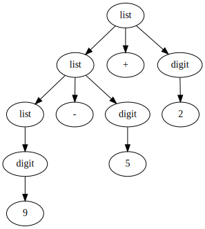

# 编译原理；Compilers: Principles, Techniques and Tools, Second Edition

本书作者：Alfred V.Aho, Monica S.Lam, Ravi Sethi, Jeffrey D.Ullman

译者：赵建华 郑滔 戴新宇

出版社：机械工业出版社

版权警告：本文摘录了很多原文，仅作为个人学习记录之用，请勿用作其它用途；

## 1 第一章 引论

程序设计语言是向人以及计算机描述计算过程的记号。在一个程序可以运行之前，它首先需要被翻译称一种能够被计算机执行的形式。完成这项翻译工作的软件系统成为**编译器**（compiler）。

本书介绍的是设计和实现编译器的方法。

### 1.1 语言处理器

简单地说，一个**编译器**就是一个程序，它可以阅读以某一种语言编写的程序，并把该程序翻译成为一个等价的、用另一种语言编写的程序。

**解释器**是另一种常见的语言处理器。它并不通过翻译的方式生成目标程序。从用户的角度看，解释器直接利用用户提供的输入执行源程序中指定的操作。

### 1.2 一个编译器的结构

编译器的映射过程由两个部分组成：分析部分和综合部分。

分析部分把源程序分解为多个要素，并在这些要素之上加上语法结构。然后，它使用这个机构来创建该源程序的一个中间表示。分析程序还会收集有关源程序的信息，并把信息存放在一个称为符号表的数据结构中。符号表将和中间表示一起传送给综合部分。

综合部分根据中间表示和符号表中的信息来构造用户期待的目标程序。分析部分经常被称为编译器的前端，而综合部分称为后端。

如果更加详细地研究编译过程，会发现它顺序执行了一组步骤。每个步骤把源程序的一种表示方式转换成另一种表示方式。一个典型的把编译程序分解成为多个步骤的方式如下：


在实践中，多个步骤可能被组合在一起，而这些组合在一起的步骤之间的中间表示不需要被明确地构造出来。存放整个源程序的信息的符号表可由编译器的各个步骤使用。

#### 1.2.1 词法分析

编译器的第一个步骤称为词法分析（lexical analysis）或扫描（scanning）。词法分析器读入组成源程序的字符流，并且将它们组织成为有意义的词素（lexeme）的序列。对于每个词素，词法分析器产生如下形式的词法单元（token）作为输出：

`<token-name, attribute-value>`

词法单元中，第一个分量`token-name`是一个由语法分析步骤使用的抽象符号，第二个分量`attribute-value`指向符号表中关于这个词法单元的条目。

比如，一个源程序包含如下的赋值语句：

`position = initial  + rate * 60`

这条语句可以组合成如下词素：

- `position`是一个词素，被映射成词法单元`<id,1>`，其中`id`是表示标志符的抽象符号，而`1`指向符号表中`position`对应的条目。一个标识符对应的符号表条目存放该标识符有关的信息，比如它的名字和类型。
- 赋值符号`=`是一个词素，它被映射成词法单元`<=>`。因为这个词法单元不需要属性值，所以我们省略了第二个分量。
- `initial`是一个词素，被映射成词法单元`<id,2>`，其中2指向`initial`对应的符号表条目。
- `+`是一个词素，被映射成词法单元`<+>`。
- `rate`是一个词素，被映射成词法单元`<id,3>`，其中3指向`rate`对应的符号表条目。
- `*`是一个词素，被映射成词法单元`<*>`。
- `60`是一个词素，被映射成词法单元`<60>`。注意，第二章再讨论数字的词法单元。

分隔词素的空格会被词法分析器忽略掉。

经过词法分析后，上述赋值语句被表示成如下词法单元序列：

`<id,1><=><id,2><+><id,3><*><60>`

在这个表示中，词法单元名`=`、`+`和`*`分别是表示赋值、加法运算符、乘法运算符的抽象符号。

符号表为：

| index | name     | type... |
| ----- | -------- | ------- |
| 1     | position | ...     |
| 2     | initial  | ...     |
| 3     | rate     | ...     |


#### 1.2.2 语法分析

编译器的第二个步骤称为语法分析（syntax analysis）或解析（parsing）。语法分析器使用由词法分析器生成的各个词法单元的**第一个分量**来创建树形的中间表示。该中间表示给出了词法分析器产生的词法单元流的语法结构。一个常用的表示方法是**语法树**（syntax tree），树中的每个内部节点表示一个运算，而该节点的子节点表示该运算的分量。

语法树显示了赋值语句中各个运算的执行顺序。语法树中，叶节点优先被运算。


#### 1.2.3 语义分析

语义分析器（semantic analyzer）使用语法树和符号表中的信息来检查源程序是否和语言定义的语义一致。它同时也收集类型信息，并把这些信息存放在语法树或符号表中。

语义分析的一个重要部分是类型检查（type checking）。编译器检查每个运算符是否具有匹配的运算分量。

语义分析过程中也会执行自动类型转换。


#### 1.2.4 中间代码生成

在语义分析完成之后，很多编译器会生成一个明确的低级的类机器语言的中间表示。我们可以把这个表示看作是某个抽象机器的程序。该中间表示应该具有两个重要的性质：它应该易于生成，且能够被轻松地翻译为目标机器上的语言。

我们考虑一种称为三地址代码（three-address code）的中间表示形式。这种中间表示由一组类似于汇编语言的指令组成，每个指令具有三个分量。每个运算分量都像一个寄存器。

中建代码生成器对上述语法树产生的输出为：

```
t1 = intofloat(60)
t2 = id3 * t1
t3 = id2 + t2
id1 = t3
```

三地址指令有几个特征：

- 每个三地址赋值指令的右部最多只有一个运算符。因此这些指令的顺序确定了运算完成的顺序。
- 编译器应该生成一个临时名字以存放一个三地址指令计算得到的值。
- 有些三地址指令的运算分量少于三个。

#### 1.2.5 代码优化

机器无关的代码优化步骤试图改进中间代码，以便生成更好的目标代码。

使用一个简单的中间代码生成算法，然后再进行代码优化步骤是生成优质目标代码的一个合理方法。

代码优化后中间代码形式如下：

```
t1 = id3 * 60.0
id1 = id2 + t1
```

#### 1.2.6 代码生成

代码生成器以源程序的中间表示形式作为输入，并把它映射到目标语言。代码生成的一个至关重要的方面是合理分配寄存器以存放变量的值。

使用寄存器R1和R2，上述优化后的中间代码可以被翻译成如下的机器代码：

```
LDF 	R2, 	id3
MULF 	R2, 	R2, 	#60.0
LDF		R1, 	id2
ADDF	R1,		R1,		R2
STF		id1,	R1
```

#### 1.2.7 符号表管理

编译器的重要功能之一是记录源程序中使用的变量的名字，并收集和每个名字的各种属性有关的信息。这些属性可以提供一个名字的存储分配、它的类型、作用域等信息。对于过程名字，这些信息还包括：它的参数数量和类型、每个参数的传递方法以及返回类型。

#### 1.2.8 将多个步骤组合成趟

以上关于关于步骤的讨论是一个编译器的逻辑组织方式。在一个特定的实现中，多个步骤的活动可以被组合成一趟（pass）。每趟读入一个文件并产生一个输出文件。

#### 1.2.9 编译器构造工具

除了通用的软件开发工具，人们还创建了一些更加专业的工具来实现编译器的不同阶段。一些常用的编译器构造工具包括：

- 语法分析器的生成器：可以根据一个程序设计语言的语法描述自动生成语法分析器。
- 扫描器的生成器：可以根据一个语言的语法单元的正则表达式描述生成词法分析器。
- 语法制导的翻译引擎：可以生成一组用于遍历分析树并生成中间代码的例程。
- 代码生成器的生成器：依据一组关于如何把中间语言的每个运算翻译称为目标机上的机器语言的规则，生成一个代码生成器。
- 数据流分析引擎：可以帮助收集数据流信息，即程序中的值如何从程序的一个部分传递到另一个部分。数据流分析是代码优化的一个重要部分。
- 编译器构造工具集：提供了可用于构造编译器的不同阶段的例程的完整集合。

### 1.3 程序设计语言的发展历程

第一台电子计算机出现在20世纪40年代。它使用0、1序列组成的机器语言编程，这个序列明确地告诉计算机以什么样的顺序执行哪些运算。运算本身也是很低层的：把数据从一个位置移动到另一个位置，把两个寄存器中的值相加，比较两个值等等。这种编程速度慢且枯燥，而且很容易出错。写出的程序也难以理解和修改。

#### 1.3.1 走向高级程序设计语言

走向更加人类友好的程序设计语言的第一步是20世纪50年代早期人们对助记汇编语言的开发。

走向高级程序设计语言的重大一步发生在20世纪50年代的后五年。

可以通过语言的“代”来分类。第一代语言是机器语言，第二代语言是汇编语言，第三代语言是Fortran、Cobol、Lisp、C、C++、C#及Java这样的高级程序设计语言。第四代语言是为特定应用设计的语言，比如用于生成报告的NOMAD，用于数据库查询的SQL和用于文本排版的Postscript。术语第五代语言指的是基于逻辑和约束的语言，比如Prolog和OPS5。

另一种分类方式把程序中指明如何完成一个计算任务的语言称为强制式语言，而把程序中指明要进行哪些计算的语言称为声明式语言。

#### 1.3.2 对编译器的影响

本书的目的是教授编译器设计中使用的根本思想和方法论。

### 1.4 构建一个编译器的相关科学

编译器的设计中有很多通过数学方法抽象出问题本质从而解决现实世界中复杂问题的完美例子。

#### 1.4.1 编译器设计和实现中的建模

对编译器的研究主要是有关如何设计正确的数学模型和选择正确算法的研究。设计和选择时，还需要考虑到对通用性及功能的要求与简单性及有效性之间的平衡。

最基本的数学模型是又穷状态自动机和正则表达式。这些模型用于描述程序的词法单位以及描述被编译器用来识别这些单位的算法。最基本的模型中还包括上下文无关文法，它用于描述程序设计语言的语法结构。

#### 1.4.2 代码优化科学

在编译器设计中，术语“优化”是指编译器为了生成比浅显直观的代码更加高效的代码而做的工作。

现在，编译器所做的代码优化变得更加重要，而且更加复杂。之所以变得更加复杂，是因为处理器体系结构变得更加复杂，也有了更多改进代码执行方式的机会。之所以变得更加重要，是因为巨型并发计算机要求实质性的优化，否则它们的性能将会呈数量级地下降。随着多核计算机日益流行，所有的编译器都将面临充分利用多处理器计算机的优势的问题。

应用严格的数学基础，使得我们可以证明一个优化是正确的，并且它对所有可能的输入都产生预期的效果。

从另一方面来说，只有理论是不够的。很多现实世界中的问题都没有完美的答案。实际上，我们在编译器优化中提出的很多问题都是不可判定的。

编译器优化必须满足下面的设计目标：

- 优化必须是正确的
- 优化必须能够改善很多程序的性能
- 优化所需的时间必须保持在合理范围内
- 所需要的工程方面的工作必须是可管理的

### 1.5 编译技术的应用

编译器设计并不只是关于编译器的。

#### 1.5.1 高级程序设计语言的实现

一个高级程序设计语言定义了一个编程抽象：程序员使用这个语言表达算法，而编译器必须把这个程序翻译成目标语言。

#### 1.5.2 针对计算机体系结构的优化

计算机体系结构的快速发展也对新编译器技术提出了越来越多的需求。几乎所有的高性能系统都利用了两种技术：并行和内存层次结构。

#### 1.5.3 新计算机体系结构的设计

在计算机体系结构设计的早期，编译器是在机器建造好之后再开发的。在现代计算机体系结构的开发中，编译器在处理器设计阶段就进行开发，然后编译得到代码并运行于模拟器上。这些代码被用来评价提议的体系结构特征。

有关编译器如何影响计算机体系结构设计的最有名的例子是RISC的发明。在发明RISC之前，趋势是开发的指令集越来越复杂，以使得汇编编程变得更容易。这些体系结构称为CISC。编译器优化经常能够消除复杂指令之间的冗余，把这些指令削减为少量较简单的运算。因此，人们期望设计出简单指令集。编译器可以有效地使用它们，而硬件也更容易进行优化。大部分通用处理器体系结构，都是基于RISC的概念。虽然x86体系结构具有CISC指令集，但在这个处理器本身的实现中使用了很多为RISC机器发展得到的思想。不仅如此，使用高性能x86机器的最有效的方法是仅使用它的简单指令。

#### 1.5.4 程序翻译

通常把编译看作是从一个高级语言到机器语言的翻译过程。同样的技术也可以应用到不同种类的语言之间的翻译。

二进制翻译：把一个机器的二进制代码翻译成另一个机器的二进制代码。

硬件合成：大部分硬件设计也是使用高级硬件描述语言描述的。

数据查询解释器：比如，SQL被用来搜索数据库。

编译然后模拟：不用模拟器，直接将设计编译并生成能够在机器上运行的模拟特定设计的机器代码。这样运行更快。

#### 1.5.5 软件生产率工具

很多原本为编译器优化所开发的数据流分析技术可以用来创建相应的工具。数据流分析在所有可能的执行路径上找到错误，而不是像程序测试的时候仅仅是在那些由输入数组组合执行的路径上找错误。

#### 1.5.6 类型检查

这种技术可以用来捕捉某种安全漏洞。如果用户提供的某个字符串没有被检查是否满足特定的格式，则它就是危险的。

#### 1.5.7 边界检查

#### 1.5.8 内存管理工具

人们开发了很多工具来帮助程序员寻找内存管理错误。

### 1.6 程序设计基础

#### 1.6.1 静态和动态的区别

在为一个语言设计一个编译器时，我们所面对的最重要的问题之一时编译器能够对一个程序做出哪些判定。如果一个语言使用的策略支持编译器静态决定某个问题，那么我们说这个语言使用了一个静态策略，或者说这个问题可以在编译时刻决定。另一方面，一个只允许在运行程序的时候做出决定的策略被称为动态策略，或者被认为需要在运行时刻做出决定。

另一个问题是声明的作用域。$x$的一个声明的作用域是指程序的一个区域，在其中对x的使用都指向这个声明。如果仅通过阅读程序就可以确定一个声明的作用域，那么这个语言使用的是静态作用域，或者说词法作用域。否则，这个语言使用的是动态作用域。如果使用动态作用域，在程序运行时，同一个对$x$的使用会指向$x$的几个声明中的某一个。

#### 1.6.2 环境与状态

在讨论程序设计语言时，必须了解的一个重要区别是在程序运行时发生的改变是会影响数据元素的值，还是影响了对那个数据的名字的解释。

例如，`y=x+1`这个语句会改变名字`x`在内存中的值。而如果`x`是一个类变量，则`x`所指的位置也可能在运行时发生改变。

（1）环境（environment）。是一个从名字到存储位置的映射。因为变量就是指内存位置，也可以把环境定义为从名字到变量的映射。

（2）状态（state）。是一个从内存位置到它们的值的映射。从C语言角度说，即状态把左值映射为它们的相应右值。


C代码示例：

```C
// ...
int i;
// ...

void f()
{
  int i;
  // ...
  i = 3;
  // ...
}

// ...
  x = i + 1;
```

（1）名字到位置的静态绑定与动态绑定。大部分从名字到位置的绑定是动态的。某些声明（如上述例子中的全局变量`i`）可以在编译器生成目标代码时一劳永逸地分配一个存储位置。

（2）从位置到值的静态绑定与动态绑定。一般来说，位置到值的绑定也是动态的，因为我们无法在运行一个程序之前指出一个位置上的值。被声明的常量是一个例外。

#### 1.6.3 静态作用域和块结构

包括C语言和它的同类语言在内的大多数语言使用静态作用域。

```
区分名字、标识符、变量
标识符（identifier）是一个字符串，通常由字母和数字组成。它用来标记一个实体，比如一个数据对象、过程、类、类型。标识符是名字的子集。例如，名字x.y中，x和y都是标识符。x.y称为受限名字。
变量指向存储中的某个特定的位置。同一个标识符被多次声明时，每一个这样的声明都引入一个新的变量。
```

#### 1.6.4 显式访问控制

类和结构为它们的成员引入了新的作用域。

```
声明和定义
程序设计语言概念中的两个看起来相似的术语“声明”和“定义”实际上有着很大的不同。声明告诉我们事物的类型，而定义告诉我们它们的值。
```

#### 1.6.5 动态作用域

术语动态作用域通常指的是下面的策略：对一个名字`x`的使用指向的是最近被调用但还没有终止且声明了`x`的过程中的这个声明（翻译的啥）。这种类型的动态作用域仅仅在一些特殊情况下才会出现。考虑两个动态作用域的例子：C预处理器中的宏扩展，以及面向对象编程中的方法解析。

举例：

```C
#define a (x+1)
```

其中，标识符`a`是一个代表了表达式`x+1`的宏，但`x`到底是什么呢？我们不能够静态地解析`x`。

动态作用域对多态过程是必不可少的。所谓多态过程是指对于同一个名字根据参数类型具有两个或多个定义的过程。

#### 1.6.6 参数传递机制

所有的程序设计语言都有关于过程的概念，但是在这些过程如何获取它们的参数方面，不同的语言之间不同。本节将考虑实在参数是如何与形式参数关联起来的。大多数语言要么使用值调用，要么使用引用调用，或者两者都用。

在值调用中，会对实在参数求值或拷贝。这些值被放在属于被调用过程的相应形式参数的内存位置上。值调用的效果是，被调用过程所做的所有有关形式参数的计算都局限于这个过程，相应的实在参数本身不会被改变。

在引用调用中，实在参数的地址作为相应的形式参数的值被出传递给被调用的者。在被调用者的代码中使用形式参数时，实现方法是沿着这个指针找到调用者之名的内存位置。因此，改变形式参数看起来就像是改变了实在参数一样。

#### 1.6.7 别名

引用调用或者其他类似的方法，会引起一个结果，即有可能两个形式参数指向同一个位置，这样的变量称为另一个变量的别名。

## 2 第二章 一个简单的语法制导翻译器

本章的内容是对第3章至第6章中介绍的编译技术的总体介绍。通过开发一个可运行的Java程序来演示这些编译技术。

### 2.1 引言

编译器在分析阶段把一个源程序划分成各个组成部分，并生成源程序的内部表示形式。这种内部表示形式称为中间代码。编译器在合成阶段将这个中间代码翻译成目标程序。

分析阶段是围绕“语法”展开的。语法描述了语言的正确形式，语义则定义了程序在运行时做什么事情。

一个广泛使用的用来描述语法的表示方法是上下文无关文法（BNF）。

上下文无关文法不仅可以用来描述一个语言的语法，还可以指导程序的翻译过程。


### 2.2 语法定义

这一节，将介绍一种用于描述程序设计语言语法的表示方法：上下文无关语法（BNF）。

BNF自然地描述了大多数程序设计语言构造的层次化语法结构。例如，Java中的if-else语句通常具有以下形式：

`if (expression) statement else statement`

如果用`expr`来表示表达式，用变量`stmt`表示语句，那么这个构造规则可以表示为：

`stmt --> if (expr) stmt else stmt`

其中的箭头可以读作“可以具有以下的形式”。这样的规则称为产生式。在产生式中，像关键字`if`和括号这样的词法元素称为**终结符号**，像`expr`和`stmt`这样的变量表示终结符号的序列，它们称为**非终结符号**。

#### 2.2.1 文法定义

一个上下文无关文法由四个元素组成：

（1）一个**终结符号集合**。终结符号是该文法所定义的语言的基本符号的集合。

（2）一个**非终结符号集合**，它们有时也称为“语法变量”。

（3）一个**产生式集合**，其中每个产生式包括一个称为产生式头或左部的非终结符号。

（4）指定一个非终结符号为**开始符号**。

例：由`digit`和`+`、`-`符号组成的表达式，比如`9-5+2`、`3-1`、`7`。由于两个`digit`之间必须出现`+`或`-`，可以把这样的表达式称为由`+`、`-`号分隔的数位序列。这个数位序列的文法描述如下：

```
终结符号：
+ - 0 1 2 3 4 5 6 7 8 9

非终结符号：
digit list

产生式：
list --> list + digit | list - digit | digit

开始符号：
list
```

#### 2.2.2 推导

根据BNF推导符号串时，首先从开始符号出发，不断将某个非终结符号替换为该非终结符号的某个产生式的体。可以从开始符号推导得到的所有终结符号串的集合称为该文法定义的语言。

例：推导出`9-5+2`是一个`list`。

```
推导步骤如下：
- 9 is digit --> 9 is list
- 5 is digit & 9 is list --> 9-5 is list
- 9-5 is list & 2 is digit --> 9-5+2 is list
```

**语法分析**的任务：接受一个终结符号串作为输入，找出从文法的开始符号推导这个串的方法。

如果不能从文法的开始符号推导得到该终结符号串，则报告该中介符号串中包含语法错误。

#### 2.2.3 语法分析树

语法分析树用图形方式展现了从文法的开始符号推导出相应语言中的符号串的过程。

如果非终结符号`A`有一个产生式`A --> XYZ`，则语法树如下：


给定一个BNF，则该文法的语法分析树具有以下性质：

- 根节点的标号为文法的开始符号；
- 每个叶子节点的标号为一个终结符号或$\epsilon$（表示空的符号串）；
- 每个内部节点的标号为一个非终结符号；
- 如果非终结符号`A`是某个内部节点的标号，并且它的子节点的标号从左至右分别为`X1,X2,...,XN`，则必然存在产生式`A --> X1X2...XN`，其中子节点的标号可以是终结符号，也可以是非终结符号。

例：`9-5+2`的语法分析树如下：



一个语法分析树的叶子节点从左向右构成了树的结果，也就是从这棵语法分析树的根结点上的非终结符号推导得到的符号串。

一个文法的语言的另一个定义是任何能够由某棵语法分析树生成的符号的集合。为一个给定的中介符号串构建一棵语法分析树的过程称为对该符号串进行**语法分析**。

#### 2.2.4 二义性

一个文法可能由多棵语法分析树能够生成同一个给定的终结符号串。这样的文法称为具有**二义性**。具有两棵以上语法分析树的符号串通常具有多个含义，所以我们需要为编译应用设计出没有二义性的文法，或者在使用二义性文法时使用一个附加的规则来消除二义性。

举例：将`9-5+2`的文法改写如下：

`string --> string + string | string - string | [0-9]`

此时，会有多棵语法分析树，两种情况如下：


此时语法树对应的表达式为`9-(5+2)`。

#### 2.2.5 运算符的结合性

当一个运算分量的左右两侧都有运算符时，需要一些规则来决定哪个运算符被应用于该运算分量。说运算符`+`是左结合的，是指当一个运算分量左右两侧都有`+`号时，它属于左边的运算符。

C语言中，赋值运算符`=`是右结合的。例如表达式`a=b=c`，其运算顺序为`a=(b=c)`。

#### 2.2.6 运算符的优先级

考虑表达式`9+5*2`，该表达式有两种可能的解释，即`(9+5)*2`或`9+(5*2)`，由于运算符的结合性只能作用于同一运算符的多次出现，因此无法解决这个二义性。

如果`*`先于`+`获得运算分量，就说`*`相比`+`具有更高的优先级。

如果仅考虑四个常用的算数运算符和一个优先级表，这个优先级表中的运算符按优先级逐级递增的顺序排列：

| order | ops  |
| ----- | ---- |
| 1     | + -  |
| 2     | * /  |

再创建两个非终结符号`expr`和`term`分别对应这两个优先级层次，并用非终结符号`factor`来生成表达式的基本单元。

```
expr --> expr + term | expr - term | term
term --> term * factor | term / factor | factor
factor --> digit | (expr)
```

在这个文法中，`expr`是一个由`+`和`-`分隔开的`term`的列表，而`term`是由`*`或`/`分隔的`factor`的列表。

#### 2.2.7 2.2节的练习

略；

## 3 第3章 词法分析

本章主要讨论如何构建一个词法分析器。

### 3.1 词法分析器的作用

词法分析是编译的第一阶段。词法分析器的主要任务是读入源程序的输入字符，将它们组成词素，生成并输出一个词法单元序列，每个词法单元对应一个词素。这个词法单元序列被输出到语法分析器进行语法分析。词法分析器通常还要和符号表进行交互。当词法分析器发现了一个标识符的词素时，它要将这个词素添加到符号表中。在某些情况下，词法分析器会从符号表中读取有关标识符的种类的信息，以确定向语法分析器传送哪个词法单元。


词法分析器还会完成一些识别词素之外的其他任务。比如过滤掉源程序中的注释和空白；将编译器生成的错误消息与源程序的位置联系起来。

词法分析器可以分成两个级联的处理阶段：

- 扫描阶段。主要负责完成一些不需要生成词法单元的简单处理，比如删除注释和将多个连续的空白字符压缩成一个字符。
- 词法分析阶段。处理扫描阶段的输出并生成词法单元。

#### 3.1.1. 词法分析及语法分析

将编译过程的分析过程划分为词法分析和语法分析的原因：

- 简化编译器设计；
- 提高编译器效率；
- 增强编译器的可移植性；

#### 3.1.2 词法单元、模式和词素

- 词法单元由一个词法单元名和一个可选的属性组成。词法单元名是一个表示某种词法单位的抽象符号，比如一个特定的关键字，或者嗲表一个标识符的输入字符序列；
- 模式描述了一个词法单元的词素可能具有的形式；
- 词素是源程序中的一个字符序列，它和某个此法单元的模式匹配，并被词法分析器识别为该词法单元的一个实例。

一个C语言中的例子：

| 词法单元   | 模式                   | 词素示例          |
| ---------- | ---------------------- | ----------------- |
| if         | 字符`i,f`              | `if`              |
| else       | 字符`e,l,s,e`          | `else`            |
| comparison | `<,>,<=,>=,==,!=`      | `<=,!=`           |
| id         | 字母开头的字母或数字串 | `pi,score,s200`   |
| number     | 任何数字常量           | `3.1516,0,6.02e7` |
| literal    | 引号之间的字符         | "core dump"       |

#### 3.1.3 词法单元的属性

词法分析器不仅仅向语法分析器返回一个词法单元名字，还会返回一个描述该词法单元的词素的属性值。词法单元的名字将影响语法分析过程中的决定，而这个属性则会影响语法分析之后对这个词法单元的翻译。

一般来说，和一个标识符有关的信息，比如它的词素、类型、第一次出现的位置（报告错误信息）都保存在符号表中。因此一个标识符的属性值是一个指向符号表中该标识符对应条目的指针。

#### 3.1.4 词法错误

如果没有其它组件的帮助，词法分析器很难发现源代码中的错误。比如再C程序片段中碰到`fi`时，无法指出究竟是关键字`if`的误写还是一个未声明的函数标识符。由于`fi`是标识符id的一个合法词素，因此词法分析器必须向语法分析器返回这个词法单元。

### 3.2 输入缓冲

源程序读入虽然简单，却很重要。

#### 3.2.1 缓冲区对

一种机制就是利用两个交替读入的缓冲区。每个缓冲区的大小通常都是一个磁盘块的大小。

程序为输入维护了两个指针，`lexeme_begin`和`forward`指针，前者指向当前词素的开始位置，后者用于确定词素的结尾。`forward`指针前移过程中，需要检查是否已经抵达了当前缓冲区的末尾。如果到达了末尾，则需要读入数据到另一个缓冲区内，并且将`forward`指针移动到另一个缓冲区的头部。

只要词素的长度加上向前扫描的长度不超过缓冲区的大小，就不会出现覆盖的情况。

#### 3.2.2 哨兵标记

在读入字符并移动`forward`的过程中，有两种需要检查的情况，一是是否到达了文件末尾（读取到了`eof`），二是是否到达了缓冲区末尾。如果在缓冲区末尾也增加一个`eof`，就可以将这两种情况合并。

### 3.3 词法单元的规约

正则表达式是一种用来描述词素模式的重要方法。虽然正则表达式不能表达出所有可能的模式，但是它们可以高效地描述在处理词法单元时要用到的模式类型。

#### 3.3.1 串和语言

字母表是一个有限的符号集合。符号的典型例子包括字母、数位和标点符号。集合$\{0,1\}$是二进制字母表。

某个字母表上的一个串是该字母表中符号的一个有穷序列。在语言理论中，属于“句子”和“字”通常被当作“串”的同义词。串$s$的长度，通常记作$|s|$，是指$s$中符号出现的次数。空串是指长度为0的串，用$\epsilon$表示。

语言是指给定字母表上一个任意的可数的串集合。注意，这个定义并没有要求语言中的串一定具有某种含义。

串相关的术语：

- 前缀；
- 后缀；
- 子串：删除串的某个前缀和后缀之后得到的串；
- 真前缀、真后缀、真字串：不为本身也不为空串的前缀、后缀、字串；
- 子序列：去掉任意个任意位置的符号后得到的串；

串的连接（乘法）：若$x$和$y$都是串，则$x$和$y$的连接就是把$y$附加到$x$后面而形成的串，记作$xy$。

串的指数运算：定义$s^0=\epsilon$，且对于$i>1$，有$s^i=s^{i-1}s$。

#### 3.3.2 语言上的运算

在词法分析中，最重要的语言上的运算是并、连接和闭包运算。定义如下：

| 运算                 | 定义                                      |
| -------------------- | ----------------------------------------- |
| $L$和$M$的并         | $L\cup M = \{ s | s \in L \lor s \in M\}$ |
| $L$和$M$的连接       | $LM=\{st|s\in L\land t\in M \}$           |
| $L$和$M$的Kleene闭包 | $L^*=\bigcup_{i=0}^{\infin}L^i$           |
| $L$和$M$的正闭包     | $L^*=\bigcup_{i=1}^{\infin}L^i$           |

#### 3.3.3 正则表达式

正则表达式可以由较小的正则表达式按照如下规则递归地构建。每个正则表达式$r$表示一个语言$L(r)$，这个语言也是根据$r$的子表达式所表示的语言递归定义的。下面的表达式定义了某个字母表$\Sigma$上的正则表达式以及这些表达式所表示的语言。

归纳基础：如下两个规则构成了归纳基础：

（1）$\epsilon$是一个正则表达式，$L(\epsilon)=\{\epsilon\}$，即该语言只包含空串；

（2）如果$a$是$\Sigma$上的一个符号，那么$\bold{a}$是一个正则表达式，并且$L(\bold{a})=\{a\}$。也就是说，这个语言仅包含一个长度为1的符号串$a$。

归纳步骤：由小的正则表达式构造较大的正则表达式的步骤有四个部分。假定$r$和$s$都是正则表达式，分别表示语言$L(r)$和$L(s)$，那么：

（1）$(r)|(s)$是一个正则表达式，表示语言$L(r)\cup L(s)$；

（2）$(r)(s)$是一个正则表达式，表示语言$L(r)L(s)$；

（3） $(r)^*$是一个正则表达式，表示语言$(L(r))^*$；

（4）$(r)$是一个正则表达式，表示语言$L(r)$；

第4个规则是为了说明，括号不影响表达式所表示的语言。

可以附加一些约定，丢掉一些不必要的括号：

（1）闭包运算符具有最高优先级，并且是左结合的；

（2）连接具有次高优先级，并且是左结合的；

（3）或运算优先级最低，并且也是左结合的；

例3.4 令$\Sigma=\{a,b\}$；

（1）正则表达式$\bold{a}|\bold{b}$表示语言$\{a,b\}$；

（2）正则表达式$(\bold{a}|\bold{b})(\bold{a}|\bold{b})$表示语言$\{aa,ab,ba,bb\}$，即字母表$\Sigma$上长度为2的所有串的集合。可以表示同样语言的另一个正则表达式是$\bold{aa}|\bold{ab}|\bold{ba}|\bold{bb}$；

（3）正则表达式$\bold{a}^*$表示所有由零个或多个$a$组成的串的集合，即$\{\epsilon,a,aa,aaa,...\}$；

（4）正则表达式$(\bold{a}|\bold{b})^*$表示由零个或多个$a$或$b$组成的串的集合；

可以用一个正则表达式定义的语言叫做正则集合（regular set）。如果有两个正则表达式$r$和$s$表示同样的语言，则称$r$和$s$等价，记作$r=s$。

正则表达式遵守一些代数定律，其中一些如下：

| 定律              | 描述     |
| ----------------- | -------- |
| $r|s=s|r$         | 或可交换 |
| $r|(s|t)=(r|s)|t$ | 或可结合 |
| $r(st)=(rs)t$     |          |

