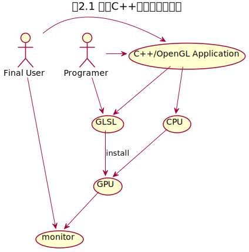
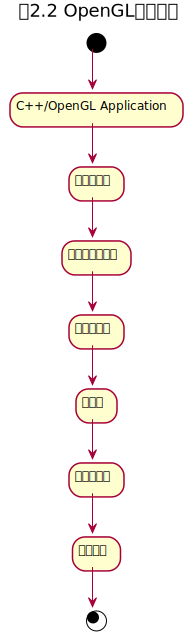

# Computer Graphics Programming in OPENGL with C++(Second Edition)

## 第1章 入门

图形编程是计算机科学中最具挑战性的主题之一，并因此而闻名。当今，图形编程是基于着色器的。有些程序是用诸如C++或Java的等标准编程语言编写的，并运行在中央处理器上；另一些是用专用的着色器语言编写的，直接运行在图形处理单元上。着色器编程的学习曲线很陡峭，以致哪怕是绘制简单的东西，也需要一系列错综复杂的步骤，把图形数据从一个管线中传递下去才能完成。现代显卡能够并行处理数据，即使是挥之简单的形状，图形程序员也必须理解GPU的并行架构。

这虽然并不简单，但可以换回超强的渲染能力。

### 1.1 语言和库

总的来说，需要用到以下库：

- C++开发环境；
- OpenGL/GLSL；
- 窗口管理库
- 扩展库
- 数学库
- 纹理图像加载库

#### 1.1.1 C++

本书使用visual studio。

#### 1.1.2 OpenGL/GLSL

本书假定读者的计算机上有一个支持至少4.3版本OpenGL的显卡。

#### 1.1.3 窗口管理库

OpenGL实际上并不是把图像直接绘制到计算机屏幕上，而是将之渲染到一个帧缓冲区，然后由计算机来负责把帧缓冲区中的内容绘制到屏幕上的一个窗口中。

GLFW是本书选择使用的窗口管理库。

#### 1.1.4 扩展库

OpenGL围绕一组基本功能和扩展机制进行组织。随着技术的发展，扩展机制可以用来支持新的功能。OpenGL的核心中有一些内置的命令用来支持这一点，但是为了使用现代命令，需要执行很多相当复杂的代码。使用一个扩展库来处理这些细节已经成了标准做法，这样能让程序员直接使用现代OpenGL命令。扩展库有Glee、GLLoader和GLEW，以及新版的GL3W和GLAD。本书使用GLEW。

#### 1.1.5 数学库

3D图形编程会大量使用向量和矩阵代数。因此，配合一个支持常见数学计算任务的函数库或者类包，能极大地方便OpenGL的使用。

本书使用OpenGL Mathematics数学库，一般称作GLM。

GLM可提供与图形概念相关的类和基本数学函数，例如矢量、矩阵和四元数。它还包含各种工具类，用于创建和使用常见的3D图形结构，例如透视和视角矩阵。

#### 1.1.6 纹理图像加载库

从第5章开始，我们将使用图形文件来向图形场景中的对象添加纹理。这意味着我们会频繁加载这些图像文件到我们的C++/OpenGL代码中。

本书使用的纹理图像加载库是SOIL2，SOIL的一个更新的分支版本。

#### 1.1.7 可选库

本书中，我们将展示如何从零开始实现一个简单的OBJ模型加载器。然而，它没有处理OBJ标准中很多可用的选项。有一些更复杂的、现成的OBJ模型加载器可供选择，比如Assimp和tinyobjloader。

## 第2章 OpenGL图像管线

OpenGL是整合软硬件的多平台2D和3D图形API。

在硬件方面，OpenGL提供了一个多级图形管线，可以使用一种名为GLSL的语言进行部分编程。

在软件方面，OpenGL的API是用C语言编写的，因此API调用直接兼容C和C++。对于其他的流行语言，OpenGL也有稳定的包装库，它们具有与C语言库几乎相同的性能。当一个C++程序包含OpenGL调用时，我们将其称为C++/OpenGL应用程序。C++/OpenGL应用程序的一个重要任务是让程序员的GLSL代码运行于GPU上。

基于C++的图形应用概览如下图所示。



在后面的编码中，一部分用C++实现，进行OpenGL调用；另一部分用GLSL实现。C++/OpenGL应用程序、GLSL模块和硬件一起用来生成3D图形输出。当应用程序完成之后，最终用户直接与C++应用程序交互。

GLSL是一种着色器语言。着色器语言主要运行于GPU上。GLSL是与OpenGL兼容的专用着色器语言。

### 2.1 OpenGL管线

现代3D图形编程会使用管线的概念，在管线中，将3D场景转换为2D图形的过程被分割成许多步骤。下图为OpenGL图形管线简化后的概览。



C++/OpenGL应用程序发送图形数据到顶点着色器，随着管线处理，最终生成在显示器上显示的像素点。

图中顶点着色器、曲面细分着色器、几何着色器、片段着色器可以用GLSL编程。将GLSL程序载入这些着色器阶段也是C++/OpenGL应用程序的责任之一。其过程如下：

（1）使用C++获取GLSL着色器代码，既可以从文件中读取，也可以硬编码在字符串中；

（2）创建OpenGL着色器对象，并将GLSL着色器代码加载到着色器对象中；

（3）用OpenGL命令编译并连接着色器对象，将它们装载到GPU；

实践中，一般至少要提供顶点着色器和片段着色器阶段的GLSL代码，而曲面细分着色器和几何着色器阶段是可省略的。

#### 2.1.1 C++/OpenGL应用程序

见代码。

```c++
#include <GL/glew.h>
#include <GLFW/glfw3.h>
#include <iostream>

void init(GLFWwindow *window) {}

void display(GLFWwindow *window, double currentTime) {
    glClearColor(1.0, 0.0, 0.0, 0.0);
    glClear(GL_COLOR_BUFFER_BIT);
}

int main() {
    if (!glfwInit()) {
        exit(EXIT_FAILURE);
    }

    glfwWindowHint(GLFW_CONTEXT_VERSION_MAJOR, 4);
    glfwWindowHint(GLFW_CONTEXT_VERSION_MINOR, 3);

    GLFWwindow *window = glfwCreateWindow(600, 400, "c2-p1", nullptr, nullptr);
    glfwMakeContextCurrent(window);

    if (glewInit() != GLEW_OK) {
        exit(EXIT_FAILURE);
    }
    glfwSwapInterval(1);

    init(window);

    while (!glfwWindowShouldClose(window)) {
        display(window, glfwGetTime());
        glfwSwapBuffers(window);
        glfwPollEvents();
    }

    glfwDestroyWindow(window);
    glfwTerminate();
    exit(EXIT_FAILURE);
}
```

#### 2.1.2 顶点着色器和片段着色器

见代码。

```c++
#include <GL/glew.h>
#include <GLFW/glfw3.h>
#include <iostream>

#define numVAOs 1

GLuint renderingProgram;
GLuint vao[numVAOs];

GLuint createShaderProgram() {
    const char *vshaderSource = 
        "#version 430 \n"
        "void main(void) \n"
        "{ gl_Position = vec4(0.0, 0.0, 0.0, 1.0); }";
    const char *fshaderSource = 
        "#version 430 \n"
        "out vec4 color; \n"
        "void main(void) \n"
        "{ color = vec4(1.0, 0.0, 0.0, 1.0); }";
    
    GLuint vShader = glCreateShader(GL_VERTEX_SHADER);
    GLuint fShader = glCreateShader(GL_FRAGMENT_SHADER);

    glShaderSource(vShader, 1, &vshaderSource, nullptr);
    glShaderSource(fShader, 1, &fshaderSource, nullptr);
    glCompileShader(vShader);
    glCompileShader(fShader);

    GLuint vfProgram = glCreateProgram();
    glAttachShader(vfProgram, vShader);
    glAttachShader(vfProgram, fShader);
    glLinkProgram(vfProgram);

    return vfProgram;
}

void init(GLFWwindow *window) {
    renderingProgram = createShaderProgram();
    glGenVertexArrays(numVAOs, vao);
    glBindVertexArray(vao[0]);
}

void display(GLFWwindow *window, double currentTime) {
    glUseProgram(renderingProgram);
    glPointSize(5.0f);
    glDrawArrays(GL_POINTS, 0, 1);
}

int main() {
    if (!glfwInit()) {
        exit(EXIT_FAILURE);
    }

    glfwWindowHint(GLFW_CONTEXT_VERSION_MAJOR, 4);
    glfwWindowHint(GLFW_CONTEXT_VERSION_MINOR, 3);

    GLFWwindow *window = glfwCreateWindow(600, 400, "c2-p1", nullptr, nullptr);
    glfwMakeContextCurrent(window);

    if (glewInit() != GLEW_OK) {
        exit(EXIT_FAILURE);
    }
    glfwSwapInterval(1);

    init(window);

    while (!glfwWindowShouldClose(window)) {
        display(window, glfwGetTime());
        glfwSwapBuffers(window);
        glfwPollEvents();
    }

    glfwDestroyWindow(window);
    glfwTerminate();
    exit(EXIT_FAILURE);
}
```

#### 2.1.3 曲面细分着色器

可编程曲面细分阶段是最近加入OpenGL（4.0版本）的功能。它提供了一个曲面细分着色器以生成大量三角形，通常以网格形式排列。同时也提供了一些可以以各种方式操作这些三角形的工具。

#### 2.1.4 几何着色器

顶点着色器可赋予程序员一次操作一个顶点的能力，片段着色器可赋予程序员一次操作一个像素的能力，几何着色器可赋予程序员一次操作一个图元的能力。

按图元处理有很多用途，可以让图元变形，还可以删除一些图元从而在渲染的物体上产生洞——这是一种将简单模型转化为复杂模型的方法。

几何着色器也提供了生成额外图元的方法，这些方法也打开了通过转换简单模型得到复杂模型的大门。几何着色器有一种有趣的用法，就是在物体上增加表面纹理，如凸起、麟、毛发。

#### 2.1.5 栅格化

3D世界中的点、三角形、颜色等全部都需要展现在一个2D显示器上。这个2D屏幕由栅格组成。

当3D物体栅格化后，OpenGL会将物体中的图元转化为片段。片段拥有关于像素的信息。栅格化过程确定了为了显示由3个顶点确定的三角形需要绘制的所有像素的位置。

栅格化开始时，先对三角形的每对顶点进行插值。插值过程可以通过选项调节，就目前而言，使用简单的线性插值就够了。

如果栅格化过程到此为止，那么呈现出的图像将会是线框模型。呈现现况模型也是OpenGL中的一个选项，设置方法是在`display()`函数中`glDrawArrays()`的调用之前添加如下代码：

```c
glPolygonMode(GL_FRONT_AND_BACK, GL_LINE);
```

如果不加入这一行代码，插值过程将会继续沿着栅格线填充三角形的内部。将其应用于环面时，会产生一个完全栅格化的实心环面。

#### 2.1.6 片段着色器

片段着色器用于为栅格化的像素指定颜色。在程序2.1.2中，片段着色器仅将输出硬编码为特定值，从而为每个输出的像素赋予相同的颜色。

在顶点着色器中，顶点的输出坐标曾使用预定义变量`gl_Position`。在片段着色器中，同样有一个变量让程序员可以访问输入片段的坐标，叫做`gl_FragCoord`。可以修改程序2.1.2中的片段着色器，让它使用`gl_FragCoord`基于位置设置每个像素的颜色。

```glsl
#version 430
out vec4 color;
void main(void)
{
    if (gl_FragCoord.x < 295) color = vec4(1.0, 0.0, 0.0, 1.0);
    else color = vec4(0.0, 0.0, 1.0, 1.0);
}
```

#### 2.1.7 像素操作

在`display()`中使用`glDrawArrays()`命令绘制场景中的物体时，我们通常期望前面的物体挡住后面的物体。

为了实现这个效果，我们需要执行隐藏面消除（HSR）操作。基于场景需要，OpenGL可以进行一系列不同的HSR操作。虽然这个阶段不可变成，但是理解它的工作原理也是非常重要的。我们不仅需要正确地配置它，之后还需要给场景添加阴影时对它进行进一步操作。

OpenGL可以精巧地协调两个缓冲区，即颜色缓冲区和深度缓冲区，从而完成隐藏面消除。这两个缓冲区都和栅格的大小相同。

当绘制场景中的各种对象时，片段着色器会生成像素颜色。像素颜色会存放在颜色缓冲区中，而最终颜色缓冲区会被写入屏幕。当多个对象占据颜色缓冲区中的相同像素时，必须根据最接近观察者的对象来确定保留的像素颜色。

隐藏面消除按照如下步骤完成：

（1）在每个场景渲染前，将深度缓冲区全部初始化为表示最大深度的值。

（2）当片段着色器输出像素颜色时，计算它到观察者的距离。

（3）如果距离小于深度缓冲区存储的值，那么有当前像素颜色替换颜色缓冲区的颜色，同时用当前距离替换深度缓冲区的值；否则抛弃当前像素。

这个过程即Z-buffer算法。

### 2.2 检测OpenGL和GLSL错误

编译和运行GLSL代码的过程与普通代码不同，GLSL的编译发生在C++运行时。另外一个复杂的点是GLSL代码并没有运行在CPU中，因此操作系统并不总能捕获OpenGL运行时的错误。

程序2.3实现了如下3个实用功能：

- `printShaderLog()`：当GLSL代码编译失败时，显示OpenGL日志内容；
- `printProgramLog()`：当GLSL链接失败时，显示OpenGL日志内容；
- `checkOpenGLError()`：检查OpenGL错误标志，即是否发生OpenGL错误；

