[toc]

# 计算机网络-自顶向下方法-笔记

本书作者：James F.Kurose, Keith W.Ross  
译者：陈鸣  
出版社：  机械工业出版社  

## 1 计算机网络和因特网

### 1.1 什么是因特网

#### 1.1.1 具体构成描述

- 因特网是一个世界范围的计算机网络，即它是一个互联了遍及全世界数十亿计算设备的网络。  
- 用因特网术语来说，所有这些设备都称为**主机**或**端系统**。  
- 端系统通过**通信链路**和**分组交换机**连接到一起。  
- 不同的链路能够以不同的速率传输数据，链路的**传输速率**以比特每秒（bps）度量。  
- 当一台端系统要向另一台端系统发送数据时，发送端系统将数据分段，并为每段加上首部字节。由此形成的信息包用计算机网络的术语来说称为**分组**。  
- 市面上流行着各种类型、各具特色的分组交换机，但在当今的因特网中，两种最著名的类型是**路由器**和**链路层交换机**。  
- 从发送端系统到接收端系统，一个分组所经历的一系列通信链路和分组交换机称为通过该网络的**路径**。  
- 端系统通过**因特网服务提供商**（ISP）接入因特网。每个 ISP 自身就是一个由多台分组交换机和多段通信链路组成的网络。  
- 端系统、分组交换机和其它因特网不见都要运行一系列**协议**，这些协议控制因特网中信息的接受和发送。**TCP** 和 **IP** 是因特网中两个最为重要的协议。因特网的主要协议统称为 **TCP/IP**。  
- **因特网标准**由因特网工程任务组（IETF）研发。IETF 的标准文档称为 RFC（Request For Comment）。  

#### 1.1.2 服务描述

- 从一个完全不同的角度，即从为应用程序提供服务的基础设施的角度来描述因特网。  
- 除了诸如电子邮件和 Web 冲浪等传统应用外，因特网应用还包括移动智能手机和平板电脑应用程序，其中包括即时讯息、与实时道路流量信息的映射、来自云的音乐流、电影和电视流、在线社交网络、视频会议、多人游戏以及基于位置的推荐系统。因为这些应用程序涉及多个相互交换数据的端系统，故它们被称为**分布式应用程序**。  
- 因特网应用程序运行在端系统上，即它们并不运行在网络核心中的分组交换机中。  
- 与因特网相连的端系统提供了一个**套接字接口**，该接口规定了运行在一个端系统上的程序请求因特网基础设施向运行在另一个端系统上的特定目的地程序交付数据的方式。  

#### 1.1.3 什么是协议

- **协议**定义了在两个或多个通信实体之间交换的报文的格式和顺序，以及报文发送和/或接受一条报文或其它事件所采取的动作。  

### 1.2 网络边缘

- 端系统也称为主机，因为它们容纳应用程序。  
- 主机有时又被进一步划分为两类：**客户**和**服务器**。  

#### 1.2.1 接入网

- **接入网**，是指将端系统物理连接到其**边缘路由器**的网络。边缘路由器是端系统到任何其它远程系统的路径上的第一台路由器。  
- 家庭接入：DSL、电缆、FTTH、拨号和卫星。  
- 企业（和家庭）接入：以太网和 WIFI。  
- 广域无线接入：3G 和 LTE 。  

#### 1.2.2 物理媒体

- 对于每个发射器 - 接收器对，通过跨越一种**物理媒体**传播电磁波或光脉冲来发送该比特。  
- 物理媒体分成两种类型：**导引型媒体**和**非导引型媒体**。  
- 双绞铜线、同轴电缆、光纤、陆地无线电信道、卫星无线电通信。  

### 1.3 网络核心

#### 1.3.1 分组交换

- 在各种网络应用中，端系统彼此交换**报文**。  
- 为了从源端系统向目的端系统发送一个报文，源将长报文划分为较小的数据块，称之为**分组**。  
- 在源和目的地之间，每个分组都通过通信链路和**分组交换机**传送。（交换机主要由两类：路由器和链路层交换机）。

##### 1.3.1.1 存储转发传输

- 多数分组交换机在链路的输入端使用**存储转发传输**机制。  
- 存储转发传输是指在交换机能够开始向输出链路传输该分组的第一个比特之前，必须接受到整个分组。  
  假设不考虑链路传播时延，那么对于一条链路，发送数据结束时接收数据也同时结束，也即一条链路的时延为发送数据的时延，端到端的时延为所有链路上发送数据的时延之和。  
  设 $L$ 为分组大小，$R_i$ 为第 $i$ 条链路的传输速率，路径上总共有 $n$ 条链路，则端到端时延 $d$ 为  
  $\displaystyle d=\sum_{i=1}^n \frac{L}{R_i}$  
- 存储转发机制引起的时延称为**转发时延**。  

##### 1.3.1.2 排队时延和分组丢失

- 对于每条相连的链路，分组交换机具有一个**输出缓存**（或者叫输出队列），它用于存储路由器准备发往那条链路的分组。如果到达的分组需要传输到某条链路，但发现该链路正忙于传输其他分组，该到达分组必须在输出缓存中等待。因此除了转发时延以外，分组还要承受输出缓存的**排队时延**。  
- 由于缓存是有限的，一个到达的分组可能发现该缓存已经被其它等待传输的分组完全充满了。在此情况下，将出现**分组丢失**（丢包）。  

##### 1.3.1.3 转发表和路由选择协议

- 每台路由器具有一个**转发表**，用于将目的地址映射称为输出链路。  
- 因特网具有一些特殊的**路由选择协议**，用于自动地设置这些转发表。  

#### 1.3.2 电路交换

- 通过网络链路和交换机移动数据有两种基本方法：**电路交换**和**分组交换**。  
- 考虑当一个人通过电话网向另一个人发送信息时发生的情况。在发送方能够发送信息之前，该网络必须在发送放和接收方之间建立一条连接。这是一个名副其实的连接，因为此时沿着发送方和接收方之间路径上的交换机都将为该连接维护连接状态。用电话的术语来说，该连接被称为一条**电路**。  
- 相比电路交换网络，分组交换网络中，分组被发送进网络，而不预留任何链路资源之类的东西。  

##### 1.3.2.1 电路交换网络中的复用

- 链路中的电路是通过**频分复用**（FDM）或**时分复用**（TDM）来实现的。  
- 电路交换不考虑需求，而预先分配了传输链路的使用，这使得已分配而并不需要的链路时间未被利用。另一方面，分组交换按需分配链路使用。链路传输能力在所有需要在链路上传输分组的用户之间逐分组地被共享。  

#### 1.3.3 网络的网络

- 让端用户和内容提供商连接到接入 ISP 仅解决了连接难题中的很小一部分，因为因特网是由数亿计的用户构成的。要解决这个难题，接入 ISP 自身必须互联。通过创建**网络的网络**可以做到这一点。  
- 构成因特网的“网络的网络”已经演化成为一个非常复杂的结构。这种演化很大部分是由经济和国家策略驱动的，而不是由性能考虑驱动的。  
- 第一个假想的网络结构，即用单一的全球传输 ISP 互联所有接入 ISP。该网络不仅横跨全球，而且至少具有一台靠近接入的数十万 ISP 中的每一个 ISP 的路由器。  
- 第二个假想的网络结构，由数十万接入 ISP 和多个全球传输 ISP 组成。接入 ISP 能根据价格和服务因素在多个竞争的全球传输提供商之间进行选择。这些全球互联 ISP 之间必须是互联的。  
- 现实中，世界上没有哪个 ISP 是无处不在的。在任何给定的区域，可能有一个区域 ISP ，区域中的接入 ISP 与之连接。每个区域 ISP 与第一层 ISP 连接。第一层 ISP 类似于假想的全球传输 ISP。
- 第三个假想的网络结构，即既存在多个竞争的第一层 ISP，而且一个区域内可能有多个竞争的区域 ISP。组成了一种多层次的结构。  
- 提供商 ISP 的一台或多台在相同位置的路由器群组，作为 PoP。客户 ISP 和某个 PoP  的一台路由器相连以获得服务。任何 ISP 可以与两个或更多提供商 ISP 连接，称为多宿。
- 客户 ISP 支付给提供商 ISP 的费用数额反映了它通过提供商交换的通信流量。为了减少这些费用，位于相同层次的邻近一对 ISP 能够对等，也即能够将它们的网络连到一起，使它们之间的所有流量经直接连接而不是通过上游的中间 ISP 传输。支持多个 ISP 对等的节点，即因特网交换点（IXP）
- 第四个网络结构由接入 ISP、区域 ISP、第一层 ISP、PoP、多宿、对等和 IXP 组成。
- 第五个网络结构也即现今的因特网。它在第四个网络结构顶部增加了内容提供商网络。内容提供商网络可以创建自己的网络，不仅减少了向顶层 ISP 支付的费用，而且对其服务最终如何交付给端用户有了更多的控制。

### 1.4 分组交换网的时延、丢包、吞吐量

#### 时延

分组从一台主机出发，通过一系列路由器传输，到达另一台主机，在路径中的每个节点经受了几种不同类型的时延。主要包括节点处理时延（nodal processing dealay）、排队时延（queuing delay）、传输时延（transmission delay）、传播时延（propagation delay），这些时延总体累加构成节点传输时延。

处理时延：即开始处理分组到结束处理分组的时延，包括检查首部、差错检查等。

排队时延：排队时延即在队列中等待的时间。

传输时延：传输时延取决于分组的大小和链路的传输速率。

传播时延：传播时延即电信号传播的速度引起的时延。

#### 丢包

由于链路中的队列只有有限的容量，因此当流量超过传输速率时，队列就会增加，并最终会满，后续达到的分组将会被丢弃，称为丢包。

#### 端到端时延

端到端时延是一条链路中的所有节点的时延的总和。  

#### 吞吐量

描述一条链路传输的速率。包括瞬时吞吐量和平均吞吐量。

### 1.5 协议层次及其服务模型

#### 1.5.1 协议层次机器服务模型

协议分层

为了给网络协议的设计提供一个结构，网络设计者以分层的方式组织协议以及实现这些协议的网络硬件和软件。我们关注某层向它的上一层提供的服务，即所谓一层的服务模型。各层的所有协议被称为协议栈。

因特网的协议栈由 5 个层次组成：物理层、链路层、网络层、运输层、应用层。

应用层：应用程序及应用层协议。把应用层的信息分组称为报文（message）。

运输层：传输层用来传递应用层的报文，主要有 TCP 和 UDP 两种协议。把传输层的分组称为报文段。

网络层：因特网的网络层负责将分组从一台主机移动到另一台主机，网络层中的分组称为数据包。因特网的网络层包括著名的网际协议 IP，该协议定义了在数据报中的各个字段以及端系统和路由器如何作用于这些字段。

链路层：链路层将网络层的分组从一个节点移动到另一个节点。链路层提供的服务取决于链路的特定链路层协议。把链路层分组称为帧。

物理层：物理层的任务是将链路层的帧逐个比特从一个节点移动到下一个节点。物理层中的协议进一步和实际传输媒介相关。

#### 1.5.2 封装

从应用层到物理层，数据报文被层层封装，形成最终的帧。

### 1.6 面对攻击的网络

有害程序通过因特网传播

攻击服务器和网络基础设施

嗅探分组

伪装

### 1.7 计算机网络和因特网的历史

#### 1.7.1 分组交换的发展：1961 - 1972

#### 1.7.2 专用网络和网络互联：1972 - 1980

#### 1.7.3 网络的激增：1980 - 1990

#### 1.7.4 因特网爆炸：20 世纪 90 年代

#### 1.7.5 最新发展

家庭宽带

高速公共接入

在线社交网络

专用网络

云

## 2 应用层

### 2.1 应用层协议原理

#### 2.1.1 网络应用程序体系结构

CS 结构和 P2P 结构

#### 2.1.2 进程通信

用操作系统的术语来说，进行通信的实际上是进程而不是程序。在两个不同端系统上的进程，通过跨越计算机网络交换报文而相互通信。

网络应用程序由成对的进程组成，对每对通信进程，我们通常将这两个进程之一标识为客户，而另一个进程标识为服务器。客户和服务器进程的定义如下：

在一对进程之间的通信会话场景中，发起通信的进程被标识为客户，在会话开始时等待联系的进程是服务器。

进程通过一个称为套接字的软件接口向网络发送报文和从网络接收报文。由于套接字是建立网络应用程序的可编程接口，因此套接字也称为应用程序和网络之间的应用程序编程接口（API）。应用程序开发者可以控制套接字在应用层端的一切，但是对该套接字的运输层端几乎没有控制权。

因特网上的一台主机上的进程向另一个主机上的进程发送分组，接受进程需要有一个地址，这个地址需要定义主机的地址和进程在主机中的标识符。在因特网中，主机由其 IP 地址（IP address）标识，主机中的进程由端口号（port number）标识。

#### 2.1.3 可供应用程序使用的传输服务

可靠数据传输：发送进程将数据传递给套接字，就可以完全相信该数据能无差错的到达接收进程。

吞吐量：运输层协议能够以某种特定的速率提供确保的可用吞吐量。

定时：即发送方发送的每个比特到达接收方的时间不超某个延迟。  

安全性：包括数据不能在传输过程中被观察到，以及数据完整性和鉴别。  

#### 2.1.4 因特网提供的运输服务

TCP：面向连接，可靠传输，拥塞控制。  
UDP：不可靠数据传送。  

因特网运输协议不提供的服务：  
吞吐量、定时  

#### 2.1.5 应用层协议

#### 2.1.6 涉及的网络应用

Web、文件传输、电子邮件、目录服务、流式视频、P2P

### 略

包括常见的应用层程序，暂略。

## 3 运输层

### 3.1 概述和运输层服务

运输层协议为运行在不同主机上的应用进程之间提供了逻辑通信功能。从应用程序的角度上看，通过逻辑通信，运行不同进程的主机好像直接相连一样。

#### 3.1.1 运输层和网络层的关系

网络层提供了主机之间的逻辑通信，运输层为运行在不同主机上的进程之间提供了逻辑通信。  

运输层面向进程，网络层面向主机，这是这两个协议最主要的区别。

#### 3.1.2 因特网运输层概述

因特网的网络层协议名为 IP，其服务模型为尽力而为的交付服务，提供的是不可靠服务。

运输层协议 UDP 和 TCP 的基本责任是将两个端系统间 IP 的交付服务扩展为运行在端系统的两个进程之间的交付服务。将主机间交付扩展到进程间交付被称为运输层的多路复用与多路分解。

### 3.2 多路复用和多路分解

在接收端，运输层检查报文段中的一些字段，标识出接收套接字，进而将报文段定向到该套接字。将运输层报文段中的数据交付到正确的套接字的工作称为多路分解。  

在发送端，从不同套接字中收集数据块，并为每个数据块封装上首部信息从而生成报文段，然后将报文段传递到网络层，所有这些工作称为多路复用。

为了根据报文定位到套接字，套接字必须要有唯一标识，报文也必须有和需要交付的套接字的唯一标识。这个标识是通过端口号来实现的。  

多路复用和多路分解的基本原理：以分解为例，接收端收到了一个报文段后，其中包含了目的端口号，根据端口号能找到目的套接字，报文段中的数据通过目的套接字传递给其连接的进程。

UDP 和 TCP 在多路复用和多路分解的具体实现上还有区别：

#### 3.2.1 无连接的多路复用和多路分解

一个 UDP 套接字是由一个二元组全面标识的，该二元组包含一个目的 IP 地址和一个目的端口号。

也即，如果两个报文段具有相同的目的地址和目的端口号，则这两个报文将通过相同的目的套接字发送到相同的目的进程。  

这种只由目的主机和目的端口号标识报文段的方式，体现了无连接性。  

#### 3.2.2 面向连接的多路复用和多路分解

一个 TCP 套接字是由一个四元组全面标识的，该四元组包含源 IP 地址、源端口号、目的 IP 地址、目的端口号。  

也即，一个报文到达一个主机之后，需要同时检查这四个部分，只有完全匹配的套接字才会进行数据传送。

为了在目的主机上建立一个四元组，源主机必须请求连接。目的主机在收到连接请求后，才会记录这一个四元组，从而后续的报文段才能够发送到对应的套接字。

### 3.3 无连接运输：UDP

由 RFC768 定义的 UDP 只是做了运输协议能够做的最少工作。除了复用、分解功能及少量的晁错检测外，它几乎没有对 IP 增加别的东西。实际上，如果应用程序选择 UDP 而不是 TCP ，则该应用程序差不多就是直接与 IP 打交道。

UDP 从应用程序得到数据，附加上用于多路复用、分解服务的源和目的端口号字段，以及其他两个小字段，然后将形成的报文段交给网络层。网络层将该运输层报文段封装到一个 IP 数据报中，然后尽力而为地将此报文段交付给正确的应用进程。也因此，如果选择 UDP 而不是 TCP，则应用程序差不多就是直接与 IP 打交道。  

尽管 UDP 不能提供如 TCP 提供的可靠传输服务，但是 UDP 具有的以下几个特点使得 UDP 对于应用程序而言仍然具有价值：

1. 对发送什么数据以及何时发送数据的控制更为精细。对于一些允许丢失部分数据的场景而言，UDP 更加适合。  
2. 无须建立连接。无须建立连接意味着减少了建立连接的时延。这种时延的避免对于一些时延敏感的应用也是非常重要的。  
3. 没有连接状态。TCP 有连接状态，因此主机需要维护这个 TCP 连接状态。因此同样情况下，采用 UDP 构建的服务器相比 TCP 一般能支持更多的客户。  
4. 分组首部开销小。

#### 3.3.1 UDP 报文段结构

UDP 首部有 4 个字段，每个字段由 2 个字节组成，首部的长度是 8 个字节。这 4 个字段分别为源端口号、目的端口号、长度、校验和。  

#### 3.3.2 UDP 校验和

发送方将 16bit 长度的数据进行比特加，将最终得到的结果进行反码运算，得到校验和；接收方将 16bit 长度的数据连同校验和进行比特加，如果最终得到的结果是全 1 ，则校验成功。

UDP 提供差错检测的意义：  
UDP 提供差错检测是一个端到端原则的例子。(end-end principle)  

##### 3.3.2.1 端到端原则

当需要为一个网络增加一个功能时，存在两个选择，一种是在终端系统上增加，一个是在传输网络中增加。端到端原则指出在终端系统上增加功能更为恰当；在传输网络中增加的功能只能作为一个补充，作为一个对功能的增强。  

端到端原则的一个例子：当需要实现一个文件传输功能时，为了确保文件传输的准确，最有效的方式就是在接收端检查接收到的文件的校验和。对于传输过程中涉及到的传输协议，也同样可以进行一定的数据校验，但是这些数据校验的目的应该只是为了让传输过程更加高效，比如校验到了错误就不再继续传送，避免浪费传输线路的带宽。即使在传输过程中进行完全的数据校验，也并不能保证最终传输结果的正确性，因为传输过程到最终形成数据，这之间可能存在硬件错误，甚至是简单的软件设计问题。

### 3.4 可靠数据传输原理

可靠数据传输协议为上层实体提供的服务抽象是：数据可以通过一条可靠的信道进行传输。

#### 3.4.1 构造可靠数据传输协议

reliable data transfer protocol
RDTP

##### 3.4.1.1 经完全可靠信道的可靠数据传输：rdt1.0

假设接收端接收数据的速率能够与发送端发送数据的速率一样快。

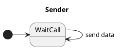

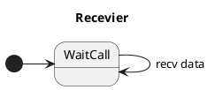

由于信道是可靠的，因此发送数据后，数据一定会到达接收端，而接收端总是能够及时接收数据，因此接收端也不需要对发送端进行任何反馈。

##### 3.4.1.2 经具有比特差错信道的可靠数据传输：rdt2.0

比特差错的模型符合底层信道的传输情况。在分组的传输、传播和缓存的过程中，比特差错通常会出现在网络的物理部件中。

和打电话的情况类似，当能听清时，回应确认，当听不清时，回应重述。这种机制称为肯定确认和否认确认。在计算机网络环境中，基于这样的重传机制的可靠数据传输协议称为自动重传协议。

Automatic Repeat reQuest ARQ

ARQ 协议需要 3 种功能来处理差错：  

- 差错检测
- 接收方反馈
- 重传

注：差错检测意味这需要额外的检错比特；接收方反馈的肯定确认和否定确认可以简写为 ACK(acknowledgement) 和 NAK(negative acknowledgement)

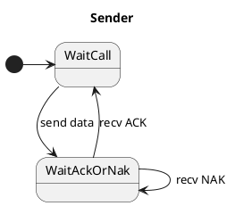

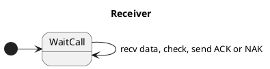

在这个场景中，发送方增加了一个等待确认的状态。发送方如果没有收到来自接收方的确认，则一直会等待，这样的协议称为停止等待协议（stop-and-wait protocol）。

上述实现存在一个严重的缺陷：没有考虑到 ACK 和 NAK 分组出现错误的情况。对于发送方和接收方，如果收到了一个错误的分组，则行为是未定义的。这里有三种可能的处理方式：

- 和现实中打电话一样，如果没有听清对方的话，则回复没有听清。实现上就需要新增一个类型，但是新增了类型之后还是会出现新增的类型传输过程中出差错的问题。
- 增加足够的检验和恢复比特位，使得接收方不仅可以检测差错，还可以恢复差错。如果信道不会丢失分组，则能够解决问题。
- 对发送方而言，一旦收到了错误的确认分组，则直接重传上一次发送的数据；对于接收方而言，在收到数据分组时，无法判断这个数据分组是下一个数据分组，还是重传的上一个分组。

综合这三种方式，只有第三种最合理。为了解决第三个方式出现的问题，一个简单的方法是增加比特位为分组进行编号。对于停止等待协议，由于每次传输的分组只有一个，只需要区分当前分组和下一个分组，一个比特位即可。

rdt 2.1

发送方和接收方均增加了发送 0 分组和发送 1 分组两个状态，因此发送方和接收方的状态都为之前的两倍。

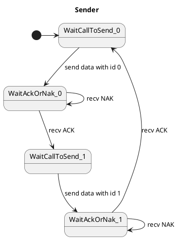

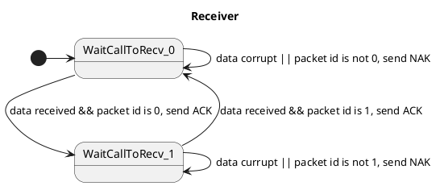

由于接收方只有在收到对应编号的数据分组之后，才会发送 ACK，因此对于发送方而言，收到 ACK 就表示发送出去的数据分组一定收到了。接收方处于接收某个分组的状态时，发送方一定也处于发送某个分组的状态。

注意，rdt 2.1 只对于分组不会丢失的信道有效。如果存在丢失分组的可能，则发送一个分组后就等待回复显然是不合理的（可能永远不会收到回复）。

rdt 2.2

rdt 2.1 使用了 ACK 和 NAK 两个确认分组，但是实际上可以只通过 ACK 分组实现。rdt 2.2 中，接收方如果收到了错误的分组，则回复上一次成功接收到的分组的 ID。发送方收到确认分组后，则发送确认分组对应的 ID 的下一个分组。

rdt 2.2 里引入的发送上一次成功分组 ID 的 ACK 分组称为冗余 ACK 分组。

##### 3.4.1.3 经具有比特差错的丢包信道的可靠数据传输：rdt3.0

底层信道丢包，在复杂的计算机网络中很常见。解决这个问题的一个办法就是在发送方引入重复发送分组的机制。

发送方在发送一个数据分组之后，如果超过一段时间，没有收到对这个数据分组的确认分组，则重复发送上一个数据分组。这里出现的重复的数据分组称为冗余数据分组。对于冗余数据分组，rdt 2.2 已经有了处理方法。

对于需要等到多久的问题，如果要确保分组已经丢失，则对于实际的计算机网络，这个时间不容易确定，因此往往很大。实际实现时，则是在超过一定时间没有收到确认分组时，则判定数据分组可能已经丢失。

如果发送的数据分组丢失，则隔一段时间之后重传即可。

如果接收方对于数据分组的确认分组丢失，则接收方在一段时间之后会受到重传的数据分组。接收方收到重传的数据分组之后，丢弃数据分组，并重传确认分组即可。

如果分组没有丢失，但是接收方回复的确认分组到来的过慢。此时发送方已经重复发送了数据分组，因此最终会收到多个对同一个数据分组的 ACK 分组，此时发送方对于同一个数据分组的冗余分组，直接丢弃。

rdt 3.0 通过一位标记分组，每次只能传输一个分组，因此也称为比特交替协议。

#### 3.4.2 流水线可靠数据传输协议

rdt 3.0 是一个功能正确的协议，但却不是一个好的协议，原因在于发送方有大量的时间在等待来自接收方的确认，整个链路的利用率非常低（尤其是考虑到整个链路的传输时延较高的情况下）。

假设一个分组的长度为 1000B，分组的传播时延为 15ms，链路传输速率为 1Gbps，并忽略分组的其它时延（排队时延、传输时延），同时假设传输过程中分组不会出错，也不会丢失，则处理时延为 $(1000 \times 8) / 1\text{Gbps}=0.008\text{ms}$ ， 每一个 RTT 可以发送一个分组，总耗时为 $\text{RTT}=2\times 15\text{ms} + 0.008\text{ms}=30.008\text{ms}$ ，可以得到信道的利用率为 $\omega=\frac{T_{send}}{T_{total}}=\frac{0.008}{30.008}=0.027\%$ ，显然，比特交替协议在较大的传播时延信道上，不能充分利用信道的传输能力，绝大多数时间都在等待。

为了解决比特交替协议存在的大量等待时间，需要调整停等逻辑。一个方式是每次发送分组的时候，批量发送分组，然后批量确认。如果发送方每次发送三个分组，接收方在收到三个分组后发送对这三个分组的确认分组，则整个传输的效率就近似提高了三倍（因为处理时延很小）。如果发送方几乎不停顿的发送分组，接收方几乎不停顿的发送确认分组，则整个信道的利用率就近似达到了一个很大的值（但是信道传输分组可能出错，从而需要一些步骤解决这些错误）。

发送方连续发送分组的技术称为流水线技术。

解决流水线技术中出错的方法有两种：回退 N 步和选择重传。

#### 3.4.3 回退 N 步 （GBN）

回退 N 步（go-back-n protocol）

在回退 N 步协议中，允许发送方发送多个分组而不需要等待确认，但它也受限于在流水线中未确认的分组序号跨度不能超过某个最大允许数 N。

假设序号的范围是无限的，并且起始序号为 0，并定义 base 为最早的未确认分组的序号，定义 nextseqnum 为最小的未使用序号，则整个序号范围可以分为 4 段：

[0,base-1] ：已经发送并已确认的分组的序号  
[base,nextsequm-1] ：已经发送尚未确认的分组序号  
[nextseqnum,base+N-1] ：如果存在则可以立即发送的分组序号  
[base+N,+] ：如果存在也不能使用的分组序号  

这个序号范围内，已被发送但是还未被确认的分组的许可序号范围可以被看成是一个在序号范围内长度为 N 的窗口。随着分组的发送和确认，窗口不断向前滑动。因此 N 常被成为窗口长度，GBN 协议也常被成为滑动窗口协议。

窗口长度：window size  

滑动窗口协议：sliding-window protocol  

在实际实现上，由于序号对应于分组上的特定比特位，因此序号是有限的。假设总共有 k 位，则序号的区间范围为 $[0,2^k-1]$ ，上述无限序号的假设中所有对序号的引用都需要加上模 $2^k$ 运算。

累计确认：在 GBN 协议中，对序号为 n 的分组的确认采用累计确认的方式。表明接收方已正确接收到序号为 n 的以前且包括 n 在内的所有分组。

累计确认：cummulative acknowledgement

超时：和停等协议（比特交替协议）一致，发送方发送一个分组后，如果超过一定时间没有收到确认，则自动重发这个分组。

接收方：GBN 协议中，接收方只有收到了一个按序分组才会将这个分组保留下来，并恢复 ACK ，收到所有其它分组都会直接丢弃。原因是发送方具有发送超时检测，如果一个靠前的分组重传，则意味着之前已经正确接收靠后的那些分组在发送方而言也超时并重传，所以保留这些分组没有意义。也即，GBN 协议中，接收方丢弃所有失序分组。

GBN 丢弃失序分组的逻辑在某些情况下确实会引起更多的重传。

GBN 协议的窗口大小与序号：  
记窗口大小为 N ，序号位数为 k ，对接收方而言，只接收下一个分组；对发送方而言，其某一时刻总共可能发送出去 N 个分组，为了让接收方分清这些分组，必要让这些分组对于接收方是唯一的。为了让下一个分组和窗口内的其它分组分开，同时为了区分重传分组和窗口滑动一个分组后的新分组，因此有 $N\le 2^k -1$ 。对于比特交替协议，也即有 $N\le 1$ 。  

注意，这里我们没有考虑一个分组可能在信道中停留一段时间之后再到达接收方。  

#### 3.4.4 选择重传 （SR）

选择重传：selective repeat

若信道的带宽时延积很大，或者窗口长度很大的时候，如果存在分组出错，则 GBN 协议下就会出现大量的重传，这会引起一些性能问题。

SR 协议在 GBN 协议的基础上，通过让发送方仅重传那些它怀疑在接收方出错的分组来避免不必要的重传。

接收方将确认一个正确接收的分组而不管其是否失序，失序的分组将被缓存，直到其之前的所有分组都收到。

和 GBN 协议不同的是，由于窗口内的所有分组都是独立发送的，因此需要对窗口内的所有分组分别维护一个超时计时器。  

需要注意，接收方收到窗口内的一个已经收到过的分组之后，也同样需要返回一个正确的 ACK。这是因为 ACK 可能丢失，而发送方会一直重传这个单独的分组。这个情况在 GBN 协议中不会出现，因为 GBN 协议总是丢弃已经收到的失序分组。

SR 协议的窗口大小与序号：  
SR 协议和 GBN 协议相比，发送方每一个时刻最多发送一个发送窗口对应的分组，但是接收方接收的分组不仅仅是下一个分组，而是在窗口内的所有分组。因此对于接收方而言，额外的需要区分当前窗口内的重传分组和窗口滑动后的新分组。  
如果接收方收到了一个分组，这个分组可能是新分组，可能是一个重传分组（因为上一次收到之后回复的 ACK 丢失了），也可能是窗口滑动后的新分组（窗口的第一个分组的 ACK 被发送方收到）。  
由于窗口仅仅在窗口的第一个分组 ACK 收到之后才会滑动，因此有可能除了第一个分组之外其它分组都已经收到了，此时第一个分组的 ACK 到达后，窗口会向后滑动一个窗口长度。因此区分的所有分组实际上包括当前窗口内的所有分组和滑动一个窗口长度后的窗口内的所有分组，这些分组的总长度是 2N 。  
记序号位数为 k ，也即 $2^k>=2N$ ，或者说窗口长度不能超过序号空间的一半。  

对于 GBN 协议中的分组不停留假设，对协议而言，其实就是分组的不失序假设。这个假设认为底层信道在传输分组的时候，后发出去的分组不会比先发送出去的分组先到。在实际的网络中，这个假设并不成立，分组可能在网络中停留，从而后发出去的分组可能后到。  
GBN 协议和 SR 协议中，存在对序号的重新使用，此时网络中停留的分组就会和重复使用的分组产生冲突，从而使协议失效。  
Sunshine 1978 描述了一种使用序号的方法，它能够完全避免重新排序的问题。  

### 3.5 面向连接的运输：TCP

TCP 是因特网运输层的面向连接的可靠的运输协议。为了提供可靠数据传输，TCP 依赖于前述的一些基本原理，包括差错检测、重传、累计确认、定时器以及用于序号和确认号的首部字段。  

#### 3.5.1 TCP 连接

TCP 被称为是面向连接的。这是因为一个应用进程在向另一个应用进程发送数据之前，这两个进程必须先相互握手，即它们必须相互发送某些预备报文段，以建立确保数据传输的参数。  

面向连接的：connection-oriented  

TCP 连接不是电路交换网络中的端到端电路，而是一条逻辑连接，其共同状态仅保留在两个通信端系统的 TCP 程序中。  

TCP 连接提供的是全双工服务。  

TCP 连接总是点对点的，即总是单个发送方和单个接收方之间的连接。  

TCP 连接通过三个报文来建立，其中前两个报文不承载有效负荷。建立连接的过程称为三次握手。  

客户进程通过套接字传递数据流，数据传入后，TCP 将这些数据引导到该连接的发送缓存里。TCP 接下来会不时从发送缓存里取出一块数据，并将数据传递到网络层。TCP 可以从缓存中去除并放入报文段中的数据长度受限于最大报文段长度。TCP 通常根据本地发送主机发送的最大报文段长度来确定。比如，$\text{MTU}\ge \text{MSS}+\text{HEADER}$ ，对于以太网，MTU 通常为 1500，首部长度通常为 40 字节，则有 MSS=1460 。  
TCP 为每块客户数据配上一个 TCP 首部，从而形成多个 TCP 报文段。  

最大报文段长度：Maximum Segment Size, MSS  

最大传输单元：Maximum Transmission Unit, MTU  

TCP 报文段：TCP segment  

#### 3.5.2 TCP 报文段结构

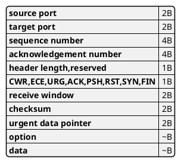

TCP 头部字节一般为 20B 。

##### 3.5.2.1 序号和确认号

TCP 把数据看成是一个无结构的、有序的字节流。一个报文段的序号是该报文段首字节的字节流编号。  

主机 A 填充进报文段的确认号是主机 A 期望从主机 B 收到的下一字节的序号。  

TCP 提供累计确认，也即如果某个靠后的报文段提前到达，则接收方回复的确认号仍然是其之前没有收到的报文段的首字节序号。  

TCP 并没有规定失序到达的报文段是应该直接丢弃还是暂时缓存，但是工程上实际采用的方法是暂时缓存，这有利于提高网络带宽的利用率。  

建立连接时，通常采用随机序号，这样能降低连接被再次使用时网络中残留报文段对连接的影响可能性。  

##### 3.5.2.2 Telnet ：一个例子

Telnet 会话中，发起会话的主机 A 输入的字符将会被发送至主机 B ，主机 B 然后将该字符发送回主机 A 。

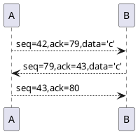

注意，主机 B 对主机 A 的确认的同时存在数据，则确认连同数据放在一个报文段中，这种确认的方式称为捎带。  

#### 3.5.3 超时与往返时间的估计

##### 3.5.3.1 估计往返时间

TCP 采用超时/重传机制来处理报文段的丢失问题。TCP 需要估计往返时间来确定超时时间。  

样本 RTT：SampleRTT ，指某报文段被发出到对该报文段的确认被收到之间的时间量。  

大多数 TCP 实现仅在某个时刻做一次 SampleRTT 测量，而不是为每个发送的报文段测量一个 SampleRTT 。  

TCP 绝不为已被重传的报文段测量 SampleRTT ，仅为传输一次的报文段测量 SampleRTT 。  

TCP 维持一个 SampleRTT 均值 ExtimatedRTT 。一旦获得一个新的 SampleRTT 时，TCP 就会根据下列公式来更新 ExtimatedRTT ：  
$$\text{EstimatedRTT}=(1-\alpha)\cdot \text{EstimatedRTT} + \alpha \cdot \text{SampleRTT}$$  
在 RFC 6298 中给出的 $\alpha$ 的推荐值为 0.125 。  

RFC 6298 还定义了 RTT 偏差 DevRTT ，用于估算 SampleRTT 一般会偏离 EstimatedRTT 的程度：  
$$\text{DevRTT}=(1-\beta )\cdot \text{DevRTT} + \beta \cdot |\text{SampleRTT} - \text{EstimatedRTT}|$$  
$\beta$ 的推荐值为 0.25 。  

##### 3.5.3.2 设置和管理重传超时间隔

$$\text{TimeoutInterval} = \text{EstimatedRTT} + 4\cdot \text{DevRTT}$$  

推荐的初始 TimeoutInterval 值为 1 秒。当出现超时后，TimeoutInterval 值将加倍，以免即将被确认的后记报文段过早出现超时。然而，只要收到报文段并更新 EstimatedRTT，就使用上述公式再次计算 TimeoutInterval 。  

#### 3.5.4 可靠数据传输

IP 服务是不可靠的，不保证数据报的交付，不保证数据包的按序交付，也不保证数据报的完整性。  

TCP 在 IP 不可靠的尽力而为服务至上创建了一种可靠数据传输服务。  

TCP 推荐的定时器管理过程仅使用单一的重传定时器，即使有多个已发送但还未被确认的报文段。  

TCP 发送方的高度简化的描述：发送方只用超时来恢复报文段的丢失。  
这个描述中，发送方只处理三个主要事件，包括从应用程序收到数据，定时器超时，收到 ACK 报文。形式如下：  

```c++
NextSeqNum = InitialSeqNumber;  // 表示即将发送的下一个字节序号
SendBase = InitialSeqNumber;    // 表示已经确认的字节流末尾序号

for (;;) 
  switch (event) 
    case 从应用程序收到数据 data: 
      packet = Packet (data, NextSeqNum); // 构造报文段
      if (! Timer.run()) // 尝试启动定时器
        Timer.run();
      IP.sendPacket(packet); // 通过 IP 层发送 packet
      NextSeqNum += data.len();   // 更新发送序号
      break;
    case 定时器超时：
      packet = min(已发送 && 未应答的最早报文段 , SeqNum); // 找到序号最小的未响应报文段
      IP.sendPacket(packet);  // 重传报文
      Timer.run();      // 启动定时器
      break;
    case ACK: // 收到 ACK 报文
      if (ACK.SeqNum > SendBase)
        SendBase = ACK.SeqNum;
        if (find(已发送 && 未应答的报文段)) // 如果还存在没有相应的已发送报文段
          Timer.run();
        break;
```

发送端有几个关键点：  

如果到来了新的数据，并不会重置定时器。  
如果收到了 ACK 包，则需要考虑重置定时器。这是与累计确认对应的。  

##### 3.5.4.1 针对 TCP 发送端高度简化描述的几种情况

第一种情况，单个数据包的 ACK 丢失。此时定时器超时事件触发，重发数据包。  

第二种情况，假设连续发送了两个数据包 A 和 B ，接收方正确的接收了这两个数据包，并返回两个对应的 ACK_A 和 ACK_B 包，并且这两个 ACK 包都丢失了。此时超时事件触发，并重传数据包 A 。此时定时器重新计时，只要对应的 ACK_B 包在第二次超时时间内到达，则数据包 B 不会重传。  

第三种情况和第二种情况类似，只是仅仅 ACK_A 丢失了，ACK_B 在超时时间内到达。由于 ACK_B 使用了累计确认机制，因此发送方也不会重传数据包 A 。  

##### 3.5.4.2 超时间隔加倍

如果出现了分组丢失，则很可能出现了网络拥塞。此时发送方持续重传分组，则拥塞可能会更加严重。因此每次超时之后将超时间隔加倍，提供了简单的拥塞控制。  

##### 3.5.4.3 快速重传

发送方仅仅依靠超时计时器进行重传时，如果数据分组出现丢失，则会引起数据分组的延迟。事实上，如果出现了分组丢失，则接收方就很容易收到超过当前分组序号的分组。一旦收到了失序分组，则接收方立即返回一个已经收到的数据包对应的 ACK ，则能促使发送方立即重传 ACK 对应的未发送的报文，降低了时延。这种重传的 ACK 成为冗余 ACK。  

一般采用的机制是发送方一旦收到 3 个冗余 ACK，则立即执行快速重传。  

##### 3.5.4.4 GBN 还是 SR

TCP 既包括了累计确认，也包括了选择确认。TCP 是 GBN 协议和 SR 协议的混合体。  

#### 3.5.5 流量控制

TCP 为它的应用程序提供了流量控制服务以消除发送方使接收方缓存溢出的可能性。流量控制是一个速度匹配服务，即发送方的发送速率和接收方的读取速率匹配。  

注意流量控制和拥塞控制是两个不同的概念，前者关注发送方和接收方的速率匹配，后者关注链路的拥塞情况。  

TCP 通信的发送方维护一个接收窗口(rwnd)。对于发送方而言，接收窗口的大小象征着接收方还有多大的可用缓存空间。  

注意：当接收窗口为 0 时，如果接收方的接收缓存被主动清空，由于窗口只能在接收到数据或者需要主动发送数据时通知发送方，因此此时窗口变化可能不能被发送方感知。因此 TCP 规范规定，当接收窗口为 0 时，发送方继续发送一个字节数据的报文段。  

#### 3.5.6 TCP 连接管理

##### 3.5.6.1 连接过程

客户中的 TCP 会用以下三步和服务器中的 TCP 建立一条 TCP 连接：  

第一步，客户端发送 SYN 报文段；第二步，服务端发送 SYNACK 报文段；第三步，客户端发送 SYN 报文段。  

为了创建一个 TCP 连接，两台主机之间发送了 3 个分组，因此被成为 3 次握手。  

分析：为什么需要 3 次握手？  
首先，如果只发送一个报文，则客户端无法确认服务端是否可用，因此不合理。如果握手 2 次，对于发送端而言，能够确认服务端在线，但是服务端却无法确认其响应请求报文时发送端是否仍在线，因此无法确认是否需要准备接收数据。如果只进行 2 次握手，服务端需要为每一个到来的请求报文建立连接，而这个报文可能是一个异常报文（发起方已经放弃了这个报文）。3 次握手是最少的能够确认两者均在线的次数。  

以攀岩者和其保护者为例，攀岩者在开始前需要向保护者确认是否准备好。如果攀岩者只向保护者通知一次，保护者不会回复，此时攀岩者无法判断保护者是否准备好，因此不安全。如果攀岩者向保护者通知一次，保护者确认后再向攀岩者通知一次，此时攀岩者能够确认保护者是否准备好，但是保护者却无法确认攀岩者是否收到这个确认，也即无法判断是否要维持这个保护状态。

客户中的 TCP 会用四步和服务器中的 TCP 断开一个 TCP 连接：  

首先客户端向服务端发送 FIN 报文段，服务端对该报文发送 ACK 报文段，随后服务端对客户端发送 FIN 报文段，客户端对服务端发送 ACK 报文段。  

##### 3.5.6.2 客户端状态演进过程

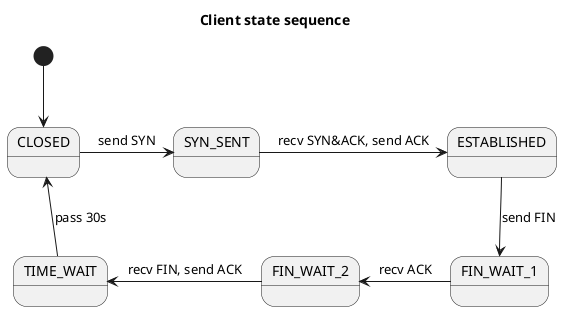

##### 3.5.6.3 服务端状态演进过程

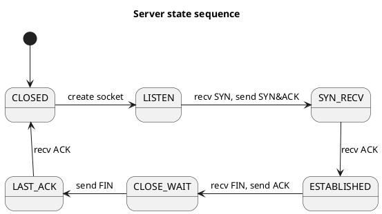

### 3.6 拥塞控制原理

#### 3.6.1 拥塞原因及其代价

##### 3.6.1.1 情况一：两个发送方和一台具有无限大缓存的路由器

假设所有链路的速率均为 R ，两个发送方共享一条链路，当两个发送方的发送速率小于 R/2 时，由于发送速率总是比接收分组快，因而分组总是能在有限时间内发送出去。但是当两个发送方的发送速率超过 R/2 时，发送速率跟不上接收速率，排队长度无限增加，从而分组不能在有限时间内发送出去。  

##### 3.6.1.2 情况二：两个发送方和一台具有有限缓存的路由器

当出现阻塞时，一方面会出现分组丢失，另一方面时延增加，会引起超时重传。这两种情况最终结果都是链路上出现了重复分组。前者引起了发送方到路由器的带宽被浪费，后者引起了全链路的带宽被浪费。最终结果就是吞吐量降低。  

##### 3.6.1.3 情况三：4 个发送方和具有有限缓存的多台路由器及多跳路径

当发送方的数据需要通过多跳到达接收方时，如果链路中出现了大载荷的情况，则数据可能在链路的中间环节中丢失，而在丢失前的所有转发以及链路带宽占用都将是无效的。因此，当负载变大时，有效载荷反而会降低。链路的传输容量很多都被用来传输一些最终被丢弃的分组了。  

#### 3.6.2 拥塞控制方法

可以根据网络层是否为运输层的拥塞控制提供信息，将拥塞控制方法分为两类。第一类方法网络层没有为运输层提供显式支持，称为端到端拥塞控制。第二类方法网络层为运输层提供了显式支持，成为网络辅助的拥塞控制。  

默认情况下，TCP 采用端到端的方法解决拥塞控制，因为 IP 层不会向端系统提供有关网络拥塞的反馈信息。但是 IP 和 TCP 也能够选择性地实现网络辅助的拥塞控制。  

### 3.7 TCP 拥塞控制

TCP 除了为运行在不同主机上的两个进程之间提供可靠传输服务外，其另一个关键部分就是拥塞控制机制。  

TCP 采用的方法是让每一个发送方根据所感知到的网络拥塞程度来限制其能向连接发送流量的速率。如果一个 TCP 发送方感知从它到目的地之间的路径上没什么拥塞，则 TCP 发送方增加其发送速率；如果发送方感知该路径上有拥塞，则发送方会降低其发送速率。  

我们已经知道，TCP 通过接收窗口 rwnd(receiver window) 来进行流量控制，也即发送方根据这个窗口判断接收方还有多少缓存空间，从而避免缓存溢出，因此某个时刻发送的字节数不会超过 rwnd 的大小。为了进行拥塞控制，TCP 同时引入了拥塞窗口 cwnd(congestion window) ，拥塞窗口对 TCP 发送方能向网络中发送流量的速率进行了限制。  

$$\text{LastByteSent} - \text{LastByteAcked} \le \min \{\text{cwnd},\text{rwnd}\} $$  

这个公式即限制了发送方中未被确认的字节的数量。  

如果忽略 rwnd 的限制，并且忽略丢包和发送时延，则每一个 RTT 内只能发送 cwnd 字节的数据，也即发送速率约为 rwnd/RTT 。  

#### 控制发送速率

TCP 通过 cwnd 控制其发送的速率。  

#### 感知拥塞

TCP 通过发送方出现的丢包事件来感知拥塞。丢包事件包括确认超时或者 3 个冗余 ACK 。  

#### 发送速率的调整方法

TCP 采用 TCP 拥塞控制算法 (TCP congestion control algorithm) 来调整发送速率。  

TCP 拥塞控制算法中，存在慢启动、拥塞避免、快速恢复三种状态。  

##### 慢启动

在慢启动状态，cwnd 初始值为 MSS (最大报文段长度，maximum segment size) 的一个较小值，并且在某个报文段首次被确认就增加一个 MSS 。例如，最开始 cwnd = MSS ，发送一个 MSS ，随后收到 ACK 之后，cwnd = 2MSS ，发送两个 MSS ，随后收到对这两个报文段的 ACK ，cwnd = 4MSS 。这样持续进行下去，也即 cwnd 随时间指数增长。  

慢启动的结束有一下三种情况：  

- 如果存在超时事件，则取 cwnd = 1 ，并将 ssthresh (slow start threshold) 置为调整前 cwnd 的一半。  

- 当 cwnd 到达 ssthresh 值时，结束慢启动状态，转换为拥塞避免状态。  

- 如果监测到 3 个冗余的 ACK ，则执行快速重传，并结束慢启动状态，转换为快速恢复状态。  

##### 拥塞避免

进入拥塞避免状态时，cwnd 的值约为上次出现拥塞时值的一半。此时，TCP 每过一个 RTT(往返时延，Round-Trip time) ，不再将 cwnd 的值翻倍，而是只增加一个 MSS 。一个实现方法是对一个 RTT 内发送的 cwnd/MSS 个报文段，每个报文段在首次确认时将 cwnd 的值增加 MSS/cwnd 。  

拥塞避免状态时，如果收到 3 个冗余的 ACK ，则将 ssthresh 记录为 cwnd 的一半，同时进入快速恢复状态。  

##### 快速恢复

在快速恢复状态中，对于引起 TCP 进入快速恢复状态的确实报文段，对收到的每个冗余 ACK，cwnd 的值增加一个 MSS 。  

例如，如果当前 cwnd 为 12 MSS ，并且出现了 3 个冗余 ACK ，则 cwnd 先降为 6 MSS，然后增加 3 MSS，最终变为 9 MSS 。  

##### TCP 拥塞控制综合

在上述慢启动、拥塞避免、快速恢复状态中，对于一条 TCP 连接，如果不考虑出现超时事件，拥塞窗口的大小会呈锯齿状变化。其原因是慢启动状态结束后，cwnd 表现为线性增长，倍数下降。TCP 拥塞控制因此被成为 AIMD(Additive-Increase, Multiplicative-Decrease, AIMD) 拥塞控制方式。  

在实际 TCP 中，拥塞控制使用了一些更为复杂的算法，这些算法是在实际网络运用中不断优化和发展的。  

##### TCP 吞吐量的估计

对于一条连接，假设当 cwnd=W 时，发生了丢包事件，并且 W 和 RTT 的值不变，则 TCP 的发送速率在 W/RTT 和 W/2RTT 之间变化，并且变化是线性的。因此 TCP 的吞吐量可以估计为  
$$\text{T}=\frac{3}{4}\cdot\frac{\text{W}}{\text{RTT}}$$  

##### 高带宽路径的 TCP

对于高带宽路径，则窗口大小会变得很大。此时，报文段以何种比例丢失才能使得 TCP 取得希望的速率，有以下公式：  

一条 TCP 连接的平均吞吐量，为  

$$T=\frac{1.22 \times \text{MSS}}{\text{RTT}\sqrt{L}}$$  

其中，L 为丢包率。  

可见，对于高带宽路径，丢包率必须特别低。这种观察导致许多研究人员为这种环境特别设计新版 TCP。  

#### 3.7.1 公平性

假设 K 条 TCP 同时通过一个传输速率为 R 的瓶颈链路，该瓶颈链路没有其它数据流量，每条 TCP 连接都在全力传输数据，如果每条连接的平均传输速率接近 R/K ，则认为 TCP 的拥塞控制机制是公平的。  

TCP 的 AIMD 算法是公平的。  

实际情况中，由于不同的 TCP 连接具有不同的 RTT 值，因此也具有不平等的带宽份额。具有较小的 RTT 的连接能够在链路空闲时更快地抢到可用带宽，因而较那些具有较大 RTT 的连接享用更高的吞吐量。  

##### 3.7.1.1 UDP 与公平性

UDP 流量不具有内置的拥塞控制机制，发送方通常都是以某个恒定的速度向链路发送数据，并且能够容忍一定程度的数据丢失。因此 UDP 流量会对 TCP 的流量产生压制作用。  

##### 3.7.1.2 并行 TCP 连接与公平性

TCP 的带宽公平是针对每个 TCP 连接的，因此如果一个应用使用多条并行的 TCP 连接，带宽公平性就会被破坏。  

#### 3.7.2 明确拥塞通告：网络辅助拥塞控制

对于 IP 和 TCP 的扩展方案已经提出并已经实现和部署，该方案允许发送方和接收方发出拥塞信号。这种形式的网络辅助拥塞控制称为i而明确拥塞报告(Explicit Congestion Notification, ECN)。  

## 4 网络层：数据平面

在网络层中的每一台主机和路由器中都有一个网络层部分，正因如此，网络层协议是协议栈中最具有挑战性的部分。  

网络层能够被分解为两个相互作用的部分，即数据平面和控制平面。  

### 4.1 网络层概述

#### 4.1.1 转发和路由选择：数据平面和控制平面

网络层将分组从一台发送主机移动到一台接收主机，需要使用两种重要的网络层功能：  

转发：当一个分组到达某路由器的一条输入链路时，该路由器必须将该分组移动到适当的输出链路。转发是在数据平面中实现的唯一功能。转发工作在数据平面。  

路由选择：当分组从发送方流向接收方时，网络层必须决定这些分组所采用的路由或路径。计算这些路径的算法被成为路由选择算法(routing algorithm)。路由选择工作在控制平面。  

转发和路由选择的区别：  
转发是指将分组从一个输入链路接口转移到适当的输出链路接口的路由器本地动作，转发发生的时间尺度很短（纳秒级），通常用硬件实现。  
路由选择是指确定分组从源到目的地所采取的端到端路径的网络范围处理过程。路由选择的时间尺度长的多（秒级），通常用软件来实现。  

转发表：路由器检查到达分组首部的一个或多个字段值，进而使用这些首部值在其转发表中索引，通过这种方法来转发分组。  

##### 4.1.1.1 控制平面：传统的方法

路由器中的路由选择算法与其它路由器中的路由选择算法通信，以计算出它的转发表的值。  

##### 4.1.1.2 控制平面：SDN 方法

通过远程控制器计算并分发转发表。  

SDN: Software-Defined Networking.  

#### 4.1.2 网络服务模型

网络服务模型(network service model)定义了分组在发送与接收端系统之间的端到端运输特性。  

网络层能够提供的服务可能包括：  

- 确保交付：确保分组最终到达
- 具有时延上界的确保交付：确保时延的确保交付
- 有序分组交付
- 确保最小带宽：只要发送主机以低于特定比特率的速率传输比特，则所有分组最终会交付到目的主机
- 安全性

**因特网的网络层**提供了单一的服务，称为尽力而为服务(best-effort service)。  

### 4.2 路由器的工作原理

路由器主要由四个组件组成：输入端口、输出端口、交换结构、路由选择处理器。  

输入端口(input port)：  
输入端口执行进入物理链路的物理层功能，并与位于链路层远端的数据链路层交互来执行数据链路层功能，同时还通过查询转发表，决定输出端口。  

输出端口(output port)：  
输出端口存储从交换结构接收的分组，并通过执行必要的链路层和物理层功能在输出链路上传输这些分组。  

交换结构：  
交换结构将路由器的输入端口连接到它的输出端口。  

路由选择处理器：  
路由选择处理器执行控制平面功能。在传统的路由器中，其执行路由选择协议，维护路由选择表与关联链路状态信息，并为该路由器计算转发表。在 SDN 路由器中，路由选择处理器负责与远程控制器通信，目的是接收远程控制器计算的转发表项。  

路由器的输入端口、输出端口和交换结构几乎总是用硬件实现。这是因为数据平面处理数据的时间间隔非常短，以至于远远超过软件的处理速度。  

路由器中的控制平面的功能以毫秒或秒级时间尺度运行，其中包括执行路由选择协议、对上线和下线的链路进行响应、与远程控制器通信以及执行管理功能。  

#### 4.2.1 输入端口处理和基于目的地的转发

输入端口处理流程：  

线路端接 --> 数据链路处理（协议，拆封） --> 查找，转发，排队 --> 交换结构

路由器用分组目的地址的前缀与转发表中的表项进行匹配；如果存在一个匹配项，则路由器与该匹配项相关联的链路转发分组。  

当有多个匹配时，路由器使用最长前缀匹配规则，即在表中寻找最长的匹配项，并向与最长匹配相关联的链路接口转发分组。  

#### 4.2.2 交换

交换结构位于一台路由器的核心部位。分组通过交换结构，才能实际地从一个输入端口交换到一个输出端口。  

交换结构主要有三种方式：  

经内存交换：也即输入端口与输出端口之间的交换是在 CPU 的直接控制下完成的。  

经总线交换：输入端口经一根共享总线将分组直接传送到输出端口，不需要路由选择处理器的干预。  

经互联网络交换：互联网络是用来克服单一、共享式总线带宽限制的一种方法。比如纵横式网络。与经内存和经总线交换这两种方式相比，纵横式交换是并行的，非阻塞交换。  

#### 4.2.3 输出端口处理

交换结构 --> 排队 --> 数据链路处理（协议，封装） --> 线路端接  

#### 4.2.4 何处出现排队

略

#### 4.2.5 分组调度

略

### 4.3 网际协议：IPv4、寻址、IPv6及其它

#### 4.3.1 IPv4 数据报格式

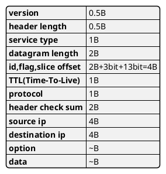

版本：即如何解析 IP 数据报的剩余部分。

首部长度：用以确定选项的长度，没有选项时，即为 20

服务类型：包括区分实时数据包和非实时数据报。

数据报长度：即首部加上数据的长度。最大为 65535 字节。

标识、标志、片偏移：用来实现 IP 分片。

寿命：用来确保数据报不会永远在网络中循环。  

协议：表明 IP 数据报的数据部分应该交给哪个特定的运输层协议（如 TCP 和 UDP）。

首部校验和：首部校验和用于帮助路由器检测收到的 IP 数据报中的比特错误。由于数据包转发过程中 TTL 及选项字段可能改变，因此每台路由器都会重新计算。  

源 IP 地址和目的 IP 地址：源和目的 IP 地址通常在生成数据报时填入。  

选项：选项的存在首先意味着数据报的首部长度可变，其次意味着数据包的处理流程可能不一致。  

数据：数据可能承载运输层报文，也可能承载其它类型的数据，比如 ICMP 报文。  

#### 4.3.2 IPv4 数据报分片

并不是所有链路层协议都能承载相同长度的网络层分组。一个链路层帧能承载的最大数据量叫做 MTU (Maximum Transmission Unit) 。对 IP 数据报长度具有严格限制并不是主要问题，问题在于发送方与目的地路径上的每段链路可能使用不同的链路层协议，且每种协议可能具有不同的 MTU。

在路由器中重新组装数据报会给协议带来相当大的复杂性并且影响路由器的性能，为坚持网络内核保持简单的原则，IPv4 设计者巨顶将数据报的重新组装工作放到端系统中，而不是放到网络路由器中。  

#### 4.3.3 IPv4 编址

主机或路由器与其网络链路的边界叫做接口。因为每台主机与路由器都能发送和接收 IP 数据报，IP 要求每台主机和路由器接口拥有自己的 IP 地址。因此，从技术上来讲，一个 IP 地址与一个接口相关联，而不是与包括该接口的主机或路由器相连。  

对于一个路由器和主机的通用互联系统，为了确定子网，分开主机和路由器的每个接口，产生几个隔离的网络岛，使用接口端接这些隔离的网络的端点。这些隔离的网络中的每一个都叫做一个子网。  

一个具有多个以太网段和点对点链路的组织将具有多个子网，在给定子网上的所有设备都具有相同的子网地址。然而在实践中，它们的子网地址经常有许多共同之处。

因特网的地址分配策略被称为无类别域间路由选择（Classless Interdomain Routing, CIDR），CIDR 将子网寻址的概念一般化了。  

形式为 a.b.c.d/x 的地址的 x 最高比特构成了 IP 地址的网络部分，并且经常被称为该地址的前缀。一个组织通常被分配一块连续的地址，即具有相同前缀的一段地址。在这种情况下，该组织内部的设备的 IP 地址将共享共同的前缀。因此，当该组织外部的一台路由器转发一个数据报，且该数据报的目的地址位于该组织内部时，仅需要考虑该地址的前 x 比特，这相当大地减少了在这些路由器中转发表的长度。  

实践原则：仔细分配 CIDR 化的地址有利于路由选择。使用单个网络前缀通告多个网络的能力通常称为地址聚合，也称路由聚合或路由摘要。  

在 CIDR 被采用之前，IP 地址的网络部分被限制为长度为 8、16、24 比特，这是一种称为分类编址的编址方案，具有 8、16、24 比特子网地址的子网被称为 A、B、C 类网络。  一个 IP 地址的网络部分正好为 1、2、3 字节的要求，已经在支持数量迅速增加的具有小规模或中等规模子网的组织方面出现了问题。  

#### 4.3.4 网络地址转换

网络地址转换（Network Address Translation）

NAT 使得路由器对外部世界来说甚至不像一台路由器，相反 NAT 路由器对外界的行为就如同一个具有单一 IP 地址的单一设备。  

#### 4.3.5 IPv6

在 20 世纪 90 年代早期，因特网工程任务组就开始致力于开发一种替代 IPv4 的协议。解决 IP 地址空间即将用尽的问题，同时还用来加强 IPv4 的其它方面。  

##### 4.3.5.1 IPv6 数据报格式

IPv6 中引入的最重要的变化包括：  

扩大的地址容量：IPv6 将 IP 地址长度从 32 比特扩展到 128 比特。除了单播和多播地址外，IPv6 还引入了任播地址，这种地址可以使数据报交付给一组主机中的任意一个。  

简化高效的 40 字节首部：40 字节定长首部允许路由器更快地处理 IP 数据报。  

流标签：RFC 2640 中描述，该字段可用于给属于特殊流的分组加上标签，这些特殊流是发送方要求进行特殊处理的流，如一种非默认服务质量或需要实时服务的流。这个字段是用来预见最终需要区分的流，即使这些流的确切含义还未完全确定。  

IPv6 移除了 IPv4 中的几个字段：  

分片相关：IPv6 不允许在中间路由器上进行分片与重新组装，分片和重新组装操作只能在源与目的地执行。如果路由器接收到的 IPv6 数据报因太大而不能转发到出链路上，则路由器只需要丢掉这个数据报，并向发送方返回一个分组太大的 ICMP 差错报文即可。  

首部校验和：在因特网中运输层和数据链路层都执行了校验操作，因此去掉网络层的校验和可以更快转发分组（首部校验和每次转发都需要重新计算）。  

选项：选项通过下一个首部字段实现。因此 IP 首部成为定长的 40 字节。  

##### 5.3.4.2 IPv4 到 IPv6 的迁移

一个广泛应用的方法为建隧道。如果某个链路上两个 IPv6 节点之间存在 IPv4 链路，则在转发给 IPv4 链路时，将整个 IPv6 数据报封装到 IPv4 数据报的数据中，从 IPv4 的节点收到数据报时，再将这个数据报中的 IPv6 数据报解析出来。  

我们能从 IPv6 经验中学到的一个重要经验就是要改变网络层协议是极其困难的。  

### 4.4 通用转发和 SDN

因特网路由器的转发传统上仅仅基于分组的目的地址，但是许多执行第三层功能的中间盒有了大量发展。比如 NAT 重写首部 IP 地址和端口号；防火墙基于首部字段值阻拦流量或重定向分组以进行其他处理；负载均衡器将请求某种给定服务的分组转发到提供该服务的服务器集合中的一个。  

基于目的转发的特征总结为两个步骤：  

- 查找目的 IP 地址
- 将分组发送到有特定输出端口的交换结构

一种更有意义的用用匹配加动作范式，其中能够对协议栈的多个首部字段进行匹配。动作包括：  

- 将分组转发到一个或多个输出端口
- 跨越多个通向服务的离开接口进行负载均衡分组
- 重写首部值
- 有意识地阻挡、丢弃某个分组
- 为进一步处理和动作而向某个特定服务器发送一个分组
- 等等

OpenFlow 是通用转发的一个得到高度认可和成功的标准，它已经成为匹配加动作转发抽象、控制器以及更为一般的 SDN 革命等概念的先驱。  

匹配加动作转发表在 OpenFlow 中称为流表（flow table），它的每个表项包括：

- 首部字段值的集合，入分组将与之匹配。和基于目的地转发的情况一样，基于硬件匹配在 TCAM 内存中执行的最为迅速。匹配不上流表项的分组将被丢弃或发送到远程控制器做更多处理。在实践中，为了性能或成本原因，一个流表可以由多个流表实现。  
- 计数器集合。这些计数器可以包括已经与该表项匹配的分组数量，以及自从该表项上次更新以来的时间。  
- 当分组匹配流表项时所采取的动作集合。这些动作可能将分组转发到给定的输出端口，丢弃该分组、复制该分组和将它们发送到多个输出端口，和/或重写所选的首部。  

#### 4.4.1 匹配

OpenFlow 的匹配抽象允许对来自三个层次的协议首部所选择的字段进行匹配。  

#### 4.4.2 动作

每个流表项都有零个或多个动作列表，这些动作决定了应用与与流表项匹配的分组的处理。如果有多个动作，它们以在表中规定的次序执行。  

重要的动作包括：转发、丢弃、修改字段。  

#### 4.4.3 匹配加动作操作的 OpenFlow 例子

略。  

## 5 网络层：控制平面

控制平面作为作为一种网络范围的逻辑，不仅控制着沿着从源主机到目的主机的端到端路径间的路由器如何转发数据报，而且控制网络层组件和服务如何配置和管理。  

### 5.1 概述

控制平面讨论转发表和流表是如何计算、维护和安装的，完成这些工作有两种可能的方法。  

- 每路由器控制。每台路由器都运行一种路由选择算法，每台路由器都包含转发和路由选择的功能。每台路由器都有一个路由选择组件，用于与其他路由器中都包含转发和路由选择组件通信，以计算其转发表的值。  
- 逻辑集中控制。逻辑集中式控制器计算并分发转发表以供每台路由器使用。控制器经一种定义良好的协议与每台路由器中的一个控制代理（CA）进行交互，以配置和管理该路由器的转发表。CA 一般具有最少的功能，其任务是与控制器通信并且按控制器命令行事。CA 之间既不能直接相互交互，也不能主动参与计算转发表。这是每台路由器控制与逻辑集中式控制之间的关键差异。  

### 5.2 路由选择算法

路由选择算法的目的是从发送方到接收方的过程中确定一条通过路由器网络的好的路径。通常，一条好的路径指具有最低开销的路径。

路由选择算法的一种分类方式是根据算法是集中式还是分散式进行。  

- 集中式路由选择算法用完整的、全局性的网络知识计算出从源到目的地之间的最低开销路径。
- 分散式路由选择算法中，路由器以迭代、分布式的方式计算出最低开销路径。

路由选择算法还可以根据算法是静态还是动态来划分。

- 静态路由选择算法通常由人工进行更新。
- 动态路由选择算法随着网络流量负载或拓扑发生变化而改变路由选择路径。

路由选择算法的第三种分类方式是分为负载敏感和负载迟钝。  

- 负载敏感算法中，如果一条链路与高开销联系，则路由选择算法会趋向于绕开该拥塞链路来选择路由。
- 负载迟钝算法中，路由选择算法对链路开销不敏感，这是当今的因特网路由选择算法的主要形式。因为某条链路的开销并不明确地反映其当前的拥塞水平。  

#### 5.2.1 链路状态路由选择算法

在链路状态算法中，网络拓扑和所有链路的开销都是已知的。实践中是通过让每个节点向网络中所有其他节点广播链路状态分组来完成的，其中每个链路状态分组包含它所连接的链路的标识和开销。节点广播的结果是所有节点都具有该网络的统一、完整的视图。  

链路状态选择算法实际就是最短带权路径算法，比如 Dijkstra 算法。  

需要注意的是，当所有路由器都开始运行路由选择算法时，由于一条链路被选择时，其拥塞程度随之上涨，因此随后这条链路将被规避，这样就会引起振荡。

#### 5.2.2 距离向量路由选择算法

距离向量算法是一种迭代的、异步的和分布式的算法。相比之下链路状态路由选择算法是一种使用全局信息的算法。  

分布式是指每个节点都要从一个或多个直接相连邻居接收某些信息，执行计算并将计算结果分发给邻居。迭代是指此过程一直要持续到邻居之间无更多信息要交换为止。异步是指是因为它不要求所有节点相互之间步伐一致的操作。  

距离向量选择算法需要用到 Bellman-Ford 方程：  

$d_x(y)=\min_v\{c(x,v)+d_v(y)\}$  

其中，$d_x(y)$ 表示节点 x 到节点 y 的最低开销路径的开销。$\min_v$ 针对 x 的所有邻居节点。  

当一个节点计算完成之后，它将向它的每个邻居发送其距离向量表，继而让所有邻居更新它们自己的距离向量。当一个节点不需要更新向量表时，则终止更新，算法停止。  

注意，距离向量路由选择算法和链路状态路由选择算法一样，也会遇到循环迭代问题。

### 5.3 因特网中自治系统内部的路由选择：OSPF

将网络只看作一个互联路由器的集合，这个模型在实践中有一点简单化，原因如：  

规模。随着路由器数目变得很大，设计路由器选择信息的通信、计算和存储的开销将高的不可实现，收敛的算法也将无法收敛。  

管理自治。因特网是 ISP 的网络，每个 ISP 都有它自己的路由器网络，通常希望按其自己的意愿运行路由器。  

这两个问题都可以通过将路由器组织进自治系统来解决。通常一个 ISP 中的路由器以及互联它们的链路构成一个自治系统。一个自治系统由其全局唯一的 ASN （自治系统编号）所标识，ASN 由 ICANN 区域注册机构所分配。  

自治系统：AS，Autonomous System

一个自治系统中的路由器运行相同的路由选择算法并且有彼此的信息。在一个自治系统内运行的路由选择算法叫做自治系统内部路由选择协议。  

开放最短路优先（OSPF）及其关系密切的 IS-IS 协议被广泛应用于因特网的 AS 内部路由选择。  

### 5.4 ISP 之间的路由选择：BGP

当分组跨越多个 AS 进行路由时，需要一个自治系统间路由选择协议。因为 AS 间路由选择协议涉及多个 AS 间的协调，所以 AS 通信必须运行相同的 AS 间路由选择协议。在因特网中，所有的 AS 运行相同的 AS 间路由选择协议，成为边界网关协议（BGP）。  

BGP 无疑是所有因特网协议中最重要的，因为正是这个协议将因特网中数以千计的 ISP 黏合起来。  

BGP 是一种分布式和异步的协议，和距离向量路由选择协议一脉相承。

#### 5.4.1 BGP 的作用

在 BGP 中，分组并不是路由到一个特定的目的地址，相反是路由到 CIDR 化的前缀，其中每个前缀表示一个子网或一个子网的集合。  

作为一种 AS 间的路由选择协议，BGP 为每台路由器提供了一种完成以下任务的手段：  

（1）从邻居 AS 获得前缀的可达性信息。  
（2）确定到该前缀的最好的路由。  

#### 5.4.2 通告 BGP 路由信息

对于每个 AS ，每台路由器要么是一台网关路由器，要么是一台内部路由器。网关路由器是一台位于 AS 边缘的路由器，它直接连接到在其他 AS 中的一台或多台路由器。内部路由器仅连接在它自己 AS 中的主机和路由器。  

在 BGP 中，每对路由器通过使用 179 端口的半永久 TCP 连接交换路由选择信息。每条直接连接以及所有通过该连接发送的 BGP 报文，成为 BGP 连接。跨越两个 AS 的 BGP 连接称为外部 BGP 连接，在相同的 AS 中的两台路由器之间的 BGP 会话称为内部 BGP 连接。  

#### 5.4.3 确定最好的路由

当路由器通过 BGP 连接通告前缀时，它在前缀中包括一些 BGP 属性。

##### 5.4.3.1 热土豆路由选择

热土豆路由选择算法中增加 AS 外部目的地的步骤：  

（1）从 AS 间协议学到经多个网关可达子网 x  
（2）使用来自 AS 内部协议的路由选择信息，以决定到达每个网关的最低开销路径的开销  
（3）热土豆路由选择：选择具有最小最低开销的网关  
（4）从转发表确定通往最低开销网关的接口 I ，在转发表中加入表项 (x,I)  

热土豆路由选择是自私的算法，即它试图减少在它自己 AS 中的开销，而忽略在其 AS 之外的端到端开销的其他部分。  

##### 5.4.3.2 路由器选择算法

在实践中，BGP 使用了一种比热土豆路由选择更为复杂但是结合了其特点的算法。  

对于某个给定的目的前缀，进入 BGP 的路由选择算法的输入是到某前缀的所有路由的集合。如果仅有一条，BGP 则显然选择这条路由。如果有多条，则顺序调用下列消除规则：  

（1）路由具有一个本地偏好属性，具有最高本地偏好值的路由将被选择。  
（2）在所有具有最高本地偏好值的路由中，选择具有最短 AS-PATH 的路由。  
（3）对于选择出来的路由，使用热土豆路由选择。  
（4）如果仍留下多条路由，则使用 BGP 标识符来选择路由。  

BGP 是因特网 AS 间路由选择事实上的标准。  

#### 5.4.4 IP 任播

IP 任播的动机举例：  

（1）在许多分散的不同地理位置，替换不同服务器上的相同内容；  
（2）让每个用户从最靠近的服务器访问内容；  

IP 任播通常用于 DNS 。  

BGP 常被用于实现 IP 任播。  

#### 5.4.5 路由选择策略

当某路由器选择到目的地的一条路由时，AS 路由选择策略能够胜过其他的方面。在路由选择算法中，实际首先根据本地偏好属性选择路由，本地偏好值由本地 AS 的策略确定。  

为什么需要区分 AS 间路和 AS 内部路由选择协议？  

（1）策略。在 AS 之间，策略主导。比如某个 AS 产生的流量不能穿过一个特定的 AS 。在一个 AS 内部，一切都是在相同的管理控制下进行的，因此策略问题并不重要。  
（2）规模。扩展一个路由选择算法及其数据结构以处理大规模网络的路由选择的能力，是 AS 间路由选择的一个关键问题。但是，在一个 AS 内部，可扩展性并不重要。譬如，当一个 AS 规模过大时，总是可以将 AS 划分为多个 AS 来处理。  
（3）性能。由于 AS 之间策略主导，因此性能通常是一个次要问题。而在 AS 内部策略并不重要，因此性能更为重要。  

#### 5.4.6 拼装在一起：在因特网中呈现

略。  

### 5.5 SDN 控制平面

SND 控制平面，即控制分组在网络的 SDN 使能设备中转发的网络范围逻辑，以及这些设备和它们的服务的配置管理。  

SDN 体系结构具有 4 个关键特征：  

- 基于流的转发。SDN 控制的交换机的分组转发工作，能够基于运输层、网络层或链路层首部中任意数量的首部字段值进行，这与基于基于路由器转发的传统方法形成了鲜明的对照，传统方法中 IP 数据报的转发仅依据数据包的目的 IP 地址进行。  
- 数据平面与控制平面分离。数据平面由网络交换机组成，交换机是相对简单但快速的设备，该设备在它们的流表中执行“匹配加动作”的规则。控制平面由服务器以及决定和管理交换机流表的软件组成。  
- 网络控制功能：位于数据平面交换机外部。SDN 控制平面由软件实现。与传统的路由器不同，这个软件在服务器上执行，该服务器与网络交换机截然分开且与之原理。控制平面本身由两个组件组成：一个 SDN 控制器，以及若干网络控制应用程序。控制器维护准确的网络状态信息；为运行在控制平面中的网络控制应用程序提供这些信息；提供方法，这些应用程序通过这些方法能够监视、编程和控制下面的网络设备。  
- 可编程的网络。通过运行在控制平面中的网络控制应用程序，该网络是可编程的。  

可见，SDN 表示了一种意义重大的网络功能的分类，即数据平面交换机、SDN 控制器和网络控制应用程序是分离的实体，该实体可以由不同的厂商和组织机构提供。这与 SDN 之前的模式形成了鲜明的对照，在 SDN 之前的模式中，交换机、路由器连同其嵌入的控制平面软件和协议实现是一个整体，它是垂直的、综合的，并且由单一的厂商所销售。  

#### 5.5.1 SDN 控制平面：SDN 控制器和 SDN 网络控制应用程序

略。  

#### 5.5.2 OpenFlow 协议

略。  

#### 5.5.3 数据平面和控制平面交互的例子

略。  

#### 5.5.4 SDN 的过去和未来

略。

### 5.6 ICMP：因特网控制报文协议

ICMP: Internet Control Message Protocol.  

由 [RFC 792] 定义的因特网控制报文协议，被主机和路由器用来彼此沟通网络层的信息。  

ICMP 通常被认为是 IP 的一部分，但从体系结构上将它位于 IP 之上，因为 ICMP 报文是承载在 IP 的分组中的。  

ICMP 报文有一个类型字段和一个编码字段，并且包含引起该 ICMP 报文首次生成的 IP 数据包的首部和前 8 个字节。  

众所周知的 ping 程序发送一个 ICMP 类型 8 编码 0 的报文到指定主机。看到回显请求请求，目的主机发回一个类型 0 编码 0 的ICMP 回显回答。大多数 TCP/IP 实现直接在操作系统中支持 ping 服务器，即该服务器不是一个进程。  

### 5.7 网络管理和 SNMP

略。  

## 6 链路层和局域网

### 6.1 链路层概述

为方便讨论，将运行链路层协议的任何设备均称为节点。节点包括主机、路由器、交换机和 WiFi 接入点。把沿着通信路径连接相邻节点的通信信道成为链路。  

节点：node  
链路：link

数据报在通过特定的链路时，被封装在链路层帧中，并将该帧传送到链路中。  

#### 6.1.1 链路层提供的服务

尽管任一链路层的基本服务都是将数据报通过单一通信链路从一个节点移动到相邻节点，但所提供的服务细节能够随着链路层协议的不同而变化。

- 成帧。  
- 链路接入。媒体访问控制（Medium Access Control, MAC）协议规定了帧在链路上传输的规则。  
- 可靠交付。链路层的可靠交付服务通常是通过确认和重传取得的。链路层可靠交付通常用于易于产生高差错率的链路，例如无线链路。  
- 差错检测和纠正。没有必要转发一个由差错的数据包，因此许多链路层协议提供一种机制来检测这样的比特差错。

#### 6.1.2 链路层在何处实现

在路由器中，链路层是实现在其线路卡中的。  

在主机中，链路层的主体部分是在网络适配器中实现的。位于网络适配器核心的是链路层控制器，该控制器通常是一个实现了许多链路层服务的专用芯片。链路层的许多功能是用硬件实现的。  

尽管大部分链路层是在硬件中实现的，但部分链路层是在运行于主机 CPU 中的软件中实现的。链路层的软件实现了高层链路层功能，如组装链路层寻址信息和激活控制器硬件。在接收端，链路层软件响应控制器中断，处理差错条件和将数据报向上传递给网络层。也即链路层是硬件和软件的结合体，即此处是协议栈中软件与硬件交互的地方。  

### 6.2 差错检测和纠正技术

#### 6.2.1 奇偶校验

差错检测最简单的方式就是用单个奇偶校验位。在偶校验方式中，对于 d 比特数据，则附加一个比特的数据，选择这个比特的值，使得 d+1 比特中 1 的总数为偶数。  

如果比特之间出错是独立的，则一个分组中多个比特出错的概率是极小的，这种校验方式就足够了。但是实际上差错经常以“突发”的方式聚集在一起，从而让简单的奇偶校验的失效概率很高。

奇偶校验的失效：如果序列中出现了偶数个比特位翻转，则失效。  

#### 6.2.2 校验和

将比特数据作为一个整数序列处理。一个简单的检验和方法就是将这些整数加起来，并用得到的和作为差错检测比特。  

因特网检验和将数据的字节作为 16 比特的整数对待并求和。发送方将和求反码并放在首部，接收方对收到的全部数据计算校验和，若全为 1 则校验通过。  

检验和也只能提供相对弱的差错保护。  

通常而言，链路层使用更为复杂的 CRC 校验，而传输层使用校验和方法。主要原因是传输层通常使用软件实现（更慢），而链路层通常是用硬件来实现。  

校验和的失效：如果序列中某个整数增加了一定的值，另一个整数减少了同样的值，则校验和失效。  

#### 6.2.3 循环冗余检测

现今的计算机网络中广泛采用的差错检测技术基于循环冗余检测。

CRC: Cyclic Redundancy Check

CRC 也成为多项式编码，因为该方式将要发送的比特串看作是系数为 0 和 1 的一个多项式，对比特串的操作被解释为多项式算术。  

CRC 原理：略。注意：CRC 相比校验和更不容易失效。  

### 6.3 多路访问链路和协议

网络链路主要有两种：点对点链路和广播链路。  

点对点链路由链路一端的单个发送方和链路另一端的单个接收方组成，PPP（point-to-point protocol）和HDLC（high-level data link control）就是这样的协议。  

广播链路能够让多个和接收节点都连接到相同的、单一的、共享的广播信道上。所谓“广播”是指，当任何一个节点传输一个帧时，信道广播该帧，每个其它节点都受到这个帧的一个副本。以太网和无线局域网是广播链路层技术的例子。  

如何协调多个发送和接收节点对一个共享广播信道的访问，这就是多路访问问题（multiple access problem）。计算机网络中用来处理多路访问问题的协议成为多路访问协议。  

如果存在多个节点同时发送帧，则所有节点将会同时收到多个帧，此时称传输的帧在所有的接收方碰撞了。当碰撞发生时，没有一个接收节点能够有效地获得任何传输的帧，涉及到碰撞的所有帧都丢失了。  

可以将多路访问协议划分为 3 中类型：信道划分协议，随机接入协议，轮流协议。  

#### 6.3.1 信道划分协议

时分多路复用和频分多路复用是两种能够用于在所有共享信道节点之间划分广播信道的技术。  

频分复用：FDM, Frequency-Division Multiplexing  
时分复用：TDM, Time-Division Multiplexing  

第三种信道划分协议是码分多址，TDM 和 FDM 分别为节点分配时隙和频率，而 CDMA 对每个节点分配一种不同的编码。如果精心的选择这些编码，则不同的节点能够同时传输，并且它们各自的接收方仍能正确接收发送方编码的数据比特，而不在乎其它节点的干扰传输。  

码分多址：CDMA, Code Division Multiple Access  

#### 6.3.2 随机接入协议

在随机接入协议中，一个涮熟节点总是以信道的全部速率进行发送。当有碰撞时，涉及碰撞的节点反复地重发它的帧，到该帧无碰撞地通过为止。但是当一个节点经理一次碰撞时，它不必立刻重发该帧。相反，它在重发该帧前等待一个随机时延。涉及碰撞的每个节点独立地选择随机时延。因为随机时延是独立的，因此就有可能某些节点选择的时延充分小于其它碰撞节点的时延，能够无碰撞地将它的帧在信道中发出。  

常见的随机接入协议有 ALOHA 协议和 CSMA 协议。以太网是一种 CSMA 协议。  

##### 6.3.2.1 时隙 ALOHA

有以下假设：  

- 所有帧由 L 比特组成
- 时间被划分为长度为 L/R 的时隙
- 节点只在时隙起点开始传输帧
- 节点是同步的，每个节点都知道时隙何时开始
- 如果一个时隙中有两个或更多个帧碰撞，则所有节点在该时隙结束之前检测到该碰撞事件

时隙 ALOHA 的操作如下：  

- 当节点有一个新帧要发送时，它等到下一个时隙开始并在该时隙传输整个帧。  
- 如果没有碰撞，该节点成功地传输它的帧，从而不需要考虑重传该帧。  
- 如果有碰撞，该节点在时隙结束之前检测到这次碰撞。该节点以概率 p 在后续的每个时隙中重传它的帧，知道该帧被无碰撞的传输出去。  

时隙多路访问的中，刚好有一个节点传输的时隙称为成功时隙，效率定义为：当有大量的活跃节点且每个节点总有大量的帧要发送时，长期运行中成功时隙的份额。  

时隙 ALOHA 协议的最大效率的推导：  

对于 $n$ 个节点的广播链路，一个给定时隙是成功时隙的概率为节点之一传输而余下的 $n-1$ 个节点不传输的概率。记节点 $i$ 在该时隙传输的事件为 $T_i$ ，不传输的事件为 $F_i$ ，节点 $i$ 成功传输的事件为 $A_i=F_1 \cap F_2 \cap ... \cap T_i \cap ... \cap F_n$ ，该时隙成功传输的事件为 $T = A_1 \cup A_2 \cup ... \cup A_n$ ，由于 $A_i,A_j$ 互斥（某个时隙最多有一个节点传输成功），因此 $P(T)=\sum_{i=1}^{n} P(A_i)=\sum_{i=1}^{n} p(1-p)^{n-1}=np(1-p)^{n-1}$ 。  

记 $f(p)=np(1-p)^{n-1}$ ，由于 $p\in[0,1], f(p)\in [0,1]$ ，且 $f(0)=0,f(1)=0$ ，$f(x)>0(x\not =0)$ ，因此 $f(p)$ 在 $(0,1)$ 必有最大值 。  

$f'(p)=n(1-p)^{n-1}-np(n-1)(1-p)^{n-2}=n(1-p)^{n-2}(1-p-p(n-1))=n(1-p)^{n-2}(1-pn)$ ，而 $n>0$ ，故当且仅当 $p=1/n$ 时取得最大值，最大值为 $P=(1-1/n)^{n-1}$。  

当链路中节点数量非常多时，此时链路的最大效率为 $\lim_{n\to \infin}P=1/e=0.368$ 。  

也即时隙 ALOHA 的最大效率为 36% 。

采用类似的推导方法，可以得到时隙 ALOHA 的空闲时隙占比为 36% ，冲突时隙占比为 28% 。  

##### 6.3.2.2 ALOHA

时隙 ALOHA 实际上是一个理论的模型（因为其要求所有的节点同步以得到完全一致的时隙），ALOHA 则是一个非时隙、完全分散的协议。一个帧到达时，节点立即将该帧完整地传输进广播信道。如果出现了碰撞，则该节点立即以概率 p 重传，或者等待一个帧传输时间，并重复进行，直到最终传输出去。  

和时隙 ALOHA 采用相同的分析方式，某个时间点某节点的传输一个帧的概率是 $p$ ，则在其后的一个时隙内和之前的一个时隙内，其它节点均不传输，则这个帧才能传输成功。一个节点在某一个时隙内不传输的概率为 $1-p$ ，即对于这个节点，其它节点在前后两个时隙不传输的概率为 $(1-p)^{2(n-1)}$ ，存在一个节点在该时隙传输成功的概率为 $Np(1-p)^{2(n-1)}$ ，可以得到最大效率为 $1/(2e)$ 。  

##### 6.3.2.3 CSMA

CSMA: Carrier Sense Multiple Access

载波侦听，多路访问。  

- 载波侦听：即一个节点在传输前先听信道。如果来自另一个节点的帧正向信道上发送，节点则等待直到检测到一小段时间没有传输，然后开始传输。  
- 碰撞检测：即当一个传输节点在传输时一直在侦听此信道。如果它检测到另一个节点正在传输干扰帧，它就停止传输，在重复“侦听-当空闲时传输”寻欢之前等待一段随机时间。  

载波侦听和碰撞检测协议包含在 CSMA 和 CSMA/CD 协议族中。  

CSMA/CD: CSMA with Collision Detection  

具有碰撞检测的 CSMA　　

载波侦听的碰撞原因：比特流在信道中传输具有时空域，可能出现一个节点在发送数据的时候，另一个节点所处的信道位置仍为空闲。  

广播信道的端到端传播时延对于 CSMA 的性能起着关键的作用，传播时延越长，载波侦听节点不能侦听到网络中另一个节点已经开始传输的机会就越大。  

##### 6.3.2.4 CSMA/CD

碰撞检测避免了碰撞发生后，传输一个无用的帧，从而改善了协议的性能。  

检测到碰撞后，需要等待一个随机的时间量，然后重新发送帧。随机时间量的选择和节点数有关。如果总节点数很少，则较长的随机时间量会引起空闲时间增加。如果总节点数很多，则较短的随机时间量会引起碰撞几率特别大。  

用于以太网和 DOCSIS 电缆网络多路访问协议中的二进制指数后退算法就是用来解决随机时间量选择的问题。一个节点在连续经历了 $n$ 此碰撞之后，则随机地从 $\{1, 2, 4, ... , 2^{n-1}\}$ 中选择一个值作为等待的时间。$n$ 能够选择的最大值为 $10$ 。  

二进制指数后退算法：binary exponential backoff algorithm  

##### 6.3.2.5 CSMA/CD 效率

CSMA/CD 的效率定义为：当有大量的活跃节点，且每个节点有大量的帧要发送时，帧在信道中无碰撞地传输的那部分时间在长期运行时间中所占的份额。  

效率推导较复杂，其近似式为：  

$\displaystyle \omega = \frac{1}{1+5d_{prop}/d_{trans}}$

其中 $d_{prop}$ 表示信号能量在任意两个适配器之间传播所需的最大时间，$d_{trans}$ 表示传输一个最大长度的以太网帧的时间。  

#### 6.3.3 轮流协议

对于带宽为 $R$ 的链路，多路访问协议的两个理想特性为：  

- 当只有一个节点活跃时，该活跃节点具有 $R$ 的吞吐量  
- 当有 $M$ 个节点活跃时，每个活跃节点的吞吐量接近 $R/M$  

ALOHA 和 CSMA 协议具备第一个特性，但是不具备第二个特性。  

轮流协议即为了解决第二个特性而开发的。  

轮流协议：taking-turns protocol

有两个比较重要的轮流协议：轮询协议和令牌传递协议。  

轮询协议：polling protocol  
令牌传递协议：token-passing ptorocol  

轮询协议要求节点之一要被指定为主节点。主节点以循环的方式轮询每个节点。主节点首先向节点 1 发送一个报文，告诉它能够传输的帧的最多数量。在节点 1 传输了某些帧后，主节点告诉节点 2 它能够传输的帧的最多数量。  

令牌传递协议中没有主节点。一个成为令牌的小的特殊帧在节点之间以某种固定的次序进行交换。当一个节点收到令牌时，如果它确实有帧要传输，它发送最大数目的帧数；否则它立即向下一个节点转发该令牌。  

对于轮询协议，由于主节点需要轮询所有节点，因此只有单个节点活跃时，则节点的传输速率将小于 $R$ ；其次，如果主节点故障，则整个信道都将不可操作。  

对于令牌传递协议，如果某一个节点故障，则整个信道将失效。  

#### 6.3.4 DOCSIS：用于电缆因特网接入的链路层协议

略。  

### 6.4 交换局域网

#### 6.4.1 链路层寻址和 ARP

为什么网络层和链路层都需要地址呢？  

- 局域网是为任意网络层协议而设计的，而不是只用于 IP 和因特网（MAC 地址不能由 IP 地址替代）。  
- 如果适配器使用网络层地址，则需要经常配置。  
- 如果适配器不使用地址，则适配器需要将每一个帧沿协议栈向上传递给，由主机中断处理，这样就会产生大量的中断影响主机的性能。  

##### 6.4.1.1 MAC 地址

并不是主机或路由器具有链路层地址，而是它们的适配器具有链路层地址。  

链路层交换机并不具有与它们的接口相关联的链路层地址。这是因为链路层交换机的任务是在主机与路由器之间承载数据包；交换机透明地执行该项任务，也即主机或路由器不必明确地将该帧寻址到其间的交换机。  

##### 6.4.1.2 地址解析协议

ARP(Address Resulution Protocol)  
地址解析协议  

因为存在网络层地址和链路层地址，因此需要在它们之间进行转换。对于因特网而言，这是地址解析协议的任务。  

每台主机或路由器在其内存中具有一个 ARP 表，这张表包含 IP 地址到 MAC 地址的映射关系。  

当一个主机向一个子网的其它 IP 地址发送帧时，如果没有对应的 ARP 表项，则构造一个具有广播 MAC 地址的 ARP 分组。子网内的所有主机都会收到这个分组，并且对应 IP 地址的主机会回应一个目的 MAC 地址为发送方的 ARP 响应分组，因此就能完成 ARP 表项的自动建立。  

ARP 分组封装在链路帧中，因此可以看作是链路层之上的协议，但是同时 ARP 分组需要使用链路帧中的 MAC 地址，因此 ARP 应该看成是跨越链路层和网络层边界的协议。  

##### 6.4.1.3 发送数据报到子网之外

路由器的的每个接口都有一个 IP 地址，一个 ARP 模块和一个适配器。每个接口因此也有一个 MAC 地址。  

一个数据报需要发到子网之外时，则主机根据路由表找到需要发送的路由器接口 IP 地址，之后的流程和子网内的 ARP 相同。  

#### 6.4.2 以太网

以太网几乎占领着现在的有线局域网市场。  

以太网的成功有很多原因。

- 以太网是第一个广泛部署的高速局域网，因为部署的早，网络管理员非常熟悉以太网，当其它局域网技术问世时，他们不愿意转而用之。  
- 令牌网、FDDI 和 ATM 比以太网更加复杂、昂贵，进一步阻碍了网络管理员改用其它技术。  
- 改用其它局域网技术最引人注目的原因是这些新技术具有更高数据速率，可是以太网随之产生了运行在相同或更高数据速率下的版本。90 年代引入了交换以太网，进一步增加了有效数据速率。  
- 以太网的流行使得以太网硬件（尤其是适配器和交换机）成了一个普通商品，而且极为便宜。  

Bob Metcalfe 和 David Boggs 在 20 世纪 70 年代中期发明初始的以太局域网。初始的以太局域网使用同轴电缆总线来互联节点。使用总线拓扑的以太网是一种广播局域网，即所有传输的帧传送到与该总线连接的所有适配器并被其处理。  

20 世纪 90 年代后期，大多数公司和大学使用一种基于集线器的星形拓扑以太网。采用基于集线器的星形拓扑的以太网也是一个广播局域网。  

在 21 世纪初，以太网又经历了一次重要的革命性变化。以太网安装继续使用星形拓扑结构，但是位于中心的集线器被交换机所替代。  

##### 6.4.2.1 以太网帧结构

以太网帧由前同步码、目的地址、源地址、类型、数据、CRC 组成。  

- 前同步码：8 字节，其中前 7 个字节的值都是 $10101010$ ，最后一个字节的值为 $10101011$ 。前同步码的前 7 个字节用于唤醒接收适配器，并且将它们的时钟和发送方的始终同步。  
- 目的地址：6 字节，包含目的适配器的 MAC 地址。  
- 源地址：包含传输该帧到局域网上的适配器的 MAC 地址。  
- 类型字段：类型字段允许以太网复用多种网络层协议。ARP 协议即有其自己的类型编号。适配器收到以太网帧之后，根据类型字段决定将内容传递给哪个网络层协议。  
- 数据字段：这个字段承载了 IP 数据报。以太网的最大传输单元（MTU）是 1500 字节。如果 IP 数据报超过了 1500 字节，则主机必须将该数据报分片。  
- CRC：接受适配器通过这个字段检测帧中是否引入了差错。  

以太网向网络层提供无连接服务：也即没有握手过程。  

以太网向网络层提供不可靠服务：特别的，当适配器收到一个帧但是校验失败时，适配器会直接将帧丢弃，而不会发送否定确认帧或者。  

#### 6.4.3 链路层交换机

交换机自身对子网中的主机和路由器是透明的。  

##### 6.4.3.1 交换机转发和过滤

过滤是决定一个帧应该转发到某个接口还是将其丢弃的交换机功能。  

转发是决定一个帧应该被导向哪个接口，并把该帧移动到那些接口的交换机功能。  

交换机的转发和过滤借助于交换机表完成。  

交换机表的表项主要记录了交换机端口和其通向的 MAC 地址之间的对应关系（还包括表项建立的时间）。  

##### 6.4.3.2 自学习

对于每个接口上收到的帧，交换机在表中存储帧的源地址和帧到达的接口，并于一定的失效期之后移除这个表项。因此交换机是自学习的。  

##### 6.4.3.3 链路层交换机的性质

- 消除碰撞
- 异质的链路
- 管理

##### 6.4.3.4 交换机和路由器的比较

注意交换机会接收并向所有接口转发广播帧，因此交换机不能隔离广播域。  

#### 6.4.4. 虚拟局域网

交换机网络中存在几个缺点：  

- 缺乏流量隔离：广播流量将会跨越整个网络。  
- 交换机的无效使用：如果一个组接口很少，则不能充分利用交换机的接口。  
- 管理用户：如果一个用户在不同的组移动，则必须改变布线；同一个用户属于两个组则更为困难。  

虚拟局域网：Virtual Local Network, VLAN

支持虚拟局域网的交换机允许经一个单一的物理局域网基础设施定义多个虚拟局域网，在一个 VLAN 的主机彼此通信，仿佛仅有这些主机和交换机相连。  

完全隔离的 VLAN 之间如何通信：将 VLAN 交换机的一个端口连接到一个外部路由器，并将这个端口设置为同时属于隔离的 VLAN。  

一种更具有扩展性的互联 VLAN 交换机的方法称为 VLAN 干线。该干线端口属于所有 VLAN ，发送到任何 VLAN 的帧经过干线链路转发到其它交换机。由于需要通过帧找到对应的 VLAN ，因此需要对以太网帧进行扩展。  

### 6.5 链路虚拟化：网络作为链路层

多协议标签交换：Multiprotocol Label Switching, MPLS

### 6.6 数据中心网络

略。  

### 6.7 回顾：Web 页面请求的过程

略。  

## 7 无线网络和移动网络

无线网络和有限网络相比，主要有两个方面的差别：  

- 一个是在该网络中由通信链路的无线特性所带来的挑战。  
- 一个是由这些无线链路使能的移动性。  

### 7.1 概述

无线网络具有下列要素：

- 无线主机。和有线网络中一样，主机是运行应用程序的端系统设备。无线主机可以是便携机、掌上机、智能手机或者桌面计算机。主机本身可能移动，也可能不移动。
- 无线链路。主机通过无线通信链路连接到一个基站或者另一台无线主机。不同的无线链路技术具有不同的传输速率和能够传输不同的距离。
- 基站。基站是无线网络基础设施的一个关键部分。与无线主机和无线链路不同，基站在无线网络中没有明确的对应设备。它负责向与之关联的无线主机发送数据和从主机那里接受数据。基站通常负责协调与之相关联的多个无线主机的传输。当我们说一台无线主机与某某基站相关联时，是指：该主机位于该基站的无线通信覆盖范围内；该主机使用该基站中继它和更大网络之间的数据。蜂窝网络中的蜂窝塔和 802.11 无线 LAN 中的接入点都是基站的例子。与基站关联的主机通常被称为以基础设施模式运行，因为所有传统的网络服务都有网络向通过基站相连的主机提供。在自组织网络中，无线主机没有这样的基础设施与之相连，主机本身必须提供诸如路由选择、地址分配等服务。当一台移动主机的移动超过一个基站的覆盖范围而到达另一个基站的覆盖范围后，它将改变其接入到更大网络的连接点，这一过程称为切换。
- 网络基础设施。指无线主机希望与之进行通信的更大网络。

无线网络的分类：

- 单跳，基于基础设施。这些网络具有与较大的有线网络连接的基站。此外，该基站与无线主机之间的所有通信都经过一个无线跳。802.11网络，以及4G LTE数据网络都属于这种类型。
- 单跳，无基础设施。在这些网络中，不存在与无线网络相连的基站。然而，在这种单跳网络中的一个节点可以协调其他节点的传输。蓝牙网络和具有自组织模式的802.11网络是单跳、无基础设施的网络。
- 多跳，基于基础设施。在这些网络中，一个基站表现为以有线方式与较大网络相连。然而，某种无线节点为了经该基站通信，可能不得不通过其他无线节点中继它们的通信。某些无线传感器网络和所谓无线网状网络就属于这种类型。
- 多跳，无基础设施。在这些网络中没有基站，并且节点为了到达目的地可能必须在几个其他无线节点之间中继报文。节点也可能是移动的，在多个节点中改变连接关系。一类网络被称为**移动自组织网络**，如果该移动节点是车载的，该网络是**车载自组织网络**。

### 7.2 无线链路和网络特征

用无线网替代有线网时，在网络层及以上层次中不需要有任何变化。因此无线网络和有线网络之间的区别，主要在链路层。这些区别包括：

- 递减的信号强度。也称为路径损耗。
- 来自其他源的干扰。在同一个频段发送信号的电波源相互干扰。除了来自发送源的干扰，环境中的电磁噪音也能形成干扰。
- 多径传播。当电磁波的一部分受物体和地面反射，在发送方和接收方之间走了不同长度的路径，则会出现多径传播。这使得接收方收到的信号变得模糊。

无线网络和有线网络的上述区别表明，无线链路中的比特差错将比有线链路中更为常见。因此无线链路协议不仅采用有效的CRC错误检测码，还采用了链路层ARQ协议来重传受损的帧。

**信噪比**：Signal-to-Noise Ratio, SNR

信噪比是所收到的信号和噪声强度的相对测量。SNR的度量单位通常是分贝（dB），分贝是一个电气单位，其值是信号的振幅与噪音的振幅的以10为底的对数的比值的20倍。信噪比越高，则接收方更容易从背景噪声中提取传输的信号。

**比特差错率**：Bit Error Ratio, BER

比特差错率是在接收方收到的有错传输比特的概率。

不同的调制方案总体而言有以下特征：

- 对于给定的调制方案，SNR越高，BER越低。

- 对于给定的SNR，具有较高的比特传输率的调制技术将具有较高的BER。
- 物理层调制技术的动态选择能用于适配对信道条件的调制技术。SNR可能随因移动性或由于环境中的改变而变化。

**隐藏终端问题**：比如两个站点同时向一个站点发送数据，但是两个站点均不能检测到对方的存在，即所谓隐藏终端问题。这可能由于环境的物理遮挡，或者两者之间的距离使得信号强度衰减到强度不足。

隐藏终端问题和衰减使得多路访问在无线网络中的复杂性远高于在有线网络中的情况。

**CDMA**：码分多址（CDMA）属于信道划分协议族，其在无线LAN和蜂窝技术中应用很广泛。

### 7.3 WiFi：802.11无线LAN

尽管在20世纪90年代研发了许多有关无线LAN的标准和技术，但其中有一类标准已经明显称为赢家：IEEE 802.11无线 LAN（也称为WiFi）。

#### 7.3.1 802.11体系结构

802.11体系结构的基本构件模块是基本服务集（Basic Service Set, BSS）。一个BSS包含一个或多个无线站点和一个在802.11术语中称为接入点（Access Point，AP）的中央基站。

配置AP的无线LAN经常被称作基础设施无线LAN，其中的“基础设施”是指AP连同互联AP和一台路由器的有线以太网。

##### 信道与关联

在802.11中，每个无线站点在能够发送或者接收网络层数据之前，必须与一个AP相关联。当网络管理员安装一个AP时，管理员为该接入点分配一个单字或双字的服务集标识符（Service Set Identifier, SSID）。管理员还必须为该AP分配一个信道号。

**WiFi丛林**是一个任意物理位置，在这里无线站点能从两个或多个AP中受到很强的信号。当一个设备进入WiFi丛林后，为了获得互联网接入，需要与其中的一个AP相**关联**。关联意味着设备在自身和AP之间创建一个虚拟线路。仅有关联的AP才向你的无线站点发送数据帧，并且你的无线站点也仅仅通过该关联AP向因特网发送数据帧。

802.11标准要求每个AP周期性地发送信标帧，每个信标帧包括该AP的SSID和MAC地址。无线站点为了得知正在发送信标帧的AP，扫描所有信道，找出来自可用的信标帧。通过信标帧了解到可用AP后，则选择一个AP用于关联。

802.11标准没有指定选择哪个可用AP进行关联的算法。

扫描信道和监听信标帧的过程被称为被动扫描。无线主机也能执行主动扫描，这是通过向位于无线主机范围内的所有AP广播探测帧完成的。

为了与特定的AP创建一个关联，某无线站点可能要向该AP鉴别它自身。

#### 7.3.2 802.11 MAC协议

一旦某无线站点与一个AP相关联，它就可以经该接入点开始发送和接受数据帧。然而因为许多无线设备或AP自身可能希望同时经过相同信道传输数据帧，因此需要一个多路访问协议来协调传输。

受以太网及其随机访问协议巨大成功的激励，802.11的设计者为802.11无线LAN选择了一种随机访问协议。这个随机访问协议称为带碰撞避免的CSMA（CSMA with collision avoidance），或简称为**CSMA/CA**（载波侦听，多路访问，碰撞避免）。

与802.3以太网协议不同，802.11 MAC协议并未实现碰撞检测，这主要是两个重要的原因所致：

- 检测碰撞的能力要求站点具有同时发送和接收的能力。在802.11适配器上，接收信号的强度通常远远小于发送信号的强度，制造具有检测碰撞能力的硬件代价较大。
- 更重要的是，即使适配器可以同时发送和监听信号，适配器也会由于隐藏终端问题和衰减问题而无法检测到所有的碰撞。

**链路层确认**：当无线LAN中某站点发送一个帧时，该帧会由于多种原因不能无损地到达目的站点。为了处理这种情况，802.11 MAC使用链路层确认。目的站点收到一个通过CRC校验的帧后，它等待一个被称作短帧间间隔（Short Inter-Frame Spacing, SIFS）的一小段时间，然后发回一个确认帧。如果发送站点在给定的时间内未收到确认帧，它假定出现了错误并重传该帧。如果在若干固定次重传后仍未收到确认，发送站点将放弃发送并丢弃该帧。

**CSMA/CA**协议：

1. 如果某站点最初监听到信道空闲，它将在一个被称作分布式帧间间隔（Distributed Inter-Frame Space, DIFS）的短时间段后发送该帧。
2. 否则，该站点选取一个随机回退值，并且在侦听信道空闲时递减该值。当侦听到信道忙时，计数值保持不变。
3. 当计数值减为0时，该站点发送整个数据帧并等待确认。
4. 如果收到确认，发送站点知道它的帧已被目的站正确接收了。如果该站点要发送另一帧，它将从第二部开始CSMA/CA协议。如果未收到确认，发送站点将重新进入第二部中的回退阶段，并从一个更大的范围内选取随机值。

802.11中，一旦发生碰撞，仍会持续发送完一个完整的帧，因此碰撞的代价很大，因此CSMA/CA协议在侦测到信道忙时，使用一个随机回退值抑制传输（减少了碰撞可能性）。

##### 7.3.2.1 处理隐藏终端：RTS和CTS

802.11使用（可选项）预约方案，在出现隐藏终端的情况下避免碰撞。802.11协议允许站点使用一个短请求发送（Request to Send, RTS）控制帧和一个短允许发送帧（Clear to Send, CTS）控制帧来预约对信道的访问。

当发送方要发送一个DATA帧前时，它能够首先向AP发送一个RTS帧，指示传输DATA帧和确认ACK帧需要的总时间。当AP收到RTS帧时后，它广播一个CTS帧作为响应。该CTS帧有两个目的：给发送方明确的发送许可，也指示其他站点在预约期内不要发送。

RTS和CTS帧的使用能够在两个重要方面提高性能：

- 隐藏终端问题被缓解了，因为长DATA帧只有在信道预约后才被传输。
- 因为RTS和CTS帧较短，涉及RTS和CTS帧的碰撞将仅持续短RTS和CTS帧的持续期。一旦RTS和CTS被正确传输，后续的DATA和ACK帧应当能无碰撞地发送。

尽管RTS/CTS交换有助于降低碰撞，但它同样引入了时延以及消耗了信道资源。因此RTS/CTS交换仅仅用于为长数据帧预约信道。

#### 7.3.3 IEEE 802.11 帧

尽管802.11帧与以太网帧有许多共同特点，但它也包括了许多特定用于无限链路的字段。

- 有效载荷与CRC字段

帧的核心是有效载荷，它通常是由一个IP数据报或者ARP分组组成。802.11帧包括一个CRC，从而接收方可以检测所收到的帧中的比特错误。

- 地址字段

802.11帧中具有4个地址字段，其中每个都地址字段都可以包含一个6字节的MAC地址。

地址2是传输该帧的站点的MAC地址。地址1是要接收该帧的无线站点的MAC地址。地址1和地址2都是传输中最近的链路地址。

出于互联目的需要第3个地址字段，特别是将网络层数据报从一个无线站点通过一个AP送到一台路由器接口（地址3即存放路由器接口的地址）。

当AP在自组织模式中互相转发时使用第四个地址。

考虑一个路由器和多个BSS互联组成的网络（每个BSS即一个AP及多个无线站点），路由器将一个分组发送给某个无线站点时，首先通过ARP协议取得这个站点的MAC地址，随后将分组封装为一个带源MAC地址和目的MAC地址的以太网帧。以太网帧到达某个AP之后（**这里是否能指定发送给某个AP不明确**），AP将这个以太网帧转换（**不是封装，两者都是链路层帧**）为一个802.11帧，地址1和2调整为本段链路的MAC地址（即目的站点MAC和AP 的MAC），地址3填入路由器源MAC地址。

当站点生成一个分组需要传到路由器时，则分别用AP的MAC地址和自身MAC地址填充地址1和地址2，然后用路由器的MAC地址填充地址3。AP收到帧后，将其转换为以太网帧，即用地址3作为目的地址，源地址为AP的MAC地址。

- 序号、持续期和帧控制字段

由于802.11网络使用链路层确认，因此使用序号来区分新传输的帧和重传的帧。序号的用于和运输层中的序号的用处一致。

802.11协议允许节点预约信道一段时间，这个持续期被包括在持续期字段中（DATA帧、RTS、CTS帧中均存在）。

控制字段中，类型和子类型字段用于区分关联、RTS、CTS、ACK和数据帧。To/From字段用于定义不同地址字段的含义。

WEP字段指示了是否使用加密。

#### 7.3.4 在相同的IP子网中的移动性

为了增加无线LAN的物理范围，需要在一个IP子网中部署多个BSS。这就引出了在多个BSS之间的移动性问题，即无线站点如何在维持进行中的TCP会话的情况下，无缝地从一个BSS移动到另一个BSS。

略。

#### 7.3.5 802.11中的高级特色

##### 7.3.5.1 802.11速率适应

当用户距离基站较近时，SNR很高，因此使用可提供高的传输速率的调制技术并同时能够得到一个较低的BER。但是当用户远离基站时，SNR不断下降，此时如果保持调制技术不变，则BER将会不断增加，最终使得传输的帧无法被正确收到。

802.11具有一种速率自适应能力，该能力自适应地根据当前和近期信道特点来选择下面的物理层调制技术。如果一个节点连续发送两个帧而没有收到确认，该传输速率降低到前一个较低的速率，如果10个帧得到连续确认，则传输速率提高到上一个较高的速率。

##### 7.3.5.2 功率管理

功率是移动设备的宝贵资源，因此802.11标准提供了功率管理能力，以使得802.11节点的侦听、传输和接收功能以及其它需要打开电路的时间量最小化。

略。

#### 7.3.5 个人域网络：蓝牙和ZigBee

IEEE 802.11 WiFi标准主要针对相距多达100m的设备间的通信。两个其它的IEEE 802无线协议是蓝牙和ZigBee。

##### 7.3.5.1 蓝牙

IEEE 802.15.1

蓝牙网络以低功率和低成本在小范围内运行，其本质上是一个低功率、小范围的电缆替代技术。

##### 7.3.5.2 ZigBee

ZigBee较之蓝牙其服务目标是低功率、低数据率、低工作周期的应用。

### 7.4 蜂窝因特网接入

### 7.5 移动管理：原理

### 7.6 移动IP

### 7.7 管理蜂窝网中的移动性

### 7.8 无线和移动性：对高层协议的影响

## 8 计算机网络中的安全

### 8.1 什么是网络安全

安全通信具有下列所需要的特性：

- 机密性（confidentiality）。仅有发送方和希望的接收方能够理解传输报文的内容。因为窃听者可以截获报文，这必须要求报文在一定程度上进行加密。
- 报文完整性（message integrity）。确保通信的内容在传输过程中未被改变。
- 断电鉴别（end-point authentication）。发送方和接收方都应该能证实通信过程所涉及的另一方，已确信通信的另一方确实具有其所声称的身份。
- 运行安全性（operational security）。几乎所有的机构都有了与公共因特网相连接的网络。这些网络都因此潜在地能够被危及安全。

入侵者能够潜在的执行下列行为：

- 窃听：监听并记录信道上传输的控制报文和数据报文
- 修改、插入或删除报文或报文内容

### 8.2 密码学的原则

尽管密码学的漫长历史可以追溯到朱利叶斯·凯撒（Julius Caesar）时代，但现代密码技术主要基于过去30年所取得的进展。

假设A向B发送一个报文，A发送的报文的最初形式被称为**明文**（plaintext,cleartext）。A使用**加密算法**（encryption algorithm）加密其明文报文，生成的加密报文称为**密文**，该密文对于任何入侵者看起来是不可懂的。

在许多现代密码系统中，包括因特网上所使用的那些，加密技术本身是已知的，即公开发行的、标准化的和任何人都可以使用的技术。如果任何人都知道数据编码的方法，则一定有一些秘密信息可以阻止入侵者解密被传输的数据，这些秘密信息就是**密钥**。

A提供了一个密钥$K_A$，它是一串数字或者字符，作为加密算法的输入。用符号$K_A(m)$表示明文m的密文形式。B为解密算法提供密钥$K_B$，将密文和密钥作为输入，输出初始明文。在**对称密钥系统**(symmetric key system)中，$K_A$和$K_B$是相同的并且是秘密的。在**公开密钥系统**(public key system)中，使用一对密钥，一个密钥两人都知道（也可以是所有人都知道，即公共密钥），另一个密钥只有A或者B知道（只有一个人知道，即私钥）。

#### 8.2.1 对称密钥密码体制

所有密码都涉及用一种东西替换另一种东西的思想。

**凯撒密码**(Caesar cipher)。将明文报文中的每个字母用字母表中该字母胡第k个字母进行替换（允许回绕）。例如，k=3，则a被替换为d，b被替换为e，依次类推。总共只有26个字母，因此密钥只有25个，所以只要知道是采用凯撒密码加密，因此很容易破解。

凯撒密码的改进：**单码代替密码**（monoalphabetic cipher）。凯撒密码中使用规则的替换方式，单码代替则不使用规则的替换方式，而是使用一张替换表，只需要确保每个字母都有唯一的对应字母。由于替换表可以任意方式排列，因此总的排列数为$26!$，这个数非常大，因此破解难度比凯撒密码大很多。但是通过统计分析，包括字母出现的频率以及字母之间的关系，或者预期知道密文中存在的词汇等，就会排除掉一些可能性，从而大大降低破解的难度。

在考虑加密方案破解的难易程度时，可以根据入侵者所拥有的信息分为三种不同的情况：

- 唯密文攻击。即入侵者只能得到截取的密文，而不了解明文的内容。统计分析有助于对加密方案的唯密文攻击。
- 已知明文攻击。比如预先知道密文中会出现某个词汇，那么就可以确定这些词汇对应的字母的匹配关系。
- 选择明文攻击。在选择明文攻击中，入侵者能够选择某一明文并得到该明文报文对应的密文形式。比如对于单码代替密码而言，只要发送一段包含26个字母的句子，则根据密文就能得到替换表。

**多码代替密码**。多码代替密码是对单码代替密码的改进，比如使用两张替换表，在明文的特定位置使用特定的替换表。

以下开始介绍现代加密体系的工作方式。

##### 8.2.1.1 块密码

对称加密技术有两种宽泛的类型：流密码和块密码。无线LAN即使用了流密码，块密码用在多种因特网协议的加密中，包括PGP（安全电子邮件）、SSL（安全TCP连接）和IPsec（安全网络层传输）。

在块密码中，要加密的报文被处理为k比特的块。为了加密一个块，该密码采用了一对一映射，将k比特块的明文映射为k比特块的密文。当块比较大时，映射的个数也会迅速变大（比如为64位，则总的映射方式为$2^{64}!$，这是一个非常大的数字）。

尽管全表块密码对于不大的k值能够产生健壮的对称密钥加密方案，但是不幸的是它们难以实现（因为表本身也会特别大）。取而代之的是，块密码通常使用函数来模拟随机排列表。

目前有一些流行的块密码，包括DES(Data Encryption Standard)、3DES、AES(Advanced Encryption Standard)。这些标准都使用了函数（而不是预先决定的表）。这些算法也都使用了比特串作为密钥。一个算法的密钥决定了特定“小型表”映射和该算法的内部的排列。

##### 8.2.1.2 密码块链接

在计算机网络应用中，通常需要加密长报文（或长数据流）。如果使用块密码加密，通过直接将报文切割成k比特块并独立地加密每块，则会出现一个问题：由于两个或多个明文块可能是相同的，则这些相同的块将产生相同的密文。当攻击者看到相同的密文块时，就可以潜在地猜出其明文，并且通过识别相同的密文块和利用支撑协议结构的支持，甚至能够破解整个报文。

为了解决这个问题，可以在密文中混合某些随机性，使得相同的明文块产生不同的密文块。

例如，明文块为$m(i)$，随机块为$r(i)$，加密算法为$K_e$，解密算法为$K_d$，则加密过程为$c(i)=K_e(m(i)\oplus r(i))$，其中$c(i)$为加密得到的密文。解密过程为$m(i)=K_d(c(i)\oplus r(i))$。

引入随机块之后，随机块也必须随着明文块一起传输。如果每个明文块都使用一个独立的随机块，则需要传输两倍的数据量。实际使用时，利用一种称为密码块链接的技术。其基本思想是仅随第一个报文发送一个随机值，然后让发送方和接收方使用计算的编码块代替后继的随机数。

#### 8.2.2 公开密钥加密

从凯撒密码时代直到20世纪70年代的两千多年来，加密通信都需要通信双方共享一个共同秘密，即用于加密和解密的对称密钥。这种方法的一个困难是双方必须就共享密钥达成一致，但是这样做的前提是需要通信。

在网络世界中，通信各方之间可能从未见过面，也不会在网络之外的任何地方交谈，此时通信双方能够在没有预先商定的共享密钥的条件下进行加密通信吗？

1976年，Diffie和Hellman论证了一个解决这个问题的算法（现在称为Diffie-Hellman密钥交换），这是个完全不同、极为优雅的安全通信算法，开创了如今的公开密钥密码系统的发展之路。

##### 8.2.2.1 RSA

尽管可能有许多算法处理这些关注的问题，但RSA几乎已经成了公开密钥密码的代名词。

RSA广泛使用了模$n$运算。

模运算有以下公式：

$[(a\mod n)+(b\mod n)]\mod n = (a+b)\mod n$

$[(a \mod n)-(b\mod n)]\mod n = (a-b)\mod n$

$[(a\mod n)\cdot (b\mod n)]=(a\cdot b)\mod n$

上述公式的证明可以通过假设$a=An+B$完成。

从第三个公式很容易推出

$(a\mod n)^d\mod n=a^d\mod n$

这个公式可以用来实现RSA算法。

为了**生成RSA的公钥和私钥**，执行如下步骤：

1. 选择两个大素数$p$和$q$
2. 计算$n=pq$和$z=(p-1)(q-1)$
3. 选择小于$n$的一个数$e$，且使$e$和$z$没有公因数（非$1$的）
4. 求一个数$d$，使得$ed-1$可以被$z$整除（即$ed\mod z=1$）
5. 公钥是一对数$(n,e)$，私钥是一对数$(n,d)$

**加密过程和解密过程**：

加密：$c=m^e\mod n$

解密：$m=c^d\mod n$

**举例**：

$p=5,q=7$，则有$n=35,z=24$，选择$e=5$，$d=5$。

此时公钥为$(35,5)$，私钥为$(35,5)$。

假设要加密的明文为$m=12$，则加密过程为$c=12^5\mod 35=248832\mod 35=17$，解密过程为$m=17^5\mod 35=1419857\mod 35=12$。

##### 8.2.2.2 会话密钥

RSA所要求的指数运算是相当耗费时间的过程。与之相比，DES用软件实现要快100倍，用硬件实现则要快1000到10000倍。所以在实际应用中。RSA通常与对称密钥密码结合起来使用。此时，RSA仅仅用来对DES密钥进行加密，而这个DES密钥就称为会话密钥。

##### 8.2.2.3 RSA工作原理

证明：$c^d\mod n=(m^e\mod n)^d\mod n=m^{ed}\mod n$

数论中有结论，对于选择的$n$,$z$，有$x^y\mod n=x^{(y\mod z)}\mod n$

利用这个结论，可以得到$m^{ed}\mod n=m^{ed\mod z}\mod n=m\mod n=m$

观察解密的过程，为了破解解密算法，就需要得到$e$的值，而$e$的值可以通过穷举$n$的所有质因数分解的解得到（质数就是素数）。因此，破解的难度主要体现在大数的质因数分解。

RSA的安全性基于这样的事实：目前没有已知的算法可以快速进行一个数的因数分解。

### 8.3 报文完整性和数字签名

报文完整性也称为报文鉴别，其内容包括证实报文来自某个发送者，以及报文没有被篡改。

#### 8.3.1 密码散列函数

**散列函数**以$m$为输入，并计算得到一个称为散列的固定长度的字符串$H(m)$。**密码散列函数**（cryptographic hash function）要求具有下列附加的性质：

- 找到任意两个不同的报文$x$和$y$使得$H(x)=H(y)$在计算上是不可能的。

这个性质意味着，入侵者在计算上不可能用其它报文替换由散列函数保护的报文。

MD5是一个广泛使用的散列算法，其生成128比特的散列。

第二个主要散列算法是安全散列算法SHA-1（Security Hash Algorithm）。SHA-1生成一个160比特的报文摘要。

#### 8.3.2 报文鉴别码（MAC）

通信双方共享一个鉴别密钥，称为$s$。

1. 发送方有报文$m$，计算散列$H(m+s)$，称为报文鉴别码（Message Authentication Code, MAC）。
2. 发送方发送扩展报文$(m,H(m+s))$。
3. 接收方收到扩展报文，并计算$H(m+s)$，如果MAC一致，则报文正常。

鉴别密钥可以用物理分发的方式分发，也可以用非对称加密的方式分发。

#### 8.3.3 数字签名

在数字领域，人们通常都需要指出一个文件的所有者或创造者，或者表明某人认可一个文件的内容。数字签名（digital signature）就是一种在数字领域实现这些目标的密码技术。

数字签名必须可鉴别（确实由签署人签署）且不可伪造（仅有某个签署人可签署）。

报文鉴别码不能用于数字签名，因为报文的接收方必须要有鉴别密钥，这样密钥对于签名者就不是唯一的了。

一个可能的方式是利用公开密钥加密方式，签名者利用私钥对报文进行加密，接收方利用公钥对报文进行解密。由于私钥是仅由签名者所有，因此是可鉴别的，并且是不可伪造的。

实际进行数字签名的时候，更高效的方式是首先计算被签名的对象的散列值，然后对这个散列值进行签名。

##### 8.3.3.1 公钥认证

数字签名的一个重要应用是公钥认证，即证实一个公钥属于某个特定的实体。

要使公钥密码有用，需要能够证实你具有的公钥实际上就是与你进行通信的实体的公钥。

将公钥与特定实体绑定通常是由认证中心（Certification Authority, CA）完成的，CA的职责就是使识别和发行证书合法化。

CA具有以下作用：

（1）CA证实一个实体的真实身份。

（2）一旦CA验证了某个实体的身份，这个CA会生成一个将其身份和实体的公钥绑定起来的**证书**（certificate）。这个证书包含这个公钥和公钥所有者身份标识信息。CA对这个证书进行数字签名。

### 8.4 端点鉴别

端点鉴别（end-point authentication）。

端点鉴别就是一个实体经过计算机网络向另一个实体证明其身份的过程。

鉴别应当在报文和数据交换的基础上，作为某鉴别协议的一部分独立完成。

鉴别协议（authentication protocol, AP）。

#### 8.4.1 AP1.0

假设A要向B鉴别其身份，则A直接发送给B一个报文，表明其身份为A。

这个协议的缺陷为，B无法判断发送报文的人就是A。

#### 8.4.2 AP2.0

假设A具有一个周知的IP地址，则B能通过报文的源地址来进行鉴别。

这个协议的缺陷为，IP数据报的源地址是可以伪造的。

#### 8.4.3 AP3.0

进行鉴别的一种经典方法是使用口令。B通过A发送的口令来判断A的身份。

这个协议的缺陷为，口令在传输过程中会被窃听。

#### 8.4.4 AP3.1

为了完善AP3.0，可以简单地加密口令。但是这里的问题是窃听者不需要进行解密，只需要知道加密之后的密文，然后简单的将该密文发送给B，这里B仍然无法鉴别发送方的身份。

#### 8.4.5 AP4.0

AP3.1存在的主要问题是接收方无法区分某个报文是初始报文还是重复报文，解决这个问题的一个方法就是采用**不重数**，也即一个在协议的生存期中只使用一次的数。

### 8.5 安全电子邮件

为什么要在因特网的多个层次上提供安全性功能？

- 低层次的安全性不能提供高层次的安全性。例如，网络层提供的安全性只能提供通信上的安全，但是无法提供比如网络终端用户的身份鉴别功能。
- 低层次的安全性目前还没有广泛部署。在因特网的高层部署安全性服务通常更容易。

#### 8.5.1 安全电子邮件

#### 8.5.2 PGP

Philip Zimmermann于1991年所写的PGP（Pretty Good Privacy）是电子邮件加密方案的一个范例。

### 8.6 使TCP连接安全：SSL

TCP的提供安全性服务，包括机密性、数据完整性和端点鉴别的强化版本，称为安全套接字层（Source Socket Layer, SSL）。SSL版本3的一个稍加修改的版本被称为运输层安全性（Transport Layer Security, TLS）。

考虑一个购物的场景，安全性服务解决了如下问题：

- 如果没有机密性，则购物身份信息可能被盗用，利用购物者的身份购买商品。
- 如果没有完整性，则购物信息可能被修改，比如购物数量被修改。
- 如果没有服务器鉴别，则购物网站可能是一个假网站，这个假网站会收集所有购物者传递的信息。

SSL常用来在HTTP之上的事务提供安全性。然而，因为SSL使TCP安全了，因此它能被应用于运行在TCP之上的任何应用程序。

#### 8.6.1 宏观描述

首先描述一个简化版本的SSL，称为类SSL。和SSL一样，类SSL具有三个阶段：握手、密钥导出、数据传输。考虑客户C和服务器S通信。

##### 8.6.1.1 握手

在握手阶段，客户C需要：

- 与服务器S创建一条TCP链接
- 验证服务器S是真实的S（客户C发送一个hello报文，服务器S则用其证书进行响应，证书中包含了服务器S的公钥）
- 发送给服务器一个主密钥，客户C与服务器S用该主密钥生成SSL会话所需要的所有对称密钥（客户S生成一个主密钥，并用公钥加密这个主密钥，发送给服务器S。服务器S用私钥解密得到主密钥。至此，客户C和服务器S都有了主密钥）

##### 8.6.1.2 密钥导出

在有了主密钥之后，再利用主密钥生成4个密钥，分别为双向的会话加密密钥和会话MAC密钥。

##### 8.6.1.3 数据传输

由于TCP是一种字节流协议，因此SSL将数据流分割成**记录**，对记录进行完整性检查。

至此，中间人仍然能够通过调整记录的相对顺序或重复来达到对数据的破坏，因此可以为每个记录增加序号来解决这个问题。

##### 8.6.1.4 SSL记录

SSL记录由类型字段、版本字段、长度字段、数据字段和MAC字段组成。其中，前三个字段是不加密的。类型字段指出了该字段是握手报文还是包含应用数据的报文，也用于关闭SSL连接。

#### 8.6.2 更完整的描述

##### 8.6.2.1 SSL握手

1. 客户发送它支持的密码算法的列表，连同一个客户的不重数。
2. 服务器从列表中选择一种对称算法、一种公钥算法和一种MAC算法。它把其选择以及证书和一个服务器不重数返回给客户。
3. 客户验证该证书，提取服务器的公钥，生成一个前主密钥（Pre-Master Secret, PMS），用服务器的公钥加密该PMS，并将加密的PMS发送给服务器。
4. 使用相同的密钥导出函数，客户和服务器独立地从PMS和不重数中计算出主密钥（Master Secret, MS）。然后该MS被切片以生成两个密码和两个MAC密钥。自此以后，客户和服务器之间发送的所有报文均被加密和鉴别。
5. 客户发送所有握手报文的一个MAC
6. 服务器发送所有握手报文的一个MAC

最后两个步骤主要是为了鉴别握手过程的报文。避免中间人修改握手报文，对算法列表进行修改。

##### 8.6.2.2 连接关闭

如果通过直接终止底层的TCP连接来结束SSL会话，会为**截断攻击**（truncation attack）创造条件。中间人接入一个进行中的SSL会话，并利用TCP FIN过早的结束了该会话，此时会话的数据接收方会认为其收到了发送方的所有数据，而实际上她仅收到了一部分。增加了连接关闭标志之后，截断攻击就会被识别出来。

### 8.7 网络层安全性：IPsec和虚拟专用网

IP安全协议更常被称为IPsec，它为网络层提供给了安全性。IPsec为任意的两个网络层实体之间的IP数据报提供了安全。许多机构使用IPsec创建了运行在公共因特网之上的虚拟专用网（Virtual Private Network, VPN）。

### 8.8 使无线LAN安全

#### 8.8.1 有线等效保密

IEEE802.11的WEP协议设计于1999年，为在主机和无线接入点之间提供鉴别和数据的加密。

鉴别以下列方式进行：

1. 无线主机通过接入点请求鉴别。
2. 接入点以一个128字节的不重数值响应该鉴别请求。
3. 无线主机用它与这个接入点共享的密钥加密这个不重数值。
4. 接入点解密主机加密的不重数值。

如果解密所得不重数值与初始发给主机的值相同，则这个接入点鉴别了该主机。

略。

### 8.9 运行安全性：防火墙和入侵检测系统

在计算机网络中，当通信流量进入或离开网络时要执行安全检查、做记录、丢弃或转发，这些工作都由被称为防火墙、入侵检测系统和入侵防止系统的运行设备来完成。

#### 8.9.1 防火墙

防火墙（Firewall）是一个硬件和软件的结合体，它将一个结构的内部网络与整个因特网隔离开，允许一些数据分组通过而组织另一些分组通过。

防火墙具有3个目标：

- 从外部到内部和从内部到外部的所有流量都通过防火墙
- 仅被授权的流量允许通过
- 防火墙自身免于渗透

防火墙能够被分为3类：传统分组过滤器、状态过滤器和应用程序网关。

##### 8.9.1.1 传统的分组过滤器

一个机构通常都有一个将其内部网络与其ISP相连的网关路由器。所有离开和进入内部网络的流量都要经过这个路由器，这个路由器正式分组过滤（packet filtering）出现的地方。

过滤决定通常决定于下列因素：

- IP源或目的地址
- 在IP数据报中的协议类型字段：TCP、UDP、ICMP、OSPF等
- TCP和UDP的源和目的端口
- TCP标志比特：SYN、ACK
- ICMP报文类型
- 数据报离开和进入网络的不同规则
- 对不同路由器接口的不同规则

##### 8.9.1.2 状态分组过滤器

传统的分组过滤器中，根据每个分组分离地做出过滤决定。状态过滤器实际地跟踪TCP连接，并使用这种知识作出过滤决定。

##### 8.9.1.3 应用程序网关

为了得到更高水平的安全性，防火墙必须把分组过滤器和应用程序网关结合起来。应用程序网关除了看IP、TCP、UDP首部外，还基于应用数据来做决策分析。一个应用程序网关是一个应用程序特定的服务器，所有应用程序数据都必须通过它。

例如，应用程序网关可以解决状态分组过滤器无法解决的特定用户状态监测的问题。

#### 8.9.2 入侵检测系统

当观察到潜在恶意流量时能产生告警的设备称为入侵检测系统（Intrusion Detection System, IDS），滤除可疑流量的设备称为入侵防止系统（Intrusion Prevention System, IPS）。

## 9 多媒体网络

### 9.1 多媒体网络应用

我们将多媒体网络应用定义为任何应用音频或视频的网络应用。

#### 9.1.1 视频的性质

视频最为显著的特点或许是它的高比特率。

视频的另一种重要特点是它能够被压缩，因而要在视频质量与比特率间进行折中。在视频中由两种类型的荣誉，他们都可以用来进行视频要锁。空间冗余是给定图像的内部荣誉。时域冗余反映一副图像和后续图像的重复程度。

我们能够使用压缩来生成相同视频的多重版本，每个版本由不同的质量等级。

#### 9.1.2 音频的性质

数字音频的带宽需求比视频低得多，但是数字音频具有自己独特的性质。

模拟音频转换为数字信号的过程：

1. 模拟音频信号首先以某种固定速率采样，例如每秒8000个样本。每个采样值是一个任意的实数。
2. 每个采样值被四舍五入为有限个数值中的一个。这种操作被称为量化（quantization）。
3. 每个量化值由固定数量的比特表示。比如8比特可以表示256个量化值。如果采样率为8kHz，并且每个样本用8比特表示，则速率为64kB/s。

这种编码方式称为脉冲编码调制（Pulse Code Modulation, PCM）。

PCM编码的语音和音乐很少在因特网中使用。与视频一样，取而代之的是使用压缩技术来减少流的比特速率。

尽管音频比特率通常比视频比特率小得多，但**用户通常对音频的小饰物比视频的小失误更为敏感**。

#### 9.1.3 多媒体网络应用的类型

##### 9.1.3.1 流式存储音频和视频

流式存储视频具有三个关键的不同特色：

- 流。在流式存储视频应用中，客户开始从服务器接受文件几秒之后，通常就开始播放视频。这种技术被称为流（streaming），它避免了在开始播放之前必须下载整个视频。
- 相互作用。因为媒体是预先录制的，因此用户可以对多媒体内容进行暂停、重新配置前进、重新配置倒退、快进等操作。
- 连续播放。一旦视频开始播放，它应该根据初始记录的时序进行。

流式视频最重要的性能测度是平均吞吐量。为了提供连续的播放，网络为流式应用提供的平均吞吐量必须至少与该流式视频本身的比特率一样大。

##### 9.1.3.2 会话式IP语音和视频

在因特网上的实时会话语音通常称为因特网电话（Internet telephony），因为从用户角度看，它类似于传统的电话交换电话服务。它也被称为**IP语音**（Voice over IP, VoIP）。会话式视频与之类似。

会话式多媒体应用是高度时延敏感的，同时也是容忍丢包的。

##### 9.1.3.3 流式实况音频和视频

这类应用类似于传统的电台广播和电视，只是它通过因特网来传输而已。

由于使用流式存储多媒体，网络必须为每个实况多媒体流提供大于该视频消耗速率的平均吞吐量。因为事件是直播的，时延也可能成为问题。

### 9.2 流式存储视频

流式视频系统可分为三种类型：UDP流、HTTP流、适应性HTTP流。尽管在实践中这三种系统都在使用，但绝大多数今天的系统都应用了HTTP流和适应性HTTP流。

所有者三种形式的视频流的共同特点是广泛使用了客户端应用缓存，以此来缓解变化的端到端时延和变化的服务器和客户之间的可用带宽的影响。

#### 9.2.1 UDP流

使用UDP流，服务器通过UDP以一种稳定的速率记录下视频块，用与客户的视频消耗速率相匹配的速率传输视频。

在将视频快传输给UDP之前，服务器将视频快封装在运输分组中，该运输分组是专门为传输音频和视频而设计的，使用了实时传输协议（Real-Time Transport Protocol, RTP）或某种类似的方案。

UDP流的另一种不同的性质是，除了服务器到客户的视频流外，两者间还并行地维护一个单独的控制连接，通过该连接，客户可发送有关会话状态的命令（如暂停、重定位）。

尽管UDP流已经在多个开源系统和专用产品中得到应用，但它有三个重大不足。首先，由于服务器和控制之间的可用带宽无法预测并且是变化的，恒定速率UDP流不能够提供连续的播放。其次是它要求部署媒体控制服务器，以对每个进行中的客户会话处理客户到服务器的交互请求和跟踪客户状态，这增加了部署大规模的按需视频系统的总体成本和复杂性。第三个缺点是许多防火墙配置为阻塞UDP流量，防止这些防火墙后面的用户接收UDP视频。

#### 9.2.2 HTTP流

在HTTP流中，视频直接作为一个特定URL的普通文件存储在HTTP服务器上。当用户要看视频时，客户和服务器之间建立一个TCP连接，并且发送一个对该URL的HTTP GET请求。服务器则尽可能快地在HTTP响应报文中发送该视频文件。在客户端上，字节收集在一个客户应用缓存中。一旦在缓存中字节数量超过了预先设定的阈值，该客户用用程序开始播放，具体而言，它周期性地从客户应用缓存中抓取视频帧，对帧解压缩并在用户屏幕上显示它们。

##### 9.2.2.1 预取视频

对于流式存储视频，客户能够尝试以高于消耗速率的速率下载视频，因此预取（prefeteching）将来会被消耗的视频帧。

##### 9.2.2.2 客户应用缓存和TCP缓存

对服务器而言，若发送方的TCP缓存已满，则服务器立即防止从视频文件向套接字发送更多的字节。

对客户侧而言，应用程序从TCP接收缓存读出字节并将字节放入客户应用缓存中。与此同时，客户应用程序周期性地从客户应用缓存中抓取视频帧，解压缩并显示在用户屏幕上。

考虑到用户应用缓存是有限的，如果应用缓存满，则客户应用程序不再从TCP接收缓存读取字节，并最终引起TCP接收缓存满，进而引起服务器发送暂停。

也即使用HTTP流时，一个满的客户应用缓存间接地对服务器到客户能够发送的视频速率施加了限制。

##### 9.2.2.3 流式视频的分析

当网络中可用速率小于视频速率时，播放将在连续播放和停止播放之间进行变动。当网络中的可用速率大于视频速率时，在初始缓存时延后，用户将享受连续的播放直到视频结束。

##### 9.2.2.4 视频的早期中止和重定位

HTTP流系统经常利用HTTP GET请求报文中的HTTP字节范围首部，该首部指示了客户当前要从所希望的视频中获取的字节范围。

### 9.3 IP语音

经因特网的实时会话式语音经常被称为因特网电话。它通常也被称为IP语音（Voice-over-IP, VOIP）。

#### 9.3.1 尽力而为服务的限制

##### 9.3.1.1 丢包

通过TCP而不是UDP发送分组可以消除丢失，但是重传机制对于注入VoIP这样的会话式实时音频应用，通常认为时不可接受的，因为它们增加了端到端时延。此外，由于TCP的拥塞控制，发送方的传输速率可能减少到低于接收方的排空速率，引起缓存“饥饿”，这可能对接收方的语音可理解成都产生严重影响。由于这些原因，几乎所有现有的VoIP应用默认运行在UDP上。

分组的丢失不一定会造成想象中的灾难。实际上，取决于语音编码方式和传输方式以及接收方隐藏丢包的方式，1%-20%的丢包率是可以忍受的。例如前向纠错有助于隐藏丢包。

##### 9.3.1.2 端到端时延

VoIP应用程序的接收方同通常忽略时延超过特定阈值的任何分组，因此时延超过该阈值的分组等效于丢弃。

##### 9.3.1.3 分组时延抖动

时延抖动通常可以通过使用**序号**、**时间戳**、**播放时延**来消除。

#### 9.3.2 在接收方消除音频的时延抖动

对于VoIP应用，周期性地产生分组，接收方应该在存在随机网络时延抖动的情况下尝试提供语音块。可以通过以下两种机制来实现：

- 为每个块预先计划一个**时间戳**。发送方用每个块产生的时刻为它加上时间印记。
- 在接收方**延迟播放**块。接受的音频块的播放时延必须足够长，以便大多数分组在它们的预定播放时间之前被接收到。这个播放时延可能在整个音频会话期间是固定的，或者在音频会话生命期中适应性地变化。

#### 9.3.3 从丢包中恢复

在诸如VoIP等会话式实时应用中，重传丢失的分组通常是不可行的。VoIP应用通常使用某种类型的丢包预期方案。包括前向纠错（Forward Error Correction, FEC）和交织（interleaving）。

##### 9.3.3.1 前向纠错

第一种前向纠错机制是每发送n个块之后发送一个冗余编码的块，在这n+1个块中，如果有一个分组丢失，则可以利用剩余的块对这个块的数据进行恢复。

第二种前向纠错机制是同时发送一个较低质量的音频流作为冗余信息。

##### 9.3.3.2 交织

交织即对发送的音频数据单元重新排序后再发送。这样如果出现了分组丢失，则丢失的内容会分散到多个音频单元中，这样就不会产生大的空隙，提高了可感觉到的质量。

##### 9.3.3.3 差错掩盖

如果出现了很短的丢失，则直接用上一个分组对这个分组进行替代。这是因为语音音频信号呈现出大量的短期自相似性。

#### 9.3.4 学习案例：使用Skype的VoIP

略。

### 9.4 实时会话式应用的协议

#### 9.4.1 RTP

##### 9.4.1.1 RTP基础

RTP通常运行在UDP之上。

考虑使用RTP来传输语音，发送端在每个语音数据块的前面加上一个RTP首部，这个首部包括音频编码的类型、序号和时间戳。音频块和RTP首部一起形成了RTP分组。

##### 9.4.1.2 RTP分组首部字段

包括有效载荷类型、序号、时间戳、同步源标识符、其他字段。

有效载荷类型用于指示所使用的音频编码类型或视频编码类型。

序号字段用于让接收方检测丢包和恢复分组序列。

时间戳字段用于接收方的同步播放。

同步源标识符用于表示RTP流的源。

#### 9.4.2 SIP

略。

### 9.5 支持多媒体的网络

略。
