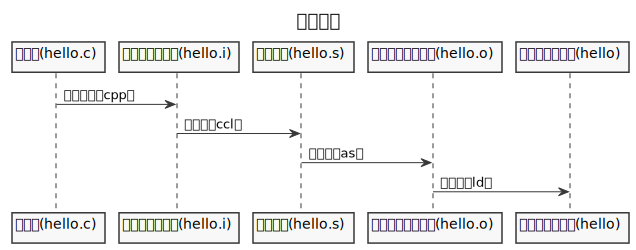
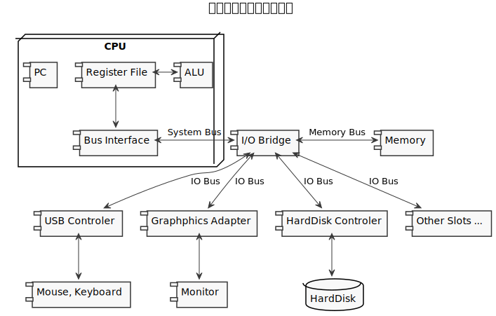
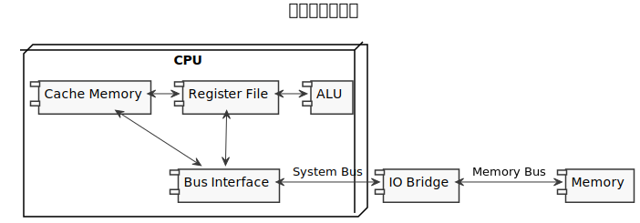

# Computer Systems - A programmer's Perspective - Third Edition

本书作者：Randal E.Bryant, David R.O'Hallaron

本书译者：龚奕利 贺莲

出版社：机械工业出版社

版权声明：本文大量摘录了原书内容，仅供个人学习之用，请勿用作其它用途；

## 第1章 计算机系统漫游

计算机系统是由硬件和系统软件组成的，它们共同工作来运行程序。虽然系统的具体实现方式随着时间不断变化，但是系统内在的概念却没有变化。

```c
#include <stdio.h>

int main()
{
    printf("hello, world\n");
    return 0;
}
```

以上程序为hello程序。我们通过追踪hello程序的声明周期来开始对系统的学习：从它被程序员创建开始，到在系统上运行，输出简单的信息，然后终止。我们将沿着这个程序的生命周期，简要地介绍一些逐步出现的关键概念、专业术语和组成部分。后面的章节将围绕这些内容展开。

### 1.1 信息就是位+上下文

hello程序的生命周期是从一个源程序开始的。源程序实际上就是一个由值0和1组成的位序列，8个位被组织成一组，称为字节。每个字节表示程序中的某些文本字符。

大部分的现代计算机系统都使用ASCII标准来表示文本字符，这种方式实际上就是用一个唯一的单字节大小的整数值来表示每个字符。

hello.c的表示方法说明了一个基本思想：系统中的所有信息，包括磁盘文件、内存中的程序、内存中存放的用户数据以及网络上传送的数据，都是由一串比特表示的。区分不同数据对象的唯一方法是我们谈到这些数据对象时的上下文。

### 1.2 程序被其它程序翻译成不同的格式

hello程序的声明周期是从一个高级C语言程序开始的，因为这种形式能够被人读懂。然而，为了在系统上运行hello.c文件，每条C语句都必须被其它程序转换为一系列的低级机器语言指令。然后这些指令按照一种称为可执行目标程序的格式打好包，并以二进制磁盘文件的形式被存放起来。目标程序也称为可执行目标文件。



### 1.3 了解编译系统如何工作是大有益处的

对于像hello.c这样简单的程序，我们可以依靠变异系统生成正确有效的机器代码。但是，有一些重要的原因促使程序员必须知道编译系统是如何工作的。

- 优化程序性能。现代编译器都是成熟的工具，通常可以生成很好的代码。作为程序员，我们无须为了写出高效的代码而去了解编译器的内部工作。但是，为了在C程序中做出好的编码选择，我们确实需要了解一些机器代码以及编译器将不同的C语句转化为机器代码的方式。

- 理解衔接时出现的错误。根据我们的经验，一些最令人困扰的程序错误往往都与链接器操作有关，尤其是当你构建大型的软件系统时。

- 避免安全漏洞。多年来，缓冲区溢出错误是造成大多数网络和Internet服务器上安全漏洞的主要原因。存在这些错误是因为很少有程序员能够理解需要限制从不受信任的源接收数据的数量和格式。学习安全编程的第一步就是理解数据和控制信息存储在程序栈上的方式会引起的后果。

### 1.4 处理器读并解释储存在内存中的指令

此刻，hello.c源程序已经被编译系统翻译成了可执行目标文件hello，并被存放在磁盘上。要想在Unix系统上运行该可执行文件，我们将它的文件名输入到称为shell的应用程序中。

shell是一个命令行解释器，它输出一个提示符，等待输入一个命令，然后执行这个命令。

#### 1.4.1 系统的硬件组成

一个典型系统的硬件组织，如下图所示：



1. 总线

   贯穿整个系统的是一组电子管道，称作总线，它携带信息字节并负责在各个部件间传递。通常总线被设计成传送定长的字节块，也就是字（word）。字中的字节数是一个基本的系统参数，各个系统中都不尽相同。现在大多数机器字长哟啊么是4个字节，要么是8个字节。

2. IO设备

   IO设备是系统与外部世界的联系通道。每个IO设备都通过一个控制器或适配器与IO总线相连。控制器与适配器之间的主要区别在于它们之间的封装方式。控制器是IO设备本身或者系统的主印制电路板上的芯片组。而适配器则是一块插在主板插槽上的卡。无论如何，它们的功能都是在IO总线和IO设备之间传递信息。

3. 主存

   主存是一个临时存储设备，在处理器执行程序时，用来存放程序和程序处理的数据。从物理上来说，主存是由一组动态随机存储器（DRAM）芯片组成的。从逻辑上来说，存储器是一个线性的字节数组，每个字节都有其唯一的地址（数组索引），这些地址是从零开始的。

4. 处理器

   中央处理单元（CPU），简称处理器，是解释（或执行）存储在主存中指令的引擎。处理器的核心是一个大小为一个字的存储设备（或寄存器），称为程序计数器（PC）。在任何时刻，PC都指向主存中的某条机器语言指令（即含有该条指令的地址）。

   从系统通电开始，直到系统断电，处理器一直在不断地执行程序计数器指向的指令，再更新程序计数器，使其指向下一条指令。

   寄存器文件是一个小的存储设备，有一些单个字长的寄存器组成，每个寄存器都有唯一的名字。ALU计算新的数据和地址值。

处理器看上去是它的指令集架构的简单实现，但是实际上现代处理器使用了非常复杂的机制来加速程序的执行。因此，我们将处理器的指令集架构和处理器的为体系结构区分开来：指令集架构描述的是每条机器代码指令的效果，而微体系结构描述的是处理器实际上是如何实现的。

#### 1.4.2 运行hello程序

初始时，shell程序执行它的指令，等待我们输入一个命令。当我们在键盘上输入字符串"./hello"之后，shell程序将字符逐一读入寄存器，再把它存放到内存中。

当我们在键盘上敲回车键时，shell程序就知道我们已经结束了命令的输入。然后shell执行一系列指令来加载可执行的hello文件，这些指令将hello目标文件中的代码和数据从磁盘复制到主存。数据包括最终会被输出的字符串“hello, world\n”。

利用直接存储器存取（DMA）技术，数据可以不通过处理器而直接从磁盘到达主存。

一旦目标文件hello中的代码和数据被加载到主存，处理器就开始执行hello程序的main程序中的机器语言指令。这些指令将“hello, world\n”字符串中的字节从主存复制到寄存器文件中，再从寄存器文件中复制到显示设备，最终显示在屏幕上。

### 1.5 高速缓存至关重要

这个简单的示例揭示了一个重要的问题，即系统话费了大量的时间把信息从一个地方挪到另一个地方。因此系统设计者的一个主要目标就是使这些复制操作尽可能快地完成。

根据机械原理，较大的存储设备要比较小的存储设备运行得慢，而快速设备的造价远高于同类的低速设备。比如，一个典型系统上的磁盘驱动器可能比主存大1000倍，但是对处理器而言，从磁盘驱动器上读取一个字的时间开销要比从主存中读取的开销大1000万倍。类似的，一个典型的寄存器文件只存储几百字节的信息，而主存里可存放几十亿字节。然而，处理器从寄存器文件中读数据比从主存中读取几乎要快100倍。更麻烦的是，随着半导体技术的进步，这种处理器与主存之间的差距还在持续增大。

针对这种处理器与主存之间的差异，系统设计者采用了更小更快的存储设备，称为告诉缓存存储器（cache memory），作为暂时的集结区域，存放处理器近期可能会需要的信息。



位于处理器芯片上的L1高速缓存的容量可以达到数万字节，访问速度几乎和访问寄存器文件一样快。一个容量为数十万到数百万字节的更大的L2缓存通过一条特殊的总线连接到处理器。L1和L2 高速缓存是用一种叫做静态随机访问存储器（SRAM）的硬件技术实现的。比较新的、处理能力更强大的系统甚至有三级高速缓存。

通过让高速缓存里存放可能经常访问的数据，大部分的内存操作都能在快速的高速缓存中完成。

本书得出的重要结论之一就是，意识到高速缓存存储器存在的应用程序员能够利用高速缓存将程序的性能提高一个数量级。

### 1.6 存储设备形成层次结构

在处理器和一个较大较慢的设备之间插入一个更小更快的存储设备的想法已经成为一个普遍的观念。实际上，每个计算机系统中的存储设备都被组织成了一个存储器层次结构。在这个层次结构中，设备的访问速度越来越慢，容量越来越大，并且每字节的造价也越来越便宜。

### 1.7 操作系统管理硬件

回到hello程序的例子。当shell加载和运行hello程序时，以及hello程序输出自己的信息时，shell和hello程序都没有直接访问键盘、显示器、磁盘或主存。取而代之的是，它们依靠操作系统提供的服务。

操作系统有两个基本的功能：

（1）防止程序被失控的应用程序滥用；

（2）像应用程序提供简单一致的机制来控制复杂而又通常大不相同的低级硬件设备；

操作系统通过几个基本的抽象概念（进程、虚拟内存和文件）来实现这两个功能。文件是对IO设备的抽象，虚拟内存是对主存和磁盘IO设备的抽象表示，进程则是对处理器、主存和IO设备的抽象表示。

#### 1.7.1 进程

像hello这样的程序在现代系统上运行时，操作系统会提供一种假象，就好像系统上只有这个程序在运行。程序看上去是独占地使用处理器、主存和IO设备。处理器看上去就像在不间断地一条接一条地执行程序中的指令，即改程序的代码和数据是系统内存中唯一的对象。这些假象是通过进程的概念来实现的，进程是计算机科学中最重要和最成功的的概念之一。

进程是操作系统对一个正在运行的程序的一种抽象。在一个系统上可以同时运行多个进程，而每个进程都好像在独占地使用硬件。而并发运行，则是说一个进程的指令和另一个进程的指令是交错执行的。在大多数系统中，需要运行得进程数是多于可以运行它们的CPU数的。操作系统实现这种交错执行的机制称为上下文切换。

操作系统保持跟踪进程运行所需要的所有状态信息。这种状态，也就是上下文，包括许多信息，比如PC和寄存器文件的当前值，以及主存的内容。在任何一个时刻，单处理器系统都只能执行一个进程的代码。当操作系统决定要把控制权从当前进程转移到某个新进程时，就会进行上下文切换，即保存当前进程的上下文，恢复新进程的上下文，然后将控制权传递到新进程。新进程就会从它上次停止的地方开始。

从一个进程到另一个进程的转换是由操作系统内核管理的。内核是操作系统代码常驻内存的部分。

当应用程序需要操作系统的某些操作时，比如读写文件，它就执行一条特殊的系统调用指令，将控制权传递给内核。然后内核执行被请求的操作并返回应用程序。

**实现进程这个抽象概念需要低级硬件和操作系统软件之间的紧密合作**。

#### 1.7.2 线程

尽管通常我们认为一个进程只有单一的控制流，但是在现代操作系统中，一个进程实际上可以有多个称为线程的执行单元组成，每个线程都运行在进程的上下文中，并共享同样的代码和全局数据。

#### 1.7.3 虚拟内存

虚拟内存是一个抽象概念，他为每个进程提供了一个假象，即每个进程都在独占地使用主存。每个进程看到的内存都是一致的，称为虚拟地址空间。

以下为Linux进程的虚拟地址空间。在Linux中，地址空间的高地址区域是保留给操作系统中的代码和数据的，这对所有的进程都是一样的。地址空间的低地址区域存放用户进程定义的代码和数据。

| 地址     | 内容                 |
| -------- | -------------------- |
| 0        |                      |
| 程序开始 | 只读的代码和数据     |
|          | 读/写数据            |
|          | 运行时堆             |
| ...      |                      |
|          | 共享库的内存映射区域 |
| ...      |                      |
|          | 用户栈               |
| 高地址   | 内核虚拟内存         |

每个进程看到的虚拟地址空间由大量准确定义的区构成，每个区都有专门的功能。

- 程序代码和数据。对所有的进程来说，代码是从同一固定地址开始，紧接着的是和C全局变量对应的数据位置。代码和数据区是直接按照可执行目标文件的内容初始化的。
- 堆。代码和数据区之后紧随着的就是运行时堆。代码和数据区在进程一开始时就被指定了大小，与此不同，当调用像malloc和free这样的C标准库函数时，堆可以在运行时动态地扩展和收缩。
- 共享库。大约在地址空间的中间部分是一块用来存放像C标准库和数学库这样的共享库的代码和数据的区域。
- 栈。位于用户虚拟地址空间顶部的是用户栈，编译器用它来实现函数调用。和堆一样，用户栈在程序执行期间可以动态地扩展和收缩。特别地，每次我们调用一个函数时，栈就会增长，从一个函数返回时，栈就会收缩。
- 内核虚拟内存。地址空间顶部的区域是为内核保留的。不允许应用程序读写这个区域的内容或者直接调用内核代码定义的函数。相反，它们必须调用内核来执行这些操作。

**虚拟内存的运作需要硬件和操作系统软件之间精密复杂的交互**，包括对处理器生成的每个地址的硬件翻译。基本思想是把一个进程虚拟内存的内容存储在磁盘上，然后用主存作为磁盘的高速缓存。

#### 1.7.4 文件

文件就是字节序列，仅此而已。系统中的所有输入输出都是通过使用一小组称为Unix IO的系统函数调用读写文件来实现的。

文件这个简单而精致的概念是非常强大的，因为它向应用程序提供了一个统一的视图，来看待系统中可能含有的所有各式各样的IO设备。

### 1.8 系统之间利用网络通信

现代系统经常通过网络和其它系统连接到一起。从一个单独的系统来看，网络可视为一个IO设备。

### 1.9 重要主题

#### 1.9.1 Amdahl定律

Gene Amdahl，计算领域的早期先锋之一，对提升系统某一部分性能所带来的的效果做出了简单却有见地的观察。这个观察被称为Amdahl定律。

该定律的主要思想是，当我们对系统的某个部分加速时，其对系统整体性能的影响取决于该部分的重要性和加速程度。

若系统执行某应用程序所需要的时间为$T_{old}$，假设系统某个部分所需的执行时间所占比例为$\alpha$，而该部分的提升比例为$k$，则这一部分提升前所需时间为$\alpha T_{old}$，提升后所需时间为$\alpha T_{old}/k$，因此，总的执行时间为
$$
T_{new}=(1-\alpha)T_{old} + \alpha T_{old}/k=T_{old}(1-\alpha + \alpha / k)
$$
由此可得出加速比为
$$
S=T_{old}/T_{new}=\frac{1}{1-\alpha(1-\frac{1}{k})}
$$
因此，若想显著加速整个系统，应首先对系统中占用时间比较长的部分进行优化。

#### 1.9.2 并发和并行

并发（concurrency）指一个同时具有多个活动的系统。并行（parallelism）指的是用并发来使一个系统运行得更快。

（1）线程级并发

构建在进程这个抽象之上，我们能够设计出同时有多个程序执行的系统，这就导致了并发。

（2）指令级并行

在较低的抽象层次上，现代处理器可以同时执行多条指令的属性称为指令级并行。

（3）单指令、多数据并行

在最低层次上，许多现代处理器拥有特殊的硬件，允许一条指令产生多个可以并行执行的操作，这种方式称为单指令、多数据，即SIMD并行。

#### 1.9.3 计算机系统中抽象的重要性

抽象的使用是计算机科学中最为重要的概念之一。

## 第2章 信息的表示和处理

### 2.1 信息存储

大多数计算机使用8位的块，或者字节（byte），作为最小的可寻址的内存单位，而不是访问内存中单独的位。机器级程序将内存视为一个非常大的字节数组，称为虚拟内存（virtual memory）。内存的每一个字节都由一个唯一的数字来标识，称为它的地址，所有可能地址的集合就称为虚拟地址空间。

#### 2.1.1 十六进制表示法

一个字节由8位组成，在二进制表示法中，它的值域是${00000000}_{2} - {11111111}_{2}$，如果看成十进制整数，它的值域就是$0_{10} - 255_{10}$。两种表示方法用来描述位模式都不是非常方便。替代的方法是，以16位基数，或者叫做十六进制数，来表示。用十六进制书写，一个字节的值域为$00_{16} - \text{FF}_{16}$。

#### 2.1.2 字数据大小

每台计算机都有一个字长（word size），指明指针数据的标称大小（nominal size）。因为虚拟地址是以这样一个字来编码的，所以字长决定的最重要的系统参数就是虚拟地址空间的最大大小。

#### 2.1.3 寻址和字节顺序

对于跨越多字节的程序对象，我们必须建立两个规则：这个对象的地址是什么，以及在内存中如何排列这些字节。在几乎所有机器上，多字节对象都被存储为连续的字节序列，对象的地址为所使用的字节中最小的地址。

一个对象的字节的排列表示有两个通用的规则。某些机器选择在内存中按照从最低有效字节到最高有效字节的顺序存储对象，这种最低有效位在最前面的方式，称为小端法。另一些机器按照从最高有效字节到最低有效字节的顺序存储，即最高有效字节在最前面的方式，称为大端法。

对于程序员而言，字节顺序在几种场景下是不可忽略的，包括：

（1）不同类型的机器之间传输二进制数据。这里的一个解决办法是约定将传输的字节序统一为同一个字节序。

（2）反汇编。如代码`int a = 0x12345678`，其x86-64环境下的反汇编代码为`   8:   c7 45 fc 78 56 34 12    movl   $0x12345678,-0x4(%rbp)`，注意到代码的二进制表示中，整形数是以小端形式存储的。

（3）规避正常类型系统的程序。比如，C语言中的强制类型转换。

#### 2.1.4 表示字符串

C语言中的字符串被编码为一个以null字符结尾的字符数组。每个字符都由某个标准编码来表示，最常见的是ASCII字符码。

#### 2.1.5 表示代码

不同的机器类型使用不同的且不兼容的指令和编码方式。即使是完全一样的进程，运行在不同的操作系统上也会有不同的编码规则，因此二进制代码是不兼容的。

计算机系统的一个基本概念是，从机器的角度来看，程序仅仅只是字节序列。机器没有关于原始程序的任何信息，除了可能有些用来帮助调试的辅助表之外。

#### 2.1.6 布尔代数简介

二进制值是极速三级编码、存储和操作信息的核心，所以围绕数值0和1的研究已经演化出了丰富的数学只是体系。这起源于1850年前后的乔治·布尔（George Boole, 1815-1864）的工作，因此也称为布尔代数。布尔注意到，通过将逻辑值真和假编码为二进制值1和0，能够设计出一种代数，以研究逻辑推理的基本原则。

后来创立信息论领域的Claude Shannon首先建立了布尔代数和数字逻辑之间的联系。他在1937年的硕士论文中表明了布尔代数可以用来设计和分析机电继电器网络。

#### 2.1.7 C语言中的位级运算

C语言的一个很有用的特性就是它支持按位布尔运算。事实上，布尔运算中使用的符号和C语言使用的符号是相同的。

#### 2.1.8 C语言中的逻辑运算

C语言提供了一组逻辑运算符`||`、`&&`、`！`，分别对应于命题逻辑中的OR、AND和NOT运算。逻辑运算很容易和位级运算相混淆，但是它们的功能是完全不同的。逻辑运算中，所有非0的参数均表示TRUE，参数0表示FALSE。

#### 2.1.9 C语言中的移位运算

注意，对于C语言中移位运算，左移总是在右侧补0，右移时，机器支持两种形式的右移：逻辑右移和算术右移。逻辑右移总是在左侧补0，算术右移则在左端补最高有效位的值。

### 2.2 整数表示

$B: \text{Binary}$

$T: \text{Complement}$

$U: \text{Unsigned}$

$\omega: \text{bit length}$

| 符号             | 类型 | 含义             |
| ---------------- | ---- | ---------------- |
| $B2T_{\omega}$   | 函数 | 二进制转补码     |
| $B2U_{\omega}$   | 函数 | 二进制转无符号数 |
| $T2U_{\omega}$   | 函数 | 补码转无符号数   |
| $TMin_{\omega}$  | 常数 | 最小补码值       |
| $UMax_{\omega}$  | 常数 | 最大无符号数     |
| $+_{\omega}^{t}$ | 操作 | 补码加法         |
| $+_{\omega}^{u}$ | 操作 | 无符号数加法     |
| $-_{\omega}^{t}$ | 操作 | 补码取反         |
| $-_{\omega}^{u}$ | 操作 | 无符号数取反     |

#### 2.2.1 整型数据类型

C语言支持多种整型数据类型：表示有限范围内的整数。

#### 2.2.2 无符号数的编码

假设有一个整数数据类型有$\omega$位。我们可以把位向量写成$\overrightarrow{x}$，表示整个向量，或者写成$x_{\omega - 1},x_{\omega - 2},..., x_0$，表示向量中的每一位。把$\overrightarrow{x}$看做一个二进制表示的数，就获得了$\overrightarrow{x}$的无符号表示。在这个编码中，每个位$x_{i}$都取值为$0$或$1$，后一种取值意味着数值$2^i$应为数字值的一部分。我们用一个函数$B2U_{\omega}$（表示Binary to Unsigned的缩写，长度为$\omega$）来表示：

**原理**：无符号数编码的定义

对向量$\overrightarrow{x}=[x_{\omega - 1},x_{\omega - 2},...,x_0]$，$\displaystyle B2U_{\omega}(\overrightarrow{x})\doteq \sum_{i=0}^{\omega-1}x_i2^i$

在这个等式中，符号“$\doteq$”表示左边被定义为等于右边。函数$B2U_\omega$将一个长度为$\omega$的$0$、$1$串映射到非负整数。

**值域**：$\omega$位所能表示的最小值为$0$，最大值为$\displaystyle UMax_{\omega} \doteq \sum_{i=0}^{\omega - 1}2^i = 2^{\omega} - 1$。

**原理**：无符号数编码的唯一性

函数$B2U_{\omega}$是一个双射（思考：如何证明？？？）。

#### 2.2.3 补码编码

最常见的有符号数的计算机表示方式就是补码形式。在这个定义中，将字的最高有效位解释为负权。用函数$B2T_{\omega}$（Binary to Two's-complement，长度为$\omega$）来表示。

**原理**：补码编码的定义

对向量$\overrightarrow{x}=[x_{\omega-1},x_{\omega - 2},...,x_0]$：$\displaystyle B2T{\omega}(\overrightarrow{x})\doteq -x_{\omega -1}2^{\omega -1}+\sum_{i=0}^{\omega -2}x_i2^i$

最高有效位$x_{\omega - 1}$也称为符号位，它的“权重”为$-2^{\omega - 1}$，是无符号表示中权重的负数。符号位被设置为$1$时，表示值为负，而当设置为$0$时，值为非负。

上述函数中，第二部分可以看作是一个总位数为$\omega - 1$的无符号数编码映射，其值域为$[0,2^{\omega}-1]$，第一部分在最高有效位为$1$时，可以看作是一个负方向大小为$2^{\omega - 1}$的偏移，即值域变为$[-2^{\omega - 1},2^{\omega -1}-1]$。可以注意到，补码形式下，能表示的最小值比能表示的最大值的绝对值大$1$。

**值域**：当最高有效位为$1$而其他位全为$0$时，具有最小值$-2^{\omega - 1}$，当最高有效位为$0$而其它位全为$1$时，具有最大值$2^{\omega - 1}-1$。

**原理**：补码编码具有唯一性。

函数$B2T_\omega$是一个双射。

#### 2.2.4 有符号数和无符号数之间的转换

C语言允许在各种不同的数字数据类型之间做强制类型转换。强制类型转换的结果保持位值不变，只是改变了解释这些位的方式。

**原理**：补码转换为无符号数

对满足$TMin_{\omega} \le x \le TMax_{\omega}$的$x$有：

$T2U_{\omega}(x)\begin{cases}x+2^{\omega}, &x < 0 \\ x, &x\ge 0\end{cases}$

**原理**：无符号数转换为补码

对满足$0\le u \le UMax_{\omega}$的$u$有：

$U2T_{\omega}(u)=\begin{cases}u, & u\le TMax_{\omega}\\ u-2^{\omega}, & u > TMax_{\omega}\end{cases}$

#### 2.2.5 C语言中的有符号数与无符号数

C语言支持所有证书数据类型的有符号和无符号运算。尽管C语言标准没有指定有符号数要采用某种表示，但是几乎所有的机器都使用补码。

C语言允许无符号数和有符号数之间的转换。

虽然C标准没有精确规定应如何进行这种转换，但大多数系统遵循的原则是底层的位保持不变。

#### 2.2.6 扩展一个数字的位表示

一个常见的运算是在不同的字长的整数之间转换，同时又保持数值不变。当目标数据类型太小以至于不能表示想要的值时，这根本就是不可能的。然而，从一个较小的数据类型转换到一个较大的类型，应该总是可能得。

要将一个无符号数转换为一个更大的数据类型，我们只要简单地在表示的开头添加0。这种运算被称为零扩展（zero extension）。

**原理**：无符号数的零扩展

定义宽度为$\omega$的位向量$\overrightarrow{u}=[u_{\omega - 1}, u_{\omega - 2},...,u_0]$和宽度为$\omega '$的位向量$\overrightarrow {u}'=[0,0,...,0,u_{\omega - 1},u_{\omega - 2},...,u_0]$，其中$\omega ' > \omega$，则有$B2U_{\omega}(\overrightarrow{u})=B2U_{\omega '}(\overrightarrow {u}')$。

要将一个补码数字转换为一个更大的数据类型，可以执行一个符号扩展，在表示中添加最高有效位的值，表示为如下原理。

**原理**：补码数的符号扩展

定义宽度为$\omega$的位向量$\overrightarrow{x}=[x_{\omega - 1},x_{\omega - 2},...,x_0]$和宽度为$\omega$的位向量$\overrightarrow{x}'=[x_{\omega - 1},...,x_{\omega - 1},x_{omega - 2},...,x_0]$，其中$\omega ' > \omega$，则$B2T_{\omega}(\overrightarrow{x})=B2T_{\omega '}(\overrightarrow{x}')$。

值得一提的是，从一个数据大小到另一个数据大小的转换，以及无符号和有符号数之间的转换的相对顺序能够影响一个程序的行为。例如，把一个`short`转换成一个`unsigned`时，要先改变大小，然后完成从有符号到无符号的转换。事实上，这个规则是C语言标准要求的。

#### 2.2.7 截断数字

当将一个$\omega$位的数$\overrightarrow{x}=[x_{\omega - 1},x_{\omega - 2},...,x_0]$截断为一个$k$位数字时，我们会丢弃高$\omega - k$位，得到一个位向量$\overrightarrow{x}'=[x_{k - 1},x_{k - 2}, ..., x_0]$。

**原理**：截断无符号数

令$\overrightarrow{x}$等于位向量$[x_{\omega - 1},x_{\omega - 2},...,x_0]$，而$\overrightarrow{x}'$是将其截断为$k$位的结果：$\overrightarrow{x}'=[x_{k-1},x_{k-2},...,x_0]$。令$x=B2U_{\omega}(\overrightarrow x)$，$x'=B2U_{k}(\overrightarrow {x}')$。则$x'=x\mod 2^k$。

**原理**：截断补码数值

令$\overrightarrow{x}$等于位向量$[x_{\omega - 1},x_{\omega - 2},...,x_0]$，而$\overrightarrow{x}'$是将其截断为$k$位的结果：$\overrightarrow{x}'=[x_{k-1},x_{k-2},...,x_0]$。令$x=B2U_{\omega}(\overrightarrow x)$，$x'=B2U_{k}(\overrightarrow {x}')$。则$x'=U2T_{k}(x \mod 2^k)$。

####  2.2.8 关于有符号数和无符号数的建议

有符号数和无符号数的隐式强制转换导致了某些非直观的行为，而这些非直观的特性经常导致程序错误，并且这种包含隐式强制类型转换的细微差别的错误很难被发现。因为这种强制类型转换是在代码中没有明确指示的情况下发生的，程序员经常忽视了它的影响。

### 2.3 整数运算

两个正数相加会得出一个负数，而比较表达式`x<y`和`x-y<0`会产生不同的结果。这些属性是由于计算机运算的有限性造成的。理解计算机运算的细微之处能够帮助程序员编写更可靠的代码。

注：两个有符号正数相加，当算术运算的结果超出了有符号数的表达范围时，运算的结果就会被解释为一个负数（位形式刚好是一个负数）。对于比较表达式，第二种写法执行了减法运算，当减法溢出时，也会产生同样的问题。

#### 2.3.1 无符号加法

**原理**：无符号数加法

对满足$0 \le x,y < 2^{\omega}$的$x$和$y$有：

$x +_{\omega}^{u} y = \begin{cases}x+y, &x+y < 2^{\omega} \\ x + y - 2^{\omega}, &2^{\omega}\le x+y < 2^{\omega + 1}\end{cases}$

注：其中$+_{\omega}^{u}$表示$\omega$位无符号加法。

**原理**：检测无符号数加法中的溢出

对在范围$0\le x,y \le UMax_{\omega}$中的$x$和$y$，令$s\doteq x+_{\omega}^{u} y$。则对计算$s$，当且仅当$s < x$（或者$s < y$时），发生了溢出。

**原理**：无符号数求反

对满足$0 \le x < 2^{\omega}$的任意$x$，其$\omega$位的无符号逆元$-_{\omega}^{u}x$由下式给出：

$-_{\omega}^{u}x=\begin{cases}x, &x = 0 \\ 2^{\omega} - x, & x > 0\end{cases}$

#### 2.3.2 补码加法

对于补码加法，我们必须确定当结果太大或者太小时，应该做些什么。

**原理**：补码加法

对满足$-2^{\omega - 1} \le x$， $y \le 2^{\omega - 1}-1$的整数$x$和$y$，有：
$$
x+_{\omega}^{t}y=
\begin{cases}
x+y-2^{\omega}, &2^{\omega - 1} \le x + y, &\text{positive overflow} \\
x+y, &-2^{\omega - 1}\le x + y < 2^{\omega - 1}, &\text{normal} \\
x+y+2^{\omega}, &x+y<-2^{\omega - 1}, &\text{negative overflow}
\end{cases}
$$
当和$x+y$超过$TMax_{\omega}$时，发生了正溢出，在这种情况下，截断的结果是从和数中减去$2^{\omega}$。当和$x+y$小于$TMin_{\omega}$时，发生了负溢出。在这种情况下，截断的结果是把和数加上$2^{\omega}$。

两个数的$\omega$位补码之和与无符号之和有完全相同的位级表示。实际上，大多数计算机使用同样的机器指令来执行无符号或者有符号加法。

**原理**：检测补码加法中的溢出

对满足$TMin_{\omega}\le x, y\le TMax_{\omega}$的$x$和$y$，令$s\doteq x+_{\omega}^{t}y$。当且仅当$x>0$，$y>0$，但$s\le 0$时，计算$s$发生了正溢出。当且仅当$x<0$，$y<0$，但$s\ge 0$时，计算$s$发生了负溢出。

#### 2.3.3 补码的非

我们将$-_{\omega}^{t}x$表示如下：

**原理**：补码的非

对满足$TMin_{\omega}\le x \le TMax_{\omega}$的$x$，其补码的非$-_{\omega}^{t}x$由下式给出
$$
-_{\omega}^{t}x = \begin{cases}
TMin_{\omega}, & x = TMin_{\omega} \\
-x, & x > TMin_{\omega}
\end{cases}
$$

```c++
// eg. negative(TMin) = TMin
#include <stdio.h>
#include <limits>

int main()
{
    short c = std::numeric_limits<short>().min();
    short h = (-c);

    printf("c=%hd,h=%hd\n", c, h);
    return 0;
}
```

```bash
c=-32768,h=-32768
```

注意，补码的最小值没有一个直接可以对应的非值，其非值不变。

#### 2.3.4 无符号乘法

范围在$0 \le x, y \le 2^{\omega} - 1$内的整数$x$和$y$可以被表示为$\omega$位的无符号数，但是它们的乘积$x\cdot y$的取值范围为$0$到$(2^{\omega} - 1)^2$之间，这可能需要$2\omega$位来表示。不过，C语言中无符号乘法被定义为产生$\omega$位的值，就是$2\omega$位的整数乘积的低$\omega$位表示的值。我们将这个值表示为$x *_{\omega}^{u} y$。

**原理**：无符号数乘法

对满足$0 \le x, y\le UMax_{\omega}$的$x$和$y$有：
$$
x*_{\omega}^{u}y = (x\cdot y)\mod 2^{\omega}
$$

#### 2.3.5 补码乘法

范围在$-2^{\omega - 1} \le x, y \le 2^{\omega - 1}-1$内的整数$x$和$y$可以被表示为$\omega$为的补码数字，但是它们的乘积$x\cdot y$的取值范围为$-2^{\omega - 1}\cdot (2^{\omega - 1}- 1)=-2^{2\omega - 2}+2^{\omega - 1}$到$-2^{\omega - 1}\cdot -2^{\omega - 1}=2^{2\omega - 2}$之间。要用补码表示这个乘积，可能需要$2\omega$位。然而，C语言中的有符号乘法是通过将$2\omega$位的乘积截断为$\omega$位来实现的。我们将这个数值表示为$x *_{\omega}^{t}y$。

**原理**：补码乘法

对满足$TMin_{\omega}\le x, y \le TMax_{\omega}$的$x$和$y$有：
$$
x*_{\omega}^{t}=U2T_{\omega}((x\cdot y)\mod 2^{\omega})
$$
**原理**：无符号和补码乘法的位级等价性

给定长度位$\omega$的位向量$\overrightarrow{x}$和$\overrightarrow{y}$，用补码形式的位向量表示来定义整数$x$和$y$：$x=B2T_{\omega}(\overrightarrow{x})$，$y=B2T_{\omega}(\overrightarrow{y})$。用无符号形式的位向量表示来定义非负整数$x'$和$y'$：$x'=B2U_{\omega}(\overrightarrow{x})$，$y'=B2U_{\omega}(\overrightarrow{y})$。则
$$
T2B_{\omega}(x *_{\omega}^{t}y)=U2B_{\omega}(x' *_{\omega}^{u}y')
$$

#### 2.3.6 乘以常数

以往，在大多数机器上，整数乘法指令相当慢，需要10个或者更多的时钟周期，然而其它整数运算只需要1个时钟周期。即使在我们的参考机器（Intel Core i7 Haswell）上，其整数乘法也需要3个时钟周期。因此编译器使用了一项重要的优化，试着用移位和加法运算的组合来代替乘以常数因子的乘法。首先，我们会考虑乘以2的幂的情况，然后再概括成乘以任意常数。

**原理**：乘以2的幂

设$x$为位模式$[x_{\omega - 1},x_{\omega - 2},...,x_0]$表示的无符号整数。那么，对于任何$k\ge 0$，我们都认为$[x_{\omega - 1},x_{\omega - 2},...,x_0,0,...,0]$给出了$x2^k$的$\omega + k$位的无符号表示，这里右边增加了$k$个$0$。

**原理**：与$2$的幂相乘的无符号乘法

C变量`x`和`k`有无符号数值$x$和$k$，且$0\le k < \omega$，则C表达式`x<<k`产生数值$x *_{\omega}^{u}2^{k}$。

由于固定大小的补码算术运算的位级操作与其无符号运算等价，因此可以对补码运算的2的幂的乘法与左移之间的关系进行类似的表述。

**原理**：与$2$的幂相乘的补码乘法

略。

由于整数乘法比移位和加法的代价要大得多，许多C语言编译器试图以移位、加法和减法的组合来消除很多整数乘以常数的情况。

#### 2.3.7 除以2的幂

在大多数机器上，整数除法要比整数乘法更慢：需要30个或者更多的时钟周期。除以2的幂也可以用移位运算来实现，只不过用的是右移，而不是左移。无符号和补码数分别使用逻辑移位和算术移位来达到目的。

**原理**：除以2的幂的无符号除法

C变量`x`和`k`有无符号数值$x$和$k$，且$0\le k < \omega$，则C表达式`x >> k`产生数值$\lfloor x/2^{k} \rfloor$。

**原理**：除以2的幂的补码除法，向下舍入

C变量`x`和`k`分别有补码值$x$和无符号数值$k$，且$0 \le k < \omega$，则当执行算术移位时，C表达式`x >> k`产生数值$\lfloor x/2^k \rfloor$。

对于无符号数，右移相当于向下舍入，因此对于负数，右移也会产生向下舍入（两者在非符号位的效果是一致的）。例如，$-3$的位表示为`11111101`，右移1位为`11111110`，即$-2$。这与无符号数的右移效果不一致。

**原理**：除以2的幂的补码除法，向上舍入

C变量`x`和`k`分别有补码值$x$和无符号数值$k$，且$0 \le k < \omega$，则当执行算术移位时，C表达式`(x + (1 << k) - 1) >> k`产生数值$\lfloor x/2^k \rfloor$。

也即在执行算术右移之前加上一个适当的偏置量让结果正确舍入。

#### 2.3.8 关于整数运算的思考

- 计算机执行的整数运算实际上是一种模运算形式。表示数字的有限字长限制了可能的值得取值范围，结果运算可能溢出。
- 补码表示提供了一种既能表示负数也能表示整数的灵活方法，同时使用了执行无符号算术运算相同的位级实现，这些运算包括像加法、减法、乘法，甚至除法。无论运算数是以无符号形式还是以补码形式表示的，都有完全一样或者非常类似的位级行为。
- C语言中的某些规定可能会产生令人意想不到的结果（比如`-INT_MAX`的值），而这些结果可能是难以察觉或者难以理解的源头。
- `unsigned`数据类型虽然概念上很简单，但是可能导致即使是资深程序员都意想不到的行为。这种数据类型会以出乎意料的方式出现，比如书写整数常数和调用库函数时。

### 2.4 浮点数

浮点数对形如$V=x\times 2^y$的有理数进行编码。它对执行涉及非常大的数字（绝对值很大）、非常接近于0（绝对值接近0）的数字，以及更普遍地作为市属运算的近似值的计算，是很有用。

直到20世纪80年代，每个计算机制造商都设计了自己的表示浮点数的规则，以及对浮点数执行运算的细节。另外，它们通常不会太多地关注运算的精确性，而把实现的速度和简便性看得比数字精确性更重要。

大约在1985年，这些情况随着IEEE标准754的推出而改变了，这是一个仔细制定的浮点数机器运算的标准。

这项工作是从1976年开始由Intel赞助的，与8087得到设计同时进行，8087是一种为8086处理器提供浮点支持的芯片。他们请William Kahan（加州大学伯克利分校的一位教授）作为顾问，帮助设计未来处理器浮点标准。他们支持Kahan加入一个IEEE资助的制定工业标准的委员会。这个委员会最终采纳的标准非常接近于Kahan为Intel设计的标准。目前，实际上所有的计算机都支持这个后来被称为IEEE浮点的标准。这大大提高了科学应用程序在不同机器上的可移植性。

#### 2.4.1 二进制小数

理解浮点数的第一步是考虑含有小数值的二进制数字。首先看看更熟悉的十进制表示法。十进制表示法使用如下形式的表示：
$$
d_md_{m-1}\cdots d_1d_0.d_{-1}d_{-2}\cdots d_{-n}
$$
其中每个十进制数$d_i$的取值范围是$0\sim 9$。这个表达描述的数值$d$定义如下：
$$
d=\sum_{i = -n}^{m}10^i \times d_{i}
$$
数字权的定义与十进制小数点符号（'.'）相关，这意味着小数点左边的数字的权是$10$的正幂，得到整数值，小数点右边的数字的权是$10$的负幂，得到小数值。

类似，考虑一个形如
$$
b_{m}b_{m-1}\cdots b_1b_0.b_{-1}b_{-2}\cdots b_{-n}
$$
的表示法，其中每个二进制数字（或者称为权）$b_{i}$的取值范围是$0$和$1$。这种表示方法表示的数$b$的定义如下：
$$
b = \sum_{i=-n}^{m}2^i\times b_{i}
$$
小数点左边的位的权是$2$的正幂，小数点右边的位的权是$2$的负幂。

#### 2.4.2 IEEE浮点表示

前一节中的定点表示法不能很有效的表示非常大或非常小的数字，原因是这些数如果在小数点之间存在很多个0，则这些零也需要占用二进制位。例如，表达式$5\times 2^{100}$需要用$1010...0$即$101$后面跟上100个$0$来表示。

IEEE浮点标准用$V=(-1)^{s}\times M \times 2^{E}$的形式来表示一个数：

- 符号（sign）$s$决定这个数是负数还是整数。若为0，则符号位作为特殊情况处理。
- 尾数（significand）$M$是一个二进制西小数，它的范围是$1 \sim 2-\epsilon$，或者是$0\sim 1-\epsilon$。
- 阶码（exponent）$E$的作用是对浮点数加权，这个权重是$2$的$E$次幂（可能是负数）。

浮点数的位划分为三个字段：

- 一个单独的符号位$s$直接编码；
- k位阶码字段编码阶码$E$；
- n位小数字段编码尾数$M$，其值依赖于阶码字段的值是否为0；

在单精度浮点数中，三个字段的长度分别为1位、8位、23位；双精度浮点数中，三个字段的长度分别为1位、11位、52位。

给定位表示，根据阶码的值，被编码的值可以分成三种不同的情况（最后一种情况有两个变种）。

- **规格化的**。此时阶码的位非全0或全1。
- **非规格化的**。此时阶码的位全0。
- 阶码全1，若小数字段全为0，则为**无穷大**；若小数字段不为全0，则为**NaN**。

##### 2.4.2.1 情况1：规格化的值

阶码字段被解释为以偏置形式表示的有符号整数，为$E=e-Bias$，其中$e$是无符号数，$Bias$是一个等于$2^{k-1}-1$的偏置值。偏置形式相比补码数，为$\displaystyle B2T_{k}(\overrightarrow{x}) + 1$。对于单精度，为$-126 \sim 127$，对于双精度，为$-1022 \sim 1023$。

小数字段被解释为小数值$f$，满足$0 \le f < 1$，二进制表示为$0.f_{n-1}\cdots f_1f_0$。尾数被定义为$M=1+f$。这种方式也叫做隐含的以1开头的表示。

##### 2.4.2.2 情况2：非规格化的值

当阶码域为全0时，所表示的数的是非规格化形式。此时阶码的值为$E=1-Bias$，尾数的值为$M=f$。

注意，对于非规格化形式，其阶码值并非按规格化的$-Bias$，尾数的值也并非按规格化的$1+f$。阶码这样规定的原因是为了补偿尾数没有隐含的1。

非规格化数有两个用途。首先，其提供了一种表示数值0的方法。当小数字段为全0，符号位为0，则为$+0.0$，若符号位为1，则为$-0.0$。非规格化数的另一个功能是表示那些非常接近于0的数。它们提供了一种属性，称为逐渐溢出，其中可能得数值分布均匀地接近于0。

##### 2.4.2.3 情况3：特殊值

当阶码全为1时表示无穷大或NaN。若小数字段全为0，为无穷大，否则为NaN。当两个非常大的数相乘，或者除以0时，无穷大能够表示溢出的结果。当一些运算的结果无法通过实数或者无穷表示时，就会以NaN表示。NaN表示Not a Number。

```c++
// This is an example of infinite float number.
#include <stdio.h>
int main()
{
    float c = 1.0 / 0.0;
    printf("c=%g\n", c);
    return 0;
}
```

```bash
$ ./a.out
c=inf
```

```c++
// This is an example of NaN
#include <stdio.h>
int main()
{
    float c = 1.0 / 0.0;
    float d = 1.0 / 0.0;
    float e = c - d;
    printf("e=%g\n", e);
    return 0;
}
```

```bash
$ ./a.out
e=-nan
```

#### 2.4.3 数字示例

略。

#### 2.4.4 舍入

因为表示方法限制了浮点数的范围和精度，所以浮点运算智能近似地表示实数运算。因此，对于值$x$，我们一般想用一种系统的方法，能够找到最近接的匹配值$x'$，它可以用期望的浮点形式表示出来。这就是舍入运算的任务。

IEEE浮点格式定义了四种不同的舍入方法。默认的方法是找到最接近的匹配，而其他三种可用于计算上界和下界。

向偶数舍入，也被称为向接近的值舍入，是默认的方式。所谓向偶数舍入，是指对于中间值，它将数字向上或向下舍入，使得结果的最低有效数字是偶数。因此$1.5$和$2.5$向偶数舍入的结果都是$2$。

其它三种方式分别是向零舍入、向下舍入、向上舍入。这三种方式会产生实际值的确界。这些方法在一些数字应用中是很有用的。

采用向上或向下舍入处理一组数值，会在计算这些数值的平均值时引入统计偏差。向偶数舍入在大多数现实情况中避免了这种统计偏差。

#### 2.4.5 浮点运算

IEEE标准指定了一个简单的规则，来确定诸如加法和乘法这样的算术运算的结果：把浮点值$x$和$y$看成实数，而某个运算$\odot$定义在实数上，计算将产生$Round(x\odot y)$，这是对实际运算的精确结果进行舍入后的结果。实际中，浮点单元的设计者使用一些聪明的小技巧来避免执行这种精确的计算，因为计算只要精确到能够保证得到一个正确的舍入结果就可以了。

IEEE标准中指定浮点运算行为方法的一个优势在于，它可以独立于任何具体的硬件或者软件实现。

整数的加法形成了**阿贝尔群**，实数的加法也形成了阿贝尔群。但是**浮点加法不具有结合性**，这是缺少的最重要的群属性。实数加法的的这种特性会影响编译器优化的策略，通常情况是，编译器倾向于保守，避免任何对功能产生影响的优化。

浮点数的乘法在加法上同样不具有分配性。

浮点数运算在结合性和分配性上的缺陷，为使用浮点数编程带来了很大的挑战。例如判断两条直线是否相交的问题。

#### 2.4.6 C语言中的浮点数

所有C语言版本提供了两种不同的浮点数据类型：`float`和`double`。在支持IEEE浮点格式的机器上，这些这些数据类型就对应于单精度和双精度浮点数。这些机器使用向偶数舍入的舍入方式。

不幸的是，因为C语言标准不要求机器使用IEEE浮点，所以没有标准的方法改变舍入方式或者得到诸如$-0$、$+\infin$、$-\infin$或者$NaN$之类的特殊值。大多数系统提供`include .h`文件和读取这些特征的过程库，但是细节随系统不同而不同。

## 第3章 程序的机器级表示

计算机执行机器代码，用字节序列编码低级的操作，包括处理数据、管理内存、读写存储设备上的数据，以及利用网络通信。编译器给予编程语言的规则、目标机器的指令集合操作系统遵循的惯例，经过一系列的阶段生成机器代码。GCC C语言编译器以汇编代码的形式产生输出，汇编代码是机器代码的文本表示，给出程序中的每一条指令。然后GCC调用汇编器和链接器，根据汇编代码生成可执行的机器代码。

当我们用高级语言编程的时候，机器屏蔽了程序的细节，即机器级的实现。与此相反，当用汇编代码编程的时候，程序员必须指定程序用来执行计算的低级指令。高级语言提供的抽象级别比较高，大多数时候，在这种抽象级别上工作效率会更高，也更可靠。编译器提供的类型检查能帮助我们发现许多程序错误，并能够保证按照一致的方式来应用和处理数据。通常情况下，使用现代的优化编译器产生的代码至少与一个熟练的汇编语言程序员手工编写的代码一样有效。最大的优点是，用高级语言编写的程序可以在很多不同的机器上编译和执行，而汇编代码则是与特定的机器密切相关的。

为什么还需要学习机器代码呢？及时编译器承担了生成汇编代码的大部分工作，对于严谨的程序员来说，能够阅读和理解汇编代码仍是一项很重要的技能。通过阅读汇编代码，我们能够理解编译器的优化能力，并分析代码中隐含的低效率。有些时候，高级语言提供的抽象层会隐藏我们想要了解的程序的运行时行为。这些信息在机器代码级是可见的。

### 3.1 历史观点

Intel处理器系列俗称x86，经历了一个长期的、不断进化的发展过程。开始时，他是第一代单芯片、16位微处理器之一，由于当时集成电路计数水平十分有限，其中做了很多妥协。

8086。1978年，29K个晶体管。它是第一代单芯片、16位微处理器之一。8088是8086的一个变种，在8086上增加了一个8位外部总线，构成最初IBM个人计算机的心脏。IBM与当时还不强大的微软签订合同，开发MS-DOS操作系统。最初的机器型号有32768字节的内存和两个软驱。从体系结构上来说，这些机器只有655360字节的地址空间（地址只有20位长）。1980年，Intel提出了8087浮点协处理器（45K个晶体管），它与一个8086或8088处理器一同运行，执行浮点指令。8087建立了x86系列的浮点模型，通常称为x87。

80286。1982年，134K个晶体管。增加了更多的寻址模式，构成了IBM PC-AT个人计算机的基础，这种计算机是MS Windows最初的使用平台。

i386。1985年，275K个晶体管。将体系结构扩展到32位。增加了平坦寻址模式，Linux和最近版本的Windows操作系统都是使用的这种模式。这是Intel系列中第一台全面支持Unix操作系统的机器。

i486。1989年，1.2M个晶体管。改善了性能，同时将浮点单元集成到了处理器芯片上，但是指令集没有明显的改变。

Pentium。1993年，3.1M个晶体管。改善了性能，不过只对指令集进行了小的扩展。

PentiumPro。1995年，5.5M个晶体管。引入全新的处理器设计，在内部被称为P6微体系结构。指令集中增加了一类条件传送指令。

PentiumMMX。1997年，4.4M个晶体管。在Pentium处理器中增加了一类新的处理整数向量的指令。每个数据大小可以是1、2或4个字节。每个向量总厂64位。

Pentium II。1997年，7M个晶体管。P6微体系的眼神。

Pentium III。1999年，8.2M个晶体管。引入了SSE，这是一类处理整数或浮点数向量的指令。每个数据可以是1、2、4个字节，打包成128位的向量。由于芯片上包括了二级高速缓存，这种芯片后来的版本最多使用了24M个晶体管。

Pentium 4。2000年，42M个晶体管。SSE扩展到了SSE2，增加了新的数据类型（包括双精度浮点数），以及针对这些格式的144条新指令。有了这些扩展，编译器可以使用SSE指令，来编译浮点代码。

Pentium 4E。2004年，125M个晶体管。增加了超线程，这种计数可以在一个处理器上同时运行两个程序；还增加了EM64T，它是Intel对AMD提出的对IA32的64位扩展实现，我们称之为x86-64。

Core 2。2006年，291M个晶体管。回归到类似于P6的微体系结构。Intel的第一个多核微处理器，即多处理器实现在一个芯片上。但不支持超线程。

Core i7，Nehalem。2008年，781M个晶体管。既支持超线程，也有多核，最初的版本支持每个核上执行两个程序，每个芯片上最多四个核。

Core i7，Sandy Bridge。2011年，1.17亿个晶体管。引入了AVX，这是对SSE的扩展，支持把数据封装进256位的向量。

Core i7，Haswell。2013年，1.4G个晶体管。将AVX扩展到AVX2，增加了更多的指令和指令格式。

每个后继处理器的设计都是后向兼容的。较早版本上编译的代码可以在较新的处理器上运行。为了保持这种进化传统，指令集中有许多非常奇怪的东西。

### 3.2 程序编码

#### 3.2.1 机器级代码

计算机系统使用了多种不同形式的抽象，利用更简单的抽象模型来隐藏实现的细节。对于机器级编程而言，其中两种抽象尤为重要。第一种是由指令集体系结构或指令集架构来定义机器级程序的格式和行为，它定义了处理器装填、指令的格式，以及每条指令对状态的影响。大多数ISA，包括x86-64，**将程序的行为描述成好像每条指令都是按顺序执行的**。处理器的硬件远比描述的更精细复杂，它们并发地执行许多指令，但是可以采取措施保证整体行为与ISA指定的顺序执行的行为完全一致。第二种抽象是，机器级程序使用的内存地址是虚拟地址，**提供的内存模型看上去是一个非常大的字节数组**。存储器系统的实际实现是将多个硬件存储器和操作系统组合起来。

汇编代码的表示非常接近于机器代码。与机器代码的二进制格式相比，汇编代码的主要特点是它用可读性更好的文本格式表示。

x86-64的汇编代码和原始C代码差别非常大。一些通常对C语言程序员隐藏的处理器状态都是可见的：

- 程序计数器（PC），给出将要执行的下一条指令在内存中的地址；
- 证书寄存器文件，包含16个命名的位置，分别存储64位的值。这些寄存器可以存储地址或整数数据。有的寄存器被用来记录某些重要的程序状态；
- 条件码寄存器，保存着最近执行的算术或逻辑指令的状态信息。它们用来实现控制或数据流中的条件变化，比如说用来实现`if`或`while`语句；
- 一组向量寄存器可以存放一个或多个整数或浮点数值；

虽然C语言提供了一种模型，可以在内存中声明和分配各种数据类型的对象，但是机器代码只是简单地将内存看成一个很大的、按字节寻址的数组。C语言中的某些聚合类型如数组和结构体，在机器代码中用一组连续的字节来表示。即使是对标量数据类型，汇编代码也不区分有符号或无符号数，不区分各种类型的指针，甚至不区分指针和整数。

程序内存包含：程序的可执行机器代码，操作系统需要的一些信息，用来管理过程调用和返回的运行时栈，以及用户分配的内存块。程序内存用虚拟地址来寻址，在任意给定的时刻，只有有限的一部分虚拟地址被认为是合法的。

一条机器指令只执行一个非常基本的操作。例如，将存放在寄存器中的两个数字相加，在存储器和寄存器之间传送数据，或是条件分支转移到新的指令地址。编译器必须产生这些指令的序列，从而实现像算术表达式求值、循环或过程调用和返回这样的程序结构。

#### 3.2.2 代码示例

有C语言代码文件`mstore.c`，内容如下：

```c
// file: mulstore.c
long mult2(long, long);

void mulstore(long x, long y, long *dest)
{
    long t = mult2(x, y);
    *dest = t;
    return ;
}
```

命令如下：

```bash
gcc -Og -S mstore.c
```

会产生一个汇编文件`mstore.s`，汇编代码文件包含各种声明，其中包括：

```assembly
mulstore:
.LFB0:
	.cfi_startproc
	endbr64
	pushq	%rbx
	.cfi_def_cfa_offset 16
	.cfi_offset 3, -16
	movq	%rdx, %rbx
	call	mult2@PLT
	movq	%rax, (%rbx)
	popq	%rbx
	.cfi_def_cfa_offset 8
	ret
	.cfi_endproc
```

可以看到，汇编代码中已经去除了所有关于局部变量名或数据类型的信息。

然后编译C文件，命令如下

```bash
gcc -Og -c mstore.c
```

这就会产生目标代码`mstore.o`，它是二进制格式的，无法直接查看。

然后用反汇编器对代码部分进行反汇编，如下

```bash
objdump -d mstore.o
```

得到结果如下

```bash
mstore.o:     file format elf64-x86-64


Disassembly of section .text:

0000000000000000 <mulstore>:
   0:   f3 0f 1e fa             endbr64
   4:   53                      push   %rbx
   5:   48 89 d3                mov    %rdx,%rbx
   8:   e8 00 00 00 00          call   d <mulstore+0xd>
   d:   48 89 03                mov    %rax,(%rbx)
  10:   5b                      pop    %rbx
  11:   c3                      ret
```

也可以用GDB来分析这个目标文件：

```bash
gdb mstore.o

(gdb) x/18xb mulstore
0x0 <mulstore>: 0xf3    0x0f    0x1e    0xfa    0x53    0x48    0x89    0xd3
0x8 <mulstore+8>:       0xe8    0x00    0x00    0x00    0x00    0x48    0x89    0x03
0x10 <mulstore+16>:     0x5b    0xc3
```

其中有一些关于机器代码和及其反汇编表示的特性值得注意：

- x86-64的指令长度从1到15个字节不等。常用的指令以及操作数较少的指令所需的字节数少，而那些不太常用或操作数较多的指令所需字节数较多。
- 设计指令格式的方式是，从某个给定位置开始，可以将字节唯一地阶码成机器指令。
- 反汇编器只是基于机器代码文件中的字节序列来确定汇编代码。它不需要访问该程序的源代码或汇编代码。
- 反汇编器使用的指令命名规则与GCC生成的汇编代码有些细微的差别。

生成实际可执行的代码需要对一组目标文件运行链接器，而这一组目标代码文件中必须含有一个`main`函数。假设在文件`main.c`中有下面代码：

```c
// file: main.c
#include <stdio.h>
void mulstore(long, long, long *);
int main()
{
    long d;
    mulstore(2, 3, &d);
    printf("2 * 3 = %ld\n", d);
    return 0;
}
int mult2(long a, long b)
{
    long s = a * b;
    return s;
}
```

用以下命令生成可执行文件`prog`：

```bash
gcc -Og -o prog main.c mstore.c
```

反汇编`prog`，如下：

```bash
objdump -d prog
```

其中也包含`mulstore`段，如下：

```assembly
00000000000011d6 <mulstore>:
    11d6:       f3 0f 1e fa             endbr64
    11da:       53                      push   %rbx
    11db:       48 89 d3                mov    %rdx,%rbx
    11de:       e8 e9 ff ff ff          call   11cc <mult2>
    11e3:       48 89 03                mov    %rax,(%rbx)
    11e6:       5b                      pop    %rbx
    11e7:       c3                      ret
```

这段代码和`mstore.c`产生的代码几乎完全一样。其中一个主要的区别是左边列出的地址不同：链接器将这段代码的地址移到了一段不同的地址范围中。第二个不同之处在于链接器填上了`call`指令调用函数`mult2`需要使用的地址（注：目标文件中对应地址为0）。

#### 3.2.3 关于格式的注解

GCC产生的汇编代码包含一些我们不需要关心的信息，并且不提供任何程序的描述或是它如何工作的描述。

例如，完整的`mstore.s`如下：

```assembly
        .file   "mstore.c"
        .text
        .globl  mulstore
        .type   mulstore, @function
mulstore:
.LFB0:
        .cfi_startproc
        endbr64
        pushq   %rbx
        .cfi_def_cfa_offset 16
        .cfi_offset 3, -16
        movq    %rdx, %rbx
        call    mult2@PLT
        movq    %rax, (%rbx)
        popq    %rbx
        .cfi_def_cfa_offset 8
        ret
        .cfi_endproc
.LFE0:
        .size   mulstore, .-mulstore
        .ident  "GCC: (Ubuntu 11.4.0-1ubuntu1~22.04) 11.4.0"
        .section        .note.GNU-stack,"",@progbits
        .section        .note.gnu.property,"a"
        .align 8
        .long   1f - 0f
        .long   4f - 1f
        .long   5
0:
        .string "GNU"
1:
        .align 8
        .long   0xc0000002
        .long   3f - 2f
2:
        .long   0x3
3:
        .align 8
4:
```

所有以`.`开头的行都是指导汇编器和链接器工作的伪指令。我们通常可以忽略这些行。

### 3.3 数据格式

由于是从16位体系结构扩展成32位的，Intel用术语“字（word）”表示16位数据类型。称32位数为“双字（double words）”，称64位数为“四字（quad words）”。

浮点数主要有两种形式：单精度值，对应于C语言数据类型`float`，双精度值，对应于C语言数据类型`double`。

大多数GCC生成的汇编代码指令都有一个字符的后缀，表明操作数的大小。例如，数据传送指令有四个变种：`movb`、`movw`、`movl`、`movq`，分别表示传送字节、传送字、传送双字、传送四字。

### 3.4 访问信息

一个x86-64的中央处理器单元包含一组16个存储64位值得通用目的寄存器。这些寄存器用来存储整数数据和指针。

| 64bit      | 32bit        | 16bit        | 8bit         | 用途                           |
| ---------- | ------------ | ------------ | ------------ | ------------------------------ |
| `%rax`     | `%eax`       | `%ax`        | `%al`        | 返回值                         |
| `%rbx`     | `%ebx`       | `%bx`        | `%bl`        | 被调用者保存                   |
| `%rcx`     | `%ecx`       | `%cx`        | `%cl`        | 第4个参数                      |
| `%rdx`     | `%edx`       | `%dx`        | `%dl`        | 第3个参数                      |
| `%rsi`     | `%esi`       | `%si`        | `%sil`       | 第2个参数                      |
| `%rdi`     | `%edi`       | `%di`        | `%dil`       | 第1个参数                      |
| `%rbp`     | `%ebp`       | `%bp`        | `%bpl`       | 被调用者保存                   |
| `%rsp`     | `%esp`       | `%sp`        | `%spl`       | 栈指针                         |
| `%r8-%r15` | `%r8d-%r15d` | `%r8w-%r15w` | `%r8b-%r15b` | 参数、调用者保存、被调用者保存 |

对于复制和生成1字节、2字节、4字节、8字节的指令，当这些指令以寄存器作为目标时，如果生成小于8字节的结果，此时有两条规则：生成1字节和2字节数字的指令会保持剩下的字节不变；生成4字节数字的指令会把高位4个字节置为0。

#### 3.4.1 操作数指示符

大多数指令有一个或多个操作数，指示出执行一个操作中要使用的源数据值，以及放置结果的目的位置。

源数据值可以以常数形式给出，或是从寄存器或内存中读出（即源数据值一共有3种形式）。结果可以存放在寄存器或内存中（目标数据值一共有2种形式）。

第一种类型是**立即数**，在ATT格式的汇编代码中，立即数的书写方式为`$`后跟一个用标准C表示的常数值。第二种类型是**寄存器**，
