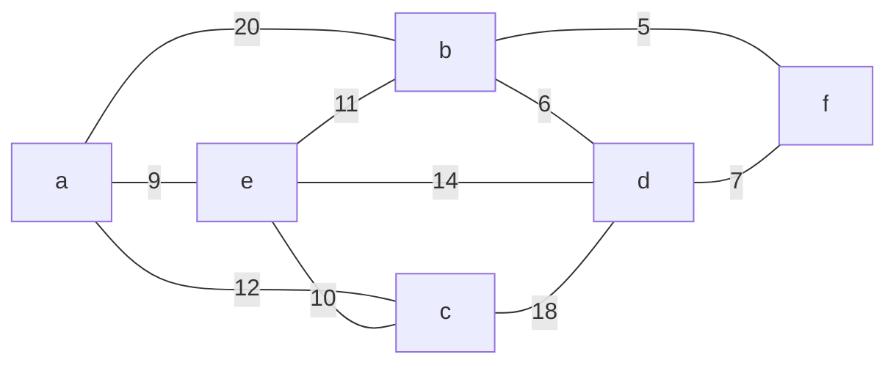

# graph examples

## eg1

undirected graph  

```mermaid
graph LR;
a ---|20| b
a ---|9| e
a ---|12| c
e ---|11| b
e ---|10| c
b ---|6| d
e ---|14| d
c ---|18| d
b ---|5| f
d ---|7| f
```

- 最小生成树

Prim

