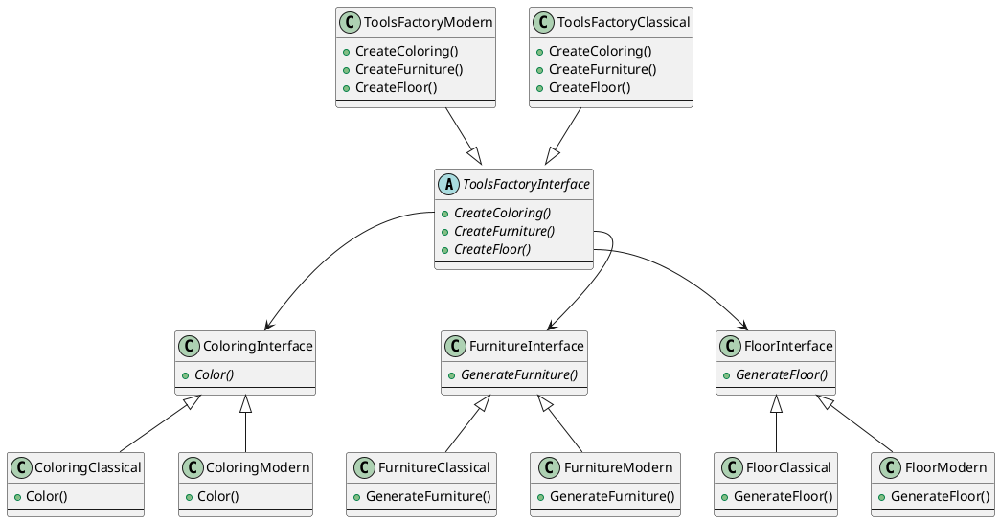
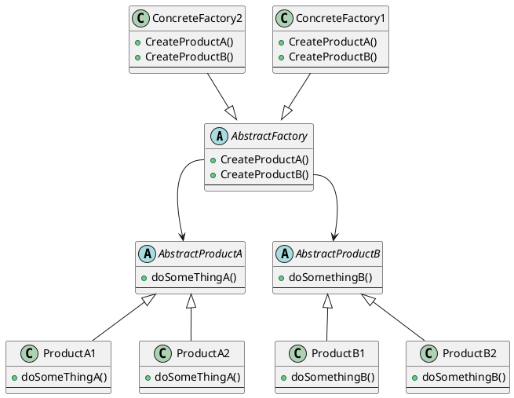

# abstract factory

@ref 

<https://springframework.guru/gang-of-four-design-patterns/abstract-factory-design-pattern/>

## special

用于创建一组对象族，这一组对象设计为一起工作。

用户可以创建一组相关对象，而不用知道这些对象的具体定义以及这些具体对象的名字。

## abstract factory VS factory method

关键区别1：工厂方法仅仅是一个方法，用来生成同一个类型的对象。抽象工厂则是创建一组对象。  
关键区别2：工厂方法使用继承，抽象工厂则使用组合。  

抽象工厂可以看作是工厂的工厂，也即是工厂方法的两次抽象。

从效果上看，工厂方法的工厂用来生成不同的对象，而抽象工厂则可以生产不同的工厂。  
和数学上的函数与复合函数一样，尽管抽象工厂是在工厂方法的基础上的再次抽象，但是两者并没有简单的替换关系。两者均有其适用场景。  

> 参考：  

简单函数：  
$y=f(x)$  

复合函数：  
$y=f[f(x)]$  

## example

假设有一个装修设计工具，这个工具由很多组成件，其中就包括着色器、家具、地板。这些组成件都需要根据当前的设计风格生成对应风格的元素。  

有以下类：  

class ToolsFactoryInterface;
class ToolsFactoryClassical;
class ToolsFactoryModern;

class ColoringInterface;
class ColoringClassical;
class ColoringModern;

class FurnitureInterface;
class FurnitureClassical;
class FurnitureMordern;

class FloorInterface;
class FloorClassical;
class FloorMordern;

class DecorationDesign;

类图如下：

## class diagram

注：

用户使用的是抽象工厂以及抽象产品。  

每一个产品代表一个功能。一般而言，从所有产品的具体实现中抽出一个，组成的是一套一起使用的对象族。

或者说，抽象工厂的某一个实现生产的产品之间是有联系的。  