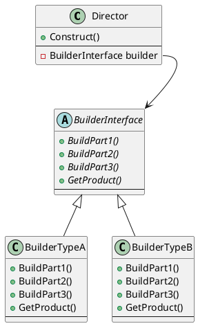
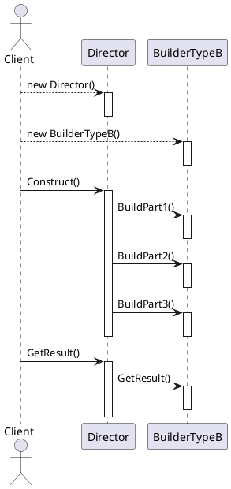
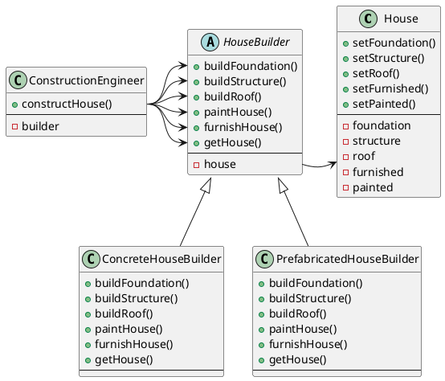

# Builder

## Reference

<https://springframework.guru/gang-of-four-design-patterns/builder-pattern/>

## What is Builder Pattern

Builder 生成器

如果对象的构建具有复杂的步骤，则可以通过生成器模式来确保这一些列复杂步骤的正确进行。  

使用建造工程师来构建目标，从而能确保步骤的正确。  

使用建筑工人来完成具体的建造过程，不同的建筑工人对应不同的产品。  

建造工程师也可以称为导演。  

## Class diagram



## Sequence Diagram



## Example

首先要注意生成器模式是一个创建型模式，因此最终的目的是得到一个产品。产品是建筑工人提供的。  

这里例子中要得到一个房屋，房屋有地基、框架、屋顶、家具、涂料几种属性。  

房屋的生成总是有固定的步骤，包括建造地基、框架、屋顶、家具、粉刷。  

通过一类建筑工人生产一类房屋的方式来构建不同的房屋，通过让导演指挥建筑工人执行各个建造步骤最终得到房屋的方式来控制整个生成流程，同时也达到隐藏建造步骤的目的。  

例子中给出了两类房屋：混凝土和预制件

涉及的类：  

```C++
class House;
class HouseBuilder;
class ConcreteHouseBuilder;
class PrefabricatedHouseBuilder;
class ConstructionEngineer;
```

class diagram



