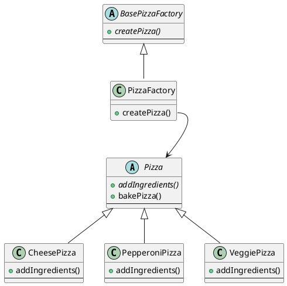

# FactoryMethod

参考来源：

> <https://springframework.guru/gang-of-four-design-patterns/factory-method-design-pattern/>

## What is Factory Method Pattern

FactoryMethod 工厂方法

工厂方法总体而言就是用一个抽象类去创建对象，用抽象类的子类来选择去创建哪个对象。

可以称为延迟实现。

工厂方法的**显著特征是通过类型（比如一个枚举值）去创建对象（而不是通过具体的类去创建对象）**。

注意抽象工厂和工厂方法之间的联系和区别：

见抽象工厂。

## What is the benefits

工厂方法是一个对象创建型模式，用来解决直接创建对象时引入的额外耦合问题。

延迟实现的特征实现了定制化的功能。  

工厂方法封装了对象的创建过程（创建一个什么对象，对象创建后还需要执行哪些步骤）。

## When to use

1. 框架上不知道具体应该实现为哪个类。  
2. 框架希望将实现延迟到子类。  

## Example

实现一个披萨工厂。工厂使用一个抽象接口来生产披萨，而具体生产什么类型的披萨，由接口传入的参数确定。

有以下类：  

```c++
class Pizza;
class CheesePizza;
class PepperoniPizza;
class VeggiePizza;
class BasePizzaFactory;
class PizzaFactory;
```


