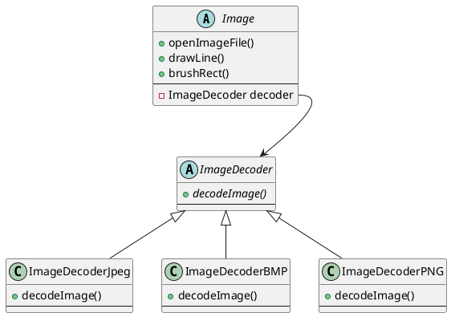

# FactoryMethod

参考来源：

> <https://springframework.guru/gang-of-four-design-patterns/factory-method-design-pattern/>

## What is Factory Method Pattern

FactoryMethod 工厂方法

工厂方法总体而言就是用一个抽象类去创建对象，用抽象类的子类来选择去创建哪个对象。  

可以称为延迟实现。  

## What is the benefits

工厂方法是一个对象创建型模式，用来解决直接创建对象时引入的额外耦合问题。

延迟实现的特征实现了定制化的功能。  

## When to use

1. 框架上不知道具体应该实现为哪个类。  
2. 框架希望将实现延迟到子类。  

## Example

实现一个图片工具，用来对图片进行一些处理。图片的来源是图片文件。  

图片有许多格式，可以将图片的解码步骤实现为一个工厂方法。也即将具体图片格式的解码延迟到子类中去实现。  

有以下类：  

```C++
class Image;
class ImageDecoder;
class ImageDecoderJpeg;
class ImageDecoderBMP;
class ImageDecoderPNG;
```

