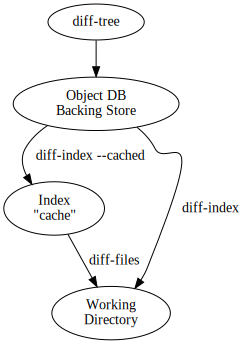

# Git Core Tutorial

## Description

This tutorial explains how to use the "core" Git commands to set up and work with a Git repository.

If  you just need to use Git as a revision control system you may prefer to start with "A Tutorial Introduction to Git".

However, an understanding of these low-level tools can be helpful if you want to understand Git's internals.

The core Git is often called "plumbing", with the prettier user interfaces on top of it called  "porcelain". You may not want to use the plumbing directly very often, but it can be good to know what the plumbing does for when the porcelain isn't flushing.

Back when this document was originally written, many porcelain commands were shell scripts. For simplicity, it still uses them as examples to illustrate how plumbing is fit together to form the porcelain commands. The source tree includes some of these scripts in contrib / examples/ for reference. Although these are not implemented as shell scripts anymore, the description of what the plumbing layer commands do is still valid.

Note: Deeper technical details are often marked as Notes, which you can skip on your first reading.

## Creating a git repository

Creating a new Git repository couldn't be easier: all Git repositories start out empty, and the only thing you need to do is find yourself a subdirectory that you want to use as a working tree - either an empty one for a totally new project, or an existing working tree that you want to import into Git.

For out first example, we're going to start a totally new repository from scratch, with no pre-existing files, and we'll call it git-tutorial. To start up, create a subdirectory for it, change into that subdirectory, and initialize the Git infrastructure with git init:

```bash
mkdir git-tutorial
cd git-tutorial
git init
```

to which Git will reply

```bash
Initialized empty Git repository in .git/
```

which is just Git's way of saying that you haven't been doing anything strange, and that it will have created a local .git directory setup for your new project. You will now have a .git directory, and you can inspect that with ls. For your new empty project, it should show you three entries, among other things:

- a file called HEAD, that has ref: refs/heads/master in it. This is similar to a symbolic link and points at refs/heads/master relative to the HEAD file.
- a subdirectory called objects, which will contain all the objects of your project. You should never have any real reason to look at the objects directly, but you might want to know that these objects are what contains all the real data in your repository.
- a subdirectory called refs, which contains references to objects.

In particular, the refs subdirectory will contain two other subdirectories, named heads and tags respectively. They do exactly what their names imply: they contain references to any number of different heads of development, and to any tags that you have created to name specific versions in your repository.

One note: the special master head is the default branch, which is why the .git/HEAD file created points to it even if it doesn't yet exist. Basically, the HEAD link is supposed to always point to the branch you are working on right now, and you always start out expecting to work on the master branch.

However, this is only a convention, and you can name you branches anything you want, and don't have to ever even have a master branch, A number of the Git tools will assume that  .git/HEAD is valid, though.

Note: An object is identified by its 160-bit SHA-1 hash, aka object name, and a reference to an object is always the 40-byte hex representation of that SHA-1 name. The files in the refs subdirectory are expected to contain these hex references (usually with a final \n at the end), and you should thus expect to see a number of 41-byte files containing these references in these refs subdirectories when you actually start populating your tree.

Note: An advanced user may want to take a look at gitrepository-layout after finishing this tutorial.

You have now created your first Git repository. Of course, since it's empty, that's not very useful, so let's start populating it with data.

### Populating a git repository

We'll keep this simple and stupid, so we'll start off with populating a few trivial files just to get a feel for it.

Start off with just creating any random files that you want to maintain in your Git repository. We'll start off with a few bad examples, just to get a feel for how this works:

```bash
echo "Hello World" > hello
echo "Silly example" > example
```

You have now created two files in your working tree (aka working directory), but to actually check in your hard work, you will have to go through two steps:

- fill in the index file (aka cache) with the information about your working tree state.
- commit that index file as an object.

The first step is trivial: when you want to tell Git about any changes to your working tree, you use the git update-index program. That program normally just takes a list of filenames you want to update, but to avoid trivial mistakes, it refuses to add new entries to the index (or remove existing ones) unless you explicitly tell it that you're adding a new entry with the --add flag (or removing an entry with the --remove) flag.

So to populate the index with the two files you just created, you can do 

```bash
git update-index --add hello example
```

and you have now told Git to track those two files.

In fact, as you did that, if you now look into your object directory, you'll notice that Git will have added two new objects to the object database. if you did exactly the steps above, you should now be able to do

```bash
ls .git/objects/??/*
```

and see two files:

```bash
.git/objects/55/7db03de997c86a4a028e1ebd3a1ceb225be238
.git/objects/f2/4c74a2e500f5ee1332c86b94199f52b1d1d962
```

which correspond with the objects with names of 557db... and f24c7... respectively.

If you want to, you can use git cat-file to look at those objects, but you'll have to use the object name, not the filename of the object:

```bash
git cat-file -t 7db03de997c86a4a028e1ebd3a1ceb225be238
```

where the -t tells git cat-file to tell you what the "type" of the object is. Git will tell you that you have a "blob" object (i.e., just a regular file), and you can see the contents with

```bash
git cat-file blob 557db03
```

which will print out "Hello World". The object 557db03 is nothing more than the contents of your file hello.

Note: Don't confuse that object with the file hello itself. The object is literally just those specific contents of the file, and however much you later change the contents in file hello, the object we just looked at will never change. Objects are immutable.

Note: The second example demonstrates that you can abbreviate the object name to only the first several hexadecimal digits in most places.

Anyway, as we mentioned previously, you normally never actually take a look at the objects themselves, and typing long 40-character hex names is not something you'd normally want to do. The above digression was just to show that git update-index did something magical, and actually saved away the contents of your files into the Git object database.

Updating the index did something else too: it created a .git/index file. This is the index that describes your current working tree, and something you should be very aware of. Again, you normally never worry about the index file itself, but you should be aware of the fact that you have not actually really "checked in" your files into Git so far, you've only told Git about them.

However, since Git knows about them, you can now start using some of the most basic git commands to manipulate the files or look at their status.

In particular, let's not even check in the two files into Git yet, we'll start off by adding another line to hello first: 

```bash
echo "It's a new day for git" >> hello
```

and you can now, since you told Git about the previous state of hello, ask Git what has changed in the tree compared to your old index, using the git diff-files command:

```bash
git diff-files
```

Oops. That wasn't very readable. It just spit out its own internal version of a diff, but that internal version really just tells you that it has noticed that "hello" has been modified, and that the old object contents it had have been replaced with something else.

To make it readable, we call tell git diff-files to output the differences as a patch, using the -p flag:

```bash
git diff-files -p
diff --git a/hello b/hello
index 557db03..263414f 10064
--- a/hello
+++ b/hello
@@ -1 +1,2 @@
 Hello World
+It's a new day for git
```

i.e. the diff of the change we caused by adding another line to hello.

### Committing git state

Now, we want to go to the next stage in Git, which is to take the files that Git knows about in the index, and commit them as a real tree. We do that in two phases: creating a tree object, and committing that tree object as a commit object together with an explanation of what the tree was all about, along with information of how we came to that state.

Creating a tree object is trivial, and is done with git write-tree. There are no options or other input: git write-tree will take the current index state, and write an object that describes that whole index. In other words, we're now tying together all the different filenames with their contents (and their permissions), and we're creating the equivalent of a Git "directory" object:

```bash
git write-tree
```

and this will just output the name of the resulting tree, in this case (if you have done exactly as I've described) it should be 

```bash
8988da15d077d4829fc51d8544c097def6644dbb
```

which is another incomprehensible object name. Again, if you want to, you can use git cat-file -t 8988d... to see that this time the object is not a "blob" object, but a "tree" object (you can also use git cat-file to actually output the raw object contents, but you'll see mainly a binary mess, so that's less interesting).

However - normally you'd never use git write-tree on its own, because normally you always commit a tree into a commit object using the git commit-tree command. In fact, it's easier to not actually use git write-tree on its own at all, but to just pass its result in as an argument to git commit-tree.

git commit-tree normally takes several arguments - it wants to know what the parent of a commit was, but since this is the first commit ever in this new repository, and it has no parents, we only need to pass in the object name of the tree. However, git commit-tree also wants to get a commit message on its standard input, and it will write out the resulting object name for the commit to its standard output.

And this is where we create the .git/refs/heads/master file which is pointed at by HEAD. This file is supposed to contain the reference to the top-of-tree of the master branch, and since that's exactly what git commit-tree spits out, we can do this all with a sequence of simple shell commands:

```bash
tree=$(git write-tree)
commit=$(echo 'Initial commit' | git commit-tree $tree)
git update-ref HEAD $commit
```

In this case this creates a totally new commit that is not related to anything else. Normally you do this only once for a project ever, and all later commits will be parented on top of an earlier commit.

Again, normally you'd never actually do this by hand. There is a helpful script called git commit that will do all of this for you. So you could have just written git commit instead, and it would have done the above magic scripting for you.

### Making a change

Remember how we did the git update-index on file hello and then we changed hello afterward, and could compare the new state of hello with the state we saved in the index file?

Further, remember how I said that git write-tree writes the contents of the index file to the tree, and thhus what we just committed was in fact the original contents of the file hello, not the new ones. We did that on purpose, to show the difference between the index state, and the state in the working tree, and how they don't have to match, even when we commit things.

As before, if we do git diff-files -p in our git-tutorial project, we'll still see the same difference we saw last time: the index file hasn't changed by the act of committing anything. However, now that we have committed something, we can also learn to use a new command: git diff-index.

Unlike git diff-files, which showed the difference betweeen the index file and the working tree, git diff-index shows the differences between a committed tree and either the index file or the working tree. In other words, git diff-index wants a tree to be diffed against, and before we did the commit, we couldn't do that, because we didn't have anything to diff against.

But now we can do

```bash
git diff-index -p HEAD
```

(where -p has the same meaning as it did in git diff-files), and it will show us the same difference, but for a totally different reason. Now we're comparing the working tree not against the index file, but against the tree we just wrote. It just so happens that those two are obviously the same, so we get the same result.

Again, because this is a common operation, you can also just shorthand it with

```bash
git diff HEAD
```

which ends up doing the above for you.

In other words, git diff-index normally compares a tree against the working tree, but when given the --cached flag, it is told to instead compare against just the index cache contents, and ignore the current working tree state entirely. Since we jsut wrote the index file to HEAD, doing git diff-index --cached -p HEAD should thus return an empty set of differences, and that's exantly what it does.

Note

git diff-index really always uses the index for its comparisons, and saying that it compares a tree against the working tree is thus not strictly accurate. In particular, the list of files to compare (the "meta-data") always comes from the index file, regardless of whether the --cached flag is used or not. The --cached flag really only determines wheter the file contents to be compared come from the working tree or not.

This is not hard to understand, as soon as you realize that Git simply never knows (or cares) about files that it is not told about explicitly. Git will never go looking for files to compare, it expects you to tell it what the files are, and that's what the index is there for.

However, our next step is to commit the change we did, and again, to understand what's going on, keep in mind the difference between "working tree contents", "index file" and "committed tree". We have changes in the working tree that we want to commit, and we always have to work through the index file, so the first thing we need to do is to update the index cache:

```bash
git update-index hello
```

(note how we didn't need the --add flag this time, since Git knew about the file already).

Note what happens to the different git diff-* versions here. After we've updated hello in the index, git diff-files -p now shows no differneces, but git diff-index -p HEAD still dees show that the current state is different from the sate we committed. In fact, now git diff-index shows the same difference whether we use the --cached flag or not, since now the index is coherent with the working tree.

Now, since we've updated hello in the index, we can commit the new version. We could do it by writing the tree by hand again, and committing the tree (this time we'd have to use the -p HEAD flag to tell commit that the HEAD was the parent of the new commit, and that this wasn't an initial commit any more), but you've done that once already, so let's just use the helpful script this time:

```bash
git commit
```

which starts an editor for you to write the commit message and tells you a bit about what you have done. 

Write whatever message you want, and all the lines that start with # will be pruned out, and the rest will be used as the commit message for the change. If you decide you dont't want to commit anything after all at this point (you can continue to edit things and update the index), you can just leave an empty message. Otherwise git commit will commit the change for you.

You've now made your first real Git commit. And if you're interested in looking at what git commit really does, feel free to investigate: it's a few very simple shell scripts to generate the helpful (?) commit message headers, and a few one-liners that actually do the commit itself (git commit).

### Inspecting changes

While creating changes is useful, it's even more useful if you can tell later what changed. The most useful command for this is another of the diff family, namely git diff-tree.

git diff-tree can be given two arbitrary trees, and it will tell you the differences between them. Perhaps even more commonly, though, you can give it just a single commit object, and it will figure out the parent of that commit itself, and show the difference directly. Thus, to get the same diff that we've already seen several times, we can now do

```bash
git diff-tree -p HEAD
```

(again, -p means to show the difference as a human-readable pathc), and it will show what the last commit (in HEAD) actually changed.

Note

Here is a graph that illustrates how various diff-* commands compare things.



More interestingly, you can also give git diff-tree the --pretty flag, which tells it to also show the commit message and author and date of the commit, and you can tell it to show a whole series of diffs. Alternatively, you can tell it to be "silent", and not show the diffs at all, but just show the actual commit message.

In fact, together with the git rev-list program (which generates a list of revisions), git diff-tree ends up being a veritable fount of changes. You can emulate git log, git log -p, etc. with a trivial script that pipes the output of git rev-list to git diff-tree --stdin, which was exactly how early versions of git log were implemented.

### Tagging a version

In Git, there are two kinds of tags, a "light" one, and an "annotated tag".

A "light" tag is technically nothing more than a branch, except we put it in the .git/refs/tags/ subdirectory instead of calling it a head. So the simplest form of tag involves nothing more than

```bash
git tag my-first-tag
```

which just writes the current HEAD into the .git/refs/tags/my-first-tag file, after which point you can then use this symbolic name for that particular state. You can, for example, do

```bash
git diff my-first-tag
```

to diff your current state against that tag which at this point will obviously be an empty diff, but if you continue to develop and commit stuff, you can use your tag as an "anchor-point" to see what has changed since you tagged it.

An "annotated tag" is actually a real Git object, and contains not only a pointer to the state you want to tag, but also a small tag name and message, along with optionally a PGP signature that says that yes, you really did that tag. You create these annotated tags with either the -a or -s flag to git tag:

```bash
git tag -s <tagname>
```

which will sign the current HEAD (but you can also give it another argument that specifies the thing to tag, e.g., you could have tagged the current my-branch point by using git tag <tagname> my-branch).

You normally only do signed tags for major releases or things like that , while the light-weight tags are useful for any marking you want to do - any time you decide that you want to remember a certain point, just create a private tag for it, and you have a nice symbolic name for the state at that point.

### Copying repositories

Git repositories are normally totally self-sufficient and relocatable. Unlike CVS, for example, there is no separate notion of "repository" and "working tree". A Git repository normally is the working tree, with the local Git information hidden in the .git subdirectory. There is nothing else. What you see is what you got.

> Note

> You can tell Git to split the Git internal information from the directory that it tracks, but we'll ignore that for now: it's not how normal projects work, and it's really only meant for special uses. So the mental model of "the Git information is always tied directly to the working tree that it describes" may not be technically 100% accurate, but it's a good model for all normal use.

This has two implications:

- If you grow bored with the tutorial repository you created (or you've made a mistake and want to start all over), you can just do simple

  ```bash
  rm -rf git-tutorial
  ```

  and it will be gone. There's no external repository, and there's no history outside the project you created.

- if you want to move or duplicate a Git repository, you can do so. There is git clone command, but if all you want to doo is just to create a copy of your repository (with all the full history that went along with it), you can do so with a regular cp -a git-tutorial new-git-tutorial.

  Note that when you've moved or copied a Git repository, your Git index file (which caches various information, notably some of the "stat" information for the files involved) will likely need to be refreshed. So after you do a cp -a to create a new copy, you'll want to do

  ```bash
  git update-index --refresh
  ```

  in the new repository to make sure that the index file is up to date.

Note that the second point is true even across machines. You can duplicate a remote Git repository with any regular copy mechanism, be it scp, rsync or wget.

When copying a remote repository, you'll want to at a minimum update the index cache when you do this, and especially with other peoples' repositories you often want to make sure that the index cache is in some known state (you don't know what they've done and not yet checked in), so usually you'll precede the git update-index with a

```bash
git read-tree --reset HEAD
git update-index --refresh
```

which will force a total index re-build from the tree pointed to by HEAD. It resets the index contents to HEAD, and then the git update-index makes sure to match up all index entries with the check-out files. If the original repository had uncommitted changes in its working tree, git update-index --refresh notices them and tells you they need to be updated.

The above can also be written as simply

```bash
git reset
```

and in fact a lot of the common Git command combinations can be scripted with the git xyz interfaces. You can learn things by just looking at what the various git scripts do. For example, git reset used to be the above two lines implemented in git reset, but some things like git status and git commit are slightly more complex scripts around the basic Git commands.

Many public remove repositories will not contain any of the checked out files or even an index file, and will only contain the actual core Git files. Such a repository usually doesn't even have the .git subdirectory, but has all the Git files directly in the repository.

To create your own local live copy of such a "raw" Git repository, you'd first create your own subdirectory for the project, and then copy the raw repository contents into the .git directory. For example, to create your own copy of the Git repository, you'd do the following

```bash
mkdir my-git
cdd my-git
rsync -rL rsync://rsync.kernel.org/pub/scm/git/git.git/ .git
```

followed by

```bash
git read-tree HEAD
```

to populate the index. However, now you have populated the index, and you have all the Git internal files, but you will notice that you don't actually have any of the working tree files to work on. To get those, you'd check them out with

```bash
git checkout-index -u -a
```

where the -u flag means that you want the checkout to keep the index up to date (so that you don't have to refresh it afterward), and the -a flag means "check out all files" (if you have a stale copy or an older version of a checked out tree you may also need to add the -f flag first, to tell git checkout-index to force overwriting of any old files).

Again, this can all be simplified with

```bash
git clone git://git.kernel.org/pub/scm/git/git.git/ my-git
cd my-git
git checkout
```

which will end up doing all of the above for you.

You have now successfully copied somebody else's (mine) remove repository, and checked it out.

### Creating a new branch

Branches in Git are really nothing more than pointers into the Git object database from within the .git/refs/ subdirectory, and as we already discussed, the HEAD branch is nothing but a symlink to one of these object pointers.

You can at any time create a new branch by just picking an arbitrary point in the project history, and just writing the SHA-1 name of that object into a file under .git/refs/heads/. You can use any filename want (and indeed, subdirectories), but the convention is that the "normal" branch is called amaster. That's just a convention, though, and nothing enforces it.

To show that as an example, let's go back to the git-tutorial repository we used earlier, and create a branch in it. You do that by simply just saying that you want to check out a new branch:

```bash
git switch -c mybranch
```

will create a new branch based at the current HEAD position, and switch to it.

> Note 
>
> If you make the decision to start your new branch at some other point in the history than the current HEAD, you can do so by just telling git switch what the base of the checkout would be. In other words, if you have an earlier tag or branch, you'd just do 
>
> ```bash
> git switch -c mybrach earlier-commit
> ```
>
> and it would create the new branch mybranch at the earlier commit, and check out the state at that time.

You can always just jump back to your original master branch by doing 

```bash
git switch master
```

(or any other branch-name, for that matter) and if you forget which branch you happen to be on, a simple

```bash
cat .git/HEAD
```

will tell you where it's pointing. To get the list of branches you have, you can say 

```bash
git branch
```

which used to be nothing more than a simple script around ls .git/refs/heads. There will be an asterisk in front of the branch you are currently on.

Sometimes you may wish to create a new branch without actually checking it out and switching to it. If so, just use the command

```bash
git branch <branchname> [startingpoint]
```

which will simply create the branch, but will not do anything further. You then later - once you decide that you want to actually develop on that branch - switch to that branch with a regular git switch with the branchname as the argument.

## Merging two branches

One of the ideas of having a branch is that you so some (possibly experimental) wirk in it, and eventually merge it back to the main branch. So assuming you created the above mybranch that started out being the same as the original master branch, let's make sure we're in that branch, and do some work there.

```bash
git switch mybranch
echo "Wrok, work, work" >> hello
git commit -m "Some work." -i hello
```

Here, we just added another line to hello, and we used a shorthand for doing both git update-index hello and git commit by just giving the filename directly to git commit, with an -i flag (it tells Git to include that file in addition to what you have done to the index file so far when making the commit). The -m flag is to give the commit log message from the command line.

Now, to make it a bit more interesting, let's assume that somebody else does some work in the original branch, and simulate that by going back to the master branch, and editing the same file differently there:

```bash
git switch master
```

Here, take a moment to look at the contents of hello, and notice how they don't contain the work we just did in mybranch - because that work hasn't happened in the master branch at all. Then do

```bash
echo "Play, play, play" >> hello
echo "Lots of fun" >> example
git commit -m "Some fun." -i hello example
```

since the master branch is obviously in a much better mood.

Now, you've got two branches, and you decide that you want to merge the work done. Before we do that, let's introduce a cool graphical tool that helps you view what's going on:

```bash
gitk --all
```

will show you graphically both of your branches (that's what the --all means: normally it will just show you your current HEAD) and their histories. You can also see exactly how they came to be from a common source.

Anyway, let's exit gitk (^Q or the File menu), and decide that we want to merge the work we did on the mybranch branch into the master branch (which is currently our HEAD too). To do that, 

